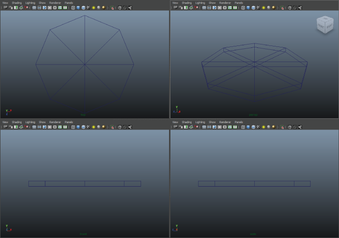

# 第十二章：使用 GAN 重建 3D 模型

到目前为止，我们已经学习了如何使用 GAN 合成图像、文本和音频。现在，是时候探索 3D 世界并学习如何使用 GAN 创建令人信服的 3D 模型了。

在本章中，你将学习 3D 物体在**计算机图形学**（**CG**）中的表示方法。我们还将深入了解 CG 的基本概念，包括相机和投影矩阵。在本章结束时，你将学会如何创建和训练 3D_GAN，以生成 3D 物体的点云，如椅子。

你将了解 3D 物体表示的基本知识和 3D 卷积的基本概念。然后，你将学习如何通过 3D 卷积构建 3D-GAN 模型，并训练它生成 3D 物体。你还将熟悉 PrGAN，这是一种基于物体的黑白 2D 视图生成 3D 物体的模型。

本章将涵盖以下主题：

+   计算机图形学的基本概念

+   设计用于 3D 数据合成的 GAN

# 计算机图形学的基本概念

在前面的章节中，我们学习了关于图像、文本和音频的各种 GAN 模型。通常，我们一直在处理 1D 和 2D 数据。在本章中，我们将通过研究 3D 领域，扩展我们对 GAN 世界的理解。在本章结束时，你将学会如何使用 GAN 创建自己的 3D 物体。

# 3D 物体的表示

在我们深入了解用于 3D 数据合成的 GAN 模型细节之前，必须理解 3D 物体在计算机中的表示方法。3D 物体、环境和动画的创建与渲染被称为**计算机图形学**（**CG**），这是视频游戏和电影两个主要娱乐产业所依赖的领域。CG 中最重要的任务是如何高效地渲染出最逼真的图像。得益于 CG 领域从业者的辛勤工作，我们现在在视频游戏和电影中获得了更好的视觉效果。

# 3D 物体的属性

一个 3D 物体最基本的属性是其形状和颜色。我们在屏幕上看到的每个像素的颜色受多种因素的影响，例如其纹理本身的颜色、光源，甚至场景中的其他物体。这也受到光源和我们视角与像素自身表面相对方向的影响，这些方向由物体的形状、位置、朝向以及相机的位置决定。至于形状，3D 模型基本由点、线和面组成。下面的图像展示了如何创建一个 3D 跑车的形状和颜色：


在 Autodesk Maya 中创建一辆跑车，展示了线条如何形成表面，以及纹理如何在 3D 模型中提供颜色

表面，无论是平坦的还是曲面的，大多由三角形和四边形（通常称为**多边形**）组成。多边形网格（也称为**线框**）由一组 3D 点和连接这些点的一组段定义。通常情况下，多边形越多，3D 模型中的细节就越多。这可以从以下图像中看出：


在 3D 模型中，多边形数量越多，细节就越丰富。由 Autodesk Maya 捕获的图像。

有时，一组点（在某些应用程序中称为**点云**）就足以创建 3D 对象，因为有几种广泛使用的方法可以自动创建段以生成多边形网格（例如 Delaunay 三角剖分方法）。点云通常用于表示 3D 扫描仪收集的结果。点云是一组三维向量，表示每个点的空间坐标。在本章中，我们只关注使用 GAN 生成特定对象的点云。以下图像展示了几个椅子的点云示例：


椅子的点云

# 摄像机和投影

一旦定义了 3D 对象的形状和颜色，仍然有一个重要因素会影响它们在屏幕上的显示：**摄像机**。摄像机负责将 3D 点、线和表面映射到通常是我们的屏幕上的 2D 图像平面。如果摄像机配置不正确，我们可能根本看不到我们的对象。从 3D 世界映射到 2D 图像平面的过程称为**投影**。

在 CG 领域中有两种常用的投影方法：正交投影和透视投影。现在让我们来了解它们：

+   **正交投影**是一种将长方体（即矩形体积）中的所有内容映射到标准立方体中的过程。有关正交投影和透视投影的更多信息，请参阅[`www.songho.ca/opengl/gl_projectionmatrix.html`](http://www.songho.ca/opengl/gl_projectionmatrix.html)。

在正交投影中，3D 空间中所有平行线在 2D 平面中仍然是平行的，只是长度和方向不同。更重要的是，同一对象的投影图像尺寸始终相同，无论它离摄像机有多远。然而，这并不是我们的眼睛和大多数摄像机捕捉 3D 世界图像的方式。因此，正交投影主要用于**计算机辅助设计**（**CAD**）和其他工程应用中，需要正确呈现组件的实际大小。

+   **透视投影**是一种将截头体中的所有物体（即去掉顶部的金字塔）映射到标准立方体的过程，如上图所示。在透视投影中，离摄像机近的物体看起来比远离摄像机的物体大。因此，3D 空间中的平行线在 2D 空间中不一定平行。这也是我们眼睛感知周围环境的方式。因此，这种投影方式能给我们更逼真的图像，常用于视频游戏和电影中的视觉效果渲染。

正射投影和透视投影在一些计算机图形软件中是一起使用的，例如 Autodesk Maya，如下图所示：



在 Autodesk Maya 的用户界面中，使用正射投影来显示顶部、侧面和正面视图（左上、左下和右下），而使用透视投影来预览 3D 模型（右上）。图片来自 https://knowledge.autodesk.com/support/maya/learn-explore/caas/simplecontent/content/maya-tutorials.html

本章我们将重点讲解透视投影。在计算机图形学中，经常使用**齐次坐标**，它可以方便地表示无限距离，并通过简单的矩阵乘法实现平移、缩放和旋转。对于一组齐次坐标 ，其对应的笛卡尔坐标系为 。从 3D 空间的截头体到  立方体的映射由**投影矩阵**定义：


在投影矩阵中，  是近裁剪平面，  是远裁剪平面。此外， 、 、  和  分别表示近裁剪平面的顶部、底部、左侧和右侧边界。投影矩阵与齐次坐标的相乘给我们提供了投影点应该落在的对应坐标。如果你对投影矩阵的推导感兴趣，可以参考以下文章：[`www.songho.ca/opengl/gl_projectionmatrix.html`](http://www.songho.ca/opengl/gl_projectionmatrix.html)。

# 设计用于 3D 数据合成的生成对抗网络（GAN）

3D-GAN 是由 Jiajun Wu、Chengkai Zhang、Tianfan Xue 等人在他们的论文*Learning a Probabilistic Latent Space of Object Shapes via 3D Generative-Adversarial Modeling*中提出的，旨在生成特定类型物体的 3D 点云。3D-GAN 的设计和训练过程与传统的 GAN 非常相似，不同之处在于 3D-GAN 的输入和输出张量是五维的，而不是四维的。

# 3D-GAN 中的生成器和判别器

3D-GAN 的生成器网络架构如下：


3D-GAN 中生成器网络的架构

生成器网络由五个反卷积层（`nn.ConvTranspose3d`）组成，其中前四个层后跟 Batch Normalization 层（`nn.BatchNorm3d`）和 ReLU 激活函数，最后一层后跟 Sigmoid 激活函数。在所有反卷积层中，卷积核大小、步长和填充大小分别设置为 4、2 和 1。在这里，输入的潜在向量可以逐步扩展到一个！[](img/4d4d6b88-58ab-4d09-b2aa-5c0e597be316.png)立方体，这可以视为一个 1 通道的 3D“图像”。在这个 3D 图像中，“像素”值实际上表示某个点在这些！[](img/b444fc1b-f235-492c-930e-2e383c030969.png)网格位置上是否存在的可能性。通常，我们会保留所有值高于 0.5 的点来形成最终的点云。

在我们的案例中，3D 图像中的“像素”实际上被称为**体素**。

由于我们点云中的点位于！[](img/b444fc1b-f235-492c-930e-2e383c030969.png)立方体的网格点上。每个体素有四个属性：x、y 和 z 坐标，以及该体素是否存在于（x, y, z）位置。与 2D 图像合成任务（如 MNIST）不同，在这些任务中像素的值可以在 0 到 1 之间（或者，如果你喜欢的话，也可以在 0 到 255 之间，例如数字边缘的像素），体素的存在是一个二元决策。因此，我们的点云张量实际上是稀疏的，包含许多零和少数的 1。

在本节中，我们将提供 3D-GAN 的完整源代码。代码文件已按照与前几章相同的方式进行组织。网络已在`model_3dgan.py`文件中定义（请确保模块名称不要以数字开头）。

以下代码是`Generator`的定义：

```py
import torch
import torch.nn as nn
import torch.nn.functional as F
import numpy as np

class Generator(nn.Module):
    def __init__(self, latent_dim, cube_len, bias=False):
        super(Generator, self).__init__()
        self.latent_dim = latent_dim
        self.cube_len = cube_len

        self.model = nn.Sequential(
            *self._create_layer(self.latent_dim, self.cube_len*8, 4, stride=2, padding=1, bias=bias, transposed=True),
            *self._create_layer(self.cube_len*8, self.cube_len*4, 4, stride=2, padding=1, bias=bias, transposed=True),
            *self._create_layer(self.cube_len*4, self.cube_len*2, 4, stride=2, padding=1, bias=bias, transposed=True),
            *self._create_layer(self.cube_len*2, self.cube_len, 4, stride=2, padding=1, bias=bias, transposed=True),
            *self._create_layer(self.cube_len, 1, 4, stride=2, padding=1, bias=bias, transposed=True, last_layer=True)
        )

    def _create_layer(self, size_in, size_out, kernel_size=4, stride=2, padding=1, bias=False, transposed=True, last_layer=False):
        layers = []
        if transposed:
            layers.append(nn.ConvTranspose3d(size_in, size_out, kernel_size, stride=stride, padding=padding, bias=bias))
        else:
            layers.append(nn.Conv3d(size_in, size_out, kernel_size, stride=stride, padding=padding, bias=bias))
        if last_layer:
            layers.append(nn.Sigmoid())
        else:
            layers.append(nn.BatchNorm3d(size_out))
            layers.append(nn.ReLU(inplace=True))
        return layers

    def forward(self, x):
        x = x.view(-1, self.latent_dim, 1, 1, 1)
        return self.model(x)
```

3D-GAN 的判别器网络架构如下：


3D-GAN 中判别器网络的架构

判别网络由五个卷积层（`nn.Conv3d`）组成，其中前四个卷积层后跟一个批归一化层和一个 Leaky-ReLU（`nn.LeakyReLU`）激活函数，最后一层后跟一个 Sigmoid 激活函数。所有卷积层的卷积核大小、步幅和填充大小分别设置为 4、2 和 1。判别网络将 3D 点云的  立方体映射为一个单一的值，用于指定输入对象的可信度是否为真实。

想象一下，如果点云的维度设置为  会发生什么。你能创建带颜色的 3D 点云，比如火焰、烟雾或云彩吗？可以随意查找或甚至创建你自己的数据集来试试这个！

以下代码是 `Discriminator` 的定义（也可以在 `model_3dgan.py` 文件中找到）：

```py
class Discriminator(nn.Module):
    def __init__(self, cube_len, bias=False):
        super(Discriminator, self).__init__()
        self.cube_len = cube_len

        self.model = nn.Sequential(
            *self._create_layer(1, self.cube_len, 4, stride=2, padding=1, bias=bias, transposed=False),
            *self._create_layer(self.cube_len, self.cube_len*2, 4, stride=2, padding=1, bias=bias, transposed=False),
            *self._create_layer(self.cube_len*2, self.cube_len*4, 4, stride=2, padding=1, bias=bias, transposed=False),
            *self._create_layer(self.cube_len*4, self.cube_len*8, 4, stride=2, padding=1, bias=bias, transposed=False),
            *self._create_layer(self.cube_len*8, 1, 4, stride=2, padding=1, bias=bias, transposed=False, last_layer=True)
        )

    def _create_layer(self, size_in, size_out, kernel_size=4, stride=2, padding=1, bias=False, transposed=False, last_layer=False):
        layers = []
        if transposed:
            layers.append(nn.ConvTranspose3d(size_in, size_out, kernel_size, stride=stride, padding=padding, bias=bias))
        else:
            layers.append(nn.Conv3d(size_in, size_out, kernel_size, stride=stride, padding=padding, bias=bias))
        if last_layer:
            layers.append(nn.Sigmoid())
        else:
            layers.append(nn.BatchNorm3d(size_out))
            layers.append(nn.LeakyReLU(0.2, inplace=True))
        return layers

    def forward(self, x):
        x = x.view(-1, 1, self.cube_len, self.cube_len, self.cube_len)
        return self.model(x)
```

# 训练 3D-GAN

3D-GAN 的训练过程类似于传统 GAN 的训练过程。从以下图示可以看出：


3D-GAN 的训练过程。在这里，x* 表示真实数据，x 表示伪造数据，z 表示潜在向量。参数会被更新的网络用红色边界标出。

首先，训练判别网络来将真实的 3D 点云识别为真实数据，将由生成器网络生成的合成点云识别为伪造数据。判别网络使用 BCE 损失（`nn.BCELoss`）作为损失函数。然后，通过强迫判别器将合成的 3D 点云识别为真实数据来训练生成器网络，这样生成器就能学会在未来更好地欺骗判别器。训练生成器网络时也使用 BCE 损失。

以下是 3D-GAN 训练的部分源代码。创建一个 `build_gan.py` 文件并将以下代码粘贴到该文件中。部分训练技巧来自 [`github.com/rimchang/3DGAN-Pytorch`](https://github.com/rimchang/3DGAN-Pytorch)，我们稍后会进行讨论：

```py
import os
import time
from datetime import datetime
import torch
from torch.optim.lr_scheduler import MultiStepLR
import utils
from model_3dgan import Generator as G
from model_3dgan import Discriminator as D
import matplotlib
import matplotlib.pyplot as plt
import numpy as np
import pickle

class Model(object):
    def __init__(self, name, device, data_loader, latent_dim, cube_len):
        self.name = name
        self.device = device
        self.data_loader = data_loader
        self.latent_dim = latent_dim
        self.cube_len = cube_len
        assert self.name == '3dgan'
        self.netG = G(self.latent_dim, self.cube_len)
        self.netG.to(self.device)
        self.netD = D(self.cube_len)
        self.netD.to(self.device)
        self.optim_G = None
        self.optim_D = None
        self.scheduler_D = None
        self.criterion = torch.nn.BCELoss()

    def create_optim(self, g_lr, d_lr, alpha=0.5, beta=0.5):
        self.optim_G = torch.optim.Adam(self.netG.parameters(),
                                        lr=g_lr,
                                        betas=(alpha, beta))
        self.optim_D = torch.optim.Adam(self.netD.parameters(),
                                          lr=d_lr,
                                          betas=(alpha, beta))
        self.scheduler_D = MultiStepLR(self.optim_D, milestones=[500,  
         1000])

    def train(self, epochs, d_loss_thresh, log_interval=100, 
       export_interval=10, out_dir='', verbose=True):
        self.netG.train()
        self.netD.train()
        total_time = time.time()
        for epoch in range(epochs):
            batch_time = time.time()
            for batch_idx, data in enumerate(self.data_loader):
                data = data.to(self.device)

                batch_size = data.shape[0]
                real_label = torch.Tensor(batch_size).uniform_(0.7, 
                  1.2).to(self.device)
                fake_label = torch.Tensor(batch_size).uniform_(0, 
                  0.3).to(self.device)

                # Train D
                d_real = self.netD(data)
                d_real = d_real.squeeze()
                d_real_loss = self.criterion(d_real, real_label)

                latent = torch.Tensor(batch_size, 
                  self.latent_dim).normal_(0, 0.33).to(self.device)
                fake = self.netG(latent)
                d_fake = self.netD(fake.detach())
                d_fake = d_fake.squeeze()
                d_fake_loss = self.criterion(d_fake, fake_label)

                d_loss = d_real_loss + d_fake_loss

                d_real_acc = torch.ge(d_real.squeeze(), 0.5).float()
                d_fake_acc = torch.le(d_fake.squeeze(), 0.5).float()
                d_acc = torch.mean(torch.cat((d_real_acc, d_fake_acc),0))

                if d_acc <= d_loss_thresh:
                    self.netD.zero_grad()
                    d_loss.backward()
                    self.optim_D.step()

                # Train G
                latent = torch.Tensor(batch_size, 
                  self.latent_dim).normal_(0, 0.33).to(self.device)
                fake = self.netG(latent)
                d_fake = self.netD(fake)
                d_fake = d_fake.squeeze()
                g_loss = self.criterion(d_fake, real_label)

                self.netD.zero_grad()
                self.netG.zero_grad()
                g_loss.backward()
                self.optim_G.step()

            if epoch % export_interval == 0:
                samples = fake.cpu().data[:8].squeeze().numpy()
                utils.save_voxels(samples, out_dir, epoch)
            self.scheduler_D.step()
```

你可能注意到 `real_label` 和 `fake_label` 并不像通常那样设置为 1 和 0。相反，使用了随机初始化的标签（`uniform_(0.7, 1.2)` 和 `uniform_(0, 0.3)`）。这种技术与 **软标签** 非常相似，它使用更大网络的 softmax 输出作为标签（而不是“硬”标签 0 或 1），来训练一个较小但输入输出映射相同的网络（这被称为 **知识蒸馏**）。这个技巧随着时间的推移生成了一个更加平滑的损失函数，因为它假设标签是随机变量。你总是可以随机初始化 `real_label`，并让 `fake_label` 等于 `1-real_label`。

我们已经知道期望的输出张量是稀疏的，并且完全训练判别器应该是非常简单的。实际上，判别器会在生成器训练充分之前就过拟合。因此，我们只在判别器的训练准确率不超过`d_loss_thresh`时训练判别器。注意，学习率衰减用于优化生成器。

在之前的代码中，我们可视化并导出了每隔`export_interval`个训练周期生成的点云。渲染点云的代码如下：

```py
def save_voxels(voxels, path, idx):
    from mpl_toolkits.mplot3d import Axes3D
    voxels = voxels[:8].__ge__(0.5)
    fig = plt.figure(figsize=(32, 16))
    gs = gridspec.GridSpec(2, 4)
    gs.update(wspace=0.05, hspace=0.05)

    for i, sample in enumerate(voxels):
        x, y, z = sample.nonzero()
        ax = fig.add_subplot(gs[i], projection='3d')
        ax.scatter(x, y, z, zdir='z', c='red')
        ax.set_xticklabels([])
        ax.set_yticklabels([])
    plt.savefig(path + '/{}.png'.format(str(idx)), bbox_inches='tight')
    plt.close()

    with open(path + '/{}.pkl'.format(str(idx)), "wb") as f:
        pickle.dump(voxels, f, protocol=pickle.HIGHEST_PROTOCOL)
```

接下来的步骤是为 3D-GAN 准备训练数据集。你可以从[`3dshapenets.cs.princeton.edu/3DShapeNetsCode.zip`](http://3dshapenets.cs.princeton.edu/3DShapeNetsCode.zip)下载 40 种不同类型物体的点云数据。下载并解压`zip`文件后，将`volumetric_data`文件夹移动到你喜欢的位置（例如，`/media/john/DataAsgard/3d_models/volumetric_data`），并选择一个类别进行模型训练。

用于加载训练点云文件的代码如下（创建一个`datasets.py`文件，并将以下代码粘贴到其中）：

```py
import os
import numpy as np
import scipy.ndimage as nd
import scipy.io as io
import torch
from torch.utils.data import Dataset

def getVoxelFromMat(path, cube_len=64):
    voxels = io.loadmat(path)['instance']
    voxels = np.pad(voxels, (1, 1), 'constant', constant_values=(0, 0))
    if cube_len != 32 and cube_len == 64:
        voxels = nd.zoom(voxels, (2, 2, 2), mode='constant', order=0)
    return voxels

class ShapeNetDataset(Dataset):
    def __init__(self, root, cube_len):
        self.root = root
        self.listdir = os.listdir(self.root)
        self.cube_len = cube_len

    def __getitem__(self, index):
        with open(os.path.join(self.root, self.listdir[index]), "rb") as f:
            volume = np.asarray(getVoxelFromMat(f, self.cube_len), dtype=np.float32)
        return torch.FloatTensor(volume)

    def __len__(self):
        return len(self.listdir)
```

最后，这里是`main.py`文件的代码，用于初始化和训练 3D-GAN：

```py
import argparse
import os
import sys
import numpy as np
import torch
import torch.backends.cudnn as cudnn
import torch.utils.data as DataLoader
import torchvision.datasets as dset
import torchvision.transforms as transforms
import utils
from build_gan import Model
from datasets import ShapeNetDataset

FLAGS = None    

def main():
    device = torch.device("cuda:0" if FLAGS.cuda else "cpu")
    print('Loading data...\n')
    dataset = ShapeNetDataset(FLAGS.data_dir, FLAGS.cube_len)
    dataloader = torch.utils.data.DataLoader(dataset,
                                             FLAGS.batch_size,
                                             shuffle=True,
                                             num_workers=1,
                                             pin_memory=True)

    print('Creating model...\n')
    model = Model(FLAGS.model, device, dataloader, FLAGS.latent_dim, FLAGS.cube_len)
    model.create_optim(FLAGS.g_lr, FLAGS.d_lr)

    # Train
    model.train(FLAGS.epochs, FLAGS.d_loss_thresh, FLAGS.log_interval,
                FLAGS.export_interval, FLAGS.out_dir, True)
```

我们在第五章中使用了类似的代码来创建命令行解析器，*基于标签信息生成图像*。我们将在这里使用相同的思路，并添加一些选项：

```py

if __name__ == '__main__':
    from utils import boolean_string
    parser = argparse.ArgumentParser(description='Hands-On GANs - Chapter 11')
    parser.add_argument('--model', type=str, default='3dGan',
                        help='enter `3dGan`.')
    parser.add_argument('--cube_len', type=int, default='32',
                        help='one of `cgan` and `infogan`.')
    parser.add_argument('--cuda', type=boolean_string,
                        default=True, help='enable CUDA.')
    parser.add_argument('--train', type=boolean_string,
                        default=True, help='train mode or eval mode.')
    parser.add_argument('--data_dir', type=str,
                        default='~/data', help='Directory for dataset.')
    parser.add_argument('--out_dir', type=str,
                        default='output', help='Directory for output.')
    parser.add_argument('--epochs', type=int, default=200,
                        help='number of epochs')
    parser.add_argument('--batch_size', type=int,
                        default=128, help='size of batches')
    parser.add_argument('--g_lr', type=float, default=0.0002,
                        help='G learning rate')
    parser.add_argument('--d_lr', type=float, default=0.0002,
                        help='D learning rate')
    parser.add_argument('--d_loss_thresh', type=float, default=0.7,
                        help='D loss threshold')
    parser.add_argument('--latent_dim', type=int,
                        default=100, help='latent space dimension')
    parser.add_argument('--export_interval', type=int,
                        default=10, help='export interval')
    parser.add_argument('--classes', type=int, default=10,
                        help='number of classes')
    parser.add_argument('--img_size', type=int,
                        default=64, help='size of images')
    parser.add_argument('--channels', type=int, default=1,
                        help='number of image channels')
    parser.add_argument('--log_interval', type=int, default=100,
                        help='interval between logging and image sampling')
    parser.add_argument('--seed', type=int, default=1, help='random seed')

    FLAGS = parser.parse_args()
    FLAGS.cuda = FLAGS.cuda and torch.cuda.is_available()

    if FLAGS.seed is not None:
        torch.manual_seed(FLAGS.seed)
        if FLAGS.cuda:
            torch.cuda.manual_seed(FLAGS.seed)
        np.random.seed(FLAGS.seed)

    cudnn.benchmark = True

    if FLAGS.train:
        utils.clear_folder(FLAGS.out_dir)

    log_file = os.path.join(FLAGS.out_dir, 'log.txt')
    print("Logging to {}\n".format(log_file))
    sys.stdout = utils.StdOut(log_file)

    print("PyTorch version: {}".format(torch.__version__))
    print("CUDA version: {}\n".format(torch.version.cuda))

    print(" " * 9 + "Args" + " " * 9 + "| " + "Type" +
          " | " + "Value")
    print("-" * 50)
    for arg in vars(FLAGS):
        arg_str = str(arg)
        var_str = str(getattr(FLAGS, arg))
        type_str = str(type(getattr(FLAGS, arg)).__name__)
        print(" " + arg_str + " " * (20-len(arg_str)) + "|" +
              " " + type_str + " " * (10-len(type_str)) + "|" +
              " " + var_str)
    main()
```

现在，我们可以使用以下命令行运行程序。务必提供正确的数据目录：

```py
python main.py --model 3dgan --train True --epochs 1000 --data_dir Data_Directory
```

在这里，我们使用了椅子类别作为示例。完成 1,000 个训练周期大约需要 4 小时，并且在单个 NVIDIA GTX 1080Ti 显卡上大约消耗 1,023 MB 的 GPU 内存。注意，尽管我们的实现重度依赖于[`github.com/rimchang/3DGAN-Pytorch`](https://github.com/rimchang/3DGAN-Pytorch)，但原始代码完成相同任务的时间为 14 小时，GPU 内存消耗为 1,499 MB。

以下是一些由 3D-GAN 生成的 3D 椅子模型。如我们所见，尽管存在一些异常值和体素位置错误，整体模型看起来还是相当逼真的。你还可以访问论文作者创建的 3D-GAN 官网，查看其中提供的生成椅子的互动展示：[`meetshah1995.github.io/gan/deep-learning/tensorflow/visdom/2017/04/01/3d-generative-adverserial-networks-for-volume-classification-and-generation.html`](https://meetshah1995.github.io/gan/deep-learning/tensorflow/visdom/2017/04/01/3d-generative-adverserial-networks-for-volume-classification-and-generation.html)：


3D-GAN 生成的椅子模型

随意选择不同的对象类别，甚至尝试其他数据集。这里是一个点云数据集的列表：[`yulanguo.me/dataset.html`](http://yulanguo.me/dataset.html)。这里是过去几年关于 3D 点云的论文列表（截至撰写时）：[`github.com/Yochengliu/awesome-point-cloud-analysis`](https://github.com/Yochengliu/awesome-point-cloud-analysis)。希望你能用 GAN 和 3D 点云发现新的应用！

# 摘要

在本章中，我们学习了计算机图形学的基本概念，以及如何训练 3D-GAN 生成 3D 对象。

在下一章中，我们将回顾我们在各种 GAN 模型中使用过的所有有用技巧，并介绍更多实用的技术，这些技术将帮助你未来设计和训练 GAN 模型。

# 进一步阅读

1.  Ahn S H. (2019). OpenGL 投影矩阵。来源：[`www.songho.ca/opengl/gl_projectionmatrix.html`](http://www.songho.ca/opengl/gl_projectionmatrix.html)。

1.  Wu J, Zhang C, Xue T. (2016). 通过 3D 生成对抗建模学习对象形状的概率潜在空间。NIPS.
