# 第二章：理解基于奖励的学习

世界正被机器学习革命所吞噬，特别是对功能性**通用人工智能**或**AGI**的寻找。不要与有意识的AI混淆，AGI是对机器智能的更广泛定义，它寻求将通用学习方法应用于广泛的任务，就像我们用大脑的能力一样——甚至小老鼠也有这样的能力。基于奖励的学习，特别是**强化学习**（**RL**），被视为迈向更通用智能的下一步。

"短期AGI是一个严肃的可能性。"

– OpenAI联合创始人兼首席科学家，**伊利亚·苏茨克维**

在本书中，我们从基于奖励的学习和强化学习的历史开始，探讨其从现代起源到在游戏和模拟中的应用。强化学习，尤其是深度强化学习，在研究和应用中都越来越受欢迎。仅仅几年时间，强化学习的发展就非常显著，这使得它既令人印象深刻，同时，也难以跟上并理解。通过本书，我们将详细揭示困扰这个多分支和复杂主题的抽象术语。到本书结束时，你应该能够认为自己是一个自信的强化学习和深度强化学习实践者。

在本章的第一部分，我们将从强化学习的概述开始，探讨术语、历史和基本概念。在本章中，我们将涵盖以下高级主题：

+   理解基于奖励的学习

+   介绍马尔可夫决策过程

+   使用多臂赌博机的价值学习

+   探索带有上下文赌博机的Q学习

在进入下一节之前，我们想提及一些重要的技术要求。

# 技术要求

本书是一本实践性很强的书，这意味着有很多代码示例供你亲自操作和探索。本书的代码可以在以下GitHub仓库中找到：[https://github.com/PacktPublishing/Hands-On-Reinforcement-Learning-for-Games](https://github.com/PacktPublishing/Hands-On-Reinforcement-Learning-for-Games)[.](https://github.com/PacktPublishing/Hands-On-Reinforcement-Learning-for-Games)

因此，请确保你已经设置了一个可工作的Python编码环境。Anaconda，这是一个跨平台的Python和R的包装框架，是本书推荐的平台。我们还推荐使用Visual Studio Code或带有Python工具的Visual Studio Professional作为好的**集成开发环境**或**IDE**。

本书推荐使用Anaconda，可以从[https://www.anaconda.com/distribution/](https://www.anaconda.com/distribution/)下载。

在这个问题解决之后，我们可以继续学习强化学习（RL）的基础知识，在下一节中，我们将探讨基于奖励的学习为何有效。

# 理解基于奖励的学习

机器学习正在迅速成为一个广泛且不断发展的类别，涵盖了多种学习系统。我们根据问题的形式以及我们如何为机器处理它进行分类。在监督机器学习的案例中，数据在输入机器之前首先被标记。这类学习的例子包括简单的图像分类系统，这些系统被训练从预先标记的猫和狗图像集中识别猫或狗。监督学习是最受欢迎且直观的学习系统类型。其他越来越强大的学习形式是无监督学习和半监督学习。这两种方法都消除了对标签的需求，或者在半监督学习的案例中，需要更抽象地定义标签。以下图示展示了这些学习方法和它们如何处理数据：

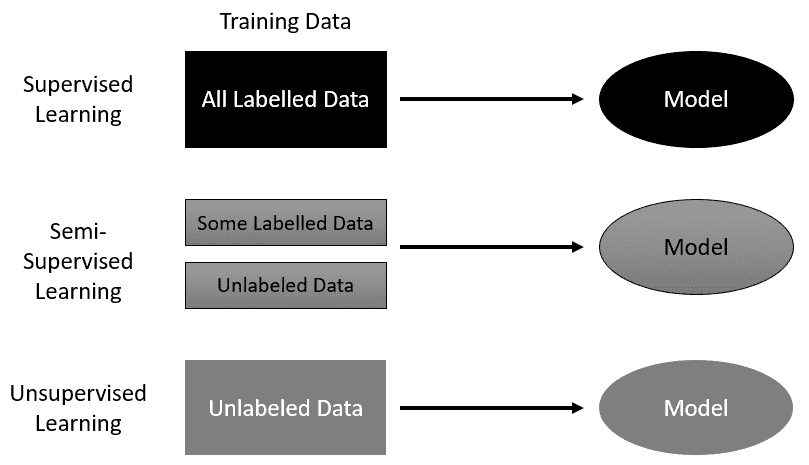

监督学习的变体

一些最近在 [arXiv.org](http://arxiv.org)（发音为archive.org）上的论文建议使用半监督学习来解决强化学习任务。虽然论文建议不使用外部奖励，但它们确实谈到了内部更新或反馈信号。这表明了一种使用内部奖励强化学习的方法，正如我们之前提到的，这是一个存在的事物。

尽管这个监督学习方法的家族在过去几年中取得了令人印象深刻的进步，但它们仍然缺乏我们从真正智能机器中期望的必要规划和智能。这就是强化学习发挥作用并区别于其他方法的地方。强化学习系统通过在与代理所在的环境中进行交互和选择来学习。一个典型的强化学习系统图示如下：

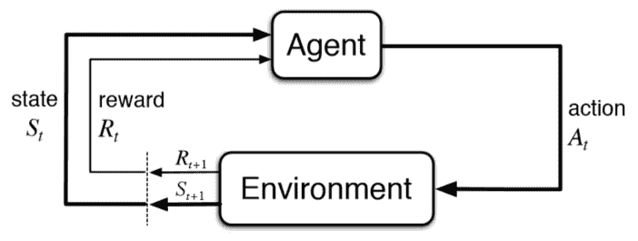

一个强化学习系统

在前面的图中，您可以识别出强化学习系统的主要组成部分：**代理**和**环境**，其中**代理**代表强化学习系统，而**环境**可能是游戏板、游戏屏幕，以及/或可能是流数据。连接这些组件的是三个主要信号：**状态**、**奖励**和**动作**。**状态**信号基本上是**环境**当前状态的快照。**奖励**信号可能由**环境**外部提供，并为代理提供反馈，无论是好是坏。最后，**动作**信号是代理在每个时间步在环境中选择的动作。一个动作可能像*跳跃*一样简单，或者是一组更复杂的控制伺服机构。无论如何，强化学习中的另一个关键区别是代理能够与**环境**交互并改变它。

现在，如果这一切仍然显得有些混乱，请不要担心——早期研究人员经常在区分监督学习和强化学习之间遇到麻烦。

在下一节中，我们将探讨更多的强化学习术语，并探讨强化学习代理的基本要素。

# 强化学习的要素

每个强化学习代理都由四个主要元素组成。这些是**策略**、**奖励函数**、**价值函数**，以及可选的**模型**。现在让我们更详细地探讨这些术语的含义：

+   **策略**：策略代表了代理的决策和规划过程。策略决定了代理在每一步将采取哪些动作。

+   **奖励函数**：奖励函数决定了代理在完成一系列动作或单个动作后所获得的奖励量。通常，奖励是由外部给予代理的，但正如我们将看到的，也存在内部奖励系统。

+   **价值函数**：价值函数决定了长期状态下状态的值。确定状态的值是强化学习的基础，我们的第一个练习将是确定状态值。

+   **模型**：模型代表了整个环境。在井字棋游戏中，这可能代表所有可能的游戏状态。对于更高级的强化学习算法，我们使用部分可观察状态的概念，这允许我们摆脱环境的完整模型。在这本书中我们将要解决的问题中，有些环境的状态数量比宇宙中的原子数量还要多。是的，您没有看错。在如此庞大的环境中，我们永远无法希望对整个环境状态进行建模。

我们将在接下来的几章中详细探讨这些术语，所以如果感觉有些抽象，请不要担心。在下一节中，我们将回顾强化学习的历史。

# 强化学习的历史

Sutton和Barto（1998年）的《强化学习导论》讨论了现代强化学习的起源，它源自两个主要线索，后来又加入了一个线索。这两个主要线索是基于试错的学习和动态规划，第三个线索以时间差分学习的形式在后来出现。Sutton创立的主要线索，即试错，基于动物心理学。至于其他方法，我们将在各自的章节中更详细地探讨。下面是一个展示这三个线索如何汇聚形成现代强化学习的图表：

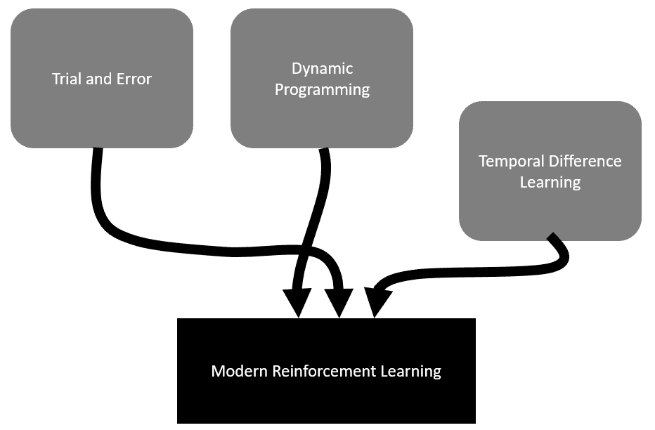

现代强化学习的历史

Dr. Richard S. Sutton，DeepMind的杰出研究科学家，同时也是阿尔伯塔大学的著名教授，被认为是现代强化学习（RL）之父。

最后，在我们深入探讨强化学习之前，让我们在下一节中看看为什么使用这种学习形式与游戏相结合是有意义的。

# 为什么是游戏中的强化学习？

在游戏领域，已经使用了各种形式的机器学习系统，其中监督学习是首选。虽然这些方法可以表现得像智能系统，但它们仍然受限于处理标记或分类的数据。尽管**生成对抗网络**（GANs）在关卡和其他资产生成方面显示出特别的潜力，但这些算法家族无法规划和理解长期决策。现在，在游戏中复制规划和交互行为的AI系统通常是通过硬编码的状态机系统，如有限状态机或行为树来实现的。能够开发出能够自己学习最佳移动或行为的智能体，这在实际上可以说是改变游戏规则，不仅对游戏产业如此，而且这肯定会在全球的每个产业中引起反响。

在下一节中，我们将探讨强化学习系统的基础，即马尔可夫决策过程。

# 介绍马尔可夫决策过程

在强化学习中，智能体通过解释状态信号从环境中学习。环境的状态信号需要定义当时环境的离散切片。例如，如果我们的智能体正在控制一枚火箭，每个状态信号都会定义火箭在时间上的确切位置。在这种情况下，状态可能由火箭的位置和速度定义。我们将从环境中定义的这个状态信号称为马尔可夫状态。马尔可夫状态不足以做出决策，智能体需要理解先前状态、可能的行为以及任何未来的奖励。所有这些附加属性可能汇聚形成一个马尔可夫性质，我们将在下一节中进一步讨论。

# 马尔可夫性质和马尔可夫决策过程

如果所有马尔可夫信号/状态都预测未来状态，那么一个强化学习问题就满足了马尔可夫性质。随后，如果一个马尔可夫信号或状态能够使智能体从该状态预测值，那么它就被认为是具有马尔可夫性质的。同样，如果一个既是马尔可夫性质又是有限的学习任务，那么它被称为有限**马尔可夫决策过程**或**MDP**。这里展示了一个非常经典的MDP例子，经常用来解释强化学习：

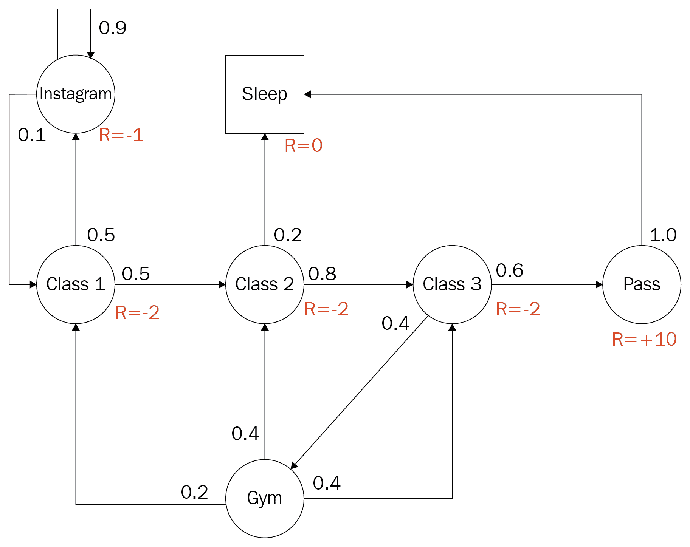

马尔可夫决策过程（Dr. David Silver）

上述图表取自YouTube上David Silver博士的优秀在线讲座（[https://www.youtube.com/watch?v=2pWv7GOvuf0](https://www.youtube.com/watch?v=2pWv7GOvuf0)）。Silver博士是Sutton博士的前学生，后来因成为DeepMind在强化学习（RL）早期成就背后的智慧大脑而声名鹊起。

该图是一个有限离散MDP的例子，用于一个试图优化其动作以获得最大奖励的大学后学生。学生可以选择上课、去健身房、在Instagram上闲逛，或者做其他事情，通过考试和/或睡觉。状态用圆圈表示，文本定义了活动。此外，每个圆圈旁边数字表示使用该路径的概率。注意，围绕单个圆圈的所有值总和为1.0或100%的概率。R=表示当学生在该状态下时，奖励函数的奖励或输出。为了进一步巩固这个抽象概念，让我们在下一节构建我们自己的MDP。

# 构建一个MDP

在这个动手练习中，我们将使用你日常生活中或经验中的任务来构建一个马尔可夫决策过程（MDP）。这应该能让你更好地将这个抽象概念应用到更具体的事物上。让我们开始吧：

1.  想想你每天做的可能包含六个左右状态的任务。这类任务的例子可能包括上学、穿衣、吃饭、洗澡、浏览Facebook和旅行。

1.  在一张完整的纸张上或在某个数字绘图应用程序中，将每个状态写在圆圈内。

1.  使用你认为最合适的动作连接各个状态。例如，不要在洗澡之前穿衣。

1.  分配你将用于采取每个动作的概率。例如，如果你有两个离开当前状态的动作，你可以使它们都是50/50或0.5/0.5，或者任何其他总和为1.0的组合。

1.  分配奖励。决定你在每个状态下会得到什么奖励，并在你的图上标记出来。

1.  将你完成的图与前面的例子进行比较。你做得怎么样？

在我们解决你的MDP或其他MDP之前，我们首先需要了解一些关于计算值的基础知识。我们将在下一节中揭示这一点。

# 使用多臂老虎机进行价值学习

首先解决一个完整的MDP，从而解决完整的强化学习（RL）问题，需要我们了解值以及如何使用价值函数计算状态的价值。回想一下，价值函数是RL系统的一个主要元素。我们不是使用完整的MDP来解释这一点，而是依赖于一个更简单的单状态问题，即多臂老虎机问题。这个名字来源于那些被称为“强盗”的顾客通常提到的一臂老虎机，但在这个案例中，机器有多个臂。也就是说，我们现在考虑一个单状态或稳态问题，有多个动作导致终端状态提供恒定的奖励。更简单地说，我们的代理将玩一个多臂老虎机，根据拉动的臂提供胜利或失败，每个臂总是返回相同的奖励。这里展示了我们的代理玩这个机器的例子：


多臂老虎机的代理演示

我们可以考虑单个状态的值依赖于下一个动作，前提是我们还了解该动作提供的奖励。数学上，我们可以定义一个简单的学习价值方程如下：

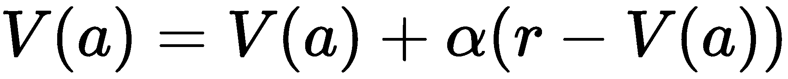

在这个方程中，我们有以下内容：

+   *V(a)*：给定动作的值

+   `a`：动作

+   *α*：alpha 或学习率

+   `r`：奖励

注意新增了一个名为 α（alpha）或学习率的变量。这个学习率表示代理需要多快从拉动到拉动学习价值。学习率越小（0.1），代理的学习速度越慢。这种动作价值学习方法对于强化学习（RL）是基本的。让我们在下一节中通过编写这个简单的示例来进一步巩固。

# 编写价值学习器

由于这是我们第一个示例，请确保您的 Python 环境已经设置好。为了简单起见，我们更喜欢使用 Anaconda。请确保您对所选 IDE 的编码感到舒适，并打开代码示例 `Chapter_1_1.py`，并跟随操作：

1.  让我们检查代码的第一个部分，如下所示：

```py
import random

reward = [1.0, 0.5, 0.2, 0.5, 0.6, 0.1, -.5]
arms = len(reward)
episodes = 100
learning_rate = .1
Value = [0.0] * arms
print(Value)
```

1.  我们首先开始通过 `import` 导入 `random`。我们将在每个训练轮次中使用 `random` 随机选择一个臂。

1.  接下来，我们定义一个奖励列表，`reward`。这个列表定义了每个臂（动作）的奖励，从而定义了在老虎机上臂/动作的数量。

1.  接着，我们使用 `len()` 函数确定臂的数量。

1.  然后，我们设置代理将使用的训练轮数来评估每个臂的价值。

1.  将 `learning_rate` 值设置为 `.1`。这意味着代理将缓慢地学习每个拉动的价值。

1.  然后，我们使用以下代码在一个名为 `Value` 的列表中初始化每个动作的值：

```py
Value = [0.0] * arms
```

1.  然后，我们将 `Value` 列表打印到控制台，确保所有值都是 0.0。

代码的第一个部分初始化了我们的奖励、臂的数量、学习率和值列表。现在，我们需要实现训练周期，在这个周期中，我们的代理/算法将学习每个拉动的价值。让我们回到 `Chapter_1_1.py` 的代码中，查看下一部分：

1.  列表中我们想要关注的下一部分代码是标题为 `agent learns` 的部分，如下所示供参考：

```py
# agent learns
for i in range(0, episodes):
    action = random.randint(0,arms-1)
    Value[action] = Value[action] + learning_rate * (
        reward[action] - Value[action])

print(Value)
```

1.  我们首先定义一个 `for` 循环，该循环从 `0` 到我们的轮数。对于每个轮次，我们让代理拉动一个臂，并使用该拉动的奖励来更新其对该动作或臂的价值判断。

1.  然后，我们想要确定代理随机拉动的动作或臂，使用以下代码：

```py
action = random.randint(0,arms-1)
```

1.  代码只是根据老虎机上臂的总数（减一以允许正确的索引）随机选择一个臂/动作编号。

1.  这允许我们使用下一行代码确定拉动的价值，该代码与我们的先前价值方程非常相似：

```py
Value[action] = Value[action] + learning_rate * (       reward[action] - Value[action])
```

1.  这行代码明显类似于我们之前的`Value`方程的数学公式。现在，思考一下`learning_rate`是如何在剧集的每次迭代中应用的。注意，以`.1`的速率，我们的智能体正在学习或应用智能体收到的`reward`与智能体之前等价的`Value`函数之差的1/10^(th)。这个小技巧的效果是在剧集之间平均化值。

1.  最后，在循环完成后，并运行了所有剧集后，我们打印出每个动作更新的`Value`函数。

1.  您可以通过命令行或您喜欢的Python编辑器运行代码。在Visual Studio中，这就像按一下播放按钮那么简单。代码运行完成后，你应该会看到以下类似的内容，但不是确切的输出：

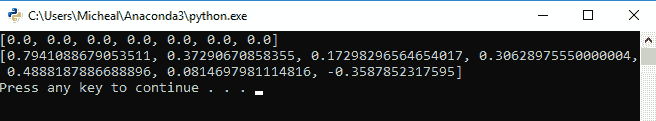

来自`Chapter_1_1.py`的输出

你肯定会看到不同的输出值，因为你在电脑上的随机动作选择将是不同的。Python有许多方法可以设置随机种子的静态值，但我们现在还不必担心这个问题。

现在，回想一下，并将这些输出值与为每个杠杆设定的奖励进行比较。它们是否相同或不同？以及如果不同，差异有多大？一般来说，仅经过100个剧集的学习后，应该可以清楚地显示出价值，但可能不是最终的价值。这意味着这些值将小于最终奖励，但它们应该仍然显示出偏好。

我们在这里展示的解决方案是一个**试错学习**的例子；它就是我们在RL历史部分提到的那第一条线索。正如你所见，智能体通过随机拉动杠杆并确定其价值来学习。然而，我们的智能体从未学会根据那些更新的价值做出更好的决策。智能体总是随机拉动。我们的智能体目前还没有决策机制，或者我们称之为RL中的**策略**。我们将在下一节中探讨如何实现一个基本的贪婪策略。

# 实现贪婪策略

我们当前的价值学习器除了在几个剧集内找到每个动作的最优计算值或奖励之外，并没有真正学习。由于我们的智能体没有学习，这也使得它成为一个效率较低的智能体。毕竟，智能体在每一期中只是随机选择任何杠杆，而它本可以使用其获得的知识，即`Value`函数，来确定其下一个最佳选择。我们可以在下一个练习中通过一个非常简单的策略，即贪婪策略来实现这一点：

1.  打开`Chapter_1_2.py`示例。代码基本上与我们的上一个示例相同，除了剧集迭代和特别地，动作或杠杆的选择。完整的列表可以在这里看到——注意新的高亮部分：

```py
import random

reward = [1.0, 0.5, 0.2, 0.5, 0.6, 0.1, -.5]
arms = len(reward)
learning_rate = .1
episodes = 100
Value = [0.0] * arms
print(Value)

def greedy(values):
 return values.index(max(values))

# agent learns
for i in range(0, episodes):
    action = greedy(Value)
    Value[action] = Value[action] + learning_rate * (
        reward[action] - Value[action])

print(Value)
```

1.  注意到新加入的`greedy()`函数。这个函数将始终选择具有最高价值的动作，并返回相应的索引/动作索引。这个函数本质上就是我们的智能体的策略。

1.  在代码中向下滚动，注意在训练循环中我们现在是如何使用 `greedy()` 函数来选择我们的动作，如下所示：

```py
action = greedy(Value)
```

1.  再次，运行代码并查看输出。这是你预期的结果吗？出了什么问题？

查看你的输出可能表明智能体正确地计算了最大奖励臂，但可能没有确定其他臂的正确价值。原因是，一旦智能体找到了最有价值的臂，它就会一直拉这个臂。本质上，智能体找到了最佳路径并坚持它，这在单步或静态环境中是可以的，但在需要多个决策的多个步骤问题中肯定不行。相反，我们需要平衡智能体探索和寻找新路径的需求，与最大化即时最优奖励。这个问题在强化学习中被称为**探索与利用**的困境，我们将在下一节中探讨。

# 探索与利用

正如我们所见，让我们的智能体总是做出最佳选择限制了它们学习单个状态（更不用说多个相连状态）的完整价值的能力。这也严重限制了智能体学习的能力，尤其是在多个状态汇聚和发散的环境中。因此，我们需要一种让我们的智能体根据一个偏向于更均匀的动作/价值分布的策略来选择动作的方法。本质上，我们需要一种策略，允许我们的智能体探索并利用其知识以最大化学习。探索与利用之间的权衡有多种变体和方式，这很大程度上取决于特定的环境和您使用的特定强化学习实现。我们永远不会使用绝对贪婪策略，而是使用贪婪策略的某种变体或完全不同的方法。在我们的下一个练习中，我们将展示如何实现一个初始乐观值方法，这可能非常有效：

1.  打开 `Chapter_1_3.py` 并查看这里显示的突出显示的行：

```py
episodes = 10000
Value = [5.0] * arms
```

1.  首先，我们将 `episodes` 的数量增加到 `10000`。这将使我们能够确认我们的新策略正在收敛到某个适当的解决方案。

1.  接下来，我们将 `Value` 列表的初始值设置为 `5.0`。请注意，这个值远高于奖励值的最大值 `1.0`。使用高于我们奖励值的高值迫使我们的智能体始终探索最有价值的路径，现在变成任何它尚未探索的路径，从而确保我们的智能体将始终至少探索每个动作或臂一次。

1.  没有更多的代码更改，你可以像平常一样运行示例。示例的输出如下所示：

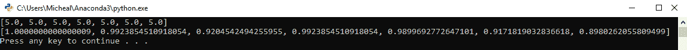

Chapter_1_3.py 的输出

您的输出可能略有不同，但很可能显示非常相似的价值。注意计算出的值现在更加相对。也就是说，`1.0`的价值清楚地表明了最佳的行动方案，即奖励为`1.0`的臂，但其他值对实际奖励的指示性较弱。初始选项价值方法有效，但会迫使智能体探索所有路径，这在较大的环境中效率不高。当然，还有许多其他方法可以用来平衡探索与利用，我们将在下一节中介绍一种新方法，其中我们将介绍如何使用Q学习解决完整的RL问题。

# 带有上下文老虎机的探索Q学习

现在我们已经了解了如何计算值以及探索和利用之间的微妙平衡，我们可以继续解决整个MDP问题。正如我们将看到的，不同的解决方案在RL问题和环境中表现得好或不好。这实际上是下一几个章节的基础。然而，目前我们只想介绍一种足够基本的方法，可以解决完整的RL问题。我们将完整的RL问题描述为非平稳或上下文化的多臂老虎机问题，即在每个回合中移动到不同的老虎机并从多个臂中选择一个臂的智能体。现在每个老虎机代表一个不同的状态，我们不再只想确定动作的价值，而是其质量。我们可以使用这里显示的Q学习方程来计算给定状态的动作质量：

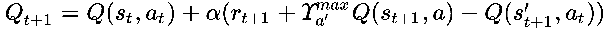

在前面的方程中，我们有以下内容：

+   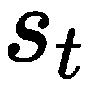

+   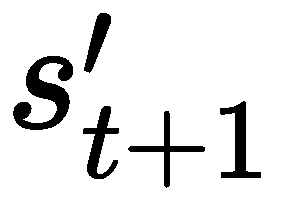：状态

+   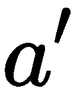

+   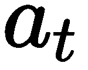

+   ϒ：gamma—奖励折扣

+   α：alpha—学习率

+   r：奖励

+   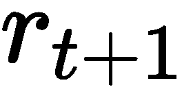：奖励折扣

+   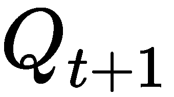：质量

现在，如果所有这些术语都有些陌生，这个方程看起来有些令人望而生畏，请不要过分担心。这是由克里斯·沃特金斯在 1989 年开发的 Q 学习方程，它是一种简化求解**有限马尔可夫决策过程**或**FMDP**的方法。在这个阶段，关于这个方程的重要观察点是理解它与我们之前看到的动作值方程的相似之处。在[第 2 章](8237fd36-1edf-4da0-b271-9a50c5b8deb3.xhtml)《动态规划和贝尔曼方程》中，我们将更详细地学习这个方程是如何推导和工作的。现在，我们需要掌握的重要概念是，我们现在正在根据之前的状态和奖励以及动作来计算一个基于质量的值，而不仅仅是单个动作值。这反过来又允许我们的智能体为多个状态做出更好的规划。在下一节中，我们将实现一个可以玩多个多臂老虎机的 Q 学习智能体，并能够最大化奖励。

# 实现一个 Q 学习智能体

虽然那个 Q 学习方程可能看起来复杂得多，但实际上实现这个方程并不像我们之前学习值时构建我们的智能体那样。为了使事情更简单，我们将使用相同的代码基础，但将其转换为 Q 学习示例。打开代码示例，`Chapter_1_4.py`，并按照这里的练习进行：

1.  这里是完整的代码列表，供参考：

```py
import random

arms = 7
bandits = 7
learning_rate = .1
gamma = .9
episodes = 10000

reward = []
for i in range(bandits): 
 reward.append([]) 
 for j in range(arms): 
 reward[i].append(random.uniform(-1,1))
print(reward)

Q = []
for i in range(bandits): 
 Q.append([]) 
 for j in range(arms): 
 Q[i].append(10.0)
print(Q)

def greedy(values):
    return values.index(max(values))

def learn(state, action, reward, next_state):
 q = gamma * max(Q[next_state])
 q += reward
 q -= Q[state][action]
 q *= learning_rate
 q += Q[state][action]
 Q[state][action] = q

# agent learns
bandit = random.randint(0,bandits-1)
for i in range(0, episodes):
    last_bandit = bandit
 bandit = random.randint(0,bandits-1)
 action = greedy(Q[bandit]) 
 r = reward[last_bandit][action]
 learn(last_bandit, action, r, bandit) print(Q)
```

1.  所有加亮的代码部分都是新的，值得仔细关注。让我们更详细地看看每个部分：

```py
arms = 7 bandits = 7
gamma = .9 
```

1.  我们首先将 `arms` 变量初始化为 `7`，然后创建一个新的 `bandits` 变量也是 `7`。回想一下，`arms` 类似于 `actions`，而 `bandits` 同样是 `state`。最后一个新变量 `gamma` 是一个新的学习参数，用于折现奖励。我们将在未来的章节中探讨这个折现因子概念：

```py
reward = [] for i in range(bandits):
 reward.append([])    for j in range(arms):
 reward[i].append(random.uniform(-1,1)) print(reward)
```

1.  下一节代码构建了一个奖励表矩阵，其中包含从 -1 到 1 的随机值。在这个例子中，我们使用列表的列表来更好地表示单独的概念：

```py
Q = [] for i in range(bandits):  
    Q.append([])     
    for j in range(arms): 
Q[i].append(10.0) print(Q)
```

1.  下一个部分非常相似，这次设置了一个 Q 表矩阵来存储我们计算的质量值。注意我们如何将初始 Q 值初始化为 10.0。我们这样做是为了考虑到数学中的细微变化，我们将在后面讨论这一点。

1.  由于我们的状态和动作都可以映射到一个矩阵/表中，我们将我们的强化学习系统称为使用模型。模型代表环境中的所有动作和状态：

```py
def learn(state, action, reward, next_state):
 q = gamma * max(Q[next_state]) q += reward q -= Q[state][action] q *= learning_rate q += Q[state][action] Q[state][action] = q
```

1.  接下来，我们定义了一个新的函数，称为 `learn`。这个新函数只是我们之前观察到的 Q 方程的直接实现：

```py
bandit = random.randint(0,bandits-1) for i in range(0, episodes):
    last_bandit = bandit
 bandit = random.randint(0,bandits-1) action = greedy(Q[bandit])    r = reward[last_bandit][action]
 learn(last_bandit, action, r, bandit) print(Q)
```

1.  最后，智能体学习部分通过新的代码进行了显著更新。这段新代码设置了我们需要的新学习函数的参数。注意老虎机或状态每次都是随机选择的。本质上，这意味着我们的智能体只是在老虎机之间随机漫步。

1.  正常运行代码，并注意最后打印出的新计算出的Q值。它们是否与每次拉动臂杆的奖励相匹配？

很可能，你的几个臂杆与相应的奖励值不匹配。这是因为新的Q学习方程解决了整个MDP，但我们的智能体并没有在MDP中移动。相反，我们的智能体只是在状态之间随机移动，而不关心它之前看到了哪个状态。回想一下我们的例子，你就会意识到，由于我们的当前状态不会影响我们的未来状态，它没有满足马尔可夫属性，因此不是一个MDP。然而，这并不意味着我们不能成功地解决这个问题，我们将在下一节中探讨这一点。

# 移除折现奖励

我们当前解决方案和全Q学习方程的问题在于，该方程假设我们的智能体（agent）所处的任何状态都会影响未来的状态。然而，记住在我们的例子中，智能体只是随机地从强盗移动到强盗。这意味着使用任何先前状态信息将是无用的，正如我们所看到的。幸运的是，我们可以通过移除折现奖励的概念来轻松解决这个问题。回想一下，在这个复杂项中出现的新的变量gamma： 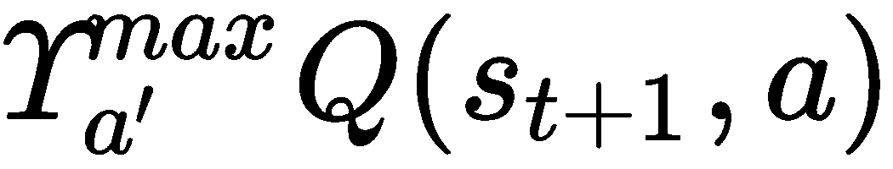。Gamma和这个项是折现未来奖励的一种方式，我们将在[第二章](8237fd36-1edf-4da0-b271-9a50c5b8deb3.xhtml)，“动态规划和贝尔曼方程”中详细讨论。现在，尽管如此，我们可以通过从我们的学习函数中移除这个项来修复这个样本。让我们打开代码示例，`Chapter_1_5.py`，并遵循这里的练习：

1.  我们真正需要关注的代码部分只有更新的`learn`函数，如下所示：

```py
def learn(state, action, reward, next_state):
    #q = gamma * max(Q[next_state])
    q = 0
    q += reward
    q -= Q[state][action]
    q *= learning_rate
    q += Q[state][action]
    Q[state][action] = q
```

1.  函数中的第一行代码负责折现下一个状态的未来奖励。由于我们例子中的所有状态都没有连接，我们只需注释掉那一行。在下一行，我们为`q = 0`创建一个新的初始化器。

1.  正常运行代码。现在你应该会看到非常接近的值与各自的奖励非常接近。

通过省略计算中的折现奖励部分，希望你能理解这将仅仅回归到一个价值计算问题。或者，你也可能意识到，如果我们的强盗（bandits）是相互连接的。也就是说，拉动一个臂杆会导致另一个具有更多动作的臂杆机器，如此类推。那么我们可以使用Q学习方程来解决这个问题。

这就结束了对强化学习（RL）的主要组件和元素的非常基础的介绍。在这本书的其余部分，我们将深入探讨策略、价值、动作和奖励的细微差别。

# 摘要

在本章中，我们首先向RL的世界介绍了自己。我们探讨了为什么RL如此独特以及为什么它对游戏来说是有意义的。之后，我们研究了现代RL的基本术语和历史。从那里，我们转向RL的基础和马尔可夫决策过程，我们发现是什么构成了RL问题。然后我们转向构建我们的第一个学习者——一个价值学习者，它计算状态在动作上的值。这使我们发现了探索和利用的需求以及不断挑战RL实施者的困境。接下来，我们深入研究了完整的Q学习方程以及如何构建Q学习者，后来我们意识到完整的Q方程超出了我们未连接状态环境的需求。然后我们将我们的Q学习重新转换为价值学习者，并观察它解决上下文投币机问题。

在下一章中，我们将继续我们留下的内容，探讨如何使用贝尔曼方程对奖励进行折现，以及查看动态规划为RL引入的许多其他改进。

# 问题

使用这些问题和练习来巩固你刚刚学到的内容。这些练习可能很有趣，所以请确保尝试至少两到四个问题/练习：

问题：

1.  强化学习（RL）系统的主要组成部分有哪些名称？提示：第一个是**环境**。

1.  列出强化学习（RL）系统的四个要素。请记住，其中一个要素是可选的。

1.  列出组成现代强化学习（RL）的三个主要线程。

1.  什么使马尔可夫状态具有马尔可夫性质？

1.  政策是什么？

练习：

1.  使用 `Chapter_1_2.py`，修改代码使代理从一个有1,000个臂的投币机中抽取。你需要做出哪些代码更改？

1.  使用 `Chapter_1_3.py`，修改代码使代理从平均值而非贪婪/最大值中抽取。这如何影响了代理的探索？

1.  使用 `Chapter_1_3.py`，修改 `learning_rate` 变量以确定你可以使代理学习得多快或多慢。你需要运行多少个剧集才能使代理解决问题？

1.  使用 `Chapter_1_5.py`，修改代码使代理使用不同的策略（无论是贪婪策略还是其他策略）。如果你在这本书或网上查找解决方案，请扣分。

1.  使用 `Chapter_1_4.py`，修改代码以便使投币机连接起来。因此，当代理拉动一个臂时，他们会获得奖励并被传输到另一个特定的投币机，不再是随机的。**提示**：这很可能需要构建一个新的目的地表，并且你现在需要包括我们之前移除的折现奖励项。

即使完成这些问题和/或练习中的几个，也会对你的学习产生巨大影响。毕竟，这是一本实践性很强的书。
