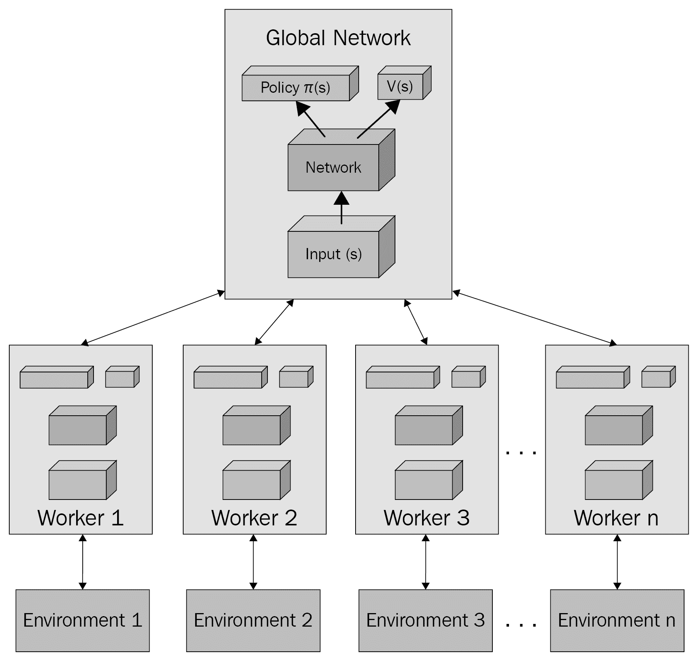

# 第十一章：优化连续控制

到目前为止，我们考虑的大多数训练/挑战环境都被视为是分段的；也就是说，游戏或环境有一个开始和一个结束。这是好的，因为大多数游戏都有开始和结束——毕竟，它是一个游戏。然而，在现实世界或某些游戏中，一个场景可能持续几天、几周、几个月，甚至几年。对于这类环境，我们不再考虑场景；相反，我们与需要连续控制的环境概念一起工作。到目前为止，我们已经查看了一组可以解决这类问题的算法子集，但它们并不做得很好。因此，像大多数RL中的事情一样，我们有一类特殊的算法专门用于这些类型的环境，我们将在本章中探讨它们。

在本章中，我们将探讨改进先前用于执行高级环境连续控制的策略方法。我们将从设置和安装Mujoco环境开始，这是一个我们可以用来测试这些新算法的专用领域，其中第一个将是近端策略优化或PPO方法。之后，我们将查看一种新颖的改进，称为循环网络，用于捕捉上下文，并了解它是如何应用于PPO之上的。然后，我们将回到actor-critic，这次我们将查看几种不同的异步actor-critic配置。最后，我们将查看ACER和具有经验回放的actor-critic。

下面是本章我们将涵盖的主要主题的总结：

+   使用Mujoco理解连续控制

+   介绍近端策略优化

+   使用循环网络进行PPO

+   决定同步和异步actor

+   使用经验回放构建actor-critic

在本章中，我们将探讨一类尝试专门解决机器人或其他控制系统现实世界问题的RL方法。当然，这并不意味着这些相同的算法不能用于游戏——它们确实可以。在下一节中，我们将首先查看专门的Mujoco环境。

# 使用Mujoco理解连续控制

构建连续控制代理的标准环境是Mujoco环境。**Mujoco**代表**具有约束的多关节动力学**，它是一个用于训练机器人或仿真代理的完整物理环境。该环境提供了一系列模拟，挑战某些形式的机器人控制代理执行任务，例如行走、爬行和实施基于物理控制的多个其他任务。这些环境的多样性在以下图像中得到了很好的总结，该图像是从Mujoco主页提取的：


从Mujoco主页提取的示例环境摘录

显然，我们希望使用这个酷炫的环境。然而，这个包不是免费的，需要许可证，但请注意，提供了一个30天的试用期。现在，坏消息来了。这个包的设置、安装和训练都非常困难，尤其是如果你使用Windows的话。事实上，它如此困难，尽管我们强烈建议使用Mujoco作为环境，但我们不会在本章剩余的练习中使用它。为什么？再次强调，它非常困难，我们不希望排除那些无法安装Mujoco环境的人。

有许多博客文章或Stack Overflow文章可供参考，它们介绍了Windows上Mujoco各种版本的安装方法。Mujoco在1.5版本之后停止了对Windows的支持。尽管在Windows上安装Mujoco仍然可能，但这并不简单，并且可能会经常发生变化。因此，如果你倾向于使用Windows与Mujoco，你最好的选择是查找最近的博客或论坛帖子以获取帮助。

在这个练习中，我们将介绍Mujoco的基本安装（不包括Windows）：

1.  我们首先需要的是一个许可证。打开你的浏览器，访问[mujoco.org](http://mujoco.org)，并找到页面顶部的许可证按钮。然后，点击它。

1.  在页面上，你会看到一个**计算机ID**的条目。这需要你从右侧显示的蓝色链接中下载一个密钥生成器。点击其中一个链接下载密钥生成器。

1.  在你的系统上运行密钥生成器，并在**计算机ID**字段中输入密钥。

1.  使用你的姓名和电子邮件填写其余的许可证信息，然后点击**提交**，如图所示：


提交Mujoco许可证

1.  你应该在几分钟内收到一封电子邮件，其中包含有关将密钥放在何处方向的说明。然后，你需要下载你平台上的二进制文件。点击页面顶部的“产品”链接以转到下载页面。下载你操作系统所需的版本。

1.  将文件解压到你的根用户文件夹中，`~/.mujoco/mujoco%version%`，其中`%version%`表示软件的版本。在Windows上，你的用户文件夹是`C:\Users\%username%`，其中`%username%`表示登录用户的名字。

1.  现在，你需要构建Mujoco包并设置`mujoco-py`脚本。这取决于安装方式。使用以下命令构建和安装Mujoco：

```py
pip3 install -U 'mujoco-py<2.1,>=2.0'  #use the version appropriate for you
cd path/to/mujoco-py/folder
python -c "import mujoco_py" #force compile mujoco_py
python setup.py install 
```

1.  为了测试安装并检查依赖项，运行以下命令重新安装整个Gym：

```py
pip install gym[all]
```

如果你运行此命令仍然看到错误，你可能需要更多帮助。咨询在线资源，进行关于`mujoco install`的最新搜索，并尝试那些说明。再次强调，在撰写本文时，Windows不再受支持，你可能更适合使用其他平台。幸运的是，现在为这个设置虚拟机或云服务可以相当容易，并且你可能在那里有更多运气。

1.  您可以通过运行`Chapter_9_Mujoco.py`来测试Mujoco的安装，并确保许可证已经全部设置好。列表如下所示：

```py
import gym 
from gym import envs

env = gym.make('FetchReach-v1')

env.reset()
for _ in range(1000):
 env.render()
 env.step(env.action_space.sample()) # take a random action
env.close()
```

如果您已正确安装所有内容，那么您应该会看到以下类似图像，该图像是从Mujoco环境中获取的：


Fetch reach Mujoco环境

如果您能够安装Mujoco环境，那么太好了——尽情探索一个全新的环境世界。对于那些无法安装Mujoco的读者，请不要担心。当我们开始使用Unity时，我们将在第10章[利用ML-Agents](ab9a7f4f-60d8-4643-8627-199cf95bcf55.xhtml)中学习如何创建自己的基于物理的环境。请放心，虽然Mujoco确实很酷，就像我们之前看到的Atari游戏一样，但它也不是那么容易训练。与Atari类似，Mujoco环境可能需要数百万次的训练迭代。因此，为了保持简单并保持节能，我们将使用常规的Gym环境。现在的额外好处是我们可以在单个环境中更好地比较各种算法。

**深度强化学习**（**DRL**）和一般**机器学习**（**ML**）由于它们消耗的额外能量而获得了一些坏名声。许多最先进的DRL模型可以从能耗的角度进行衡量，在大多数情况下，能耗相当高。在某个案例中，DeepMind承认，它用于训练单个模型的处理/能耗足以让一台台式电脑运行45年。这在需要谨慎能源消耗的世界中是一个惊人的数字。因此，在适用的情况下，在这本书中，我们将优先考虑成本更低的训练环境。

在下一节中，我们将探讨如何通过梯度优化来提升这些策略方法。

# 介绍近端策略优化

现在，我们将进入一个领域，我们将开始研究最先进的算法，至少在撰写本文时是这样。当然，这可能会发生变化，事物将会进步。不过，目前，由OpenAI引入的**近端策略优化**算法（**PPO**）被认为是最先进的深度强化学习算法。因此，我们可以将各种环境抛给这个问题。然而，为了量化我们的进展以及各种其他原因，我们将继续以Lunar Lander环境为基准。

PPO算法只是对我们在第8章中介绍的**信任域策略优化**（**TRPO**）算法的扩展和简化，但有一些关键的不同之处。PPO也更容易理解和遵循。出于这些原因，我们将回顾每个使TRPO和PPO中的信任域剪裁策略优化变得如此强大的特征。

本章的代码最初来源于以下仓库：[https://github.com/seungeunrho/minimalRL](https://github.com/seungeunrho/minimalRL)。对代码进行了一些修改，以便它符合本书中的示例。

既然我们已经了解了这一改进的主要直觉，让我们通过打开`Chapter_9_PPO.py`来跳入下一个编码练习。执行以下步骤：

1.  这个列表的代码与其他我们已审查的列表非常相似。因此，我们将仅限于审查关键部分：

```py
for iteration in range(iterations):
 s = env.reset()
 done = False
 while not done:
   for t in range(T_horizon):
     prob = model.pi(torch.from_numpy(s).float()) 
     m = Categorical(prob)
     a = m.sample().item()
     s_prime, r, done, info = env.step(a)

     model.put_data((s, a, r/100.0, s_prime, prob[a].item(),done))
     s = s_prime

     score += r
     if done:
       if score/print_interval > min_play_reward:
         play_game()
       break

   model.train_net()
 if iteration%print_interval==0 and iteration!=0:
   print("# of episode :{}, avg score : {:.1f}".format(iteration,
     score/print_interval))
   score = 0.0

env.close()
```

1.  滚动到最底部，我们可以看到训练代码几乎与前面章节中我们最近的一些示例相同。一个需要注意的关键点是引入了一个新的超参数`T_horizon`，我们将在稍后定义它：

```py
learning_rate = 0.0005
gamma = 0.98
lmbda = 0.95
eps_clip = 0.1
K_epoch = 3
T_horizon = 20
```

1.  如果我们滚动回顶部，你会看到为`T_horizon`、`K_epoch`、`eps_clip`和`lambda`定义的新超参数。现在只需记住这些新变量——我们很快就会了解它们的目的。

1.  让我们跳到一些其他的重要差异，例如网络定义，这可以在`PPO`类的`init`方法中看到如下：

```py
def __init__(self, input_shape, num_actions):
 super(PPO, self).__init__()
 self.data = []

 self.fc1 = nn.Linear(input_shape,256)
 self.fc_pi = nn.Linear(256,num_actions)
 self.fc_v = nn.Linear(256,1)
 self.optimizer = optim.Adam(self.parameters(), lr=learning_rate)
```

1.  我们可以看到，网络由一个名为`fc1`的第一输入状态`Linear`层组成，该层包含256个神经元。然后，我们可以看到`fc_pi`或策略网络被定义为`Linear`，包含256个神经元，并输出`num_actions`或动作的数量。接下来是`fc_v`的定义，这是值层。同样，它也有256个神经元和一个输出，即期望值。

1.  PPO类的其余代码几乎与前面的示例相同，我们在这里不需要详细说明。

1.  按正常方式运行代码。这个示例将需要一段时间才能运行，但不会像之前的版本那样长。我们将由你来决定是否在示例完成之前继续。

你应该很快就能注意到算法训练的速度有多快。确实，智能体很快就变得很好，实际上可以在少于10,000次迭代中解决环境，这相当令人印象深刻。既然我们已经看到了策略优化的潜力，我们将在下一节中探讨这是如何实现的。

# 策略优化的方法

在[第8章](42626cbd-87b8-428c-8f2a-ecc06f5e387c.xhtml)“策略梯度方法”中，我们介绍了策略梯度方法可能失败的情况，然后介绍了TRPO方法。在这里，我们讨论了TRPO用来解决PG方法中失败的一般策略。然而，正如我们所看到的，TRPO相当复杂，看到它在代码中的工作也没有太大帮助。这就是我们在介绍TRPO时尽量减少对细节讨论的主要原因，而是等到我们到达这一节才来讲述。

以简洁的方式讲述完整的故事。

话虽如此，让我们回顾一下使用TRPO或PPO进行策略优化的方法是如何做到这一点的：

+   **最小化-最大化MM算法**：回想一下，这是我们在找到上界函数的最小值时，通过找到受限于在上界函数内的下界函数的最大值来实现的。

+   **线搜索**：我们已经看到这是用来定义我们如何以及多少可以优化我们的函数（深度学习网络）的方向和量的。这允许我们的算法避免超过优化的目标。

+   **信任区域**：除了MM和线搜索之外，我们还想让策略函数有一个稳定的基或平台来移动。你可以把这个稳定的基想象成一个信任或安全区域。在PPO中，这被定义得不同，正如我们将看到的。

PPO和TRPO都以寻找更好的策略作为共同改进的方式。PPO通过理解我们每轮迭代想要改变策略分布的程度来改进这一点。这种理解也使我们能够限制每轮迭代中的变化量。我们已经看到TRPO如何通过KL散度在一定程度上做到这一点，但PPO通过调整或适应变化量更进一步。在下一节中，我们将探讨这种适应是如何工作的。

# PPO和剪裁目标

在我们深入探讨PPO的工作细节之前，我们需要退一步理解我们如何将分布式数据分布或分布之间的差异等同起来。记住，PG方法试图理解基于回报的采样分布，然后使用它来找到最佳动作或最佳动作的概率。因此，我们可以使用一种称为**KL散度**的方法来确定两个分布之间的差异。通过理解这一点，我们可以确定我们可以允许我们的优化算法探索多少空间或信任区域。PPO通过使用两个策略网络来剪裁目标函数来改进这一点。

乔纳森·惠（Jonathan Hui）在关于各种强化学习（RL）和策略梯度（PG）方法的数学方面有许多有见地的博客文章。特别是他关于PPO的文章（[https://medium.com/@jonathan_hui/rl-proximal-policy-optimization-ppo-explained-77f014ec3f12](https://medium.com/@jonathan_hui/rl-proximal-policy-optimization-ppo-explained-77f014ec3f12)）相当不错。请注意，它们确实假设了一个非常复杂的数学知识水平。如果你对RL认真，你将需要在某个时候能够阅读和理解这些内容。然而，通过直观地理解大多数算法，就像我们在这里做的那样，你可以通过深度强化学习（DRL）走得很远。

让我们通过打开`Chapter_9_PPO.py`并执行以下步骤来学习如何在代码中实现这一点：

1.  在查看主要代码的大部分内容后，我们只想关注这里的训练代码，特别是`PPO`类中的`train_net`函数，如下所示：

```py
def train_net(self):
 s, a, r, s_prime, done_mask, prob_a = self.make_batch()

for i in range(K_epoch):
 td_target = r + gamma * self.v(s_prime) * done_mask
 delta = td_target - self.v(s)
 delta = delta.detach().numpy()

 advantage_lst = []
 advantage = 0.0
 for delta_t in delta[::-1]:
   advantage = gamma * lmbda * advantage + delta_t[0]
   advantage_lst.append([advantage])
 advantage_lst.reverse()
 advantage = torch.tensor(advantage_lst, dtype=torch.float)

 pi = self.pi(s, softmax_dim=1)
 pi_a = pi.gather(1,a)
 ratio = torch.exp(torch.log(pi_a) - torch.log(prob_a)) 

 surr1 = ratio * advantage
 surr2 = torch.clamp(ratio, 1-eps_clip, 1+eps_clip) * advantage
 loss = -torch.min(surr1, surr2) + F.smooth_l1_loss(self.v(s) , 
   td_target.detach())

 self.optimizer.zero_grad()
 loss.mean().backward()
 self.optimizer.step()
```

1.  在初始的`make_batch`函数调用之后，为了构建列表，我们进入由`K_epoch`控制的迭代循环。`K_epoch`是一个新的超参数，它控制我们用于优化优势收敛的迭代次数：

```py
td_target = r + gamma * self.v(s_prime) * done_mask
delta = td_target - self.v(s)
delta = delta.detach().numpy()
```

1.  `K_epoch`迭代内部的第一个代码块是使用奖励`r`计算`td_target`，加上折扣因子`gamma`乘以v或价值网络的输出和`done_mask`。然后，我们取`delta`或TD变化并将其转换为`numpy`张量：

```py
for delta_t in delta[::-1]:
  advantage = gamma * lmbda * advantage + delta_t[0]
  advantage_lst.append([advantage])
```

1.  接下来，使用delta，我们通过`advantage`函数构建一个优势列表，如下所示：

```py
pi = self.pi(s, softmax_dim=1)
pi_a = pi.gather(1,a)
ratio = torch.exp(torch.log(pi_a) - torch.log(prob_a)) 
```

1.  然后，我们将状态**s**推入策略网络`pi`。接下来，我们沿着第一个维度收集轴，然后使用方程 计算比率，该方程用于计算我们想要用于信任的剪切区域或区域的可能比率：

```py
surr1 = ratio * advantage
surr2 = torch.clamp(ratio, 1-eps_clip, 1+eps_clip) * advantage
loss = -torch.min(surr1, surr2) + F.smooth_l1_loss(self.v(s) , 
   td_target.detach())
```

1.  我们使用`ratio`值来计算`surr1`值，它定义了表面或剪切区域。下一行通过夹紧这个比率并使用由`eps_clip`设置的剪切区域边界来定义区域，计算第二个版本的表面`surr2`。然后，它取两个表面中的最小面积，并使用该面积来计算损失。

我们在这里使用术语“表面”来理解损失计算是在一个多维数组值上进行的。我们的优化器在这个表面上工作，以找到最佳的全局最小值或表面的最低区域。

1.  代码的最后部分是我们的典型梯度下降优化，下面为了完整性而展示：

```py
self.optimizer.zero_grad()
loss.mean().backward()
self.optimizer.step()
```

1.  这里没有什么新的内容。继续运行样本或回顾之前练习的输出。以下是一个训练输出的示例：


来自`Chapter_9_PPO.py`的示例输出

需要注意的是，我们仍在使用离散动作空间，而不是连续动作空间。再次强调，我们这样做的主要原因是继续使用基线一致的环境，即Lunar Lander v2。Lunar Lander确实有一个连续动作环境，你可以尝试，但你需要转换样本，以便使用连续动作。第二个需要注意的事项是，PPO和其他PG方法在连续动作环境中表现实际上更好，这意味着你并没有真正看到它们的全部潜力。那么，我们为什么还在继续使用离散动作空间呢？嗯，在几乎所有情况下，游戏和交互式环境都会使用离散空间。由于这本书是关于游戏和AI的，而不是关于机器人和AI的，我们将坚持使用离散空间。

关于其他PG方法的研究项目有很多，但你应该将PPO视为DRL的一个里程碑，就像DQN一样。对于那些好奇的人来说，PPO通过在DOTA2策略游戏中击败人类玩家而闻名。在下一节中，我们将探讨其他叠加在PG和其他方法之上的方法，以改进DRL。

# 使用PPO与循环网络结合

在[第7章](42d53358-6f57-4f67-96ce-d8587cbe7cc5.xhtml)《使用DDQN深入探索》中，我们看到了如何使用称为**卷积神经网络**（**CNNs**）的概念来解释视觉状态。CNN网络用于检测视觉环境中的特征，例如Atari游戏。虽然这项技术允许我们使用同一个智能体玩许多游戏，但增加的CNN层需要更多的时间来训练。最终，额外的训练时间并不值得玩Atari游戏的酷炫效果。然而，我们可以在网络之上添加其他网络结构，以更好地解释状态。其中一种网络结构称为循环网络。循环网络层允许我们在模型对状态的解释中添加上下文或时间概念。这在任何上下文或记忆重要的问题上都可以非常有效。

循环网络层是一种深度学习感知器，它本质上将状态反馈给前面的神经元。这实际上赋予了网络理解时间或上下文的能力。它做得如此之好，以至于循环网络现在是所有文本和语言处理网络的核心。语言尤其具有上下文性，循环层，以各种配置，可以轻松理解上下文。循环网络层有多种配置，但在这里我们将关注的一种称为**长短期记忆**（**LSTM**）。

循环网络和 LSTM 层值得深入研究。这些强大的网络层在过去几年中负责了一些非常有趣的发现。虽然循环层在 DRL 中已被证明用途有限，但人们认为它们应该有更多用途。毕竟，在轨迹中理解上下文肯定很重要。

对于 DRL 的 LSTM 层来说，放置起来相当简单。打开 `Chapter_9_PPO_LSTM.py` 并按照以下步骤操作，看看这是如何工作的：

1.  这个示例几乎与 `Chapter_9_PPO.py` 完全相同，但有一些关键的不同之处，所有这些我们都会在这里查看。

1.  跳转到 `PPO` 类定义，如下所示：

```py
class PPO(nn.Module):
    def __init__(self, input_shape, num_actions):
        super(PPO, self).__init__()
        self.data = []

        self.fc1 = nn.Linear(input_shape,64)
        self.lstm = nn.LSTM(64,32)
        self.fc_pi = nn.Linear(32,num_actions)
        self.fc_v = nn.Linear(32,1)
        self.optimizer = optim.Adam(self.parameters(), lr=learning_rate)
```

1.  这里唯一的新部分是定义了一个新的层，`lstm`，其类型为 `LSTM(64,32)`。注入到状态编码顶部的 LSTM 层允许网络学习动作或记忆中的上下文。现在，我们的智能体不是学习哪些状态-动作提供最佳轨迹，而是在学习哪些状态-动作集提供最佳结果。在游戏中，这可能类似于学习一个特殊动作可以解锁一系列动作以获得一些特殊奖励。

1.  接下来，我们将向下移动到策略 pi 函数和值 v 函数的网络定义，并查看它们是如何被修改的：

```py
def pi(self, x, hidden):
        x = F.relu(self.fc1(x))
        x = x.view(-1, 1, 64)
        x, lstm_hidden = self.lstm(x, hidden)
        x = self.fc_pi(x)
        prob = F.softmax(x, dim=2)
        return prob, lstm_hidden

def v(self, x, hidden):
        x = F.relu(self.fc1(x))
        x = x.view(-1, 1, 64)
        x, lstm_hidden = self.lstm(x, hidden)
        v = self.fc_v(x)
        return v
```

1.  `pi` 和 `v` 函数接受一个隐藏层，但只有 `pi`，即策略函数，被用作隐藏层的输出。我们很快就会看到这些隐藏 LSTM 层是如何工作的。

1.  然后，在 `train_net` 函数的顶部，我们可以看到层是从批处理过程中提取出来的，`make_batch`：

```py
def train_net(self):
        s,a,r,s_prime,done_mask, prob_a, (h1_in, h2_in), (h1_out, h2_out) = self.make_batch()
        first_hidden = (h1_in.detach(), h2_in.detach())
        second_hidden = (h1_out.detach(), h2_out.detach())
```

1.  我们在 actor-critics 之间使用两个隐藏或中间 LSTM 层，其中 `second_hidden` 表示输出，`first_hidden` 表示输入。在下面的 `for` 循环中，我们可以看到使用 LSTM 输入和输出的 delta 计算过程：

```py
v_prime = self.v(s_prime, second_hidden).squeeze(1)
td_target = r + gamma * v_prime * done_mask
v_s = self.v(s, first_hidden).squeeze(1)
delta = td_target - v_s
delta = delta.detach().numpy()
```

1.  这里 delta 的计算是通过应用 LSTM 层应用前后的差异来完成的，这使得 delta 能够封装 LSTM 对值 `v` 计算的影响。

1.  按照正常方式运行示例，并观察输出，如下所示：


`Chapter_9_PPO_LSTM.py` 的示例输出

注意这个轻微的改进是如何显著提高了我们在上一练习中查看的 vanilla PPO 示例的训练性能。在下一节中，我们将通过应用并行环境进一步改进 PPO。

# 决定同步和异步的 actors

我们这本书的开篇以对**人工通用智能**（**AGI**）的简单讨论开始。简而言之，AGI是我们尝试将智能系统泛化以解决多个任务的尝试。强化学习（RL）通常被视为通往AGI的阶梯，主要是因为它试图泛化基于状态的学习。虽然RL和AGI都从我们的思考方式中汲取了深刻的灵感，无论是奖励还是可能的意识本身，但前者倾向于包含直接的类比。RL中的演员-评论家（actor-critic）概念是我们在创建一种学习形式时如何使用对人类心理学的解释的一个极好例子。例如，我们人类经常考虑我们行为的后果，并确定它们可能或可能不会给我们带来的优势。这个例子与我们在RL中使用的演员-评论家和优势方法完美类比。更进一步，我们可以考虑另一种人类思维过程：异步和同步思维。

异步/同步思维的一个直接例子是在被问了一个问题几小时后，答案突然出现在你的脑海中。也许你当时没有答案，但几个小时后它就出现了。你一直在想这个问题吗？不太可能，而且更有可能的是答案突然出现在你的脑海中。但是，你是在某个后台过程中一直在想它，还是某个过程突然启动并提供了答案？动物大脑总是这样思考，我们称之为计算机术语中的并行处理。那么，我们的代理不能也从这种思维过程中受益吗？结果证明，是的。

这种灵感可能部分来自前面的类比，但也具有如何评估优势的数学背景。直接评估我们大脑的思考方式仍然是一个大问题，但我们可以假设我们的思维是同步的或异步的。因此，除了考虑一个思维过程之外，如果我们考虑几个会怎样？我们可以将这个类比更进一步，并将其应用于深度强化学习（DRL）——特别是演员-评论家。在这里，我们有一个单一的思维过程或全局网络，它被几个工人思维过程的输出所喂养。这里展示了这样一个例子：



亚瑟·朱利安尼博士异步AC的示例

我们在这里看到的是演员-评论家架构的优势，A2C，以及异步演员-评论家架构，A3C的基本直觉。注意每个工人大脑/代理都有自己的独立环境副本。所有这些工人代理将他们的学习输入到一个主大脑中。然后，每个工人大脑通过迭代更新以与主大脑同步，这与我们之前的优势计算非常相似。在下一节中，我们将看到如何通过实现A2C来将此付诸实践。

# 使用A2C

为了避免任何混淆，理解A2C和A3C都使用AC，但它们更新模型的方式不同是很重要的。在A2C中，方法是同步的，所以每个大脑都将思想输入到主大脑中。

让我们通过打开`Chapter_9_A2C.py`文件并查看其中的超参数来查看代码中的样子：

```py
n_train_processes = 3
learning_rate = 0.0002
update_interval = 5
gamma = 0.98
max_train_steps = 60000
PRINT_INTERVAL = update_interval * 100
environment = "LunarLander-v2"
```

保持样本打开并按照以下步骤继续这个练习：

1.  这是一个大的代码示例，所以我们将限制我们在这里展示的部分。这里需要注意的是文件顶部的超参数列表。唯一需要注意的是`n_train_processes`，它设置了工作进程的数量：

```py
class ActorCritic(nn.Module):
    def __init__(self, input_shape, num_actions):
        super(ActorCritic, self).__init__()
        self.fc1 = nn.Linear(input_shape, 256)
        self.fc_pi = nn.Linear(256, num_actions)
        self.fc_v = nn.Linear(256, 1)

    def pi(self, x, softmax_dim=1):
        x = F.relu(self.fc1(x))
        x = self.fc_pi(x)
        prob = F.softmax(x, dim=softmax_dim)
        return prob

    def v(self, x):
        x = F.relu(self.fc1(x))
        v = self.fc_v(x)
        return v
```

1.  接下来是`ActorCritic`类，这是我们之前使用的同一个类：

```py
def worker(worker_id, master_end, worker_end):
    master_end.close() 
    env = gym.make(environment)
    env.seed(worker_id)

    while True:
        cmd, data = worker_end.recv()
        if cmd == 'step':
            ob, reward, done, info = env.step(data)
            if done:
                ob = env.reset()
            worker_end.send((ob, reward, done, info))
        elif cmd == 'reset':
            ob = env.reset()
            worker_end.send(ob)
        elif cmd == 'reset_task':
            ob = env.reset_task()
            worker_end.send(ob)
        elif cmd == 'close':
            worker_end.close()
            break
        elif cmd == 'get_spaces':
            worker_end.send((env.observation_space, env.action_space))
        else:
            raise NotImplementedError
```

1.  然后是`worker`函数的定义。这个函数是工作节点的大脑在工作和主大脑之间发送消息的地方：

```py
class ParallelEnv:
    def __init__(self, n_train_processes):
        self.nenvs = n_train_processes
        self.waiting = False
        self.closed = False
        self.workers = list()

        master_ends, worker_ends = zip(*[mp.Pipe() for _ in range(self.nenvs)])
        self.master_ends, self.worker_ends = master_ends, worker_ends

        for worker_id, (master_end, worker_end) in enumerate(zip(master_ends, worker_ends)):
          p = mp.Process(target=worker,
                           args=(worker_id, master_end, worker_end))
            p.daemon = True
            p.start()
            self.workers.append(p)

        # Forbid master to use the worker end for messaging
        for worker_end in worker_ends:
            worker_end.close()
```

1.  在这些函数之后是大的`ParallelEnv`类。前面的代码只是展示了该类的`init`函数，因为它相当大。这个类仅仅协调主节点和工作节点之间的活动：

```py
def compute_target(v_final, r_lst, mask_lst):
    G = v_final.reshape(-1)
    td_target = list()

    for r, mask in zip(r_lst[::-1], mask_lst[::-1]):
        G = r + gamma * G * mask
        td_target.append(G)

    return torch.tensor(td_target[::-1]).float()
```

1.  滚动到`test`函数之后，或者在我们其他示例中的`play_game`函数之后，我们可以看到`compute_target`函数。这是TD损失的计算，这里的区别在于使用了`mask`变量。`mask`只是一个标志或过滤器，它会移除任何关于0回报的折现G的计算：

```py
if __name__ == '__main__':
    envs = ParallelEnv(n_train_processes)
    env = gym.make(environment)
    state_size = env.observation_space.shape[0]
    action_size = env.action_space.n
    model = ActorCritic(state_size, action_size)
    optimizer = optim.Adam(model.parameters(), lr=learning_rate)
```

1.  之后，我们进入一个`if`函数，它确定当前过程是否为`'__main__'`。我们这样做是为了避免额外的工作进程尝试运行相同的代码块。之后，我们可以看到典型的环境和模型设置完成：

```py
for _ in range(update_interval):
    prob = model.pi(torch.from_numpy(s).float())
    a = Categorical(prob).sample().numpy()
    s_prime, r, done, info = envs.step(a)

    s_lst.append(s)
    a_lst.append(a)
    r_lst.append(r/100.0)
    mask_lst.append(1 - done)

    s = s_prime
    step_idx += 1
```

1.  间隔训练循环的代码几乎与之前的示例相同，大部分应该已经很直观。需要注意的是`env.steps`函数调用。这代表所有工作环境中的同步步骤。记住，在A2C中工作代理是同步运行的：

```py
s_final = torch.from_numpy(s_prime).float()
v_final = model.v(s_final).detach().clone().numpy()
td_target = compute_target(v_final, r_lst, mask_lst)

td_target_vec = td_target.reshape(-1)
s_vec = torch.tensor(s_lst).float().reshape(-1, state_size) 
a_vec = torch.tensor(a_lst).reshape(-1).unsqueeze(1)
mod = model.v(s_vec)
advantage = td_target_vec - mod.reshape(-1)

pi = model.pi(s_vec, softmax_dim=1)
pi_a = pi.gather(1, a_vec).reshape(-1)
loss = -(torch.log(pi_a) * advantage.detach()).mean() +\
            F.smooth_l1_loss(model.v(s_vec).reshape(-1), td_target_vec)

optimizer.zero_grad()
loss.backward()
optimizer.step()
```

1.  然后，我们来到外部的训练循环。在这个示例中，我们可以看到训练目标是如何从工人构建的列表中提取的，其中`s_lst`是状态，`a_lst`是动作，`r_lst`是奖励，`mask_lst`是完成。除了torch张量操作外，计算与PPO相同。

1.  按照你通常的方式运行代码并可视化输出，以下是一个示例：


来自Chapter_9_A2C.py的示例输出

你需要调整超参数才能使这个示例完美运行。现在，我们将继续并查看A2C的异步版本——A3C。

# 使用A3C

同步actor-critic工人通过基本上提供更多的采样变体来提供训练优势，这应该反过来减少预期错误的数量，从而提高训练性能。从数学上讲，我们只是在提供更大的采样空间，正如任何统计学家都会告诉你的，这只会减少采样误差。然而，如果我们假设每个工人都是异步的，这意味着它在自己的时间更新全局模型，这也为我们提供了在整个轨迹空间采样中的更多统计变异性。这也可以在采样空间的同时发生。本质上，我们可以在许多不同的点上让工人采样轨迹，如下面的图所示：


在轨迹空间中进行多次工人采样

使用A3C和异步actor-critic工人，我们可以更快地获得整个轨迹空间的更清晰图景，这允许我们的代理做出更清晰、更好的决策。它是通过使用多个工人在轨迹空间中进行异步采样来做到这一点的。让我们通过打开`Chapter_9_A3C.py`并执行以下步骤来了解这是如何工作的：

1.  我们将从查看典型的超参数和设置代码开始，如下所示：

```py
n_train_processes = 6
learning_rate = 0.0002
update_interval = 6
gamma = 0.98
max_train_ep = 3000
max_test_ep = 400
environment = "LunarLander-v2"

env = gym.make(environment)
state_size = env.observation_space.shape[0]
action_size = env.action_space.n
```

1.  在这里，我们可以看到包含两个新的超参数，`max_train_ep`和`max_test_ep`。第一个变量`max_train_ep`设置了最大训练剧集数，而第二个变量`max_test_ep`用于评估性能。

1.  下一个部分是`ActorCritic`类，与我们之前的几个例子完全相同，所以在这里我们不需要回顾它。之后是`train`函数，如下所示：

```py
def train(global_model, rank):
    local_model = ActorCritic(state_size, action_size)
    local_model.load_state_dict(global_model.state_dict())

    optimizer = optim.Adam(global_model.parameters(), lr=learning_rate)

    env = gym.make(environment)

    for n_epi in range(max_train_ep):
        done = False
        s = env.reset()
        while not done:
            s_lst, a_lst, r_lst = [], [], []
            for t in range(update_interval):
                prob = local_model.pi(torch.from_numpy(s).float())
                m = Categorical(prob)
                a = m.sample().item()
                s_prime, r, done, info = env.step(a)

                s_lst.append(s)
                a_lst.append([a])
                r_lst.append(r/100.0)

                s = s_prime
                if done:
                    break

            s_final = torch.tensor(s_prime, dtype=torch.float)
            R = 0.0 if done else local_model.v(s_final).item()
            td_target_lst = []
            for reward in r_lst[::-1]:
                R = gamma * R + reward
                td_target_lst.append([R])
            td_target_lst.reverse()

            s_batch, a_batch, td_target = torch.tensor(s_lst, dtype=torch.float), torch.tensor(a_lst), \
                torch.tensor(td_target_lst)
            advantage = td_target - local_model.v(s_batch)

            pi = local_model.pi(s_batch, softmax_dim=1)
            pi_a = pi.gather(1, a_batch)
            loss = -torch.log(pi_a) * advantage.detach() + \
                F.smooth_l1_loss(local_model.v(s_batch), td_target.detach())

            optimizer.zero_grad()
            loss.mean().backward()
            for global_param, local_param in zip(global_model.parameters(), local_model.parameters()):
                global_param._grad = local_param.grad
            optimizer.step()
            local_model.load_state_dict(global_model.state_dict())

    env.close()
    print("Training process {} reached maximum episode.".format(rank))
```

1.  `train`函数与我们之前的训练代码非常相似。然而，请注意我们传递了一个`global_model`输入。这个全局模型被用作本地模型的克隆，然后我们在工人代理学习到的经验上进行训练。关于这段代码的一个关键观察点是最后部分，这是我们使用独立训练的本地模型更新全局模型的地方。

1.  接下来是测试函数。这是使用以下代码评估`global_model`的地方：

```py
def test(global_model):
    env = gym.make(environment)
    score = 0.0
    print_interval = 20

    for n_epi in range(max_test_ep):
        done = False
        s = env.reset()
        while not done:
            prob = global_model.pi(torch.from_numpy(s).float())
            a = Categorical(prob).sample().item()
            s_prime, r, done, info = env.step(a)
            s = s_prime
            score += r

        if n_epi % print_interval == 0 and n_epi != 0:
            print("# of episode :{}, avg score : {:.1f}".format(
                n_epi, score/print_interval))
            score = 0.0
            time.sleep(1)
    env.close()
```

1.  所有这些代码所做的只是通过使用它来玩游戏和评估分数来评估模型。这当然是在训练时渲染环境的绝佳位置。

1.  最后，我们有主要的处理代码块。这个代码块通过以下`name`if语句被标识：

```py
if __name__ == '__main__': 
    global_model = ActorCritic(state_size, action_size)
    global_model.share_memory()

    processes = []
    for rank in range(n_train_processes + 1): # + 1 for test process
        if rank == 0:
            p = mp.Process(target=test, args=(global_model,))
        else:
            p = mp.Process(target=train, args=(global_model, rank,))
        p.start()
        processes.append(p)
    for p in processes:
        p.join()
```

1.  如我们所见，这是使用共享内存构建`global_model`模型的地方。然后，我们使用第一个或排名0的进程作为测试或评估进程来启动子进程。最后，我们可以看到代码在所有进程通过`p.join`重新连接时结束。

1.  按照常规运行代码并查看结果，以下是一个示例：


来自Chapter_9_A3C.py的示例输出

# 基于经验回放构建actor-critic

在这本书中，我们已经学到了DRL的所有主要概念。在后面的章节中，我们还将向您展示更多工具，就像我们在这个部分展示的那样，但如果您已经走到这一步，您应该认为自己对DRL有了一定的了解。因此，考虑构建自己的工具或对DRL进行增强，就像我们在这个部分展示的那样。如果您想知道是否需要先解决数学问题，那么答案是无需。通常，首先在代码中构建这些模型，然后理解数学会更直观。

基于经验回放的actor-critic（ACER）通过根据以往经验调整采样提供了另一个优势。这个概念最初由DeepMind在一篇题为《Sample Efficient Actor-Critic with Experience Replay》的论文中提出，并开发了ACER的概念。ACER背后的直觉是我们开发双打随机网络来减少偏差和方差，并更新我们在PPO中选择的信任区域。在下一个练习中，我们将探索结合经验回放的actor-critic。

通过回顾上述论文或搜索博客文章，可以最好地理解ACER背后的数学。强烈建议您在处理论文之前，首先理解TRPO和PPO背后的数学。

打开`Chapter_9_ACER.py`并按照以下步骤完成这个练习：

1.  在这个示例中，你首先会注意到的是`ReplayBuffer`类，如下所示：

```py
class ReplayBuffer():
    def __init__(self):
        self.buffer = collections.deque(maxlen=buffer_limit)

    def put(self, seq_data):
        self.buffer.append(seq_data)

    def sample(self, on_policy=False):
        if on_policy:
            mini_batch = [self.buffer[-1]]
        else:
            mini_batch = random.sample(self.buffer, batch_size)

        s_lst, a_lst, r_lst, prob_lst, done_lst, is_first_lst = [], [], [], [], [], []
        for seq in mini_batch:
            is_first = True 
            for transition in seq:
                s, a, r, prob, done = transition

                s_lst.append(s)
                a_lst.append([a])
                r_lst.append(r)
                prob_lst.append(prob)
                done_mask = 0.0 if done else 1.0
                done_lst.append(done_mask)
                is_first_lst.append(is_first)
                is_first = False

        s,a,r,prob,done_mask,is_first = torch.tensor(s_lst, dtype=torch.float), torch.tensor(a_lst), \
                                        r_lst, torch.tensor(prob_lst, dtype=torch.float), done_lst, \
                                        is_first_lst
        return s,a,r,prob,done_mask,is_first

    def size(self):
        return len(self.buffer)
```

1.  这是我们在前几章中看到的`ReplayBuffer`类的更新版本。

1.  除了`train`函数中的新部分之外，大部分代码应该是自解释的，首先是代码的前几个块：

```py
q = model.q(s)
q_a = q.gather(1,a)
pi = model.pi(s, softmax_dim = 1)
pi_a = pi.gather(1,a)
v = (q * pi).sum(1).unsqueeze(1).detach()

rho = pi.detach()/prob
rho_a = rho.gather(1,a)
rho_bar = rho_a.clamp(max=c)
correction_coeff = (1-c/rho).clamp(min=0)
```

1.  新代码是从动作概率`prob`除以`pi`的比率来计算`rho`，然后代码将张量聚合成1，将其夹具，并计算一个称为`correction_coeff`的校正系数。

1.  滚过一些其他熟悉的代码，我们来到了一个新部分，其中损失的计算已经更新为使用`rho_bar`和`correction_coeff`的值，如下所示：

```py
loss1 = -rho_bar * torch.log(pi_a) * (q_ret - v) 
loss2 = -correction_coeff * pi.detach() * torch.log(pi) * (q.detach()-v) loss = loss1 + loss2.sum(1) + F.smooth_l1_loss(q_a, q_ret)
```

1.  在这里，我们可以看到`rho_bar`和`correction_coeff`的倒数都被用来偏斜损失的计算。`rho`是我们用来计算这些系数的原始值，它基于先前动作和预测动作之间的比率。应用这种偏差产生的效果是缩小沿着轨迹路径的搜索范围。当应用于连续控制任务时，这是一个非常好的效果。

1.  最后，让我们跳到训练循环代码，看看数据是如何附加到`ReplayBuffer`的：

```py
seq_data.append((s, a, r/100.0, prob.detach().numpy(), done))
```

1.  在这里我们可以看到，动作概率`prob`是通过使用`detach()`从PyTorch张量中分离出来，然后将其转换为`numpy`张量来输入的。这个值是我们后来在`train_net`函数中用来计算`rho`的。

1.  按照正常方式运行代码并观察输出，以下是一个示例：


来自`Chapter_9_ACER.py`的示例输出

在这里，我们可以看到缓冲区大小如何增加，以及智能体如何变得更聪明。这是因为我们正在使用这些经验在重放缓冲区中调整从策略分布中理解偏差和方差的理解，这反过来又减少了我们使用的信任区域的大小或裁剪区域。正如我们从这个练习中可以看到的，这是本章中最令人印象深刻的练习之一，它确实以比我们本章之前的尝试更收敛的方式学习了环境。

关于优化PG方法的内容就到这里。在下一节中，我们将探讨一些你可以自己进行的练习。

# 练习

本节中的练习是为了让你自己探索。从现在开始，显著提高我们涵盖的任何技术都是一个成就，所以你在这里所做的可能不仅仅是学习。确实，你现在工作的环境和示例可能会表明你未来的工作偏好。一如既往，尝试完成以下练习中的两到三个：

1.  调整`Chapter_9_PPO.py`和/或`Chapter_9_PPO_LSTM.py`的超参数。

1.  调整`Chapter_9_A2C.py`和/或`Chapter_9_A3C.py`的超参数。

1.  调整`Chapter_9_ACER.py`的超参数。

1.  将LSTM层应用于A2C和/或A3C示例。

1.  将LSTM层应用于ACER示例。

1.  将`play_game`函数添加到A2C和/或A3C示例中。

1.  将`play_game`函数添加到ACER示例中。

1.  在ACER示例中调整缓冲区大小，看看这如何改善训练。

1.  将同步和/或异步工作者添加到ACER示例中。

1.  添加将结果输出到matplot或TensorBoard的功能。这相当高级，但这是我们将在后面的章节中介绍的内容。

这些练习旨在巩固我们在本章中学到的内容。在下一节中，我们将总结本章内容。

# 摘要

在本章中，我们学习了PG方法并非没有自己的缺陷，并探讨了修复或纠正它们的方法。这使我们探索了更多提高采样效率和优化目标或裁剪梯度函数的实现方法。我们通过查看使用裁剪目标函数来优化我们用来计算梯度的信任区域的PPO方法来实现这一点。在那之后，我们查看添加新的网络层配置来理解状态中的上下文。

然后，我们在PPO之上使用了新的层类型，即LSTM层，以观察它带来的改进。接着，我们研究了通过并行环境和同步或异步工作者来提高采样效率的方法。我们通过构建一个A2C示例来实现同步工作者，然后查看在A3C上使用异步工作者的示例。我们通过探讨使用ACER（经验回放的动作-评论家）来提高采样效率的另一种改进方法来结束这一章。

在下一章中，我们将通过探讨更多适用于游戏的不同方法来提升我们的知识。PG方法在游戏任务中已被证明非常成功，但在下一章中，我们将回到DQN，看看它如何通过不断改进达到最先进水平。
