# 第十六章：3D世界

我们几乎接近了探索什么是**通用人工智能**（**AGI**）以及如何使用**深度强化学习**（**DRL**）帮助我们达到这一目标的旅程的终点。尽管目前对DRL是否确实是通往AGI的正确路径还存在疑问，但它似乎是我们当前最好的选择。然而，我们质疑DRL的原因在于其能否或不能掌握多样化的3D空间或世界，正如人类和所有动物所掌握的3D空间，但我们发现很难在RL代理上训练。事实上，许多AGI研究人员的信念是，解决3D状态空间问题对于解决真正的通用人工智能可能大有裨益。我们将在本章中探讨为什么这是可能的。

对于本章，我们将探讨为什么3D世界对DRL代理构成了如此独特的问题，以及我们可以如何训练它们来解释状态。我们将探讨典型3D代理如何使用视觉来解释状态，并考察由此产生的深度学习网络类型。然后，我们将探讨在环境中使用3D视觉的一个实际例子以及我们处理状态的可选方案。接下来，继续使用Unity，我们将探讨障碍塔挑战，这是一个有10万美元奖金的AI挑战，以及赢得奖金所使用的实现方法。在章节的结尾，我们将探讨另一个名为Habitat的3D环境，以及它如何用于开发代理。

本章我们将讨论的主要要点如下：

+   在3D世界中推理

+   训练视觉代理

+   通用化3D视觉

+   挑战Unity障碍塔挑战

+   探索FAIR的栖息地——具身代理

本章中的示例可能需要特别长的时间来训练，所以请耐心等待，或者也许您可以选择只做一项。这不仅节省了您的时间，还减少了能源消耗。在下一章中，我们将探讨为什么3D世界如此特别。

# 在3D世界中推理

那么，为什么3D世界如此重要，或者至少人们认为它很重要呢？好吧，这一切都归结于状态解释，或者我们DRL（深度强化学习）领域喜欢称之为状态表示。目前有很多工作致力于为强化学习和其他问题提供更好的状态表示。理论上是这样的，能够仅仅表示状态的关键点或收敛点，可以使我们显著简化问题。我们在多个章节中探讨了使用各种技术来实现这一点。回想一下，我们是如何将连续观察空间的状态表示离散化到网格网格中的。这种技术是我们当时使用现有工具解决更困难连续空间问题的方法。从那时起，在几个章节中，我们看到了如何将连续空间直接输入到我们的深度学习网络中。这包括直接将图像作为游戏状态、截图输入，使用卷积神经网络。然而，3D世界，那些代表现实世界的世界，在表示状态方面提出了独特的挑战。

那么，在3D环境中表示状态空间有什么困难呢？我们难道不能像在其他环境中那样给智能体传感器吗？好吧，是的，也不完全是。问题是给智能体传感器实际上是我们对智能体需要用来解释问题的需求强加偏见。例如，我们可以给智能体一个传感器，直接告诉它前方、左侧和右侧物体的距离。虽然这可能对任何驾驶智能体来说足够了，但对于需要爬楼梯的智能体来说，可能就不适用了。相反，我们可能需要提供楼梯高度作为另一个传感器输入，这意味着我们为3D世界引入状态给智能体的首选方法是使用视觉或环境图像。当然，这样做的原因是为了消除我们（人类）的任何偏见，我们最好的做法就是直接将环境状态作为图像直接喂给智能体。

我们已经看到，当我们研究玩Atari游戏时，如何使用游戏区域的图像输入游戏状态。然而，那些游戏环境都是2D的，这意味着状态空间本质上被扁平化或收敛了。在这里，“收敛”这个词适用，因为当处理3D环境和现实世界时，这变成了一个问题。在3D空间中，一个视角可能产生多个状态，同样，一个视角也可能观察到多个状态空间。

我们可以在以下图中看到这是如何工作的：

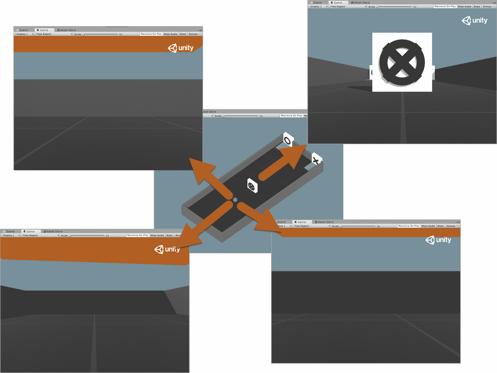

3D世界中的智能体状态示例

在图中，我们可以看到代理，在 Unity 的 Visual Hallway 环境中心的一个蓝色点，使用 ML-Agents 工具包。我们很快将回顾这个环境的示例，所以请不用担心现在就复习它。您可以从图中看到，代理是如何使用代理相机从同一物理位置观察不同状态观察的。代理相机是我们给予代理以观察世界的视觉。

从这个相机，代理将状态作为视觉观察摄入，这个观察作为图像输入到深度学习网络中。这个图像被 2D 卷积神经网络层分解成特征，这些特征是代理学习的。问题是，我们正在使用 2D 滤波器来尝试消化 3D 信息。在 [第 7 章](42d53358-6f57-4f67-96ce-d8587cbe7cc5.xhtml)，*使用 DDQN 深入学习* 中，我们探讨了使用 CNN 从 Atari 游戏中摄入图像状态，正如我们所看到的，这非常有效。

您需要安装 ML-Agents 工具包，并且应该已经打开了 **UnitySDK** 测试项目。如果您需要这方面的帮助，请返回到 [第 11 章](ab9a7f4f-60d8-4643-8627-199cf95bcf55.xhtml)，*利用 ML-Agents*，并首先遵循那里的一些练习。

Unity 对其代理相机设置也做同样的事情，在下一个练习中，我们将看到以下内容：

1.  定位到位于 ML-Agents 仓库中的 `ml-agents/ml-agents/mlagents/trainers` 文件夹。如果您需要帮助拉取仓库，请遵循之前给出的信息提示。

1.  从这个文件夹中，找到并打开文本或 Python IDE 中的 `models.py` 文件。ML-Agents 使用 TensorFlow 编写，一开始可能有些令人畏惧，但代码遵循了许多与 PyTorch 相同的原则。

1.  大约在第 250 行，从 `LearningModel` 基类创建了一个 `create_visual_observation_encoder` 函数。这是 ML-Agents、PPO 和 SAC 实现使用的基类模型。

ML-Agents 最初是在 Keras 中开发的，然后成熟到 TensorFlow 以提高性能。从那时起，PyTorch 在学术研究人员和构建者中看到了巨大的流行增长。在撰写本文时，PyTorch 是增长最快的深度学习框架。目前尚不清楚 Unity 是否也会效仿并将代码转换为 PyTorch，或者只是升级到 TensorFlow 2.0。

1.  `create_visual_observation_encoder` 函数是编码状态的基函数，函数的完整定义（不包括注释）如下所示：

```py
def create_visual_observation_encoder(
        self,
        image_input: tf.Tensor,
        h_size: int,
        activation: ActivationFunction,
        num_layers: int,
        scope: str,
        reuse: bool,
    ) -> tf.Tensor:        
        with tf.variable_scope(scope):
            conv1 = tf.layers.conv2d(
                image_input,
                16,
                kernel_size=[8, 8],
                strides=[4, 4],
                activation=tf.nn.elu,
                reuse=reuse,
                name="conv_1",
            )
            conv2 = tf.layers.conv2d(
                conv1,
                32,
                kernel_size=[4, 4],
                strides=[2, 2],
                activation=tf.nn.elu,
                reuse=reuse,
                name="conv_2",
            )
            hidden = c_layers.flatten(conv2)

        with tf.variable_scope(scope + "/" + "flat_encoding"):
            hidden_flat = self.create_vector_observation_encoder(
                hidden, h_size, activation, num_layers, scope, reuse
            )
        return hidden_flat
```

1.  虽然代码在 TensorFlow 中，但有一些明显的常见术语的指标，例如 layers 和 conv2d。有了这些信息，您可以看到这个编码器使用了两个 CNN 层：一个具有 8 x 8 的内核大小、4 x 4 的步长和 16 个滤波器；接着是一个使用 4 x 4 的内核大小、2 x 2 的步长和 32 个滤波器的第二层。

注意再次使用了没有池化层的做法。这是因为当我们使用池化在 CNN 层之间时，会丢失空间信息。然而，根据网络的深度，靠近顶部的单个池化层可能是有益的。

1.  注意函数的返回值是一个由 `hidden_flat` 表示的隐藏平坦层。回想一下，我们的 CNN 层被用来学习状态，然后作为以下图所示的那样，将其输入到我们的学习网络中。

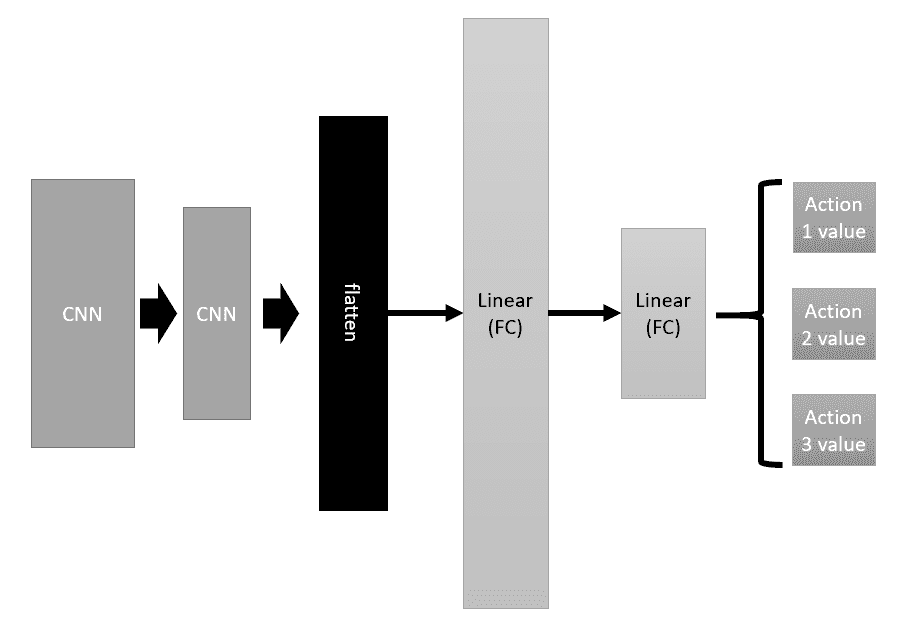

示例网络图

1.  上述图是一个简化的网络图，显示了 CNN 层在输入到隐藏中间层时会被展平。展平是将卷积 2D 数据转换为一条一维向量，然后将其输入到网络的其余部分。

1.  通过打开 Unity 编辑器到 `Assets/ML-Agents/Examples/Hallway/Scenes` 文件夹中的 **VisualHallway** 场景来查看图像源是如何定义的。

1.  展开第一个 **VisualSymbolFinderArea**，在 **Hierarchy** 窗口中选择 **Agent** 对象。然后，在 **Inspector** 窗口中找到并双击 **Brain**，将其在以下窗口中打开：

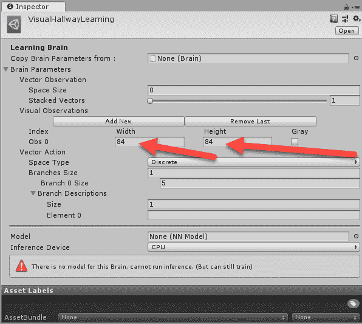

检查 VisualHallwayLearning 脑

这里需要注意的重要一点是，代理被设置为接受 84 x 84 像素大小的图像。这意味着代理摄像头被采样到一个与相同像素面积匹配的图像大小。由于场景中缺乏细节，这个相对较小的像素面积对于这个环境来说是可以工作的。如果细节增加，我们可能还需要增加输入图像的分辨率。

在下一节中，我们将探讨使用 ML-Agents 工具包通过视觉训练代理。

# 训练视觉代理

Unity 开发了一个 2D 和 3D 游戏引擎/平台，它已经成为构建游戏最受欢迎的平台。其中大部分游戏是 3D 类型，因此 Unity 对掌握能够处理更多 3D 自然世界的代理的任务产生了专门兴趣。因此，Unity 在这个问题上投入了大量资金，并且与 DeepMind 合作进一步开发。这种合作的结果还有待观察，但有一点可以肯定的是，Unity 将成为我们探索 3D 代理训练的首选平台。

在下一个练习中，我们将回到 Unity，看看我们如何在视觉 3D 环境中训练一个代理。Unity 可以说是设置和构建这类环境的最佳场所，正如我们在前面的章节中看到的。打开 Unity 编辑器，按照以下步骤操作：

1.  打开位于 `Assets/ML-Agents/Examples/Hallway/Scenes` 文件夹中的 **VisualHallway** 场景。

1.  在场景层次结构窗口中找到 **Academy** 对象，并将 **Hallway Academy** 组件的 **Brains** 部分的 **Control** 选项设置为启用，如图所示：

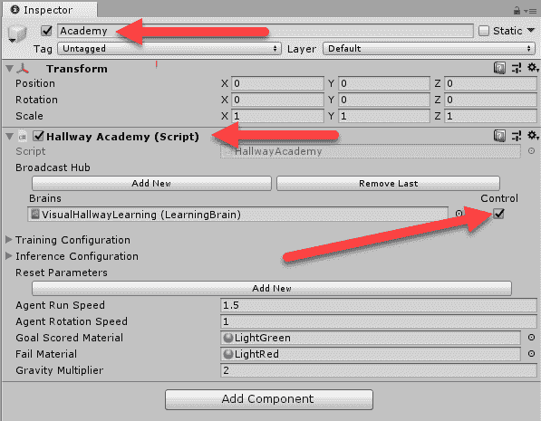

将学院设置为控制学习大脑

1.  这将设置学院以控制智能体的大脑。

1.  接下来，从**(1)**到**(7)**选择所有**VisualSymbolFinderArea**对象，并确保通过在检查器窗口中点击对象的**Active**选项来启用它们，如下截图所示：

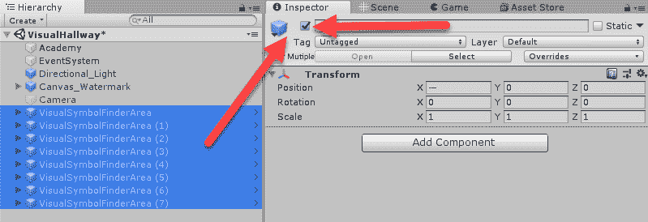

启用场景中的所有子环境

1.  这使得所有子环境区域都可以运行，并且我们在训练时可以额外运行七个智能体。正如我们使用演员-评论员方法时所看到的，能够更有效地从环境中采样有许多优势。几乎所有示例ML-Agents环境都提供了多个子训练环境。这些多个环境被认为是独立的环境，但允许大脑与多个智能体同步训练。

1.  从**文件**菜单保存场景和项目文件。

1.  打开一个新的Python或Anaconda shell，并将虚拟环境设置为使用你之前为ML-Agents设置的虚拟环境。如果你需要帮助，请参阅[第11章](ab9a7f4f-60d8-4643-8627-199cf95bcf55.xhtml)，*利用ML-Agents*。

1.  导航到Unity `ml-agents` 文件夹并执行以下命令以开始训练：

```py
mlagents-learn config/trainer_config.yaml --run-id=vishall_1 --train
```

1.  这将启动Python训练器，几秒钟后，会提示你在编辑器中点击播放。完成此操作后，所有环境中的智能体将开始训练，你可以在编辑器中可视化这个过程。以下截图显示了在命令行中看起来是怎样的：

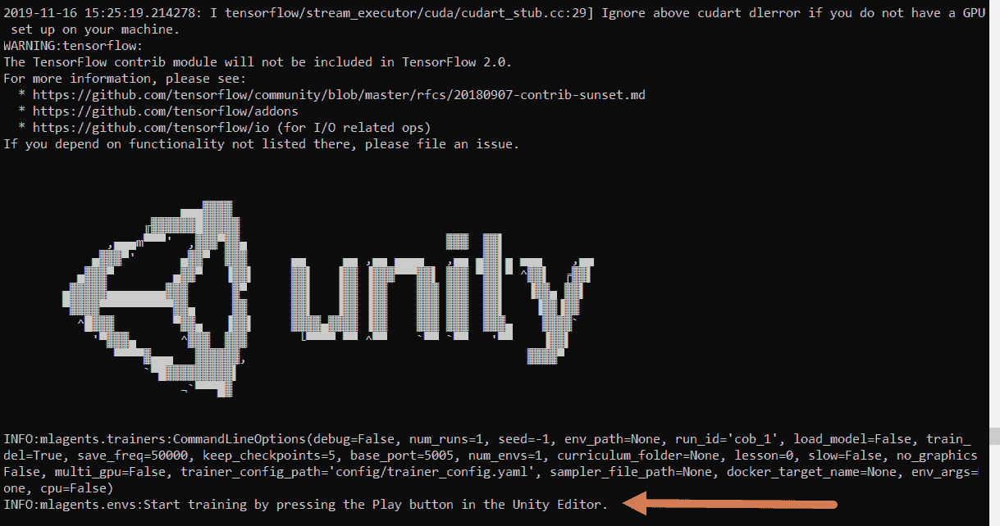

运行ML-Agents训练器

现在我们已经了解了如何在Unity中使用ML-Agents训练智能体，我们可以继续探索下一节中的一些其他未记录的训练选项。

如果你遇到在走廊环境中训练的问题，你总是可以尝试其他各种环境。由于发布或版本冲突，一些环境变得损坏并不罕见。

# 推广3D视觉

如前文在[第11章](ab9a7f4f-60d8-4643-8627-199cf95bcf55.xhtml)中提到的，*利用ML-Agents*，我们了解到Unity团队在训练3D世界中的智能体方面是领导者之一。毕竟，他们确实有很强的利益驱动，提供开发者可以轻松接入并构建智能体的AI平台。然而，这种适用于广泛应用的智能体现在被认为是通往通用人工智能的第一步，因为如果Unity能够成功构建一个能够玩任何游戏的通用智能体，那么它实际上就构建了一个初级通用人工智能。

定义 AGI 的问题在于试图理解一种智能有多广泛或有多一般，以及我们如何量化智能体对环境的理解以及将知识转移到其他任务的可能能力。我们真的不知道如何最好地定义它，直到有人有信心站起来并声称已经开发出 AGI。这个声明的一个很大部分将取决于智能体如何泛化环境状态，而其中很大一部分将是泛化 3D 视觉本身。

Unity 有一种未记录的方法可以改变在环境中训练时可以使用的视觉编码器的类型（至少在撰写本文时是这样）。

在下一个练习中，我们将查看如何通过以下步骤将超参数添加到配置中并设置不同的视觉编码器：

1.  找到位于 `mlagents/ml-agents/config` 文件夹中的 `trainer_config.yaml` 配置文件，并在 IDE 或文本编辑器中打开它。

**YAML** 是一个缩写，代表 **YAML ain't markup language**。ML-Agents 配置标记文件的格式与旧版的 Windows INI 配置文件非常相似。

1.  此文件定义了各种学习大脑的配置。找到 `VisualHallwayLearning` 大脑的章节，如下所示：

```py
VisualHallwayLearning:
    use_recurrent: true
    sequence_length: 64
    num_layers: 1
    hidden_units: 128
    memory_size: 256
    beta: 1.0e-2
    num_epoch: 3
    buffer_size: 1024
    batch_size: 64
    max_steps: 5.0e5
    summary_freq: 1000
    time_horizon: 64
```

1.  这些超参数是除了在配置文件顶部默认大脑配置中设置的基值之外额外的。如下所示：

```py
idefault:
    trainer: ppo
    batch_size: 1024
    beta: 5.0e-3
    buffer_size: 10240
    epsilon: 0.2
    hidden_units: 128
    lambd: 0.95
    learning_rate: 3.0e-4
    learning_rate_schedule: linear
    max_steps: 5.0e4
    memory_size: 256
    normalize: false
    num_epoch: 3
    num_layers: 2
    time_horizon: 64
    sequence_length: 64
    summary_freq: 1000
    use_recurrent: false
    vis_encode_type: simple
    reward_signals:
        extrinsic:
            strength: 1.0
            gamma: 0.99
```

1.  我们感兴趣的超参数是设置为简单并突出显示在前面代码示例中的 `vis_encode_type` 值。ML-Agents 通过更改此选项支持两种额外的视觉编码类型：

+   `vis_enc_type`：设置视觉编码类型的超参数：

+   `simple`：这是默认版本，也是我们之前看过的版本。

+   `nature_cnn`：这定义了由 Nature 期刊中一篇论文提出的 CNN 架构，我们将在稍后更详细地了解它。

+   `resnet`：ResNet 是一种已发表的 CNN 架构，已被证明在图像分类方面非常有效。

1.  我们将通过在 `VisualHallwayLearning` 大脑配置的末尾添加新行来更改我们大脑中的默认值：

```py
VisualHallwayLearning:
    use_recurrent: true
    sequence_length: 64
    num_layers: 1
    hidden_units: 128
    memory_size: 256
    beta: 1.0e-2
    num_epoch: 3
    buffer_size: 1024
    batch_size: 64
    max_steps: 5.0e5
    summary_freq: 1000
    time_horizon: 64
    vis_enc_type: nature_cnn --or-- resnet
```

1.  现在我们知道了如何设置这些，让我们通过打开 `ml-agents/trainers` 文件夹中我们之前打开的 `models.py` 代码来看看它们的样子。滚动到 `create_visual_observation_encoder` 函数下方，找到如下所示的 `create_nature_cnn_observation_encoder` 函数：

```py
def create_nature_cnn_visual_observation_encoder(
        self,
        image_input: tf.Tensor,
        h_size: int,
        activation: ActivationFunction,
        num_layers: int,
        scope: str,
        reuse: bool,
    ) -> tf.Tensor:        
        with tf.variable_scope(scope):
            conv1 = tf.layers.conv2d(
                image_input,
                32,
                kernel_size=[8, 8],
                strides=[4, 4],
                activation=tf.nn.elu,
                reuse=reuse,
                name="conv_1",
            )
            conv2 = tf.layers.conv2d(
                conv1,
                64,
                kernel_size=[4, 4],
                strides=[2, 2],
                activation=tf.nn.elu,
                reuse=reuse,
                name="conv_2",
            )
            conv3 = tf.layers.conv2d(
                conv2,
                64,
                kernel_size=[3, 3],
                strides=[1, 1],
                activation=tf.nn.elu,
                reuse=reuse,
                name="conv_3",
            )
            hidden = c_layers.flatten(conv3)

        with tf.variable_scope(scope + "/" + "flat_encoding"):
            hidden_flat = self.create_vector_observation_encoder(
                hidden, h_size, activation, num_layers, scope, reuse
            )
        return hidden_flat
```

1.  与这种实现的主要区别在于使用了名为 `conv3` 的第三层。我们可以看到这个第三层的核大小为 3 x 3，步长为 1 x 1，有 64 个滤波器。由于核和步长尺寸较小，我们可以看到这个新层被用来提取更精细的特征。这种特征有多有用取决于环境。

1.  接下来，我们想查看列在最后一个函数之后的第三个视觉编码实现。下一个函数是 `create_resent_visual_observation_encoder`，如下所示：

```py
 def create_resnet_visual_observation_encoder(
        self,
        image_input: tf.Tensor,
        h_size: int,
        activation: ActivationFunction,
        num_layers: int,
        scope: str,
        reuse: bool,
    ) -> tf.Tensor:       
        n_channels = [16, 32, 32] 
        n_blocks = 2 
        with tf.variable_scope(scope):
            hidden = image_input
            for i, ch in enumerate(n_channels):
                hidden = tf.layers.conv2d(
                    hidden,
                    ch,
                    kernel_size=[3, 3],
                    strides=[1, 1],
                    reuse=reuse,
                    name="layer%dconv_1" % i,
                )
                hidden = tf.layers.max_pooling2d(
                    hidden, pool_size=[3, 3], strides=[2, 2], padding="same"
                )                
                for j in range(n_blocks):
                    block_input = hidden
                    hidden = tf.nn.relu(hidden)
                    hidden = tf.layers.conv2d(
                        hidden,
                        ch,
                        kernel_size=[3, 3],
                        strides=[1, 1],
                        padding="same",
                        reuse=reuse,
                        name="layer%d_%d_conv1" % (i, j),
                    )
                    hidden = tf.nn.relu(hidden)
                    hidden = tf.layers.conv2d(
                        hidden,
                        ch,
                        kernel_size=[3, 3],
                        strides=[1, 1],
                        padding="same",
                        reuse=reuse,
                        name="layer%d_%d_conv2" % (i, j),
                    )
                    hidden = tf.add(block_input, hidden)
            hidden = tf.nn.relu(hidden)
            hidden = c_layers.flatten(hidden)

        with tf.variable_scope(scope + "/" + "flat_encoding"):
            hidden_flat = self.create_vector_observation_encoder(
                hidden, h_size, activation, num_layers, scope, reuse
            )
        return hidden_flat
```

1.  你现在可以回到配置文件中更新`vis_enc_type`超参数，并重新训练视觉代理。如果你有时间运行两个版本，注意哪个编码器更成功。

我们已经看到了ML-Agents支持的视觉编码器的各种变体，Unity团队也加入了一个相对较新的变体，称为ResNet。ResNet是一个重要的成就，迄今为止，它已被证明在某些视觉环境中训练代理是有用的。因此，在下一节中，我们将花更多的时间来探讨ResNet。

# 用于视觉观察编码的ResNet

卷积层已经被用于各种配置，用于成功执行图像分类和识别任务已有一些时间了。我们使用直接2D CNN时遇到的问题是，我们本质上是在平坦化状态表示，但通常不是以好的方式。这意味着我们正在将3D空间的视觉观察结果平坦化成2D图像，然后尝试从中提取重要特征。这导致代理认为如果它从同一3D环境中的不同位置识别出相同的视觉特征，它就处于相同的状态。这会在代理中造成混淆，你可以通过观察一个代理只是绕着圈子乱转来可视化这一点。

同样的代理混淆通常是由于梯度消失或爆炸引起的。我们并没有经常遇到这个问题，因为我们的网络相当浅。然而，为了提高网络性能，我们经常通过添加额外的层来加深网络。实际上，在一些视觉分类网络中，可能有100层或更多的卷积层试图提取各种特征。通过添加这么多额外的层，我们引入了梯度消失的机会。梯度消失是我们用来描述梯度变得如此之小，以至于看起来消失了，或者实际上对训练/学习没有影响的术语。记住，我们的梯度计算需要一个总损失，然后通过网络传递回来。损失需要推回网络的层数越多，它就越小。这是我们用于图像分类和解释的深度CNN网络中的一个主要问题。

ResNet或残差CNN网络被引入作为一种允许更深的编码结构而不受梯度消失影响的方法。残差网络之所以被称为残差网络，是因为它们携带一个称为**身份快捷连接**的残差身份。以下图表来自*深度残差学习用于图像识别*论文，展示了残差块中的基本组件：

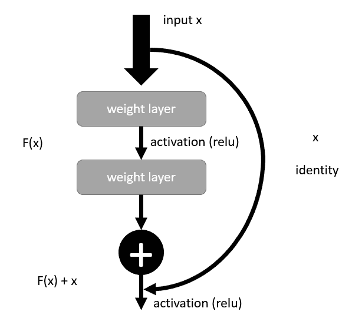

一个残差块

论文作者的直觉是，堆叠的层不应该仅仅因为它们是堆叠的而降低网络性能。相反，通过将最后一层的输出推送到下一层，我们实际上能够有效地将训练隔离到各个单独的层。我们称这为**恒等**，因为最后一层输出的尺寸可能不会匹配下一层的输入，因为我们绕过了中间层。相反，我们用恒等输入张量乘以最后一层的输出，以便匹配输出和输入。

让我们回到ML-Agents中的ResNet编码器实现，看看在下一个练习中是如何做到这一点的：

1.  打开位于 `mlagents/ml-agents/trainers` 文件夹中的 `models.py` 文件。

1.  再次向下滚动到 `create_resnet_visual_observation_encoder` 函数。查看定义构建残差网络的变量，如下所示的前两行：

```py
n_channels = [16, 32, 32] # channel for each stack
n_blocks = 2 # number of residual blocks
```

1.  接下来，再向下滚动一点，到我们列举构建每个输入层所需通道数的地方。代码如下所示：

```py
for i, ch in enumerate(n_channels):
    hidden = tf.layers.conv2d(
        hidden, 
        ch, 
        kernel_size=[3, 3], 
        strides=[1, 1], 
        reuse=reuse,    
        name="layer%dconv_1" % i,)
        hidden = tf.layers.max_pooling2d(
            hidden, pool_size=[3, 3], strides=[2, 2], padding="same")
```

1.  `n_channels` 变量表示每个输入卷积层使用的通道数或过滤器。因此，我们正在创建包含输入层和中间块的三个残差层组。这些块用于将训练隔离到每一层。

1.  继续向下滚动，我们可以看到以下代码中块是如何在层之间构建的：

```py
for j in range(n_blocks):
    block_input = hidden
    hidden = tf.nn.relu(hidden)
    hidden = tf.layers.conv2d(
        hidden,
        ch,
        kernel_size=[3, 3],
        strides=[1, 1],
        padding="same",
        reuse=reuse,
        name="layer%d_%d_conv1" % (i, j),)
    hidden = tf.nn.relu(hidden)
    hidden = tf.layers.conv2d(
        hidden,
        ch,
        kernel_size=[3, 3],
        strides=[1, 1],
        padding="same",
        reuse=reuse,
        name="layer%d_%d_conv2" % (i, j),)
    hidden = tf.add(block_input, hidden)
```

1.  这段代码创建了一个类似于以下图中所示的网络结构：

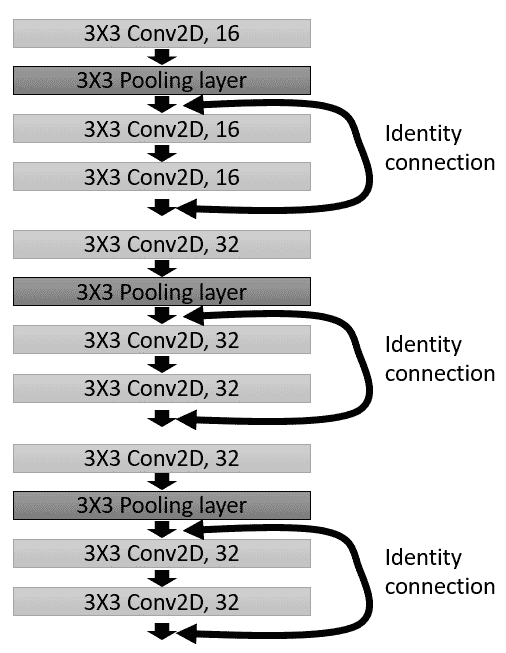

ML-Agents中ResNet架构图

1.  从本质上讲，我们仍然只有三个不同的卷积层提取特征，但每个这样的层现在可以独立训练。此外，我们很可能将这个网络的深度增加几倍，并预期视觉编码性能会有所提高。

1.  回去，如果你还没有这样做，用残差网络训练一个视觉代理进行视觉观察编码。

如果你回去用残差网络训练另一个视觉代理，你可能会发现代理的表现略有提高，但它们仍然可能会感到困惑。再次强调，这更多的是视觉编码系统的问题，而不是DRL本身的问题。然而，人们认为，一旦我们能够解决视觉环境的视觉编码问题，真正的AGI（通用人工智能）将无疑会大大接近。

在下一节中，我们将探讨Unity团队（在Google DeepMind的帮助下）为挑战DRL研究人员而构建的一个特殊环境，这正是3D世界视觉编码的问题。

# 挑战Unity障碍塔挑战

到2018年底，Unity在DeepMind的帮助下开始开发一个挑战，旨在让DRL领域最具挑战性的研究人员承担任务。挑战是以Unity作为Gym接口环境开发的，并使用3D第一人称视角的游戏。3D视角是一种游戏界面，如《古墓丽影》和《生化危机》等游戏使其闻名。以下截图显示了游戏界面的一个示例：

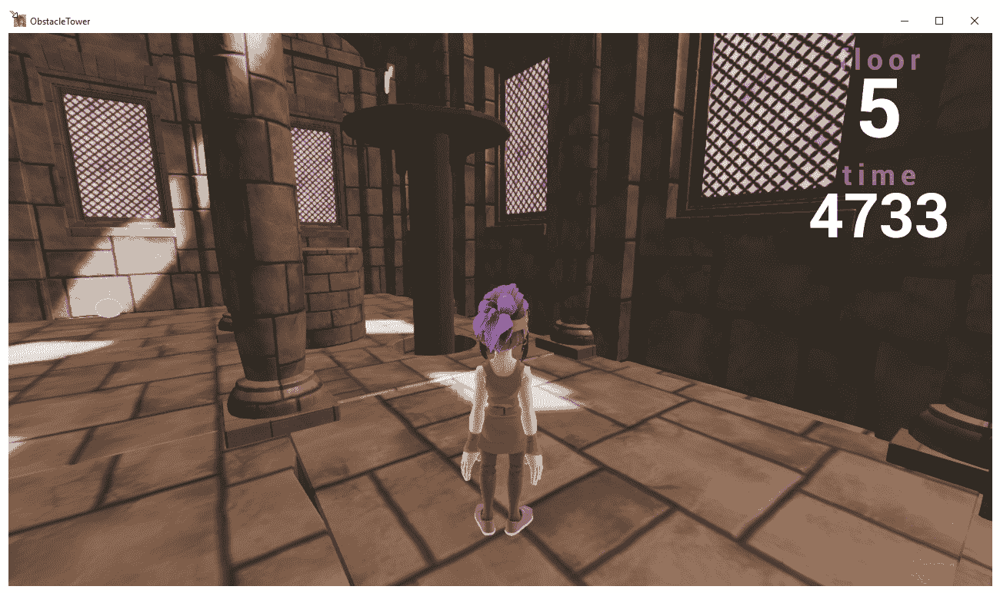

举例说明障碍塔挑战

障碍塔挑战不仅是在3D中，而且房间和墙壁上的模式和材料会随着关卡的变化而变化。这使得视觉泛化变得更加困难。此外，挑战提出了多个并发步骤来完成任务。也就是说，每个关卡都需要角色找到一扇门并将其打开。在更高级的关卡中，门需要特殊的钥匙才能激活或获取，这使得这几乎成为一个多任务RL问题——这不是我们之前考虑解决的问题。幸运的是，正如我们使用ML-Agents Curiosity Learning所展示的，只要任务线性连接，多步RL是可以实现的。这意味着没有分支或需要决策的任务。

多任务强化学习在研究方面迅速发展，但它仍然是一个非常复杂的话题。解决MTRL的当前首选方法被称为**元强化学习**。我们将在[第14章](a171ddfa-e639-4b4e-9652-4279b5ac872a.xhtml)“从DRL到AGI”中介绍元强化学习，我们将讨论未来几个月或几年DRL的下一阶段发展。

在下一个练习中，我们将仔细审查Unity障碍塔挑战的获胜者Alex Nichol的工作。Alex通过提交一个在分类图像和人类记录的演示（行为克隆）上预训练的修改后的PPO智能体赢得了10万美元的挑战。他实际上是通过使用一系列工程解决方案更好地泛化智能体的状态观察而获胜的。

打开你的Anaconda提示符，并按照以下示例操作：

1.  建议在安装任何新代码和环境之前创建一个新的虚拟环境。这可以通过Anaconda使用以下命令轻松完成：

```py
conda create -n obtower python=3.6
conda activate obstower
```

1.  首先，您需要从以下存储库下载并安装Unity障碍塔挑战([https://github.com/Unity-Technologies/obstacle-tower-env](https://github.com/Unity-Technologies/obstacle-tower-env))，或者只需从新的虚拟环境使用以下命令：

```py
git clone git@github.com:Unity-Technologies/obstacle-tower-env.git
cd obstacle-tower-env
pip install -e .
```

1.  运行OTC环境相当简单，可以使用以下简单的代码块在环境中执行随机动作：

```py
from obstacle_tower_env import ObstacleTowerEnv, ObstacleTowerEvaluation
def run_episode(env):
    done = False
    episode_return = 0.0

    while not done:
        action = env.action_space.sample()
        obs, reward, done, info = env.step(action)
        episode_return += reward
    return episode_return

if __name__ == '__main__':    
    eval_seeds = [1001, 1002, 1003, 1004, 1005]    
    env = ObstacleTowerEnv('./ObstacleTower/obstacletower')    
    env = ObstacleTowerEvaluation(env, eval_seeds)    
    while not env.evaluation_complete:
        episode_rew = run_episode(env)    
    print(env.results)
    env.close()
```

1.  运行OTC环境的代码现在应该相当熟悉了，但有一个需要注意的项目。代理会循环通过回合或生命，但代理只有一定数量的生命。这个环境模拟了一个真实游戏，因此代理只有有限的尝试次数和时间来完成挑战。

1.  接下来，从Alex Nichol（`unixpickle`）这里拉取仓库：[https://github.com/unixpickle/obs-tower2.git](https://github.com/unixpickle/obs-tower2.git)，或者检查`Chapter_13/obs-tower2`源文件夹。

1.  导航到文件夹并运行以下命令以安装所需的依赖项：

```py
pip install -e .
```

1.  之后，你需要配置一些环境变量到以下内容：

```py
 `OBS_TOWER_PATH` - the path to the obstacle tower binary.
 `OBS_TOWER_RECORDINGS` - the path to a directory where demonstrations are stored.
 `OBS_TOWER_IMAGE_LABELS` - the path to the directory of labeled images.
```

1.  你设置这些环境变量的方式将取决于你的操作系统以及你想要设置它们的位置级别。对于Windows用户，你可以使用**系统环境变量**设置面板来设置环境变量，如下所示：

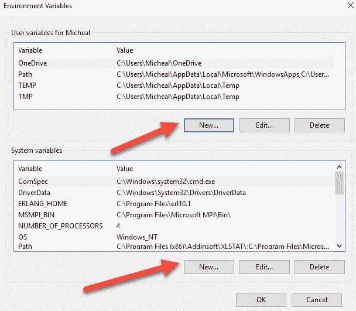

设置环境变量（Windows）

现在一切都已经设置好了，是时候开始预训练代理了。我们将在下一节中介绍这一训练过程。

# 预训练代理

我们已经介绍了几种管理训练性能的方法，这些方法通常由低奖励或奖励稀疏性引起。这包括使用一种称为行为克隆的技术，其中人类演示一系列导致奖励的动作，然后这些动作作为预训练策略反馈给代理。在这里，获胜的实现是行为克隆与预训练图像分类的组合。

我们将从上一个练习结束的地方继续，学习我们需要执行哪些步骤来首先预训练一个分类器：

1.  首先，我们需要捕获环境中的图像以预训练一个分类器。这需要你运行位于`obs_tower2/recorder/record.py`文件夹中的`record.py`脚本。确保在运行此脚本时，你的环境变量配置正确。

仓库中的文档或`README.md`是好的，但它主要面向对复制结果非常感兴趣的先进用户。如果你在这次演练中遇到问题，请参考该文档。

1.  运行脚本将启动Unity OTC，并允许你作为玩家与游戏互动。在你玩游戏的过程中，`record.py`脚本会在每个回合结束后记录你的动作图像。你需要玩几场比赛才能收集到足够的训练数据。或者，Alex已经在这个位置上提供了一些在线记录：[http://obstower.aqnichol.com/](http://obstower.aqnichol.com/)。

**注意：**

记录和标签都在tar文件中，记录文件大小为25 GB。

1.  接下来，我们需要对记录的图像进行标注，以帮助智能体进行分类。找到并运行位于`obs_tower2/labeler/`文件夹中的`main.py`脚本。这将启动一个网络应用程序。只要你的路径设置正确，你现在就可以打开浏览器并访问`http://127.0.0.1:5000`（本地主机，端口`5000`）。

1.  你现在将通过网页界面被提示对图像进行标注。对于每张图像，按照以下截图所示进行分类：

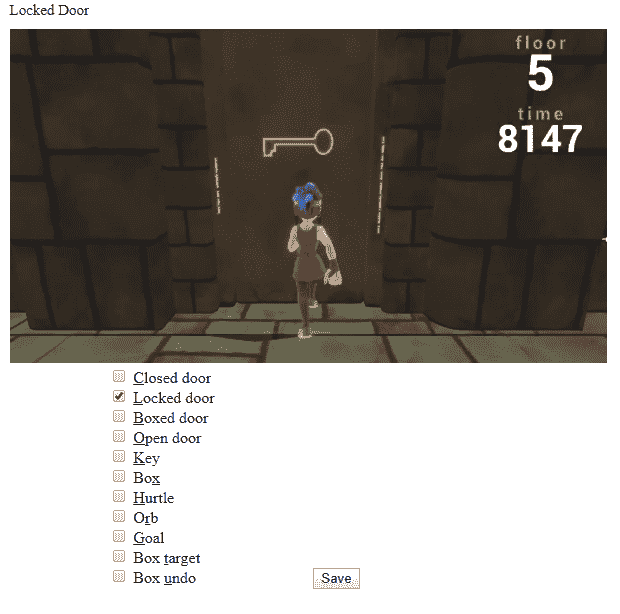

为分类标注图像数据

1.  亚历克斯在他的原始文档中提到，经过一些练习后，他可以每秒标注20-40张图像。再次提醒，如果你想避免这一步骤，只需下载包含他示例录音和标签的tar文件。

1.  接下来，你需要运行该分类器，使用你刚刚生成或下载的训练输入图像和标签。通过执行以下命令来运行分类器：

```py
cd obs_tower2/scripts
python run_classifier.py
```

1.  分类完成后，结果将定期输出到`save_classifier.pk1`文件。整个过程可能需要几个小时才能完全训练完成。

1.  在构建了预分类器之后，我们可以使用人类样本进行行为克隆。这意味着你将使用保存并预先标注的会话作为后续智能体训练的输入。你可以通过运行以下命令来启动此过程：

```py
python run_clone.py
```

1.  运行此脚本会定期将输出生成到`save_clone.pkl`文件，整个脚本可能需要一天或更长时间才能运行。当脚本完成后，将输出复制到`save_prior.pkl`文件，如下所示：

```py
cp save_clone.pkl save_prior.pkl
```

这创建了一个先验记录集或记忆集，我们将在下一节中用它来训练智能体。

# 层次化 - 隐式层次

亚历克斯使用分层强化学习的概念来解决OTC要求你解决的多个任务智能体学习问题。HRL是Meta-RL之外另一种用于成功解决多任务问题的方法。Prierarchy-RL通过构建一个先验层次结构来改进这一点，允许通过熵或不确定性定义动作或动作状态。高熵或高度不确定的动作成为高级或基于顶部的动作。这个概念有些抽象，所以让我们通过一个代码示例来看看它是如何结合在一起的：

1.  用于赢得挑战的基础智能体是PPO；以下是该智能体的完整源代码列表以及PPO的复习：

```py
import itertools

import numpy as np
import torch
import torch.nn.functional as F
import torch.optim as optim
from .util import atomic_save

class PPO:    
    def __init__(self, model, epsilon=0.2, gamma=0.99, lam=0.95, lr=1e-4, ent_reg=0.001):
        self.model = model
        self.epsilon = epsilon
        self.gamma = gamma
        self.lam = lam
        self.optimizer = optim.Adam(model.parameters(), lr=lr)
        self.ent_reg = ent_reg

    def outer_loop(self, roller, save_path='save.pkl', **kwargs):        
        for i in itertools.count():
            terms, last_terms = self.inner_loop(roller.rollout(), **kwargs)
            self.print_outer_loop(i, terms, last_terms)
            atomic_save(self.model.state_dict(), save_path)

    def print_outer_loop(self, i, terms, last_terms):
        print('step %d: clipped=%f entropy=%f explained=%f' %
              (i, last_terms['clip_frac'], terms['entropy'], terms['explained']))

    def inner_loop(self, rollout, num_steps=12, batch_size=None):
        if batch_size is None:
            batch_size = rollout.num_steps * rollout.batch_size
        advs = rollout.advantages(self.gamma, self.lam)
        targets = advs + rollout.value_predictions()[:-1]
        advs = (advs - np.mean(advs)) / (1e-8 + np.std(advs))
        actions = rollout.actions()
        log_probs = rollout.log_probs()
        firstterms = None
        lastterms = None
        for entries in rollout.batches(batch_size, num_steps):
            def choose(values):
                return self.model.tensor(np.array([values[t, b] for t, b in entries]))
            terms = self.terms(choose(rollout.states),
                               choose(rollout.obses),
                               choose(advs),
                               choose(targets),
                               choose(actions),
                               choose(log_probs))
            self.optimizer.zero_grad()
            terms['loss'].backward()
            self.optimizer.step()
            lastterms = {k: v.item() for k, v in terms.items() if k != 'model_outs'}
            if firstterms is None:
                firstterms = lastterms
            del terms
        return firstterms, lastterms

    def terms(self, states, obses, advs, targets, actions, log_probs):
        model_outs = self.model(states, obses)

        vf_loss = torch.mean(torch.pow(model_outs['critic'] - targets, 2))
        variance = torch.var(targets)
        explained = 1 - vf_loss / variance

        new_log_probs = -F.cross_entropy(model_outs['actor'], actions.long(), reduction='none')
        ratio = torch.exp(new_log_probs - log_probs)
        clip_ratio = torch.clamp(ratio, 1 - self.epsilon, 1 + self.epsilon)
        pi_loss = -torch.mean(torch.min(ratio * advs, clip_ratio * advs))
        clip_frac = torch.mean(torch.gt(ratio * advs, clip_ratio * advs).float())

        all_probs = torch.log_softmax(model_outs['actor'], dim=-1)
        neg_entropy = torch.mean(torch.sum(torch.exp(all_probs) * all_probs, dim=-1))
        ent_loss = self.ent_reg * neg_entropy

        return {
            'explained': explained,
            'clip_frac': clip_frac,
            'entropy': -neg_entropy,
            'vf_loss': vf_loss,
            'pi_loss': pi_loss,
            'ent_loss': ent_loss,
            'loss': vf_loss + pi_loss + ent_loss,
            'model_outs': model_outs,
        }
```

1.  熟悉这个实现与我们在PPO中讨论的内容之间的区别。我们的示例为了解释目的而简化，但遵循相同的模式。

1.  特别注意`inner_loop`中的代码，并理解其工作原理：

```py
def inner_loop(self, rollout, num_steps=12, batch_size=None):
```

1.  打开位于根目录`obs_tower2`文件夹中的`prierarchy.py`文件，如下所示：

```py
import numpy as np
import torch
import torch.nn.functional as F

from .ppo import PPO

class Prierarchy(PPO):  
    def __init__(self, prior, *args, kl_coeff=0, **kwargs):
        super().__init__(*args, **kwargs)
        self.prior = prior
        self.kl_coeff = kl_coeff

    def print_outer_loop(self, i, terms, last_terms):
        print('step %d: clipped=%f entropy=%f explained=%f kl=%f' %
              (i, last_terms['clip_frac'], last_terms['entropy'], terms['explained'],
               terms['kl']))

    def inner_loop(self, rollout, num_steps=12, batch_size=None):
        if batch_size is None:
            batch_size = rollout.num_steps * rollout.batch_size
        prior_rollout = self.prior.run_for_rollout(rollout)
        prior_logits = prior_rollout.logits()
        rollout = self.add_rewards(rollout, prior_rollout)
        advs = rollout.advantages(self.gamma, self.lam)
        targets = advs + rollout.value_predictions()[:-1]
        actions = rollout.actions()
        log_probs = rollout.log_probs()
        firstterms = None
        lastterms = None
        for entries in rollout.batches(batch_size, num_steps):
            def choose(values):
                return self.model.tensor(np.array([values[t, b] for t, b in entries]))
            terms = self.extended_terms(choose(prior_logits),
                                        choose(rollout.states),
                                        choose(rollout.obses),
                                        choose(advs),
                                        choose(targets),
                                        choose(actions),
                                        choose(log_probs))
            self.optimizer.zero_grad()
            terms['loss'].backward()
            self.optimizer.step()
            lastterms = {k: v.item() for k, v in terms.items() if k != 'model_outs'}
            if firstterms is None:
                firstterms = lastterms
            del terms
        return firstterms, lastterms

    def extended_terms(self, prior_logits, states, obses, advs, targets, actions, log_probs):
        super_out = self.terms(states, obses, advs, targets, actions, log_probs)
        log_prior = F.log_softmax(prior_logits, dim=-1)
        log_posterior = F.log_softmax(super_out['model_outs']['actor'], dim=-1)
        kl = torch.mean(torch.sum(torch.exp(log_posterior) * (log_posterior - log_prior), dim=-1))
        kl_loss = kl * self.ent_reg
        super_out['kl'] = kl
        super_out['kl_loss'] = kl_loss
        super_out['loss'] = super_out['vf_loss'] + super_out['pi_loss'] + kl_loss
        return super_out

    def add_rewards(self, rollout, prior_rollout):
        rollout = rollout.copy()
        rollout.rews = rollout.rews.copy()

        def log_probs(r):
            return F.log_softmax(torch.from_numpy(np.array([m['actor'] for m in r.model_outs])),
                                 dim=-1)

        q = log_probs(prior_rollout)
        p = log_probs(rollout)
        kls = torch.sum(torch.exp(p) * (p - q), dim=-1).numpy()

        rollout.rews -= kls[:-1] * self.kl_coeff

        return rollout
```

1.  我们在这里看到的是`Hierarchy`类，它是`PPO`的扩展，通过扩展`inner_loop`函数来工作。简单来说，这段代码优化了KL-Divergence计算，使我们能够在山丘上稳固地占据位置而不会掉落。回想一下，这是我们关于裁剪目标函数的讨论。

1.  注意到使用了`prior`策略或基于先前预训练和行为克隆生成的策略。这个先验策略定义了动作是高不确定性还是低不确定性。这样，代理实际上可以使用先验层次结构或先验结构来选择一系列高熵/不确定的动作。以下图表说明了这种有效的工作方式：

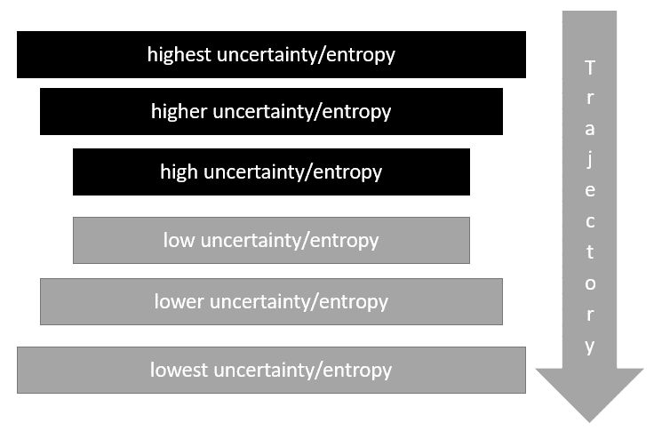

基于熵层次结构选择动作的代理

1.  因此，代理不再决定何时以及是否进行探索，而是根据其层次结构或不确定性来决定随机动作。这意味着高级动作可以快速减少不确定性，因为每个后续动作的不确定性都更小。

当试图理解层级结构时，一个有帮助的例子是电影《 Groundhog Day》，由比尔·默瑞主演。在电影中，这个角色不断地经历同一天，通过尝试和错误来寻找突破路径的最佳途径。在电影中，我们可以看到这个角色尝试了数千次，甚至数百万次不同的组合，但我们看到这是以层次步骤完成的。我们首先看到这个角色在一天中疯狂地四处走动，却什么也没做成，直到他通过过去的层次动作学会了最佳可能的奖励。他意识到，通过自我提升，他在永恒中的时间变得更加愉快。最后，我们看到这个角色试图过上最好的生活，却发现他们解决了游戏，可以进入下一天。

1.  你可以通过在第一层的前10层运行以下命令来训练代理：

```py
cp save_prior.pkl save.pkl
python run_tail.py --min 0 --max 1 --path save.pkl
```

1.  然后，为了在超过10层的楼层上训练代理，你可以使用以下方法：

```py
cp save_prior.pkl save_tail.pkl
python run_tail.py --min 10 --max 15 --path save_tail.pkl
```

在OTC的每10层，游戏主题都会改变。这意味着墙壁颜色和纹理也会改变，以及需要完成的任务。正如我们之前提到的，这种视觉变化，加上3D，将使Unity OTC成为我们在首次变得足够聪明/大胆和/或勇敢地应对AGI时，最具挑战性和基准挑战之一。AGI和通过DRL走向更普遍智能的道路将是我们在第14章[从DRL到AGI](a171ddfa-e639-4b4e-9652-4279b5ac872a.xhtml)的关注点。

在下一节中，我们将探讨Facebook的3D世界Habitat，这更具挑战性但同样有趣。

# 探索栖息地 - 由FAIR的具身代理

Habitat是Facebook AI Research为新型具身智能体提出的一个相对较新的平台。这个平台代表了能够从真实世界的复杂场景中展示全3D世界的能力。该环境旨在为机器人及其类似应用提供AI研究，这些应用在未来几年可能会由DRL（深度强化学习）提供动力。公平地说，这个环境是为了训练所有类型的AI在这个环境中而实现的。当前的Habitat仓库只包含一些简单的示例和PPO的实现。

Habitat平台由两部分组成：Habitat Sim和Habitat API。模拟环境是一个全3D的强大世界，可以每秒渲染数千帧，由摄影测量RGBD数据驱动。RGBD本质上是由RGB颜色数据和深度数据组成。因此，任何图像都会有一个颜色值和深度值。这使得数据可以以超现实的方式在3D中映射，成为真实环境的超逼真表示。您可以通过在浏览器中使用Habitat本身来探索这些环境的外观，请按照下一个快速练习进行操作：

1.  将您的浏览器导航到[https://aihabitat.org/demo/](https://aihabitat.org/demo/)。

Habitat目前只能在Chrome浏览器或您的桌面上运行。

1.  加载应用程序可能需要一些时间，请耐心等待。当应用程序加载完成后，您将看到以下截图类似的内容：

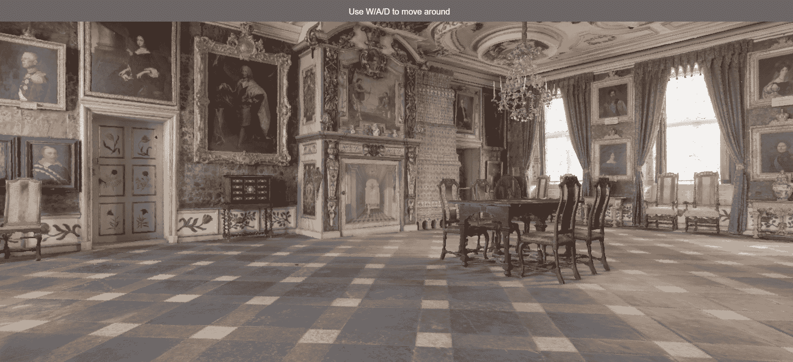

Habitat在浏览器中运行的示例

1.  使用WASD键在环境中移动。

Habitat支持从以下三个供应商导入：[MatterPort3D](https://niessner.github.io/Matterport/)、[Gibson](http://gibsonenv.stanford.edu/database/)和[Replica](https://github.com/facebookresearch/Replica-Dataset)，他们提供捕获RGBD数据的工具和实用程序，并拥有这些数据库。现在我们了解了Habitat是什么，我们将在下一节中设置它。

# 安装Habitat

在撰写本文时，Habitat仍然是一个新产品，但文档工作得很好，可以轻松安装和运行用于训练的智能体。在我们的下一个练习中，我们将介绍该文档的部分内容，以在Habitat中安装和运行训练智能体：

1.  打开Anaconda命令提示符并导航到一个干净的文件夹。使用以下命令下载和安装Habitat：

```py
git clone --branch stable git@github.com:facebookresearch/habitat-sim.git 
cd habitat-sim
```

1.  然后，创建一个新的虚拟环境，并使用以下命令安装所需的依赖项：

```py
conda create -n habitat python=3.6 cmake=3.14.0 
conda activate habitat 
pip install -r requirements.txt
```

1.  接下来，我们需要使用以下命令构建Habitat Sim：

```py
python setup.py install
```

1.  从以下链接下载测试场景：[http://dl.fbaipublicfiles.com/habitat/habitat-test-scenes.zip](http://dl.fbaipublicfiles.com/habitat/habitat-test-scenes.zip)。

1.  将场景文件解压缩到熟悉的路径，一个您可以稍后链接到的路径。这些文件是代表场景的RGBD数据集。

RGBD图像捕捉并不新鲜，传统上，它很昂贵，因为它需要移动一个装有特殊传感器的摄像头在房间内移动。幸运的是，大多数现代智能手机也具备这种深度传感器。这个深度传感器现在常用于构建增强现实应用。也许在几年后，智能体本身将被训练，仅使用简单的手机就能捕捉这些类型的图像。

1.  安装完成后，我们可以通过运行以下命令来测试Habitat的安装：

```py
python examples/example.py --scene /path/to/data/scene_datasets/habitat-test-scenes/skokloster-castle.glb
```

1.  这将以非交互方式启动模拟并执行一些随机移动。如果您想查看或与环境交互，您将需要下载并安装存储库文档中找到的交互式插件。

模拟安装完成后，我们可以在下一节中继续安装API并训练智能体。

# 在Habitat中进行训练

在撰写本文时，Habitat相当新颖，但显示出巨大的潜力，尤其是在训练智能体方面。这意味着当前环境中只有简单的PPO智能体实现，您可以快速训练智能体。当然，由于Habitat使用PyTorch，您可能能够实现我们之前介绍的其他算法之一。在下一项练习中，我们将通过查看Habitat中的PPO实现及其运行方式来结束：

1.  使用以下命令下载并安装Habitat API：

```py
git clone --branch stable git@github.com:facebookresearch/habitat-api.git 
cd habitat-api pip install -r requirements.txt 
python setup.py develop --all

```

1.  到目前为止，您可以使用多种方式使用API。我们首先将查看一个基本的代码示例，您可以用它来运行模拟：

```py
import habitat

# Load embodied AI task (PointNav) and a pre-specified virtual robot
env = habitat.Env(
    config=habitat.get_config("configs/tasks/pointnav.yaml")
)

observations = env.reset()

# Step through environment with random actions
while not env.episode_over:
    observations = env.step(env.action_space.sample())
```

1.  如您所见，模拟允许我们使用我们熟悉的Gym风格界面来编程智能体。

1.  接下来，我们需要安装Habitat Baselines包。这个包是强化学习部分，目前提供了一个PPO的示例。这个包以OpenAI同名测试包命名。

1.  使用以下命令安装Habitat Baselines包：

```py
# be sure to cd to the habitat_baselines folder
pip install -r requirements.txt 
python setup.py develop --all
```

1.  安装完成后，您可以通过运行以下命令来运行`run.py`脚本来训练一个智能体：

```py
python -u habitat_baselines/run.py --exp-config habitat_baselines/config/pointnav/ppo_pointnav.yaml --run-type train
```

1.  然后，您可以使用以下命令测试这个智能体：

```py
python -u habitat_baselines/run.py --exp-config habitat_baselines/config/pointnav/ppo_pointnav.yaml --run-type eval
```

Habitat是一个相对较新的发展，为在真实世界环境中训练智能体/机器人打开了大门。虽然Unity和ML-Agents是训练3D游戏环境中智能体的优秀平台，但它们仍然无法与真实世界的复杂性相比。在真实世界中，物体很少完美，通常是复杂的，这使得这些环境特别难以泛化，因此难以训练。在下一节中，我们通过典型的练习来结束这一章。

# 练习

随着我们通过这本书的进展，练习已经从学习练习转变为几乎接近研究工作，这一章也是如此。因此，这一章的练习是为那些热衷于强化学习的人准备的，可能并不适合每个人：

1.  调整ML-Agents工具包中一个样本视觉环境的超参数。

1.  修改ML-Agents工具包中找到的视觉观察标准编码器，以包括额外的层或不同的内核滤波器设置。

1.  使用`nature_cnn`或`resnet`视觉编码器网络训练一个代理，并将它们的性能与使用基础视觉编码器的早期示例进行比较。

1.  修改`resnet`视觉编码器，以适应更多层或其他滤波器/内核尺寸的变化。

1.  下载、安装并玩Unity Obstacle Tower Challenge，看看你在游戏中能走多远。在玩游戏的同时，将自己视为一个代理，反思你所采取的行动以及它们如何反映你当前的任务轨迹。

1.  构建自己的算法实现，以测试Unity OTC。如果你打败了前一名获胜者的结果，完成这个挑战将特别有成就感。这个挑战仍然相对开放，任何声称达到20级以上的人可能会对未来DRL产生重大影响。

1.  将Habitat Baselines模块中的PPO基础示例替换为Rainbow DQN的实现。性能比较如何？

1.  为Habitat Baselines框架实现一个不同的视觉编码器。也许可以使用`nature_cnn`或`resnet`的先前示例。

1.  参加Habitat挑战。这是一个要求代理通过一系列航点完成导航任务的挑战。这当然不像OTC那么困难，但视觉环境要复杂得多。

1.  Habitat更适用于传感器开发而不是视觉开发。看看你是否能够将视觉观察编码与其他传感器输入相结合，作为视觉和传感器观察输入的组合。

本章中的练习完全是可选的；请仅在您有理由这样做的情况下选择进行这些练习。由于这是一个非常复杂的领域，因此它们可能需要额外的时间来开发。

# 摘要

在本章中，我们探讨了3D世界的概念，不仅限于游戏，还包括现实世界。现实世界，以及更大程度上是3D世界，是DRL研究的下一个伟大前沿。我们探讨了为什么3D为DRL创造了我们尚未完全找到最佳解决方案的细微差别。然后，我们研究了使用针对3D空间调整的2D视觉观察编码器，包括Nature CNN和ResNet或残差网络的变化。之后，我们研究了Unity Obstacle Tower Challenge，这个挑战要求开发者构建一个能够解决3D多任务环境的代理。

从那里，我们研究了获胜条目使用Prierarchy；一种用于管理多个任务空间的HRL形式。我们还详细研究了代码，以了解这如何反映在获胜者修改的PPO实现中。最后，我们通过研究Habitat来结束本章；这是一个高级AI环境，使用RGBD和基于颜色的深度数据，以3D形式渲染现实世界环境。

我们几乎完成了这次旅程，在下一章和最后一章中，我们将探讨深度强化学习（DRL）是如何迈向通用人工智能，或者我们称之为AGI的方向。
