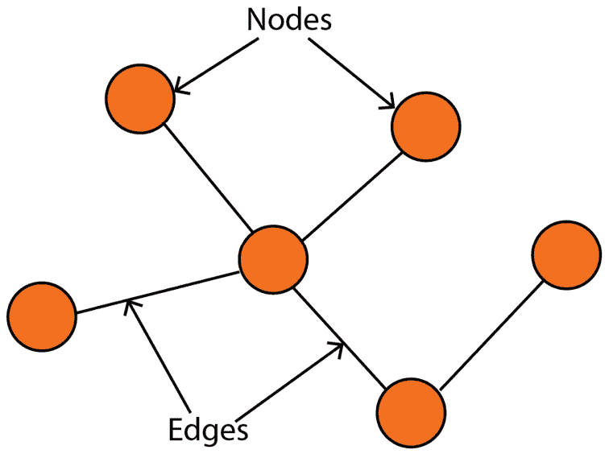
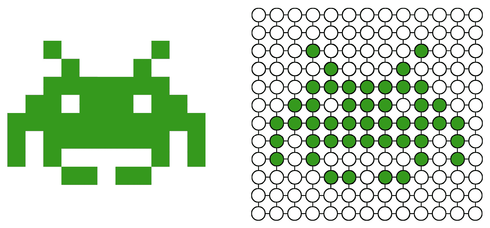
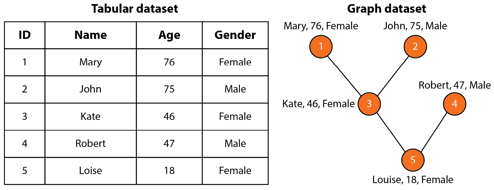
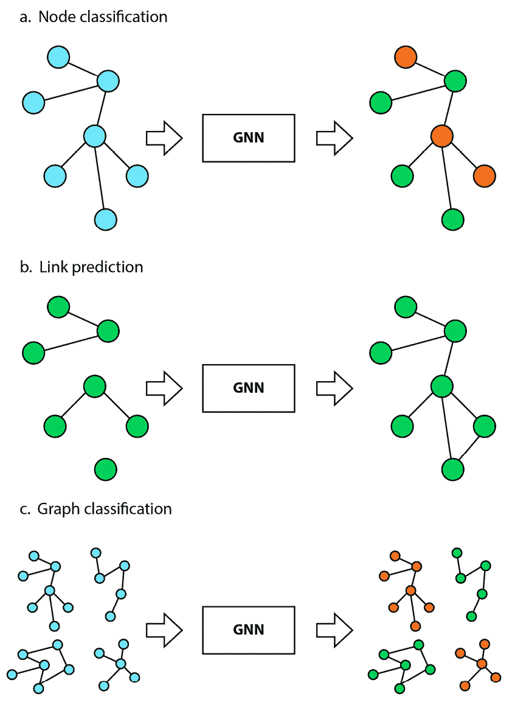
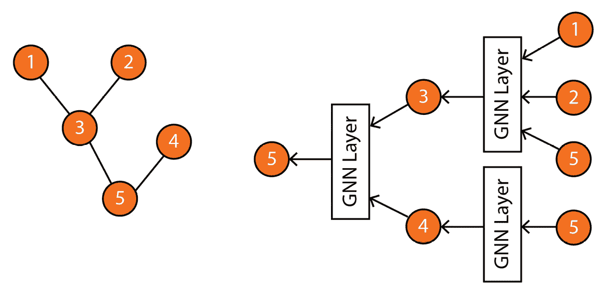

# 第一章：图学习入门

欢迎来到我们探索**图神经网络**（**GNNs**）世界的第一章。在本章中，我们将深入探讨 GNN 的基础知识，了解为什么它们是现代数据分析和机器学习中的关键工具。为此，我们将回答三个基本问题，这将为我们提供对 GNN 的全面理解。

首先，我们将探讨图作为数据表示的意义，以及为何它们在计算机科学、生物学、金融等多个领域得到广泛应用。接下来，我们将深入研究图学习的重要性，了解图学习的不同应用以及图学习技术的不同类别。最后，我们将聚焦于 GNN 家族，突出其独特的特点、性能，以及它与其他方法相比的优势。

到本章结束时，您将清楚了解为什么 GNN 重要，以及它们如何用于解决现实世界中的问题。您还将掌握深入研究更高级话题所需的知识和技能。那么，让我们开始吧！

在本章中，我们将覆盖以下主要主题：

+   为什么选择图？

+   为什么选择图学习？

+   为什么选择图神经网络？

# 为什么选择图？

我们需要回答的第一个问题是：为什么我们最初对图感兴趣？**图论**，即图的数学研究，已经成为理解复杂系统和关系的基础工具。图是一种视觉表示，由一组**节点**（也称为**顶点**）和**边**组成，这些边连接节点，为表示实体及其关系提供了结构（见*图 1.1*）。

图 1.1 – 一个包含六个节点和五条边的图示例

通过将一个复杂系统表示为由实体和它们的相互作用构成的网络，我们可以分析它们之间的关系，从而更深入地理解其潜在结构和模式。图的多功能性使其在多个领域中广受欢迎，包括以下几个领域：

+   计算机科学中，图可以用来模拟计算机程序的结构，使得理解系统中不同组件如何相互作用变得更加容易

+   物理学中，图可以用来模拟物理系统及其相互作用，例如粒子之间的关系及其属性

+   生物学中，图可以用来模拟生物系统，例如代谢途径，作为一个互联实体的网络

+   社会科学中，图可以用来研究和理解复杂的社会网络，包括社区中个体之间的关系

+   金融学中，图可以用来分析股市趋势以及不同金融工具之间的关系

+   工程学中，图形可以用于建模和分析复杂系统，例如交通网络和电力网。

这些领域自然地展示了一个关系结构。例如，图形是社交网络的自然表示：节点是用户，边代表朋友关系。但图形非常通用，它们也可以应用于那些关系结构不太自然的领域，从而解锁新的洞察和理解。

例如，图像可以表示为图形，如*图 1.2*所示。每个像素是一个节点，边代表邻近像素之间的关系。这使得基于图形的算法能够应用于图像处理和计算机视觉任务。

图 1.2 – 左：原始图像；右：该图像的图形表示

类似地，一个句子可以转换为图形，其中节点是单词，边代表相邻单词之间的关系。这种方法在自然语言处理和信息检索任务中非常有用，因为在这些任务中，单词的上下文和含义是至关重要的。

与文本和图像不同，图形没有固定的结构。然而，这种灵活性也使得图形更难处理。缺乏固定结构意味着它们可以有任意数量的节点和边，且没有特定的顺序。此外，图形还可以表示动态数据，其中实体之间的连接会随时间变化。例如，用户与产品之间的关系可能会随着他们的互动而变化。在这种情况下，节点和边会更新以反映现实世界中的变化，比如新增用户、新增产品和新增关系。

在下一节中，我们将深入探讨如何利用图形与机器学习结合，创造有价值的应用程序。

# 为什么选择图形学习？

图形学习是将机器学习技术应用于图形数据的过程。这个研究领域涵盖了一系列旨在理解和操作图形结构数据的任务。图形学习任务有很多种，以下是其中的一些：

+   **节点分类**是一个任务，涉及预测图形中节点的类别（类）。例如，它可以根据用户或物品的特征对其进行分类。在这个任务中，模型在一组已标注节点及其属性上进行训练，并利用这些信息预测未标注节点的类别。

+   **链接预测**是一个任务，涉及预测图形中一对节点之间的缺失链接。这在知识图谱补全中非常有用，目标是补全一个包含实体及其关系的图形。例如，它可以用于预测基于社交网络连接的人际关系（朋友推荐）。

+   **图分类**是一个任务，涉及将不同的图分类到预定义的类别中。一个例子是分子生物学，其中分子结构可以表示为图，目标是预测它们在药物设计中的性质。在这个任务中，模型会在一组标记图及其属性上进行训练，并利用这些信息来分类未见过的图。

+   **图生成**是一个任务，涉及根据一组期望的属性生成新图。其主要应用之一是为药物发现生成新的分子结构。这是通过在一组现有的分子结构上训练模型，并使用它生成新的、未见过的结构来实现的。生成的结构可以评估其作为药物候选物的潜力，并进一步研究。

图学习有许多其他实际应用，可以产生显著的影响。其中最著名的应用之一是**推荐系统**，在这个应用中，图学习算法根据用户之前的互动以及与其他项目的关系，向用户推荐相关的项目。另一个重要的应用是**交通预测**，图学习可以通过考虑不同路线和交通方式之间的复杂关系，改善旅行时间预测。

图学习的多功能性和潜力使其成为一个令人兴奋的研究和开发领域。随着大数据集、强大计算资源以及机器学习和人工智能技术的进步，图的研究在近年来迅速发展。因此，我们可以列出四种主要的图学习技术类别[1]：

+   **图信号处理**，它将传统的信号处理方法应用于图，如图傅里叶变换和谱分析。这些技术揭示了图的内在属性，如其连接性和结构。

+   **矩阵分解**，旨在寻找大型矩阵的低维表示。矩阵分解的目标是识别潜在因素或模式，解释原始矩阵中观察到的关系。这种方法可以提供数据的简洁且易于解释的表示。

+   **随机游走**，这是一种用于建模图中实体运动的数学概念。通过在图中模拟随机游走，可以收集节点之间关系的信息。因此，它们常常用于生成机器学习模型的训练数据。

+   **深度学习**，这是机器学习的一个子领域，专注于多层神经网络。深度学习方法可以有效地将图数据编码并表示为向量。这些向量随后可以在各种任务中使用，并且具有出色的表现。

需要注意的是，这些技术并非互相排斥，它们的应用通常有重叠。在实践中，它们常常被结合起来，形成能够利用各自优点的混合模型。例如，矩阵分解和深度学习技术可以结合使用，以学习图结构数据的低维表示。

在我们深入研究图学习的世界时，理解任何机器学习技术的基本构建块——数据集是至关重要的。传统的表格数据集，如电子表格，将数据表示为行和列，每一行代表一个数据点。然而，在许多实际场景中，数据点之间的关系与数据点本身一样重要。这就是图数据集的作用。图数据集将数据点表示为图中的节点，数据点之间的关系则表示为边。

让我们以*图 1.3*中显示的表格数据集为例。

图 1.3 – 作为表格数据集与图数据集的家谱树

这个数据集表示了一个家庭中五个成员的信息。每个成员有三个特征（或属性）：姓名、年龄和性别。然而，表格版本的数据集并没有显示这些人之间的连接。相反，图版本通过边来表示它们，这使我们能够理解这个家庭中的关系。在许多场合，节点之间的连接对理解数据至关重要，这也是为什么以图的形式表示数据越来越流行的原因。

现在我们已经对图机器学习及其涉及的不同类型的任务有了基本了解，我们可以继续探索解决这些任务的最重要方法之一：**图神经网络**。

# 为什么是图神经网络？

本书将重点介绍图学习技术中的深度学习家族，通常被称为图神经网络（GNN）。GNN 是深度学习架构中的一个新类别，专门设计用于图结构数据。与主要为文本和图像开发的传统深度学习算法不同，GNN 显式地用于处理和分析图数据集（见*图 1.4*）。

图 1.4 – 图神经网络管道的高级架构，以图为输入，输出与给定任务对应

GNN 已成为图学习的强大工具，并在多个任务和行业中展示了出色的结果。一个最引人注目的例子是 GNN 模型如何识别出一种新型抗生素[2]。该模型在 2500 个分子上进行了训练，并在 6000 个化合物的库上进行了测试。它预测了一种名为哈利辛（halicin）的分子应该能够杀死许多耐药性细菌，同时对人类细胞的毒性较低。基于这一预测，研究人员使用哈利辛治疗感染耐药性细菌的小鼠，证明了其有效性，并认为该模型可以用于设计新药物。

GNN 是如何工作的？让我们以社交网络中的节点分类任务为例，就像前面提到的家谱*（图 1.3）*。在节点分类任务中，GNN 利用来自不同来源的信息来创建每个节点的向量表示。该表示不仅包括原始节点特征（如姓名、年龄和性别），还包括来自边缘特征（如节点之间关系的强度）和全局特征（如网络统计信息）的信息。

这就是为什么 GNN 比传统的图学习技术更高效的原因。GNN 不仅限于原始属性，而是通过邻居节点、边缘和全局特征来丰富原始节点特征，使得表示更加全面且有意义。然后，新的节点表示被用于执行特定任务，例如节点分类、回归或链路预测。

具体而言，GNN 定义了一种图卷积操作，该操作从邻居节点和边缘聚合信息，以更新节点的表示。该操作是迭代执行的，随着迭代次数的增加，模型能够学习到节点之间更复杂的关系。例如，*图 1.5* 显示了 GNN 如何使用邻居节点计算节点 *5* 的表示。

图 1.5 – 左：输入图；右：计算图，表示 GNN 如何基于邻居节点计算节点 5 的表示

值得注意的是，*图 1.5* 提供了一个简化的计算图示例。实际上，GNN 有各种类型的变体和层次，每种都有其独特的结构和聚合邻居节点信息的方式。这些不同的 GNN 变体也有各自的优缺点，适用于特定类型的图数据和任务。在选择适当的 GNN 架构时，了解图数据的特性和期望的结果至关重要。

更一般来说，GNN（图神经网络）与其他深度学习技术一样，在应用于特定问题时最为有效。这些问题具有高度复杂性，这意味着学习良好的表示对于解决当前任务至关重要。例如，一个高度复杂的任务可能是从数十亿个选项中为数百万客户推荐合适的产品。另一方面，一些问题，如找到家谱中最年轻的成员，可以在没有任何机器学习技术的情况下解决。

此外，GNNs 需要大量数据才能有效执行。传统的机器学习技术在数据集较小时可能更适合，因为它们对大量数据的依赖较小。然而，这些技术的扩展性不如 GNNs。得益于并行和分布式训练，GNNs 能够处理更大的数据集。它们还可以更有效地利用额外的信息，从而产生更好的结果。

# 摘要

在本章中，我们回答了三个主要问题：为什么选择图，为什么选择图学习，为什么选择图神经网络？首先，我们探讨了图在表示各种数据类型方面的多功能性，如社交网络和交通网络，还包括文本和图像。我们讨论了图学习的不同应用，包括节点分类和图分类，并强调了图学习技术的四大类。最后，我们强调了 GNN 的意义及其相对于其他技术的优越性，特别是在大规模复杂数据集方面。通过回答这三个主要问题，我们旨在提供一个关于 GNN 重要性以及它们为何成为机器学习中重要工具的全面概述。

在*第二章*《图神经网络的图论》中，我们将深入探讨图论的基础知识，图论为理解 GNN 提供了基础。本章将介绍图论的基本概念，包括邻接矩阵和度数等概念。此外，我们将探讨不同类型的图及其应用，如有向图和无向图，以及加权图和无加权图。

# 深入阅读

+   [1] F. Xia 等人，*图学习：综述*，IEEE 人工智能学报，2021 年 4 月，第 2 卷，第 2 期，109-127 页，DOI：10.1109/tai.2021.3076021。可通过 [`arxiv.org/abs/2105.00696`](https://arxiv.org/abs/2105.00696) 获取。

+   [2] A. Trafton，*人工智能发现新抗生素*，MIT 新闻，2020 年 2 月 20 日。[在线]。可通过 [`news.mit.edu/2020/artificial-intelligence-identifies-new-antibiotic-0220`](https://news.mit.edu/2020/artificial-intelligence-identifies-new-antibiotic-0220) 获取。
