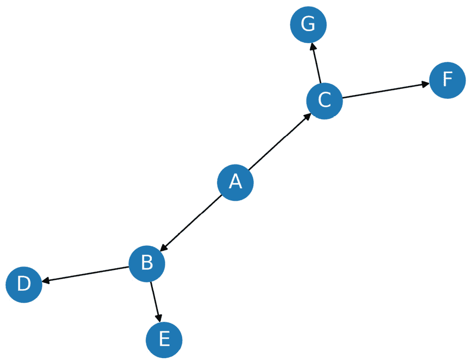
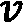

# 第二章：图论与图神经网络

**图论**是数学的一个基础分支，研究图和网络的相关内容。图是复杂数据结构的可视化表示，帮助我们理解不同实体之间的关系。图论为我们提供了建模和分析各种现实问题的工具，如交通系统、社交网络和互联网连接等。

在本章中，我们将深入探讨图论的基础知识，涵盖三个主要主题：图的属性、图的概念和图算法。我们将从定义图及其组成部分开始。然后，我们将介绍不同类型的图，并解释它们的属性和应用。接着，我们将讲解基本的图概念、对象和度量，包括邻接矩阵。最后，我们将深入讨论图算法，重点讲解两种基础算法：**广度优先搜索**（**BFS**）和**深度优先搜索**（**DFS**）。

到本章结束时，你将建立起图论的坚实基础，从而能够处理更高级的主题并设计图神经网络。

本章我们将涵盖以下主要内容：

+   介绍图的属性

+   探索图的概念

+   探索图算法

# 技术要求

本章所有的代码示例可以在 GitHub 上找到，链接：[`github.com/PacktPublishing/Hands-On-Graph-Neural-Networks-Using-Python/tree/main/Chapter02`](https://github.com/PacktPublishing/Hands-On-Graph-Neural-Networks-Using-Python/tree/main/Chapter02)。

在本书的*前言*中可以找到在本地机器上运行代码所需的安装步骤。

# 介绍图的属性

在图论中，图是由一组对象（称为**顶点**或**节点**）和一组连接（称为**边**）组成的数学结构，边连接顶点对。符号  用于表示一个图，其中  是图，  是顶点集，  是边集。

图的节点可以表示任何对象，如城市、人物、网页或分子，边表示它们之间的关系或连接，例如物理道路、社交关系、超链接或化学键。

本节提供了图的基本属性概述，这些属性将在后续章节中广泛使用。

## 有向图

图的最基本性质之一是它是有向图还是无向图。在**有向图**中，也叫**有向图**（**digraph**），每条边都有方向或指向性。这意味着边连接两个节点，并且有特定的方向，其中一个节点是源节点，另一个是目标节点。相比之下，无向图的边是无方向的，这意味着连接两个顶点的边可以在任意方向上遍历，并且访问节点的顺序无关紧要。

在 Python 中，我们可以使用`networkx`库来定义一个无向图，代码如下：`nx.Graph()`：

```py
import networkx as nx
G = nx.Graph()
G.add_edges_from([('A', 'B'), ('A', 'C'), ('B', 'D'),  
('B', 'E'), ('C', 'F'), ('C', 'G')])
```

`G`图对应以下图示：


图 2.1 – 无向图示例

创建有向图的代码类似；我们只需将`nx.Graph()`替换为`nx.DiGraph()`：

```py
DG = nx.DiGraph()
DG.add_edges_from([('A', 'B'), ('A', 'C'), ('B', 'D'),  
('B', 'E'), ('C', 'F'), ('C', 'G')])
```

`DG`图对应以下图示：



图 2.2 – 有向图示例

在有向图中，边通常使用箭头来表示其方向性，如在*图 2.2*中所示。

## 加权图

图的另一个重要属性是边是否加权。在**加权图**中，每条边都有一个与之相关的权重或代价。这些权重可以表示各种因素，如距离、旅行时间或成本。

例如，在交通网络中，边的权重可能代表不同城市之间的距离或旅行所需的时间。相比之下，无加权图的边没有权重与之关联。这些类型的图通常用于节点之间关系是二元的情况，其中边仅表示它们之间连接的存在与否。

我们可以修改之前的无向图，给边添加权重。在`networkx`中，图的边是通过包含起始节点和结束节点的元组以及指定边权重的字典来定义的：

```py
WG = nx.Graph()
WG.add_edges_from([('A', 'B', {"weight": 10}), ('A', 'C', {"weight": 20}), ('B', 'D', {"weight": 30}), ('B', 'E', {"weight": 40}), ('C', 'F', {"weight": 50}), ('C', 'G', {"weight": 60})])
labels = nx.get_edge_attributes(WG, "weight")
```

`WG`图对应以下图示：


图 2.3 – 加权图示例

## 连通图

图的连通性是图论中的一个基本概念，与图的结构和功能密切相关。

在**连通图**中，图中任意两个顶点之间都有一条路径。形式上，图是连通的，当且仅当，对于每一对和顶点，图中存在从到的路径。相反，图是不连通的，如果它不是连通的，这意味着至少有两个顶点之间没有路径连接。

`networkx`库提供了一个内置函数来验证图是否连通。在下面的例子中，第一个图包含孤立节点（`4`和`5`），与第二个图不同。这个特性在*图 2.4*中得到了可视化：

```py
G1 = nx.Graph()
G1.add_edges_from([(1, 2), (2, 3), (3, 1), (4, 5)])
print(f"Is graph 1 connected? {nx.is_connected(G1)}")
G2 = nx.Graph()
G2.add_edges_from([(1, 2), (2, 3), (3, 1), (1, 4)])
print(f"Is graph 2 connected? {nx.is_connected(G2)}")
```

这段代码会输出以下内容：

```py
Is graph 1 connected? False
Is graph 2 connected? True
```

第一个图是断开的，因为存在节点`4`和`5`。另一方面，第二个图是连通的。这个性质在小图中很容易可视化，如下图所示：


图 2.4 – 左：图 1 含有孤立节点（断开图）；右：图 2 中每个节点至少与另一个节点相连（连通图）

连通图具有一些有趣的属性和应用。例如，在通信网络中，连通图确保任何两个节点都可以通过路径相互通信。相比之下，断开图可能会包含无法与其他节点通信的孤立节点，这使得设计高效的路由算法变得更加困难。

测量图的连通性有多种方法。最常见的测量方法之一是最小割，即需要删除的最小边数，以使图断开。最小割问题在网络流优化、聚类和社区检测中有着广泛的应用。

## 图的类型

除了常见的图类型外，还有一些特殊类型的图具有独特的属性和特点：

+   **树** 是一种连通的无向图，没有环路（如*图 2.1*所示）。由于树中任意两节点之间只有一条路径，树实际上是图的一种特殊情况。树常用于建模层次结构，如家谱、组织结构或分类树。

+   **有根树** 是一种树，其中一个节点被指定为根，所有其他顶点通过唯一路径与根相连。根树常用于计算机科学中表示层次数据结构，如文件系统或 XML 文档的结构。

+   **有向无环图** (**DAG**) 是一种没有环路的有向图（如*图 2.2*所示）。这意味着边只能按照特定方向遍历，并且没有环路或回路。DAG 通常用于建模任务或事件之间的依赖关系——例如，在项目管理中或计算作业的关键路径时。

+   **二分图** 是一种图，其中顶点可以分为两个互不相交的集合，且所有边都连接不同集合中的顶点。二分图常用于数学和计算机科学中建模两种不同对象之间的关系，例如买家与卖家、员工与项目。

+   **完全图**是每对顶点之间都有一条边相连的图。完全图常用于组合学中模拟涉及所有可能的配对连接的问题，也用于计算机网络中模拟完全连接的网络。

*图 2.5* 展示了这些不同类型的图：


图 2.5 – 常见图类型

现在我们已经回顾了基本的图类型，接下来让我们探索一些最重要的图对象。理解这些概念将帮助我们更有效地分析和操作图。

# 探索图概念

在本节中，我们将探讨图论中的一些基本概念，包括图对象（如度数和邻居）、图度量（如中心性和密度），以及邻接矩阵表示法。

## 基本对象

图论中的一个关键概念是节点的**度数**，即与该节点相连的边的数量。如果一条边的端点之一是该节点，则称这条边与该节点相交。节点的度数  通常用  表示。它可以在有向图和无向图中定义：

+   在无向图中，顶点的度数是与之相连的边的数量。需要注意的是，如果节点与自身相连（称为**环**或**自环**），则它会将度数加二。

+   在有向图中，度数分为两种类型：**入度**和**出度**。节点的入度（由  表示）表示指向该节点的边的数量，而出度（由  表示）表示从该节点出发的边的数量。在这种情况下，自环会将入度和出度都加一。

入度和出度对于分析和理解有向图至关重要，因为它们提供了关于图中信息或资源分布的洞察。例如，入度较高的节点可能是重要的信息或资源来源。相反，出度较高的节点可能是重要的信息或资源的目的地或消费者。

在`networkx`中，我们可以通过内置方法简单地计算节点的度数、入度或出度。让我们对*图 2.1*中的无向图和*图 2.2*中的有向图进行计算：

```py
G = nx.Graph()
G.add_edges_from([('A', 'B'), ('A', 'C'), ('B', 'D'), ('B', 'E'), ('C', 'F'), ('C', 'G')])
print(f"deg(A) = {G.degree['A']}")
DG = nx.DiGraph()
DG.add_edges_from([('A', 'B'), ('A', 'C'), ('B', 'D'), ('B', 'E'), ('C', 'F'), ('C', 'G')])
print(f"deg^-(A) = {DG.in_degree['A']}")
print(f"deg^+(A) = {DG.out_degree['A']}")
```

这段代码输出如下结果：

```py
deg(A) = 2
deg^-(A) = 0
deg^+(A) = 2
```

我们可以将其与*图 2.1*和*图 2.2*中的图进行比较：节点  连接到两条边 ()，但不是它们的目的地 ()。

节点度的概念与**邻居**的概念相关。邻居是通过一条边直接连接到特定节点的节点。此外，如果两个节点共享至少一个共同的邻居，则称它们为**相邻**。邻居和相邻的概念对于许多图算法和应用非常基础，例如在两个节点之间寻找**路径**或识别网络中的簇。

在图论中，路径是连接图中两个（或更多）节点的边的序列。路径的长度是沿路径遍历的边的数量。路径有不同的类型，但其中有两种特别重要：

+   **简单路径**是指一个路径，在此路径中，除了起始和结束顶点外，不访问任何节点超过一次。

+   **环路**是一个路径，其中第一个和最后一个顶点是相同的。如果图中没有环路（例如树和有向无环图），则称该图为无环图。

度和路径可以用来确定节点在网络中的重要性。这个度量被称为**中心性**。

## 图度量

中心性量化了图中一个顶点或节点的重要性。它帮助我们基于节点的连接性和对信息或交互流动的影响，识别图中的关键节点。中心性有几种度量方式，每种度量方式从不同的角度衡量节点的重要性：

+   **度中心性**是最简单且最常用的中心性度量之一。它被简单地定义为节点的度数。高度中心性表示一个顶点与图中其他顶点的连接非常紧密，因此对网络有着重要的影响。

+   **接近中心性**衡量一个节点与图中所有其他节点的接近程度。它对应于目标节点与图中所有其他节点之间最短路径的平均长度。具有高接近中心性的节点能够迅速到达网络中的所有其他顶点。

+   **介数中心性**衡量一个节点在图中两个其他节点之间的最短路径上出现的次数。具有高介数中心性的节点充当图中不同部分之间的瓶颈或桥梁。

让我们使用`networkx`的内置函数在我们之前的图中计算这些度量，并分析结果：

```py
print(f"Degree centrality      = {nx.degree_centrality(G)}")
print(f"Closeness centrality   = {nx.closeness_centrality(G)}")
print(f"Betweenness centrality = {nx.betweenness_centrality(G)}")
```

之前的代码会打印包含每个节点得分的字典：

```py
Degree centrality      = {'A': 0.333, 'B': 0.5, 'C': 0.5, 'D': 0.167, 'E': 0.167, 'F': 0.167, 'G': 0.167}
Closeness centrality   = {'A': 0.6, 'B': 0.545, 'C': 0.545, 'D': 0.375, 'E': 0.375, 'F': 0.375, 'G': 0.375}
Betweenness centrality = {'A': 0.6, 'B': 0.6, 'C': 0.6, 'D': 0.0, 'E': 0.0, 'F': 0.0, 'G': 0.0}
```

图中节点、和的重要性取决于使用的中心性类型。度中心性认为节点和更重要，因为它们有比节点更多的邻居。然而，在接近中心性中，节点最为重要，因为它可以通过最短路径到达图中的任何其他节点。另一方面，节点、和具有相同的介数中心性，因为它们都位于其他节点之间许多最短路径上。

除了这些措施，我们将在接下来的章节中看到如何使用机器学习技术计算一个节点的重要性。然而，这并不是我们将要讨论的唯一指标。

确实，**密度**是另一个重要的度量，表示图的连通性。它是图中实际边数与最大可能边数的比率。一个高密度的图被认为更为连通，并且比低密度图有更多的信息流动。

计算密度的公式取决于图是否是有向图或无向图。对于一个包含个节点的无向图，最大可能的边数是。对于一个包含个节点的有向图，最大边数是。

图的密度是通过边的数量除以最大边数来计算的。例如，*图 2**.1*中的图有条边，最大可能的边数为。因此，其密度为。

一个密集的图的密度接近 1，而一个稀疏的图的密度接近 0。对于密集图或稀疏图没有严格的定义，但一般来说，如果图的密度大于 0.5，则认为它是密集的；如果密度小于 0.1，则认为它是稀疏的。这个指标直接与图的一个基本问题相关：如何表示**邻接矩阵**。

## 邻接矩阵表示法

邻接矩阵是表示图中边的矩阵，其中每个单元格指示两个节点之间是否有边。该矩阵是一个大小为的方阵，其中是图中节点的数量。单元格中的值表示节点和节点之间有边，而值表示没有边。对于无向图，矩阵是对称的，而对于有向图，矩阵不一定是对称的。

下图表示与图相关的邻接矩阵：


图 2.6 – 邻接矩阵示例

在 Python 中，它可以实现为一个列表的列表，如下面的示例所示：

```py
adj = [[0,1,1,0,0,0,0],
       [1,0,0,1,1,0,0],
       [1,0,0,0,0,1,1],
       [0,1,0,0,0,0,0],
       [0,1,0,0,0,0,0],
       [0,0,1,0,0,0,0],
       [0,0,1,0,0,0,0]]
```

邻接矩阵是一种简单直观的表示方式，可以轻松地将其可视化为二维数组。使用邻接矩阵的一个主要优点是检查两个节点是否连接是一个常数时间操作。这使得它成为测试图中边存在与否的高效方式。此外，它还用于执行矩阵操作，这对于某些图算法很有用，例如计算两个节点之间的最短路径。

然而，添加或删除节点可能会很昂贵，因为矩阵需要调整大小或移动。使用邻接矩阵的主要缺点之一是其空间复杂度：随着图中节点数量的增加，存储邻接矩阵所需的空间呈指数增长。形式上，我们说邻接矩阵的空间复杂度为，其中表示图中节点的数量。

总的来说，虽然邻接矩阵是表示小型图的有用数据结构，但由于其空间复杂度，对于较大的图来说可能不太实际。此外，添加或删除节点的开销可能使其在动态变化的图中效率低下。

这就是为什么其他表示方式可能会很有帮助的原因。例如，存储图的另一种流行方式是`networkx`：

```py
edge_list = [(0, 1), (0, 2), (1, 3), (1, 4), (2, 5), (2, 6)]
```

当我们比较两种数据结构在我们的图中的应用时，很明显边列表更简洁。这是因为我们的图是相对稀疏的。另一方面，如果我们的图是完全图，我们将需要 21 个元组，而不是 6 个。这是由空间复杂度解释的，其中是边的数量。边列表在存储稀疏图时更为高效，在这种情况下，边的数量远小于节点的数量。

然而，在边表中检查两个顶点是否相连，需要遍历整个列表，对于拥有大量边的大型图，这也是耗时的。因此，边表更常用于空间有限的应用中。

第三种也是常用的表示方式是**邻接表**。它由一系列对组成，其中每对表示图中的一个节点及其相邻的节点。根据实现方式，节点对可以存储在链表、字典或其他数据结构中。例如，我们图的邻接表可能如下所示：

```py
adj_list = {
    0: [1, 2],
    1: [0, 3, 4],
    2: [0, 5, 6],
    3: [1],
    4: [1],
    5: [2],
    6: [2]
}
```

相比邻接矩阵或边表，邻接表有几个优点。首先，空间复杂度是 ，其中  是节点数， 是边数。对于稀疏图，这比邻接矩阵的空间复杂度  更高效。其次，它允许高效地迭代节点的相邻顶点，这在许多图算法中非常有用。最后，添加节点或边可以在常数时间内完成。

然而，检查两个顶点是否相连可能比邻接矩阵慢。这是因为它需要遍历其中一个顶点的邻接表，而对于大型图来说，这可能会非常耗时。

每种数据结构都有其自身的优缺点，这取决于具体的应用和需求。在下一节中，我们将处理图，并介绍两种最基础的图算法。

# 探索图算法

图算法在解决与图相关的问题时至关重要，比如寻找两个节点之间的最短路径或检测环路。本节将讨论两种图遍历算法：BFS 和 DFS。

## 广度优先搜索

BFS 是一种图遍历算法，它从根节点开始，首先探索特定层次的所有相邻节点，然后再进入下一层的节点。它通过维护一个待访问节点的队列来工作，并在节点被加入队列时标记该节点已访问。然后，算法出队队列中的下一个节点，并探索其所有相邻节点，如果这些节点还没有被访问过，就将它们加入队列。

BFS 的行为如*图 2.7*所示：


图 2.7 – 广度优先搜索遍历图的示例

现在让我们看看如何在 Python 中实现它：

1.  我们创建一个空图并使用`add_edges_from()`方法添加边：

    ```py
    G = nx.Graph()
    G.add_edges_from([('A', 'B'), ('A', 'C'), ('B', 'D'), ('B', 'E'), ('C', 'F'), ('C', 'G')])
    ```

1.  我们定义了一个名为`bfs()`的函数，来实现图的 BFS 算法。该函数接受两个参数：`graph`对象和搜索的起始节点：

    ```py
    def bfs(graph, node):
    ```

1.  我们初始化两个列表（`visited`和`queue`），并添加起始节点。`visited`列表用于跟踪在搜索过程中已经访问过的节点，而`queue`列表则存储需要访问的节点：

    ```py
        visited, queue = [node], [node]
    ```

1.  我们进入一个`while`循环，直到`queue`列表为空。在循环内部，我们使用`pop(0)`方法删除`queue`列表中的第一个节点，并将结果存储在`node`变量中：

    ```py
        while queue:
            node = queue.pop(0)
    ```

1.  我们使用`for`循环遍历该节点的邻居。对于每个尚未访问的邻居，我们将其添加到`visited`列表，并将其添加到`queue`列表的末尾，使用`append()`方法。当完成后，我们返回`visited`列表：

    ```py
            for neighbor in graph[node]:
                if neighbor not in visited:
                    visited.append(neighbor)
                    queue.append(neighbor)
        return visited
    ```

1.  我们调用`bfs()`函数，并传入`G`参数和`'A'`起始节点：

    ```py
    bfs(G, 'A')
    ```

1.  函数返回按访问顺序排列的已访问节点列表：

    ```py
    ['A', 'B', 'C', 'D', 'E', 'F', 'G']
    ```

我们得到的顺序是我们在*图 2.7*中预期的顺序。

BFS 在无权图中寻找两个节点之间最短路径时特别有用。因为该算法按照节点与起始节点的距离顺序访问节点，所以当目标节点第一次被访问时，必定是沿着从起始节点到目标节点的最短路径。

除了寻找最短路径，BFS 还可以用来检查图是否连通，或寻找图的所有连通分量。它还被应用于诸如网页爬虫、社交网络分析和网络中的最短路径路由等场景。

BFS 的时间复杂度是，其中是节点数，是图中的边数。这对于高连接度图或者稀疏图来说可能是一个显著的问题。为了解决这个问题，已经开发了几种 BFS 的变体，如**双向 BFS**和**A***搜索，这些变体使用启发式方法来减少需要探索的节点数。

## 深度优先搜索

DFS 是一种递归算法，它从根节点开始，在每个分支上尽可能深入，直到无法再深入，然后回溯。

它选择一个节点，探索所有未访问的邻居，访问第一个未被探索的邻居，只有在所有邻居都已被访问过时才回溯。这样，它通过尽可能深入地沿着从起始节点出发的路径进行图的探索，然后再回溯去探索其他分支。这个过程会一直持续，直到所有节点都被探索过。

DFS 的行为如*图 2.8*所示：


图 2.8 – 深度优先搜索的图遍历示例

让我们在 Python 中实现 DFS：

1.  我们首先初始化一个空的列表`visited`：

    ```py
    visited = []
    ```

1.  我们定义了一个名为`dfs()`的函数，该函数接受`visited`、`graph`和`node`作为参数：

    ```py
    def dfs(visited, graph, node):
    ```

1.  如果当前的`node`不在`visited`列表中，我们将其添加到该列表：

    ```py
        if node not in visited:
            visited.append(node)
    ```

1.  然后我们遍历当前`node`的每一个邻居。对于每个邻居，我们递归调用`dfs()`函数，传入`visited`、`graph`和邻居作为参数：

    ```py
            for neighbor in graph[node]:
                visited = dfs(visited, graph, neighbor)
    ```

1.  `dfs()`函数继续深度优先地遍历图，访问每个节点的所有邻居，直到没有更多未访问的邻居。最后，返回`visited`列表：

    ```py
        return visited
    ```

1.  我们调用`dfs()`函数，`visited`设置为空列表，`G`作为图，`'A'`作为起始节点：

    ```py
    dfs(visited, G, 'A')
    ```

1.  该函数返回按访问顺序排列的访问节点列表：

    ```py
    ['A', 'B', 'D', 'E', 'C', 'F', 'G']
    ```

再次地，我们得到的顺序与*图 2**.8*中的预期顺序一致。

DFS 在解决各种问题时非常有用，例如查找连通分量、拓扑排序和解决迷宫问题。它特别适用于在图中查找环，因为它以深度优先的顺序遍历图，只有在遍历过程中某个节点被访问两次时，才说明图中存在环。

和 BFS 一样，它的时间复杂度是，其中是节点的数量，是图中的边的数量。它需要的内存较少，但不能保证最短路径解。最后，与 BFS 不同的是，使用 DFS 时可能会陷入无限循环。

此外，图论中的许多其他算法都基于 BFS 和 DFS，例如 Dijkstra 最短路径算法、Kruskal 最小生成树算法和 Tarjan 强连通分量算法。因此，深入理解 BFS 和 DFS 对于任何想从事图相关工作并开发更高级图算法的人来说，都是至关重要的。

# 总结

在本章中，我们介绍了图论的基本知识，图论是研究图和网络的数学分支。我们首先定义了图的概念，并解释了不同类型的图，如有向图、加权图和连通图。然后我们介绍了基本的图对象（包括邻居）和度量（如中心性和密度），这些概念用于理解和分析图结构。

此外，我们讨论了邻接矩阵及其不同的表示方法。最后，我们探讨了两个基础的图算法，BFS 和 DFS，它们构成了开发更复杂图算法的基础。

在*第三章*，*使用 DeepWalk 创建节点表示*中，我们将探讨 DeepWalk 架构及其两个组成部分：Word2Vec 和随机游走。我们将首先了解 Word2Vec 架构，然后使用专门的库实现它。接着，我们将深入研究 DeepWalk 算法，并在图上实现随机游走。
