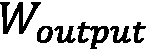
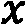
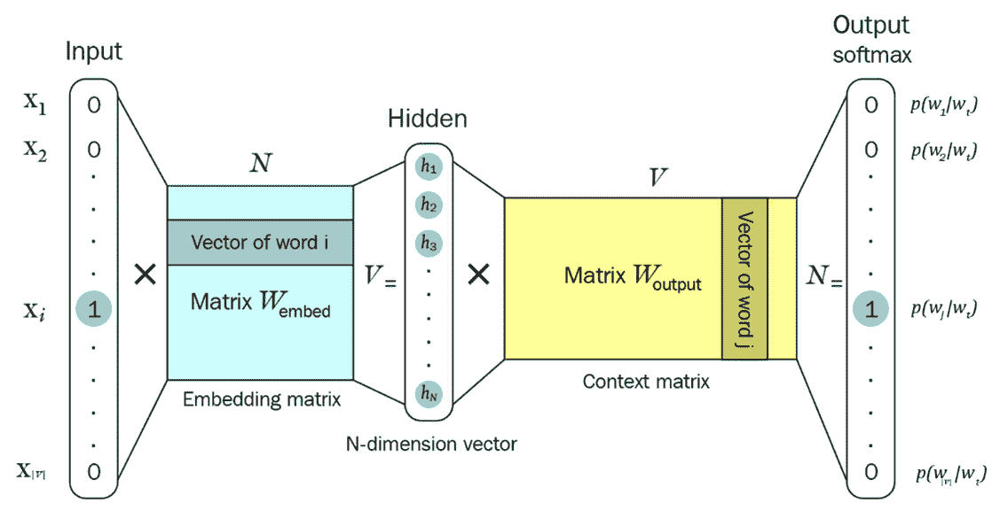
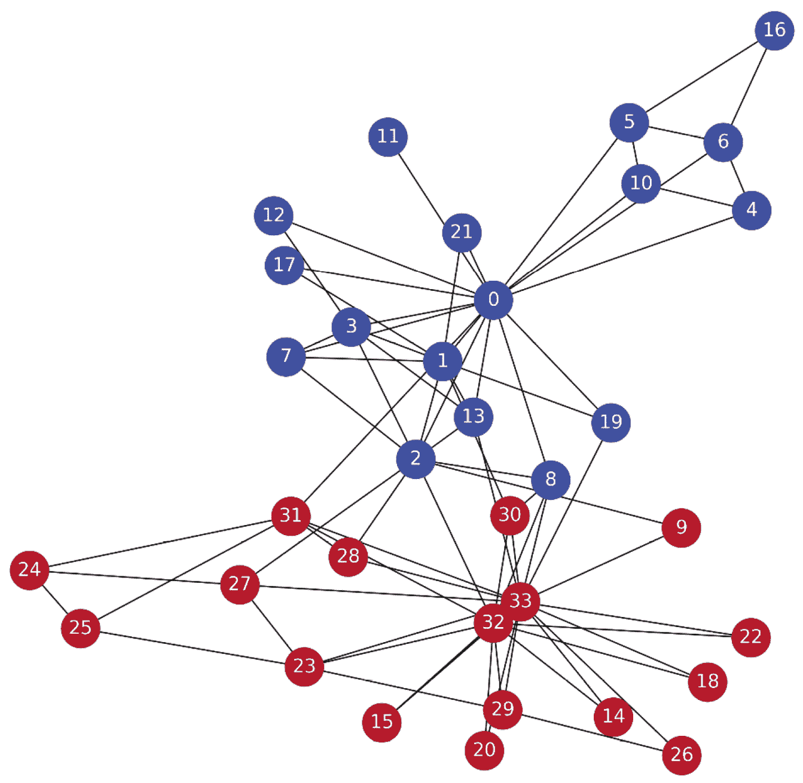

# 第三章：使用 DeepWalk 创建节点表示

**DeepWalk** 是**机器学习**（**ML**）技术在图数据中最早且最成功的应用之一。它引入了像嵌入（embeddings）这样的重要概念，这些概念是图神经网络（GNN）核心的一部分。与传统的神经网络不同，该架构的目标是生成**表示**，这些表示会被传递给其他模型，后者执行下游任务（例如，节点分类）。

在本章中，我们将学习 DeepWalk 架构及其两个主要组成部分：在**自然语言处理**（**NLP**）的例子中使用 `gensim` 库来理解它应该如何使用。

然后，我们将专注于 DeepWalk 算法，看看如何使用**层次化 softmax**（**H-Softmax**）提高性能。这个强大的 softmax 函数优化在许多领域都可以找到：当您的分类任务中有大量可能的类别时，它非常有用。我们还将在图上实现随机游走，最后通过一个关于 Zachary’s Karate Club 的端到端监督分类练习来总结。

在本章结束时，您将掌握 Word2Vec 在 NLP 及其他领域中的应用。您将能够使用图的拓扑信息创建节点嵌入，并在图数据上解决分类任务。

在本章中，我们将涵盖以下主要主题：

+   介绍 Word2Vec

+   DeepWalk 和随机游走

+   实现 DeepWalk

# 技术要求

本章中的所有代码示例可以在 GitHub 上找到：[`github.com/PacktPublishing/Hands-On-Graph-Neural-Networks-Using-Python/tree/main/Chapter03`](https://github.com/PacktPublishing/Hands-On-Graph-Neural-Networks-Using-Python/tree/main/Chapter03)。运行代码所需的安装步骤可以在本书的*前言*部分找到。

# 介绍 Word2Vec

理解 DeepWalk 算法的第一步是理解其主要组成部分：Word2Vec。

Word2Vec 是自然语言处理（NLP）中最具影响力的深度学习技术之一。由 Tomas Mikolov 等人（谷歌）于 2013 年在两篇不同的论文中发布，它提出了一种新技术，通过使用大量的文本数据集将单词转换为向量（也称为**嵌入**）。这些表示可以在下游任务中使用，如情感分类。它也是少数几种已获得专利且广受欢迎的机器学习架构之一。

下面是一些 Word2Vec 如何将单词转换为向量的例子：


在这个例子中，我们可以看到，按照欧几里得距离，*king*（国王）和*queen*（女王）的词向量距离比*king*（国王）和*woman*（女人）更近（4.37 与 8.47）。通常，其他度量方法，如流行的**余弦相似度**，用于衡量这些单词的相似度。余弦相似度关注的是向量之间的角度，而不考虑它们的大小（长度），这在比较向量时更为有用。其定义如下：


Word2Vec 最令人惊讶的结果之一是其解决类比问题的能力。一个流行的例子是它如何回答问题：“*man is to woman, what king is to ___?*”（男人与女人的关系，国王与 ___ 的关系？）它可以按如下方式计算：


这并不适用于所有类比，但这一特性可以为使用嵌入进行算术操作带来有趣的应用。

## CBOW 与跳字模型的对比

模型必须在一个预设任务上进行训练，以生成这些向量。任务本身不需要具有实际意义：其唯一目标是生成高质量的嵌入。在实践中，这个任务通常与根据特定上下文预测单词相关。

作者提出了两种架构，执行相似任务：

+   **连续袋词（CBOW）模型**：这个模型通过上下文（目标词前后出现的单词）来预测一个单词。由于上下文单词的嵌入在模型中会被求和，所以上下文单词的顺序并不重要。作者称，通过使用目标词前后各四个单词，能够获得更好的结果。

+   **连续跳字模型**：在这里，我们将一个单词输入模型，并尝试预测其周围的单词。增加上下文单词的范围可以得到更好的嵌入，但也会增加训练时间。

总结来说，以下是两种模型的输入和输出：


图 3.1 – CBOW 和跳字模型架构

一般来说，CBOW 模型被认为训练速度较快，但跳字模型更准确，因为它能够学习不常见的单词。这个话题在 NLP 社区中仍然存在争议：不同的实现方式可能会解决某些情况下 CBOW 的问题。

## 创建跳字模型

目前，我们将专注于跳字模型，因为它是 DeepWalk 使用的架构。跳字模型以单词对的形式实现，结构如下：，其中  是输入， 是待预测的单词。同一目标词的跳字对数依赖于一个叫做**上下文大小**的参数，如 *图 3.2* 所示：


图 3.2 – 跳字模型

相同的思路可以应用于文本语料库，而不仅仅是单个句子。

在实际操作中，我们将相同目标词的所有上下文词汇存储在一个列表中，以节省内存。让我们通过一个完整段落的例子来看看这是如何做到的。

在以下示例中，我们为存储在 `text` 变量中的整个段落创建了 skip-grams。我们将 `CONTEXT_SIZE` 变量设置为 `2`，意味着我们将查看目标词前后各两个词：

1.  让我们开始导入必要的库：

    ```py
    import numpy as np
    ```

1.  然后，我们需要将 `CONTEXT_SIZE` 变量设置为 `2`，并引入我们想要分析的文本：

    ```py
    CONTEXT_SIZE = 2
    text = """Lorem ipsum dolor sit amet, consectetur adipiscing elit. Nunc eu sem scelerisque, dictum eros aliquam, accumsan quam. Pellentesque tempus, lorem ut semper fermentum, ante turpis accumsan ex, sit amet ultricies tortor erat quis nulla. Nunc consectetur ligula sit amet purus porttitor, vel tempus tortor scelerisque. Vestibulum ante ipsum primis in faucibus orci luctus et ultrices posuere cubilia curae; Quisque suscipit ligula nec faucibus accumsan. Duis vulputate massa sit amet viverra hendrerit. Integer maximus quis sapien id convallis. Donec elementum placerat ex laoreet gravida. Praesent quis enim facilisis, bibendum est nec, pharetra ex. Etiam pharetra congue justo, eget imperdiet diam varius non. Mauris dolor lectus, interdum in laoreet quis, faucibus vitae velit. Donec lacinia dui eget maximus cursus. Class aptent taciti sociosqu ad litora torquent per conubia nostra, per inceptos himenaeos. Vivamus tincidunt velit eget nisi ornare convallis. Pellentesque habitant morbi tristique senectus et netus et malesuada fames ac turpis egestas. Donec tristique ultrices tortor at accumsan.
    """.split()
    ```

1.  接下来，我们通过一个简单的 `for` 循环来创建 skip-grams，考虑 `text` 中的每个词。列表推导式生成上下文词汇，并将其存储在 `skipgrams` 列表中：

    ```py
    skipgrams = []
    for i in range(CONTEXT_SIZE, len(text) - CONTEXT_SIZE):
        array = [text[j] for j in np.arange(i - CONTEXT_SIZE, i + CONTEXT_SIZE + 1) if j != i]
        skipgrams.append((text[i], array))
    ```

1.  最后，使用 `print()` 函数查看我们生成的 skip-grams：

    ```py
    print(skipgrams[0:2])
    ```

1.  这会产生如下输出：

    ```py
    [('dolor', ['Lorem', 'ipsum', 'sit', 'amet,']), ('sit', ['ipsum', 'dolor', 'amet,', 'consectetur'])]
    ```

这两个目标词及其对应的上下文，展示了 Word2Vec 输入数据的样子。

## Skip-gram 模型

Word2Vec 的目标是生成高质量的词向量。为了学习这些词向量，skip-gram 模型的训练任务包括给定目标词，预测正确的上下文词汇。

假设我们有一个词汇序列  和 。给定词语 ，看到词语  的概率写作 。我们的目标是最大化在整篇文本中，看到每个上下文词汇给定目标词汇的概率之和：


其中  是上下文向量的大小。

注意

为什么我们在之前的方程式中使用对数概率？将概率转换为对数概率是机器学习（以及计算机科学一般）中常见的技术，主要有两个原因。

加法变成了加法（除法变成了减法）。乘法的计算开销比加法大，因此计算对数概率更快：


计算机存储非常小的数字（如 3.14e-128）并不完全准确，而同样数字的对数（在此案例中为 -127.5）却非常精确。这些小的误差会累积，并在事件极不可能发生时影响最终结果。

总的来说，这个简单的转换让我们在不改变初始目标的情况下，获得了更快的速度和更高的准确性。

基本的 skip-gram 模型使用 softmax 函数来计算给定目标词向量  的上下文词向量  的概率：


其中  是大小为  的词汇表。这个词汇表对应模型尝试预测的唯一词汇列表。我们可以使用 `set` 数据结构去除重复的词汇来获取这个列表：

```py
vocab = set(text)
VOCAB_SIZE = len(vocab)
print(f"Length of vocabulary = {VOCAB_SIZE}")
```

这会给我们如下输出：

```py
Length of vocabulary = 121
```

现在我们已经知道了词汇表的大小，还有一个参数需要定义： ，即词向量的维度。通常，这个值设置在 100 到 1,000 之间。在这个示例中，由于数据集的大小有限，我们将其设置为 10。

Skip-gram 模型由仅两个层组成：

+   一个 **投影层**，其权重矩阵为 ，该层以独热编码的词向量作为输入，并返回相应的 -维词嵌入。它充当一个简单的查找表，存储预定义维度的嵌入。

+   一个 **全连接层**，其权重矩阵为 ，该层以词嵌入作为输入并输出 -维的 logits。对这些预测应用 softmax 函数，以将 logits 转换为概率。

注意

没有激活函数：Word2Vec 是一个线性分类器，它建模单词之间的线性关系。

我们将  称为独热编码的词向量，作为 *输入*。相应的词嵌入可以通过简单的投影来计算：


使用 skip-gram 模型，我们可以将先前的概率重写为以下形式：


Skip-gram 模型输出一个 -维向量，这是词汇表中每个单词的条件概率：


在训练过程中，这些概率会与正确的独热编码目标词向量进行比较。通过损失函数（如交叉熵损失）计算的这些值之间的差异会通过网络进行反向传播，以更新权重并获得更好的预测结果。

整个 Word2Vec 架构在以下图示中进行了总结，包含了矩阵和最终的 softmax 层：



图 3.3 – Word2Vec 架构

我们可以使用 `gensim` 库来实现这个模型，`gensim` 也被官方用于 DeepWalk 的实现。然后我们可以根据前面的文本构建词汇表并训练我们的模型：

1.  首先，让我们安装 `gensim` 并导入 `Word2Vec` 类：

    ```py
    !pip install -qU gensim
    from gensim.models.word2vec import Word2Vec
    ```

1.  我们使用 `Word2Vec` 对象和 `sg=1` 参数（skip-gram = 1）初始化一个 skip-gram 模型：

    ```py
    model = Word2Vec([text],
                     sg=1,   # Skip-gram
                     vector_size=10,
                     min_count=0,
                     window=2,
                     workers=2,
                     seed=0)
    ```

1.  检查我们第一个权重矩阵的形状是个好主意。它应当与词汇表的大小以及词嵌入的维度相对应：

    ```py
    print(f'Shape of W_embed: {model.wv.vectors.shape}')
    ```

1.  这会生成以下输出：

    ```py
    Shape of W_embed = (121, 10)
    ```

1.  接下来，我们训练模型 `10` 轮：

    ```py
    model.train([text], total_examples=model.corpus_count, epochs=10)
    ```

1.  最后，我们可以打印一个词嵌入，以查看该训练的结果是怎样的：

    ```py
    print('Word embedding =')
    print(model.wv[0])
    ```

1.  这将给我们以下输出：

    ```py
    Word embedding =
    [ 0.06947816 -0.06254371 -0.08287395  0.07274164 -0.09449387  0.01215031  -0.08728203 -0.04045384 -0.00368091 -0.0141237 ]
    ```

虽然这种方法在小词汇量的情况下效果很好，但将完整 softmax 函数应用于数百万个词汇（词汇量）的计算成本在大多数情况下是太高昂的。长期以来，这一点一直是开发准确语言模型的一个限制因素。幸运的是，已经设计出其他方法来解决这个问题。

Word2Vec（以及 DeepWalk）实现了其中一种技术，称为 H-Softmax。这种技术不是直接计算每个词的概率的平坦 softmax，而是使用一个二叉树结构，其中叶子是单词。更有趣的是，可以使用哈夫曼树，其中罕见的单词存储在比常见单词更深的层级。在大多数情况下，这显著加快了至少 50 倍的单词预测速度。

在 `gensim` 中可以通过设置 `hs=1` 来激活 H-Softmax。

这是 DeepWalk 结构中最困难的部分。但在我们实施之前，我们需要一个额外的组件：如何创建我们的训练数据。

# DeepWalk 和随机游走

Perozzi 等人在 2014 年提出了 DeepWalk，迅速在图研究领域中广受欢迎。受到近年来在自然语言处理中的进展的启发，DeepWalk 在多个数据集上一直优于其他方法。尽管此后提出了更高性能的架构，DeepWalk 是一个可以快速实现并解决许多问题的简单可靠基准。

DeepWalk 的目标是以无监督方式生成节点的高质量特征表示。这种结构受到 NLP 中 Word2Vec 的启发。然而，我们的数据集由节点组成，而不是单词。这就是为什么我们使用随机游走生成像句子一样的有意义节点序列。以下图示说明了句子和图之间的关系：


图 3.4 – 句子可以被表示为图形

随机游走是通过在每一步随机选择一个相邻节点来产生的节点序列。因此，节点可以在同一序列中出现多次。

为什么随机游走很重要？即使节点是随机选择的，它们经常在序列中一起出现的事实意味着它们彼此接近。根据**网络同质性**假设，彼此接近的节点是相似的。这在社交网络中尤为明显，人们通过朋友和家人连接在一起。

这个想法是 DeepWalk 算法的核心：当节点彼此接近时，我们希望获得高相似度分数。相反，当它们相距较远时，我们希望得到低分数。

让我们使用 `networkx` 图实现一个随机游走函数：

1.  让我们导入所需的库并为了可重复性初始化随机数生成器：

    ```py
    import networkx as nx
    import matplotlib.pyplot as plt
    import numpy as np
    import random
    random.seed(0)
    ```

1.  我们通过使用固定节点数目（`10`）和预定义的两节点之间创建边的概率（`0.3`）来生成一个随机图。

    ```py
    G = nx.erdos_renyi_graph(10, 0.3, seed=1, directed=False)
    ```

1.  我们绘制这个随机图来看它的样子：

    ```py
    plt.figure(dpi=300)
    plt.axis('off')
    nx.draw_networkx(G,
                     pos=nx.spring_layout(G, seed=0),
                     node_size=600,
                     cmap='coolwarm',
                     font_size=14,
                     font_color='white'
                     )
    ```

这将生成以下图形：


图 3.5 – 随机图

1.  让我们用一个简单的函数来实现随机游走。这个函数有两个参数：起始节点（`start`）和游走的长度（`length`）。每一步，我们随机选择一个邻近的节点（使用`np.random.choice`），直到游走完成：

    ```py
    def random_walk(start, length):
        walk = [str(start)]  # starting node
        for i in range(length):
            neighbors = [node for node in G.neighbors(start)]
            next_node = np.random.choice(neighbors, 1)[0]
            walk.append(str(next_node))
            start = next_node
        return walk
    ```

1.  接下来，我们用起始节点`0`和长度为`10`来打印这个函数的结果：

    ```py
    print(random_walk(0, 10))
    ```

1.  这将生成以下列表：

    ```py
    ['0', '4', '3', '6', '3', '4', '7', '8', '7', '4', '9']
    ```

我们可以看到，某些节点，如`0`和`9`，经常一起出现。考虑到这是一个同质性图，意味着它们是相似的。这正是我们希望通过 DeepWalk 捕捉的关系类型。

现在我们已经分别实现了 Word2Vec 和随机游走，让我们将它们结合起来创建 DeepWalk。

# 实现 DeepWalk

现在我们已经对架构中的每个组件有了很好的理解，让我们用它来解决一个机器学习问题。

我们将使用的数据集是 Zachary 的空手道俱乐部。它简单地表示 1970 年代 Wayne W. Zachary 研究的一个空手道俱乐部内的关系。这是一个社交网络，每个节点是一个成员，而在俱乐部外部互动的成员是相互连接的。

在这个例子中，俱乐部被分成了两组：我们希望通过查看每个成员的连接，将正确的组分配给每个成员（节点分类）：

1.  让我们使用`nx.karate_club_graph()`导入数据集：

    ```py
    G = nx.karate_club_graph()
    ```

1.  接下来，我们需要将字符串类型的类别标签转换为数值（Mr. Hi = `0`，`Officer` = `1`）：

    ```py
    labels = []
    for node in G.nodes:
        label = G.nodes[node]['club']
        labels.append(1 if label == 'Officer' else 0)
    ```

1.  让我们使用新的标签绘制这个图：

    ```py
    plt.figure(figsize=(12,12), dpi=300)
    plt.axis('off')
    nx.draw_networkx(G,
                     pos=nx.spring_layout(G, seed=0),
                     node_color=labels,
                     node_size=800,
                     cmap='coolwarm',
                     font_size=14,
                     font_color='white'
                     )
    ```



图 3.6 – Zachary’s Karate Club

1.  下一步是生成我们的数据集，即随机游走。我们希望尽可能全面，这就是为什么我们会为图中的每个节点创建`80`个长度为`10`的随机游走：

    ```py
    walks = []
    for node in G.nodes:
        for _ in range(80):
            walks.append(random_walk(node, 10))
    ```

1.  让我们打印一个游走来验证它是否正确：

    ```py
    print(walks[0])
    ```

1.  这是生成的第一次随机游走：

    ```py
    ['0', '19', '1', '2', '0', '3', '2', '8', '33', '14', '33']
    ```

1.  最后一步是实现 Word2Vec。在这里，我们使用先前看到的带有 H-Softmax 的 skip-gram 模型。你可以调整其他参数来提高嵌入的质量：

    ```py
    model = Word2Vec(walks,
                     hs=1,   # Hierarchical softmax
                     sg=1,   # Skip-gram
                     vector_size=100,
                     window=10,
                     workers=2,
                     seed=0)
    ```

1.  然后，模型只需要在我们生成的随机游走上进行训练。

    ```py
    model.train(walks, total_examples=model.corpus_count, epochs=30, report_delay=1)
    ```

1.  现在我们的模型已经训练完成，让我们看看它的不同应用。第一个应用是允许我们找到与给定节点最相似的节点（基于余弦相似度）：

    ```py
    print('Nodes that are the most similar to node 0:')
    for similarity in model.wv.most_similar(positive=['0']):
        print(f'   {similarity}')
    ```

这将产生以下输出：`与 node 0 最相似的节点`：

```py
   ('4', 0.6825815439224243)
   ('11', 0.6330500245094299)
   ('5', 0.6324777603149414)
   ('10', 0.6097837090492249)
   ('6', 0.6096848249435425)
   ('21', 0.5936519503593445)
   ('12', 0.5906376242637634)
   ('3', 0.5797219276428223)
   ('16', 0.5388344526290894)
   ('13', 0.534131646156311)
```

另一个重要的应用是计算两个节点之间的相似度分数。可以如下进行：

```py
# Similarity between two nodes
print(f"Similarity between node 0 and 4: {model.wv.similarity('0', '4')}")
```

这段代码直接给出了两个节点之间的余弦相似度：

```py
Similarity between node 0 and 4: 0.6825816631317139
```

我们可以使用**t 分布随机邻居嵌入**（**t-SNE**）绘制结果嵌入图，将这些高维向量可视化为 2D：

1.  我们从`sklearn`导入`TSNE`类：

    ```py
    from sklearn.manifold import TSNE
    ```

1.  我们创建两个数组：一个用于存储词嵌入，另一个用于存储标签：

    ```py
    nodes_wv = np.array([model.wv.get_vector(str(i)) for i in range(len(model.wv))])
    labels = np.array(labels)
    ```

1.  接下来，我们使用两维（`n_components=2`）的 t-SNE 模型对嵌入进行训练：

    ```py
    tsne = TSNE(n_components=2,
                learning_rate='auto',
                init='pca',
                random_state=0).fit_transform(nodes_wv)
    ```

1.  最后，让我们绘制训练好的 t-SNE 模型生成的二维向量，并标注对应的标签：

    ```py
    plt.figure(figsize=(6, 6), dpi=300)
    plt.scatter(tsne[:, 0], tsne[:, 1], s=100, c=labels, cmap="coolwarm")
    plt.show()
    ```


图 3.7 – 节点的 t-SNE 图

这个图表相当鼓舞人心，因为我们可以看到一个清晰的分界线将两个类别分开。一个简单的机器学习算法应该能够在足够的样本（训练数据）下对这些节点进行分类。让我们实现一个分类器，并在我们的节点嵌入上进行训练：

1.  我们从`sklearn`导入了一个随机森林模型，这是分类任务中的一个流行选择。我们将使用准确率作为评估此模型的指标：

    ```py
    from sklearn.ensemble import RandomForestClassifier
    from sklearn.metrics import accuracy_score
    ```

1.  我们需要将嵌入分成两组：训练数据和测试数据。一种简单的方法是创建如下的掩码：

    ```py
    train_mask = [0, 2, 4, 6, 8, 10, 12, 14, 16, 18, 20, 22, 24, 26, 28]
    test_mask = [1, 3, 5, 7, 9, 11, 13, 15, 17, 19, 21, 23, 25, 27, 29, 30, 31, 32, 33]
    ```

1.  接下来，我们在训练数据上使用适当的标签训练随机森林分类器：

    ```py
    clf = RandomForestClassifier(random_state=0)
    clf.fit(nodes_wv[train_mask], labels[train_mask])
    ```

1.  最后，我们基于准确率对训练好的模型在测试数据上进行评估：

    ```py
    y_pred = clf.predict(nodes_wv[test_mask])
    accuracy_score(y_pred, labels[test_mask])
    ```

1.  这是我们分类器的最终结果：

    ```py
    0.9545454545454546
    ```

我们的模型获得了 95.45%的准确率，考虑到我们给出的不利训练/测试数据分割，结果相当不错。虽然仍有改进空间，但这个例子展示了 DeepWalk 的两个有用应用：

+   *使用嵌入和余弦相似度发现节点之间的相似性*（无监督学习）

+   *将这些嵌入作为数据集*用于节点分类等监督任务

正如我们在接下来的章节中将看到的，学习节点表示的能力为设计更深层次、更复杂的架构提供了很大的灵活性。

# 总结

在本章中，我们了解了 DeepWalk 的架构及其主要组件。然后，我们通过随机游走将图数据转化为序列，应用强大的 Word2Vec 算法。生成的嵌入可以用来查找节点之间的相似性，或者作为其他算法的输入。特别是，我们使用监督学习方法解决了一个节点分类问题。

在*第四章*《使用节点 2Vec 中的带偏随机游走改进嵌入》中，我们将介绍基于 Word2Vec 的第二种算法。与 DeepWalk 的区别在于，随机游走可以倾向于更多或更少的探索，这直接影响到生成的嵌入。我们将在一个新示例中实现此算法，并将其表示与使用 DeepWalk 获得的表示进行比较。

# 进一步阅读

+   [1] B. Perozzi, R. Al-Rfou, 和 S. Skiena, *DeepWalk*, 2014 年 8 月\. DOI: 10.1145/2623330.2623732\. 访问地址：`arxiv.org/abs/1403.6652`.

# 第二部分：基础知识

在本书的第二部分，我们将深入探讨使用图学习构建节点表示的过程。我们将从探索传统的图学习技术开始，借鉴自然语言处理领域的进展。我们的目标是理解这些技术如何应用于图结构，以及如何利用这些技术构建节点表示。

我们接下来将讨论如何将节点特征融入到我们的模型中，并探索它们如何用于构建更准确的表示。最后，我们将介绍两种最基本的 GNN 架构，即**图卷积网络**（**GCN**）和**图注意力网络**（**GAT**）。这两种架构是许多最先进的图学习方法的基石，并为接下来的内容提供了坚实的基础。

到本部分结束时，您将更深入地理解如何使用传统的图学习技术，如随机游走，来创建节点表示并开发图应用。此外，您还将学习如何使用 GNN 构建更强大的表示。您将接触到两种关键的 GNN 架构，并了解它们如何用于解决各种基于图的任务。

本部分包括以下章节：

+   *第三章**, 使用 DeepWalk 创建节点表示*

+   *第四章**, 在 Node2Vec 中通过带偏随机游走改进嵌入*

+   *第五章**, 使用普通神经网络包含节点特征*

+   *第六章**, 介绍图卷积网络*

+   *第七章**, 图注意力网络*
