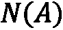
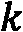

# 第四章：在 Node2Vec 中通过偏向随机游走改善嵌入

**Node2Vec**是一种主要基于 DeepWalk 的架构。在上一章中，我们了解了这个架构的两个主要组成部分：随机游走和 Word2Vec。如何提高我们嵌入的质量呢？有趣的是，这并不是通过更多的机器学习来实现的。相反，Node2Vec 对随机游走的生成方式进行了关键性的修改。

在本章中，我们将讨论这些修改以及如何为给定图找到最佳参数。我们将实现 Node2Vec 架构，并与在 Zachary 的空手道俱乐部上使用 DeepWalk 进行比较。这将帮助你深入理解这两种架构之间的差异。最后，我们将使用这项技术构建一个真实的应用：一个由 Node2Vec 驱动的电影**推荐系统**（**RecSys**）。

到本章结束时，你将知道如何在任何图数据集上实现 Node2Vec，并且如何选择合适的参数。你将理解为什么这个架构通常比 DeepWalk 表现得更好，并且如何将其应用于构建创意应用。

本章将涵盖以下内容：

+   介绍 Node2Vec

+   实现 Node2Vec

+   构建电影推荐系统

# 技术要求

本章中的所有代码示例都可以在 GitHub 上的[`github.com/PacktPublishing/Hands-On-Graph-Neural-Networks-Using-Python/tree/main/Chapter04`](https://github.com/PacktPublishing/Hands-On-Graph-Neural-Networks-Using-Python/tree/main/Chapter04)找到。

在本书的*前言*中可以找到在本地机器上运行代码所需的安装步骤。

# 介绍 Node2Vec

Node2Vec 是由斯坦福大学的 Grover 和 Leskovec 于 2016 年提出的[1]。它保留了 DeepWalk 的两个主要组成部分：随机游走和 Word2Vec。不同之处在于，在 Node2Vec 中，随机游走并不是均匀分布的，而是经过精心偏向的。我们将在接下来的两节中看到这些**偏向的随机游走**为什么表现更好，以及如何实现它们：

+   定义**邻域**

+   在随机游走中引入偏向

让我们从质疑我们直观的邻域概念开始。

## 定义邻域

如何定义节点的邻域？Node2Vec 中引入的关键概念是邻域的灵活定义。直观上，我们认为邻域是离初始节点较近的某个区域，但在图的背景下，“近”到底意味着什么呢？我们以以下图为例：


图 4.1 – 随机图示例

我们想要探索节点**A**邻域中的三个节点。这个探索过程也叫做**采样策略**：

+   一个可能的解决方案是考虑连接的三个最接近节点。在这种情况下， 的邻域，标为 ，将是 ：

+   另一种可能的抽样策略包括首先选择与先前节点不相邻的节点。在我们的例子中， 的邻域将是 ：

换句话说，我们希望在第一个案例中实现**广度优先搜索**（**BFS**），在第二个案例中实现**深度优先搜索**（**DFS**）。关于这些算法和实现的更多信息，请参见*第二章**，用于图神经网络的图论*。

在这里需要注意的重要一点是，这些抽样策略具有相反的行为：BFS 关注节点周围的局部网络，而 DFS 则建立了图的更宏观视图。考虑到我们对邻域的直觉定义，很容易就会简单地丢弃 DFS。然而，Node2Vec 的作者认为这将是一个错误：每种方法捕获到了网络的不同但有价值的表示。

他们建立了这些算法与两个网络属性之间的联系：

+   **结构等价性**，即如果节点共享许多相同的邻居，则节点在结构上等价。因此，如果它们共享许多邻居，则它们的结构等价性更高。

+   如前所述，**同质性**表示类似的节点更有可能相连。

他们认为 BFS 是理想的选择，因为它强调结构等价性，这种策略只查看相邻节点。在这些随机游走中，节点经常重复出现并保持相近。相反，DFS 通过创建远程节点序列强调异质性。这些随机游走可以抽样远离源节点的节点，因此变得不太代表性。这就是为什么我们寻求在这两个属性之间取得平衡的原因：同质性可能对理解某些图更有帮助，反之亦然。

如果您对这种连接感到困惑，您并不孤单：几篇论文和博客错误地认为 BFS 强调同质性，DFS 与结构等价性相关联。无论如何，我们考虑将同质性和结构等价性结合的图形为所需的解决方案。这就是为什么，无论这些连接如何，我们都希望使用两种抽样策略来创建我们的数据集。

让我们看看如何实施它们来生成随机游走。

## 引入随机游走中的偏差

作为提醒，随机游走是在图中随机选择的节点序列。它们有一个起点，这也可以是随机的，并且有一个预定义的长度。在这些行走中经常一起出现的节点就像在句子中一起出现的单词：根据同质性假设，它们共享相似的含义，因此具有相似的表示。

在 Node2Vec 中，我们的目标是使这些随机游走的偏差指向以下其中一个方向：

+   提升那些与前一个节点不连接的节点（类似于 DFS）

+   提升那些与前一个节点接近的节点（类似于 BFS）

让我们以*图 4.2*为例。当前节点为，前一个节点为，未来节点为。我们注意到，这是从节点到节点的未归一化转移概率。这个概率可以分解为，其中是节点和节点之间的**搜索偏差**，而是从节点到节点的边的权重。


图 4.2 – 随机图示例

在 DeepWalk 中，对于任意一对节点和，我们有。而在 Node2Vec 中，的值是基于节点间的距离和两个额外参数定义的：，即返回参数，以及，即进出参数。它们的作用是分别近似 DFS 和 BFS。

这里是值的定义方式：


这里，是节点和节点之间的最短路径距离。我们可以按照如下方式更新前图中的未归一化转移概率：


图 4.3 – 带有转移概率的图

让我们解密这些概率：

+   随机游走从节点开始，现在到达节点。回到前一个节点的概率由参数控制。它越高，随机游走越倾向于探索新节点，而不是重复相同的节点，看起来更像是 DFS。

+   去往的未归一化概率为，因为该节点位于我们前一个节点的直接邻域中。

+   最后，去往节点的概率由参数控制。它越高，随机游走越倾向于集中在靠近前一个节点的节点上，看起来更像是 BFS。

理解这一点的最佳方式是实际实现这个架构并调整参数。让我们一步一步地在 Zachary 的空手道俱乐部（来自前一章的图）上实现，如 *图 4.4* 所示：


图 4.4 – Zachary 的空手道俱乐部

请注意，这是一个无权网络，这就是为什么转移概率仅由搜索偏置决定的原因。

首先，我们希望创建一个函数，根据前一个节点、当前节点和两个参数  和 ，在图中随机选择下一个节点。

1.  我们首先导入所需的库：`networkx`、`random` 和 `numpy`：

    ```py
    import networkx as nx
    import random
    random.seed(0)
    import numpy as np
    np.random.seed(0)
    G = nx.erdos_renyi_graph(10, 0.3, seed=1, directed=False)
    ```

1.  我们用我们的参数列表定义了 `next_node` 函数：

    ```py
    def next_node(previous, current, p, q):
    ```

1.  我们从当前节点中获取邻居节点列表，并初始化 alpha 值列表：

    ```py
            neighbors = list(G.neighbors(current))
            alphas = []
    ```

1.  对于每个邻居，我们需要计算适当的 alpha 值：如果该邻居是前一个节点，使用 ；如果该邻居与前一个节点相连，使用 ；否则使用 ：

    ```py
        for neighbor in neighbors:
            if neighbor == previous:
                alpha = 1/p
            elif G.has_edge(neighbor, previous):
                alpha = 1
            else:
                alpha = 1/q
            alphas.append(alpha)
    ```

1.  我们将这些值标准化以创建概率：

    ```py
    probs = [alpha / sum(alphas) for alpha in alphas]
    ```

1.  我们根据前一步计算出的转移概率，使用 `np.random.choice()` 随机选择下一个节点并返回：

    ```py
        next = np.random.choice(neighbors, size=1, p=probs)[0]
        return next
    ```

在测试该函数之前，我们需要生成整个随机游走的代码。

我们生成这些随机游走的方式与前一章看到的类似。不同之处在于，下一个节点是通过 `next_node()` 函数选择的，该函数需要额外的参数： 和 ，以及前一个和当前节点。这些节点可以通过查看 `walk` 变量中添加的最后两个元素轻松获得。为了兼容性，我们还返回字符串而不是整数。

这是 `random_walk()` 函数的新版本：

```py
def random_walk(start, length, p, q):
    walk = [start]
    for i in range(length):
        current = walk[-1]
        previous = walk[-2] if len(walk) > 1 else None
        next = next_node(previous, current, p, q)
        walk.append(next)
    return [str(x) for x in walk]
```

我们现在拥有了生成随机游走的所有元素。让我们尝试一次长度为 5 的随机游走，，以及 ：

```py
random_walk(0, 8, p=1, q=1)
```

该函数返回以下序列：

```py
[0, 4, 7, 6, 4, 5, 4, 5, 6]
```

由于每个邻近节点具有相同的转移概率，因此这应该是随机的。使用这些参数，我们可以复现完全相同的 DeepWalk 算法。

现在，让我们通过使用  来让它们更倾向于返回到前一个节点：

```py
random_walk(0, 8, p=1, q=10)
```

该函数返回以下序列：

```py
[0, 9, 1, 9, 1, 9, 1, 0, 1]
```

这次，随机游走探索了图中的更多节点。你可以看到，它永远不会返回到前一个节点，因为使用  时其概率较低：

```py
random_walk(0, 8, p=10, q=1)
```

该函数返回以下序列：

```py
[0, 1, 9, 4, 7, 8, 7, 4, 6]
```

让我们看看如何在实际示例中使用这些属性，并将其与 DeepWalk 进行比较。

# 实现 Node2Vec

现在我们有了生成偏置随机游走的函数，Node2Vec 的实现与 DeepWalk 非常相似。它们如此相似，以至于我们可以重用相同的代码，并使用  和  创建序列，将 DeepWalk 作为 Node2Vec 的特例来实现。让我们用 Zachary 的空手道俱乐部来做这个任务：

与上一章一样，我们的目标是正确地将俱乐部的每个成员分类为两组之一（“Mr. Hi”和“Officer”）。我们将使用 Node2Vec 提供的节点嵌入作为机器学习分类器（此处为随机森林）的输入。

让我们一步一步地看如何实现：

1.  首先，我们需要安装`gensim`库来使用 Word2Vec。这次，我们将使用 3.8.0 版本以确保兼容性：

    ```py
    !pip install -qI gensim==3.8.0
    ```

1.  我们导入所需的库：

    ```py
    from gensim.models.word2vec import Word2Vec
    from sklearn.ensemble import RandomForestClassifier
    from sklearn.metrics import accuracy_score
    ```

1.  我们加载数据集（Zachary 的空手道俱乐部）：

    ```py
    G = nx.karate_club_graph()
    ```

1.  我们将节点标签转换为数值（`0`和`1`）：

    ```py
    labels = []
    for node in G.nodes:
        label = G.nodes[node]['club']
        labels.append(1 if label == 'Officer' else 0)
    ```

1.  我们生成了一个随机游走列表，如前所示，使用我们的`random_walk()`函数对图中的每个节点进行 80 次随机游走。参数  和  如此处所指定（分别为 2 和 1）：

    ```py
    walks = []
    for node in G.nodes:
        for _ in range(80):
            walks.append(random_walk(node, 10, 3, 2))
    ```

1.  我们创建了一个 Word2Vec 实例（一个 skip-gram 模型），并使用了分层的`softmax`函数：

    ```py
    node2vec = Word2Vec(walks,
                    hs=1,   # Hierarchical softmax
                    sg=1,   # Skip-gram
                    vector_size=100,
                    window=10,
                    workers=2,
                    min_count=1,
                    seed=0)
    ```

1.  Skip-gram 模型在我们生成的序列上训练了`30`个 epoch：

    ```py
    node2vec.train(walks, total_examples=node2vec.corpus_count, epochs=30, report_delay=1)
    ```

1.  我们创建了用于训练和测试分类器的掩码：

    ```py
    train_mask = [2, 4, 6, 8, 10, 12, 14, 16, 18, 20, 22, 24]
    train_mask_str = [str(x) for x in train_mask]
    test_mask = [0, 1, 3, 5, 7, 9, 11, 13, 15, 17, 19, 21, 23, 25, 26, 27, 28, 29, 30, 31, 32, 33]
    test_mask_str = [str(x) for x in test_mask]
    labels = np.array(labels)
    ```

1.  随机森林分类器在训练数据上进行训练：

    ```py
    clf = RandomForestClassifier(random_state=0)
    clf.fit(node2vec.wv[train_mask_str], labels[train_mask])
    ```

1.  我们根据测试数据的准确性来评估它：

    ```py
    y_pred = clf.predict(node2vec.wv[test_mask_str])
    acc = accuracy_score(y_pred, labels[test_mask])
    print(f'Node2Vec accuracy = {acc*100:.2f}%')
    ```

为了实现 DeepWalk，我们可以用  和  重复相同的过程。然而，为了公平比较，我们不能只使用单一的准确率评分。实际上，涉及到很多随机过程——我们可能会运气不好，得到来自最差模型的更好结果。

为了限制结果的随机性，我们可以重复这一过程 100 次并取平均值。这个结果要稳定得多，甚至可以包括标准差（使用`np.std()`）来衡量准确率评分的变化性。

但在我们开始之前，让我们玩一个游戏。在前一章中，我们讨论了 Zachary 的空手道俱乐部作为一个同质网络。这个属性由 DFS 强调，DFS 的鼓励是通过增大参数  来实现的。如果这一声明以及 DFS 与同质性之间的联系是正确的，我们应该会在较高的  值下得到更好的结果。

我重复进行了相同的实验，参数  和  在 1 到 7 之间变化。在一个真实的机器学习项目中，我们会使用验证数据来进行参数搜索。在这个例子中，我们使用测试数据，因为这个研究已经是我们的最终应用。

下表总结了结果：


图 4.5 – 不同 p 和 q 值下的平均准确度和标准差

有几个值得注意的结果：

+   DeepWalk（ 和 ）的表现比这里讨论的任何其他和的组合都要差。这在这个数据集中是成立的，并且显示了有偏随机游走的有效性。然而，这并不总是如此：在其他数据集中，无偏的随机游走也可能表现得更好。

+   高值的会带来更好的性能，这验证了我们的假设。知道这是一个社交网络，强烈暗示将我们的随机游走偏向同质性是一种不错的策略。在处理这种类型的图时，这是需要牢记的一点。

随意尝试调整参数，看看是否能找到其他有趣的结果。我们可以尝试使用非常高的（）值，或者相反，尝试在 0 到 1 之间调整和的值。

Zachary 的空手道俱乐部是一个基本的数据集，但在接下来的章节中，我们将看到如何利用这项技术构建更有趣的应用。

# 构建一个电影推荐系统

GNNs 最受欢迎的应用之一是推荐系统（RecSys）。如果你想一下 Word2Vec 的基础（因此也包括 DeepWalk 和 Node2Vec），目标是生成具有衡量相似性能力的向量。将电影编码代替单词，你就可以突然询问哪些电影最类似于给定的输入标题。这听起来很像一个推荐系统，不是吗？

但是如何编码电影呢？我们想要创建（有偏的）电影随机游走，但这需要一个图形数据集，其中相似的电影相互连接。这并不容易找到。

另一种方法是查看用户评分。构建基于评分的图的技术有很多种：双分图、基于点对点互信息的边等。在本节中，我们将实现一种简单直观的方法：喜欢相同电影的用户之间建立连接。然后，我们将使用这个图来学习电影嵌入，采用 Node2Vec 方法：

1.  首先，让我们下载一个数据集。`MovieLens` [2]是一个流行的选择，它的小版本（2018 年 9 月）包括 100,836 个评分，9,742 部电影和 610 个用户。我们可以通过以下 Python 代码下载它：

    ```py
    from io import BytesIO
    from urllib.request import urlopen
    from zipfile import ZipFile
    url = 'https://files.grouplens.org/datasets/movielens/ml-100k.zip'
    with urlopen(url) as zurl:
        with ZipFile(BytesIO(zurl.read())) as zfile:
            zfile.extractall('.')
    ```

1.  我们感兴趣的有两个文件：`ratings.csv`和`movies.csv`。第一个文件存储了用户的所有评分，第二个文件则允许我们将电影标识符转换为标题。

1.  让我们通过使用`pandas`和`pd.read_csv()`导入它们，看看它们是什么样的：

    ```py
    import pandas as pd
    ratings = pd.read_csv('ml-100k/u.data', sep='\t', names=['user_id', 'movie_id', 'rating', 'unix_timestamp'])
    ratings
    ```

1.  这将给我们以下输出：

    ```py
         user_id movie_id rating unix_timestamp
    0     196      242      3      881250949
    1     186      302      3      891717742
    2      22      377      1      878887116
    ...    ...     ...     ...      ...
    99998  13      225      2      882399156
    99999  12      203      3      879959583
    100000 rows × 4 columns
    ```

1.  现在让我们导入`movies.csv`：

    ```py
    movies = pd.read_csv('ml-100k/u.item', sep='|', usecols=range(2), names=['movie_id', 'title'], encoding='latin-1')
    ```

1.  这个数据集给我们带来了如下输出：

    ```py
    movies
         movie_id      title
    0      1      Toy Story (1995)
    1      2      GoldenEye (1995)
    2      3      Four Rooms (1995)
    ...      ...      ...
    1680      1681      You So Crazy (1994)
    1681      1682      Scream of Stone (Schrei aus Stein) (1991)
    1682 rows × 2 columns
    ```

1.  在这里，我们想查看那些被相同用户喜欢的电影。这意味着像 1、2、3 的评分并不太相关。我们可以丢弃这些，只保留评分为 4 和 5 的电影：

    ```py
    ratings = ratings[ratings.rating >= 4]
    ratings
    ```

1.  这将给我们以下输出：

    ```py
         user_id   movie_id    rating      unix_timestamp
    5      298      474      4      884182806
    7      253      465      5      891628467
    11     286      1014     5      879781125
    ...      ...      ...      ...      ...
    99991      676      538      4      892685437
    99996      716      204      5      879795543
    55375 rows × 4 columns
    ```

1.  现在我们有 48,580 个评分，来自 610 个用户。下一步是计算每当两部电影被同一个用户喜欢时的次数。我们会对数据集中的每个用户重复此过程。

1.  为了简化，我们将使用一个`defaultdict`数据结构，它会自动创建缺失的条目，而不是抛出错误。我们将用这个结构来计算一同被喜欢的电影：

    ```py
    from collections import defaultdict
    pairs = defaultdict(int)
    ```

1.  我们遍历数据集中的所有用户：

    ```py
    for group in ratings.groupby("userId"):
    ```

1.  我们检索当前用户喜欢的电影列表：

    ```py
    user_movies = list(group[1]["movieId"])
    ```

1.  每当一对电影在同一列表中一起出现时，我们就会增加一个特定于该电影对的计数器：

    ```py
    for i in range(len(user_movies)):
                for j in range(i+1, len(user_movies)):
                    pairs[(user_movies[i], user_movies[j])] += 1
    ```

1.  `pairs`对象现在存储了两部电影被同一用户喜欢的次数。我们可以利用这些信息按照以下方式构建图的边：

1.  我们使用`networkx`库创建一个图：

    ```py
    G = nx.Graph()
    ```

1.  对于我们`pairs`结构中的每一对电影，我们解包这两部电影及其对应的分数：

    ```py
    for pair in pairs:
        movie1, movie2 = pair
        score = pairs[pair]
    ```

1.  如果该分数大于 10，我们会根据该分数向图中添加加权链接，将这两部电影连接起来。我们不考虑低于 10 的分数，因为这会生成一个大图，其中的连接意义不大：

    ```py
    if score >= 20:
        G.add_edge(movie1, movie2, weight=score)
    ```

1.  我们创建的图包含 410 个节点（电影）和 14,936 条边。现在我们可以在上面训练 Node2Vec，学习节点嵌入！

我们可以重用上一节中的实现，但实际上有一个专门用于 Node2Vec 的 Python 库（也叫`node2vec`）。我们在这个示例中尝试使用它：

1.  我们安装`node2vec`库并导入`Node2Vec`类：

    ```py
    !pip install node2vec
    from node2vec import Node2Vec
    ```

1.  我们创建了一个`Node2Vec`实例，它将根据和参数自动生成带偏的随机游走：

    ```py
    node2vec = Node2Vec(G, dimensions=64, walk_length=20, num_walks=200, p=2, q=1, workers=1)
    ```

1.  我们在这些带偏的随机游走上训练一个模型，窗口大小为 10（前后各 5 个节点）：

    ```py
    model = node2vec.fit(window=10, min_count=1, 
    batch_words=4)
    ```

Node2Vec 模型已经训练完成，我们现在可以像使用`gensim`库中的 Word2Vec 对象一样使用它。让我们创建一个函数，根据给定的标题推荐电影：

1.  我们创建了`recommend()`函数，该函数接受电影标题作为输入。它首先将标题转换为我们可以用来查询模型的电影 ID：

    ```py
    def recommend(movie):
        movie_id = str
            movies.title == movie].movie_ id.values[0])
    ```

1.  我们遍历五个最相似的词向量，将这些 ID 转换为电影标题，并打印出它们对应的相似度分数：

    ```py
        for id in model.wv.most_similar(movie_id)[:5]:
            title = movies[movies.movie_id == int(id[0])].title.values[0]
            print(f'{title}: {id[1]:.2f}')
    ```

1.  我们调用此函数，获取与《星际大战》在余弦相似度上最相似的五部电影：

    ```py
    recommend('Star Wars (1977)')
    ```

1.  我们得到以下输出：

    ```py
    Return of the Jedi (1983): 0.61
    Raiders of the Lost Ark (1981): 0.55
    Godfather, The (1972): 0.49
    Indiana Jones and the Last Crusade (1989): 0.46
    White Squall (1996): 0.44
    ```

模型告诉我们，`Return of the Jedi` 和 `Raiders of the Lost Ark` 与 `Star Wars` 最为相似，尽管分数相对较低（< 0.7）。尽管如此，对于我们踏入推荐系统（RecSys）世界的第一步，这仍然是一个不错的结果！在后续章节中，我们将看到更强大的模型和构建最先进推荐系统的方法。

# 总结

本章中，我们了解了 Node2Vec，这是一种基于流行的 Word2Vec 的第二种架构。我们实现了生成有偏随机游走的函数，并解释了它们的参数与两个网络属性之间的关系：同质性和结构等价性。通过将 Node2Vec 的结果与 DeepWalk 在 Zachary 的空手道俱乐部的数据上的表现进行比较，我们展示了其有效性。最后，我们使用自定义图数据集和另一个 Node2Vec 的实现构建了我们的第一个推荐系统（RecSys）。它给出了正确的推荐，我们将在后续章节中进一步改进。

在*第五章**，《使用普通神经网络包含节点特征》中*，我们将讨论一个被忽视的问题，涉及到 DeepWalk 和 Node2Vec：缺乏适当的节点特征。我们将尝试通过使用传统神经网络来解决这个问题，而这些网络无法理解网络拓扑。在我们最终引入答案：图神经网络之前，理解这个困境非常重要。

# 进一步阅读

+   [1] A. Grover 和 J. Leskovec，*node2vec: 网络的可扩展特征学习*。arXiv，2016\. DOI: 10.48550/ARXIV.1607.00653\. 可用：[`arxiv.org/abs/1607.00653`](https://arxiv.org/abs/1607.00653)。

+   [2] F. Maxwell Harper 和 Joseph A. Konstan. 2015\. *MovieLens 数据集：历史与背景。ACM 交互式智能系统（TiiS）交易* 5, 4: 19:1–19:19\. [`doi.org/10.1145/2827872`](https://doi.org/10.1145/2827872)。可用：[`dl.acm.org/doi/10.1145/2827872`](https://dl.acm.org/doi/10.1145/2827872)。
