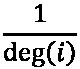
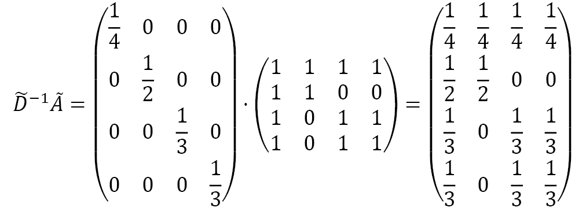

# 第六章：介绍图卷积网络

**图卷积网络**（**GCN**）架构是 GNN 的蓝图。它由 Kipf 和 Welling 于 2017 年提出[1]，基于创建一个有效的**卷积神经网络**（**CNN**）变体，应用于图结构。更准确地说，它是图信号处理中图卷积操作的近似。由于其多功能性和易用性，GCN 已成为科学文献中最受欢迎的 GNN。更广泛地说，它是处理图数据时建立坚实基准的首选架构。

在本章中，我们将讨论之前基础 GNN 层的局限性。这将帮助我们理解 GCN 的动机。我们将详细介绍 GCN 层的工作原理以及它为什么比我们的解决方案表现更好。我们将通过使用 PyTorch Geometric 在`Cora`和`Facebook Page-Page`数据集上实现 GCN 来验证这一点。这应该能进一步改善我们的结果。

最后一节介绍了一个新任务：**节点回归**。这是 GNN 中不太常见的任务，但在处理表格数据时特别有用。如果你有机会将表格数据集转化为图结构，那么这将使你能够进行回归任务，除了分类任务之外。

在本章结束时，你将能够在 PyTorch Geometric 中实现一个 GCN，用于分类或回归任务。通过线性代数，你将理解为什么这个模型比我们的基础 GNN 表现更好。最后，你将学会如何绘制节点度数和目标变量的密度分布。

本章将涵盖以下主题：

+   设计图卷积层

+   比较图卷积层与图线性层

+   使用节点回归预测网络流量

# 技术要求

本章的所有代码示例可以在 GitHub 上找到，链接为[`github.com/PacktPublishing/Hands-On-Graph-Neural-Networks-Using-Python/tree/main/Chapter06`](https://github.com/PacktPublishing/Hands-On-Graph-Neural-Networks-Using-Python/tree/main/Chapter06)。

在本书的*前言*部分，你可以找到在本地计算机上运行代码所需的安装步骤。

# 设计图卷积层

首先，让我们讨论一个我们在上一章没有预见到的问题。与表格数据或图像数据不同，节点的邻居数并不总是相同。例如，在*图 6.1*中，节点有 3 个邻居，而节点只有 1 个：


图 6.1 – 简单图，其中节点的邻居数不同

然而，如果我们观察我们的 GNN 层，我们并没有考虑邻居数量的差异。我们的层由一个简单的求和构成，没有任何归一化系数。下面是我们计算节点嵌入的方式，：


假设节点  有 1000 个邻居，而节点  只有 1 个：嵌入  的值将比  大得多。这是一个问题，因为我们想要比较这些嵌入。当它们的值差异如此之大时，我们该如何进行有意义的比较呢？

幸运的是，有一个简单的解决方法：通过邻居数量来除以嵌入。让我们写出 ，节点  的度。这里是 GNN 层的新公式：


但我们如何将其转化为矩阵乘法呢？提醒一下，这是我们为普通 GNN 层获得的结果：


这里是 。

这个公式中唯一缺少的是一个矩阵，用来给我们提供归一化系数，。这一点可以通过度矩阵  获得，它计算每个节点的邻居数量。下面是图 6.1 中所示图形的度矩阵：


这是相同的矩阵在 NumPy 中的表示：

```py
import numpy as np
D = np.array([
    [3, 0, 0, 0],
    [0, 1, 0, 0],
    [0, 0, 2, 0],
    [0, 0, 0, 2]
])
```

根据定义， 给出了每个节点的度，。因此，这个矩阵的逆  直接给我们归一化系数，：


矩阵的逆可以直接通过 `numpy.linalg.inv()` 函数计算：

```py
np.linalg.inv(D)
array([[0.33333333, 0.        , 0.        , 0.        ],
       [0.        , 1.        , 0.        , 0.        ],
       [0.        , 0.        , 0.5       , 0.        ],
       [0.        , 0.        , 0.        , 0.5       ]])
```

这正是我们所寻找的。为了更加准确，我们在图中添加了自环，用  表示。同样，我们应该在度矩阵中添加自环，。我们真正感兴趣的最终矩阵是 ：


NumPy 有一个特定的函数，`numpy.identity(n)`，可以快速创建一个单位矩阵 ，它的维度是 。在这个例子中，我们有四个维度：

```py
np.linalg.inv(D + np.identity(4))
array([[0.25      , 0.        , 0.        , 0.        ],
       [0.        , 0.5       , 0.        , 0.        ],
       [0.        , 0.        , 0.33333333, 0.        ],
       [0.        , 0.        , 0.        , 0.33333333]])
```

现在我们得到了归一化系数矩阵，我们应该把它放在哪里呢？有两个选项：

+    将对每一行特征进行归一化。

+    将对每一列特征进行归一化。

我们可以通过实验验证这一点，计算  和 。



的确，在第一个案例中，每一行的和等于 1。在第二个案例中，每一列的和等于 1。

矩阵乘法可以使用 `numpy.matmul()` 函数进行。更方便的是，Python 从版本 3.5 开始就有了自己的矩阵乘法运算符 `@`。让我们定义邻接矩阵  并使用这个运算符来计算矩阵乘法：

```py
A = np.array([
    [1, 1, 1, 1],
    [1, 1, 0, 0],
    [1, 0, 1, 1],
    [1, 0, 1, 1]
])
print(np.linalg.inv(D + np.identity(4)) @ A)
[[0.25       0.25       0.25       0.25      ]
 [0.5        0.5        0.         0.        ]
 [0.33333333 0.         0.33333333 0.33333333]
 [0.33333333 0.         0.33333333 0.33333333]]
print(A @ np.linalg.inv(D + np.identity(4)))
[[0.25       0.5        0.33333333 0.33333333]
 [0.25       0.5        0.         0.        ]
 [0.25       0.         0.33333333 0.33333333]
 [0.25       0.         0.33333333 0.33333333]]
```

我们得到了与手动矩阵乘法相同的结果。

那么，我们应该使用哪个选项呢？自然，第一个选项看起来更具吸引力，因为它很好地对邻居节点特征进行了归一化。

然而，Kipf 和 Welling [1] 注意到，具有很多邻居的节点的特征传播非常容易，这与更孤立节点的特征不同。在原始 GCN 论文中，作者提出了一种混合归一化方法来对抗这种效果。实际上，他们通过以下公式给具有较少邻居的节点分配更高的权重：


在个体嵌入方面，这个操作可以写成如下形式：


这些是实现图卷积层的原始公式。与我们基本的 GNN 层一样，我们可以堆叠这些层来创建 GCN。让我们实现一个 GCN 并验证它是否优于我们之前的方法。

# 比较图卷积层和图线性层

在上一章中，我们的基本 GNN 超越了 Node2Vec 模型，但它与 GCN 比如何呢？在本节中，我们将比较它们在 Cora 和 Facebook Page-Page 数据集上的表现。

相比于基本 GNN，GCN 的主要特点是它考虑节点的度数来加权其特征。在实际实现之前，让我们先分析这两个数据集中的节点度数。这些信息是相关的，因为它与 GCN 的性能直接相关。

根据我们对这个架构的了解，我们预计当节点度数变化很大时，它的表现会更好。如果每个节点的邻居数量相同，这些架构是等效的：():

1.  我们从 PyTorch Geometric 导入 `Planetoid` 类。为了可视化节点度数，我们还导入了 `matplotlib` 和另外两个类：`degree` 用于获取每个节点的邻居数量，`Counter` 用于统计每个度数的节点数量：

    ```py
    from torch_geometric.datasets import Planetoid
    from torch_geometric.utils import degree
    from collections import Counter
    import matplotlib.pyplot as plt
    ```

1.  Cora 数据集已导入，其图被存储在 `data` 中：

    ```py
    dataset = Planetoid(root=".", name="Cora")
    data = dataset[0]
    ```

1.  我们计算图中每个节点的邻居数量：

    ```py
    degrees = degree(data.edge_index[0]).numpy()
    ```

1.  为了生成更自然的可视化，我们统计每个度数的节点数量：

    ```py
    numbers = Counter(degrees)
    ```

1.  让我们使用条形图来绘制这个结果：

    ```py
    fig, ax = plt.subplots()
    ax.set_xlabel('Node degree')
    ax.set_ylabel('Number of nodes')
    plt.bar(numbers.keys(), numbers.values())
    ```

这为我们提供了如下的图表。


图 6.2 – Cora 数据集中具有特定节点度数的节点数量

这种分布看起来是指数型的，并且有重尾：它的邻居数量从 1 个（485 个节点）到 168 个（1 个节点）不等！这正是我们希望进行归一化处理来考虑这种不平衡的数据集。

相同的过程在 Facebook 页面-页面数据集上重复，得到以下结果：


图 6.3 – Facebook 页面-页面数据集中具有特定节点度数的节点数量

这种节点度数分布看起来更加偏斜，邻居数量从 1 到 709 不等。出于同样的原因，Facebook 页面-页面数据集也是一个很好的应用 GCN 的案例。

我们可以构建自己的图层，但幸运的是，PyTorch Geometric 已经预定义了一个 GCN 层。让我们先在 Cora 数据集上实现它：

1.  我们从 PyTorch Geometric 导入 PyTorch 和 GCN 层：

    ```py
    import torch
    import torch.nn.functional as F
    from torch_geometric.nn import GCNConv
    ```

1.  我们创建一个函数来计算准确率：

    ```py
    def accuracy(pred_y, y):
        return ((pred_y == y).sum() / len(y)).item()
    ```

1.  我们创建一个 GCN 类，其中包含一个`__init_()`函数，该函数接受三个参数作为输入：输入维度的数量`dim_in`，隐藏维度的数量`dim_h`，以及输出维度的数量`dim_out`：

    ```py
    class GCN(torch.nn.Module):
        """Graph Convolutional Network"""
        def __init__(self, dim_in, dim_h, dim_out):
            super().__init__()
            self.gcn1 = GCNConv(dim_in, dim_h)
            self.gcn2 = GCNConv(dim_h, dim_out)
    ```

1.  `forward`方法是相同的，并且有两个 GCN 层。对结果应用一个对数`softmax`函数进行分类：

    ```py
        def forward(self, x, edge_index):
            h = self.gcn1(x, edge_index)
            h = torch.relu(h)
            h = self.gcn2(h, edge_index)
            return F.log_softmax(h, dim=1)
    ```

1.  `fit()`方法相同，使用相同的`Adam`优化器参数（学习率为 0.1，L2 正则化为 0.0005）：

    ```py
        def fit(self, data, epochs):
            criterion = torch.nn.CrossEntropyLoss()
            optimizer = torch.optim.Adam(self.parameters(),
                                        lr=0.01,
                                        weight_decay=5e-4)
            self.train()
            for epoch in range(epochs+1):
                optimizer.zero_grad()
                out = self(data.x, data.edge_index)
                loss = criterion(out[data.train_mask], data.y[data.train_mask])
                acc = accuracy(out[data.train_mask].argmax(dim=1), data.y[data.train_mask])
                loss.backward()
                optimizer.step()
                if(epoch % 20 == 0):
                    val_loss = criterion(out[data.val_mask], data.y[data.val_mask])
                    val_acc = accuracy(out[data.val_mask].argmax(dim=1), data.y[data.val_mask])
                    print(f'Epoch {epoch:>3} | Train Loss: {loss:.3f} | Train Acc: {acc*100:>5.2f}% | Val Loss: {val_loss:.2f} | Val Acc: {val_acc*100:.2f}%')
    ```

1.  我们实现相同的`test()`方法：

    ```py
        @torch.no_grad()
        def test(self, data):
            self.eval()
            out = self(data.x, data.edge_index)
            acc = accuracy(out.argmax(dim=1)[data.test_mask], data.y[data.test_mask])
            return acc
    ```

1.  让我们实例化并训练我们的模型`100`个周期：

    ```py
    gcn = GCN(dataset.num_features, 16, dataset.num_classes)
    print(gcn)
    gcn.fit(data, epochs=100)
    ```

1.  以下是训练的输出：

    ```py
    GCN(
      (gcn1): GCNConv(1433, 16)
      (gcn2): GCNConv(16, 7)
    )
    Epoch   0 | Train Loss: 1.963 | Train Acc:  8.57% | Val Loss: 1.96 | Val Acc: 9.80%
    Epoch  20 | Train Loss: 0.142 | Train Acc: 100.00% | Val Loss: 0.82 | Val Acc: 78.40%
    Epoch  40 | Train Loss: 0.016 | Train Acc: 100.00% | Val Loss: 0.77 | Val Acc: 77.40%
    Epoch  60 | Train Loss: 0.015 | Train Acc: 100.00% | Val Loss: 0.76 | Val Acc: 76.40%
    Epoch  80 | Train Loss: 0.018 | Train Acc: 100.00% | Val Loss: 0.75 | Val Acc: 76.60%
    Epoch 100 | Train Loss: 0.017 | Train Acc: 100.00% | Val Loss: 0.75 | Val Acc: 77.20%
    ```

1.  最后，让我们在测试集上评估一下：

    ```py
    acc = gcn.test(data)
    print(f'GCN test accuracy: {acc*100:.2f}%')
    GCN test accuracy: 79.70%
    ```

如果我们重复进行 100 次这个实验，我们得到的平均准确率为 80.17%（± 0.61%），显著高于我们原始 GNN 得到的 74.98%（± 1.50%）。

完全相同的模型应用于 Facebook 页面-页面数据集，取得了 91.54%（± 0.28%）的平均准确率。再次，它显著高于原始 GNN 得到的 84.85%（± 1.68%）的结果。以下表格总结了带有标准偏差的准确率：

|  | **MLP** | **GNN** | **GCN** |
| --- | --- | --- | --- |
| **Cora** | 53.47%(±1.81%) | 74.98%(±1.50%) | 80.17%(±0.61%) |
| **Facebook** | 75.21%(±0.40%) | 84.85%(±1.68%) | 91.54%(±0.28%) |

图 6.4 – 带有标准偏差的准确率汇总

我们可以将这些高分归因于这两个数据集节点度数的广泛范围。通过对特征进行归一化，并考虑中心节点及其邻居的数量，GCN 获得了很大的灵活性，并能很好地处理各种类型的图。

然而，节点分类并不是 GNN 能够执行的唯一任务。在接下来的部分，我们将看到一种文献中很少涉及的新型应用。

# 使用节点回归预测网页流量

在机器学习中，**回归**指的是预测连续值。它通常与**分类**对比，后者的目标是找到正确的类别（这些类别是离散的，不是连续的）。在图数据中，它们的对应关系是节点分类和节点回归。在这一部分，我们将尝试预测每个节点的连续值，而不是类别变量。

我们将使用的数据集是维基百科网络（GNU 通用公共许可证 v3.0），由 Rozemberckzi 等人于 2019 年提出[2]。它由三个页面-页面网络组成：变色龙（2,277 个节点和 31,421 条边），鳄鱼（11,631 个节点和 170,918 条边），以及松鼠（5,201 个节点和 198,493 条边）。在这些数据集中，节点表示文章，边表示它们之间的相互链接。节点特征反映了文章中特定词汇的出现情况。最后，目标是预测 2018 年 12 月的对数平均月流量。

在这一部分，我们将应用 GCN 来预测变色龙数据集上的流量：

1.  我们导入了维基百科网络并下载了变色龙数据集。我们应用了`transform`函数，`RandomNodeSplit()`，来随机创建评估掩码和测试掩码：

    ```py
    from torch_geometric.datasets import WikipediaNetwork
    import torch_geometric.transforms as T
    dataset = WikipediaNetwork(root=".", name="chameleon", transform = T.RandomNodeSplit(num_val=200, num_test=500))
    data = dataset[0]
    ```

1.  我们打印了该数据集的信息：

    ```py
    print(f'Dataset: {dataset}')
    print('-------------------')
    print(f'Number of graphs: {len(dataset)}')
    print(f'Number of nodes: {data.x.shape[0]}')
    print(f'Number of unique features: {dataset.num_features}')
    print(f'Number of classes: {dataset.num_classes}')
    ```

这是我们获得的输出：

```py
Dataset: WikipediaNetwork()
-------------------
Number of graphs: 1
Number of nodes: 2277
Number of unique features: 2325
Number of classes: 5
```

1.  我们的数据集存在问题：输出显示我们有五个类别。然而，我们希望进行节点回归，而不是分类。那么发生了什么呢？

事实上，这五个类别是我们想要预测的连续值的区间。不幸的是，这些标签不是我们需要的：我们必须手动更改它们。首先，让我们从以下页面下载`wikipedia.zip`文件：[`snap.stanford.edu/data/wikipedia-article-networks.xhtml`](https://snap.stanford.edu/data/wikipedia-article-networks.xhtml)。解压文件后，我们导入`pandas`并使用它来加载目标值：

```py
import pandas as pd
df = pd.read_csv('wikipedia/chameleon/musae_chameleon_target.csv')
```

1.  我们对目标值应用了对数函数，使用`np.log10()`，因为目标是预测对数平均月流量：

    ```py
    values = np.log10(df['target'])
    ```

1.  我们重新定义`data.y`为从上一步得到的连续值的张量。请注意，这些值在本例中没有标准化，通常标准化是一个好的做法，但为了便于说明，我们这里不进行标准化：

    ```py
    data.y = torch.tensor(values)
    tensor([2.2330, 3.9079, 3.9329,  ..., 1.9956, 4.3598, 2.4409], dtype=torch.float64)
    ```

再次强调，像之前的两个数据集一样，最好可视化节点度。我们使用完全相同的代码来生成以下图形：


图 6.5 – 维基百科网络中具有特定节点度的节点数量

这个分布的尾部比之前的分布更短，但保持了类似的形状：大多数节点只有一个或几个邻居，但其中一些节点作为“枢纽”，可以连接超过 80 个节点。

在节点回归的情况下，节点度分布不是我们应该检查的唯一分布类型：我们的目标值分布同样至关重要。实际上，非正态分布（如节点度）往往更难预测。我们可以使用 Seaborn 库绘制目标值，并将其与 `scipy.stats.norm` 提供的正态分布进行比较：

```py
import seaborn as sns
from scipy.stats import norm
df['target'] = values
sns.distplot(df['target'], fit=norm)
```

这为我们提供了如下图表：


图 6.6 – Wikipedia 网络的目标值密度图

这个分布不完全是正态分布，但也不像节点度那样是指数分布。我们可以预期我们的模型在预测这些值时会表现良好。

让我们使用 PyTorch Geometric 一步步实现：

1.  我们定义了 GCN 类和 `__init__()` 函数。这一次，我们有三个 `GCNConv` 层，且每一层的神经元数量逐渐减少。这个编码器架构的目的是迫使模型选择最相关的特征来预测目标值。我们还添加了一个线性层，以输出一个不局限于 0 或 -1 和 1 之间的预测值：

    ```py
    class GCN(torch.nn.Module):
        def __init__(self, dim_in, dim_h, dim_out):
            super().__init__()
            self.gcn1 = GCNConv(dim_in, dim_h*4)
            self.gcn2 = GCNConv(dim_h*4, dim_h*2)
            self.gcn3 = GCNConv(dim_h*2, dim_h)
            self.linear = torch.nn.Linear(dim_h, dim_out)
    ```

1.  `forward()` 方法包括了新的 `GCNConv` 和 `nn.Linear` 层。这里不需要使用对数 `softmax` 函数，因为我们并不预测类别：

    ```py
    def forward(self, x, edge_index):
        h = self.gcn1(x, edge_index)
        h = torch.relu(h)
        h = F.dropout(h, p=0.5, training=self.training)
        h = self.gcn2(h, edge_index)
        h = torch.relu(h)
        h = F.dropout(h, p=0.5, training=self.training)
        h = self.gcn3(h, edge_index)
        h = torch.relu(h)
        h = self.linear(h)
        return h
    ```

1.  `fit()` 方法的主要变化是 `F.mse_loss()` 函数，它取代了用于分类任务的交叉熵损失。**均方误差**（**MSE**）将成为我们的主要评估指标。它对应于误差的平方的平均值，可以定义如下：


1.  在代码中，具体实现如下：

    ```py
        def fit(self, data, epochs):
            optimizer = torch.optim.Adam(self.parameters(),
                                          lr=0.02,
                                          weight_decay=5e-4)
            self.train()
            for epoch in range(epochs+1):
                optimizer.zero_grad()
                out = self(data.x, data.edge_index)
                loss = F.mse_loss(out.squeeze()[data.train_mask], data.y[data.train_mask].float())
                loss.backward()
                optimizer.step()
                if epoch % 20 == 0:
                    val_loss = F.mse_loss(out.squeeze()[data.val_mask], data.y[data.val_mask])
                    print(f"Epoch {epoch:>3} | Train Loss: {loss:.5f} | Val Loss: {val_loss:.5f}")
    ```

1.  MSE 也包含在 `test()` 方法中：

    ```py
        @torch.no_grad()
        def test(self, data):
            self.eval()
            out = self(data.x, data.edge_index)
            return F.mse_loss(out.squeeze()[data.test_mask], data.y[data.test_mask].float())
    ```

1.  我们实例化模型，设置 `128` 个隐藏维度，并且只有 `1` 个输出维度（目标值）。模型将在 `200` 个周期内进行训练：

    ```py
    gcn = GCN(dataset.num_features, 128, 1)
    print(gcn)
    gcn.fit(data, epochs=200)
    GCN(
      (gcn1): GCNConv(2325, 512)
      (gcn2): GCNConv(512, 256)
      (gcn3): GCNConv(256, 128)
      (linear): Linear(in_features=128, out_features=1, bias=True)
    )
    Epoch   0 | Train Loss: 12.05177 | Val Loss: 12.12162
    Epoch  20 | Train Loss: 11.23000 | Val Loss: 11.08892
    Epoch  40 | Train Loss: 4.59072 | Val Loss: 4.08908
    Epoch  60 | Train Loss: 0.82827 | Val Loss: 0.84340
    Epoch  80 | Train Loss: 0.63031 | Val Loss: 0.71436
    Epoch 100 | Train Loss: 0.54679 | Val Loss: 0.75364
    Epoch 120 | Train Loss: 0.45863 | Val Loss: 0.73487
    Epoch 140 | Train Loss: 0.40186 | Val Loss: 0.67582
    Epoch 160 | Train Loss: 0.38461 | Val Loss: 0.54889
    Epoch 180 | Train Loss: 0.33744 | Val Loss: 0.56676
    Epoch 200 | Train Loss: 0.29155 | Val Loss: 0.59314
    ```

1.  我们在测试集上测试模型，计算 MSE：

    ```py
    loss = gcn.test(data)
    print(f'GCN test loss: {loss:.5f}')
    GCN test loss: 0.43005
    ```

这个 MSE 损失本身并不是最容易解释的指标。我们可以使用以下两个指标来获得更有意义的结果：

+   RMSE 衡量的是误差的平均大小：


+   **平均绝对误差**（**MAE**），它给出了预测值与实际值之间的平均绝对差异：

让我们在 Python 中一步步实现：

1.  我们可以直接从 scikit-learn 库中导入 MSE 和 MAE：

    ```py
    from sklearn.metrics import mean_squared_error, mean_absolute_error
    ```

1.  我们通过 `.detach().numpy()` 将 PyTorch 张量的预测结果转换为模型给出的 NumPy 数组：

    ```py
    out = gcn(data.x, data.edge_index)
    y_pred = out.squeeze()[data.test_mask].detach().numpy()
    mse = mean_squared_error(data.y[data.test_mask], y_pred)
    mae = mean_absolute_error(data.y[data.test_mask], y_pred)
    ```

1.  我们使用专用函数计算 MSE 和 MAE。RMSE 通过 `np.sqrt()` 计算 MSE 的平方根：

    ```py
    print('=' * 43)
    print(f'MSE = {mse:.4f} | RMSE = {np.sqrt(mse):.4f} | MAE = {mae:.4f}')
    print('=' * 43)
    ===========================================
    MSE = 0.4300 | RMSE = 0.6558 | MAE = 0.5073
    ===========================================
    ```

这些评估指标对于比较不同模型非常有用，但解释 MSE 和 RMSE 可能比较困难。

可视化我们模型结果的最佳工具是散点图，其中横轴表示我们的预测值，纵轴表示真实值。Seaborn 提供了一个专用函数（`regplot()`）来进行这种类型的可视化：

```py
fig = sns.regplot(x=data.y[data.test_mask].numpy(), y=y_pred)
```


图 6.7 – 实际测试值（x 轴）与预测测试值（y 轴）

在这个例子中我们没有基准线可以参考，但这是一个相当不错的预测，只有少量的异常值。尽管数据集较为简约，但在许多应用中都会有效。如果我们想改善这些结果，可以调整超参数并进行更多的错误分析，以了解异常值的来源。

# 摘要

在本章中，我们改进了我们的基础 GNN 层，以正确归一化特征。这个改进引入了 GCN 层和智能归一化。我们将这种新架构与 Node2Vec 和我们基础的 GNN 在 Cora 和 Facebook Page-Page 数据集上进行了比较。由于这一归一化过程，GCN 在这两种情况下都以较大优势获得了最高的准确率。最后，我们将其应用于 Wikipedia 网络的节点回归，并学习如何处理这一新任务。

在*第七章*，*图注意力网络*中，我们将进一步发展，通过根据邻居节点的重要性来进行区分。我们将看到如何通过一种叫做自注意力的过程自动地对节点特征进行加权。这将提高我们的性能，正如我们将通过与 GCN 架构的比较看到的那样。

# 进一步阅读

+   [1] T. N. Kipf 和 M. Welling，*图卷积网络的半监督分类*。arXiv，2016 年。DOI: 10.48550/ARXIV.1609.02907。可用：[`arxiv.org/abs/1609.02907`](https://arxiv.org/abs/1609.02907)。

+   [2] B. Rozemberczki, C. Allen 和 R. Sarkar，*多尺度属性节点嵌入*。arXiv，2019 年。DOI: 10.48550/ARXIV.1909.13021。可用：[`arxiv.org/abs/1909.13021`](https://arxiv.org/abs/1909.13021)。
