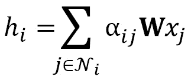
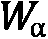

# 第七章：图注意力网络

**图注意力网络**（**GATs**）是 GCN 的理论改进。它们提出了通过一个叫做**自注意力**的过程来计算加权因子，而不是使用静态归一化系数。这个过程也是一种成功的深度学习架构——**Transformer**的核心，后者由**BERT**和**GPT-3**等模型普及。GAT 由 Veličković等人在 2017 年提出，凭借其卓越的开箱即用性能，已经成为最受欢迎的 GNN 架构之一。

在这一章中，我们将通过四个步骤来学习图注意力层是如何工作的。这实际上是理解自注意力如何工作的一 个完美示例。这些理论背景将帮助我们从零开始使用`NumPy`实现一个图注意力层。我们将自己构建矩阵，以便理解它们在每一步是如何计算值的。

在上一节中，我们将在两个节点分类数据集上使用 GAT：`Cora`和一个新的数据集`CiteSeer`。正如上一章所预期的，这将是进一步分析结果的好机会。最后，我们将比较该架构与 GCN 的准确度。

到本章结束时，你将能够从零开始实现图注意力层，并在**PyTorch Geometric**（**PyG**）中实现一个 GAT。你将学习这种架构与 GCN 之间的区别。此外，你还将掌握一个用于图数据的错误分析工具。

在本章中，我们将涵盖以下主题：

+   介绍图注意力层

+   在 NumPy 中实现图注意力层

+   在 PyTorch Geometric 中实现 GAT

# 技术要求

本章的所有代码示例可以在 GitHub 上找到，链接为：[`github.com/PacktPublishing/Hands-On-Graph-Neural-Networks-Using-Python/tree/main/Chapter07`](https://github.com/PacktPublishing/Hands-On-Graph-Neural-Networks-Using-Python/tree/main/Chapter07)。

在本书的*前言*部分，你可以找到在本地机器上运行代码所需的安装步骤。

# 介绍图注意力层

GAT 的主要思想是，有些节点比其他节点更重要。实际上，这一点在图卷积层中就已经存在：具有较少邻居的节点比其他节点更重要，因为它们有归一化系数。这种方法存在局限性，因为它只考虑节点的度数。另一方面，图注意力层的目标是生成考虑节点特征重要性的加权因子。

我们将我们的加权因子称为**注意力得分**，并注意到，，表示节点和之间的注意力得分。我们可以将图注意力算子定义如下：


GATs 的一个重要特征是注意力得分是通过比较输入之间的关系隐式计算的（因此命名为*自*注意力）。在这一节中，我们将看到如何通过四个步骤来计算这些注意力得分，并且如何对图注意力层进行改进：

+   线性变换

+   激活函数

+   Softmax 标准化

+   多头注意力

+   改进的图注意力层

首先，让我们来看一下线性变换是如何与之前的架构不同的。

## 线性变换

注意力得分表示一个中心节点  与一个邻居节点  之间的重要性。如前所述，这需要来自两个节点的节点特征。在图注意力层中，它通过隐藏向量  和  的连接来表示， 。在这里， 是一个经典的共享权重矩阵，用于计算隐藏向量。一个额外的线性变换被应用于这个结果，并使用一个专门的可学习权重矩阵 。在训练过程中，这个矩阵学习权重以生成注意力系数 。这个过程可以通过以下公式总结：


这个输出被传递给像传统神经网络中那样的激活函数。

## 激活函数

非线性是神经网络中的一个重要组成部分，用于逼近非线性目标函数。这些函数无法仅通过堆叠线性层来捕捉，因为最终的结果仍然会表现得像单一的线性层。

在官方实现中（[`github.com/PetarV-/GAT/blob/master/utils/layers.py`](https://github.com/PetarV-/GAT/blob/master/utils/layers.py)），作者选择了**Leaky Rectified Linear Unit**（**ReLU**）激活函数（见*图 7.1*）。该函数修复了*dying ReLU*问题，即 ReLU 神经元仅输出零：


图 7.1 – ReLU 与 Leaky ReLU 函数对比

这是通过将 Leaky ReLU 函数应用于上一步骤的输出实现的：


然而，我们现在面临一个新问题：结果值没有被标准化！

## Softmax 标准化

我们希望比较不同的注意力得分，这意味着我们需要在同一尺度上进行标准化的值。在机器学习中，通常使用 softmax 函数来实现这一点。我们称  为节点  的邻居节点，包括它本身：


该操作的结果给出了我们的最终注意力得分 。但是还有另一个问题：自注意力并不是非常稳定。

## 多头注意力

这一问题已经在原始的 Transformer 论文中由 Vaswani 等人（2017）提出。他们提出的解决方案是计算多个嵌入并为每个嵌入分配不同的注意力权重，而不是仅计算一个嵌入。这项技术被称为多头注意力。

实现非常简单，因为我们只需要重复前面三个步骤多次。每个实例都会生成一个嵌入！[](img/Formula_B19153_07_020.png)，其中！[](img/Formula_B19153_07_021.png)是注意力头的索引。这里有两种方法来结合这些结果：

+   **平均**：在这种方法中，我们对不同的嵌入进行求和，并通过注意力头的数量！[](img/Formula_B19153_07_022.png)对结果进行归一化：


+   **拼接**：在这种方法中，我们将不同的嵌入拼接在一起，产生一个更大的矩阵：


在实际应用中，有一个简单的规则可以帮助决定使用哪种方式：当它是一个隐藏层时，我们选择拼接方案，当它是网络的最后一层时，我们选择平均方案。整个过程可以通过以下图示来总结：


图 7.2 – 使用多头注意力计算注意力得分

这就是图注意力层的理论方面的全部内容。然而，自 2017 年问世以来，已有一种改进方案被提出。

## 改进的图注意力层

Brody 等人（2021）认为，图注意力层只计算静态类型的注意力。这是一个问题，因为有一些简单的图问题是我们无法用 GAT 来表达的。因此，他们引入了一个改进版本，称为 GATv2，它计算的是严格更具表现力的动态注意力。

他们的解决方案是修改操作的顺序。权重矩阵！[](img/Formula_B19153_07_025.png) 在拼接之后应用，注意力权重矩阵！[](img/Formula_B19153_07_026.png) 在！[](img/Formula_B19153_07_027.png)函数之后应用。总结一下，下面是原始的 **图注意力操作符**，即 **GAT**：


这是修改后的操作符，GATv2：


我们应该使用哪种方法？根据 Brody 等人（2021）的研究，GATv2 始终优于 GAT，因此应该首选 GATv2。除了理论证明，他们还进行了多次实验，以展示 GATv2 相较于原始 GAT 的表现。在本章的其余部分，我们将同时讨论这两种选择：第二节中的 GAT 和第三节中的 GATv2。

# 在 NumPy 中实现图注意力层

如前所述，神经网络是通过矩阵乘法来工作的。因此，我们需要将我们的单个嵌入转换为整个图的操作。在这一部分，我们将从零开始实现原始的图注意力层，以便正确理解自注意力的内部工作原理。当然，这一过程可以重复多次，以创建多头注意力。

第一步是将原始的图注意力算子转换为矩阵的形式。这就是我们在上一节中定义它的方式：



通过从图的线性层中获得灵感，我们可以写出以下内容：


其中  是一个矩阵，存储每个 。

在这个例子中，我们将使用上一章的以下图表：


图 7.3 – 一个简单的图，其中节点具有不同数量的邻居

图必须提供两项重要信息：带有自环的邻接矩阵  和节点特征 。让我们看看如何在 NumPy 中实现它：

1.  我们可以根据*图 7.3*中的连接构建邻接矩阵：

    ```py
    import numpy as np
    np.random.seed(0)
    A = np.array([
        [1, 1, 1, 1],
        [1, 1, 0, 0],
        [1, 0, 1, 1],
        [1, 0, 1, 1]
    ])
    array([[1, 1, 1, 1],
           [1, 1, 0, 0],
           [1, 0, 1, 1],
           [1, 0, 1, 1]])
    ```

1.  对于 ，我们使用`np.random.uniform()`生成一个随机的节点特征矩阵：

    ```py
    X = np.random.uniform(-1, 1, (4, 4))
    array([[ 0.0976270,  0.4303787,  0.2055267,  0.0897663],
           [-0.1526904,  0.2917882, -0.1248255,  0.783546 ],
           [ 0.9273255, -0.2331169,  0.5834500,  0.0577898],
           [ 0.1360891,  0.8511932, -0.8579278, -0.8257414]])
    ```

1.  下一步是定义我们的权重矩阵。实际上，在图注意力层中，有两个权重矩阵：常规权重矩阵  和注意力权重矩阵 。初始化它们的方式有很多种（例如 Xavier 或 He 初始化），但在这个例子中，我们可以简单地重用相同的随机函数。

矩阵  必须精心设计，因为它的维度是 。注意， 已经是固定的，因为它表示  中的节点数。相反， 的值是任意的：我们将在这个例子中选择 ：

```py
W = np.random.uniform(-1, 1, (2, 4))
array([[-0.9595632,  0.6652396,  0.556313 ,  0.740024 ],
       [ 0.9572366,  0.5983171, -0.0770412,  0.5610583]])
```

1.  这个注意力矩阵应用于隐藏向量的拼接，生成一个唯一的值。因此，它的大小需要是 ：

    ```py
    W_att = np.random.uniform(-1, 1, (1, 4))
    array([[-0.7634511,  0.2798420, -0.7132934,  0.8893378]])
    ```

1.  我们希望将源节点和目标节点的隐藏向量进行拼接。获取源节点和目标节点对的一种简单方法是查看我们的邻接矩阵 ，它采用 COO 格式：行存储源节点，列存储目标节点。NumPy 提供了一种快速高效的方法，使用`np.where()`来实现：

    ```py
    connections = np.where(A > 0)
    (array([0, 0, 0, 0, 1, 1, 2, 2, 2, 3, 3, 3]),
     array([0, 1, 2, 3, 0, 1, 0, 2, 3, 0, 2, 3]))
    ```

1.  我们可以使用 `np.concatenate` 来拼接源节点和目标节点的隐藏向量：

    ```py
    np.concatenate([(X @ W.T)[connections[0]], (X @ W.T)[connections[1]]], axis=1)
    array([[ 0.3733923,  0.3854852,  0.3733923,  0.3854852],
           [ 0.3733923,  0.3854852,  0.8510261,  0.4776527],
           [ 0.3733923,  0.3854852, -0.6775590,  0.7356658],
           [ 0.3733923,  0.3854852, -0.6526841,  0.2423597],
           [ 0.8510261,  0.4776527,  0.3733923,  0.3854852],
           [ 0.8510261,  0.4776527,  0.8510261,  0.4776527],
           [-0.6775590,  0.7356658,  0.3733923,  0.3854852],
           [-0.6775590,  0.7356658, -0.6775590,  0.7356658],
           [-0.6775590,  0.7356658, -0.6526841,  0.2423597],
           [-0.6526841,  0.2423597,  0.3733923,  0.3854852],
           [-0.6526841,  0.2423597, -0.6775590,  0.7356658],
           [-0.6526841,  0.2423597, -0.6526841,  0.2423597]])
    ```

1.  然后我们使用注意力矩阵  对该结果进行线性变换：

    ```py
    a = W_att @ np.concatenate([(X @ W.T)[connections[0]], (X @ W.T)[connections[1]]], axis=1).T
    array([[-0.1007035 , -0.35942847,  0.96036209,  0.50390318, -0.43956122, -0.69828618,  0.79964181,  1.8607074 ,  1.40424849,  0.64260322, 1.70366881,  1.2472099 ]])
    ```

1.  第二步是对前一个结果应用 Leaky ReLU 函数：

    ```py
    def leaky_relu(x, alpha=0.2):
        return np.maximum(alpha*x, x)
    e = leaky_relu(a)
    array([[-0.0201407 , -0.07188569,  0.96036209,  0.50390318, -0.08791224,  -0.13965724,  0.79964181,  1.8607074 ,  1.40424849,  0.64260322,  1.70366881,  1.2472099 ]])
    ```

1.  我们有正确的值，但需要将它们正确地放置在矩阵中。这个矩阵应该看起来像 ，因为当两个节点之间没有连接时，不需要标准化的注意力分数。为了构建这个矩阵，我们通过`connections`知道源节点  和目标节点 。因此，`e`中的第一个值对应于 ，第二个值对应于 ，但第七个值对应于 ，而不是 。我们可以按如下方式填充矩阵：

    ```py
    E = np.zeros(A.shape)
    E[connections[0], connections[1]] = e[0]
    array([[-0.020140 , -0.0718856,  0.9603620,  0.5039031],
           [-0.0879122, -0.1396572,  0.       ,  0.       ],
           [ 0.7996418,  0.       ,  1.8607074,  1.4042484],
           [ 0.6426032,  0.       ,  1.7036688,  1.247209 ]])
    ```

1.  下一步是规范化每一行的注意力分数。这需要一个自定义的 `softmax` 函数来生成最终的注意力分数：

    ```py
    def softmax2D(x, axis):
        e = np.exp(x - np.expand_dims(np.max(x, axis=axis), axis))
        sum = np.expand_dims(np.sum(e, axis=axis), axis)
        return e / sum
    W_alpha = softmax2D(E, 1)
    array([[0.15862414, 0.15062488, 0.42285965, 0.26789133],
           [0.24193418, 0.22973368, 0.26416607, 0.26416607],
           [0.16208847, 0.07285714, 0.46834625, 0.29670814],
           [0.16010498, 0.08420266, 0.46261506, 0.2930773 ]])
    ```

1.  这个注意力矩阵  为网络中每一个可能的连接提供了权重。我们可以用它来计算我们的嵌入矩阵 ，该矩阵应为每个节点提供二维向量：

    ```py
    H = A.T @ W_alpha @ X @ W.T
    array([[-1.10126376,  1.99749693],
           [-0.33950544,  0.97045933],
           [-1.03570438,  1.53614075],
           [-1.03570438,  1.53614075]])
    ```

我们的图注意力层现在已经完成！添加多头注意力的过程包括在聚合结果之前使用不同的  和  重复这些步骤。

图注意力操作符是开发 GNN 的一个重要构建块。在下一节中，我们将使用 PyG 实现创建一个 GAT。

# 在 PyTorch Geometric 中实现 GAT

现在我们已经完整地了解了图注意力层的工作原理。这些层可以堆叠起来，创建我们选择的新架构：GAT。在本节中，我们将遵循原始 GAT 论文中的指导方针，使用 PyG 实现我们自己的模型。我们将用它在 `Cora` 和 `CiteSeer` 数据集上执行节点分类。最后，我们将对这些结果进行评论并进行比较。

让我们从 `Cora` 数据集开始：

1.  我们从 PyG 导入 `Cora` 数据集中的 `Planetoid` 类：

    ```py
    from torch_geometric.datasets import Planetoid
    dataset = Planetoid(root=".", name="Cora")
    data = dataset[0]
    Data(x=[2708, 1433], edge_index=[2, 10556], y=[2708], train_mask=[2708], val_mask=[2708], test_mask=[2708])
    ```

1.  我们导入必要的库来创建我们自己的 GAT 类，使用 GATv2 层：

    ```py
    import torch
    import torch.nn.functional as F
    from torch_geometric.nn import GATv2Conv
    from torch.nn import Linear, Dropout
    ```

1.  我们实现 `accuracy()` 函数来评估模型的性能：

    ```py
    def accuracy(y_pred, y_true):
        return torch.sum(y_pred == y_true) / len(y_true)
    ```

1.  该类初始化时包含两个改进的图注意力层。注意，声明多头注意力所使用的头数非常重要。作者指出，八个头对于第一层性能有所提升，但对于第二层没有任何影响：

    ```py
    class GAT(torch.nn.Module):
        def __init__(self, dim_in, dim_h, dim_out, heads=8):
            super().__init__()
            self.gat1 = GATv2Conv(dim_in, dim_h, heads=heads)
            self.gat2 = GATv2Conv(dim_h*heads, dim_out, heads=1)
    ```

1.  与之前实现的 GCN 相比，我们添加了两个 dropout 层来防止过拟合。这些层以预定义的概率（在此情况下为 `0.6`）随机将一些值从输入张量中置为零。为了符合原论文，我们还使用了 **指数线性单元**（**ELU**）函数，它是 Leaky ReLU 的指数版本：

    ```py
        def forward(self, x, edge_index):
            h = F.dropout(x, p=0.6, training=self.training)
            h = self.gat1(h, edge_index)
            h = F.elu(h)
            h = F.dropout(h, p=0.6, training=self.training)
            h = self.gat2(h, edge_index)
            return F.log_softmax(h, dim=1)
    ```

1.  `fit()` 函数与 GCN 的相同。根据作者的说法，Adam 优化器的参数已经调整，以匹配 `Cora` 数据集的最佳值：

    ```py
        def fit(self, data, epochs):
            criterion = torch.nn.CrossEntropyLoss()
            optimizer = torch.optim.Adam(self.parameters(), lr=0.01, weight_decay=0.01)
            self.train()
            for epoch in range(epochs+1):
                optimizer.zero_grad()
                out = self(data.x, data.edge_index)
                loss = criterion(out[data.train_mask], data.y[data.train_mask])
                acc = accuracy(out[data.train_mask].argmax(dim=1), data.y[data.train_mask])
                loss.backward()
                optimizer.step()
                if(epoch % 20 == 0):
                    val_loss = criterion(out[data.val_mask], data.y[data.val_mask])
                    val_acc = accuracy(out[data.val_mask].argmax(dim=1), data.y[data.val_mask])
                    print(f'Epoch {epoch:>3} | Train Loss: {loss:.3f} | Train Acc: {acc*100:>5.2f}% | Val Loss: {val_loss:.2f} | Val Acc: {val_acc*100:.2f}%')
    ```

1.  `test()` 函数完全相同：

    ```py
        @torch.no_grad()
        def test(self, data):
            self.eval()
            out = self(data.x, data.edge_index)
            acc = accuracy(out.argmax(dim=1)[data.test_mask], data.y[data.test_mask])
            return acc
    ```

1.  我们创建一个 GAT 并训练它 `100` 个周期：

    ```py
    gat = GAT(dataset.num_features, 32, dataset.num_classes)
    gat.fit(data, epochs=100)
    GAT(
      (gat1): GATv2Conv(1433, 32, heads=8)
      (gat2): GATv2Conv(256, 7, heads=1)
    )
    Epoch 0 | Train Loss: 1.978 | Train Acc: 12.86% | Val Loss: 1.94 | Val Acc: 13.80%
    Epoch 20 | Train Loss: 0.238 | Train Acc: 96.43% | Val Loss: 1.04 | Val Acc: 67.40%
    Epoch 40 | Train Loss: 0.165 | Train Acc: 98.57% | Val Loss: 0.95 | Val Acc: 71.00%
    Epoch 60 | Train Loss: 0.209 | Train Acc: 96.43% | Val Loss: 0.91 | Val Acc: 71.80%
    Epoch 80 | Train Loss: 0.172 | Train Acc: 100.00% | Val Loss: 0.93 | Val Acc: 70.80%
    Epoch 100 | Train Loss: 0.190 | Train Acc: 97.86% | Val Loss: 0.96 | Val Acc: 70.80%
    ```

1.  这输出了最终的测试准确度：

    ```py
    acc = gat.test(data)
    print(f'GAT test accuracy: {acc*100:.2f}%')
    GAT test accuracy: 81.10%
    ```

这个准确度分数略高于我们用 GCN 获得的平均分数。我们将在将 GAT 架构应用于第二个数据集后做出适当的比较。

我们将使用一个新的流行节点分类数据集 `CiteSeer`（MIT 许可证）。与 `Cora` 类似，它代表了一个研究论文的网络，每个连接都是一个引用。`CiteSeer` 涉及 `3327` 个节点，这些节点的特征表示论文中 `3703` 个单词的存在（1）或不存在（0）。该数据集的目标是将这些节点正确分类为六个类别。*图 7.4* 显示了使用 yEd Live 绘制的 `CiteSeer` 图：


图 7.4 – CiteSeer 数据集（使用 yEd Live 绘制）

与 `Cora` 相比，这个数据集在节点数量（从 2,708 到 3,327）和特征维度（从 1,433 到 3,703）上都更大。然而，可以应用完全相同的过程：

1.  首先，我们加载 `CiteSeer` 数据集：

    ```py
    dataset = Planetoid(root=".", name="CiteSeer")
    data = dataset[0]
    Data(x=[3327, 3703], edge_index=[2, 9104], y=[3327], train_mask=[3327], val_mask=[3327], test_mask=[3327])
    ```

1.  为了更好地衡量，我们绘制了每个节点度数的节点数，使用了上一章的代码：

    ```py
    import matplotlib.pyplot as plt
    from torch_geometric.utils import degree
    from collections import Counter
    degrees = degree(dataset[0].edge_index[0]).numpy()
    numbers = Counter(degrees)
    fig, ax = plt.subplots(dpi=300)
    ax.set_xlabel('Node degree')
    ax.set_ylabel('Number of nodes')
    plt.bar(numbers.keys(), numbers.values())
    ```

1.  它给出了以下输出：


图 7.5 – 每个节点度数的节点数（CiteSeer）

*图 7.5* 看起来像是典型的重尾分布，但有所不同：一些节点的度数为零！换句话说，它们没有连接到任何其他节点。我们可以假设它们会比其他节点更难分类。

1.  我们初始化一个新的 GAT 模型，具有正确的输入和输出节点数，并训练它 `100` 个周期：

    ```py
    gat = GAT(dataset.num_features, 16, dataset.num_classes)
    gat.fit(data, epochs=100)
    Epoch   0 | Train Loss: 1.815 | Train Acc: 15.00% | Val Loss: 1.81 | Val Acc: 14.20%
    Epoch  20 | Train Loss: 0.173 | Train Acc: 99.17% | Val Loss: 1.15 | Val Acc: 63.80%
    Epoch  40 | Train Loss: 0.113 | Train Acc: 99.17% | Val Loss: 1.12 | Val Acc: 64.80%
    Epoch  60 | Train Loss: 0.099 | Train Acc: 98.33% | Val Loss: 1.12 | Val Acc: 62.40%
    Epoch  80 | Train Loss: 0.130 | Train Acc: 98.33% | Val Loss: 1.19 | Val Acc: 62.20%
    Epoch 100 | Train Loss: 0.158 | Train Acc: 98.33% | Val Loss: 1.10 | Val Acc: 64.60%
    ```

1.  我们获得了以下测试准确度分数：

    ```py
    acc = gat.test(data)
    print(f'GAT test accuracy: {acc*100:.2f}%')
    GAT test accuracy: 68.10%
    ```

这是一个好结果吗？这次，我们没有比较的标准。

根据 Schur 等人在 *图神经网络评估的陷阱* 中的研究，GAT 在 `Cora` 和 `CiteSeer` 上的表现略优于 GCN（82.8% ± 0.6% 对比 81.9% ± 0.8%，71.0 ± 0.6% 对比 69.5% ± 0.9%）。作者还指出，准确度分数并非正态分布，这使得标准差的使用变得不那么相关。在这种基准测试中需要记住这一点。

之前，我推测连接较差的节点可能会对性能产生负面影响。我们可以通过绘制每个节点度数的平均准确率来验证这一假设：

1.  我们获得模型的分类结果：

    ```py
    out = gat(data.x, data.edge_index)
    ```

1.  我们计算每个节点的度数：

    ```py
    degrees = degree(data.edge_index[0]).numpy()
    ```

1.  我们存储了准确率分数和样本大小：

    ```py
    accuracies = []
    sizes = []
    ```

1.  我们使用`np.where()`计算每个节点度数介于零和五之间的平均准确率：

    ```py
    for i in range(0, 6):
        mask = np.where(degrees == i)[0]
        accuracies.append(accuracy(out.argmax(dim=1)[mask], data.y[mask]))
        sizes.append(len(mask))
    ```

1.  我们对每个度数大于五的节点重复这一过程：

    ```py
    mask = np.where(degrees > 5)[0]
    accuracies.append(accuracy(out.argmax(dim=1)[mask], data.y[mask]))
    sizes.append(len(mask))
    ```

1.  我们绘制了这些准确率分数与对应的节点度数：

    ```py
    fig, ax = plt.subplots(dpi=300)
    ax.set_xlabel('Node degree')
    ax.set_ylabel('Accuracy score')
    plt.bar(['0','1','2','3','4','5','6+'], accuracies)
    for i in range(0, 7):
        plt.text(i, accuracies[i], f'{accuracies[i]*100:.2f}%', ha='center', color='black')
    for i in range(0, 7):
        plt.text(i, accuracies[i]//2, sizes[i], ha='center', color='white')
    ```

1.  它输出以下图形：


图 7.6 – 每个节点度数的准确率（CiteSeer）

*图 7.6*验证了我们的假设：邻居较少的节点更难正确分类。此外，它甚至显示出通常节点度数越高，准确率越好。这是非常自然的，因为更多的邻居将为 GNN 提供更多的信息，从而帮助它做出预测。

# 总结

在这一章中，我们介绍了一个新的重要架构：GAT。我们通过四个主要步骤了解了其内部工作原理，从线性变换到多头注意力。我们通过在 NumPy 中实现图注意力层，实际展示了它的工作方式。最后，我们将 GAT 模型（包括 GATv2）应用于`Cora`和`CiteSeer`数据集，并取得了优异的准确率分数。我们展示了这些分数依赖于邻居的数量，这是进行错误分析的第一步。

在*第八章*，*使用 GraphSAGE 扩展图神经网络*中，我们将介绍一种专门用于管理大规模图的新架构。为了验证这一说法，我们将在一个比我们目前看到的数据集大数倍的全新数据集上多次实现该架构。我们将讨论传导性学习和归纳性学习，这对于图神经网络（GNN）实践者来说是一个重要的区分。

# 第三部分：高级技术

在本书的第三部分，我们将深入探讨已开发的更多先进和专门化的 GNN 架构，这些架构旨在解决各种与图相关的问题。我们将介绍为特定任务和领域设计的最先进的 GNN 模型，这些模型能更有效地应对挑战和需求。此外，我们还将概述一些可以使用 GNN 解决的新图任务，如链接预测和图分类，并通过实际的代码示例和实现展示它们的应用。

在本部分结束时，您将能够理解并实现先进的 GNN 架构，并将其应用于解决您自己的图相关问题。您将全面了解专业化的 GNN 及其各自的优势，并通过代码示例获得实践经验。这些知识将使您能够将 GNN 应用于实际的使用场景，并有可能为新的创新型 GNN 架构的发展做出贡献。

本部分包括以下章节：

+   *第八章**，使用 GraphSAGE 扩展图神经网络*

+   *第九章**，为图分类定义表达能力*

+   *第十章**，使用图神经网络预测链接*

+   *第十一章**，使用图神经网络生成图*

+   *第十二章**，从异构图中学习*

+   *第十三章**，时序图神经网络*

+   *第十四章**，解释图神经网络*
