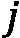

# 第八章：使用 GraphSAGE 扩展图神经网络

**GraphSAGE** 是一种 GNN 架构，专为处理大规模图而设计。在技术行业中，**可扩展性**是推动增长的关键因素。因此，系统通常设计为能够容纳数百万用户。这一能力需要在 GNN 模型的工作方式上与 GCN 和 GAT 进行根本性的转变。因此，GraphSAGE 成为像 Uber Eats 和 Pinterest 这样的科技公司首选的架构也就不足为奇了。

在本章中，我们将学习 GraphSAGE 背后的两个主要思想。首先，我们将描述其**邻居采样**技术，这是其在可扩展性方面表现优异的核心。然后，我们将探讨用于生成节点嵌入的三种聚合操作符。除了原始方法，我们还将详细介绍 Uber Eats 和 Pinterest 提出的变种。

此外，GraphSAGE 提供了新的训练可能性。我们将实现两种训练 GNN 的方法，分别用于两个任务——使用`PubMed`进行节点分类和**蛋白质-蛋白质相互作用**的**多标签分类**。最后，我们将讨论新**归纳**方法的优点及其应用。

到本章结束时，你将理解邻居采样算法如何以及为什么有效。你将能够实现它，以创建小批量并加速在大多数 GNN 架构上的训练，使用 GPU。更重要的是，你将掌握图上的归纳学习和多标签分类。

本章我们将涵盖以下内容：

+   介绍 GraphSAGE

+   PubMed 上的节点分类

+   蛋白质-蛋白质相互作用中的归纳学习

# 技术要求

本章的所有代码示例可以在 GitHub 上找到，网址为 https://github.com/PacktPublishing/Hands-On-Graph-Neural-Networks-Using-Python/tree/main/Chapter08。

在本书的 *前言* 章节中，可以找到运行代码所需的安装步骤。

# 介绍 GraphSAGE

Hamilton 等人在 2017 年提出了 GraphSAGE（见 *进一步阅读* 部分的第 [1] 项），作为一种针对大规模图（节点超过 100,000）的归纳表示学习框架。其目标是为下游任务（如节点分类）生成节点嵌入。此外，它解决了 GCN 和 GAT 的两个问题——扩展到大规模图和高效地推广到未见过的数据。在本节中，我们将通过描述 GraphSAGE 的两个主要组件来解释如何实现它：

+   邻居采样

+   聚合

让我们来看看它们。

## 邻居采样

到目前为止，我们还没有讨论传统神经网络中的一个重要概念——**小批量处理**。它的做法是将数据集分成更小的片段，称为批次。批次用于**梯度下降**，这是一种优化算法，在训练过程中寻找最佳的权重和偏置。梯度下降有三种类型：

+   **批量梯度下降**：在整个数据集处理完（每一轮迭代）后更新权重和偏置。这是我们到目前为止实现的技术。然而，它是一个比较慢的过程，需要数据集能够完全加载到内存中。

+   **随机梯度下降**：对于数据集中的每一个训练样本，都会更新权重和偏置。这是一个有噪声的过程，因为误差没有被平均。然而，它可以用于执行在线训练。

+   **小批量梯度下降**：权重和偏置会在每个小批量的训练样本处理完毕后更新。这个技术速度更快（小批量可以使用 GPU 并行处理），并且导致更稳定的收敛。此外，数据集的大小可以超过可用内存，这对于处理大型图数据是至关重要的。

在实际应用中，我们使用更先进的优化器，如 `Adam`，它也实现了小批量处理。

对于表格数据集，划分非常简单；它只需选择  样本（行）。然而，对于图数据集来说，这是一个问题——我们如何选择  节点而不破坏重要的连接？如果不小心，可能会导致一个孤立节点的集合，在这个集合中我们无法进行任何聚合。

我们必须考虑 GNN 如何使用数据集。每一层 GNN 都是基于节点的邻居计算节点嵌入。这意味着计算一个嵌入只需要该节点的直接邻居（**1 hop**）。如果我们的 GNN 有两层，那么我们需要这些邻居及其自身的邻居（**2 hops**），依此类推（见 *图 8.1*）。网络的其余部分与计算这些单个节点的嵌入无关。


图 8.1 – 以节点 0 为目标节点，以及 1-hop 和 2-hop 邻居的图

该技术允许我们通过计算图来填充批量数据，计算图描述了计算节点嵌入的整个操作序列。*图 8.2* 展示了节点 `0` 的计算图，并提供了更直观的表示。


图 8.2 – 节点 0 的计算图

我们需要聚合 2-hop 邻居，以便计算 1-hop 邻居的嵌入。然后，这些嵌入被聚合以获得节点 0 的嵌入。然而，这种设计存在两个问题：

+   计算图随着跳数的增加呈指数级增长。

+   具有非常高连接度的节点（例如在线社交网络中的名人，也称为**枢纽节点**）会生成巨大的计算图。

为了解决这些问题，我们必须限制计算图的大小。在 GraphSAGE 中，作者提出了一种名为邻居采样的技术。我们不再将每个邻居都添加到计算图中，而是从中随机选择一个预定义数量的邻居。例如，在第一次跳跃中，我们只选择最多三个邻居，而在第二次跳跃中，我们选择最多五个邻居。因此，在这种情况下，计算图的节点数不能超过。


图 8.3 – 一个计算图，通过邻居采样来保留两个 1 跳邻居和两个 2 跳邻居

较低的采样数更高效，但会使训练更加随机（方差较大）。此外，GNN 层数（跳数）也必须保持较低，以避免计算图呈指数级增长。邻居采样可以处理大型图，但它通过修剪重要信息带来了权衡，这可能会对性能（如准确度）产生负面影响。请注意，计算图涉及大量冗余计算，这使得整个过程在计算上不那么高效。

然而，这种随机采样并不是唯一可以使用的技术。Pinterest 有自己的 GraphSAGE 版本，称为 PinSAGE，用于支持其推荐系统（见*进一步阅读* [2]）。它实现了另一种采样解决方案，使用随机游走。PinSAGE 保持了固定数量邻居的想法，但通过随机游走来查看哪些节点是最常被遇到的。这种频率决定了它们的相对重要性。PinSAGE 的采样策略使其能够选择最关键的节点，并在实际应用中证明了更高的效率。

## 聚合

现在我们已经了解了如何选择邻居节点，接下来我们需要计算嵌入。这个过程由聚合算子（或称聚合器）来执行。在 GraphSAGE 中，作者提出了三种解决方案：

+   均值聚合器

+   **长短期记忆**（**LSTM**）聚合器

+   一个池化聚合器

我们将重点介绍均值聚合器，因为它是最容易理解的。首先，均值聚合器会取目标节点及其采样邻居的嵌入，将它们进行平均。然后，对这个结果应用一个带有权重矩阵的线性变换，：

均值聚合器可以通过以下公式来总结，其中是一个非线性函数，比如 ReLU 或 tanh：


在 PyG 和 Uber Eats 实现 GraphSAGE 的情况下[3]，我们使用了两个权重矩阵而不是一个；第一个矩阵用于目标节点，第二个矩阵用于邻居节点。这个聚合器可以写作如下：


LSTM 聚合器基于 LSTM 架构，这是一种流行的递归神经网络类型。与均值聚合器相比，LSTM 聚合器理论上能够区分更多的图结构，从而生成更好的嵌入。问题在于，递归神经网络仅考虑输入序列，例如一个有起始和结束的句子。然而，节点没有任何顺序。因此，我们通过对节点的邻居进行随机排列来解决这个问题。这种解决方案允许我们使用 LSTM 架构，而不依赖于任何输入序列。

最后，池化聚合器分为两个步骤。首先，将每个邻居的嵌入传递给 MLP 以生成一个新的向量。其次，执行逐元素最大操作，仅保留每个特征的最大值。

我们不仅限于这三种选择，还可以在 GraphSAGE 框架中实现其他聚合器。事实上，GraphSAGE 的核心思想就在于其高效的邻居采样。在下一节中，我们将使用它对一个新数据集进行节点分类。

# 在 PubMed 上对节点进行分类

在本节中，我们将实现一个 GraphSAGE 架构，对 `PubMed` 数据集进行节点分类（该数据集在 MIT 许可证下可从 [`github.com/kimiyoung/planetoid`](https://github.com/kimiyoung/planetoid) 获得）[4]。

之前，我们看到了来自同一个 Planetoid 系列的其他两个引文网络数据集——`Cora` 和 `CiteSeer`。`PubMed` 数据集展示了一个类似但更大的图，其中包含 19,717 个节点和 88,648 条边。*图 8.3* 显示了由 Gephi ([`gephi.org/`](https://gephi.org/)) 创建的该数据集的可视化。


图 8.4 – PubMed 数据集的可视化

节点特征是 TF-IDF 加权的 500 维词向量。目标是将节点正确分类为三类——糖尿病实验型、糖尿病 1 型和糖尿病 2 型。让我们使用 PyG 按步骤实现它：

1.  我们从 `Planetoid` 类加载 `PubMed` 数据集，并打印一些关于图的信息：

    ```py
    from torch_geometric.datasets import Planetoid
    dataset = Planetoid(root='.', name="Pubmed")
    data = dataset[0]
    print(f'Dataset: {dataset}')
    print('-------------------')
    print(f'Number of graphs: {len(dataset)}')
    print(f'Number of nodes: {data.x.shape[0]}')
    print(f'Number of features: {dataset.num_features}')
    print(f'Number of classes: {dataset.num_classes}')
    print('Graph:')
    print('------')
    print(f'Training nodes: {sum(data.train_mask).item()}')
    print(f'Evaluation nodes: {sum(data.val_mask).item()}')
    print(f'Test nodes: {sum(data.test_mask).item()}')
    print(f'Edges are directed: {data.is_directed()}')
    print(f'Graph has isolated nodes: {data.has_isolated_nodes()}')
    print(f'Graph has loops: {data.has_self_loops()}')
    ```

1.  这将产生以下输出：

    ```py
    Dataset: Pubmed()
    -------------------
    Number of graphs: 1
    Number of nodes: 19717
    Number of features: 500
    Number of classes: 3
    Graph:
    ------
    Training nodes: 60
    Evaluation nodes: 500
    Test nodes: 1000
    Edges are directed: False
    Graph has isolated nodes: False
    Graph has loops: False
    ```

如你所见，训练节点仅有 60 个，而测试节点有 1,000 个，这相当具有挑战性（6/94 的分割）。幸运的是，对于仅有 19,717 个节点的 `PubMed` 数据集，使用 GraphSAGE 处理将会非常快速。

1.  GraphSAGE 框架的第一步是邻居采样。PyG 实现了 `NeighborLoader` 类来执行这一操作。我们将保留目标节点的 10 个邻居以及它们自己的 10 个邻居。我们会将 60 个目标节点分为 16 个节点一组的批次，这样会得到四个批次：

    ```py
    from torch_geometric.loader import NeighborLoader
    train_loader = NeighborLoader(
        data,
        num_neighbors=[10,10],
        batch_size=16,
        input_nodes=data.train_mask,
    )
    ```

1.  通过打印其信息，让我们验证我们是否获得了四个子图（批次）：

    ```py
    for i, subgraph in enumerate(train_loader):
        print(f'Subgraph {i}: {subgraph}')
    Subgraph 0: Data(x=[400, 500], edge_index=[2, 455], y=[400], train_mask=[400], val_mask=[400], test_mask=[400], batch_size=16)
    Subgraph 1: Data(x=[262, 500], edge_index=[2, 306], y=[262], train_mask=[262], val_mask=[262], test_mask=[262], batch_size=16)
    Subgraph 2: Data(x=[275, 500], edge_index=[2, 314], y=[275], train_mask=[275], val_mask=[275], test_mask=[275], batch_size=16)
    Subgraph 3: Data(x=[194, 500], edge_index=[2, 227], y=[194], train_mask=[194], val_mask=[194], test_mask=[194], batch_size=12)
    ```

1.  这些子图包含超过 60 个节点，这是正常的，因为任何邻居都可以被采样。我们甚至可以像绘制图一样使用 `matplotlib` 的子图进行绘制：

    ```py
    import numpy as np
    import networkx as nx
    import matplotlib.pyplot as plt
    from torch_geometric.utils import to_networkx
    fig = plt.figure(figsize=(16,16))
    for idx, (subdata, pos) in enumerate(zip(train_loader, [221, 222, 223, 224])):
        G = to_networkx(subdata, to_undirected=True)
        ax = fig.add_subplot(pos)
        ax.set_title(f'Subgraph {idx}', fontsize=24)
        plt.axis('off')
        nx.draw_networkx(G,
                        pos=nx.spring_layout(G, seed=0),
                        with_labels=False,
                        node_color=subdata.y,
                        )
    plt.show()
    ```

1.  我们得到如下图表：


图 8.5 – 使用邻居采样获得的子图的图表

由于邻居采样的工作方式，大多数节点的度数为 1。在这种情况下，这不是问题，因为它们的嵌入只在计算图中使用一次，以计算第二层的嵌入。

1.  我们实现了以下函数来评估模型的准确性：

    ```py
    def accuracy(pred_y, y):
        return ((pred_y == y).sum() / len(y)).item()
    ```

1.  让我们使用两个`SAGEConv`层创建一个`GraphSAGE`类（默认选择均值聚合器）：

    ```py
    import torchmport torch.nn.functional as F
    from torch_geometric.nn import SAGEConv
    class GraphSAGE(torch.nn.Module):
        def __init__(self, dim_in, dim_h, dim_out):
            super().__init__()
            self.sage1 = SAGEConv(dim_in, dim_h)
            self.sage2 = SAGEConv(dim_h, dim_out)
    ```

1.  嵌入是使用两个均值聚合器计算的。我们还使用了一个非线性函数（`ReLU`）和一个 dropout 层：

    ```py
       def forward(self, x, edge_index):
            h = self.sage1(x, edge_index)
            h = torch.relu(h)
            h = F.dropout(h, p=0.5, training=self.training)
            h = self.sage2(h, edge_index)
            return F.log_softmax(h, dim=1)
    ```

1.  现在我们需要考虑批量处理，`fit()`函数必须修改为循环遍历 epoch，再遍历批量。我们想要衡量的指标必须在每个 epoch 重新初始化：

    ```py
        def fit(self, data, epochs):
            criterion = torch.nn.CrossEntropyLoss()
            optimizer = torch.optim.Adam(self.parameters(), lr=0.01)
            self.train()
            for epoch in range(epochs+1):
                total_loss, val_loss, acc, val_acc = 0, 0, 0, 0
    ```

1.  第二个循环对每个批量进行模型训练：

    ```py
                for batch in train_loader:
                    optimizer.zero_grad()
                    out = self(batch.x, batch.edge_index)
                    loss = criterion(out[batch.train_mask], batch.y[batch.train_mask])
                    total_loss += loss
                    acc += accuracy(out[batch.train_mask].argmax(dim=1), batch.y[batch.train_mask])
                    loss.backward()
                    optimizer.step()
                    # Validation
                    val_loss += criterion(out[batch.val_mask], batch.y[batch.val_mask])
                    val_acc += accuracy(out[batch.val_mask].argmax(dim=1), batch.y[batch.val_mask])
    ```

1.  我们还希望打印我们的指标。它们必须除以批量数量，以代表一个 epoch：

    ```py
           if epoch % 20 == 0:
                    print(f'Epoch {epoch:>3} | Train Loss: {loss/len(train_loader):.3f} | Train Acc: {acc/len(train_loader)*100:>6.2f}% | Val Loss: {val_loss/len(train_loader):.2f} | Val Acc: {val_acc/len(train_loader)*100:.2f}%')
    ```

1.  `test()`函数没有变化，因为我们在测试集上不使用批量处理：

    ```py
        @torch.no_grad()
        def test(self, data):
            self.eval()
            out = self(data.x, data.edge_index)
            acc = accuracy(out.argmax(dim=1)[data.test_mask], data.y[data.test_mask])
            return acc
    ```

1.  让我们创建一个隐藏层维度为 64 的模型，并训练 200 个 epoch：

    ```py
    graphsage = GraphSAGE(dataset.num_features, 64, dataset.num_classes)
    print(graphsage)
    graphsage.fit(data, 200)
    ```

1.  这给我们带来了以下输出：

    ```py
    GraphSAGE(
      (sage1): SAGEConv(500, 64, aggr=mean)
      (sage2): SAGEConv(64, 3, aggr=mean)
    )
    Epoch 0 | Train Loss: 0.317 | Train Acc: 28.77% | Val Loss: 1.13 | Val Acc: 19.55%
    Epoch 20 | Train Loss: 0.001 | Train Acc: 100.00% | Val Loss: 0.62 | Val Acc: 75.07%
    Epoch 40 | Train Loss: 0.000 | Train Acc: 100.00% | Val Loss: 0.55 | Val Acc: 80.56%
    Epoch 60 | Train Loss: 0.000 | Train Acc: 100.00% | Val Loss: 0.35 | Val Acc: 86.11%
    Epoch 80 | Train Loss: 0.002 | Train Acc: 100.00% | Val Loss: 0.64 | Val Acc: 73.58%
    Epoch 100 | Train Loss: 0.000 | Train Acc: 100.00% | Val Loss: 0.79 | Val Acc: 74.72%
    Epoch 120 | Train Loss: 0.000 | Train Acc: 100.00% | Val Loss: 0.71 | Val Acc: 76.75%
    Epoch 140 | Train Loss: 0.000 | Train Acc: 100.00% | Val Loss: 0.75 | Val Acc: 67.50%
    Epoch 160 | Train Loss: 0.000 | Train Acc: 100.00% | Val Loss: 0.63 | Val Acc: 73.54%
    Epoch 180 | Train Loss: 0.000 | Train Acc: 100.00% | Val Loss: 0.47 | Val Acc: 86.11%
    Epoch 200 | Train Loss: 0.000 | Train Acc: 100.00% | Val Loss: 0.48 | Val Acc: 78.37%
    ```

请注意，均值聚合器被自动选择用于两个 SAGEConv 层。

1.  最后，让我们在测试集上测试它：

    ```py
    acc = graphsage.test(data)
    print(f'GraphSAGE test accuracy: {acc*100:.2f}%')
    GraphSAGE test accuracy: 74.70%
    ```

考虑到该数据集不利的训练/测试集划分，我们得到了 74.70%的不错的测试准确率。然而，GraphSAGE 在`PubMed`上获得的平均准确率低于 GCN（-0.5%）和 GAT（-1.4%）。那么，我们为什么还要使用它呢？

答案在训练三个模型时显而易见——GraphSAGE 速度极快。在消费者级 GPU 上，它比 GCN 快 4 倍，比 GAT 快 88 倍。即使 GPU 内存不成问题，GraphSAGE 也能处理更大的图，产生比小型网络更好的结果。

为了完成对 GraphSAGE 架构的深入探讨，我们还必须讨论一个特性——它的归纳能力。

# 在蛋白质-蛋白质相互作用中的归纳学习

在 GNN 中，我们区分两种学习方式——**传递学习**和**归纳学习**。它们可以总结如下：

+   在归纳学习中，GNN 在训练过程中只看到训练集的数据。这是机器学习中典型的监督学习设置。在这种情况下，标签用于调整 GNN 的参数。

+   在传递学习中，GNN 在训练过程中可以看到训练集和测试集的数据。然而，它只学习训练集的数据。在这种情况下，标签用于信息扩散。

传递性学习的情况应该是熟悉的，因为这是我们迄今为止唯一涉及的情况。实际上，你可以从之前的示例中看到，GraphSAGE 在训练过程中使用整个图来进行预测（`self(batch.x, batch.edge_index)`）。然后，我们将这些预测的一部分进行掩码操作来计算损失，并且仅使用训练数据训练模型（`criterion(out[batch.train_mask], batch.y[batch.train_mask])`）。

传递性学习只能为固定图生成嵌入；它无法对未见过的节点或图进行泛化。然而，由于邻居采样，GraphSAGE 设计为在本地级别进行预测，并通过修剪的计算图来减少计算。它被认为是一个归纳框架，因为它可以应用于任何具有相同特征模式的计算图。

让我们将其应用于一个新的数据集——蛋白质-蛋白质相互作用（`PPI`）网络，该网络由 Agrawal 等人 [5] 描述。这个数据集包含 24 个图，其中节点（21,557）代表人类蛋白质，边（342,353）表示人类细胞中蛋白质之间的物理相互作用。*图 8.6* 显示了使用 Gephi 创建的 `PPI` 表示图。


图 8.6 – 蛋白质-蛋白质相互作用网络的可视化

该数据集的目标是执行多标签分类，共有 121 个标签。这意味着每个节点可以拥有从 0 到 121 的标签。这与多类分类不同，在多类分类中，每个节点只能有一个类别。

让我们使用 PyG 实现一个新的 GraphSAGE 模型：

1.  我们加载了具有三种不同划分的 `PPI` 数据集——训练集、验证集和测试集：

    ```py
    from torch_geometric.datasets import PPI
    train_dataset = PPI(root=".", split='train')
    val_dataset = PPI(root=".", split='val')
    test_dataset = PPI(root=".", split='test')
    ```

1.  训练集包含 20 个图，而验证集和测试集只有 2 个。我们希望对训练集应用邻居采样。为了方便起见，让我们将所有训练图统一为一个集合，使用 `Batch.from_data_list()`，然后应用邻居采样：

    ```py
    from torch_geometric.data import Batch
    from torch_geometric.loader import NeighborLoader
    train_data = Batch.from_data_list(train_dataset)
    loader = NeighborLoader(train_data, batch_size=2048, shuffle=True, num_neighbors=[20, 10], num_workers=2, persistent_workers=True)
    ```

1.  训练集已准备好。我们可以使用 `DataLoader` 类创建我们的批次。我们定义一个 `batch_size` 值为 `2`，对应每个批次中的图的数量：

    ```py
    from torch_geometric.loader import DataLoader
    train_loader = DataLoader(train_dataset, batch_size=2)
    val_loader = DataLoader(val_dataset, batch_size=2)
    test_loader = DataLoader(test_dataset, batch_size=2)
    ```

1.  这些批次的一个主要优势是它们可以在 GPU 上处理。如果有 GPU 可用，我们可以使用 GPU，否则则使用 CPU：

    ```py
    device = torch.device('cuda' if torch.cuda.is_available() else 'cpu')
    ```

1.  我们可以直接使用 PyTorch Geometric 中 `torch_geometric.nn` 的实现，而不是自己实现 GraphSAGE。我们用两层和 512 的隐藏维度来初始化它。此外，我们需要使用 `to(device)` 将模型放置到与数据相同的设备上：

    ```py
    from torch_geometric.nn import GraphSAGE
    model = GraphSAGE(
        in_channels=train_dataset.num_features,
        hidden_channels=512,
        num_layers=2,
        out_channels=train_dataset.num_classes,
    ).to(device)
    ```

1.  `fit()` 函数与我们在前一节中使用的类似，有两个例外。首先，当可能时，我们希望将数据移动到 GPU 上。其次，我们每个批次有两个图，因此我们将单独的损失乘以 2（`data.num_graphs`）：

    ```py
    criterion = torch.nn.BCEWithLogitsLoss()
    optimizer = torch.optim.Adam(model.parameters(), lr=0.005)
    def fit():
        model.train()
        total_loss = 0
        for data in train_loader:
            data = data.to(device)
            optimizer.zero_grad()
            out = model(data.x, data.edge_index)
            loss = criterion(out, data.y)
            total_loss += loss.item() * data.num_graphs
            loss.backward()
            optimizer.step()
        return total_loss / len(train_loader.dataset)
    ```

在 `test()` 函数中，我们利用 `val_loader` 和 `test_loader` 各自有两个图和一个 `batch_size` 为 2 的事实。这意味着这两个图在同一个批次中；我们不需要像训练时那样遍历加载器。

1.  我们不使用准确率，而是使用另一种度量——F1 分数。它对应的是精确度和召回率的调和平均数。然而，我们的预测是 121 维的实数向量。我们需要将它们转换为二进制向量，使用 `out > 0` 将其与 `data.y` 进行比较：

    ```py
    from sklearn.metrics import f1_score
    @torch.no_grad()
    def test(loader):
        model.eval()
        data = next(iter(loader))
        out = model(data.x.to(device), data.edge_index.to(device))
        preds = (out > 0).float().cpu()
        y, pred = data.y.numpy(), preds.numpy()
        return f1_score(y, pred, average='micro') if pred.sum() > 0 else 0
    ```

1.  让我们训练模型 300 个周期，并在训练过程中打印验证 F1 分数：

    ```py
    for epoch in range(301):
        loss = fit()
        val_f1 = test(val_loader)
        if epoch % 50 == 0:
            print(f'Epoch {epoch:>3} | Train Loss: {loss:.3f} | Val F1 score: {val_f1:.4f}')
    Epoch 0 | Train Loss: 0.589 | Val F1-score: 0.4245
    Epoch 50 | Train Loss: 0.194 | Val F1-score: 0.8400
    Epoch 100 | Train Loss: 0.143 | Val F1-score: 0.8779
    Epoch 150 | Train Loss: 0.123 | Val F1-score: 0.8935
    Epoch 200 | Train Loss: 0.107 | Val F1-score: 0.9013
    Epoch 250 | Train Loss: 0.104 | Val F1-score: 0.9076
    Epoch 300 | Train Loss: 0.090 | Val F1-score: 0.9154
    ```

1.  最后，我们计算测试集上的 F1 得分：

    ```py
    print(f'Test F1 score: {test(test_loader):.4f}')
    Test F1 score: 0.9360
    ```

在一个归纳设置下，我们获得了 0.9360 的优秀 F1 得分。当你增加或减少隐藏通道的大小时，这个值会发生显著变化。你可以尝试不同的值，比如 128 和 1,024，替代 512。

如果仔细观察代码，会发现没有涉及掩蔽（masking）。事实上，归纳学习是由 `PPI` 数据集强制的；训练、验证和测试数据分别位于不同的图和加载器中。当然，我们也可以通过 `Batch.from_data_list()` 将它们合并，从而回到一个传导学习（transductive）的情况。

我们还可以使用无监督学习训练 GraphSAGE，而无需标签。当标签稀缺或由下游应用程序提供时，这尤其有用。然而，这需要一个新的损失函数，以鼓励相邻节点具有相似的表示，同时确保远程节点有不同的嵌入：


这里， 是在随机游走中与  的邻居， 是 Sigmoid 函数， 是  的负采样分布，而  是负样本的数量：

最后，PinSAGE 和 Uber Eats 版本的 GraphSAGE 是推荐系统。由于应用场景的不同，它们将无监督设置与不同的损失函数结合使用。它们的目标是为每个用户排序最相关的实体（如食物、餐馆、地理位置等），这是一个完全不同的任务。为了实现这一点，它们实现了一种最大边际排名损失，考虑了嵌入对。

如果需要扩展 GNN，其他解决方案可以考虑。以下是两种标准技术的简短描述：

+   **Cluster-GCN** [6] 提出了一个不同的关于如何创建小批量（mini-batches）的问题答案。它不是使用邻居采样，而是将图划分为独立的社区。然后，这些社区作为独立的图进行处理，这可能会对最终嵌入的质量产生负面影响。

+   简化 GNN 可以减少训练和推理时间。在实际应用中，简化包括舍弃非线性激活函数。线性层可以通过线性代数压缩为一次矩阵乘法。自然地，这些简化版本在小型数据集上的准确性不如真正的 GNN，但对于大规模图形（如 Twitter [7]）来说，它们更加高效。

如你所见，GraphSAGE 是一个灵活的框架，可以根据你的目标进行调整和微调。即使你不重用它的精确公式，它也引入了许多关键概念，这些概念对 GNN 架构有着深远的影响。

# 摘要

本章介绍了 GraphSAGE 框架及其两个组成部分——邻居采样算法和三种聚合操作符。邻居采样是 GraphSAGE 能够在短时间内处理大规模图形的核心。它也是其归纳设置的关键，使其能够将预测推广到未见过的节点和图形。我们在 `PubMed` 上测试了一个传递性情境，并在 `PPI` 数据集上执行了一个新任务——多标签分类。虽然它的准确性不如 GCN 或 GAT，但 GraphSAGE 仍然是一个受欢迎且高效的框架，用于处理海量数据。

在 *第九章*，*图分类的表达能力定义*，我们将尝试定义什么使得 GNN 在表示方面强大。我们将介绍一个著名的图算法，称为 Weisfeiler-Lehman 同构性测试。它将作为基准，评估多个 GNN 架构的理论表现，包括图同构网络。我们将应用这个 GNN 来执行一个新的流行任务——图分类。

# 进一步阅读

+   [1] W. L. Hamilton, R. Ying, 和 J. Leskovec. *大规模图形上的归纳表示学习*。arXiv，2017\. DOI: 10.48550/ARXIV.1706.02216。

+   [2] R. Ying, R. He, K. Chen, P. Eksombatchai, W. L. Hamilton 和 J. Leskovec. *面向 Web 规模推荐系统的图卷积神经网络*。2018 年 7 月\. DOI: 10.1145/3219819.3219890。

+   [3] Ankit Jain. *使用 Uber Eats 进行食品发现：利用图学习推动* *推荐*：[`www.uber.com/en-US/blog/uber-eats-graph-learning/`](https://www.uber.com/en-US/blog/uber-eats-graph-learning/)。

+   [4] Galileo Mark Namata, Ben London, Lise Getoor 和 Bert Huang. *面向集体分类的查询驱动主动调查*。国际图形挖掘与学习研讨会，2012。

+   [5] M. Agrawal, M. Zitnik 和 J. Leskovec. *人类相互作用组中的疾病通路大规模分析*。2017 年 11 月\. DOI: 10.1142/9789813235533_0011。

+   [6] W.-L. Chiang, X. Liu, S. Si, Y. Li, S. Bengio 和 C.-J. Hsieh. *Cluster-GCN*。2019 年 7 月\. DOI: 10.1145/3292500.3330925。

+   [7] F. Frasca, E. Rossi, D. Eynard, B. Chamberlain, M. Bronstein 和 F. Monti. *SIGN：可扩展的启动图神经网络*。arXiv，2020\. DOI: 10.48550/ARXIV.2004.11198。
