# 第九章：定义图分类的表达能力

在上一章中，我们牺牲了准确性来换取可扩展性。我们看到这种方法在推荐系统等应用中起到了关键作用。然而，这引发了几个问题：究竟是什么使得 GNNs “准确”？这种精度来自哪里？我们能否利用这些知识来设计更好的 GNN？

本章将通过介绍 **Weisfeiler-Leman**（**WL**）测试来澄清是什么使得 GNN 强大。这个测试将为我们提供理解 GNN 中一个关键概念——**表达能力**的框架。我们将利用它来比较不同的 GNN 层，并找出哪一层最具表达能力。这个结果将帮助我们设计出比 GCN、GAT 和 GraphSAGE 更强大的 GNN。

最后，我们将使用 PyTorch Geometric 实现一个新任务——图分类。我们将在`PROTEINS`数据集上实现一个新的 GNN，该数据集包含 1,113 个表示蛋白质的图。我们将比较不同的图分类方法并分析我们的结果。

到本章结束时，你将理解是什么使得 GNN 有表达能力，以及如何衡量它。你将能够实现基于 WL 测试的新 GNN 架构，并使用多种技术进行图分类。

在本章中，我们将讨论以下主要内容：

+   定义表达能力

+   介绍 GIN

+   使用 GIN 进行图分类

# 技术要求

本章中的所有代码示例可以在 GitHub 上找到，地址是 [`github.com/PacktPublishing/Hands-On-Graph-Neural-Networks-Using-Python/tree/main/Chapter09`](https://github.com/PacktPublishing/Hands-On-Graph-Neural-Networks-Using-Python/tree/main/Chapter09)。

在本书的 *前言* 部分可以找到在本地机器上运行代码所需的安装步骤。

# 定义表达能力

神经网络被用来逼近函数。这一点得到了 **普适逼近定理** 的支持，该定理指出，具有一层的前馈神经网络可以逼近任何平滑函数。那么，图上的普适函数逼近问题呢？这是一个更复杂的问题，要求能够区分图的结构。

在 GNN 中，我们的目标是生成尽可能好的节点嵌入。这意味着不同的节点必须有不同的嵌入，相似的节点必须有相似的嵌入。那么，我们如何知道两个节点是否相似呢？嵌入是通过节点特征和连接来计算的。因此，我们需要比较它们的特征和邻居，以区分节点。

在图论中，这被称为图的 **同构** 问题。如果两个图具有相同的连接，而它们的唯一区别是节点的排列方式，那么这两个图就是同构的（“相同”）（见 *图 9.1*）。1968 年，Weisfeiler 和 Lehman [1] 提出了一个高效的算法来解决这个问题，现在被称为 WL 测试。

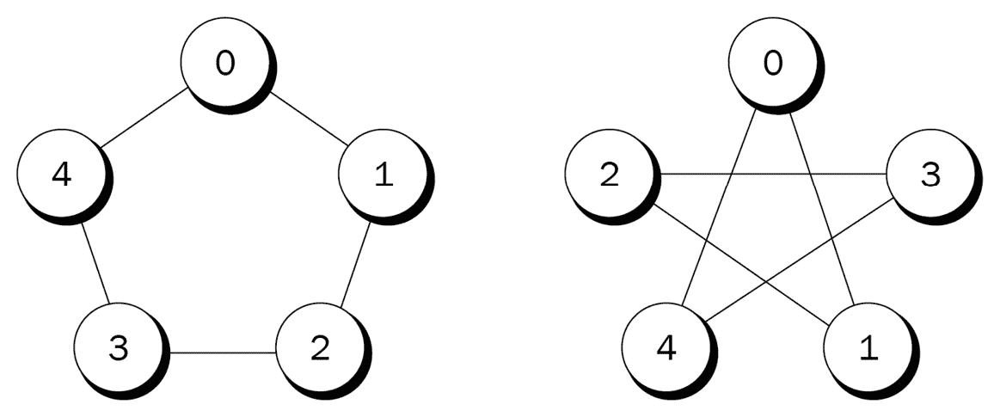

图 9.1 – 两个同构图的示例

WL 测试旨在构建图的**标准形式**。我们可以比较两个图的标准形式，以检查它们是否同构。然而，这个测试并不完美，非同构图也可能具有相同的标准形式。这可能令人惊讶，但这是一个复杂的问题，目前仍未完全理解；例如，WL 算法的复杂度尚不清楚。

WL 测试如下进行：

1.  在开始时，图中的每个节点都会获得相同的颜色。

1.  每个节点都会聚合自身的颜色以及邻居节点的颜色。

1.  结果会输入到一个哈希函数中，产生一个新的颜色。

1.  每个节点聚合其新的颜色和邻居节点的新颜色。

1.  结果会输入到一个哈希函数中，产生一个新的颜色。

1.  这些步骤会重复进行，直到没有节点的颜色发生变化。

下图总结了 WL 算法。

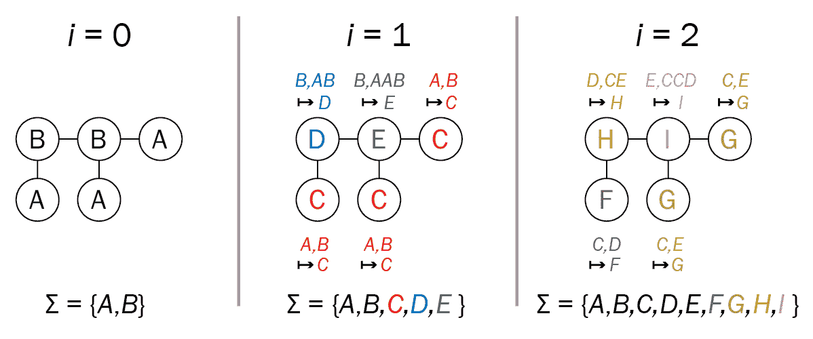

图 9.2 – WL 算法应用于获取图的标准形式

结果颜色为我们提供了图的标准形式。如果两个图的颜色不相同，它们就不是同构的。相反，如果它们获得了相同的颜色，我们不能确定它们是同构的。

我们描述的步骤应该是熟悉的；它们与 GNN 执行的操作非常相似。颜色是一种嵌入形式，而哈希函数则是一个聚合器。但它不仅仅是任何一个聚合器；哈希函数特别适合这个任务。如果我们将其替换为另一个函数，例如平均值或最大值聚合器（如在*第八章*中所见），它仍然会高效吗？

让我们看一下每个操作符的结果：

+   使用平均值聚合器时，1 个蓝色节点和 1 个红色节点，或者 10 个蓝色节点和 10 个红色节点，会产生相同的嵌入（蓝色和红色各占一半）。

+   使用最大值聚合器时，上一示例中一半的节点将被忽略；嵌入只会考虑蓝色或红色。

+   然而，使用和法聚合器时，每个节点都参与最终嵌入的计算；拥有 1 个红色节点和 1 个蓝色节点与拥有 10 个蓝色节点和 10 个红色节点是不同的。

确实，和法聚合器能够区分比其他两种聚合器更多的图结构。如果我们遵循这一逻辑，这只能意味着一件事——我们迄今为止使用的聚合器是次优的，因为它们的表达能力严格低于和法。我们能否利用这一知识构建更好的 GNN？在下一节中，我们将基于这个想法介绍**图同构网络**（**GIN**）。

# 引入 GIN

在上一节中，我们看到前几章介绍的 GNN 比 WL 测试的表现差。这是一个问题，因为区分更多图结构的能力似乎与结果嵌入的质量密切相关。在本节中，我们将理论框架转化为一种新的 GNN 架构——GIN。

该方法由 Xu 等人于 2018 年在论文《*图神经网络有多强大？*》[2]中提出，GIN 的设计旨在具备与 WL 测试相同的表达能力。作者通过将聚合操作分为两个函数，概括了我们在聚合中的观察：

+   **聚合**：该函数，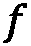，选择 GNN 考虑的邻近节点

+   **合并**：该函数，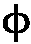，将选定节点的嵌入合并起来，生成目标节点的新嵌入

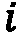 节点的嵌入可以写作如下：

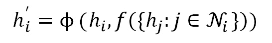

在 GCN 的情况下，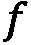 函数聚合了 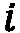 节点的每个邻居，且 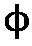 应用了特定的均值聚合器。在 GraphSAGE 的情况下，邻域采样是 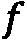 函数，我们看到了 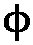 的三种选项——均值、LSTM 和最大值聚合器。

那么，GIN 中的这些函数是什么呢？Xu 等人认为它们必须是 **单射**。如 *图 9.3* 所示，单射函数将不同的输入映射到不同的输出。这正是我们想要区分图结构的原因。如果这些函数不是单射的，我们将得到相同的输出对应不同的输入。在这种情况下，我们的嵌入表示的价值会降低，因为它们包含的信息较少。

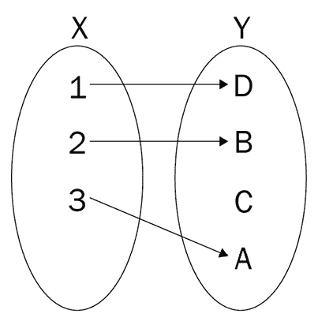

图 9.3 – 一个单射函数的映射示意图

GIN 的作者使用了一个巧妙的技巧来设计这两个函数——他们简单地对它们进行了逼近。在 GAT 层，我们学习了自注意力权重。在这个例子中，我们可以通过一个单一的 MLP 来学习这两个函数，得益于普适逼近定理：

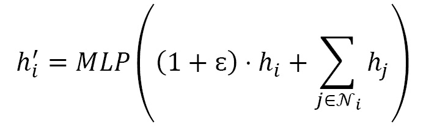

这里，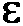 是一个可学习的参数或一个固定的标量，表示目标节点的嵌入与其邻居节点嵌入的相对重要性。作者还强调，MLP 必须具有多层，以便区分特定的图结构。

现在我们有了一个与 WL 测试一样具有表现力的 GNN。我们还能做得更好吗？答案是肯定的。WL 测试可以推广到更高层次的测试层次，称为**k-WL**。与考虑单个节点不同，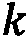-WL 测试查看的是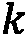-元组节点。这意味着它们是非局部的，因为它们可以查看远距离的节点。这也是为什么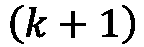-WL 测试能够区分比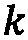-WL 测试更多的图结构的原因。

已提出了多种基于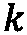-WL 测试的架构，例如 Morris 等人提出的**k-GNN** [3]。虽然这些架构帮助我们更好地理解 GNN 的工作原理，但它们在实践中往往比不太具有表现力的模型（如 GNN 或 GAT）表现差[4]。但希望并未完全破灭，我们将在下节中看到，在图分类的特定背景下，情况会有所不同。

# 使用 GIN 进行图分类

我们可以直接实现一个 GIN 模型来进行节点分类，但该架构对于执行图分类更为有趣。在本节中，我们将看到如何使用`PROTEINS`数据集将节点嵌入转换为图嵌入，并比较我们使用 GIN 和 GCN 模型的结果。

## 图分类

图分类是基于 GNN 生成的节点嵌入。这一操作通常称为全局池化或**图级读出**。实现这一操作有三种简单的方法：

+   **均值全局池化**：图嵌入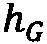是通过对图中每个节点的嵌入取平均值获得的：

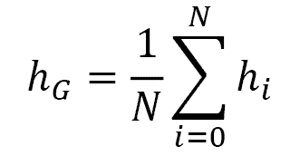

+   **最大全局池化**：图嵌入是通过为每个节点维度选择最高值来获得的：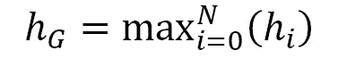

+   **求和全局池化**：图嵌入是通过对图中每个节点的嵌入求和来获得的：

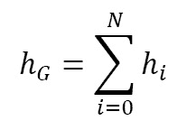

根据我们在第一节中看到的，求和全局池化在表现力上严格优于其他两种技术。GIN 的作者也指出，为了考虑所有结构信息，有必要考虑 GNN 每一层生成的嵌入。总之，我们将每一层的节点嵌入的和进行连接：

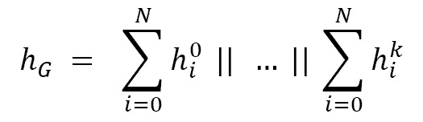

该方案优雅地将求和运算符的表达能力与每层通过连接提供的记忆相结合。

## 实现 GIN

我们将实现一个 GIN 模型，并在`PROTEINS [5, 6,` `7]`数据集上使用之前的图级读出函数。

该数据集包含 1,113 个图，表示蛋白质，其中每个节点都是一个氨基酸。当两个节点之间的距离小于 0.6 纳米时，它们之间就有一条边。这个数据集的目标是将每个蛋白质分类为**酶**。酶是特定类型的蛋白质，作为催化剂加速细胞中的化学反应。例如，被称为脂肪酶的酶帮助消化食物。*图 9.4*显示了一个蛋白质的 3D 图。

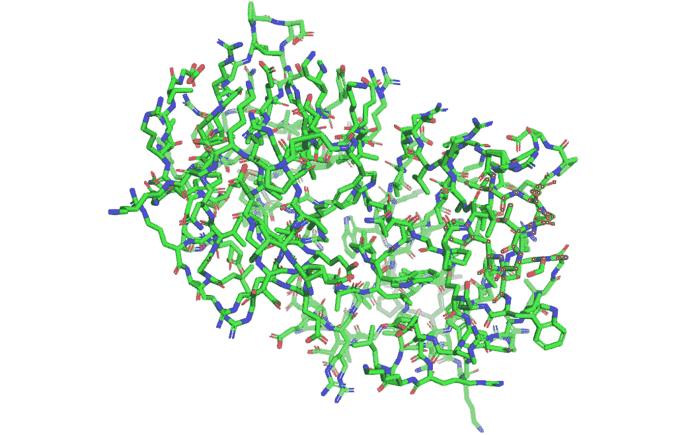

图 9.4 – 一个蛋白质的 3D 示例

让我们在这个数据集上实现一个 GIN 模型：

1.  首先，我们使用 PyTorch Geometric 中的`TUDataset`类导入`PROTEINS`数据集，并打印信息：

    ```py
    from torch_geometric.datasets import TUDataset
    dataset = TUDataset(root='.', name='PROTEINS').shuffle()
    print(f'Dataset: {dataset}')
    print('-----------------------')
    print(f'Number of graphs: {len(dataset)}')
    print(f'Number of nodes: {dataset[0].x.shape[0]}')
    print(f'Number of features: {dataset.num_features}')
    print(f'Number of classes: {dataset.num_classes}')
    Dataset: PROTEINS(1113)
    -----------------------
    Number of graphs: 1113
    Number of nodes: 30
    Number of features: 0
    Number of classes: 2
    ```

1.  我们将数据（图）按照 80/10/10 的比例分为训练集、验证集和测试集：

    ```py
    from torch_geometric.loader import DataLoader
    train_dataset = dataset[:int(len(dataset)*0.8)]
    val_dataset   = dataset[int(len(dataset)*0.8):int(len(dataset)*0.9)]
    test_dataset  = dataset[int(len(dataset)*0.9):]
    print(f'Training set   = {len(train_dataset)} graphs')
    print(f'Validation set = {len(val_dataset)} graphs')
    print(f'Test set       = {len(test_dataset)} graphs')
    ```

1.  这将给我们以下输出：

    ```py
    Training set   = 890 graphs
    Validation set = 111 graphs
    Test set       = 112 graphs
    ```

1.  我们使用`DataLoader`对象将这些拆分转换为迷你批次，批量大小为 64。这意味着每个批次将包含最多 64 个图：

    ```py
    train_loader = DataLoader(train_dataset, batch_size=64, shuffle=True)
    val_loader   = DataLoader(val_dataset, batch_size=64, shuffle=True)
    test_loader  = DataLoader(test_dataset, batch_size=64, shuffle=True)
    ```

1.  我们可以通过打印每个批次的信息来验证这一点，如下所示：

    ```py
    print('\nTrain loader:')
    for i, batch in enumerate(train_loader):
        print(f' - Batch {i}: {batch}')
    print('\nValidation loader:')
    for i, batch in enumerate(val_loader):
        print(f' - Batch {i}: {batch}')
    print('\nTest loader:')
    for i, batch in enumerate(test_loader):
        print(f' - Batch {i}: {batch}')
    Train loader:
     - Batch 0: DataBatch(edge_index=[2, 8622], x=[2365, 0], y=[64], batch=[2365], ptr=[65])
     - Batch 1: DataBatch(edge_index=[2, 6692], x=[1768, 0], y=[64], batch=[1768], ptr=[65])
    …
     - Batch 13: DataBatch(edge_index=[2, 7864], x=[2102, 0], y=[58], batch=[2102], ptr=[59])
    Validation loader:
     - Batch 0: DataBatch(edge_index=[2, 8724], x=[2275, 0], y=[64], batch=[2275], ptr=[65])
     - Batch 1: DataBatch(edge_index=[2, 8388], x=[2257, 0], y=[47], batch=[2257], ptr=[48])
    Test loader:
     - Batch 0: DataBatch(edge_index=[2, 7906], x=[2187, 0], y=[64], batch=[2187], ptr=[65])
     - Batch 1: DataBatch(edge_index=[2, 9442], x=[2518, 0], y=[48], batch=[2518], ptr=[49])
    ```

让我们开始实现一个 GIN 模型。我们首先需要回答的问题是 GIN 层的组成。我们需要一个至少有两层的 MLP。根据作者的指导，我们还可以引入批量归一化来标准化每个隐藏层的输入，这样可以稳定并加速训练。总而言之，我们的 GIN 层具有以下组成：

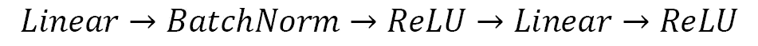

在代码中，它被定义如下：

```py
import torch
torch.manual_seed(0)
import torch.nn.functional as F
from torch.nn import Linear, Sequential, BatchNorm1d, ReLU, Dropout
from torch_geometric.nn import GINConv
from torch_geometric.nn import global_add_pool
class GIN(torch.nn.Module):
    def __init__(self, dim_h):
        super(GIN, self).__init__()
        self.conv1 = GINConv(
            Sequential(Linear(dataset.num_node_features, dim_h), BatchNorm1d(dim_h), ReLU(), Linear(dim_h, dim_h), ReLU()))
        self.conv2 = GINConv(
            Sequential(Linear(dim_h, dim_h), BatchNorm1d(dim_h), ReLU(), Linear(dim_h, dim_h), ReLU()))
        self.conv3 = GINConv(
            Sequential(Linear(dim_h, dim_h), BatchNorm1d(dim_h), ReLU(), Linear(dim_h, dim_h), ReLU()))
```

注意

PyTorch Geometric 还提供了 GINE 层，这是 GIN 层的修改版。它在 2019 年由 Hu 等人在《*图神经网络预训练策略*》[8]中提出。与之前的 GIN 版本相比，它的主要改进是能够在聚合过程中考虑边缘特征。`PROTEINS`数据集没有边缘特征，这就是为什么我们将实现经典的 GIN 模型。

1.  我们的模型还不完整。我们必须记住，我们的目标是进行图分类。图分类要求对每一层中的每个节点嵌入进行求和。换句话说，我们需要为每一层存储一个`dim_h`大小的向量——在这个例子中是三个。这就是为什么在最终的二分类线性层前，我们会添加一个`3*dim_h`大小的线性层（`data.num_classes` = 2）：

    ```py
            self.lin1 = Linear(dim_h*3, dim_h*3)
            self.lin2 = Linear(dim_h*3, dataset.num_classes)
    ```

1.  我们必须实现逻辑来连接我们初始化的层。每一层都会生成不同的嵌入张量——`h1`、`h2`和`h3`。我们使用`global_add_pool()`函数将它们求和，然后使用`torch.cat()`将它们连接起来。这就为我们的分类器提供了输入，分类器作为一个普通的神经网络，带有一个 dropout 层：

    ```py
        def forward(self, x, edge_index, batch):
            # Node embeddings
            h1 = self.conv1(x, edge_index)
            h2 = self.conv2(h1, edge_index)
            h3 = self.conv3(h2, edge_index)
            # Graph-level readout
            h1 = global_add_pool(h1, batch)
            h2 = global_add_pool(h2, batch)
            h3 = global_add_pool(h3, batch)
            # Concatenate graph embeddings
            h = torch.cat((h1, h2, h3), dim=1)
            # Classifier
            h = self.lin1(h)
            h = h.relu()
            h = F.dropout(h, p=0.5, training=self.training)
            h = self.lin2(h)
            return F.log_softmax(h, dim=1)
    ```

1.  现在，我们可以实现一个常规的训练循环，使用迷你批次进行 100 个 epoch：

    ```py
    def train(model, loader):
        criterion = torch.nn.CrossEntropyLoss()
        optimizer = torch.optim.Adam(model.parameters(), lr=0.01)
        epochs = 100
        model.train()
        for epoch in range(epochs+1):
            total_loss = 0
            acc = 0
            val_loss = 0
            val_acc = 0
            # Train on batches
            for data in loader:
                optimizer.zero_grad()
                out = model(data.x, data.edge_index, data.batch)
                loss = criterion(out, data.y)
                total_loss += loss / len(loader)
                acc += accuracy(out.argmax(dim=1), data.y) / len(loader)
                loss.backward()
                optimizer.step()
                # Validation
                val_loss, val_acc = test(model, val_loader)
    ```

1.  我们每 20 个 epoch 打印一次训练和验证的准确率，并返回训练好的模型：

    ```py
            # Print metrics every 20 epochs
            if(epoch % 20 == 0):
                print(f'Epoch {epoch:>3} | Train Loss: {total_loss:.2f} | Train Acc: {acc*100:>5.2f}% | Val Loss: {val_loss:.2f} | Val Acc: {val_acc*100:.2f}%')
        return model
    ```

1.  与上一章中的 `test` 函数不同，这个函数还必须包括小批量处理，因为我们的验证和测试加载器包含多个批次：

    ```py
    @torch.no_grad()
    def test(model, loader):
        criterion = torch.nn.CrossEntropyLoss()
        model.eval()
        loss = 0
        acc = 0
        for data in loader:
            out = model(data.x, data.edge_index, data.batch)
            loss += criterion(out, data.y) / len(loader)
            acc += accuracy(out.argmax(dim=1), data.y) / len(loader)
        return loss, acc
    ```

1.  我们定义将用于计算准确率得分的函数：

    ```py
    def accuracy(pred_y, y):
        return ((pred_y == y).sum() / len(y)).item()
    ```

1.  让我们实例化并训练我们的 GIN 模型：

    ```py
    gin = GIN(dim_h=32)
    gin = train(gin, train_loader)
    Epoch 0 | Train Loss: 1.33 | Train Acc: 58.04% | Val Loss: 0.70 | Val Acc: 59.97%
    Epoch 20 | Train Loss: 0.54 | Train Acc: 74.50% | Val Loss: 0.55 | Val Acc: 76.86%
    Epoch 40 | Train Loss: 0.50 | Train Acc: 76.28% | Val Loss: 0.56 | Val Acc: 74.73%
    Epoch 60 | Train Loss: 0.50 | Train Acc: 76.77% | Val Loss: 0.54 | Val Acc: 72.04%
    Epoch 80 | Train Loss: 0.49 | Train Acc: 76.95% | Val Loss: 0.57 | Val Acc: 73.67%
    Epoch 100 | Train Loss: 0.50 | Train Acc: 76.04% | Val Loss: 0.53 | Val Acc: 69.55%
    ```

1.  最后，让我们使用测试加载器进行测试：

    ```py
    test_loss, test_acc = test(gin, test_loader)
    print(f'Test Loss: {test_loss:.2f} | Test Acc: {test_acc*100:.2f}%')
    Test Loss: 0.44 | Test Acc: 81.77%
    ```

为了更好地理解这个最终测试得分，我们可以实现一个 GCN，该 GCN 使用简单的全局平均池化（在 PyTorch Geometric 中为 `global_mean_pool()`）执行图分类。在完全相同的设置下，它在 100 次实验中获得了平均准确率 53.72%（± 0.73%）。这远低于 GIN 模型的平均准确率 76.56%（± 1.77%）。

我们可以得出结论，整个 GIN 架构比 GCN 更适合这个图分类任务。根据我们使用的理论框架，这可以通过 GCN 在表达能力上严格低于 GIN 来解释。换句话说，GIN 可以区分比 GCN 更多的图结构，这就是为什么它们更准确的原因。我们可以通过可视化两个模型的错误来验证这个假设：

1.  我们导入 `matplotlib` 和 `networkx` 库，以绘制一个 4x4 的蛋白质图：

    ```py
    import numpy as np
    import networkx as nx
    import matplotlib.pyplot as plt
    from torch_geometric.utils import to_networkx
    fig, ax = plt.subplots(4, 4)
    ```

1.  对于每个蛋白质，我们从我们的 GNN（此处为 GIN）中获取最终分类。如果预测正确，我们给它绿色（否则为红色）：

    ```py
    for i, data in enumerate(dataset[-16:]):
        out = gcn(data.x, data.edge_index, data.batch)
        color = "green" if out.argmax(dim=1) == data.y else "red"
    ```

1.  我们为了方便将蛋白质转化为 `networkx` 图。然后，我们可以使用 `nx.draw_networkx()` 函数绘制它：

    ```py
        ix = np.unravel_index(i, ax.shape)
        ax[ix].axis('off')
        G = to_networkx(dataset[i], to_undirected=True)
        nx.draw_networkx(G,
                        pos=nx.spring_layout(G, seed=0),
                        with_labels=False,
                        node_size=10,
                        node_color=color,
                        width=0.8,
                        ax=ax[ix]
                        )
    ```

1.  我们为 GIN 模型获得了以下图示。

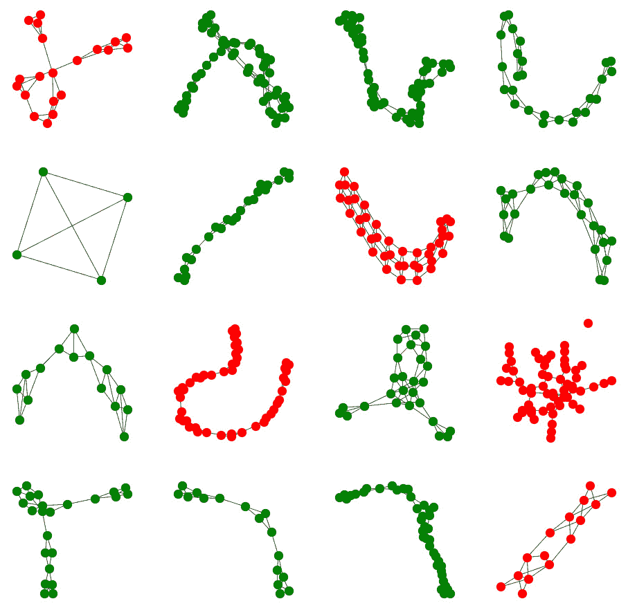

图 9.5 – GIN 模型生成的图分类

1.  我们为 GCN 重复这个过程，并获得以下可视化结果。

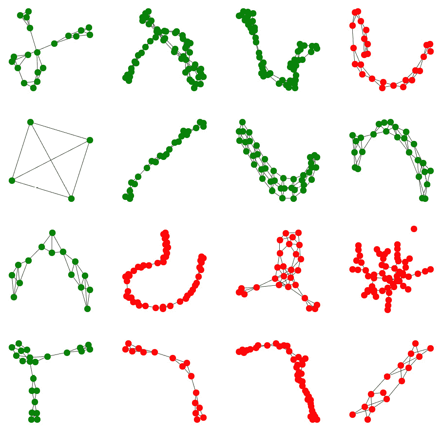

图 9.6 – GCN 模型生成的图分类

正如预期的那样，GCN 模型犯了更多的错误。要理解哪些图结构没有被充分捕捉，需要对每个被 GIN 正确分类的蛋白质进行广泛分析。然而，我们可以看到，GIN 也会犯不同的错误。这一点很有趣，因为它表明这些模型可以互为补充。

从犯不同错误的模型创建集成是机器学习中的常见技术。我们可以使用不同的方法，例如训练一个新的模型来处理我们的最终分类。由于本章的目标不是创建集成模型，因此我们将实现一个简单的模型平均技术：

1.  首先，我们将模型设置为评估模式，并定义用于存储准确率得分的变量：

    ```py
    gcn.eval()
    gin.eval()
    acc_gcn = 0
    acc_gin = 0
    acc_ens = 0
    ```

1.  我们获取每个模型的最终分类，并将它们结合起来获得集成模型的预测结果：

    ```py
    for data in test_loader:
        out_gcn = gcn(data.x, data.edge_index, data.batch)
        out_gin = gin(data.x, data.edge_index, data.batch)
        out_ens = (out_gcn + out_gin)/2
    ```

1.  我们计算了三个预测集的准确率得分：

    ```py
        acc_gcn += accuracy(out_gcn.argmax(dim=1), data.y) / len(test_loader)
        acc_gin += accuracy(out_gin.argmax(dim=1), data.y) / len(test_loader)
        acc_ens += accuracy(out_ens.argmax(dim=1), data.y) / len(test_loader)
    ```

1.  最后，让我们打印结果：

    ```py
    print(f'GCN accuracy:     {acc_gcn*100:.2f}%')
    print(f'GIN accuracy:     {acc_gin*100:.2f}%')
    print(f'GCN+GIN accuracy: {acc_ens*100:.2f}%')
    GCN accuracy: 72.14%
    GIN accuracy: 80.99%
    GCN+GIN accuracy: 81.25%
    ```

在这个示例中，我们的集成模型的准确率为 81.25%，超越了两个单独模型（GCN 为 72.14%，GIN 为 80.99%）。这个结果非常显著，因为它展示了这种技术所提供的可能性。然而，这并不一定适用于所有情况；即使在这个例子中，集成模型也未能始终超越 GIN。我们可以通过加入其他架构的嵌入，例如 `Node2Vec`，来丰富该模型，看看是否能提高最终准确率。

# 总结

在本章中，我们定义了 GNNs 的表达能力。这个定义基于另一种算法——WL 方法，该算法输出图的规范形式。这个算法并不完美，但可以区分大多数图结构。它启发了 GIN 架构的设计，旨在具有与 WL 测试一样强的表达能力，因此，它比 GCN、GAT 或 GraphSAGE 更具表达能力。

我们随后实现了这个架构用于图分类。我们看到了一些不同的方法来将节点嵌入合并成图嵌入。GIN 提供了一种新技术，结合了求和运算符和每个 GIN 层产生的图嵌入的拼接。它显著优于使用 GCN 层获得的经典全局均值池化方法。最后，我们将两种模型的预测结果组合成一个简单的集成模型，进一步提高了准确率。

在 *第十章*《使用图神经网络预测链接》中，我们将探讨另一个与 GNNs 相关的流行任务——链接预测。事实上，这并不完全是新鲜的，因为我们之前看到的技术，如 `DeepWalk` 和 `Node2Vec`，已经基于这个思想。我们将解释原因，并介绍两个新的 GNN 框架——图（变分）自编码器和 SEAL。最后，我们将在 `Cora` 数据集上实现并比较它们在链接预测任务上的表现。

# 进一步阅读

+   [1] Weisfeiler 和 Lehman, A.A. (1968) 图的规范化形式及其在该规范化过程中出现的代数。Nauchno-Technicheskaya Informatsia, 9.

+   [2] K. Xu, W. Hu, J. Leskovec 和 S. Jegelka, *图神经网络有多强大？* arXiv, 2018\. doi: 10.48550/ARXIV.1810.00826.

+   [3] C. Morris 等, *Weisfeiler 和 Leman 走向神经：高阶图神经网络*。arXiv, 2018\. doi: 10.48550/ARXIV.1810.02244.

+   [4] V. P. Dwivedi 等. *图神经网络基准测试*。arXiv, 2020\. doi: 10.48550/ARXIV.2003.00982.

+   [5] K. M. Borgwardt, C. S. Ong, S. Schoenauer, S. V. N. Vishwanathan, A. J. Smola 和 H. P. Kriegel. *通过图核进行蛋白质功能预测*。Bioinformatics, 21(Suppl 1):i47–i56, 2005 年 6 月。

+   [6] P. D. Dobson 和 A. J. Doig. *区分酶结构与非酶结构，无需对齐*。J. Mol. Biol., 330(4):771–783, 2003 年 7 月。

+   [7] Christopher Morris、Nils M. Kriege、Franka Bause、Kristian Kersting、Petra Mutzel 和 Marion Neumann。*TUDataset：一个用于图学习的基准数据集集合*。发表于 2020 年 ICML 图表示学习及其扩展研讨会。

+   [8] W. Hu 等人，*预训练图神经网络的策略*。arXiv，2019 年。doi: 10.48550/ARXIV.1905.12265。
