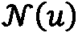
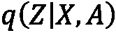
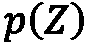
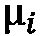
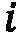

# 第十章：使用图神经网络预测链接

**链接预测**是图形分析中最常见的任务之一。它被定义为预测两个节点之间是否存在链接的问题。这一能力在社交网络和推荐系统中起着核心作用。一个好的例子是社交媒体网络如何展示你与他人共有的朋友和关注者。如果这个数字很高，你更可能与这些人建立连接。这种可能性正是链接预测试图估算的内容。

在本章中，我们首先将看到如何在没有任何机器学习的情况下执行链接预测。这些传统技术对于理解 GNN 所学的内容至关重要。接着，我们将参考前几章关于`DeepWalk`和`Node2Vec`的内容，通过**矩阵分解**进行链接预测。不幸的是，这些技术有显著的局限性，这就是为什么我们将转向基于 GNN 的方法。

我们将探讨来自两个不同范畴的三种方法。第一个范畴基于节点嵌入，并执行基于图神经网络（GNN）的矩阵分解。第二种方法则侧重于子图表示。每个链接（无论真假）周围的邻域被视为输入，用于预测链接的概率。最后，我们将在 PyTorch Geometric 中实现每个范畴的模型。

到本章结束时，你将能够实现各种链接预测技术。给定一个链接预测问题，你将知道哪种技术最适合解决它——启发式方法、矩阵分解、基于 GNN 的嵌入，或基于子图的技术。

在本章中，我们将涵盖以下主要内容：

+   使用传统方法预测链接

+   使用节点嵌入预测链接

+   使用 SEAL 预测链接

# 技术要求

本章的所有代码示例都可以在 GitHub 上找到，网址为 [`github.com/PacktPublishing/Hands-On-Graph-Neural-Networks-Using-Python/tree/main/Chapter10`](https://github.com/PacktPublishing/Hands-On-Graph-Neural-Networks-Using-Python/tree/main/Chapter10)。

在本书的*前言*部分可以找到在本地机器上运行代码所需的安装步骤。

# 使用传统方法预测链接

链接预测问题已经存在很长时间，这也是为何提出了许多技术来解决这个问题。本节首先将描述基于局部和全局邻域的常用启发式方法。接着，我们将介绍矩阵分解及其与 DeepWalk 和 Node2Vec 的关系。

## 启发式技术

启发式技术是一种简单而实用的方式，用于预测节点之间的链接。它们易于实现，并为这一任务提供了强大的基准。我们可以根据它们执行的跳数对它们进行分类（见*图 10.1*）。其中一些方法只需要考虑与目标节点相邻的 1 跳邻居。而更复杂的技术则考虑 2 跳邻居或整个图。在本节中，我们将它们分为两类——*局部*（1 跳和 2 跳）和*全局*启发式方法。


图 10.1 – 包含 1 跳、2 跳和 3 跳邻居的图

局部启发式方法通过考虑两个节点的局部邻域来衡量它们之间的相似性。我们用  来表示节点  的邻居。以下是三种流行的局部启发式方法的示例：

+   **共同邻居**仅计算两个节点共同拥有的邻居数量（1 跳邻居）。其思想类似于我们之前在社交网络中的示例——你们有共同邻居的数量越多，你们越有可能被连接：


+   **Jaccard 系数**衡量两个节点共享的邻居（1 跳邻居）的比例。它基于与共同邻居相同的理念，但通过邻居的总数对结果进行归一化。这会奖励邻居数量少的节点，而不是度数高的节点：


+   **Adamic–Adar 指数**对两个目标节点共享的邻居的逆对数度数进行求和（2 跳邻居）。其思想是，具有大规模邻域的共同邻居不如具有小规模邻域的共同邻居重要。因此，它们在最终评分中的重要性应该较低：


所有这些技术都依赖于邻居节点的度数，无论它们是直接的（共同邻居或 Jaccard 系数）还是间接的（Adamic–Adar 指数）。这对于速度和可解释性有益，但也限制了它们能够捕捉的关系的复杂性。

全局启发式方法通过考虑整个网络而不是局部邻域来解决这个问题。以下是两个著名的例子：

+   **Katz 指数**计算两个节点之间每条可能路径的加权和。权重对应于折扣因子，（通常在 0.8 到 0.9 之间），用于惩罚较长的路径。根据这个定义，如果两个节点之间有许多（最好是短的）路径，它们更有可能连接。可以使用邻接矩阵的幂来计算任意长度的路径，，这就是为什么 Katz 指数定义如下：

+   `DeepWalk` 和 `Node2Vec` 算法。

全局启发式方法通常更准确，但需要了解整个图。尽管如此，这些方法并不是唯一能够通过这些知识预测链接的方式。

## 矩阵分解

链接预测的矩阵分解受到了推荐系统[2]中先前工作的启发。通过这项技术，我们通过预测整个邻接矩阵！[](img/Formula_B19153_10_010.png)间接预测链接。该操作是通过节点嵌入来完成的——相似的节点，和，应该有相似的嵌入，和。通过点积，我们可以将其写成如下形式：

+   如果这些节点相似，应该是最大的

+   如果这些节点是不同的，应该是最小的

到目前为止，我们假设相似的节点应该是连接的。这就是我们可以使用点积来近似邻接矩阵每个元素（链接）的原因！[](img/Formula_B19153_10_017.png)：


就矩阵乘法而言，我们有以下公式：


这里，是节点嵌入矩阵。下图展示了矩阵分解如何工作的可视化解释：


图 10.2 – 使用节点嵌入的矩阵乘法

这项技术被称为矩阵分解，因为邻接矩阵！[](img/Formula_B19153_10_021.png)被分解为两个矩阵的乘积。目标是学习相关的节点嵌入，以最小化图中真实元素和预测元素之间的 L2 范数！[](img/Formula_B19153_10_022.png)和！[](img/Formula_B19153_10_023.png)：


矩阵分解的更高级变种包括拉普拉斯矩阵和的幂。另一种解决方案是使用诸如`DeepWalk`和`Node2Vec`之类的模型。它们生成的节点嵌入可以配对以创建链接表示。根据 Qiu 等人[3]的研究，这些算法隐式地近似并分解复杂矩阵。例如，这是`DeepWalk`计算的矩阵：


这里，是负采样的参数。同样的情况也适用于类似的算法，如 LINE 和 PTE。尽管它们能够捕捉更复杂的关系，但它们仍然存在我们在*第三章*和*第四章*中看到的相同局限性：

+   **它们无法使用节点特征**：它们仅使用拓扑信息来创建嵌入

+   **它们没有归纳能力**：它们无法对训练集以外的节点进行泛化

+   **它们无法捕捉结构相似性**：图中的结构相似节点可能获得完全不同的嵌入

这些局限性促使了基于 GNN（图神经网络）技术的需求，正如我们将在接下来的章节中看到的那样。

# 使用节点嵌入预测链接

在前面的章节中，我们讨论了如何使用 GNN 生成节点嵌入。一种流行的链路预测技术是使用这些嵌入进行矩阵分解。本节将讨论两种用于链路预测的 GNN 架构——**图自编码器**（**GAE**）和**变分图自编码器**（**VGAE**）。

## 引入图自编码器

这两种架构由 Kipf 和 Welling 在 2016 年[5]的三页论文中介绍。它们代表了两种流行神经网络架构的 GNN 对应物——自编码器和变分自编码器。对这些架构的先验知识是有帮助的，但不是必须的。为了便于理解，我们将首先关注 GAE。

GAE 由两个模块组成：

+   **编码器**是一个经典的两层 GCN，通过以下方式计算节点嵌入：


+   **解码器**使用矩阵分解和 sigmoid 函数来逼近邻接矩阵，，输出概率：


请注意，我们并不是要对节点或图进行分类。目标是为邻接矩阵的每个元素预测一个概率（在 0 和 1 之间），。这就是为什么 GAE 使用二元交叉熵损失（负对数似然）来训练，即两个邻接矩阵之间的元素：


然而，邻接矩阵通常非常稀疏，这会使 GAE 偏向于预测零值。有两种简单的技术可以解决这个偏差。首先，我们可以在前面的损失函数中添加一个权重，以偏向。其次，我们可以在训练过程中采样更少的零值，从而使标签更加平衡。后一种技术是 Kipf 和 Welling 实施的。

这种架构是灵活的——编码器可以替换为另一种类型的 GNN（例如，GraphSAGE），并且可以用 MLP 来替代解码器。另一个可能的改进是将 GAE 转化为概率变种——变分 GAE。

## 引入 VGAEs

GAEs 和 VGAEs 之间的区别就像自编码器和变分自编码器之间的区别一样。VGAEs 不是直接学习节点嵌入，而是学习正态分布，然后从中进行采样以生成嵌入。它们也分为两个模块：

+   **编码器**由两个共享第一层的 GCN 组成。目标是学习每个潜在正态分布的参数——均值，（由学习），和方差，（实际上，由学习）。

+   **解码器**从学习到的分布中采样嵌入，，使用重参数化技巧[4]。然后，它使用潜在变量之间的相同内积来近似邻接矩阵，。

在 VGAE 中，确保编码器输出符合正态分布是很重要的。这就是为什么我们要在损失函数中添加一个新项——**Kullback-Leibler**（**KL**）散度，它衡量两个分布之间的差异。我们得到以下损失，也称为**证据下界**（**ELBO**）：


这里，表示编码器，是的先验分布。

模型的性能通常使用两个指标来评估——ROC 曲线下面积（**AUROC**）和**平均**精度（**AP**）。

让我们看看如何使用 PyTorch Geometric 实现 VGAE。

## 实现 VGAE

与之前的 GNN 实现相比，主要有两个区别：

+   我们将对数据集进行预处理，以移除那些随机预测的链接。

+   我们将创建一个编码器模型，并将其输入到`VGAE`类中，而不是从头开始直接实现 VGAE。

以下代码灵感来自 PyTorch Geometric 的 VGAE 示例：

1.  首先，我们导入所需的库：

    ```py
    import numpy as np
    np.random.seed(0)
    import torch
    torch.manual_seed(0)
    import matplotlib.pyplot as plt
    import torch_geometric.transforms as T
    from torch_geometric.datasets import Planetoid
    ```

1.  如果 GPU 可用，我们会尝试使用它：

    ```py
    device = torch.device('cuda' if torch.cuda.is_available() else 'cpu')
    ```

1.  我们创建一个`transform`对象，它会对输入特征进行归一化，直接执行张量设备转换，并随机分割链接。在这个例子中，我们有 85/5/10 的分割比例。`add_negative_train_samples`参数设置为`False`，因为模型已经执行了负采样，因此数据集中不需要负样本：

    ```py
    transform = T.Compose([
        T.NormalizeFeatures(),
        T.ToDevice(device),
        T.RandomLinkSplit(num_val=0.05, num_test=0.1, is_undirected=True, split_labels=True, add_negative_train_samples=False),
    ])
    ```

1.  我们使用之前的`transform`对象加载`Cora`数据集：

    ```py
    dataset = Planetoid('.', name='Cora', transform=transform)
    ```

1.  `RandomLinkSplit`通过设计生成训练/验证/测试分割。我们将这些分割存储如下：

    ```py
    train_data, val_data, test_data = dataset[0]
    ```

1.  现在，让我们实现编码器。首先，我们需要导入`GCNConv`和`VGAE`：

    ```py
    from torch_geometric.nn import GCNConv, VGAE
    ```

1.  我们声明一个新类。在这个类中，我们需要三个 GCN 层——一个共享层，第二个层来近似均值，，第三个层来近似方差值（实际上是对数标准差，）：

    ```py
    class Encoder(torch.nn.Module):
        def __init__(self, dim_in, dim_out):
            super().__init__()
            self.conv1 = GCNConv(dim_in, 2 * dim_out)
            self.conv_mu = GCNConv(2 * dim_out, dim_out)
            self.conv_logstd = GCNConv(2 * dim_out, dim_out)
        def forward(self, x, edge_index):
            x = self.conv1(x, edge_index).relu()
            return self.conv_mu(x, edge_index), self.conv_logstd(x, edge_index)
    ```

1.  我们可以初始化 VGAE 并将编码器作为输入。默认情况下，它将使用内积作为解码器：

    ```py
    model = VGAE(Encoder(dataset.num_features, 16)).to(device)
    optimizer = torch.optim.Adam(model.parameters(), lr=0.01)
    ```

1.  `train()`函数包括两个重要步骤。首先，嵌入矩阵，，是通过`model.encode()`计算的；这个名字可能有些不直观，但这个函数确实是从学习到的分布中采样嵌入。然后，计算 ELBO 损失，使用`model.recon_loss()`（二元交叉熵损失）和`model.kl_loss()`（KL 散度）。解码器会隐式调用来计算交叉熵损失：

    ```py
    def train():
        model.train()
        optimizer.zero_grad()
        z = model.encode(train_data.x, train_data.edge_index)
        loss = model.recon_loss(z, train_data.pos_edge_label_index) + (1 / train_data.num_nodes) * model.kl_loss()
        loss.backward()
        optimizer.step()
        return float(loss)
    ```

1.  `test()`函数只是调用 VGAE 的专用方法：

    ```py
    @torch.no_grad()
    def test(data):
        model.eval()
        z = model.encode(data.x, data.edge_index)
        return model.test(z, data.pos_edge_label_index, data.neg_edge_label_index)
    ```

1.  我们将该模型训练了 301 个 epoch，并输出了两个内置指标——AUC 和 AP：

    ```py
    for epoch in range(301):
        loss = train()
        val_auc, val_ap = test(val_data)
        if epoch % 50 == 0:
            print(f'Epoch {epoch:>2} | Loss: {loss:.4f} | Val AUC: {val_auc:.4f} | Val AP: {val_ap:.4f}')
    ```

1.  我们获得了以下输出：

    ```py
    Epoch 0 | Loss: 3.4210 | Val AUC: 0.6772 | Val AP: 0.7110
    Epoch 50 | Loss: 1.3324 | Val AUC: 0.6593 | Val AP: 0.6922
    Epoch 100 | Loss: 1.1675 | Val AUC: 0.7366 | Val AP: 0.7298
    Epoch 150 | Loss: 1.1166 | Val AUC: 0.7480 | Val AP: 0.7514
    Epoch 200 | Loss: 1.0074 | Val AUC: 0.8390 | Val AP: 0.8395
    Epoch 250 | Loss: 0.9541 | Val AUC: 0.8794 | Val AP: 0.8797
    Epoch 300 | Loss: 0.9509 | Val AUC: 0.8833 | Val AP: 0.8845
    ```

1.  我们在测试集上评估了我们的模型：

    ```py
    test_auc, test_ap = test(test_data)
    print(f'Test AUC: {test_auc:.4f} | Test AP {test_ap:.4f}')
    Test AUC: 0.8833 | Test AP 0.8845
    ```

1.  最后，我们可以手动计算近似的邻接矩阵，！[](img/Formula_B19153_10_050.png)：

    ```py
    z = model.encode(test_data.x, test_data.edge_index)
    Ahat = torch.sigmoid(z @ z.T)
    tensor([[0.8846, 0.5068, ..., 0.5160, 0.8309, 0.8378],
            [0.5068, 0.8741, ..., 0.3900, 0.5367, 0.5495],
            [0.7074, 0.7878, ..., 0.4318, 0.7806, 0.7602],
            ...,
            [0.5160, 0.3900, ..., 0.5855, 0.5350, 0.5176],
            [0.8309, 0.5367, ..., 0.5350, 0.8443, 0.8275],
            [0.8378, 0.5495, ..., 0.5176, 0.8275, 0.8200]
      ], device='cuda:0', grad_fn=<SigmoidBackward0>)
    ```

训练 VGAE 快速且输出结果易于理解。然而，我们看到 GCN 并不是最具表现力的操作符。为了提高模型的表现力，我们需要结合更好的技术。

# 使用 SEAL 进行链接预测

上一节介绍了基于节点的方法，这些方法学习相关的节点嵌入来计算链接的可能性。另一种方法是观察目标节点周围的局部邻域。这些技术被称为基于子图的算法，并由**SEAL**推广（虽然不一定总是如此，可以理解为**子图、嵌入和属性用于链接预测**的缩写）。在本节中，我们将描述 SEAL 框架，并使用 PyTorch Geometric 实现它。

## 引入 SEAL 框架

由张和陈在 2018 年提出的[6]，SEAL 是一个用于链接预测的框架，旨在学习图结构特征。它定义了由目标节点！[](img/Formula_B19153_10_051.png)及其！[](img/Formula_B19153_10_052.png)跳邻居所构成的子图为**封闭子图**。每个封闭子图被用作输入（而不是整个图）来预测链接的可能性。另一种看法是，SEAL 自动学习一个本地启发式规则来进行链接预测。

该框架包含三个步骤：

1.  **封闭子图提取**，包括采用一组真实链接和一组虚假链接（负采样）来构成训练数据。

1.  **节点信息矩阵构建**，涉及三个组成部分——节点标签、节点嵌入和节点特征。

1.  **GNN 训练**，它以节点信息矩阵作为输入，输出链接的可能性。

这些步骤在下图中进行了总结：


图 10.3 – SEAL 框架

封闭子图提取是一个直接的过程。它包括列出目标节点及其！[](img/Formula_B19153_10_053.png)跳邻居，以提取它们的边和特征。较高的！[](img/Formula_B19153_10_054.png)将提高 SEAL 可以学习到的启发式规则的质量，但也会生成更大的子图，从而增加计算开销。

节点信息构建的第一个组成部分是节点标签。这个过程为每个节点分配一个特定的编号。如果没有这个步骤，GNN 将无法区分目标节点和上下文节点（它们的邻居）。它还嵌入了距离信息，描述节点的相对位置和结构重要性。

在实际应用中，目标节点， 和 ，必须共享一个唯一标签，以便将它们识别为目标节点。对于上下文节点， 和 ，如果它们与目标节点的距离相同—— 和 ，则必须共享相同的标签。我们称这种距离为双半径，记作 。

可以考虑不同的解决方案，但 SEAL 的作者提出了 **双半径节点标签化**（**DRNL**）算法。其工作原理如下：

1.  首先，将标签 1 分配给  和 。

1.  将标签 1 分配给半径为  的节点。

1.  将标签 3 分配给半径为  或  的节点。

1.  将标签 4 分配给半径为 、 等的节点。

DRNL 函数可以写作如下：


这里，、 和  是分别将  除以 2 后得到的整数商和余数。最后，这些节点标签被一热编码。

注意

另外两个组件较易获取。节点嵌入是可选的，但可以使用其他算法（如 `Node2Vec`）计算。然后，它们与节点特征和一热编码的标签一起连接，以构建最终的节点信息矩阵。

最后，训练一个 GNN 来预测链接，使用封闭子图的信息和邻接矩阵。在此任务中，SEAL 的作者选择了 **深度图卷积神经网络**（**DGCNN**）[7]。该架构执行三个步骤：

1.  几个 GCN 层计算节点嵌入，然后将其连接（像 GIN 一样）。

1.  一个全局排序池化层会在将这些嵌入输入卷积层之前，按照一致的顺序对它们进行排序，因为卷积层不是排列不变的。

1.  传统的卷积和密集层应用于排序后的图表示，并输出链接概率。

DGCNN 模型使用二元交叉熵损失进行训练，并输出介于 `0` 和 `1` 之间的概率。

## 实现 SEAL 框架

SEAL 框架需要大量的预处理来提取和标记封闭子图。我们通过 PyTorch Geometric 来实现它：

1.  首先，我们导入所有必要的库：

    ```py
    import numpy as np
    from sklearn.metrics import roc_auc_score, average_precision_score
    from scipy.sparse.csgraph import shortest_path
    import torch
    import torch.nn.functional as F
    from torch.nn import Conv1d, MaxPool1d, Linear, Dropout, BCEWithLogitsLoss
    from torch_geometric.datasets import Planetoid
    from torch_geometric.transforms import RandomLinkSplit
    from torch_geometric.data import Data
    from torch_geometric.loader import DataLoader
    from torch_geometric.nn import GCNConv, aggr
    from torch_geometric.utils import k_hop_subgraph, to_scipy_sparse_matrix
    ```

1.  我们加载 `Cora` 数据集并应用链接级随机拆分，如前一节所示：

    ```py
    transform = RandomLinkSplit(num_val=0.05, num_test=0.1, is_undirected=True, split_labels=True)
    dataset = Planetoid('.', name='Cora', transform=transform)
    train_data, val_data, test_data = dataset[0]
    ```

1.  链接级随机拆分在 `Data` 对象中创建新字段，用于存储每个正（真实）和负（伪造）边的标签和索引：

    ```py
    train_data
    Data(x=[2708, 1433], edge_index=[2, 8976], y=[2708], train_mask=[2708], val_mask=[2708], test_mask=[2708], pos_edge_label=[4488], pos_edge_label_index=[2, 4488], neg_edge_label=[4488], neg_edge_label_index=[2, 4488])
    ```

1.  我们创建一个函数来处理每个划分，并获得具有独热编码节点标签和节点特征的封闭子图。我们声明一个列表来存储这些子图：

    ```py
    def seal_processing(dataset, edge_label_index, y):
        data_list = []
    ```

1.  对于数据集中的每一对（源节点和目标节点），我们提取 k-hop 邻居（这里，）：

    ```py
        for src, dst in edge_label_index.t().tolist():
            sub_nodes, sub_edge_index, mapping, _ = k_hop_subgraph([src, dst], 2, dataset.edge_index, relabel_nodes=True)
            src, dst = mapping.tolist()
    ```

1.  我们使用 DRNL 函数计算距离。首先，我们从子图中移除目标节点：

    ```py
            mask1 = (sub_edge_index[0] != src) | (sub_edge_index[1] != dst)
            mask2 = (sub_edge_index[0] != dst) | (sub_edge_index[1] != src)
            sub_edge_index = sub_edge_index[:, mask1 & mask2]
    ```

1.  我们根据之前的子图计算源节点和目标节点的邻接矩阵：

    ```py
            src, dst = (dst, src) if src > dst else (src, dst)
            adj = to_scipy_sparse_matrix(sub_edge_index, num_nodes=sub_nodes.size(0)).tocsr()
            idx = list(range(src)) + list(range(src + 1, adj.shape[0]))
            adj_wo_src = adj[idx, :][:, idx]
            idx = list(range(dst)) + list(range(dst + 1, adj.shape[0]))
            adj_wo_dst = adj[idx, :][:, idx]
    ```

1.  我们计算每个节点与源/目标节点之间的距离：

    ```py
            d_src = shortest_path(adj_wo_dst, directed=False, unweighted=True, indices=src)
            d_src = np.insert(d_src, dst, 0, axis=0)
            d_src = torch.from_numpy(d_src)
            d_dst = shortest_path(adj_wo_src, directed=False, unweighted=True, indices=dst-1)
            d_dst = np.insert(d_dst, src, 0, axis=0)
            d_dst = torch.from_numpy(d_dst)
    ```

1.  我们为子图中的每个节点计算节点标签`z`：

    ```py
            dist = d_src + d_dst
            z = 1 + torch.min(d_src, d_dst) + dist // 2 * (dist // 2 + dist % 2 - 1)
            z[src], z[dst], z[torch.isnan(z)] = 1., 1., 0.
            z = z.to(torch.long)
    ```

1.  在本例中，我们不会使用节点嵌入，但我们仍然连接特征和独热编码标签来构建节点信息矩阵：

    ```py
            node_labels = F.one_hot(z, num_classes=200).to(torch.float)
            node_emb = dataset.x[sub_nodes]
            node_x = torch.cat([node_emb, node_labels], dim=1)
    ```

1.  我们创建一个`Data`对象并将其添加到列表中，这就是该函数的最终输出：

    ```py
            data = Data(x=node_x, z=z, edge_index=sub_edge_index, y=y)
            data_list.append(data)
        return data_list
    ```

1.  让我们使用它来为每个数据集提取封闭子图。我们将正负样本分开，以获得正确的预测标签：

    ```py
    train_pos_data_list = seal_processing(train_data, train_data.pos_edge_label_index, 1)
    train_neg_data_list = seal_processing(train_data, train_data.neg_edge_label_index, 0)
    val_pos_data_list = seal_processing(val_data, val_data.pos_edge_label_index, 1)
    val_neg_data_list = seal_processing(val_data, val_data.neg_edge_label_index, 0)
    test_pos_data_list = seal_processing(test_data, test_data.pos_edge_label_index, 1)
    test_neg_data_list = seal_processing(test_data, test_data.neg_edge_label_index, 0)
    ```

1.  接下来，我们合并正负数据列表，以重构训练、验证和测试数据集：

    ```py
    train_dataset = train_pos_data_list + train_neg_data_list
    val_dataset = val_pos_data_list + val_neg_data_list
    test_dataset = test_pos_data_list + test_neg_data_list
    ```

1.  我们创建数据加载器来使用批量训练 GNN：

    ```py
    train_loader = DataLoader(train_dataset, batch_size=32, shuffle=True)
    val_loader = DataLoader(val_dataset, batch_size=32)
    test_loader = DataLoader(test_dataset, batch_size=32)
    ```

1.  我们为 DGCNN 模型创建一个新类。`k`参数表示每个子图要保留的节点数：

    ```py
    class DGCNN(torch.nn.Module):
        def __init__(self, dim_in, k=30):
            super().__init__()
    ```

1.  我们创建四个 GCN 层，固定隐藏层维度为 32：

    ```py
            self.gcn1 = GCNConv(dim_in, 32)
            self.gcn2 = GCNConv(32, 32)
            self.gcn3 = GCNConv(32, 32)
            self.gcn4 = GCNConv(32, 1)
    ```

1.  我们在 DGCNN 架构的核心实例化全局排序池化：

    ```py
            self.global_pool = aggr.SortAggregation(k=k)
    ```

1.  全局池化提供的节点顺序使我们能够使用传统的卷积层：

    ```py
            self.conv1 = Conv1d(1, 16, 97, 97)
            self.conv2 = Conv1d(16, 32, 5, 1)
            self.maxpool = MaxPool1d(2, 2)
    ```

1.  最后，预测由 MLP 管理：

    ```py
            self.linear1 = Linear(352, 128)
            self.dropout = Dropout(0.5)
            self.linear2 = Linear(128, 1)
    ```

1.  在`forward()`函数中，我们计算每个 GCN 的节点嵌入并连接结果：

    ```py
        def forward(self, x, edge_index, batch):
            h1 = self.gcn1(x, edge_index).tanh()
            h2 = self.gcn2(h1, edge_index).tanh()
            h3 = self.gcn3(h2, edge_index).tanh()
            h4 = self.gcn4(h3, edge_index).tanh()
            h = torch.cat([h1, h2, h3, h4], dim=-1)
    ```

1.  全局排序池化、卷积层和密集层依次应用于该结果：

    ```py
            h = self.global_pool(h, batch)
            h = h.view(h.size(0), 1, h.size(-1))
            h = self.conv1(h).relu()
            h = self.maxpool(h)
            h = self.conv2(h).relu()
            h = h.view(h.size(0), -1)
            h = self.linear1(h).relu()
            h = self.dropout(h)
            h = self.linear2(h).sigmoid()
            return h
    ```

1.  如果 GPU 可用，我们在 GPU 上实例化模型，并使用`Adam`优化器和二元交叉熵损失进行训练：

    ```py
    device = torch.device('cuda' if torch.cuda.is_available() else 'cpu')
    model = DGCNN(train_dataset[0].num_features).to(device)
    optimizer = torch.optim.Adam(params=model.parameters(), lr=0.0001)
    criterion = BCEWithLogitsLoss()
    ```

1.  我们创建一个传统的`train()`函数进行批量训练：

    ```py
    def train():
        model.train()
        total_loss = 0
        for data in train_loader:
            data = data.to(device)
            optimizer.zero_grad()
            out = model(data.x, data.edge_index, data.batch)
            loss = criterion(out.view(-1), data.y.to(torch.float))
            loss.backward()
            optimizer.step()
            total_loss += float(loss) * data.num_graphs
        return total_loss / len(train_dataset)
    ```

1.  在`test()`函数中，我们计算 ROC AUC 分数和平均精度，以比较 SEAL 与 VGAE 的性能：

    ```py
    @torch.no_grad()
    def test(loader):
        model.eval()
        y_pred, y_true = [], []
        for data in loader:
            data = data.to(device)
            out = model(data.x, data.edge_index, data.batch)
            y_pred.append(out.view(-1).cpu())
            y_true.append(data.y.view(-1).cpu().to(torch.float))
        auc = roc_auc_score(torch.cat(y_true), torch.cat(y_pred))
        ap = average_precision_score(torch.cat(y_true), torch.cat(y_pred))
        return auc, ap
    ```

1.  我们训练 DGCNN 共 31 个 epoch：

    ```py
    for epoch in range(31):
        loss = train()
        val_auc, val_ap = test(val_loader)
        print(f'Epoch {epoch:>2} | Loss: {loss:.4f} | Val AUC: {val_auc:.4f} | Val AP: {val_ap:.4f}')
    Epoch 0 | Loss: 0.6925 | Val AUC: 0.8215 | Val AP: 0.8357
    Epoch 1 | Loss: 0.6203 | Val AUC: 0.8543 | Val AP: 0.8712
    Epoch 2 | Loss: 0.5888 | Val AUC: 0.8783 | Val AP: 0.8877...
    Epoch 29 | Loss: 0.5461 | Val AUC: 0.8991 | Val AP: 0.8973
    Epoch 30 | Loss: 0.5460 | Val AUC: 0.9005 | Val AP: 0.8992
    ```

1.  最后，我们在测试数据集上进行测试：

    ```py
    test_auc, test_ap = test(test_loader)
    print(f'Test AUC: {test_auc:.4f} | Test AP {test_ap:.4f}')
    Test AUC: 0.8808 | Test AP 0.8863
    ```

我们获得的结果与使用 VGAE 时的结果相似（测试 AUC – `0.8833` 和 测试 AP – `0.8845`）。理论上，基于子图的方法（如 SEAL）比基于节点的方法（如 VGAE）更具表达力。它们通过明确考虑目标节点周围的整个邻域来捕获更多信息。通过增加`k`参数考虑的邻居数量，SEAL 的准确性也可以提高。

# 摘要

本章中，我们探讨了一项新任务——链接预测。我们通过介绍启发式和矩阵分解技术概述了该领域。启发式方法可以根据它们考虑的 k 步邻居进行分类——从仅考虑 1 步邻居的局部方法到考虑整个图的全局方法。相反，矩阵分解则通过节点嵌入来近似邻接矩阵。我们还解释了这种技术如何与前几章中描述的算法（`DeepWalk` 和 `Node2Vec`）相关联。

在对链接预测的介绍之后，我们展示了如何使用 GNN 实现该任务。我们概述了两种基于节点嵌入（GAE 和 VGAE）以及子图表示（SEAL）的方法。最后，我们在`Cora`数据集上实现了 VGAE 和 SEAL，使用边级随机拆分和负采样。尽管 SEAL 的表达能力更强，但两个模型的性能相当。

在 *第十一章**《利用图神经网络生成图》* 中，我们将看到不同的策略来生成真实的图形。首先，我们将介绍传统技术及其流行的 Erdős–Rényi 模型。接着，我们将展示深度生成方法是如何通过重用 GVAE 并引入一种新架构——**图递归神经网络**（**GraphRNN**）来工作的。

# 深度阅读

+   [1] H. Tong, C. Faloutsos 和 J. -y. Pan. “带重启的快速随机游走及其应用”在 *第六届国际数据挖掘会议（ICDM’06）*，2006 年，第 613-622 页，doi: 10.1109/ICDM.2006.70.

+   [2] Yehuda Koren, Robert Bell 和 Chris Volinsky. 2009 年\. *推荐系统的矩阵分解技术*。计算机，42 卷，第 8 期（2009 年 8 月），30-37\. https://doi.org/10.1109/MC.2009.263.

+   [3] J. Qiu, Y. Dong, H. Ma, J. Li, K. Wang 和 J. Tang. *作为矩阵分解的网络嵌入*。2018 年 2 月\. doi: 10.1145/3159652.3159706.

+   [4] D. P. Kingma 和 M. Welling. *自编码变分贝叶斯*。arXiv，2013 年\. doi: 10.48550/ARXIV.1312.6114.

+   [5] T. N. Kipf 和 M. Welling. *变分图自动编码器*。arXiv，2016 年\. doi: 10.48550/ARXIV.1611.07308.

+   [6] M. Zhang 和 Y. Chen. *基于图神经网络的链接预测*。arXiv，2018 年\. doi: 10.48550/ARXIV.1802.09691.

+   [7] Muhan Zhang, Zhicheng Cui, Marion Neumann 和 Yixin Chen. 2018 年\. *一种用于图分类的端到端深度学习架构*。在 *第三十二届人工智能 AAAI 会议*、*第三十届人工智能创新应用会议* 和 *第八届人工智能教育进展 AAAI 研讨会*（AAAI’18/IAAI’18/EAAI’18）上发表。AAAI 出版社，文章 544，4438-4445。
