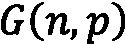
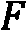
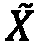
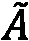

# 第十一章：使用图神经网络生成图

图生成包括寻找创建新图的方法。作为一个研究领域，它为理解图的工作方式和演化过程提供了见解。它在数据增强、异常检测、药物发现等方面有直接应用。我们可以区分两种生成类型：**现实图生成**，它模仿给定的图（例如，在数据增强中），以及**目标导向图生成**，它创建优化特定指标的图（例如，在分子生成中）。

在本章中，我们将探索传统技术，以了解图生成的工作原理。我们将重点介绍两种流行的算法：**埃尔德什–雷尼**模型和**小世界**模型。它们具有有趣的特性，但也存在一些问题，这些问题促使了基于 GNN 的图生成方法的需求。在第二部分中，我们将描述三种解决方案：**变分自编码器**（**VAE**）基础的、自动回归的和**GAN**基础的模型。最后，我们将实现一个基于 GAN 的框架，并结合**强化学习**（**RL**）生成新的化学化合物。我们将使用**DeepChem**库与 TensorFlow，而不是 PyTorch Geometric。

在本章结束时，您将能够使用传统方法和基于 GNN 的技术生成图。您将对这一领域以及您可以用它构建的不同应用有一个良好的概览。您将知道如何实现混合架构，以引导生成有效的分子，且具备您所期望的属性。

在本章中，我们将涵盖以下主要内容：

+   使用传统技术生成图

+   使用图神经网络生成图

+   使用 MolGAN 生成分子

# 技术要求

本章的所有代码示例都可以在 GitHub 上找到，网址是[`github.com/PacktPublishing/Hands-On-Graph-Neural-Networks-Using-Python/tree/main/Chapter11`](https://github.com/PacktPublishing/Hands-On-Graph-Neural-Networks-Using-Python/tree/main/Chapter11)。

在本书的*前言*中可以找到在本地计算机上运行代码所需的安装步骤。

# 使用传统技术生成图

传统的图生成技术已经研究了数十年。这就是它们被广泛理解并可以在各种应用中作为基准使用的原因。然而，它们在可以生成的图类型上通常有局限性。大多数技术专注于输出特定的拓扑结构，这也是它们无法简单模仿给定网络的原因。

在本节中，我们将介绍两种经典技术：埃尔德什–雷尼模型和小世界模型。

## 埃尔德什–雷尼模型

Erdős–Rényi 模型是最简单且最流行的随机图模型。它由匈牙利数学家保罗·厄尔多斯和阿尔弗雷德·雷尼于 1959 年提出[1]，并由埃德加·吉尔伯特在同一年独立提出[2]。该模型有两种变体：和。

模型很简单：给定个节点和连接一对节点的概率，我们尝试随机地将每个节点与其他节点连接，形成最终图。这意味着存在种可能的链接。另一种理解概率的方法是将其视为一个参数，用于改变网络的密度。

`networkx`库对模型有直接的实现：

1.  我们导入`networkx`库：

    ```py
    import networkx as nx
    import matplotlib.pyplot as plt
    ```

1.  我们使用`nx.erdos_renyi_graph()`函数生成一个包含`10`个节点（）和边创建概率为`0.5`（）的`G`图：

    ```py
    G = nx.erdos_renyi_graph(10, 0.5, seed=0)
    ```

1.  我们使用`nx.circular_layout()`函数来定位结果节点。虽然可以使用其他布局方式，但这种布局方式对于比较不同的值非常方便：

    ```py
    pos = nx.circular_layout(G)
    ```

1.  我们使用`nx.draw()`和`pos`布局绘制`G`图。全局启发式方法通常更为准确，但需要知道整个图的结构。然而，这并不是唯一的方法来使用这些知识预测链接：

    ```py
    nx.draw(G, pos=pos, with_labels=True)
    ```

这给我们带来了如下图：


图 11.1 – 一个具有 10 个节点和 p=0.5 的 Erdős–Rényi 图

我们可以以**0.1**和**0.9**的概率重复此过程，从而得到以下图示：


图 11.2 – 不同边创建概率的 Erdős–Rényi 图

我们可以看到，当较低时，许多节点是孤立的，而当较高时，图的互联性较强。

在模型中，我们从所有具有个节点和个链接的图中随机选择一个。例如，如果和，则有三个可能的图（见*图 11.3*）。模型将随机选择其中一个。这是解决相同问题的另一种方法，但由于它更难以分析，因此不如模型流行：


图 11.3 – 一组包含三个节点和两个链接的图

我们也可以使用 `nx.gnm_random_graph()` 函数在 Python 中实现  模型：

```py
G = nx.gnm_random_graph(3, 2, seed=0)
pos = nx.circular_layout(G)
nx.draw(G, pos=pos, with_labels=True)
```


图 11.4 – 从具有三个节点和两个链接的图集中随机采样的图

 模型提出的最强大且最有趣的假设是，链接是独立的（意味着它们不会相互干扰）。不幸的是，这对于大多数现实世界的图来说并不成立，在这些图中，我们观察到与此规则相矛盾的簇和社区。

## 小世界模型

小世界模型由 Duncan Watts 和 Steven Strogatz 在 1998 年提出 [3]，该模型试图模拟生物、技术和社交网络的行为。其主要概念是，现实世界的网络并非完全随机（如 Erdős–Rényi 模型），也不是完全规则的（如网格）。这种拓扑结构介于两者之间，因此我们可以使用系数进行插值。小世界模型产生的图既具有：

+   **短路径**：网络中任意两个节点之间的平均距离相对较小，这使得信息能够快速传播到整个网络

+   **高聚类系数**：网络中的节点往往彼此紧密连接，形成密集的节点簇

许多算法展示了小世界特性。接下来，我们将描述原始的**Watts–Strogatz**模型，该模型在 [3] 中提出。它可以通过以下步骤实现：

1.  我们初始化一个具有  节点的图。

1.  每个节点都连接到它的  最近邻（或者如果  是奇数，则连接到  邻居）。

1.  每个节点之间的链接  和  都有一个重连的概率 ，重连到  和 ，其中  是另一个随机节点。

在 Python 中，我们可以通过调用 `nx.watts_strogatz_graph()` 函数来实现它：

```py
G = nx.watts_strogatz_graph(10, 4, 0.5, seed=0)
pos = nx.circular_layout(G)
nx.draw(G, pos=pos)
```

这产生了如下的图：


图 11.5 – 使用 Watts–Strogatz 模型获得的小世界网络

与 Erdős–Rényi 模型一样，我们可以用不同的重连概率  重复相同的过程，以获得 *图 11.6*：


图 11.6 – 不同重连概率的小世界模型

我们可以看到，当时，图形是完全规则的。而在另一端，当时，图形是完全随机的，因为每个连接都被重新连接。我们通过这些极端之间的平衡，得到一个包含枢纽和局部聚类的图形。

然而，Watts–Strogatz 模型并没有生成现实的度分布。它还要求一个固定数量的节点，这意味着它无法用于网络的增长。一般而言，经典方法无法捕捉到真实世界图形的多样性和复杂性。这促使了新一类技术的诞生，通常被称为深度图生成。

# 使用图神经网络生成图形

深度图生成模型是基于 GNN 的架构，比传统技术更具表现力。然而，这也有代价：它们通常过于复杂，无法像经典方法那样被分析和理解。我们列出了三种主要的深度图生成架构：VAE、GAN 和自回归模型。虽然还有其他技术，如规范化流或扩散模型，但它们比这三种技术更不流行且不成熟。

本节将描述如何使用 VAE、GAN 和自回归模型生成图形。

## 图形变分自编码器

如上一章所见，VAE 可以用来逼近邻接矩阵。我们看到的**图形变分自编码器**（**GVAE**）模型有两个组成部分：编码器和解码器。编码器使用两个共享第一层的 GCN 来学习每个潜在正态分布的均值和方差。解码器然后从学习到的分布中采样，执行潜在变量的内积！[](img/Formula_B19153_11_036.png)。最终，我们得到逼近的邻接矩阵！[](img/Formula_B19153_11_037.png)。

在上一章中，我们使用来预测连接。然而，这并不是它唯一的应用：它直接给出了一个模拟训练期间见过的图形的网络邻接矩阵。我们可以使用这个输出生成新的图形，而不是预测连接。以下是 VGAE 模型生成的邻接矩阵示例，来自*第十章*：

```py
z = model.encode(test_data.x, test_data.edge_index)
adj = torch.where((z @ z.T) > 0.9, 1, 0)
adj
tensor([[1, 0, 0,  ..., 0, 1, 1],
        [0, 1, 1,  ..., 0, 0, 0],
        [0, 1, 1,  ..., 0, 1, 1],
        ...,
        [0, 0, 0,  ..., 1, 0, 0],
        [1, 0, 1,  ..., 0, 1, 1],
        [1, 0, 1,  ..., 0, 1, 1]])
```

自 2016 年以来，这项技术已扩展到 GVAE 模型之外，还可以输出节点和边的特征。一个很好的例子是最受欢迎的基于 VAE 的图生成模型之一：**GraphVAE** [4]。它由 Simonovsky 和 Komodakis 于 2018 年提出，旨在生成现实的分子。这需要能够区分节点（原子）和边（化学键）。

GraphVAE 考虑图形 ，其中  是邻接矩阵， 是边属性张量， 是节点属性矩阵。它学习一个具有预定义节点数的图形的概率版本 。在这个概率版本中， 包含节点（）和边（）的概率， 表示边的类别概率， 包含节点的类别概率。与 GVAE 相比，GraphVAE 的编码器是一个前馈网络，具有**边条件图卷积**（**ECC**），其解码器是一个具有三输出的**多层感知机**（**MLP**）。整个架构总结如下图：


图 11.7 – GraphVAE 的推理过程

还有许多其他基于 VAE 的图生成架构。然而，它们的作用不限于模仿图形：它们还可以嵌入约束，以引导它们生成的图形类型。

添加这些约束的一种流行方法是在解码阶段检查它们，例如**受限图变分自编码器**（**CGVAE**）[5]。在该架构中，编码器是**门控图卷积网络**（**GGCN**），解码器是自回归模型。自回归解码器特别适用于这一任务，因为它们可以在过程的每个步骤中验证每个约束。最后，另一种添加约束的技术是使用基于拉格朗日的正则化器，这些正则化器计算速度更快，但在生成方面的严格性较差[6]。

## 自回归模型

自回归模型也可以单独使用。与其他模型的区别在于，过去的输出成为当前输入的一部分。在这一框架下，图生成变成了一个序列决策过程，同时考虑数据和过去的决策。例如，在每个步骤中，自回归模型可以创建一个新的节点或一个新的连接。然后，将生成的图输入到模型中进行下一步生成，直到我们停止它。下图展示了这个过程：


图 11.8 – 图生成的自回归过程

实际上，我们使用 **递归神经网络**（**RNN**）来实现这种自回归能力。在这个架构中，先前的输出被用作输入，以计算当前的隐藏状态。此外，RNN 可以处理任意长度的输入，这对于迭代生成图非常重要。然而，这种计算比前馈网络要慢，因为必须处理整个序列才能获得最终输出。最流行的两种 RNN 类型是 **门控递归单元**（**GRU**）和 **长短期记忆**（**LSTM**）网络。

**GraphRNN** 由 You 等人于 2018 年提出，[7] 是这些技术在深度图生成中的直接实现。该架构使用了两个 RNN：

+   一个 *图级 RNN* 用于生成一系列节点（包括初始状态）。

+   一个 *边级 RNN* 用于预测每个新添加节点的连接。

边级 RNN 将图级 RNN 的隐藏状态作为输入，然后通过自己的输出继续输入。这一机制在推理时的示意图如下：


图 11.9 – GraphRNN 在推理时的架构

这两个 RNN 实际上在完成一个邻接矩阵：每个由图级 RNN 创建的新节点都会添加一行和一列，并且这些行列由边级 RNN 填充为零和一。总的来说，GraphRNN 执行以下步骤：

1.  *添加新节点*：图级 RNN 初始化图形，并将其输出传递给边级 RNN。

1.  *添加新连接*：边级 RNN 预测新节点是否与每个先前的节点相连接。

1.  *停止图生成*：前两个步骤会重复进行，直到边级 RNN 输出 EOS 令牌，标志着过程的结束。

GraphRNN 可以学习不同类型的图（如网格、社交网络、蛋白质等），并且在性能上完全超越传统技术。它是模仿给定图的首选架构，应优先于 GraphVAE。

## 生成对抗网络

与 VAE 类似，GAN 是 **机器学习（ML）** 中一种著名的生成模型。在这个框架中，两个人工神经网络在零和博弈中相互竞争，目标各不相同。第一个神经网络是生成器，用于生成新数据，第二个神经网络是判别器，用于将每个样本分类为真实的（来自训练集）或伪造的（由生成器生成）。

多年来，针对原始架构提出了两项主要改进。第一项被称为 **Wasserstein GAN**（**WGAN**）。它通过最小化两个概率分布之间的 Wasserstein 距离（或地球搬运者距离）来提高学习稳定性。该变种通过引入梯度惩罚，代替了原来的梯度裁剪方案，从而进一步得到改进。

多项研究将这个框架应用于深度图生成。像之前的技术一样，GANs 可以模仿图形或生成优化某些约束的网络。后者选项在诸如发现具有特定属性的新化学化合物等应用中非常有用。这个问题异常庞大（超过  种可能的组合）且复杂，原因在于其离散性质。

**分子 GAN**（**MolGAN**）由 De Cao 和 Kipf 在 2018 年提出[8]，是解决这一问题的一个流行方法。它结合了 WGAN 和带有梯度惩罚的网络，直接处理图结构数据，并且通过 RL 目标生成具有所需化学属性的分子。这个 RL 目标基于**深度确定性策略梯度**（**DDPG**）算法，一种使用确定性策略梯度的离策略演员-评论员模型。MolGAN 的架构总结如下图：


图 11.10 – MolGAN 推理时的架构

这个框架分为三个主要组件：

+   **生成器**是一个多层感知器（MLP），它输出一个节点矩阵 ，包含原子类型和一个邻接矩阵 ，该矩阵实际上是一个张量，包含了边和键类型。生成器通过 WGAN 和 RL 损失的线性组合进行训练。我们通过类别采样将这些密集表示转换为稀疏对象（ 和 ）。

+   **判别器**接收来自生成器和数据集的图，并学习区分它们。它仅通过 WGAN 损失进行训练。

+   **奖励网络**为每个图打分。它通过基于外部系统（在此为 RDKit）提供的真实评分，使用均方误差（MSE）损失进行训练。

判别器和奖励网络使用 GNN 模式：关系图卷积网络（Relational-GCN），一种支持多种边类型的 GCN 变种。经过几层图卷积后，节点嵌入被聚合成一个图级别的向量输出：


这里，表示逻辑 sigmoid 函数， 和  是两个具有线性输出的 MLP，是逐元素乘法。第三个 MLP 进一步处理这个图嵌入，生成一个介于 0 和 1 之间的值用于奖励网络，和一个介于  和  之间的值用于判别器。

MolGAN 生成有效的化学化合物，优化药物相似性、可合成性和溶解性等属性。我们将在下一节中实现这个架构，以生成新分子。

# 使用 MolGAN 生成分子

深度图生成在 PyTorch Geometric 中没有得到充分覆盖。药物发现是该子领域的主要应用，这也是为什么生成模型通常会出现在专门的库中。更具体地说，有两个流行的 Python 库用于基于机器学习的药物发现：`DeepChem`和`torchdrug`。在这一节中，我们将使用 DeepChem，因为它更为成熟并且直接实现了 MolGAN。

让我们看看如何使用`DeepChem`和`tensorflow`。以下过程基于 DeepChem 的示例：

1.  我们安装`DeepChem`（[`deepchem.io`](https://deepchem.io)），它需要以下库：`tensorflow`、`joblib`、`NumPy`、`pandas`、`scikit-learn`、`SciPy`和`rdkit`：

    ```py
    !pip install deepchem==2.7.1
    ```

1.  然后，我们导入所需的包：

    ```py
    import numpy as np
    import tensorflow as tf
    import pandas as pd
    from tensorflow import one_hot
    import deepchem as dc
    from deepchem.models.optimizers import ExponentialDecay
    from deepchem.models import BasicMolGANModel as MolGAN
    from deepchem.feat.molecule_featurizers.molgan_featurizer import GraphMatrix
    from rdkit import Chem
    from rdkit.Chem import Draw
    from rdkit.Chem import rdmolfiles
    from rdkit.Chem import rdmolops
    from rdkit.Chem.Draw import IpythonConsole
    ```

1.  我们下载`tox21`（*21 世纪毒理学*）数据集，该数据集包含超过 6000 种化学化合物，用于分析它们的毒性。在这个示例中，我们只需要它们的**简化分子输入线条表示系统**（**SMILES**）表示：

    ```py
    _, datasets, _ = dc.molnet.load_tox21()
    df = pd.DataFrame(datasets[0].ids, columns=['smiles'])
    ```

1.  这里是这些`smiles`字符串的输出：

    ```py
    0  CC(O)(P(=O)(O)O)P(=O)(O)O
    1  CC(C)(C)OOC(C)(C)CCC(C)(C)OOC(C)(C)C
    2  OCC@HC@@HC@HCO
    3  CCCCCCCC(=O)[O-].CCCCCCCC(=O)[O-].[Zn+2]
    ... ...
    6260 Cc1cc(CCCOc2c(C)cc(-c3noc(C(F)(F)F)n3)cc2C)on1
    6261 O=C1OC(OC(=O)c2cccnc2Nc2cccc(C(F)(F)F)c2)c2ccc...
    6262 CC(=O)C1(C)CC2=C(CCCC2(C)C)CC1C
    6263 CC(C)CCCC@@H[C@H]1CC(=O)C2=C3CC[C@H]4C[C@...
    ```

1.  我们只考虑最多含有 15 个原子的分子。我们过滤数据集并创建一个`featurizer`，将`smiles`字符串转换为输入特征：

    ```py
    max_atom = 15
    molecules = [x for x in df['smiles'].values if Chem.MolFromSmiles(x).GetNumAtoms() < max_atom]
    featurizer = dc.feat.MolGanFeaturizer(max_atom_count=max_atom)
    ```

1.  我们手动遍历数据集以转换`smiles`字符串：

    ```py
    features = []
    for x in molecules:
        mol = Chem.MolFromSmiles(x)
        new_order = rdmolfiles.CanonicalRankAtoms(mol)
        mol = rdmolops.RenumberAtoms(mol, new_order)
        feature = featurizer.featurize(mol)
        if feature.size != 0:
            features.append(feature[0])
    ```

1.  我们从数据集中移除无效的分子：

    ```py
    features = [x for x in features if type(x) is GraphMatrix]
    ```

1.  接下来，我们创建`MolGAN`模型。它将以具有指数衰减调度的学习率进行训练：

    ```py
    gan = MolGAN(learning_rate=ExponentialDecay(0.001, 0.9, 5000), vertices=max_atom)
    ```

1.  我们创建数据集并以 DeepChem 的格式提供给`MolGAN`：

    ```py
    dataset = dc.data.NumpyDataset(X=[x.adjacency_matrix for x in features], y=[x.node_features for x in features])
    ```

1.  `MolGAN`使用批量训练，这就是我们需要定义一个可迭代对象的原因，如下所示：

    ```py
    def iterbatches(epochs):
        for i in range(epochs):
            for batch in dataset.iterbatches(batch_size=gan.batch_size, pad_batches=True):
                adjacency_tensor = one_hot(batch[0], gan.edges)
                node_tensor = one_hot(batch[1], gan.nodes)
                yield {gan.data_inputs[0]: adjacency_tensor, gan.data_inputs[1]: node_tensor}
    ```

1.  我们训练模型`25`个周期：

    ```py
    gan.fit_gan(iterbatches(25), generator_steps=0.2)
    ```

1.  我们生成`1000`个分子：

    ```py
    generated_data = gan.predict_gan_generator(1000)
    nmols = feat.defeaturize(generated_data)
    ```

1.  然后，我们检查这些分子是否有效：

    ```py
    valid_mols = [x for x in generated_mols if x is not None]
    print (f'{len(valid_mols)} valid molecules (out of {len((generated_mols))} generated molecules)')
    31 valid molecules (out of 1000 generated molecules)
    ```

1.  我们将它们进行比较，看看有多少个分子是独特的：

    ```py
    generated_smiles = [Chem.MolToSmiles(x) for x in valid_mols]
    generated_smiles_viz = [Chem.MolFromSmiles(x) for x in set(generated_smiles)]
    print(f'{len(generated_smiles_viz)} unique valid molecules ({len(generated_smiles)-len(generated_smiles_viz)} redundant molecules)')
    24 unique valid molecules (7 redundant molecules)
    ```

1.  我们将生成的分子打印在一个网格中：

    ```py
    img = Draw.MolsToGridImage(generated_smiles_viz, molsPerRow=6, subImgSize=(200, 200), returnPNG=False)
    ```


图 11.11 – 使用 MolGAN 生成的分子

尽管 GAN 有了改进，这个训练过程仍然相当不稳定，并且可能无法产生任何有意义的结果。我们展示的代码对超参数的变化非常敏感，并且不能很好地泛化到其他数据集，包括原论文中使用的`QM9`数据集。

尽管如此，MolGAN 将强化学习（RL）和生成对抗网络（GAN）的概念结合的方式，不仅限于药物发现，还可以应用于优化任何类型的图结构，如计算机网络、推荐系统等。

# 总结

在本章中，我们探讨了生成图结构的不同技术。首先，我们探索了基于概率的传统方法，这些方法具有有趣的数学特性。然而，由于它们表达能力的不足，我们转向了基于图神经网络（GNN）的技术，这些技术更为灵活。我们涵盖了三种类型的深度生成模型：基于变分自编码器（VAE）、自回归和基于 GAN 的方法。我们从每种方法中引入了一个模型，以了解它们在实际中的工作原理。

最后，我们实现了一个基于 GAN 的模型，结合了生成器、判别器和来自强化学习的奖励网络。这个架构不仅仅是模仿训练过程中看到的图形，它还能够优化如溶解度等期望的属性。我们使用 DeepChem 和 TensorFlow 创建了 24 个独特且有效的分子。如今，这种流程在药物发现行业中已经非常普遍，机器学习能够显著加快药物开发进程。

在 *第十二章*，*处理异构图* 中，我们将探讨一种新型图，它之前曾出现在推荐系统和分子中。这些异构图包含多种类型的节点和/或链接，需要特定的处理方式。它们比我们之前讨论的常规图更具通用性，特别在知识图谱等应用中非常有用。

# 进一步阅读

+   [1] P. Erdös 和 A. Rényi. *论随机图 I*，Publicationes Mathematicae Debrecen，第 6 卷，第 290 页，1959。可在 [`snap.stanford.edu/class/cs224w-readings/erdos59random.pdf`](https://snap.stanford.edu/class/cs224w-readings/erdos59random.pdf) 获取。

+   [2] E. N. Gilbert, *随机图*，The Annals of Mathematical Statistics，第 30 卷，第 4 期，第 1141–1144 页，1959，DOI: 10.1214/aoms/1177706098。可在 [`projecteuclid.org/journals/annals-of-mathematical-statistics/volume-30/issue-4/Random-Graphs/10.1214/aoms/1177706098.full`](https://projecteuclid.org/journals/annals-of-mathematical-statistics/volume-30/issue-4/Random-Graphs/10.1214/aoms/1177706098.full) 获取。

+   [3] Duncan J. Watts 和 Steven H. Strogatz. *小世界网络的集体动力学*，Nature，393，第 440–442 页，1998。可在 [`snap.stanford.edu/class/cs224w-readings/watts98smallworld.pdf`](http://snap.stanford.edu/class/cs224w-readings/watts98smallworld.pdf) 获取。

+   [4] M. Simonovsky 和 N. Komodakis. *GraphVAE: 利用变分自编码器生成小型图*，CoRR，第 abs/1802.03480 卷，2018，[在线]. 可在 [`arxiv.org/abs/1802.03480`](http://arxiv.org/abs/1802.03480) 获取。

+   [5] Q. Liu, M. Allamanis, M. Brockschmidt 和 A. L. Gaunt. *用于分子设计的约束图变分自编码器*，arXiv，2018。DOI: 10.48550/ARXIV.1805.09076。可在 [`arxiv.org/abs/1805.09076`](https://arxiv.org/abs/1805.09076) 获取。

+   [6] T. Ma, J. Chen 和 C. Xiao, 通过正则化变分自编码器约束生成语义有效的图。arXiv，2018。DOI: 10.48550/ARXIV.1809.02630。可在 [`arxiv.org/abs/1809.02630`](https://arxiv.org/abs/1809.02630) 获取。

+   [7] J. You, R. Ying, X. Ren, W. L. Hamilton 和 J. Leskovec. *GraphRNN: 使用深度自回归模型生成真实图形*，arXiv，2018。DOI: 10.48550/ARXIV.1802.08773。可在 [`arxiv.org/abs/1802.08773`](https://arxiv.org/abs/1802.08773) 获取。

+   [8] N. De Cao 和 T. Kipf. *MolGAN：一种用于小分子图的隐式生成模型*。arXiv，2018 年。DOI：10.48550/ARXIV.1805.11973。可通过[`arxiv.org/abs/1805.11973`](https://arxiv.org/abs/1805.11973)获取。
