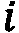
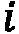
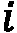

# 第十二章：从异质图中学习

在上一章中，我们尝试生成包含不同类型节点（原子）和边（键）的真实分子。我们在其他应用中也观察到了这种行为，比如推荐系统（用户和物品）、社交网络（关注者和被关注者）、或者网络安全（路由器和服务器）。我们称这些图为**异质图**，与只涉及一种类型的节点和一种类型的边的同质图相对。

在本章中，我们将回顾关于同质 GNN 的所有知识。我们将引入消息传递神经网络框架，以概括迄今为止我们所看到的架构。这个总结将帮助我们理解如何扩展我们的框架到异质网络。我们将从创建我们自己的异质数据集开始。然后，我们将同质架构转化为异质架构。

在最后一节中，我们将采取不同的方法，讨论一种专门为处理异质网络设计的架构。我们将描述它的工作原理，以更好地理解这种架构与经典 GAT 之间的差异。最后，我们将在 PyTorch Geometric 中实现它，并将我们的结果与前面的方法进行比较。

在本章结束时，您将深入理解同质图与异质图之间的差异。您将能够创建自己的异质数据集，并将传统模型转换为适用于此情境的模型。您还将能够实现专门为最大化异质网络优势而设计的架构。

在本章中，我们将讨论以下主要内容：

+   消息传递神经网络框架

+   引入异质图

+   将同质 GNN 转换为异质 GNN

+   实现分层自注意力网络

# 技术要求

本章中的所有代码示例可以在 GitHub 上找到，网址是 [`github.com/PacktPublishing/Hands-On-Graph-Neural-Networks-Using-Python/tree/main/Chapter12`](https://github.com/PacktPublishing/Hands-On-Graph-Neural-Networks-Using-Python/tree/main/Chapter12)。

在本书的*前言*中，您可以找到在本地机器上运行代码所需的安装步骤。

# 消息传递神经网络框架

在探索异质图之前，让我们回顾一下我们对同质 GNN 的了解。在前几章中，我们看到了一些用于聚合和组合来自不同节点的特征的不同函数。如在 *第五章*中所示，最简单的 GNN 层由对邻近节点（包括目标节点本身）特征的线性组合求和，并使用权重矩阵。前述求和的输出会替代之前的目标节点嵌入。

节点级别的操作符可以写作如下：


 是  节点的邻居节点集合（包括自身）， 是  节点的嵌入， 是一个权重矩阵：

GCN 和 GAT 层为节点特征添加了固定和动态权重，但保持了相同的思想。即便是 GraphSAGE 的 LSTM 操作符或 GIN 的最大聚合器，也没有改变 GNN 层的主要概念。如果我们查看这些变种，可以将 GNN 层概括为一个通用框架，称为 **消息传递神经网络**（**MPNN** 或 **MP-GNN**）。这个框架由 Gilmer 等人于 2017 年提出[1]，它包含三个主要操作：

+   **Message**：每个节点使用一个函数为每个邻居创建一个消息。这个消息可以简单地由它自己的特征组成（如前面的例子），也可以考虑邻居节点的特征和边的特征。

+   **Aggregate**：每个节点使用一个置换等变函数（如前面的例子中的求和）来聚合来自邻居的消息。

+   **Update**：每个节点使用一个函数更新其特征，将其当前特征与聚合的消息结合。在前面的例子中，我们引入了自环来聚合  节点的当前特征，就像一个邻居一样。

这些步骤可以总结为一个公式：


这里， 是  节点的嵌入， 是  链接的边嵌入， 是消息函数， 是聚合函数， 是更新函数。你可以在下图中找到这个框架的示意图：


图 12.1 – MPNN 框架

PyTorch Geometric 直接通过 `MessagePassing` 类实现了这个框架。例如，以下是如何使用这个类实现 GCN 层：

1.  首先，我们导入所需的库：

    ```py
    import torch
    from torch.nn import Linear
    from torch_geometric.nn import MessagePassing
    from torch_geometric.utils import add_self_loops, degree
    ```

1.  我们声明继承自 `MessagePassing` 的 GCN 类：

    ```py
    class GCNConv(MessagePassing):
    ```

1.  这需要两个参数 – 输入的维度和输出（隐藏）维度。`MessagePassing` 被初始化为“加法”聚合。我们定义了一个没有偏置的单个 PyTorch 线性层：

    ```py
        def __init__(self, dim_in, dim_h):
            super().__init__(aggr='add')
            self.linear = Linear(dim_in, dim_h, bias=False)
    ```

1.  `forward()` 函数包含了逻辑。首先，我们向邻接矩阵中添加自环以考虑目标节点：

    ```py
        def forward(self, x, edge_index):
            edge_index, _ = add_self_loops(edge_index, num_nodes=x.size(0))
    ```

1.  然后，我们使用之前定义的线性层进行线性变换：

    ```py
            x = self.linear(x)
    ```

1.  我们计算归一化因子 – ：

    ```py
            row, col = edge_index
            deg = degree(col, x.size(0), dtype=x.dtype)
            deg_inv_sqrt = deg.pow(-0.5)
            deg_inv_sqrt[deg_inv_sqrt == float('inf')] = 0
            norm = deg_inv_sqrt[row] * deg_inv_sqrt[col]
    ```

1.  我们调用`propagate()`方法，传入更新后的`edge_index`（包括自环）和存储在`norm`张量中的归一化因子。内部，该方法会调用`message()`、`aggregate()`和`update()`。我们不需要重新定义`update()`，因为我们已经包括了自环。`aggregate()`函数已在*步骤 3*中通过`aggr='add'`进行指定：

    ```py
            out = self.propagate(edge_index, x=x, norm=norm)
            return out
    ```

1.  我们重新定义了`message()`函数，以便使用`norm`对邻接节点特征`x`进行归一化：

    ```py
        def message(self, x, norm):
            return norm.view(-1, 1) * x
    ```

1.  现在我们可以初始化并使用这个对象作为 GCN 层：

    ```py
    conv = GCNConv(16, 32)
    ```

这个示例展示了如何在 PyTorch Geometric 中创建自己的 GNN 层。你还可以查看 GCN 或 GAT 层在源代码中的实现方式。

MPNN 框架是一个重要的概念，它将帮助我们将 GNN 转化为异构模型。

# 引入异构图

异构图是一个强大的工具，可以表示不同实体之间的一般关系。拥有不同类型的节点和边创建了更复杂的图结构，但同时也更难以学习。特别是，异构网络的一个主要问题是，来自不同类型的节点或边的特征未必具有相同的含义或维度。因此，合并不同特征会破坏大量信息。而在同质图中，每个维度对每个节点或边都有相同的含义。

异构图是一种更通用的网络，可以表示不同类型的节点和边。形式上，它被定义为一个图，，包含，一组节点，和，一组边。在异构设置中，它与一个节点类型映射函数相关联（其中表示节点类型的集合），以及一个链接类型映射函数（其中表示边类型的集合）。

以下图为异构图的示例。


图 12.2 – 一个包含三种节点类型和三种边类型的异构图示例

在这个图中，我们看到三种类型的节点（用户、游戏和开发者）和三种类型的边（**关注**、**玩**和**开发**）。它表示一个涉及人（用户和开发者）和游戏的网络，可以用于各种应用，例如游戏推荐。如果这个图包含数百万个元素，它可以用作图结构化的知识数据库，或者知识图谱。知识图谱被 Google 或 Bing 用于回答类似“谁玩**Dev 1**开发的游戏？”这样的问题。

类似的查询可以提取有用的同质图。例如，我们可能只想考虑玩**Game 1**的用户。输出将是**User 1**和**User 2**。我们还可以创建更复杂的查询，例如，“谁是玩由**Dev 1**开发的游戏的用户？”结果是一样的，但我们通过两种关系来获取我们的用户。这种查询被称为元路径（meta-path）。

在第一个例子中，我们的元路径是*User → Game → User*（通常表示为**UGU**），在第二个例子中，我们的元路径是*User → Game → Dev → Game → User*（或**UGDGU**）。请注意，起始节点类型和终止节点类型是相同的。元路径是异质图中的一个重要概念，常用于度量不同节点之间的相似性。

现在，让我们看看如何使用 PyTorch Geometric 实现前面的图。我们将使用一个叫做`HeteroData`的特殊数据对象。以下步骤创建一个数据对象，用于存储*图 12.2*中的图：

1.  我们从`torch_geometric.data`导入`HeteroData`类，并创建一个`data`变量：

    ```py
    from torch_geometric.data import HeteroData
    data = HeteroData()
    ```

1.  首先，我们来存储节点特征。我们可以访问用户特征，例如`data['user'].x`。我们将其传入一个具有`[num_users, num_features_users]`维度的张量。内容在这个例子中不重要，因此我们为`user 1`创建填充了 1 的特征向量，为`user 2`创建填充了 2 的特征向量，为`user 3`创建填充了 3 的特征向量：

    ```py
    data['user'].x = torch.Tensor([[1, 1, 1, 1], [2, 2, 2, 2], [3, 3, 3, 3]])
    ```

1.  我们使用`games`和`devs`重复这个过程。请注意，特征向量的维度不相同；这是异质图在处理不同表示时的一个重要优势：

    ```py
    data['game'].x = torch.Tensor([[1, 1], [2, 2]])
    data['dev'].x = torch.Tensor([[1], [2]])
    ```

1.  让我们在节点之间创建连接。连接具有不同的含义，因此我们将创建三组边的索引。我们可以通过一个三元组声明每一组！[](img/Formula_B19153_12_024.png)，例如`data['user', 'follows', 'user'].edge_index`。然后，我们将连接存储在一个具有`[2, number of edges]`维度的张量中：

    ```py
    data['user', 'follows', 'user'].edge_index = torch.Tensor([[0, 1], [1, 2]]) # [2, num_edges_follows]
    data['user', 'plays', 'game'].edge_index = torch.Tensor([[0, 1, 1, 2], [0, 0, 1, 1]])
    data['dev', 'develops', 'game'].edge_index = torch.Tensor([[0, 1], [0, 1]])
    ```

1.  边也可以具有特征——例如，`plays`边可以包括用户玩对应游戏的时长。下面假设`user 1`玩了`game 1` 2 小时，`user 2`玩了`game 1` 30 分钟，`game 2`玩了 10 小时，`user 3`玩了`game 2` 12 小时：

    ```py
    data['user', 'plays', 'game'].edge_attr = torch.Tensor([[2], [0.5], [10], [12]])
    ```

1.  最后，我们可以打印`data`对象以查看结果：

    ```py
    HeteroData(
      user={ x=[3, 4] },
      game={ x=[2, 2] },
      dev={ x=[2, 1] },
      (user, follows, user)={ edge_index=[2, 2] },
      (user, plays, game)={
        edge_index=[2, 4],
        edge_attr=[4, 1]
      },
      (dev, develops, game)={ edge_index=[2, 2] }
    )
    ```

如你所见，在这个实现中，不同类型的节点和边并不共享相同的张量。实际上，这是不可能的，因为它们的维度也不同。这引出了一个新问题——我们如何使用 GNN 从多个张量中聚合信息？

到目前为止，我们只关注单一类型。实际上，我们的权重矩阵已经具有适当的大小，可以与预定义维度相乘。但是，当我们得到不同维度的输入时，如何实现 GNN？

# 将同质 GNN 转化为异质 GNN

为了更好地理解问题，让我们以真实数据集为例。DBLP 计算机科学文献提供了一个数据集，`[2-3]`，包含四种类型的节点 – `论文`（14,328），`术语`（7,723），`作者`（4,057），和`会议`（20）。该数据集的目标是将作者正确分类为四个类别 – 数据库、数据挖掘、人工智能和信息检索。作者的节点特征是一组词袋（“`0`”或“`1`”），包含他们在出版物中可能使用的 334 个关键字。以下图表总结了不同节点类型之间的关系。


图 12.3 – DBLP 数据集中节点类型之间的关系

这些节点类型的维度和语义关系并不相同。在异构图中，节点之间的关系至关重要，这就是为什么我们要考虑节点对。例如，我们不再将作者节点直接馈送到 GNN 层，而是考虑一对，如(`作者`, `论文`)。这意味着现在我们需要根据每一种关系创建一个 GNN 层；在这种情况下，“to”关系是双向的，所以我们会得到六层。

这些新层具有独立的权重矩阵，适合每种节点类型的大小。不幸的是，我们只解决了问题的一半。实际上，现在我们有六个不同的层，它们不共享任何信息。我们可以通过引入**跳跃连接**、**共享层**、**跳跃知识**等方法来解决这个问题 [4]。

在将同质模型转换为异构模型之前，让我们在 DBLP 数据集上实现一个经典的 GAT。GAT 不能考虑不同的关系；我们必须为它提供一个连接作者的唯一邻接矩阵。幸运的是，我们现在有一种技术可以轻松生成这个邻接矩阵 – 我们可以创建一个元路径，如`作者-论文-作者`，它将连接同一篇论文中的作者。

注意

通过随机游走，我们还可以构建一个良好的邻接矩阵。即使图形是异构的，我们也可以探索并连接在相同序列中经常出现的节点。

代码有点冗长，但我们可以按以下方式实现常规的 GAT：

1.  我们导入所需的库：

    ```py
    from torch import nn
    import torch.nn.functional as F
    import torch_geometric.transforms as T
    from torch_geometric.datasets import DBLP
    from torch_geometric.nn import GAT
    ```

1.  我们使用特定语法定义我们将使用的元路径：

    ```py
    metapaths = [[('author', 'paper'), ('paper', 'author')]]
    ```

1.  我们使用`AddMetaPaths`转换函数自动计算我们的元路径。我们使用`drop_orig_edge_types=True`从数据集中删除其他关系（GAT 只能考虑一个）：

    ```py
    transform = T.AddMetaPaths(metapaths=metapaths, drop_orig_edge_types=True)
    ```

1.  我们加载`DBLP`数据集并打印它：

    ```py
    dataset = DBLP('.', transform=transform)
    data = dataset[0]
    print(data)
    ```

1.  我们获得了以下输出。请注意我们的转换函数创建的`(作者, metapath_0, 作者)`关系：

    ```py
    HeteroData(
      metapath_dict={ (author, metapath_0, author)=[2] },
      author={
        x=[4057, 334],
        y=[4057],
        train_mask=[4057],
        val_mask=[4057],
        test_mask=[4057]
      },
      paper={ x=[14328, 4231] },
      term={ x=[7723, 50] },
      conference={ num_nodes=20 },
      (author, metapath_0, author)={ edge_index=[2, 11113] }
    )
    ```

1.  我们直接创建一个带有`in_channels=-1`的单层 GAT 模型来进行惰性初始化（模型将自动计算值），并且`out_channels=4`，因为我们需要将作者节点分类为四类：

    ```py
    model = GAT(in_channels=-1, hidden_channels=64, out_channels=4, num_layers=1)
    ```

1.  我们实现了`Adam`优化器，并将模型和数据存储在 GPU 上（如果可能的话）：

    ```py
    optimizer = torch.optim.Adam(model.parameters(), lr=0.001, weight_decay=0.001)
    device = torch.device('cuda' if torch.cuda.is_available() else 'cpu')
    data, model = data.to(device), model.to(device)
    ```

1.  `test()`函数衡量预测的准确性：

    ```py
    @torch.no_grad()
    def test(mask):
        model.eval()
        pred = model(data.x_dict['author'], data.edge_index_dict[('author', 'metapath_0', 'author')]).argmax(dim=-1)
        acc = (pred[mask] == data['author'].y[mask]).sum() / mask.sum()
        return float(acc)
    ```

1.  我们创建了一个经典的训练循环，在这个循环中，节点特征（`author`）和边索引（`author`、`metapath_0`和`author`）经过精心选择：

    ```py
    for epoch in range(101):
        model.train()
        optimizer.zero_grad()
        out = model(data.x_dict['author'], data.edge_index_dict[('author', 'metapath_0', 'author')])
        mask = data['author'].train_mask
        loss = F.cross_entropy(out[mask], data['author'].y[mask])
        loss.backward()
        optimizer.step()
        if epoch % 20 == 0:
            train_acc = test(data['author'].train_mask)
            val_acc = test(data['author'].val_mask)
            print(f'Epoch: {epoch:>3} | Train Loss: {loss:.4f} | Train Acc: {train_acc*100:.2f}% | Val Acc: {val_acc*100:.2f}%')
    ```

1.  我们在测试集上进行测试，输出如下：

    ```py
    test_acc = test(data['author'].test_mask)
    print(f'Test accuracy: {test_acc*100:.2f}%')
    Test accuracy: 73.29%
    ```

我们通过元路径将异构数据集转化为同构数据集，并应用了传统的 GAT。我们得到了 73.29%的测试准确率，这为与其他技术的比较提供了一个良好的基准。

现在，让我们创建一个异构版本的 GAT 模型。按照我们之前描述的方法，我们需要六个 GAT 层，而不是一个。我们不必手动完成这项工作，因为 PyTorch Geometric 可以通过`to_hetero()`或`to_hetero_bases()`函数自动完成。`to_hetero()`函数有三个重要参数：

+   `module`：我们想要转换的同构模型

+   `metadata`：关于图的异构性质的信息，通过元组表示，`(``node_types, edge_types)`

+   `aggr`：用于合并由不同关系生成的节点嵌入的聚合器（例如，`sum`、`max`或`mean`）

下图展示了我们的同构 GAT（左）及其异构版本（右），是通过`to_hetero()`获得的。


图 12.4 – 同构 GAT（左）和异构 GAT（右）在 DBLP 数据集上的架构

如以下步骤所示，异构 GAT 的实现类似：

1.  首先，我们从 PyTorch Geometric 导入 GNN 层：

    ```py
    from torch_geometric.nn import GATConv, Linear, to_hetero
    ```

1.  我们加载了`DBLP`数据集：

    ```py
    dataset = DBLP(root='.')
    data = dataset[0]
    ```

1.  当我们打印出这个数据集的信息时，您可能已经注意到会议节点没有任何特征。这是一个问题，因为我们的架构假设每种节点类型都有自己的特征。我们可以通过生成零值作为特征来解决这个问题，方法如下：

    ```py
    data['conference'].x = torch.zeros(20, 1)
    ```

1.  我们创建了自己的 GAT 类，包含 GAT 和线性层。请注意，我们再次使用懒初始化，采用`(-1, -1)`元组：

    ```py
    class GAT(torch.nn.Module):
        def __init__(self, dim_h, dim_out):
            super().__init__()
            self.conv = GATConv((-1, -1), dim_h, add_self_loops=False)
            self.linear = nn.Linear(dim_h, dim_out)
        def forward(self, x, edge_index):
            h = self.conv(x, edge_index).relu()
            h = self.linear(h)
            return h
    ```

1.  我们`实例化`模型并通过`to_hetero()`进行转换：

    ```py
    model = GAT(dim_h=64, dim_out=4)
    model = to_hetero(model, data.metadata(), aggr='sum')
    ```

1.  我们实现了`Adam`优化器，并将模型和数据存储在 GPU 上（如果可能的话）：

    ```py
    optimizer = torch.optim.Adam(model.parameters(), lr=0.001, weight_decay=0.001)
    device = torch.device('cuda' if torch.cuda.is_available() else 'cpu')
    data, model = data.to(device), model.to(device)
    ```

1.  测试过程非常相似。这次，我们不需要指定任何关系，因为模型会考虑所有关系：

    ```py
    @torch.no_grad()
    def test(mask):
        model.eval()
        pred = model(data.x_dict, data.edge_index_dict)['author'].argmax(dim=-1)
        acc = (pred[mask] == data['author'].y[mask]).sum() / mask.sum()
        return float(acc)
    ```

1.  对训练循环来说也是如此：

    ```py
    for epoch in range(101):
        model.train()
        optimizer.zero_grad()
        out = model(data.x_dict, data.edge_index_dict)['author']
        mask = data['author'].train_mask
        loss = F.cross_entropy(out[mask], data['author'].y[mask])
        loss.backward()
        optimizer.step()
        if epoch % 20 == 0:
            train_acc = test(data['author'].train_mask)
            val_acc = test(data['author'].val_mask)
            print(f'Epoch: {epoch:>3} | Train Loss: {loss:.4f} | Train Acc: {train_acc*100:.2f}% | Val Acc: {val_acc*100:.2f}%')
    ```

1.  我们获得了以下的测试准确率：

    ```py
    test_acc = test(data['author'].test_mask)
    print(f'Test accuracy: {test_acc*100:.2f}%')
    Test accuracy: 78.42%
    ```

异构 GAT 获得了 78.42%的测试准确率。这比同构版本提高了 5.13%，但我们能做得更好吗？在接下来的部分，我们将探讨一种专门设计用于处理异构网络的架构。

# 实现一个层次化自注意力网络

在本节中，我们将实现一个设计用于处理异构图的 GNN 模型——**层次自注意力网络**（**HAN**）。该架构由 Liu 等人于 2021 年提出[5]。HAN 在两个不同的层次上使用自注意力机制：

+   **节点级别注意力**用于理解在给定元路径中邻近节点的重要性（如同质设置下的 GAT）。

+   在某些任务中，`game-user-game` 可能比 `game-dev-game` 更相关，例如预测玩家数量。

在接下来的部分中，我们将详细介绍三个主要组件——节点级别注意力、语义级别注意力和预测模块。该架构如*图 12.5*所示。


图 12.5 – HAN 的架构及其三个主要模块

类似于 GAT，第一步是将节点映射到每个元路径的统一特征空间。接着，我们使用第二个权重矩阵计算在同一元路径中节点对（两个投影节点的连接）的权重。然后对该结果应用非线性函数，并通过 softmax 函数进行归一化。归一化后的注意力分数（重要性）表示为从节点到节点的计算方式如下：


在这里，表示节点的特征，是元路径的共享权重矩阵，是元路径的注意力权重矩阵，是非线性激活函数（如 LeakyReLU），而是节点在元路径中的邻居集合（包括其自身）。

也会执行多头注意力机制以获得最终的嵌入表示：


通过语义级别注意力，我们对每个元路径的注意力分数（记作）执行类似的处理。每个给定元路径中的节点嵌入（记作）输入到 MLP 中，MLP 应用非线性变换。我们将此结果与一个新的注意力向量进行比较，作为相似度度量。然后我们对该结果求平均，以计算给定元路径的重要性：


在这里，（MLP 的权重矩阵）、（MLP 的偏置）和（语义级别的注意力向量）在所有元路径之间共享。

我们必须对这个结果进行归一化，以比较不同的语义级注意力分数。我们使用 softmax 函数来获取我们的最终权重：


结合节点级和语义级注意力的最终嵌入，如下所示：


最后一层，例如 MLP，用于微调模型以完成特定的下游任务，如节点分类或链接预测。

让我们在 PyTorch Geometric 上的 `DBLP` 数据集中实现这个架构：

1.  首先，我们导入 HAN 层：

    ```py
    from torch_geometric.nn import HANConv
    ```

1.  我们加载 `DBLP` 数据集并为会议节点引入虚拟特征：

    ```py
    dataset = DBLP('.')
    data = dataset[0]
    data['conference'].x = torch.zeros(20, 1)
    ```

1.  我们创建了 `HAN` 类，包括两层 - 使用 `HANConv` 的 `HAN` 卷积和用于最终分类的 `linear` 层：

    ```py
    class HAN(nn.Module):
        def __init__(self, dim_in, dim_out, dim_h=128, heads=8):
            super().__init__()
            self.han = HANConv(dim_in, dim_h, heads=heads, dropout=0.6, metadata=data.metadata())
            self.linear = nn.Linear(dim_h, dim_out)
    ```

1.  在 `forward()` 函数中，我们必须指定我们对作者感兴趣：

    ```py
        def forward(self, x_dict, edge_index_dict):
            out = self.han(x_dict, edge_index_dict)
            out = self.linear(out['author'])
            return out
    ```

1.  我们使用懒初始化（`dim_in=-1`）初始化我们的模型，因此 PyTorch Geometric 自动计算每个节点类型的输入尺寸：

    ```py
    model = HAN(dim_in=-1, dim_out=4)
    ```

1.  我们选择了 `Adam` 优化器，并在可能的情况下将数据和模型转移到 GPU：

    ```py
    optimizer = torch.optim.Adam(model.parameters(), lr=0.001, weight_decay=0.001)
    device = torch.device('cuda' if torch.cuda.is_available() else 'cpu')
    data, model = data.to(device), model.to(device)
    ```

1.  `test()` 函数计算分类任务的准确率：

    ```py
    @torch.no_grad()
    def test(mask):
        model.eval()
        pred = model(data.x_dict, data.edge_index_dict).argmax(dim=-1)
        acc = (pred[mask] == data['author'].y[mask]).sum() / mask.sum()
        return float(acc)
    ```

1.  我们将模型训练了 100 个 epochs。与同质 GNN 的训练循环唯一的区别在于，我们需要指定我们对作者节点类型感兴趣：

    ```py
    for epoch in range(101):
        model.train()
        optimizer.zero_grad()
        out = model(data.x_dict, data.edge_index_dict)
        mask = data['author'].train_mask
        loss = F.cross_entropy(out[mask], data['author'].y[mask])
        loss.backward()
        optimizer.step()
        if epoch % 20 == 0:
            train_acc = test(data['author'].train_mask)
            val_acc = test(data['author'].val_mask)
            print(f'Epoch: {epoch:>3} | Train Loss: {loss:.4f} | Train Acc: {train_acc*100:.2f}% | Val Acc: {val_acc*100:.2f}%')
    ```

1.  训练给出了以下输出：

    ```py
    Epoch:   0 | Train Loss: 1.3829 | Train Acc: 49.75% | Val Acc: 37.75%
    Epoch:  20 | Train Loss: 1.1551 | Train Acc: 86.50% | Val Acc: 60.75%
    Epoch:  40 | Train Loss: 0.7695 | Train Acc: 94.00% | Val Acc: 67.50%
    Epoch:  60 | Train Loss: 0.4750 | Train Acc: 97.75% | Val Acc: 73.75%
    Epoch:  80 | Train Loss: 0.3008 | Train Acc: 99.25% | Val Acc: 78.25%
    Epoch: 100 | Train Loss: 0.2247 | Train Acc: 99.50% | Val Acc: 78.75%
    ```

1.  最后，我们在测试集上测试我们的解决方案：

    ```py
    test_acc = test(data['author'].test_mask)
    print(f'Test accuracy: {test_acc*100:.2f}%')
    Test accuracy: 81.58%
    ```

HAN 在测试中获得了 81.58% 的准确率，比我们在异质 GAT（78.42%）和经典 GAT（73.29%）中获得的要高。这显示了构建良好的表示形式以聚合不同类型的节点和关系的重要性。异质图技术高度依赖于应用程序，但尝试不同的选项是值得的，特别是当网络中描述的关系具有意义时。

# 摘要

在本章中，我们介绍了 MPNN 框架，以三个步骤 - 消息、聚合和更新，来推广 GNN 层。在本章的其余部分，我们扩展了这个框架以考虑异质网络，由不同类型的节点和边组成。这种特殊类型的图允许我们表示实体之间的各种关系，这比单一类型的连接更具见解。

此外，我们看到如何通过 PyTorch Geometric 将同质 GNN 转换为异质 GNN。我们描述了在我们的异质 GAT 中使用的不同层，这些层将节点对作为输入来建模它们的关系。最后，我们使用 `HAN` 实现了一种特定于异质的架构，并在 `DBLP` 数据集上比较了三种技术的结果。这证明了利用这种网络中所表示的异质信息的重要性。

在 *第十三章* *时间图神经网络* 中，我们将看到如何在图神经网络中考虑时间。这个章节将开启很多新的应用，得益于时间图，比如交通预测。它还将介绍 PyG 的扩展库——PyTorch Geometric Temporal，帮助我们实现专门设计用于处理时间的新模型。

# 进一步阅读

+   [1] J. Gilmer, S. S. Schoenholz, P. F. Riley, O. Vinyals, 和 G. E. Dahl. *量子化学的神经消息传递*. arXiv, 2017\. DOI: 10.48550/ARXIV.1704.01212\. 可用： [`arxiv.org/abs/1704.01212`](https://arxiv.org/abs/1704.01212).

+   [2] Jie Tang, Jing Zhang, Limin Yao, Juanzi Li, Li Zhang, 和 Zhong Su. *ArnetMiner：学术社交网络的提取与挖掘*. 载于第十四届 ACM SIGKDD 国际知识发现与数据挖掘大会论文集(SIGKDD'2008). pp.990–998\. 可用： [`dl.acm.org/doi/abs/10.1145/1401890.1402008`](https://dl.acm.org/doi/abs/10.1145/1401890.1402008).

+   [3] X. Fu, J. Zhang, Z. Meng, 和 I. King. *MAGNN：用于异构图嵌入的元路径聚合图神经网络*. 2020 年 4 月\. DOI: 10.1145/3366423.3380297\. 可用： [`arxiv.org/abs/2002.01680`](https://arxiv.org/abs/2002.01680).

+   [4] M. Schlichtkrull, T. N. Kipf, P. Bloem, R. van den Berg, I. Titov, 和 M. Welling. *用图卷积网络建模关系数据*. arXiv, 2017\. DOI: 10.48550/ARXIV.1703.06103\. 可用： [`arxiv.org/abs/1703.06103`](https://arxiv.org/abs/1703.06103).

+   [5] J. Liu, Y. Wang, S. Xiang, 和 C. Pan. *HAN：一种高效的层次化自注意力网络，用于基于骨架的手势识别*. arXiv, 2021\. DOI: 10.48550/ARXIV.2106.13391\. 可用： [`arxiv.org/abs/2106.13391`](https://arxiv.org/abs/2106.13391).
