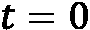

# 第十三章：时序图神经网络

在前面的章节中，我们仅考虑了边和特征不发生变化的图。然而，在现实世界中，有许多应用场景并非如此。例如，在社交网络中，人们会关注和取消关注其他用户，帖子会变得病毒式传播，个人资料随着时间变化。这种动态性无法通过我们之前描述的 GNN 架构来表示。相反，我们必须嵌入一个新的时间维度，将静态图转换为动态图。这些动态网络将作为新一类 GNN 的输入：**时序图神经网络**（**T-GNNs**），也称为**时空 GNNs**。

在本章中，我们将描述两种包含时空信息的**动态图**。我们将列出不同的应用，并重点介绍时间序列预测，在该领域中，时序 GNNs 得到了广泛应用。第二节将专注于我们之前研究的一个应用：网页流量预测。这次，我们将利用时间信息来提高结果并获得可靠的预测。最后，我们将描述另一种为动态图设计的时序 GNN 架构，并将其应用于疫情预测，预测英国不同地区的 COVID-19 病例数。

到本章结束时，您将了解两种主要类型的动态图之间的区别。这对于将数据建模为正确类型的图非常有用。此外，您将学习两种时序 GNN 的设计和架构，并了解如何使用 PyTorch Geometric Temporal 来实现它们。这是创建自己的时序信息应用程序的关键步骤。

在本章中，我们将讨论以下主要内容：

+   引入动态图

+   网页流量预测

+   COVID-19 病例预测

# 技术要求

本章的所有代码示例都可以在 GitHub 上找到，网址是[`github.com/PacktPublishing/Hands-On-Graph-Neural-Networks-Using-Python/tree/main/Chapter13`](https://github.com/PacktPublishing/Hands-On-Graph-Neural-Networks-Using-Python/tree/main/Chapter13)。

在本书的*前言*部分，您可以找到在本地计算机上运行代码所需的安装步骤。

# 引入动态图

动态图和时序 GNNs 开启了多种新的应用场景，如交通和网页流量预测、动作分类、流行病预测、链接预测、电力系统预测等。时间序列预测在这种图结构中尤为流行，因为我们可以利用历史数据来预测系统的未来行为。

在本章中，我们将重点讨论具有时间维度的图。它们可以分为两类：

+   **带有时间信号的静态图**：底层图结构不变，但特征和标签随着时间推移而变化。

+   **具有时间信号的动态图**：图的拓扑结构（节点和边的存在性）、特征和标签随时间演变。

在第一种情况下，图的拓扑结构是*静态*的。例如，它可以表示一个国家内城市的网络用于交通预测：特征随时间变化，但连接保持不变。

在第二个选项中，节点和/或连接是*动态*的。它有助于表示一个社交网络，其中用户之间的链接可以随时间出现或消失。这种变体更为通用，但实现起来更加困难。

在接下来的几节中，我们将看到如何使用 PyTorch Geometric Temporal 处理这两种具有时间信号的图形。

# 预测网络流量

在本节中，我们将使用时间 GNN 来预测维基百科文章的流量（作为具有时间信号的静态图的示例）。这种回归任务已经在*第六章*，*引入图卷积网络*中进行了讨论。然而，在那个版本的任务中，我们使用静态数据集进行了流量预测，没有时间信号：我们的模型没有任何关于先前实例的信息。这是一个问题，因为它无法理解流量当前是增加还是减少，例如。现在我们可以改进这个模型，以包含关于过去实例的信息。

我们将首先介绍具有其两个变体的时间 GNN 架构，然后使用 PyTorch Geometric Temporal 实现它。

## 引入 EvolveGCN

对于这个任务，我们将使用**EvolveGCN**架构。由 Pareja 等人[1]在 2019 年提出，它提议了 GNN 和**递归神经网络**（**RNNs**）的自然组合。以前的方法，如图卷积递归网络，应用 RNN 与图卷积操作符来计算节点嵌入。相比之下，EvolveGCN 将 RNN 应用于 GCN 参数本身。顾名思义，GCN 随时间演变以生成相关的时间节点嵌入。以下图展示了这个过程的高层视图。


图 13.1 – EvolveGCN 的架构，用于生成具有时间信号的静态或动态图的节点嵌入

这种架构有两个变体：

+   **EvolveGCN-H**，其中递归神经网络考虑先前的 GCN 参数和当前的节点嵌入

+   **EvolveGCN-O**，其中递归神经网络仅考虑先前的 GCN 参数

EvolveGCN-H 通常使用 **门控递归单元** (**GRU**) 代替普通的 RNN。GRU 是**长短期记忆** (**LSTM**) 单元的简化版，能够在使用更少参数的情况下实现类似的性能。它由重置门、更新门和细胞状态组成。在这种架构中，GRU 在时间  时刻更新 GCN 的权重矩阵，具体过程如下：


 表示在层  和时间  生成的节点嵌入，而  是来自上一个时间步的层  的权重矩阵。

生成的 GCN 权重矩阵随后被用来计算下一层的节点嵌入：


其中， 是包含自环的邻接矩阵， 是包含自环的度矩阵。

这些步骤在下图中进行了总结。


图 13.2 – 带有 GRU 和 GNN 的 EvolveGCN-H 架构

EvolveGCN-H 可以通过 GRU 来实现，GRU 接收两个扩展：

+   输入和隐藏状态是矩阵，而非向量，用来正确存储 GCN 权重矩阵。

+   输入的列维度必须与隐藏状态的列维度匹配，这要求对节点嵌入矩阵  进行汇总，仅保留合适的列数。

这些扩展对于 EvolveGCN-O 变体来说并非必需。实际上，EvolveGCN-O 基于 LSTM 网络来建模输入输出关系。我们不需要给 LSTM 提供隐藏状态，因为它已经包含了一个记忆先前值的细胞。这个机制简化了更新步骤，可以写成如下形式：


生成的 GCN 权重矩阵以相同方式使用，以产生下一层的节点嵌入：


这个实现更为简单，因为时间维度完全依赖于一个普通的 LSTM 网络。下图展示了 EvolveGCN-O 如何更新权重矩阵  并计算节点嵌入 ：


图 13.3 – 带有 LSTM 和 GCN 的 EvolveGCN-O 架构

那么我们应该使用哪个版本呢？正如在机器学习中常见的那样，最佳解决方案依赖于数据：

+   当节点特征至关重要时，EvolveGCN-H 的表现更好，因为它的 RNN 明确地融合了节点嵌入。

+   当图的结构起重要作用时，EvolveGCN-O 表现得更好，因为它更侧重于拓扑变化。

请注意，这些备注主要是理论性的，因此在您的应用程序中测试这两种变体可能会有所帮助。这正是我们通过实现这些模型来进行网络流量预测时所做的。

## 实现 EvolveGCN

在本节中，我们希望在带有时间信号的静态图上预测网络流量。**WikiMaths**数据集由 1,068 篇文章表示为节点。节点特征对应于过去每天的访问数量（默认情况下有八个特征）。边是加权的，权重表示从源页面到目标页面的链接数量。我们希望预测 2019 年 3 月 16 日至 2021 年 3 月 15 日之间这些 Wikipedia 页面的每日用户访问量，共有 731 个快照。每个快照是一个描述系统在特定时间状态的图。

*图 13**.4*展示了使用 Gephi 制作的 WikiMaths 表示，其中节点的大小和颜色与其连接数成比例。


图 13.4 – WikiMaths 数据集作为无权图（t=0）

PyTorch Geometric 本身不支持带有时间信号的静态或动态图。幸运的是，一个名为 PyTorch Geometric Temporal 的扩展[2]解决了这个问题，并且实现了多种时间序列 GNN 层。在 PyTorch Geometric Temporal 开发过程中，WikiMaths 数据集也被公开。在本章中，我们将使用这个库来简化代码并专注于应用：

1.  我们需要在包含 PyTorch Geometric 的环境中安装此库：

    ```py
    pip install torch-geometric-temporal==0.54.0
    ```

1.  我们导入 WikiMaths 数据集，名为`WikiMathDatasetLoader`，带有`temporal_signal_split`的时间感知训练-测试划分，以及我们的 GNN 层`EvolveGCNH`：

    ```py
    from torch_geometric_temporal.signal import temporal_signal_split
    from torch_geometric_temporal.dataset import WikiMathsDatasetLoader
    from torch_geometric_temporal.nn.recurrent import EvolveGCNH
    ```

1.  我们加载了 WikiMaths 数据集，这是一个`StaticGraphTemporalSignal`对象。在这个对象中，`dataset[0]`描述了时间点的图（在此上下文中也称为快照），而`dataset[500]`描述了时间点的图。我们还创建了一个训练集和测试集的划分，比例为`0.5`。训练集由较早时间段的快照组成，而测试集则重新组织了较晚时间段的快照：

    ```py
    dataset = WikiMathsDatasetLoader().get_dataset() train_dataset, test_dataset = temporal_signal_split(dataset, train_ratio=0.5)
    dataset[0]
    Data(x=[1068, 8], edge_index=[2, 27079], edge_attr=[27079], y=[1068])
    dataset[500]
    Data(x=[1068, 8], edge_index=[2, 27079], edge_attr=[27079], y=[1068])
    ```

1.  该图是静态的，因此节点和边的维度不会改变。然而，这些张量中包含的值是不同的。由于有 1,068 个节点，很难可视化每个节点的值。为了更好地理解这个数据集，我们可以计算每个快照的均值和标准差值。移动平均值也有助于平滑短期波动。

    ```py
    import pandas as pd
    mean_cases = [snapshot.y.mean().item() for snapshot in dataset]
    std_cases = [snapshot.y.std().item() for snapshot in dataset]
    df = pd.DataFrame(mean_cases, columns=['mean'])
    df['std'] = pd.DataFrame(std_cases, columns=['std'])
    df['rolling'] = df['mean'].rolling(7).mean()
    ```

1.  我们使用`matplotlib`绘制这些时间序列，以可视化我们的任务：

    ```py
    plt.figure(figsize=(15,5))
    plt.plot(df['mean'], 'k-', label='Mean')
    plt.plot(df['rolling'], 'g-', label='Moving average')
    plt.grid(linestyle=':')
    plt.fill_between(df.index, df['mean']-df['std'], df['mean']+df['std'], color='r', alpha=0.1)
    plt.axvline(x=360, color='b', linestyle='--')
    plt.text(360, 1.5, 'Train/test split', rotation=-90, color='b')
    plt.xlabel('Time (days)')
    plt.ylabel('Normalized number of visits')
    plt.legend(loc='upper right')
    ```

这产生了*图 13**.5*。


图 13.5 – WikiMaths 的平均归一化访问次数与移动平均

我们的数据呈现周期性模式，希望时间 GNN 能够学习到这些模式。现在我们可以实现它并看看它的表现。

1.  时间 GNN 接收两个参数作为输入：节点数（`node_count`）和输入维度（`dim_in`）。GNN 只有两个层次：一个 EvolveGCN-H 层和一个线性层，后者输出每个节点的预测值：

    ```py
    class TemporalGNN(torch.nn.Module):
        def __init__(self, node_count, dim_in):
            super().__init__()
            self.recurrent = EvolveGCNH(node_count, dim_in)
            self.linear = torch.nn.Linear(dim_in, 1)
    ```

1.  `forward()`函数将两个层应用于输入，并使用 ReLU 激活函数：

    ```py
        def forward(self, x, edge_index, edge_weight):
            h = self.recurrent(x, edge_index, edge_weight).relu()
            h = self.linear(h)
            return h
    ```

1.  我们创建一个`TemporalGNN`实例，并为其提供 WikiMaths 数据集的节点数和输入维度。我们将使用`Adam`优化器进行训练：

    ```py
    model = TemporalGNN(dataset[0].x.shape[0], dataset[0].x.shape[1])
    optimizer = torch.optim.Adam(model.parameters(), lr=0.01)
    model.train()
    ```

1.  我们可以打印模型，以观察`EvolveGCNH`中包含的层：

    ```py
    model
    TemporalGNN(
      (recurrent): EvolveGCNH(
        (pooling_layer): TopKPooling(8, ratio=0.00749063670411985, multiplier=1.0)
        (recurrent_layer): GRU(8, 8)
        (conv_layer): GCNConv_Fixed_W(8, 8)
      )
      (linear): Linear(in_features=8, out_features=1, bias=True)
    )
    ```

我们看到三个层次：`TopKPooling`，它将输入矩阵总结为八列；`GRU`，它更新 GCN 权重矩阵；以及`GCNConv`，它生成新的节点嵌入。最后，一个线性层输出每个节点的预测值。

1.  我们创建一个训练循环，在训练集的每个快照上训练模型。对于每个快照，损失都会进行反向传播：

    ```py
    for epoch in range(50):
        for i, snapshot in enumerate(train_dataset):
            y_pred = model(snapshot.x, snapshot.edge_index, snapshot.edge_attr)
            loss = torch.mean((y_pred-snapshot.y)**2)
            loss.backward()
            optimizer.step()
            optimizer.zero_grad()
    ```

1.  同样，我们在测试集上评估模型。MSE 在整个测试集上取平均，以生成最终得分：

    ```py
    model.eval()
    loss = 0
    for i, snapshot in enumerate(test_dataset):
        y_pred = model(snapshot.x, snapshot.edge_index, snapshot.edge_attr)
        mse = torch.mean((y_pred-snapshot.y)**2)
        loss += mse
    loss = loss / (i+1)
    print(f'MSE = {loss.item():.4f}')
    MSE = 0.7559
    ```

1.  我们得到的损失值是 0.7559。接下来，我们将绘制我们模型在之前图表上的平均预测值进行解读。过程很简单：我们需要对预测值取平均并将它们存储在一个列表中。然后，我们可以将它们添加到之前的图表中：

    ```py
     y_preds = [model(snapshot.x, snapshot.edge_index, snapshot.edge_attr).squeeze().detach().numpy().mean() for snapshot in test_dataset]
    plt.figure(figsize=(10,5))
    plt.plot(df['mean'], 'k-', label='Mean')
    plt.plot(df['rolling'], 'g-', label='Moving average')
    plt.plot(range(360,722), y_preds, 'r-', label='Prediction')
    plt.grid(linestyle=':')
    plt.fill_between(df.index, df['mean']-df['std'], df['mean']+df['std'], color='r', alpha=0.1)
    plt.axvline(x=360, color='b', linestyle='--')
    plt.text(360, 1.5, 'Train/test split', rotation=-90, color='b')
    plt.xlabel('Time (days)')
    plt.ylabel('Normalized number of visits')
    plt.legend(loc='upper right')
    ```

这给我们带来了*图 13**.6*。


图 13.6 – 预测的平均归一化访问次数

我们可以看到预测值遵循数据中的一般趋势。考虑到数据集的规模有限，这是一个很好的结果。

1.  最后，让我们创建一个散点图，展示预测值和真实值在单一快照中的差异：

    ```py
    import seaborn as sns
    y_pred = model(test_dataset[0].x, test_dataset[0].edge_index, test_dataset[0].edge_attr).detach().squeeze().numpy()
    plt.figure(figsize=(10,5))
    sns.regplot(x=test_dataset[0].y.numpy(), y=y_pred)
    ```


图 13.7 – WikiMaths 数据集的预测值与真实值对比

我们观察到预测值与真实值之间存在适度的正相关关系。我们的模型虽然没有特别准确，但前面的图表显示它很好地理解了数据的周期性特征。

实现 EvolveGCN-O 变体非常相似。我们不使用 PyTorch Geometric Temporal 中的`EvolveGCNH`层，而是将其替换为`EvolveGCNO`。这个层不需要节点数，因此我们只提供输入维度。实现如下：

```py
from torch_geometric_temporal.nn.recurrent import EvolveGCNO
class TemporalGNN(torch.nn.Module):
    def __init__(self, dim_in):
        super().__init__()
        self.recurrent = EvolveGCNO(dim_in, 1)
        self.linear = torch.nn.Linear(dim_in, 1)
    def forward(self, x, edge_index, edge_weight):
        h = self.recurrent(x, edge_index, edge_weight).relu()
        h = self.linear(h)
        return h
model = TemporalGNN(dataset[0].x.shape[1])
```

平均来说，EvolveGCN-O 模型的结果相似，平均 MSE 为 0.7524。在这种情况下，使用 GRU 或 LSTM 网络不会影响预测。这是可以理解的，因为节点特征（EvolveGCN-H）中包含的过去访问次数和页面之间的连接（EvolveGCN-O）都至关重要。因此，这种 GNN 架构特别适用于此交通预测任务。

现在我们已经看到了一个静态图的例子，让我们来探讨如何处理动态图。

# 预测 COVID-19 病例

本节将重点介绍一个新的应用——流行病预测。我们将使用**英格兰 Covid 数据集**，这是一个带有时间信息的动态图，由 Panagopoulos 等人于 2021 年提出[3]。尽管节点是静态的，但节点之间的连接和边的权重随时间变化。该数据集表示 2020 年 3 月 3 日至 5 月 12 日间，英格兰 129 个 NUTS 3 地区报告的 COVID-19 病例数。数据来源于安装了 Facebook 应用并共享其位置历史的手机。我们的目标是预测每个节点（地区）一天内的病例数。


图 13.8 – 英格兰的 NUTS 3 区域以红色标出

该数据集将英格兰表示为一个图！[](img/Formula_B19153_13_021.png)。由于该数据集具有时间性，因此它由多个图组成，每个图对应研究期间的每一天！[](img/Formula_B19153_13_022.png)。在这些图中，节点特征表示该地区过去！[](img/Formula_B19153_13_023.png)天的病例数。边是单向的并且加权：边！[](img/Formula_B19153_13_025.png)的权重！[](img/Formula_B19153_13_024.png)表示在时间！[](img/Formula_B19153_13_028.png)从区域！[](img/Formula_B19153_13_026.png)到区域！[](img/Formula_B19153_13_027.png)的人数。这些图还包含自环，表示在同一地区内移动的人。

本节将介绍一种专门为此任务设计的新型 GNN 架构，并展示如何一步步实现它。

## 介绍 MPNN-LSTM

如其名所示，**MPNN-LSTM**架构依赖于将 MPNN 和 LSTM 网络相结合。像英格兰 Covid 数据集一样，它也是由 Panagopoulos 等人于 2021 年提出的[3]。

输入的节点特征与相应的边索引和权重被送入 GCN 层。我们对这个输出应用批量归一化层和 dropout。这个过程会在第一次 MPNN 的输出结果基础上重复第二次。它生成一个节点嵌入矩阵 。我们通过对每个时间步应用这些 MPNN，创建一个节点嵌入表示序列 。这个序列被送入一个 2 层 LSTM 网络，以捕捉图中的时间信息。最后，我们对该输出应用线性变换和 ReLU 函数，生成一个在  的预测结果。

以下图显示了 MPNN-LSTM 架构的高级视图。


图 13.9 – MPNN-LSTM 的架构

MPNN-LSTM 的作者指出，它并不是在英国 Covid 数据集上表现最好的模型（带有二级 GNN 的 MPNN 才是）。然而，它是一个有趣的方法，在其他场景中可能表现更好。他们还表示，它更适用于长期预测，比如预测未来 14 天，而不是像我们在此数据集版本中所做的单日预测。尽管存在这个问题，我们还是为了方便使用后者，因为它不影响解决方案的设计。

## 实现 MPNN-LSTM

首先，重要的是要可视化我们想要预测的病例数。与上一节相同，我们将通过计算均值和标准差来总结组成数据集的 129 个不同时间序列：

1.  我们从 PyTorch Geometric Temporal 导入 `pandas`、`matplotlib`、英国 Covid 数据集以及时间序列训练-测试分割函数：

    ```py
    import pandas as pd
    import matplotlib.pyplot as plt
    from torch_geometric_temporal.dataset import EnglandCovidDatasetLoader
    from torch_geometric_temporal.signal import temporal_signal_split
    ```

1.  我们加载包含 14 个滞后期的数据集，滞后期对应于节点特征的数量：

    ```py
    dataset = EnglandCovidDatasetLoader().get_dataset(lags=14)
    ```

1.  我们执行时间信号分割，训练比例为 `0.8`：

    ```py
    train_dataset, test_dataset = temporal_signal_split(dataset, train_ratio=0.8)
    ```

1.  我们绘制了以下图表，以展示报告病例的均值标准化数量（这些病例大约每天报告一次）。代码可以在 GitHub 上找到，并且适配了我们在上一节中使用的代码片段。


图 13.10 – 英国 Covid 数据集的均值标准化病例数

这个图表显示了大量的波动性和较少的快照数量。这就是为什么我们在本例中使用 80/20 的训练-测试划分。尽管如此，在这样一个小数据集上获得良好的性能可能会具有挑战性。

现在我们来实现 MPNN-LSTM 架构。

1.  我们从 PyTorch Geometric Temporal 导入 `MPNNLSTM` 层：

    ```py
    From torch_geometric_temporal.nn.recurrent import MPNNLSTM
    ```

1.  时间序列 GNN 接受三个参数作为输入：输入维度、隐藏维度和节点数。我们声明了三个层：MPNN-LSTM 层、一个 dropout 层和一个具有正确输入维度的线性层：

    ```py
    Class TemporalGNN(torch.nn.Module):
        def __init__(self, dim_in, dim_h, num_nodes):
            super().__init__()
            self.recurrent = MPNNLSTM(dim_in, dim_h, num_nodes, 1, 0.5)
            self.dropout = torch.nn.Dropout(0.5)
            self.linear = torch.nn.Linear(2*dim_h + dim_in, 1)
    ```

1.  `forward()` 函数考虑了边的权重，这是该数据集中的关键信息。请注意，我们正在处理动态图，因此每个时间步骤都会提供一组新的 `edge_index` 和 `edge_weight` 值。与之前描述的原始 MPNN-LSTM 不同，我们用 `tanh` 函数替代了最后的 ReLU 函数。主要的动机是，tanh 输出的值在 -1 和 1 之间，而不是 0 和 1，这更接近我们在数据集中观察到的情况：

    ```py
        Def forward(self, x, edge_index, edge_weight):
            h = self.recurrent(x, edge_index, edge_weight).relu()
            h = self.dropout(h)
            h = self.linear(h).tanh()
            return h
    ```

1.  我们创建了一个隐藏维度为 64 的 MPNN-LSTM 模型，并打印它以观察不同的层：

    ```py
    model = TemporalGNN(dataset[0].x.shape[1], 64, dataset[0].x.shape[0])
    print(model)
    TemporalGNN(
      (recurrent): MPNNLSTM(
        (_convolution_1): GCNConv(14, 64)
        (_convolution_2): GCNConv(64, 64)
        (_batch_norm_1): BatchNorm1d(64, eps=1e-05, momentum=0.1, affine=True, track_running_stats=True)
        (_batch_norm_2): BatchNorm1d(64, eps=1e-05, momentum=0.1, affine=True, track_running_stats=True)
        (_recurrent_1): LSTM(128, 64)
        (_recurrent_2): LSTM(64, 64)
      )
      (dropout): Dropout(p=0.5, inplace=False)
      (linear): Linear(in_features=142, out_features=1, bias=True)
    )
    ```

我们看到 MPNN-LSTM 层包含两个 GCN、两个批归一化层和两个 LSTM 层（但没有 dropout），这与我们之前的描述一致。

1.  我们使用 `Adam` 优化器和学习率为 `0.001`，将该模型训练了 `100` 轮。本次，我们在每次快照后反向传播损失，而不是在每个实例后反向传播：

    ```py
    optimizer = torch.optim.Adam(model.parameters(), lr=0.001)
    model.train()
    for epoch in range(100):
        loss = 0
        for i, snapshot in enumerate(train_dataset):
            y_pred = model(snapshot.x, snapshot.edge_index, snapshot.edge_attr)
            loss = loss + torch.mean((y_pred-snapshot.y)**2)
        loss = loss / (i+1)
        loss.backward()
        optimizer.step()
        optimizer.zero_grad()
    ```

1.  我们在测试集上评估了训练好的模型，并得到了以下的 MSE 损失：

    ```py
    model.eval()
    loss = 0
    for i, snapshot in enumerate(test_dataset):
        y_pred = model(snapshot.x, snapshot.edge_index, snapshot.edge_attr)
        mse = torch.mean((y_pred-snapshot.y)**2)
        loss += mse
    loss = loss / (i+1)
    print(f'MSE: {loss.item():.4f}')
    MSE: 1.3722
    ```

MPNN-LSTM 模型的 MSE 损失为 1.3722，似乎相对较高。

我们无法还原对该数据集应用的归一化过程，因此将使用归一化后的病例数。首先，让我们绘制模型预测的平均归一化病例数（代码可在 GitHub 上获取）。


图 13.11 – 平均归一化病例数，真实值为黑色，预测值为红色

如预期的那样，预测值与真实值不太匹配。这可能是由于数据不足：我们的模型学习到了一个最小化 MSE 损失的平均值，但无法拟合曲线并理解其周期性。

让我们查看对应于测试集第一张快照的散点图（代码可在 GitHub 上获取）。


图 13.12 – 英国 Covid 数据集的预测值与真实值对比

散点图显示了弱相关性。我们看到预测值（y 轴）大多集中在 0.35 左右，变化很小。这与真实值不一致，真实值的范围从 -1.5 到 0.6。根据我们的实验，添加第二个线性层并没有改善 MPNN-LSTM 的预测结果。

可以实施几种策略来帮助模型。首先，更多的数据点会有很大帮助，因为这是一个小数据集。此外，时间序列包含两个有趣的特征：趋势（随时间持续增加或减少）和季节性（可预测的模式）。我们可以添加一个预处理步骤，去除这些特征，它们会为我们想要预测的信号增加噪声。

除了递归神经网络外，自注意力机制是另一种常用的技术，用于创建时序 GNN[4]。注意力机制可以仅限于时序信息，也可以考虑空间数据，通常通过图卷积来处理。最后，时序 GNN 也可以扩展到前一章中描述的异构设置。不幸的是，这种组合需要更多的数据，目前仍是一个活跃的研究领域。

# 摘要

本章介绍了一种新型的具有时空信息的图。这种时间成分在许多应用中非常有用，主要与时间序列预测相关。我们描述了两种符合此描述的图：静态图，其中特征随时间演变；动态图，其中特征和拓扑可以发生变化。它们都由 PyTorch Geometric Temporal 处理，PyG 的扩展专门用于时序图神经网络。

此外，我们还介绍了时序 GNN 的两个应用。首先，我们实现了 EvolveGCN 架构，该架构使用 GRU 或 LSTM 网络来更新 GCN 参数。我们通过回顾在*第六章*，*引入图卷积网络*中遇到的网页流量预测任务，应用了这个架构，并在有限的数据集上取得了出色的结果。其次，我们使用 MPNN-LSTM 架构进行疫情预测。我们将其应用于英格兰 Covid 数据集，使用带有时间信号的动态图，但由于其数据量较小，未能获得可比的结果。

在*第十四章*，*解释图神经网络*中，我们将重点讨论如何解释我们的结果。除了我们迄今为止介绍的各种可视化方法外，我们还将看到如何将**可解释人工智能**（**XAI**）的技术应用于图神经网络。这个领域是构建稳健 AI 系统和推动机器学习应用的重要组成部分。在该章节中，我们将介绍事后解释方法和新的层，以构建从设计上就可以解释的模型。

# 进一步阅读

+   [1] A. Pareja 等人，*EvolveGCN：用于动态图的演化图卷积网络*。arXiv，2019\. DOI: 10.48550/ARXIV.1902.10191\. 可用：[`arxiv.org/abs/1902.10191`](https://arxiv.org/abs/1902.10191)

+   [2] B. Rozemberczki 等人，*PyTorch Geometric Temporal：使用神经机器学习模型进行时空信号处理*，发表于第 30 届 ACM 国际信息与知识管理大会论文集，2021 年，页 4564–4573\. 可用：[`arxiv.org/abs/2104.07788`](https://arxiv.org/abs/2104.07788)

+   [3] G. Panagopoulos，G. Nikolentzos 和 M. Vazirgiannis。*传递图神经网络在疫情预测中的应用*。arXiv，2020\. DOI: 10.48550/ARXIV.2009.08388\. 可用：[`arxiv.org/abs/2009.08388`](https://arxiv.org/abs/2009.08388)

+   [4] Guo, S., Lin, Y., Feng, N., Song, C., & Wan, H. (2019). 基于注意力的时空图卷积网络用于交通流量预测. 《人工智能协会会议论文集》，33(01)，922-929\. [`doi.org/10.1609/aaai.v33i01.3301922`](https://doi.org/10.1609/aaai.v33i01.3301922)
