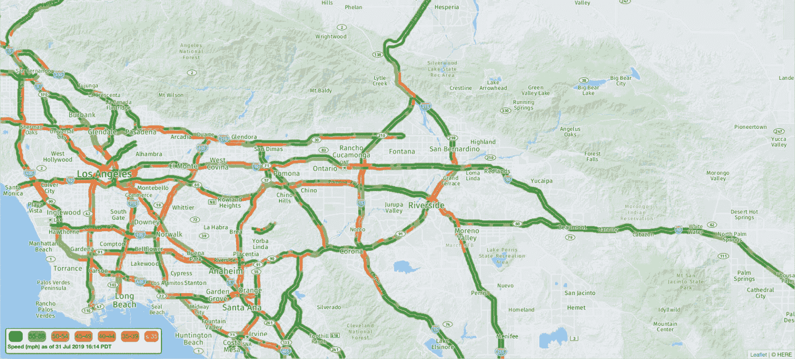

# 第十五章：使用 A3T-GCN 进行交通预测

我们在*第十三章*中介绍了 T-GNNs，但没有详细说明它们的主要应用：**交通预测**。近年来，智能城市的概念越来越受欢迎。这个概念指的是通过数据来管理和改善城市的运营和服务。在这种背景下，一个主要的吸引力来源是创建智能交通系统。准确的交通预测可以帮助交通管理者优化交通信号、规划基础设施并减少拥堵。然而，由于复杂的时空依赖性，交通预测是一个具有挑战性的问题。

在本章中，我们将应用 T-GNNs（时序图神经网络）到交通预测的一个特定案例。首先，我们将探索并处理一个新的数据集，从原始 CSV 文件中创建一个时序图。接着，我们将应用一种新的 T-GNN 模型来预测未来的交通速度。最后，我们将可视化并将结果与基准解决方案进行比较，以验证我们的架构的有效性。

在本章结束时，您将学会如何从表格数据中创建时序图数据集。特别地，我们将展示如何创建一个加权邻接矩阵，以提供边权重。最后，您将学习如何将 T-GNN 应用于交通预测任务并评估结果。

本章将涵盖以下主要内容：

+   探索 PeMS-M 数据集

+   处理数据集

+   实现时序 GNN

# 技术要求

本章中的所有代码示例可以在 GitHub 上的[`github.com/PacktPublishing/Hands-On-Graph-Neural-Networks-Using-Python/tree/main/Chapter15`](https://github.com/PacktPublishing/Hands-On-Graph-Neural-Networks-Using-Python/tree/main/Chapter15)找到。

在本书的*前言*中可以找到运行代码所需的本地安装步骤。本章需要大量 GPU 资源，您可以通过减少训练集的大小来降低需求。

# 探索 PeMS-M 数据集

在本节中，我们将探索数据集，以寻找有助于解决任务的模式和洞察。

我们将为此应用使用的数据集是`PeMSD7`数据集的中型变体[1]。原始数据集通过收集 2012 年 5 月和 6 月期间的工作日交通速度数据，这些数据来自加州交通部门（Caltrans）在 39,000 个传感器站点上的测量，采用了**绩效测量系统**（**PeMS**）。在中型变体中，我们将只考虑加州第七区的 228 个站点。这些站点提供的 30 秒速度测量被聚合成 5 分钟的时间间隔。例如，以下图展示了加州交通部门 PeMS（[pems.dot.ca.gov](https://pems.dot.ca.gov)）的交通速度数据：



图 15.1 – 来自 Caltrans PeMS 的交通数据，速度超过 60 英里每小时（>60 mph）用绿色表示，速度低于 35 英里每小时（<35 mph）用红色表示

我们可以直接从 GitHub 加载数据集并解压：

```py
from io import BytesIO
from urllib.request import urlopen
from zipfile import ZipFile
url = 'https://github.com/VeritasYin/STGCN_IJCAI-18/raw/master/data_loader/PeMSD7_Full.zip'
with urlopen(url) as zurl:
    with ZipFile(BytesIO(zurl.read())) as zfile:
        zfile.extractall('.')
```

结果文件夹包含两个文件：`V_228.csv`和`W_228.csv`。`V_228.csv`文件包含了来自 228 个传感器站点收集的交通速度数据，而`W_228.csv`文件则存储了这些站点之间的距离。

让我们使用`pandas`加载数据。我们将使用`range()`重新命名列，以便更方便地访问：

```py
import pandas as pd
speeds = pd.read_csv('PeMSD7_V_228.csv', names=range(0,228))
distances = pd.read_csv('PeMSD7_W_228.csv.csv', names=range(0,228))
```

我们希望对这个数据集做的第一件事是可视化交通速度的变化。这是时间序列预测中的经典方法，因为像季节性这样的特征可以极大地帮助分析。另一方面，非平稳时间序列可能在使用之前需要进一步处理。

让我们使用`matplotlib`绘制交通速度随时间变化的图表：

1.  我们导入`NumPy`和`matplotlib`：

    ```py
    import numpy as np
    import matplotlib.pyplot as plt
    ```

1.  我们使用`plt.plot()`为数据框中的每一行创建折线图：

    ```py
    plt.figure(figsize=(10,5))
    plt.plot(speeds)
    plt.grid(linestyle=':')
    plt.xlabel('Time (5 min)')
    plt.ylabel('Traffic speed')
    ```

1.  我们得到如下图表：


图 15.2 – 每个 228 个传感器站点的交通速度随时间变化

不幸的是，数据太嘈杂，无法通过这种方法提供任何有价值的见解。相反，我们可以绘制一些传感器站点的数据。但是，这可能并不能代表整个数据集。还有另一种选择：我们可以绘制平均交通速度和标准差。这样，我们可以可视化数据集的摘要。

在实际应用中，我们会同时使用这两种方法，但现在让我们尝试第二种方法：

1.  我们计算每列（时间步长）的平均交通速度及相应的标准差：

    ```py
    mean = speeds.mean(axis=1)
    std = speeds.std(axis=1)
    ```

1.  我们使用黑色实线绘制平均值：

    ```py
    plt.plot(mean, 'k-')
    ```

1.  我们使用`plt.fill_between()`在平均值周围绘制标准差，并填充为浅红色：

    ```py
    plt.fill_between(mean.index, mean-std, mean+std, color='r', alpha=0.1)
    plt.grid(linestyle=':')
    plt.xlabel('Time (5 min)')
    plt.ylabel('Traffic speed')
    ```

1.  代码生成了如下图表：


图 15.3 – 随时间变化的平均交通速度及其标准差

这个图表更易于理解。我们可以看到时间序列数据中存在明显的季节性（模式），除了大约第 5800 个数据点周围。交通速度有很大的波动，出现了重要的峰值。这是可以理解的，因为这些传感器站点分布在加利福尼亚州第七区：某些传感器可能会发生交通堵塞，而其他传感器则不会。

我们可以通过绘制每个传感器速度值之间的相关性来验证这一点。此外，我们还可以将其与每个站点之间的距离进行比较。相邻的站点应比远距离站点显示出更多的相似值。

让我们在同一图表中比较这两个图：

1.  我们创建一个包含两个横向子图的图形，并在它们之间添加一些间距：

    ```py
    fig, (ax1, ax2) = plt.subplots(1, 2, figsize=(8, 8))
    fig.tight_layout(pad=3.0)
    ```

1.  首先，我们使用`matshow()`函数绘制距离矩阵：

    ```py
    ax1.matshow(distances)
    ax1.set_xlabel("Sensor station")
    ax1.set_ylabel("Sensor station")
    ax1.title.set_text("Distance matrix")
    ```

1.  接着，我们计算每个传感器站的 Pearson 相关系数。我们必须转置速度矩阵，否则我们将得到每个时间步的相关系数。最后，我们将其反转，这样两个图表就更容易比较：

    ```py
    ax2.matshow(-np.corrcoef(speeds.T))
    ax2.set_xlabel("Sensor station")
    ax2.set_ylabel("Sensor station")
    ax2.title.set_text("Correlation matrix")
    ```

1.  我们得到如下图：


图 15.4 – 距离和相关矩阵，颜色较深表示短距离和高相关性，而颜色较浅表示长距离和低相关性

有趣的是，站点之间的长距离并不意味着它们没有高度相关（反之亦然）。如果我们只考虑这个数据集的一个子集，这一点尤其重要：接近的站点可能有非常不同的输出，这使得交通预测更加困难。在本章中，我们将考虑数据集中的每个传感器站。

# 数据集处理

现在我们对这个数据集有了更多的了解，是时候处理它，然后将其输入到 T-GNN 中。

第一步是将表格数据集转化为时序图。因此，首先，我们需要从原始数据中创建一个图。换句话说，我们必须以有意义的方式连接不同的传感器站。幸运的是，我们可以访问距离矩阵，它应该是连接站点的一个好方法。

有几种方法可以从距离矩阵计算邻接矩阵。例如，当两个站点之间的距离小于平均距离时，我们可以为它们分配一个连接。相反，我们将执行在[2]中介绍的更高级的处理，计算加权邻接矩阵。我们不使用二进制值，而是通过以下公式计算 0（无连接）和 1（强连接）之间的权重：


在这里，表示从节点  到节点  的边的权重， 是这两个节点之间的距离， 和  是两个阈值，用来控制邻接矩阵的分布和稀疏度。[2]的官方实现可以在 GitHub 上找到（[`github.com/VeritasYin/STGCN_IJCAI-18`](https://github.com/VeritasYin/STGCN_IJCAI-18)）。我们将重用相同的阈值  和 。

让我们用 Python 实现并绘制结果的邻接矩阵：

1.  我们创建一个函数来计算邻接矩阵，该函数需要三个参数：距离矩阵和两个阈值  和 。像官方实现一样，我们将距离除以 10,000 并计算 ：

    ```py
    def compute_adj(distances, sigma2=0.1, epsilon=0.5):
        d = distances.to_numpy() / 10000.
        d2 = d * d
    ```

1.  在这里，我们希望在权重值大于或等于  时保留这些权重（否则它们应等于零）。当我们测试权重是否大于或等于  时，结果是`True`或`False`语句。这就是为什么我们需要一个全是 1 的掩码（`w_mask`）来将其转换回 0 和 1 值的原因。我们第二次乘以它，以便只获得大于或等于  的真实权重值：

    ```py
        n = distances.shape[0]
        w_mask = np.ones([n, n]) - np.identity(n)
        return np.exp(-d2 / sigma2) * (np.exp(-d2 / sigma2) >= epsilon) * w_mask
    ```

1.  让我们计算邻接矩阵并打印出一行的结果：

    ```py
    adj = compute_adj(distances)
    adj[0]
    array(0.       , 0.       , 0.        , 0.       , 0.  ,
           0.       , 0.       , 0.61266012, 0.       , ...
    ```

我们可以看到`0.61266012`这个值，代表从节点 1 到节点 2 的边的权重。

1.  更高效的可视化这个矩阵的方法是再次使用`matplotlib`的`matshow`：

    ```py
    plt.figure(figsize=(8, 8))
    cax = plt.matshow(adj, False)
    plt.colorbar(cax)
    plt.xlabel("Sensor station")
    plt.ylabel("Sensor station")
    ```

我们得到以下图形：

![图 15.5 – PeMS-M 数据集的加权邻接矩阵图 15.5 – PeMS-M 数据集的加权邻接矩阵这是一种很好地总结第一步处理的方法。我们可以将其与之前绘制的距离矩阵进行比较，以查找相似之处。1.  我们还可以直接使用`networkx`将其绘制为图形。在这种情况下，连接是二进制的，因此我们可以简单地将每个权重大于 0 的连接考虑进去。我们可以使用边标签显示这些值，但图形将变得极其难以阅读：    ```py    import networkx as nx    def plot_graph(adj):        plt.figure(figsize=(10,5))        rows, cols = np.where(adj > 0)        edges = zip(rows.tolist(), cols.tolist())        G = nx.Graph()        G.add_edges_from(edges)        nx.draw(G, with_labels=True)        plt.show()    ```1.  即使没有标签，生成的图形也不容易阅读：    ```py    plot_graph(adj)    ```它给出了以下输出：

图 15.6 – PeMS-M 数据集作为图形（每个节点代表一个传感器站）

事实上，许多节点相互连接，因为它们彼此非常接近。然而，尽管如此，我们仍然可以区分出几条可能对应于实际道路的分支。

现在我们有了一个图形，我们可以专注于这个问题的时间序列方面。第一步是对速度值进行归一化处理，以便它们可以输入到神经网络中。在交通预测文献中，许多作者选择了 z-score 归一化（或标准化），我们将在这里实现这一方法：

1.  我们创建一个函数来计算 z-score：

    ```py
    def zscore(x, mean, std):
        return (x - mean) / std
    ```

1.  我们将其应用于我们的数据集，以创建其标准化版本：

    ```py
    speeds_norm = zscore(speeds, speeds.mean(axis=0), speeds.std(axis=0))
    ```

1.  我们可以检查结果：

    ```py
    speeds_norm.head(1)
    ```

我们得到了以下输出：

| **0** | **1** | **2** | **3** | **4** | **5** | **6** | **…** |
| --- | --- | --- | --- | --- | --- | --- | --- |
| **0** | 0.950754 | 0.548255 | 0.502211 | 0.831672 | 0.793696 | 1.193806 | … |

图 15.7 – 标准化速度值的示例

这些值已经正确标准化。现在，我们可以使用它们为每个节点创建时间序列。我们希望在每个时间步输入数据样本，，以预测时的速度值。较多的输入数据样本也会增加数据集的内存占用。的值，也称为预测范围，取决于我们想要执行的任务：短期或长期交通预测。

在这个示例中，我们取一个较高的值 48 来预测 4 小时后的交通速度：

1.  我们初始化变量：`lags`（输入数据样本数量）、`horizon`、输入矩阵和真实值矩阵：

    ```py
    lags = 24
    horizon = 48
    xs = []
    ys = []
    ```

1.  对于每个时间步，我们将存储之前的 12 个值（lags）在`xs`中，当前时刻的值存储在`ys`中：

    ```py
    for i in range(lags, speeds_norm.shape[0]-horizon):
        xs.append(speeds_norm.to_numpy()[i-lags:i].T)
        ys.append(speeds_norm.to_numpy()[i+horizon-1])
    ```

1.  最后，我们可以使用 PyTorch Geometric Temporal 创建时序图。我们需要提供 COO 格式的边索引以及来自加权邻接矩阵的边权重：

    ```py
    from torch_geometric_temporal.signal import StaticGraphTemporalSignal
    edge_index = (np.array(adj) > 0).nonzero()
    edge_weight = adj[adj > 0]
    dataset = StaticGraphTemporalSignal(edge_index, adj[adj > 0], xs, ys)
    ```

1.  让我们打印第一个图的信息，看看一切是否正常：

    ```py
    dataset[0]
    Data(x=[228, 12], edge_index=[2, 1664], edge_attr=[1664], y=[228])
    ```

1.  让我们不要忘记划分训练集和测试集，来完成我们的数据集准备：

    ```py
    from torch_geometric_temporal.signal import temporal_signal_split
    train_dataset, test_dataset = temporal_signal_split(dataset, train_ratio=0.8)
    ```

最终的时序图包含 228 个节点，每个节点有 12 个值和 1,664 条连接。我们现在准备应用 T-GNN 来预测交通状况。

# 实现 A3T-GCN 架构

在这一节中，我们将训练一个**注意力时序图卷积网络**（**A3T-GCN**），该网络是为交通预测设计的。这种架构使我们能够考虑复杂的空间和时间依赖性：

+   空间依赖性是指一个位置的交通状况可能受到周围位置交通状况的影响。例如，交通堵塞往往会蔓延到邻近的道路。

+   时间依赖性是指一个位置在某一时刻的交通状况可能会受到该位置在之前时刻交通状况的影响。例如，如果某条道路在早高峰时段发生拥堵，那么它很可能会持续到晚高峰。

A3T-GCN 是对**时序 GCN**（**TGCN**）架构的改进。TGCN 是一个结合了 GCN 和 GRU 的架构，从每个输入时间序列中生成隐藏向量。这两层的组合捕捉了输入中的空间和时间信息。然后，使用注意力模型来计算权重并输出上下文向量。最终的预测基于得到的上下文向量。增加这个注意力模型的动机在于需要理解全局趋势。


图 15.8 – A3T-GCN 框架

我们现在将使用 PyTorch Geometric Temporal 库来实现它：

1.  首先，我们导入所需的库：

    ```py
    import torch
    from torch_geometric_temporal.nn.recurrent import A3TGCN
    ```

1.  我们创建一个带有 `A3TGCN` 层和 32 个隐藏维度的线性层的 T-GNN。`edge_attr` 参数将存储我们的边权重：

    ```py
    class TemporalGNN(torch.nn.Module):
        def __init__(self, dim_in, periods):
            super().__init__()
            self.tgnn = A3TGCN(in_channels=dim_in, out_channels=32, periods=periods)
            self.linear = torch.nn.Linear(32, periods)
        def forward(self, x, edge_index, edge_attr):
            h = self.tgnn(x, edge_index, edge_attr).relu()
            h = self.linear(h)
            return h
    ```

1.  我们实例化了 T-GNN 和`Adam`优化器，学习率设置为`0.005`。由于实现细节，我们将使用 CPU 而不是 GPU 来训练该模型，因为在这种情况下 CPU 更快：

    ```py
    model = TemporalGNN(lags, 1).to('cpu')
    optimizer = torch.optim.Adam(model.parameters(), lr=0.005)
    ```

1.  我们使用`loss`函数训练模型 30 个 epoch。在每个 epoch 后，`loss`值会进行反向传播：

    ```py
    model.train()
    for epoch in range(30):
        loss = 0
        step = 0
        for i, snapshot in enumerate(train_dataset):
            y_pred = model(snapshot.x.unsqueeze(2), snapshot.edge_index, snapshot.edge_attr)
            loss += torch.mean((y_pred-snapshot.y)**2)
            step += 1
        loss = loss / (step + 1)
        loss.backward()
        optimizer.step()
        optimizer.zero_grad()
        if epoch % 10 == 0:
            print(f"Epoch {epoch+1:>2} | Train MSE: {loss:.4f}")
    ```

1.  我们获得了以下输出：

    ```py
    Epoch  1 | Train MSE: 1.0209
    Epoch 10 | Train MSE: 0.9625
    Epoch 20 | Train MSE: 0.9143
    Epoch 30 | Train MSE: 0.8905
    ```

现在我们的模型已经训练完成，我们需要对其进行评估。除了经典的指标如**均方根误差**（**RMSE**）和**平均绝对误差**（**MAE**），将我们的模型与时间序列数据的基准解决方案进行比较也特别有帮助。在接下来的列表中，我们将介绍两种方法：

+   使用**随机游走**（**RW**）作为一个简单的预测器。在这种情况下，RW 指的是使用最后一个观察值作为预测值。换句话说，处的值与处的值相同。

+   使用**历史平均值**（**HA**）作为略微更进化的解决方案。在这种情况下，我们计算前个样本的平均交通速度，作为处的值。在这个示例中，我们将使用滞后的数量作为我们的值，但我们也可以采用总体历史平均值。

我们首先评估模型在测试集上的预测：

1.  我们创建了一个函数来反转 z-score 并返回原始值：

    ```py
    def inverse_zscore(x, mean, std):
        return x * std + mean
    ```

1.  我们使用它从归一化值重新计算我们希望预测的速度。以下循环效率不高，但比更优化的代码更容易理解：

    ```py
    y_test = []
    for snapshot in test_dataset:
        y_hat = snapshot.y.numpy()
        y_hat = inverse_zscore(y_hat, speeds.mean(axis=0), speeds.std(axis=0))
        y_test = np.append(y_test, y_hat)
    ```

1.  我们对 GNN 做出的预测应用相同的策略：

    ```py
    gnn_pred = []
    model.eval()
    for snapshot in test_dataset:
        y_hat = model(snapshot.x.unsqueeze(2), snapshot.edge_index, snapshot.edge_weight).squeeze().detach().numpy()
        y_hat = inverse_zscore(y_hat, speeds.mean(axis=0), speeds.std(axis=0))
        gnn_pred = np.append(gnn_pred, y_hat)
    ```

1.  我们对 RW 和 HA 技术做同样的处理：

    ```py
    rw_pred = []
    for snapshot in test_dataset:
        y_hat = snapshot.x[:,-1].squeeze().detach().numpy()
        y_hat = inverse_zscore(y_hat, speeds.mean(axis=0), speeds.std(axis=0))
        rw_pred = np.append(rw_pred, y_hat)
    ha_pred = []
    for i in range(lags, speeds_norm.shape[0]-horizon):
        y_hat = speeds_norm.to_numpy()[i-lags:i].T.mean(axis=1)
        y_hat = inverse_zscore(y_hat, speeds.mean(axis=0), speeds.std(axis=0))
        ha_pred.append(y_hat)
    ha_pred = np.array(ha_pred).flatten()[-len(y_test):]
    ```

1.  我们创建了计算 MAE、RMSE 和**平均绝对百分比误差**（**MAPE**）的函数：

    ```py
    def MAE(real, pred):
        return np.mean(np.abs(pred - real))
    def RMSE(real, pred):
        return np.sqrt(np.mean((pred - real) ** 2))
    def MAPE(real, pred):
        return np.mean(np.abs(pred - real) / (real + 1e-5))
    ```

1.  我们在以下模块中评估 GNN 的预测，并对每个技术重复此过程：

    ```py
    print(f'GNN MAE  = {MAE(gnn_pred, y_test):.4f}')
    print(f'GNN RMSE = {RMSE(gnn_pred, y_test):.4f}')
    print(f'GNN MAPE = {MAPE(gnn_pred, y_test):.4f}')
    ```

最终，我们得到了以下表格：

|  | RMSE | MAE | MAPE |
| --- | --- | --- | --- |
| A3T-GCN | **11.9396** | **8.3293** | **14.95%** |
| 随机游走 | 17.6501 | 11.0469 | 29.99% |
| 历史平均值 | 17.9009 | 11.7308 | 28.93% |

图 15.9 – 预测输出表格

我们看到，在每个指标上，基准技术都被 A3T-GCN 模型超越。这是一个重要的结果，因为基准往往是很难超越的。将这些指标与 LSTM 或 GRU 网络提供的预测进行比较，将有助于衡量拓扑信息的重要性。

最后，我们可以绘制平均预测值，得到类似于*图 15.3*的可视化：

1.  我们使用列表推导法获得平均预测值，这种方法比之前的方法稍快（但更难以阅读）：

    ```py
    y_preds = [inverse_zscore(model(snapshot.x.unsqueeze(2), snapshot.edge_index, snapshot.edge_weight).squeeze().detach().numpy(), speeds.mean(axis=0), speeds.std(axis=0)).mean() for snapshot in test_dataset]
    ```

1.  我们计算了原始数据集的均值和标准差：

    ```py
    mean = speeds.mean(axis=1)
    std = speeds.std(axis=1)
    ```

1.  我们绘制了带有标准差的平均交通速度，并将其与预测值进行比较（小时）：

    ```py
    plt.figure(figsize=(10,5), dpi=300)
    plt.plot(mean, 'k-', label='Mean')
    plt.plot(range(len(speeds)-len(y_preds), len(speeds)), y_preds, 'r-', label='Prediction')
    plt.grid(linestyle=':')
    plt.fill_between(mean.index, mean-std, mean+std, color='r', alpha=0.1)
    plt.axvline(x=len(speeds)-len(y_preds), color='b', linestyle='--')
    plt.xlabel('Time (5 min)')
    plt.ylabel('Traffic speed to predict')
    plt.legend(loc='upper right')
    ```

我们得到了以下图形：


图 15.10 – A3T-GCN 模型在测试集上预测的平均交通速度

T-GNN 正确预测了交通高峰并跟踪了总体趋势。然而，预测的速度更接近整体平均值，因为模型由于 MSE 损失而更不容易犯重大错误。尽管如此，GNN 仍然相当准确，并可以进一步调整以输出更极端的值。

# 总结

本章集中讨论了使用 T-GNNs 进行交通预测的任务。首先，我们探索了 PeMS-M 数据集，并将其从表格数据转换为具有时间信号的静态图数据集。在实践中，我们基于输入的距离矩阵创建了加权邻接矩阵，并将交通速度转换为时间序列。最后，我们实现了一个 A3T-GCN 模型，这是一个为交通预测设计的 T-GNN。我们将结果与两个基准进行了比较，并验证了我们模型的预测。

在*第十六章*《使用 LightGCN 构建推荐系统》中，我们将看到 GNNs 最流行的应用。我们将在一个大规模数据集上实现一个轻量级 GNN，并使用推荐系统中的技术对其进行评估。

# 进一步阅读

+   [1] B. Yu, H. Yin, 和 Z. Zhu. *时空图卷积网络：面向交通预测的深度学习框架*. 2018 年 7 月\. doi: 10.24963/ijcai.2018/505\. 可在[`arxiv.org/abs/1709.04875`](https://arxiv.org/abs/1709.04875)查看。

+   [2] Y. Li, R. Yu, C. Shahabi, 和 Y. Liu. *扩散卷积递归神经网络：数据驱动的交通预测*. arXiv, 2017 年\. doi: 10.48550/ARXIV.1707.01926\. 可在[`arxiv.org/abs/1707.01926`](https://arxiv.org/abs/1707.01926)查看。
