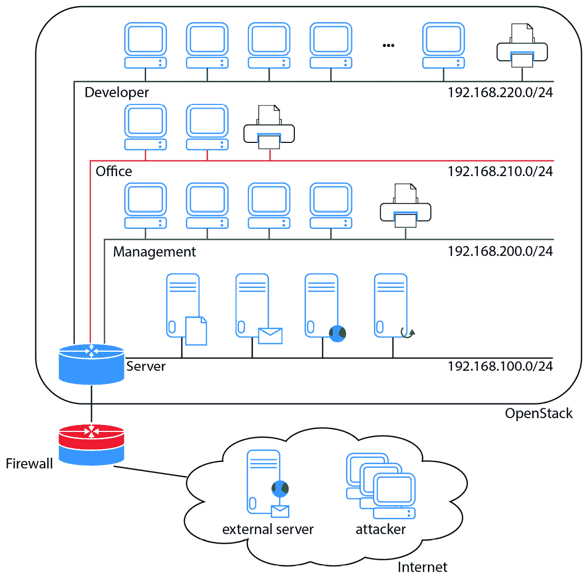
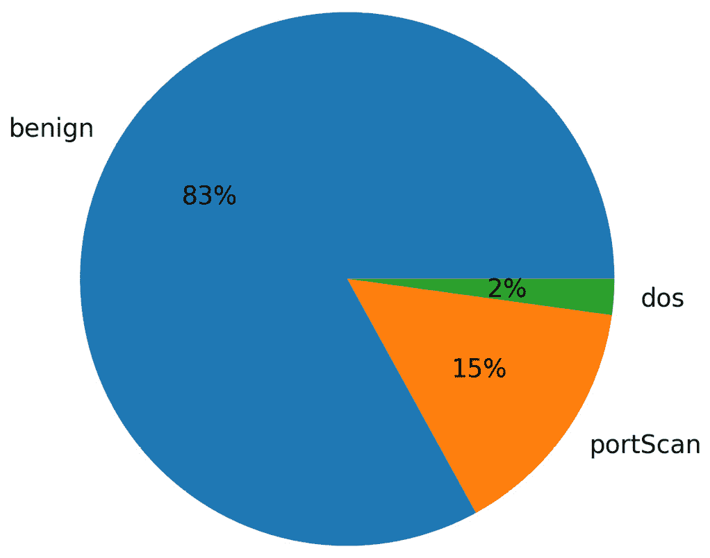
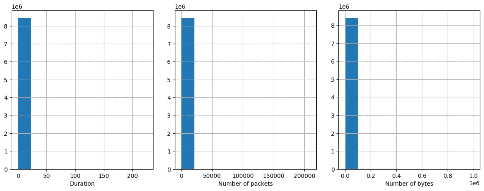
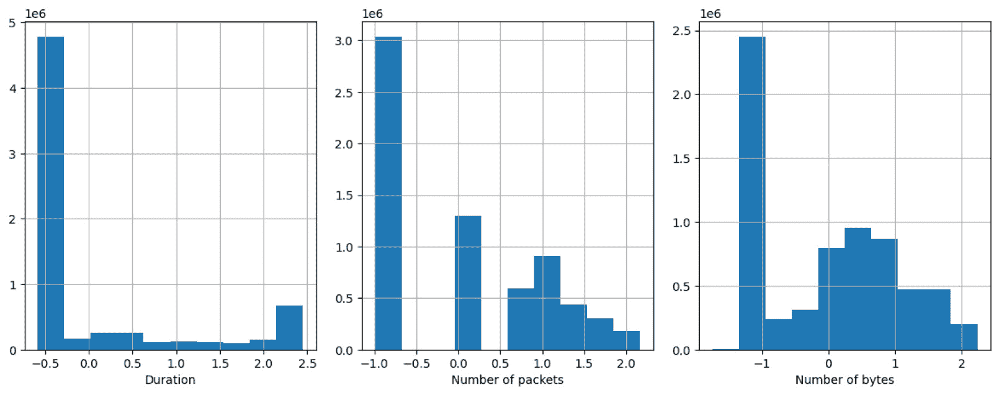
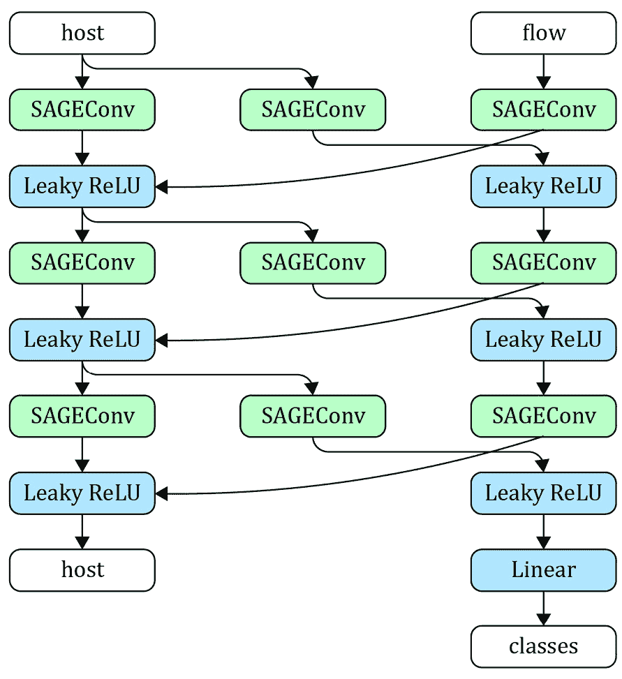
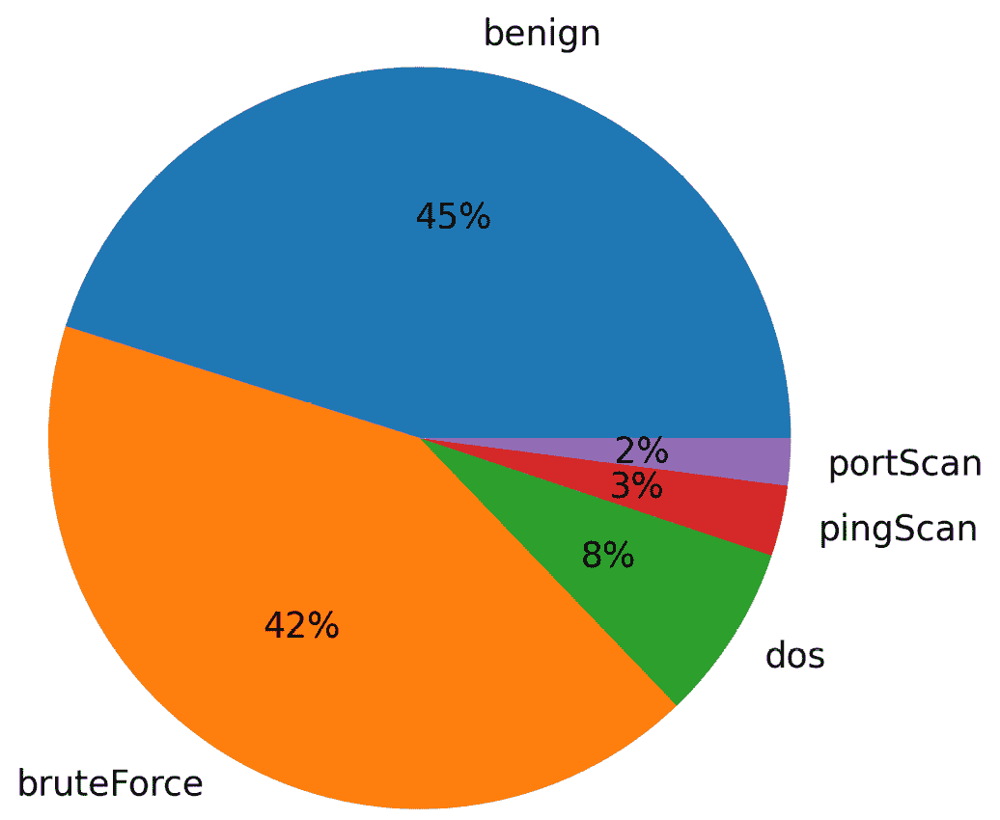
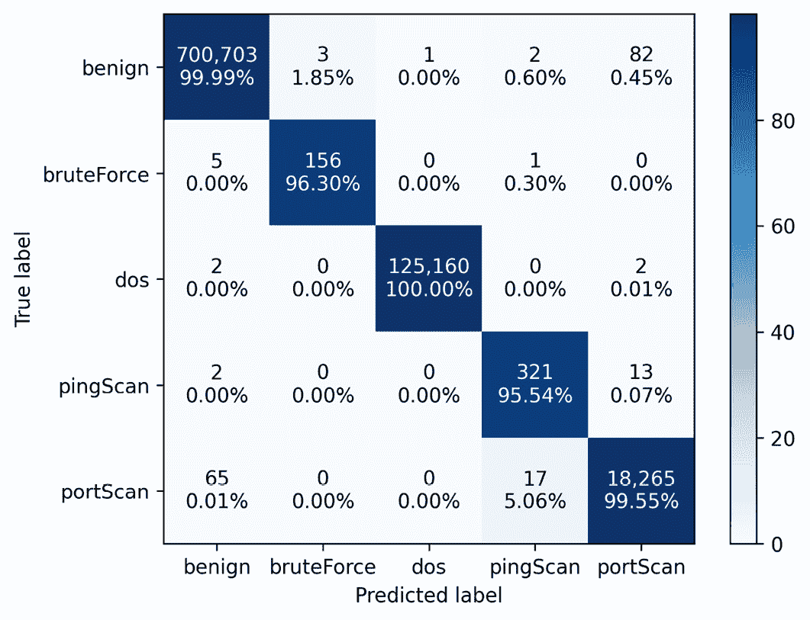

# 第十六章：使用异构 GNN 检测异常

在机器学习中，异常检测是一个流行的任务，旨在识别数据中偏离预期行为的模式或观察结果。这是一个在许多现实应用中出现的基本问题，例如检测金融交易中的欺诈、识别制造过程中的缺陷产品以及检测计算机网络中的网络攻击。

GNN 可以通过学习网络的正常行为来训练，然后识别偏离该行为的节点或模式。事实上，它们理解复杂关系的能力使得它们特别适合于检测微弱信号。此外，GNN 可以扩展到大型数据集，使其成为处理海量数据的高效工具。

在本章中，我们将构建一个用于计算机网络异常检测的 GNN 应用程序。首先，我们将介绍`CIDDS-001`数据集，其中包含计算机网络中的攻击和正常流量。接下来，我们将处理数据集，准备将其输入到 GNN 中。然后，我们将实现一个异构 GNN，以处理不同类型的节点和边。最后，我们将使用处理过的数据集训练网络，并评估结果，查看其在检测网络流量中的异常方面的表现。

在本章结束时，你将知道如何实现一个用于入侵检测的 GNN。此外，你将了解如何构建相关特征以检测攻击，并处理它们以输入到 GNN 中。最后，你将学习如何实现并评估一个异构 GNN 以检测稀有攻击。

本章将涵盖以下主要内容：

+   探索 CIDDS-001 数据集

+   预处理 CIDDS-001 数据集

+   实现一个异构 GNN

# 技术要求

本章中的所有代码示例都可以在 GitHub 上找到，链接为[`github.com/PacktPublishing/Hands-On-Graph-Neural-Networks-Using-Python/tree/main/Chapter16`](https://github.com/PacktPublishing/Hands-On-Graph-Neural-Networks-Using-Python/tree/main/Chapter16)。

运行代码所需的安装步骤可以在本书的*前言*中找到。本章需要大量的 GPU，你可以通过减少代码中训练集的大小来降低需求。

# 探索 CIDDS-001 数据集

本节将探索数据集，并深入了解特征的重要性和缩放。

`CIDDS-001`数据集[1]旨在训练和评估基于异常的网络入侵检测系统。它提供了现实的流量数据，包括最新的攻击，用于评估这些系统。它通过使用 OpenStack 在虚拟环境中收集并标记了 8,451,520 个流量流量数据。具体来说，每一行代表一个 NetFlow 连接，描述**互联网协议**（**IP**）流量统计信息，例如交换的字节数。

以下图表提供了 `CIDDS-001` 中模拟网络环境的概览：



图 16.1 – CIDDS-001 模拟的虚拟网络概览

我们可以看到四个不同的子网（开发者、办公室、管理和服务器），以及它们各自的 IP 地址范围。所有这些子网都连接到一台通过防火墙与互联网相连的服务器。还存在一个外部服务器，提供两个服务：文件同步服务和网页服务器。最后，攻击者被表示在本地网络之外。

`CIDDS-001` 中的连接来自本地和外部服务器。该数据集的目标是将这些连接正确地分类为五个类别：正常（无攻击）、暴力破解、拒绝服务、ping 扫描和端口扫描。

让我们下载 `CIDDS-001` 数据集并探索其输入特征：

1.  我们下载 `CIDDS-001`：

    ```py
    from io import BytesIO
    from urllib.request import urlopen
    from zipfile import ZipFile
    url = 'https://www.hs-coburg.de/fileadmin/hscoburg/WISENT-CIDDS-001.zip'
    with urlopen(url) as zurl:
        with ZipFile(BytesIO(zurl.read())) as zfile:
            zfile.extractall('.')
    ```

1.  我们导入所需的库：

    ```py
    import numpy as np
    import pandas as pd
    import matplotlib.pyplot as plt
    import itertools
    from sklearn.model_selection import train_test_split
    from sklearn.preprocessing import PowerTransformer
    from sklearn.metrics import f1_score, classification_report, confusion_matrix
    from torch_geometric.loader import DataLoader
    from torch_geometric.data import HeteroData
    from torch.nn import functional as F
    from torch.optim import Adam
    from torch import nn
    import torch
    ```

1.  我们使用 `pandas` 加载数据集：

    ```py
    df = pd.read_csv("CIDDS-001/traffic/OpenStack/CIDDS-001-internal-week1.csv")
    ```

1.  让我们看看前五个连接对应的数据：

    ```py
    df.head(5)
    Date first seen Duration Proto Src IP Addr Src Pt Dst IP Addr Dst Pt Packets Bytes Flows Flags Tos class attackType attackID attackDescription
    2017-03-15 00:01:16.632 0.000 TCP 192.168.100.5 445 192.168.220.16 58844.0 1 108 1 .AP... 0 normal --- --- ---
    2017-03-15 00:01:16.552 0.000 TCP 192.168.100.5 445 192.168.220.15 48888.0 1 108 1 .AP... 0 normal --- --- ---
    2017-03-15 00:01:16.551 0.004 TCP 192.168.220.15 48888 192.168.100.5 445.0 2 174 1 .AP... 0 normal --- --- ---
    2017-03-15 00:01:16.631 0.004 TCP 192.168.220.16 58844 192.168.100.5 445.0 2 174 1 .AP... 0 normal --- --- ---
    2017-03-15 00:01:16.552 0.000 TCP 192.168.100.5 445 192.168.220.15 48888.0 1 108 1 .AP... 0 normal --- --- ---
    ```

有一些有趣的特征我们可以用于我们的模型：

+   “首次看到日期”是一个时间戳，我们可以对其进行处理，以提取关于星期几和一天中时间的信息。通常，网络流量是有季节性的，夜间或非常规日子的连接通常是可疑的。

+   IP 地址（如 `192.168.100.5`）因其不是数值型且遵循复杂规则而著名，处理起来非常困难。我们可以将它们分为几个类别，因为我们知道本地网络的设置。另一个更常见且具有更好泛化性的解决方案是将其转换为二进制表示（例如，“192”变为“11000000”）。

+   持续时间、数据包数量和字节数通常呈现重尾分布。因此，如果是这种情况，它们将需要特别处理。

让我们检查这一点，并仔细看看该数据集中的攻击分布：

1.  我们首先删除本项目中不考虑的特征：端口、流数量、服务类型、类别、攻击 ID 和攻击描述：

    ```py
    df = df.drop(columns=['Src Pt', 'Dst Pt', 'Flows', 'Tos', 'class', 'attackID', 'attackDescription'])
    ```

1.  我们重命名正常类别，并将“首次看到日期”特征转换为时间戳数据类型：

    ```py
    df['attackType'] = df['attackType'].replace('---', 'benign')
    df['Date first seen'] = pd.to_datetime(df['Date first seen'])
    ```

1.  我们统计标签并制作一个饼图，显示三个最多类别（另外两个类别的比例低于 0.1%）：

    ```py
    count_labels = df['attackType'].value_counts() / len(df) * 100
    plt.pie(count_labels[:3], labels=df['attackType'].unique()[:3], autopct='%.0f%%')
    ```

1.  我们得到以下图表：



图 16.2 – CIDDS-001 数据集中每个类别的比例

如你所见，正常流量占据了数据集的绝大多数。相反，暴力破解攻击和 ping 扫描的样本数量相对较少。这个不平衡的学习设置可能会对模型处理稀有类别时的性能产生负面影响。

1.  最后，我们可以显示持续时间分布、数据包数量和字节数。这让我们能够查看它们是否确实需要特定的重新缩放处理：

    ```py
    fig, ((ax1, ax2, ax3)) = plt.subplots(1, 3, figsize=(20,5))
    df['Duration'].hist(ax=ax1)
    ax1.set_xlabel("Duration")
    df['Packets'].hist(ax=ax2)
    ax2.set_xlabel("Number of packets")
    pd.to_numeric(df['Bytes'], errors='coerce').hist(ax=ax3)
    ax3.set_xlabel("Number of bytes")
    plt.show()
    ```

它输出如下图所示：



图 16.3 – 持续时间、数据包数量和字节数的分布

我们可以看到，大多数值接近零，但也有一些稀有值沿 *x* 轴形成了长尾。我们将使用幂变换使这些特征更接近高斯分布，这应该有助于模型训练。

现在我们已经探索了 `CIDDS-001` 数据集的主要特征，可以进入预处理阶段。

# 对 CIDDS-001 数据集进行预处理

在上一节中，我们已经确定了一些需要解决的数据集问题，以提高模型的准确性。

`CIDDS-001` 数据集包括多种类型的数据：我们有持续时间等数值数据、协议（TCP、UDP、ICMP 和 IGMP）等类别特征，以及时间戳或 IP 地址等其他数据。在接下来的练习中，我们将根据前一节的信息和专家知识，选择如何表示这些数据类型：

1.  首先，我们可以通过从时间戳中提取星期几的信息来进行独热编码。我们将重命名结果列，使其更易读：

    ```py
    df['weekday'] = df['Date first seen'].dt.weekday
    df = pd.get_dummies(df, columns=['weekday']).rename(columns = {'weekday_0': 'Monday','weekday_1': 'Tuesday','weekday_2': 'Wednesday', 'weekday_3': 'Thursday','weekday_4': 'Friday','weekday_5': 'Saturday','weekday_6': 'Sunday',})
    ```

1.  另一个通过时间戳可以获取的重要信息是一天中的时间。我们还将其归一化到 `0` 和 `1` 之间：

    ```py
    df['daytime'] = (df['Date first seen'].dt.second +df['Date first seen'].dt.minute*60 + df['Date first seen'].dt.hour*60*60)/(24*60*60)
    ```

1.  我们还没有讨论 TCP 标志。每个标志表示 TCP 连接中的特定状态。例如，`F` 或 `FIN` 表示 TCP 对端已经完成数据发送。我们可以提取每个标志，并按如下方式对其进行独热编码：

    ```py
    df = df.reset_index(drop=True)
    ohe_flags = one_hot_flags(df['Flags'].to_numpy())
    ohe_flags = df['Flags'].apply(one_hot_flags).to_list()
    df[['ACK', 'PSH', 'RST', 'SYN', 'FIN']] = pd.DataFrame(ohe_flags, columns=['ACK', 'PSH', 'RST', 'SYN', 'FIN'])
    ```

1.  现在，我们处理 IP 地址。在这个示例中，我们将使用二进制编码。我们不会使用 32 位来编码完整的 IPv4 地址，而是仅保留最后 16 位，因为这部分在这里最为重要。实际上，前 16 位要么表示 `192.168`，如果主机属于内部网络，要么表示其他值，如果它是外部网络：

    ```py
    temp = pd.DataFrame()
    temp['SrcIP'] = df['Src IP Addr'].astype(str)
    temp['SrcIP'][~temp['SrcIP'].str.contains('\d{1,3}\.', regex=True)] = '0.0.0.0'
    temp = temp['SrcIP'].str.split('.', expand=True).rename(columns = {2: 'ipsrc3', 3: 'ipsrc4'}).astype(int)[['ipsrc3', 'ipsrc4']]
    temp['ipsrc'] = temp['ipsrc3'].apply(lambda x: format(x, "b").zfill(8)) + temp['ipsrc4'].apply(lambda x: format(x, "b").zfill(8))
    df = df.join(temp['ipsrc'].str.split('', expand=True)
                .drop(columns=[0, 17])
                .rename(columns=dict(enumerate([f'ipsrc_{i}' for i in range(17)])))
                .astype('int32'))
    ```

1.  我们对目标 IP 地址重复这个过程：

    ```py
    temp = pd.DataFrame()
    temp['DstIP'] = df['Dst IP Addr'].astype(str)
    temp['DstIP'][~temp['DstIP'].str.contains('\d{1,3}\.', regex=True)] = '0.0.0.0'
    temp = temp['DstIP'].str.split('.', expand=True).rename(columns = {2: 'ipdst3', 3: 'ipdst4'}).astype(int)[['ipdst3', 'ipdst4']]
    temp['ipdst'] = temp['ipdst3'].apply(lambda x: format(x, "b").zfill(8)) + temp['ipdst4'].apply(lambda x: format(x, "b").zfill(8))
    df = df.join(temp['ipdst'].str.split('', expand=True)
                .drop(columns=[0, 17])
                .rename(columns=dict(enumerate([f'ipdst_{i}' for i in range(17)])))
                .astype('int32'))
    ```

1.  `Bytes` 特征存在一个问题：百万单位用 `m` 表示，而不是数值。我们可以通过将这些非数值的数值部分乘以一百万来修复这个问题：

    ```py
    m_index = df[pd.to_numeric(df['Bytes'], errors='coerce').isnull() == True].index
    df['Bytes'].loc[m_index] = df['Bytes'].loc[m_index].apply(lambda x: 10e6 * float(x.strip().split()[0]))
    df['Bytes'] = pd.to_numeric(df['Bytes'], errors='coerce', downcast='integer')
    ```

1.  我们需要编码的最后一类特征是最简单的：如协议和攻击类型等类别特征。我们使用 `pandas` 中的 `get_dummies()` 函数：

    ```py
    df = pd.get_dummies(df, prefix='', prefix_sep='', columns=['Proto', 'attackType'])
    ```

1.  我们创建一个训练/验证/测试的分割，比例为 80/10/10：

    ```py
    labels = ['benign', 'bruteForce', 'dos', 'pingScan', 'portScan']
    df_train, df_test = train_test_split(df, random_state=0, test_size=0.2, stratify=df[labels])
    df_val, df_test = train_test_split(df_test, random_state=0, test_size=0.5, stratify=df_test[labels])
    ```

1.  最后，我们需要处理三个特征的缩放问题：持续时间、数据包数量和字节数。我们使用 `scikit-learn` 中的 `PowerTransformer()` 来修改它们的分布：

    ```py
    scaler = PowerTransformer()
    df_train[['Duration', 'Packets', 'Bytes']] = scaler.fit_transform(df_train[['Duration', 'Packets', 'Bytes']])
    df_val[['Duration', 'Packets', 'Bytes']] = scaler.transform(df_val[['Duration', 'Packets', 'Bytes']])
    df_test[['Duration', 'Packets', 'Bytes']] = scaler.transform(df_test[['Duration', 'Packets', 'Bytes']])
    ```

1.  让我们绘制新的分布，看看它们如何比较：

    ```py
    fig, ((ax1, ax2, ax3)) = plt.subplots(1, 3, figsize=(15,5))
    df_train['Duration'].hist(ax=ax1)
    ax1.set_xlabel("Duration")
    df_train['Packets'].hist(ax=ax2)
    ax2.set_xlabel("Number of packets")
    df_train['Bytes'].hist(ax=ax3)
    ax3.set_xlabel("Number of bytes")
    plt.show()
    ```

我们得到如下图所示：



图 16.4 – 持续时间、数据包数量和字节数的重新缩放分布

这些新分布不是高斯分布，但值分布更加分散，这应该有助于模型。

请注意，我们处理的数据集是纯粹的表格数据。在将其输入到图神经网络（GNN）之前，我们仍然需要将其转换为图数据集。在我们的例子中，没有明显的方法将流量转换为节点。理想情况下，同一计算机之间的流量应该是相连的。可以通过使用具有两种类型节点的异构图来实现：

+   **主机**，它们对应于计算机，并使用 IP 地址作为特征。如果我们有更多信息，可以添加其他与计算机相关的特征，例如日志或 CPU 利用率。

+   **流量**，它们对应于两个主机之间的连接。它们考虑数据集中的所有其他特征。它们还有我们要预测的标签（良性或恶意流量）。

在这个例子中，流量是单向的，这也是我们定义两种类型的边的原因：主机到流量（源）和流量到主机（目标）。单一图形会占用过多内存，因此我们将其分割成子图，并将它们放入数据加载器中：

1.  我们定义了批量大小以及我们希望考虑的主机和流节点的特征：

    ```py
    BATCH_SIZE = 16
    features_host = [f'ipsrc_{i}' for i in range(1, 17)] + [f'ipdst_{i}' for i in range(1, 17)]
    features_flow = ['daytime', 'Monday', 'Tuesday', 'Wednesday', 'Thursday', 'Friday', 'Duration', 'Packets', 'Bytes', 'ACK', 'PSH', 'RST', 'SYN', 'FIN', 'ICMP ', 'IGMP ', 'TCP  ', 'UDP  ']
    ```

1.  我们定义一个函数来创建数据加载器。它接受两个参数：我们创建的表格数据框和子图大小（在本例中为`1024`个节点）：

    ```py
    def create_dataloader(df, subgraph_size=1024):
    ```

1.  我们初始化一个名为`data`的列表来存储我们的子图，并计算将要创建的子图数量：

    ```py
        data = []
        n_subgraphs = len(df) // subgraph_size
    ```

1.  对于每个子图，我们从数据框中检索相应的样本、源 IP 地址列表和目标 IP 地址列表：

    ```py
        for i in range(1, n_batches+1):
            subgraph = df[(i-1)*subgraph_size:i*subgraph_size]
            src_ip = subgraph['Src IP Addr'].to_numpy()
            dst_ip = subgraph['Dst IP Addr'].to_numpy()
    ```

1.  我们创建一个字典，将 IP 地址映射到节点索引：

    ```py
    ip_map = {ip:index for index, ip in enumerate(np.unique(np.append(src_ip, dst_ip)))}
    ```

1.  这个字典将帮助我们从主机到流量、以及反向生成边索引。我们使用一个名为`get_connections()`的函数，在这之后我们会创建它。

    ```py
    host_to_flow, flow_to_host = get_connections(ip_map, src_ip, dst_ip)
    ```

1.  我们使用迄今为止收集的所有数据，为每个子图创建一个异构图，并将其附加到列表中：

    ```py
            batch = HeteroData()
            batch['host'].x = torch.Tensor(subgraph[features_host].to_numpy()).float()
            batch['flow'].x = torch.Tensor(subgraph[features_flow].to_numpy()).float()
            batch['flow'].y = torch.Tensor(subgraph[labels].to_numpy()).float()
            batch['host','flow'].edge_index = host_to_flow
            batch['flow','host'].edge_index = flow_to_host
            data.append(batch)
    ```

1.  最后，我们返回具有适当批量大小的数据加载器：

    ```py
    return DataLoader(data, batch_size=BATCH_SIZE)
    ```

1.  还有一个函数我们需要实现——`get_connections()`——它根据源 IP 地址和目标 IP 地址的列表以及它们的对应映射，计算出两个边索引：

    ```py
    def get_connections(ip_map, src_ip, dst_ip):
    ```

1.  我们从 IP 地址（源和目标）中获取索引并将它们堆叠起来：

    ```py
        src1 = [ip_map[ip] for ip in src_ip]
        src2 = [ip_map[ip] for ip in dst_ip]
        src = np.column_stack((src1, src2)).flatten()
    ```

1.  这些连接是独特的，因此我们可以轻松地使用适当的数字范围对其进行索引：

    ```py
        dst = list(range(len(src_ip)))
        dst = np.column_stack((dst, dst)).flatten()
    ```

1.  最后，我们返回以下两个边索引：

    ```py
    return torch.Tensor([src, dst]).int(), torch.Tensor([dst, src]).int()
    ```

1.  现在我们拥有所需的一切，可以调用第一个函数来创建训练、验证和测试数据加载器：

    ```py
    train_loader = create_dataloader(df_train)
    val_loader = create_dataloader(df_val)
    test_loader = create_dataloader(df_test)
    ```

1.  现在，我们有三个数据加载器，分别对应于我们的训练集、验证集和测试集。下一步是实现 GNN 模型。

# 实现异构 GNN

在本节中，我们将使用`GraphSAGE`操作符实现异构 GNN。该架构将允许我们同时考虑两种节点类型（主机和流）来构建更好的嵌入。通过跨不同层复制和共享消息来实现这一点，如下图所示。



图 16.5 – 异构 GNN 的架构

我们将为每种节点类型实现三层`SAGEConv`，并使用`LeakyRELU`激活函数。最后，一个线性层将输出一个五维向量，其中每个维度对应一个类别。此外，我们将使用交叉熵损失和`Adam`优化器以监督方式训练该模型：

1.  我们从 PyTorch Geometric 中导入相关的神经网络层：

    ```py
    import torch_geometric.transforms as T
    from torch_geometric.nn import Linear, HeteroConv, SAGEConv
    ```

1.  我们定义异构 GNN 的三个参数：隐藏维度的数量、输出维度的数量和层数：

    ```py
    class HeteroGNN(torch.nn.Module):
        def __init__(self, dim_h, dim_out, num_layers):
            super().__init__()
    ```

1.  我们为每个层和边类型定义了一个异构版本的`GraphSAGE`操作符。在这里，我们可以为每种边类型应用不同的 GNN 层，如`GCNConv`或`GATConv`。`HeteroConv()`包装器管理层之间的消息传递，如*图 16.5*所示：

    ```py
            self.convs = torch.nn.ModuleList()
            for _ in range(num_layers):
                conv = HeteroConv({
                    ('host', 'to', 'flow'): SAGEConv((-1,-1), dim_h, add_self_loops=False),
                    ('flow', 'to', 'host'): SAGEConv((-1,-1), dim_h, add_self_loops=False),
                }, aggr='sum')
                self.convs.append(conv)
    ```

1.  我们定义一个线性层，将输出最终的分类结果：

    ```py
            self.lin = Linear(dim_h, dim_out)
    ```

1.  我们创建了`forward()`方法，该方法计算主机节点和流节点的嵌入（存储在`x_dict`字典中）。然后，流的嵌入用于预测一个类别：

    ```py
        def forward(self, x_dict, edge_index_dict):
            for conv in self.convs:
                x_dict = conv(x_dict, edge_index_dict)
                x_dict = {key: F.leaky_relu(x) for key, x in x_dict.items()}
            return self.lin(x_dict['flow'])
    ```

1.  我们实例化异构 GNN，设置 64 个隐藏维度、5 个输出（即 5 个类别）和 3 层。如果可用，我们将其放置在 GPU 上，并创建一个学习率为`0.001`的`Adam`优化器：

    ```py
    device = torch.device('cuda' if torch.cuda.is_available() else 'cpu')
    model = HeteroGNN(dim_h=64, dim_out=5, num_layers=3).to(device)
    optimizer = Adam(model.parameters(), lr=0.001)
    ```

1.  我们定义`test()`函数并创建数组来存储预测结果和`true`标签。我们还希望统计子图的数量和总损失，因此我们创建了相应的变量：

    ```py
    @torch.no_grad()
    def test(loader):
        model.eval()
        y_pred = []
        y_true = []
        n_subgraphs = 0
        total_loss = 0
    ```

1.  我们获取每个批次的模型预测结果，并计算交叉熵损失：

    ```py
       for batch in loader:
            batch.to(device)
            out = model(batch.x_dict, batch.edge_index_dict)
            loss = F.cross_entropy(out, batch['flow'].y.float())
    ```

1.  我们将预测的类别追加到预测列表中，并对`true`标签执行相同操作：

    ```py
            y_pred.append(out.argmax(dim=1))
            y_true.append(batch['flow'].y.argmax(dim=1))
    ```

1.  我们如下统计子图数量和总损失：

    ```py
            n_subgraphs += BATCH_SIZE
            total_loss += float(loss) * BATCH_SIZE
    ```

1.  批处理循环结束后，我们使用预测和`true`标签列表计算宏平均`F1`分数。宏平均`F1`分数在这种类别不平衡的学习设置中是一个很好的指标，因为它平等对待所有类别，而不管样本数量：

    ```py
        y_pred = torch.cat(y_pred).cpu()
        y_true = torch.cat(y_true).cpu()
        f1score = f1_score(y_true, y_pred, average='macro')
    ```

1.  我们返回最终的损失、宏平均`F1`分数、预测列表和`true`标签列表：

    ```py
        return total_loss/n_subgraphs, f1score, y_pred, y_true
    ```

1.  我们创建训练循环，训练模型`101`个 epochs：

    ```py
    model.train()
    for epoch in range(101):
        n_subgraphs = 0
        total_loss = 0
    ```

1.  我们使用交叉熵损失在每个批次上训练异构 GNN：

    ```py
        for batch in train_loader:
            optimizer.zero_grad()
            batch.to(device)
            out = model(batch.x_dict, batch.edge_index_dict)
            loss = F.cross_entropy(out, batch['flow'].y.float())
            loss.backward()
            optimizer.step()
            n_subgraphs += BATCH_SIZE
            total_loss += float(loss) * BATCH_SIZE
    ```

1.  每经过 10 个 epochs，我们在验证集上评估模型并展示相关指标（训练损失、验证损失和验证的宏平均`F1`分数）：

    ```py
        if epoch % 10 == 0:
            val_loss, f1score, _, _ = test(val_loader)
            print(f'Epoch {epoch} | Loss: {total_loss/n_subgraphs:.4f} | Val loss: {val_loss:.4f} | Val F1 score: {f1score:.4f}')
    ```

我们在训练过程中获得如下输出：

```py
Epoch 0 | Loss: 0.1006 | Val loss: 0.0072 | Val F1 score: 0.6044
Epoch 10 | Loss: 0.0020 | Val loss: 0.0021 | Val F1-score: 0.8899
Epoch 20 | Loss: 0.0015 | Val loss: 0.0015 | Val F1-score: 0.9211
...
Epoch 90 | Loss: 0.0004 | Val loss: 0.0008 | Val F1-score: 0.9753
Epoch 100 | Loss: 0.0004 | Val loss: 0.0009 | Val F1-score: 0.9785
```

1.  最后，我们在测试集上评估模型。我们还打印`scikit-learn`的分类报告，其中包括宏平均`F1`分数：

    ```py
    _, _, y_pred, y_true = test(test_loader)
    print(classification_report(y_true, y_pred, target_names=labels, digits=4))
                  precision    recall  f1-score   support
          benign     0.9999    0.9999    0.9999    700791
      bruteForce     0.9811    0.9630    0.9720       162
             dos     1.0000    1.0000    1.0000    125164
        pingScan     0.9413    0.9554    0.9483       336
        portScan     0.9947    0.9955    0.9951     18347
        accuracy                         0.9998    844800
       macro avg     0.9834    0.9827    0.9831    844800
    weighted avg     0.9998    0.9998    0.9998    844800
    ```

我们获得了一个宏观平均的`F1`分数为`0.9831`。这个优秀的结果表明我们的模型已经学会了可靠地预测每个类别。

我们采用的方法如果能够获取更多主机相关的特征，将更加相关，但它展示了如何根据需求扩展该方法。GNN 的另一个主要优势是其处理大量数据的能力。当处理数百万条流量时，这种方法显得尤为合理。为了完成这个项目，让我们绘制模型的错误图，以便看到如何改进它。

我们创建了一个数据框来存储预测值（`y_pred`）和真实标签（`y_true`）。我们使用这个新的数据框来绘制误分类样本的比例：

```py
df_pred = pd.DataFrame([y_pred.numpy(), y_true.numpy()]).T
df_pred.columns = ['pred', 'true']
plt.pie(df_pred['true'][df_pred['pred'] != df_pred['true']].value_counts(), labels=labels, autopct='%.0f%%')
```

这给我们带来了以下图表：



图 16.6 – 每个误分类类别的比例

如果我们将这个饼图与数据集中的原始比例进行比较，可以看到模型在多数类别上的表现更好。这并不令人惊讶，因为少数类别更难学习（样本较少），且未检测到这些类别的惩罚较轻（例如，700,000 个良性流量与 336 个 ping 扫描）。端口和 ping 扫描的检测可以通过过采样和在训练过程中引入类别权重等技术来改进。

我们可以通过查看混淆矩阵获取更多信息（代码可以在 GitHub 上找到）。



图 16.7 – 多类流量分类的混淆矩阵

该混淆矩阵显示了有趣的结果，比如对良性类别的偏向，或者在 ping 和端口扫描之间的错误。这些错误可以归因于这些攻击之间的相似性。通过工程化地增加特征，可以帮助模型区分这些类别。

# 总结

在本章中，我们探讨了使用 GNN（图神经网络）检测新数据集中的异常，具体是`CIDDS-001`数据集。首先，我们对数据集进行了预处理，并将其转换为图形表示，这使我们能够捕捉网络中不同组件之间的复杂关系。然后，我们实现了一个异质图神经网络（GNN），采用了`GraphSAGE`操作符。该模型捕捉了图的异质性，并使我们能够将流量分类为良性或恶性。

GNN 在网络安全中的应用已经展示了良好的效果，并为研究开辟了新的方向。随着技术的不断进步和网络数据量的增加，GNN 将成为检测和防止安全漏洞的一个越来越重要的工具。

在*第十七章*，《使用 LightGCN 推荐书籍》中，我们将探讨 GNN 在推荐系统中的最常见应用。我们将在大规模数据集上实现一个轻量级的 GNN，并为特定用户提供书籍推荐。

# 进一步阅读

+   [1] M. Ring, S. Wunderlich, D. Grüdl, D. Landes, 和 A. Hotho，*基于流量的入侵检测基准数据集*，载于 *第 16 届欧洲网络战争与安全会议论文集*（ECCWS），ACPI，2017，页 361–369。
