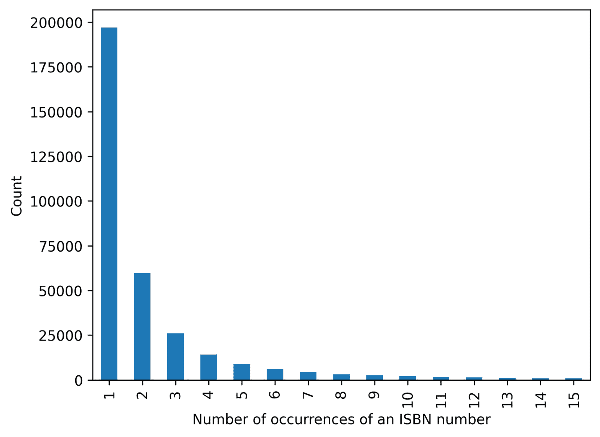
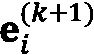

# 第十七章：使用 LightGCN 构建推荐系统

推荐系统已成为现代在线平台的不可或缺的一部分，旨在根据用户的兴趣和过去的互动提供个性化推荐。这些系统可以在多种应用中找到，包括在电子商务网站上推荐购买的产品，在流媒体服务中推荐观看的内容，以及在社交媒体平台上推荐建立联系的对象。

推荐系统是 GNN 的主要应用之一。事实上，它们可以有效地将用户、项目及其互动之间的复杂关系整合到一个统一的模型中。此外，图结构还允许在推荐过程中融入附加信息，例如用户和项目的元数据。

本章将介绍一种新的 GNN 架构，名为`Book-Crossing`数据集，该数据集包含用户、书籍以及超过百万条评分。利用该数据集，我们将构建一个基于协同过滤的书籍推荐系统，并应用它为特定用户提供推荐。通过这一过程，我们将展示如何使用 LightGCN 架构构建一个实用的推荐系统。

本章结束时，你将能够使用 LightGCN 创建自己的推荐系统。你将学习如何处理包含用户、项目和评分的数据集，以实现协同过滤方法。最后，你将学习如何实现和评估该架构，并为个别用户提供推荐。

本章将覆盖以下主要内容：

+   探索 Book-Crossing 数据集

+   预处理 Book-Crossing 数据集

+   实现 LightGCN 架构

# 技术要求

本章的所有代码示例都可以在 GitHub 上找到，地址是[`github.com/PacktPublishing/Hands-On-Graph-Neural-Networks-Using-Python/tree/main/Chapter17`](https://github.com/PacktPublishing/Hands-On-Graph-Neural-Networks-Using-Python/tree/main/Chapter17)。运行代码所需的安装步骤可以在本书的*前言*中找到。

本章需要大量的 GPU 资源。你可以通过减少代码中训练集的大小来降低需求。

# 探索 Book-Crossing 数据集

本节中，我们将对一个新的数据集进行探索性数据分析，并可视化其主要特征。

`Book-Crossing`数据集[1]是由 278,858 名用户提供的书籍评分集合，来自*BookCrossing 社区*（[www.bookcrossing.com](http://www.bookcrossing.com)）。这些评分既有显式的（1 到 10 之间的评分），也有隐式的（用户与书籍的互动），总计 1,149,780 条，涉及 271,379 本书。该数据集由 Cai-Nicolas Ziegler 于 2004 年 8 月和 9 月的四周爬取收集。我们将在本章中使用`Book-Crossing`数据集来构建一个书籍推荐系统。

让我们使用以下命令下载数据集并解压：

```py
from io import BytesIO
from urllib.request import urlopen
from zipfile import ZipFile
url = 'http://www2.informatik.uni-freiburg.de/~cziegler/BX/BX-CSV-Dump.zip'
with urlopen(url) as zurl:
    with ZipFile(BytesIO(zurl.read())) as zfile:
        zfile.extractall('.')
```

这将解压出三个文件：

+   `BX-Users.csv` 文件包含单个 BookCrossing 用户的数据。用户 ID 已被匿名处理，表示为整数。一些用户的 demographic 信息，如所在地和年龄，也被包括在内。如果这些信息不可用，相应的字段将包含 `NULL` 值。

+   `BX-Books.csv` 文件包含数据集中的书籍信息，通过 ISBN 进行标识。无效的 ISBN 已从数据集中删除。除了书籍标题、作者、出版年份和出版社等内容相关信息外，此文件还包括指向三种不同大小封面图像的书籍链接 URL。

+   `BX-Book-Ratings.csv` 文件包含有关数据集中书籍评分的信息。评分可以是显式的，采用 1 到 10 的等级，较高的值表示更高的评价；或者是隐式的，用 0 表示评分。

下图是使用 Gephi 制作的图形表示，采用了数据集的一个子样本。


图 17.1 – Book-Crossing 数据集的图形表示，书籍表示为蓝色节点，用户表示为红色节点

节点的大小与图中的连接数量（度数）成比例。我们可以看到像 **达·芬奇密码** 这样的热门书籍，它们由于连接数高而充当了枢纽。

现在，让我们探索数据集，获取更多的洞察：

1.  我们导入 `pandas` 并加载每个文件，使用 `;` 分隔符和 `latin-1` 编码，以解决兼容性问题。`BX-Books.csv` 文件还需要 `error_bad_lines` 参数：

    ```py
    import pandas as pd
    ratings = pd.read_csv('BX-Book-Ratings.csv', sep=';', encoding='latin-1')
    users = pd.read_csv('BX-Users.csv', sep=';', encoding='latin-1')
    books = pd.read_csv('BX-Books.csv', sep=';', encoding='latin-1', error_bad_lines=False)
    ```

1.  让我们打印这些数据框，以查看列和行数：

    ```py
    ratings
               User-ID    ISBN            Book-Rating
    0          276725     034545104X      0
    1          276726     0155061224      5
    ...        ...        ...             ...
    1149777    276709     0515107662      10
    1149778    276721     0590442449      10
    1149779    276723     05162443314     8
    1149780 rows × 3 columns
    ```

1.  让我们重复这个过程，使用 `users` 数据框：

    ```py
    users
    User-ID         Location                         Age
    0       1       nyc, new york, usa               NaN
    1       2       stockton, california, usa        18.0
    2       3       moscow, yukon territory, russia  NaN
    ...     ...     ...                              ...
    278855  278856  brampton, ontario, canada        NaN
    278856  278857  knoxville, tennessee, usa  NaN
    278857  278858  dublin, n/a, ireland  NaN
    278858 rows × 3 columns
    ```

1.  最后，`books` 数据框包含的列太多，无法像另外两个数据框那样打印出来。我们可以改为打印列名：

    ```py
    list(books.columns)
    ['ISBN', 'Book-Title', 'Book-Author', 'Year-Of-Publication', 'Publisher', 'Image-URL-S', 'Image-URL-M', 'Image-URL-L']
    ```

`ratings` 数据框通过 `User-ID` 和 `ISBN` 信息连接了 `users` 和 `books` 数据框，并包含评分，这可以视为一种权重。`users` 数据框包含每个用户的 demographic 信息，如所在地和年龄（如果有的话）。`books` 数据框包含关于书籍的内容相关信息，如书名、作者、出版年份、出版社以及链接到三种不同大小封面图像的 URL。

1.  让我们可视化评分分布，以查看是否能利用这些信息。我们可以使用 `matplotlib` 和 `seaborn` 按如下方式绘制：

    ```py
    import matplotlib.pyplot as plt
    import seaborn as sns
    sns.countplot(x=ratings['Book-Rating'])
    ```

1.  这为我们提供了以下图表：


图 17.2 – 评分分布（与一本书的互动表现为评分为零，而 1 到 10 之间的评分为真实评分）

1.  这些评分是否与我们在 `books` 和 `users` DataFrame 中的数据相对应？我们可以通过比较 `ratings` 中的唯一 `User-ID` 和 `ISBN` 条目的数量与这些 DataFrame 中行数的差异，快速检查：

    ```py
    print(len(ratings['User-ID'].unique()))
    print(len(ratings['ISBN'].unique()))
    105283
    340556
    ```

有趣的是，与 `users`（105,283 与 278,858）相比，`ratings` 中的独立用户较少，但与 `books`（340,556 与 271,379）相比，独立 ISBN 数量更多。这意味着我们的数据库缺失了很多数据，因此在连接表时需要特别小心。

1.  最后，我们绘制仅被评分一次、两次等次数的书籍数量。首先，我们使用 `groupby()` 和 `size()` 函数计算每本 ISBN 在 `ratings` DataFrame 中出现的次数：

    ```py
    isbn_counts = ratings.groupby('ISBN').size()
    ```

这创建了一个新的 DataFrame，`isbn_counts`，它包含了每个独立 ISBN 在 `ratings` DataFrame 中的计数。

1.  我们使用 `value_counts()` 函数计算每个计数值的出现次数。这个新的 DataFrame 将包含 `isbn_counts` 中每个计数值的出现次数。

    ```py
    count_occurrences = isbn_counts.value_counts()
    ```

1.  最后，我们可以使用 `pandas` 的 `.plot()` 方法绘制分布图。在这种情况下，我们只绘制前 15 个值：

    ```py
    count_occurrences[:15].plot(kind='bar')
    plt.xlabel("Number of occurrences of an ISBN number")
    plt.ylabel("Count")
    ```

1.  我们得到以下图表：



图 17.3 – 每本书（ISBN）在评分中出现次数的分布（前 15 个值）

我们看到许多书籍只被评分一次或两次。看到评分很多次的书籍非常罕见，这使得我们的任务更加困难，因为我们依赖于这些连接。

1.  我们重复相同的过程，以获取每个用户（`User-ID`）在 `ratings` 中出现次数的分布：

    ```py
    userid_counts = ratings.groupby('User-ID').size()
    count_occurrences = userid_counts.value_counts()
    count_occurrences[:15].plot(kind='bar')
    plt.xlabel("Number of occurrences of a User-ID")
    plt.ylabel("Count")
    ```

1.  我们得到了一个类似的分布：


图 17.4 – 每个用户（用户 ID）在评分中出现次数的分布（前 15 个值）

这也意味着大多数用户只评分一两本书，但有少数用户评分了很多书。

该数据集存在一些问题，如出版年份或出版商名称的错误，以及其他缺失或不正确的值。然而，在本章中，我们不会直接使用 `books` 和 `users` DataFrame 中的元数据。我们将依赖 `User-ID` 和 `ISBN` 值之间的连接，因此不需要在这里清理数据集。

在下一节中，我们将看到如何处理数据集，为将其输入到 LightGCN 做准备。

# 预处理 Book-Crossing 数据集

我们希望处理数据集以完成特定任务：推荐物品，具体来说是使用**协同过滤**方法。协同过滤是一种用于向用户提供个性化推荐的技术。它基于这样一个观点：具有相似偏好或行为的用户更有可能有相似的兴趣。协同过滤算法利用这些信息识别模式，并基于相似用户的偏好向用户做出推荐。

这与基于内容的过滤不同，基于内容的过滤是一种依赖于推荐物品特征的推荐方法。它通过识别物品的特征并将其与用户过去喜欢的其他物品的特征进行匹配，从而生成推荐。**基于内容的过滤**方法通常基于这样一个观点：如果用户喜欢具有某些特征的物品，那么他们也会喜欢具有相似特征的物品。

在本章中，我们将重点讨论协同过滤。我们的目标是根据其他用户的偏好来确定推荐给用户的书籍。这个问题可以通过二分图来表示，如下图所示。


图 17.5 – 用户-物品二分图示例

知道用户**1**喜欢物品**A**和**B**，用户**3**喜欢物品**B**和**D**，我们应该推荐物品**B**给用户**2**，他也喜欢物品**A**和**D**。

这是我们希望从`Book-Crossing`数据集中构建的图类型。更准确地说，我们还希望包括负样本。在这种情况下，负样本指的是给定用户未评分的物品。已经评分的物品被称为正样本。我们将在实现`loss`函数时解释为什么使用这种负采样技术。

在本章的其余部分，`LightGCN`代码主要基于官方实现以及 Hotta 和 Zhou [2]以及 Li 等人[3]在不同数据集上出色的工作：

1.  我们导入以下库：

    ```py
    import numpy as np
    from sklearn.model_selection import train_test_split
    import torch
    import torch.nn.functional as F
    from torch import nn, optim, Tensor
    from torch_geometric.utils import structured_negative_sampling
    from torch_geometric.nn.conv.gcn_conv import gcn_norm
    from torch_geometric.nn import LGConv
    ```

1.  我们重新加载数据集：

    ```py
    df = pd.read_csv('BX-Book-Ratings.csv', sep=';', encoding='latin-1')
    users = pd.read_csv('BX-Users.csv', sep=';', encoding='latin-1')
    books = pd.read_csv('BX-Books.csv', sep=';', encoding='latin-1', error_bad_lines=False)
    ```

1.  我们只保留在`books`数据框中可以找到`ISBN`信息和在`users`数据框中可以找到`User-ID`信息的行：

    ```py
    df = df.loc[df['ISBN'].isin(books['ISBN'].unique()) & df['User-ID'].isin(users['User-ID'].unique())]
    ```

1.  我们只保留高评分（>= 8/10），因此我们创建的连接对应于用户喜欢的书籍。然后，我们进一步筛选样本，只保留有限数量的行（100,000）以加快训练速度：

    ```py
    df = df[df['Book-Rating'] >= 8].iloc[:100000]
    ```

1.  我们创建`user`和`item`标识符到整数索引的映射：

    ```py
    user_mapping = {userid: i for i, userid in enumerate(df['User-ID'].unique())}
    item_mapping = {isbn: i for i, isbn in enumerate(df['ISBN'].unique())}
    ```

1.  我们统计数据集中的用户数、物品数和总实体数：

    ```py
    num_users = len(user_mapping)
    num_items = len(item_mapping)
    num_total = num_users + num_items
    ```

1.  我们基于数据集中的用户评分创建`user`和`item`索引的张量。通过堆叠这两个张量来创建`edge_index`张量：

    ```py
    user_ids = torch.LongTensor([user_mapping[i] for i in df['User-ID']])
    item_ids = torch.LongTensor([item_mapping[i] for i in df['ISBN']])
    edge_index = torch.stack((user_ids, item_ids))
    ```

1.  我们使用 `scikit-learn` 中的 `train_test_split()` 函数将 `edge_index` 分割为训练集、验证集和测试集：

    ```py
    train_index, test_index = train_test_split(range(len(df)), test_size=0.2, random_state=0)
    val_index, test_index = train_test_split(test_index, test_size=0.5, random_state=0)
    ```

1.  我们使用 `np.random.choice()` 函数生成一个随机索引批次。该函数从 `0` 到 `edge_index.shape[1]-1` 的范围内生成 `BATCH_SIZE` 个随机索引。这些索引将用于从 `edge_index` 张量中选择行：

    ```py
    def sample_mini_batch(edge_index):
        index = np.random.choice(range(edge_index.shape[1]), size=BATCH_SIZE)
    ```

1.  我们使用 PyTorch Geometric 中的 `structured_negative_sampling()` 函数生成负样本。负样本是用户未与之交互的项。我们使用 `torch.stack()` 函数在开头添加一个维度：

    ```py
        edge_index = structured_negative_sampling(edge_index)
        edge_index = torch.stack(edge_index, dim=0)
    ```

1.  我们使用 `index` 数组和 `edge_index` 张量选择该批次的用户、正样本项和负样本项索引：

    ```py
        user_index = edge_index[0, index]
        pos_item_index = edge_index[1, index]
        neg_item_index = edge_index[2, index]
        return user_index, pos_item_index, neg_item_index
    ```

`user_index` 张量包含该批次的用户索引，`pos_item_index` 张量包含该批次的正样本项索引，`neg_item_index` 张量包含该批次的负样本项索引。

现在，我们有三组数据和一个返回小批量数据的函数。接下来的步骤是理解并实现 LightGCN 架构。

# 实现 LightGCN 架构

LightGCN [4] 架构旨在通过图上的特征平滑来学习节点的表示。它通过图卷积反复执行，其中相邻节点的特征被聚合为目标节点的新表示。整个架构概述见 *图 17.6*。


图 17.6 – 带有卷积和层组合的 LightGCN 模型架构

然而，`LightGCN` 采用了简单的加权和聚合器，而不是像 GCN 或 GAT 等其他模型中使用的特征变换或非线性激活。轻量级图卷积操作计算  处的用户和项嵌入  和 ，计算方式如下：


对称归一化项确保嵌入的尺度不会随着图卷积操作而增加。与其他模型不同，`LightGCN` 仅聚合连接的邻居节点，并不包含自连接。

实际上，它通过使用层组合操作来实现相同的效果。这个机制由每层使用用户和项嵌入的加权和组成。它通过以下方程式产生最终的嵌入  和 ：


这里，第  层的贡献由变量  加权。`LightGCN` 的作者建议将其设置为 。

*图 17.6*中显示的预测对应于评分或排名分数。它是通过用户和项目最终表示的内积得到的：


现在让我们在 PyTorch Geometric 中实现这个架构：

1.  我们创建一个带有四个参数的`LightGCN`类：`num_users`、`num_items`、`num_layers`和`dim_h`。`num_users`和`num_items`参数分别指定数据集中用户和项目的数量。`num_layers`表示将使用的`LightGCN`层的数量，而`dim_h`参数指定嵌入向量的大小（适用于用户和项目）：

    ```py
    class LightGCN(nn.Module):
        def __init__(self, num_users, num_items, num_layers=4, dim_h=64):
            super().__init__()
    ```

1.  我们存储用户和项目的数量，并创建用户和项目的嵌入层。`emb_users`或的形状是，而`emb_items`或的形状是：

    ```py
            self.num_users = num_users
            self.num_items = num_items
            self.emb_users = nn.Embedding(num_embeddings=self.num_users, embedding_dim=dim_h)
            self.emb_items = nn.Embedding(num_embeddings=self.num_items, embedding_dim=dim_h)
    ```

1.  我们使用 PyTorch Geometric 的`LGConv()`创建一个包含`num_layers`（之前称为）个`LightGCN`层的列表。这将用于执行轻量图卷积操作：

    ```py
            self.convs = nn.ModuleList(LGConv() for _ in range(num_layers))
    ```

1.  我们通过标准差为`0.01`的正态分布初始化用户和项目嵌入层。这有助于防止模型在训练时陷入较差的局部最优解：

    ```py
            nn.init.normal_(self.emb_users.weight, std=0.01)
            nn.init.normal_(self.emb_items.weight, std=0.01)
    ```

1.  `forward()`方法接收一个边索引张量，并返回最终的用户和项目嵌入向量， 和 。它首先将用户和项目的嵌入层拼接在一起，并将结果存储在`emb`张量中。然后，它创建一个列表`embs`，将`emb`作为其第一个元素：

    ```py
        def forward(self, edge_index):
            emb = torch.cat([self.emb_users.weight, self.emb_items.weight])
            embs = [emb]
    ```

1.  然后，我们在一个循环中应用`LightGCN`层，并将每一层的输出存储在`embs`列表中：

    ```py
            for conv in self.convs:
                emb = conv(x=emb, edge_index=edge_index)
                embs.append(emb)
    ```

1.  我们通过计算`embs`列表中张量在第二维度上的均值来执行层组合，从而得到最终的嵌入向量：

    ```py
    emb_final = torch.mean(torch.stack(embs, dim=1), dim=1)
    ```

1.  我们将`emb_final`拆分为用户和项目嵌入向量（ 和 ），并与 和 一起返回：

    ```py
            emb_users_final, emb_items_final = torch.split(emb_final, [self.num_users, self.num_items])
            return emb_users_final, self.emb_users.weight, emb_items_final, self.emb_items.weight
    ```

1.  最终，通过调用具有适当参数的`LightGCN()`类来创建模型：

    ```py
    model = LightGCN(num_users, num_items)
    ```

在我们可以训练模型之前，我们需要一个损失函数。`LightGCN`架构采用**贝叶斯个性化排序**（**BPR**）损失，该损失优化模型在给定用户的情况下，将正项排在负项之前的能力。实现如下：


这里，是第层的嵌入矩阵（即初始用户和项目嵌入的连接），表示正则化强度，对应于正项的预测评分，代表负项的预测评分。

我们使用以下函数在 PyTorch 中实现它：

1.  我们根据存储在`LightGCN`模型中的嵌入计算正则化损失：

    ```py
    def bpr_loss(emb_users_final, emb_users, emb_pos_items_final, emb_pos_items, emb_neg_items_final, emb_neg_items):
        reg_loss = LAMBDA * (emb_users.norm().pow(2) +
                            emb_pos_items.norm().pow(2) +
                            emb_neg_items.norm().pow(2))
    ```

1.  我们计算正项和负项的评分，即用户嵌入和项目嵌入之间的点积：

    ```py
        pos_ratings = torch.mul(emb_users_final, emb_pos_items_final).sum(dim=-1)
        neg_ratings = torch.mul(emb_users_final, emb_neg_items_final).sum(dim=-1)
    ```

1.  与之前公式中的对数 sigmoid 不同，我们将 BPR 损失计算为应用于正负评分差异的`softplus`函数的均值。选择这个变体是因为它给出了更好的实验结果：

    ```py
        bpr_loss = torch.mean(torch.nn.functional.softplus(pos_ratings - neg_ratings))
    ```

1.  我们返回 BPR 损失和正则化损失，如下所示：

    ```py
        return -bpr_loss + reg_loss
    ```

除了 BPR 损失外，我们使用两个指标来评估模型的表现：

+   **Recall@k**是所有可能相关项中，前*k*项中相关推荐项的比例。然而，这个指标不考虑相关项在前*k*中的顺序：


+   **归一化折扣累积增益**（**NDGC**）衡量系统在排序推荐中的有效性，考虑到项目的相关性，其中相关性通常由分数或二进制相关性（相关或不相关）表示。

该实现未包含在本章中，以提高可读性。然而，它可以在 GitHub 仓库中找到，连同其余的代码一起。

我们现在可以创建一个训练循环，并开始训练`LightGCN`模型：

1.  我们定义了以下常数。它们可以作为超参数进行调整，以提高模型性能：

    ```py
    K = 20
    LAMBDA = 1e-6
    BATCH_SIZE = 1024
    ```

1.  我们尝试选择一个 GPU，如果有的话。否则，我们使用 CPU。模型和数据会被移动到这个设备上：

    ```py
    device = torch.device('cuda' if torch.cuda.is_available() else 'cpu')
    model = model.to(device)
    edge_index = edge_index.to(device)
    train_edge_index = train_edge_index.to(device)
    val_edge_index = val_edge_index.to(device)
    ```

1.  我们创建一个学习率为`0.001`的`Adam`优化器：

    ```py
    optimizer = optim.Adam(model.parameters(), lr=0.001)
    ```

1.  让我们开始训练循环。首先，我们计算`num_batch`，即每个周期中的`BATCH_SIZE`批次数。然后，我们创建两个循环：一个是 31 个周期，另一个是`num_batch`的长度：

    ```py
    num_batch = int(len(train_index)/BATCH_SIZE)
    for epoch in range(31):
        model.train()
        for _ in range(num_batch):
    ```

1.  模型在训练数据上运行，并返回初始和最终的用户和项目嵌入：

    ```py
            optimizer.zero_grad()
            emb_users_final, emb_users, emb_items_final, emb_items = model.forward(train_edge_index)
    ```

1.  训练数据然后通过`sample_mini_batch()`函数按小批量进行采样，该函数返回采样的用户、正项和负项嵌入的索引：

    ```py
            user_indices, pos_item_indices, neg_item_indices = sample_mini_batch(train_edge_index)
    ```

1.  然后检索采样的用户、正项和负项的嵌入：

    ```py
        emb_users_final, emb_users = emb_users_final[user_indices], emb_users[user_indices]
        emb_pos_items_final, emb_pos_items = emb_items_final[pos_item_indices], emb_items[pos_item_indices]
        emb_neg_items_final, emb_neg_items = emb_items_final[neg_item_indices], emb_items[neg_item_indices]
    ```

1.  然后使用`bpr_loss()`函数计算损失：

    ```py
        train_loss = bpr_loss(emb_users_final, emb_users, emb_pos_items_final, emb_pos_items, emb_neg_items_final, emb_neg_items)
    ```

1.  然后使用优化器执行反向传播，并更新模型参数：

    ```py
        train_loss.backward()
        optimizer.step()
    ```

1.  模型的性能每 250 个周期在验证集上使用`test()`函数进行评估。评估指标会被打印出来：

    ```py
        if epoch % 5 == 0:
            model.eval()
            val_loss, recall, ndcg = test(model, val_edge_index, [train_edge_index])
            print(f"Epoch {epoch} | Train loss: {train_loss.item():.5f} | Val loss: {val_loss:.5f} | Val recall@{K}: {recall:.5f} | Val ndcg@{K}: {ndcg:.5f}")
    ```

1.  这给出了以下输出：

    ```py
    Epoch 0 | Train loss: -0.69320 | Val loss: -0.69302 | Val recall@20: 0.00700 | Val ndcg@20: 0.00388
    Epoch 5 | Train loss: -0.70283 | Val loss: -0.68329 | Val recall@20: 0.01159 | Val ndcg@20: 0.00631
    Epoch 10 | Train loss: -0.73299 | Val loss: -0.64598 | Val recall@20: 0.01341 | Val ndcg@20: 0.00999
    ...
    Epoch 25 | Train loss: -1.53056 | Val loss: -0.19498 | Val recall@20: 0.01507 | Val ndcg@20: 0.01016
    Epoch 30 | Train loss: -1.95703 | Val loss: 0.06340 | Val recall@20: 0.01410 | Val ndcg@20: 0.00950
    ```

1.  我们如下评估模型在测试集上的表现：

    ```py
    test_loss, test_recall, test_ndcg = test(model, test_edge_index.to(device), [train_edge_index, val_edge_index])
    print(f"Test loss: {test_loss:.5f} | Test recall@{K}: {test_recall:.5f} | Test ndcg@{K}: {test_ndcg:.5f}")
    Test loss: 0.06827 | Test recall@20: 0.01936 | Test ndcg@20: 0.01119
    ```

我们获得了`recall@20`值为`0.01936`和`ndcg@20`值为`0.01119`，这一结果接近`LightGCN`的作者在其他数据集上得到的结果。

现在模型已经训练完成，我们想为给定用户获取推荐。我们想要创建的推荐函数包含两个部分：

1.  首先，我们要获取一个用户喜欢的书籍列表。这将帮助我们为自己的理解提供推荐的背景信息。

1.  其次，我们要生成一个推荐书单。这些推荐不能是用户已经评分的书籍（即不能是正向项）。

让我们一步一步编写这个函数：

1.  我们创建一个名为`recommend`的函数，该函数接受两个参数：`user_id`（用户标识符）和`num_recs`（我们想要生成的推荐数量）：

    ```py
    def recommend(user_id, num_recs):
    ```

1.  我们通过查找用户标识符在`user_mapping`字典中的位置来创建`user`变量，该字典将用户 ID 映射到整数索引：

    ```py
        user = user_mapping[user_id]
    ```

1.  我们检索`LightGCN`模型为该特定用户学到的`dim_h`维向量：

    ```py
        emb_user = model.emb_users.weight[user]
    ```

1.  我们可以用它来计算相应的评分。如前所述，我们使用`LightGCN`的`emb_items`属性中的所有项目的嵌入与`emb_user`变量的点积来计算评分：

    ```py
        ratings = model.emb_items.weight @ emb_user
    ```

1.  我们将`topk()`函数应用于`ratings`张量，该函数返回前 100 个值（模型计算的评分）及其相应的索引：

    ```py
        values, indices = torch.topk(ratings, k=100)
    ```

1.  让我们获取该用户喜欢的书籍列表。我们通过过滤`indices`列表，只保留在给定用户的`user_items`字典中出现的书籍，创建一个新的索引列表。换句话说，我们只保留该用户评分的书籍。然后，我们对该列表进行切片，只保留前`num_recs`个条目：

    ```py
        ids = [index.cpu().item() for index in indices if index in user_items[user]][:num_recs]
    ```

1.  我们将这些书籍 ID 转换为 ISBN：

    ```py
        item_isbns = [list(item_mapping.keys())[list(item_mapping.values()).index(book)] for book in ids]
    ```

1.  现在，我们可以使用这些 ISBN 来获取书籍的更多信息。在这里，我们想获取书籍的标题和作者，以便打印出来：

    ```py
        titles = [bookid_title[id] for id in item_isbns]
        authors = [bookid_author[id] for id in item_isbns]
    ```

1.  我们如下打印这些信息：

    ```py
        print(f'Favorite books from user n°{user_id}:')
        for i in range(len(item_isbns)):
            print(f'- {titles[i]}, by {authors[i]}')
    ```

1.  我们重复这个过程，但使用用户未评分的书籍 ID（`not` `in user_pos_items[user]`）：

    ```py
        ids = [index.cpu().item() for index in indices if index not in user_pos_items[user]][:num_recs]
        item_isbns = [list(item_mapping.keys())[list(item_mapping.values()).index(book)] for book in ids]
        titles = [bookid_title[id] for id in item_isbns]
        authors = [bookid_author[id] for id in item_isbns]
        print(f'\nRecommended books for user n°{user_id}')
        for i in range(num_recs):
            print(f'- {titles[i]}, by {authors[i]}')
    ```

1.  让我们为我们数据库中的一个用户获取`5`个推荐。我们使用`277427`：

    ```py
    recommend(277427, 5)
    ```

1.  这是我们得到的输出：

    ```py
    Favorite books from user n°277427:
    - The Da Vinci Code, by Dan Brown
    - Lord of the Flies, by William Gerald Golding
    - The Cardinal of the Kremlin (Jack Ryan Novels), by Tom Clancy
    - Into the Wild, by Jon Krakauer
    Recommended books for user n°277427
    - The Lovely Bones: A Novel, by Alice Sebold
    - The Secret Life of Bees, by Sue Monk Kidd
    - The Red Tent (Bestselling Backlist), by Anita Diamant
    - Harry Potter and the Sorcerer's Stone (Harry Potter (Paperback)), by J. K. Rowling
    - To Kill a Mockingbird, by Harper Lee
    ```

现在，我们可以从原始`df`数据框中为任何用户生成推荐。你可以测试其他 ID 并查看它如何改变推荐结果。

# 总结

本章详细探讨了如何使用`LightGCN`进行书籍推荐任务。我们使用了`Book-Crossing`数据集，对其进行了预处理，形成了一个二分图，并实现了一个带有 BPR 损失的`LightGCN`模型。我们训练了该模型，并使用`recall@20`和`ndcg@20`指标进行了评估。通过为给定用户生成推荐，我们展示了该模型的有效性。

总的来说，本章提供了关于在推荐任务中使用 `LightGCN` 模型的宝贵见解。它是一种最先进的架构，性能优于更复杂的模型。你可以通过尝试我们在前几章讨论的其他技术来扩展这个项目，例如矩阵分解和 `node2vec`。

# 进一步阅读

+   [1] C.-N. Ziegler, S. M. McNee, J. A. Konstan, 和 G. Lausen, *通过主题多样化改进推荐列表*, 载于 *第十四届国际万维网会议论文集*, 2005, 页码 22–32\. doi: 10.1145/1060745.1060754\. 可获取: [`dl.acm.org/doi/10.1145/1060745.1060754`](https://dl.acm.org/doi/10.1145/1060745.1060754)

+   [2] D. Li, P. Maldonado, A. Sbaih, *使用 GNN 的推荐系统在 PyG 中的实现*, *斯坦福 CS224W 图形机器学习教程*, 2022\. 可获取: [`medium.com/stanford-cs224w/recommender-systems-with-gnns-in-pyg-d8301178e377`](https://medium.com/stanford-cs224w/recommender-systems-with-gnns-in-pyg-d8301178e377)

+   [3] X. He, K. Deng, X. Wang, Y. Li, Y. Zhang, 和 M. Wang, *LightGCN: 简化并增强图卷积网络用于推荐系统的能力*. arXiv, 2020\. doi: 10.48550/ARXIV.2002.02126\. 可获取: [`arxiv.org/abs/2002.02126`](https://arxiv.org/abs/2002.02126)

+   [4] H. Hotta 和 A. Zhou, *使用 PyTorch Geometric 实现 LightGCN*. *斯坦福 CS224W 图形机器学习教程*, 2022\. 可获取: [`medium.com/stanford-cs224w/lightgcn-with-pytorch-geometric-91bab836471e`](https://medium.com/stanford-cs224w/lightgcn-with-pytorch-geometric-91bab836471e)
