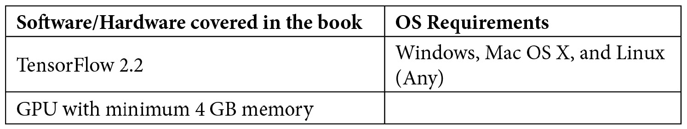

# 前言

任何足够先进的技术都无法与魔法区分开来。

——亚瑟·C·克拉克

这句话最能描述使用**人工****智能**（**AI**）进行图像生成的过程。深度学习——作为人工智能的一个子集——在过去十年中发展迅速。现在，我们可以生成与真实人脸无法区分的人工人脸，并且能将简单的笔触转化为逼真的画作。这些能力大多归功于一种深度神经网络，称为**生成****对抗****网络**（**GAN**）。通过这本动手实践的书籍，你不仅将开发图像生成技能，还能深入理解背后的原理。

本书从使用 TensorFlow 生成图像的基本原理开始，涵盖了变分自编码器和生成对抗网络（GAN）。随着章节的进展，你将学习如何为不同的应用构建模型，包括使用深度伪造技术进行换脸、神经风格迁移、图像到图像的转换、将简单图像转化为逼真的图像等。你还将了解如何以及为什么使用先进的技术，如谱归一化和自注意力层，来构建最先进的深度神经网络，然后再使用这些技术处理面部生成和编辑的高级模型。本书还将介绍照片修复、文本到图像的合成、视频重新定向和神经渲染等内容。在整个书籍中，你将学习如何从零开始在 TensorFlow 2.x 中实现模型，包括 PixelCNN、VAE、DCGAN、WGAN、pix2pix、CycleGAN、StyleGAN、GauGAN 和 BigGAN。

本书结束时，你将熟练掌握 TensorFlow 和图像生成技术。

# 本书适合的人群

本书面向具有卷积神经网络基础知识的深度学习工程师、从业者和研究人员，旨在帮助你使用 TensorFlow 2.x 学习各种图像生成技术。如果你是图像处理专业人士或计算机视觉工程师，想要探索最先进的架构以改善和增强图像和视频，本书对你也非常有用。为了从本书中获得最大收益，要求你具备 Python 和 TensorFlow 的知识。

# 如何使用本书

网上有很多教程教授 GAN 的基础知识。然而，这些模型通常较为简单，仅适用于玩具数据集。在另一端，也有一些免费的代码可供生成逼真图像的最先进模型使用。然而，这些代码往往复杂，且缺乏解释，使得初学者很难理解。许多下载代码的“Git 克隆者”根本不知道如何调整模型以使其适用于自己的应用。本书旨在弥补这一差距。

我们将从学习基本原理开始，并立即实现代码来验证它们。你将能够即时看到你的工作成果。构建模型所需的所有代码都展示在一个 Jupyter notebook 中。这是为了让你更容易理解代码流程，并以交互方式修改和测试代码。我相信从头开始编写代码是学习和掌握深度学习的最佳方式。每一章包含一到三个模型，我们将从零开始编写所有这些模型。完成本书后，你不仅会熟悉图像生成，还将成为 TensorFlow 2 的专家。

各章节大致按 GAN 历史的时间顺序排列，每一章的内容可能会建立在前一章的知识基础上。因此，最好按顺序阅读这些章节，特别是前面三章，它们涵盖了基础知识。之后，你可以跳到自己感兴趣的章节。如果在阅读过程中对缩写感到困惑，可以参考最后一章中列出的 GAN 技术总结。

# 本书内容概览

*第一章*，*使用 TensorFlow 进行图像生成入门*，讲解了像素概率的基础知识，并利用它来构建我们第一个生成手写数字的模型。

*第二章*，*变分自编码器*，讲解了如何构建**变分自编码器**（**VAE**），并使用它来生成和编辑面部图像。

*第三章*，*生成对抗网络*，介绍了 GAN 的基本原理，并构建了一个 DCGAN 来生成逼真的图像。然后我们将学习新的对抗性损失函数，以稳定训练过程。

*第四章*，*图像到图像的转换*，涵盖了许多模型和有趣的应用。我们将首先实现 pix2pix，将素描转换为逼真的照片。接着我们将使用 CycleGAN 将马变成斑马。最后，我们将使用 BicycleGAN 生成各种鞋子。

*第五章*，*风格迁移*，解释了如何从一幅画中提取风格并将其转移到照片上。我们还将学习一些先进的技术，以加速神经风格迁移的运行速度，并将其应用于最前沿的 GANs。

*第六章*，*AI 绘画师*，讲解了使用 **交互式 GAN**（**iGAN**）作为示例的图像编辑和变换的基本原理。接着我们将构建一个 GauGAN，从简单的分割图生成逼真的建筑外立面。

*第七章*，*高保真面部生成*，展示了如何利用风格迁移技术构建 StyleGAN。然而，在此之前，我们将学习如何使用渐进式 GAN 逐步增加网络层。

*第八章*，*图像生成中的自注意力*，展示了如何将自注意力机制构建到 **自注意力 GAN**（**SAGAN**）和 BigGAN 中，用于条件图像生成。

*第九章*，*视频合成*，演示了如何使用自编码器创建深度伪造视频。在此过程中，我们将学习如何使用 OpenCV 和 dlib 进行面部处理。

*第十章*，*前路*，回顾并总结了我们所学的生成技术。接着，我们将探讨它们如何作为即将到来的应用的基础，包括文本到图像合成、视频压缩和视频重定向。

# 为了最大限度地利用本书

读者应具备深度学习训练管道的基本知识，如训练卷积神经网络进行图像分类。本书将主要使用 TensorFlow 2 中的高级 Keras API，这些 API 容易学习。如果你需要刷新或学习 TensorFlow 2，有许多免费的在线教程可供参考，如官方 TensorFlow 网站上的教程：[`www.tensorflow.org/tutorials/keras/classification`](https://www.tensorflow.org/tutorials/keras/classification)。



训练深度神经网络需要大量的计算资源。你可以仅使用 CPU 来训练前几个简单的模型。然而，随着我们进入后续章节，更复杂的模型和数据集，模型训练可能需要几天时间才能看到满意的结果。为了最大限度地利用本书，你应该有 GPU 来加速模型训练时间。也有一些免费的云服务，比如 Google 的 Colab，提供 GPU，你可以在其上上传并运行代码。

**如果你使用的是本书的数字版，我们建议你自己输入代码或通过 GitHub 仓库访问代码（链接将在下一节提供）。这样可以帮助你避免复制粘贴代码时可能出现的任何错误。**

# 下载示例代码文件

你可以从 GitHub 下载本书的示例代码文件，链接：[`github.com/PacktPublishing/Hands-On-Image-Generation-with-TensorFlow-2.0`](https://github.com/PacktPublishing/Hands-On-Image-Generation-with-TensorFlow-2.0)。如果代码有更新，它将会在现有的 GitHub 仓库中进行更新。

我们还有其他代码包，来自我们丰富的书籍和视频目录，可以在 [`github.com/PacktPublishing/`](https://github.com/PacktPublishing/) 获取。快来看看吧！

# 下载彩色图像

我们还提供了一份 PDF 文件，包含本书中使用的截图/图表的彩色图片。你可以在这里下载：[`static.packt-cdn.com/downloads/9781838826789_ColorImages.pdf`](https://static.packt-cdn.com/downloads/9781838826789_ColorImages.pdf)。

# 使用的约定

本书中使用了若干文本约定。

`文本中的代码`：表示文本中的代码词、数据库表名、文件夹名、文件名、文件扩展名、路径名、虚拟网址、用户输入和推特用户名。以下是一个例子：“这是通过`tf.gather(self.beta, labels)`完成的，概念上等同于`beta = self.beta[labels]`，如下所示。”

一段代码如下所示：

```py
attn = tf.matmul(theta, phi, transpose_b=True)attn = tf.nn.softmax(attn)
```

当我们希望引起你对代码块中特定部分的注意时，相关的行或项会以粗体显示：

```py
self.conv_theta = Conv2D(c//8, 1, padding='same',              	                   kernel_constraint=SpectralNorm(),  	 	                   name='Conv_Theta')
```

任何命令行输入或输出都以以下方式书写：

```py
$ mkdir css
$ cd css
```

**粗体**：表示新术语、重要单词或你在屏幕上看到的单词。例如，菜单或对话框中的单词在文本中会以这种形式出现。以下是一个例子：“从前面的架构图中，我们可以看到**G1**的编码器输出与**G1**的特征连接，并输入到**G2**的解码器部分以生成高分辨率图像。”

提示或重要事项

以这种方式出现。

# 联系我们

我们始终欢迎读者的反馈。

`customercare@packtpub.com`。

**勘误表**：尽管我们已经尽一切努力确保内容的准确性，但难免会有错误。如果你发现本书中的错误，我们非常感激你能报告给我们。请访问 www.packtpub.com/support/errata，选择你的书籍，点击“勘误表提交表单”链接，并输入相关细节。

`copyright@packt.com`，并附有相关材料的链接。

**如果你有兴趣成为作者**：如果你在某个领域有专长，并且有兴趣写作或贡献内容到书籍中，请访问 authors.packtpub.com。

# 书评

请留下评论。一旦你阅读并使用了本书，为什么不在你购买书籍的站点上留下评论呢？潜在的读者可以参考你的公正意见来做出购买决定，我们 Packt 可以了解你对我们产品的看法，我们的作者也能看到你对他们书籍的反馈。谢谢！

如需了解更多关于 Packt 的信息，请访问 packt.com。
