# 第二章：变分自编码器

在上一章，我们研究了计算机如何将图像看作像素，并为图像生成设计了像素分布的概率模型。然而，这并不是生成图像的最有效方式。我们不是逐像素扫描图像，而是首先查看图像并尝试理解其中的内容。例如，一个女孩坐着，戴着帽子，微笑着。然后我们利用这些信息来绘制一幅肖像。这就是自编码器的工作方式。

在本章中，我们将首先学习如何使用自编码器将像素编码为潜在变量，从这些变量中采样来生成图像。接下来，我们将学习如何调整自编码器，创建一个更强大的模型，称为 **变分自编码器**（**VAE**）。最后，我们将训练我们的 VAE 来生成面部图像并进行面部编辑。本章将涵盖以下主题：

+   使用自编码器学习潜在变量

+   变分自编码器

+   使用变分自编码器生成面部图像

+   控制面部特征

# 技术要求

Jupyter 笔记本和代码可以在 [`github.com/PacktPublishing/Hands-On-Image-Generation-with-TensorFlow-2.0/tree/master/Chapter02`](https://github.com/PacktPublishing/Hands-On-Image-Generation-with-TensorFlow-2.0/tree/master/Chapter02) 找到。

本章使用的笔记本如下：

+   `ch2_autoencoder.ipynb`

+   `ch2_vae_mnist.ipynb`

+   `ch2_vae_faces.ipynb`

# 使用自编码器学习潜在变量

自编码器最早是在 1980 年代提出的，发明者之一是 Geoffrey Hinton，他是现代深度学习的奠基人之一。其假设是高维输入空间中存在大量冗余，可以将其压缩为一些低维变量。传统的机器学习技术，如 **主成分分析**（**PCA**），就是用于降维的工具。

然而，在图像生成中，我们还希望将低维空间恢复到高维空间。虽然实现方式有所不同，但你可以将其理解为图像压缩过程，其中原始图像被压缩为 JPEG 等文件格式，这种格式体积小、易于存储和传输。然后，计算机可以将 JPEG 恢复为我们可以看到并操作的像素。换句话说，原始像素被压缩为低维的 JPEG 格式，然后恢复为用于显示的高维原始像素。

自编码器是一种 *无监督机器学习* 技术，不需要标签来训练模型。然而，有些人称其为 *自监督* 机器学习（*auto* 在拉丁语中意为 *自我*），因为我们确实需要使用标签，而这些标签并非经过标注的标签，而是图像本身。

自编码器的基本构建模块是**编码器**和**解码器**。编码器负责将高维输入压缩为一些低维的潜在（隐含）变量。尽管从名称上看不太明显，但解码器是将潜在变量转换回高维空间的模块。编码器-解码器架构也应用于其他机器学习任务，例如**语义分割**，其中神经网络首先学习图像表示，然后生成像素级标签。下图展示了自编码器的一般架构：

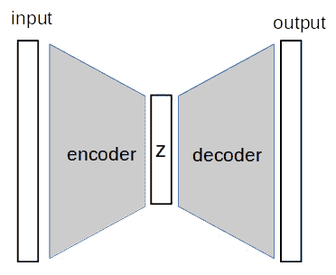

](img/B14538_02_01.jpg)

图 2.1 – 一般自编码器架构

在前面的图像中，**输入**和**输出**是相同维度的图像，`z`是低维潜在向量。**编码器**将输入压缩成`z`，而**解码器**则逆转这一过程以生成输出图像。

在审视了整体架构之后，让我们进一步了解编码器的工作原理。

## 编码器

编码器由多个神经网络层组成，最好的表示方法是使用全连接（密集）层。现在我们将直接构建一个适用于`MNIST`数据集的编码器，该数据集的维度是 28x28x1\。我们需要设置潜在变量的维度，这是一个一维向量。我们将遵循惯例，称潜在变量为`z`，如下代码所示。

代码可以在`ch2_autoencoder.ipynb`中找到：

```py
def Encoder(z_dim):
    inputs  = layers.Input(shape=[28,28,1])
    x = inputs    
    x = Flatten()(x)
    x = Dense(128, activation='relu')(x)
    x = Dense(64, activation='relu')(x)
    x = Dense(32, activation='relu')(x)    
    z = Dense(z_dim, activation='relu')(x)

    return Model(inputs=inputs, outputs=z, name='encoder')
```

潜在变量的大小应小于输入维度。它是一个超参数，我们将首先尝试使用 10，这将给我们一个压缩率为*28*28/10 = 78.4*。

然后，我们将使用三个全连接层，神经元数逐渐减少（`128`，`64`，`32`，最后是`10`，这是我们的`z`维度）。我们可以在以下的模型总结中看到，特征大小从`784`逐渐压缩到网络输出的`10`：


](img/B14538_02_02.jpg)

图 2.2 – 我们编码器的模型总结

这种网络拓扑结构迫使模型学习哪些是重要的特征，并逐层丢弃不太重要的特征，最终将数据压缩到 10 个最重要的特征。如果仔细想一想，这与**CNN**分类非常相似，其中特征图的大小随着向上层遍历逐渐减小。**特征图**是指张量的前两个维度（高度和宽度）。

由于 CNN 在图像输入上更为高效且更适合，我们将使用**卷积层**来构建编码器。旧的 CNN（如**VGG**）使用最大池化来进行特征图下采样，但较新的网络通常通过在卷积层中使用步幅为 2 的卷积核来实现这一点。下图演示了使用步幅为 2 的卷积核滑动，从而生成一个特征图，其大小是输入特征图的一半：

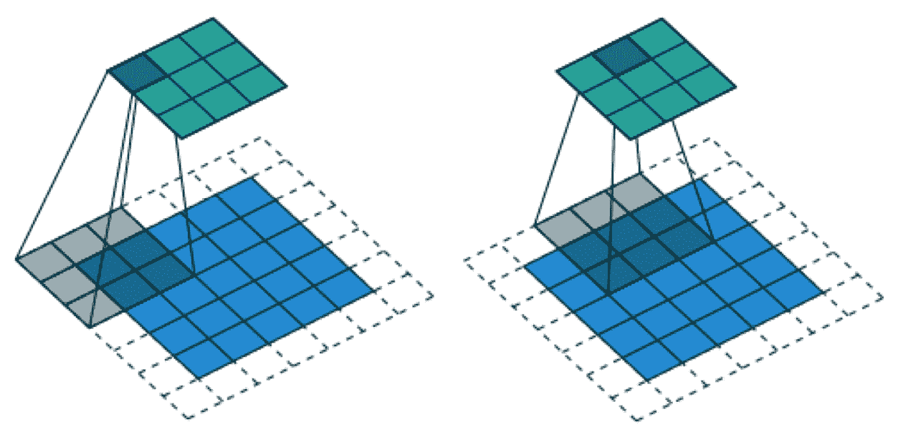

图 2.3 – 从左到右，图中展示了使用步幅为 2 的卷积操作

（来源：Vincent Dumoulin, Francesco Visin, “深度学习卷积算术指南” https://www.arxiv-vanity.com/papers/1603.07285/）

在这个例子中，我们将使用四个卷积层，每个层有`8`个滤波器，并包含一个步幅为`2`的输入进行下采样，如下所示：

```py
def Encoder(z_dim):
    inputs  = layers.Input(shape=[28,28,1])
    x = inputs    
    x = Conv2D(filters=8,  kernel_size=(3,3), strides=2,  	  	               padding='same', activation='relu')(x)
    x = Conv2D(filters=8,  kernel_size=(3,3), strides=1, 	 	               padding='same', activation='relu')(x)
    x = Conv2D(filters=8,  kernel_size=(3,3), strides=2,                	               padding='same', activation='relu')(x)
    x = Conv2D(filters=8,  kernel_size=(3,3), strides=1, 	 	               padding='same', activation='relu')(x)
    x = Flatten()(x)
    out = Dense(z_dim, activation='relu')(x)
    return Model(inputs=inputs, outputs=out, name='encoder')
```

在典型的卷积神经网络（CNN）架构中，滤波器的数量会增加，而特征图的大小会减少。然而，我们的目标是减少维度，因此我保持了滤波器大小不变。这对于像 MNIST 这样的简单数据来说已经足够，随着我们进入潜在变量，滤波器大小的变化也是可以的。最后，我们将最后一个卷积层的输出展平，并将其输入到全连接层，以输出我们的潜在变量。

## 解码器

如果解码器是一个人，他们可能会觉得自己被不公平对待。这是因为解码器做了一半的工作，但只有编码器在名称中占有一席之地。它应该被称为自动编码器-解码器！

解码器的工作本质上是编码器的反向操作，即将低维潜在变量转换为高维输出，以使其看起来像输入图像。解码器中的层不需要按反向顺序看起来像编码器。你可以使用完全不同的层，例如，在编码器中只使用全连接层，在解码器中只使用卷积层。无论如何，我们仍将在解码器中使用卷积层，将特征图从 7x7 上采样到 28x28。以下代码片段展示了解码器的构建：

```py
def Decoder(z_dim):
    inputs  = layers.Input(shape=[z_dim])
    x = inputs    
    x = Dense(7`7`64, activation='relu')(x)
    x = Reshape((7,7,64))(x)
    x = Conv2D(filters=64, kernel_size=(3,3), strides=1,  	 	               padding='same', activation='relu')(x)
    x = UpSampling2D((2,2))(x)
    x = Conv2D(filters=32, kernel_size=(3,3), strides=1, 	 	               padding='same', activation='relu')(x)
    x = UpSampling2D((2,2))(x)    
    x = Conv2D(filters=32, kernel_size=(3,3), strides=2, 	 	               padding='same', activation='relu')(x)
    out = Conv2(filters=1, kernel_size=(3,3), strides=1,  	 	                padding='same', activation='sigmoid')(x)
    return Model(inputs=inputs, outputs=out, name='decoder') 
```

第一层是一个全连接层，它接收潜在变量并生成一个大小为[7 x 7 x 卷积层滤波器数量]的张量。与编码器不同，解码器的目标不是减少维度，因此我们可以并且应该使用更多的滤波器，以增加其生成能力。

`UpSampling2D`通过插值像素来增加分辨率。它是一个仿射变换（线性乘法和加法），因此它可以**反向传播**，但它使用固定的权重，因此不可训练。另一种流行的上采样方法是使用**转置卷积层**，该层是可训练的，但可能会在生成的图像中产生棋盘状的伪影。你可以在[`distill.pub/2016/deconv-checkerboard/`](https://distill.pub/2016/deconv-checkerboard/)查看更多信息。

对于低维图像或当你放大图像时，棋盘效应更为明显。通过使用偶数大小的卷积核（例如，4 而不是更常见的 3），可以减少这种效果。因此，近期的图像生成模型通常不使用转置卷积。我们将在本书的其余部分使用`UpSampling2D`。以下表格显示了解码器的模型摘要：

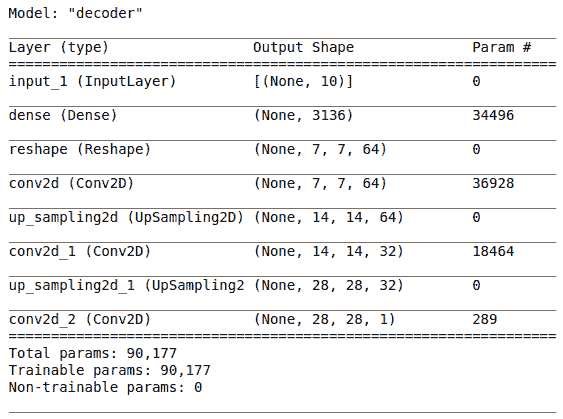

图 2.4 – 解码器的模型摘要

提示

设计 CNN 时，了解如何计算卷积层输出张量的形状非常重要。如果使用`padding='same'`，则输出特征图的大小（高度和宽度）将与输入特征图相同。如果改为使用`padding='valid'`，则输出大小可能会略小，具体取决于滤波器核的维度。当输入`stride = 2`与相同的填充一起使用时，特征图的大小会减半。最后，输出张量的通道数与卷积滤波器的数量相同。例如，如果输入张量的形状是(28,28,1)，并通过`conv2d(filters=32, strides=2, padding='same')`，我们知道输出的形状将是(14,14, 32)。

## 构建自编码器

现在我们准备将编码器和解码器结合起来创建自编码器。首先，我们分别实例化编码器和解码器。然后，我们将编码器的输出传递给解码器的输入，并使用编码器的输入和解码器的输出来实例化一个`Model`，如下所示：

```py
z_dim = 10
encoder = Encoder(z_dim)
decoder = Decoder(z_dim) 
model_input = encoder.input
model_output = decoder(encoder.output)
autoencoder = Model(model_input, model_output)
```

深度神经网络看起来可能很复杂且难以构建。然而，我们可以将其拆分成更小的模块或块，然后稍后将它们组合起来。这样整个任务就变得更加可管理！在训练过程中，我们将使用 L2 损失，这通过**均方误差**（**MSE**）来实现，用于比较输出和期望结果之间的每个像素。在这个示例中，我添加了一些回调函数，它们将在每个训练周期后被调用，如下所示：

+   使用`ModelCheckpoint(monitor='val_loss')`在验证损失低于早期周期时保存模型。

+   使用`EarlyStopping(monitor='val_loss', patience = 10)`来提前停止训练，如果验证损失在 10 个周期内没有改善。

生成的图像如下所示：

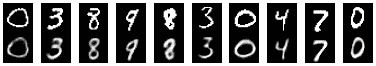

图 2.5 – 第一行是输入图像，第二行是由自编码器生成的图像

如你所见，第一行是输入图像，第二行是由我们的自编码器生成的图像。我们可以看到生成的图像有些模糊；这可能是因为我们过度压缩了图像，导致在过程中丢失了一些数据。

为了验证我们的怀疑，我们将潜在变量的维度从 10 增加到 100，然后生成输出，结果如下：

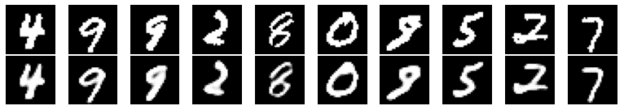

图 2.6 – 自编码器生成的图像，z_dim = 100

如你所见，现在生成的图像看起来更加锐利！

## 从潜在变量生成图像

那么，我们如何使用自编码器呢？让一个 AI 模型将图像转换为更模糊的版本并不太有用。自编码器的最初应用之一是图像去噪，我们将一些噪声添加到输入图像中，并训练模型生成干净的图像。然而，我们更感兴趣的是使用它来生成图像。那么，让我们看看我们如何做到这一点。

现在我们已经有了训练好的自编码器，我们可以忽略编码器，只使用解码器从潜在变量中采样来生成图像（看到了吗？解码器值得更多的认可，因为它在训练完成后仍然需要继续工作）。我们面临的第一个挑战是如何从潜在变量中采样。由于在潜在变量之前的最后一层没有使用任何激活函数，潜在空间是无界的，可以是任何实数浮动值，而且数量多得不可计数！

为了说明这如何起作用，我们将训练另一个自编码器，使用`z_dim=2`，以便我们可以在二维空间中探索潜在空间。以下图表展示了潜在空间的图：

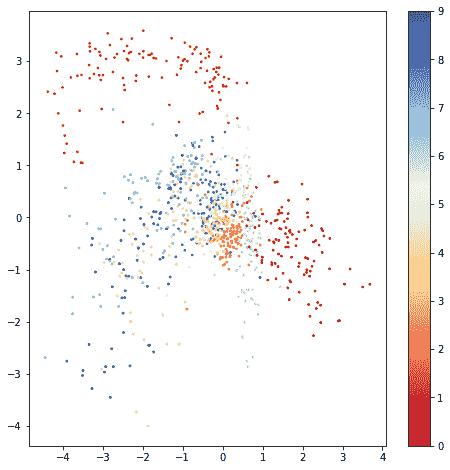

图 2.7 – 潜在空间的图。Jupyter Notebook 中有彩色版本。

该图是通过将 1,000 个样本输入训练好的编码器，并在散点图上绘制两个潜在变量生成的。右侧的色条表示数字标签的强度。我们可以从这些图中观察到以下几点：

+   潜在变量大致位于**–5**和**+4**之间。我们无法知道确切的范围，除非我们绘制出这个图并查看它。这个范围在重新训练模型时可能会发生变化，且样本的分布通常会超出+-10，分布得更加广泛。

+   类别的分布并不均匀。你可以看到左上角和右侧有一些聚类，它们与其他类别分离得很好（请参考 Jupyter Notebook 中的彩色版本）。然而，位于图中心的类别往往较为密集，且彼此重叠。

你可能能在以下图像中更好地看到不均匀性，这些图像是通过以 1.0 的间隔从**–5**到**+5**扫描潜在变量生成的：

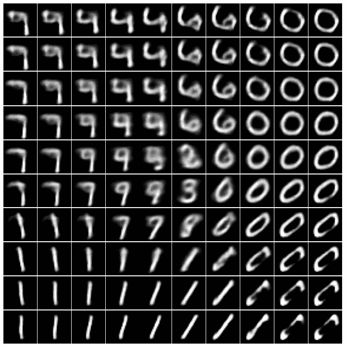

图 2.8 - 通过扫描两个潜在变量生成的图像

我们可以看到数字 0 和 1 在样本分布中表现得很好，并且它们的绘制效果也很好。对于位于中心的数字情况则不太一样，它们显得模糊，甚至一些数字在样本中完全缺失。这表明，对于这些类别，生成的图像变化非常少，这是一个缺点。

并不完全是坏事。如果你仔细观察，你会发现数字 1 逐渐变形为 7，接着变成 9 和 4，这很有趣！看起来自动编码器已经学到了一些潜在变量之间的关系。可能是外形圆润的数字被映射到潜在空间的右上角，而看起来更像棍棒的数字则位于左侧。这是个好消息！

乐趣

在笔记本中有一个小工具，允许你滑动潜在变量条，进行交互式图像生成。玩得开心！

在接下来的章节中，我们将看到如何使用 VAE 解决潜在空间中的分布问题。

# 变分自编码器

在自编码器中，解码器是直接从潜在变量中抽取样本的。**变分自编码器**（**VAE**），它在 2014 年被发明，区别在于样本是从由潜在变量参数化的分布中抽取的。为了清楚说明，假设我们有一个包含两个潜在变量的自编码器，我们随机抽取样本，得到 0.4 和 1.2 这两个样本。然后，我们将它们发送到解码器生成图像。

在变分自编码器（VAE）中，这些样本并不会直接传递到解码器。相反，它们作为**高斯分布**的均值和方差被使用，我们从这个分布中抽取样本，然后将它们发送到解码器进行图像生成。由于这是机器学习中最重要的分布之一，因此在创建 VAE 之前，我们先了解一些高斯分布的基本知识。

## 高斯分布

高斯分布的特征是由两个参数 – **均值**和**方差**定义的。我想我们都对下图中展示的不同钟形曲线很熟悉。标准差越大（方差的平方根），分布越广：

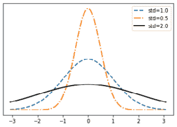

图 2.9 – 不同标准差的高斯分布概率密度函数

我们可以使用 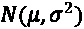 表示单变量高斯分布，其中 *µ* 是均值，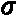 是标准差。

均值告诉我们峰值在哪里：它是概率密度最高的值，换句话说，就是最常见的值。如果我们要从图像的像素位置 (x, y) 中抽取样本，并且每个 x 和 y 都有不同的高斯分布，那么我们就得到一个*多元*高斯分布。在这种情况下，它是一个*二元*分布。

多元高斯分布的数学公式看起来可能相当复杂，因此我不会把它们放在这里。我们只需要知道的是，现在我们将标准差纳入了协方差矩阵。协方差矩阵的对角元素只是各个高斯分布的标准差。其他元素则衡量两个高斯分布之间的协方差，也就是它们之间的相关性。

以下图表展示了没有相关性的二元高斯样本：

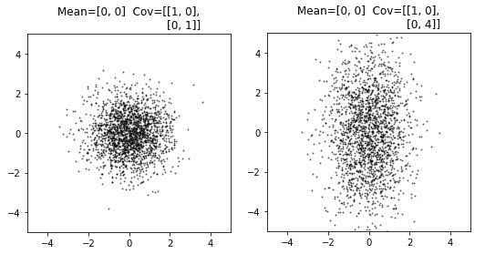

图 2.10 – 无相关性的二元高斯分布样本

我们可以看到，当某一维度的标准差从 1 增加到 4 时，只有该维度（`y`轴）的分布扩展了，而其他维度没有受到影响。在这里，我们说这两个高斯分布是**独立同分布**（简称**iid**）。

现在，在第二个例子中，左边的图表显示协方差非零且为正，这意味着当某一维度的密度增加时，另一维度也会跟着增加，它们是相关的。右边的图表显示了负相关：

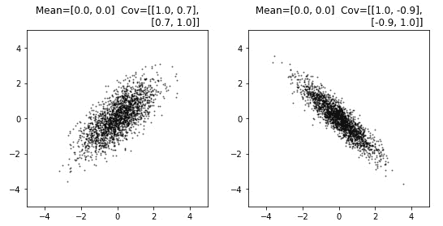

图 2.11 – 带相关性的二元高斯分布样本

这里有个好消息：在变分自编码器（VAE）中，高斯分布假设是独立同分布（iid），因此不需要协方差矩阵来描述变量之间的相关性。结果，我们只需要`n`对均值和方差来描述我们的多元高斯分布。我们希望实现的目标是创建一个分布良好的潜在空间，其中不同数据类别的潜在变量分布如下：

+   均匀分布，所以我们可以从中获得更好的变化来进行采样

+   略微重叠以创建连续的过渡

这可以通过以下图表来说明：

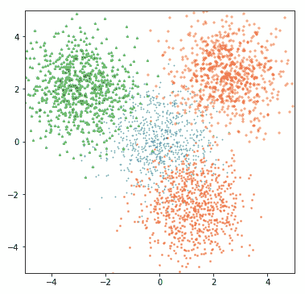

图 2.12 – 从多元高斯分布中抽取的四个样本

接下来，我们将学习如何将高斯分布采样融入 VAE 中。

## 采样潜在变量

当我们训练自编码器时，编码后的潜在变量直接传递给解码器。而在 VAE 中，编码器和解码器之间还有一个额外的采样步骤。编码器生成高斯分布的均值和方差作为潜在变量，我们从中抽取样本并发送到解码器。问题是，采样是不可反向传播的，因此不能进行训练。

反向传播

对于那些不熟悉深度学习基础的读者，神经网络是通过**反向传播**来训练的。其步骤之一是计算损失函数对网络权重的梯度。因此，所有操作必须是可微分的，才能使反向传播工作。

为了解决这个问题，我们可以采用一个简单的*重参数化技巧*，即将高斯随机变量`N`（均值，方差）转换为*mean + sigma * N(0, 1)*。换句话说，我们首先从标准高斯分布 N(0,1)中进行采样，然后将其乘以 sigma，再加上均值。正如以下图所示，采样变成了一个仿射变换（仅由加法和乘法操作组成），并且误差可以从输出层反向传播到编码器：

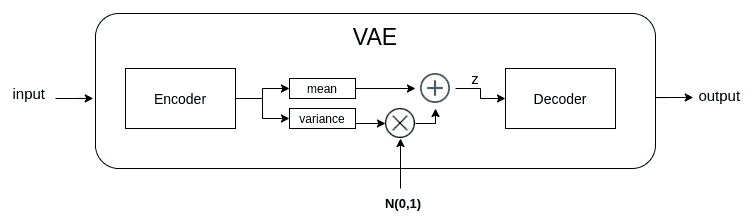

图 2.13 – VAE 中的高斯采样

来自标准高斯分布**N(0,1)**的采样可以视为 VAE 的输入，我们不需要将反向传播回传到输入层。然而，我们将**N(0,1)**的采样放入我们的模型中。既然我们已经理解了采样的原理，接下来我们可以构建我们的 VAE 模型。

现在我们实现将采样作为一个自定义层，如下所示：

```py
class GaussianSampling(Layer):        
    def call(self, inputs):
        means, logvar = inputs
        epsilon = tf.random.normal(shape=tf.shape(means), 	 	                                   mean=0., stddev=1.)
        samples = means + tf.exp(0.5*logvar)*epsilon
        return samples
```

请注意，我们在编码器空间中使用对数方差而非方差，以提高数值稳定性。根据定义，方差是一个正数，但除非我们使用如`relu`等激活函数对其进行约束，否则潜在变量的方差可能会变成负数。此外，方差可能变化非常大，例如从 0.01 到 100，这可能使训练变得困难。然而，这些值的自然对数为-4.6 和+4.6，这是一个较小的范围。尽管如此，在进行采样时，我们仍然需要将对数方差转换为标准差，因此需要使用`tf.exp(0.5*logvar)`代码。

重要提示

在 TensorFlow 中构建模型有几种方法。其一是使用`Sequential`类按顺序添加层。最后一层的输入会传递到下一层；因此，不需要为该层指定输入。虽然这种方法很方便，但不能在具有分支的模型中使用。接下来，使用`tf.random.normal()`在急切执行模式下会失败，这是 TensorFlow 2 的默认模式，它创建动态计算图时需要知道批次大小来生成随机数，但由于在创建层时批次大小未知，因此会出错。当我们尝试通过传入大小为`(None, 2)`的值来抽样时，会在 Jupyter 笔记本中遇到错误。因此，我们将模型创建方法切换为使用`call()`，这样在执行时我们已经知道批次大小，进而完成形状信息。

现在我们使用`__init__()`方法，或者如果需要使用输入形状来构建层，则使用`__built__()`方法来重构我们的编码器。在子类中，我们使用`Sequential`类方便地创建卷积层块，因为我们不需要读取任何中间张量：

```py
class Encoder(Layer):
    def __init__(self, z_dim, name='encoder'):
        super(Encoder, self).__init__(name=name)        
        self.features_extract = Sequential([
            Conv2D(filters=8,  kernel_size=(3,3), strides=2,  	                   padding='same', activation='relu'),
            Conv2D(filters=8,  kernel_size=(3,3), strides=1, 	                   padding='same', activation='relu'),
            Conv2D(filters=8,  kernel_size=(3,3), strides=2,  	                   padding='same', activation='relu'),
            Conv2D(filters=8,  kernel_size=(3,3), strides=1, 	                   padding='same', activation='relu'),
            Flatten()])
        self.dense_mean = Dense(z_dim, name='mean')
        self.dense_logvar = Dense(z_dim, name='logvar')
        self.sampler = GaussianSampling()
```

然后我们使用两个全连接层根据提取的特征预测`z`的均值和对数方差。潜在变量被采样并与均值和对数方差一起返回，用于损失计算。解码器与自动编码器相同，只是我们现在通过子类化重写了它：

```py
    def call(self, inputs):
        x = self.features_extract(inputs)
        mean = self.dense_mean(x)
        logvar = self.dense_logvar(x)
        z = self.sampler([mean, logvar])
        return z, mean, logvar
```

现在编码器模块已经完成。解码器模块的设计与自动编码器相同，因此剩下的工作是定义一个新的损失函数。

## 损失函数

我们现在可以从多变量高斯分布中采样，但仍然无法保证高斯分布的点不会相互远离或过于分散。变分自编码器（VAE）通过加入正则化项来解决这个问题，以鼓励高斯分布接近 N(0,1)。换句话说，我们希望它们的均值接近 0，以保持彼此接近，同时方差接近 1，以便从中采样更好的变异性。这个过程是通过使用**Kullback-Leibler 散度（KLD）**实现的。

KLD 是衡量一个概率分布与另一个概率分布之间差异的指标。对于两个分布，`P`和`Q`，`P`相对于`Q`的 KLD 是`P`和`Q`的交叉熵减去`P`的熵。在信息论中，熵是信息或随机变量不确定性的度量：

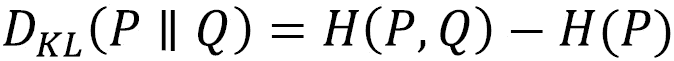

不深入数学细节，KLD 与交叉熵成正比，因此最小化交叉熵也会最小化 KLD。当 KLD 为零时，两个分布是完全相同的。值得一提的是，当要比较的分布是标准高斯分布时，KLD 有一个封闭形式的解，可以直接从以下均值和方差计算：

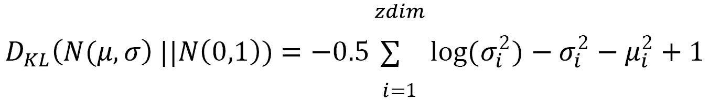

我们创建了一个自定义的损失函数，它接受标签和网络输出，以计算 KL 损失。我使用了`tf.reduce_mean()`而不是`tf.reduce_sum()`，这样可以将其标准化为潜在空间维度的数量。这其实并不重要，因为 KL 损失会乘以一个超参数，我们稍后会讨论这个超参数：

```py
def vae_kl_loss(y_true, y_pred):
    kl_loss =  - 0.5 * tf.reduce_mean(vae.logvar - tf.exp(vae.logvar) - tf.square(vae.mean) - + 1)
    return kl_loss    
```

另一个损失函数是我们在自动编码器中使用的，用于将生成的图像与标签图像进行比较。这也叫做**重构损失**，它衡量的是重构图像与目标图像之间的差异，因此得名。这个损失可以是**二元交叉熵**（**BCE**）或者**均方误差**（**MSE**）。MSE 倾向于生成更锐利的图像，因为它对偏离标签的像素进行更严厉的惩罚（通过平方误差）：

```py
def vae_rc_loss(y_true, y_pred):
    rc_loss = tf.keras.losses.MSE(y_true, y_pred)
    return rc_loss
```

最后，我们将两个损失加在一起：

```py
def vae_loss(y_true, y_pred):
    kl_loss = vae_kl_loss(y_true, y_pred)
    rc_loss = vae_rc_loss(y_true, y_pred)
    kl_weight_factor = 1e-2
    return kl_weight_factor*kl_loss + rc_loss
```

现在，让我们来谈谈 `kl_weight_factor`，它是一个重要的超参数，通常在 VAE 示例或教程中被忽视。正如我们所看到的，总损失由 KL 损失和重建损失组成。MNIST 数字的背景是黑色的，因此即使网络没有学到多少内容并且只输出零，重建损失仍然相对较低。

相比之下，潜在变量的分布在开始时非常杂乱，因此减少 KLD 的收益大于减少重建损失的收益。这会促使网络忽视重建损失，仅优化 KLD 损失。因此，潜在变量将具有完美的标准高斯分布 N(0,1)，但生成的图像将与训练图像完全不同，这对于生成模型来说是灾难性的！

重要提示

编码器具有判别性，它试图找出图像中的差异。我们可以将每个潜在变量看作一个特征。如果我们使用两个潜在变量来表示 MNIST 数字，它们可能表示*圆形*或*直线*。当解码器看到一个数字时，它通过使用均值和方差来预测该数字是圆形还是直线的可能性。如果强制神经网络使 KLD 损失为 0，潜在变量的分布将完全相同——中心为 0，方差为 1。换句话说，圆形和直线的可能性是一样的。因此，编码器失去了其判别能力。当这种情况发生时，你会发现解码器每次生成的图像都相同，看起来就像是像素值的平均值。

在我们进入下一部分之前，我建议你打开 `ch2_vae_mnist.ipynb`，尝试使用不同的 `kl_weight_factor` 和 `VAE(z_dim=2)`，查看训练后潜在变量的分布。你还可以尝试增加 `kl_weight_factor`，看看它如何阻止 VAE 学会生成图像，然后再次查看生成的图像和分布。

# 使用 VAE 生成人脸

既然你已经了解了 VAE 的理论，并且为 MNIST 构建了一个模型，现在是时候成长起来，丢掉玩具，开始生成一些真实的东西了。我们将使用 VAE 来生成一些人脸。开始吧！代码在 `ch2_vae_faces.ipynb` 中。有几个面部数据集可以用于训练：

+   Celeb A ([`mmlab.ie.cuhk.edu.hk/projects/CelebA.html`](http://mmlab.ie.cuhk.edu.hk/projects/CelebA.html))。这是一个在学术界很受欢迎的数据集，包含面部属性的标注，但不幸的是，不能用于商业用途。

+   **Flickr-Faces-HQ 数据集** (**FFHQ**) ([`github.com/NVlabs/ffhq-dataset`](https://github.com/NVlabs/ffhq-dataset))。这个数据集可以自由用于商业用途，并且包含高分辨率的图像。

在这个练习中，我们只假设数据集包含 RGB 图像；你可以随意使用任何适合你需求的数据集。

## 网络架构

我们重新使用了**MNIST VAE**和训练管道，并根据数据集不同于 MNIST 做了一些修改。根据你的计算能力，随意减少层数、参数、图像大小、训练轮数和批次大小。修改内容如下：

+   将潜在空间的维度增加到 200\。

+   输入形状从(28,28,1)更改为(112,112,3)，因为我们现在有了 3 个颜色通道，而不是灰度图像。为什么是 112？早期的 CNN，如 VGG，使用 224x224 的输入大小，并为图像分类 CNN 设定了标准。由于我们目前还没有掌握生成高分辨率图像的技能，因此我们不想使用过高的分辨率。因此，我选择了 224/2 = 112，但你可以使用任何偶数值。

+   在预处理管道中添加图像调整大小。我们添加了更多的下采样层。在 MNIST 中，编码器进行了两次下采样，从 28 到 14 再到 7。由于我们现在的分辨率更高，因此需要总共进行四次下采样。

+   由于数据集更为复杂，我们增加了滤波器的数量，以增强网络的能力。因此，编码器中的卷积层如下所示。解码器类似，但方向相反。解码器的卷积层通过步幅对特征图进行上采样，而不是下采样：

    a) `Conv2D(filters = 32, kernel_size=(3,3), strides = 2)`

    b) `Conv2D(filters = 32, kernel_size=(3,3), strides = 2)`

    c) `Conv2D(filters = 64, kernel_size=(3,3), strides = 2)`

    d) `Conv2D(filters = 64, kernel_size=(3,3), strides = 2)`

    提示

    尽管我们在网络训练中使用了总损失，即 KLD 损失和重建损失，但我们应该仅使用重建损失作为指标，来监控何时保存模型以及提前终止训练。KLD 损失起到正则化作用，但我们更关心的是重建图像的质量。

## 面部重建

让我们来看一下以下重建的图像：

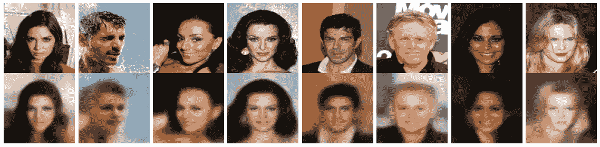

图 2.14 – 使用 VAE 重建的图像

尽管重建并不完美，但它们看起来确实不错。VAE 成功地从输入图像中学习了一些特征，并利用这些特征绘制了一张新的面孔。看起来 VAE 在重建女性面孔方面表现更好。这并不令人惊讶，因为我们在**第一章**《使用 TensorFlow 进行图像生成入门》中看到的*平均面孔*呈现女性特征，这是因为数据集中女性的比例较高。这也是为什么成熟男性被赋予了更加年轻、女性化的面容。

图像背景也很有趣。由于图像背景极为多样，编码器无法将每个细节都编码成低维度，因此我们可以看到 VAE 编码了背景颜色，并且解码器基于这些颜色创建了模糊的背景。

有件有趣的事情要和大家分享，当 KL 权重因子过高时，VAE 学习失败，那么*平均面孔*将再次出现来困扰你。这就像是 VAE 的编码器被蒙住了眼睛告诉解码器：“嘿，我什么也看不见，就画一个人给我看”，然后解码器画出了它认为的平均人像。

## 生成新面孔

要生成新的图像，我们从标准高斯分布中创建随机数，并将其输入到解码器中，如下面的代码片段所示：

```py
z_samples = np.random.normal(loc=0, scale=1, size=(image_num, 
                                                        z_dim))
images = vae.decoder(z_samples.astype(np.float32))
```

而大多数生成的面孔看起来都很可怕！

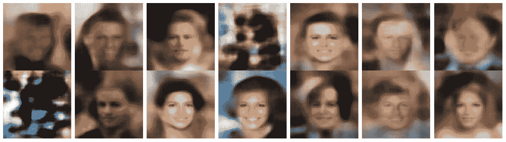

图 2.15 – 使用标准正态抽样生成的面孔

我们可以通过使用**抽样技巧**来提高图像的保真度。

## 抽样技巧

我们刚刚看到，训练过的 VAE 能够相当好地重建面孔。我怀疑通过随机抽样生成的样本可能存在一些问题。为了调试这个问题，我将数千张图像输入到 VAE 解码器中，以收集潜在空间的均值和方差。然后我绘制了每个潜在空间变量的平均均值，以下是我的结果：

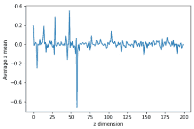

图 2.16 – 潜变量的平均均值

理论上，它们应该集中在 0，并且方差为 1，但由于 KLD 权重不佳和网络训练中的随机性，它们可能不会。因此，随机生成的样本并不总是与解码器期望的分布匹配。这就是我用来生成样本的技巧。使用类似前面步骤，我已收集了潜在变量的平均标准差（一个标量值），我用它来生成正态分布样本（200 维）。然后我加上了平均均值（200 维）。

啦！现在它们看起来好多了，更加清晰！

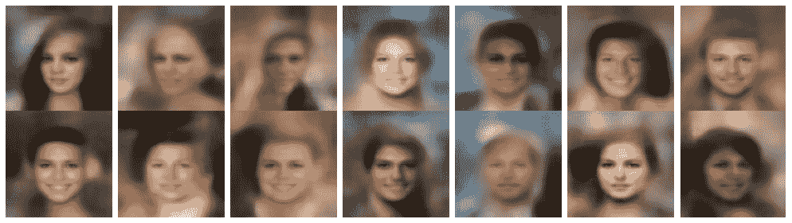

图 2.17 – 使用抽样技巧生成的面孔

在下一节中，我们将学习如何进行面部编辑，而不是生成随机面孔。

# 控制面部特征

这一章我们所做的一切只有一个目的：为了**面部编辑**做好准备！这是本章的高潮！

## 潜在空间算术

我们已经多次提到潜在空间，但尚未给出其明确定义。基本上，它表示潜在变量的每一个可能值。在我们的 VAE 中，它是一个 200 维的向量，或者简单地说是 200 个变量。尽管我们希望每个变量对我们来说都有明确的语义含义，比如 `z₀` 是眼睛，`z₁` 控制眼睛的颜色等等，事情往往没有那么简单。我们只能假设信息被编码在所有潜在向量中，并且可以使用向量运算来探索这个空间。

在深入高维空间之前，让我们通过一个二维的例子来理解。假设你现在在地图上的点*(0,0)*，而你的家在*(x,y)*。因此，指向你家的方向是*(x – 0 ,y - 0)*，然后除以*(x,y)*的 L2 范数，或者我们将这个方向表示为*(x_dot, y_dot)*。因此，每当你移动*(x_dot, y_dot)*时，你就朝着你家走；而当你移动*(-2*x_dot, -2*y_dot)*时，你就朝着远离家的方向走，步伐是两倍的。

现在，如果我们知道`smiling`特征的方向向量，我们可以将其添加到潜在变量中，使得面部微笑：

```py
new_z_samples = z_samples +  smiling_magnitude*smiling_vector
```

`smiling_magnitude`是我们设定的标量值，因此下一步是计算获取`smiling_vector`的方法。

## 查找特征向量

一些数据集，例如 Celeb A，为每张图片提供了面部属性的注释。这些标签是二进制的，表示某个特征是否存在于图像中。我们将使用这些标签和编码后的潜在变量来找到我们的方向向量！这个想法很简单：

1.  使用测试数据集或从训练数据集中提取的几千个样本，并使用 VAE 解码器生成潜在向量。

1.  将潜在向量分为两组：有（正向）或没有（负向）我们感兴趣的某一特征。

1.  分别计算正向向量和负向向量的平均值。

1.  通过从平均负向量中减去平均正向量来获取特征方向向量。

预处理函数已修改为返回我们感兴趣的属性的标签。然后我们使用`lambda`函数映射到数据管道中：

```py
def preprocess_attrib(sample, attribute):
    image = sample['image']
    image = tf.image.resize(image, [112,112])
    image = tf.cast(image, tf.float32)/255.
    return image, sample['attributes'][attribute]
ds = ds.map(lambda x: preprocess_attrib(x, attribute))
```

不要与 Keras 的 Lambda 层混淆，后者将任意的 TensorFlow 函数封装为 Keras 层。在代码中的`lambda`是一个通用的 Python 表达式。`lambda`函数作为一个小函数使用，但不需要定义函数的冗余代码。上述代码中的`lambda`函数等同于以下函数：

```py
def preprocess(x):  
    return preprocess_attrib(x, attribute))
```

在将`map`函数链式调用到数据集时，数据集对象将依次读取每张图片，并调用等同于`preprocess(image)`的`lambda`函数。

## 面部编辑

提取了特征向量后，我们现在可以进行魔法操作：

1.  首先，我们从数据集中选择一张图片，这张图片是下图中最左侧的面孔。

1.  我们将面部图像编码为潜在变量，然后解码生成一张新面孔，将其放置在行的中间。

1.  然后，我们将特征向量逐步添加到右侧。

1.  类似地，我们在向左移动时减去特征向量。

以下截图展示了通过插值潜在向量生成的图像，图像中包含男性、丰满、胡须、微笑和眼镜特征：

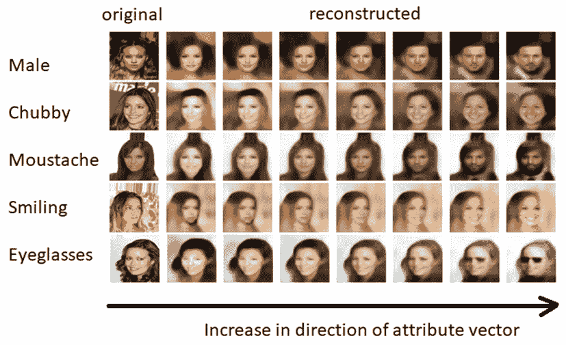

图 2.18 – 通过探索潜在空间来改变面部特征

过渡相当平滑。你应该注意到这些属性并不是彼此排斥的。例如，当我们增加女性的胡须特征时，肤色和头发变得更像男性，VAE 甚至给这个人系上了领带。这完全合理，事实上，这正是我们希望的效果。这表明一些潜在变量的分布是有重叠的。

类似地，如果我们将男性向量设置为最负，它将把潜在状态推向一个地方，在那里遍历胡须向量将不会对面部生长胡须产生影响。

接下来，我们可以尝试同时改变多个面部属性。数学原理类似；我们现在只需要将所有的属性向量加起来。在下面的截图中，左侧的图像是随机生成的，作为基准图像。右侧是经过一些潜在空间运算后的新图像，如图像前面的条形图所示：

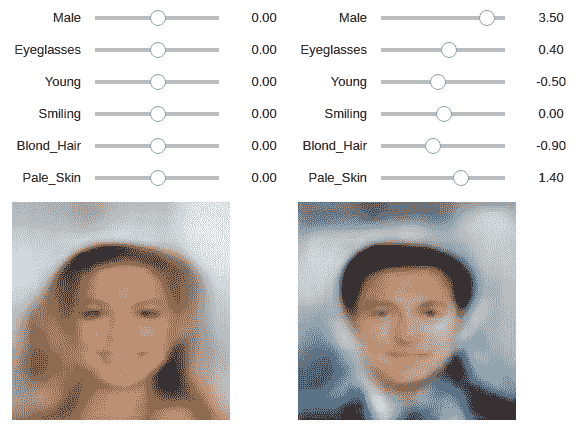

图 2.19 – 潜在空间探索小工具

这个小工具可以在 Jupyter Notebook 中使用。随时使用它来探索潜在空间并生成新的人脸！

# 总结

我们通过学习如何使用编码器将高维数据压缩为低维潜在变量，然后使用解码器从潜在变量重建数据，开始了本章的内容。我们了解到自编码器的局限性在于无法保证潜在空间是连续且均匀的，这使得从中进行采样变得困难。随后，我们引入了高斯采样，构建了一个变分自编码器（VAE）来生成 MNIST 数字。

最后，我们构建了一个更大的 VAE，并在面部数据集上进行训练，享受创造和操作人脸的乐趣。我们学到了潜在空间中采样分布、潜在空间算术和 KLD 的重要性，这为*第三章*，*生成对抗网络*打下了基础。

虽然 GANs 在生成照片级真实图像方面比 VAE 更强大，但早期的 GANs 很难训练。因此，我们将学习 GAN 的基本原理。在下一章结束时，你将学习到所有三大类深度生成算法的基础知识，为本书第二部分的更高级模型做好准备。

在我们进入生成对抗网络（GANs）之前，我要强调的是（变分）自编码器仍然被广泛使用。变分编码方面已经被集成到 GANs 中。因此，掌握 VAE 将有助于你掌握后续章节中我们将介绍的高级 GAN 模型。我们将在*第九章**，视频合成*中讲解使用自编码器生成深度伪造视频。该章节不假设你已经掌握 GANs 的相关知识，因此你可以随时跳到该章节，看看如何使用自编码器进行人脸替换。
