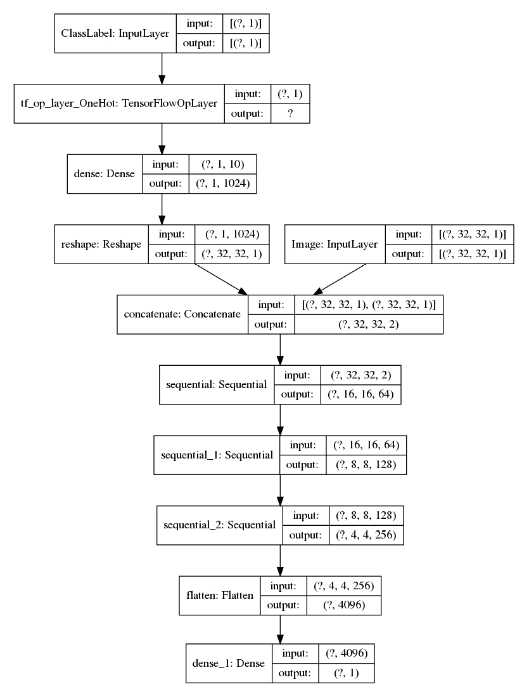
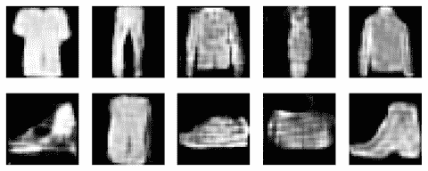
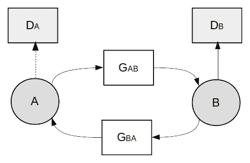
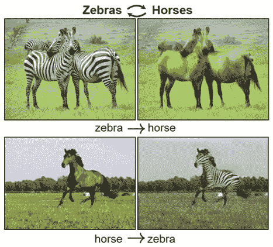
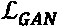

# 第四章：图像到图像的翻译

在本书的第一部分，我们学习了如何使用 VAE 和 GAN 生成逼真的图像。生成模型能够将一些简单的随机噪声转化为具有复杂分布的高维图像！然而，生成过程是无条件的，我们对生成的图像几乎没有控制。如果我们使用 MNIST 作为例子，我们无法知道会生成哪个数字，这有点像彩票。是不是很希望能够告诉 GAN 我们想要它生成什么呢？这就是我们在本章中要学习的内容。

我们将首先学习构建一个**条件生成对抗网络**（**cGAN**），它允许我们指定要生成的图像类别。这为后续更复杂的网络奠定了基础。我们将学习构建一个名为**pix2pix**的生成对抗网络，用于执行**图像到图像的转换**，简称**图像翻译**。这将使得许多酷炫的应用成为可能，比如将草图转换成真实的图像。之后，我们将构建**CycleGAN**，它是 pix2pix 的升级版，能够将马转变为斑马，然后再变回马！最后，我们将构建**BicycleGAN**，不仅能够翻译出高质量的图像，还能生成具有不同风格的多样化图像。本章将涵盖以下内容：

+   条件生成对抗网络（Conditional GANs）

+   使用 pix2pix 进行图像翻译

+   使用 CycleGAN 进行无配对图像翻译

+   使用 BicycleGAN 进行多样化翻译

本章将涵盖以下内容：

在本章中，我们将重用*第三章*《生成对抗网络》中的代码和网络模块，如 DCGAN 的上采样和下采样模块。这将使我们能够专注于新 GAN 的更高层次架构，并在本章中介绍更多的 GAN。后面提到的三个 GAN 是按时间顺序创建的，并共享许多共同的模块。因此，你应该按顺序阅读它们，首先是 pix2pix，然后是 CycleGAN，最后是 BicycleGAN，这样会比直接跳到 BicycleGAN（这是本书中最复杂的模型）更容易理解。

# 技术要求

相关的 Jupyter 笔记本可以在以下链接找到：

[`github.com/PacktPublishing/Hands-On-Image-Generation-with-TensorFlow-2.0/tree/master/Chapter04`](https://github.com/PacktPublishing/Hands-On-Image-Generation-with-TensorFlow-2.0/tree/master/Chapter04)

本章中使用的笔记本如下：

+   `ch4_cdcgan_mnist.ipynb`

+   `ch4_cdcgan_fashion_mnist.ipynb`

+   `ch4_pix2pix.ipynb`

+   `ch4_cyclegan_facade.ipynb`

+   `ch4_cyclegan_horse2zebra.ipynb`

+   `ch4_bicycle_gan.ipynb`

# 条件生成对抗网络（Conditional GANs）

生成模型的第一个目标是能够生成高质量的图像。接着，我们希望能够对生成的图像进行一定的控制。

在 *第一章* *使用 TensorFlow 开始进行图像生成* 中，我们了解了条件概率，并使用简单的条件概率模型生成了具有特定属性的面孔。在那个模型中，我们通过强制模型仅从具有微笑面孔的图像中采样来生成微笑的面孔。当我们对某些事物进行条件化时，该事物将始终存在，并且不再是具有随机概率的变量。你也可以看到，这些条件的概率被设置为 *1*。

在神经网络上强制条件很简单。我们只需要在训练和推理过程中向网络展示标签。例如，如果我们希望生成器生成数字 1，我们需要将数字 1 的标签与常规的随机噪声一起输入到生成器中。实现这一点有几种方法。下图展示了一种实现方式，最初出现在 *条件生成对抗网络* 论文中，该论文首次提出了 cGAN 的概念：


图 4.1 – 通过连接标签和输入来实现条件（改绘自：M. Mirza, S. Osindero, 2014, 条件生成对抗网络 – https://arxiv.org/abs/1411.1784）

在无条件 GAN 中，生成器的输入只有潜在向量 *z*。在条件 GAN 中，潜在向量 *z* 与一热编码的输入标签 *y* 结合，形成一个更长的向量，如前面的图所示。下表显示了使用 `tf.one_hot()` 的一热编码：


图 4.2 – 显示 TensorFlow 中 10 类的一热编码的表格

一热编码将标签转换为一个与类别数相等的向量。除了一个唯一的位置被填充为 1 之外，向量中的其他位置都为 0。一些机器学习框架在向量中的 1 的顺序不同；例如，类别标签 `0` 被编码为 `0000000001`，其中 `1` 位于最右侧的位置。顺序并不重要，只要在训练和推理过程中始终如一地使用。这是因为一热编码仅用于表示类别类，并没有语义意义。

## 实现一个条件 DCGAN

现在，让我们在 MNIST 上实现一个条件 DCGAN。我们在 *第二章* *变分自编码器* 中实现了一个 DCGAN，因此我们通过添加条件部分来扩展网络。本练习的笔记本文件是 `ch4_cdcgan_mnist.ipynb`。

首先我们来看一下生成器：

第一步是对类别标签进行独热编码。由于`tf.one_hot`([1], 10)将生成形状为（1, 10）的张量，我们需要将其重塑为形状为（10）的 1D 向量，以便与潜在向量`z`进行连接：

```py
input_label = layers.Input(shape=1, dtype=tf.int32, 	 	 	                           name='ClassLabel')        
        one_hot_label = tf.one_hot(input_label, 			                                   self.num_classes)
        one_hot_label = layers.Reshape((self.num_classes,))	                                       (one_hot_label)
```

下一步是通过使用`Concatenate`层将向量连接在一起。默认情况下，连接发生在最后一个维度（axis=-1）。因此，将形状为（`batch_size`, 100）的潜在变量与形状为（`batch_size`, 10）的独热标签连接，会生成形状为（`batch_size`, 110）的张量。代码如下：

```py
        input_z = layers.Input(shape=self.z_dim, 	 	      	                               name='LatentVector')
        generator_input = layers.Concatenate()([input_z, 
                                                one_hot_label])
```

这是生成器所需的唯一更改。由于我们已经讨论过 DCGAN 架构的细节，本文不再重复。在此简要回顾一下，输入将通过一个全连接层，然后经过若干上采样和卷积层，生成形状为（32, 32, 3）的图像，如下所示的模型图：



图 4.3 – 条件 DCGAN 的生成器模型图

下一步是将标签注入判别器中，因为仅仅判别图像是否真实或虚假是不够的，还需要判断它是否是正确的图像。

原始的 cGAN 仅在网络中使用全连接层。输入图像被展开并与独热编码的类别标签连接。然而，这种方法对于 DCGAN 并不适用，因为判别器的第一层是卷积层，期待一个二维图像作为输入。如果我们使用相同的方法，最终会得到一个输入向量 32×32×1 + 10 = 1,034，这不能被重塑为二维图像。我们需要另一种方式将独热向量投影到正确形状的张量中。

一种实现方式是使用全连接层将独热向量投影到输入图像（32,32,1）的形状，并进行连接，生成（32, 32, 2）的形状。第一个颜色通道是我们的灰度图像，第二个通道是投影后的独热标签。同样，判别器网络的其余部分保持不变，如下所示的模型摘要：


图 4.4 – 条件 DCGAN 判别器的输入

正如我们所见，对网络所做的唯一更改是增加了另一个路径，该路径接受类别标签作为输入。在开始模型训练之前，最后剩下的工作是将附加的标签类别添加到模型的输入中。为了创建具有多个输入的模型，我们按照以下方式传递输入层列表：

```py
discriminator = Model([input_image, input_label], output]
```

类似地，我们在执行前向传播时，以相同顺序传递`images`和`labels`列表：

```py
pred_real = discriminator([real_images, class_labels])
```

在训练过程中，我们为生成器创建随机标签，如下所示：

```py
fake_class_labels = tf.random.uniform((batch_size), 						minval=0, maxval=10, 						dtype=tf.dtypes.int32)
fake_images = generator.predict([latent_vector, 						fake_class_labels])
```

我们使用 DCGAN 训练管道和损失函数。以下是通过对输入标签（从 0 到 9）进行条件化生成的数字样本：


图 4.5 – 由条件 DCGAN 生成的手写数字

我们也可以在不做任何修改的情况下，使用 Fashion-MNIST 训练 cDCGAN。结果样本如下：



图 4.6 – 由条件 DCGAN 生成的图像

条件 GAN 在 MNIST 和 Fashion-MNIST 上表现非常好！接下来，我们将探讨不同的将类别条件应用于 GAN 的方法。

## cGAN 的变体

我们通过一热编码标签，传递给密集层（用于判别器），并与输入层拼接，来实现条件 DCGAN。这个实现简单且效果良好。我们将介绍一些其他流行的条件 GAN 实现方法，建议你自己动手实现代码并试一试。

### 使用嵌入层

一种常见的实现方法是用 `embedding` 层替代一热编码和密集层。嵌入层接受类别值作为输入，输出是一个向量，类似于密集层。换句话说，它具有与 `label->one-hot-encoding->dense` 块相同的输入和输出形状。代码片段如下：

```py
encoded_label = tf.one_hot(input_label, self.num_classes)
embedding = layers.Dense(32 * 32 * 1, activation=None)\ 				  (encoded_label) 
embedding = layers.Embedding(self.num_classes, 					  32*32*1)(input_label)
```

两种方法生成的结果相似，尽管由于一热编码的向量维度可能会随着类别数的增加而迅速增大，`embedding` 层在计算效率上更为高效。由于词汇量庞大，嵌入层在编码词语时被广泛应用。对于像 MNIST 这样的类别较少的情况，计算上的优势几乎可以忽略不计。

### 元素级乘法

将潜在向量与输入图像拼接会增加网络的维度以及第一层的大小。我们也可以选择将标签嵌入与原始网络输入进行元素级乘法操作，而不是拼接，从而保持原始输入形状。这种方法的起源不明确。然而，一些行业专家在**自然语言处理**任务中进行实验，发现这种方法比一热编码方法效果更好。执行图像与嵌入之间元素级乘法的代码片段如下：

```py
x = layers.Multiply()([input_image, embedding])
```

将前述代码与嵌入层结合后，我们得到如下图表，代码实现见 `ch4_cdcgan_fashion_mnist.ipynb`：


图 4.7 – 使用嵌入和元素级乘法实现 cDCGAN

接下来，我们将看到为什么将标签插入到中间层中是一种流行的做法。

### 将标签插入到中间层

我们可以选择将标签插入到网络的中间层，而不是第一层。这种方法对于编码器-解码器架构的生成器非常流行，其中标签被插入到接近编码器末端且维度最小的层。一些方法将标签嵌入到接近判别器输出的地方，这样判别器的大部分可以专注于判断图像是否真实。最后几层的容量只用于判断图像是否与标签匹配。

当我们在*第八章*中实现高级模型时，我们将学习如何将标签嵌入到中间层和归一化层，*自注意力机制用于图像生成*。我们现在已经理解了如何使用条件类标签生成图像。在本章的其余部分，我们将使用图像作为条件来执行图像到图像的翻译。

# 使用 pix2pix 进行图像翻译

2017 年 pix2pix 的介绍引起了极大的轰动，不仅在研究界，而且在更广泛的公众中。这部分归功于[`affinelayer.com/pixsrv/`](https://affinelayer.com/pixsrv/)网站，它将模型在线化，并允许人们将草图转换为猫、鞋子和包包。你也应该试试！以下截图取自该网站，给你一个了解其如何工作的窗口：


图 4.8 – 将猫的草图转化为真实图像的应用（来源: https://affinelayer.com/pixsrv/）

Pix2pix 来源于一篇名为*条件对抗网络的图像到图像翻译*的研究论文。从论文标题中我们可以看出，pix2pix 是一种执行图像到图像翻译的条件 GAN 模型。该模型可以被训练用于执行一般的图像翻译，但我们需要数据集中包含图像对。在我们的 pix2pix 实现中，我们将建筑立面的掩码翻译成逼真的建筑立面，如下所示：


图 4.9 – 建筑立面掩码与真实图像

在上面的截图中，左边的图片展示了作为 pix2pix 输入的语义分割掩码示例，其中建筑部分通过不同的颜色进行编码。右边是建筑立面的目标真实图像。

## 丢弃随机噪声

在我们迄今为止学习的所有 GAN 中，我们总是从随机分布中采样作为生成器的输入。我们需要这种随机性，否则生成器将产生确定性的输出，无法学习数据分布。Pix2pix 打破了这个传统，通过去除 GAN 中的随机噪声。正如作者在 *《基于条件对抗网络的图像到图像翻译》* 论文中指出的那样，他们无法让条件 GAN 使用图像和噪声作为输入，因为 GAN 会忽略噪声。

结果，作者开始在生成器层中使用 dropout 来引入随机性。一个副作用是，这种随机性较小，因此输出中会看到一些微小的变化，而且它们的风格通常相似。这个问题在 BicycleGAN 中得到了解决，我们将在后续学习到它。

## U-Net 作为生成器

本教程的笔记本文件是 `ch4_pix2pix.ipynb`。生成器和判别器的架构与 DCGAN 有很大不同，我们将详细讲解每一部分。由于不使用随机噪声作为输入，生成器的输入仅剩下作为条件的输入图像。因此，输入和输出都是相同形状的图像，在我们的示例中是 (256, 256, 3)。Pix2pix 使用 U-Net，这是一种类似于自编码器的编码器-解码器架构，但在编码器和解码器之间有跳跃连接。以下是原始 U-Net 的架构图：


图 4.10 – 原始 U-Net 架构（来源：O. Ronneberger 等，2015，《U-Net: Convolutional Networks for Biomedical Image Segmentation》– https://arxiv.org/abs/1505.04597）

在 *第二章**，变分自编码器* 中，我们看到自编码器如何将高维输入图像下采样成低维的潜在变量，然后再上采样回原始大小。在下采样过程中，图像的高频内容（即纹理细节）会丢失。因此，恢复的图像可能会显得模糊。通过通过跳跃连接将来自编码器的高空间分辨率内容传递给解码器，解码器可以捕获并生成这些细节，使图像看起来更加清晰。事实上，U-Net 最初用于将医学图像转化为语义分割掩码，这正是我们在本章中所尝试做的事情的反向。

为了简化生成器的构建，我们首先编写一个函数，创建一个默认步幅为 `2` 的下采样块。它由卷积层和可选的归一化、`激活` 和 `dropout` 层组成，具体如下：

```py
def downsample(self, channels, kernels, strides=2, 		    norm=True, activation=True, dropout=False):
    initializer = tf.random_normal_initializer(0., 0.02)
    block = tf.keras.Sequential()
    block.add(layers.Conv2D(channels, kernels, 		   strides=strides, padding='same', 		   use_bias=False, 		   kernel_initializer=initializer))
    if norm:
        block.add(layers.BatchNormalization())              
    if activation:
        block.add(layers.LeakyReLU(0.2)) 
    if dropout:
        block.add(layers.Dropout(0.5))
    return block
```

`upsample` 块类似，但在 `Conv2D` 之前添加了一个 `UpSampling2D` 层，并且步幅为 `1`，如下所示：

```py
def upsample(self, channels, kernels, strides=1,  		  norm=True, activation=True, dropout=False):
    initializer = tf.random_normal_initializer(0., 0.02)
    block = tf.keras.Sequential()
    block.add(layers.UpSampling2D((2,2)))
    block.add(layers.Conv2D(channels, kernels, 		   strides=strides, padding='same', 		   use_bias=False, 		   kernel_initializer=initializer))
    if norm:
        block.add(InstanceNormalization())              
    if activation:
        block.add(layers.LeakyReLU(0.2)) 
    if dropout:
        block.add(layers.Dropout(0.5))
    return block
```

我们首先构建下采样路径，在每个下采样块之后，特征图的尺寸会减半，如下所示。需要注意的是输出形状，因为我们需要将其与上采样路径的跳跃连接进行匹配，如下所示：

```py
input_image = layers.Input(shape=image_shape)
down1 = self.downsample(DIM, 4, norm=False)(input_image) # 128
down2 = self.downsample(2*DIM, 4)(down1) # 64
down3 = self.downsample(4*DIM, 4)(down2) # 32
down4 = self.downsample(4*DIM, 4)(down3) # 16
down5 = self.downsample(4*DIM, 4)(down4) # 8
down6 = self.downsample(4*DIM, 4)(down5) # 4
down7 = self.downsample(4*DIM, 4)(down6) # 2
```

在上采样路径中，我们将前一层的输出与来自下采样路径的跳跃连接进行拼接，以形成 `upsample` 块的输入。我们在前三层使用了 `dropout`，如下所示：

```py
up6 = self.upsample(4*DIM, 4, dropout=True)(down7) # 4,4*DIM
concat6 = layers.Concatenate()([up6, down6])   
up5 = self.upsample(4*DIM, 4, dropout=True)(concat6) 
concat5 = layers.Concatenate()([up5, down5])  
up4 = self.upsample(4*DIM, 4, dropout=True)(concat5) 
concat4 = layers.Concatenate()([up4, down4])  
up3 = self.upsample(4*DIM, 4)(concat4) 
concat3 = layers.Concatenate()([up3, down3]) 
up2 = self.upsample(2*DIM, 4)(concat3) 
concat2 = layers.Concatenate()([up2, down2])  
up1 = self.upsample(DIM, 4)(concat2) 
concat1 = layers.Concatenate()([up1, down1])  
output_image = tanh(self.upsample(3, 4, norm=False, 				activation=None)(concat1))
```

生成器的最后一层是 Conv2D，通道数为 3，以匹配图像的通道数。像 DCGAN 一样，我们将图像标准化到 [-1, +1] 范围内，使用 `tanh` 作为激活函数，并采用二元交叉熵作为损失函数。

## 损失函数

Pix2pix 使用标准的 GAN 损失函数（二元交叉熵）来训练生成器和判别器，就像 DCGAN 一样。既然我们有了目标图像可以生成，那么我们就可以为生成器添加 L1 重建损失。在论文中，重建损失与二元交叉熵的比例设定为 100:1。以下代码片段展示了如何编译结合生成器和判别器的损失函数：

```py
LAMBDA = 100
self.model.compile(loss = ['bce','mae'],
                   optimizer = Adam(2e-4, 0.5, 0.9999),
                   loss_weights=[1, LAMBDA])
```

`bce` 代表 `mae` 代表 **平均绝对熵损失**，或更常见的称为 **L1 损失**。

## 实现 PatchGAN 判别器

研究人员发现，L2 或 L1 损失会导致图像生成问题产生模糊的结果。尽管它们未能鼓励高频的清晰度，但能够很好地捕捉低频内容。我们可以将低频信息视为内容，如建筑结构，而高频信息则提供样式信息，如建筑外立面的细节纹理和颜色。为了捕捉高频信息，研究人员使用了一种新的判别器，称为 PatchGAN。不要被它的名字误导；PatchGAN 不是 GAN，而是 **卷积神经网络** (**CNN**)。

传统的 GAN 判别器查看整张图像并判断整张图像是实图还是假图。而 PatchGAN 并非查看整张图像，而是查看图像的若干小块，因此得名 PatchGAN。卷积层的感受野是指映射到一个输出点的输入点的数量，换句话说，就是卷积核的大小。对于一个 N×N 的卷积核，层的每个输出都对应输入张量的 N×N 像素。

随着网络的深入，下一层将看到更大块的输入图像，输出的有效感受野也随之增加。默认的 PatchGAN 被设计为具有 70×70 的有效感受野。原始的 PatchGAN 由于经过精心的填充，输出形状为 30×30，但我们将仅使用“相同”填充以得到 29×29 的输出形状。每个 29×29 的小块查看不同且重叠的 70×70 输入图像块。

换句话说，判别器试图预测每个小块是实时的还是假的。通过放大局部小块，判别器被鼓励去关注图像的高频信息。总结一下，我们使用 L1 重建损失来捕捉低频内容，使用 PatchGAN 来鼓励高频样式细节。

PatchGAN 本质上是一个卷积神经网络（CNN），可以通过几个下采样块来实现，如以下代码所示。我们将使用符号 A 来表示输入（源）图像，B 来表示输出（目标）图像。与 cGAN 类似，判别器需要两个输入——条件图像 A 和输出图像 B，后者可以是真实的（来自数据集的）图像，也可以是生成的假图像。我们在判别器的输入端将这两张图像拼接在一起，因此 PatchGAN 会同时查看图像 A（条件图像）和图像 B（输出图像或假图像），以决定它们是真实的还是假的。代码如下：

```py
def build_discriminator(self):
    DIM = 64
    model = tf.keras.Sequential(name='discriminators') 
    input_image_A = layers.Input(shape=image_shape)
    input_image_B = layers.Input(shape=image_shape)
    x = layers.Concatenate()([input_image_A, 					   input_image_B])
    x = self.downsample(DIM, 4, norm=False)(x) 
    x = self.downsample(2*DIM, 4)(x) 
    x = self.downsample(4*DIM, 4)(x) 
    x = self.downsample(8*DIM, 4, strides=1)(x) 
    output = layers.Conv2D(1, 4, activation='sigmoid')(x)
    return Model([input_image_A, input_image_B], output)     
```

判别器模型的总结如下：


图 4.11 – 判别器模型总结

请注意，输出层的形状是 (*29, 29, 1)*。因此，我们将创建与其输出形状匹配的标签，如下所示：

```py
real_labels = tf.ones((batch_size, self.patch_size, 				 self.patch_size, 1))
fake_labels = tf.zeros((batch_size, self.patch_size, 				  self.patch_size, 1))
fake_images = self.generator.predict(real_images_A)
pred_fake = self.discriminator([real_images_A, 						fake_images])
pred_real = self.discriminator([real_images_A, 						real_images_B])
```

现在我们准备好训练 pix2pix 了。

## 训练 pix2pix

由于 pix2pix 的发明，大家都知道批量归一化对于图像生成是不利的，因为批量图像的统计信息往往会使得生成的图像看起来更加相似且模糊。pix2pix 的作者注意到，当批量大小设置为 `1` 时，生成的图像看起来更好。当批量大小为 `1` 时，批量归一化变成了 **实例归一化** 的一种特殊情况，但后者适用于任何批量大小。回顾归一化，对于形状为 (N, H, W, C) 的图像批次，批量归一化使用的是 (N, H, W) 的统计信息，而实例归一化使用的是单个图像在 (H, W) 维度上的统计信息。这可以防止其他图像的统计信息干扰进来。

因此，为了获得良好的结果，我们可以选择使用批量大小为 `1` 的批量归一化，或者用实例归一化来替代。写本文时，实例归一化并未作为标准的 Keras 层提供，可能是因为它在图像生成之外尚未得到广泛应用。不过，实例归一化可以从 `tensorflow_addons` 模块中找到。在从该模块导入后，它可以直接替代批量归一化：

```py
from tensorflow_addons.layers import InstanceNormalization
```

我们使用 DCGAN 流水线来训练 pix2pix，与 DCGAN 相比，它的训练过程出乎意料的简单。这是因为输入图像的概率分布比随机噪声的分布要窄。以下图像展示了训练 100 个 epochs 后的样本图像。左边的图像是分割掩膜，中间的是地面真实图像，右边的是生成的图像：


图 4.12 – 经过 100 轮训练后，pix2pix 生成的图像。左：输入遮罩。中：真实图像。右：生成的图像

由于重建损失的权重较大（lambda=100），pix2pix 生成的图像能够正确地捕捉图像内容。例如，门窗几乎总是位于正确的位置且形状正确。然而，它在风格上缺乏变化，因为生成的建筑物大多呈现相同的颜色，窗户的风格也相似。这是由于模型中缺乏前面提到的随机噪声，作者也对此表示认可。尽管如此，pix2pix 仍然为使用 GAN 进行图像到图像的翻译打开了大门。

# 使用 CycleGAN 进行无配对图像翻译

CycleGAN 是由与发明 pix2pix 相同的研究小组创建的。CycleGAN 可以通过使用两个生成器和两个判别器，在无配对图像的情况下进行训练。然而，一旦理解了循环一致性损失的工作原理，基于 pix2pix 的 CycleGAN 实现起来其实相当简单。在此之前，我们先试着理解 CycleGAN 相较于 pix2pix 的优势。

## 无配对数据集

pix2pix 的一个缺点是它需要配对的训练数据集。对于某些应用，我们可以相对容易地创建数据集。灰度到彩色的图像数据集及其反向数据集可能是最简单的创建方法，可以使用 OpenCV 或 Pillow 等图像处理软件库来完成。类似地，我们也可以通过边缘检测技术轻松地从真实图像中创建素描。对于照片到艺术画的图像数据集，我们可以使用神经风格迁移（我们将在*第五章*，*风格迁移* 中讲解）将真实图像转换为艺术画。

然而，有些数据集无法自动化生成，例如从白天到晚上的场景。有些数据需要手动标注，这可能会很昂贵，例如建筑外立面的分割遮罩。然后，一些图像对根本无法收集或创建，例如马到斑马的图像翻译。这正是 CycleGAN 的优势所在，它不需要配对数据。CycleGAN 可以在无配对数据集上进行训练，然后进行双向图像翻译！

## 循环一致性损失

在生成模型中，生成器将从 A 域（源）翻译到 B 域（目标），例如，从橙子到苹果。通过对来自 A（橙子）的图像进行条件处理，生成器创造出具有 B（苹果）像素分布的图像。然而，这并不保证这些图像在有意义的方式上是配对的。

我们可以用语言翻译作为类比。假设你是一个外国游客，你请求当地人帮助将一句英文句子翻译成当地语言，她回答了一个听起来很美丽的句子。好的，它听起来很真实，但翻译正确吗？你走在街上，向另一个人询问这句翻译成英文的意思。如果这次翻译与最初的英文句子相匹配，那么我们就知道翻译是正确的。

使用相同的概念，CycleGAN 采用了一个翻译循环，以确保映射在两个方向上都是正确的。下图展示了 CycleGAN 的架构，它在两个生成器之间形成一个循环：



图 4.13 – CycleGAN 的架构。（实线箭头表示前向循环的流动，而虚线箭头路径不用于前向循环，但为了显示各个模块之间的整体连接关系而绘制。）

在前面的图示中，左侧是图像域 **A**，右侧是图像域 **B**。以下是所遵循的过程：

**GAB** 是一个生成器，它将 **A** 转换为伪造的 **B**；生成的图像随后传递给鉴别器 **DB**。这是标准的 GAN 数据路径。接下来，伪造的图像 **B** 会通过 **GBA** 转换回域 **A**，完成前向路径。此时，我们得到了一张重建的图像，**A**。如果翻译完美无缺，那么它应该与源图像 **A** 一模一样。

我们还遇到了 **循环一致性损失**，它是源图像与重建图像之间的 L1 损失。同样，对于反向路径，我们从将图像从域 **B** 翻译到 **A** 开始这个循环。

在训练中，我们使用来自 `ch4_cyclegan_facade.ipynb` 笔记本的两个图像来展示 CycleGAN。

CycleGAN 还使用了所谓的 **身份损失**，它等同于 pix2pix 的重建损失。**GAB** 将图像 **A** 转换为伪造的 **B**，而前向身份损失是伪造的 **B** 与真实的 **B** 之间的 L1 距离。同样，在反向方向上也有一个身份损失。对于外立面数据集，身份损失的权重应该设置得较低。这是因为该数据集中的一些真实图像有部分图像被遮挡。这个数据集的目的是让机器学习算法猜测缺失的像素。因此，我们使用低权重来防止网络翻译这些遮挡区域。

## 构建 CycleGAN 模型

现在我们将构建 CycleGAN 的判别器和生成器。判别器是 PatchGAN，类似于 pix2pix，具有两个变化。首先，判别器只看到来自其领域的图像，因此，输入到判别器的只有一张图像，而不是 A 和 B 的两张图像。换句话说，判别器只需要判断图像是否在其领域内是真实的还是假的。

其次，输出层去掉了 sigmoid。这是因为 CycleGAN 使用了不同的对抗损失函数，称为**最小二乘损失**。我们在本书中没有介绍 LSGAN，但足够知道这种损失比**对数损失**更稳定，并且我们可以使用 Keras 的**均方误差**（**MSE**）函数来实现它。我们按以下步骤训练判别器：

```py
def build_discriminator(self):
    DIM = 64
    input_image = layers.Input(shape=image_shape)
    x = self.downsample(DIM, 4, norm=False)(input_image) # 128
    x = self.downsample(2*DIM, 4)(x) # 64
    x = self.downsample(4*DIM, 4)(x) # 32
    x = self.downsample(8*DIM, 4, strides=1)(x) # 29
    output = layers.Conv2D(1, 4)(x)
```

对于生成器，原始的 CycleGAN 使用了残差块以提高性能，但我们将重用 pix2pix 中的 U-Net，这样我们可以更专注于 CycleGAN 的高级架构和训练步骤。

现在，让我们实例化两对生成器和判别器：

```py
self.discriminator_B = self.build_discriminator()
self.discriminator_A = self.build_discriminator()
self.generator_AB = self.build_generator()
self.generator_BA = self.build_generator()
```

这就是 CycleGAN 的核心，实现在组合模型中训练生成器。我们只需要按照架构图中的箭头将输入传递给生成器，生成一个假图像，然后送入判别器，并按以下方式循环返回：

```py
image_A = layers.Input(shape=input_shape)
image_B = layers.Input(shape=input_shape)
# forward
fake_B = self.generator_AB(image_A)
discriminator_B_output = self.discriminator_B(fake_B)
reconstructed_A = self.generator_BA(fake_B)
# backward
fake_A = self.generator_BA(image_B)
discriminator_A_output = self.discriminator_A(fake_A)
reconstructed_B = self.generator_AB(fake_A)
# identity
identity_B = self.generator_AB(image_A)
identity_A = self.generator_BA(image_B)
```

最后一步是使用这些输入和输出创建模型：

```py
self.model = Model(inputs=[image_A, image_B],
                   outputs=[discriminator_B_output,  
                            discriminator_A_output,
                            reconstructed_A,
                            reconstructed_B,
                            identity_A, identity_B
                            ])
```

然后，我们需要为它们分配正确的损失和权重。如前所述，我们使用`mae`（L1 损失）作为循环一致性损失，使用`mse`（均方误差）作为对抗损失，如下所示：

```py
self.LAMBDA = 10
self.LAMBDA_ID = 5
self.model.compile(loss = ['mse','mse', 'mae','mae',                           'mae','mae'],
                   optimizer = Adam(2e-4, 0.5),
                   loss_weights=[1, 1, 
                                 self.LAMBDA, self.LAMBDA,
                                 self.LAMBDA_ID,  						self.LAMBDA_ID])
```

在每个训练步骤中，我们首先训练两个方向的判别器，分别是从 A 到 B 和从 B 到 A。`train_discriminator()`函数包括使用假图像和真实图像进行训练，如下所示：

```py
# train discriminator
d_loss_AB = self.train_discriminator(“AB”, real_images_A, 							real_images_B)
d_loss_BA = self.train_discriminator(“BA”, real_images_B, 							real_images_A)    
```

接下来是训练生成器。输入是来自 A 和 B 的真实图像。关于标签，第一个对是真实/假标签，第二个对是循环重建图像，最后一对是身份损失：

```py
# train generator
combined_loss = self.model.train_on_batch(
                   [real_images_A, real_images_B], 
                   [real_labels, real_labels,
                    real_images_A, real_images_B,
                    real_images_A, real_images_B
 		   ])
```

然后我们可以开始训练。

## CycleGAN 分析

以下是一些 CycleGAN 生成的建筑立面：


图 4.14 – CycleGAN 生成的建筑立面

虽然它们看起来不错，但不一定比 pix2pix 更好。与 pix2pix 相比，CycleGAN 的优势在于能够在无配对数据上进行训练。为了测试这一点，我创建了`ch4_cyclegan_horse2zebra.ipynb`，在无配对的马和斑马图像上进行训练。只要你知道，在无配对图像上进行训练要困难得多。所以，祝你玩得开心！以下是马和斑马之间的图像到图像翻译：



图 4.15 – 马和斑马之间的翻译（来源：J-Y. Zhu 等人，“使用周期一致的对抗网络进行未配对图像到图像的翻译” – https://arxiv.org/abs/1703.10593）

Pix2pix 和 CycleGAN 是许多人使用的流行 GAN。然而，它们都有一个缺点：即输出的图像几乎总是相同的。例如，如果我们执行斑马到马的翻译，马的皮肤颜色总是相同的。这是由于 GAN 本身的特性，它会学习排除噪声的随机性。在下一节中，我们将讨论 BicycleGAN 如何解决这个问题，生成更丰富的图像变化。

# 使用 BicycleGAN 实现翻译多样化

Pix2pix 和 CycleGAN 都来自 UC Berkeley 的**伯克利人工智能研究**（**BAIR**）实验室。它们非常受欢迎，并且在网上有许多教程和博客，包括官方的 TensorFlow 网站。BicycleGAN 是我认为该研究小组的图像到图像翻译三部曲中的最后一部。然而，你在网上可能找不到太多示例代码，也许是由于它的复杂性。

为了构建本书到目前为止最先进的网络，我们将结合你在本章及前两章所学的所有知识。也许这就是为什么它被许多人视为高级内容的原因。别担心，你已经掌握了所有必要的前置知识。让我们开始吧！

## 架构理解

在直接进入实现之前，让我先给你概述一下 BicycleGAN。从名字上看，你可能自然会认为 BicycleGAN 是通过增加另一个周期（从独轮车到双轮车）对 CycleGAN 的升级。其实不是！它与 CycleGAN 无关，而是对 pix2pix 的改进。

如前所述，pix2pix 是一种一对一的映射，其中给定输入时输出始终相同。作者尝试向生成器输入添加噪声，但它简单地忽略了噪声，未能在输出图像中创造变化。因此，他们寻找了一种方法，使生成器不忽略噪声，而是利用噪声生成多样化的图像，从而实现一对多的映射。

在下面的截图中，我们可以看到与 BicycleGAN 相关的不同模型和配置。图 *(a)* 是用于推理的配置，其中图像 **A** 与输入噪声结合生成图像 **B**。这本质上就是本章开头的 cGAN，只不过图像 **A** 和噪声角色颠倒了。在 cGAN 中，噪声是主导因素，维度为 100，且有 10 个类别标签作为条件。在 BicycleGAN 中，形状为（256，256，3）的图像 **A** 是条件，而从潜在 *z* 中采样的噪声维度为 8。*图 (b)* 是用于 *pix2pix + 噪声* 的训练配置。图中底部的两个配置是 BicycleGAN 使用的，我们稍后会仔细看这些：


图 4.16 – BicycleGAN 中的模型（来源：J-Y. Zhu，“迈向多模态图像到图像的转换”– https://arxiv.org/abs/1711.11586）

BicycleGAN 的主要概念是找到潜在代码*z*与目标图像**B**之间的关系，以便生成器可以在给定不同*z*时学会生成不同的图像**B**。BicycleGAN 通过结合两种方法，**cVAE-GAN**和**cLR-GAN**，来实现这一点，如前面的图示所示。

### cVAE-GAN

让我们回顾一下**VAE-GAN**的一些背景。VAE-GAN 的作者认为 L1 损失并不是衡量图像视觉感知的好度量标准。如果图像向右移动几个像素，可能对人眼看不出任何不同，但却可能导致较大的 L1 损失。为什么不让网络学习什么是合适的目标函数呢？实际上，他们使用 GAN 的判别器来学习目标函数，判断假图像是否看起来真实，并使用 VAE 作为生成器。因此，生成的图像看起来更清晰。如果我们看前面图中的*图(c)*并忽略图像**A**，那就是 VAE-GAN。如果有**A**作为条件，它就变成了条件 cVAE-GAN。训练步骤如下：

1.  VAE 将真实图像**B**编码为多元高斯均值和对数方差的潜在代码，然后从中采样以创建噪声输入。这个流程是标准的 VAE 工作流程。有关详细信息，请参考*第二章*，*变分自编码器*。

1.  在条件**A**下，从潜在向量*z*中采样的噪声被用来生成一张假的图像**B**。

信息流是  （*图(c)*中的实线箭头）。有三个损失：

+   ：对抗损失

+   ：L1 重建损失

+   ：KL 散度损失

### cLR-GAN

条件潜在回归 GAN 背后的理论超出了本书的范围。然而，我们将重点介绍它在 BicycleGAN 中的应用。在 cVAE-GAN 中，我们将真实图像**B**编码以提供潜在向量的真实标签，并从中采样。而 cLR-GAN 通过让生成器先从随机噪声生成一张假的图像**B**，然后再对假图像**B**进行编码，查看它与输入的随机噪声之间的偏差，做出了不同的处理。

前向步骤如下：

1.  像 cGAN 一样，我们随机生成一些噪声，然后将其与图像**A**连接，生成一个假的图像**B**。

1.  然后我们使用 VAE-GAN 中的相同编码器，将假的图像**B**编码成潜在向量。

1.  然后我们从编码后的潜在向量中采样*z*，并计算输入噪声*z*的点损失。

流程是  （*图(d)*中的实线箭头）。有两个损失如下：

+   ：对抗损失

+   ：噪声*N(z)*和编码均值之间的 L1 损失

通过结合这两种流，我们得到了输出和潜在空间之间的双射循环。BicycleGAN 中的*bi*来自于*bijection*，这是一个数学术语，大致意思是“一对一映射并且是可逆的”。在这种情况下，BicycleGAN 将输出映射到潜在空间，并且同样可以从潜在空间映射回输出。总损失如下：


在默认配置中，*λ=10*，*λ*latent *= 0.5*，和*λ*latent*=0.01*。

现在我们已经理解了 BicycleGAN 的架构和损失函数，接下来我们可以开始实现它们了。

## 实现 BicycleGAN

我们将在这里使用`ch4_bicycle_gan.ipynb`笔记本。BicycleGAN 有三种类型的网络——生成器、判别器和编码器。我们将重用来自 pix2pix 的判别器（PatchGAN）和来自*第二章*的 VAE 编码器，*变分自编码器*。由于输入图像的尺寸较大，编码器增加了更多的滤波器和更深的层级。代码可能看起来略有不同，但本质上概念与之前相同。原始的 BicycleGAN 使用了两个 PatchGAN，具有有效感受野 70x70 和 140x140。

为了简便，我们只使用一个 70x70 的 PatchGAN。使用单独的判别器分别用于 cVAE-GAN 和 cLR-GAN 可以提高图像质量，这意味着我们总共有四个网络——生成器、编码器和两个判别器。

### 将潜在代码插入生成器

作者尝试了两种将潜在代码插入生成器的方法，一种是与输入图像连接，另一种是在生成器的下采样路径中的其他层中插入潜在代码，如下图所示。结果发现，前者效果较好。让我们实现这个简单的方法：


图 4.17 – 向生成器注入 z 的不同方式（重新绘制自：J-Y. Zhu，“多模态图像到图像转换” – https://arxiv.org/abs/1711.11586）

正如我们在本章开头所学到的，连接不同形状的输入和条件有多种方法。BicycleGAN 的方法是将潜在代码重复多次并与输入图像连接。

让我们使用一个具体的例子。在 BicycleGAN 中，潜在编码的长度是 8。我们从噪声分布中抽取 8 个样本，每个样本被重复 H×W 次，形成一个形状为(H, W, 8)的张量。换句话说，在每个 8 个通道中，其(H, W)特征图由该通道中的相同重复数值构成。以下是`build_generator()`的代码片段，展示了潜在编码的平铺和拼接。其余代码与 pix2pix 生成器相同：

```py
input_image = layers.Input(shape=image_shape, 					name='input_image')
input_z = layers.Input(shape=(self.z_dim,), name='z') 
z = layers.Reshape((1,1, self.z_dim))(input_z)
z_tiles = tf.tile(z, [self.batch_size, self.input_shape[0], 				self.input_shape[1], self.z_dim])
x = layers.Concatenate()([input_image, z_tiles])
```

下一步是创建两个模型，cVAE-GAN 和 cLR-GAN，以便将网络结合起来并创建前向路径流。

### cVAE-GAN

下面是创建 cVAE-GAN 模型的代码。这是前向传播的实现，正如前面提到的：

```py
images_A_1 = layers.Input(shape=input_shape,  				     name='ImageA_1')
images_B_1 = layers.Input(shape=input_shape, 					name='ImageB_1') 
z_encode, self.mean_encode, self.logvar_encode = \ 						self.encoder(images_B_1)
fake_B_encode = self.generator([images_A_1, z_encode])
encode_fake = self.discriminator_1(fake_B_encode)
encode_real = self.discriminator_1(images_B_1)
kl_loss =  - 0.5 * tf.reduce_sum(1 + self.logvar_encode - \
                            tf.square(self.mean_encode) - \
 					 tf.exp(self.logvar_encode)) 
self.cvae_gan = Model(inputs=[images_A_1, images_B_1],
                      outputs=[encode_real, encode_fake, fake_B_encode, kl_loss])
```

我们将 KL 散度损失包含在模型中，而不是自定义损失函数中。这样做更简单也更高效，因为`kl_loss`可以直接通过均值和对数方差计算，而无需从训练步骤中传入外部标签。

### cLR-GAN

下面是 cLR-GAN 的实现。需要注意的是，这与 cVAE-GAN 有不同的输入，它们分别对应于图像 A 和 B：

```py
images_A_2 = layers.Input(shape=input_shape, 					name='ImageA_2')
images_B_2 = layers.Input(shape=input_shape, 					name='ImageB_2')
z_random = layers.Input(shape=(self.z_dim,), name='z') 
fake_B_random = self.generator([images_A_2, z_random])
_, mean_random, _ = self.encoder(fake_B_random)
random_fake = self.discriminator_2(fake_B_random)
random_real = self.discriminator_2(images_B_2)      
self.clr_gan = Model(inputs=[images_A_2, images_B_2, 					  z_random], 
                     outputs=[random_real, random_fake, 			     mean_random])
```

好的，现在我们已经定义了模型。接下来的步骤是实现训练步骤。

### 训练步骤

两个模型在一步训练中一起训练，但使用不同的图像对。因此，在每个训练步骤中，我们需要获取两次数据，每次对应一个模型。有些方法是创建数据流水线，加载两倍批量大小，然后将其拆分为两部分，代码示例如下：

```py
images_A_1, images_B_1 = next(data_generator)
images_A_2, images_B_2 = next(data_generator)
self.train_step(images_A_1, images_B_1, images_A_2, 			images_B_2)
```

之前，我们使用了两种不同的方法来执行训练步骤。一种是定义并编译一个 Keras 模型，配备优化器和损失函数，然后调用`train_on_batch()`来执行训练步骤。这种方法简单，并且在定义良好的模型上运行良好。另一种方法是使用`tf.GradientTape`，允许对梯度和更新进行更细粒度的控制。我们在模型中同时使用了这两种方法，其中我们对生成器使用`train_on_batch()`，对判别器使用`tf.GradientTape`。

这样做的目的是让我们熟悉这两种方法，以便在需要使用低级代码实现复杂训练步骤时，能够知道如何操作，现在就是时候了。BicycleGAN 有两个共享生成器和编码器的模型，但我们使用不同的损失函数组合来更新它们，这使得`train_on_batch`方法在不修改原始设置的情况下不可行。因此，我们将结合两个模型的生成器和判别器，将它们合并为一个训练步骤，使用`tf.GradientTape`，如下所示：

1.  第一步是执行前向传播并收集两个模型的输出：

    ```py
    def train_step(self, images_A_1, images_B_1, 			     images_A_2, images_B_2):
        z = tf.random.normal((self.batch_size,  				    self.z_dim))    
        real_labels = tf.ones((self.batch_size, 					self.patch_size, 					self.patch_size, 1))
        fake_labels = tf.zeros((self.batch_size, 					 self.patch_size, 					 self.patch_size, 1)) 
        with tf.GradientTape() as tape_e, 	    tf.GradientTape() as tape_g,\ 	    tf.GradientTape() as tape_d1,\ 	    tf.GradientTape() as tape_d2:
            encode_real, encode_fake, fake_B_encode,\ 		kl_loss = self.cvae_gan([images_A_1, 						   images_B_1])
            random_real, random_fake, mean_random = \ 		     self.clr_gan([images_A_2, images_B_2, z])
    ```

1.  接下来，我们进行反向传播并更新判别器：

    ```py
    self.d1_loss = self.mse(real_labels, encode_real) + \ 		    self.mse(fake_labels, encode_fake) 
    gradients_d1 = tape_d1.gradient(self.d1_loss, 		 self.discriminator_1.trainable_variables)
    self.optimizer_d1.apply_gradients(zip(gradients_d1, 		self.discriminator_1.trainable_variables))
    self.d2_loss = self.mse(real_labels, random_real) +\ 			self.mse(fake_labels, random_fake) 
    gradients_d2 = tape_d2.gradient(self.d2_loss, 	      self.discriminator_2.trainable_variables)
    self.optimizer_d2.apply_gradients(zip(gradients_d2, 		self.discriminator_2.trainable_variables))
    ```

1.  然后我们计算模型输出的损失。类似于 CycleGAN，BicycleGAN 也使用 LSGAN 损失函数，即均方误差：

    ```py
    self.LAMBDA_IMAGE = 10
    self.LAMBDA_LATENT = 0.5
    self.LAMBDA_KL = 0.01
    self.gan_1_loss = self.mse(real_labels, encode_fake)
    self.gan_2_loss = self.mse(real_labels, random_fake)
    self.image_loss = self.LAMBDA_IMAGE * self.mae( 				    images_B_1, fake_B_encode)
    self.kl_loss = self.LAMBDA_KL*kl_loss
    self.latent_loss = self.LAMBDA_LATENT *self.mae(z, 							 mean_random)
    ```

1.  最后是生成器和编码器的权重更新。L1 潜在编码损失只用于更新生成器，而不更新编码器。研究发现，如果同时优化它们的损失，会促使它们隐藏与潜在编码相关的信息，从而无法学习到有意义的模式。因此，我们为生成器和编码器计算了独立的损失，并相应地更新了权重：

    ```py
    encoder_loss = self.gan_1_loss + self.gan_2_loss +\ 			self.image_loss + self.kl_loss
    generator_loss = encoder_loss + self.latent_loss
    gradients_generator = tape_g.gradient(generator_loss, 	 	 	 self.generator.trainable_variables)
    self.optimizer_generator.apply_gradients(zip( 			gradients_generator, 			self.generator.trainable_variables))
    gradients_encoder = tape_e.gradient(encoder_loss, 			self.encoder.trainable_variables)
    self.optimizer_encoder.apply_gradients(zip( 			gradients_encoder, 			self.encoder.trainable_variables))
    ```

就是这样。现在你可以开始训练你的 BicycleGAN 了。在笔记本中有两个数据集可以选择——建筑立面或鞋子轮廓。鞋子数据集的图像较简单，因此训练起来也更容易。以下是原始 BicycleGAN 论文中的一些示例。左侧的第一张真实图像是地面真值，右侧的四张图像是生成的图像：


图 4.18 – 将草图转换为各种风格的图像的示例。来源：J-Y. Zhu，《迈向多模态图像到图像转换》

你可能很难在这个灰度页面上注意到它们之间的差异，因为它们的区别主要体现在颜色上。它几乎完美地捕捉了鞋子和包的结构，但在细节方面表现不那么出色。

# 总结

我们通过学习基本的 cGAN 如何强制将类别标签作为条件生成 MNIST 来开始这一章的内容。我们实现了两种不同的条件注入方式，一种是将类别标签进行 one-hot 编码后传入一个稠密层，将其重塑为与输入噪声的通道维度匹配，然后将它们拼接在一起。另一种方法是使用`embedding`层和逐元素相乘。

接下来，我们学习了如何实现 pix2pix，这是一种专门用于图像到图像转换的条件 GAN。它使用 PatchGAN 作为判别器，该判别器通过查看图像的局部区域来鼓励生成图像中的细节或高频成分。我们还学习了一个广泛应用的网络架构——U-Net，已经被用于多种应用。尽管 pix2pix 可以生成高质量的图像转换，但生成的图像是一个一对一的映射，并没有输出的多样性。这是因为输入噪声被移除。这个问题被 BicycleGAN 克服了，BicycleGAN 学习了潜在编码与输出图像之间的映射，以确保生成器不会忽略输入噪声。这样，我们就更接近于多模态图像转换。

在 pix2pix 和 BicycleGAN 之间的时间线中，发明了 CycleGAN。它的两个生成器和两个判别器使用循环一致性损失来实现无配对数据的训练。总的来说，我们在这一章中实现了四种 GAN，它们都不是简单的。干得好！在下一章，我们将探讨风格迁移，它将图像分解为内容编码和风格编码。这对新 GAN 的发展产生了深远的影响。
