# 第五章：风格迁移

生成模型，如 VAE 和 GAN，在生成逼真的图像方面表现出色。但我们对潜在变量知之甚少，更不用说如何控制它们以生成图像了。研究人员开始探索除了像素分布之外的其他图像表示方式。研究发现，图像可以解构为**内容**和**风格**。内容描述图像中的组成部分，比如图像中间的高楼大厦。另一方面，风格指的是细节部分，例如墙壁的砖石纹理或屋顶的颜色。不同时间段拍摄同一建筑的图像会有不同的色调和亮度，可以看作是相同的内容但具有不同的风格。

在本章中，我们将首先实现一些神经风格迁移的开创性工作，以将一幅图像的艺术风格转移到另一幅图像。接着，我们将学习实现**前馈神经风格迁移**，这种方法在速度上要快得多。然后，我们将实现**自适应实例归一化**（**AdaIN**），以进行具有任意风格数量的风格迁移。AdaIN 已被融入一些最先进的生成对抗网络（GANs）中，这些网络统称为**风格基础 GANs**。其中包括用于图像转换的**MUNIT**和著名的用于生成逼真、高保真面孔的**StyleGAN**。我们将在本章的最后部分学习它们的架构。至此，本章总结了风格基础生成模型的演变。

到本章结束时，你将学会如何执行艺术风格迁移，将一张照片转化为绘画风格。你将对风格在先进的 GAN 中的应用有一个深入的理解。

本章将涵盖以下内容：

+   神经风格迁移

+   改进风格迁移

+   实时任意风格迁移

+   风格基础生成模型介绍

# 技术要求

Jupyter 笔记本和代码可以通过以下链接找到：

[`github.com/PacktPublishing/Hands-On-Image-Generation-with-TensorFlow-2.0/tree/master/Chapter05`](https://github.com/PacktPublishing/Hands-On-Image-Generation-with-TensorFlow-2.0/tree/master/Chapter05)

本章中使用的笔记本如下：

+   `ch5_neural_style_transfer.ipynb`

+   `ch5_arbitrary_style_transfer.ipynb`

# 神经风格迁移

当**卷积神经网络**（**CNNs**）在 ImageNet 图像分类竞赛中超过所有其他算法时，人们开始意识到其潜力，并开始探索其在其他计算机视觉任务中的应用。在 2015 年由 Gatys 等人发表的论文《A Neural Algorithm of Artistic Style》中，他们展示了使用 CNN 将一幅图像的艺术风格转移到另一幅图像的方法，如下例所示：

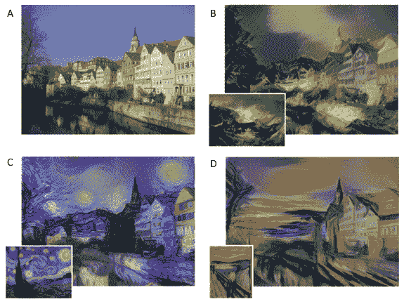

图 5.1 – (A) 内容图像。(B)-(D) 底部图像为风格图像，较大的图像为风格化图像（来源：Gatys 等，2015 年，《艺术风格的神经算法》 https://arxiv.org/abs/1508.06576）

与大多数深度学习训练需要大量训练数据不同，神经风格迁移仅需要两张图像——内容图像和风格图像。我们可以使用预训练的 CNN（如 VGG）将风格从风格图像转移到内容图像。

如上图所示，(**A**)是内容图像，(**B**)至(**D**)是风格图像和风格化图像。结果令人印象深刻，简直让人大开眼界！甚至有人用该算法创作并出售艺术画作。有一些网站和应用程序让人们上传照片进行风格迁移，而无需了解底层理论和编码。 当然，作为技术人员，我们更希望自己动手实现这些东西。

我们现在将详细了解如何实现神经风格迁移，从使用 CNN 提取图像特征开始。

## 使用 VGG 提取特征

分类卷积神经网络（CNNs），如 VGG，可以分为两部分。第一部分被称为**特征提取器**，主要由卷积层组成。后一部分由几个全连接层组成，用于给出类别的得分，这部分被称为**分类器头**。研究发现，经过 ImageNet 分类任务预训练的 CNN 也可以用于其他任务。

例如，如果你想为另一个只有 10 个类别的数据集创建分类 CNN，而不是 ImageNet 的 1,000 个类别，你可以保留特征提取器，仅用一个新的分类器头替换掉原来的。这被称为**迁移学习**，即我们可以将一些已学到的知识转移或重用于新的网络或应用程序。许多用于计算机视觉任务的深度神经网络都包括特征提取器，不论是复用权重还是从头开始训练。这包括**目标检测**和**姿势估计**。

在 CNN 中，随着我们向输出层逐步深入，它越来越倾向于学习图像内容的表示，而非其详细的像素值。为了更好地理解这一点，我们将构建一个网络来重建各层所看到的图像。图像重建的两个步骤如下：

1.  将图像前向传递通过 CNN 以提取特征。

1.  使用随机初始化的输入，我们*训练输入*，使其重建与*步骤 1*中参考特征最匹配的特征。

让我详细讲解一下*步骤 2*。在正常的网络训练中，输入图像是固定的，并且反向传播的梯度用于更新网络权重。

在神经风格迁移中，所有网络层都会被冻结，我们则使用梯度来改变输入。原始论文使用的是 VGG19，Keras 也有一个我们可以使用的预训练模型。VGG 的特征提取部分由五个块组成，每个块的末尾都有一次下采样。每个块包含两个到四个卷积层，整个 VGG19 有 16 个卷积层和 3 个全连接层，因此 VGG19 中的 19 代表具有可训练权重的 19 层。以下表格显示了不同的 VGG 配置：

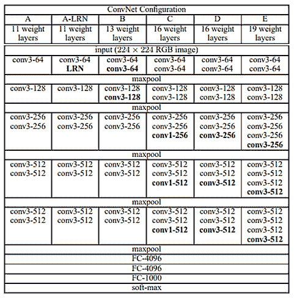

图 5.2 – 不同的 VGG 配置（来源：K. Simonyan, A. Zisserman, “Very Deep Convolutional Networks For Large-Scale Image Recognition” – https://arxiv.org/abs/1409.1556）

对应的 Jupyter 笔记本是`ch5_neural_style_transfer.ipynb`，它是完整的神经风格迁移解决方案。

然而，在接下来的文本中，我将使用更简单的代码来展示内容重构，随后会扩展以进行风格迁移。以下是使用预训练 VGG 提取`block4_conv2`输出层的代码：

```py
vgg = tf.keras.applications.VGG19(include_top=False, 						 weights='imagenet')
content_layers = ['block4_conv2']
content_outputs = [vgg.get_layer(x).output for x in  					content_layers]
model = Model(vgg.input, content_outputs)
```

预训练的 Keras CNN 模型分为两部分。底部部分由卷积层组成，通常在实例化 VGG 模型时被称为`include_top=False`。

VGG 预处理

一个 Keras 预训练模型期望输入图像为 BGR 格式，且范围在[0, 255]之间。因此，第一步是反转颜色通道，将 RGB 转换为 BGR。VGG 对不同颜色通道使用不同的均值。在`preprocess_input()`函数内部，像素值会分别从 B、G、R 通道中减去 103.939、116.779 和 123.68 的值。

以下是前向传递代码，其中图像首先进行预处理，然后输入到模型中以返回内容特征。我们然后提取内容特征并将其作为我们的目标：

```py
def extract_features(image):
    image = tf.keras.applications.vgg19.\ 			preprocess_input(image *255.)
    content_ref = model(image)
    return content_ref
content_image = tf.reverse(content_image, axis=[-1])
content_ref = extract_features(content_image) 
```

请注意，图像已被归一化到[0., 1.]，因此我们需要通过将其乘以 255 来恢复到[0., 255.]。然后我们创建一个随机初始化的输入，它也将成为风格化后的图像：

```py
image = tf.Variable(tf.random.normal( 					shape=content_image.shape))
```

接下来，我们将使用反向传播从内容特征重构图像。

## 内容重构

在训练步骤中，我们将图像输入到被冻结的 VGG 中以提取内容特征，并使用 L2 损失来与目标内容特征进行比较。以下是自定义的`loss`函数，用于计算每个特征层的 L2 损失：

```py
def calc_loss(y_true, y_pred):
    loss = [tf.reduce_sum((x-y)**2) for x, y in  					zip(y_pred, y_true)]
    return tf.reduce_mean(loss)
```

接下来的训练步骤使用 `tf.GradientTape()` 来计算梯度。在普通的神经网络训练中，梯度会应用到可训练的变量，即神经网络的权重上。然而，在神经风格迁移中，梯度会应用到图像上。之后，我们将图像值裁剪到 [0., 1.] 之间，如下所示：

```py
for i in range(1,steps+1):
    with tf.GradientTape() as tape:
        content_features = self.extract_features(image)
        loss = calc_loss(content_features, content_ref)
    grad = tape.gradient(loss, image)
    optimizer.apply_gradients([(grad, image)])
    image.assign(tf.clip_by_value(image, 0., 1.))
```

我们训练了 1,000 步，这就是重建的内容效果：

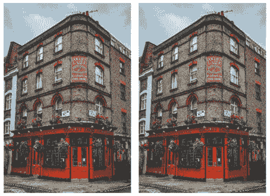

图 5.3 – 从内容层重建的图像 (来源: https://www.pexels.com/. (左)：原始内容图像，(右)：‘block1_1’ 的内容)

我们几乎可以用前几层卷积层（类似于 *block1_1*）重建图像，如上图所示：

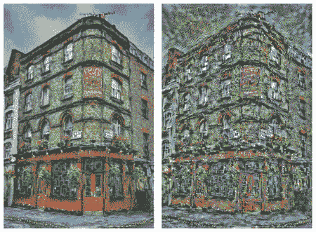

图 5.4 – 从内容层重建的图像 (左)：‘block4_1’ 的内容。(右)：‘block5_1’ 的内容

随着我们深入到 *block4_1*，我们开始失去一些细节，如窗框和建筑上的字母。继续深入到 *block5_1* 时，我们会发现所有细节都消失了，取而代之的是一些随机噪声。如果仔细观察，建筑的结构和边缘仍然完好无损，并且位于它们应该在的位置。现在，我们已经只提取了内容，并省略了风格。提取内容特征后，下一步是提取风格特征。

## 使用 Gram 矩阵重建风格

正如我们在风格重建中所看到的，特征图，尤其是前几层，既包含了风格也包含了内容。那么我们如何从图像中提取风格表示呢？Gatys 等人使用了**Gram 矩阵**，它计算了不同滤波器响应之间的相关性。假设卷积层 *l* 的激活形状为 (H, W, C)，其中 *H* 和 *W* 是空间维度，*C* 是通道数，也就是滤波器的数量。每个滤波器检测不同的图像特征，它们可以是水平线、对角线、颜色等等。

人类通过共享一些共同的特征（如颜色和边缘）来感知相似的纹理。例如，如果我们将一张草地的图像输入到卷积层，检测*垂直线*和*绿色*的滤波器将在其特征图中产生更大的响应。因此，我们可以利用特征图之间的相关性来表示图像中的纹理。

为了从形状为（H, W, C）的激活中创建 Gram 矩阵，我们首先将其重塑为 C 个向量。每个向量是一个大小为 H×W 的平铺特征图。我们对这 C 个向量执行内积，得到一个对称的 C×C Gram 矩阵。计算 Gram 矩阵的详细步骤如下：

1.  使用`tf.squeeze()`来移除批次维度（1, H, W, C），变为（H, W, C），因为批次大小始终是`1`。

1.  转置张量，将形状从（H, W, C）转换为（C, H, W）。

1.  将最后两个维度展平，变为（C, H×W）。

1.  对特征进行点积，创建一个形状为（C, C）的 Gram 矩阵。

1.  通过将矩阵除以每个平铺特征图中的点数（H×W）来进行归一化。

从单个卷积层激活计算 Gram 矩阵的代码如下：

```py
def gram_matrix(x):
    x = tf.transpose(tf.squeeze(x), (2,0,1));
    x = tf.keras.backend.batch_flatten(x)
    num_points = x.shape[-1]
    gram = tf.linalg.matmul(x, tf.transpose(x))/num_points
    return gram
```

我们可以使用这个函数来获取每个我们指定为风格层的 VGG 层的 Gram 矩阵。然后，我们对目标图像和参考图像的 Gram 矩阵使用 L2 损失。损失函数和其他代码与内容重建相同。创建 Gram 矩阵列表的代码如下：

```py
def extract_features(image):
    image = tf.keras.applications.vgg19.\ 				preprocess_input(image *255.)
    styles = self.model(image)
    styles = [self.gram_matrix(s) for s in styles]
    return styles
```

以下图像是从不同 VGG 层的风格特征重建而来的：

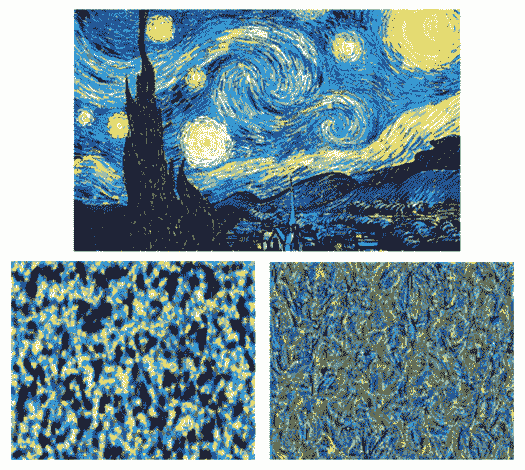

图 5.5 – （顶部）风格图像：文森特·梵高的《星空》。 （左下）从‘block1_1’重建的风格。 （右下）从‘block3_1’重建的风格。

在从*block1_1*重建的风格图像中，内容信息完全消失，仅显示出高空间频率的纹理细节。较高层次的*block3_1*显示出一些弯曲的形状，似乎捕捉了输入图像中风格的更高层次。Gram 矩阵的损失函数是**平方误差**的总和，而不是**均方误差**。因此，更高层次的风格层具有更高的固有权重，这允许转移更高层次的风格表示，如笔触。如果我们使用均方误差，低层次的风格特征（如纹理）会在视觉上更加突出，可能会看起来像高频噪声。

## 执行神经风格迁移

现在，我们可以将内容和风格重建的代码合并，执行神经风格迁移。

我们首先创建一个模型，提取两个特征块，一个用于内容，另一个用于风格。我们仅使用`block5_conv1`的一层作为内容层，使用从`block1_conv1`到`block5_conv1`的五层来捕捉来自不同层次的风格，如下所示：

```py
vgg = tf.keras.applications.VGG19(include_top=False, 						  weights='imagenet')
default_content_layers = ['block5_conv1']
default_style_layers = ['block1_conv1',
                        'block2_conv1',
                        'block3_conv1', 
                        'block4_conv1', 
                        'block5_conv1']
content_layers = content_layers if content_layers else default_content_layers
style_layers = style_layers if style_layers else default_style_layers
self.content_outputs = [vgg.get_layer(x).output for x in content_layers]
self.style_outputs = [vgg.get_layer(x).output for x in style_layers]
self.model = Model(vgg.input, [self.content_outputs, 					    self.style_outputs])
```

在训练循环开始之前，我们从各自的图像中提取内容和风格特征，作为目标使用。虽然我们可以使用随机初始化的输入进行内容和风格重建，但从内容图像开始训练会更快，如下所示：

```py
content_ref, _ = self.extract_features(content_image)
_, style_ref = self.extract_features(style_image)
```

然后，我们对内容损失和风格损失进行加权并相加。代码片段如下：

```py
def train_step(self, image, content_ref, style_ref):
    with tf.GradientTape() as tape:
        content_features, style_features = \ 					self.extract_features(image)
        content_loss = self.content_weight*self.calc_loss( 					  content_ref, content_features)
        style_loss = self.style_weight*self.calc_loss( 						style_ref, style_features)
        loss = content_loss + style_loss
    grad = tape.gradient(loss, image)
    self.optimizer.apply_gradients([(grad, image)])
    image.assign(tf.clip_by_value(image, 0., 1.))
    return content_loss, style_loss  
```

以下是使用不同权重和内容层次产生的两张风格化图像：

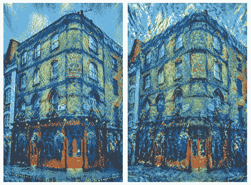

图 5.6 – 使用神经风格迁移的风格化图像

随时调整权重和层次，创造你想要的风格。我希望你现在对内容和风格的表示有了更好的理解，这将在我们探索高级生成模型时派上用场。接下来，我们将看看如何改进神经风格迁移。

# 改进风格迁移

研究界和工业界对神经风格迁移感到兴奋，并迅速开始应用它。有些人搭建了网站，允许用户上传照片进行风格迁移，而有些则利用该技术创造商品进行销售。随后，人们意识到原始神经风格迁移的一些局限性，并开始改进它。

其中一个最大的问题是，风格迁移将风格图像的所有风格信息，包括颜色和笔触，转移到内容图像的整个图像上。使用我们在前一节中做的例子，风格图像中的蓝色调被转移到了建筑物和背景中。如果我们可以选择只转移笔触而不转移颜色，并且仅转移到所需的区域，那该多好呢？

神经风格迁移的首席作者及其团队提出了一种新的算法来解决这些问题。下图展示了该算法能够提供的控制效果以及结果示例：

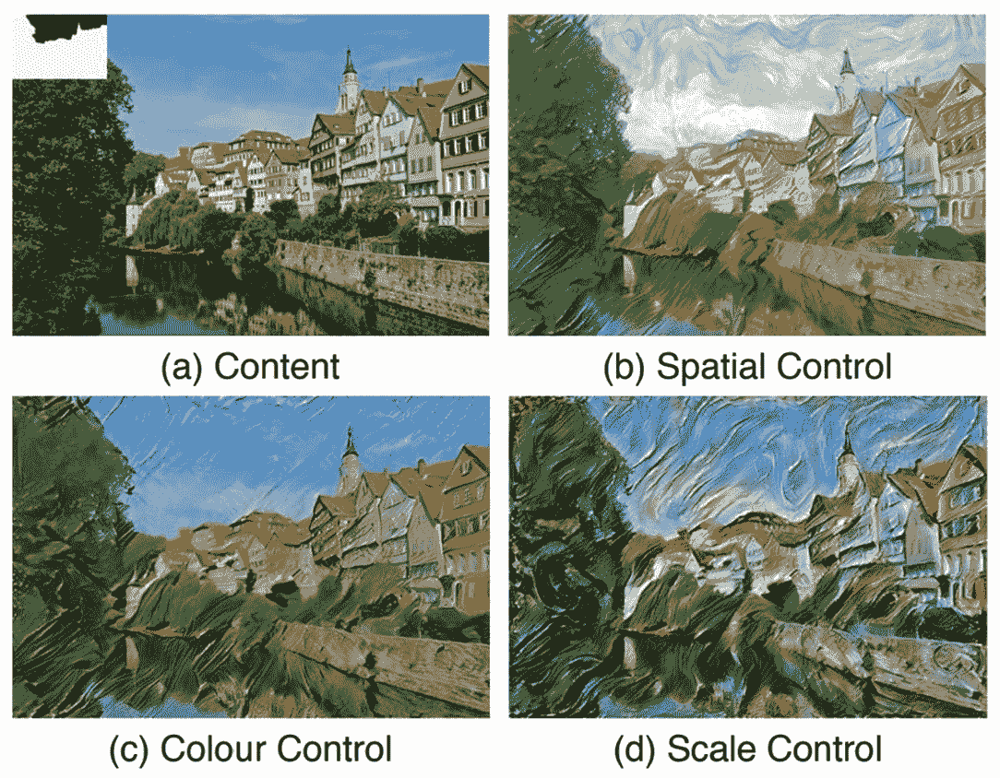

图 5.7 – 神经风格迁移的不同控制方法。（a）内容图像（b）天空和地面使用不同的风格图像进行风格化（c）保持内容图像的颜色（d）细尺度和粗尺度使用不同的风格图像进行风格化（来源：L. Gatys, 2017，“控制神经风格迁移中的感知因素”，https://arxiv.org/abs/1611.07865）

本文提出的控制方法如下：

+   **空间控制**：这控制了风格迁移在内容图像和风格图像中的空间位置。通过在计算 Gram 矩阵之前，对风格特征应用空间掩码来实现这一点。

+   **颜色控制**：这可以用来保持内容图像的颜色。为此，我们将 RGB 格式转换为色彩空间，使得 HCL 将亮度（明度）与其他颜色通道分开。我们可以将亮度通道视为灰度图像。然后，我们仅在亮度通道进行风格迁移，并将其与原始风格图像中的颜色通道合并，以得到最终的风格化图像。

+   **尺度控制**：这管理笔触的颗粒度。这个过程更为复杂，因为它需要多次执行风格迁移，并选择不同层次的风格特征以计算 Gram 矩阵。

这些感知控制对于创建更适合您需求的风格化图像非常有用。如果您愿意，我将把实现这些控制作为一个练习留给您，因为我们有更重要的内容需要讨论。

以下是与改善风格迁移相关的两个主要主题，它们对生成对抗网络（GAN）的发展产生了重大影响：

+   提高速度

+   改善风格变化

让我们回顾一下这些进展，为我们接下来的项目奠定一些基础——在实时中执行任意风格迁移。

## 使用前馈网络实现更快的风格迁移

神经风格迁移基于类似于神经网络训练的优化。它较慢，即使使用 GPU，也需要几分钟才能完成。这限制了它在移动设备上的潜在应用。因此，研究人员有动力开发更快速的风格迁移算法，**前馈风格迁移**应运而生。下图展示了采用这种架构的第一个网络之一：

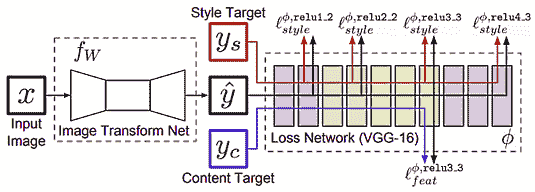

图 5.8 – 用于风格迁移的前馈卷积神经网络的框图。 (重绘自：J. Johnson 等人，2016 年《实时风格迁移和超分辨率的感知损失》 – https://arxiv.org/abs/1603.08155)

该架构比框图看起来更简单。该架构中有两个网络：

+   一个**可训练的卷积网络**（通常称为**风格迁移网络**），用于将输入图像转换为风格化图像。它可以实现为类似编码器-解码器的架构，例如 U-Net 或 VAE。

+   一个**固定的卷积网络**，通常是预训练的 VGG，用于测量内容和风格损失。

与原始神经风格迁移类似，我们首先使用 VGG 提取内容和风格目标。不同的是，我们现在训练一个卷积网络，将内容图像转化为风格化图像，而不是训练输入图像。风格化图像的内容和风格特征通过 VGG 提取，并计算损失，反向传播到可训练的卷积网络。我们像训练普通的前馈 CNN 一样训练它。在推理阶段，我们只需要执行一次前向传递即可将输入图像转换为风格化图像，这比之前快了 1,000 倍！

好的，速度问题现在解决了，但仍然存在一个问题。这样的网络只能学习一种风格进行迁移。我们需要为每种想要执行的风格训练一个网络，这比原始的风格迁移要不够灵活。于是人们开始着手解决这个问题，正如你可能猜到的那样，这个问题也得到了解决！我们稍后会讲解。

## 不同的风格特征

原始的神经风格迁移论文没有解释为什么 Gram 矩阵作为风格特征是有效的。许多后来的风格迁移改进，例如前馈风格迁移，继续仅将 Gram 矩阵用作风格特征。直到 2017 年，Y, Li 等人发表的*《揭秘神经风格迁移》*论文才做出了改变。他们发现风格信息本质上是通过 CNN 中的*激活分布*来表示的。他们展示了匹配激活的 Gram 矩阵等同于最小化激活分布的**最大均值差异**（**MMD**）。因此，我们可以通过匹配图像的激活分布与风格图像的激活分布来实现风格迁移。

因此，Gram 矩阵并不是实现风格迁移的唯一方法。我们也可以使用对抗性损失。让我们回想一下，像 pix2pix 这样的 GAN（ *第四章*, *图像到图像的转换*）可以通过匹配生成图像与真实（风格）图像的像素分布来执行风格迁移。不同之处在于，GAN 试图最小化像素分布的差异，而风格迁移是对层激活的分布进行最小化。

后来，研究人员发现我们可以仅通过激活的均值和方差的基本统计量来表示风格。换句话说，如果我们将两张风格相似的图像输入到 VGG，它们的层激活将具有相似的均值和方差。因此，我们可以通过最小化生成图像与风格图像之间激活均值和方差的差异来训练一个网络进行风格迁移。这促使了使用归一化层来控制风格的研究发展。

## 使用归一化层控制风格

一种简单而有效的控制激活统计量的方法是通过改变归一化层中的 gamma 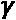和 beta *β*。换句话说，我们可以通过使用不同的仿射变换参数（gamma 和 beta）来改变风格。作为提醒，批归一化和实例归一化共享相同的公式，如下所示：

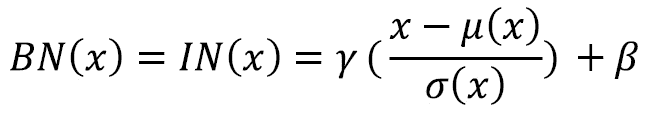

不同之处在于批归一化（*BN*）计算的是（N, H, W）维度的均值*µ*和标准差*σ*，而实例归一化（*IN*）仅从（H, W）维度计算。

然而，每个归一化层只有一对 gamma 和 beta，这限制了网络只能学习一种风格。我们如何让网络学习多种风格呢？我们可以使用多组 gamma 和 beta，每组记住一种风格。这正是**条件实例归一化**（**CIN**）所做的。

它基于实例归一化，但有多组 gamma 和 beta。每组 gamma 和 beta 用于训练特定的风格；换句话说，它们是基于风格图像进行条件化的。条件实例归一化的公式如下：

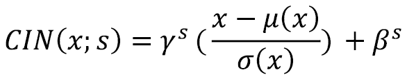

假设我们有*S*种不同的风格图像，那么我们在每个风格的归一化层中就有*S*个 gamma 和*S*个 beta。除了内容图像外，我们还将 one-hot 编码的风格标签输入到风格迁移网络中。在实际操作中，gamma 和 beta 被实现为形状为(S×C)的矩阵。我们通过将 one-hot 编码的标签（1×S）与矩阵（S×C）进行矩阵乘法，来获取每个（1×C）通道的*γ*S 和*β*s。通过代码实现时会更容易理解。不过，我们将在*第九章*，“视频合成”部分详细实现时再介绍。我们现在引入 CIN，为接下来的部分做准备。

现在，将风格编码到 gamma 和 beta 的嵌入空间中，我们可以通过插值 gamma 和 beta 来进行风格插值，如下图所示：

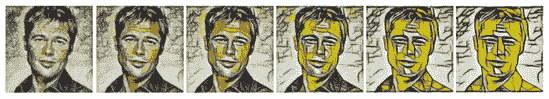

图 5.9 – 通过插值两种不同风格的 gamma 和 beta 来组合艺术风格（来源: V. Dumoulin 等, 2017 “A Learned Representation for Artistic Style” – https://arxiv.org/abs/1610.07629）

这很好，但网络仍然局限于训练中使用的固定*N*种风格。接下来，我们将学习并实现一个改进，使得任何任意风格都可以进行迁移！

# 实时任意风格迁移

在本节中，我们将学习如何实现一个能够实时进行任意风格迁移的网络。我们已经学习了如何使用前馈网络进行更快的推理，从而解决了实时部分。我们还学习了如何使用条件实例归一化来迁移固定数量的风格。现在，我们将学习另一种归一化技术，它允许任何任意风格，之后我们就可以开始实现代码了。

## 实现自适应实例归一化

像 CIN 一样，**AdaIN**也是实例归一化，这意味着均值和标准差是针对每张图像的(H, W)和每个通道计算的，而不是批量归一化，后者是在(N, H, W)上计算的。在 CIN 中，gamma 和 beta 是可训练的变量，它们学习不同风格所需的均值和方差。在 AdaIN 中，gamma 和 beta 被风格特征的标准差和均值替代，如下所示：

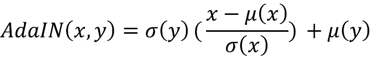

AdaIN 仍然可以被理解为一种条件实例归一化形式，其中条件是风格特征，而不是风格标签。在训练和推理时，我们使用 VGG 提取风格层的输出，并使用它们的统计量作为风格条件。这避免了需要预定义一组固定的风格。我们现在可以在 TensorFlow 中实现 AdaIN。该部分的笔记本是`ch5_arbitrary_style_transfer.ipynb`。

我们将使用 TensorFlow 的子类化来创建一个自定义的`AdaIN`层，如下所示：

```py
class AdaIN(layers.Layer):
    def __init__(self, epsilon=1e-5):
        super(AdaIN, self).__init__()
        self.epsilon = epsilon        
    def call(self, inputs):
        x = inputs[0] # content
        y = inputs[1] # style
        mean_x, var_x = tf.nn.moments(x, axes=(1,2), 							keepdims=True)
        mean_y, var_y = tf.nn.moments(y, axes=(1,2), 							keepdims=True)
        std_x = tf.sqrt(var_x+self.epsilon)
        std_y = tf.sqrt(var_y+self.epsilon)
        output = std_y*(x – mean_x)/(std_x) + mean_y    
        return output
```

这是方程的一个直接实现。有一点值得解释的是`tf.nn.moments`的使用，它也被用于 TensorFlow 批量归一化的实现。它计算特征图的均值和方差，其中轴`1`、`2`指的是特征图的 H 和 W。我们还设置了`keepdims=True`，以保持结果为四维，形状为(N, 1, 1, C)，而不是默认的(N, C)。前者允许 TensorFlow 对形状为(N, H, W, C)的输入张量进行广播运算。这里的广播指的是在更大的维度中重复一个值。

更准确地说，当我们从特定实例和通道的计算均值中减去*x*时，单个均值首先会重复成（H, W）的形状，然后再进行减法操作。接下来我们将看看如何将 AdaIN 应用到风格迁移中。

## 风格迁移网络架构

下图展示了风格迁移网络的架构和训练流程：

)](img/B14538_05_10.jpg)

图 5.10 – 使用 AdaIN 进行风格迁移的概述（重绘自：X. Huang, S. Belongie, 2017, “实时自适应实例归一化的任意风格迁移” – https://arxiv.org/abs/1703.06868）

**风格迁移网络**（**STN**）是一个编码器-解码器网络，其中编码器使用固定的 VGG 编码内容和风格特征。然后，AdaIN 将风格特征编码为内容特征的统计信息，解码器则利用这些新的特征生成风格化的图像。

### 构建编码器

以下是从 VGG 构建编码器的代码：

```py
def build_encoder(self, name='encoder'):
    self.encoder_layers = ['block1_conv1',
                           'block2_conv1',
                           'block3_conv1', 
                           'block4_conv1']
    vgg = tf.keras.applications.VGG19(include_top=False, 							weights='imagenet') 
    layer_outputs = [vgg.get_layer(x).output for x in  					self.encoder_layers] 
    return Model(vgg.input, layer_outputs, name=name)
```

这与神经风格迁移类似，只不过我们使用最后的风格层，`'block4_conv1'`，作为我们的内容层。因此，我们无需单独定义内容层。接下来，我们将对卷积层做一个小而重要的改进，以提高生成图像的外观。

### 使用反射填充减少块状伪影

通常，当我们在卷积层对输入张量应用填充时，常数零会围绕张量进行填充。然而，边界处的突变值会产生高频成分，并导致生成图像中的块状伪影。减少这些高频成分的一种方法是将*总变差损失*作为网络训练中的正则化项。

为此，我们首先通过将图像平移一个像素来简单地计算高频成分，然后减去原始图像生成一个矩阵。总变差损失是 L1 范数或绝对值的总和。因此，训练将尽量最小化此损失函数，从而减少高频成分。

还有另一种替代方法，即用反射值替代填充中的常数零。例如，如果我们用零填充一个 [10, 8, 9] 的数组，这将得到 [0, 10, 8, 9, 0]。然后我们可以看到值在 0 和其邻近值之间发生突变。

如果我们使用反射填充，填充后的数组将是 [8, 10, 8, 9, 8]，这将提供一个更平滑的过渡到边界。然而，Keras 的 Conv2D 不支持反射填充，因此我们需要使用 TensorFlow 子类化来创建一个自定义的 Conv2D。以下代码片段（代码已简化，完整代码请参阅 GitHub）展示了如何在卷积前向输入张量添加反射填充：

```py
class Conv2D(layers.Layer):
    @tf.function
    def call(self, inputs):
        padded = tf.pad(inputs, [[0, 0], [1, 1], [1, 1], 						[0, 0]], mode='REFLECT')
        # perform conv2d using low level API
        output = tf.nn.conv2d(padded, self.w, strides=1, 					   padding=”VALID”) + self.b
        if self.use_relu:
            output = tf.nn.relu(output)
        return output
```

上述代码来自 *第一章*，*使用 TensorFlow 开始图像生成*，但增加了一个低级的 `tf.pad` API 用于填充输入张量。

### 构建解码器

尽管我们在编码器代码中使用了 4 个 VGG 层（`block1_conv1`到`block4_conv1`），但只有编码器中的最后一层`block4_conv1`被 AdaIN 使用。因此，解码器的输入张量具有与`block4_conv1`相同的激活。解码器架构与我们在前几章中实现的相似，包含卷积层和上采样层，如下所示：

```py
def build_decoder(self):
    block = tf.keras.Sequential([\
            Conv2D(512, 256, 3),
            UpSampling2D((2,2)),
            Conv2D(256, 256, 3),
            Conv2D(256, 256, 3),
            Conv2D(256, 256, 3),
            Conv2D(256, 128, 3),
            UpSampling2D((2,2)),
            Conv2D(128, 128, 3),
            Conv2D(128, 64, 3),
            UpSampling2D((2,2)),
            Conv2D(64, 64, 3),
            Conv2D(64, 3, 3, use_relu=False)],
                               name='decoder')
    return block
```

上面的代码使用了自定义的`Conv2D`并且使用了反射填充。所有层都使用 ReLU 激活函数，除了输出层，它没有任何非线性激活函数。我们现在已经完成了 AdaIN、编码器和解码器的构建，可以继续进行图像预处理流水线。

### VGG 处理

就像我们之前构建的神经风格迁移一样，我们需要通过将颜色通道反转为 BGR 并减去颜色均值来预处理图像。代码如下：

```py
def preprocess(self, image):
    # rgb to bgr
    image = tf.reverse(image, axis=[-1])
    return tf.keras.applications.vgg19.preprocess_input(image)
```

我们可以在后处理阶段做相同的操作，即将颜色均值加回来并反转颜色通道。然而，这可以由解码器学习，因为颜色均值相当于输出层中的偏置。我们将让训练来完成这项任务，我们所需要做的就是将像素裁剪到[0, 255]的范围内，如下所示：

```py
def postprocess(self, image):
    return tf.clip_by_value(image, 0., 255.)
```

现在我们已经准备好了所有的构建模块，剩下的就是将它们组合起来创建 STN 和训练流水线。

### 构建风格迁移网络

构建**STN**非常简单，只需将编码器、AdaIN 和解码器连接起来，如前面的架构图所示。STN 也是我们用于执行推理的模型。实现这一功能的代码如下：

```py
content_image = self.preprocess(content_image_input)
style_image = self.preprocess(style_image_input) 
self.content_target = self.encoder(content_image)
self.style_target = self.encoder(style_image) 
adain_output = AdaIN()([self.content_target[-1], 				  self.style_target[-1]]) 
self.stylized_image = self.postprocess( 					self.decoder(adain_output)) 
self.stn = Model([content_image_input,  			  style_image_input],  			  self.stylized_image)
```

内容图像和风格图像经过预处理后输入编码器。最后的特征层，即来自两幅图像的`block4_conv1`，进入`AdaIN()`。风格化后的特征然后进入解码器，生成 RGB 格式的风格化图像。

## 任意风格迁移训练

就像神经和前馈风格迁移一样，内容损失和风格损失是通过固定的 VGG 提取的激活计算得出的。内容损失也是 L2 范数，但生成的风格化图像的内容特征现在与 AdaIN 的输出进行比较，而不是与内容图像的特征进行比较，如下所示。论文的作者发现，这可以加速收敛：

```py
content_loss =  tf.reduce_sum((output_features[-1]-\ 					    adain_output)**2)
```

对于风格损失，常用的 Gram 矩阵被替换为激活统计量的 L2 范数（均值和方差）。这产生与 Gram 矩阵类似的结果，但在概念上更加简洁。以下是风格损失函数的方程：

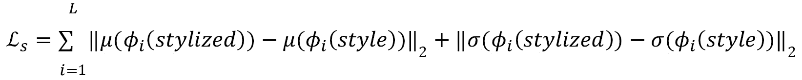

这里，*φ*i 表示用于计算风格损失的 VGG-19 中的某一层。

我们像 AdaIN 层一样使用`tf.nn.moments`来计算风格化图像和风格图像的特征统计量以及 L2 范数。每个风格层的权重相同，因此我们平均内容层的损失，如下所示：

```py
def calc_style_loss(self, y_true, y_pred):
    n_features = len(y_true)
    epsilon = 1e-5
    loss = [] 
    for i in range(n_features):
        mean_true, var_true = tf.nn.moments(y_true[i], 						axes=(1,2), keepdims=True)
        mean_pred, var_pred = tf.nn.moments(y_pred[i], 						axes=(1,2), keepdims=True)
        std_true, std_pred = tf.sqrt(var_true+epsilon), 						tf.sqrt(var_pred+epsilon)
        mean_loss = tf.reduce_sum(tf.square( 						    mean_true-mean_pred))
        std_loss = tf.reduce_sum(tf.square( 						  std_true-std_pred))
        loss.append(mean_loss + std_loss) 
    return tf.reduce_mean(loss)
```

最后的步骤是编写训练步骤，如下所示：

```py
def train_step(self, train_data):
    with tf.GradientTape() as tape:
        adain_output, output_features, style_target = \ 					self.training_model(train_data) 
        content_loss = tf.reduce_sum( 				(output_features[-1]-adain_output)\ 									**2)
        style_loss = self.style_weight * \ 				  self.calc_style_loss( 					style_target, output_features)
        loss =  content_loss + style_loss 
        gradients = tape.gradient(loss, 				 self.decoder.trainable_variables) 
        self.optimizer.apply_gradients(zip(gradients, 				self.decoder.trainable_variables)) 
    return content_loss, style_loss
```

我们不再调整内容和风格的权重，而是将内容权重固定为 `1`，仅调整风格权重。在这个例子中，我们将内容权重设置为 `1`，将风格权重设置为 `1e-4`。在 *图 5.10* 中，可能看起来有三个网络需要训练，但其中两个是固定的 VGG 网络，因此唯一需要训练的网络是解码器。因此，我们只跟踪并应用解码器的梯度。

提示

前面的训练步骤可以通过 Keras 的 `train_on_batch()` 函数替代（参见 *第三章*，*生成对抗网络*），这样可以减少代码行数。我将把这个作为附加练习留给你。

在这个示例中，我们将使用人脸作为内容图像，使用 `cyclegan/vangogh2photo` 作为风格图像。尽管梵高的画作属于一种艺术风格，但从风格迁移的角度来看，每个风格图像都是一个独特的风格。`vangogh2photo` 数据集包含了 400 张风格图像，这意味着我们正在用 400 种不同的风格训练网络！以下图示展示了我们网络生成的图像示例：

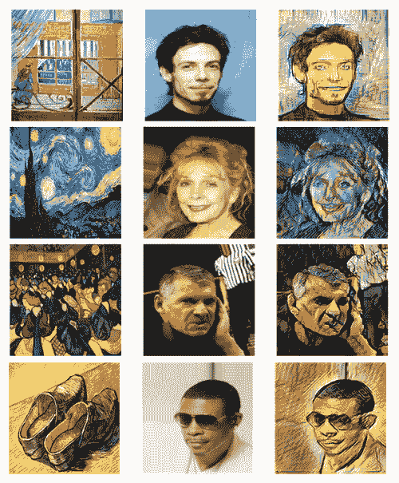

图 5.11 – 任意风格迁移。（左）风格图像（中）内容图像（右）风格化图像

上述图中的图像展示了在推理时使用风格图像进行的风格迁移，这些风格图像是网络之前没有见过的。每次风格迁移只需进行一次前向传播，这比原始神经风格迁移算法的迭代优化要快得多。在理解了各种风格迁移技术后，我们现在可以很好地学习如何设计具有风格的 GAN（双关语）。

# 风格基础 GAN 简介

风格迁移的创新对 GAN 的发展产生了影响。尽管当时的 GAN 能够生成逼真的图像，但它们是通过使用随机潜在变量生成的，我们对这些潜在变量代表的内容几乎没有理解。即使多模态 GAN 能够创建生成图像的变化，但我们不知道如何控制潜在变量以达到我们想要的结果。

在理想的世界里，我们希望能够拥有一些控制器，独立地控制我们希望生成的特征，就像在*第二章*中关于面部操控的练习一样，变分自编码器（Variational Autoencoder）。这被称为**解耦表示**，这是深度学习中的一个相对较新的概念。解耦表示的思想是将一张图像分解为独立的表示。例如，一张面部图像包含两只眼睛、一只鼻子和一张嘴，每个部分都是面部的一个表示。正如我们在风格迁移中学到的，一张图像可以解耦为内容和风格。因此，研究人员将这一思想引入了生成对抗网络（GAN）。

在接下来的章节中，我们将探讨一种基于风格的生成对抗网络（GAN），即**MUNIT**。由于书本的篇幅限制，我们不会编写详细的代码，而是会概述整体架构，以理解这些模型中风格是如何应用的。

## 多模态无监督图像到图像翻译（MUNIT）

MUNIT 是一种图像到图像翻译模型，类似于 BicycleGAN（*第四章*，*图像到图像翻译*）。这两者都可以生成具有连续分布的多模态图像，但 BicycleGAN 需要配对数据，而 MUNIT 则不需要。BicycleGAN 通过使用两个模型，将目标图像与潜在变量相关联，生成多模态图像。然而，如何控制潜在变量来改变输出，及这些模型如何工作，并不非常清晰。而 MUNIT 的方式在概念上有很大的不同，但也更易于理解。它假设源图像和目标图像共享相同的内容空间，但风格不同。

以下图表展示了 MUNIT 背后的主要思想：

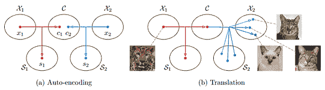

图 5.12 – MUNIT 方法的示意图。（改绘自：X. Huang 等人，2018 年，“多模态无监督图像到图像翻译” – https://arxiv.org/abs/1804.04732）

假设我们有两张图像，**X**1 和 **X**2。每张图像都可以表示为内容编码和风格编码的对（**C**1, **S**1）和（**C**2, **S**2）。假设**C**1 和**C**2 都处于共享内容空间**C**中。换句话说，内容可能不完全相同，但相似。风格则存在于各自的特定领域风格空间中。因此，从**X**1 和**X**2 的图像翻译可以表述为生成一个图像，内容编码来自**X**1，风格编码来自**X**2，或者换句话说，来自编码对（**C**1, **S**2）。

在以前的风格迁移中，我们将风格视为具有不同笔触、颜色和纹理的艺术风格。现在，我们将风格的意义扩展到艺术画作之外。例如，老虎和狮子只是具有不同胡须、皮肤、毛发和形态风格的猫。接下来，让我们来看一下 MUNIT 模型架构。

### 理解架构

MUNIT 架构如下面的图所示：

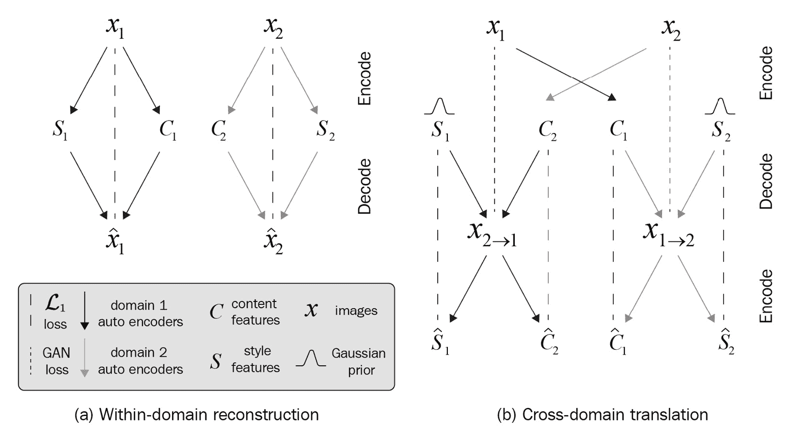

图 5.13 – MUNIT 模型概览（重绘自：X. Huang 等人, 2018 年，“多模态无监督图像到图像的转换” – https://arxiv.org/abs/1804.04732）

这里有两个自动编码器，一个位于每个域中。自动编码器将图像编码为风格和内容编码，然后解码器将其解码回原始图像。这是通过对抗损失进行训练的，换句话说，模型由一个自动编码器组成，但其训练方式类似于 GAN。

在前面的图中，图像重建过程显示在左侧。右侧是跨域转换。如前所述，要将**X**1 转换为**X**2，我们首先将图像编码为各自的内容和风格编码，然后我们对其进行以下两项操作：

1.  我们在风格域 2 中生成一个假的图像，风格为（**C**1, **S**2）。这个过程也是通过 GANs 进行训练的。

1.  我们将假图像编码为内容和风格编码。如果转换效果良好，那么它应该与（**C**1, **S**2）相似。

好吧，如果这听起来很熟悉，那是因为这就是*循环一致性约束*，它来自 CycleGAN。只不过，在这里循环一致性并不是应用于图像，而是应用于内容和风格编码。

### 探索自动编码器设计

最后，让我们看一下自动编码器的详细架构，如下图所示：

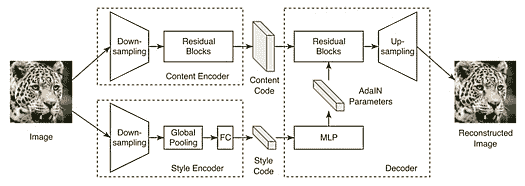

图 5.14 – MUNIT 模型概览（来源：X. Huang 等人, 2018 年，“多模态无监督图像到图像的转换” – https://arxiv.org/abs/1804.04732）

与其他风格迁移模型不同，MUNIT 不使用 VGG 作为编码器。它使用两个独立的编码器，一个用于内容，另一个用于风格。内容编码器由若干残差块组成，并具有实例归一化和下采样功能。这与 VGG 的风格特征非常相似。

风格编码器与内容编码器在两个方面不同：

+   首先，这里没有归一化。正如我们所学，归一化激活值为零意味着去除了风格信息。

+   其次，残差块被完全连接层所替代。这是因为风格被视为空间不变的，因此我们不需要卷积层来提供空间信息。

也就是说，风格编码只包含眼睛颜色的信息，而无需了解眼睛的位置，因为这是内容编码的责任。风格编码是一个低维向量，通常大小为 8，这与 GAN 和 VAE 中的高维潜在变量以及风格迁移中的样式特征不同。风格编码大小较小的原因是为了减少控制风格的“旋钮”数量，从而使控制变得更加易于管理。下图展示了内容编码和风格编码如何输入到解码器中：

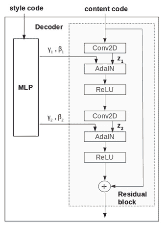

图 5.15 – 解码器中的 AdaIN 层

解码器中的生成器由一组残差块组成。只有第一组中的残差块使用 AdaIN 作为归一化层。AdaIN 的公式如下，其中 *z* 是前一个卷积层的激活输出：

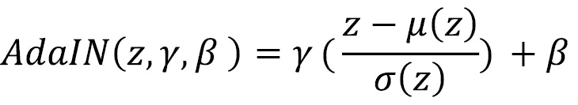

在任意前馈神经风格迁移中，我们使用单一风格层的均值和标准差作为 AdaIN 中的 gamma 和 beta。在 MUNIT 中，gamma 和 beta 是通过 **多层感知机** (**MLP**) 从风格编码生成的。

### 动物图像翻译

以下截图展示了 MUNIT 进行的 *1 对多* 图像翻译样本。通过使用不同的风格编码，我们可以生成多种不同的输出图像：

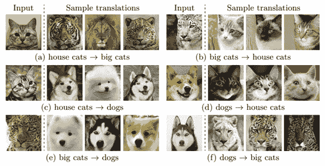

图 5.16 – MUNIT 动物图像翻译（来源：X. Huang 等，2018 年，“Multimodal Unsupervised Image-to-Image Translation” – https://arxiv.org/abs/1804.04732）

截至目前，MUNIT 仍然是多模态图像到图像翻译领域的最先进模型，详见 [`paperswithcode.com/task/multimodal-unsupervised-image-to-image`](https://paperswithcode.com/task/multimodal-unsupervised-image-to-image)。

如果你对代码实现感兴趣，可以参考 NVIDIA 提供的官方实现，地址为 [`github.com/NVlabs/MUNIT`](https://github.com/NVlabs/MUNIT)。

# 总结

在本章中，我们介绍了基于样式的生成模型的演变。一切始于神经风格迁移，我们了解到图像可以分解为内容和风格。原始算法较慢，在推理时，迭代优化过程被实时样式迁移的前馈过程所取代，能够实现实时的风格迁移。

我们随后了解到，Gram 矩阵并不是唯一表示风格的方法，我们也可以使用层的统计信息。因此，已经研究了归一化层来控制图像的风格，这最终促成了 AdaIN 的诞生。通过结合前馈网络和 AdaIN，我们实现了实时的任意风格迁移。

随着风格迁移的成功，AdaIN 也被应用于生成对抗网络（GANs）。我们详细介绍了 MUNIT 架构，重点讲解了 AdaIN 如何用于多模态图像生成。有一个基于风格的 GAN 你应该熟悉，它叫做 StyleGAN。StyleGAN 因其生成超逼真、高保真度人脸图像的能力而闻名。StyleGAN 的实现需要对渐进式 GAN 有所了解。因此，我们将在*第七章*中详细讨论，*高保真度人脸生成*。

到目前为止，GANs 正逐渐远离仅使用随机噪声作为输入的黑箱方法，转向更好地利用数据属性的解耦表示方法。在下一章，我们将探讨如何在绘画创作中使用特定的 GAN 技术。
