# 第六章：*第六章*：AI 画家

在这一章中，我们将讨论两种可以用来生成和编辑图像的**生成对抗网络**（**GANs**）；它们分别是 iGAN 和 GauGAN。**iGAN**（**互动 GAN**）是第一个展示如何利用 GANs 进行互动图像编辑和转换的网络，最早出现在 2016 年。那时，GANs 尚处于兴起阶段，生成的图像质量不如今天的网络那样令人印象深刻，但它为 GANs 进入主流图像编辑开辟了道路。

在这一章中，你将了解 iGAN 的概念，并浏览一些展示视频的相关网站。该部分不会包含代码。接着，我们将介绍一个由 Nvidia 于 2019 年推出的更为先进的获奖应用——**GauGAN**，该应用能够将语义分割掩码转换为真实的风景照片，产生令人印象深刻的效果。

我们将从零开始实现 GauGAN，首先介绍一种新的归一化技术——**空间自适应归一化**。我们还将了解一种新的损失函数——**铰链损失**，并最终构建一个完整的 GauGAN。GauGAN 生成的图像质量远远优于我们在前几章中讲解的通用图像到图像转换网络。

在本章中，我们将涵盖以下主题：

+   iGAN 简介

+   使用 GauGAN 进行分割图到图像的转换

# 技术要求

相关的 Jupyter 笔记本和代码可以在这里找到：

[`github.com/PacktPublishing/Hands-On-Image-Generation-with-TensorFlow-2.0/tree/master/Chapter06`](https://github.com/PacktPublishing/Hands-On-Image-Generation-with-TensorFlow-2.0/tree/master/Chapter06)

本章使用的笔记本是`ch6_gaugan.ipynb`。

# iGAN 简介

我们现在已经熟悉了使用生成模型，如 pix2pix（见*第四章*《图像到图像的转换》）从草图或分割掩码生成图像。然而，由于大多数我们并非专业画家，画出的草图通常很简单，因此生成的图像形状也较为简单。如果我们能使用一张真实图像作为输入，并通过草图来改变其外观呢？

在 GANs 的早期，有一篇名为*Generative Visual Manipulation on the Natural Image Manifold*的论文，作者 J-Y. Zhu（CycleGAN 的发明者）等人，探讨了如何利用学习到的潜在表示进行图像编辑和变形。作者们建立了一个网站，[`efrosgans.eecs.berkeley.edu/iGAN/`](http://efrosgans.eecs.berkeley.edu/iGAN/)，其中包含展示以下几个应用场景的视频：

+   **互动图像生成**：这涉及到实时从草图生成图像，示例如下：

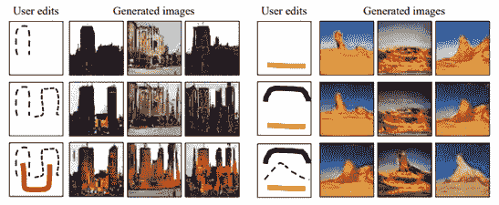

图 6.1 – 交互式图像生成，通过简单的笔触生成图像（来源：J-Y. Zhu 等，2016，“在自然图像流形上的生成视觉操作”，[`arxiv.org/abs/1609.03552`](https://arxiv.org/abs/1609.03552)）  

+   **交互式图像编辑**：导入一张图片，我们使用 GAN 进行图像编辑。早期的 GAN 生成的图像仅使用噪声作为输入。即使是 BicycleGAN（在 iGAN 发明几年后出现的技术），也只能随机地改变生成图像的外观，而无法进行直接操作。iGAN 让我们能够指定颜色和纹理的变化，令人印象深刻。

+   **交互式图像变换**（**形变**）：给定两张图像，iGAN 可以创建一系列图像，展示从一张图像到另一张图像的形变过程，如下所示：

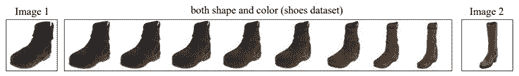

图 6.2 – 交互式图像变换（形变）。给定两张图像，可以生成一系列中间图像（来源：J-Y. Zhu 等，2016，“在自然图像流形上的生成视觉操作”，[`arxiv.org/abs/1609.03552`](https://arxiv.org/abs/1609.03552)）

术语**流形**在论文中出现频繁。它也出现在其他机器学习文献中，因此我们花点时间来理解它。

## 理解流形

我们可以从自然图像的角度来理解流形。一个颜色像素可以通过 8 位或 256 位数字表示；单个 RGB 像素本身就可以有 256x256x256 = 160 万种不同的组合！用同样的逻辑，图像中所有像素的总可能性是天文数字！

然而，我们知道像素之间并非独立；例如，草地的像素限制在绿色范围内。因此，图像的高维度并不像看起来那么令人生畏。换句话说，维度空间比我们最初想象的要小得多。因此，我们可以说，高维图像空间是由低维流形支持的。

流形是物理学和数学中用来描述光滑几何表面的术语。流形可以存在于任何维度中。一维流形包括直线和圆；二维流形被称为**曲面**。*球体*是一个三维流形，它在任何地方都是光滑的。相对而言，*立方体*不是流形，因为它在顶点处并不光滑。事实上，我们在*第二章**，变分自编码器*中看到，一个具有二维潜在维度的自编码器的潜在空间是 MNIST 数字的二维流形投影。以下图示显示了数字的二维潜在空间：

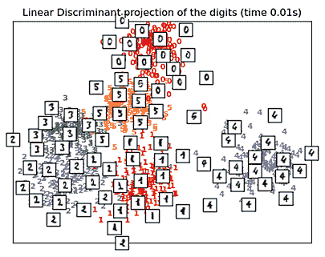

图 6.3 – 数字的二维流形示意图。(来源: https://scikit-learn.org/stable/modules/manifold.html)

一个很好的资源来可视化 GAN 中的流形是[`poloclub.github.io/ganlab/`](https://poloclub.github.io/ganlab/)上的交互式工具。在以下示例中，一个 GAN 被训练用于将均匀分布的二维样本映射到具有圆形分布的二维样本：

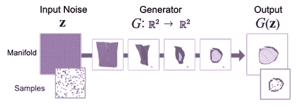

图 6.4 – 生成器的数据转换被可视化为流形，将输入噪声（左侧）转化为假样本（右侧）。(来源: M. Kahng, 2019, "GAN Lab: 使用交互式可视化实验理解复杂的深度生成模型," IEEE Transactions on Visualization and Computer Graphics, 25(1) (VAST 2018) [`minsuk.com/research/papers/kahng-ganlab-vast2018.pdf`](https://minsuk.com/research/papers/kahng-ganlab-vast2018.pdf))

我们可以通过使用流形来可视化这种映射，其中输入被表示为一个均匀的方形网格。生成器将高维输入网格转换为一个低维的扭曲版本。图中右上方显示的输出是生成器近似的流形。生成器输出，或者说假图像（图中右下角），是从流形上采样的样本，其中网格块较小的区域意味着更高的采样概率。

本文的假设是，来自随机噪声**z**的 GAN 输出**G(z)**，位于一个平滑流形上。因此，给定流形上的两张图像，**G(z**0**)**和**G(z**N**)**，我们可以通过在潜在空间中插值得到一个包含平滑过渡的*N* + 1 张图像序列*[G(z*0*) , G(z*0*), ..., G(z*N*)]*。这种自然图像流形的近似用于执行*真实感图像编辑*。

## 图像编辑

现在我们知道什么是流形，接下来我们看看如何利用这些知识进行图像编辑。图像编辑的第一步是将图像投影到流形上。

### 将图像投影到流形上

将图像投影到流形上意味着使用预训练的 GAN 生成一张接近给定图像的图像。在本书中，我们将使用预训练的 DCGAN，其中生成器的输入是一个 100 维的潜在向量。因此，我们需要找到一个潜在向量，以生成尽可能接近原始图像的图像流形。实现这一目标的一种方法是使用优化，例如**风格迁移**，这一主题我们在*第五章**，风格迁移*中详细讲解过。

1.  我们首先使用预训练的**卷积神经网络**（**CNN**），例如 VGG 中的*block5_conv1*层的输出（见*第五章**，风格迁移*），提取原始图像的特征，并将其作为目标。

1.  然后，我们使用预训练的 DCGAN 生成器，并冻结权重，通过最小化特征之间的 L2 损失来优化输入的潜在向量。

正如我们在风格迁移中所学到的，优化可能运行缓慢，因此在交互式绘图时响应较慢。

另一种方法是训练一个前馈网络来预测图像的潜在向量，这种方法速度更快。如果 GAN 是将分割掩码转换为图像，那么我们可以使用诸如 U-Net 之类的网络来从图像中预测分割掩码。

使用前馈网络进行流形投影看起来类似于使用自编码器。编码器从原始图像中编码（预测）潜在变量，然后解码器（在 GAN 中是生成器）将潜在变量投影到图像流形上。然而，这种方法并不总是完美的。这时，*混合*方法派上了用场。我们使用前馈网络来预测潜在变量，然后通过优化进行微调。下图展示了使用不同技术生成的图像：

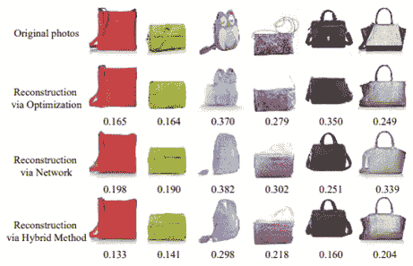

图 6.5 – 使用 GAN 将真实照片投影到图像流形上。（来源：J-Y. Zhu 等人，2016 年，《自然图像流形上的生成视觉操作》，[`arxiv.org/abs/1609.03552`](https://arxiv.org/abs/1609.03552)）

由于我们现在已经获得了潜在向量，我们将使用它来编辑流形。

### 使用潜在向量编辑流形

现在我们已经获得了潜在变量 *z*0 和图像流形 *x*0 *= G(z*0*)*，下一步是操作 *z*0 来修改图像。假设图像是一只红色鞋子，我们想将其颜色改为黑色——我们该如何做呢？最简单也是最粗糙的方法是打开图像编辑软件，选择图中所有的红色像素并将它们改为黑色。生成的图像可能看起来不太自然，因为可能会丢失一些细节。传统的图像编辑工具算法通常不太适用于具有复杂形状和细致纹理细节的自然图像。

另一方面，我们知道我们可能可以改变潜在向量，并将其输入生成器来改变颜色。在实际操作中，我们并不知道如何修改潜在变量以获得我们想要的结果。

因此，我们可以从另一个方向来解决这个问题，而不是直接改变潜在向量。我们可以编辑流形，例如，通过在鞋子上画一条黑色条纹，然后用它来优化潜在变量，再将其投影以在流形上生成另一张图像。

本质上，我们执行的是如前所述的流形投影优化，但使用的是不同的损失函数。我们希望找到一个图像流形 *x*，使得以下方程最小化：

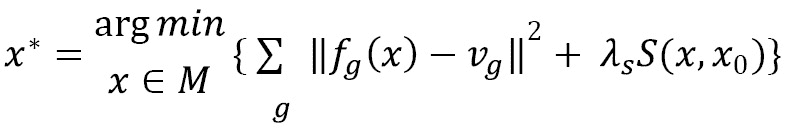

让我们从第二个损失项 *S(x, x*0*)* 开始，这是用于流形平滑性的 L2 损失，旨在鼓励新的流形不要偏离原始流形太多。这个损失项保持图像的整体外观。第一个损失项是数据项，它将所有编辑操作的损失进行求和。这个最好通过以下图像来描述：

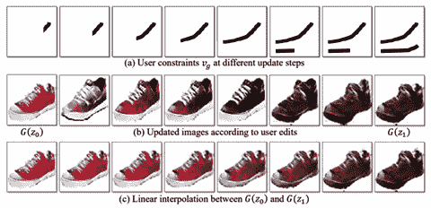

图 6.6 – 使用 GAN 将真实照片投影到图像流形上。（来源：J-Y. Zhu 等人，2016 年，《自然图像流形上的生成视觉操作》，[`arxiv.org/abs/1609.03552`](https://arxiv.org/abs/1609.03552)）

这个示例使用色彩画笔来改变鞋子的颜色。由于本书的灰度打印中颜色变化不明显，建议查看论文的彩色版本，您可以从 [`arxiv.org/abs/1609.03552`](https://arxiv.org/abs/1609.03552) 下载。前面图形的顶行显示了作为约束的画笔笔触 *v*g 和 *f*g 作为编辑操作。我们希望画笔笔触 *f*g*(x)* 中的每个流形像素尽可能接近 *v*g。

换句话说，如果我们在鞋子上涂上黑色笔触，我们希望图像流形中的那部分是黑色的。这就是我们的意图，但要实现它，我们需要对潜在变量进行优化。因此，我们将前面的方程从像素空间重新表述为潜在空间。方程如下：

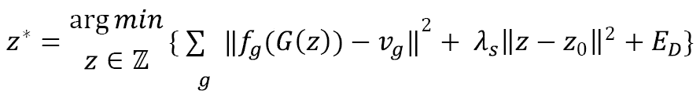

最后一项术语 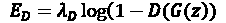 是 *GAN 的对抗损失*。这个损失用于让流形看起来更真实，并略微提高视觉质量。默认情况下，这个项不会用于提高帧率。定义了所有损失项后，我们可以使用 TensorFlow 优化器，如 Adam，来运行优化。

### 编辑传递

**编辑传递**是图像编辑的最后一步。现在我们有两个流形，*G(z*0*)* 和 *G(z*1*)*，我们可以通过在潜在空间中对 *z*0 和 *z*1 进行线性插值，生成一系列的中间图像。由于 DCGAN 的容量限制，生成的流形可能会显得模糊，且可能没有我们预期的那样逼真。

上述论文的作者解决这个问题的方式是：不使用流形作为最终图像，而是估计流形之间的颜色和几何变化，并将这些变化应用到原始图像上。颜色和运动流的估计是通过光流进行的；这是一种传统的计算机视觉技术，超出了本书的讨论范围。

以鞋子示例为例，如果我们关注的是颜色变化，我们会估计流形间像素的颜色变化，然后将颜色变化转移到原始图像中的像素上。类似地，如果变换涉及扭曲，即形状变化，我们就需要衡量像素的运动并将它们应用到原始图像上进行形态变化。网站上的示范视频是通过运动和颜色流共同创建的。

总结一下，我们现在已经了解到，iGAN 并不是一个 GAN，而是一种使用 GAN 进行图像编辑的方法。首先通过优化或前馈网络将真实图像投影到流形上。接着，我们使用画笔笔触作为约束，修改由潜在向量生成的流形。最后，我们将插值流形的颜色和运动流应用到真实图像上，从而完成图像编辑。

由于没有新的 GAN 架构，我们将不会实现 iGAN。相反，我们将实现 GauGAN，其中包含一些令人兴奋的新创新，适合于代码实现。

# 使用 GauGAN 进行分割图到图像的转换

**GauGAN**（以 19 世纪画家保罗·高更命名）是来自**Nvidia**的一种生成对抗网络（GAN）。说到 Nvidia，它是为数不多的几家在 GAN 领域进行大规模投资的公司之一。他们在这一领域取得了若干突破，包括**ProgressiveGAN**（我们将在*第七章*中介绍，*高保真面部生成*），用于生成高分辨率图像，以及**StyleGAN**，用于高保真面孔生成。

他们的主要业务是制造图形芯片，而非 AI 软件。因此，与一些其他公司不同，后者将其代码和训练模型视为严格保密，Nvidia 倾向于将其软件代码开源给公众。他们建立了一个网页（[`nvidia-research-mingyuliu.com/gaugan/`](http://nvidia-research-mingyuliu.com/gaugan/)），展示 GauGAN，这个工具可以根据分割图生成逼真的景观照片。以下截图取自他们的网页。

随时暂停本章并尝试一下该应用程序，看看它有多好：

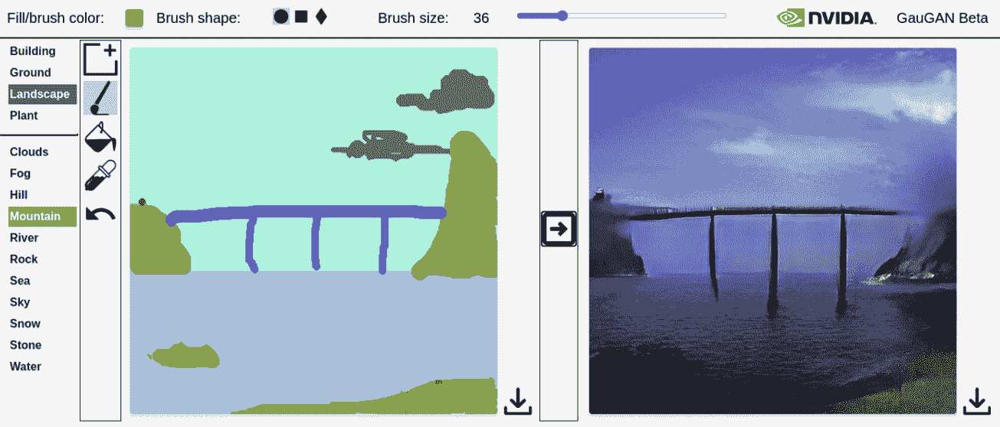

图 6.7 – 通过 GauGAN 从画笔笔触到照片

现在我们将学习 pix2pixHD。

## pix2pixHD 简介

GauGAN 以**pix2pixHD**为基础，并在其上增加了新特性。pix2pixHD 是 pix2pix 的升级版本，能够生成**高清**（**HD**）图像。由于本书中未涉及 pix2pixHD，且我们不会使用高清数据集，因此我们将在 pix2pix 的架构和我们已熟悉的代码基础上构建我们的 GauGAN 基础。尽管如此，了解 pix2pixHD 的高级架构还是很有帮助的，我将带你了解一些高层次的概念。下图展示了 pix2pixHD 生成器的架构：

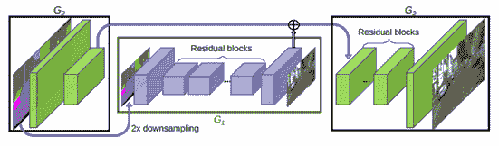

图 6.8 – pix2pixHD 生成器的网络架构。（来源：T-C. W 等人，2018 年，《使用条件生成对抗网络进行高分辨率图像合成和语义操作》，[`arxiv.org/abs/1711.11585`](https://arxiv.org/abs/1711.11585)）

为了生成高分辨率图像，pix2pixHD 在不同图像分辨率下使用两个生成器，分别在粗尺度和细尺度上工作。粗生成器**G1**工作在图像分辨率的一半；也就是说，输入和目标图像被下采样到原图像分辨率的一半。当粗生成器训练完成后，我们开始训练粗生成器**G1**与细生成器**G2**，后者在全图像尺度上工作。从前面的架构图中，我们可以看到，**G1**的编码器输出与**G1**的特征连接，并输入到**G2**的解码器部分，生成高分辨率图像。这种设置也被称为**粗到细生成器**。

pix2pixHD 使用三个 PatchGAN 判别器，这些判别器在不同的图像尺度上工作。一个新的损失函数，称为特征匹配损失，用于匹配真实图像和假图像之间的层特征。这在风格迁移中得到应用，我们使用预训练的 VGG 进行特征提取，并优化风格特征。

现在我们已经简单介绍了 pix2pixHD，我们可以继续讲解 GauGAN。但在此之前，我们将实现一种归一化技术来展示 GauGAN。

## 空间自适应归一化（SPADE）

GauGAN 的主要创新是为分割图采用一种层归一化方法，称为**空间自适应归一化**（**SPADE**）。没错，又一个进入 GAN 工具箱的归一化技术。我们将深入探讨 SPADE，但在此之前，我们应了解网络输入的格式——**语义分割图**。

### 独热编码分割掩码

我们将使用`facades`数据集来训练我们的 GauGAN。在之前的实验中，分割图被编码为 RGB 图像中的不同颜色；例如，墙面用紫色掩码表示，门则是绿色。这种表示方式对我们来说视觉上很容易理解，但对神经网络学习并没有太大帮助。因为这些颜色没有语义意义。

颜色在色彩空间中接近，并不意味着它们在语义上也接近。我们可以用浅绿色表示草地，用深绿色表示飞机，尽管它们在分割图中颜色接近，但它们的语义并没有关联。

因此，我们应该使用类别标签而非颜色来标注像素。但这仍然没有解决问题，因为类别标签是随机分配的数字，它们也没有语义意义。因此，更好的方法是使用**分割掩码**，当某个像素处有物体时，标签为 1，否则为 0。换句话说，我们将分割图中的标签进行独热编码，得到形状为(H, W, 类别数)的分割掩码。下图展示了建筑图像的语义分割掩码示例：

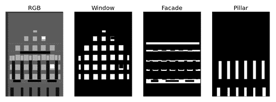

图 6.9 – 左侧是使用 RGB 编码的分割图。右侧是分割图，被分为单独的窗口、立面和柱子类别

我们在前几章中使用的`facades`数据集是通过 JPEG 编码的，因此我们无法使用它来训练 GauGAN。在 JPEG 编码过程中，某些对视觉效果不太重要的视觉信息会在压缩过程中被移除。即使某些像素应该属于同一类别并且看起来是相同颜色，压缩后的像素值可能也会不同。因此，我们不能将 JPEG 图像中的颜色映射到类别。为了解决这个问题，我从原始数据源获得了原始数据集，并创建了一个新的数据集，每个样本包含三种不同的图像文件类型，如下所示：

+   JPEG – 真实照片

+   PNG – 使用 RGB 颜色的分割图

+   BMP – 使用类别标签的分割图

BMP 是无压缩的。我们可以将 BMP 图像视为前面图示中的 RGB 格式图像，不同之处在于像素值是 1 通道的类别标签，而不是 3 通道的 RGB 颜色。在图像加载和预处理过程中，我们将加载这三个文件，并将它们从 BMP 格式转换为独热编码的分割掩码。

有时，TensorFlow 的基本图像预处理 API 无法完成一些更复杂的任务，因此我们需要借助其他 Python 库。幸运的是，`tf.py_function`允许我们在 TensorFlow 训练管道中运行一个通用的 Python 函数。

在这个文件加载函数中，如下代码所示，我们使用`.numpy()`将 TensorFlow 张量转换为 Python 对象。函数名有点误导，因为它不仅适用于数值值，还适用于字符串值：

```py
def load(image_file): 
    def load_data(image_file):
        jpg_file = image_file.numpy().decode("utf-8")
        bmp_file = jpg_file.replace('.jpg','.bmp')
        png_file = jpg_file.replace('.jpg','.png')        
        image = np.array(Image.open(jpg_file))/127.5 - 1
        map = np.array(Image.open(png_file))/127.5 - 1
        labels = np.array(Image.open(bmp_file),  							dtype=np.uint8)
        h, w, _ = image.shape
        n_class = 12
        mask = np.zeros((h, w, n_class), dtype=np.float32)
        for i in range(n_class):
            one_hot[labels==i, i] = 1        
        return map, image, mask 
    [mask, image, label] = tf.py_function( 						load_data, [image_file], 						 [tf.float32, tf.float32, 						  tf.float32])
```

现在我们理解了独热编码的语义分割掩码的格式，我们将看看 SPADE 如何帮助我们从分割掩码生成更好的图像。

### 实现 SPADE

实例归一化在图像生成中已经变得流行，但它往往会抹去分割掩码的语义信息。这意味着什么呢？假设输入图像仅包含一个单一的分割标签；例如，假设整张图像都是天空。当输入图像具有统一的值时，经过卷积层处理后的输出也将是统一的值。

回想一下，实例归一化是通过对每个通道的（H，W）维度计算均值来完成的。因此，该通道的均值将是相同的统一值，经过均值减法后的归一化激活将变为零。显然，语义信息丢失了，天空仿佛在一瞬间消失了。这是一个极端的例子，但使用相同的逻辑，我们可以看到随着分割掩码区域的增大，它的语义意义会丧失。

为了解决这个问题，SPADE 在由分割掩码限制的局部区域上进行归一化，而不是在整个掩码上进行。下图展示了 SPADE 的高层架构：

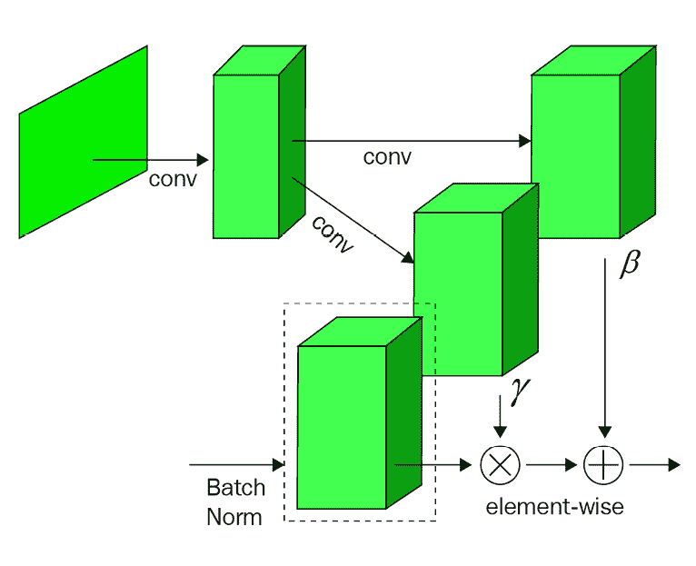

图 6.10 – 高层次 SPADE 架构。（重绘自：T. Park 等，2019 年，《具有空间自适应归一化的语义图像合成》，[`arxiv.org/abs/1903.07291`](https://arxiv.org/abs/1903.07291))

在批归一化中，我们计算跨维度（N，H，W）上的通道的均值和标准差。这对于 SPADE 也是一样，如前图所示。不同之处在于，每个通道的 gamma 和 beta 不再是标量值（或 C 通道的向量），而是二维的（H，W）。换句话说，每个激活都有一个 gamma 和一个 beta，它们从语义分割图中学习。因此，归一化是以不同的方式应用于不同的分割区域。这两个参数通过使用两个卷积层进行学习，如下图所示：

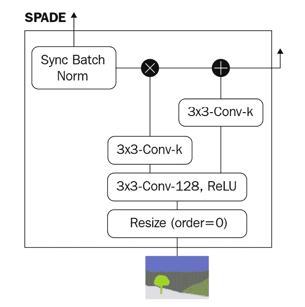

图 6.11 – SPADE 设计图，其中 k 表示卷积滤波器的数量（重绘自：T. Park 等，2019 年，《具有空间自适应归一化的语义图像合成》，[`arxiv.org/abs/1903.07291`](https://arxiv.org/abs/1903.07291))

SPADE 不仅在网络输入阶段使用，而且在内部层中也有应用。resize 层用于调整分割图的大小，以匹配该层的激活尺寸。我们现在可以实现一个 TensorFlow 自定义层来实现 SPADE。

我们将首先在`__init__`构造函数中定义卷积层，如下所示：

```py
class SPADE(layers.Layer):
    def __init__(self, filters, epsilon=1e-5):
        super(SPADE, self).__init__()
        self.epsilon = epsilon
        self.conv = layers.Conv2D(128, 3, padding='same', 							activation='relu')
        self.conv_gamma = layers.Conv2D(filters, 3,  							  padding='same')
        self.conv_beta = layers.Conv2D(filters, 3, 							 padding='same')
```

接下来，我们将获取激活图的尺寸，稍后用于调整大小：

```py
    def build(self, input_shape):
        self.resize_shape = input_shape[1:3]
```

最后，我们将在`call()`中将层和操作连接起来，如下所示：

```py
    def call(self, input_tensor, raw_mask):
        mask = tf.image.resize(raw_mask, self.resize_shape, 					    method='nearest')
        x = self.conv(mask)
        gamma = self.conv_gamma(x)
        beta = self.conv_beta(x)        
        mean, var = tf.nn.moments(input_tensor, 					   axes=(0,1,2), keepdims=True)
        std = tf.sqrt(var + self.epsilon)
        normalized = (input_tensor - mean)/std        
        output = gamma * normalized + beta
        return output
```

这是基于 SPADE 设计图的直接实现。接下来，我们将看看如何使用 SPADE。

### 将 SPADE 插入残差块

GauGAN 在生成器中使用**残差块**。接下来，我们将看看如何将 SPADE 插入残差块：

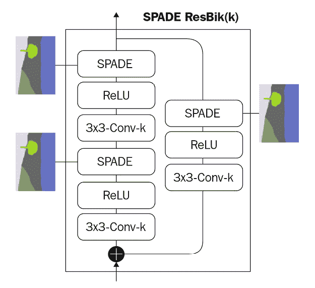

图 6.12 – SPADE 残差块（重绘自：T. Park 等，2019 年，《具有空间自适应归一化的语义图像合成》，[`arxiv.org/abs/1903.07291`](https://arxiv.org/abs/1903.07291))

SPADE 残差块中的基本构建块是 **SPADE-ReLU-Conv 层**。每个 SPADE 接收两个输入——来自前一层的激活值和语义分割图。

与标准残差块一样，它包含两个卷积-ReLU 层和一个跳跃连接路径。每当残差块前后的通道数量发生变化时，跳跃连接通过前面图中虚线框内的子块进行学习。当这种情况发生时，前向路径中两个 SPADE 的输入激活图会具有不同的维度。没关系，因为我们在 SPADE 块内已构建了内置的调整大小功能。以下是构建所需层的 SPADE 残差块代码：

```py
class Resblock(layers.Layer):
    def __init__(self, filters):
        super(Resblock, self).__init__()
        self.filters = filters        
    def build(self, input_shape):
        input_filter = input_shape[-1]
        self.spade_1 = SPADE(input_filter)
        self.spade_2 = SPADE(self.filters)
        self.conv_1 = layers.Conv2D(self.filters, 3, 							padding='same')
        self.conv_2 = layers.Conv2D(self.filters, 3,  							padding='same')
        self.learned_skip = False        
        if self.filters != input_filter:
            self.learned_skip = True
            self.spade_3 = SPADE(input_filter)
            self.conv_3 = layers.Conv2D(self.filters,  				    			3, padding='same')
```

接下来，我们将在 `call()` 中连接各个层：

```py
    def call(self, input_tensor, mask):
        x = self.spade_1(input_tensor, mask)
        x = self.conv_1(tf.nn.leaky_relu(x, 0.2))
        x = self.spade_2(x, mask)
        x = self.conv_2(tf.nn.leaky_relu(x, 0.2))        
        if self.learned_skip:
            skip = self.spade_3(input_tensor, mask)
            skip = self.conv_3(tf.nn.leaky_relu(skip, 0.2))
        else:
            skip = input_tensor            
        output = skip + x
        return output
```

在原始的 GauGAN 实现中，谱归一化应用于卷积层之后。这是另一种归一化方法，我们将在*第八章* *图像生成的自注意力机制*中讨论它，届时会讲解自注意力 GAN。因此，我们将跳过这一部分，直接将残差块组合在一起实现 GauGAN。

## 实现 GauGAN

我们将首先构建生成器，然后是判别器。最后，我们将实现损失函数并开始训练 GauGAN。

### 构建 GauGAN 生成器

在深入了解 GauGAN 生成器之前，让我们复习一下它的一些前辈。在 pix2pix 中，生成器只有一个输入——语义分割图。由于网络中没有随机性，给定相同的输入，它将始终生成具有相同颜色和纹理的建筑外立面。简单地将输入与随机噪声连接起来的方法是不可行的。

**BicycleGAN**（*第四章* *图像到图像翻译*）为解决这个问题使用的两种方法之一是使用编码器将目标图像（真实照片）编码为潜向量，然后用它来采样随机噪声作为生成器输入。这个 **cVAE-GAN** 结构在 GauGAN 生成器中得到了应用。生成器有两个输入——语义分割掩码和真实照片。

在 GauGAN 的 Web 应用程序中，我们可以选择一张照片（生成的图像将类似于照片的风格）。这是通过使用编码器将风格信息编码为潜变量来实现的。编码器的代码与我们在前几章中使用的相同，因此我们将继续查看生成器架构。可以随时回顾*第四章* *图像到图像翻译*，以复习编码器的实现。在下图中，我们可以看到 GauGAN 生成器的架构：

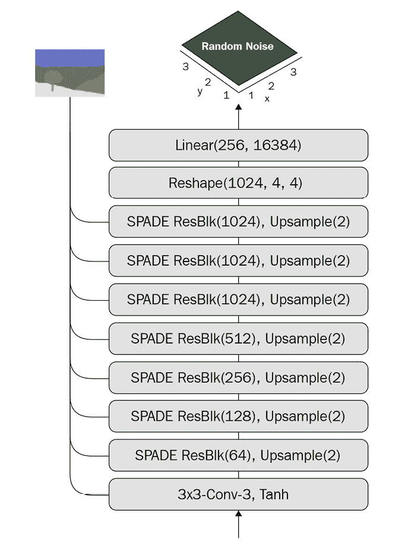

图 6.13 – GauGAN 生成器架构（重绘自：T. Park 等，2019 年，“带有空间自适应归一化的语义图像合成”，[`arxiv.org/abs/1903.07291`](https://arxiv.org/abs/1903.07291)）

生成器是一个类似解码器的架构。主要的不同之处在于，分割掩码通过 SPADE 进入每个残差块。为 GauGAN 选择的潜在变量维度为 256\。

注意

编码器不是生成器的一个核心部分；我们可以选择不使用任何样式图像，而是从标准的多元高斯分布中进行采样。

以下是我们之前编写的使用残差块构建生成器的代码：

```py
def build_generator(self):
    DIM = 64
    z = Input(shape=(self.z_dim))
    mask = Input(shape=self.input_shape)
    x = Dense(16384)(z)
    x = Reshape((4, 4, 1024))(x)
    x = UpSampling2D((2,2))(Resblock(filters=1024)(x, mask))
    x = UpSampling2D((2,2))(Resblock(filters=1024)(x, mask))
    x = UpSampling2D((2,2))(Resblock(filters=1024)(x, mask))
    x = UpSampling2D((2,2))(Resblock(filters=512)(x, mask))
    x = UpSampling2D((2,2))(Resblock(filters=256)(x, mask))
    x = UpSampling2D((2,2))(Resblock(filters=128)(x, mask))
    x = tf.nn.leaky_relu(x, 0.2)
    output_image = tanh(Conv2D(3, 4, padding='same')(x)) 
    return Model([z, mask], output_image, name='generator')   
```

你现在已经了解了让 GauGAN 工作的所有要素——SPADE 和生成器。网络架构的其余部分是从我们之前学习过的其他 GAN 中借鉴来的。接下来，我们将探讨如何构建判别器。

### 构建判别器

判别器是 PatchGAN，其中输入是分割图和生成图像的连接。分割图必须与生成的 RGB 图像具有相同的通道数；因此，我们将使用 RGB 分割图，而不是使用 one-hot 编码的分割掩码。GauGAN 判别器的架构如下：

）](img/B14538_06_14.jpg)

图 6.14 – GauGAN 判别器架构（重绘自：T. Park 等，2019 年，“带有空间自适应归一化的语义图像合成”，[`arxiv.org/abs/1903.07291`](https://arxiv.org/abs/1903.07291)）

除了最后一层，判别器层由以下部分组成：

+   使用 4x4 的卷积层，步幅为 2，用于下采样

+   实例归一化（第一层除外）

+   Leaky ReLU

GauGAN 在不同的尺度上使用多个判别器。由于我们的数据集图像分辨率较低，为 256x256，单个判别器就足够了。如果我们使用多个判别器，我们需要做的就是将输入大小下采样一半，用于下一个判别器，并计算所有判别器的平均损失。

单个 PatchGAN 的代码实现如下：

```py
def build_discriminator(self):
    DIM = 64
    model = tf.keras.Sequential(name='discriminators') 
    input_image_A = layers.Input(shape=self.image_shape, 					name='discriminator_image_A')
    input_image_B = layers.Input(shape=self.image_shape, 					name='discriminator_image_B') 
    x = layers.Concatenate()([input_image_A, input_image_B]) 
    x1 = self.downsample(DIM, 4, norm=False)(x) # 128
    x2 = self.downsample(2*DIM, 4)(x1) # 64
    x3 = self.downsample(4*DIM, 4)(x2) # 32
    x4 = self.downsample(8*DIM, 4, strides=1)(x3) # 29
    x5 = layers.Conv2D(1, 4)(x4) 
    outputs = [x1, x2, x3, x4, x5]
    return Model([input_image_A, input_image_B], outputs)
```

这与 pix2pix 完全相同，唯一的不同是判别器返回所有下采样块的输出。为什么我们需要这样做呢？嗯，这就引出了关于损失函数的讨论。

### 特征匹配损失

**特征匹配损失**已成功用于风格转移。使用预训练的 VGG 提取内容和样式特征，并计算目标图像与生成图像之间的损失。内容特征简单地来自 VGG 中多个卷积块的输出。GauGAN 使用内容损失来取代 GAN 中常见的 L1 重建损失。原因在于重建损失是逐像素进行比较的，如果图像位置发生变化但在人眼看来仍然相同，则损失可能很大。

另一方面，卷积层的内容特征是空间不变的。因此，在使用内容损失在`facades`数据集上进行训练时，我们生成的建筑物看起来模糊得多，线条看起来更直。在风格转移文献中，内容损失有时被称为代码中的**VGG 损失**，因为人们喜欢使用 VGG 进行特征提取。

为什么人们仍然喜欢使用老旧的 VGG？

新的 CNN 架构如 ResNet 在图像分类方面的性能早已超过了 VGG，并实现了更高的准确率。那么，为什么人们仍然使用 VGG 进行特征提取呢？一些人尝试使用 Inception 和 ResNet 进行神经风格转移，但发现使用 VGG 生成的结果在视觉上更加愉悦。这可能是由于 VGG 架构的层次结构，其通道数在各层间单调递增。这使得从低级到高级表示的特征提取能够顺利进行。

相比之下，ResNet 的残差块具有瓶颈设计，将输入激活通道（例如 256）压缩到较低数量（例如 64），然后再恢复到较高数量（再次是 256）。残差块还具有跳过连接，可以为分类任务*夹带*信息并绕过卷积层中的特征提取。

计算 VGG 特征损失的代码如下：

```py
def VGG_loss(self, real_image, fake_image):
    # RGB to BGR
    x = tf.reverse(real_image, axis=[-1])
    y = tf.reverse(fake_image, axis=[-1])
    # [-1, +1] to [0, 255]
    x = tf.keras.applications.vgg19.preprocess_input( 								127.5*(x+1))
    y = tf.keras.applications.vgg19.preprocess_input( 								127.5*(y+1))
    # extract features
    feat_real = self.vgg(x)
    feat_fake = self.vgg(y) 
    weights = [1./32, 1./16, 1./8, 1./4, 1.]
    loss = 0
    mae = tf.keras.losses.MeanAbsoluteError()
    for i in range(len(feat_real)):
        loss += weights[i] * mae(feat_real[i], feat_fake[i])
    return loss
```

计算 VGG 损失时，我们首先将图像从`[-1, +1]`转换为`[0, 255]`，并从`RGB`转换为`BGR`，这是 Keras VGG `preprocess`函数期望的图像格式。GauGAN 对更高层次给予更多权重，以强调结构准确性。这是为了使生成的图像与分割掩模对齐。总之，这并非铁板一块，欢迎您尝试不同的权重。

特征匹配还用于鉴别器，我们在真实和虚假图像的鉴别器层输出中提取特征。以下代码用于计算鉴别器中的 L1 特征匹配损失：

```py
def feature_matching_loss(self, feat_real, feat_fake):
    loss = 0
    mae = tf.keras.losses.MeanAbsoluteError()
    for i in range(len(feat_real)-1):
        loss +=  mae(feat_real[i], feat_fake[i])
    return loss
```

此外，编码器还将具有**KL 散度损失**。最后一种损失是新的对抗损失**铰链损失**。

### 铰链损失

铰链损失可能是 GAN 领域的新来者，但它早已在**支持向量机**（**SVM**）中用于分类。它最大化决策边界的间隔。下图显示了正（真实）和负（假）标签的铰链损失：

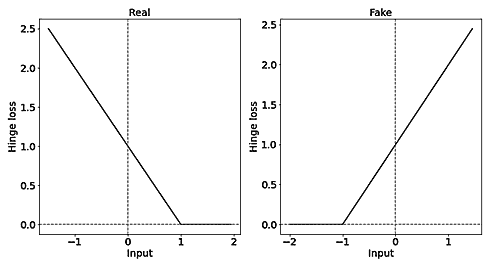

图 6.15 – 判别器的铰链损失

左侧是当图像为真实图像时，判别器的铰链损失。当我们为判别器使用铰链损失时，当预测值大于 1 时，损失被限制为 0；如果预测值小于 1，损失则会增加，以惩罚未将图像预测为真实的情况。对于假图像也是类似的，只不过方向相反：当预测假图像小于 -1 时，铰链损失为 0，且当预测值超过该阈值时，损失会线性增加。

我们可以通过以下基本的数学运算来实现铰链损失：

```py
def d_hinge_loss(y, is_real):
    if is_real:
        loss = tf.reduce_mean(tf.maximum(0., 1-y))
    else:
        loss = tf.reduce_mean (tf.maximum(0., 1+y))
    return loss
```

另一种做法是使用 TensorFlow 的铰链损失 API：

```py
def hinge_loss_d(self, y, is_real):
    label = 1\. if is_real else -1.
    loss = tf.keras.losses.Hinge()(y, label)
    return loss
```

生成器的损失并不是真正的铰链损失；它只是一个负的预测均值。这是无界的，所以当预测分数越高时，损失越低：

```py
def g_hinge_loss(y):
    return –tf.reduce_mean(y)
```

现在我们拥有了训练 GauGAN 所需的一切，就像在上一章中所做的那样，使用训练框架进行训练。下图展示了使用分割掩码生成的图像：

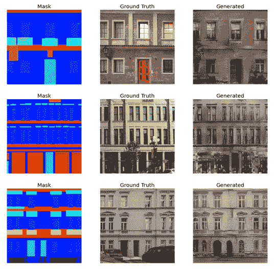

图 6.16 – 我们的 GauGAN 实现生成的图像示例

它们看起来比 pix2pix 和 CycleGAN 的结果好得多！如果我们将真实图像的风格编码为随机噪声，生成的图像几乎无法与真实图像区分开来。用计算机查看时，效果非常令人印象深刻！

# 总结

现在，AI 在图像编辑中的应用已经很普遍，所有这一切大约是在 iGAN 被引入的时候开始的。我们了解了 iGAN 的关键原理，即首先将图像投影到流形上，然后直接在流形上进行编辑。接着我们优化潜在变量，生成自然逼真的编辑图像。这与之前只能通过操作潜在变量间接改变生成图像的方法不同。

GauGAN 融合了许多先进的技术，通过语义分割掩码生成清晰的图像。这包括使用铰链损失和特征匹配损失。然而，关键成分是 SPADE，它在使用分割掩码作为输入时提供了更优的性能。SPADE 对局部分割图进行归一化，以保持其语义含义，这有助于我们生成高质量的图像。到目前为止，我们一直使用分辨率为 256x256 的图像来训练我们的网络。我们现在拥有成熟的技术，能够生成高分辨率的图像，正如我们在介绍 pix2pixHD 时简要讨论过的那样。

在下一章中，我们将进入高分辨率图像的领域，使用诸如 ProgressiveGAN 和 StyleGAN 等高级模型。
