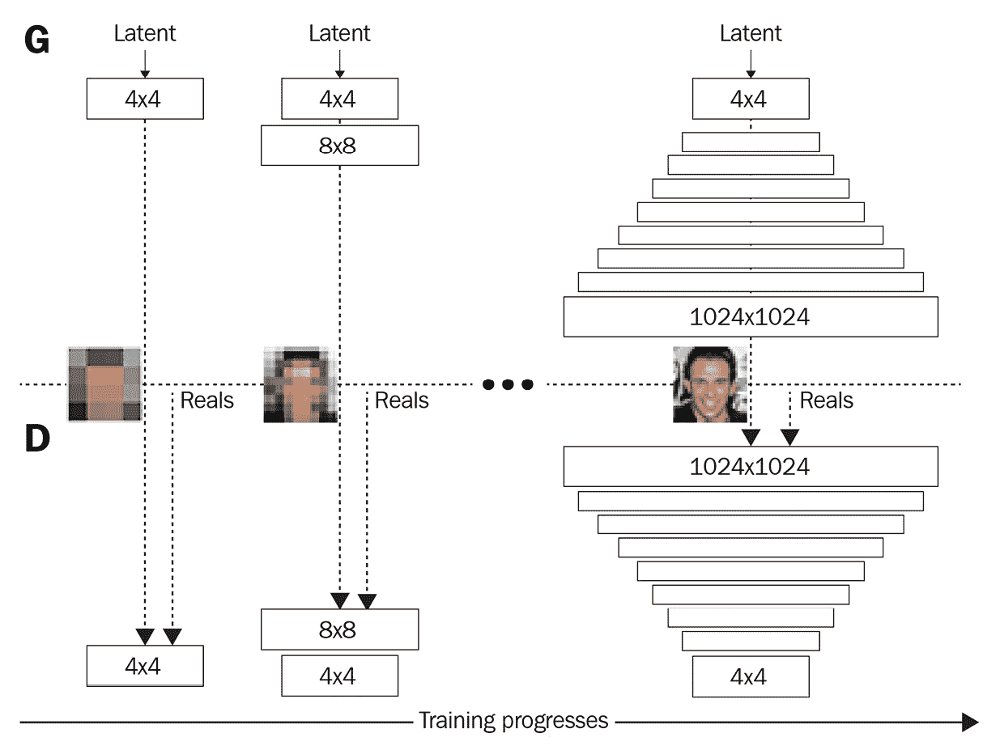
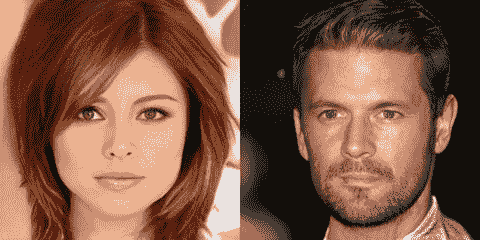
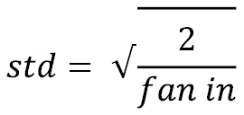
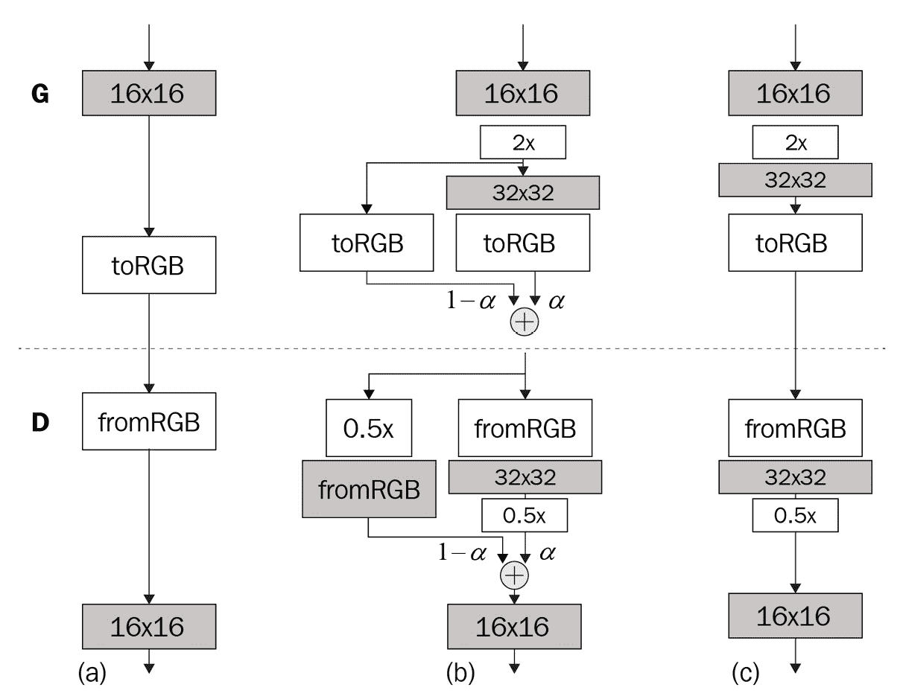
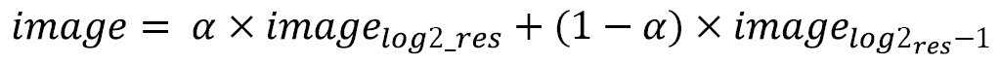
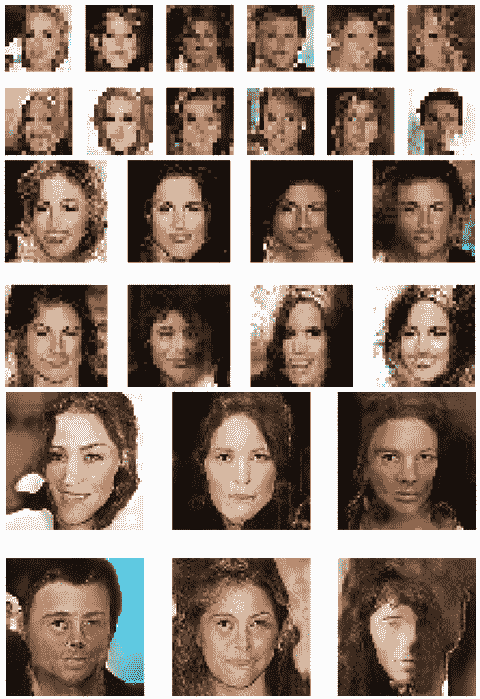
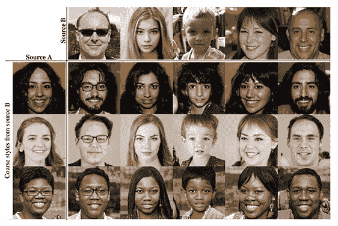
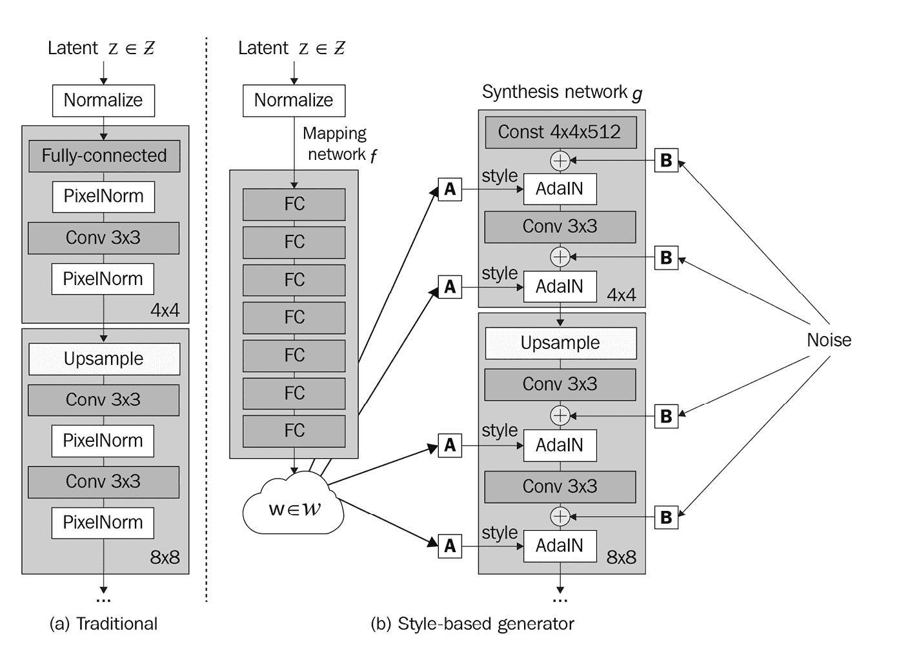
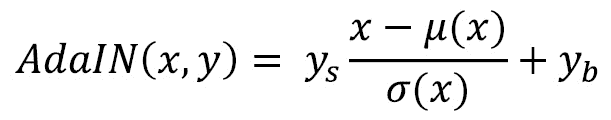
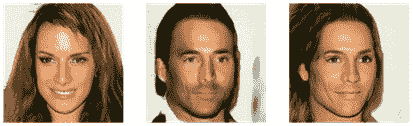

# 第七章：*第七章*：高保真面部生成

随着生成对抗网络（GAN）的训练变得更加稳定，这得益于损失函数和归一化技术的改进，人们开始将注意力转向尝试生成更高分辨率的图像。此前，大多数 GAN 仅能生成最高 256x256 分辨率的图像，而仅仅向生成器中添加更多的上采样层并没有帮助。

在本章中，我们将介绍一些能够生成高达 1024x1024 及更高分辨率图像的技术。我们将从实现一个开创性的 GAN——**渐进式 GAN（Progressive GAN）**开始，有时简写为**ProGAN**。这是第一个成功生成 1024x1024 高保真面部肖像的 GAN。高保真不仅仅意味着高分辨率，还意味着与真实面孔的高度相似。我们可以生成一张高分辨率的面部图像，但如果它有四只眼睛，那它就不是高保真了。

在 ProGAN 之后，我们将实现**StyleGAN**，它在 ProGAN 的基础上进行构建。StyleGAN 结合了风格迁移中的 AdaIN，允许更细致的风格控制和风格混合，从而生成多样的图像。

本章内容包括以下内容：

+   ProGAN 概述

+   构建 ProGAN

+   实现 StyleGAN

# 技术要求

Jupyter 笔记本和代码可以在此找到：

[`github.com/PacktPublishing/Hands-On-Image-Generation-with-TensorFlow-2.0/tree/master/Chapter07`](https://github.com/PacktPublishing/Hands-On-Image-Generation-with-TensorFlow-2.0/tree/master/Chapter07)

本章中使用的 Jupyter 笔记本如下所示：

+   `ch7_progressive_gan.ipynb`

+   `ch7_style_gan.ipynb`

# ProGAN 概述

在典型的 GAN 设置中，生成器的输出形状是固定的。换句话说，训练图像的大小不会改变。如果我们想尝试将图像分辨率加倍，我们需要在生成器架构中添加一个额外的上采样层，并从头开始训练。人们曾尝试过这种暴力方法来增加图像分辨率，但却以失败告终。增大的图像分辨率和网络规模增加了维度空间，使得学习变得更加困难。

卷积神经网络（CNN）面临同样的问题，并通过使用批归一化层来解决，但这在 GAN 中效果不佳。ProGAN 的核心思想是，不能同时训练所有层，而是从训练生成器和判别器中最底层开始，这样层的权重在添加新层之前可以得到稳定。我们可以将其看作是通过较低分辨率对网络进行预训练。这个想法是 ProGAN 带来的核心创新，详细内容见 T. Karras 等人撰写的学术论文《渐进式生成对抗网络（GAN）以提高质量、稳定性和变异性》。下图展示了 ProGAN 中网络逐渐增长的过程：



图 7.1 – 层逐步增长的示意图。（图源：T. Karras 等人，2018 年，"Progressive Growing of GANs for Improved Quality, Stability, and Variation"，https://arxiv.org/abs/1710.10196）

像传统 GAN 一样，ProGAN 的输入是从随机噪声中采样的潜在向量。如上图所示，我们从**4x4**分辨率的图像开始，生成器和判别器中只有一个模块。在**4x4**分辨率训练一段时间后，我们为**8x8**分辨率添加新层。然后继续这样做，直到最终达到**1024x1024**的图像分辨率。以下 256x256 的图像是使用 ProGAN 生成的，并由 NVIDIA 发布。图像质量令人叹为观止，它们几乎无法与真实面孔区分：



图 7.2 – ProGAN 生成的高保真图像（来源：https://github.com/tkarras/progressive_growing_of_gans）

可以公平地说，卓越的图像生成主要归功于逐步增长网络结构。网络架构非常简单，仅由卷积层和全连接层组成，而不像 GANs 中常见的更复杂架构，如残差块或类似 VAE 的架构。

直到 ProGAN 推出两代之后，作者才开始探索这些网络架构。损失函数也很简单，仅为 WGAN-GP 损失，没有其他损失函数，如内容损失、重建损失或 KL 散度损失。然而，在实现逐步增长层的核心部分之前，我们应该了解一些小的创新。以下是这些创新：

+   像素归一化

+   小批量统计

+   等化学习率

## 像素归一化

批量归一化应该能减少协变量偏移，但 ProGAN 的作者并未在网络训练中观察到这一点。因此，他们放弃了批量归一化，使用了一种自定义的归一化方法，称为**像素归一化**。另外，其他研究者后来发现，尽管批量归一化有助于稳定深度神经网络训练，但并没有真正解决协变量问题。

无论如何，ProGAN 中归一化的目的是限制权重值，以防止它们呈指数增长。大的权重可能会放大信号幅度，导致生成器和判别器之间的不健康竞争。像素归一化将每个像素位置（H，W）上的特征在通道维度上归一化为单位长度。如果张量是一个批量 RGB 图像，维度为（N，H，W，C），那么任何像素的 RGB 向量将具有 1 的幅度。

我们可以使用自定义层实现这个方程，如下所示的代码：

```py
class PixelNorm(Layer):
    def __init__(self, epsilon=1e-8):
        super(PixelNorm, self).__init__()
        self.epsilon = epsilon
    def call(self, input_tensor):
        return input_tensor / tf.math.sqrt(                        	                            tf.reduce_mean(input_tensor**2,         	                            axis=-1, keepdims=True) + 		                            self.epsilon)
```

与其他归一化方法不同，像素归一化没有任何可学习的参数；它仅由简单的算术操作组成，因此在计算上高效。

## 使用小批量统计量增加图像变化

**模式崩溃**发生在 GAN 生成相似的图像时，因为它只捕捉到训练数据中的一部分变化。鼓励更多变化的一种方式是将小批量的统计量显示给判别器。与单个实例相比，小批量的统计量更加多样化，这鼓励生成器生成显示出类似统计量的图像。

批量归一化使用小批量统计量来归一化激活值，这在某种程度上实现了这个目的，但 ProGAN 不使用批量归一化。相反，它使用一个**小批量层**，该层计算小批量标准差并将其附加到激活值中，而不改变激活值本身。

计算小批量统计量的步骤如下：

1.  计算每个特征在每个空间位置上的标准差，即在维度 *N* 上进行计算。

1.  计算这些标准差在（*H, W, C*）维度上的平均值，从而得出一个单一的尺度值。

1.  将这个值在特征图（*H, W*）上复制，并将其附加到激活值上。结果，输出的激活值形状为（*N, H, W, C+1*）。

以下是一个小批量标准差自定义层的代码：

```py
class MinibatchStd(Layer):
    def __init__(self, group_size=4, epsilon=1e-8):
        super(MinibatchStd, self).__init__()
        self.epsilon = epsilon
        self.group_size = group_size
    def call(self, input_tensor):
        n, h, w, c = input_tensor.shape
        x = tf.reshape(input_tensor, [self.group_size,  				 -1, h, w, c])
        group_mean, group_var = tf.nn.moments(x,  							axes=(0), 							keepdims=False)
        group_std = tf.sqrt(group_var + self.epsilon)
        avg_std = tf.reduce_mean(group_std, axis=[1,2,3], 						keepdims=True)
        x = tf.tile(avg_std, [self.group_size, h, w, 1])
        return tf.concat([input_tensor, x], axis=-1)
```

在计算标准差之前，激活值首先会被拆分成`4`个组，或者是批次大小，以较小者为准。为了简化代码，我们假设训练期间批次大小至少为`4`。小批量层可以插入到判别器的任何位置，但发现它在最后更有效，即 4x4 层。

## 等化学习率

这个名字可能会令人误解，因为**等化学习率**并不像**学习率衰减**那样修改学习率。事实上，优化器的学习率在整个训练过程中保持不变。为了理解这一点，让我们回顾一下反向传播是如何工作的。当使用简单的**随机梯度下降**（**SGD**）优化器时，负梯度会在更新权重之前与学习率相乘。因此，越靠近生成器输入的层接收到的梯度会越小（记得消失梯度吗？）。

如果我们希望某一层接收更多的梯度怎么办？假设我们执行一个简单的矩阵乘法 *y = w*x*，现在我们加上一个常数 *2*，使得它变成 *y = 2*w*x*。在反向传播过程中，梯度也会被 *2* 放大，从而变得更大。我们可以为不同的层设置不同的乘数常数，从而有效地实现不同的学习率。

在 ProGAN 中，这些乘法常数是通过 He 的初始化方法计算得出的。**He**或**Kaiming**初始化法以 ResNet 的发明者 Kaiming He 命名。**权重**初始化方法专为使用 ReLU 系列激活函数的网络设计。通常，权重是通过标准正态分布初始化的，指定标准差；例如，我们在前几章中使用了 0.02。He 方法则通过以下公式计算标准差，而无需猜测：



`kernel, kernel, channel_in, channel_out`)，*fan in*是`kernel x kernel x channel_in`的乘积。为了在权重初始化中使用它，我们可以将`tf.keras.initializers.he_normal`传递给 Keras 层。然而，等化学习率在运行时完成这一步，因此我们将编写自定义层来计算标准差。

初始化的默认增益因子为 2，但 ProGAN 在 4x4 生成器的输入的`Dense`层中使用较低的增益。ProGAN 使用标准正态分布来初始化层的权重，并通过它们的归一化常数来缩放。这与 GAN 中普遍采用的细致权重初始化方法有所不同。接下来，我们编写一个使用像素归一化的自定义 Conv2D 层：

```py
class Conv2D(layers.Layer):
    def build(self, input_shape):
        self.in_channels = input_shape[-1]
        fan_in = self.kernel*self.kernel*self.in_channels
        self.scale = tf.sqrt(self.gain/fan_in)
    def call(self, inputs):
        x = tf.pad(inputs, [[0, 0], [1, 1], [1, 1],  			  		[0, 0]], mode='REFLECT') \ 				if self.pad else inputs 
        output = tf.nn.conv2d(x, self.scale*self.w, 					   strides=1,  					   padding="SAME") + self.b
        return output
```

官方 ProGAN 在卷积层中使用零填充，你可以看到边缘伪影，特别是在查看低分辨率图像时。因此，我们为除了 1x1 卷积核外的所有卷积层添加了反射填充，1x1 卷积核不需要填充。较大的层有较小的缩放因子，从而有效地减小了梯度，进而减小了学习率。这导致学习率会根据层的大小进行调整，以避免大层的权重增长过快，因此得名等化学习率。

自定义的`Dense`层可以类似地编写：

```py
class Dense(layers.Layer):
    def __init__(self, units, gain=2, **kwargs):
        super(Dense, self).__init__(kwargs)
        self.units = units
        self.gain = gain
    def build(self, input_shape):
        self.in_channels = input_shape[-1]
        initializer = \ 			tf.keras.initializers.RandomNormal( 						mean=0., stddev=1.)        
        self.w = self.add_weight(shape=[self.in_channels,
                                        self.units],
                                initializer=initializer,
                                trainable=True,
 					     name='kernel')
        self.b = self.add_weight(shape=(self.units,),
                                initializer='zeros',
                                trainable=True, 
 						name='bias')
        fan_in = self.in_channels
        self.scale = tf.sqrt(self.gain/fan_in)
    def call(self, inputs):
        output = tf.matmul(inputs,  					self.scale*self.w) + self.b
        return output
```

请注意，自定义层在构造函数中接受`**kwargs`，这意味着我们可以传入常见的 Keras 关键字参数，用于`Dense`层。我们现在已经拥有了开始在下一节构建 ProGAN 所需的所有要素。

# 构建 ProGAN

我们现在已经了解了 ProGAN 的三个特性——像素归一化、小批量标准差统计和等化学习率。接下来，我们将深入研究网络架构，看看如何逐步扩展网络。ProGAN 通过扩展网络层来增长图像，从 4x4 的分辨率开始，逐步加倍，直到达到 1024x1024。因此，我们将首先编写代码，以便在每个尺度下构建层模块。生成器和判别器的构建模块非常简单，正如我们将看到的那样。

## 构建生成器模块

我们将从构建 4x4 的生成器块开始，它构成生成器的基础，并将潜在代码作为输入。输入通过 `PixelNorm` 进行归一化，然后输入到 `Dense` 层。为该层使用较低的增益来实现均衡学习率。在所有生成器块中，都使用 Leaky ReLU 和像素归一化。我们按如下方式构建生成器：

```py
def build_generator_base(self, input_shape):
    input_tensor = Input(shape=input_shape)
    x = PixelNorm()(input_tensor)
    x = Dense(8192, gain=1./8)(x)
    x = Reshape((4, 4, 512))(x)
    x = LeakyReLU(0.2)(x)        
    x = PixelNorm()(x)
    x = Conv2D(512, 3, name='gen_4x4_conv1')(x)
    x = LeakyReLU(0.2)(x)
    x = PixelNorm()(x)
    return Model(input_tensor, x, 
                 name='generator_base')
```

在 4x4 生成器块之后，所有后续块都具有相同的架构，其中包括一个上采样层，接着是两个卷积层。唯一的区别是卷积滤波器的大小。在 ProGAN 的默认设置中，直到 32x32 的生成器块使用 512 的滤波器大小，然后在每个阶段将其减半，最终在 1024x1024 时达到 16，如下所示：

```py
self.log2_res_to_filter_size = {
    0: 512,
    1: 512,
    2: 512, # 4x4
    3: 512, # 8x8
    4: 512, # 16x16
    5: 512, # 32x32
    6: 256, # 64x64
    7: 128, # 128x128
    8: 64,  # 256x256
    9: 32,  # 512x512
    10: 16} # 1024x1024
```

为了简化编码，我们可以通过对分辨率取以 `2` 为底的对数来将其线性化。因此，*log2(4)* 等于 *2*，*log2(8)* 等于 *3*，...直到 *log2(1024)* 等于 *10*。然后，我们可以按以下方式线性地通过 `log2` 从 2 循环到 10：

```py
def build_generator_block(self, log2_res, input_shape):
    res = 2**log2_res
    res_name = f'{res}x{res}'
    filter_n = self.log2_res_to_filter_size[log2_res]
    input_tensor = Input(shape=input_shape)
    x = UpSampling2D((2,2))(input_tensor)
    x = Conv2D(filter_n, 3,  		    name=f'gen_{res_name}_conv1')(x)
    x = PixelNorm()(LeakyReLU(0.2)(x))
    x = Conv2D(filter_n, 3, 			name=f'gen_{res_name}_conv2')(x)
    x = PixelNorm()(LeakyReLU(0.2)(x))
    return Model(input_tensor, x, 
                 name=f'genblock_{res}_x_{res}')
```

我们现在可以使用这段代码从 4x4 一直到目标分辨率构建所有生成器块。

## 构建判别器块

现在我们可以将注意力转向判别器。基本的判别器是在 4x4 的分辨率下，它接受 4x4x3 的图像并预测该图像是真实的还是假的。它使用一个卷积层，接着是两个全连接层。与生成器不同，判别器不使用像素归一化；事实上，完全没有使用归一化。我们将按如下方式插入小批量标准差层：

```py
def build_discriminator_base(self, input_shape):
    input_tensor = Input(shape=input_shape)
    x = MinibatchStd()(input_tensor)
    x = Conv2D(512, 3, name='gen_4x4_conv1')(x)
    x = LeakyReLU(0.2)(x)
    x = Flatten()(x)
    x = Dense(512, name='gen_4x4_dense1')(x)
    x = LeakyReLU(0.2)(x)
    x = Dense(1, name='gen_4x4_dense2')(x)
    return Model(input_tensor, x, 
                 name='discriminator_base')
```

之后，判别器使用两个卷积层，接着进行下采样，每个阶段都使用平均池化：

```py
def build_discriminator_block(self, log2_res, input_shape):
    filter_n = self.log2_res_to_filter_size[log2_res]        
    input_tensor = Input(shape=input_shape)
    x = Conv2D(filter_n, 3)(input_tensor)
    x = LeakyReLU(0.2)(x)
    filter_n = self.log2_res_to_filter_size[log2_res-1]        
    x = Conv2D(filter_n, 3)(x)
    x = LeakyReLU(0.2)(x)
    x = AveragePooling2D((2,2))(x)
    res = 2**log2_res
    return Model(input_tensor, x, 
                 name=f'disc_block_{res}_x_{res}')
```

我们现在定义了所有基本的构建块。接下来，我们将查看如何将它们组合在一起，逐步增长网络。

## 渐进式增长网络

这是 ProGAN 中最重要的部分——网络的增长。我们可以使用之前的函数在不同的分辨率下创建生成器和判别器块。现在我们要做的就是在增长层时将它们连接在一起。下图展示了网络增长的过程。让我们从左侧开始：



图 7.3 – 渐进式增长层的示意图。

重新绘制自 T. Karras 等人 2018 年的论文《渐进式增长的 GANs 用于提高质量、稳定性和变异性》，https://arxiv.org/abs/1710.10196

在我们构建的生成器和判别器模块中，我们假设输入和输出都是层激活值，而不是 RGB 图像。因此，我们需要将生成器模块的激活值转换为 RGB 图像。同样，对于判别器，我们需要将图像转换为激活值。这在前图中的**(a)**所示。

我们将创建两个函数，构建将图像转换为 RGB 图像以及从 RGB 图像转换的模块。两个模块都使用 1x1 卷积层；`to_rgb` 模块使用大小为 3 的滤波器以匹配 RGB 通道，而 `from_rgb` 模块使用与判别器模块输入激活值相匹配的滤波器大小。两个函数的代码如下：

```py
def build_to_rgb(self, res, filter_n): 
    return Sequential([Input(shape=(res, res, filter_n)),
                       Conv2D(3, 1, gain=1, 
 				 activation='tanh')])
def build_from_rgb(self, res, filter_n): 
    return Sequential([Input(shape=(res, res, 3)),
                       Conv2D(filter_n, 1),
                       LeakyReLU(0.2)])
```

现在，假设网络处于 16x16 状态，意味着已经有 8x8 和 4x4 低分辨率的层。现在我们即将扩展到 32x32 层。然而，如果我们向网络中添加一个新的未训练层，新生成的图像将像噪声，并导致巨大的损失。这反过来可能导致梯度爆炸，并使训练不稳定。

为了最小化这种干扰，由新层生成的 32x32 图像不会立即使用。相反，我们将从前一个阶段的 16x16 图像进行上采样，并与新生成的 32x32 图像进行淡入。淡入是图像处理中的一个术语，指的是逐渐增加图像的透明度。这是通过使用加权和公式实现的，公式如下：



在这个过渡阶段，alpha 从 0 增加到 1。换句话说，在阶段开始时，我们完全丢弃新层的图像，使用来自先前训练层的图像。然后我们将 alpha 线性增加到 1，当只使用新层生成的图像时。稳定状态如前图中的*(c)*所示。我们可以实现一个自定义层来执行加权和，代码如下：

```py
class FadeIn(Layer):
    @tf.function
    def call(self, input_alpha, a, b):
        alpha = tf.reduce_mean(input_alpha)
        y = alpha * a + (1\. - alpha) * b
        return y
```

当使用子类定义一个层时，我们可以将一个标量 alpha 传递给函数。然而，当我们使用 `self.alpha = tf.Variable(1.0)` 时，就不可能做到这一点，因为它会在编译模型时被转换为常量，并且在训练中无法再更改。

传递标量 alpha 的一种方法是使用子类化编写整个模型，但我认为在这种情况下，使用顺序或函数式 API 创建模型更为方便。为了解决这个问题，我们将 alpha 定义为模型的输入。然而，模型输入假定为一个小批量。具体来说，如果我们定义了 `Input(shape=(1))`，则其实际形状将是 (*None, 1*)，其中第一维是批量大小。因此，`FadeIN()` 中的 `tf.reduce_mean()` 旨在将批量值转换为标量值。

现在，我们可以查看以下步骤，将生成器扩展到例如 32x32：

1.  添加一个 4x4 的生成器，其中输入是一个潜在向量。

1.  在一个循环中，添加逐步增加分辨率的生成器，直到达到目标分辨率之前的一个（在我们的示例中为 16x16）。

1.  从 16x16 添加`to_rgb`，并将其上采样到 32x32。

1.  添加 32x32 生成器块。

1.  淡入两张图片，创建最终的 RGB 图像。

代码如下：

```py
def grow_generator(self, log2_res):
    res = 2**log2_res
    alpha = Input(shape=(1))
    x = self.generator_blocks[2].input
    for i in range(2, log2_res):            
        x = self.generator_blocksi
    old_rgb = self.to_rgblog2_res-1
    old_rgb = UpSampling2D((2,2))(old_rgb)
    x = self.generator_blockslog2_res
    new_rgb = self.to_rgblog2_res
    rgb = FadeIn()(alpha, new_rgb, old_rgb)
    self.generator = Model([self.generator_blocks[2].input,
 					alpha], rgb, 
                               name=f'generator_{res}_x_{res}')
```

判别器的增长过程类似，但方向相反，如下所示：

1.  在输入图像的分辨率下，比如 32x32，向 32x32 的判别器块中添加`from_rgb`。输出是一个 16x16 特征图的激活。

1.  同时，将输入图像下采样到 16x16，并在 16x16 判别器块中添加`from_rgb`。

1.  淡入前面两项特征，并将其输入到下一个 8x8 的判别器块。

1.  继续向 4x4 基础的判别器块中添加判别器块，输出是一个单一的预测值。

以下是扩展判别器的代码：

```py
def grow_discriminator(self, log2_res):
    res = 2**log2_res 
    input_image = Input(shape=(res, res, 3))
    alpha = Input(shape=(1))
    x = self.from_rgblog2_res
    x = self.discriminator_blockslog2_res        
    downsized_image = AveragePooling2D((2,2))(input_image)
    y = self.from_rgblog2_res-1
    x = FadeIn()(alpha, x, y)
    for i in range (log2_res-1, 1, -1):
        x = self.discriminator_blocksi
    self.discriminator =  Model([input_image, alpha], x,
                 name=f'discriminator_{res}_x_{res}')
```

最后，我们从扩展后的生成器和判别器构建模型，如下所示：

```py
def grow_model(self, log2_res):
    self.grow_generator(log2_res)
    self.grow_discriminator(log2_res)
    self.discriminator.trainable = False
    latent_input = Input(shape=(self.z_dim))
    alpha_input = Input(shape=(1))
    fake_image = self.generator([latent_input, alpha_input])
    pred = self.discriminator([fake_image, alpha_input])
    self.model = Model(inputs=[latent_input, alpha_input],
                      outputs=pred)
    self.model.compile(loss=wasserstein_loss, 
                       optimizer=Adam(**self.opt_init))
    self.optimizer_discriminator = Adam(**self.opt_init)
```

新添加层之后，我们重置优化器的状态。这是因为像 Adam 这样的优化器有内部状态，用来存储每一层的梯度历史。最简单的方法可能是使用相同的参数实例化一个新的优化器。

## 损失函数

你可能已经注意到前面的代码片段中使用了**Wasserstein 损失**。没错，生成器使用 Wasserstein 损失，其损失函数是预测值与标签之间的乘积。判别器使用 WGAN-GP 梯度惩罚损失。我们在*第三章**《生成对抗网络*》中学习了 WGAN-GP，但这里我们再回顾一下损失函数。

WGAN-GP 在假图像和真实图像之间插值，并将插值输入判别器。然后，梯度是相对于输入插值计算的，而不是传统的计算相对于权重的梯度。接着，我们计算梯度惩罚（损失）并将其加到判别器的损失中，进行反向传播。我们将重用在*第三章**《生成对抗网络*》中开发的 WGAN-GP。与原始 WGAN-GP 不同，原始 WGAN-GP 对每一次生成器训练步骤都会训练判别器五次，而 ProGAN 对判别器和生成器进行等量的训练。

除了 WGAN-GP 损失，还有一种额外的损失类型，叫做**漂移损失**。判别器的输出是无界的，可能是非常大的正值或负值。漂移损失旨在防止判别器的输出过度偏离零，朝着无穷大方向漂移。以下代码片段展示了如何根据判别器输出计算漂移损失：

```py
# drift loss
all_pred = tf.concat([pred_fake, pred_real], axis=0)
drift_factor = 0.001
drift_loss = drift_factor * tf.reduce_mean(all_pred**2)
```

现在，我们可以开始训练我们的 ProGAN 了！

## 成长的阵痛

ProGAN 的训练非常缓慢。作者们使用了八个 Tesla V100 GPU，并花费了 4 天时间在 1024x1024 `CelebA-HQ` 数据集上进行训练。如果你只有一块 GPU，训练可能需要超过 1 个月！即使是较低的 256x256 分辨率，单 GPU 训练也需要 2 到 3 天的时间。在开始训练之前，请考虑这一点。你可能想从更低的目标分辨率开始，例如 64x64。

话虽如此，刚开始时我们不需要使用高分辨率数据集。256x256 分辨率的数据集已经足够。笔记本中省略了输入部分，因此可以自行填写输入以加载数据集。供参考，有两个流行的 1024x1024 面部数据集可以免费下载：

+   官方 ProGAN TensorFlow 1 实现中的 CelebA-HQ：[`github.com/tkarras/progressive_growing_of_gans`](https://github.com/tkarras/progressive_growing_of_gans)。它需要下载原始的 `CelebA` 数据集以及与 HQ 相关的文件。生成脚本还依赖于一些过时的库。因此，我不建议你按这种方式操作；你应该尝试寻找一个已经预处理好的数据集。

+   FFHQ: [`github.com/NVlabs/ffhq-dataset`](https://github.com/NVlabs/ffhq-dataset)。这个数据集是为 StyleGAN（ProGAN 的继任者）创建的，比 `CelebA-HQ` 数据集更加多样和丰富。由于服务器的下载限制，它也可能比较难以下载。

当我们下载高分辨率图像时，需要将它们降采样到较低的分辨率以用于训练。你可以在运行时进行降采样，但由于额外的计算量，这会稍微降低训练速度，同时需要更多的内存带宽来传输图像。另一种方法是先从原始图像分辨率创建多尺度图像，这样可以节省内存传输和图像调整大小的时间。

另一个需要注意的点是批处理大小。随着图像分辨率的增长，存储图像和更大层激活所需的 GPU 内存也会增加。如果批处理大小设置得太高，我们的 GPU 内存将不足。因此，我们从 4x4 到 64x64 使用批处理大小 16，然后随着分辨率的翻倍，将批处理大小减半。你应该根据自己的 GPU 调整批处理大小。

下图显示了使用我们的 ProGAN 从 16x16 分辨率到 64x64 分辨率生成的图像：



图 7.4 – 我们的 ProGAN 生成的图像从 8x8 增长到 64x64

ProGAN 是一个非常精细的模型。在本书中重现模型时，我只实现了关键部分，以匹配原始实现的细节。我省略了一些我认为不那么重要的部分，并替换为我未涉及的内容。这适用于优化器、学习率、归一化技术和损失函数。

然而，我发现为了让 ProGAN 工作，我必须几乎完全按照原始规格来实现所有内容。这包括使用相同的批量大小、漂移损失和等化学习率增益。然而，当我们让网络正常工作时，它确实生成了高保真的面孔，这是任何之前的模型都无法比拟的！

现在让我们看看 StyleGAN 如何在 ProGAN 的基础上改进，以实现风格混合。

# 实现 StyleGAN

ProGAN 擅长通过逐步增长网络来生成高分辨率图像，但其网络架构相当原始。这个简单的架构类似于早期的 GAN，例如 DCGAN，它们从随机噪声生成图像，但无法对生成的图像进行精细控制。

正如我们在前几章中看到的，图像到图像的翻译中出现了许多创新，使得生成器输出的操作更加灵活。其中之一是使用 AdaIN 层（*第五章**，风格迁移*），它可以实现风格迁移，将两张不同图像的内容和风格特征进行混合。**StyleGAN**采用了这种风格混合的概念，提出了*基于风格的生成对抗网络生成器架构*——这是为**FaceBid**所写论文的标题。下图展示了 StyleGAN 如何将两张不同图像的风格特征混合生成一张新图像：



图 7.5 – 混合风格生成新图像（来源：T. Karras 等，2019 年《基于风格的生成对抗网络生成器架构》，https://arxiv.org/abs/1812.04948）

现在我们将深入探讨 StyleGAN 生成器架构。

## 基于风格的生成器

下图对比了 ProGAN 和 StyleGAN 的生成器架构：



图 7.6 – 对比(a)ProGAN 和(b)StyleGAN 之间的生成器（重绘自 T. Karras 等，2019 年《基于风格的生成对抗网络生成器架构》，https://arxiv.org/abs/1812.04948）

ProGAN 架构是一个简单的前馈设计，其中单一输入是潜在代码。所有潜在信息，例如内容、风格和随机性，都包含在单一潜在代码*z*中。在前面的图中，右侧是 StyleGAN 生成器架构，其中潜在代码不再直接进入合成网络。潜在代码被映射到风格代码，并进入多尺度合成网络。

现在我们将讲解生成管道，它包括以下主要构建模块：

+   **映射网络，f**：这是 8 层密集网络，每层有 512 个维度。它的输入是 512 维的潜在代码，输出 *w* 也是一个 512 维的向量。*w* 会广播到生成器的每个尺度。

+   **仿射变换，A**：在每个尺度上，都有一个块将 *w* 映射到风格 *y = (y*s*, y*b*)*。换句话说，全局潜在向量在每个图像尺度上被转换为局部风格代码。仿射变换通过密集层实现。

+   **AdaIN**：AdaIN 调节风格代码和内容代码。内容代码 *x* 是卷积层的激活，而 *y* 是风格代码：



+   **合成网络，g**：本质上是由 ProGAN 的多尺度生成器模块组成。与 ProGAN 的显著区别在于，合成网络的输入只是一些常数值。这是因为潜在代码在每个生成器层中作为风格代码呈现，包括第一个 4x4 块，因此不需要另一个随机输入到合成网络。

+   **多尺度噪声**：人像的许多方面可以看作是随机的（stochastic）。例如，头发和雀斑的精确位置可能是随机的，但这并不改变我们对图像的感知。这种随机性来自注入生成器的噪声。高斯噪声的形状与卷积层的激活图（H, W, 1）匹配。在添加到卷积激活之前，它会通过 *B* 按通道缩放到 (H, W, C)。

在大多数 StyleGAN 之前的 GAN 中，潜在代码仅在输入或内部某一层被注入。StyleGAN 生成器的亮点在于我们现在可以在每一层注入风格代码和噪声，这意味着我们可以在不同的层次上调整图像。粗略空间分辨率的风格（从 4x4 到 8x8）对应于高层次的方面，如姿势和面部形状。中等分辨率（从 16x16 到 32x32）与较小尺度的面部特征、发型以及眼睛是否睁开有关。最后，更高分辨率（从 64x64 到 1024x1024）主要改变色彩方案和微观结构。

StyleGAN 生成器最初看起来可能很复杂，但希望现在看起来不那么吓人了。像 ProGAN 一样，单个模块很简单。我们会大量借用 ProGAN 的代码；现在让我们开始构建 StyleGAN 生成器吧！

## 实现映射网络

映射网络将 512 维潜在代码映射到 512 维特征，具体如下：

```py
def build_mapping(self):
    # Mapping Network
    z = Input(shape=(self.z_dim))
    w = PixelNorm()(z)
    for i in range(8):
        w = Dense(512, lrmul=0.01)(w)
        w = LeakyReLU(0.2)(w)
    w = tf.tile(tf.expand_dims(w, 0), (8,1,1))            
    self.mapping = Model(z, w, name='mapping')
```

这是一个简单的密集层实现，使用了泄漏 ReLU 激活函数。需要注意的是，学习率乘以 0.01，以使训练更加稳定。因此，自定义的 `Dense` 层被修改为接受一个额外的 `lrmul` 参数。在网络的最后，我们创建了八个 `w` 的副本，它们将进入生成器模块的八个层。如果我们不打算使用风格混合，可以跳过平铺操作。

## 添加噪声

我们现在创建一个自定义层，将噪声添加到卷积层输出中，其中包括架构图中的 *B* 模块。代码如下：

```py
class AddNoise(Layer):
    def build(self, input_shape):
        n, h, w, c = input_shape[0]
        initializer = \ 		tf.keras.initializers.RandomNormal( 						mean=0., stddev=1.)
        self.B = self.add_weight(shape=[1, 1, 1, c],
                                initializer=initializer,
                                trainable=True, 
 						name='kernel')
    def call(self, inputs):
        x, noise = inputs
        output = x + self.B * noise
        return output
```

噪声与可学习的 `B` 相乘，按通道进行缩放，然后加到输入激活上。

## 实现 AdaIN

我们将在 StyleGAN 中实现的 AdaIN 与用于风格迁移的 AdaIN 有所不同，原因如下：

+   我们将包括仿射变换 *A*。这是通过两个密集层实现的，分别预测 *ys* 和 *yb*。

+   原始 AdaIN 涉及对输入激活进行归一化，但由于我们 AdaIN 的输入激活已经经过像素归一化，因此在此自定义层中不进行归一化。AdaIN 层的代码如下：

```py
class AdaIN(Layer):
    def __init__(self, gain=1, **kwargs):
        super(AdaIN, self).__init__(kwargs)
        self.gain = gain
    def build(self, input_shapes):
        x_shape = input_shapes[0]
        w_shape = input_shapes[1]
        self.w_channels = w_shape[-1]
        self.x_channels = x_shape[-1]
        self.dense_1 = Dense(self.x_channels, gain=1)
        self.dense_2 = Dense(self.x_channels, gain=1)
    def call(self, inputs):
        x, w = inputs
        ys = tf.reshape(self.dense_1(w), (-1, 1, 1,
 					self.x_channels))
        yb = tf.reshape(self.dense_2(w), (-1, 1, 1, 
 					self.x_channels))
        output = ys*x + yb
        return output
```

比较 AdaIN 与风格迁移

ProGAN 中的 AdaIN 与用于风格迁移的原始实现不同。在风格迁移中，风格特征是通过 VGG 特征计算得到的 Gram 矩阵。而在 ProGAN 中，“风格”是通过随机噪声生成的向量* w *。

## 构建生成器模块

现在，我们可以将 `AddNoise` 和 `AdaIN` 放入生成器模块中，这与 ProGAN 中构建生成器模块的代码类似，如下所示：

```py
def build_generator_block(self, log2_res, input_shape):
    res = int(2**log2_res)
    res_name = f'{res}x{res}'
    filter_n = self.log2_res_to_filter_size[log2_res]
    input_tensor = Input(shape=input_shape)
    x = input_tensor
    w = Input(shape=512)
    noise = Input(shape=(res, res, 1))
    if log2_res > 2:
        x = UpSampling2D((2,2))(x)
        x = Conv2D(filter_n, 3,  			   name=f'gen_{res_name}_conv1')(x)
    x = AddNoise()([x, noise])
    x = PixelNorm()(LeakyReLU(0.2)(x))
    x = AdaIN()([x, w])
    # ADD NOISE
    x = Conv2D(filter_n, 3, 
 			name=f'gen_{res_name}_conv2')(x)
    x = AddNoise()([x, noise])    
    x = PixelNorm()(LeakyReLU(0.2)(x))
    x = AdaIN()([x, w])
    return Model([input_tensor, x, noise], x, 
                 name=f'genblock_{res}_x_{res}')
```

生成器模块有三个输入。对于一个 4x4 的生成器模块，输入是一个值为 1 的常量张量，并且我们跳过了上采样和卷积模块。其他两个输入分别是向量 *w* 和随机噪声。

## 训练 StyleGAN

如本节开头所提到的，从 ProGAN 到 StyleGAN 的主要变化发生在生成器上。判别器和训练细节上有一些小的差异，但对性能的影响不大。因此，我们会保持剩余的管道与 ProGAN 相同。

下图显示了我们的 StyleGAN 生成的 256x256 图像。使用了相同的风格 *w*，但噪声是随机生成的：


](img/B14538_07_07.jpg)

图 7.7 – 使用相同风格但不同噪声生成的肖像

我们可以看到这些面孔属于同一个人，但细节有所不同，如头发长度和头部姿势。我们还可以通过使用来自不同潜在代码的 *w* 来混合风格，如下图所示：



图 7.8 – 所有图像均由我们的 StyleGAN 生成。右侧的面孔是通过混合前两个面孔的风格生成的。

了解到 StyleGAN 可能比较难以训练，因此我提供了一个预训练的 256x256 模型，您可以下载使用。您可以在 Jupyter notebook 中使用小工具来进行面孔生成和风格混合的实验。

这标志着我们与 StyleGAN 的旅程的结束。

# 总结

在本章中，我们进入了高分辨率图像生成的领域，首先介绍了 ProGAN。ProGAN 首先在低分辨率图像上进行训练，然后再过渡到更高分辨率的图像。通过逐步扩展网络，网络训练变得更加稳定。这为高保真图像生成奠定了基础，因为这种从粗到精的训练方法也被其他 GAN 模型采纳。例如，pix2pixHD 有两个不同尺度的生成器，其中粗略生成器在两者共同训练之前会进行预训练。我们还学习了均衡学习率、小批量统计和像素归一化，这些技术也在 StyleGAN 中得到了应用。

在生成器中使用来自风格迁移的 AdaIN 层，不仅使得 StyleGAN 生成了更高质量的图像，还能够在混合风格时控制特征。通过在不同的尺度上注入不同的风格代码和噪声，我们可以控制图像的全局和细节部分。StyleGAN 在高清图像生成中取得了最先进的成果，并且在写作时依然是该领域的领先技术。基于风格的模型现在已成为主流架构。我们已经看到这种模型在风格迁移、图像到图像的翻译以及 StyleGAN 中得到了应用。

在下一章中，我们将探讨另一类流行的 GAN 家族，即基于注意力的模型。
