# 第八章：*第八章*：用于图像生成的自注意力机制

你可能听说过一些流行的**自然语言处理**（**NLP**）模型，比如 Transformer、BERT 或 GPT-3。它们有一个共同点——它们都使用一种叫做 transformer 的架构，而该架构由自注意力模块组成。

自注意力机制在计算机视觉中得到了广泛应用，包括分类任务，这使其成为一个重要的学习主题。正如我们将在本章中学习的，自注意力帮助我们捕捉图像中的重要特征，而无需使用深层网络来获得大范围的感受野。StyleGAN 在生成人脸方面表现优秀，但在从 ImageNet 生成图像时会遇到困难。

在某种程度上，生成面孔是容易的，因为眼睛、鼻子和嘴唇的形状相似，并且在各种面孔中位置也相似。相比之下，ImageNet 的 1000 个类别包含了各种各样的物体（例如狗、卡车、鱼和枕头）和背景。因此，判别器必须更加有效地捕捉各种物体的不同特征。这正是自注意力发挥作用的地方。通过自注意力、条件批量归一化和谱归一化，我们将实现一个**自注意力生成对抗网络**（**SAGAN**），以根据给定的类别标签生成图像。

在此之后，我们将以 SAGAN 为基础，创建一个 BigGAN。我们将添加正交正则化，并改变类别嵌入的方法。BigGAN 能够在不使用类似 ProGAN 架构的情况下生成高分辨率图像，并且被认为是在类别标签条件下生成图像的最先进模型。

本章将涵盖以下主题：

+   谱归一化

+   自注意力模块

+   构建 SAGAN

+   实现 BigGAN

# 技术要求

Jupyter 笔记本可以在这里找到（[`github.com/PacktPublishing/Hands-On-Image-Generation-with-TensorFlow-2.0/tree/master/Chapter08`](https://github.com/PacktPublishing/Hands-On-Image-Generation-with-TensorFlow-2.0/tree/master/Chapter08)）：

+   `ch8_sagan.ipynb`

+   `ch8_big_gan.ipynb`

# 谱归一化

谱归一化是稳定 GAN 训练的一个重要方法，已经在许多最近的先进 GAN 中得到了应用。与批量归一化或其他归一化方法不同，谱归一化是对权重进行归一化，而不是激活。谱归一化的目的是限制权重的增长，使得网络遵守 1-Lipschitz 约束。正如我们在*第三章**，生成对抗网络*中所学到的那样，这对于稳定 GAN 训练已被证明非常有效。

我们将重新审视 WGAN，以便更好地理解光谱归一化背后的思想。WGAN 判别器（也称为评论家）需要将其预测值保持在小的范围内，以满足 1-Lipschitz 限制。WGAN 通过简单地将权重裁剪到 [-0.01, 0.01] 范围内来实现这一点。

这不是一种可靠的方法，因为我们需要微调裁剪范围，这本身是一个超参数。如果能有一种系统化的方法在不使用超参数的情况下强制执行 1-Lipschitz 限制，那就太好了，而光谱归一化就是我们需要的工具。从本质上讲，光谱归一化通过除以权重的光谱范数来对权重进行归一化。

## 理解光谱范数

我们将简要回顾一些线性代数内容，以大致解释什么是光谱范数。你可能已经在矩阵理论中学习过特征值和特征向量，公式如下：

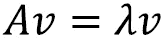

这里 *A* 是一个方阵，*v* 是特征向量，*lambda* 是其特征值。

我们将通过一个简单的例子来理解这些术语。假设 *v* 是一个位置向量 *(x, y)*，而 *A* 是如下所示的线性变换：

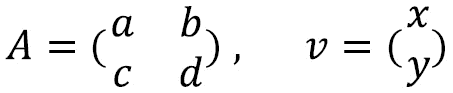

如果我们将 *A* 与 *v* 相乘，我们将得到一个新的位置，并且方向发生变化，如下所示：

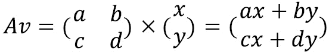

特征向量是指在 *A* 被应用时其方向不发生变化的向量。它们只是通过标量特征值 *lambda* 进行缩放。可能会有多个特征向量-特征值对。最大特征值的平方根就是矩阵的光谱范数。对于非方阵，我们需要使用数学算法，如 **奇异值分解** (**SVD**) 来计算特征值，这在计算上可能会很昂贵。

因此，采用幂迭代方法来加速计算，并使其在神经网络训练中变得可行。让我们跳过实现光谱归一化作为 TensorFlow 中的权重约束。

## 实现光谱归一化

由 T. Miyato 等人于 2018 年在《生成对抗网络中的光谱归一化》论文中给出的光谱归一化数学算法看起来可能很复杂。然而，像往常一样，软件实现比数学公式更简单。

以下是执行光谱归一化的步骤：

1.  卷积层中的权重形成一个四维张量，因此第一步是将其重塑为一个二维矩阵 *W*，其中保持权重的最后一个维度。现在，权重的形状为 *(H×W, C)*。

1.  初始化一个向量 *u*，其分布为 N(0,1)。

1.  在 `for` 循环中，计算如下内容：

    计算 *V = (W*T*) U*，使用矩阵转置和矩阵乘法。

    归一化 *V*，使用其 L2 范数，即 *V = V/||V||*2。

    计算 *U = WV*。

    归一化 *U*，使用其 L2 范数，即 *U = U/||U||*2。

1.  计算光谱范数为 *U*T*W V*。

1.  最后，将权重除以光谱范数。

完整的代码如下：

```py
class SpectralNorm(tf.keras.constraints.Constraint):
    def __init__(self, n_iter=5):
        self.n_iter = n_iter
    def call(self, input_weights):
        w = tf.reshape(input_weights, (-1, 				 		input_weights.shape[-1]))
        u = tf.random.normal((w.shape[0], 1))
        for _ in range(self.n_iter):
            v = tf.matmul(w, u, transpose_a=True)
            v /= tf.norm(v)
            u = tf.matmul(w, v)
            u /= tf.norm(u)
        spec_norm = tf.matmul(u, tf.matmul(w, v), 					   transpose_a=True)
        return input_weights/spec_norm
```

迭代次数是一个超参数，我发现`5`次就足够了。也可以实现谱归一化，使用一个变量来记住向量`u`，而不是从随机值开始。这应该将迭代次数减少到`1`。我们现在可以通过将其作为定义层时的卷积核约束来应用谱归一化，如`Conv2D(3, 1, kernel_constraint=SpectralNorm())`。

# 自注意力模块

自注意力模块随着一种名为 Transformer 的 NLP 模型的出现而变得流行。在语言翻译等 NLP 应用中，该模型通常需要逐字读取句子以理解其含义，然后生成输出。Transformer 出现之前使用的神经网络是某种变体的**递归神经网络**（**RNN**），如**长短期记忆网络**（**LSTM**）。RNN 具有内部状态，在读取句子时记住单词。

其中一个缺点是，当单词数量增加时，前面单词的梯度会消失。也就是说，句子开始部分的单词随着 RNN 读取更多单词而逐渐变得不那么重要。

Transformer 的做法不同。它一次性读取所有单词，并加权每个单词的重要性。因此，更重要的单词会获得更多的关注，这也是**注意力**这一名称的由来。自注意力是最先进的 NLP 模型（如 BERT 和 GPT-3）的基石。然而，本书不涉及 NLP 的内容。现在我们将看一下自注意力在 CNN 中的工作细节。

## 计算机视觉中的自注意力

CNN 主要由卷积层构成。对于一个 3×3 大小的卷积层，它只会查看输入激活中的 3×3=9 个特征来计算每个输出特征。它不会查看超出这个范围的像素。为了捕捉这个范围外的像素，我们可以稍微增加卷积核的大小，例如使用 5×5 或 7×7，但这相对于特征图的大小仍然较小。

我们需要下移一个网络层，使得卷积核的感受野足够大，以捕获我们想要的特征。与 RNN 一样，随着我们向下通过网络层，输入特征的相对重要性会逐渐减弱。因此，我们可以使用自注意力来查看特征图中的每个像素，并专注于我们应该关注的部分。

现在我们来看一下自注意力机制是如何工作的。自注意力的第一步是将每个输入特征映射到三个向量上，分别被称为**key**、**query**和**value**。在计算机视觉文献中我们不常看到这些术语，但我认为向你介绍它们会帮助你更好地理解与自注意力、Transformer 或 NLP 相关的文献。下图展示了如何从查询生成注意力图：

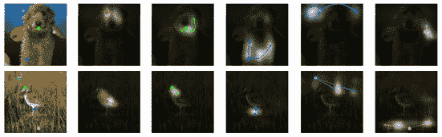

图 8.1 – 注意力图的示意图。（来源：H. Zhang 等，2019 年，《自注意力生成对抗网络》，https://arxiv.org/abs/1805.08318）

左侧是标有点的查询图像。接下来的五张图展示了这些查询给出的注意力图。顶部的第一个注意力图查询了兔子的一个眼睛；这个注意力图在两个眼睛周围有更多的白色区域（表示高重要性），而在其他区域则接近完全黑暗（表示低重要性）。

现在，我们将逐一讲解关键字、查询和数值的技术术语：

+   **值**是输入特征的表示。我们不希望自注意力模块查看每个像素，因为这样计算开销过大且不必要。相反，我们更关注输入激活的局部区域。因此，值的维度相较于输入特征有所减少，既包括激活图的大小（例如，可能会降采样以使高度和宽度更小），也包括通道数。对于卷积层的激活，通道数通过使用 1x1 卷积进行减少，空间大小则通过最大池化或平均池化来缩小。

+   **关键字和查询**用于计算自注意力图中特征的重要性。为了计算位置 *x* 的输出特征，我们取位置 *x* 的查询，并将其与所有位置的关键字进行比较。为了进一步说明这一点，假设我们有一张人像图片。

    当网络处理人像中的一只眼睛时，它会拿取其查询（具有*眼睛*的语义意义），并与人像其他区域的关键字进行比对。如果其他区域的某个关键字是*眼睛*，那么我们就知道找到了另一只眼睛，这显然是我们需要关注的内容，以便匹配眼睛颜色。

    将其转化为方程，对于特征 *0*，我们计算一个向量 *q0 × k0, q0 × k1, q0 × k2*，依此类推，直到 *q0 × kN-1*。然后，通过 softmax 对这些向量进行归一化，使它们的总和为 *1.0*，这就是我们的注意力分数。这个分数作为权重，用来执行数值的逐元素乘法，从而给出注意力输出。

SAGAN 自注意力模块基于非局部块（X. Wang 等，2018 年，*Non-local Neural Networks*， [`arxiv.org/abs/1711.07971`](https://arxiv.org/abs/1711.07971)），该模块最初是为视频分类设计的。作者在确定当前架构之前，尝试了不同的自注意力实现方式。以下图展示了 SAGAN 中的注意力模块，其中**theta** **θ**，**phi** **φ**和**g**分别对应于关键字、查询和数值：

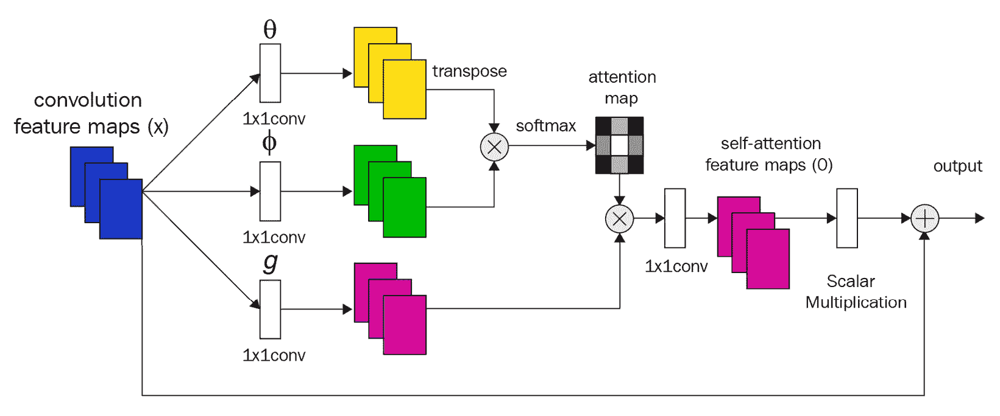

图 8.2 – SAGAN 中的自注意力模块架构

深度学习中的大多数计算都是矢量化的，以提高速度性能，自注意力也不例外。为简单起见，如果忽略批处理维度，则 1×1 卷积后的激活形状为(H, W, C)。第一步是将其重塑为形状为(H×W, C)的二维矩阵，并使用*θ*和*φ*之间的矩阵乘法来计算注意力图。在 SAGAN 中使用的自注意力模块中，还有另一个 1×1 卷积，用于将通道数恢复到输入通道，并使用可学习参数进行缩放。此外，这被制成一个残差块。

## 实现自注意力模块

我们首先在自定义层的`build()`函数中定义所有的 1×1 卷积层和权重。请注意，我们使用谱归一化函数作为卷积层的核约束，具体如下：

```py
class SelfAttention(Layer):
    def __init__(self):
        super(SelfAttention, self).__init__()
    def build(self, input_shape):
        n, h, w, c = input_shape
        self.n_feats = h * w
        self.conv_theta = Conv2D(c//8, 1, padding='same', 				     kernel_constraint=SpectralNorm(), 				     name='Conv_Theta')
        self.conv_phi = Conv2D(c//8, 1, padding='same', 				    kernel_constraint=SpectralNorm(), 				    name='Conv_Phi')
        self.conv_g = Conv2D(c//2, 1, padding='same',  				    kernel_constraint=SpectralNorm(), 				    name='Conv_G')
        self.conv_attn_g = Conv2D(c, 1, padding='same', 				    kernel_constraint=SpectralNorm(), 				    name='Conv_AttnG')
        self.sigma = self.add_weight(shape=[1], 						    initializer='zeros', 						    trainable=True,  						    name='sigma')
```

这里有几点需要注意：

+   内部激活可以减少维度以提高计算速度。减少的数值是通过 SAGAN 作者的实验得到的。

+   每个卷积层之后，激活(H, W, C)被重塑为形状为(HW, C)的二维矩阵。然后我们可以对矩阵进行矩阵乘法。

下面是该层执行自注意操作的`call()`函数。我们首先计算`theta`、`phi`和`g`：

```py
def call(self, x):
        n, h, w, c = x.shape
        theta = self.conv_theta(x)
        theta = tf.reshape(theta, (-1, self.n_feats, 						  theta.shape[-1]))        
        phi = self.conv_phi(x)
        phi = tf.nn.max_pool2d(phi, ksize=2, strides=2, 					    padding='VALID')
        phi = tf.reshape(phi, (-1, self.n_feats//4, 				   phi.shape[-1]))   
        g = self.conv_g(x)
        g = tf.nn.max_pool2d(g, ksize=2, strides=2, 					  padding='VALID')
        g = tf.reshape(g, (-1, self.n_feats//4,  					g.shape[-1]))
```

然后我们计算注意力图如下：

```py
        attn = tf.matmul(theta, phi, transpose_b=True)        attn = tf.nn.softmax(attn)
```

最后，我们将注意力图与查询`g`相乘，并继续生成最终输出：

```py
        attn_g = tf.matmul(attn, g)
        attn_g = tf.reshape(attn_g, (-1, h, w, 					 attn_g.shape[-1]))
        attn_g = self.conv_attn_g(attn_g)        
        output = x + self.sigma * attn_g        
        return output
```

有了谱归一化和自注意力层后，我们现在可以使用它们来构建 SAGAN。

# 构建 SAGAN

SAGAN 具有类似 DCGAN 的简单架构。然而，它是一个条件生成对抗网络，使用类标签来生成和区分图像。在下图中，每一行的每个图像都是从不同类标签生成的：

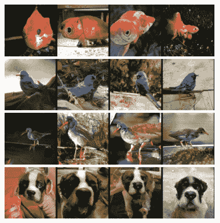

图 8.3 – 使用不同类标签生成的 SAGAN 图像。（来源：A. Brock 等人，2018 年，“用于高保真自然图像合成的大规模 GAN 训练”，https://arxiv.org/abs/1809.11096）

在本例中，我们将使用`CIFAR10`数据集，该数据集包含 10 类 32x32 分辨率的图像。稍后我们将处理条件部分。现在，让我们首先完成最简单的部分 – 生成器。

## 构建 SAGAN 生成器

从高层次来看，SAGAN 生成器与其他 GAN 生成器差别不大：它将噪声作为输入，经过一个全连接层，然后是多个上采样和卷积块，最终达到目标图像分辨率。我们从 4×4 分辨率开始，使用三个上采样块，最终达到 32×32 的分辨率，具体如下：

```py
def build_generator(z_dim, n_class):
    DIM = 64
    z = layers.Input(shape=(z_dim))
    labels = layers.Input(shape=(1), dtype='int32')
    x = Dense(4*4*4*DIM)(z)
    x = layers.Reshape((4, 4, 4*DIM))(x)   
    x = layers.UpSampling2D((2,2))(x)
    x = Resblock(4*DIM, n_class)(x, labels)
    x = layers.UpSampling2D((2,2))(x)
    x = Resblock(2*DIM, n_class)(x, labels)
    x = SelfAttention()(x)
    x = layers.UpSampling2D((2,2))(x)
    x = Resblock(DIM, n_class)(x, labels)
    output_image = tanh(Conv2D(3, 3, padding='same')(x))
    return Model([z, labels], output_image,  			 name='generator')  
```

尽管在自注意力模块中使用了不同的激活维度，其输出的形状与输入相同。因此，它可以被插入到卷积层之后的任何位置。然而，当卷积核大小为 3×3 时，将其插入到 4×4 的分辨率可能有些过度。因此，在 SAGAN 生成器中，自注意力层仅在较高空间分辨率的阶段插入，以充分利用自注意力层。同样，对于判别器，当空间分辨率较高时，自注意力层会放置在较低的层次。

这就是生成器的全部内容，如果我们进行的是无条件图像生成。我们需要将类别标签输入生成器，这样它才能根据给定的类别生成图像。在*第四章*《图像到图像的转换》中，我们学习了一些常见的标签条件化方法，但 SAGAN 使用了一种更先进的方式；即，它将类别标签编码为批量归一化中的可学习参数。我们在*第五章*《风格迁移》中介绍了**条件批量归一化**，现在我们将在 SAGAN 中实现它。

## 条件批量归一化

在本书的很多章节中，我们一直在抱怨 GAN 中使用批量归一化的缺点。在`CIFAR10`中，有 10 个类别：其中 6 个是动物（鸟、猫、鹿、狗、青蛙和马），4 个是交通工具（飞机、汽车、船和卡车）。显然，它们看起来差异很大——交通工具通常有硬直的边缘，而动物的边缘则更弯曲且质感较软。

正如我们在风格迁移中所学到的，激活统计量决定了图像的风格。因此，混合批量统计量可以生成看起来既像动物又像交通工具的图像——例如，一只形状像汽车的猫。这是因为批量归一化对一个包含不同类别的整个批次仅使用一个 gamma 和一个 beta。如果我们对每个风格（类别）都有一个 gamma 和一个 beta，那么这个问题就得到了解决，这正是条件批量归一化的核心所在。它为每个类别提供一个 gamma 和一个 beta，因此在`CIFAR10`的每一层中，对于 10 个类别来说，共有 10 个 betas 和 10 个 gammas。

我们现在可以按照以下方式构造条件批量归一化所需的变量：

+   一个形状为*(10, C)*的 gamma 和 beta，其中*C*是激活通道数。

+   具有形状*(1, 1, 1, C)*的移动均值和方差。在训练中，均值和方差是从一个小批量中计算得出的；在推理时，我们使用在训练过程中累积的移动平均值。它们的形状会使得算术操作可以广播到 N、H 和 W 维度。

以下是条件批量归一化的代码：

```py
class ConditionBatchNorm(Layer):
    def build(self, input_shape):
        self.input_size = input_shape
        n, h, w, c = input_shape        
        self.gamma = self.add_weight( 						  shape=[self.n_class, c], 						  initializer='ones', 						  trainable=True, 						  name='gamma')        
        self.beta = self.add_weight( 						 shape=[self.n_class, c], 						 initializer='zeros', 						 trainable=True, 						 name='beta')             
        self.moving_mean = self.add_weight(shape=[1, 1,  					  1, c], initializer='zeros', 					  trainable=False, 					  name='moving_mean')    
        self.moving_var = self.add_weight(shape=[1, 1,  					  1, c], initializer='ones',
 					  trainable=False, 					  name='moving_var')
```

当我们运行条件批量归一化时，我们会为标签检索正确的`beta`和`gamma`值。这是通过`tf.gather(self.beta, labels)`实现的，在概念上等同于`beta = self.beta[labels]`，如下所示：

```py
def call(self, x, labels, training=False):
    beta = tf.gather(self.beta, labels)
    beta = tf.expand_dims(beta, 1)
    gamma = tf.gather(self.gamma, labels)
    gamma = tf.expand_dims(gamma, 1)
```

除此之外，其余的代码与批量归一化相同。现在，我们可以将条件批量归一化放置在生成器的残差块中：

```py
class Resblock(Layer):
    def build(self, input_shape):
        input_filter = input_shape[-1]
        self.conv_1 = Conv2D(self.filters, 3, 					  padding='same', 					  name='conv2d_1')
        self.conv_2 = Conv2D(self.filters, 3, 					  padding='same', 					  name='conv2d_2')
        self.cbn_1 = ConditionBatchNorm(self.n_class)
        self.cbn_2 = ConditionBatchNorm(self.n_class)
        self.learned_skip = False
        if self.filters != input_filter:
            self.learned_skip = True
            self.conv_3 = Conv2D(self.filters, 1, 						padding='same', 						name='conv2d_3')       
            self.cbn_3 = ConditionBatchNorm(self.n_class)
```

以下是条件批量归一化的前向传递运行时代码：

```py
    def call(self, input_tensor, labels):
        x = self.conv_1(input_tensor)
        x = self.cbn_1(x, labels)
        x = tf.nn.leaky_relu(x, 0.2)
        x = self.conv_2(x)
        x = self.cbn_2(x, labels)
        x = tf.nn.leaky_relu(x, 0.2)
        if self.learned_skip:
            skip = self.conv_3(input_tensor)
            skip = self.cbn_3(skip, labels)
            skip = tf.nn.leaky_relu(skip, 0.2)            
        else:
            skip = input_tensor
        output = skip + x
        return output
```

判别器的残差块与生成器的类似，但有一些差异，具体列举如下：

+   这里没有归一化。

+   下采样发生在残差块内部，采用平均池化方式。

因此，我们不会展示判别器残差块的代码。我们现在可以继续讨论最后的构建块——判别器。

## 构建判别器

判别器也使用自注意力层，并将其放置在靠近输入层的位置，以捕捉较大的激活图。由于它是一个条件生成对抗网络（cGAN），我们还将在判别器中使用标签，以确保生成器生成的图像与类别匹配。将标签信息纳入模型的一般方法是，首先将标签投影到嵌入空间，然后在输入层或任何内部层使用该嵌入。

有两种常见的将嵌入与激活合并的方法——**连接**和**逐元素乘法**。SAGAN 使用的架构类似于 T. Miyato 和 M. Koyama 在其 2018 年《带投影判别器的 cGANs》中提出的投影模型，正如下图右下方所示：

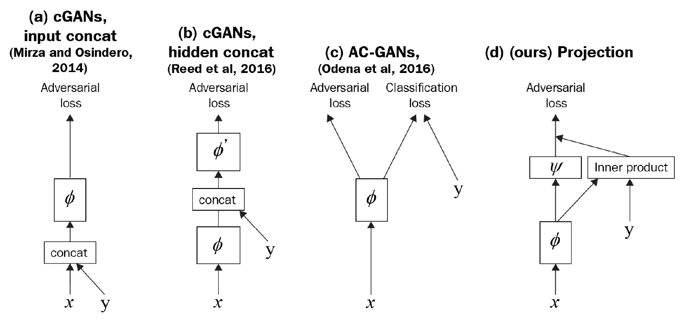

图 8.4 – 比较几种常见的将标签作为条件整合到判别器中的方法。（d）是 SAGAN 中使用的方法。（改图自 T. Miyato 和 M. Koyama 的 2018 年《带投影判别器的 cGANs》，https://arxiv.org/abs/1802.05637）

标签首先被投影到嵌入空间，然后我们与激活值进行逐元素乘法运算，紧接着在密集层（**ψ**图示中）之前执行。这一结果会加到密集层的输出上，从而给出最终的预测，如下所示：

```py
def build_discriminator(n_class):
    DIM = 64
    input_image = Input(shape=IMAGE_SHAPE)
    input_labels = Input(shape=(1))
    embedding = Embedding(n_class, 4*DIM)(input_labels)
    embedding = Flatten()(embedding)
    x = ResblockDown(DIM)(input_image) # 16
    x = SelfAttention()(x)
    x = ResblockDown(2*DIM)(x) # 8
    x = ResblockDown(4*DIM)(x) # 4
    x = ResblockDown(4*DIM, False)(x) # 4
    x = tf.reduce_sum(x, (1, 2))
    embedded_x  = tf.reduce_sum(x * embedding,  					    axis=1, keepdims=True)
    output = Dense(1)(x)
    output += embedded_x
    return Model([input_image, input_labels],  			  output, name='discriminator')
```

模型定义完成后，我们可以开始训练 SAGAN。

## 训练 SAGAN

我们将使用标准的 GAN 训练流程。损失函数是`CIFAR10`，它包含了 32×32 大小的小图像，训练相对稳定且快速。原始的 SAGAN 是为 128×128 的图像分辨率设计的，但与我们使用的其他训练集相比，这个分辨率仍然较小。在下一部分，我们将讨论一些对 SAGAN 的改进，以便在更大的数据集和更大图像尺寸上进行训练。

# 实现 BigGAN

BigGAN 是 SAGAN 的改进版本。BigGAN 显著提高了图像分辨率，从 128×128 提升到 512×512，而且在没有层次逐步增长的情况下完成了这一点！以下是一些由 BigGAN 生成的示例图像：

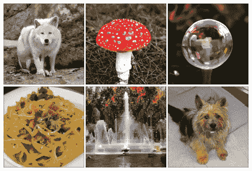

图 8.5 – BigGAN 在 512x512 分辨率下生成的类别条件样本（来源：A. Brock 等人，2018 年，“大规模 GAN 训练用于高保真自然图像合成”，https://arxiv.org/abs/1809.11096）

BigGAN 被认为是最先进的类别条件 GAN。接下来我们将查看这些变化，并修改 SAGAN 代码，打造我们的 BigGAN。

## 扩展 GAN

较早的 GAN 通常使用小批量大小，因为这能产生更高质量的图像。现在我们知道，质量问题是由批量归一化中使用的批量统计数据引起的，而这一问题通过使用其他归一化技术得以解决。尽管如此，批量大小仍然较小，因为它受限于 GPU 内存的物理约束。

然而，作为谷歌的一部分有其优势：创建 BigGAN 的 DeepMind 团队拥有他们所需的所有资源。通过实验，他们发现，扩大 GAN 的规模有助于产生更好的结果。在 BigGAN 训练中，使用的批量大小是 SAGAN 的八倍；卷积通道的数量也提高了 50%。这就是 BigGAN 名称的来源：更大证明更好。

事实上，SAGAN 的增强是 BigGAN 性能优越的主要原因，具体总结在下表中：

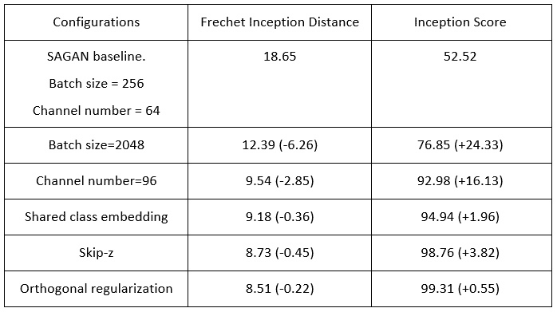

图 8.6 – 通过向 SAGAN 基线添加特征，改善了 Frechet Inception Distance（FID）和 Inception Score（IS）。配置列显示了前一行配置中添加的特征。括号中的数字表示相较前一行的改进。

表格显示了 BigGAN 在 ImageNet 上训练时的表现。**Frechet Inception Distance**（**FID**）衡量类别多样性（值越低越好），而**Inception Score**（**IS**）表示图像质量（值越高越好）。左侧是网络的配置，从 SAGAN 基准开始，逐行增加新特性。我们可以看到，最大的改进来自于增加批量大小。这对于提高 FID 是有意义的，因为批量大小为 2,048 大于 1,000 的类别数，使得 GAN 不太容易过拟合到较少的类别。

增加通道大小也带来了显著的改进。其他三个特性只带来了小幅改进。因此，如果你没有多个可以适应大型网络和批量大小的 GPU，那么你应该坚持使用 SAGAN。如果你确实有这样的 GPU，或者只是想了解这些功能的升级，那我们就继续吧！

## 跳过潜在向量

传统上，潜在向量*z*进入生成器的第一个密集层，然后依次经过卷积层和上采样层。虽然 StyleGAN 也有一个潜在向量，仅输入到其生成器的第一层，但它有另一个来源的随机噪声，输入到每个分辨率的激活图中。这允许在不同的分辨率级别上控制风格。

通过将这两个思想合并，BigGAN 将潜在向量分割成若干块，每块分别输入到生成器中的不同残差块。稍后我们将看到这如何与类别标签一起拼接，用于条件批归一化。除了默认的 BigGAN 外，还有一种配置称为 BigGAN-deep，其深度是默认版本的四倍。下图显示了它们在拼接标签和输入噪声时的差异。我们将实现左侧的 BigGAN：

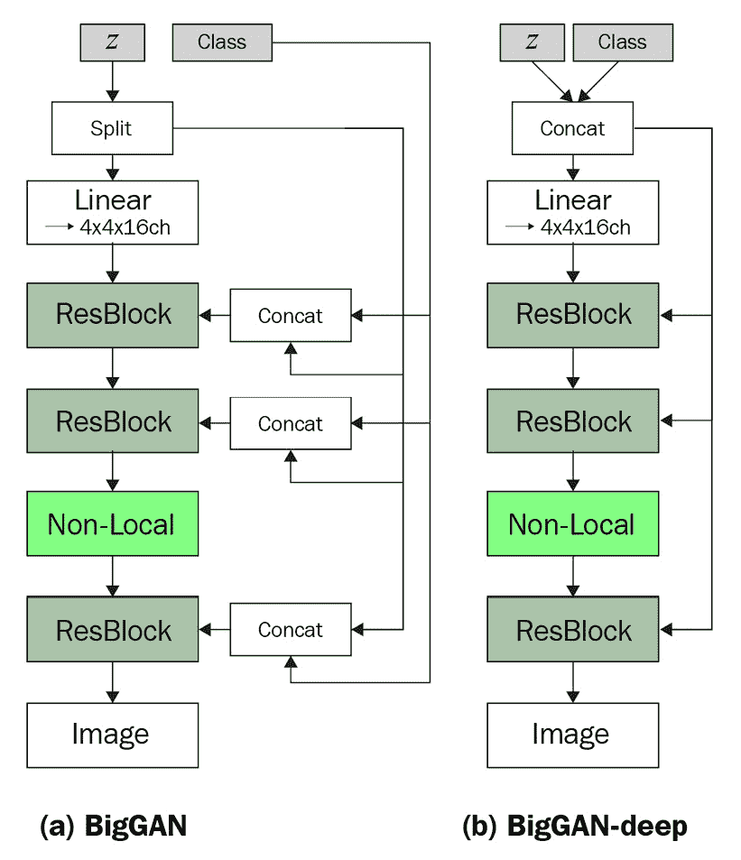

图 8.7 – 生成器的两种配置（重绘自 A. Brock 等人，2018 年，"Large Scale GAN Training for High Fidelity Natural Image Synthesis," https://arxiv.org/abs/1809.11096）

我们现在来看看 BigGAN 如何在条件批归一化中减少嵌入的大小。

## 共享类别嵌入

在 SAGAN 的条件批归一化中，每一层的每个 beta 和 gamma 都有一个形状为[class number, channel number]的矩阵。当类别数和通道数增加时，权重的大小也会迅速增加。在 1,000 类的 ImageNet 上训练时，使用 1,024 通道的卷积层，这将导致单个归一化层中有超过 100 万个变量！

因此，BigGAN 不是使用一个 1,000×1,024 的权重矩阵，而是首先将类别投影到一个较小维度的嵌入中，例如 128，且该嵌入在所有层中共享。在条件批量归一化中，全连接层用于将类别嵌入和噪声映射到 betas 和 gammas。

以下代码片段显示了生成器中的前两层：

```py
z_input = layers.Input(shape=(z_dim))
z = tf.split(z_input, 4, axis=1) 
labels = layers.Input(shape=(1), dtype='int32')
y = Embedding(n_class, y_dim)(tf.squeeze(labels, [1]))
x = Dense(4*4*4*DIM, **g_kernel_cfg)(z[0])
x = layers.Reshape((4, 4, 4*DIM))(x)
x = layers.UpSampling2D((2,2))(x)
y_z = tf.concat((y, z[1]), axis=-1)
x = Resblock(4*DIM, n_class)(x, y_z)
```

具有 128 维的潜在向量首先被拆分为四个相等的部分，用于全连接层和三个分辨率的残差块。标签被投影到一个共享的嵌入中，该嵌入与`z`块连接并进入残差块。残差块与 SAGAN 中的保持不变，但我们将在以下代码中对条件批量归一化进行一些小的修改。我们现在通过全连接层从类别标签中生成，而不是声明 gamma 和 beta 的变量。像往常一样，我们将首先在`build()`中定义所需的层，如下所示：

```py
class ConditionBatchNorm(Layer):
    def build(self, input_shape):
        c = input_shape[-1]
        self.dense_beta = Dense(c, **g_kernel_cfg,)
        self.dense_gamma = Dense(c, **g_kernel_cfg,)
        self.moving_mean = self.add_weight(shape=[1, 1, 1, c],     	                                           initializer='zeros',                                           trainable=False,                                           name='moving_mean')
        self.moving_var = self.add_weight(shape=[1, 1, 1, c], 	                                          initializer='ones',                                          trainable=False,                                          name='moving_var')
```

在运行时，我们将使用全连接层从共享的嵌入生成`beta`和`gamma`。然后，它们将像常规批量归一化一样使用。全连接层部分的代码片段如下所示：

```py
    def call(self, x, z_y, training=False):
        beta = self.dense_beta(z_y)
        gamma = self.dense_gamma(z_y)
        for _ in range(2):
            beta = tf.expand_dims(beta, 1)
            gamma = tf.expand_dims(gamma, 1)
```

我们添加了全连接层，从潜在向量和标签嵌入中预测`beta`和`gamma`，这取代了较大的权重变量。

## 正交正则化

**正交性**在 BigGAN 中被广泛应用于初始化权重和作为权重正则化器。一个矩阵被称为正交的，如果它与其转置相乘会产生单位矩阵。**单位矩阵**是一个对角线元素为 1，其他位置元素为 0 的矩阵。正交性是一个好的特性，因为如果一个矩阵与正交矩阵相乘，它的范数不会发生变化。

在深度神经网络中，重复的矩阵乘法可能导致梯度爆炸或消失。因此，保持正交性可以改善训练。原始正交正则化的公式如下：

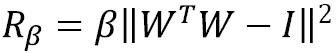

这里，*W*是重塑为矩阵的权重，beta 是一个超参数。由于这种正则化被发现具有局限性，BigGAN 使用了不同的变种：

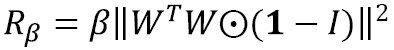

在这个变种中，*(1 – I)*去除了对角线元素，它们是滤波器的点积。这样去除了滤波器范数的约束，并旨在最小化滤波器之间的成对余弦相似度。

正交性与谱归一化密切相关，两者可以在网络中共存。我们将谱归一化实现为核约束，其中权重被直接修改。权重正则化通过计算权重的损失并将损失添加到其他损失中进行反向传播，从而以间接方式对权重进行正则化。以下代码展示了如何在 TensorFlow 中编写自定义正则化器：

```py
class OrthogonalReguralizer( 			tf.keras.regularizers.Regularizer):
    def __init__(self, beta=1e-4):
        self.beta = beta   
    def __call__(self, input_tensor):
        c = input_tensor.shape[-1]
        w = tf.reshape(input_tensor, (-1, c)) 
        ortho_loss = tf.matmul(w, w, transpose_a=True) *\ 					   (1 -tf.eye(c))
        return self.beta * tf.norm(ortho_loss)
    def get_config(self):
        return {'beta': self.beta}
```

然后，我们可以将*核初始化器*、*核约束*和*核正则化器*分配给卷积层和全连接层。然而，将它们添加到每一层中会使代码显得冗长且杂乱。为了避免这种情况，我们可以将它们放入字典中，并作为关键字参数（`kwargs`）传递到 Keras 层中，方法如下：

```py
g_kernel_cfg={
    'kernel_initializer' : \ 				tf.keras.initializers.Orthogonal(),
    'kernel_constraint' : SpectralNorm(),
    'kernel_regularizer' : OrthogonalReguralizer()
}
Conv2D(1, 1, padding='same', **g_kernel_cfg)
```

正如我们之前提到的，正交正则化对提升图像质量的影响最小。*1e-4*的β值是通过数值计算得到的，您可能需要根据您的数据集调整它。

# 总结

在本章中，我们学习了一个重要的网络架构——自注意力机制。卷积层的有效性受其感受野的限制，而自注意力机制有助于捕捉包括与传统卷积层空间上距离较远的激活在内的重要特征。我们学习了如何编写自定义层并将其插入到 SAGAN 中。SAGAN 是一种最先进的类别条件 GAN。我们还实现了条件批量归一化，以学习特定于每个类别的不同可学习参数。最后，我们研究了 SAGAN 的强化版本，即 BigGAN，它在图像分辨率和类别变化方面大大超越了 SAGAN 的表现。

我们现在已经了解了大多数重要的生成对抗网络（GAN）用于图像生成的内容。如果不是全部的话。近年来，GAN 领域的两个主要组件开始受到关注——它们分别是用于 StyleGAN 的 AdaIN，如在*第七章*中讨论的，*高保真面部生成*，以及 SAGAN 中的自注意力机制。Transformer 基于自注意力机制，并已在自然语言处理（NLP）领域引发了革命，它也开始进入计算机视觉领域。因此，现在是学习基于注意力的生成模型的好时机，因为未来的 GAN 可能会采用这种方法。在下一章中，我们将运用本章末尾关于图像生成的知识来生成一段深度伪造视频。
