# 第九章：视频合成

在前几章中，我们已经学习并构建了许多图像生成模型，包括最先进的**StyleGAN**和**Self-Attention GAN**（**SAGAN**）模型。你现在已经了解了生成图像所需的大部分，甚至是全部重要技术，现在我们可以进入视频生成（合成）部分。实际上，视频只是静态图像的一系列。 因此，最基本的视频生成方法是单独生成图像，并将它们按顺序组合成视频。**视频合成**本身是一个复杂而广泛的话题，我们不可能在一个章节中涵盖所有内容。

在本章中，我们将概述视频合成。然后，我们将实现可能是最著名的视频生成技术——`deepfake`，你会惊讶于其中一些看起来有多么逼真。

本章将涵盖以下内容：

+   视频合成概述

+   实现人脸图像处理

+   构建一个 deepfake 模型

+   换脸

+   使用 GANs 改进 DeepFakes

# 技术要求

本章的代码可以在这里访问：

[`github.com/PacktPublishing/Hands-On-Image-Generation-with-TensorFlow-2.0/tree/master/Chapter09`](https://github.com/PacktPublishing/Hands-On-Image-Generation-with-TensorFlow-2.0/tree/master/Chapter09)

本章使用的笔记本是这个：

+   `ch9_deepfake.ipynb`

# 视频合成概述

假设你在看视频时门铃响了，于是你暂停了视频去开门。当你回来时，屏幕上会看到什么？一个静止的画面，所有内容都被冻结且不动。如果你按下播放按钮并迅速再次暂停，你会看到另一幅与之前非常相似但略有不同的图像。没错——当你按顺序播放一系列图像时，你得到的是视频。

我们说图像数据有三维，或者是*(H, W, C)*；视频数据有四维，*(T, H, W, C)*，其中`T`是时间（时序）维度。视频本质上只是大量的*批量*图像，只不过我们不能随意打乱这些图像的顺序。图像之间必须保持时间一致性；我会进一步解释这一点。

假设我们从某些视频数据集中提取图像，并训练一个无条件 GAN 来生成来自随机噪声输入的图像。正如你可以想象的那样，这些图像之间会有很大的不同。因此，使用这些图像制作的视频将是无法观看的。与图像生成一样，视频生成也可以分为无条件和条件生成。

在无条件视频合成中，模型不仅需要生成高质量的内容，还必须控制时间内容或运动的一致性。因此，输出视频对于一些简单的视频内容来说通常会非常短。无条件视频合成仍然不够成熟，无法广泛应用于实际情况。

另一方面，条件视频合成依赖于输入内容，因此生成的结果质量更高。正如我们在*第四章**图像到图像的转换*中学到的那样，通过 pix2pix 生成的图像几乎没有随机性。缺乏随机性在某些应用中可能是一个缺点，但在视频合成中，生成图像的一致性是一个优点。因此，许多视频合成模型都以图像或视频为条件。特别是，条件人脸视频合成已经取得了显著的成果，并在商业应用中产生了真实的影响。接下来，我们将讨论一些最常见的人脸视频合成形式。

## 理解人脸视频合成

最常见的人脸视频合成形式是**人脸重演**和**人脸交换**。最好通过下面的图片来解释它们之间的区别：

）](img/B14538_09_1.jpg)

图 9.1 – 人脸重演与人脸交换（来源：Y. Nirkin 等人，2019 年，《FSGAN: 主体无关的人脸交换与重演》，[`arxiv.org/pdf/1908.05932`](https://arxiv.org/pdf/1908.05932)）

顶行展示了人脸重演的工作原理。在人脸重演中，我们希望将目标视频（右侧）中脸部的表情转移到源图像（左侧）中的脸部，从而生成中间的图像。数字化木偶技术已广泛应用于计算机动画和电影制作中，演员的面部表情用来控制数字化的虚拟人物。使用人工智能进行的人脸重演有潜力使这一过程变得更加简单。底行展示了人脸交换。这次，我们希望保持目标视频的面部表情，但使用源图像中的面部。

虽然技术上有所不同，人脸重演和人脸交换是相似的。在生成的视频方面，它们都可以用来制作*假视频*。顾名思义，人脸交换仅交换面部而不交换头部。因此，目标面部和源面部应该具有相似的形状，以提高假视频的保真度。你可以利用这一视觉线索来区分人脸交换视频和人脸重演视频。人脸重演在技术上更具挑战性，并且它并不总是需要驱动视频；它也可以使用面部特征点或草图。我们将在下一章介绍一个这样的模型。在本章的剩余部分，我们将重点讨论如何使用 deepfake 算法实现人脸交换。

## DeepFake 概述

你们中的许多人可能看过一些在线视频，其中一位演员的面部被另一个名人的面部替换。通常情况下，那位名人是演员尼古拉斯·凯奇，结果视频看起来相当搞笑。这一切始于 2017 年底，当时一位匿名用户名为*deepfakes*的用户在社交新闻网站 Reddit 上发布了这一算法（后来该算法也以这个用户名命名）。这非常不寻常，因为过去十年几乎所有突破性的机器学习算法都源自学术界。

人们已经使用 deepfake 算法制作了各种视频，包括一些电视广告和电影。然而，由于这些假视频可能非常逼真，它们也引发了一些伦理问题。研究人员已经证明，有可能制作假视频，让前美国总统奥巴马说出他从未说过的话。人们有充分的理由对 deepfake 感到担忧，研究人员也在设计检测这些假视频的方法。无论是为了制作搞笑视频，还是为了应对假新闻视频，你都应该了解 deepfake 的工作原理。那么，让我们开始吧！

deepfake 算法大致可以分为两个部分：

1.  **深度学习模型**用于执行人脸图像转换。我们首先收集两个人的数据集，假设为*`A`*和*`B`*，并使用自编码器分别对其进行训练，以学习他们的潜在编码，如下图所示。这里有一个共享的编码器，但我们为不同的人使用单独的解码器。图中的上部分展示了训练架构，下部分展示了面部交换过程。

    首先，**A 面部**（源面部）被编码成一个小的潜在面部（潜在编码）。该潜在编码包含诸如头部姿势（角度）、面部表情、眼睛睁开或闭合等面部特征。然后我们将使用解码器*`B`*将潜在编码转换为**B 面部**。目标是使用**A 面部**的姿势和表情生成**B 面部**：

    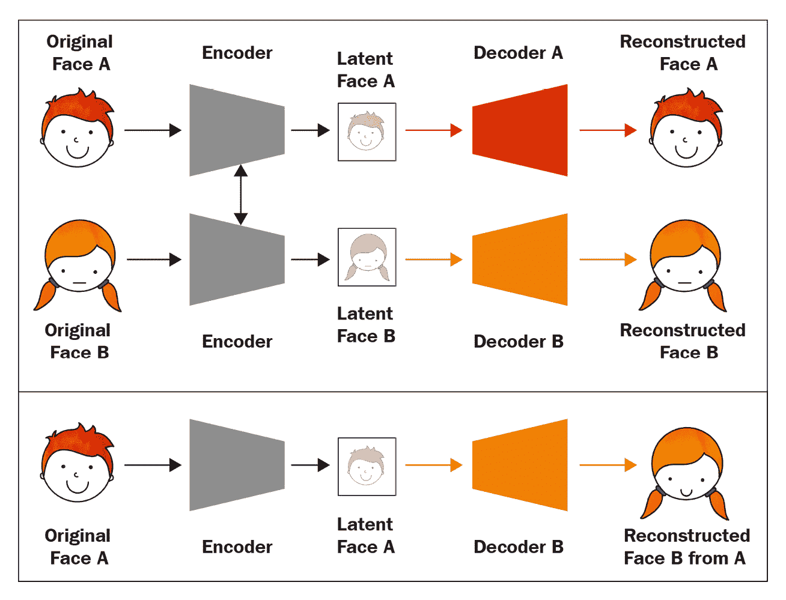

    图 9.2 – 使用自编码器的 deepfake。(上) 使用一个编码器和两个解码器进行训练。(下) 从 A 重建 B 面部（改绘自：T.T. Nguyen 等人，2019 年，《深度学习在 deepfakes 创建和检测中的应用：综述》，https://arxiv.org/abs/1909.11573）

    在普通的图像生成设置中，模型基本上是我们生产所需的内容。我们所需要做的就是将输入图像发送给模型，从而生成输出图像。但 deepfake 的生产流程更为复杂，稍后会做详细描述。

1.  我们需要使用一系列传统的计算机视觉技术来执行预处理和后处理，包括以下内容：

    a) 人脸检测

    b) 人脸关键点检测

    c) 人脸对齐

    d) 人脸扭曲

    e) 人脸遮罩检测

    下图展示了深度伪造的生产流程：

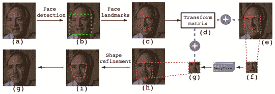

图 9.3 – DeepFake 生产流程（来源：Y. Li, S. Lyu, 2019，《通过检测人脸扭曲伪影揭露深度伪造视频》，https://arxiv.org/abs/1811.00656）

这些步骤可以分为三个阶段：

1.  步骤 *(a)* 到 *(f)* 是用于从图像中提取并对齐源人脸的预处理步骤。

1.  有一个人脸交换过程来生成目标 *人脸 (g)*。

1.  步骤 *(h)* 到 *(j)* 是后处理步骤，用于 *粘贴* 目标人脸到图像中。

我们在*第二章*中学习并构建了自编码器和变分自编码器，因此对于深度伪造来说，构建一个自编码器相对容易。另一方面，许多上述的计算机视觉技术在本书中之前并未介绍过。因此，在接下来的章节中，我们将逐步实现人脸处理步骤，然后实现自编码器，最后将所有技术结合起来制作深度伪造视频。

# 实现人脸图像处理

我们将主要使用两个 Python 库 —— `dlib` 最初是一个用于机器学习的 C++ 工具包，它也有 Python 接口，是进行人脸关键点检测的首选机器学习 Python 库。本章使用的大部分图像处理代码改编自 [`github.com/deepfakes/faceswap`](https://github.com/deepfakes/faceswap)。

## 从视频中提取图像

生产流程中的第一步是从视频中提取图像。视频由一系列按固定时间间隔分隔的图像组成。如果你检查一个视频文件的属性，可能会看到它被表示为 `.mp4` 视频文件，保存在目录/images 中，并使用数字序列命名——例如，`image_0001.png`，`image_0002.png`，以此类推：

```py
ffmpeg  -i video.mp4 /images/image_%04d.png
```

或者，我们也可以使用 OpenCV 按帧读取视频，并将每一帧保存为单独的图像文件，如下面的代码所示：

```py
import cv2
cap = cv2.VideoCapture('video.mp4')
count = 0 
while cap.isOpened():
    ret,frame = cap.read()
    cv2.imwrite(“images/image_%04d.png” % count, frame)
    count += 1
```

我们将使用提取的图像进行所有后续处理，之后不再关心源视频。

## 检测和定位人脸

传统的计算机视觉技术通过使用**方向梯度直方图**（**HOG**）来检测人脸。可以通过计算水平和垂直方向上相邻像素的差异来求得像素图像的梯度。梯度的大小和方向告诉我们人脸的线条和角落。我们可以将 HOG 作为特征描述符来检测人脸的形状。当然，现代的方法是使用卷积神经网络（CNN），它更准确但速度较慢。

`face_recognition`是一个基于`dlib`构建的库。默认情况下，它使用`dlib`的 HOG 作为面部检测器，但它也有使用 CNN 的选项。使用它非常简单，如下所示：

```py
import face_recognition
coords = face_recognition.face_locations(image, model='cnn')[0]
```

这将返回一个包含每个面部在图像中检测到的坐标的列表。在我们的代码中，我们假设图像中只有一个面部。返回的坐标是`css`格式（上、右、下、左），因此我们需要额外的步骤将它们转换为`dlib.rectangle`对象，以便传递给`dlib`的面部标志点检测器，代码如下：

```py
def _css_to_rect(css):
    return dlib.rectangle(css[3], css[0], css[1], css[2])
face_coords = _css_to_rect(coords)
```

我们可以从`dlib.rectangle`中读取边界框坐标，并按如下方式从图像中裁剪面部：

```py
def crop_face(image, coords, pad=0):
    x_min = coords.left() - pad
    x_max = coords.right() + pad
    y_min = coords.top() - pad
    y_max = coords.bottom() + pad
    return image[y_min:y_max, x_min:x_max]
```

如果在图像中检测到面部，我们可以继续进行下一步，检测面部标志点。

## 检测面部标志点

`dlib`模型：

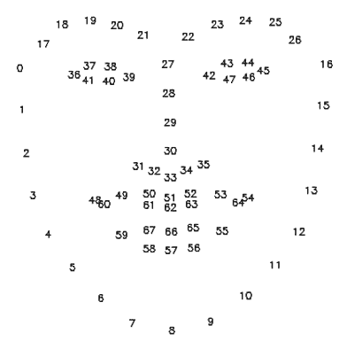

图 9.4 – dlib 面部标志点的 68 个点，包括下巴、眉毛、鼻梁、鼻尖、眼睛和嘴唇

`dlib`使得面部标志点检测变得容易。我们只需下载并加载模型到`dlib`中，像下面的代码片段一样使用它：

```py
predictor = dlib.shape_predictor( 		    'shape_predictor_68_face_landmarks.dat') 
face_shape = predictor(face_image, face_coords)
```

注意

我们还将面部坐标传递给预测器，告诉它面部的位置。这意味着，我们在调用函数之前不需要裁剪面部。

面部标志点在机器学习问题中非常有用。例如，如果我们想知道一个人的面部表情，可以使用嘴唇关键点作为输入特征，传递给机器学习算法来检测嘴巴是否张开。这比查看图像中的每个像素更有效和高效。我们还可以使用面部标志点来估计头部姿势。

在 DeepFake 中，我们使用面部标志点进行面部对齐，稍后我会解释。 在此之前，我们需要将`lib`格式的标志点转换为 NumPy 数组：

```py
def shape_to_np(shape):
    coords = []
    for i in range(0, shape.num_parts):        
        coords.append((shape.part(i).x, shape.part(i).y))
    return np.array(coords)
face_shape = shape_to_np(face_shape)
```

现在我们拥有了进行面部对齐所需的一切。

## 对齐面部

自然，视频中的面部会出现各种姿势，比如向左看或张嘴。为了使自编码器更容易学习，我们将面部对齐到裁剪图像的中心，正对着镜头。这就是`dlib`的面部标志点，除了下巴的前 18 个点。这是因为人们的下巴形状差异很大，这可能会影响对齐的结果，因此它们不作为参考。

平均面孔

如果你还记得，我们在*第一章*《使用 TensorFlow 进行图像生成入门》中查看了平均面孔。它们是通过直接从数据集中采样生成的，因此与`dlib`中使用的方法并不完全相同。不管怎样，如果你忘记了平均面孔的样子，随时可以去看看。

我们需要对面部执行以下操作，将其与平均面孔的位置和角度对齐：

+   旋转

+   缩放

+   平移（位置变化）

这些操作可以通过一个 2×3 的仿射变换矩阵来表示。仿射矩阵 `M` 由矩阵 `A` 和 `B` 组成，如下方的方程所示：

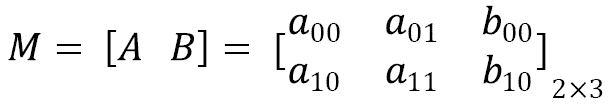

矩阵 `A` 包含线性变换（缩放和旋转）的参数，而矩阵 `B` 用于平移。深度伪造使用 S. Umeyama 的算法来估计这些参数。该算法的源代码包含在我已经上传到 GitHub 仓库的一个文件中。我们通过传递检测到的面部特征点和均值面部特征点来调用该函数，如下方的代码所示。如前所述，我们省略了下巴的特征点，因为它们不包含在均值面中：

```py
from umeyama import umeyama def get_align_mat(face_landmarks):    return umeyama(face_landmarks[17:], \  			   mean_landmarks, False)[0:2]affine_matrix = get_align_mat(face_image)
```

我们现在可以将仿射矩阵传递给 `cv2.warpAffine()` 来执行仿射变换，如下方的代码所示：

```py
def align_face(face_image, affine_matrix, size, padding=50):
    affine_matrix = affine_matrix * \ 				(size[0] - 2 * padding) 
    affine_matrix[:, 2] += padding
    aligned_face = cv2.warpAffine(face_image,  						  affine_matrix,  						  (size, size))    return aligned_face
```

以下图展示了对齐前后的面部：

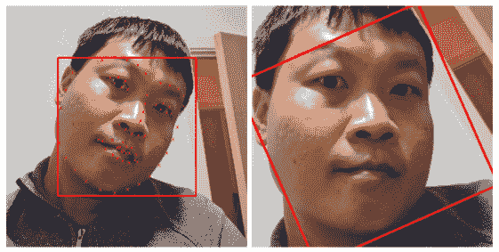

图 9.5 – （左）作者的面部特征点和面部检测边框。（右）对齐后的面部

图中的边框显示了面部检测的效果。左侧的图片也标记了面部特征点。右侧是对齐后的面部。我们可以看到，面部已经被放大以适应均值面部。实际上，对齐后的输出将面部放大，覆盖了眉毛和下巴之间的区域。我加入了一些填充，使图像稍微缩小一些，以便包含边框在最终图像中。从边框可以看到，面部已经旋转，使其看起来是垂直的。接下来，我们将学习最后一个图像预处理步骤：面部扭曲。

## 面部扭曲

我们需要两张图像来训练自编码器，一张是输入图像，另一张是目标图像。在深度伪造中，目标图像是对齐后的面部，而输入图像是经过扭曲处理的对齐面部版本。图像中的面部在我们在前一节中实现的仿射变换之后并没有改变形状，但通过扭曲（例如，扭曲面部的一侧）可以改变面部的形状。深度伪造通过扭曲面部来模拟真实视频中面部姿态的多样性，作为数据增强。

在图像处理中，变换是将源图像中一个像素映射到目标图像中不同位置的过程。例如，平移和旋转是位置和角度变化的一对一映射，但大小和形状保持不变。对于扭曲，映射可以是不规则的，同一个点可能被映射到多个点，从而产生扭曲和弯曲的效果。下图显示了将图像从 256×256 尺寸扭曲到 64×64 的映射示例：

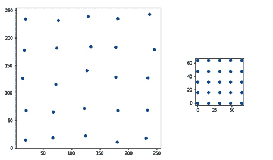

图 9.6 – 显示扭曲的映射

我们将进行一些随机扭曲，稍微扭曲面部图像，但不会造成严重的变形。以下代码展示了如何进行面部扭曲。你不必理解每一行代码，知道它使用之前描述的映射将面部扭曲为较小维度即可：

```py
coverage = 200 range_ = numpy.linspace(128 - coverage//2, 128 + coverage//2, 5)mapx = numpy.broadcast_to(range_, (5, 5))
mapy = mapx.T
mapx = mapx + numpy.random.normal(size=(5, 5), scale=5)
mapy = mapy + numpy.random.normal(size=(5, 5), scale=5)
interp_mapx = cv2.resize(mapx, (80, 80))\ 				   [8:72, 8:72].astype('float32')
interp_mapy = cv2.resize(mapy, (80, 80))[8:72,\ 				   8:72].astype('float32')
warped_image = cv2.remap(image, interp_mapx,  				   interp_mapy, cv2.INTER_LINEAR)
```

我猜大多数人认为深伪造只是一个深度神经网络，但并没有意识到其中涉及了许多图像处理步骤。幸运的是，OpenCV 和 `dlib` 让这一切变得简单。现在，我们可以继续构建整个深度神经网络模型。

# 构建 DeepFake 模型

原始深伪造使用的深度学习模型是基于自编码器的。总共有两个自编码器，每个面部领域一个。它们共享相同的编码器，因此模型中总共有一个编码器和两个解码器。自编码器期望输入和输出图像大小均为 64×64。现在，让我们来构建编码器。

## 构建编码器

正如我们在上一章所学，编码器负责将高维图像转换为低维表示。我们将首先编写一个函数来封装卷积层；在下采样过程中使用 Leaky ReLU 激活：

```py
def downsample(filters):
    return Sequential([
        Conv2D(filters, kernel_size=5, strides=2, 			padding='same'),
        LeakyReLU(0.1)])
```

在常规自编码器实现中，编码器的输出是一个大约大小为 100 到 200 的 1D 向量，但深伪造使用了更大的尺寸 1,024。此外，它将 1D 潜在向量重塑并放大回 3D 激活。因此，编码器的输出不是一个大小为 (1,024) 的 1D 向量，而是一个大小为 (8, 8, 512) 的张量，如下代码所示：

```py
def Encoder(z_dim=1024):
    inputs = Input(shape=IMAGE_SHAPE)
    x = inputs
    x = downsample(128)(x)
    x = downsample(256)(x)
    x = downsample(512)(x)
    x = downsample(1024)(x)
    x = Flatten()(x)
    x = Dense(z_dim)(x)
    x = Dense(4 * 4 * 1024)(x)
    x = Reshape((4, 4, 1024))(x)  
    x = UpSampling2D((2,2))(x)
    out = Conv2D(512, kernel_size=3, strides=1, 			 padding='same')(x)        
    return Model(inputs=inputs, outputs=out, name='encoder')
```

我们可以看到，编码器可以分为三个阶段：

1.  模型中包含卷积层，将一个 `(64, 64, 3)` 的图像逐步降维至 `(4, 4, 1024)`。

1.  有两个全连接层。第一个生成一个大小为 `1024` 的潜在向量，第二个将其投影到更高维度，并将其重塑为 `(4, 4, 1024)`。

1.  上采样和卷积层将输出调整为大小 `(8, 8, 512)`。

通过查看以下模型总结，可以更好地理解这一点：

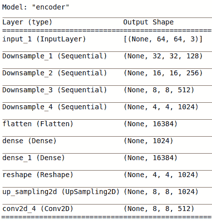

图 9.7 – 模型总结

下一步是构建解码器。

## 构建解码器

解码器的输入来自编码器的输出，因此它期望一个大小为 `(8, 8, 512)` 的张量。我们使用多个上采样层逐步将激活值放大，最终达到目标图像尺寸 `(64, 64, 3)`：

1.  与之前类似，我们首先编写一个上采样模块的函数，其中包含上采样函数、卷积层和 Leaky ReLU，如下代码所示：

    ```py
    def upsample(filters, name=''):
        return Sequential([
            UpSampling2D((2,2)),
            Conv2D(filters, kernel_size=3, strides=1, 			padding='same'),        
            LeakyReLU(0.1)
        ], name=name)
    ```

1.  然后我们将上采样模块堆叠在一起。最后一层是一个卷积层，将通道数调整为 `3`，以匹配 RGB 颜色通道：

    ```py
    def Decoder(input_shape=(8, 8 ,512)):
        inputs = Input(shape=input_shape)
        x = inputs    
        x = upsample(256,”Upsample_1”)(x)
        x = upsample(128,”Upsample_2”)(x)
        x = upsample(64,”Upsample_3”)(x)
        out = Conv2D(filters=3, kernel_size=5, 			 padding='same', 			 activation='sigmoid')(x)    
        return Model(inputs=inputs, outputs=out, 			 name='decoder')
    ```

    解码器模型总结如下：

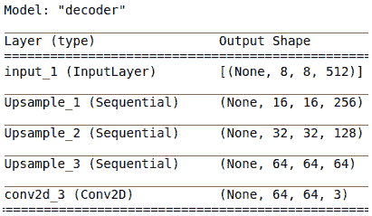

图 9.8 – 解码器的 Keras 模型总结

接下来，我们将把编码器和解码器组合在一起，构建自编码器。

## 训练自编码器

如前所述，DeepFake 模型由两个共享相同编码器的自编码器组成。构建自编码器的第一步是实例化编码器和解码器：

```py
class deepfake:
    def __init__(self, z_dim=1024):
        self.encoder = Encoder(z_dim)
        self.decoder_a = Decoder()
        self.decoder_b = Decoder()
```

然后，我们通过将编码器与相应的解码器连接在一起来构建两个独立的自编码器，如下所示：

```py
        x = Input(shape=IMAGE_SHAPE)
        self.ae_a = Model(x, self.decoder_a(self.encoder(x)),
                          name=”Autoencoder_A”)
        self.ae_b = Model(x, self.decoder_b(self.encoder(x)),
                          name=”Autoencoder_B”)
        optimizer = Adam(5e-5, beta_1=0.5, beta_2=0.999)
        self.ae_a.compile(optimizer=optimizer, loss='mae')
        self.ae_b.compile(optimizer=optimizer, loss='mae')
```

下一步是准备训练数据集。尽管自编码器的输入图像大小为 64×64，但图像预处理管道要求图像大小为 256×256。每个面部领域大约需要 300 张图像。GitHub 仓库中有一个链接，您可以通过它下载一些准备好的图像。

另外，您还可以通过使用我们之前学习的图像处理技术，从收集的图像或视频中裁剪面部来自己创建数据集。数据集中的面部不需要对齐，因为对齐将在图像预处理管道中执行。图像预处理生成器将返回两张图像——一张对齐的面部图像和一张扭曲版本，分辨率都是 64×64\。

现在，我们可以将这两个生成器传递给`train_step()`来训练自编码器模型，如下所示：

```py
def train_step(self, gen_a, gen_b):
    warped_a, target_a = next(gen_a)
    warped_b, target_b = next(gen_b)
    loss_a = self.ae_a.train_on_batch(warped_a, target_a)
    loss_b = self.ae_b.train_on_batch(warped_b, target_b)
    return loss_a, loss_b
```

编写和训练自编码器可能是深度伪造管道中最简单的部分。我们不需要太多数据；每个面部领域大约 300 张图像就足够了。当然，更多的数据会带来更好的结果。由于数据集和模型都不大，因此即使不使用 GPU，训练也可以相对快速地完成。一旦我们有了训练好的模型，最后一步就是进行面部交换。

# 面部交换

这就是深度伪造管道的最后一步，但我们先回顾一下整个管道。深度伪造生产管道包括三个主要阶段：

1.  使用`dlib`和 OpenCV 从图像中提取面部。

1.  使用训练好的编码器和解码器进行面部转换。

1.  将新面部替换回原始图像中。

自编码器生成的新面部是大小为 64×64 的对齐面部，因此我们需要将其扭曲到原始图像中面部的位置、大小和角度。我们将使用在*步骤 1*中从面部提取阶段获得的仿射矩阵。我们将像之前一样使用`cv2.warpAffine`，但这次使用`cv2.WARP_INVERSE_MAP`标志来反转图像变换的方向，如下所示：

```py
h, w, _ = image.shape
size = 64
new_image = np.zeros_like(image, dtype=np.uint8)
new_image = cv2.warpAffine(np.array(new_face, 						   dtype=np.uint8)
                          mat*size, (w, h), 
                          new_image,
                          flags=cv2.WARP_INVERSE_MAP,
                          borderMode=cv2.BORDER_TRANSPARENT)
```

然而，直接将新面部粘贴到原始图像上会在边缘处产生伪影。如果新面部的任何部分（即 64×64 的方形面部）超出原始面部的边界，伪影会特别明显。为了减轻这些伪影，我们将使用面部遮罩来修剪新面部。

我们将创建的第一个遮罩是围绕原始图像中面部特征点轮廓的遮罩。以下代码首先会找到给定面部特征点的轮廓，然后用 1 填充轮廓内部，并将其作为外壳遮罩返回：

```py
def get_hull_mask(image, landmarks):
    hull = cv2.convexHull(face_shape)
    hull_mask = np.zeros_like(image, dtype=float)
    hull_mask = cv2.fillConvexPoly(hull_mask,  						   hull,(1,1,1))
    return hull_mask
```

由于 **外轮廓蒙版** 比新面孔的正方形大，我们需要将外轮廓蒙版修剪以适应新正方形。为此，我们可以从新面孔创建一个矩形蒙版，并将其与外轮廓蒙版相乘。以下图示为图像的蒙版示例：

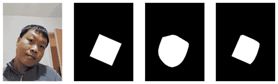

图 9.9 – （从左到右）（a）原始图像（b）新面孔的矩形蒙版（c）原始面孔的外轮廓蒙版（d）合成蒙版

然后我们使用蒙版从原始图像中去除面孔，并使用以下代码将新面孔填充进去：

```py
def apply_face(image, new_image, mask):
    base_image = np.copy(image).astype(np.float32)
    foreground = cv2.multiply(mask, new_image)
    background = cv2.multiply(1 - mask, base_image)
    output_image = cv2.add(foreground, background)
    return output_image
```

结果生成的面孔可能仍然不完美。例如，如果两张面孔的肤色或阴影差异很大，那么我们可能需要使用更进一步、更复杂的方法来修正伪影。

这就是换脸的全过程。我们对从视频中提取的每一帧图像进行换脸处理，然后将图像转换回视频序列。实现这一过程的一个方法是使用 `ffmpeg`，代码如下：

```py
ffmpeg -start_number 1 -i image_%04d.png -vcodec mpeg4 output.mp4
```

本章中使用的 deepfake 模型和计算机视觉技术相对基础，因为我希望它们易于理解。因此，代码可能无法生成一个逼真的假视频。如果你希望生成优质的假视频，我建议你访问 [`github.com/deepfakes/faceswap`](https://github.com/deepfakes/faceswap) GitHub 仓库，这也是本章大部分代码的来源。接下来，我们将快速了解如何通过使用 GAN 改进 deepfake。

# 使用 GAN 改进 DeepFakes

Deepfake 自动编码器的输出图像可能有点模糊，那么我们该如何改进呢？回顾一下，deepfake 算法可以分为两个主要技术——面孔图像处理和面孔生成。后者可以看作是一个图像到图像的翻译问题，我们在*第四章**《图像到图像的翻译》*中学到了很多。因此，自然的做法是使用 GAN 来提高图像质量。一个有用的模型是 **faceswap-GAN**，接下来我们将简要介绍它。原始 deepfake 中的自动编码器通过残差块和自注意力块（参见*第八章**《图像生成中的自注意力》*）进行增强，并作为 faceswap-GAN 的生成器。判别器的架构如下：

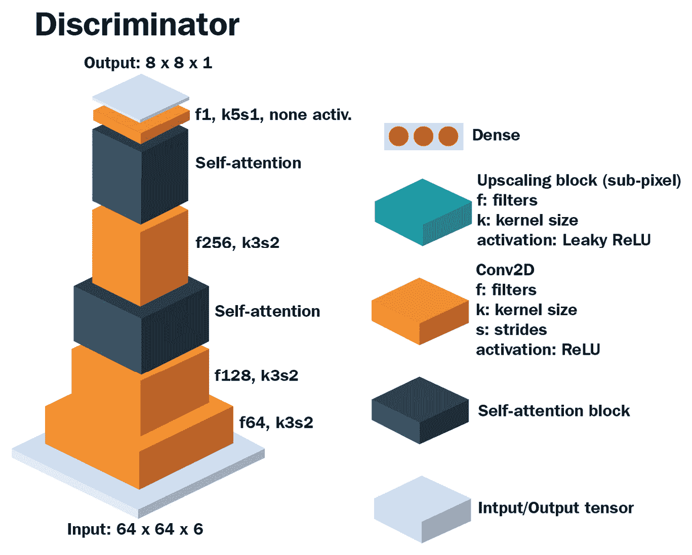

图 9.10 - faceswap-GAN 的判别器架构（重绘自：https://github.com/shaoanlu/faceswap-GAN）

通过仅仅观察前面的图示，我们可以了解到很多关于判别器的信息。首先，输入张量的通道维度为`6`，这意味着它是由两张图像——真实图像和假图像——堆叠而成。接着，有两个自注意力层的模块。输出的形状是 8×8×1，因此每个输出特征都会关注输入图像的某些小块。换句话说，判别器是带有自注意力层的 PatchGAN。

以下图示展示了编码器和解码器的架构：

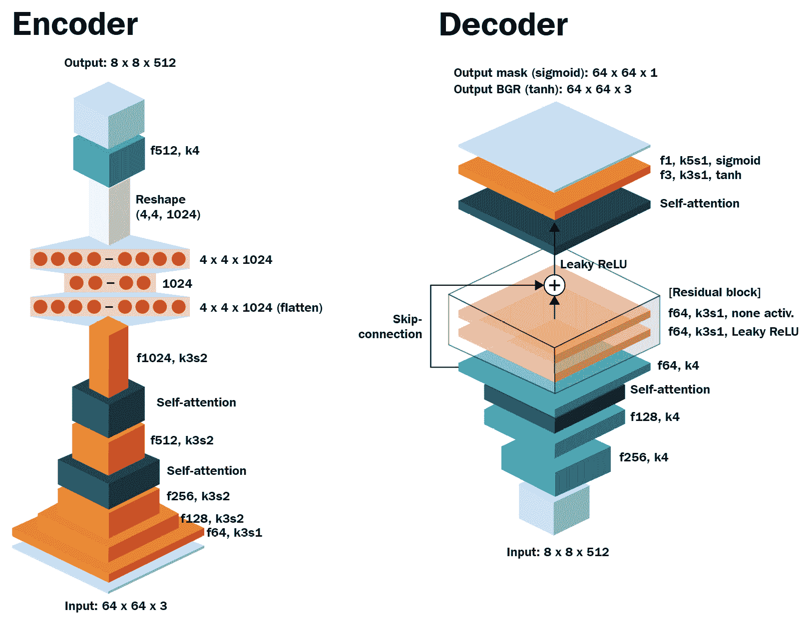

图 9.11 - faceswap-GAN 的编码器和解码器架构（重绘自：https://github.com/shaoanlu/faceswap-GAN）

编码器和解码器没有太大变化。自注意力层被添加到编码器和解码器中，并且解码器中添加了一个残差块。

训练中使用的损失函数如下：

+   **最小二乘法**（**LS**）**损失**是对抗损失。

+   **感知损失**是基于 VGG 特征的 L2 损失，用于衡量真实面孔和假面孔之间的差异。

+   L1 重建损失。

+   **边缘损失**是眼睛周围梯度的 L2 损失（在 `x` 和 `y` 方向上）。这有助于模型生成更逼真的眼睛。

本书中我一直试图实现的一个目标是：让你掌握大多数（如果不是全部）图像生成的基本构建块。一旦你掌握了它们，实现一个模型就像拼装乐高积木一样简单。由于我们已经熟悉了损失函数（除了边缘损失）、残差块和自注意力块，我相信你现在已经能够自己实现这个模型了，如果你愿意的话。对于感兴趣的读者，你可以参考[`github.com/shaoanlu/faceswap-GAN`](https://github.com/shaoanlu/faceswap-GAN)上的原始实现。

# 总结

恭喜！我们现在已经完成了本书中的所有编码工作。我们学会了如何使用`dlib`检测面部和面部特征点，如何使用 OpenCV 对面部进行变形和对齐。我们还学会了如何通过变形和遮罩来进行面部交换。事实上，我们大部分时间都在学习面部图像处理，几乎没有花时间深入学习深度学习部分。我们通过复用并修改上一章中的自动编码器代码来实现了自动编码器。

最后，我们讲解了一个通过使用 GANs 改进深伪技术的例子。faceswap-GAN 通过添加残差块、自注意力块和判别器来进行对抗训练，从而改进了深伪技术，这些内容我们在前面的章节中已经学习过了。

在下一章，也就是最后一章，我们将回顾本书中学到的技巧，并讨论在实际应用中训练 GAN 时的一些陷阱。接着，我们将介绍几种重要的 GAN 架构，重点讲解图像修复和文本到图像的合成。最后，我们将探讨一些新兴应用，如视频重定向和 3D 到 2D 的渲染。下一章没有编码内容，所以你可以放松一下，尽情享受。敬请期待！
