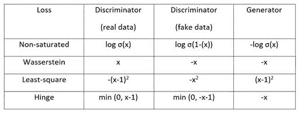
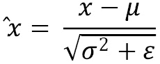
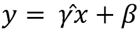
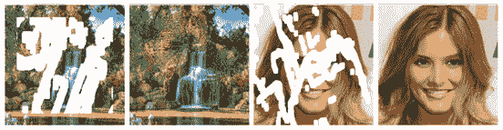
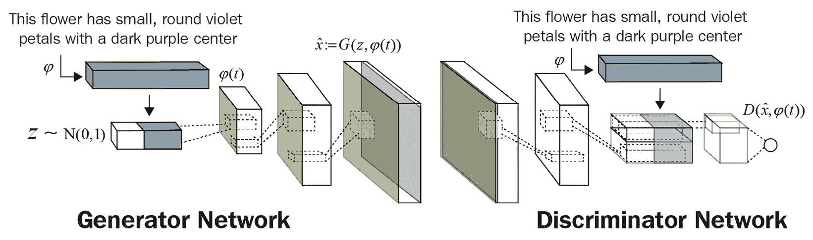
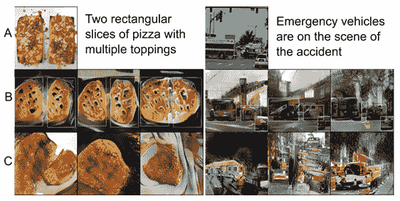
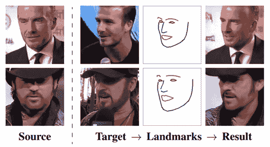
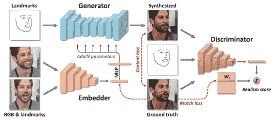
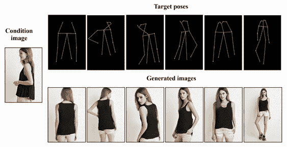

# 第十章: 前路

这是本书的最后一章。我们学习并实现了许多生成模型，但还有更多模型和应用我们没有涉及，因为它们超出了本书的范围。在本章中，我们将从总结一些我们学过的重要技术开始，如**优化器和激活函数**、**对抗损失**、**辅助损失**、**归一化**和**正则化**。

然后，我们将探讨在实际应用中使用生成模型时常见的一些陷阱。之后，我们将介绍一些有趣的图像/视频生成模型和应用。本章没有编码内容，但你会发现，我们在本章介绍的许多新模型都是使用之前学过的技术构建的。本章还提供了一些链接，供你查阅论文和代码，进一步探索该技术。

本章将涵盖以下主题：

+   回顾 GAN

+   将你的技能付诸实践

+   图像处理

+   文本到图像

+   视频重定向

+   神经渲染

# 回顾 GAN

除了我们在*第一章*中介绍的 PixelCNN，*使用 TensorFlow 进行图像生成入门*，这是一个 CNN 外，其他所有我们学习过的生成模型都基于（变分）自编码器或**生成对抗网络**（**GANs**）。严格来说，GAN 不是一种网络，而是一种训练方法，利用了两个网络——生成器和判别器。我尝试将大量内容融入本书，因此信息可能会让人感到有些压倒性。接下来，我们将通过以下类别总结我们所学的重要技术：

+   优化器和激活函数

+   对抗损失

+   辅助损失

+   归一化

+   正则化

## 优化器和激活函数

`0`和第二矩设定为`0.999`。生成器的学习率设定为`0.0001`，而判别器的学习率是生成器的两到四倍。判别器是 GAN 中的关键组件，必须在生成器之前学得很好。WGAN 在训练步骤中训练判别器的次数多于生成器，另一种方法是为判别器使用更高的学习率。

另一方面，内部层的实际激活函数是带有`0.01`或`0.02`的泄漏 ReLU。生成器的输出激活函数的选择取决于图像的归一化方式，即对于像素范围`[0, 1]`使用 sigmoid，或者对于`[-1, 1]`使用 Tanh。另一方面，判别器在大多数对抗损失中使用线性输出激活函数，除了早期非饱和损失使用 sigmoid。

## 对抗损失

我们已经看到，自编码器可以作为 GAN 设置中的生成器。GAN 通过对抗损失（有时称为 GAN 损失）进行训练。下表列出了几种流行的对抗损失：

图 10.1 – 重要的对抗损失；σ指的是 sigmoid 函数

非饱和损失用于普通的 GAN，但由于梯度分离，它不稳定。Wasserstein 损失有理论支持，证明它在训练时更稳定。然而，许多 GAN 模型选择使用最小二乘损失，这也证明是稳定的。近年来，hinge 损失成为了许多最先进模型的首选。尚不清楚哪种损失最优。不过，在本书中，我们在许多模型中使用了最小二乘损失和 hinge 损失，它们似乎能很好地训练。所以，我建议你在设计新的 GAN 时，首先尝试这两种损失。

## 辅助损失

除了对抗损失，作为 GAN 训练的主要损失外，还有各种辅助损失帮助生成更好的图像。以下是其中一些：

+   **重建损失** *(**第二章**, 变分自编码器)* 用于鼓励逐像素的准确性，通常是 L1 损失。

+   **KL 散度损失** *(**第二章**, 变分自编码器)* 用于**变分自编码器**（**VAE**），将潜在向量转换为标准的多元正态分布。

+   **循环一致性损失** *(**第四章**, 图像到图像的翻译)* 用于双向图像翻译。

+   **感知损失** *(**第五章**, 风格迁移)* 衡量图像之间的高级感知和语义差异。它可以进一步细分为两种损失：

    a) **特征匹配损失**，通常是从 VGG 层提取的图像特征的 L2 损失。这也被称为**感知损失**。

    b) **风格损失**特征通常来自 VGG 特征，如 Gram 矩阵或激活统计信息，并使用 L2 损失计算。

## 归一化

层激活被归一化以稳定网络训练。归一化通常采用以下形式：

这里，`x`是激活值，*µ*是激活值的均值，*σ*是激活值的标准差，*ε*是数值稳定性的调整因子。*γ*和*β*是可学习的参数；每个激活通道都有一对。这些不同的归一化方法主要的区别在于*µ*和*σ*是如何获取的：

+   在**批量归一化** *（*第三章**，生成对抗网络）*中，均值和标准差是在批量（`N`）和空间（`H`，`W`）位置上计算的，换句话说，就是（`N`，`H`，`W`）。

+   **实例归一化** *（*第四章**，图像到图像的转换）*，现在是首选方法，仅使用空间维度（`H`，`W`）。

+   **自适应实例归一化**（**AdaIN**）*（*第五章**，风格迁移）*具有不同的目的，来合并内容和风格激活。它仍然使用相同的方程式，只是现在这些参数具有不同的含义。`X`仍然是我们从内容特征中考虑的激活值。*γ*和*β*不再是可学习的参数，而是来自风格特征的均值和标准差。与实例归一化类似，统计量是在空间维度（`H`，`W`）上计算的。

+   **空间自适应归一化（SPADE）**（*第六章**，AI Painter）*为每个特征（像素）提供一个*γ*和*β*值，换句话说，它们的维度是（H，W，C）。它们通过在分割图上运行卷积层来分别归一化来自不同语义对象的像素。

**条件批量归一化** *（*第八章**，用于图像生成的自注意力）*与批量归一化类似，只不过*γ*和*β*现在是多维的（LABELS，C），因此每个类别标签都有一组。

`1`。

## 正则化

除了对抗损失和归一化，稳定 GAN 训练的另一个重要因素是正则化。正则化的目的是约束网络权重的增长，以保持生成器和判别器之间的竞争。这通常通过添加使用权重的损失函数来实现。GAN 中常用的两种正则化方法旨在强制执行 1-Lipschitz 约束：

+   **梯度惩罚** *（*第三章**，生成对抗网络）*惩罚梯度的增长，从而惩罚权重。然而，由于需要额外的反向传播来计算梯度，这一方法并不常用，且会显著减慢计算速度。

+   **正交正则化** *（*第八章**，用于图像生成的自注意力）*旨在使权重成为正交矩阵，这是因为如果矩阵与正交矩阵相乘，矩阵的范数不会发生变化。这可以避免梯度消失或爆炸的问题。

+   **谱归一化** *(**第八章**，图像生成的自注意力机制)* 通过将层的权重除以其谱范数来进行归一化。这与常规的正则化方法不同，后者通过损失函数来约束权重。谱归一化在计算上高效，易于实现，并且与训练损失无关。在设计新的 GAN 时，你应该使用它。

这就是 GAN 技术总结的结束。接下来，我们将探讨我们尚未探索过的新应用和模型。

# 将你的技能付诸实践

现在，你可以应用所学的技能来实施自己的图像生成项目。在开始之前，有一些陷阱你需要留意，同时也有一些实用的建议你可以遵循。

## 不要相信你所阅读的一切

一篇新的学术论文发布，展示了他们模型生成的惊人图像！对此要保持怀疑态度。通常，这些论文挑选了最好的结果进行展示，并隐藏了失败的示例。此外，图像会被缩小以适应论文版面，因此图像中的伪影可能在论文中不可见。在投入时间使用或重新实现论文中的信息之前，尽量寻找其他声称结果的资源。这可以是作者的网站或 GitHub 仓库，可能包含原始的高清图像和视频。

## 你的 GPU 有多大？

深度学习模型，尤其是 GANs，计算成本高昂。许多最先进的结果是在多个 GPU 上训练大量数据数周后产生的。你几乎肯定需要这种计算能力才能尝试重现这些结果。因此，注意论文中使用的计算资源，以避免失望。

如果你不介意等待，你可以使用一张 GPU 并等待四倍的时间（假设原始实现使用了四张 GPU）。然而，这通常意味着批量大小也需要减少四倍，这可能会影响结果和收敛速度。你可能需要减少学习率以适应减少的批量大小，这进一步拖慢了训练时间。

## 使用现有模型构建你的模型

著名的 AI 科学家安德烈·卡尔帕西（Dr. Andrej Karpathy）在 2019 年的一次讲座中说过 *“不要做英雄。”* 当你想创建一个 AI 项目时，不要自己发明模型；永远从现有模型开始。研究人员花费了大量的时间和资源来创建模型。在这个过程中，他们可能也加入了一些技巧。因此，你应该从现有模型开始，然后根据你的需求进行调整或在其基础上构建。

正如我们在本书中所看到的，大多数最先进的模型并不是凭空出现的，而是建立在现有的模型或技术之上。通常，网上可以找到模型的实现，要么是作者官方发布的，要么是机器学习爱好者在不同框架下的重新实现。一个有用的在线资源是[`paperswithcode.com/`](http://paperswithcode.com/)网站。

## 了解模型的局限性

我认识的许多 AI 公司并不会创建自己的模型架构，原因就在于前面提到的几点。那么，学习如何编写 TensorFlow 代码来创建图像生成模型的意义何在呢？首先的答案是，通过从零开始编写代码，您现在能理解各层和模型的构成以及它们的局限性。假设一个不了解 GANs 的人，对 AI 能做的事情感到惊讶，于是他们下载了 pix2pix，试图在自己的数据集上训练，将猫的图像转换成树木的图像。但这并没有成功，他们也不明白为什么会失败；对他们来说，AI 是一个黑盒。

作为受过人工智能教育的人，我们知道 pix2pix 需要成对的图像数据集，而对于未配对的数据集，我们需要使用 CycleGAN。您所学到的知识将帮助您选择合适的模型和数据使用。此外，您现在会知道如何根据不同的图像大小、不同的条件等调整模型架构。

我们现在已经看到了使用生成模型的一些常见陷阱。接下来，我们将探讨一些有趣的应用和模型，您可以利用生成模型进行操作。

# 图像处理

在所有图像生成模型能够完成的任务中，**图像处理**可能是最能为商业用途带来最佳效果的一个。在我们的语境中，图像处理指的是对现有图像应用某些变换以生成新图像。我们将在本节中探讨图像处理的三种应用——**图像修复**、**图像压缩**和**图像超分辨率**（**ISR**）。

## 图像修复

图像修复是填补图像中缺失像素的过程，使得结果在视觉上真实可信。它在图像编辑中有着实际应用，比如修复损坏的图像或去除遮挡物。在以下示例中，您可以看到如何使用图像修复去除背景中的人物。我们首先用白色像素填充人物，然后使用生成模型填充这些像素：

![图 10.2 – 使用 DeepFillv2 进行图像修复，去除背景中的人物（左）原始图像，（中）用白色面罩填充人物，（右）修复后的图像]

（来源：J. Yu 等，2018 年，"自由形式图像修复与门控卷积"， 

https://arxiv.org/abs/1806.03589）](img/B14538_10_02.jpg)

图 10.2 – 使用 DeepFillv2 进行图像填充以去除背景中的人物（左）原始图像，（中）人物被白色掩模填充，（右）恢复后的图像（来源：J. Yu 等人，2018 年，《使用门控卷积的自由形式图像填充》，[`arxiv.org/abs/1806.03589`](https://arxiv.org/abs/1806.03589)）

传统的图像填充方法是通过找到一个具有相似纹理的背景补丁，然后将其粘贴到缺失区域。然而，这通常只适用于小范围内简单纹理的情况。第一个为图像填充设计的 GAN 之一是**上下文编码器**。它的架构类似于自编码器，但在训练时除了常规的 L2 重建损失外，还会加入对抗损失。如果需要填充的区域较大，结果可能会显得模糊。

解决这一问题的一种方法是使用两个网络（粗略和精细）在不同尺度上进行训练。采用这种方法，**DeepFill**（J. Yu 等人，2018 年，*基于上下文注意力的生成图像填充*，[`arxiv.org/abs/1801.07892`](https://arxiv.org/abs/1801.07892)）增加了一个注意力层，以更好地捕捉来自遥远空间位置的特征。

在早期的 GAN 中，通过随机裁剪方形掩模（孔洞）来创建图像填充的数据集，但该技术并不适用于实际应用。Yu 等人提出了一个部分卷积层来创建不规则的掩模。该层包含一个像我们在 PixelCNN 中实现的掩模卷积，*第一章*，*使用 TensorFlow 进行图像生成入门*中也有介绍。以下图像示例展示了使用基于部分卷积的网络的结果：

图 10.3 – 不规则的掩模和填充后的结果（来源：G. Liu 等人，2018 年，《使用部分卷积进行不规则孔洞图像填充》，[`arxiv.org/abs/1804.07723`](https://arxiv.org/abs/1804.07723)）

**DeepFillv2**使用门控卷积来改进和概括掩模卷积。DeepFill 仅使用标准判别器来预测图像的真伪。然而，当自由形式的图像填充中存在多个孔洞时，这种方法效果不佳。因此，它使用**谱归一化的 PatchGAN**（**SN-PatchGAN**）来促进更逼真的图像填充。

以下是一些关于此主题的额外资源：

+   DeepFillv1 和 v2 的 TensorFlow v1 源代码：[`github.com/JiahuiYu/generative_inpainting`](https://github.com/JiahuiYu/generative_inpainting)

+   互动图像填充演示，你可以使用自己的照片进行操作：[`www.nvidia.com/research/inpainting/`](https://www.nvidia.com/research/inpainting/)

## 图像压缩

图像压缩是将图像从原始像素转换为编码数据的过程，压缩后的数据体积要小得多，方便存储或通信。例如，JPEG 文件就是一种压缩图像。当我们打开一个 JPEG 文件时，计算机会逆向压缩过程来恢复图像像素。简化的图像压缩流程如下：

1.  **分割**：将图像分成小块，每个小块将单独处理。

1.  **变换**：将原始像素转换为更易压缩的表示。在此阶段，通常通过去除高频内容来实现更高的压缩率，这些高频内容会使恢复后的图像变得模糊。例如，考虑一个包含[255, 250, 252, 251, ...]像素值的灰度图像段，这些像素几乎是白色的。它们之间的差异非常小，以至于人眼无法察觉，因此我们可以将所有像素转换为 255。这将使数据更容易压缩。

1.  **量化**：使用较低的位数表示数据。例如，将一个灰度图像，其中像素值在[0, 255]之间的 256 个值，转换为黑白两个值[0, 1]。

1.  **符号编码**用于使用一些高效的编码来编码数据。其中一种常见的编码方式是**游程编码**。我们可以不保存每个 8 位像素，而是只保存像素之间的差异。因此，代替保存[255, 255, 255, …]这样的白色像素，我们可以将其编码为[255] x 100，表示白色像素重复了 100 次。

通过使用更极端的量化或去除更多频率内容来实现更高的压缩率。因此，这些信息会丢失（因此，这被称为有损压缩）。下图展示了一个用于图像压缩的生成对抗网络（GAN）：

)](img/B14538_10_04.jpg)

图 10.4 – 生成式压缩网络。编码器 (E) 将图像映射到潜在特征 w。它通过有限的量化器 q 进行量化，以获得表示ŵ，可以编码为比特流。解码器 (G) 重建图像，D 是判别器。(来源：E. Agustsson 等，2018 年，“生成对抗网络用于极端学习图像压缩，” [`arxiv.org/abs/1804.02958`](https://arxiv.org/abs/1804.02958))

一般来说，生成式压缩使用自编码器架构将图像压缩为较小的潜在代码，并通过解码器恢复。

## 图像超分辨率

我们已经大量使用了上采样层，以增加生成器（GAN）或解码器（自编码器）中激活的空间分辨率。它通过拉开像素并通过插值填补空隙来工作。结果，放大的图像通常会模糊。

在许多图像应用中，我们希望在保持清晰度的同时放大图像，这可以通过**图像超分辨率**（**ISR**）来实现。ISR 的目标是将图像从**低分辨率**（**LR**）提升到**高分辨率**（**HR**）。**超分辨率生成对抗网络**（**SRGAN**）（C. Ledig 等，2016 年，*使用生成对抗网络进行照片级单图像超分辨率*，[`arxiv.org/abs/1609.04802`](https://arxiv.org/abs/1609.04802)）是第一个使用 GAN 来实现这一点的网络。

SRGAN 的架构类似于 DCGAN，但使用残差块而不是普通的卷积层。它借用了风格迁移文献中的感知损失，即通过 VGG 特征计算的内容损失。回顾来看，我们知道这是一个比像素级损失更好的视觉感知质量衡量标准。现在我们可以看到自编码器在各种图像处理任务中的多功能性。类似的自编码器架构可以重新用于其他图像处理任务，如图像去噪或去模糊。接下来，我们将看看一个应用，其中模型的输入不是图像而是文字。

# 文本到图像

文本到图像 GAN 是条件 GAN。然而，它们并不是使用类标签作为条件，而是使用文字作为生成图像的条件。在早期的实践中，GAN 使用词嵌入作为条件输入到生成器和判别器中。它们的架构类似于我们在*第四章*《图像到图像翻译》中学到的条件 GAN。不同之处仅在于，文本的嵌入是通过**自然语言处理**（**NLP**）预处理管道生成的。下图展示了文本条件 GAN 的架构：

图 10.5 – 文本条件卷积 GAN 架构，其中文本编码由生成器和判别器共同使用（重绘自：S. Reed 等，2016 年，“生成对抗文本到图像合成”，[`arxiv.org/abs/1605.05396`](https://arxiv.org/abs/1605.05396)）

与普通的 GAN 类似，生成的高分辨率图像往往会模糊。**StackGAN**通过将两个网络堆叠在一起解决了这个问题。下图展示了 StackGAN 在不同阶段生成的文本和图像，与普通 GAN 的对比：

）](img/B14538_10_06.jpg)

图 10.6 – StackGAN 在不同生成器阶段生成的图像（来源：H. Zhang 等，2017 年，"StackGAN：通过堆叠生成对抗网络生成文本到照片真实图像"，[`arxiv.org/abs/1612.03242`](https://arxiv.org/abs/1612.03242)）

第一个生成器从词嵌入中生成低分辨率图像。第二个生成器则将生成的图像和词嵌入作为输入条件，生成精细化的图像。我们在本书中已经学到，粗到精的架构在许多高分辨率 GAN 中以不同形式出现。

**AttnGAN**（T. Xu 等，2017 年，*AttnGAN：通过注意力生成对抗网络进行细粒度文本到图像生成，见于* [`arxiv.org/abs/1711.10485`](https://arxiv.org/abs/1711.10485)）通过使用注意力模块进一步改进了文本到图像的合成。该注意力模块不同于在 SAGAN 中使用的（*第八章* *，图像生成的自注意力*），但原理相同。在生成器的每个阶段开始时，注意力模块有两个输入——词特征和图像特征。它在从粗到精的生成器过程中，学习如何关注不同的词和图像区域。在此之后，大多数文本到图像模型都具有某种形式的注意力机制。

文本到图像仍然是一个未解决的问题，它仍然难以从文本生成复杂的真实世界图像。如我们在下图中看到的，生成的图像仍然远未完美。研究人员开始引入最近的自然语言处理（NLP）进展，以提高文本到图像的表现：

图 10.7 – 从 MS-COCO 数据集中给定标题生成的图像示例（A）数据集中的原始图像及其图像标题（B）由 StackGAN + 对象路径生成的图像（C）由 StackGAN 生成的图像（来源：T. Hinz 等，2019 年，"在空间上生成多个物体"，[`arxiv.org/abs/1901.00686`](https://arxiv.org/abs/1901.00686)）

接下来，我们将介绍视频重定向的激动人心的应用。

# 视频重定向

视频合成是一个广泛的术语，用于描述所有形式的视频生成。这包括从随机噪声或文字生成视频、为黑白视频上色等等，类似于图像生成。

在这一部分，我们将讨论视频合成中的一个子领域——**视频重定向**。我们首先介绍两个应用——面部重现和姿势转移，然后介绍一个强大的模型，该模型利用运动来泛化视频目标。

面部重现

**面部重现**与面部交换一起在*第九章*，《视频合成》中介绍。视频合成中的面部重现涉及将驱动视频的面部表情转移到目标视频中的面部。这在动画制作和电影制作中非常有用。最近，Zakharov 等提出了一种生成模型，只需要少量目标 2D 图像。这是通过使用面部地标作为中间特征来完成的，如下图所示：

(来源：E. Zakharov 等，2019 年，《少样本对抗学习真实神经对话头模型》，[`arxiv.org/abs/1905.08233`](https://arxiv.org/abs/1905.08233))](img/B14538_10_08.jpg)

图 10.8 – 将目标图像的面部表情转移到源图像（来源：E. Zakharov 等，2019 年，《少样本对抗学习真实神经对话头模型》，[`arxiv.org/abs/1905.08233`](https://arxiv.org/abs/1905.08233))

我们简要地看一下模型架构，如下图所示：

(来源：E. Zakharov 等，2019 年，《少样本对抗学习真实神经对话头模型》，[`arxiv.org/abs/1905.08233`](https://arxiv.org/abs/1905.08233))](img/B14538_10_09.jpg)

图 10.9 – 少样本对抗学习的架构（来源：E. Zakharov 等，2019 年，《少样本对抗学习真实神经对话头模型》，[`arxiv.org/abs/1905.08233`](https://arxiv.org/abs/1905.08233))

在前面的图示中，你应该注意到**AdaIN**，我们立刻知道它是一个基于风格的模型。因此，我们可以看到顶部的地标是内容（目标的面部形状和姿势），而风格（源的面部特征和表情）则是从**嵌入器**中提取的。生成器然后使用 AdaIN 将内容和风格融合，以重建面部。

最近，NVIDIA 部署了一个类似的模型，用于大幅降低远程视频会议的视频传输比特率。你可以访问他们的博客，[`blogs.nvidia.com/blog/2020/10/05/gan-video-conferencing-maxine/`](https://blogs.nvidia.com/blog/2020/10/05/gan-video-conferencing-maxine/)，了解他们如何在实际部署中使用许多 AI 技术，如 ISR、面部对齐和面部重现。接下来，我们将探讨如何利用 AI 来转移一个人的姿势。

## 姿势转移

**姿势转移**与面部重演类似，只是这次它将转移身体（和头部）姿势。执行姿势转移的方法有很多种，但所有方法都涉及使用**身体关节**（也称为**关键点**）作为特征。下图展示了从条件图像和目标姿势生成的图像示例：

图 10.10 – 将目标姿势转移到条件图像上（来源：Z. Zhu 等，2019 年，“用于人物图像生成的渐进式姿势注意力转移”，[`arxiv.org/abs/1904.03349`](https://arxiv.org/abs/1904.03349)）

姿势转移有许多潜在应用，包括从单张二维图像生成时尚模特视频。与面部重演相比，这项任务更具挑战性，因为人体姿势的种类繁多。接下来，我们将看看一种能够推广面部重演和姿势转移的动作模型。

## 动作转移

前一节介绍的面部重演和姿势转移模型需要物体特定的先验知识，换句话说，就是面部地标和人体姿势关键点。这些特征通常通过使用大量数据训练的独立模型来提取，这些数据的获取和标注往往是昂贵的。

最近，出现了一种与物体无关的模型，称为**一阶动作模型**（A. Siarohin 等，2019 年，《用于图像动画的一阶动作模型》，[`arxiv.org/abs/2003.00196`](https://arxiv.org/abs/2003.00196)）。该模型因其易用性迅速获得了广泛关注，因为它不需要大量注释的训练数据。下图展示了该模型的整体架构，利用了视频帧中的运动信息：

）

在风格转移中，图像被解构为内容和风格。使用相同的术语，**动作转移**将视频解构为外观和动作。动作模块捕捉驱动视频中物体的运动。生成网络使用源图像的外观（类似于 VGG 内容特征）和运动信息来创建一个新的目标视频。

结果是，该模型只需要一个源图像和一个驱动视频。它能够完成我们讨论的许多视频任务，包括面部重演、姿势转移和面部替换。你一定要访问该网站，查看演示视频。

尽管视频重定向 GAN 在近年来有了显著改进，但它们仍未达到生成适合视频制作的高分辨率图像的水平。另一种替代方法是将三维建模与二维 GAN 结合，我们将在下一节讨论这一方法。

# 神经渲染

**渲染**是从二维或三维计算机模型生成逼真图像的过程。**神经渲染**这一术语最近出现，用来描述使用神经网络进行渲染的方式。在传统的三维渲染中，我们需要首先创建一个包含多边形网格的三维模型，该网格描述了物体的形状、颜色和纹理。接着，设置光照和相机位置，将视图渲染为二维图像。

目前关于三维物体生成的研究仍在进行，但尚未能生成令人满意的结果。我们可以利用 GAN 的进展，通过将部分三维物体投影到二维空间来改善效果。然后，我们使用 GAN 在二维空间中增强图像，例如，通过风格迁移生成逼真的纹理，再将其投影回三维模型中。下图的上部示意图展示了这种方法的总体流程：

）](img/B14538_10_12.jpg)

图 10.12 – 神经渲染的两种常见框架（图源：M-Y. Liu 等，2020，《生成对抗网络在图像和视频合成中的算法与应用》，[`arxiv.org/abs/2008.02793`](https://arxiv.org/abs/2008.02793)）

图 *(b)* 显示了一个框架，该框架使用三维数据作为输入，并进行三维可微操作，例如三维卷积。除了三维多边形，三维数据还可以以点云的形式存在，点云可以通过激光雷达/雷达或计算机视觉技术（如运动结构重建）获得。点云由三维空间中的点组成，描绘物体的表面。三维到二维深度网络框架的一个应用是将点云渲染为二维图像，如下图所示，其中输入是来自房间的点云：

）](img/B14538_10_13.jpg)

图 10.13 – （左）三维点云到二维渲染，（中）点云合成图，（右）真实值（来源：F. Pittaluga 等，2019，《通过反转运动结构重建揭示场景》，[`arxiv.org/abs/1904.03303`](https://arxiv.org/abs/1904.03303)）

我们还可以执行逆向渲染，即从 2D 图像渲染到 3D 对象。这通常被称为**逆向渲染**。下图展示了 2D 到 3D 逆向渲染的示例：

)](img/B14538_10_14.jpg)

图 10.14 – 给定输入的 2D 图像（第一列），模型预测出 3D 形状和纹理，并将其渲染到相同的视角（第二列）。右侧的图像展示了从三个不同视角的渲染效果。（来源：Y. Zhang 等，2020 年，“图像 GANs 与可微分渲染相结合，用于逆向图形学与可解释的 3D 神经渲染”，[`arxiv.org/abs/2010.09125`](https://arxiv.org/abs/2010.09125))

Y. Zhang 等，2020 年的模型使用了两个 *渲染器*。一个是可微分图形渲染器，用于将 2D 渲染成 3D，这超出了本书的范围。另一个是 GAN，用于生成多视角图像数据，或者更具体地说，是 StyleGAN。有趣的是，他们选择使用 StyleGAN 的原因。作者发现，通过改变潜在代码，StyleGAN 可以生成不同视角的面部图像。然后，他们进行了广泛的研究，发现早期层中的风格控制着相机的视角，使其非常适合这一任务。这也是一个很好的例子，展示了我们如何将 2D 生成模型引入 3D 世界。

本节内容结束了我们对神经渲染的介绍。神经渲染是一个活跃的研究领域，仍有许多尚未被探索的应用案例。

# 总结

自 2014 年 GAN 和 VAE 的诞生以来，2D 图像生成取得了显著的进展。在实践中，生成高保真图像仍然是一个挑战，因为它需要大量的数据、计算能力和超参数调优。然而，正如 StyleGAN 所展示的那样，我们现在似乎拥有了实现这一目标的技术，尤其是在面部生成方面。

实际上，在撰写本书时，自 2018 年以来，该领域并未出现任何重大突破。通过本书，我们涵盖了所有通向 BigGAN 的重要技术。这些技术包括 AdaIN 和自注意力模块的使用，这些模块现在在视频合成等相邻领域中也已变得非常普遍。这为我们探索其他新兴的生成技术奠定了坚实的基础。

在本章中，我们回顾了我们所学的内容，并将其总结为不同的类别，例如损失函数和归一化技术。接着，我们探讨了一些训练生成模型的实用建议。最后，我们涉及了一些即将到来的技术，特别是在视频重定向领域。我相信你现在已经具备了探索这个新兴且令人兴奋的人工智能世界所需的知识、技能和信心，祝愿你在新的冒险中一切顺利。希望你喜欢阅读本书。欢迎你的反馈，它将帮助我提升写作技巧，为我的下一本书做准备。谢谢！
