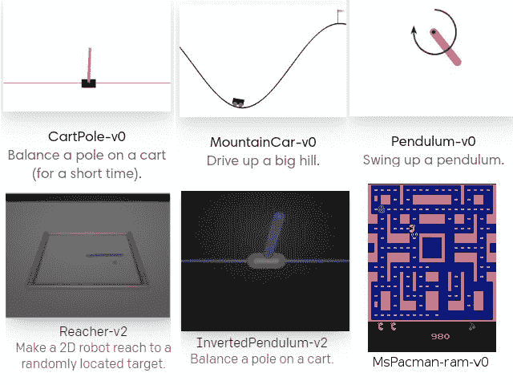
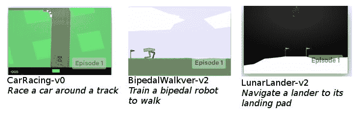
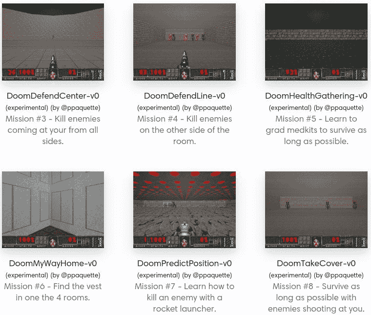
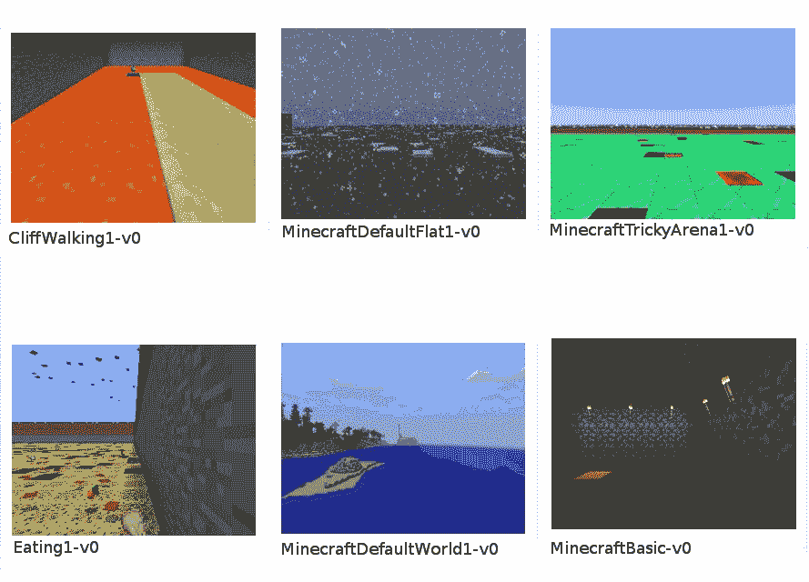
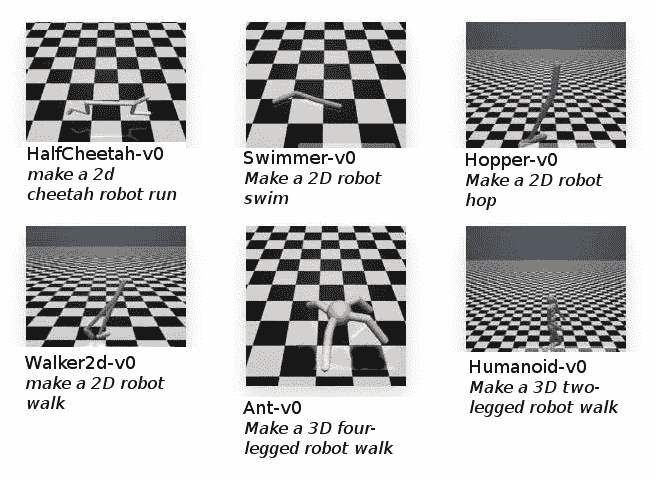
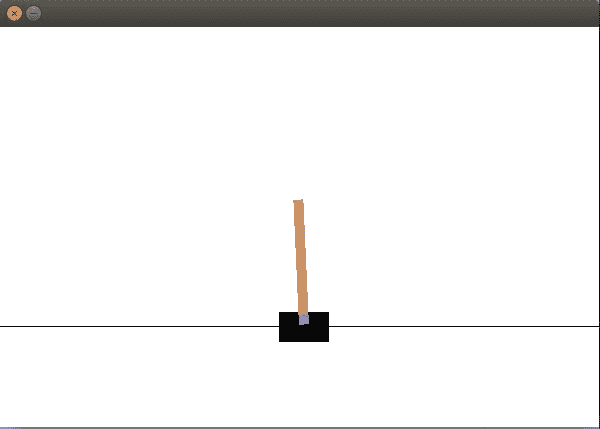

# 第一章：智能体与学习环境简介

欢迎！欢迎来到本书的第一章。本书将向你介绍令人兴奋的 OpenAI Gym 学习环境，并引导你踏上令人兴奋的旅程，帮助你掌握足够的技能，以训练基于人工智能智能体的先进系统。本书将通过从开发自动驾驶汽车到开发能够超越人类表现的 Atari 游戏代理等实用项目，帮助你获得强化学习和深度强化学习的实践经验。完成本书后，你将能够探索使用人工智能解决算法任务、玩游戏和修复控制问题的无限可能性。

本章将涵盖以下主题：

+   理解智能体与学习环境

+   了解 OpenAI Gym 的基本概念

+   各种任务/环境的类别，并简要描述每个类别适用于什么场景

+   理解 OpenAI Gym 的关键特性

+   了解使用 OpenAI Gym 工具包可以做什么

+   创建并可视化你的第一个 Gym 环境

让我们从了解智能体是什么开始我们的旅程。

# 什么是智能体？

人工智能的一个主要目标是构建智能体。感知环境、理解、推理、学习计划、做出决策并付诸实践是智能体的基本特征。我们将在第一章开始时，通过了解智能体是什么，从智能体的基本定义入手，逐步扩展到如何在此基础上增加智能。

*代理*是一个基于对其环境的观察（感知）采取行动的实体。人类和机器人是具有物理形态的代理的例子。

人类或动物是一个例子，作为代理通过使用其器官（眼睛、耳朵、鼻子、皮肤等）作为传感器来观察/感知环境，并通过其物理身体（手臂、手、腿、头等）来采取行动。机器人使用其传感器（摄像头、麦克风、LiDAR、雷达等）来观察/感知环境，并通过其物理机器人身体（机械臂、机械手/抓手、机械腿、扬声器等）来采取行动。

*软件代理*是能够通过与环境互动来做出决策并采取行动的计算机程序。软件代理可以通过物理形式表现出来，如机器人。*自主代理*是那些根据对环境观察的理解和推理，自动做出决策并采取行动的实体。

*智能体*是一个自主实体，能够根据与环境的互动进行学习和改进。智能体能够通过观察自我行为和表现进行分析。

在本书中，我们将开发智能代理来解决序列决策问题，这些问题可以通过在（松散的）马尔可夫环境中一系列（独立的）决策/行动来解决，在某些环境条件下，至少可以通过感知获取奖励信号作为反馈。

# 学习环境

学习环境是一个系统的重要组成部分，在该环境中，智能代理可以被训练来开发智能系统。学习环境定义了代理需要完成的问题或任务。

依赖于一系列决策或采取的行动而产生结果的问题或任务被称为序列决策问题。以下是一些学习环境的种类：

+   完全可观察与部分可观察

+   确定性与随机性

+   经验性与序列性

+   静态与动态

+   离散与连续

+   离散状态空间与连续状态空间

+   离散行动空间与连续行动空间

在本书中，我们将使用使用 OpenAI Gym Python 库实现的学习环境，因为它提供了一个简单且标准的接口和环境实现，同时还支持实现新的自定义环境。

在接下来的子章节中，我们将简要了解 OpenAI Gym 工具包。本节旨在帮助完全的新手熟悉 OpenAI Gym 工具包。我们假设读者没有任何先前的知识或经验。我们首先尝试了解 Gym 工具包，并浏览不同类别下可用的各种环境。接下来，我们将讨论 Gym 中可能引起你兴趣的特性，无论你关注的是哪个应用领域。然后，我们将简要讨论 Gym 工具包的价值主张以及如何利用它。在随后的章节中，我们将基于 Gym 工具包构建多个酷炫且智能的代理。因此，本章实际上是所有这些的基础。我们还将在本章末尾快速创建并可视化我们的第一个 OpenAI Gym 环境。兴奋吗？那我们就开始吧。

# 什么是 OpenAI Gym？

OpenAI Gym 是一个开源工具包，提供了多种任务集合，称为环境，并为开发和测试智能代理算法提供了统一的接口。该工具包引入了一个标准的**应用程序编程接口**（**API**），用于与为强化学习设计的环境进行交互。每个环境都有一个版本号，这确保了随着算法和环境本身的发展，能够进行有意义的比较并获得可复现的结果。

Gym 工具包通过其各种环境提供了一个强化学习的情境，在该情境中，智能体的经验被分解为一系列的回合。在每个回合中，智能体的初始状态是从一个分布中随机抽取的，智能体与环境的互动一直进行到环境达到终止状态。如果你不熟悉强化学习也没关系。在第二章中，我们将介绍强化学习和深度强化学习，*强化学习与深度强化学习*。

以下是 OpenAI Gym 库中可用的一些基本环境的截图：



OpenAI Gym 中可用的基本环境示例，并简要描述任务

在本书撰写时，OpenAI Gym 原生支持大约 797 个环境，分布在不同任务类别中。著名的 Atari 类别占有最大份额，约有 116 个环境（其中一半使用屏幕输入，另一半使用 RAM 输入）！该工具包支持的任务/环境类别如下所示：

+   算法

+   Atari

+   棋类游戏

+   Box2D

+   经典控制

+   Doom（非官方）

+   Minecraft（非官方）

+   MuJoCo

+   足球

+   玩具文本

+   机器人（新增加的）

接下来将介绍在不同类别下可用的各种类型的环境（或任务），并简要描述每个环境。请记住，运行这些类别下的环境可能需要你在系统上安装一些额外的工具和软件包。别担心！在接下来的章节中，我们将逐步讲解如何让每个环境运行起来，敬请期待！

现在我们将详细查看前面提到的各类内容，如下所示：

+   **算法环境**：这些环境提供需要智能体执行计算的任务，例如多位数相加、从输入序列中复制数据、反转序列等。

+   **Atari 环境**：这些环境提供了几个经典 Atari 游戏的接口。这些环境接口是 **街机学习环境**（**ALE**）的封装。它们提供游戏的屏幕图像或 RAM 作为输入，用于训练智能体。

+   **棋盘游戏**：这一类别包含了 9x9 和 19x19 围棋的环境。如果你一直在关注谷歌 DeepMind 最近在围棋领域的突破，那么这可能会非常有趣。DeepMind 开发了一个名为 AlphaGo 的智能体，使用强化学习和其他学习与规划技术，包括蒙特卡洛树搜索，击败了世界顶尖的围棋选手，包括范辉和李世石。DeepMind 还发布了 AlphaGo Zero 的研究成果，它从零开始进行训练，与原始的 AlphaGo 不同，后者是通过人类下的棋局来进行训练的。AlphaGo Zero 的表现超越了原始 AlphaGo。之后，AlphaZero 也被发布，它是一个自主系统，使用自我对弈（不需要任何人工监督的训练）学习下棋、围棋和将棋，并达到了比之前开发的系统更高的表现。

+   **Box2D**：这是一个开源的物理引擎，用于模拟二维刚体。Gym 工具包有一些使用 Box2D 模拟器开发的连续控制任务：



使用 Box2D 模拟器构建的环境示例列表

这些任务包括训练一个双足机器人行走、引导月球着陆器到达着陆平台，以及训练赛车在赛道上行驶。激动人心！在本书中，我们将使用强化学习训练一个 AI 代理，使其能够自主驾驶赛车绕赛道行驶！敬请期待。

+   **经典控制**：这一类别包含了许多已开发的任务，过去在强化学习文献中得到了广泛应用。这些任务为强化学习算法的一些早期开发和基准测试奠定了基础。例如，经典控制类别下的一个环境是 Mountain Car 环境，它最早由安德鲁·摩尔（CMU 计算机科学学院院长、Pittsburgh 创始人）在 1990 年他的博士论文中提出。这个环境至今仍然有时被作为强化学习算法的测试平台。你将在本章的最后几页创建你第一个来自该类别的 OpenAI Gym 环境！

+   **Doom**：这个类别为流行的第一人称射击游戏 Doom 提供了一个环境接口。它是一个非官方的、社区创建的 Gym 环境类别，基于 ViZDoom 构建，ViZDoom 是一个基于 Doom 的 AI 研究平台，提供了一个易于使用的 API，适合从原始视觉输入开发智能代理。它使得开发能够通过仅使用屏幕缓冲区来进行多个具有挑战性的 Doom 游戏回合的 AI 机器人成为可能！如果你玩过这个游戏，你就知道在某些回合中没有失去生命地前进是多么刺激和困难！虽然这款游戏的图像可能不如一些新的第一人称射击游戏那样炫酷，但放在一边，这仍然是一款很棒的游戏。近年来，机器学习，尤其是深度强化学习的多项研究，已经利用 ViZDoom 平台，开发出新的算法，来解决游戏中遇到的目标导向导航问题。你可以访问 ViZDoom 的研究网页（[`vizdoom.cs.put.edu.pl/research`](http://vizdoom.cs.put.edu.pl/research)），查看使用该平台的研究研究列表。以下截图列出了一些在 Gym 中可作为单独环境供你训练代理的任务：



Doom 环境中可用的任务或回合列表

+   **MineCraft**：这是另一个很棒的平台。游戏 AI 开发者可能对这个环境尤其感兴趣。MineCraft 是一个在爱好者中非常受欢迎的电子游戏。MineCraft Gym 环境是基于微软的 Malmo 项目构建的，Malmo 是一个基于 Minecraft 的人工智能实验和研究平台。以下截图展示了一些作为环境在 OpenAI Gym 中可用的任务。这些环境为开发解决方案，解决这个独特环境中呈现的挑战性新问题提供了灵感：



OpenAI Gym 中可用的 MineCraft 环境

+   **MuJoCo**：你对机器人技术感兴趣吗？你是否梦想开发能够让类人机器人走路、奔跑，或像波士顿动力的 Atlas 机器人一样做后空翻的算法？你可以做到！你将能够在本书中学习的强化学习方法，应用于 OpenAI Gym 的 MuJoCo 环境中，开发自己的算法，让 2D 机器人走路、奔跑、游泳或跳跃，甚至让 3D 多足机器人走路或奔跑！在以下截图中，你可以看到一些在 MuJoCo 环境中可用的酷炫、现实世界的机器人类环境：



+   **足球**：这是一个适用于训练可以协作的多个代理的环境。通过 Gym 工具包提供的足球环境具有连续的状态和动作空间。想知道这是什么意思吗？当我们在下一章讨论强化学习时，你会学到所有关于它的内容。现在，简单解释一下：连续的状态和动作空间意味着代理可以采取的动作和代理接收到的输入都是连续的值。这意味着它们可以取任意实数值，例如 *0* 和 *1* 之间的任意数值（如 *0.5*、*0.005* 等），而不是被限制在几个离散的值集合中，如 {1, 2, 3}。环境有三种类型。普通的足球环境初始化一个单一的对手，并在进球时给予 *+1* 的奖励，其他情况下奖励为 *0*。为了让代理进球，它需要学会识别球、接近球并将球踢向球门。听起来很简单，对吧？但对于计算机来说，要自己弄明白这一点是非常困难的，尤其是当你只告诉它进球时奖励 *+1*，其他情况下奖励 *0*。它没有其他线索！你可以开发出能够通过自学足球并学会进球的代理，使用本书中介绍的方法。

+   **玩具文本**：OpenAI Gym 在此类别下还提供一些简单的基于文本的环境。这些包括一些经典问题，例如 Frozen Lake，其中的目标是找到一条安全的路径穿越冰雪和水域的方格。它被归类为玩具文本，因为它使用了更简单的环境表示方式——主要通过文本。

有了这些，你就能对作为 OpenAI Gym 工具包一部分的所有不同类别和类型的环境有一个非常好的概览。值得注意的是，OpenAI Gym 工具包的发布伴随着一个 OpenAI Gym 网站（[gym.openai.com](http://gym.openai.com)），该网站维护了每个提交用于评估的算法的排行榜。它展示了用户提交算法的性能，并且一些提交还附有详细的解释和源代码。不幸的是，OpenAI 决定停止对评估网站的支持，该服务于 2017 年 9 月下线。

现在你已经对 OpenAI Gym 中可用的各种环境类别和每个类别为你提供的内容有了清晰的了解。接下来，我们将看一下 OpenAI Gym 的关键特性，这些特性使其成为今天许多智能代理开发进展中不可或缺的组成部分，特别是那些使用强化学习或深度强化学习的进展。

# 理解 OpenAI Gym 的特点

在本节中，我们将重点介绍 OpenAI Gym 工具包在强化学习社区中非常受欢迎的关键特性，并且导致它被广泛采用。

# 简单的环境接口

OpenAI Gym 提供了一个简单且通用的 Python 环境接口。具体来说，它以动作作为输入，并在每一步基于动作提供观察、奖励、是否完成以及一个可选的`info`对象作为输出。如果这对你来说还不是很明显，别担心。我们会以更详细的方式再次讲解接口，帮助你理解。这段话只是为了概述接口，让你明白它有多简单。这为用户提供了极大的灵活性，因为他们可以根据喜欢的任何范式设计和开发他们的代理算法，而不受限于使用任何特定的范式。

# 可比性和可复现性

我们直觉地感觉应该能够比较一个任务中代理或算法的表现与同一任务中另一个代理或算法的表现。例如，如果一个代理在太空侵略者的 Atari 游戏中平均得分为*1,000*，我们应该能够说这个代理比同样训练时间下平均得分为*5000*的代理表现更差。但是，如果游戏的评分系统略有变化会怎么样呢？或者如果环境接口被修改以包含关于游戏状态的额外信息，从而为第二个代理提供优势呢？这将使得分对比不公平，对吧？

为了处理环境的这些变化，OpenAI Gym 对环境使用严格的版本控制。该工具包保证如果环境发生任何变化，都会伴随着一个不同的版本号。因此，如果原始的 Atari 太空侵略者游戏环境的名称是`SpaceInvaders-v0`，并且对环境进行了一些修改以提供更多关于游戏状态的信息，那么环境的名称将更改为`SpaceInvaders-v1`。这种简单的版本控制系统确保我们始终在相同的环境设置上比较性能。这样，得到的结果是可比较和可复现的。

# 监控进展能力

Gym 工具包提供的所有环境都配备了监视器。该监视器记录模拟的每一个时间步骤和环境的每一次重置。这意味着环境会自动跟踪我们的代理在每一步中是如何学习和适应的。你甚至可以配置监视器，在代理学习玩游戏时自动记录视频。多么酷！

# OpenAI Gym 工具包能做什么呢？

Gym 工具包提供了一种标准化的方式来定义为可以使用强化学习解决的问题开发的环境接口。如果你熟悉或听说过**ImageNet 大规模视觉识别挑战**（**ILSVRC**），你可能意识到标准化基准平台对加速研究和开发的影响有多大。对于那些对 ILSVRC 不熟悉的人，这里是一个简要总结：这是一个竞赛，参与团队评估他们为给定数据集开发的监督学习算法，并竞争在几个视觉识别任务中取得更高的准确性。这个共同平台，再加上由 AlexNet 推广的基于深度神经网络的算法的成功（[`papers.nips.cc/paper/4824-imagenet-classification-with-deep-convolutional-neural-networks.pdf`](https://papers.nips.cc/paper/4824-imagenet-classification-with-deep-convolutional-neural-networks.pdf)），为我们目前所处的深度学习时代铺平了道路。

类似地，Gym 工具包提供了一个共同平台来对强化学习算法进行基准测试，并鼓励研究人员和工程师开发能在多个具有挑战性的任务中获得更高奖励的算法。简而言之，Gym 工具包对强化学习而言就像 ILSVRC 对监督学习一样重要。

# 创建您的第一个 OpenAI Gym 环境

我们将详细介绍设置 OpenAI Gym 依赖项和其他训练强化学习代理所需工具的步骤，详见第三章，*开始使用 OpenAI Gym 和深度强化学习*。本节提供了在 Linux 和 macOS 上使用`virtualenv`快速开始使用 OpenAI Gym Python API 的方法，以便您可以快速了解 Gym 的功能！

MacOS 和 Ubuntu Linux 系统默认安装了 Python。您可以通过在终端窗口中运行`python --version`来检查安装的 Python 版本。如果返回`python`后跟一个版本号，则可以继续进行下一步！如果出现 Python 命令未找到的错误，则需要安装 Python。请参阅本书的第三章，*开始使用 OpenAI Gym 和深度强化学习*中的详细安装部分：

1.  安装`virtualenv`：

```py
$pip install virtualenv
```

如果您的系统未安装**pip**，您可以通过输入`sudo easy_install pip`来安装它。

1.  使用 virtualenv 工具创建名为`openai-gym`的虚拟环境：

```py
 $virtualenv openai-gym
```

1.  激活`openai-gym`虚拟环境：

```py
$source openai-gym/bin/activate
```

1.  从上游安装 Gym 工具包的所有软件包：

```py
$pip install -U gym
```

如果在运行 `pip install` 命令时遇到权限被拒绝或错误代码为 1 的失败，通常是因为你尝试安装包的目录（在本例中是 `virtualenv` 中的 `openai-gym` 目录）需要特殊的/root 权限。你可以通过运行 `sudo -H pip install -U gym[all]` 来解决这个问题，或者通过运行 `sudo chmod -R o+rw ~/openai-gym` 更改 `openai-gym` 目录的权限。

1.  测试以确保安装成功：

```py
$python -c 'import gym; gym.make("CartPole-v0");'
```

# 创建和可视化一个新的 Gym 环境

只需一分钟或两分钟，你就创建了一个 OpenAI Gym 环境实例，准备开始使用！

让我们打开一个新的 Python 提示符并导入 `gym` 模块：

```py
>>import gym
```

一旦导入了 `gym` 模块，我们可以使用 `gym.make` 方法像这样创建我们的新环境：

```py
>>env = gym.make('CartPole-v0')
>>env.reset()
env.render()
```

这将弹出一个类似这样的窗口：



太棒了！

# 总结

恭喜你完成了第一章！希望你在创建自己的环境时感到有趣。在这一章中，你了解了 OpenAI Gym 的基本概念、它提供的功能，以及你可以用这个工具包做什么。现在，你对 OpenAI Gym 有了很好的了解。在下一章，我们将介绍强化学习的基础知识，为你打下坚实的基础，帮助你在书中不断进步，构建你酷炫的智能代理。兴奋吗？快进入下一章吧！
