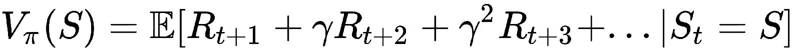
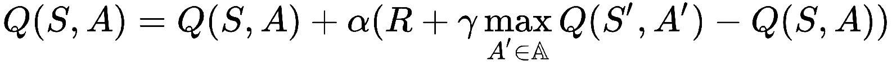

# 第二章：强化学习与深度强化学习

本章简要解释了强化学习中的基本术语和概念，帮助你更好地理解用于开发人工智能智能体的基本强化学习框架。本章还将介绍深度强化学习，并为你展示算法能够解决的高级问题类型。你会在本章中看到不少数学表达式和公式。尽管强化学习和深度强化学习背后有足够的理论可以填满整本书，但本章讨论的是对实际应用有帮助的关键概念，因此当我们在 Python 中实现算法以训练我们的智能体时，你可以清晰地理解其背后的逻辑。如果你第一次阅读时没有完全掌握，完全没有问题。你可以随时返回本章，进行复习，直到你更好地理解为止。

本章将涵盖以下主题：

+   什么是强化学习？

+   马尔科夫决策过程

+   强化学习框架

+   什么是深度强化学习？

+   深度强化学习智能体在实践中是如何工作的？

# 什么是强化学习？

如果你是 **人工智能** (**AI**) 或机器学习领域的新手，可能会想知道强化学习到底是什么。简单来说，它是通过强化来学习。*强化*，如你从普通英语或心理学中所知，是在对某个行为的反应中增加或加强某个选择的行为，因为通过采取该行为可以获得更高的回报。我们人类从小就擅长通过强化来学习。那些有孩子的父母，可能会更频繁地利用这一点来教导他们良好的习惯。不过，我们每个人都能与此产生共鸣，因为就在不久之前，我们每个人都经历过这个阶段！比如，父母每天奖励孩子巧克力，如果孩子按时完成作业。孩子*学会*了只要按时完成作业，就能得到巧克力（*奖励*）。因此，这增强了他们每天完成作业的决心，以获得巧克力。这个通过奖励强化某个特定行为选择的学习过程，就是通过强化学习或强化学习进行的学习。

你可能会想，"*哦，是的。人类心理学听起来对我很熟悉。那么，这与机器学习或人工智能有什么关系呢？*" 好问题。强化学习的概念实际上是受行为心理学的启发。它位于多个研究领域的交汇处，最重要的包括计算机科学、数学、神经科学和心理学，正如下图所示：

正如我们很快就会意识到的那样，强化学习是机器学习中最有前景的方法之一，指向人工智能的未来。如果这些术语对你来说很陌生，别担心！从下一段开始，我们将一一讲解这些术语，并理解它们之间的关系，让你轻松理解。如果你已经了解这些术语，那将是一次耳目一新的阅读，从不同的视角来看待这些概念。

# 直观地理解人工智能的含义及其内涵

人类和动物所展示的智能被称为*自然智能*，而机器所展示的智能被称为人工智能（AI），原因显而易见。我们人类开发了为机器提供智能的算法和技术。迄今为止，在这一领域的伟大进展主要体现在机器学习、人工神经网络和深度学习等领域。这些领域共同推动了人工智能的发展。目前已经发展出了三种主要的机器学习范式，并且已经达到了一定的成熟度，它们分别是：

+   有监督学习

+   无监督学习

+   强化学习

在下图中，你可以直观地了解人工智能的领域。你会看到，这些学习范式是机器学习领域的子集，而机器学习本身是人工智能的一个子集/分支：

# 有监督学习

监督学习类似于我们教孩子通过名字识别某人或某物的方式。我们提供一个输入和与该输入相关的名字/类别标签（简称*标签*），并期望机器学习这种输入到标签的映射。如果我们只希望机器学习几个对象（如在物体识别类任务中）或几个人（如在面部/语音/人物识别任务中）的输入到标签的映射，这听起来可能很简单。但如果我们希望机器学习几千个类别，而每个类别可能在输入中有多个不同的变化呢？例如，如果任务是通过图像输入识别一个人的面部，而且需要从其他一千个包含面部的输入图像中区分出来，这个任务即使对于成年人来说也可能非常复杂。相同一个人的面部输入图像可能存在多种变化。某个输入图像中的人可能戴着眼镜，另一个图像中可能戴着帽子，或者表现出完全不同的面部表情。对于机器来说，能够看懂输入图像、识别面部并将其辨认出来是一个更具挑战性的任务。随着深度学习领域的最新进展，像这样的监督分类任务对机器来说不再困难。机器可以以前所未有的准确度识别面部，以及许多其他事物。例如，由 Facebook AI 研究实验室开发的 DeepFace 系统（[`research.fb.com/wp-content/uploads/2016/11/deepface-closing-the-gap-to-human-level-performance-in-face-verification.pdf`](https://research.fb.com/wp-content/uploads/2016/11/deepface-closing-the-gap-to-human-level-performance-in-face-verification.pdf)）在 Labelled Faces in the Wild 数据集上的面部识别准确度达到了 97.45%。

# 无监督学习

无监督学习是一种学习形式，与监督学习范式不同，它在输入数据的同时不会为学习算法提供标签。这类学习算法通常用于发现输入数据中的模式，并将相似的数据聚类在一起。深度学习领域的最新进展引入了一种新型学习方法，称为生成对抗网络（Generative Adversarial Networks），在本书写作期间，这一方法获得了巨大的关注。如果你感兴趣，可以通过这个视频进一步了解生成对抗网络：[`www.packtpub.com/big-data-and-business-intelligence/learning-generative-adversarial-networks-video`](https://www.packtpub.com/big-data-and-business-intelligence/learning-generative-adversarial-networks-video)。

# 强化学习

强化学习是一种混合型的学习方式，相较于监督学习和无监督学习。正如我们在本节开始时所了解到的，强化学习是由奖励信号驱动的。在“*做作业的孩子*”问题中，奖励信号来自父母给的巧克力。在机器学习的世界中，巧克力可能并不吸引计算机（好吧，我们可以编程让计算机想要巧克力，但为什么要这么做呢？难道孩子们还不够吗？），但是一个简单的标量值（一个数字）就能解决问题！奖励信号仍然是以某种方式由人类指定的，表示任务的预期目标。例如，为了训练智能体使用强化学习来玩雅达利游戏，游戏得分可以作为奖励信号。这使得强化学习变得更简单（对于人类而非机器！），因为我们不需要在游戏的每一时刻标记按下哪个按钮来教机器如何玩游戏。相反，我们只是让机器自主学习如何最大化得分。难道这不令人着迷吗？我们能够让机器自己找出如何玩游戏、如何驾驶汽车，或如何做作业，只要我们给出分数来评估它的表现？这就是我们在本章学习这一内容的原因。在接下来的章节中，你将亲自开发一些这样的酷炫机器。

# 实践中的强化学习

现在你已经对人工智能的真正含义以及推动其发展的各种算法类别有了直观的理解，我们将专注于构建强化学习机器的实际方面。

以下是你在开发强化学习系统时需要了解的核心概念：

+   智能体

+   奖励

+   环境

+   状态

+   价值函数

+   策略

# 智能体

在强化学习的世界里，机器是由（软件）智能体来运行或指导的。智能体是机器中具备智能并决定接下来做什么的部分。当我们深入了解强化学习时，你会多次遇到“智能体”这个术语。强化学习基于奖励假设，该假设指出任何目标都可以通过最大化期望的累计奖励来描述。那么，究竟什么是这个奖励呢？接下来我们将讨论这个问题。

# 奖励

奖励，通常表示为 ，通常是一个标量量，它作为反馈提供给智能体，以驱动其学习。智能体的目标是最大化奖励的总和，而该信号表示智能体在时间步  时的表现。以下是不同任务的奖励信号示例，可能帮助你更直观地理解这一概念：

+   对于我们之前讨论的雅达利游戏，或者一般的计算机游戏，每当分数增加时，奖励信号可以是`+1`，而每当分数减少时，奖励信号则是`-1`。

+   对于股票交易，奖励信号可以是每赚取一美元就奖励`+1`，每亏损一美元就惩罚`-1`。

+   对于模拟驾驶汽车，奖励信号可以是每行驶一英里奖励`+1`，每发生一次碰撞则惩罚`-100`。

+   有时，奖励信号可能是稀疏的。例如，在一场国际象棋或围棋比赛中，如果代理赢得比赛，奖励信号可能是`+1`，如果代理输了比赛，则奖励信号为`-1`。奖励是稀疏的，因为代理只有在完成一整局游戏后才能收到奖励信号，而在此过程中，它无法知道每一步棋的好坏。

# 环境

在第一章中，我们探讨了 OpenAI Gym 工具包提供的不同环境。你可能会疑惑，为什么它们被称为“环境”而不是“问题”、 “任务”或其他什么东西。现在你已经进展到了这一章，是否在脑海中响起了某种提示？

环境是代表我们感兴趣的任务或问题的平台，代理在其中与环境进行互动。下图展示了最高抽象层次下的强化学习范式：

在每个时间步（）中，代理从环境中接收到一个观察（），然后执行一个动作（），并从环境中获得一个标量奖励（），同时还会获得下一个观察（）。这个过程会不断重复，直到达到终止状态。什么是观察，什么是状态？接下来我们来深入探讨一下。

# 状态

随着代理与环境的互动，这一过程会产生一系列的观察（）、动作（）和奖励（），正如之前所描述的那样。在某一时间步（），代理到目前为止知道的是它在时间步（）之前观察到的一系列（）、（）和（）。直观地看，这可以被称为历史：

在时间步（）时，接下来发生的事情取决于历史。正式来说，用来决定接下来发生什么的信息被称为*状态*。***因为它依赖于直到该时间步为止的历史，所以可以表示如下：

,

在这里，表示某个函数。

在我们继续之前，有一个细节非常重要，你需要理解。我们再来看看强化学习系统的一般表示形式：

现在，你会注意到系统中的两个主要实体——智能体和环境——各自都有自己的状态表示。*环境状态*，有时用  表示，是环境自身的（私有）表示，环境用它来选择下一个观察结果和奖励。这个状态通常对智能体不可见/不可用。同样，智能体也有自己对状态的内部表示，有时用  表示，这是智能体用来基于其动作的内部信息。因为这个表示是智能体内部的，所以由智能体决定使用任何函数来表示它。通常，它是基于智能体迄今为止观察到的历史的某种函数。顺便提一下，*马尔可夫状态*是使用来自历史的所有有用信息来表示状态的方式。根据定义，使用马尔可夫性质，状态  是马尔可夫状态或马尔可夫过程，当且仅当 ，这意味着*给定当前状态，未来与过去无关*。换句话说，这样的状态是未来的充分统计量。一旦状态已知，历史信息可以被丢弃。通常，环境状态  和历史  满足马尔可夫性质。

在某些情况下，环境可能会直接向智能体展示其内部的环境状态。这种环境称为*完全可观察环境*。在智能体无法直接观察环境状态的情况下，智能体必须根据自己所观察到的信息构建自己的状态表示。这种环境称为*部分可观察环境*。例如，一个玩扑克的智能体只能观察到公共牌，而无法知道其他玩家手中的牌。因此，它是一个部分可观察环境。同样，只有摄像头的自动驾驶汽车无法知道其在环境中的绝对位置，这使得该环境仅为部分可观察。

在接下来的章节中，我们将学习智能体的一些关键组成部分。

# 模型

模型是智能体对环境的表示。它类似于我们对周围人和事物的心理模型。智能体利用其对环境的模型来预测接下来会发生什么。它有两个关键部分：

+   ：状态转移模型/概率

+   ：奖励模型

状态转移模型  是一个概率分布或函数，用来预测在下一个时间步骤  中，给定状态  和动作  在时间步骤  后进入状态  的概率。数学表达式如下：

智能体使用奖励模型  来预测如果它在时间步  处于状态  并采取行动 ，它将获得的即时奖励 。这种对下一个时间步奖励的期望可以通过以下数学公式表示：

# 值函数

值函数表示智能体对未来奖励的预测。值函数有两种类型：状态值函数和动作值函数。

# 状态值函数

状态值函数是一个表示智能体在时间步 *t* 处于状态  时的估计值的函数。它用  表示，通常简称为 *值函数*。它表示智能体对未来奖励的预测，即如果它最终在时间步 *t* 处于状态 ，将会获得的奖励。数学上，它可以表示为：

这个表达式的意思是，策略  下状态  的值是未来奖励的折扣总和的期望，其中  是折扣因子，是一个位于 [0,1] 范围内的实数。在实际中，折扣因子通常设置在 [0.95,0.99] 的范围内。另一个新术语是 ，它是智能体的策略。

# 动作值函数

动作值函数是一个表示智能体在状态  下采取动作  的估计值的函数。它用  表示。它与状态值函数通过以下方程式相关：

# 策略

策略用  表示，规定了给定状态下应该采取的动作。它可以看作是一个将状态映射到动作的函数。策略主要有两种类型：确定性策略和随机策略。

一个确定性策略为给定状态规定一个动作，也就是说，给定状态 *s* 只有一个动作 。数学上，它表示为 。

一个随机策略在给定状态  和时间步  时，规定了一种动作分布，即每个动作都有一个概率值。数学上，它表示为 。

遵循不同策略的智能体可能在相同环境下表现出不同的行为。

# 马尔可夫决策过程

**马尔可夫决策过程**（**MDP**）为强化学习提供了一个正式框架。它用于描述一个完全可观察的环境，其中结果部分是随机的，部分依赖于智能体或决策者所采取的行动。以下图示展示了一个马尔可夫过程如何通过马尔可夫奖励过程演变为马尔可夫决策过程：

这些阶段可以描述如下：

+   **马尔可夫过程**（或 *马尔可夫链*）是一个随机状态序列 s1, s2,...，它遵循 *马尔可夫性质*。简单来说，它是一个没有关于历史的记忆的随机过程。

+   **马尔可夫奖励过程**（**MRP**）是一个 *马尔可夫过程*（也叫 *马尔可夫链*）带有值。

+   **马尔可夫决策过程** 是一个 *马尔可夫奖励过程*，并且带有决策。

# 使用动态规划进行规划

动态规划是一种非常通用的方法，用于高效地解决可以分解为重叠子问题的问题。如果你在代码中使用过任何类型的递归函数，你可能已经有了一些动态规划的初步体验。简单来说，动态规划尝试缓存或存储子问题的结果，以便在需要时可以重复使用，而不是重新计算结果。

好吧，你可能会问，这与这里有什么关系呢？嗯，它们对于解决一个完全定义的 MDP 非常有用，这意味着如果代理完全了解 MDP，它可以使用动态规划找到在环境中采取最优行动的方式，从而获得最高奖励！在下表中，你会看到一个简明的总结，列出了在我们关注顺序预测或控制时的输入和输出：

| 任务/目标 | 输入 | 输出 |
| --- | --- | --- |
| 预测 | MDP 或 MRP 和策略  | 值函数  |
| 控制 | MDP | 最优值函数  和最优策略  |

# 蒙特卡洛学习和时序差分学习

此时，我们明白了学习状态值函数  对于代理来说非常有用，它可以告知代理处于状态  时的长期价值，从而帮助代理决定是否这个状态是值得处于的。**蒙特卡洛**（**MC**）和 **时序差分**（**TD**）学习方法使得代理能够学到这一点！

MC 和 TD 学习的目标是从代理的经验中学习值函数，代理遵循其策略 。

下表总结了 MC 和 TD 学习方法的值估计更新公式：

| **学习方法** | **状态值函数** |
| --- | --- |
| 蒙特卡洛 |  |
| 时序差分 |  |

MC 学习方法将值更新到 **实际回报** ，这是从时间步 *t* 开始的总折现奖励。这意味着  直到结束。需要注意的是，我们只能在序列结束后计算该值，而时序差分学习（严格来说是 TD(0)）会根据  给出的 *估计回报* 更新值，这个值可以在每一步后计算。

# SARSA 和 Q-learning

对于代理来说，学习行动价值函数也非常有用！，该函数告知代理在状态！下采取行动！的长期价值，从而帮助代理采取那些能够最大化其预期折扣未来奖励的行动。SARSA 和 Q 学习算法使得代理能够学习到这一点！下表总结了 SARSA 算法和 Q 学习算法的更新公式：

| **学习方法** | **行动价值函数** |
| --- | --- |
| SARSA |  |
| Q 学习 |  |

SARSA 之所以得名，是因为算法的更新步骤依赖于序列 State->Action->Reward->State'->Action'。该序列的描述如下：代理在状态*S*下采取行动 A 并获得奖励 R，最终进入下一个状态 S'，然后代理决定在新状态下采取行动 A'。基于这一经验，代理可以更新其对 Q(S,A)的估计。

Q 学习是一个流行的离策略学习算法，它与 SARSA 相似，除了一个区别：它并不是使用新状态下代理所采取行动的 Q 值估计，而是使用一个对应于从该新状态 S'出发能够获得的*最大*Q 值的行动的 Q 值估计。

# 深度强化学习

在你对强化学习有了基本理解后，你现在应该处于一个更好的状态（希望你不是处于一个严格的马尔可夫状态，忘记了之前学过的历史/知识），以便理解这套近年来在人工智能领域引起轰动的新算法的基础知识。

深度强化学习自然地出现在人们在深度学习领域取得进展并将其应用于强化学习时。我们学习了状态值函数、动作值函数和策略。让我们简要看看它们是如何在数学上表示或者通过计算机代码实现的。状态值函数  是一个实值函数，它将当前状态  作为输入，并输出一个实值数字（例如 4.57）。这个数字是智能体预测在状态  中所处的情况有多好，智能体会根据它获得的新经验不断更新该值函数。同样，动作值函数  也是一个实值函数，它除了状态  之外，还将动作  作为输入，输出一个实数。表示这些函数的一种方式是使用神经网络，因为神经网络是通用的函数逼近器，能够表示复杂的非线性函数。对于一个试图通过仅仅查看屏幕上的图像（就像我们做的那样）来玩 Atari 游戏的智能体，状态  可能是屏幕上图像的像素值。在这种情况下，我们可以使用带有卷积层的深度神经网络从状态/图像中提取视觉特征，然后通过几个全连接层来最终输出  或者 ，具体取决于我们想要逼近哪个函数。

回忆本章早些时候提到的，  是状态值函数，它提供了处于状态  时的价值估计，而  是动作值函数，它提供了在给定状态下每个动作的价值估计。

如果我们这样做，那么我们就在进行深度强化学习！够简单理解吧？希望如此。让我们看看还有哪些方式可以将深度学习应用于强化学习。

请回想，在确定性策略的情况下，策略表示为，在随机策略的情况下，策略表示为，其中动作可以是离散的（例如“向左移动”，“向右移动”或“直行”）或连续的值（例如“0.05”表示加速，“0.67”表示转向，等等），并且这些值可以是单维的或多维的。因此，策略有时可能是一个复杂的函数！它可能需要接受多维状态（例如图像）作为输入，并输出一个多维的概率向量作为输出（在随机策略的情况下）。那么，这看起来像是一个巨大的函数，不是吗？是的，确实如此。正是在这里，深度神经网络派上了用场！我们可以通过深度神经网络来逼近智能体的策略，并直接学习如何更新策略（通过更新深度神经网络的参数）。这被称为基于策略优化的深度强化学习，并且已被证明在解决一些具有挑战性的控制问题时非常高效，尤其是在机器人学领域。

总结来说，深度强化学习是将深度学习应用于强化学习，迄今为止，研究人员已经成功地通过两种方式将深度学习应用于强化学习。一种方式是使用深度神经网络来逼近价值函数，另一种方式是使用深度神经网络来表示策略。

这些想法从早期就已被人们知晓，当时研究人员试图使用神经网络作为价值函数的逼近器，甚至早在 2005 年。但直到最近，这些想法才崭露头角，因为尽管神经网络或其他非线性价值函数逼近器能更好地表示环境状态和动作的复杂值，它们却容易导致不稳定性，并且常常会导致次优函数。直到最近，像 Volodymyr Mnih 和他在 DeepMind（现为 Google 的一部分）的同事们才找到了稳定学习的窍门，并用深度非线性函数逼近器训练智能体，使得其收敛到近优的价值函数。在本书的后续章节中，我们实际上将重现他们当时开创性的成果，这些成果甚至超越了人类在 Atari 游戏中的表现！

# 强化学习和深度强化学习算法的实际应用

直到最近，由于样本复杂性和不稳定性，强化学习和深度强化学习的实际应用一直受到限制。但这些算法在解决一些真正困难的实际问题上，已被证明非常强大。以下列出了一些应用实例，帮助你了解这些算法：

+   **学习比人类更好地玩视频游戏：** 这一消息可能已经传到你耳中了。DeepMind 和其他研究人员开发了一系列算法，从 DeepMind 的深度 Q 网络（简称 DQN）开始，该算法在玩 Atari 游戏时达到了人类水平的表现。我们将在本书的后续章节中实现这一算法！本质上，它是 Q-learning 算法的一个深度变种，我们在本章中简要提到过，经过一些修改，使学习速度更快，稳定性更强。它能够在进行几局游戏后达到人类水平的游戏得分。更令人印象深刻的是，同一个算法在没有进行任何特定游戏的微调或修改的情况下，达到了这一水平的表现！

+   **掌握围棋游戏：** 围棋是一种中国游戏，几十年来一直是人工智能的挑战。围棋在 19 x 19 的完整棋盘上进行，比国际象棋更为复杂，因为可能的棋盘位置数量庞大（见图）。直到最近，尚没有任何人工智能算法或软件能够在这一游戏中接近人类的水平。AlphaGo—DeepMind 开发的使用深度强化学习和蒙特卡洛树搜索的 AI 代理—改变了这一切，战胜了人类世界冠军李世石（4-1）和范晖（5-0）。DeepMind 发布了更先进版本的 AI 代理，命名为 AlphaGo Zero（该版本不依赖任何人类知识，完全自学会下围棋！）和 AlphaZero（能够玩围棋、国际象棋和将棋！），它们都以深度强化学习为核心算法。

+   **帮助人工智能赢得《Jeopardy!》游戏：** IBM 的 Watson—由 IBM 开发的人工智能系统，以战胜人类选手而成名—利用 TD 学习的扩展，制定了*每日双倍下注*策略，帮助其战胜了人类冠军。

+   **机器人运动和操作：** 强化学习和深度强化学习都使得控制复杂的机器人成为可能，涵盖了运动和导航功能。来自 UC 伯克利大学的几项最新研究展示了如何通过深度强化学习训练策略，提供机器人操作任务的视觉与控制，并生成关节驱动，使复杂的双足人形机器人能够行走和奔跑。

# 摘要

在本章中，我们讨论了智能体如何通过根据从环境中获得的观察信息采取行动与环境互动，环境则通过（可选的）奖励和下一个观察来响应智能体的行动。

在简要了解强化学习的基础知识后，我们深入探讨了深度强化学习的概念，并揭示了我们可以使用深度神经网络来表示价值函数和策略的事实。尽管这一章在符号和定义上稍显繁琐，但希望它为我们在接下来的章节中开发一些有趣的智能体奠定了坚实的基础。在下一章中，我们将巩固前两章的学习，并通过为训练一个智能体来解决一些有趣的问题打下基础。
