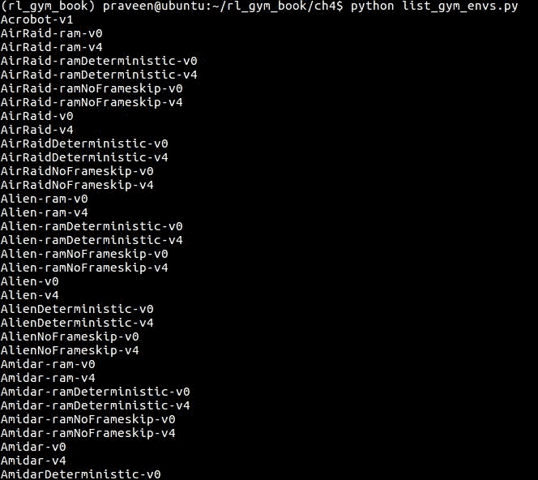

# 第四章：探索 Gym 及其功能

现在你已经有了一个工作环境，我们将开始探索 Gym 工具包提供的各种功能和选项。本章将带你了解一些常用的环境、它们解决的任务以及你的智能体需要做什么才能掌握这些任务。

在本章中，我们将探索以下主题：

+   探索各种类型的 Gym 环境

+   理解强化学习循环的结构

+   理解不同的观察空间和动作空间

# 探索环境列表和命名法

让我们从选择一个环境并理解 Gym 接口开始。你可能已经熟悉从前几章中创建 Gym 环境的基本函数调用，我们曾用这些函数测试过安装情况。在这里，我们将正式通过这些函数。

让我们激活`rl_gym_book`的 conda 环境，并打开 Python 提示符。第一步是使用以下代码导入 Gym Python 模块：

```py
import gym
```

现在我们可以使用`gym.make`方法从可用的环境列表中创建一个环境。你可能会问，如何查找系统中可用的 Gym 环境列表。我们将创建一个小的实用脚本来生成环境列表，方便你在需要时参考。让我们在`~/rl_gym_book/ch4`目录下创建一个名为`list_gym_envs.py`的脚本，内容如下：

```py
#!/usr/bin/env python
from gym import envs
env_names = [spec.id for spec in envs.registry.all()]
for name in sorted(env_names):
 print(name)
```

该脚本将按字母顺序打印通过 Gym 安装可用的所有环境的名称。你可以使用以下命令运行此脚本，以查看系统中已安装并可用的环境名称：

```py
(rl_gym_book) praveen@ubntu:~/rl_gym_book/ch4$python list_gym_envs.py
```

你将得到如下输出。注意，只有前几个环境名称会显示出来，它们可能会有所不同，具体取决于你系统上安装的环境，这些环境是根据我们在第三章中讨论的内容，*开始使用 OpenAI Gym 和深度强化学习*所安装的：



从环境名称列表中，你可能会注意到有一些相似的名称，带有一些变化。例如，Alien 环境有八个不同的变种。让我们在开始使用它之前，先理解命名法。

# 命名法

环境名称中包含*ram*这个词，意味着环境返回的观察值是游戏设计运行的 Atari 主机的**随机存取内存**（**RAM**）的内容。

环境名称中包含*deterministic*这个词，意味着智能体发送给环境的动作会在一个*确定性的/固定的*四帧时长内重复执行，然后返回结果状态。

包含单词 *NoFrameskip* 表示智能体发送到环境中的动作会执行一次，结果状态立即返回，中间不跳过任何帧。

默认情况下，如果环境名称中没有包含 *deterministic* 和 *NoFrameskip*，则发送到环境中的动作会重复执行 *n* 帧的持续时间，其中 *n* 从 {2,3,4} 中均匀采样。

环境名称中的字母 *v* 后跟一个数字，表示环境的版本。这是为了确保环境实现的任何变化都体现在其名称中，从而使得在不同算法/智能体下得到的结果具有可比性，不会出现任何差异。

让我们通过观察 Atari Alien 环境来理解这种命名法。以下列出了可用的各种选项及其描述：

| **版本名称** | **描述** |
| --- | --- |
| `Alien-ram-v0` | 观察是 Atari 机器的 RAM 内容，总大小为 128 字节，发送到环境中的动作会重复执行 *n* 帧的持续时间，其中 *n* 从 {2,3,4} 中均匀采样。 |
| `Alien-ram-v4` | 观察是 Atari 机器的 RAM 内容，总大小为 128 字节，发送到环境中的动作会重复执行 *n* 帧的持续时间，其中 *n* 从 {2,3,4} 中均匀采样。与 v0 版本相比，环境有所修改。 |
| `Alien-ramDeterministic-v0` | 观察是 Atari 机器的 RAM 内容，总大小为 128 字节，发送到环境中的动作会重复执行四帧的持续时间。 |
| `Alien-ramDeterministic-v4` | 观察是 Atari 机器的 RAM 内容，总大小为 128 字节，发送到环境中的动作会重复执行四帧的持续时间。与 v0 版本相比，环境有所修改。 |
| `Alien-ramNoFrameskip-v0` | 观察是 Atari 机器的 RAM 内容，总大小为 128 字节，发送到环境中的动作会应用，并且结果状态立即返回，不跳过任何帧。 |
| `Alien-v0` | 观察是屏幕的 RGB 图像，表示为形状为 (210, 160, 3) 的数组，发送到环境中的动作会重复执行 *n* 帧的持续时间，其中 *n* 从 {2,3,4} 中均匀采样。 |
| `Alien-v4` | 观察是屏幕的 RGB 图像，表示为形状为 (210, 160, 3) 的数组，发送到环境中的动作会重复执行 *n* 帧的持续时间，其中 *n* 从 {2,3,4} 中均匀采样。与 v0 版本相比，环境有所修改。 |
| `AlienDeterministic-v0` | 观察是一个 RGB 图像，表示为形状为(210, 160, 3)的数组，发送到环境的动作会反复执行，持续四帧。 |
| `AlienDeterministic-v4` | 观察是一个 RGB 图像，表示为形状为(210, 160, 3)的数组，发送到环境的动作会反复执行，持续四帧。与 v0 版本相比，环境有所修改。 |
| `AlienNoFrameskip-v0` | 观察是一个 RGB 图像，表示为形状为(210, 160, 3)的数组，发送到环境的动作会立即应用，且不会跳过任何帧。 |
| `AlienNoFrameskip-v4` | 观察是一个 RGB 图像，表示为形状为(210, 160, 3)的数组，发送到环境的动作会立即应用，且不会跳过任何帧。与 v0 版本相比，环境有所修改。 |

这个总结有助于你理解环境的命名法，并且它适用于所有环境。RAM 可能是专门针对 Atari 环境的，但现在你已经对遇到几个相关的环境名称时应该期望什么有了一个大致的了解。

# 探索 Gym 环境

为了便于我们可视化一个环境的样子或它的任务是什么，我们将使用一个简单的脚本，它可以启动任何环境并通过一些随机抽取的动作进行步骤。你可以从本书的代码仓库中下载这个脚本，位于`ch4`目录下，或者在`~/rl_gym_book/ch4`目录下创建一个名为`run_gym_env.py`的文件，内容如下：

```py
#!/usr/bin/env python

import gym
import sys

def run_gym_env(argv):
    env = gym.make(argv[1]) # Name of the environment supplied as 1st argument
    env.reset()
    for _ in range(int(argv[2])):
        env.render()
        env.step(env.action_space.sample())
    env.close()

if __name__ == "__main__":
    run_gym_env(sys.argv)
```

该脚本将接受作为第一个命令行参数传入的环境名称，以及要运行的步骤数。例如，我们可以像这样运行脚本：

```py
(rl_gym_book) praveen@ubntu:~/rl_gym_book/ch4$python run_gym_env.py Alien-ram-v0 2000
```

该命令将启动`Alien-ram-v0`环境，并通过随机动作在环境的动作空间中进行 2,000 次步骤。

你会看到一个窗口弹出，显示`Alien-ram-v0`环境，像这样：


# 理解 Gym 接口

让我们继续探索 Gym，了解 Gym 环境与我们将开发的智能体之间的接口。为此，我们再回顾一下在第二章中看到的图片，*强化学习与深度强化学习*，那时我们讨论了强化学习的基本知识：


这张图给你提供了关于智能体与环境之间接口的想法吗？我们将通过详细讲解接口的描述来巩固你的理解。

在我们`import gym`之后，我们可以使用以下代码行来`make`一个环境：

```py
 env = gym.make("ENVIRONMENT_NAME") 
```

在这里，`ENVIRONMENT_NAME`是我们想要的环境名称，它是从我们系统中安装的环境列表中选择的。从前面的图中可以看出，第一个箭头是从环境指向智能体的，命名为“Observation”。在第二章《强化学习与深度强化学习》中，我们理解了部分可观察环境与完全可观察环境的区别，以及每种情况下状态与观察的不同。我们通过调用`env.reset()`从环境中获取第一次观察。我们使用以下代码将观察存储在名为`obs`的变量中：

```py
obs = env.reset()
```

现在，智能体已经接收到了观察（第一个箭头的终点）。是时候让智能体采取行动并将其发送到环境中，看看会发生什么。实际上，这正是我们为智能体开发的算法应该解决的问题！我们将在接下来的章节中开发各种最先进的算法，帮助智能体的发展。让我们继续了解 Gym 接口的旅程。

一旦决定了要采取的动作，我们就通过`env.step()`方法将其发送到环境（图中的第二个箭头），该方法将按顺序返回四个值：`next_state`、`reward`、`done`和`info`：

1.  `next_state`是采取前一个状态下的动作后，环境所产生的结果状态。

有些环境可能在内部运行一个或多个步骤，使用相同的动作，然后再返回`next_state`。我们在前一节讨论了*确定性*和*无帧跳跃*类型，这些都是此类环境的示例。

1.  `reward`（图中的第三个箭头）是由环境返回的。

1.  `done`变量是一个布尔值（真或假），如果回合已经结束/完成（因此是时候重置环境了），它的值为真，否则为假。这个变量对于智能体了解回合是否结束或环境是否即将重置为某个初始状态非常有用。

1.  `info`变量是一个可选变量，某些环境可能会返回该变量，并附带一些额外的信息。通常，智能体不会使用它来决定采取哪个动作。

这里是由 Gym 环境的`step()`方法返回的四个值的汇总总结，以及它们的类型和简要描述：

| **返回值** | **类型** | **描述** |
| --- | --- | --- |
| `next_state`（或观察） | `对象` | 环境返回的观察。该对象可能是来自屏幕/摄像头的 RGB 像素数据、RAM 内容、机器人关节角度和关节速度等，具体取决于环境。 |
| `reward` | `Float` | 先前动作所获得的奖励，发送到环境中的`Float`类型奖励值。`Float`值的范围因环境而异，但无论环境如何，较高的奖励总是更好，智能体的目标应该是最大化总奖励。 |
| `done` | `Boolean` | 指示环境是否将在下一步被重置。当布尔值为真时，这通常意味着回合已经结束（可能是由于智能体失去生命、超时或其他回合终止标准）。 |
| `info` | `Dict` | 一些额外的信息，可以作为任意键值对的字典，由环境可选地发送出来。我们开发的智能体不应该依赖该字典中的任何信息来执行动作。它可以在（如果可用的情况下）用于调试目的。 |

请注意，以下代码是为了展示一般结构而提供的，不能直接执行，因为`ENVIRONMENT_NAME`和`agent.choose_action()`在此代码片段中没有定义。

让我们把所有的部分放在一起，集中查看：

```py
import gym
env = gym.make("ENVIRONMENT_NAME")
obs = env.reset() # The first arrow in the picture
# Inner loop (roll out)
action = agent.choose_action(obs) # The second arrow in the picture
next_state, reward, done, info = env.step(action) # The third arrow (and more)
obs = next_state
# Repeat Inner loop (roll out)
```

我希望你已经对环境和智能体之间交互的一个周期有了清晰的理解。这个过程会一直重复，直到我们决定在一定数量的回合或步骤后终止这个周期。现在让我们看看一个完整的示例，其中内循环运行`MAX_STEPS_PER_EPISODE`，外循环运行`MAX_NUM_EPISODES`，并且环境是`Qbert-v0`：

```py
#!/usr/bin/env python
import gym
env = gym.make("Qbert-v0")
MAX_NUM_EPISODES = 10
MAX_STEPS_PER_EPISODE = 500
for episode in range(MAX_NUM_EPISODES):
    obs = env.reset()
    for step in range(MAX_STEPS_PER_EPISODE):
        env.render()
        action = env.action_space.sample()# Sample random action. This will be replaced by our agent's action when we start developing the agent algorithms
        next_state, reward, done, info = env.step(action) # Send the action to the environment and receive the next_state, reward and whether done or not
        obs = next_state

        if done is True:
            print("\n Episode #{} ended in {} steps.".format(episode, step+1))
            break
```

当你运行此脚本时，你会注意到 Qbert 屏幕会弹出，Qbert 会进行随机动作并获得分数，如下所示：


你还会看到控制台上出现如下的打印语句，这取决于回合何时结束。请注意，你看到的步骤编号可能不同，因为动作是随机的：


样板代码可在本书的代码库中的`ch4`文件夹下找到，名为`rl_gym_boilerplate_code.py`。它确实是样板代码，因为程序的整体结构将保持不变。当我们在后续章节中构建智能体时，我们将扩展这个样板代码。值得花些时间逐行阅读脚本，以确保你能很好地理解它。

你可能已经注意到，在本章和第三章《*开始使用 OpenAI Gym 和深度强化学习*》中提供的示例代码片段中，我们使用了`env.action_space.sample()`来代替之前代码中的`action`。`env.action_space`返回动作空间的类型（例如，在 Alien-v0 环境中是`Discrete(18)`），而`sample()`方法会从该`action_space`中随机采样一个值。就这层意思！

现在我们将更仔细地观察 Gym 中的空间，以理解环境的状态空间和动作空间。

# Gym 中的空间

我们可以看到，Gym 中的每个环境都是不同的。每个 Atari 类别下的游戏环境也都不同。例如，在 `VideoPinball-v0` 环境中，目标是用两个挡板不断弹跳球，通过球的撞击位置来获得积分，并确保球永远不会掉到挡板下方，而在 `Alien-v0`***，***这是另一个 Atari 游戏环境，目标是在迷宫（船舱中的房间）中移动并收集 *点*，这些点等同于摧毁外星人的蛋。外星人可以通过收集脉冲点来杀死，且当发生这种情况时，奖励/分数会增加。你能看到游戏/环境中的变化吗？我们如何知道在游戏中哪些动作是有效的？

在 VideoPinball 环境中，行动自然是上下移动挡板，而在 Alien 环境中，行动是指令玩家向左、向右、向上或向下移动。请注意，在 VideoPinball 环境中没有“向左移动”或“向右移动”的动作。我们如果看其他种类的环境，变化就更大了。例如，在最近发布的机器人环境中，像 fetch 机器人手臂这样的连续控制环境中，动作是改变连续值的关节位置和关节速度来完成任务。关于环境中观察值的讨论也是一样的。我们已经看到在 Atari 环境中不同的观察对象类型（RAM 与 RGB 图像）。

这就是为什么为每个环境定义观察和动作的 *空间*（如数学中的空间）的动机。在本书编写时，OpenAI Gym 支持六种空间（再加一个叫做 `prng` 的随机种子空间）。这些空间在下表中列出，并简要描述了每种空间：

| **Space type** | **描述** | **使用示例** |
| --- | --- | --- |
| `Box` | 空间中的盒子！[](img/00116.jpeg)（一个 *n* 维盒子），其中每个坐标都限制在由 [low,high] 定义的区间内。值将是一个 *n* 数字的数组。形状定义了空间的 *n*。 | `gym.spaces.Box(low=-100, high=100, shape=(2,))` |
| `Discrete` | 离散的整数值空间，区间为 [0,n-1]。`Discrete()` 的参数定义了 *n*。 | `gym.spaces.Discrete(4)` |
| `Dict` | 一个字典类型的样本空间，用来创建任意复杂的空间。在示例中，创建了一个 Dict 空间，它由三个维度位置和速度的两个离散空间组成。 | `gym.spaces.Dict({"position": gym.spaces.Discrete(3), "velocity": gym.spaces.Discrete(3)})` |
| `MultiBinary` | *n* 维二进制空间。`MultiBinary()` 的参数定义了 *n*。 | `gym.spaces.MultiBinary(5)` |
| `MultiDiscrete` | 多维离散空间。 | `gym.spaces.MultiDiscrete([-10,10], [0,1])` |
| `Tuple` | 简单空间的组合。 | `gym.spaces.Tuple((gym.spaces.Discrete(2), spaces.Discrete(2)))` |

`Box` 和 `Discrete` 是最常用的动作空间类型。我们现在对 Gym 中可用的各种空间类型有了基本的了解。接下来，我们来看看如何查找一个环境使用了哪些观察和动作空间。

以下脚本将打印出给定环境的观察空间和动作空间，并在 `Box Space` 的情况下，选项性地打印出值的下界和上界。此外，如果环境提供了动作的描述/含义，它还会打印出环境中可能的动作的描述：

```py
#!/usr/bin/env python
import gym
from gym.spaces import *
import sys

def print_spaces(space):
    print(space)
    if isinstance(space, Box): # Print lower and upper bound if it's a Box space
        print("\n space.low: ", space.low)
        print("\n space.high: ", space.high)

if __name__ == "__main__":
    env = gym.make(sys.argv[1])
    print("Observation Space:")
    print_spaces(env.observation_space)
    print("Action Space:")
    print_spaces(env.action_space)
    try:
        print("Action description/meaning:",env.unwrapped.get_action_meanings())
    except AttributeError:
        pass
```

该脚本也可以在本书的代码库中下载，位于 `ch4` 文件夹下，名为 `get_observation_action_space.py`。你可以使用以下命令运行脚本，在其中我们将环境名称作为第一个参数提供给脚本：

```py
(rl_gym_book) praveen@ubuntu:~/rl_gym_book/ch4$ python get_observation_action_space.py CartPole-v0
```

脚本将打印出类似这样的输出：


在这个例子中，脚本打印出 `CartPole-v0` 环境的观察空间是 `Box(4,)`，*这对应于 `小车位置`、`小车速度`、`杆角度` 和 `杆尖端速度` 四个 box 值*。

动作空间被打印为 `Discrete(2)`，这对应于*推动小车向左* 和 *推动小车向右*，离散值 `0` 和 `1` 分别代表这两个动作。

我们来看看另一个例子，它包含了一些更复杂的空间。这一次，让我们使用 `BipedalWalker-v2` 环境运行脚本：

```py
(rl_gym_book) praveen@ubuntu:~/rl_gym_book/ch4$ python get_observation_action_space.py BipedalWalker-v2
```

这将产生类似这样的输出：


下面是 Bipedal Walker (v2) 环境状态空间的详细描述表格，供你快速参考：

| **索引** | **名称/描述** | **最小值** | **最大值** |
| --- | --- | --- | --- |
| 0 | hull_angle | 0 | 2*pi |
| 1 | hull_angularVelocity | -inf | +inf |
| 2 | vel_x | -1 | +1 |
| 3 | vel_y | -1 | +1 |
| 4 | hip_joint_1_angle | -inf | +inf |
| 5 | hip_joint_1_speed | -inf | +inf |
| 6 | knee_joint_1_angle | -inf | +inf |
| 7 | knee_joint_1_speed | -inf | +inf |
| 8 | leg_1_ground_contact_flag | 0 | 1 |
| 9 | hip_joint_2_angle | -inf | +inf |
| 10 | hip_joint_2_speed | -inf | +inf |
| 11 | knee_joint_2_angle | -inf | +inf |
| 12 | knee_joint_2_speed | -inf | +inf |
| 13 | leg_2_ground_contact_flag | 0 | 1 |
| 14-23 | 10 个激光雷达读数 | -inf | +inf |

如你所见，状态空间非常复杂，这对于一个复杂的双足行走机器人来说是合理的。它或多或少类似于我们在现实世界中可以找到的实际双足机器人系统和传感器配置，例如波士顿动力公司的 Atlas 双足机器人，它在 2015 年的 DARPA 机器人挑战赛中成为了焦点。

接下来，我们将深入了解动作空间。下面是 Bipedal Walker (v2) 环境的动作空间的详细描述表格，供你快速参考：

| 索引 | 名称/描述 | 最小值 | 最大值 |
| --- | --- | --- | --- |
| 0 | Hip_1（扭矩/速度） | -1 | +1 |
| 1 | Knee_1（扭矩/速度） | -1 | +1 |
| 2 | Hip_2（扭矩/速度） | -1 | +1 |
| 3 | Knee_2（扭矩/速度） | -1 | +1 |

动作

扭矩控制是默认的控制方法，它控制关节处施加的扭矩量。

# 总结

在本章中，我们探讨了系统中可用的 Gym 环境列表，这是你在上一章中安装的，然后了解了环境的命名约定或术语。接着我们回顾了代理与环境的交互（RL 循环）图，并理解了 Gym 环境如何提供与我们在图像中看到的每个箭头对应的接口。然后，我们以表格形式，易于理解的格式总结了 Gym 环境的`step()`方法返回的四个值，来*加深*你对它们含义的理解！

我们还详细探索了在 Gym 中用于观察和动作空间的各种空间类型，并使用脚本打印出环境使用的空间，以更好地理解 Gym 环境接口。在下一章中，我们将整合到目前为止的所有学习，来开发我们的第一个人工智能代理！激动吗？！赶快翻到下一章吧！
