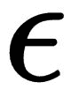

# 第五章：实现你的第一个学习智能体——解决山地车问题

恭喜你走到这一步！在前面的章节中，我们已经对 OpenAI Gym 进行了很好的介绍，了解了它的功能，并学习了如何在自己的程序中安装、配置和使用它。我们还讨论了强化学习的基础知识，以及深度强化学习是什么，并设置了 PyTorch 深度学习库来开发深度强化学习应用程序。在本章中，你将开始开发你的第一个学习智能体！你将开发一个智能体，学习如何解决山地车问题。在接下来的章节中，我们将解决越来越具挑战性的问题，随着你在 OpenAI Gym 中开发强化学习算法来解决问题，你会变得更加熟练。我们将从理解山地车问题开始，这是强化学习和最优控制领域中的一个经典问题。我们将从零开始开发我们的学习智能体，然后训练它利用 Gym 中的山地车环境来解决问题。最后，我们将看到智能体的进展，并简要了解如何改进智能体，使其能够解决更复杂的问题。本章将覆盖以下主题：

+   理解山地车问题

+   实现基于强化学习的智能体来解决山地车问题

+   在 Gym 中训练强化学习智能体

+   测试智能体的性能

# 理解山地车问题

对于任何强化学习问题，有两个基本的定义是至关重要的，无论我们使用什么学习算法。这两个定义分别是状态空间和动作空间的定义。我们在本书前面提到过，状态空间和动作空间可以是离散的，也可以是连续的。通常，在大多数问题中，状态空间由连续值组成，并且表示为向量、矩阵或张量（多维矩阵）。与连续值问题和环境相比，具有离散动作空间的问题和环境相对简单。在本书中，我们将为一些具有状态空间和动作空间组合的不同问题和环境开发学习算法，以便当你开始独立开发智能体和算法时，能够应对任何此类变化。

让我们首先通过高级描述来理解山地车问题，然后再看一下山地车环境的状态空间和动作空间。

# 山地车问题和环境

在 Mountain Car Gym 环境中，一辆车位于一条一维轨道上，位置在两座山之间。目标是将车开到右边的山顶；然而，汽车的引擎力量不足，即使以最大速度行驶也无法爬上山顶。因此，唯一成功的方法是前后驱动来积累动能。简而言之，Mountain Car 问题就是让一辆动力不足的车爬上山顶。

在实现你的智能体算法之前，理解环境、问题以及状态和动作空间会大有帮助。我们如何知道 Mountain Car 环境的状态和动作空间呢？嗯，我们已经知道如何做了，从第四章，*探索 Gym 及其特性*中。我们编写了一个名为 `get_observation_action_space.py` 的脚本，它会打印出作为脚本第一个参数传入的环境的状态、观察和动作空间。让我们用以下命令来让它打印出 `MountainCar-v0` 环境的空间：

```py
(rl_gym_book) praveen@ubuntu:~/rl_gym_book/ch4$ python get_observation_action_space.py 'MountainCar-v0'
```

注意命令提示符中有 `rl_gym_book` 前缀，这表示我们已激活了 `rl_gym_book` conda Python 虚拟环境。此外，当前目录 `~/rl_gym_book/ch4` 表示脚本是从本书代码库中与第四章，*探索 Gym 及其特性*对应的 `ch4` 目录中运行的。

上述命令将产生如下输出：

```py
Observation Space:
Box(2,)

 space.low: [-1.20000005 -0.07 ]

 space.high: [ 0.60000002 0.07 ]
Action Space:
Discrete(3)
```

从这个输出中，我们可以看到状态和观察空间是一个二维盒子，而动作空间是三维的且离散的。

如果你想复习 **box** 和 **discrete** 空间的含义，你可以快速翻到第四章，*探索 Gym 及其特性*，在其中我们讨论了这些空间以及它们的含义，具体在 *Gym 中的空间* 部分。理解它们是非常重要的。

状态和动作空间类型、描述以及允许值的范围总结在下面的表格中，供你参考：

| **MountainCar-v0 环境** | **类型** | **描述** | **范围** |
| --- | --- | --- | --- |
| 状态空间 | `Box(2,)` | （位置，速度） | 位置：-1.2 到 0.6 速度：-0.07 到 0.07 |
| 动作空间 | `Discrete(3)` | 0: 向左走 1: 滑行/不动作 2: 向右走 | 0, 1, 2 |

举个例子，小车从* -0.6 *到* -0.4 *之间的随机位置开始，初始速度为零，目标是到达右侧山顶，位置为*0.5*。（实际上，小车可以超过*0.5*，到达*0.6*，也会被考虑。）每个时间步，环境将返回* -1 *作为奖励，直到小车到达目标位置（*0.5*）。环境将终止回合。如果小车到达*0.5*位置或采取的步骤数达到 200，`done`变量将被设置为`True`。

# 从头开始实现 Q 学习智能体

在这一部分，我们将一步一步地开始实现我们的智能体。我们将使用`NumPy`库和 OpenAI Gym 库中的`MountainCar-V0`环境来实现著名的 Q 学习算法。

让我们重新回顾一下我们在第四章中使用的强化学习 Gym 基础模板代码，*探索 Gym 及其特性*，如下所示：

```py
#!/usr/bin/env python
import gym
env = gym.make("Qbert-v0")
MAX_NUM_EPISODES = 10
MAX_STEPS_PER_EPISODE = 500
for episode in range(MAX_NUM_EPISODES):
    obs = env.reset()
    for step in range(MAX_STEPS_PER_EPISODE):
        env.render()
        action = env.action_space.sample()# Sample random action. This will be replaced by our agent's action when we start developing the agent algorithms
        next_state, reward, done, info = env.step(action) # Send the action to the environment and receive the next_state, reward and whether done or not
        obs = next_state

        if done is True:
            print("\n Episode #{} ended in {} steps.".format(episode, step+1))
            break
```

这段代码是开发我们强化学习智能体的一个良好起点（即基础模板！）。我们将首先将环境名称从`Qbert-v0`更改为`MountainCar-v0`。注意，在前面的脚本中，我们设置了`MAX_STEPS_PER_EPISODE`。这是智能体在回合结束前可以采取的步骤或动作的数量。这在持续的、循环的环境中非常有用，在这种环境中，环境本身不会结束回合。这里，我们为智能体设置了一个限制，以避免无限循环。然而，大多数在 OpenAI Gym 中定义的环境都有回合终止条件，一旦满足其中任何一个条件，`env.step(...)`函数返回的`done`变量将被设置为*True*。我们在前面的章节中看到，对于我们感兴趣的 Mountain Car 问题，如果小车到达目标位置（*0.5*）或所采取的步骤数达到*200*，环境将结束回合。因此，我们可以进一步简化基础模板代码，使其看起来如下，适用于 Mountain Car 环境：

```py
#!/usr/bin/env python
import gym
env = gym.make("MountainCar-v0")
MAX_NUM_EPISODES = 5000

for episode in range(MAX_NUM_EPISODES):
    done = False
    obs = env.reset()
    total_reward = 0.0 # To keep track of the total reward obtained in each episode
    step = 0
    while not done:
        env.render()
        action = env.action_space.sample()# Sample random action. This will be replaced by our agent's action when we start developing the agent algorithms
        next_state, reward, done, info = env.step(action) # Send the action to the environment and receive the next_state, reward and whether done or not
        total_reward += reward
        step += 1
        obs = next_state

    print("\n Episode #{} ended in {} steps. total_reward={}".format(episode, step+1, total_reward))
env.close()
```

如果你运行前面的脚本，你将看到 Mountain Car 环境在一个新窗口中出现，小车会在 1,000 个回合中随机地左右移动。你还会看到每个回合结束时，打印出回合编号、所采取的步骤数以及获得的总奖励，正如以下屏幕截图所示：


样本输出应该类似于以下屏幕截图：


你应该从前一节回忆起，代理每一步都会获得*–1*的奖励，而且`MountainCar-v0`环境会在*200*步后终止任务；这就是为什么代理有时会获得总奖励*–200!*的原因！毕竟，代理在没有思考或从之前的动作中学习的情况下进行随机行动。理想情况下，我们希望代理能够找出如何用最少的步骤到达山顶（接近旗帜，靠近、到达或超越位置*0.5*）。别担心——我们将在本章结束时构建这样一个智能代理！

记得在运行脚本之前始终激活`rl_gym_book` conda 环境！否则，你可能会遇到不必要的模块未找到错误。你可以通过查看 shell 前缀来直观确认是否已激活环境，前缀会显示如下内容：`(rl_gym_book) praveen@ubuntu:~/rl_gym_book/ch5$`。

让我们继续看一下 Q-learning 部分。

# 重温 Q-learning

在第二章，*强化学习与深度强化学习*中，我们讨论了 SARSA 和 Q-learning 算法。这两种算法提供了一种系统的方法来更新表示行动值函数的估计，记作 。具体而言，我们看到 Q-learning 是一种离策略学习算法，它通过以下方式更新当前状态和动作的行动值估计：向后续状态的最大可获得行动值，，该状态根据代理的策略最终会到达。我们还看到，Q-learning 更新的公式如下所示：


在下一节中，我们将在 Python 中实现一个`Q_Learner`类，该类实现了学习更新规则以及其他必要的函数和方法。

# 使用 Python 和 NumPy 实现 Q-learning 代理

让我们通过实现`Q_Learner`类来开始实现我们的 Q-learning 代理。该类的主要方法如下：

+   __init__(self, env)

+   discretize(self, obs)

+   get_action(self, obs)

+   learn(self, obs, action, reward, next_obs)

你稍后会发现，这里的方法是常见的，几乎所有我们在本书中实现的代理都会用到这些方法。这使得你更容易掌握它们，因为这些方法会一遍又一遍地被重复使用（会有一些修改）。

`discretize()`函数通常对代理实现不是必需的，但当状态空间很大且是连续时，将空间离散化为可计数的区间或值范围可能更好，从而简化表示。这还减少了 Q 学习算法需要学习的值的数量，因为它现在只需学习有限的值集，这些值可以简洁地以表格格式或使用*n*维数组表示，而不是复杂的函数。此外，用于最优控制的 Q 学习算法，对于 Q 值的表格表示，保证会收敛。

# 定义超参数

在`Q_Learner`类声明之前，我们将初始化一些有用的超参数。以下是我们将用于`Q_Learner`实现的超参数：

+   `EPSILON_MIN`：这是我们希望代理在遵循 epsilon-greedy 策略时使用的 epsilon 值的最小值。

+   `MAX_NUM_EPISODES`：这是我们希望代理与环境交互的最大回合数。

+   `STEPS_PER_EPISODE`：这是每个回合中的步数。它可以是环境在每个回合中允许的最大步数，或者是我们基于某些时间预算希望设置的自定义值。允许每个回合更多的步数意味着每个回合可能需要更长时间才能完成，在非终止环境中，环境直到达到此限制才会重置，即使代理停留在同一位置。

+   `ALPHA`：这是我们希望代理使用的学习率。这是上一节中列出的 Q 学习更新方程中的 alpha。一些算法会随着训练的进行调整学习率。

+   `GAMMA`：这是代理将用于考虑未来奖励的折扣因子。此值对应于上一节中 Q 学习更新方程中的 gamma。

+   `NUM_DISCRETE_BINS`：这是将状态空间离散化为的值的区间数量。对于 Mountain Car 环境，我们将状态空间离散化为*30*个区间。你可以尝试更高或更低的值。

请注意，`MAX_NUM_EPISODES`和`STEPS_PER_EPISODE`已经在我们之前某一节中讲解的代码模板中定义。

这些超参数在 Python 代码中定义如下，并具有一些初始值：

```py
EPSILON_MIN = 0.005
max_num_steps = MAX_NUM_EPISODES * STEPS_PER_EPISODE
EPSILON_DECAY = 500 * EPSILON_MIN / max_num_steps
ALPHA = 0.05  # Learning rate
GAMMA = 0.98  # Discount factor
NUM_DISCRETE_BINS = 30  # Number of bins to Discretize each observation dim
```

# 实现 Q_Learner 类的 __init__ 方法

接下来，让我们看一下`Q_Learner`类的成员函数定义。`__init__(self, env)`函数将环境实例`env`作为输入参数，并初始化观察空间和行动空间的维度/形状，同时根据我们设置的`NUM_DISCRETE_BINS`确定离散化观察空间的参数。`__init__(self, env)`函数还会根据离散化后的观察空间形状和行动空间的维度，将 Q 函数初始化为一个 NumPy 数组。`__init__(self, env)`的实现是直接的，因为我们只是在初始化智能体所需的值。以下是我们的实现：

```py
class Q_Learner(object):
    def __init__(self, env):
        self.obs_shape = env.observation_space.shape
        self.obs_high = env.observation_space.high
        self.obs_low = env.observation_space.low
        self.obs_bins = NUM_DISCRETE_BINS  # Number of bins to Discretize each observation dim
        self.bin_width = (self.obs_high - self.obs_low) / self.obs_bins
        self.action_shape = env.action_space.n
        # Create a multi-dimensional array (aka. Table) to represent the
        # Q-values
        self.Q = np.zeros((self.obs_bins + 1, self.obs_bins + 1,
                          self.action_shape))  # (51 x 51 x 3)
        self.alpha = ALPHA  # Learning rate
        self.gamma = GAMMA  # Discount factor
        self.epsilon = 1.0
```

# 实现 Q_Learner 类的 discretize 方法

让我们花点时间理解一下我们是如何离散化观察空间的。最简单且有效的离散化观察空间（以及一般度量空间）的方法是将值的范围划分为一个有限的集合，称为“箱子”（bins）。值的跨度/范围是由空间中每个维度的最大可能值与最小可能值之间的差异给出的。一旦我们计算出跨度，就可以将其除以我们决定的`NUM_DISCRETE_BINS`，从而得到箱子的宽度。我们在`__init__`函数中计算了箱子的宽度，因为它在每次新的观察中不会改变。`discretize(self, obs)`函数接收每个新的观察值并应用离散化步骤，以确定观察值在离散化空间中属于哪个箱子。做法其实很简单：

```py
(obs - self.obs_low) / self.bin_width)
```

我们希望它属于任何*一个*箱子（而不是在两个箱子之间）；因此，我们将前面的代码转换为一个`整数`：

```py
((obs - self.obs_low) / self.bin_width).astype(int)
```

最后，我们将这个离散化的观察值作为一个元组返回。所有这些操作都可以用一行 Python 代码表示，如下所示：

```py
def discretize(self, obs):
        return tuple(((obs - self.obs_low) / self.bin_width).astype(int))
```

# 实现 Q_Learner 类的 get_action 方法

我们希望智能体根据观察值采取行动。`get_action(self, obs)`是我们定义的函数，用来根据`obs`中的观察值生成一个行动。最常用的行动选择策略是 epsilon-greedy 策略，它以（高）概率*1-*选择智能体估计的最佳行动！[](img/00124.jpeg)，并以由 epsilon 给定的（小）概率选择随机行动！[](img/00125.jpeg)。我们使用 NumPy 的 random 模块中的`random()`方法来实现 epsilon-greedy 策略，像这样：

```py
 def get_action(self, obs):
        discretized_obs = self.discretize(obs)
        # Epsilon-Greedy action selection
        if self.epsilon > EPSILON_MIN:
            self.epsilon -= EPSILON_DECAY
        if np.random.random() > self.epsilon:
            return np.argmax(self.Q[discretized_obs])
        else:  # Choose a random action
            return np.random.choice([a for a in range(self.action_shape)])
```

# 实现 Q_Learner 类的 learn 方法

正如你可能猜到的，这就是`Q_Learner`类中最重要的方法，它实现了学习 Q 值的魔法，从而使得智能体能够随着时间的推移采取智能的行动！最棒的部分是，它的实现并不像看起来那样复杂！它仅仅是我们之前看到的 Q 学习更新方程的实现。你不相信我说它很简单吗？！好吧，这是学习函数的实现：

```py
 def learn(self, obs, action, reward, next_obs):
        discretized_obs = self.discretize(obs)
        discretized_next_obs = self.discretize(next_obs)
        td_target = reward + self.gamma * np.max(self.Q[discretized_next_obs])
        td_error = td_target - self.Q[discretized_obs][action]
        self.Q[discretized_obs][action] += self.alpha * td_error
```

现在你同意了吗？ :)

我们本可以将 Q 学习更新规则写成一行代码，像这样：

```py
self.Q[discretized_obs][action] += self.alpha * (reward + self.gamma * np.max(self.Q[discretized_next_obs] - self.Q[discretized_obs][action]
```

但是，将每个项分别写在单独的行中会让它更易于阅读和理解。

# 完整的 Q_Learner 类实现

如果我们将所有方法的实现放在一起，就会得到一个看起来像这样的代码片段：

```py
EPSILON_MIN = 0.005
max_num_steps = MAX_NUM_EPISODES * STEPS_PER_EPISODE
EPSILON_DECAY = 500 * EPSILON_MIN / max_num_steps
ALPHA = 0.05  # Learning rate
GAMMA = 0.98  # Discount factor
NUM_DISCRETE_BINS = 30  # Number of bins to Discretize each observation dim

class Q_Learner(object):
    def __init__(self, env):
        self.obs_shape = env.observation_space.shape
        self.obs_high = env.observation_space.high
        self.obs_low = env.observation_space.low
        self.obs_bins = NUM_DISCRETE_BINS  # Number of bins to Discretize each observation dim
        self.bin_width = (self.obs_high - self.obs_low) / self.obs_bins
        self.action_shape = env.action_space.n
        # Create a multi-dimensional array (aka. Table) to represent the
        # Q-values
        self.Q = np.zeros((self.obs_bins + 1, self.obs_bins + 1,
                           self.action_shape))  # (51 x 51 x 3)
        self.alpha = ALPHA  # Learning rate
        self.gamma = GAMMA  # Discount factor
        self.epsilon = 1.0

    def discretize(self, obs):
        return tuple(((obs - self.obs_low) / self.bin_width).astype(int))

    def get_action(self, obs):
        discretized_obs = self.discretize(obs)
        # Epsilon-Greedy action selection
        if self.epsilon > EPSILON_MIN:
            self.epsilon -= EPSILON_DECAY
        if np.random.random() > self.epsilon:
            return np.argmax(self.Q[discretized_obs])
        else:  # Choose a random action
            return np.random.choice([a for a in range(self.action_shape)])

    def learn(self, obs, action, reward, next_obs):
        discretized_obs = self.discretize(obs)
        discretized_next_obs = self.discretize(next_obs)
        td_target = reward + self.gamma * np.max(self.Q[discretized_next_obs])
        td_error = td_target - self.Q[discretized_obs][action]
        self.Q[discretized_obs][action] += self.alpha * td_error
```

所以，我们已经准备好智能体了。你可能会问，接下来我们该做什么呢？好吧，我们应该在 Gym 环境中训练智能体！在下一部分，我们将看看训练过程。

# 在 Gym 中训练强化学习智能体

训练 Q-learning 智能体的过程你可能已经很熟悉了，因为它有很多与我们之前使用的模板代码相同的行，并且结构也相似。我们不再从环境的动作空间中随机选择动作，而是通过`agent.get_action(obs)`方法从智能体中获取动作。在将智能体的动作发送到环境并收到反馈后，我们还会调用`agent.learn(obs, action, reward, next_obs)`方法。训练函数如下所示：

```py
def train(agent, env):
    best_reward = -float('inf')
    for episode in range(MAX_NUM_EPISODES):
        done = False
        obs = env.reset()
        total_reward = 0.0
        while not done:
            action = agent.get_action(obs)
            next_obs, reward, done, info = env.step(action)
            agent.learn(obs, action, reward, next_obs)
            obs = next_obs
            total_reward += reward
        if total_reward > best_reward:
            best_reward = total_reward
        print("Episode#:{} reward:{} best_reward:{} eps:{}".format(episode,
                                     total_reward, best_reward, agent.epsilon))
    # Return the trained policy
    return np.argmax(agent.Q, axis=2)
```

# 测试并记录智能体的表现

一旦我们让智能体在 Gym 中进行训练，我们就希望能够衡量它的学习效果。为此，我们让智能体进行测试。就像在学校一样！`test(agent, env, policy)`接受智能体对象、环境实例和智能体的策略，以测试智能体在环境中的表现，并返回一个完整回合的总奖励。它类似于我们之前看到的`train(agent, env)`函数，但不会让智能体学习或更新它的 Q 值估计：

```py
def test(agent, env, policy):
    done = False
    obs = env.reset()
    total_reward = 0.0
    while not done:
        action = policy[agent.discretize(obs)]
        next_obs, reward, done, info = env.step(action)
        obs = next_obs
        total_reward += reward
    return total_reward
1,000 episodes and save the recorded agent's action in the environment as video files in the gym_monitor_path directory:
```

```py
if __name__ == "__main__":
    env = gym.make('MountainCar-v0')
    agent = Q_Learner(env)
    learned_policy = train(agent, env)
    # Use the Gym Monitor wrapper to evalaute the agent and record video
    gym_monitor_path = "./gym_monitor_output"
    env = gym.wrappers.Monitor(env, gym_monitor_path, force=True)
    for _ in range(1000):
        test(agent, env, learned_policy)
    env.close()
```

# 一个简单而完整的 Q-Learner 实现，用于解决 Mountain Car 问题

在这一部分，我们将整个代码整合到一个单独的 Python 脚本中，初始化环境，启动智能体的训练过程，获得训练后的策略，测试智能体的表现，并记录它在环境中的行为！

```py
#!/usr/bin/env/ python
import gym
import numpy as np

MAX_NUM_EPISODES = 50000
STEPS_PER_EPISODE = 200 #  This is specific to MountainCar. May change with env
EPSILON_MIN = 0.005
max_num_steps = MAX_NUM_EPISODES * STEPS_PER_EPISODE
EPSILON_DECAY = 500 * EPSILON_MIN / max_num_steps
ALPHA = 0.05  # Learning rate
GAMMA = 0.98  # Discount factor
NUM_DISCRETE_BINS = 30  # Number of bins to Discretize each observation dim

class Q_Learner(object):
    def __init__(self, env):
        self.obs_shape = env.observation_space.shape
        self.obs_high = env.observation_space.high
        self.obs_low = env.observation_space.low
        self.obs_bins = NUM_DISCRETE_BINS  # Number of bins to Discretize each observation dim
        self.bin_width = (self.obs_high - self.obs_low) / self.obs_bins
        self.action_shape = env.action_space.n
        # Create a multi-dimensional array (aka. Table) to represent the
        # Q-values
        self.Q = np.zeros((self.obs_bins + 1, self.obs_bins + 1,
                           self.action_shape))  # (51 x 51 x 3)
        self.alpha = ALPHA  # Learning rate
        self.gamma = GAMMA  # Discount factor
        self.epsilon = 1.0

    def discretize(self, obs):
        return tuple(((obs - self.obs_low) / self.bin_width).astype(int))

    def get_action(self, obs):
        discretized_obs = self.discretize(obs)
        # Epsilon-Greedy action selection
        if self.epsilon > EPSILON_MIN:
            self.epsilon -= EPSILON_DECAY
        if np.random.random() > self.epsilon:
            return np.argmax(self.Q[discretized_obs])
        else:  # Choose a random action
            return np.random.choice([a for a in range(self.action_shape)])

    def learn(self, obs, action, reward, next_obs):
        discretized_obs = self.discretize(obs)
        discretized_next_obs = self.discretize(next_obs)
        td_target = reward + self.gamma * np.max(self.Q[discretized_next_obs])
        td_error = td_target - self.Q[discretized_obs][action]
        self.Q[discretized_obs][action] += self.alpha * td_error

def train(agent, env):
    best_reward = -float('inf')
    for episode in range(MAX_NUM_EPISODES):
        done = False
        obs = env.reset()
        total_reward = 0.0
        while not done:
            action = agent.get_action(obs)
            next_obs, reward, done, info = env.step(action)
            agent.learn(obs, action, reward, next_obs)
            obs = next_obs
            total_reward += reward
        if total_reward > best_reward:
            best_reward = total_reward
        print("Episode#:{} reward:{} best_reward:{} eps:{}".format(episode,
                                     total_reward, best_reward, agent.epsilon))
    # Return the trained policy
    return np.argmax(agent.Q, axis=2)

def test(agent, env, policy):
    done = False
    obs = env.reset()
    total_reward = 0.0
    while not done:
        action = policy[agent.discretize(obs)]
        next_obs, reward, done, info = env.step(action)
        obs = next_obs
        total_reward += reward
    return total_reward

if __name__ == "__main__":
    env = gym.make('MountainCar-v0')
    agent = Q_Learner(env)
    learned_policy = train(agent, env)
    # Use the Gym Monitor wrapper to evalaute the agent and record video
    gym_monitor_path = "./gym_monitor_output"
    env = gym.wrappers.Monitor(env, gym_monitor_path, force=True)
    for _ in range(1000):
        test(agent, env, learned_policy)
    env.close()
```

该脚本可在代码仓库的`ch5`文件夹中找到，名为`Q_learner_MountainCar.py`。

激活`rl_gym_book`的 conda 环境并启动脚本，查看其运行效果！当你启动脚本时，你将看到类似于这张截图的初始输出：


在初始训练过程中，当智能体刚开始学习时，你会看到它总是以*-200*的奖励结束。从你对 Gym 的 Mountain Car 环境的理解来看，你可以看出智能体在*200*个时间步内没有到达山顶，因此环境会自动重置；因此，智能体只得到*-200*。你还可以观察到****（**eps**）探索值缓慢衰减。

如果你让智能体学习足够长的时间，你会看到它逐步提高，并且学会在越来越少的步骤内到达山顶。这是它在典型笔记本电脑硬件上训练*5*分钟后的进展示例：


一旦脚本运行完成，你将看到记录的视频（以及一些`.stats.json`和`.meta.json`文件），它们位于`gym_monitor_output`文件夹中。你可以观看这些视频，看看你的智能体表现如何！

下面是一张截图，展示了智能体成功地将汽车引导到山顶：


万岁！

# 总结

在这一章中我们学到了很多内容。更重要的是，我们实现了一个智能体，它在大约 7 分钟内学会了聪明地解决 Mountain Car 问题！

我们首先理解了著名的 Mountain Car 问题，并查看了 Gym 中`MountainCar-v0`环境的设计，包括环境、观察空间、状态空间和奖励的设计。我们重新审视了上一章中使用的强化学习 Gym 模板代码，并对其进行了改进，这些改进也已在本书的代码库中提供。

然后，我们为 Q 学习智能体定义了超参数，并开始从零实现 Q 学习算法。我们首先实现了智能体的初始化函数，初始化智能体的内部状态变量，包括使用 NumPy 的*n*维数组表示 Q 值。接着，我们实现了`discretize`方法，将`状态空间`离散化；`get_action(...)`方法根据 epsilon 贪婪策略选择一个动作；最后，我们实现了`learn(...)`函数，它实现了 Q 学习的更新规则，并构成了智能体的核心。我们看到实现这些功能是多么简单！我们还实现了用于训练、测试和评估智能体表现的函数。

我希望你在实现智能体并观看它解决 Gym 中的 Mountain Car 问题时玩得很开心！在下一章，我们将深入探讨一些高级方法，以解决更多具有挑战性的问题。
