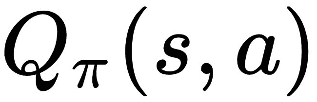
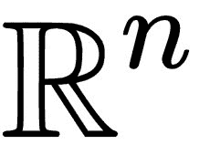
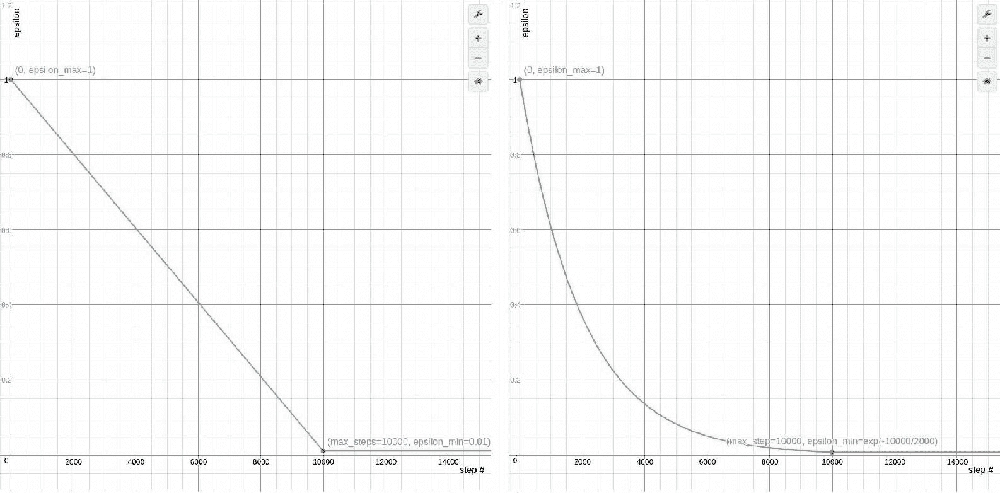
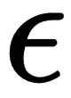
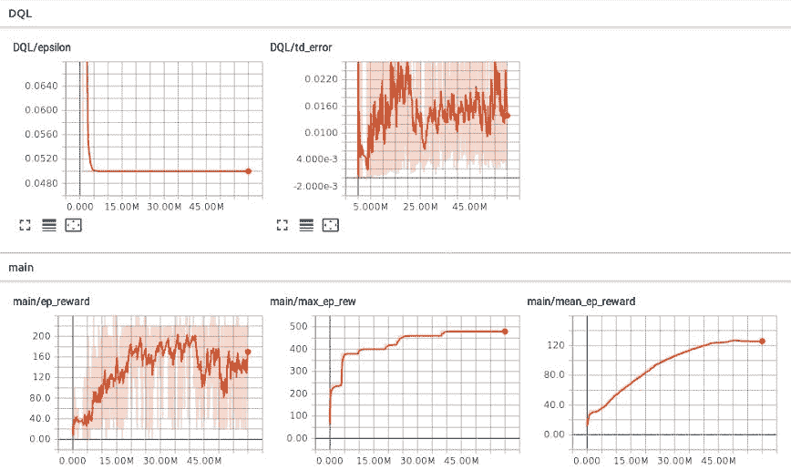
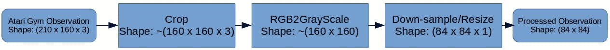
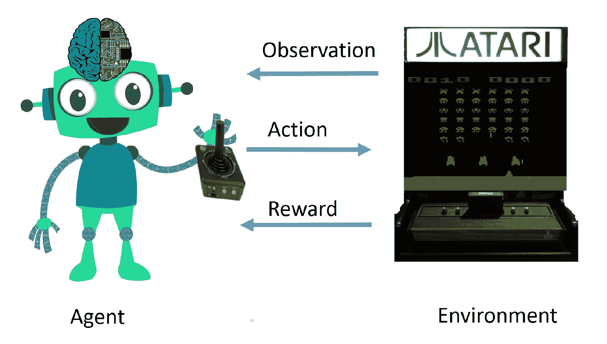

# 第六章：使用深度 Q-learning 实现智能代理进行最优控制

在上一章中，我们实现了一个使用 Q-learning 的智能代理，该代理在约七分钟内使用双核笔记本 CPU 从零开始解决了 Mountain Car 问题。在这一章中，我们将实现 Q-learning 的一个高级版本，叫做深度 Q-learning，它可以用来解决比 Mountain Car 问题复杂得多的多个离散控制问题。离散控制问题是（顺序）决策问题，在这些问题中，动作空间被离散化为有限的值。在上一章中，学习代理使用了一个二维的状态空间向量作为输入，这个向量包含了小车的位置和速度信息，以便采取最佳控制行动。在这一章中，我们将看到如何实现一个学习代理，该代理以（屏幕上的）视觉图像作为输入，并学习采取最佳控制行动。这与我们解决问题的方法非常接近，不是吗？我们人类不会计算物体的位置和速度来决定接下来做什么。我们只是观察发生了什么，然后学习采取随时间改进的行动，最终完全解决问题。

本章将指导你如何通过逐步改进我们的 Q-learning 代理实现，使用最近发布的稳定 Q-learning 深度神经网络函数近似方法，逐步构建一个更好的代理。在本章结束时，你将学会如何实现并训练一个深度 Q-learning 代理，该代理通过观察屏幕上的像素并使用 Atari Gym 环境玩 Atari 游戏，获得相当不错的分数！我们还将讨论如何在学习过程中可视化和比较代理的表现。你将看到相同的代理算法如何在多个不同的 Atari 游戏上进行训练，并且该代理仍然能够学会很好地玩这些游戏。如果你迫不及待地想看到实际效果，或者你喜欢在深入之前先大致了解你将开发的内容，可以查看本章代码仓库中 `ch6` 文件夹下的代码，并在多个 Atari 游戏上尝试预训练的代理！有关如何运行预训练代理的说明，可以在 `ch6/README.md` 文件中找到。

本章包含大量的技术细节，旨在为你提供足够的背景和知识，使你能够理解逐步改进基本 Q-learning 算法的过程，并基于深度 Q-learning 构建一个更强大、更智能的代理，同时提供多个训练和测试代理所需的模块和工具。以下是本章将涵盖的高级主题的概述：

+   改进 Q-learning 代理的各种方法，包括以下内容：

    +   神经网络近似动作-价值函数

    +   经验回放

    +   探索调度

+   使用 PyTorch 实现深度卷积神经网络进行动作-价值函数逼近

+   使用目标网络稳定深度 Q 网络

+   使用 TensorBoard 记录和监控 PyTorch 代理的学习性能

+   管理参数和配置

+   Atari Gym 环境

+   训练深度 Q 学习者玩 Atari 游戏

让我们从第一个主题开始，看看如何从上一章的内容接续开始，继续朝着更强大、更智能的代理迈进。

# 改进 Q 学习代理

在上一章中，我们回顾了 Q 学习算法，并实现了 `Q_Learner` 类。对于 Mountain car 环境，我们使用了形状为 51x51x3 的多维数组来表示动作-价值函数，。请注意，我们已经将状态空间离散化为固定数量的区间，这个数量由 `NUM_DISCRETE_BINS` 配置参数给出（我们使用了 50）。我们本质上是对观察进行了量化或近似，用低维离散表示来减少 n 维数组中可能的元素数量。通过对观察/状态空间的这种离散化，我们将小车的可能位置限制为 50 个固定位置，速度也限制为 50 个固定值。任何其他位置或速度值都会被近似为这些固定值之一。因此，代理可能会收到相同的位置值，即使小车实际上位于不同的位置。对于某些环境，这可能是一个问题。代理可能无法学会区分从悬崖掉下去和仅站在悬崖边缘以便向前跳跃。在下一节中，我们将研究如何使用更强大的函数逼近器来表示动作-价值函数，而不是使用简单的 n 维数组/表格，因为它有一定的局限性。

# 使用神经网络逼近 Q 函数

神经网络被证明是有效的通用函数逼近器。事实上，有一个通用逼近定理，表明一个单隐层前馈神经网络可以逼近任何闭合且有界的连续函数 。这基本上意味着即使是简单（浅层）神经网络也可以逼近多个函数。难道不觉得用一个固定数量的权重/参数的简单神经网络来逼近几乎任何函数，听起来太好了不真实吗？但这确实是真的，唯一需要注意的地方是，它并不能在任何地方和所有地方都能实际应用。虽然单隐层神经网络可以用有限的参数集逼近任何函数，但我们并没有一种普遍保证的*学习*这些参数的方法，以便最好地表示任何函数。你会看到，研究人员已经能够使用神经网络来逼近多个复杂且有用的函数。如今，几乎所有智能手机内置的智能功能都由（经过大量优化的）神经网络驱动。许多表现最好的系统，比如自动根据人物、地点和照片中的上下文将照片分类的系统，识别你面部和声音的系统，或者为你自动撰写电子邮件回复的系统，都是由神经网络提供动力的。即使是生成类似人类真实语音的最先进技术，比如你在 Google Assistant 等语音助手中听到的声音，也是由神经网络驱动的。

Google Assistant 当前使用由 Deepmind 开发的 WaveNet 和 WaveNet2 进行 **文本到语音** (**TTS**) 合成，研究表明，这比目前开发的任何其他 TTS 系统都更加逼真。

我希望这足以激励你使用神经网络来逼近 Q 函数！在本节中，我们将从用一个浅层（非深层）单隐层神经网络来逼近 Q 函数开始，并利用它来解决著名的倒立摆问题。尽管神经网络是强大的函数逼近器，我们将看到，即便是单隐层神经网络，训练它来逼近强化学习问题中的 Q 函数也并非易事。我们将探讨一些利用神经网络逼近改进 Q 学习的方法，并且在本章的后续部分，我们将研究如何使用具有更强表示能力的深度神经网络来逼近 Q 函数。

让我们通过重新审视前一章中实现的 `Q_Learner` 类的 `__init__(...)` 方法来开始神经网络逼近：

```py
class Q_Learner(object):
    def __init__(self, env):
        self.obs_shape = env.observation_space.shape
        self.obs_high = env.observation_space.high
        self.obs_low = env.observation_space.low
        self.obs_bins = NUM_DISCRETE_BINS  # Number of bins to Discretize each observation dim
        self.bin_width = (self.obs_high - self.obs_low) / self.obs_bins
        self.action_shape = env.action_space.n
        # Create a multi-dimensional array (aka. Table) to represent the
        # Q-values
        self.Q = np.zeros((self.obs_bins + 1, self.obs_bins + 1,
 self.action_shape))  # (51 x 51 x 3)
        self.alpha = ALPHA  # Learning rate
        self.gamma = GAMMA  # Discount factor
        self.epsilon = 1.0
```

在前面的代码中，粗体字体的那一行是我们将 Q 函数初始化为一个多维的 NumPy 数组。在接下来的部分，我们将看到如何将 NumPy 数组表示替换为更强大的神经网络表示。

# 使用 PyTorch 实现一个浅层 Q 网络

在这一部分中，我们将开始使用 PyTorch 的神经网络模块实现一个简单的神经网络，然后看看如何使用它来替代基于多维数组的 Q 行为值表函数。

让我们从神经网络的实现开始。以下代码演示了如何使用 PyTorch 实现一个 **单层感知机** (**SLP**)：

```py
import torch

class SLP(torch.nn.Module):
    """
    A Single Layer Perceptron (SLP) class to approximate functions
    """
    def __init__(self, input_shape, output_shape, device=torch.device("cpu")):
        """
        :param input_shape: Shape/dimension of the input
        :param output_shape: Shape/dimension of the output
        :param device: The device (cpu or cuda) that the SLP should use to store the inputs for the forward pass
        """
        super(SLP, self).__init__()
        self.device = device
        self.input_shape = input_shape[0]
        self.hidden_shape = 40
        self.linear1 = torch.nn.Linear(self.input_shape, self.hidden_shape)
        self.out = torch.nn.Linear(self.hidden_shape, output_shape)

    def forward(self, x):
        x = torch.from_numpy(x).float().to(self.device)
        x = torch.nn.functional.relu(self.linear1(x))
        x = self.out(x)
        return x
```

SLP 类实现了一个单层神经网络，输入层和输出层之间有 40 个隐藏单元，使用 `torch.nn.Linear` 类，并使用 **修正线性单元** (**ReLU** 或 **relu**) 作为激活函数。本书的代码库中提供了这段代码，路径为 `ch6/function_approximator/perceptron.py`。数字 40 并没有特别的含义，你可以根据需要调整神经网络中的隐藏单元数量。

# 实现 Shallow_Q_Learner

然后，我们可以修改 `Q_Learner` 类，使用这个 SLP 来表示 Q 函数。请注意，我们还需要修改 `Q_Learner` 类中的 `learn(...)` 方法，以计算损失函数关于 SLP 权重的梯度，并进行反向传播，以更新和优化神经网络的权重，从而改进其 Q 值表示，使其更接近实际值。同时，我们还会稍微修改 `get_action(...)` 方法，通过神经网络的前向传播来获得 Q 值。以下是带有 `Q_Learner` 类实现中变化的 `Shallow_Q_Learner` 类代码，修改部分用 **粗体** 显示，以便你一眼看出差异：

```py
import torch
from function_approximator.perceptron import SLP EPSILON_MIN = 0.005
max_num_steps = MAX_NUM_EPISODES * STEPS_PER_EPISODE
EPSILON_DECAY = 500 * EPSILON_MIN / max_num_steps
ALPHA = 0.05  # Learning rate
GAMMA = 0.98  # Discount factor
NUM_DISCRETE_BINS = 30  # Number of bins to Discretize each observation dim

class Shallow_Q_Learner(object):
    def __init__(self, env):
        self.obs_shape = env.observation_space.shape
        self.obs_high = env.observation_space.high
        self.obs_low = env.observation_space.low
        self.obs_bins = NUM_DISCRETE_BINS  # Number of bins to Discretize each observation dim
        self.bin_width = (self.obs_high - self.obs_low) / self.obs_bins
        self.action_shape = env.action_space.n
        # Create a multi-dimensional array (aka. Table) to represent the
        # Q-values
        self.Q = SLP(self.obs_shape, self.action_shape)
        self.Q_optimizer = torch.optim.Adam(self.Q.parameters(), lr=1e-5)
        self.alpha = ALPHA  # Learning rate
        self.gamma = GAMMA  # Discount factor
        self.epsilon = 1.0

    def discretize(self, obs):
        return tuple(((obs - self.obs_low) / self.bin_width).astype(int))

    def get_action(self, obs):
        discretized_obs = self.discretize(obs)
        # Epsilon-Greedy action selection
        if self.epsilon > EPSILON_MIN:
            self.epsilon -= EPSILON_DECAY
        if np.random.random() > self.epsilon:
            return np.argmax(self.Q(discretized_obs).data.to(torch.device('cpu')).numpy())
        else:  # Choose a random action
            return np.random.choice([a for a in range(self.action_shape)])

    def learn(self, obs, action, reward, next_obs):
        #discretized_obs = self.discretize(obs)
        #discretized_next_obs = self.discretize(next_obs)
        td_target = reward + self.gamma * torch.max(self.Q(next_obs))
        td_error = torch.nn.functional.mse_loss(self.Q(obs)[action], td_target)
        #self.Q[discretized_obs][action] += self.alpha * td_error
        self.Q_optimizer.zero_grad()
        td_error.backward()
        self.Q_optimizer.step() 
```

这里讨论了 `Shallow_Q_Learner` 类的实现，目的是让你更容易理解如何实现基于神经网络的 Q 函数逼近，进而替代传统的表格型 Q 学习实现。

# 使用 Shallow Q-Network 解决 Cart Pole 问题

在这一部分中，我们将实现一个完整的训练脚本，使用我们在前一部分中开发的 Shallow `Q_Learner` 类来解决 Cart Pole 问题：

```py
#!/usr/bin/env python import gym import random import torch from torch.autograd import Variable import numpy as np from utils.decay_schedule import LinearDecaySchedule from function_approximator.perceptron import SLP

env = gym.make("CartPole-v0")
MAX_NUM_EPISODES = 100000
MAX_STEPS_PER_EPISODE = 300

class Shallow_Q_Learner(object):
    def __init__(self, state_shape, action_shape, learning_rate=0.005,
                 gamma=0.98):
        self.state_shape = state_shape
        self.action_shape = action_shape
        self.gamma = gamma # Agent's discount factor
        self.learning_rate = learning_rate # Agent's Q-learning rate
        # self.Q is the Action-Value function. This agent represents Q using a
        # Neural Network.
        self.Q = SLP(state_shape, action_shape)
        self.Q_optimizer = torch.optim.Adam(self.Q.parameters(), lr=1e-3)
        # self.policy is the policy followed by the agent. This agents follows
        # an epsilon-greedy policy w.r.t it's Q estimate.
        self.policy = self.epsilon_greedy_Q
        self.epsilon_max = 1.0
        self.epsilon_min = 0.05
        self.epsilon_decay = LinearDecaySchedule(initial_value=self.epsilon_max,
                                    final_value=self.epsilon_min,
                                    max_steps= 0.5 * MAX_NUM_EPISODES * MAX_STEPS_PER_EPISODE)
        self.step_num = 0

    def get_action(self, observation):
        return self.policy(observation)

    def epsilon_greedy_Q(self, observation):
        # Decay Epsilion/exploratin as per schedule
        if random.random() < self.epsilon_decay(self.step_num):
            action = random.choice([i for i in range(self.action_shape)])
        else:
            action = np.argmax(self.Q(observation).data.numpy())

        return action

    def learn(self, s, a, r, s_next):
        td_target = r + self.gamma * torch.max(self.Q(s_next))
        td_error = torch.nn.functional.mse_loss(self.Q(s)[a], td_target)
        # Update Q estimate
        #self.Q(s)[a] = self.Q(s)[a] + self.learning_rate * td_error
        self.Q_optimizer.zero_grad()
        td_error.backward()
        self.Q_optimizer.step()

if __name__ == "__main__":
    observation_shape = env.observation_space.shape
    action_shape = env.action_space.n
    agent = Shallow_Q_Learner(observation_shape, action_shape)
    first_episode = True
    episode_rewards = list()
    for episode in range(MAX_NUM_EPISODES):
        obs = env.reset()
        cum_reward = 0.0 # Cumulative reward
        for step in range(MAX_STEPS_PER_EPISODE):
            # env.render()
            action = agent.get_action(obs)
            next_obs, reward, done, info = env.step(action)
            agent.learn(obs, action, reward, next_obs)

            obs = next_obs
            cum_reward += reward

            if done is True:
                if first_episode: # Initialize max_reward at the end of first episode
                    max_reward = cum_reward
                    first_episode = False
                episode_rewards.append(cum_reward)
                if cum_reward > max_reward:
                    max_reward = cum_reward
                print("\nEpisode#{} ended in {} steps. reward ={} ; mean_reward={} best_reward={}".
                      format(episode, step+1, cum_reward, np.mean(episode_rewards), max_reward))
                break
    env.close()
```

在 `ch6` 文件夹中创建一个名为 `shallow_Q_Learner.py` 的脚本，并像下面这样运行：

```py
(rl_gym_book) praveen@ubuntu:~/rl_gym_book/ch6$ python shallow_Q_Learner.py
```

你将看到代理在 Gym 的 `CartPole-v0` 环境中学习如何平衡杠杆。你应该能够看到控制台打印出的以下信息：当前回合数、代理在回合结束前所采取的步数、代理所获得的回合奖励、代理所获得的平均回合奖励，以及代理至今所获得的最佳回合奖励。如果你想直观地看到 Cart Pole 环境，并了解代理如何尝试学习并保持平衡，你可以取消注释 `env.render()` 这一行代码。

`Shallow_Q_Learner`类的实现和完整的训练脚本展示了如何使用简单的神经网络来逼近 Q 函数。这并不是解决复杂游戏（如 Atari）的一个好实现。在接下来的几个部分中，我们将使用新的技术系统地改进它们的性能。我们还将实现一个深度卷积 Q 网络，该网络可以将原始的屏幕图像作为输入，并预测智能体可以用来玩各种 Atari 游戏的 Q 值。

你可能会注意到，智能体需要很长时间才能改善并最终能够解决问题。在下一部分中，我们将实现经验回放的概念来提升性能。

# 经验回放

在大多数环境中，智能体接收到的信息并不是**独立同分布**（**i.i.d**）。这意味着智能体接收到的观察值与它之前接收到的观察值以及它将来接收到的观察值之间存在较强的相关性。这个现象是可以理解的，因为通常，智能体在典型的强化学习环境中所解决的问题是顺序性的。研究表明，如果样本是 i.i.d，神经网络的收敛效果会更好。

经验回放还使得智能体能够重用过去的经验。神经网络更新，尤其是在较低学习率的情况下，需要多次反向传播和优化步骤才能收敛到好的值。重用过去的经验数据，尤其是通过小批量来更新神经网络，极大地帮助了 Q 网络的收敛，Q 网络的结果接近真实的动作值。

# 实现经验记忆

让我们实现一个经验记忆类，用于存储智能体收集的经验。在此之前，让我们先明确一下我们所说的*经验*是什么意思。在强化学习中，问题通常通过**马尔可夫决策过程**（**MDP**）来表示，正如我们在第二章《强化学习与深度强化学习》中所讨论的那样，表示一次经验为一个数据结构，其中包含了在时间步*t*的观察值、根据该观察值采取的行动、为该行动获得的奖励，以及由于智能体的行动而导致环境过渡到的下一个观察值（或状态）。包括“done”布尔值，表示该次观察是否标志着一轮实验的结束也是有用的。我们可以使用 Python 的`namedtuple`（来自 collections 库）来表示这种数据结构，如下方代码片段所示：

```py
from collections import namedtuple
Experience = namedtuple("Experience", ['obs', 'action', 'reward', 'next_obs',
                                       'done'])
```

`namedtuple`数据结构使得使用名称属性（如'obs'、'action'等）而不是数字索引（如 0、1 等）来访问元素变得更加方便。

现在我们可以继续使用刚刚创建的经验数据结构来实现经验记忆类。为了弄清楚我们需要在经验记忆类中实现哪些方法，让我们考虑一下以后如何使用它。

首先，我们希望能够存储智能体收集的新经验到经验记忆中。然后，当我们想要回放并更新 Q 函数时，我们希望能从经验记忆中按批次采样或提取经验。因此，基本上，我们将需要一个方法来存储新经验，以及一个可以采样单个或批量经验的方法。

让我们深入了解经验记忆的实现，从初始化方法开始，我们用所需的容量初始化内存，如下所示：

```py
class ExperienceMemory(object):
    """
    A cyclic/ring buffer based Experience Memory implementation
    """
    def __init__(self, capacity=int(1e6)):
        """
        :param capacity: Total capacity (Max number of Experiences)
        :return:
        """
        self.capacity = capacity
        self.mem_idx = 0 # Index of the current experience
        self.memory = []
```

`mem_idx`成员变量将用于指向当前的写入头或索引位置，我们将在该位置存储新到达的经验。

“循环缓冲区”也有其他名字，你可能听过：“环形缓冲区”、“环形队列”和“循环队列”。它们都代表相同的底层数据结构，使用类似环形的固定大小数据表示。

接下来，我们将查看`store`方法的实现：

```py
def store(self, experience):
        """
        :param experience: The Experience object to be stored into the memory
        :return:
        """
        self.memory.insert(self.mem_idx % self.capacity, experience)
        self.mem_idx += 1
```

足够简单，对吧？我们正在存储经验到`mem_idx`，正如我们所讨论的那样。

接下来的代码是我们`sample`方法的实现：

```py
import random
    def sample(self, batch_size):
        """

        :param batch_size: Sample batch_size
        :return: A list of batch_size number of Experiences sampled at random from mem
        """
        assert batch_size <= len(self.memory), "Sample batch_size is more than available exp in mem"
        return random.sample(self.memory, batch_size)

```

在前面的代码中，我们利用 Python 的 random 库从经验记忆中均匀地随机采样经验。我们还将实现一个简单的`get_size`辅助方法，用于查找经验记忆中已经存储了多少经验：

```py
def get_size(self):
        """

        :return: Number of Experiences stored in the memory
        """
        return len(self.memory)
```

经验记忆类的完整实现可以在`ch6/utils/experience_memory.py`中找到，位于本书的代码仓库中。

接下来，我们将看看如何从经验记忆中回放采样的经验，以更新智能体的 Q 函数。

# 实现 Q-learner 类的回放经验方法

因此，我们已经为智能体实现了一个内存系统，使用整洁的循环缓冲区来存储它的过去经验。在本节中，我们将探讨如何在 Q-learner 类中使用经验记忆来回放经验。

```py
replay_experience method that shows how we sample from the experience memory and call a soon-to-be-implemented method that lets the agent learn from the sampled batch of experiences:
```

```py
def replay_experience(self, batch_size=REPLAY_BATCH_SIZE):
        """
        Replays a mini-batch of experience sampled from the Experience Memory
        :param batch_size: mini-batch size to sample from the Experience Memory
        :return: None
        """
        experience_batch = self.memory.sample(batch_size)
        self.learn_from_batch_experience(experience_batch)
```

对于像 SARSA 这样的在线学习方法，行动值估计在代理与环境交互的每一步之后都会更新。这种方式使得更新传播了代理刚刚经历的信息。如果代理不经常经历某些事物，这样的更新可能会导致代理忘记这些经历，当代理在未来遇到类似情况时可能表现不佳。这是不可取的，特别是对于具有许多参数（或权重）需要调整到正确值的神经网络来说。这是使用经验记忆并在更新 Q 行动值估计时重播过去经验的主要动机之一。我们现在将实现`learn_from_batch_experience`方法，扩展我们在上一章中实现的`learn`方法，以从一批经验中学习，而不是从单个经验中学习。以下是该方法的实现：

```py
device = torch.device("cuda" if torch.cuda.is_available() else "cpu")
def learn_from_batch_experience(self, experiences):
        """
        Updated the DQN based on the learning from a mini-batch of experience.
        :param experiences: A mini-batch of experience
        :return: None
        """
        batch_xp = Experience(*zip(*experiences))
        obs_batch = np.array(batch_xp.obs)
        action_batch = np.array(batch_xp.action)
        reward_batch = np.array(batch_xp.reward)
        next_obs_batch = np.array(batch_xp.next_obs)
        done_batch = np.array(batch_xp.done)

        td_target = reward_batch + ~done_batch * \
                np.tile(self.gamma, len(next_obs_batch)) * \
                self.Q(next_obs_batch).detach().max(1)[0].data

        td_target = td_target.to(device)
        action_idx = torch.from_numpy(action_batch).to(device)
        td_error = torch.nn.functional.mse_loss(
            self.Q(obs_batch).gather(1, action_idx.view(-1, 1)),
            td_target.float().unsqueeze(1))

        self.Q_optimizer.zero_grad()
        td_error.mean().backward()
        self.Q_optimizer.step()
```

该方法接收一批（或小批量）经验，并首先分别提取观察批次、动作批次、奖励批次和下一个观察批次，以便在随后的步骤中单独使用它们。`done_batch`表示每个经验的下一个观察是否是一集的结束。然后，我们计算最大化动作的**时间差分**（**TD**）误差，这是 Q 学习的目标。请注意，在`td_target`计算中，我们将第二项乘以`~done_batch`。

这负责为终止状态指定零值。因此，如果`next_obs_batch`中的特定`next_obs`是终止状态，则第二项将变为 0，结果仅为`td_target = rewards_batch`。

然后计算`td_target`（目标 Q 值）与 Q 网络预测的 Q 值之间的均方误差。我们将此误差作为指导信号，并在进行优化步骤之前将其反向传播到神经网络中的所有节点，以更新参数/权重以最小化误差。

# 重新审视ε-greedy 行动策略

在上一章，我们讨论了贪心行动选择策略，它根据智能体的行动-价值估计，以 1-的概率采取最佳行动， 以给定的 epsilon 概率采取随机行动。epsilon 是一个可以根据实验调节的超参数。较高的 epsilon 值意味着智能体的行为将更加随机，而较低的 epsilon 值则意味着智能体更可能利用它已知的环境信息而不会尝试探索。我的目标是通过采取从未尝试或较少尝试的行动来进行更多探索，还是通过采取我已知的最佳行动来进行利用？这是强化学习智能体面临的探索-利用困境。

直观上，在智能体学习过程的初期，保持一个很高的值（最大为 1.0）对于 epsilon 是有帮助的，这样智能体可以通过大多数随机行动来探索状态空间。一旦它积累了足够的经验并对环境有了更好的理解，降低 epsilon 值将使智能体更常基于它认为的最佳行动来采取行动。我们需要一个工具函数来处理 epsilon 值的变化，对吧？让我们在下一节实现这样的函数。

# 实现 epsilon 衰减调度

我们可以线性衰减（或减少）epsilon 值（如下左侧图表），也可以采用指数衰减（如下右侧图表）或其他衰减方案。线性和指数衰减是探索参数 epsilon 最常用的衰减调度：



在前面的图表中，你可以看到 epsilon（探索）值如何随着不同的调度方案变化（左图为线性，右图为指数）。前面图表中显示的衰减调度在线性情况下使用了 epsilon_max（初始值）为 1，epsilon_min（最终值）为 0.01，在指数情况下使用了 exp(-10000/2000)，在经过 10,000 个回合后，它们都保持一个常数值的 epsilon_min。

以下代码实现了`LinearDecaySchedule`，我们将在`Deep_Q_Learning`智能体的实现中使用它来玩 Atari 游戏：

```py
#!/usr/bin/env python

class LinearDecaySchedule(object):
    def __init__(self, initial_value, final_value, max_steps):
        assert initial_value > final_value, "initial_value should be < final_value"
        self.initial_value = initial_value
        self.final_value = final_value
        self.decay_factor = (initial_value - final_value) / max_steps

    def __call__(self, step_num):
        current_value = self.initial_value - self.decay_factor * step_num
        if current_value < self.final_value:
            current_value = self.final_value
        return current_value

if __name__ == "__main__":
    import matplotlib.pyplot as plt
    epsilon_initial = 1.0
    epsilon_final = 0.05
    MAX_NUM_EPISODES = 10000
    MAX_STEPS_PER_EPISODE = 300
    linear_sched = LinearDecaySchedule(initial_value = epsilon_initial,
                                    final_value = epsilon_final,
                                    max_steps = MAX_NUM_EPISODES * MAX_STEPS_PER_EPISODE)
    epsilon = [linear_sched(step) for step in range(MAX_NUM_EPISODES * MAX_STEPS_PER_EPISODE)]
    plt.plot(epsilon)
    plt.show()
```

上述脚本可以在本书的代码仓库中的 `ch6/utils/decay_schedule.py` 找到。如果运行该脚本，您将看到 `main` 函数为 epsilon 创建一个线性衰减计划并绘制该值。您可以尝试不同的 `MAX_NUM_EPISODES`、`MAX_STEPS_PER_EPISODE`、`epsilon_initial` 和 `epsilon_final` 值，以直观地查看 epsilon 值如何随步数变化。在下一节中，我们将实现 `get_action(...)` 方法，它实现了  - 贪婪动作选择策略。

# 实现深度 Q 学习智能体

在本节中，我们将讨论如何将我们的浅层 Q 学习器扩展为更复杂、更强大的深度 Q 学习器基础智能体，这样它可以基于原始视觉图像输入来学习行动，我们将在本章末尾用来训练能够玩 Atari 游戏的智能体。请注意，您可以在任何具有离散动作空间的学习环境中训练这个深度 Q 学习智能体。Atari 游戏环境就是我们将在本书中使用的一个有趣的环境类别。

我们将从一个深度卷积 Q 网络实现开始，并将其整合到我们的 Q 学习器中。接着，我们将看到如何使用目标 Q 网络技术来提高深度 Q 学习器的稳定性。然后，我们将结合目前为止讨论的所有技术，完整实现我们的深度 Q 学习基础智能体。

# 在 PyTorch 中实现深度卷积 Q 网络

让我们实现一个 3 层深度 **卷积神经网络** (**CNN**)，该网络将 Atari 游戏的屏幕像素作为输入，输出每个可能动作的动作值，这些动作是在 OpenAI Gym 环境中定义的。以下是 CNN 类的代码：

```py
import torch

class CNN(torch.nn.Module):
    """
    A Convolution Neural Network (CNN) class to approximate functions with visual/image inputs
    """
    def __init__(self, input_shape, output_shape, device="cpu"):
        """
        :param input_shape: Shape/dimension of the input image. Assumed to be resized to C x 84 x 84
        :param output_shape: Shape/dimension of the output.
        :param device: The device (cpu or cuda) that the CNN should use to store the inputs for the forward pass
        """
        # input_shape: C x 84 x 84
        super(CNN, self).__init__()
        self.device = device
        self.layer1 = torch.nn.Sequential(
            torch.nn.Conv2d(input_shape[0], 64, kernel_size=4, stride=2, padding=1),
            torch.nn.ReLU()
        )
        self.layer2 = torch.nn.Sequential(
            torch.nn.Conv2d(64, 32, kernel_size=4, stride=2, padding=0),
            torch.nn.ReLU()
        )
        self.layer3 = torch.nn.Sequential(
            torch.nn.Conv2d(32, 32, kernel_size=3, stride=1, padding=0),
            torch.nn.ReLU()
        )
        self.out = torch.nn.Linear(18 * 18 * 32, output_shape)

    def forward(self, x):
        x = torch.from_numpy(x).float().to(self.device)
        x = self.layer1(x)
        x = self.layer2(x)
        x = self.layer3(x)
        x = x.view(x.shape[0], -1)
        x = self.out(x)
        return x
```

如您所见，向神经网络中添加更多层非常简单。我们可以使用一个更深的网络，层数超过三层，但这样做的代价是需要更多的计算能力和时间。在深度强化学习，尤其是 Q 学习与函数近似的情况下，并没有已证明的收敛保证。因此，在通过使用更深的神经网络来增加 Q /值函数表示的能力之前，我们应该确保智能体的实现已经足够好，能够在学习和进步上取得良好效果。

# 使用目标 Q 网络来稳定智能体的学习

冻结 Q 网络固定步数，并利用该网络生成 Q 学习目标来更新深度 Q 网络的参数，这一简单技术已被证明在减少振荡和稳定 Q 学习与神经网络近似方面非常有效。这个技术相对简单，但实际上对于稳定学习非常有帮助。

实现将非常直接和简单。我们需要对现有的深度 Q 学习器类进行两处修改或更新：

1.  创建目标 Q 网络并定期与原始 Q 网络同步/更新

1.  使用目标 Q 网络生成 Q 学习目标。

为了比较代理在使用和不使用目标 Q 网络时的表现，你可以使用我们在本章前面部分开发的参数管理器、日志记录和可视化工具，来直观地验证启用目标 Q 网络后性能的提升。

```py
self.DQN in the deep_Q_learner.py script:
```

```py
self.Q = self.DQN(state_shape, action_shape, device).to(device)
self.Q_optimizer = torch.optim.Adam(self.Q.parameters(), lr=self.learning_rate)
if self.params['use_target_network']:
 self.Q_target = self.DQN(state_shape, action_shape, device).to(device)
```

然后我们可以修改之前实现的 `learn_from_batch_experience` 方法，使用目标 Q 网络来创建 Q 学习目标。以下代码片段显示了我们第一次实现中的更改，已用粗体标出：

```py
def learn_from_batch_experience(self, experiences):
        batch_xp = Experience(*zip(*experiences))
        obs_batch = np.array(batch_xp.obs)
        action_batch = np.array(batch_xp.action)
        reward_batch = np.array(batch_xp.reward)
        next_obs_batch = np.array(batch_xp.next_obs)
        done_batch = np.array(batch_xp.done)

        if self.params['use_target_network']:
 if self.step_num % self.params['target_network_update_freq'] == 0:
 # The *update_freq is the Num steps after which target net is updated.
 # A schedule can be used instead to vary the update freq.
 self.Q_target.load_state_dict(self.Q.state_dict())
 td_target = reward_batch + ~done_batch * \
 np.tile(self.gamma, len(next_obs_batch)) * \
 self.Q_target(next_obs_batch).max(1)[0].data
        else:
            td_target = reward_batch + ~done_batch * \
                np.tile(self.gamma, len(next_obs_batch)) * \
                self.Q(next_obs_batch).detach().max(1)[0].data

        td_target = td_target.to(device)
        action_idx = torch.from_numpy(action_batch).to(device)
        td_error = torch.nn.functional.mse_loss( self.Q(obs_batch).gather(1, action_idx.view(-1, 1)),
                                                       td_target.float().unsqueeze(1))

        self.Q_optimizer.zero_grad()
        td_error.mean().backward()
        writer.add_scalar("DQL/td_error", td_error.mean(), self.step_num)
        self.Q_optimizer.step()
```

这完成了我们的目标 Q 网络实现。

我们如何知道代理是否从目标 Q 网络和前面讨论的其他改进中受益？在下一节中，我们将探讨如何记录和可视化代理的表现，从而监控并弄清楚这些改进是否真的导致了更好的表现。

# 记录和可视化代理的学习过程

现在我们有了一个学习代理，它使用神经网络来学习 Q 值，并更新自身以便在任务中表现得更好。代理需要一段时间来学习，直到它开始做出明智的决策。我们如何知道代理在某一时刻的状态？我们如何知道代理是否在进步，还是只是表现得很笨？我们如何随着时间的推移看到和衡量代理的进展？我们应该只是坐在那里等待训练结束吗？不，应该有更好的方法，不是吗？

是的，确实如此！对我们这些开发代理的人员来说，能够观察代理的表现是很重要的，这样才能发现实现中是否存在问题，或者某些超参数是否太差，导致代理无法学习任何东西。我们已经有了日志记录的初步版本，并通过使用打印语句生成的控制台输出，看到了代理学习的进展情况。这为我们提供了关于回合数、回合奖励、最大奖励等的第一手数据，但它更像是在某一时刻的快照。我们希望能够看到学习过程的历史，看看代理的学习是否在收敛，学习误差是否在减少，等等。这将帮助我们朝着正确的方向思考，更新实现或调整参数，以提高代理的学习表现。

TensorFlow 深度学习库提供了一种名为 TensorBoard 的工具。它是一个强大的工具，可以用来可视化神经网络图、绘制量化指标（如学习误差、奖励等），随着训练的进行，它还可以用来可视化图像以及其他几种有用的数据类型。它使得我们更容易理解、识别和调试我们的深度学习算法实现。在下一节中，我们将看到如何使用 TensorBoard 来记录和可视化代理的进展。

# 使用 TensorBoard 记录和可视化 PyTorch 强化学习代理的进展

尽管 TensorBoard 是为 TensorFlow 深度学习库发布的工具，但它本身是一个灵活的工具，可以与其他深度学习库（如 PyTorch）一起使用。基本上，TensorBoard 工具读取来自日志文件的 TensorFlow 事件总结数据，并定期更新可视化和图表。幸运的是，我们有一个叫做`tensorboardX`的库，它提供了一个方便的接口来创建 TensorBoard 可以使用的事件。通过这种方式，我们可以轻松地从代理训练代码中生成适当的事件，以记录和可视化代理学习过程的进展。使用这个库非常简单和直接。我们只需要导入`tensorboardX`，然后创建一个带有所需日志文件名的`SummaryWriter`对象。然后，我们可以使用`SummaryWriter`对象添加新的标量（以及其他支持的数据），以便将新的数据点添加到图表中，并定期更新。以下截图是一个例子，展示了在我们的代理训练脚本中记录的那些信息，TensorBoard 的输出将会是什么样的：



在前面的截图中，右下角的图表标题为**main/mean_ep_reward**，展示了代理如何在时间步长上逐渐学会获得越来越高的奖励。在前面截图中的所有图表中，*x*-轴表示训练步骤的数量，*y*-轴则表示记录的数据的值，具体由每个图表的标题所指示。

现在，我们已经知道如何在训练过程中记录和可视化代理的性能。但是，仍然有一个问题需要解决，那就是我们如何比较包含或不包含本章前面讨论的一个或多个改进的代理。我们讨论了几项改进，每一项都增加了新的超参数。为了管理这些不同的超参数，并方便地启用或禁用这些改进和配置，在下一节中，我们将讨论通过构建一个简单的参数管理类来实现这一目标。

# 管理超参数和配置参数

正如你可能注意到的，我们的智能体有多个超参数，比如学习率、gamma、epsilon 起始值/最小值等等。还有一些智能体和环境的配置参数，我们希望能够轻松修改并运行，而不是在代码中查找这些参数的定义。拥有一种简单而良好的方法来管理这些参数，也有助于我们在想要自动化训练过程或进行参数扫描等方法时，找到适合智能体的最佳参数集。

在接下来的两个小节中，我们将探讨如何使用 JSON 文件以一种易于使用的方式指定参数和超参数，并实现一个参数管理类来处理这些外部可配置的参数，从而更新智能体和环境的配置。

# 使用 JSON 文件轻松配置参数

```py
parameters.json file that we will use to configure the parameters of the agent and the environment. The JavaScript Object Notation (JSON) file is a convenient and human-readable format for such data representation. We will discuss what each of these parameters mean in the later sections of this chapter. For now, we will concentrate on how we can use such a file to specify or change the parameters used by the agent and the environment:
```

```py
{
  "agent": {
    "max_num_episodes": 70000,
    "max_steps_per_episode": 300,
    "replay_batch_size": 2000,
    "use_target_network": true,
    "target_network_update_freq": 2000,
    "lr": 5e-3,
    "gamma": 0.98,
    "epsilon_max": 1.0,
    "epsilon_min": 0.05,
    "seed": 555,
    "use_cuda": true,
    "summary_filename_prefix": "logs/DQL_"
  },
  "env": {
    "type": "Atari",
    "episodic_life": "True",
    "clip_reward": "True",
    "useful_region": {
        "Default":{
                "crop1": 34,
                "crop2": 34,
                "dimension2": 80
        }
    }
  }
}
```

# 参数管理器

你喜欢刚才看到的参数配置文件示例吗？我希望你喜欢。在本节中，我们将实现一个参数管理器，帮助我们根据需要加载、获取和设置这些参数。

我们将从创建一个名为 `ParamsManger` 的 Python 类开始，该类通过使用 JSON Python 库从 `params_file` 读取的参数字典来初始化 `params` 成员变量，如下所示：

```py
#!/usr/bin/env python
import JSON

class ParamsManager(object):
    def __init__(self, params_file):
        """
        A class to manage the Parameters. Parameters include configuration parameters and Hyper-parameters
        :param params_file: Path to the parameters JSON file
        """
        self.params = JSON.load(open(params_file, 'r'))
```

然后，我们将实现一些对我们有用的方法。我们将从`get_params`方法开始，该方法返回我们从 JSON 文件读取的整个参数字典：

```py
    def get_params(self):
        """
        Returns all the parameters
        :return: The whole parameter dictionary
        """
        return self.params
```

有时候，我们可能只想获取与智能体或环境对应的参数，这些参数可以在初始化智能体或环境时传入。由于我们在上一节中已经将智能体和环境的参数整齐地分开存储在`parameters.json`文件中，因此实现起来非常直接，如下所示：

```py
 def get_env_params(self):
        """
        Returns the environment configuration parameters
        :return: A dictionary of configuration parameters used for the environment
        """
        return self.params['env']
    def get_agent_params(self):
        """
        Returns the hyper-parameters and configuration parameters used by the agent
        :return: A dictionary of parameters used by the agent
        """
        return self.params['agent']
```

我们还将实现另一个简单的方法来更新智能体的参数，这样我们也可以在启动训练脚本时从命令行传入/读取智能体参数：

```py

    def update_agent_params(self, **kwargs):
        """
        Update the hyper-parameters (and configuration parameters) used by the agent
        :param kwargs: Comma-separated, hyper-parameter-key=value pairs. Eg.: lr=0.005, gamma=0.98
        :return: None
        """
        for key, value in kwargs.items():
            if key in self.params['agent'].keys():
                self.params['agent'][key] = value
```

上述参数管理器的实现以及一个简单的测试程序可以在本书的代码库中的 `ch6/utils/params_manager.py` 找到。在下一节中，我们将整合所有我们已经讨论和实现的技术，打造一个完整的基于深度 Q 学习的智能体。

# 一个完整的深度 Q 学习者，用于解决复杂问题的原始像素输入

从本章开始，我们已经实现了几种额外的技术和实用工具来改进智能体。在本节中，我们将把迄今为止讨论的所有改进和实用工具整合成一个统一的 `deep_Q_Learner.py` 脚本。我们将在下一节中使用这个统一的智能体脚本在 Atari Gym 环境中进行训练，并观察智能体如何逐步提升性能，随着时间的推移获取越来越多的分数。

以下代码是我们在本章前面各节中开发的功能的统一版本：

+   经验记忆

+   使用经验重放从（小批量）经验中学习

+   线性 epsilon 衰减计划

+   稳定学习的目标网络

+   使用 JSON 文件进行参数管理

+   使用 TensorBoard 进行性能可视化和日志记录：

```py
#!/usr/bin/env python

import gym
import torch
import random
import numpy as np

import environment.atari as Atari
from utils.params_manager import ParamsManager
from utils.decay_schedule import LinearDecaySchedule
from utils.experience_memory import Experience, ExperienceMemory
from function_approximator.perceptron import SLP
from function_approximator.cnn import CNN
from tensorboardX import SummaryWriter
from datetime import datetime
from argparse import ArgumentParser

args = ArgumentParser("deep_Q_learner")
args.add_argument("--params-file",
                  help="Path to the parameters JSON file. Default is parameters.JSON",
                  default="parameters.JSON",
                  type=str,
                  metavar="PFILE")
args.add_argument("--env-name",
                  help="ID of the Atari environment available in OpenAI Gym. Default is Pong-v0",
                  default="Pong-v0",
                  type=str,
                  metavar="ENV")
args = args.parse_args()

params_manager= ParamsManager(args.params_file)
seed = params_manager.get_agent_params()['seed']
summary_file_path_prefix = params_manager.get_agent_params()['summary_file_path_prefix']
summary_file_name = summary_file_path_prefix + args.env_name + "_" + datetime.now().strftime("%y-%m-%d-%H-%M")
writer = SummaryWriter(summary_file_name)
global_step_num = 0
use_cuda = params_manager.get_agent_params()['use_cuda']
# new in PyTorch 0.4
device = torch.device("cuda" if torch.cuda.is_available() and use_cuda else "cpu")
torch.manual_seed(seed)
np.random.seed(seed)
if torch.cuda.is_available() and use_cuda:
    torch.cuda.manual_seed_all(seed)

class Deep_Q_Learner(object):
    def __init__(self, state_shape, action_shape, params):
        """
        self.Q is the Action-Value function. This agent represents Q using a Neural Network
        If the input is a single dimensional vector, uses a Single-Layer-Perceptron else if the input is 3 dimensional
        image, use a Convolutional-Neural-Network

        :param state_shape: Shape (tuple) of the observation/state
        :param action_shape: Shape (number) of the discrete action space
        :param params: A dictionary containing various Agent configuration parameters and hyper-parameters
        """
        self.state_shape = state_shape
        self.action_shape = action_shape
        self.params = params
        self.gamma = self.params['gamma'] # Agent's discount factor
        self.learning_rate = self.params['lr'] # Agent's Q-learning rate

        if len(self.state_shape) == 1: # Single dimensional observation/state space
            self.DQN = SLP
        elif len(self.state_shape) == 3: # 3D/image observation/state
            self.DQN = CNN

        self.Q = self.DQN(state_shape, action_shape, device).to(device)
        self.Q_optimizer = torch.optim.Adam(self.Q.parameters(), lr=self.learning_rate)
        if self.params['use_target_network']:
            self.Q_target = self.DQN(state_shape, action_shape, device).to(device)
        # self.policy is the policy followed by the agent. This agents follows
        # an epsilon-greedy policy w.r.t it's Q estimate.
        self.policy = self.epsilon_greedy_Q
        self.epsilon_max = 1.0
        self.epsilon_min = 0.05
        self.epsilon_decay = LinearDecaySchedule(initial_value=self.epsilon_max,
                                    final_value=self.epsilon_min,
                                    max_steps= self.params['epsilon_decay_final_step'])
        self.step_num = 0

        self.memory = ExperienceMemory(capacity=int(self.params['experience_memory_capacity'])) # Initialize an Experience memory with 1M capacity

    def get_action(self, observation):
        if len(observation.shape) == 3: # Single image (not a batch)
            if observation.shape[2] < observation.shape[0]: # Probably observation is in W x H x C format
                # Reshape to C x H x W format as per PyTorch's convention
                observation = observation.reshape(observation.shape[2], observation.shape[1], observation.shape[0])
            observation = np.expand_dims(observation, 0) # Create a batch dimension
        return self.policy(observation)

    def epsilon_greedy_Q(self, observation):
        # Decay Epsilon/exploration as per schedule
        writer.add_scalar("DQL/epsilon", self.epsilon_decay(self.step_num), self.step_num)
        self.step_num +=1
        if random.random() < self.epsilon_decay(self.step_num):
            action = random.choice([i for i in range(self.action_shape)])
        else:
            action = np.argmax(self.Q(observation).data.to(torch.device('cpu')).numpy())

        return action

    def learn(self, s, a, r, s_next, done):
        # TD(0) Q-learning
        if done: # End of episode
            td_target = reward + 0.0 # Set the value of terminal state to zero
        else:
            td_target = r + self.gamma * torch.max(self.Q(s_next))
        td_error = td_target - self.Q(s)[a]
        # Update Q estimate
        #self.Q(s)[a] = self.Q(s)[a] + self.learning_rate * td_error
        self.Q_optimizer.zero_grad()
        td_error.backward()
        self.Q_optimizer.step()

    def learn_from_batch_experience(self, experiences):
        batch_xp = Experience(*zip(*experiences))
        obs_batch = np.array(batch_xp.obs)
        action_batch = np.array(batch_xp.action)
        reward_batch = np.array(batch_xp.reward)
        next_obs_batch = np.array(batch_xp.next_obs)
        done_batch = np.array(batch_xp.done)

        if self.params['use_target_network']:
            if self.step_num % self.params['target_network_update_freq'] == 0:
                # The *update_freq is the Num steps after which target net is updated.
                # A schedule can be used instead to vary the update freq.
                self.Q_target.load_state_dict(self.Q.state_dict())
            td_target = reward_batch + ~done_batch * \
                np.tile(self.gamma, len(next_obs_batch)) * \
                self.Q_target(next_obs_batch).max(1)[0].data
        else:
            td_target = reward_batch + ~done_batch * \
                np.tile(self.gamma, len(next_obs_batch)) * \
                self.Q(next_obs_batch).detach().max(1)[0].data

        td_target = td_target.to(device)
        action_idx = torch.from_numpy(action_batch).to(device)
        td_error = torch.nn.functional.mse_loss( self.Q(obs_batch).gather(1, action_idx.view(-1, 1)),
                                                       td_target.float().unsqueeze(1))

        self.Q_optimizer.zero_grad()
        td_error.mean().backward()
        writer.add_scalar("DQL/td_error", td_error.mean(), self.step_num)
        self.Q_optimizer.step()

    def replay_experience(self, batch_size = None):
        batch_size = batch_size if batch_size is not None else self.params['replay_batch_size']
        experience_batch = self.memory.sample(batch_size)
        self.learn_from_batch_experience(experience_batch)

    def save(self, env_name):
        file_name = self.params['save_dir'] + "DQL_" + env_name + ".ptm"
        torch.save(self.Q.state_dict(), file_name)
        print("Agent's Q model state saved to ", file_name)

    def load(self, env_name):
        file_name = self.params['load_dir'] + "DQL_" + env_name + ".ptm"
        self.Q.load_state_dict(torch.load(file_name))
        print("Loaded Q model state from", file_name)

if __name__ == "__main__":
    env_conf = params_manager.get_env_params()
    env_conf["env_name"] = args.env_name
    # If a custom useful_region configuration for this environment ID is available, use it if not use the Default
    custom_region_available = False
    for key, value in env_conf['useful_region'].items():
        if key in args.env_name:
            env_conf['useful_region'] = value
            custom_region_available = True
            break
    if custom_region_available is not True:
        env_conf['useful_region'] = env_conf['useful_region']['Default']
    print("Using env_conf:", env_conf)
    env = Atari.make_env(args.env_name, env_conf)
    observation_shape = env.observation_space.shape
    action_shape = env.action_space.n
    agent_params = params_manager.get_agent_params()
    agent = Deep_Q_Learner(observation_shape, action_shape, agent_params)
    if agent_params['load_trained_model']:
        try:
            agent.load(env_conf["env_name"])
        except FileNotFoundError:
            print("WARNING: No trained model found for this environment. Training from scratch.")
    first_episode = True
    episode_rewards = list()
    for episode in range(agent_params['max_num_episodes']):
        obs = env.reset()
        cum_reward = 0.0 # Cumulative reward
        done = False
        step = 0
        #for step in range(agent_params['max_steps_per_episode']):
        while not done:
            if env_conf['render']:
                env.render()
            action = agent.get_action(obs)
            next_obs, reward, done, info = env.step(action)
            #agent.learn(obs, action, reward, next_obs, done)
            agent.memory.store(Experience(obs, action, reward, next_obs, done))

            obs = next_obs
            cum_reward += reward
            step += 1
            global_step_num +=1

            if done is True:
                if first_episode: # Initialize max_reward at the end of first episode
                    max_reward = cum_reward
                    first_episode = False
                episode_rewards.append(cum_reward)
                if cum_reward > max_reward:
                    max_reward = cum_reward
                    agent.save(env_conf['env_name'])
                print("\nEpisode#{} ended in {} steps. reward ={} ; mean_reward={:.3f} best_reward={}".
                      format(episode, step+1, cum_reward, np.mean(episode_rewards), max_reward))
                writer.add_scalar("main/ep_reward", cum_reward, global_step_num)
                writer.add_scalar("main/mean_ep_reward", np.mean(episode_rewards), global_step_num)
                writer.add_scalar("main/max_ep_rew", max_reward, global_step_num)
                if agent.memory.get_size() >= 2 * agent_params['replay_batch_size']:
                    agent.replay_experience()

                break
    env.close()
    writer.close()
```

上述代码以及一些额外的更改（用于使用我们将在下一节讨论的 Atari 包装器）可以在本书代码库的 `ch6/deep_Q_Learner.py` 中找到。在我们完成下一节关于 *Atari Gym 环境* 的内容后，我们将使用 `deep_Q_Learner.py` 中的智能体实现来训练 Atari 游戏中的智能体，并最终查看它们的表现。

本书的代码库将包含最新的代码实现，包括改进和 bug 修复，这些将会在本书印刷后提交。因此，建议您在 GitHub 上为本书的代码库加星并关注，以便获得关于这些更改和改进的自动更新。

# Atari Gym 环境

在第四章，*探索 Gym 及其特性* 中，我们查看了 Gym 中提供的各种环境列表，包括 Atari 游戏类别，并使用脚本列出了计算机上所有可用的 Gym 环境。我们还了解了环境名称的命名法，特别是 Atari 游戏的命名。在本节中，我们将使用 Atari 环境，并查看如何使用 Gym 环境包装器定制这些环境。以下是来自 9 个不同 Atari 环境的 9 张截图的拼贴：


# 定制 Atari Gym 环境

有时，我们可能希望改变环境返回观察结果的方式，或者改变奖励的尺度，以便我们的智能体能更好地学习，或者在智能体接收信息之前过滤掉一些信息，或改变环境在屏幕上的渲染方式。到目前为止，我们一直在开发和定制我们的智能体，使其在环境中表现良好。若能对环境返回给智能体的内容和方式进行一定的灵活定制，让我们可以根据需要定制智能体的学习行为，这岂不是很好吗？幸运的是，Gym 库通过 Gym 环境包装器使我们可以轻松扩展或定制环境返回的信息。包装器接口允许我们通过子类化并添加新的例程作为现有例程的附加层来进行定制。我们可以向 Gym 环境类的一个或多个方法中添加自定义处理语句：

+   `__init__(self, env)__`

+   `_seed`

+   `_reset`

+   `_step`

+   `_render`

+   `_close`

根据我们希望对环境进行的自定义，可以决定我们要扩展哪些方法。例如，如果我们希望改变观察的形状/大小，我们可以扩展`_step`和`_reset`方法。在接下来的小节中，我们将展示如何利用包装器接口来定制 Atari Gym 环境。

# 实现自定义的 Gym 环境包装器

在这一部分，我们将介绍一些对于 Gym Atari 环境尤其有用的环境包装器。我们将在这一部分实现的大多数包装器也可以与其他环境一起使用，以提高智能体的学习表现。

下表列出了我们将在接下来的部分实现的包装器，并为每个包装器提供简要描述，帮助你了解概况：

| **包装器** | **目的简要描述** |
| --- | --- |
| `ClipRewardEnv` | 实现奖励裁剪 |
| `AtariRescale` | 将屏幕像素重新缩放为 84x84x1 的灰度图像 |
| `NormalizedEnv` | 根据环境中观察到的均值和方差对图像进行标准化 |
| `NoopResetEnv` | 在重置时执行随机数量的`noop`（空操作），以采样不同的初始状态 |
| `FireResetEnv` | 在重置时执行火焰动作 |
| `EpisodicLifeEnv` | 将生命结束标记为回合结束，并在游戏结束时进行重置 |
| `MaxAndSkipEnv` | 对一个固定数量的步骤（使用`skip`参数指定，默认为 4）重复执行动作 |

# 奖励裁剪

不同的问题或环境提供不同范围的奖励值。例如，我们在上一章中看到，在`Mountain Car v0`环境中，智能体在每个时间步都会收到-1 的奖励，直到回合结束，无论智能体如何操作小车。在`Cart Pole v0`环境中，智能体在每个时间步都会收到+1 的奖励，直到回合结束。在 MS Pac-Man 这样的 Atari 游戏环境中，如果智能体吃掉一个鬼魂，它将获得最高+1,600 的奖励。我们可以开始看到，不同环境和学习问题中，奖励的幅度和奖励出现的时机差异非常大。如果我们的深度 Q 学习算法要解决这种不同的问题，而我们又不希望单独微调每个环境的超参数，那么我们必须解决奖励尺度的差异。这正是奖励裁剪背后的直觉：根据从环境中收到的实际奖励的符号，我们将奖励裁剪为-1、0 或+1。通过这种方式，我们限制了奖励的幅度，避免了在不同环境之间存在过大的差异。我们可以通过继承`gym.RewardWrapper`类并修改`reward(...)`函数来实现这一简单的奖励裁剪技术，并将其应用于我们的环境，代码片段如下所示：

```py
class ClipRewardEnv(gym.RewardWrapper):
    def __init__(self, env):
        gym.RewardWrapper.__init__(self, env)

    def reward(self, reward):
        """ Clip rewards to be either -1, 0 or +1 based on the sign"""
        return np.sign(reward)
```

截取奖励值到 (-1, 0, 1) 的技术对于 Atari 游戏效果很好。但是，值得注意的是，这可能不是处理奖励大小和频率变化的环境的最佳技术。截取奖励值会改变智能体的学习目标，有时可能导致智能体学习到与预期不同的策略。

# 预处理 Atari 屏幕图像帧

Atari Gym 环境产生的观察通常具有 210x160x3 的形状，代表一个 RGB（彩色）图像，宽度为 210 像素，高度为 160 像素。尽管原始分辨率为 210x160x3 的彩色图像包含更多的像素，因此包含更多的信息，但事实证明，降低分辨率往往能获得更好的性能。较低的分辨率意味着每一步由智能体处理的数据较少，从而加快训练速度，尤其是在我们常见的消费级计算硬件上。

我们来创建一个预处理管道，该管道将接收原始的 Atari 屏幕图像，并执行以下操作：



我们可以裁剪掉屏幕上没有任何与环境相关的有用信息的区域。

最后，我们将图像调整为 84x84 的尺寸。我们可以选择不同的数字，除了 84，只要它包含适量的像素。然而，选择一个方形矩阵（如 84x84 或 80x80）是高效的，因为卷积操作（例如使用 CUDA）会对这种方形输入进行优化。

```py
def process_frame_84(frame, conf):
    frame = frame[conf["crop1"]:conf["crop2"] + 160, :160]
    frame = frame.mean(2)
    frame = frame.astype(np.float32)
    frame *= (1.0 / 255.0)
    frame = cv2.resize(frame, (84, conf["dimension2"]))
    frame = cv2.resize(frame, (84, 84))
    frame = np.reshape(frame, [1, 84, 84])
    return frame

class AtariRescale(gym.ObservationWrapper):
    def __init__(self, env, env_conf):
        gym.ObservationWrapper.__init__(self, env)
        self.observation_space = Box(0.0, 1.0, [1, 84, 84])
        self.conf = env_conf

    def observation(self, observation):
        return process_frame_84(observation, self.conf)
```

注意，假设每一帧观察图像的分辨率为 84x84 像素，数据类型为 `numpy.float32`，每个像素占用 4 字节，那么我们需要大约 4x84x84 = 28,224 字节。如你在*经验记忆*部分所记得的，每个经验对象包含两帧（一个是当前观察，另一个是下一次观察），这意味着我们需要 2x 28,224 = 56,448 字节（再加上 2 字节用于 *action* 和 4 字节用于 *reward*）。*56,448 字节（或 0.056448 MB）看起来不多，但如果考虑到通常情况下经验记忆的容量是 1e6（百万），你会意识到我们需要大约 1e6 x 0.056448 MB = 56,448 MB 或 56.448 GB！这意味着我们仅仅为了存储 100 万个经验对象，就需要 56.448 GB 的内存！*

你可以进行一些内存优化，以减少训练代理所需的 RAM。在某些游戏中，使用较小的经验内存是一种减少内存占用的直接方法。在某些环境中，较大的经验内存可以帮助代理更快地学习。减少内存占用的一种方法是，在存储时不对帧进行缩放（即不除以 255），这要求使用浮点表示（`numpy.float32`），而是将帧存储为`numpy.uint8`，这样我们每个像素只需要 1 个字节，而不是 4 个字节，从而帮助减少内存需求，降低四倍。然后，当我们想在前向传递到深度 Q 网络时使用存储的经验以获取 Q 值预测时，我们可以将图像缩放到 0.0 到 1.0 的范围内。

# 标准化观测值

在某些情况下，标准化观测值有助于提高收敛速度。最常用的标准化过程包含两个步骤：

1.  使用均值减法进行零中心化

1.  使用标准差进行缩放

本质上，以下是标准化过程：

```py
(x - numpy.mean(x)) / numpy.std(x)
```

在之前的过程中，x 是观测值。请注意，其他标准化过程也可以使用，具体取决于所需的标准化值范围。例如，如果我们希望标准化后的值位于 0 到 1 之间，可以使用以下方法：

```py
(x - numpy.min(x)) / (numpy.max(x) - numpy.min(x))
```

在之前的过程中，我们不是减去均值，而是减去最小值并除以最大值和最小值之间的差。这种方式下，观测值/x 中的最小值将被标准化为 0，最大值将被标准化为 1。

或者，如果我们希望标准化后的值位于-1 到+1 之间，可以使用以下方法：

```py
2 * (x - numpy.min(x)) / (numpy.max(x) - numpy.min(x)) - 1
```

在我们的环境标准化包装器实现中，我们将使用第一种方法，通过均值减法进行零中心化，并使用观测数据的标准差进行缩放。事实上，我们会更进一步，计算我们迄今为止接收到的所有观测值的运行均值和标准差，以根据代理目前所观察到的观测数据分布来标准化观测值。这种方法更为适合，因为同一环境下不同观测值之间可能存在较大的方差。以下是我们讨论的标准化包装器的实现代码：

```py
class NormalizedEnv(gym.ObservationWrapper):
    def __init__(self, env=None):
        gym.ObservationWrapper.__init__(self, env)
        self.state_mean = 0
        self.state_std = 0
        self.alpha = 0.9999
        self.num_steps = 0

    def observation(self, observation):
        self.num_steps += 1
        self.state_mean = self.state_mean * self.alpha + \
            observation.mean() * (1 - self.alpha)
        self.state_std = self.state_std * self.alpha + \
            observation.std() * (1 - self.alpha)

        unbiased_mean = self.state_mean / (1 - pow(self.alpha, self.num_steps))
        unbiased_std = self.state_std / (1 - pow(self.alpha, self.num_steps))

        return (observation - unbiased_mean) / (unbiased_std + 1e-8)
```

我们从环境中获取的图像帧（即使经过我们的预处理包装器）已经处于相同的尺度（0-255 或 0.0 到 1.0）。在这种情况下，标准化过程中的缩放步骤可能没有太大帮助。这个包装器通常对其他类型的环境可能会很有用，并且我们也没有观察到它会对来自 Gym 环境（如 Atari）已经缩放的图像观测值的性能产生不利影响。

# 在重置时进行随机无操作

当环境重置时，智能体通常从相同的初始状态开始，因此在重置时会得到相同的观察结果。智能体可能会记住或习惯某个游戏关卡的初始状态，甚至可能在稍微改变起始位置或游戏关卡时表现不佳。有时候，发现随机化初始状态会有帮助，比如从不同的初始状态中随机选择一个作为智能体开始的地方。为了实现这一点，我们可以添加一个 Gym 包装器，在发送重置后的第一次观察之前，执行一个随机数量的“无操作”（no-op）动作。Gym 库使用的 Atari 2600 的街机学习环境（Arcade Learning Environment）支持一种“NOOP”或无操作动作，在 Gym 库中，这个动作的值为 0。所以，我们将在环境中执行一个随机数量的*action*=0，然后再将观察结果返回给智能体，如下代码片段所示：

```py
class NoopResetEnv(gym.Wrapper):
    def __init__(self, env, noop_max=30):
        """Sample initial states by taking random number of no-ops on reset.
        No-op is assumed to be action 0.
        """
        gym.Wrapper.__init__(self, env)
        self.noop_max = noop_max
        self.noop_action = 0
        assert env.unwrapped.get_action_meanings()[0] == 'NOOP'

    def reset(self):
        """ Do no-op action for a number of steps in [1, noop_max]."""
        self.env.reset()
        noops = random.randrange(1, self.noop_max + 1) # pylint: disable=E1101
        assert noops > 0
        obs = None
        for _ in range(noops):
            obs, _, done, _ = self.env.step(self.noop_action)
        return obs

    def step(self, ac):
        return self.env.step(ac)
```

# 重置时按下 Fire 按钮

一些 Atari 游戏要求玩家按下 Fire 按钮以开始游戏。某些游戏要求在每次失去一条生命后按下 Fire 按钮。通常来说，这几乎是 Fire 按钮唯一的用途！虽然对我们来说，这看起来微不足道，但有时候对于强化学习的智能体来说，自己弄明白这一点可能并不容易。并不是说它们无法学会这一点，事实上，它们能够发现游戏中的许多隐藏漏洞或模式，这些人类从未发现过！例如，在 Qbert 游戏中，使用进化策略（这是一种受遗传算法启发的黑箱学习策略）训练的智能体发现了一种特殊的方法，可以不断获得分数并让游戏永远不会结束！你知道它的得分是多少吗？大约 1,000,000！它们之所以能得这么多分，是因为游戏由于时间限制被人为重置过。你能在 Qbert 游戏中尝试获得这么多分吗？你可以在这里看到智能体得分的实际情况：[`www.youtube.com/watch?v=meE5aaRJ0Zs`](https://youtu.be/meE5aaRJ0Zs)。

关键不在于智能体如此聪明能够搞明白所有这些事情。它们当然能做到，但大多数情况下，这反而会妨碍智能体在合理时间内取得进展。特别是当我们希望一个智能体同时应对几种不同类型的游戏（一次一个）时，这种情况尤为明显。我们最好从简单的假设开始，并在通过这些简单假设训练智能体成功后，再逐步让假设变得更复杂。

因此，我们将实现一个`FireResetEnv` Gym 包装器，它会在每次重置时按下 Fire 按钮，并启动环境供智能体使用。代码实现如下：

```py
class FireResetEnv(gym.Wrapper):
    def __init__(self, env):
        """Take action on reset for environments that are fixed until firing."""
        gym.Wrapper.__init__(self, env)
        assert env.unwrapped.get_action_meanings()[1] == 'FIRE'
        assert len(env.unwrapped.get_action_meanings()) >= 3

    def reset(self):
        self.env.reset()
        obs, _, done, _ = self.env.step(1)
        if done:
            self.env.reset()
        obs, _, done, _ = self.env.step(2)
        if done:
            self.env.reset()
        return obs

    def step(self, ac):
        return self.env.step(ac)
```

# 片段化的生活

在许多游戏中，包括 Atari 游戏，玩家有多个生命可以使用。

Deepmind 观察到并报告称，当一个生命丧失时终止一个回合，有助于智能体更好地学习。需要注意的是，目的是向智能体表明失去一条生命是不好的行为。在这种情况下，当回合终止时，我们不会重置环境，而是继续进行，直到游戏结束后再重置环境。如果在每次失去生命后都重置游戏，我们会限制智能体对仅凭一条生命可以收集到的观察和经验的暴露，而这通常对智能体的学习表现不利。

为了实现我们刚才讨论的内容，我们将使用 `EpisodicLifeEnv` 类，该类在失去生命时标记回合结束，并在游戏结束时重置环境，代码片段如下所示：

```py
class EpisodicLifeEnv(gym.Wrapper):
    def __init__(self, env):
        """Make end-of-life == end-of-episode, but only reset on true game over.
        Done by DeepMind for the DQN and co. since it helps value estimation.
        """
        gym.Wrapper.__init__(self, env)
        self.lives = 0
        self.was_real_done = True

    def step(self, action):
        obs, reward, done, info = self.env.step(action)
        self.was_real_done = True
        # check current lives, make loss of life terminal,
        # then update lives to handle bonus lives
        lives = info['ale.lives']
        if lives < self.lives and lives > 0:
            # for Qbert sometimes we stay in lives == 0 condition for a few frames
            # so its important to keep lives > 0, so that we only reset once
            # the environment advertises done.
            done = True
            self.was_real_done = False
        self.lives = lives
        return obs, reward, done, info

    def reset(self):
        """Reset only when lives are exhausted.
        This way all states are still reachable even though lives are episodic,
        and the learner need not know about any of this behind-the-scenes.
        """
        if self.was_real_done:
            obs = self.env.reset()
            self.lives = 0
        else:
            # no-op step to advance from terminal/lost life state
            obs, _, _, info = self.env.step(0)
            self.lives = info['ale.lives']
        return obs
```

# 最大值和跳帧

`Gym` 库提供了在其 ID 中带有 `NoFrameskip` 的环境，我们在 第四章《探索 Gym 及其特性》中讨论过，在那里我们讨论了 Gym 环境的命名法。如你从 第四章《探索 Gym 及其特性》中回忆的那样，默认情况下，如果环境名称中没有 `Deterministic` 或 `NoFrameskip`，发送到环境的动作会在 *n* 帧内重复执行，其中 *n* 从 (2, 3, 4) 中均匀采样。如果我们希望以特定速率逐步进行环境的操作，可以使用带有 `NoFrameskip` 的 Gym Atari 环境，这样会在没有改变步骤持续时间的情况下逐步执行底层环境。在这种情况下，步骤速率为每秒 60 帧。然后我们可以自定义环境，选择跳过特定速率 (*k*) 来以特定速率执行步骤。以下是自定义步骤/跳帧速率的实现：

```py
class MaxAndSkipEnv(gym.Wrapper):
    def __init__(self, env=None, skip=4):
        """Return only every `skip`-th frame"""
        gym.Wrapper.__init__(self, env)
        # most recent raw observations (for max pooling across time steps)
        self._obs_buffer = deque(maxlen=2)
        self._skip = skip

    def step(self, action):
        total_reward = 0.0
        done = None
        for _ in range(self._skip):
            obs, reward, done, info = self.env.step(action)
            self._obs_buffer.append(obs)
            total_reward += reward
            if done:
                break

        max_frame = np.max(np.stack(self._obs_buffer), axis=0)
        return max_frame, total_reward, done, info

    def reset(self):
        """Clear past frame buffer and init. to first obs. from inner env."""
        self._obs_buffer.clear()
        obs = self.env.reset()
        self._obs_buffer.append(obs)
        return obs
```

请注意，我们还会在跳过的帧上取像素值的最大值，并将其作为观察值，而不是完全忽略跳过的所有中间图像帧。

# 包装 Gym 环境

最后，我们将应用之前根据我们使用 `parameters.JSON` 文件指定的环境配置开发的包装器：

```py
def make_env(env_id, env_conf):
    env = gym.make(env_id)
    if 'NoFrameskip' in env_id:
        assert 'NoFrameskip' in env.spec.id
        env = NoopResetEnv(env, noop_max=30)
        env = MaxAndSkipEnv(env, skip=env_conf['skip_rate'])

    if env_conf['episodic_life']:
        env = EpisodicLifeEnv(env)

    if 'FIRE' in env.unwrapped.get_action_meanings():
        env = FireResetEnv(env)

    env = AtariRescale(env, env_conf['useful_region'])
    env = NormalizedEnv(env)

    if env_conf['clip_reward']:
        env = ClipRewardEnv(env)
    return env

```

我们之前讨论过的所有环境包装器都已经在本书代码库的 `ch6/environment/atari.py` 中实现并可用。

# 训练深度 Q 学习器玩 Atari 游戏

本章我们介绍了几种新的技术。你已经做得很棒，值得为自己鼓掌！接下来是有趣的部分，你可以让你的智能体自主训练，玩几个 Atari 游戏，并观察它们的进展。我们深度 Q 学习器的一个亮点是，我们可以使用相同的智能体来训练和玩任何 Atari 游戏！

到本节结束时，你应该能够使用我们的深度 Q 学习代理观察屏幕上的像素，并通过向 Atari Gym 环境发送摇杆命令来执行动作，就像下面的截图所示：



# 将所有我们讨论的技巧整合成一个全面的深度 Q 学习器

现在是时候将我们讨论过的所有技术结合起来，形成一个全面的实现，利用这些技术以获得最佳性能。我们将使用前一节中创建的`environment.atari`模块，并添加几个有用的 Gym 环境包装器。让我们来看一下代码大纲，了解代码结构：

你会注意到，代码的某些部分被省略了，为了简洁起见，这些部分用`...`表示，意味着这些部分的代码已经被折叠/隐藏。你可以在本书的代码库中的`ch6/deep_Q_Learner.py`找到完整的代码的最新版本。

```py
#!/usr/bin/env python
#!/usr/bin/env python

import gym
import torch
import random
import numpy as np

import environment.atari as Atari
import environment.utils as env_utils
from utils.params_manager import ParamsManager
from utils.decay_schedule import LinearDecaySchedule
from utils.experience_memory import Experience, ExperienceMemory
from function_approximator.perceptron import SLP
from function_approximator.cnn import CNN
from tensorboardX import SummaryWriter
from datetime import datetime
from argparse import ArgumentParser

args = ArgumentParser("deep_Q_learner")
args.add_argument("--params-file", help="Path to the parameters json file. Default is parameters.json",
                 default="parameters.json", metavar="PFILE")
args.add_argument("--env-name", help="ID of the Atari environment available in OpenAI Gym. Default is Seaquest-v0",
                  default="Seaquest-v0", metavar="ENV")
args.add_argument("--gpu-id", help="GPU device ID to use. Default=0", default=0, type=int, metavar="GPU_ID")
args.add_argument("--render", help="Render environment to Screen. Off by default", action="store_true", default=False)
args.add_argument("--test", help="Test mode. Used for playing without learning. Off by default", action="store_true",
                  default=False)
args = args.parse_args()

params_manager= ParamsManager(args.params_file)
seed = params_manager.get_agent_params()['seed']
summary_file_path_prefix = params_manager.get_agent_params()['summary_file_path_prefix']
summary_file_path= summary_file_path_prefix + args.env_name + "_" + datetime.now().strftime("%y-%m-%d-%H-%M")
writer = SummaryWriter(summary_file_path)
# Export the parameters as json files to the log directory to keep track of the parameters used in each experiment
params_manager.export_env_params(summary_file_path + "/" + "env_params.json")
params_manager.export_agent_params(summary_file_path + "/" + "agent_params.json")
global_step_num = 0
use_cuda = params_manager.get_agent_params()['use_cuda']
# new in PyTorch 0.4
device = torch.device("cuda:" + str(args.gpu_id) if torch.cuda.is_available() and use_cuda else "cpu")
torch.manual_seed(seed)
np.random.seed(seed)
if torch.cuda.is_available() and use_cuda:
    torch.cuda.manual_seed_all(seed)

class Deep_Q_Learner(object):
    def __init__(self, state_shape, action_shape, params):
        ...

    def get_action(self, observation):
        ...

    def epsilon_greedy_Q(self, observation):
        ...

    def learn(self, s, a, r, s_next, done):
        ...

    def learn_from_batch_experience(self, experiences):
        ...

    def replay_experience(self, batch_size = None):
        ...

    def load(self, env_name):
        ...

if __name__ == "__main__":
    env_conf = params_manager.get_env_params()
    env_conf["env_name"] = args.env_name
    # If a custom useful_region configuration for this environment ID is available, use it if not use the Default
    ...
    # If a saved (pre-trained) agent's brain model is available load it as per the configuration
    if agent_params['load_trained_model']:
    ...

    # Start the training process
    episode = 0
    while global_step_num <= agent_params['max_training_steps']:
        obs = env.reset()
        cum_reward = 0.0 # Cumulative reward
        done = False
        step = 0
        #for step in range(agent_params['max_steps_per_episode']):
        while not done:
            if env_conf['render'] or args.render:
                env.render()
            action = agent.get_action(obs)
            next_obs, reward, done, info = env.step(action)
            #agent.learn(obs, action, reward, next_obs, done)
            agent.memory.store(Experience(obs, action, reward, next_obs, done))

            obs = next_obs
            cum_reward += reward
            step += 1
            global_step_num +=1

            if done is True:
                episode += 1
                episode_rewards.append(cum_reward)
                if cum_reward > agent.best_reward:
                    agent.best_reward = cum_reward
                if np.mean(episode_rewards) > prev_checkpoint_mean_ep_rew:
                    num_improved_episodes_before_checkpoint += 1
                if num_improved_episodes_before_checkpoint >= agent_params["save_freq_when_perf_improves"]:
                    prev_checkpoint_mean_ep_rew = np.mean(episode_rewards)
                    agent.best_mean_reward = np.mean(episode_rewards)
                    agent.save(env_conf['env_name'])
                    num_improved_episodes_before_checkpoint = 0
                print("\nEpisode#{} ended in {} steps. reward ={} ; mean_reward={:.3f} best_reward={}".
                      format(episode, step+1, cum_reward, np.mean(episode_rewards), agent.best_reward))
                writer.add_scalar("main/ep_reward", cum_reward, global_step_num)
                writer.add_scalar("main/mean_ep_reward", np.mean(episode_rewards), global_step_num)
                writer.add_scalar("main/max_ep_rew", agent.best_reward, global_step_num)
                # Learn from batches of experience once a certain amount of xp is available unless in test only mode
                if agent.memory.get_size() >= 2 * agent_params['replay_start_size'] and not args.test:
                    agent.replay_experience()

                break
    env.close()
    writer.close()
```

# 超参数

以下是我们的深度 Q 学习器使用的一些超参数列表，简要描述它们的作用及其接受的值类型：

| **超参数** | **简要描述** | **值的类型** |
| --- | --- | --- |
| `max_num_episodes` | 运行代理的最大回合数。 | 整数（例如：100,000） |
| `replay_memory_capacity` | 经验记忆的总容量。 | 整数或指数表示法（例如：1e6） |
| `replay_batch_size` | 每次更新过程中，用于更新 Q 函数的（迷你）批次中的过渡数量。 | 整数（例如：2,000） |
| `use_target_network` | 是否使用目标 Q 网络。 | 布尔值（true/false） |
| `target_network_update_freq` | 更新目标 Q 网络的步数，使用主 Q 网络进行更新。 | 整数（例如：1,000） |
| `lr` | 深度 Q 网络的学习率。 | 浮动数值（例如：1e-4） |
| `gamma` | MDP 的折扣因子。 | 浮动数值（例如：0.98） |
| `epsilon_max` | epsilon 的最大值，从该值开始衰减。 | 浮动数值（例如：1.0） |
| `epsilon_min` | epsilon 的最小值，衰减最终将会稳定到该值。 | 浮动数值（例如：0.05） |
| `seed` | 用于为 numpy 和 torch（以及`torch.cuda`）设置随机种子的种子值，以便（在某种程度上）重现这些库引入的随机性。 | 整数（例如：555） |
| `use_cuda` | 是否在 GPU 可用时使用基于 CUDA 的 GPU。 | 布尔值（例如：true） |
| `load_trained_model` | 是否加载已经训练好的模型（如果存在的话），适用于当前的环境/问题。如果设置为 true，但没有可用的已训练模型，则模型将从头开始训练。 | 布尔值（例如：true） |
| `load_dir` | 训练模型应该从哪个目录加载以恢复训练的路径（包括斜杠）。 | 字符串（例如："trained_models/"） |
| `save_dir` | 保存模型的目录路径。每当智能体取得新的最佳分数/奖励时，新模型将被保存。 | string（例如：trained_models/） |

请参考本书代码库中的 `ch6/parameters.JSON` 文件，以获取智能体使用的最新参数列表。

# 启动训练过程

我们现在已经将深度 Q 学习者的所有部分拼凑在一起，准备好训练智能体了！务必查看/拉取/下载本书代码库中的最新代码。

你可以从 Atari 环境列表中选择任何一个环境，并使用以下命令训练我们开发的智能体：

```py
(rl_gym_book) praveen@ubuntu:~/HOIAWOG/ch6$ python deep_Q_learner.py --env "ENV_ID"
```

在前面的命令中，`ENV_ID` 是 Atari Gym 环境的名称/ID。例如，如果你想在 `pong` 环境中训练智能体，并且不使用帧跳跃，你可以运行以下命令：

```py
(rl_gym_book) praveen@ubuntu:~/HOIAWOG/ch6$ python deep_Q_learner.py --env "PongNoFrameskip-v4"
```

默认情况下，训练日志将保存在 `./logs/DQL_{ENV}_{T}`，其中 `{ENV}` 是环境的名称，`{T}` 是运行智能体时获得的时间戳。如果你使用以下命令启动 TensorBoard 实例：

```py
(rl_gym_book) praveen@ubuntu:~/HOIAWOG/ch6$ tensorboard --logdir=logs/
```

默认情况下，我们的 `deep_Q_learner.py` 脚本将使用与脚本位于同一目录中的 `parameters.JSON` 文件来读取可配置的参数值。你可以使用命令行 `--params-file` 参数覆盖并使用不同的参数配置文件。

如果在 `parameters.JSON` 文件中将 `load_trained_model` 参数设置为 `true`，并且为所选环境有一个已保存的模型，我们的脚本会尝试用之前训练的模型初始化智能体，这样它可以从中断的地方继续，而不是从头开始训练。

# 测试你的深度 Q 学习者在 Atari 游戏中的表现

感觉不错吧？你现在已经开发出一个能够学习任何 Atari 游戏并且自动提升表现的智能体！一旦你训练好你的智能体在任何 Atari 游戏中，你可以使用脚本的测试模式来根据它到目前为止的学习情况测试智能体的表现。你可以通过在 `deep_q_learner.py` 脚本中使用 `--test` 参数来启用测试模式。启用环境渲染也非常有用，这样你不仅可以看到控制台上打印的奖励，还能直观地看到智能体的表现。例如，你可以使用以下命令在 `Seaquest` Atari 游戏中测试智能体：

```py
(rl_gym_book) praveen@ubuntu:~/HOIAWOG/ch6$ python deep_Q_learner.py --env "Seaquest-v0" --test --render
```

你会看到 Seaquest 游戏窗口弹出，智能体展示它的技能！

关于 `test` 模式，有几个需要注意的要点：

+   测试模式会关闭智能体的学习过程。因此，智能体在测试模式下不会学习或更新自己。这个模式仅用于测试已训练的智能体的表现。如果你想查看智能体在学习过程中如何表现，你可以只使用 `--render` 选项，而不使用 `--test` 选项。

+   测试模式假定你选择的环境中已经存在一个训练好的模型，存放在`trained_models`文件夹中。否则，一个没有任何先验知识的全新代理将从头开始玩游戏。此外，由于学习被禁用，你将看不到代理的进步！

现在轮到你了，去外面进行实验，回顾并比较我们在不同雅达利 Gym 环境中实现的代理的表现，看看代理能得多少分！如果你训练了一个代理并使其在游戏中表现良好，你可以通过在本书代码库的分支上发起 pull request，向其他读者展示并分享你的成果。你会被特写在页面上！

一旦你熟悉了我们开发的代码库，你可以进行多种实验。例如，你可以通过简单地修改`parameters.JSON`文件，关闭目标 Q 网络或增加/减少经验记忆/重放批量大小，并使用非常方便的 TensorBoard 仪表板比较性能。

# 总结

本章以开发能够在雅达利游戏中取得高分的智能学习代理为宏大目标展开。我们通过实现几种技术，逐步改进了上一章中开发的 Q-学习器。我们首先学习了如何使用神经网络来逼近 Q 动作值函数，并通过实际实现一个浅层神经网络来解决著名的 Cart Pole 问题，使我们的学习更加具体。接着，我们实现了经验记忆和经验重放机制，使得代理能够从（小批量）随机采样的经验中学习，这有助于通过打破代理与环境互动之间的相关性，提升性能，并通过批量重放代理先前的经验来增加样本效率。然后，我们重新审视了 epsilon-贪婪行动选择策略，并实现了一个衰减计划，根据预定计划减少探索，使代理更多依赖于自己的学习。

然后，我们看了如何利用 TensorBoard 的日志记录和可视化功能，与基于 PyTorch 的学习代理一起使用，从而以一种简单直观的方式观察代理的训练进展。我们还实现了一个小巧的参数管理类，使我们能够通过外部易于阅读的 JSON 文件配置代理的超参数和其他配置参数。

在我们得到了一个良好的基准并实现了有用的工具之后，我们开始实现深度 Q 学习器。我们首先通过在 PyTorch 中实现一个深度卷积神经网络来表示我们代理的 Q（动作值）函数。接着，我们展示了如何轻松实现使用目标 Q 网络的想法，目标 Q 网络被证明能稳定代理的 Q 学习过程。然后，我们将这些结合起来，构建了一个基于深度 Q 学习的代理，能够仅凭 Gym 环境中的原始像素观测进行学习并执行动作。

接着，我们将目光和双手放在了 Atari Gym 环境上，研究了几种使用 Gym 环境包装器定制 Gym 环境的方法。我们还讨论了几个用于 Atari 环境的有用包装器，特别实现了包装器来裁剪奖励、预处理观察图像帧、对所有采样的观测分布进行归一化、在重置时发送随机 noop 动作以采样不同的初始状态、在重置时按下 Fire 按钮，并通过跳帧以自定义速率进行步进。最终，我们展示了如何将这些整合成一个全面的代理训练代码库，并在任何 Atari 游戏上训练代理，随后在 TensorBoard 中查看进展摘要。我们还展示了如何保存代理的状态，并从之前保存的状态恢复训练，而不是从头开始重新训练。最后，我们看到了我们实现并训练的代理性能的提升。

我们希望你在整个章节中都玩得很开心。在下一个章节中，我们将研究并实现一种不同的算法，这种算法可以用于执行比一组离散按钮按压更复杂的动作，并且我们将展示如何利用它训练一个代理，在模拟中自主地控制汽车！
