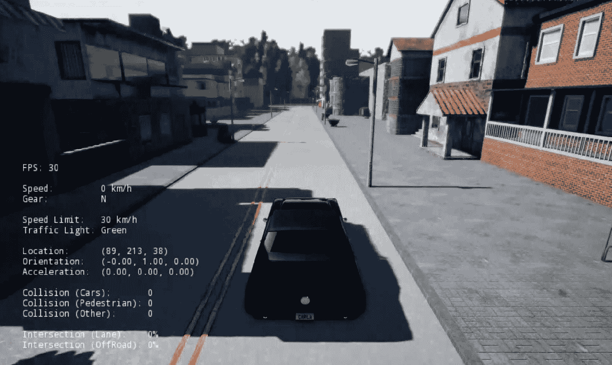
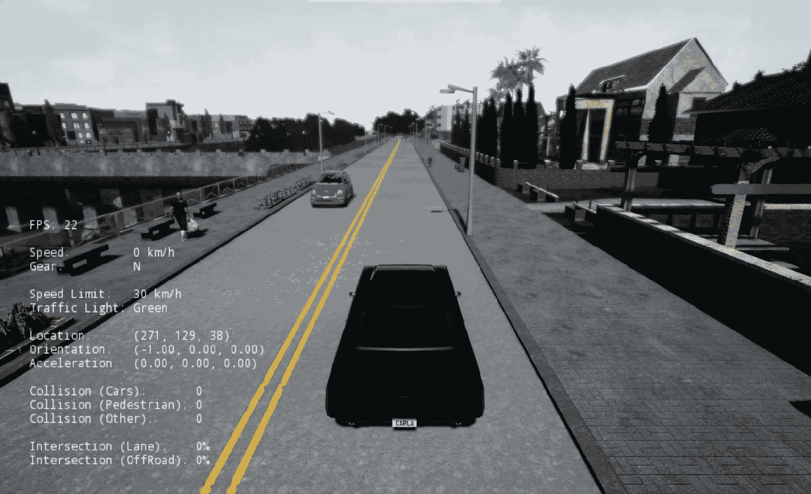
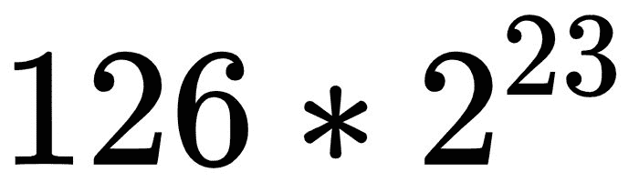
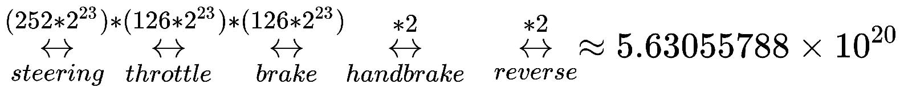
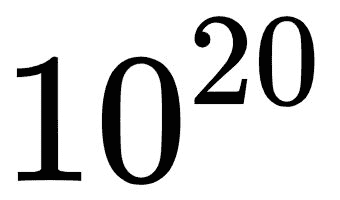
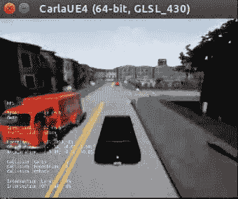
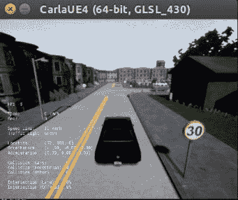
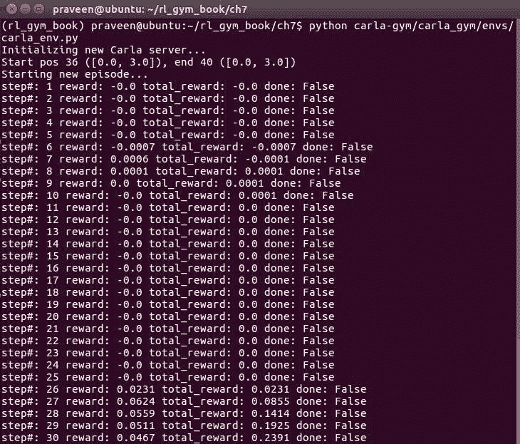
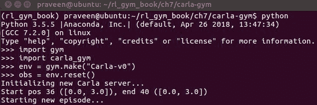

# 第七章：创建自定义 OpenAI Gym 环境 - CARLA 驾驶模拟器

在第一章中，我们查看了 OpenAI Gym 环境目录中可用的各种学习环境类别。接着，我们在第五章，*实现你的第一个学习智能体 - 解决 Mountain Car 问题*中探讨了环境列表及其命名法，并提前了解了其中的一些内容。我们还开发了智能体来解决 Mountain Car、Cart Pole 问题以及一些 Atari 游戏环境。到现在为止，你应该已经很好地理解了 OpenAI Gym 提供的各种环境类型和变种。通常，在我们学会如何开发自己的智能体之后，我们希望将这种知识和技能应用于开发智能体来解决新的问题，解决我们已经面临的问题，甚至是我们感兴趣的问题。例如，你可能是一个游戏开发者，想为游戏角色增加智能行为，或者是一个机器人工程师，想将人工智能引入到你的机器人中，或者你可能是一个自动驾驶工程师，想将强化学习应用于自动驾驶。你也许是一个喜欢修理的小工具爱好者，想将一件小工具变成一个智能的**物联网**(**IoT**)设备，或者你甚至可能是一个医疗行业的专业人士，想通过机器学习提高实验室的诊断能力。应用的潜力几乎是无限的。

我们选择 OpenAI Gym 作为我们的学习环境的原因之一，是因为它简洁而标准的接口将环境的类型和特性与环境-智能体接口解耦。在本章中，我们将探讨如何根据个人或专业需求创建你自己的环境。这将使你能够在自己的设计或问题上使用我们在前几章中开发的智能体实现、训练和测试脚本、参数管理器以及日志记录和可视化程序。

# 了解 Gym 环境的构成

任何与 Gym 兼容的环境都应该继承 `gym.Env` 类，并实现 `reset` 和 `step` 方法，以及 `observation_space` 和 `action_space` 属性和特性。还有机会实现其他可选方法，增加我们自定义环境的附加功能。下表列出了并描述了其他可用的方法：

| **方法** | **功能描述** |
| --- | --- |
| `observation_space` | 环境返回的观察值的形状和类型。 |
| `action_space` | 环境接受的动作的形状和类型。 |
| `reset()` | 用于在每个 episode 开始或结束时重置环境的常规操作。 |
| `step(...)` | 用于计算推进环境、仿真或游戏至下一步所需的信息的程序。该程序包括在环境中应用所选的动作、计算奖励、生成下一次观察，并判断回合是否结束。 |
| `_render()` | （可选）此项渲染 Gym 环境的状态或观察结果。 |
| `_close()` | （可选）此项用于关闭 Gym 环境。 |
| `_seed` | （可选）此项为 Gym 环境的随机函数提供一个自定义种子，使得环境在给定种子下能以可复现的方式运行。 |
| `_configure` | （可选）此项启用额外的环境配置。 |

# 创建自定义 Gym 环境实现的模板

基于我们已经讨论的 Gym 环境结构，我们现在将展示一个名为 `CustomEnv` 的自定义环境类实现的基本版本，它将是 `gym.Env` 的子类，并实现所需的必要方法和参数，以使其成为一个与 Gym 兼容的环境。以下是最小实现的模板：

```py
import gym

class CustomEnv(gym.Env):
    """
    A template to implement custom OpenAI Gym environments

    """

    metadata = {'render.modes': ['human']}
    def __init__(self):
        self.__version__ = "0.0.1"
        # Modify the observation space, low, high and shape values according to your custom environment's needs
        self.observation_space = gym.spaces.Box(low=0.0, high=1.0, shape=(3,))
        # Modify the action space, and dimension according to your custom environment's needs
        self.action_space = gym.spaces.Box(4)

    def step(self, action):
        """
        Runs one time-step of the environment's dynamics. The reset() method is called at the end of every episode
        :param action: The action to be executed in the environment
        :return: (observation, reward, done, info)
            observation (object):
                Observation from the environment at the current time-step
            reward (float):
                Reward from the environment due to the previous action performed
            done (bool):
                a boolean, indicating whether the episode has ended
            info (dict):
                a dictionary containing additional information about the previous action
        """
```

```py

        # Implement your step method here
        #   - Calculate reward based on the action
        #   - Calculate next observation
        #   - Set done to True if end of episode else set done to False
        #   - Optionally, set values to the info dict
        # return (observation, reward, done, info)

    def reset(self):
        """
        Reset the environment state and returns an initial observation

        Returns
        -------
        observation (object): The initial observation for the new episode after reset
        :return:
        """

        # Implement your reset method here
        # return observation

    def render(self, mode='human', close=False):
        """

        :param mode:
        :return:
        """
        return
```

在我们完成环境类的实现后，我们应当将其注册到 OpenAI Gym 注册表中，以便可以像之前使用 Gym 环境一样通过 `gym.make(ENV_NAME)` 创建环境实例。

# 注册自定义环境到 OpenAI Gym

```py
CustomEnv class we implemented is as follows:
```

```py
from gym.envs.registration import register

register(
    id='CustomEnv-v0',
    entry_point='custom_environments.envs:CustomEnv',
)
```

我们将在本章后面使用此模板来创建一个使用非常复杂的驾驶模拟器的自定义 Gym 环境。

# 创建一个与 OpenAI Gym 兼容的 CARLA 驾驶模拟环境

CARLA 是一个基于 UnrealEngine4 游戏引擎构建的驾驶模拟环境，相较于一些竞争对手，CARLA 提供了更为真实的渲染效果。你可以在其官方网站 [`carla.org`](https://carla.org) 阅读更多关于 CARLA 模拟器的信息。在本节中，我们将探讨如何创建一个与 OpenAI Gym 兼容的自定义汽车驾驶环境，以训练我们的学习代理。这个环境相当复杂，需要 GPU 支持才能运行——与我们之前见过的其他 Gym 环境不同。一旦你理解了如何为 CARLA 创建一个兼容 Gym 的自定义环境接口，你就能获得足够的信息，来为任何复杂的自定义环境开发接口。

CARLA 的最新版本是 CARLA 0.8.2。虽然大多数（如果不是全部的话）核心环境接口，尤其是`PythonClient`库，可能保持不变，但未来可能会有变更，这需要对自定义环境实现进行调整。如果发生这种情况，本书的代码库将相应更新，以支持 CARLA 的新版。在进行本章的工作时，你可能需要确保使用本书代码库中的最新版本代码（这也是订阅 GitHub 通知的另一个原因）。不过，本章讨论的自定义环境实现构建模块将普遍适用，并将指导你定义兼容 OpenAI Gym 接口的自定义环境。自定义 CARLA 环境接口的完整代码可以在本书的代码库中的`ch7/carla-gym`找到。

在我们开始一个兼容 Gym 的 CARLA 环境之前，让我们先看一下 CARLA 模拟器。因此，让我们首先下载 CARLA 发布的二进制文件。在接下来的部分，我们将使用`VER_NUM`表示版本号，因此在运行以下命令之前，请确保将`VER_NUM`文本替换为你正在使用的版本号：

1.  首先，在你的主目录中创建一个名为`software`的文件夹，可以使用以下 bash 命令：

```py
mkdir ~/software && cd ~/software
```

1.  使用官方发布页面上的链接下载 CARLA 的 Linux 二进制发布版本（[CARLA_VER_NUM.tar.gz](https://drive.google.com/open?id=1ZtVt1AqdyGxgyTm69nzuwrOYoPUn_Dsm)），该页面地址为[`github.com/carla-simulator/carla/releases/tag/VER_NUM`](https://github.com/carla-simulator/carla/releases/tag/0.8.2)。（版本 0.8.2 的直接链接是：[`drive.google.com/open?id=1ZtVt1AqdyGxgyTm69nzuwrOYoPUn_Dsm`](https://drive.google.com/open?id=1ZtVt1AqdyGxgyTm69nzuwrOYoPUn_Dsm)。）然后，将其解压到`~/software`目录下。你现在应该在`~/software/CARLA_VER_NUM`文件夹中看到一个名为`CarlaUE4.sh`的文件。

1.  使用以下命令将`CARLA_SERVER`环境变量设置为指向你计算机上的`CarlaUE4.sh`：

```py
export CARLA_SERVER=~/software/CARLA_VER_NUM/CarlaUE4.sh
```

现在你准备好测试运行 CARLA 驾驶模拟器了！只需执行`$CARLA_SERVER`，或者直接执行`~/software/CARLA_VER_NUM/CarlaUE4.sh`。对于 CARLA 0.8.2 版本，命令将是`~/software/CARLA_0.8.2/CarlaUE4.sh`。此时，你应该能看到一个 CARLA 模拟器的界面，具体如以下截图所示：



上一张截图显示的是车辆（代理）在 CARLA 的一个起始位置。下面的截图显示的是车辆在 CARLA 环境中的另一个起始位置：



一旦车辆初始化完成，你应该能够使用键盘上的*w*、*a*、*s*、*d*键来控制车辆。*w*键将使汽车向前行驶，*a*键将使汽车向左转，其他操作你大概能猜出来！

现在让我们继续，并开始实现我们的 Gym 兼容 CARLA 环境的配置和初始化。

# 配置与初始化

我们将首先定义一些特定于环境的配置参数，并简要了解场景配置。然后，我们将开始 `CarlaEnv` 类的初始化过程，该类将继承自 `Gym.Env` 类。

# 配置

首先，让我们使用字典定义环境的配置参数列表，如下所示：

```py
# Default environment configuration
ENV_CONFIG = {
    "enable_planner": True,
    "use_depth_camera": False,
    "discrete_actions": True,
    "server_map": "/Game/Maps/" + city,
    "scenarios": [scenario_config["Lane_Keep_Town2"]],
    "framestack": 2, # note: only [1, 2] currently supported
    "early_terminate_on_collision": True,
    "verbose": False,
    "render_x_res": 800,
    "render_y_res": 600,
    "x_res": 80,
    "y_res": 80
}
```

`scenario_config` 定义了若干在创建各种驾驶场景时有用的参数。场景配置描述在 `scenarios.json` 文件中，该文件可以在本书的代码库中找到，路径为 `ch7/carla-gym/carla_gym/envs/scenarios.json`。

# 初始化

在 `__init__` 方法中，我们定义了初始化参数以及动作和状态空间，正如我们在上一节中看到的那样，这些是必需的。实现非常直接，如下所示：

```py
def __init__(self, config=ENV_CONFIG):
        self.config = config
        self.city = self.config["server_map"].split("/")[-1]
        if self.config["enable_planner"]:
            self.planner = Planner(self.city)

        if config["discrete_actions"]:
            self.action_space = Discrete(len(DISCRETE_ACTIONS))
        else:
            self.action_space = Box(-1.0, 1.0, shape=(2,))
        if config["use_depth_camera"]:
            image_space = Box(
                -1.0, 1.0, shape=(
```

```py

                    config["y_res"], config["x_res"],
                    1 * config["framestack"]))
        else:
            image_space = Box(
                0.0, 255.0, shape=(
                    config["y_res"], config["x_res"],
                    3 * config["framestack"]))
        self.observation_space = Tuple(
            [image_space,
             Discrete(len(COMMANDS_ENUM)),  # next_command
             Box(-128.0, 128.0, shape=(2,))])  # forward_speed, dist to goal

        self._spec = lambda: None
        self._spec.id = "Carla-v0"

        self.server_port = None
        self.server_process = None
        self.client = None
        self.num_steps = 0
        self.total_reward = 0
        self.prev_measurement = None
        self.prev_image = None
        self.episode_id = None
        self.measurements_file = None
        self.weather = None
        self.scenario = None
        self.start_pos = None
        self.end_pos = None
        self.start_coord = None
        self.end_coord = None
        self.last_obs = None
```

# 实现 reset 方法

正如你可能已经注意到的，在每一集开始时，我们调用 Gym 环境的 `reset` 方法。对于 CARLA 环境，我们希望通过 CARLA 客户端更新 CARLA 服务器，以重新启动场景。

那么，让我们继续开始实现 `reset` 方法。

# 使用 CarlaSettings 对象自定义 CARLA 仿真

当我们开始一个新的一集时，我们希望能够配置起始状态（代理或车辆的起始位置）、目标状态（代理或车辆的预定目的地）、场景的复杂度（通过场景中的车辆或行人数量来衡量）、观测的类型和来源（配置在车辆上的传感器）等。

CARLA 项目使用服务器-客户端架构管理 UE4 环境与外部配置和控制之间的接口，因此有两个服务器。

对于 CARLA 环境，我们可以使用 `CarlaSettings` 对象或 `CarlaSettings.ini` 文件配置环境的起始状态、目标状态、复杂度级别以及传感器源。

现在，让我们创建一个 `CarlaSettings` 对象并配置一些设置，如下所示：

```py
settings = CarlaSettings()  # Initialize a CarlaSettings object with default values
settings.set(
            SynchronousMode=True,
            SendNonPlayerAgentsInfo=True,  # To receive info about all other objs
            NumberOfVehicles=self.scenario["num_vehicles"],
            NumberOfPedestrians=self.scenario["num_pedestrians"],
            WeatherId=self.weather)
SynchronousMode to True to enable the synchronous mode, in which the CARLA server halts the execution of each frame until a control message is received. Control messages are based on the actions the agent takes and are sent through the CARLA client.
```

# 向 CARLA 中的车辆添加摄像头和传感器

要在 CARLA 环境中添加 RGB 彩色摄像头，请使用以下代码：

```py
# Create a RGB Camera Object
camera1 = Camera('CameraRGB')
# Set the RGB camera image resolution in pixels
camera1.set_image_size(640, 480)
# Set the camera/sensor position relative to the car in meters
camera1.set_positions(0.25, 0, 1.30)
# Add the sensor to the Carla Settings object
settings.add_sensor(camera1)
```

你还可以使用以下代码片段添加深度测量传感器或摄像头：

```py
# Create a depth camera object that can provide us the ground-truth depth of the driving scene
camera2 = Camera("CameraDepth",PostProcessing="Depth")
# Set the depth camera image resolution in pixels
camera2.set_image_size(640, 480)
# Set the camera/sensor position relative to the car in meters
camera2.set_position(0.30, 0, 1.30)
# Add the sensor to the Carla settings object
settings.add_sensor(camera)Setting up the start and end positions in the scene for the Carla Simulation
```

要向 CARLA 环境中添加 `LIDAR`，请使用以下代码：

```py
# Create a LIDAR object. The default LIDAR supports 32 beams
lidar = Lidar('Lidar32')
# Set the LIDAR sensor's specifications
lidar.set(
    Channels=32,  # Number of beams/channels
    Range=50,     # Range of the sensor in meters
    PointsPerSecond=1000000,  # Sample rate
    RotationFrequency=10,  # Frequency of rotation
    UpperFovLimit=10,  # Vertical field of view upper limit angle
    LowerFovLimit=-30) # Vertical field of view lower limit angle
# Set the LIDAR position & rotation relative to the car in meters
lidar.set_position(0, 0, 2.5)
lidar.set_rotation(0, 0, 0)
# Add the sensor to the Carla settings object
settings.add_sensor(lidar)
```

一旦我们根据期望的驾驶仿真配置创建了一个 CARLA 设置对象，我们可以将其发送到 CARLA 服务器，以设置环境并启动仿真。

一旦我们将 CARLA 设置对象发送到 CARLA 服务器，服务器会响应一个场景描述对象，其中包含可用于自我驾驶车辆的起始位置，如下所示：

```py
scene = self.client.load_settings(settings)
available_start_spots = scene.player_start_spots
```

我们现在可以为主车或自车选择一个特定的起始位置，或者随机选择一个起始点，如以下代码片段所示：

```py
start_spot = random.randint(0, max(0, available_start_spots))
```

我们还可以将这个起始点偏好发送到服务器，并使用以下代码片段请求启动新的一集：

```py
self.client.start_episode(start_spot)
```

请注意，前一行是一个阻塞函数调用，它将在 CARLA 服务器实际启动本集之前阻塞动作。

现在，我们可以从这个起始位置开始，逐步进行，直到本集的结束。在下一节中，我们将看到我们需要实现 CARLA 环境的`step()`方法，这个方法用于逐步推进环境，直到本集结束：

```py
def _reset(self):
        self.num_steps = 0
        self.total_reward = 0
        self.prev_measurement = None
        self.prev_image = None
        self.episode_id = datetime.today().strftime("%Y-%m-%d_%H-%M-%S_%f")
        self.measurements_file = None

        # Create a CarlaSettings object. This object is a wrapper around
        # the CarlaSettings.ini file. Here we set the configuration we
        # want for the new episode.
        settings = CarlaSettings()
        # If config["scenarios"] is a single scenario, then use it if it's an array of scenarios, randomly choose one and init
        self.config = update_scenarios_parameter(self.config)

        if isinstance(self.config["scenarios"],dict):
            self.scenario = self.config["scenarios"]
        else: #ininstance array of dict
            self.scenario = random.choice(self.config["scenarios"])
        assert self.scenario["city"] == self.city, (self.scenario, self.city)
        self.weather = random.choice(self.scenario["weather_distribution"])
        settings.set(
            SynchronousMode=True,
            SendNonPlayerAgentsInfo=True,
            NumberOfVehicles=self.scenario["num_vehicles"],
            NumberOfPedestrians=self.scenario["num_pedestrians"],
            WeatherId=self.weather)
        settings.randomize_seeds()

        if self.config["use_depth_camera"]:
            camera1 = Camera("CameraDepth", PostProcessing="Depth")
            camera1.set_image_size(
                self.config["render_x_res"], self.config["render_y_res"])
            camera1.set_position(30, 0, 130)
            settings.add_sensor(camera1)

        camera2 = Camera("CameraRGB")
        camera2.set_image_size(
            self.config["render_x_res"], self.config["render_y_res"])
        camera2.set_position(30, 0, 130)
        settings.add_sensor(camera2)

        # Setup start and end positions
        scene = self.client.load_settings(settings)
        positions = scene.player_start_spots
        self.start_pos = positions[self.scenario["start_pos_id"]]
        self.end_pos = positions[self.scenario["end_pos_id"]]
        self.start_coord = [
            self.start_pos.location.x // 100, self.start_pos.location.y // 100]
        self.end_coord = [
            self.end_pos.location.x // 100, self.end_pos.location.y // 100]
        print(
            "Start pos {} ({}), end {} ({})".format(
                self.scenario["start_pos_id"], self.start_coord,
                self.scenario["end_pos_id"], self.end_coord))

        # Notify the server that we want to start the episode at the
        # player_start index. This function blocks until the server is ready
        # to start the episode.
        print("Starting new episode...")
        self.client.start_episode(self.scenario["start_pos_id"])

        image, py_measurements = self._read_observation()
        self.prev_measurement = py_measurements
        return self.encode_obs(self.preprocess_image(image), py_measurements)
```

# 为 CARLA 环境实现`step()`函数

一旦我们通过将 CARLA 设置对象发送到 CARLA 服务器并调用`client.start_episode(start_spot)`来初始化 CARLA 模拟器，驾驶模拟就会开始。然后，我们可以使用`client.read_data()`方法获取在给定步骤下模拟产生的数据。我们可以通过以下代码行来实现这一点：

```py
measurements, sensor_data = client.read_data()
```

# 访问相机或传感器数据

我们可以通过返回的`sensor_data`对象的`data`属性，在任何给定的时间步获取传感器数据。要获取 RGB 摄像头帧，请输入以下代码：

```py
rgb_image = sensor_data['CameraRGB'].data
```

`rgb_image`是一个 NumPy n 维数组，您可以像通常访问和操作 NumPy n 维数组一样访问和操作它。

例如，要访问 RGB 摄像头图像在(*x*, *y*)图像平面坐标处的像素值，可以使用以下代码行：

```py
pixel_value_at_x_y = rgb_image[X, Y]
```

要获取深度摄像头帧，请输入以下代码：

```py
depth_image = sensor_data['CameraDepth'].data
```

# 发送动作以控制 CARLA 中的代理

我们可以通过向 CARLA 服务器发送所需的转向、油门、刹车、手刹和倒车（档）命令，来控制 CARLA 中的汽车。下表展示了汽车在 CARLA 中将遵循的命令的值、范围和描述：

| **命令/动作名称** | **值类型，范围** | **描述** |
| --- | --- | --- |
| 转向 | `Float`，[-1.0，+1.0] | 标准化转向角度 |
| 油门 | `Float`，[0.0，1.0] | 标准化油门输入 |
| 刹车 | `Float`，[0.0，1.0] | 标准化刹车输入 |
| 手刹 | `Boolean`，真/假 | 这告诉汽车是否启用手刹（`True`）或不启用（`False`） |
| 倒车 | `Boolean`，真/假 | 这告诉汽车是否处于倒档（`True`）或不是（`False`） |

如 CARLA 文档中所述，实际的转向角度将取决于车辆。例如，默认的 Mustang 车辆的最大转向角度为 70 度，这在车辆的前轮 UE4 蓝图文件中有所定义。这些是控制 CARLA 中车辆所需的五个不同命令。在这五个命令中，三者（转向、油门和刹车）是实值浮动点数。尽管它们的范围限制在-1 到+1 或 0 到 1 之间，但可能的（唯一）数值组合却是庞大的。例如，如果我们使用单精度浮动点表示油门值，该值位于 0 到 1 之间，那么总共有种可能的不同值，这意味着油门命令有 1,056,964,608 种不同的可能值。刹车命令也是如此，因为它的值也位于 0 到 1 之间。转向命令的可能浮动值大约是其余两个命令的两倍，因为它位于-1 到+1 之间。由于单个控制消息由五个命令中每个命令的一个值组成，因此不同动作（或控制消息）的数量是每个命令唯一值的乘积，其大致顺序如下：



如你所见，这会生成一个巨大的动作空间，这可能对于一个深度学习代理来说是一个非常困难的问题，因为它需要回归到这样一个巨大的动作空间。因此，让我们简化动作空间，定义两种不同的动作空间——一种是连续空间，另一种是离散空间，这对于应用不同的强化学习算法很有用。例如，基于深度 Q 学习的算法（没有自然化优势函数）只能在离散动作空间中工作。

# CARLA 中的连续动作空间

在驾驶过程中，我们通常不会同时加速和刹车；因为 CARLA 中的动作空间是连续的，而且代理将在每一步执行一个动作，所以可能只需要一个命令来同时处理加速和减速。现在，我们将油门和刹车命令合并为一个命令，其值范围从-1 到+1，其中-1 到 0 的范围用于刹车命令，0 到 1 的范围用于油门或加速命令。我们可以使用以下命令来定义它：

```py
action_space = gym.space.Box(-1.0, 1.0, shape=2(,))
```

`action[0]`代表转向命令，`action[1]`代表我们合并的油门和刹车命令的值。目前，我们将`hand_brake`和`reverse`都设为 False。接下来，我们将查看如何定义一个离散的动作空间，以便选择我们希望代理执行的动作。

# CARLA 中的离散动作空间

我们已经看到完整的动作空间非常大（大约是 ）。你可能玩过那种只需要使用四个方向键或游戏手柄来控制速度和车头方向（汽车指向的方向）的游戏，那么为什么我们不能要求代理以类似的方式来控制汽车呢？好吧，这就是离散化动作空间的想法。虽然我们无法对汽车进行精确控制，但我们可以确保离散化后的空间能在模拟环境中提供良好的控制。

让我们从使用与连续动作空间情况类似的约定开始——在连续动作空间中，我们使用一个浮点值来表示油门（加速）和刹车（减速）动作，从而在内部使用二维有界空间。这意味着在这种情况下，动作空间可以定义如下：

```py
action_space = gym.spaces.Discrete(NUM_DISCRETE_ACTIONS)
```

如你所见，`NUM_DISCRETE_ACTONS` 等于可用动作的数量，我们将在本节稍后定义。

然后，我们将使用二维有界空间对该空间进行离散化，并将其作为离散动作空间暴露给代理。为了在保持控制车辆的同时最小化可能的动作数量，我们使用以下动作列表：

| **动作索引** | **动作描述** | **动作数组值** |
| --- | --- | --- |
| 0 | 滑行 | [0.0, 0.0] |
| 1 | 向左转 | [0.0, -0.5] |
| 2 | 向右转 | [0.0, 0.5] |
| 3 | 向前 | [1.0, 0.0] |
| 4 | 刹车 | [-0.5, 0.0] |
| 5 | 左转并加速 | [1.0, -0.5] |
| 6 | 向右转并加速 | [1.0, 0.5] |
| 7 | 向左转并减速 | [-0.5, -0.5] |
| 8 | 向右转并减速 | [-0.5, 0.5] |

现在，让我们在 `carla_env` 实现脚本中定义前述的离散动作集合，并展示如下：

```py
DISCRETE_ACTIONS = {
    0: [0.0, 0.0],    # Coast
    1: [0.0, -0.5],   # Turn Left 
    2: [0.0, 0.5],    # Turn Right
    3: [1.0, 0.0],    # Forward
    4: [-0.5, 0.0],   # Brake
    5: [1.0, -0.5],   # Bear Left & accelerate
    6: [1.0, 0.5],    # Bear Right & accelerate
    7: [-0.5, -0.5],  # Bear Left & decelerate
    8: [-0.5, 0.5],   # Bear Right & decelerate
}
```

# 向 CARLA 模拟服务器发送动作

现在我们已经定义了 CARLA Gym 环境的动作空间，我们可以查看如何将我们定义的连续或离散动作转换为 CARLA 模拟服务器接受的值。

由于我们在连续和离散动作空间中都遵循了相同的二维有界动作值约定，我们可以使用以下代码片段将动作转换为转向、油门和刹车命令：

```py
throttle = float(np.clip(action[0], 0, 1)
brake = float(np.abs(np.cllip(action[0], -1, 0)
steer = float(p.clip(action[1], -1, 1)
hand_brake = False
reverse = False
```

如你所见，这里 `action[0]` 表示油门和刹车，而 `action[1]` 表示转向角度。

我们将利用 CARLA `PythonClient` 库中 `CarlaClient` 类的实现来处理与 CARLA 服务器的通信。如果你想了解如何使用协议缓冲区处理与服务器的通信，可以查看 `ch7/carla-gym/carla_gym/envs/carla/client.py` 中 `CarlaClient` 类的实现。

要在 CARLA 环境中实现奖励函数，请输入以下代码：

```py
def calculate_reward(self, current_measurement):
        """
        Calculate the reward based on the effect of the action taken using the previous and the current measurements
        :param current_measurement: The measurement obtained from the Carla engine after executing the current action
        :return: The scalar reward
        """
        reward = 0.0

        cur_dist = current_measurement["distance_to_goal"]

        prev_dist = self.prev_measurement["distance_to_goal"]

        if env.config["verbose"]:
            print("Cur dist {}, prev dist {}".format(cur_dist, prev_dist))

        # Distance travelled toward the goal in m
        reward += np.clip(prev_dist - cur_dist, -10.0, 10.0)

        # Change in speed (km/hr)
        reward += 0.05 * (current_measurement["forward_speed"] - self.prev_measurement["forward_speed"])

        # New collision damage
        reward -= .00002 * (
            current_measurement["collision_vehicles"] + current_measurement["collision_pedestrians"] +
            current_measurement["collision_other"] - self.prev_measurement["collision_vehicles"] -
            self.prev_measurement["collision_pedestrians"] - self.prev_measurement["collision_other"])

        # New sidewalk intersection
        reward -= 2 * (
            current_measurement["intersection_offroad"] - self.prev_measurement["intersection_offroad"])

        # New opposite lane intersection
        reward -= 2 * (
            current_measurement["intersection_otherlane"] - self.prev_measurement["intersection_otherlane"])

        return reward
```

# 确定 CARLA 环境中剧集的结束条件

我们已经实现了`meta hod`来计算奖励，并定义了允许的动作、观察和自定义 CARLA 环境的重置方法。根据我们的自定义 Gym 环境创建模板，这些是我们需要实现的必要方法，用于创建与 OpenAI Gym 接口兼容的自定义环境。

虽然这是真的，但还有一件事需要我们处理，以便代理能够持续与我们的环境交互。记得我们在第五章中开发 Q-learning 代理时，*实现你的第一个学习代理——解决山地车问题*，针对山地车环境，环境在 200 步后会自动重置？或者在杠杆杆环境中，当杆子低于某个阈值时环境会重置？再比如在 Atari 游戏中，当代理失去最后一条命时，环境会自动重置？是的，我们需要关注决定何时重置环境的例程，目前我们在自定义 CARLA Gym 环境实现中缺少这一部分。

尽管我们可以选择任何标准来重置 CARLA Gym 环境，但有三点需要考虑，如下所示：

+   当主机或代理控制的自驾车与其他车辆、行人、建筑物或路边物体发生碰撞时，这可能是致命的（类似于 Atari 游戏中失去生命的情况）

+   当主机或自驾车达到目的地或终点目标时

+   当超出时间限制时（类似于我们在山地车 Gym 环境中的 200 时间步限制）

我们可以使用这些条件来形成决定一集结束的标准。确定`.step(...)`返回的`done`变量值的伪代码如下（完整代码可以在书籍的代码仓库`ch7/carla-gym/carla_gym/envs/`中找到）：

```py
# 1\. Check if a collision has occured
m = measurements_from_carla_server
collided = m["collision_vehicles"] > 0 or m["collision_pedestrians"] > 0 or m["collision_other"] > 0

# 2\. Check if the ego/host car has reached the destination/goal
planner = carla_planner
goal_reached = planner["next_command"] == "REACHED_GOAL"

# 3\. Check if the time-limit has been exceeded
time_limit = scenario_max_steps_config
time_limit_exceeded = num_steps > time_limit

# Set "done" to True if either of the above 3 criteria becomes true
done = collided or goal_reached or time_limit_exceeded
```

我们现在已经完成了创建基于 CARLA 驾驶模拟器的自定义 Gym 兼容环境所需的所有组件！在接下来的部分中，我们将测试这个环境，并最终看到它的实际效果。

# 测试 CARLA Gym 环境

为了方便测试我们环境实现的基础部分，我们将实现一个简单的`main()`例程，这样我们就可以像运行脚本一样运行环境。这将帮助我们验证基本接口是否已正确设置，以及环境的实际表现如何！

```py
CarlaEnv and runs five episodes with a fixed action of going forward. The ENV_CONFIG action, which we created during initialization, can be changed to use discrete or continuous action spaces, as follows:
```

```py
# Part of https://github.com/PacktPublishing/Hands-On-Intelligent-Agents-with-OpenAI-Gym/ch7/carla-gym/carla_gym/envs/carla_env.py
if __name__ == "__main__":
    for _ in range(5):
        env = CarlaEnv()
        obs = env.reset()
        done = False
        t = 0
        total_reward = 0.0
        while not done:
            t += 1
            if ENV_CONFIG["discrete_actions"]:
                obs, reward, done, info = env.step(3) # Go Forward
            else:
                obs, reward, done, info = env.step([1.0, 0.0]) # Full throttle, zero steering angle
            total_reward += reward
            print("step#:", t, "reward:", round(reward, 4), "total_reward:", round(total_reward, 4), "done:", done)
```

现在，开始测试我们刚刚创建的环境吧！请记住，CARLA 需要 GPU 才能平稳运行，并且系统环境变量`CARLA_SERVER`需要定义，并指向你系统中的`CarlaUE4.sh`文件。一旦准备好，你可以通过在`rl_gym_book` conda 环境中运行以下命令来测试我们创建的环境：

```py
(rl_gym_book) praveen@ubuntu:~/rl_gym_book/ch7$ python carla-gym/carla_gym/envs/carla_env.py
```

上述命令应该会打开一个小的 CARLA 模拟器窗口，并初始化在 `carla_env.py` 脚本中使用的场景配置。这应该类似于以下截图：

  

如你所见，默认情况下，车辆被脚本设置为直行。请注意，`carla_env.py` 脚本还会产生控制台输出，显示当前环境中的时间步、计算的瞬时奖励、该回合的总奖励以及 `done`（True 或 False）的值，这些对测试我们的环境非常有用。当车辆开始前进时，你应该看到奖励值在增加！

控制台输出如下：



现在，你的自定义 CARLA Gym 环境已经运行了！你可以使用 `ch7/carla-gym/carla_gym/envs/scenarios.json` 文件中的定义创建多个不同的驾驶场景。然后，你可以为这些场景创建新的自定义 CARLA 环境，注册后可以使用常见的 `gym.make(...)` 命令来使用它们，例如 `gym.make("Carla-v0")`。

本书代码库中的代码负责通过我们之前在本章讨论的方法进行环境注册，并将其注册到 OpenAI Gym 注册表中。现在，你可以使用 OpenAI Gym 创建我们构建的自定义环境的实例。

以下截图展示了你可以用来测试自定义 Gym 环境的 Python 命令：



就是这样！其余部分和其他 Gym 环境类似。

# 总结

在本章中，我们逐步讲解了自定义 Gym 环境的实现，从一个模板开始，搭建了一个 OpenAI Gym 环境的基本结构，并提供了所有必要的接口供智能体使用。我们还探讨了如何在 Gym 注册表中注册自定义环境实现，使得我们可以使用熟悉的 `gym.make(ENV_NAME)` 命令来创建现有环境的实例。接着，我们学习了如何为基于开源驾驶模拟器 CARLA 的 UnrealEngine 创建一个与 Gym 兼容的环境实现。然后，我们快速走过了安装和运行 CARLA 所需的步骤，并开始逐步实现 `CarlaEnv` 类，详细涵盖了实现与 OpenAI Gym 兼容的自定义环境所涉及的重要细节。

在下一章，我们将从零开始构建一个高级智能体，通过实践示例，最终使用我们在本章创建的自定义 CARLA 环境来训练一个可以独立驾驶汽车的智能体！
