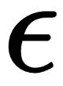
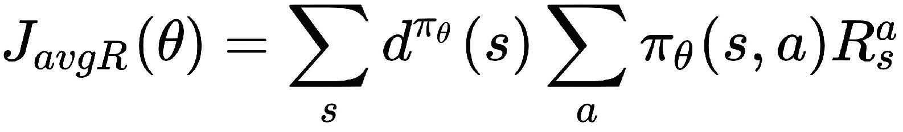
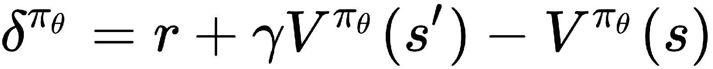
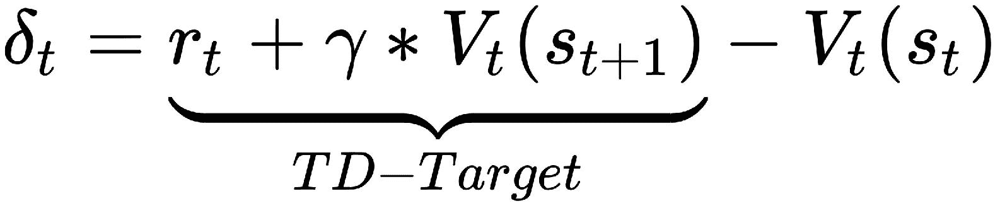
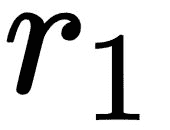
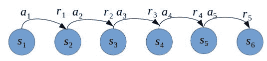
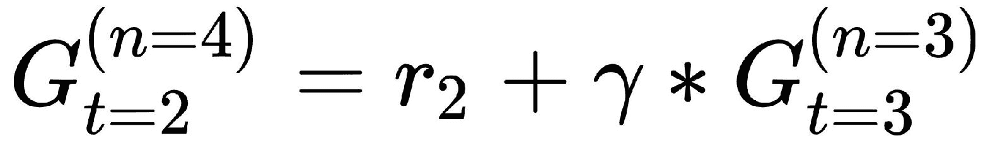

# 第八章：使用深度演员-评论家算法实现智能-自动驾驶汽车代理

在第六章，*实现一个用于最优控制的智能代理，使用深度 Q 学习*，我们实现了使用深度 Q 学习的代理来解决涉及离散动作或决策的问题。我们看到它们如何被训练来玩视频游戏，比如 Atari 游戏，就像我们一样：看着游戏屏幕并按下游戏手柄/摇杆上的按钮。我们可以使用这样的代理在给定有限的选择集的情况下，做出最佳选择、做决策或执行动作，其中可能的决策或动作数量是有限的，通常较少。有许多现实世界的问题可以通过能够学习执行最优离散动作的代理来解决。我们在第六章中看到了些例子，*实现一个用于最优离散控制的智能代理，使用深度 Q 学习*。

在现实世界中，还有其他类别的问题和任务要求执行的动作是低级的，并且是连续值而不是离散的。例如，一个智能温控系统或恒温器需要能够对内部控制电路进行精细调整，以维持房间的指定温度。控制动作信号可能包括一个连续值的实数（例如*1.456*）来控制**供暖、通风和空调**（**HVAC**）系统。再考虑一个例子，我们希望开发一个智能代理来自动驾驶汽车。人类驾驶汽车时，通过换挡、踩油门或刹车踏板以及转向来操控汽车。虽然当前的档位是五到六个值中的一个，取决于汽车的变速系统，但如果一个智能软件代理必须执行所有这些动作，它必须能够为油门（加速器）、刹车（刹车）和转向产生连续值的实数。

在像这些例子中，当我们需要代理执行连续值的动作时，我们可以使用基于策略梯度的演员-评论家方法来直接学习和更新代理的策略，而不是像在第六章中看到的深度 Q 学习代理那样通过状态和/或动作值函数来进行学习，*实现一个用于最优离散控制的智能代理，使用深度 Q 学习*。在本章中，我们将从演员-评论家算法的基础开始，逐步构建我们的代理，同时训练它使用 OpenAI Gym 环境解决各种经典的控制问题。我们将把代理构建到能够在 CARLA 驾驶模拟环境中驾驶汽车，使用我们在上一章中实现的自定义 Gym 接口。

# 深度 n 步优势演员-评论者算法

在我们基于深度 Q 学习的智能代理实现中，我们使用深度神经网络作为函数逼近器来表示动作值函数。然后代理根据值函数提出策略。特别地，我们在实现中使用了 -贪婪算法。因此，我们理解最终代理必须知道在给定观测/状态时采取什么行动是好的。而不是对状态/行动函数进行参数化或逼近，然后根据该函数导出策略，我们可以直接参数化策略吗？是可以的！这正是策略梯度方法的精确思想。

在接下来的小节中，我们将简要介绍基于策略梯度的学习方法，然后转向结合价值和基于策略的学习的演员-评论者方法。然后，我们将看一些扩展到演员-评论者方法，已被证明能提高学习性能的方法。

# 策略梯度

在基于策略梯度的方法中，策略可以通过使用带参数的神经网络表示，例如 ，目标是找到最佳参数集 。这可以直观地看作是一个优化问题，我们试图优化策略的目标，以找到表现最佳的策略。代理策略的目标是什么？我们知道，代理应该在长期内获得最大的奖励，以完成任务或实现目标。如果我们能数学化地表述这个目标，我们可以使用优化技术找到最佳策略，供代理根据给定任务遵循。

我们知道状态值函数  告诉我们从状态  开始，按照策略  直到本集结束的预期回报。它告诉我们身处状态  有多好。因此，一个良好的策略在环境中起始状态的值应较高，因为它代表了在该状态下执行策略  直至本集结束时的预期/平均/总体价值。起始状态值越高，遵循策略的代理可以获得的总长期奖励也越高。因此，在一个情节性环境中——环境即一个情节，即具有终端状态——我们可以根据起始状态的值来衡量策略的优劣。数学上，这样的目标函数可以写成如下形式：


但如果环境不是序列性的呢？这意味着它没有终止状态，并且一直持续下去。在这种环境中，我们可以使用遵循当前策略时所访问的状态的平均值 。从数学角度来看，平均值目标函数可以表示为以下形式：


这里， 是  对应的马尔可夫链的平稳分布，表示遵循策略  时访问状态  的概率。

我们还可以使用在这种环境中每个时间步获得的平均奖励，这可以通过以下方程式在数学上表示：



这本质上是当智能体根据策略  采取行动时可以获得的奖励的期望值，可以简写为如下形式：


为了使用梯度下降法优化此策略目标函数，我们将对方程关于  进行求导，找到梯度，进行反向传播，并执行梯度下降步骤。从之前的方程中，我们可以写出如下公式：


让我们通过展开项并进一步简化，求解前面方程对  的导数。按照以下方程从左到右的顺序，理解得出结果所涉及的一系列步骤：


为了理解这些方程以及如何将策略梯度  等同于似然比 ，我们先回顾一下我们的目标是什么。我们的目标是找到策略的最优参数集 ，使得遵循该策略的智能体能够在期望中获得最大奖励（即平均奖励）。为了实现这个目标，我们从一组参数开始，然后不断更新这些参数，直到我们达到最优参数集。为了确定在参数空间中需要更新哪些方向，我们利用策略  对参数  的梯度指示的方向。我们先从前面方程中的第二项 （这是第一项  按定义得到的结果）开始：

 是在策略  下，采取动作  在状态  中获得的步长奖励的期望值的梯度。根据期望值的定义，可以将其写成如下的和式：


我们将研究似然比技巧，在此上下文中用于将该方程转化为一种使计算可行的形式。

# 似然比技巧

由  表示的策略假设在其非零时为可微分函数，但计算策略相对于 theta 的梯度， ，可能并不直接。我们可以在两边同时乘以和除以策略 ，得到以下公式：


从微积分中，我们知道函数的对数的梯度是该函数相对于其本身的梯度，数学表达式如下：


因此，我们可以将策略相对于其参数的梯度写成以下形式：


这在机器学习中被称为似然比技巧，或对数导数技巧。

# 策略梯度定理

由于策略  是一个概率分布函数，它描述了给定状态和参数  下的动作概率分布，根据定义，跨状态和动作的双重求和项可以表示为通过奖励  在分布  上的得分函数的期望值。这在数学上等价于以下公式：


请注意，在前面的方程中，  是采取行动  从状态  获得的步奖励。

策略梯度定理通过用长期行动值  替换即时步奖励 ，对这种方法进行了推广，可以写成如下形式：


这个结果非常有用，并且形成了多个策略梯度方法变体的基础。

通过对策略梯度的理解，我们将在接下来的几节中深入探讨演员-评论员算法及其变体。

# 演员-评论员算法

让我们从演员-评论员架构的图示表示开始，如下图所示：


如名称和前面的图示所示，演员-评论员算法有两个组成部分。演员负责在环境中执行动作，即根据对环境的观察并根据代理的策略采取行动。演员可以被视为策略的持有者/制定者。另一方面，评论员负责估计状态值、状态-动作值或优势值函数（取决于所使用的演员-评论员算法的变体）。让我们考虑一个例子，其中评论员试图估计动作值函数 。如果我们使用一组参数 *w* 来表示评论员的参数，评论员的估计值可以基本写成：


将真实的动作值函数替换为评论家对动作值函数的近似（在策略梯度定理部分的最后一个方程），从上一节的策略梯度定理结果中得到以下近似的策略梯度：


实际操作中，我们进一步通过使用随机梯度上升（或者带负号的下降）来逼近期望值。

# 优势演员-评论家算法

动作值演员-评论家算法仍然具有较高的方差。我们可以通过从策略梯度中减去基准函数 *B(s)*来减少方差。一个好的基准是状态值函数， 。使用状态值函数作为基准，我们可以将策略梯度定理的结果重写为以下形式：


我们可以定义优势函数 为以下形式：


当与基准一起用于前述的策略梯度方程时，这将给出演员-评论家策略梯度的优势：


回顾前几章，值函数的 1 步时序差分（TD）误差 给出如下：



如果我们计算这个 TD 误差的期望值，我们将得到一个方程，它类似于我们在第二章中看到的动作值函数的定义，*强化学习与深度强化学习*。从这个结果中，我们可以观察到，TD 误差实际上是优势函数的无偏估计，正如从左到右推导出的这个方程所示：


有了这个结果和本章迄今为止的方程组，我们已经具备了足够的理论基础，可以开始实现我们的代理！在进入代码之前，让我们先理解算法的流程，以便在脑海中对其有一个清晰的图像。

最简单的（一般/基础）优势演员-评论家算法包括以下步骤：

1.  初始化（随机）策略和价值函数估计。

1.  对于给定的观察/状态 ，执行当前策略 规定的动作 。

1.  基于得到的状态 和通过 1 步 TD 学习方程获得的奖励 ，计算 TD 误差：

1.  通过根据 TD 误差调整状态的动作概率来更新演员！[](img/00227.jpeg)：

    +   如果  > 0，增加采取动作 的概率，因为 是一个好的决策，并且效果很好

    +   如果  < 0，则减少采取动作 的概率，因为 导致了代理的表现不佳

1.  通过调整其对的估计值，使用 TD 误差更新评论员：

    +   ，其中是评论员的学习率

1.  将下一个状态设置为当前状态，并重复步骤 2。

# n 步优势演员-评论员算法

在优势演员-评论员算法部分，我们查看了实现该算法的步骤。在第 3 步中，我们注意到需要基于 1 步回报（TD 目标）计算 TD 误差。这就像让智能体在环境中迈出一步，然后根据结果计算评论员估计值的误差，并更新智能体的策略。这听起来直接且简单，对吧？但是，是否有更好的方法来学习和更新策略呢？正如你从本节标题中可能猜到的那样，思路是使用 n 步回报，与基于 1 步回报的 TD 学习相比，n 步回报使用了更多的信息来学习和更新策略。n 步 TD 学习可以看作是一个广义版本，而在前一节中讨论的演员-评论员算法中使用的 1 步 TD 学习是 n 步 TD 学习算法的特例，n=1。我们来看一个简短的示例，以理解 n 步回报的计算，然后实现一个 Python 方法来计算 n 步回报，我们将在智能体实现中使用它。

# n 步回报

n 步回报是一个简单但非常有用的概念，已知能够为多种强化学习算法提供更好的性能，不仅仅是优势演员-评论员算法。例如，目前在*57*款游戏的 Atari 套件上表现最好的算法，显著超越第二名的算法，便使用了 n 步回报。我们实际上会在第十章中讨论这个智能体算法，名为 Rainbow，*探索学习环境的景观：Roboschool, Gym-Retro, StarCraft-II, DMLab*。

首先，我们需要对 n 步回报过程有一个直观的理解。我们使用以下图示来说明环境中的一步。假设智能体在时间 t=1 时处于状态，并决定采取动作，这导致环境在时间 t=t+1=1+1=2 时过渡到状态，同时智能体获得奖励：


我们可以使用以下公式计算 1 步 TD 回报：


这里，是根据价值函数（评论员）对状态的价值估计。实质上，智能体采取一步，并利用所接收到的回报以及智能体对下一个/结果状态的价值估计的折扣值来计算回报。

如果我们让智能体继续与环境交互更多的步数，智能体的轨迹可以用以下简化的图示表示：



该图展示了智能体与环境之间的 5 步交互。采用与前一段中 1 步回报计算类似的方法，我们可以使用以下公式计算 5 步回报：


然后，我们可以在优势演员-评论员算法的步骤 3 中使用此作为 TD 目标，以提高智能体的性能。

你可以通过在任意 Gym 环境中运行 `ch8/a2c_agent.py` 脚本，设置`parameters.json`文件中的`learning_step_thresh`参数为 1（用于 1 步回报）和 5 或 10（用于 n 步回报），来比较具有 1 步回报和 n 步回报的优势演员-评论员智能体的性能。

例如，你可以运行

`(rl_gym_book) praveen@ubuntu:~/HOIAWOG/ch8$python a2c_agent.py --env Pendulum-v0` 使用`learning_step_thresh=1`，通过以下命令使用 Tensorboard 监控其性能

`(rl_gym_book) praveen@ubuntu:~/HOIAWOG/ch8/logs$tensorboard --logdir=.`, 然后在大约一百万步后，你可以比较使用`learning_step_thresh=10`训练的智能体的性能。请注意，训练后的智能体模型将保存在`~/HOIAWOG/ch8/trained_models/A2_Pendulum-v0.ptm`。你可以在开始第二次运行之前重命名它或将其移动到不同的目录，以便从头开始训练！

为了使概念更加明确，让我们讨论如何在步骤 3 中以及在优势演员-评论员算法中使用它。我们将首先使用 n 步回报作为 TD 目标，并使用以下公式计算 TD 误差（算法的步骤 3）：


然后，我们将按照前一小节中讨论的算法步骤 4 更新评论员。接着，在步骤 5 中，我们将使用以下更新规则来更新评论员：


然后，我们将继续进行算法的步骤 6，使用来自的 5 步过渡，直到，并计算 5 步回报，然后重复更新的过程。

# 实现 n 步回报计算

如果我们暂停片刻并分析一下发生了什么，你可能会发现我们可能没有充分利用这条 5 步长的轨迹。从状态 开始的代理 5 步长轨迹提供了信息，但我们最终只学到了一个新信息，这仅仅是关于 来更新演员和评论员（）。其实，我们可以通过使用相同的 5 步轨迹来计算轨迹中每个状态值的更新，并根据轨迹结束的 *n* 值使学习过程更加高效。例如，在一个简化的轨迹表示中，如果我们考虑状态 ，并将轨迹的前视部分包含在气泡中，如下图所示：


我们可以使用气泡中的信息来提取状态 的 TD 学习目标。在这种情况下，由于从 处只能获得一步信息，我们将计算 1 步回报，如下方程所示：


如我们之前讨论过的，我们可以使用该值作为方程中的 TD 目标，以获得另一个 TD 误差值，并利用第二个值来更新演员和 ，以及之前的更新（）。现在，我们又为代理提供了一个新的学习信息！

如果我们应用相同的直觉，考虑状态 ，并将轨迹的前视部分包含在气泡中，如下图所示：


我们可以使用气泡中的信息来提取 的 TD 学习目标。在这种情况下，从 获得了两种信息，因此我们将使用以下方程计算 2 步回报：


如果我们看一下这个方程和前一个方程，我们可以观察到  和 之间的关系，公式如下所示：


这为代理提供了另一个学习的信息。同样，我们可以从这条轨迹中提取更多的信息。将相同的概念扩展到  和 ，我们可以得到以下关系：


同样，简而言之，我们可以观察到以下内容：



最后，我们还可以观察到以下内容：


简而言之，我们可以从轨迹中的最后一步开始，计算 n 步回报直到轨迹结束，然后回到上一部来使用之前计算的值计算回报。

实现过程直接且简单，建议自己尝试实现。这些内容提供如下，供参考：

```py
def calculate_n_step_return(self, n_step_rewards, final_state, done, gamma):
        """
        Calculates the n-step return for each state in the input-trajectory/n_step_transitions
        :param n_step_rewards: List of rewards for each step
        :param final_state: Final state in this n_step_transition/trajectory
        :param done: True rf the final state is a terminal state if not, False
        :return: The n-step return for each state in the n_step_transitions
        """
        g_t_n_s = list()
        with torch.no_grad():
            g_t_n = torch.tensor([[0]]).float() if done else self.critic(self.preproc_obs(final_state)).cpu()
            for r_t in n_step_rewards[::-1]: # Reverse order; From r_tpn to r_t
                g_t_n = torch.tensor(r_t).float() + self.gamma * g_t_n
                g_t_n_s.insert(0, g_t_n) # n-step returns inserted to the left to maintain correct index order
            return g_t_n_s
```

# 深度 n 步优势演员-评论家算法

我们观察到演员-评论家算法结合了基于价值的方法和基于策略的方法。评论家估计价值函数，演员遵循策略，我们研究了如何更新演员和评论家。通过我们在第六章中，*使用深度 Q 学习实现最优离散控制的智能代理*的经验，我们自然产生了使用神经网络来逼近价值函数，从而代替评论家的想法。我们还可以使用神经网络来表示策略！[](img/00278.jpeg)，在这种情况下，参数！[](img/00279.jpeg)是神经网络的权重。使用深度神经网络来逼近演员和评论家的方法，正是深度演员-评论家算法的核心思想。

# 实现深度 n 步优势演员评论家代理

我们已经准备好所有实现深度 n 步优势演员-评论家(A2C)代理所需的背景信息。让我们先看看代理实现过程的概述，然后直接进入实际的实现过程。

以下是我们 A2C 代理的高级流程：

1.  初始化演员和评论家的网络。

1.  使用演员的当前策略从环境中收集 n 步经验并计算 n 步回报。

1.  计算演员和评论家的损失。

1.  执行随机梯度下降优化步骤以更新演员和评论家的参数。

1.  从第 2 步开始重复。

我们将在一个名为`DeepActorCriticAgent`的 Python 类中实现该代理。你可以在本书的代码仓库中的第八章找到完整的实现：`ch8/a2c_agent.py`。我们将使该实现具有灵活性，以便我们可以轻松扩展它，进一步实现批处理版本，并且还可以实现异步版本的 n 步优势演员-评论家代理。

# 初始化演员和评论家的网络

`DeepActorCriticAgent`类的初始化很直接。我们将快速浏览它，然后查看我们如何实际定义和初始化演员和评论家的网络。

代理的初始化函数如下所示：

```py
class DeepActorCriticAgent(mp.Process):
    def __init__(self, id, env_name, agent_params):
        """
        An Advantage Actor-Critic Agent that uses a Deep Neural Network to represent it's Policy and the Value function
        :param id: An integer ID to identify the agent in case there are multiple agent instances
        :param env_name: Name/ID of the environment
        :param agent_params: Parameters to be used by the agent
        """
        super(DeepActorCriticAgent, self).__init__()
        self.id = id
        self.actor_name = "actor" + str(self.id)
        self.env_name = env_name
        self.params = agent_params
        self.policy = self.multi_variate_gaussian_policy
        self.gamma = self.params['gamma']
        self.trajectory = [] # Contains the trajectory of the agent as a sequence of Transitions
        self.rewards = [] # Contains the rewards obtained from the env at every step
        self.global_step_num = 0
        self.best_mean_reward = - float("inf") # Agent's personal best mean episode reward
        self.best_reward = - float("inf")
        self.saved_params = False # Whether or not the params have been saved along with the model to model_dir
        self.continuous_action_space = True #Assumption by default unless env.action_space is Discrete
```

你可能会想知道为什么`agent`类继承自`multiprocessing.Process`类。虽然在我们的第一个代理实现中，我们将一个代理运行在一个进程中，但我们可以利用这个灵活的接口，启用并行运行多个代理，从而加速学习过程。

接下来我们将介绍使用 PyTorch 操作定义的神经网络实现的演员和评论员。按照与我们在第六章的深度 Q 学习智能体相似的代码结构，*使用深度 Q 学习实现最优离散控制的智能体*，在代码库中你会看到我们使用一个名为`function_approximator`的模块来包含我们的基于神经网络的函数逼近器实现。你可以在本书代码库中的`ch8/function_approximator`文件夹下找到完整的实现。

由于一些环境具有较小且离散的状态空间，例如`Pendulum-v0`、`MountainCar-v0`或`CartPole-v0`环境，我们还将实现浅层版本的神经网络，并与深层版本一同使用，以便根据智能体训练/测试所用的环境动态选择合适的神经网络。当你查看演员的神经网络示例实现时，你会注意到在`shallow`和`deep`函数逼近器模块中都有一个名为`Actor`的类和一个不同的类叫做`DiscreteActor`。这是为了通用性，方便我们根据环境的动作空间是连续的还是离散的，让智能体动态选择和使用最适合表示演员的神经网络。为了实现智能体的完整性和通用性，你还需要了解另外一个变体：我们实现中的`shallow`和`deep`函数逼近器模块都有一个`ActorCritic`类，它是一个单一的神经网络架构，既表示演员又表示评论员。这样，特征提取层在演员和评论员之间共享，神经网络中的不同头（最终层）用于表示演员和评论员。

有时，实现的不同部分可能会令人困惑。为了帮助避免困惑，以下是我们基于神经网络的演员-评论员实现中各种选项的总结：

| **模块/类** | **描述** | **目的/用例** |  |
| --- | --- | --- | --- |
| 1\. `function_approximator.shallow` | 用于演员-评论员表示的浅层神经网络实现。 | 具有低维状态/观察空间的环境。 |  |
| 1.1 `function_approximator.shallow.Actor` | 前馈神经网络实现，输出两个连续值：mu（均值）和 sigma（标准差），用于基于高斯分布的策略表示。 | 低维状态/观察空间和连续动作空间。 |  |
| 1.2 `function_approximator.shallow.DiscreteActor` | 前馈神经网络，为动作空间中的每个动作输出一个 logit。 | 低维状态/观察空间和离散动作空间。 |  |
| 1.3 `function_approximator.shallow.Critic` | 前馈神经网络，输出一个连续值。 | 用于表示评论员/值函数，适用于低维状态/观测空间的环境。 |  |
| 1.4 `function_approximator.shallow.ActorCritic` | 前馈神经网络，输出高斯分布的均值（mu）和标准差（sigma），以及一个连续值。 | 用于表示同一网络中的演员（actor）和评论员（critic），适用于低维状态/观测空间的环境。也可以将其修改为离散的演员-评论员网络。 |  |
| 2\. `function_approximator.deep` | 深度神经网络实现，用于演员（actor）和评论员（critic）表示。 | 适用于具有高维状态/观测空间的环境。 |  |
| 2.1 `function_approximator.deep.Actor` | 深度卷积神经网络，输出基于高斯分布的策略表示的均值（mu）和标准差（sigma）。 | 高维状态/观测空间和连续动作空间。 |  |
| 2.2 `function_approximator.deep.DiscreteActor` | 深度卷积神经网络，为动作空间中的每个动作输出一个 logit 值。 | 高维状态/观测空间和离散动作空间。 |  |
| 2.3 `function_approximator.deep.Critic` | 深度卷积神经网络，输出一个连续值。 | 用于表示评论员/值函数，适用于高维状态/观测空间的环境。 |  |
| 2.4 `function_approximator.deep.ActorCritic` | 深度卷积神经网络，输出高斯分布的均值（mu）和标准差（sigma），以及一个连续值。 | 用于表示同一网络中的演员（actor）和评论员（critic），适用于高维状态/观测空间的环境。也可以将其修改为离散的演员-评论员网络。 |  |

现在让我们看看`run()`方法的第一部分，在这里我们根据环境的状态和动作空间的类型，以及根据先前表格中状态空间是低维还是高维的不同，来初始化演员（actor）和评论员（critic）网络：

```py
from function_approximator.shallow import Actor as ShallowActor
from function_approximator.shallow import DiscreteActor as ShallowDiscreteActor
from function_approximator.shallow import Critic as ShallowCritic
from function_approximator.deep import Actor as DeepActor
from function_approximator.deep import DiscreteActor as DeepDiscreteActor
from function_approximator.deep import Critic as DeepCritic

def run(self):
        self.env = gym.make(self.env_name)
        self.state_shape = self.env.observation_space.shape
        if isinstance(self.env.action_space.sample(), int): # Discrete action space
            self.action_shape = self.env.action_space.n
            self.policy = self.discrete_policy
            self.continuous_action_space = False

        else: # Continuous action space
            self.action_shape = self.env.action_space.shape[0]
            self.policy = self.multi_variate_gaussian_policy
        self.critic_shape = 1
        if len(self.state_shape) == 3: # Screen image is the input to the agent
            if self.continuous_action_space:
                self.actor= DeepActor(self.state_shape, self.action_shape, device).to(device)
            else: # Discrete action space
                self.actor = DeepDiscreteActor(self.state_shape, self.action_shape, device).to(device)
            self.critic = DeepCritic(self.state_shape, self.critic_shape, device).to(device)
        else: # Input is a (single dimensional) vector
            if self.continuous_action_space:
                #self.actor_critic = ShallowActorCritic(self.state_shape, self.action_shape, 1, self.params).to(device)
                self.actor = ShallowActor(self.state_shape, self.action_shape, device).to(device)
            else: # Discrete action space
                self.actor = ShallowDiscreteActor(self.state_shape, self.action_shape, device).to(device)
            self.critic = ShallowCritic(self.state_shape, self.critic_shape, device).to(device)
        self.actor_optimizer = torch.optim.Adam(self.actor.parameters(), lr=self.params["learning_rate"])
        self.critic_optimizer = torch.optim.Adam(self.critic.parameters(), lr=self.params["learning_rate"])
```

# 使用当前策略收集 n 步经验

下一步是执行所谓的*rollouts*，即使用当前策略让代理收集`n`步转移。这个过程本质上是让代理与环境进行交互，并生成新的经验，通常表示为一个包含状态、动作、奖励以及下一个状态的元组，简写为`(, , , )`，如下图所示：


在前面的示意图中，代理将用如下方式填充它的`self.trajectory`，该列表包含五个转移：`[T1, T2, T3, T4, T5]`。

在我们的实现中，我们将使用稍微修改过的转换表示法，以减少冗余的计算。我们将使用以下定义来表示转换：

`Transition = namedtuple("Transition", ["s", "value_s", "a", "log_prob_a"])`

这里，`s` 是状态，`value_s` 是评论家对状态 `s` 的值的预测，`a` 是采取的行动，`log_prob_a` 是根据演员/代理当前策略采取行动 `a` 的概率的对数。

我们将使用之前实现的 `calculate_n_step_return(self, n_step_rewards, final_state, done, gamma)` 方法，基于包含每个步骤获得的标量奖励值的 `n_step_rewards` 列表和用于计算评论家对轨迹中最后/最终状态的估计值的 `final_state`，来计算 n 步回报，正如我们在 n 步回报计算部分中讨论过的那样。

# 计算演员和评论家的损失

从我们之前讨论的 n 步深度演员-评论家算法的描述中，你可能记得评论家是通过神经网络来表示的，它试图解决一个问题，这个问题类似于我们在第六章中看到的，*使用深度 Q 学习实现最优离散控制的智能体*，即表示值函数（类似于我们在本章中使用的动作值函数，但稍微简单一些）。我们可以使用标准的**均方误差**（**MSE**）损失，或者使用平滑的 L1 损失/Huber 损失，这些损失是基于评论家的预测值和在前一步计算的 n 步回报（TD 目标）计算的。

对于演员（actor），我们将使用通过策略梯度定理得到的结果，特别是优势演员-评论家版本，在这种方法中，优势值函数被用来指导演员策略的梯度更新。我们将使用 TD_error，它是优势值函数的无偏估计。

总结来说，评论家和演员的损失如下：

+   *critic_loss = MSE(, critic_prediction)*

+   *actor_loss = log() * TD_error*

在捕获了主要的损失计算方程后，我们可以通过 `calculate_loss(self, trajectory, td_targets)` 方法在代码中实现它们，以下是代码片段的示例：

```py
def calculate_loss(self, trajectory, td_targets):
        """
        Calculates the critic and actor losses using the td_targets and self.trajectory
        :param td_targets:
        :return:
        """
        n_step_trajectory = Transition(*zip(*trajectory))
        v_s_batch = n_step_trajectory.value_s
        log_prob_a_batch = n_step_trajectory.log_prob_a
        actor_losses, critic_losses = [], []
        for td_target, critic_prediction, log_p_a in zip(td_targets, v_s_batch, log_prob_a_batch):
            td_err = td_target - critic_prediction
            actor_losses.append(- log_p_a * td_err) # td_err is an unbiased estimated of Advantage
            critic_losses.append(F.smooth_l1_loss(critic_prediction, td_target))
            #critic_loss.append(F.mse_loss(critic_pred, td_target))
        if self.params["use_entropy_bonus"]:
            actor_loss = torch.stack(actor_losses).mean() - self.action_distribution.entropy().mean()
        else:
            actor_loss = torch.stack(actor_losses).mean()
        critic_loss = torch.stack(critic_losses).mean()

        writer.add_scalar(self.actor_name + "/critic_loss", critic_loss, self.global_step_num)
        writer.add_scalar(self.actor_name + "/actor_loss", actor_loss, self.global_step_num)

        return actor_loss, critic_loss
```

# 更新演员-评论家模型

在我们计算了演员和评论家的损失后，学习过程的下一步也是最后一步，是基于损失更新演员和评论家的参数。由于我们使用了强大的 PyTorch 库，它自动处理部分微分、误差反向传播和梯度计算，因此在使用前面步骤的结果时，代码实现简单而直接，如下所示的代码示例所示：

```py
def learn(self, n_th_observation, done):
        td_targets = self.calculate_n_step_return(self.rewards, n_th_observation, done, self.gamma)
        actor_loss, critic_loss = self.calculate_loss(self.trajectory, td_targets)

        self.actor_optimizer.zero_grad()
        actor_loss.backward(retain_graph=True)
        self.actor_optimizer.step()

        self.critic_optimizer.zero_grad()
        critic_loss.backward()
        self.critic_optimizer.step()

        self.trajectory.clear()
        self.rewards.clear()
```

# 保存/加载、日志记录、可视化和监控工具

在前面的章节中，我们走访了智能体学习算法实现的核心部分。除了这些核心部分，还有一些实用函数，我们将使用它们在不同的学习环境中训练和测试智能体。我们将重用在第六章中已经开发的组件，*使用深度 Q 学习实现最优离散控制的智能体*，例如`utils.params_manager`，以及`save()`和`load()`方法，它们分别用于保存和加载智能体训练好的大脑或模型。我们还将使用日志工具来记录智能体的进展，以便使用 Tensorboard 进行良好的可视化和快速查看，还可以用于调试和监控，以观察智能体的训练过程中是否存在问题。

有了这些，我们就可以完成 n 步优势演员-评论员智能体的实现！你可以在`ch8/a2c_agent.py`文件中找到完整的实现。在我们看看如何训练智能体之前，在下一节中，我们将快速了解一下可以应用于深度 n 步优势智能体的一个扩展，以使它在多核机器上表现得更好。

# 扩展 - 异步深度 n 步优势演员-评论员

我们可以对智能体实现做的一个简单扩展是，启动多个智能体实例，每个实例都有自己的学习环境实例，并以异步方式返回它们从中学到的更新，也就是说，它们在有可用更新时发送，而无需进行时间同步。这种算法通常被称为 A3C 算法，A3C 是异步优势演员-评论员的缩写。

这个扩展背后的动机之一来源于我们在第六章中学到的内容，*使用深度 Q 学习实现最优离散控制的智能体*，特别是使用经验回放内存。我们的深度 Q 学习智能体在加入经验回放内存后，学习效果显著提升，本质上它帮助解决了序列决策问题中的依赖性问题，并使智能体能从过去的经验中提取更多的信息。类似地，使用多个并行运行的演员-学习者实例的想法，也被发现有助于打破过渡之间的相关性，并有助于探索环境状态空间的不同部分，因为每个演员-学习者进程都有自己的策略参数和环境实例来进行探索。一旦并行运行的智能体实例有一些更新需要发送回来，它们会将这些更新发送到一个共享的全局智能体实例，这个全局实例作为其他智能体实例同步的新参数来源。

我们可以使用 Python 的 PyTorch 多进程库来实现这个扩展。没错！你猜对了。这正是我们在实现中让`DeepActorCritic`代理一开始就继承了`torch.multiprocessing.Process`的原因，这样我们就可以在不进行重大代码重构的情况下将这个扩展添加到其中。如果你有兴趣，可以查看书籍代码仓库中的`ch8/README.md`文件，获取更多关于探索这一架构的资源。

我们可以轻松扩展`a2c_agent.py`中 n 步优势演员-评论员代理的实现，来实现同步深度 n 步优势演员-评论员代理。你可以在`ch8/async_a2c_agent.py`中找到异步实现。

# 训练一个智能和自主驾驶的代理

现在我们已经具备了实现本章目标所需的所有部分，目标是组建一个智能的自主驾驶代理，并训练它在我们在上一章中开发的、使用 Gym 接口构建的真实感 CARLA 驾驶环境中自主驾驶。代理的训练过程可能需要一段时间。根据你用来训练代理的机器硬件，训练可能需要从几个小时（例如`Pendulum-v0`、`CartPole-v0`和一些 Atari 游戏等简单环境）到几天（例如 CARLA 驾驶环境等复杂环境）。为了先了解训练过程以及在训练期间如何监控进展，我们将从一些简单的示例开始，逐步走过训练和测试代理的整个过程。然后，我们将展示如何轻松地将其转移到 CARLA 驾驶环境中，进一步进行训练。

# 训练和测试深度 n 步优势演员-评论员代理

因为我们的代理实现是通用的（如上一节第 1 步中通过表格讨论的那样），我们可以使用任何具有 Gym 兼容接口的学习环境来训练/测试代理。你可以在本书初期章节中讨论的各种环境中进行实验并训练代理，下一章我们还会讨论一些更有趣的学习环境。别忘了我们的自定义 CARLA 自动驾驶环境！

我们将选择一些环境作为示例，逐步展示如何启动训练和测试过程，帮助你开始自己的实验。首先，更新你从书籍代码仓库 fork 的代码，并`cd`到`ch8`文件夹，这里存放着本章的代码。像往常一样，确保激活为本书创建的 conda 环境。完成这些后，你可以使用`a2c_agent.py`脚本启动 n 步优势演员评论员代理的训练过程，示例如下：

```py
(rl_gym_book) praveen@ubuntu:~/HOIAWOG/ch8$ python a2c_agent --env Pendulum-v0
```

你可以将`Pendulum-v0`替换为任何在你的机器上设置好的兼容 Gym 的学习环境名称。

这应该会启动代理的训练脚本，它将使用`~/HOIAWOG/ch8/parameters.json`文件中指定的默认参数（你可以更改这些参数以进行实验）。如果有可用的已训练代理的大脑/模型，它还会从`~/HOIAWOG/ch8/trained_models`目录加载适用于指定环境的模型，并继续训练。对于高维状态空间环境，例如 Atari 游戏或其他环境，其中状态/观察是场景的图像或屏幕像素，将使用我们在之前章节中讨论的深度卷积神经网络，这将利用你机器上的 GPU（如果有的话）来加速计算（如果你希望禁用此功能，可以在`parameters.json`文件中将`use_cuda = False`）。如果你的机器上有多个 GPU，并且希望在不同的 GPU 上训练不同的代理，可以通过`--gpu-id`标志指定 GPU 设备 ID，要求脚本在训练/测试时使用特定的 GPU。

一旦训练过程开始，你可以通过从`logs`目录运行以下命令来启动`tensorboard`，监控代理的进程：

```py
(rl_gym_book) praveen@ubuntu:~/HOIAWOG/ch8/logs$ tensorboard --logdir .
```

在使用上述命令启动`tensorboard`后，你可以访问`http://localhost:6006`网页来监控代理的进展。这里提供了示例截图供你参考；这些截图来自两次 n 步优势演员-评论员代理的训练运行，使用了不同的*n*步值，并使用了`parameters.json`文件中的`learning_step_threshold`参数：

演员-评论员（使用单独的演员和评论员网络）：

1.  - `Pendulum-v0` ; n-step (learning_step_threshold = 100)


2.  - `Pendulum-v0`; n-step (learning_step_threshold = 5)


+   比较 1（100 步 AC，绿色）和 2（5 步 AC，灰色）在`Pendulum-v0`上进行 1000 万步训练：


训练脚本还会将训练过程的摘要输出到控制台。如果你想可视化环境，以查看代理正在做什么或它是如何学习的，可以在启动训练脚本时在命令中添加`--render`标志，如下所示：

```py
(rl_gym_book) praveen@ubuntu:~/HOIAWOG/ch8$ python a2c_agent --env CartPole-v0 --render
```

如你所见，我们已经达到一个阶段，你只需一条命令即可开始训练、记录并可视化代理的表现！到目前为止，我们已经取得了非常好的进展。

您可以在相同的环境或不同的环境上使用不同参数集运行多个代理实验。前面的示例被选择来展示其在更简单的环境中的表现，以便您可以轻松地运行全长实验并重现和比较结果，无论您可能拥有的硬件资源如何。作为本书代码库的一部分，针对一些环境提供了训练代理脑/模型，以便您可以快速启动并在测试模式下运行脚本，查看训练代理在任务中的表现。它们可以在您 fork 的书籍代码库的`ch8/trianed_models`文件夹中找到，或者在此处的上游源：[`github.com/PacktPublishing/Hands-On-Intelligent-Agents-with-OpenAI-Gym/tree/master/ch8/trained_models`](https://github.com/PacktPublishing/Hands-On-Intelligent-Agents-with-OpenAI-Gym/tree/master/ch8/trained_models)。您还会在书籍代码库中找到其他资源，例如其他环境中的学习曲线插图和代理在各种环境中表现的视频剪辑，供您参考。

一旦您准备好测试代理，可以使用您自己训练的代理的脑模型或使用预训练的代理脑，您可以使用`--test`标志来表示您希望禁用学习并在测试模式下运行代理。例如，要在`LunarLander-v2`环境中测试代理，并且打开学习环境的渲染，您可以使用以下命令：

```py
(rl_gym_book) praveen@ubuntu:~/HOIAWOG/ch8$ python a2c_agent --env LunarLander-v2 --test --render
```

我们可以互换地使用我们讨论的异步代理作为我们基础代理的扩展。由于两种代理实现都遵循相同的结构和配置，我们可以通过仅使用`async_a2c_agent.py`脚本来轻松切换到异步代理训练脚本。它们甚至支持相同的命令行参数，以简化我们的工作。当使用`async_a2c_agent.py`脚本时，您应确保根据您希望代理使用的进程数或并行实例数在`parameters.json`文件中设置`num_agents`参数。例如，我们可以使用以下命令在`BipedalWalker-v2`环境中训练我们的异步代理版本：

```py
(rl_gym_book) praveen@ubuntu:~/HOIAWOG/ch8$ python async_a2c_agent --env BipedalWalker-v2 
```

正如您可能已经意识到的那样，我们的代理实现能够学习在各种不同的环境中行动，每个环境都有其自己的任务集，以及它们自己的状态、观察和行动空间。正是这种多功能性使得基于深度强化学习的代理变得流行，并适合解决各种问题。现在我们已经熟悉了训练过程，我们终于可以开始训练代理驾驶汽车，并跟随 CARLA 驾驶模拟器中的车道行驶。

# 在 CARLA 驾驶模拟器中训练代理驾驶汽车。

让我们开始在 CARLA 驾驶环境中训练一个代理！首先，确保你的 GitHub 分支是最新的，已经与上游主分支同步，这样你就能获得来自书籍仓库的最新代码。由于我们在上一章创建的 CARLA 环境与 OpenAI Gym 接口兼容，因此使用 CARLA 环境进行训练就像使用任何其他 Gym 环境一样简单。你可以使用以下命令训练 n 步优势演员-评论家代理：

```py
(rl_gym_book) praveen@ubuntu:~/HOIAWOG/ch8$ python a2c_agent --env Carla-v0
```

这将启动代理的训练过程，像我们之前看到的那样，进度摘要将被打印到控制台窗口，并且日志会被写入`logs`文件夹，你可以使用`tensorboard`查看它们。

在训练过程的初期阶段，你会注意到代理驾驶汽车像疯了一样！

经过几小时的训练，你会看到代理能够控制汽车，成功地沿着道路行驶，同时保持在车道内并避免撞到其他车辆。你可以在`ch8/trained_models`文件夹中找到一个经过训练的自动驾驶代理模型，方便你快速让代理进行测试驾驶！你还可以在书籍的代码仓库中找到更多资源和实验结果，帮助你的学习和实验。祝你实验愉快！

# 总结

在本章中，我们从基础开始，动手实践了基于演员-评论家架构的深度强化学习代理。我们从策略梯度方法的介绍开始，逐步讲解了表示策略梯度优化的目标函数、理解似然比技巧，最后推导出策略梯度定理。接着，我们了解了演员-评论家架构如何利用策略梯度定理，并使用演员组件表示代理的策略，使用评论家组件表示状态/动作/优势值函数，具体实现取决于架构的实现方式。在对演员-评论家架构有了直观的理解之后，我们进入了 A2C 算法，并讨论了其中涉及的六个步骤。然后，我们通过图示讨论了 n 步回报的计算，并展示了如何在 Python 中轻松实现 n 步回报计算方法。接着，我们逐步实现了深度 n 步优势演员-评论家代理。

我们还讨论了如何使实现变得灵活和通用，以适应各种不同的环境，这些环境可能具有不同的状态、观察和动作空间维度，并且可能是连续的或离散的。接着，我们探讨了如何在不同进程中并行运行多个智能体实例，以提高学习性能。在最后一部分，我们走过了训练智能体过程中涉及的步骤，一旦智能体训练完成，我们可以使用`--test`和`--render`标志来测试智能体的表现。我们从简单的环境开始，以便熟悉训练和监控过程，最终实现了本章的目标——在 CARLA 驾驶模拟器中训练一个智能体，使其能够自主驾驶一辆车！希望你在阅读这一相对较长的章节时学到了很多东西。到此为止，你已经积累了理解和实现本章以及第六章中两大类高性能学习智能体算法的经验，*《使用深度 Q 学习实现最优离散控制的智能体》*。在下一章，我们将探索新的有前景的学习环境，在这些环境中，你可以训练自定义智能体，并开始朝着下一个层次取得进展。
