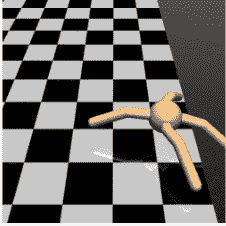
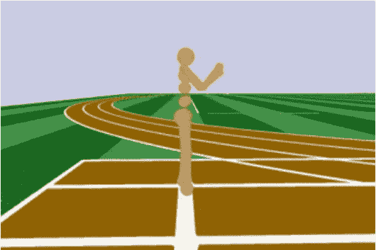

# 第九章：探索学习环境的全景 - Roboschool、Gym-Retro、StarCraft-II、DeepMindLab

在你不断积累经验的过程中，已经走过了很长一段路，目的是通过动手实践构建智能体，解决各种具有挑战性的问题。在前几章中，我们探讨了 OpenAI Gym 中提供的几个环境。在本章中，我们将超越 Gym，看看一些其他开发完善的环境，供你训练智能体或进行实验。

在我们查看其他提供良好学习环境的开源库，以帮助开发智能体之前，先来看一下最近添加到 OpenAI Gym 库中的一类环境。如果你像我一样对机器人技术感兴趣，你一定会非常喜欢这个。没错！它就是机器人环境类，提供了许多非常有用的环境，用于机器人臂执行抓取、滑动、推动等操作。这些机器人环境基于 MuJoCo 引擎，你可能还记得在第三章, *《OpenAI Gym 和深度强化学习入门》*中提到过，MuJoCo 引擎需要付费许可，除非你是学生，并且仅用于个人或课堂用途。以下截图总结了这些机器人环境，包括每个环境的名称和简要描述，供你参考，如果你有兴趣探索这些问题：


# 与 Gym 接口兼容的环境

在本节中，我们将深入探讨与 Gym 接口完全兼容的环境。你应该能够在这些环境中使用我们在前几章中开发的任何智能体。让我们开始，看看一些非常有用且充满前景的学习环境。

# Roboschool

Roboschool[ (https://github.com/openai/roboschool)](https://github.com/openai/roboschool) 提供了几个用于仿真控制机器人的环境。它由 OpenAI 发布，且这些环境与我们在本书中使用的 OpenAI Gym 环境接口相同。Gym 的基于 MuJoCo 的环境提供了丰富多样的机器人任务，但 MuJoCo 在免费试用期过后需要许可证。Roboschool 提供了八个环境，这些环境与 MuJoCo 环境非常相似，这是一个好消息，因为它提供了一个免费的替代方案。除了这八个环境，Roboschool 还提供了几个新的、具有挑战性的环境。

以下表格展示了 MuJoCo Gym 环境与 Roboschool 环境之间的快速对比：

| **简要描述** | **MuJoCo 环境** | **Roboschool 环境** |
| --- | --- | --- |
| 让一只单腿 2D 机器人尽可能快地向前跳跃 | Hopper-v2 | RoboschoolHopper-v1 |
| 让一个 2D 机器人行走 | Walker2d-v2 | RoboschoolWalker2d-v1 |
| 让一个四足 3D 机器人行走 | Ant-v2 | RoboschoolAnt-v1 |
| 让一个双足 3D 机器人尽可能快地行走而不摔倒 | Humanoid-v2 | RoboschoolHumanoid-v1 |

以下表格提供了 Roboschool 库中可用环境的完整列表，包括它们的状态空间和动作空间，供您快速参考：

| 环境 ID | Roboschool 环境 | 观察空间 | 动作空间 |
| --- | --- | --- | --- |
| RoboschoolInvertedPendulum-v1 |  | Box(5,) | Box(1,) |
| RoboschoolInvertedPendulumSwingup-v1 |  | Box(5,) | Box(1,) |
| RoboschoolInvertedDoublePendulum-v1 |  | Box(9,) | Box(1,) |
| RoboschoolReacher-v1 |  | Box(9,) | Box(2,) |
| RoboschoolHopper-v1 |  | Box(15,) | Box(3,) |
| RoboschoolWalker2d-v1 |  | Box(22,) | Box(6,) |
| RoboschoolHalfCheetah-v1 |  | Box(26,) | Box(6,) |
| RoboschoolAnt-v1 |  | Box(28,) | Box(8,) |
| RoboschoolHumanoid-v1 |  | Box(44,) | Box(17,) |
| RoboschoolHumanoidFlagrun-v1 |  | Box(44,) | Box(17,) |
| RoboschoolHumanoidFlagrunHarder-v1 |  | Box(44,) | Box(17,) |
| RoboschoolPong-v1 |  | Box(13,) | Box(2,) |

# 快速入门指南：设置和运行 Roboschool 环境

Roboschool 环境使用开源的 Bulletphysics 引擎，而不是专有的 MuJoCo 引擎。让我们快速浏览一个 Roboschool 环境，以便您了解如何使用 Roboschool 库中的任何环境，如果您觉得它对您的工作有帮助的话。首先，我们需要在`rl_gym_book` conda 环境中安装 Roboschool Python 库。由于该库依赖于多个组件，包括 Bulletphysics 引擎，因此安装过程涉及几个步骤，具体步骤可以在官方 Roboschool GitHub 仓库中找到：[`github.com/openai/roboschool`](https://github.com/openai/roboschool)。为了简化操作，您可以使用本书代码仓库中的脚本`ch9/setup_roboschool.sh`，该脚本会自动编译和安装`Roboschool`库。请按照以下步骤运行该脚本：

1.  激活`rl_gym_book` conda 环境，使用`source activate rl_gym_book`。

1.  使用`cd ch9`导航到`ch9`文件夹。

1.  确保脚本的执行权限已设置为`chmod a+x setup_roboschool.sh`。

1.  使用`sudo`运行脚本：`./setup_roboschool.sh`。

这应该会安装所需的系统依赖项，获取并编译兼容的 bullet3 物理引擎源代码；将 Roboschool 源代码拉取到您主目录下的`software`文件夹；最后在`rl_gym_book` conda 环境中编译、构建并安装 Roboschool 库。如果设置成功完成，您将在控制台看到以下信息：

```py
Setup completed successfully. You can now import roboschool and use it. If you would like to \test the installation, you can run: python ~/roboschool/agent_zoo/demo_race2.py"
```

您可以使用以下命令运行一个快速入门演示脚本：

```py
`(rl_gym_book) praveen@ubuntu:~$ python ~/roboschool/agent_zoo/demo_race2.py`
```

这将启动一场有趣的机器人竞赛，您将看到一只跳跃者、半猎豹和类人机器人进行比赛！有趣的是，每个机器人都由基于强化学习训练的策略控制。比赛将看起来像这个快照：


安装完成后，您可以创建一个 Roboschool 环境，并使用我们在前面章节中开发的代理来训练并在这些环境中运行。

您可以使用本章代码仓库中的`run_roboschool_env.py`脚本 [`github.com/PacktPublishing/Hands-On-Intelligent-Agents-with-OpenAI-Gym/tree/master/ch9`](https://github.com/PacktPublishing/Hands-On-Intelligent-Agents-with-OpenAI-Gym/tree/master/ch9) 来查看任何 Roboschool 环境。例如，要查看`RoboschoolInvertedDoublePendulum-v1`环境，您可以运行以下脚本：

```py
(rl_gym_book) praveen@ubuntu:~/HOIAWOG/ch9$python run_roboschool_env.py --env RoboschoolInvertedDoublePendulum-v1
```

您可以使用前面表格中列出的任何其他 Roboschool 环境名称，以及在发布时提供的新的 Roboschool 环境。

# Gym retro

Gym Retro ([`github.com/openai/retro`](https://github.com/openai/retro)) 是 OpenAI 于 2018 年 5 月 25 日发布的一个相对较新的 Python 库 ([`blog.openai.com/gym-retro/`](https://blog.openai.com/gym-retro/))，作为一个用于开发游戏玩法强化学习算法的研究平台。尽管在 OpenAI Gym 中有一个包含 60 多个游戏的 Atari 游戏合集，但可用的游戏总数有限。Gym Retro 支持使用为多个控制台/复古游戏平台开发的游戏，例如任天堂的 NES、SNES、Game Boy 控制台、世嘉 Genesis 和世嘉 Master System 等。通过使用 Libretro API 的模拟器，这一切成为可能：


Gym Retro 提供了便捷的包装器，将超过 1000 款视频游戏转化为兼容 Gym 接口的学习环境！是不是很棒！多个新的学习环境，但接口保持一致，这样我们就可以轻松地训练和测试我们到目前为止开发的代理，无需对代码做任何必要的修改……

为了感受在 Gym Retro 中使用环境的简易性，我们暂时把安装步骤放在一边，快速看看安装后如何创建一个新的 Gym Retro 环境的代码：

```py
import retro
env = retro.make(game='Airstriker-Genesis', state='Level1')
```

这段代码片段将创建一个`env`对象，该对象具有与我们之前看到的所有 Gym 环境相同的接口和方法，例如`step(...)`、`reset()`和`render()`。

# Gym Retro 的快速入门指南

让我们通过使用以下命令，快速安装预构建的二进制文件并试用 Gym Retro 库：

```py
(rl_gym_book) praveen@ubuntu:~/rl_gym_book/ch9$ pip install gym-retro
```

安装成功后，我们可以通过以下脚本快速查看其中一个可用的 Gym Retro 环境：

```py
#!/usr/bin/env python
import retro

if __name__ == '__main__':
   env = retro.make(game='Airstriker-Genesis', state='Level1')
    obs = env.reset()
    while True:
        obs, rew, done, info = env.step(env.action_space.sample())
        env.render()
        if done:
            obs = env.reset()
```

运行此脚本后，将会弹出一个窗口，显示《Airstriker》游戏并展示飞船执行随机动作。游戏窗口将呈现如下图所示：


在我们继续之前，值得注意的是，包含整个游戏数据的**ROM**（**只读内存**）文件并不是所有游戏都可以免费获得。一些非商业性的游戏机游戏的 ROM 文件，如《Airstriker》（在前面的脚本中使用的游戏）、《Fire》、Dekadrive、Automaton、《Fire》、《Lost Marbles》等，已包含在 Gym Retro 库中，可以免费使用。其他游戏，如《刺猬索尼克》系列（《刺猬索尼克》、《刺猬索尼克 2》、《刺猬索尼克 3 & Knuckles》），需要购买 ROM 文件以合法使用，可以通过像[Steam](https://store.steampowered.com/app/71113/Sonic_The_Hedgehog/)这样的平台进行购买。这对于希望在此类环境中开发算法的爱好者、学生以及其他热衷者来说，是一个障碍。但至少这个障碍相对较小，因为在 Steam 上购买《刺猬索尼克》的 ROM 大约需要 1.69 美元。一旦你拥有了游戏的 ROM 文件，Gym Retro 库提供了一个脚本，允许你将这些文件导入到库中，方法如下：

```py
(rl_gym_book) praveen@ubuntu:~/rl_gym_book/ch9$ python -m retro.import /PATH/TO/YOUR/ROMs/DIRECTORY
OpenAI Universe 
```

请注意，在创建新的 Gym Retro 环境时，我们需要提供游戏名称以及游戏状态`retro.make(game='游戏名称', state='状态名称')`

若要获取可用 Gym Retro 环境的列表，可以运行以下命令：

```py
(rl_gym_book) praveen@ubuntu:~/rl_gym_book/ch9$ python -c "import retro; retro.list_games()"

```

若要获取可用游戏状态的列表，可以运行以下 Python 脚本：

```py
#!/usr/bin/evn python
import retro
for game in retro.list_games():
    print(game, retro.list_states(game))
```

到目前为止，我们已经熟悉了 Gym Retro 库。接下来，分析一下这个库在我们已经看到和使用的内容之外，提供了哪些优势或新特性。首先，Gym Retro 库使用了比 Atari 主机更新的游戏主机（如 SEGA Genesis）。做个对比，SEGA Genesis 游戏主机的 RAM 是 Atari 主机的 500 倍，这使得它能够提供更好的视觉效果和更广泛的控制选项。这为我们提供了相对复杂的学习环境，并且为我们的智能体提供了一些更复杂的任务和挑战，供它们学习和解决。其次，这些主机游戏中的几个是渐进性的，游戏的复杂度通常随着每一关的提升而增加，而且各关卡在某些方面（例如目标、物体外观、物理效果等）具有许多相似之处，同时在其他方面（如布局、新物体等）也提供了多样性。这样的训练环境，随着难度逐步增加的关卡，帮助开发能够学习解决一般任务的智能体，而不仅仅是特定的任务或环境（如监督学习中的过拟合）。智能体能够学会将自己在一个关卡中的技能和知识转移到下一个关卡，进而转移到另一个游戏中。这个领域正在积极研究，通常被称为课程学习、分阶段学习或渐进式进化。毕竟，我们最终的目标是开发能够学习解决一般任务的智能体，而不仅仅是训练中给定的具体任务。Gym Retro 库提供了一些有用的、仅限于游戏的环境来促进此类实验和研究。

# 其他开源基于 Python 的学习环境

在本节中，我们将讨论一些最近的基于 Python 的学习环境，这些环境为智能体开发提供了良好的平台，但不一定具有与 Gym 兼容的环境接口。虽然它们没有提供与 Gym 兼容的接口，但本节中讨论的这些环境经过精心挑选，确保要么已经有 Gym 的包装器（使其与 Gym 接口兼容），要么它们很容易实现，可以用来测试和实验我们在本书中开发的智能体。正如你所猜测的那样，未来将有更多的优秀基于 Python 的智能体开发学习环境出现，因为这一领域目前正在积极研究。本书的代码库将提供新环境的信息和快速入门指南，一旦这些新环境发布，你可以在本书的 GitHub 仓库中注册获取更新通知。在接下来的子章节中，我们将讨论一些现成的、有前景的学习环境，供大家使用。

# 星际争霸 II - PySC2

《星际争霸 II》非常受欢迎，实际上是有史以来最成功的实时战略游戏之一，全球有数百万人在玩这款游戏。它甚至有一个世界锦标联赛（[`wcs.starcraft2.com/en-us/`](https://wcs.starcraft2.com/en-us/)）！游戏环境相当复杂，主要目标是建立一个军队基地，管理经济，防守基地，并摧毁敌人。玩家从第三人称视角控制基地和军队。如果你不熟悉《星际争霸》，你应该先观看几场在线比赛，以便了解游戏的复杂性和快速节奏。

人类要想在这款实时战略游戏中表现出色，需要大量的练习（甚至需要几个月，实际上职业玩家需要数年训练），计划和快速反应。尽管软件代理可以在每帧中按下多个软件按钮，做出相当快速的动作，但行动速度并不是唯一决定胜利的因素。代理还需要进行多任务处理和微管理军队单位，并最大化得分，这比 Atari 游戏复杂几个数量级。

《星际争霸 II》的制作公司暴雪发布了《星际争霸 II》API，提供了与《星际争霸 II》游戏接口的必要钩子，使得玩家可以不受限制地控制游戏。这为开发我们所追求的智能代理提供了新的可能性。暴雪甚至为在 AI 和机器学习许可下公开使用该环境提供了单独的**最终用户许可协议**（**EULA**）！对于像暴雪这样从事游戏制作和销售的公司来说，这一举措非常受欢迎。暴雪将**StarCraft2**（**SC2**）客户端协议实现开源，并提供了 Linux 安装包，以及多个附加组件，如地图包，用户可以从他们的 GitHub 页面免费下载，链接为[`github.com/Blizzard/s2client-proto`](https://github.com/Blizzard/s2client-proto)。除此之外，Google DeepMind 还开源了他们的 PySC2 库，通过 Python 暴露了 SC2 客户端接口，并提供了一个封装，使其成为一个强化学习（RL）环境。

以下截图展示了 PySC2 的用户界面，右侧是可供代理作为观察的特征层，左侧是游戏场景的简化概览：


如果你对这些类型的环境感兴趣，尤其是如果你是游戏开发者，你可能也对 Dota 2 环境感兴趣。Dota 2 是一款实时战略游戏，和 StarCraft II 类似，由两队五名玩家进行对战，每个玩家控制一个英雄角色。你可以了解更多关于 OpenAI 如何开发一个由五个神经网络代理组成的团队，他们学会了团队协作，单日内进行 180 年游戏量的训练，学习如何克服多个挑战（包括高维连续状态和动作空间以及长期的决策时间），而这一切都发生在自我对战中！你可以在 https://blog.openai.com/openai-five/ 阅读更多关于五代理团队的内容。

# StarCraft II PySC2 环境设置和运行的快速入门指南

我们将展示如何快速设置并开始使用 StarCraft II 环境。和往常一样，请使用代码库中的 README 文件获取最新的操作说明，因为链接和版本可能会发生变化。如果你还没有这么做，请为该书的代码库添加星标并关注，以便收到关于更改和更新的通知。

# 下载 StarCraft II Linux 包

从 https://github.com/Blizzard/s2client-proto#downloads 下载 StarCraft 游戏的最新 Linux 包，并将其解压到硬盘上的 `~/StarCraftII` 目录。例如，要将版本 4.1.2 下载到你的`~/StarCraftII/`文件夹中，可以使用以下命令：

```py
wget http://blzdistsc2-a.akamaihd.net/Linux/SC2.4.1.2.60604_2018_05_16.zip -O ~/StarCraftII/SC2.4.1.2.zip
```

让我们将文件解压到`~/StarCraftII/`目录：

```py
unzip ~/StarCraftII/SC2.4.1.2.zip -d ~/StarCraftII/
```

请注意，正如下载页面所述，这些文件是受密码保护的，密码是`'iagreetotheeula`。

通过输入该命令，暴雪确保我们同意接受其 AI 和机器学习许可协议，详情请见下载页面。

# 下载 SC2 地图

我们需要 StarCraft II 地图包和迷你游戏包才能开始。

从[`github.com/Blizzard/s2client-proto#map-packs`](https://github.com/Blizzard/s2client-proto#map-packs)下载地图包

解压到你的`~/StarCraftII/Maps`目录。

作为示例，我们将使用以下命令下载 2018 年第二赛季发布的梯子地图：

```py
wget http://blzdistsc2-a.akamaihd.net/MapPacks/Ladder2018Season2_Updated.zip -O ~/StarCraftII/Maps/Ladder2018S2.zip
```

让我们将地图解压到`~/StarCraftII/Maps`目录：

```py
unzip ~/StarCraftII/Maps/Ladder2018S2.zip -d ~/StarCraftII/Maps/
```

接下来，我们将下载并解压迷你游戏地图文件：

```py
wget https://github.com/deepmind/pysc2/releases/download/v1.2/mini_games.zip -O ~/StarCraftII/Maps/mini_games1.2.zip

unzip ~/StarCraftII/Maps/mini_games1.2.zip -d ~/StarCraftII/Maps
```

# 安装 PySC2

让我们安装 PySC2 库以供 RL 环境接口使用，并安装所需的依赖项。这个步骤会很简单，因为 PySC2 库在 PyPi 上有提供 Python 包：

```py
(rl_gym_book) praveen@ubuntu:~/HOIAWOG/ch9$ pip install pysc2
```

# 玩 StarCraft II 或运行示例代理

为了测试安装是否成功并查看 StarCraft II 学习环境的样子，你可以使用以下命令在 Simple64 地图或 CollectMineralShards 地图上快速启动一个随机行为的代理：

```py
(rl_gym_book) praveen@ubuntu:~/HOIAWOG/ch9$ python -m pysc2.bin.agent --map Simple64
```

你也可以加载环境中的其他可用地图。例如，以下命令加载 CollectMineralShards 地图：

```py
(rl_gym_book) praveen@ubuntu:~/HOIAWOG/ch9$ python -m pysc2.bin.agent --map CollectMineralShards
```

这应该会弹出一个 UI，显示随机智能体所采取的动作，帮助你了解有效的动作是什么，并帮助你可视化智能体在环境中行动时的情况。

若要自己玩这个游戏，PySC2 提供了一个人类智能体接口，这对于调试（如果你感兴趣，也可以用来玩游戏！）非常有用。以下是运行并亲自玩游戏的命令：

```py
(rl_gym_book) praveen@ubuntu:~/HOIAWOG/ch9$ python -m pysc2.bin.play --map Simple64
```

你还可以运行一个示例智能体，该智能体的脚本任务是收集矿物碎片，这是游戏中的一项任务，使用以下命令：

```py
(rl_gym_book) praveen@ubuntu:~/HOIAWOG/ch9$ python -m pysc2.bin.agent --map CollectMineralShards --agent pysc2.agents.scripted_agent.CollectMineralShards
```

请关注本书的代码库，获取新的智能体源代码以及训练和测试具有高级技能的新智能体的说明。你还可以自定义我们在上一章中开发的智能体，学习如何玩《星际争霸 II》。如果你这样做了，请向本书的代码库提交一个拉取请求，给作者发封邮件，或者大声说出来，让大家知道你做了哪些很酷的事情！

# DeepMind lab

DeepMind Lab ([`github.com/deepmind/lab`](https://github.com/deepmind/lab)) 是一个 3D 学习环境，提供了一系列具有挑战性任务的环境，例如通过迷宫进行 3D 导航和解谜。它是基于一系列开源软件构建的，包括著名的《Quake III Arena》。

环境接口与我们在本书中广泛使用的 Gym 接口非常相似。为了让你了解环境接口的实际样子，可以查看以下代码片段：

```py
import deepmind_lab
num_steps = 1000
config = {  
    'width': 640,
    'height': 480,
    'fps': 30
}
...
env = deepmind_lab.Lab(level, ['RGB_INTERLEAVED'], config=config, renderer='software')

for step in range(num_steps) 
if done:
    env.reset()
obs = env.observations()
action = agent.get_action(...)
reward = env.step(action, num_steps=1)
done = not env.is_running()
```

这段代码虽然与 OpenAI Gym 接口不是一一兼容，但提供了一个非常相似的接口。

# DeepMind Lab 学习环境接口

我们将简要讨论 **DeepMind Lab (DM Lab)** 的环境接口，以便你能够熟悉它，看到它与 OpenAI Gym 接口的相似之处，并开始在 DM Lab 环境中进行智能体实验！

# reset(episode=-1, seed=None)

这类似于我们在 Gym 接口中看到的 `reset()` 方法，但与 Gym 环境不同，DM Lab 的 `reset` 方法调用不会返回观察结果。我们稍后会看到如何获取观察结果，所以现在我们讨论的是 DM Lab 的 `reset(episode=-1, seed=None)` 方法。它将环境重置为初始状态，并且需要在每一集的结尾调用，以便创建新的集。可选的 `episode` 参数接受一个整数值，用于指定特定集中的关卡。如果未设置 `episode` 值，或者将其设置为 `-1`，则关卡将按数字顺序加载。`seed` 参数也是可选的，用于为环境的随机数生成器设置种子，以便实现可重复性。

# step(action, num_steps=1)

这与 Gym 接口的`step(action)`方法类似，但与`reset(...)`方法一样，调用该方法不会返回下一个观测（或奖励、结束状态、信息）。调用此方法会将环境推进`num_steps`帧，且在每一帧中执行由`action`定义的动作。这种动作重复的行为在我们希望相同的动作在连续四帧左右应用时非常有用，事实上，几位研究人员发现这种方法有助于学习。有一些 Gym 环境包装器可以实现这种动作重复行为。

# observations()

这是我们在调用`reset(...)`或`step(action)`之后用来接收来自 DM Lab 环境的观测的方法。该方法返回一个 Python 字典对象，其中包含我们从环境的可用类型列表中指定的每种类型的观测。例如，如果我们希望将环境的**RGBD**（**红绿蓝深度**）信息作为观测类型，我们可以在初始化环境时通过`'RGBD'`键指定，随后可以通过相同的`'RGBD'`键从返回的观测字典中检索该信息。下面是一个简单的示例来说明这一点：

```py
env = deepmind_lab.Lab('tests/empty_room_test', ['RGBD'])
env.reset()
obs = env.observations()['RGBD']
```

DM Lab 环境还支持其他类型的观测。我们可以使用`observation_spec()`来获取支持的观测类型列表，我们将在稍后详细讨论。

# is_running()

这个方法类似于（但意义相反）Gym 接口的`step(action)`方法返回的`done`布尔值。

当环境完成一个回合或停止运行时，该方法将返回`False`。只要环境仍在运行，它将返回`True`。

# observation_spec()

这个方法类似于我们在 Gym 环境中使用的`env.observation_space()`。该方法返回一个列表，指定了 DM Lab 环境支持的所有可用观测。它还包括有关与关卡相关的自定义观测的规格说明。

这些规格包含了如果在观测列表中指定了该规格名称时将返回的张量或字符串的名称、类型和形状（例如之前提到的`'RGBD'`示例）。例如，以下代码片段列出了列表中将返回的两个项，帮助你了解规格内容：

```py
{
    'dtype': <type 'numpy.uint8'>, ## Array data type
    'name': 'RGBD',                ## Name of observation.
    'shape': (4, 180, 320)         ## shape of the array. (Heights, Width, Colors)
}

{    
    'name': 'RGB_INTERLEAVED', ## Name of observation.
    'dtype': <type 'numpy.uint8'>, ## Data type array.     
    'shape': (180, 320, 3) ## Shape of array. (Height, Width, Colors)
}
```

为了快速理解如何使用这个方法，让我们看看以下代码行和输出：

```py
import deepmind_lab
import pprint
env = deepmind_lab.Lab('tests/empty_room_test', [])
observation_spec = env.observation_spec()
pprint.pprint(observation_spec)
# Outputs:
[{'dtype': <type 'numpy.uint8'>, 'name': 'RGB_INTERLEAVED', 'shape': (180, 320, 3)},
 {'dtype': <type 'numpy.uint8'>, 'name': 'RGBD_INTERLEAVED', 'shape': (180, 320, 4)},
 {'dtype': <type 'numpy.uint8'>, 'name': 'RGB', 'shape': (3, 180, 320)},
 {'dtype': <type 'numpy.uint8'>, 'name': 'RGBD', 'shape': (4, 180, 320)},
 {'dtype': <type 'numpy.uint8'>, 'name': 'BGR_INTERLEAVED', 'shape': (180, 320, 3)},
 {'dtype': <type 'numpy.uint8'>, 'name': 'BGRD_INTERLEAVED', 'shape': (180, 320, 4)},
 {'dtype': <type 'numpy.float64'>, 'name': 'MAP_FRAME_NUMBER', 'shape': (1,)},
 {'dtype': <type 'numpy.float64'>, 'name': 'VEL.TRANS', 'shape': (3,)},
 {'dtype': <type 'numpy.float64'>, 'name': 'VEL.ROT', 'shape': (3,)},
 {'dtype': <type 'str'>, 'name': 'INSTR', 'shape': ()},
 {'dtype': <type 'numpy.float64'>, 'name': 'DEBUG.POS.TRANS', 'shape': (3,)},
 {'dtype': <type 'numpy.float64'>, 'name': 'DEBUG.POS.ROT', 'shape': (3,)},
 {'dtype': <type 'numpy.float64'>, 'name': 'DEBUG.PLAYER_ID', 'shape': (1,)},
# etc...
```

# action_spec()

类似于`observation_spec()`，`action_spec()`方法返回一个列表，其中包含空间中每个元素的最小值、最大值和名称。`min`和`max`值分别代表动作空间中相应元素可以设置的最小值和最大值。这个列表的长度等于动作空间的维度/形状。这类似于我们在 Gym 环境中使用的`env.action_space`。

以下代码片段让我们快速了解调用此方法时返回值的样子：

```py
import deepmind_lab
import pprint

env = deepmind_lab.Lab('tests/empty_room_test', [])
action_spec = env.action_spec()
pprint.pprint(action_spec)
# Outputs:
```

```py
# [{'max': 512, 'min': -512, 'name': 'LOOK_LEFT_RIGHT_PIXELS_PER_FRAME'},
#  {'max': 512, 'min': -512, 'name': 'LOOK_DOWN_UP_PIXELS_PER_FRAME'},
#  {'max': 1, 'min': -1, 'name': 'STRAFE_LEFT_RIGHT'},
#  {'max': 1, 'min': -1, 'name': 'MOVE_BACK_FORWARD'},
#  {'max': 1, 'min': 0, 'name': 'FIRE'},
#  {'max': 1, 'min': 0, 'name': 'JUMP'},
#  {'max': 1, 'min': 0, 'name': 'CROUCH'}]
```

# num_steps()

这个工具方法就像一个计数器，它计算自上次调用`reset()`以来环境执行的帧数。

# fps()

这个工具方法返回每秒钟实际（墙钟）执行的帧数（或环境步数）。这个方法对于跟踪环境的执行速度以及代理从环境中采样的速度非常有用。

# events()

这个工具方法可以在调试时非常有用，因为它返回自上次调用`reset()`或`step(...)`以来发生的事件列表。返回的元组包含一个名称和一组观察数据。

# close()

与 Gym 环境中的`close()`方法类似，这个方法也会关闭环境实例并释放底层资源，例如 Quake III Arena 实例。

# 设置和运行 DeepMind Lab 的快速入门指南

在前面简短讨论了 DeepMind Lab 环境接口之后，我们已经准备好亲自体验这个学习环境。在接下来的子章节中，我们将逐步介绍设置 DeepMind Lab 并运行一个示例代理的过程。

# 设置和安装 DeepMind Lab 及其依赖项

DeepMind Lab 库使用 Bazel 作为构建工具，而 Bazel 又依赖于 Java。书中的代码库有一个脚本，可以帮助你轻松设置 DeepMind Lab。你可以在章节 9 文件夹下找到这个脚本，路径是[`github.com/PacktPublishing/Hands-On-Intelligent-Agents-with-OpenAI-Gym/tree/master/ch9`](https://github.com/PacktPublishing/Hands-On-Intelligent-Agents-with-OpenAI-Gym/tree/master/ch9)。你可以使用以下命令运行该脚本：

```py
(rl_gym_book) praveen@ubuntu:~/HOIAWOG/ch9$./setup_deepmindlab.sh
```

这个脚本可能需要一些时间来完成，但它会自动安装所有必要的包和库，包括 Bazel 及其依赖项，并为你设置好一切。

# 玩游戏、测试随机行为代理或训练自己的代理！

安装完成后，你可以通过运行以下命令，使用键盘输入测试游戏：

```py
(rl_gym_book) praveen@ubuntu:~/HOIAWOG/ch9$ cd deepmindlab

(rl_gym_book) praveen@ubuntu:~/HOIAWOG/ch9/deepmindlab$ bazel run :game -- --level_script=tests/empty_room_test
```

你还可以通过以下命令，在随机行为代理的帮助下进行测试：

```py
(rl_gym_book) praveen@ubuntu:~/HOIAWOG/ch9/deepmindlab$ bazel run :python_random_agent --define graphics=sdl -- --length=5000
```

要开始自己的代理开发，你可以使用已经配置好的示例代理脚本，它可以与 DeepMind Lab 环境进行交互。你可以在`~/HOIAWOG/ch9/deepmindlab/python/random_agent.py`找到该脚本。要开始训练这个代理，你可以使用以下命令：

```py
(rl_gym_book) praveen@ubuntu:~/HOIAWOG/ch9/deepmindlab$ bazel run :python_random_agent
```

# 概述

在本章中，我们探讨了几个有趣且有价值的学习环境，了解了它们的界面设置，甚至通过每个环境的快速入门指南和书中代码库中的设置脚本亲自操作了这些环境。我们首先查看了与我们现在非常熟悉的 OpenAI Gym 接口兼容的环境。具体来说，在这一类别中，我们探索了 Roboschool 和 Gym Retro 环境。

我们还查看了其他有用的学习环境，这些环境不一定具备与 Gym 兼容的环境接口，但它们拥有非常相似的 API，因此我们可以轻松地调整我们的智能体代码，或在学习环境周围实现一个包装器，使其兼容 Gym API。具体来说，我们探索了著名的实时战略游戏《星际争霸 II》环境和 DeepMind Lab 环境。我们还简要地提到了 DOTA2 环境，该环境曾被用于训练单一智能体和一个智能体团队，由 OpenAI 训练，这个团队成功击败了业余人类玩家，甚至一些职业电竞团队，在 DOTA 2 比赛中取得胜利。

我们观察了每个学习环境库中提供的不同任务和环境，并尝试了一些示例，以熟悉这些环境，同时了解如何使用我们在前几章中开发的智能体来训练并解决这些相对较新的学习环境中的挑战性任务。
