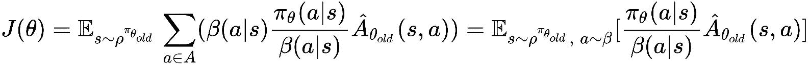
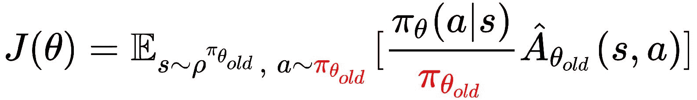
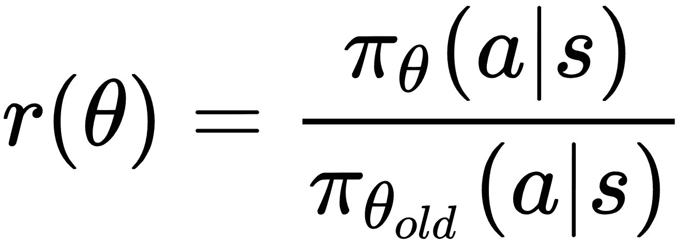

# 第十章：探索学习算法领域 - DDPG（演员-评论家），PPO（策略梯度），Rainbow（基于值的方法）

在上一章中，我们讨论了几种有前景的学习环境，你可以用来训练智能体解决不同的任务。在第七章，*创建自定义 OpenAI Gym 环境——CARLA 驾驶模拟器*，我们还展示了如何创建自己的环境，以解决你可能感兴趣的任务或问题，借助智能和自主软件代理。这为你提供了完成后可以继续深入的方向，以探索和尝试本书中讨论的所有环境、任务和问题。按此思路，在本章中，我们将讨论几种有前景的学习算法，它们将成为你智能代理开发工作中的未来参考。

到目前为止，在本书中，我们已经详细介绍了实现智能代理的逐步过程，这些代理能够学习改进并解决离散决策/控制问题（第六章，*使用深度 Q 学习实现最优离散控制的智能代理*）和连续动作/控制问题（第八章，*使用深度演员-评论家算法实现智能自主汽车驾驶代理*）。这些内容为开发这样的学习代理提供了良好的起点。希望之前的章节为你展示了一个能够学习改进并应对手头任务或问题的自主智能软件代理/系统的整体框架。我们还审视了开发、训练和测试这些复杂系统时，有助于的整体管道及其有用的工具和常规（如日志记录、可视化、参数管理等）。我们看到两类主要算法：基于深度 Q 学习（及其扩展）和深度演员-评论家（及其扩展）的深度强化学习算法。它们是良好的基准算法，实际上，直到今天，它们仍然是该领域最新研究论文中的参考。这一研究领域近年来活跃发展，提出了若干新的算法。一些算法在样本复杂度上表现更好，即智能体在达到某一性能水平之前，从环境中收集的样本数。一些其他算法具有稳定的学习特性，并且在足够的时间内能够找到最优策略，适用于大多数问题且几乎不需要调参。还引入了几种新的架构，如 IMPALA 和 Ape-X，它们使得高可扩展的学习算法实现成为可能。

我们将快速了解这些有前景的算法、它们的优点以及潜在的应用类型。我们还将查看这些算法为我们已有的知识添加的关键组件的代码示例。这些算法的示例实现可在本书的代码库中找到，位于`ch10`文件夹，[`github.com/PacktPublishing/Hands-On-Intelligent-Agents-with-OpenAI-Gym`](https://github.com/PacktPublishing/Hands-On-Intelligent-Agents-with-OpenAI-Gym)。

# 深度确定性策略梯度

**深度确定性策略梯度**（**DDPG**）是一种离策略、无模型、演员-评论家算法，基于**确定性策略梯度**（**DPG**）定理（[proceedings.mlr.press/v32/silver14.pdf](http://proceedings.mlr.press/v32/silver14.pdf)）。与基于深度 Q 学习的方法不同，基于演员-评论家的策略梯度方法不仅适用于离散动作空间的问题/任务，也能轻松应用于连续动作空间。

# 核心概念

在第八章，*使用深度演员-评论家算法实现智能自动驾驶汽车代理*，我们带你走过了策略梯度定理的推导，并为引入上下文，复现了以下内容：

你可能还记得，我们考虑的策略是一个随机函数，给定**状态**（**s**）和参数（）为每个动作分配一个概率。在确定性策略梯度中，随机策略被一个确定性策略所替代，该策略为给定的状态和参数集指定了一个固定策略！。简而言之，DPG 可以通过以下两个方程表示：

这是策略目标函数：

这里，是由参数化的确定性策略，r(s,a)是执行动作*a*在状态 s 下的奖励函数，而是该策略下的折扣状态分布。

确定性策略目标函数的梯度已在之前链接的论文中证明为：

我们现在看到熟悉的动作-价值函数项，通常称为评论员。DDPG 基于这个结果，并使用深度神经网络表示动作-价值函数，就像我们在第六章中做的那样，*使用深度 Q 学习实现智能最优离散控制代理*，以及其他一些修改来稳定训练。具体而言，使用了 Q 目标网络（就像我们在第六章中讨论的那样，*使用深度 Q 学习实现智能最优离散控制代理*），但是现在这个目标网络是缓慢更新的，而不是在几个更新步骤后保持固定并更新它。DDPG 还使用经验重放缓冲区，并使用噪声版本的 ，用方程式  表示，以鼓励探索作为策略。  是确定性的。

DDPG 有一个扩展版本叫做 D4PG，简称为分布式分布式 DDPG。我猜你可能在想：DPG -> DDPG -> {缺失？} -> DDDDPG。没错！缺失的部分就是你需要实现的内容。

D4PG 算法对 DDPG 算法做了四个主要改进，如果你有兴趣，可以简要列出如下：

+   分布式评论员（评论员现在估计 Q 值的分布，而不是给定状态和动作的单一 Q 值）

+   N 步回报（类似于我们在第八章中使用的*实现智能自动驾驶代理，使用深度演员-评论员算法*，使用了 n 步 TD 回报，而不是通常的 1 步回报）

+   优先经验重放（用于从经验重放记忆中抽样经验）

+   分布式并行演员（利用 K 个独立的演员并行收集经验并填充经验重放记忆）

# 邻近策略优化（Proximal Policy Optimization）

**邻近策略优化（PPO）** 是一种基于策略梯度的方法，是已经被证明既稳定又具有可扩展性的算法之一。事实上，PPO 是 OpenAI Five 团队使用的算法，该团队的代理与多位人类 DOTA II 玩家对战并获胜，这一点我们在前一章中讨论过。

# 核心概念

在策略梯度方法中，算法通过执行回合（rollouts）来收集状态转移和（可能的）奖励样本，并使用梯度下降更新策略的参数，以最小化目标函数。其思想是不断更新参数以改进策略，直到获得一个较好的策略。为了提高训练的稳定性，**信任域策略优化**（**TRPO**）算法对策略更新施加了**Kullback-Liebler**（**KL**）散度约束，确保策略在与旧策略的比较中不会在一步中更新得过多。TRPO 是 PPO 算法的前身。让我们简要讨论一下 TRPO 算法中使用的目标函数，以便更好地理解 PPO。

# 脱策略学习

正如我们所知，在脱策略学习的情况下，代理遵循一个与其试图优化的策略不同的行为策略。提醒一下，我们在第六章中讨论过的 Q-learning，*使用深度 Q-learning 实现智能代理进行最优离散控制*，以及一些扩展，都是脱策略算法。我们用  来表示行为策略。那么，我们可以将代理的目标函数写为状态访问分布和动作的总优势，如下所示：

这里， 是更新前的策略参数， 是旧策略参数下的状态访问概率分布。我们可以在内层求和式中对项进行乘除操作，使用行为策略 ，其目的是使用重要性采样来考虑到状态转移是通过行为策略  进行采样的：

与前一方程相比，前述方程中变化的项用红色表示。

我们可以将之前的求和表示为一个期望，如下所示：

# 在策略学习中

在策略学习的情况下，行为策略和目标策略是相同的。因此，自然地，当前策略（更新前）是代理用来收集样本的策略，表示为 ，这就是行为策略，因此目标函数变为：

与前一方程相比，前述方程中变化的项用红色表示。

TRPO 通过*信任域*约束优化前述目标函数，使用以下方程给出的 KL 散度度量：

这是确保新策略更新不会与当前策略相差过大的约束条件。尽管 TRPO 背后的理念简洁且直观，但其实现和梯度更新涉及复杂性。PPO 通过使用一个裁剪的替代目标简化了这一方法，且既有效又简单。让我们通过算法背后的数学原理深入理解 PPO 的核心概念。假设在给定状态 *s* 下采取动作 *a* 的新策略与旧策略的概率比定义如下：

将这个代入我们之前讨论的 TRPO 的在线策略目标函数方程中，得到的目标函数如下：

简单地移除 KL 散度约束将导致不稳定，因为可能会出现大量的参数更新。PPO 通过强制！ 落在区间！内，施加了这个约束，其中！是一个可调超参数。实际上，PPO 中使用的目标函数取原始参数值和裁剪版本中的最小值，其数学描述如下所示：

这导致了一个稳定的学习目标，并且策略单调地改善。

# Rainbow

Rainbow ([`arxiv.org/pdf/1710.02298.pdf`](https://arxiv.org/abs/1710.02298)) 是基于 DQN 的一种离策略深度强化学习算法。我们在第六章，*使用深度 Q 学习实现最优离散控制的智能代理*中研究并实现了深度 Q 学习（DQN）以及一些 DQN 的扩展。DQN 算法已经有了几个扩展和改进。Rainbow 结合了其中六个扩展，显示出它们的组合效果更佳。Rainbow 是一个最先进的算法，目前在所有 Atari 游戏中保持着最高分记录。如果你想知道为什么这个算法叫做 *Rainbow*，很可能是因为它结合了七个（即彩虹的颜色数）Q 学习算法的扩展，具体包括：

+   DQN

+   双重 Q 学习

+   优先经验回放

+   对抗网络

+   多步学习/n 步学习

+   分布式 RL

+   噪声网络

# 核心概念

Rainbow 结合了 DQN 和六个已被证明能解决原始 DQN 算法局限性的扩展。我们将简要回顾这六个扩展，了解它们如何为整体性能提升做出贡献，并使 Rainbow 在 Atari 基准测试中占据了榜首，同时也证明了它们在 OpenAI Retro 大赛中的成功。

# DQN

到现在为止，你应该已经非常熟悉 DQN，因为我们在第六章，*使用深度 Q-Learning 实现最优离散控制的智能体*中逐步实现了深度 Q-learning 智能体，在那里我们详细讨论了 DQN 以及它如何通过深度神经网络函数逼近、回放记忆和目标网络扩展标准 Q-learning。让我们回顾一下我们在第六章，*使用深度 Q-Learning 实现最优离散控制的智能体*中使用的 Q-learning 损失：

这基本上是 TD 目标和 DQN 的 Q 估计之间的均方误差，正如我们在第六章，*使用深度 Q-Learning 实现最优离散控制的智能体*中所提到的，其中  是缓慢变化的目标网络， 是主 Q 网络。

# 双重 Q-Learning

在双重 Q-Learning 中，有两个动作值/Q 函数。我们将它们称为 Q1 和 Q2。双重 Q-Learning 的理念是*将动作选择与价值估计解耦*。也就是说，当我们想更新 Q1 时，我们根据 Q1 选择最佳动作，但使用 Q2 来找到选定动作的价值。类似地，当 Q2 被更新时，我们基于 Q2 选择动作，但使用 Q1 来确定选定动作的价值。实际上，我们可以使用主 Q 网络  作为 Q1，使用缓慢变化的目标网络  作为 Q2，从而得到以下双重 Q-Learning 损失方程（与 DQN 方程的差异以红色显示）：

更改损失函数的动机是，Q-learning 会受到过度估计偏差的影响，这可能会损害学习。过度估计的原因是最大值的期望大于或等于期望的最大值（通常是不等式成立），这源于 Q-learning 算法和 DQN 中的最大化步骤。双重 Q-Learning 所引入的变化已被证明可以减少有害的过度估计，从而改善性能，相较于 DQN 更具优势。

# 优先经验回放

在我们实现深度 Q 学习的第六章，*使用深度 Q 学习实现智能代理进行最优离散控制*中，我们使用经验回放内存来存储和检索采样的过渡经验。在我们的实现中，以及在 DQN 算法中，来自回放内存缓冲区的经验是均匀采样的。直观地说，我们希望更频繁地采样这些经验，因为有很多内容需要学习。优先经验回放根据以下方程，以相对最后遇到的绝对 TD 误差的概率 进行过渡采样：

在这里， 是一个超参数，决定分布的形状。这确保我们采样那些 Q 值预测与正确值相差较大的过渡。实际上，新的过渡会以最高优先级插入回放内存，以表示最近过渡经验的重要性。

# 对战网络

对战网络（Dueling networks）是一种为基于值的强化学习设计的神经网络架构。名称*对战（dueling）*来源于该架构的主要特点，即它有两条计算流，一条用于值函数，另一条用于优势函数。下面的图示来自一篇研究论文（[`arxiv.org/pdf/1511.06581.pdf`](https://arxiv.org/pdf/1511.06581.pdf)），展示了对战网络架构（图中底部的网络）与典型 DQN 架构（图中顶部的网络）之间的对比：

编码特征的卷积层是由值流和优势流共享的，并通过一个特殊的聚合函数进行合并，正如在论文中所讨论的，它对应于以下的动作值分解：

，和  分别是值流、共享卷积编码器和优势流的参数，  是它们的连接。

# 多步学习/n 步学习

在第八章，*使用深度演员-评论家算法实现智能自主汽车驾驶代理*中，我们实现了 n 步返回 TD 方法，并讨论了如何使用前视多步目标替代单步 TD 目标。我们可以将这个 n 步返回与 DQN 一起使用，这本质上是该扩展的思想。回想一下，从状态  的截断 n 步返回给出如下：

使用这个方程，可以定义 DQN 的多步变体，以最小化以下损失（与 DQN 方程的差异以红色显示）：

这个方程展示了 DQN 中引入的变化。

# 分布式强化学习

分布式强化学习方法（[`arxiv.org/abs/1707.06887`](https://arxiv.org/abs/1707.06887)）是学习如何近似回报的分布，而不是期望（平均）回报。分布式强化学习方法提出使用放置在离散支持集上的概率质量来建模这些分布。本质上，这意味着与其试图建模给定状态下的单一动作值，不如为每个动作给定状态下寻找一个动作值的分布。虽然不深入细节（因为那需要大量背景信息），我们将看看此方法对强化学习的一个关键贡献，即分布式贝尔曼方程的公式化。如你从本书前几章回忆的那样，使用一步贝尔曼备份的动作值函数可以通过如下方式返回：

在分布式贝尔曼方程的情况下，标量量  被随机变量  所替代，从而得到如下方程：

由于该量不再是标量，因此更新方程需要比单纯将下一状态-动作值的折扣值加到步进回报中更加小心地处理。分布式贝尔曼方程的更新步骤可以通过以下图示轻松理解（从左到右的各个阶段）：

在前面的插图中，下一状态的动作值分布用红色显示在左侧，接着通过折扣因子  （中间）进行缩放，最终通过  平移该分布，从而得到分布贝尔曼更新。在更新之后，由前一更新操作得到的目标分布  通过最小化  和  之间的交叉熵损失，投影到当前分布的支持集  上。

在此背景下，你可以简要浏览分布式强化学习论文中的 C51 算法伪代码，它已经集成到 Rainbow 智能体中：

# 噪声网络

如果你还记得，我们在第六章《*使用深度 Q 学习实现智能代理进行最优离散控制*》中使用了-贪心策略，基于深度 Q 网络学习到的动作值来选择动作，这基本上意味着大多数时候都会选择给定状态下的最高动作值对应的动作，除了在一小部分时间（即非常小的概率）内，代理会选择一个随机动作。这可能会阻止代理探索更多的奖励状态，特别是当它已经收敛的动作值不是最优的动作值时。使用-贪心策略进行探索的局限性，在 Atari 游戏《Montezuma's Revenge》的表现中显而易见，在该游戏中，必须以正确的方式执行一系列动作才能获得第一个奖励。为了克服这一探索限制，Rainbow 使用了喧嚣网络的思想——这是一种 2017 年提出的简单但有效的方法。

喧嚣网络的主要思想是线性神经网络层的一个喧嚣版本，它结合了确定性流和喧嚣流，如以下方程所示，针对线性神经网络层的情况：

在这里， 和  是喧嚣层的参数，它们与 DQN 的其他参数一起通过梯度下降进行学习。 代表元素级的乘积操作， 和  是均值为零的随机噪声。我们可以在 DQN 实现中用喧嚣线性层代替普通的线性层，这将具有更好的探索优势。由于 和  是可学习的参数，网络可以学会忽略喧嚣流。随着时间的推移，对于每个神经元来说，喧嚣流会在状态空间的不同部分以不同的速率衰减，从而通过一种自我退火的形式实现更好的探索。

Rainbow 代理的实现将所有这些方法结合起来，达到了最先进的成果，并且在 57 款 Atari 游戏的测试中，比其他任何方法的表现都要优秀。总体来说，Rainbow 代理与以前最佳表现的算法在 Atari 游戏综合基准测试中的表现，如下图所示：

从图中可以清楚地看出，Rainbow 代理所包含的方法在 57 款不同的 Atari 游戏中带来了显著的性能提升。

# 优势和应用的快速总结

Rainbow 代理的一些关键优势总结如下，供您快速参考：

+   融合了过去几年中 Q-learning 的多个显著扩展

+   在 Atari 基准测试中取得了最先进的结果。

+   使用适当调整的 *n* 值的 n 步目标通常能加速学习。

+   与其他 DQN 变体不同，Rainbow 智能体可以在经验回放内存中收集的帧数减少 40% 的情况下开始学习。

+   在不到 10 小时（700 万帧）内，在单 GPU 机器上匹配了 DQN 的最佳表现。

Rainbow 算法已成为离散控制问题中最受追捧的智能体，尤其适用于动作空间小且离散的场景。它在其他游戏环境中也非常成功，例如 Gym-Retro，特别是经过调优的 Rainbow 智能体在 2018 年 OpenAI Retro 比赛中获得了第二名。该比赛是一个迁移学习竞赛，任务是学习在某些关卡中玩复古的 Genesis 游戏《刺猬索尼克》、《刺猬索尼克 II》和《刺猬索尼克与纳克尔斯》，然后能够在未经过训练的其他关卡中表现良好。考虑到在典型的强化学习环境中，智能体通常在相同环境中训练和测试，Retro 比赛衡量了学习算法从先前经验中泛化学习的能力。总的来说，Rainbow 智能体是任何具有离散动作空间的强化学习问题/任务的最佳初步选择。

# 总结

作为本书的最后一章，本章总结了当前在该领域内最先进的关键学习算法。我们了解了三种不同最先进算法的核心概念，每种算法都有其独特的元素和分类（演员-评论家/基于策略/基于价值函数）。

具体来说，我们讨论了深度确定性策略梯度算法，这是一种演员-评论家架构方法，采用确定性策略，而非通常的随机策略，并在多个连续控制任务中取得了良好的表现。

接下来我们研究了 PPO 算法，这是一种基于策略梯度的方法，采用了 TRPO 目标的剪辑版本，并学习到一个单调提升且稳定的策略，在像 DOTA II 这样的高维环境中取得了成功。

最后，我们看到了 Rainbow 算法，这是一种基于价值的方法，结合了多个扩展到非常流行的 Q-learning 算法的技术，即 DQN、双重 Q-learning、优先经验回放、对抗网络、多步学习/n 步学习、分布式强化学习和噪声网络层。Rainbow 智能体在 57 款 Atari 基准游戏中取得了显著更好的表现，并且在 OpenAI Retro 比赛中的迁移学习任务上表现也非常出色。

现在，我们进入了这本书的最后一段！希望您在阅读过程中享受了旅程，学到了很多，并获得了实现智能代理算法以及在您选择的学习环境/问题上训练和测试代理所需的许多实际技能的机会。您可以使用书籍代码库中的问题追踪系统报告代码问题，或者如果您想进一步讨论某个主题，或者需要任何额外的参考资料/指引来进入下一个阶段。
