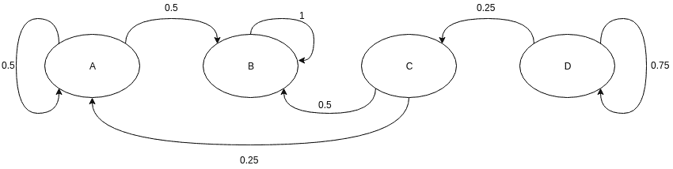
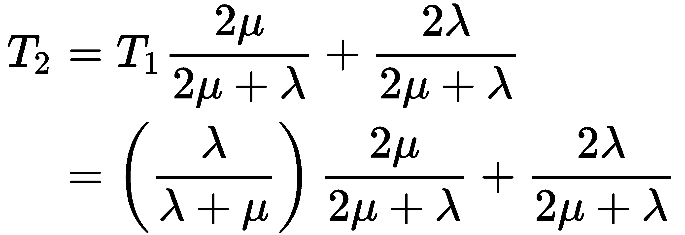

# 第一章：马尔可夫过程简介

在本章中，我们将展开理解**隐马尔可夫模型**（**HMM**）所需的基本概念。我们将涵盖以下主题：

+   随机过程

+   马尔可夫过程

+   马尔可夫链或离散时间马尔可夫过程

+   连续时间马尔可夫链

# 随机变量

就像我们在统计学中常做的那样，让我们从一个简单的掷骰子例子开始。如果我们考虑掷一个公平的骰子，骰子的结果可以是从 1 到 6 的任何一个数，且是随机的。为了表示这种情况（本例中是掷骰子的结果），在数学中我们使用随机变量的概念。在我们的日常生活中，我们会遇到很多这样的变量。另一个例子是点餐。在这种情况下，结果可以是菜单上的任何一道菜。一般来说，随机变量是一个其可能的值是随机现象结果的变量。结果的可能状态也被称为**随机变量的定义域**，而结果则是基于在随机变量定义域上定义的概率分布。

回到掷骰子的例子，随机变量的结果*O*的定义域是*domain(O) = (1, 2, 3, 4, 5, 6)*，其概率分布为均匀分布，*P(o) = 1/6 ∀ o ∈ domain(O)*。类似地，在餐厅的例子中，随机变量*选择菜肴*的定义域将是菜单上的每一项菜品，而概率分布则取决于你的食物偏好。在之前的两个例子中，随机变量的定义域是离散的；这种随机变量称为**离散随机变量**。但也有可能定义域是一个连续的空间。例如，考虑表示明天 Google 股票价格的随机变量。该随机变量的定义域将是所有正实数，并且大部分概率质量分布在今天价格的±5%范围内。这种随机变量称为**连续随机变量**。

# 随机过程

在上一节中，我们讨论了能够在数学上表示单一随机现象结果的随机变量。但如果我们想要表示这些随机事件在一段时间内或者实验持续过程中发生的情况，该怎么办呢？例如，假设我们想要表示一天内每小时的股价，或者想要表示一个从某高度在真空中自由下落的球在每秒钟的高度。对于这种情况，我们需要一组随机变量，每个随机变量表示在给定时间点的结果。这些表示随机现象在一段时间内的随机变量集合也被称为**随机过程**。值得注意的是，所有这些随机变量的定义域是相同的。因此，我们也可以把这个过程看作是状态的变化。

在这里，我们讨论的是不同时间点的随机变量，但并不一定每次都以时间为基础。它也可以是其他某种事件。但由于在大多数情况下，通常是时间，因此讨论随机过程时更容易使用时间来表示任何此类事件。如果它随着其他事件变化而非时间变化，创建模型时相同的概念也会适用。

现在让我们更详细地讨论之前的两个例子。首先是从真空中将球从一定高度掉落的例子，如果我们知道重力的准确数值和球体掉落的高度，那么我们可以通过牛顿运动定律，在每秒的时间间隔内精确地确定球的位置。

这类随机过程中，我们可以通过初始条件（在此案例中是掉落球，初速度为零）和系统参数（在此案例中是重力的数值），确定每个随机变量的状态，这类过程被称为**确定性随机过程**（通常称为**确定性过程**）。

现在让我们看第二个例子：表示股票价格随时间的变化。在这种情况下，即使我们知道当前价格以及下一小时的价格的精确概率分布，我们也无法确定性地计算出价格。这些随机过程，即使在给定初始条件和所有系统参数的情况下，我们仍然无法确定过程的状态，被称为**随机随机过程**（通常称为**过程**）。理解或感受随机过程的一种非常好的方式是将其视为与确定性过程的对立面。

# 马尔可夫过程

如果随机变量在下一时刻的状态仅依赖于当前时刻随机变量的结果，则该随机过程被称为**马尔可夫过程**。用简单的数学术语表示，对于一个随机过程，*S = {R1, R[2], . . ., R[n]} = {R}[t=1, . . ., n]*，要成为一个马尔可夫过程，它必须满足以下条件：


根据前面的条件，马尔可夫过程中的任何变量在给定时刻的概率分布是一个条件分布，只依赖于上一时刻的随机变量。系统的这一特性，即系统的未来状态仅依赖于当前状态，也被称为**马尔可夫性质**。满足马尔可夫性质的系统也被称为**无记忆系统**，因为它们不需要记住之前的状态来计算下一个状态的分布，换句话说，下一个状态仅依赖于系统的当前状态。

一个常用的例子来解释马尔可夫过程是一个醉汉在街上走路。我们假设，由于这个人醉了，他可以选择向后走一步、向前走一步，或者停留在当前位置，这些动作的概率分布是 *[0.4, 0.4, 0.2]*。现在，假设我们知道这个人在某一时刻的位置，那么他在下一个时刻的位置仅仅取决于他当前的位置以及系统的参数（他的步长和可能动作的概率分布）。因此，这是一个马尔可夫过程的例子。

在前面的例子中，我们假设醉汉在固定的时间间隔内采取行动（向前/向后走或者停留在原地），并且他的步长始终相同。考虑到这些因素，我们的例子中的马尔可夫过程具有离散的状态空间。此外，由于这个人是在固定的时间间隔后迈出步伐，我们可以把它看作是一个离散时间的过程。但马尔可夫过程不一定需要离散状态空间或离散时间间隔。考虑到离散与连续时间以及离散与连续状态空间，我们可以将马尔可夫过程分为四大类：

+   离散时间与离散状态空间

+   离散时间与连续状态空间

+   连续时间与离散状态空间

+   连续时间与连续状态空间

我们将在接下来的章节中更详细地讨论这些马尔可夫过程的类别。

# 安装 Python 和包

在继续之前，我们需要设置 Python 和所有运行代码示例所需的包。在本书中的所有代码示例都将使用 Python 3.4。书中的所有示例代码也可以在 GitHub 上找到：[`github.com/PacktPublishing/HandsOnMarkovModelswithPython`](https://github.com/PacktPublishing/HandsOnMarkovModelswithPython)。我们强烈建议使用 Miniconda 来设置运行示例所需的环境。Miniconda 可以从 [`conda.io/miniconda.html`](https://conda.io/miniconda.html) 下载。

# 在 Windows 上的安装

Miniconda 可以通过双击下载的 `.exe` 文件并按照安装说明进行安装来在 Windows 系统上安装。安装完成后，我们需要创建一个 `conda` 环境，并在环境中安装所有所需的包。要创建一个名为 `hmm` 的 Python 3.4 环境，请运行以下命令：

```py
conda create -n hmm python=3.4
```

在创建环境之后，我们需要激活它并安装所需的包。这可以通过以下命令完成：

```py
activate hmm
conda install numpy scipy
```

# 在 Linux 上的安装

在 Linux 上，下载 `Miniconda` 文件后，我们需要赋予它执行权限，然后进行安装。这可以通过以下命令完成：

```py
chmod +x Miniconda.sh
./Miniconda.sh
```

执行文件后，我们可以简单地按照安装说明进行操作。一旦安装完成，我们需要创建一个新的环境并安装所需的软件包。我们可以使用以下命令创建一个名为 `hmm` 的 Python 3.4 环境：

```py
conda create -n hmm python=3.4
```

环境创建完成后，我们需要激活该环境，并使用以下命令在其中安装软件包：

```py
source activate hmm
conda install numpy scipy
```

# 马尔可夫链或离散时间马尔可夫过程

马尔可夫链是一种马尔可夫过程，其中时间是离散的。然而，研究人员对于哪些类别的马尔可夫过程应该被称为**马尔可夫链**存在较大分歧。但通常来说，它是用来指代离散状态空间的马尔可夫过程。因此，马尔可夫链是一个定义在离散状态空间上的随机过程，满足马尔可夫性质。更正式地说，我们可以说，离散时间马尔可夫链是一个随机变量序列 *X[1]*、*X[2]*、*X[3]*、...，这些随机变量满足马尔可夫性质，即从当前状态转移到下一个状态的概率仅依赖于当前状态，而不依赖于之前的任何状态。就概率分布而言，我们可以说，假设系统在时间点 *n* 时处于某状态，那么在下一个时间点 *n + 1* 的条件分布是条件独立于时间点 *{1, 2, ..., n-1}* 的系统状态，前提是知道时间点 *n* 的随机变量状态。这可以写成如下形式：


马尔可夫链通常使用有向图表示。有向图中的节点表示随机变量的不同可能状态，边表示系统在下一个时间点从一个状态转移到另一个状态的概率。为了更好地理解这种表示方法，假设我们要预测天气。我们考虑随机变量 *Weather={晴天，雨天，雪天}* 的三种可能状态，可能的马尔可夫链可以表示如下，如*图 1.1*所示：


图 1.1：一个简单的马尔可夫链，表示随机变量，表示随机变量 Weather={晴天，雨天，雪天}，并展示了该随机变量在下一个时间点切换到其他状态的概率。

理解马尔可夫链的一个关键点是，我们正在模拟一系列随机变量随时间变化的结果。这一点有时会让人感到困惑，因为模型是通过一个单一的图来表示的，而图中并没有提到任何关于时间的内容。因此，“状态转移”这个名称并不特别合适，因为任何随机变量的状态并没有发生变化；相反，我们是试图根据当前随机变量的观测状态来确定下一个随机变量的状态。回到我们的例子中，可以看到图中的节点表示随机变量*天气*的不同可能状态，而节点之间的边则显示在当前随机变量状态下，下一个随机变量转移到不同可能状态的概率。自循环则显示模型保持在当前状态的概率。在前面的马尔可夫链中，假设我们知道当前随机变量的观测状态是*晴天*，那么下一个时间点随机变量仍然是*晴天*的概率是*0.8*。它也可能是*雨天*，其概率为*0.19*，或者是*雪天*，其概率为*0.01*。这里需要注意的是，从任何状态出发的所有外向边的概率值之和应该等于 1，因为这是一个穷尽事件。

现在，让我们尝试编写这个简单的马尔可夫链。我们将首先定义一个简单的`MarkovChain`类，并在本章中逐步为这个类添加方法：

```py
import numpy as np

class MarkovChain(object):
    def __init__(self, transition_prob):
        """
        Initialize the MarkovChain instance.

        Parameters
        ----------
        transition_prob: dict
            A dict object representing the transition probabilities in 
            Markov Chain. Should be of the form: {'state1': {'state1': 
            0.1, 'state2': 0.4}, 'state2': {...}}
        """
        self.transition_prob = transition_prob
        self.states = list(transition_prob.keys())

    def next_state(self, current_state):
        """
        Returns the state of the random variable at the next time 
        instance.

        Parameters
        ----------
        current_state: str
            The current state of the system.
        """
        return np.random.choice(
            self.states, p=[self.transition_prob[current_state][next_state] 
                            for next_state in self.states])

    def generate_states(self, current_state, no=10):
        """
        Generates the next states of the system.

        Parameters
        ----------
        current_state: str
            The state of the current random variable.

        no: int
            The number of future states to generate.
        """
        future_states = []
        for i in range(no):
            next_state = self.next_state(current_state)
            future_states.append(next_state)
            current_state = next_state
        return future_states
```

现在，我们可以尝试用这个`MarkovChain`类来运行我们的例子：

```py
>>> transition_prob = {'Sunny': {'Sunny': 0.8, 'Rainy': 0.19, 
 'Snowy': 0.01},
 'Rainy': {'Sunny': 0.2, 'Rainy': 0.7,
 'Snowy': 0.1},
 'Snowy': {'Sunny': 0.1, 'Rainy': 0.2,
 'Snowy': 0.7}}

>>> weather_chain = MarkovChain(transition_prob=transition_prob)
>>> weather_chain.next_state(current_state='Sunny')
'Sunny'
>>> weather_chain.next_state(current_state='Snowy')
'Snowy'
>>> weather_chain.generate_states(current_state='Snowy', no=10)     
['Snowy', 'Snowy', 'Snowy', 'Rainy', 'Snowy', 'Snowy', 'Rainy',
 'Rainy', 'Snowy', 'Snowy']
```

在前面的代码示例中，你可能会发现你的输出与这里显示的不同。这是因为马尔可夫链本质上是概率性的，它基于概率分布选择下一个状态，这可能导致不同运行结果的不同输出。

到目前为止，我们讨论的假设是变量的概率空间在不同时间点之间是不变的。这种情况称为**时间齐次马尔可夫链**，但也可以存在**时间不齐次马尔可夫链**，这种情况在许多应用中也有用，但超出了本书的范围。

# 马尔可夫链的参数化

在上一节的马尔可夫链代码中，我们使用字典对马尔可夫链进行参数化，字典中包含了所有可能的状态转移的概率值。另一种表示状态转移的方式是使用**转移矩阵**。顾名思义，转移矩阵使用表格形式表示转移概率。*图 1.1*中的例子对应的转移矩阵如下表所示。

下表展示了*图 1.1*中马尔可夫链的转移矩阵。概率值表示系统从行中的状态转移到列中状态的概率：

| **状态** | **晴天** | **雨天** | **雪天** |
| --- | --- | --- | --- |
| **晴天** | 0.8 | 0.19 | 0.01 |
| **雨天** | 0.2 | 0.7 | 0.1 |
| **雪天** | 0.1+ | 0.2 | 0.7 |

转移矩阵以更紧凑的方式表示与字典相同的信息。因此，转移矩阵是表示马尔可夫链的标准方法。让我们修改我们的`MarkovChain`类，使其能够接受转移矩阵：

```py
import numpy as np

class MarkovChain(object):
    def __init__(self, transition_matrix, states):
        """
        Initialize the MarkovChain instance.

        Parameters
        ----------
        transition_matrix: 2-D array
            A 2-D array representing the probabilities of change of 
            state in the Markov Chain.

        states: 1-D array 
            An array representing the states of the Markov Chain. It
            needs to be in the same order as transition_matrix.
        """
        self.transition_matrix = np.atleast_2d(transition_matrix)
        self.states = states
        self.index_dict = {self.states[index]: index for index in 
                           range(len(self.states))}
        self.state_dict = {index: self.states[index] for index in
                           range(len(self.states))}

    def next_state(self, current_state):
        """
        Returns the state of the random variable at the next time 
        instance.

        Parameters
        ----------
        current_state: str
            The current state of the system.
        """
        return np.random.choice(
                    self.states, 
                    p=self.transition_matrix[self.index_dict[current_state], :])

    def generate_states(self, current_state, no=10):
        """
        Generates the next states of the system.

        Parameters
        ----------
        current_state: str
            The state of the current random variable.

        no: int
            The number of future states to generate.
        """
        future_states = []
        for i in range(no):
            next_state = self.next_state(current_state)
            future_states.append(next_state)
            current_state = next_state
        return future_states
```

运行这段代码应该会得到与我们在前一节中得到的类似结果。使用转移矩阵可能看起来不是一个好主意，因为它要求我们创建额外的变量来存储索引。但在状态数目达到数百个时，使用转移矩阵比使用简单的字典实现要高效得多。在转移矩阵的情况下，我们可以简单地使用 NumPy 索引在`next_state`方法中获取概率值，而在前一个实现中，我们是循环遍历所有状态名称的：

```py
>>> transition_matrix = [[0.8, 0.19, 0.01],
                         [0.2,  0.7,  0.1],
                         [0.1,  0.2,  0.7]]
>>> weather_chain = MarkovChain(transition_matrix=transition_matrix,
                                states=['Sunny', 'Rainy', 'Snowy'])
>>> weather_chain.next_state(current_state='Sunny')
'Sunny'
>>> weather_chain.next_state(current_state='Snowy')
'Sunny'
>>> weather_chain.generate_states(current_state='Snowy', no=10)
['Snowy', 'Rainy', 'Rainy', 'Rainy', 'Rainy', 'Rainy', 
 'Rainy', 'Rainy', 'Sunny', 'Sunny']
```

# 马尔可夫链的性质

在本节中，我们将讨论马尔可夫链的不同性质，即可约性、周期性、瞬时性和重现性、遍历性、稳态分析和极限分布。我们还将尝试一些简单的`MarkovChain`类的示例，以展示这些性质。

# 可约性

如果我们可以从马尔可夫链中的任何状态到达其他任何状态，则该马尔可夫链被称为**不可约的**。就状态而言，状态 *j* 被称为从另一个状态 *i* **可访问**，如果从状态 *i* 启动的系统有非零的概率到达状态 *j*。更正式地说，状态 *j* 被称为从状态 *i* 可访问，如果存在一个整数 *n[ij] ≥ 0*，使得满足以下条件：


这里的*n[ij]* 基本上是从状态 *i* 到状态 *j* 所需的步数，它对于不同的 *i* 和 *j* 值对可能不同。此外，对于给定的状态 *i*，如果所有的 *n[ij] = 0*，这意味着马尔可夫链的所有状态都可以从它直接访问。可访问性关系是自反的和传递的，但不一定是对称的。我们可以通过一个简单的例子来理解这一性质：


图 1.2: 一个不可约马尔可夫链的示例

在之前的例子中，可以清楚地看到所有状态都可以从其他状态访问，因此是不可约的。

请注意，在*图 1.2* 和 *图 1.3* 中的例子，我们没有表示概率值为 0 的边。这有助于保持模型不那么复杂，更容易阅读。

在以下示例中，我们可以看到状态**D**无法从**A**、**B**或**C**访问。此外，状态**C**无法从**A**或**B**访问。但所有状态都可以从状态**D**访问，并且状态**A**和**B**可以从状态**C**访问：



图 1.3：一个可约马尔可夫链的示例

我们还可以为`MarkovChain`类添加几个方法，用于检查我们链中的哪些状态是可达的，并且检查我们的链是否是不可约的：

```py
from itertools import combinations

def is_accessible(self, i_state, f_state):
    """
    Check if state f_state is accessible from i_state.

    Parameters
    ----------
    i_state: str
        The state from which the accessibility needs to be checked.

    f_state: str
        The state to which accessibility needs to be checked.
    """
    reachable_states = [i_state]
    for state in reachable_states:
        if state == self.index_dict[f_state]:
            return True
        else:
            reachable_states.append(np.nonzero(
              self.transition_matrix[self.index_dict[i_state], :])[0])
    return False

def is_irreducible(self):
    """
    Check if the Markov Chain is irreducible.
    """
    for (i, j) in combinations(self.states, self.states):
        if not self.is_accessible(i, j):
            return False
    return True
```

让我们尝试使用*图 1.2*和*图 1.3*中的示例来进行实验：

```py
>>> transition_irreducible = [[0.5, 0.5, 0, 0],
                              [0.25, 0, 0.5, 0.25],
                              [0.25, 0.5, 0, 0.25],
                              [0, 0, 0.5, 0.5]]
>>> transition_reducible = [[0.5, 0.5, 0, 0],
                            [0, 1, 0, 0],
                            [0.25, 0.5, 0, 0],
                            [0, 0, 0.25, 0.75]]
>>> markov_irreducible = MarkovChain(transition_matrix=transition_irreducible,
                                     states=['A', 'B', 'C', 'D'])
>>> markov_reducible = MarkovChain(transition_matrix=transition_reducible,
                                   states=['A', 'B', 'C', 'D'])
>>> markov_irreducible.is_accessible(i_state='A', f_state='D')
True
>>> markov_irreducible.is_accessible(i_state='B', f_state='D')
True
>>> markov_irreducible.is_irreducible()
True
>>> markov_reducible.is_accessible(i_state='A', f_state='D')
False
>>> markov_reducible.is_accessible(i_state='D', f_state='A')
True
>>> markov_reducible.is_accessible(i_state='C', f_state='D')
False
>>> markov_reducible.is_irreducible()
False
```

# 周期性

如果从状态*i*返回到状态*i*的任何可能路径的步数都是*k*的倍数，则状态*i*的周期为*k*。形式化地定义如下：


这里，*gcd*表示**最大公约数**（**GCD**）。基本上，*k*是从状态*i*返回到自身的所有可能路径的长度/步数的最大公约数。如果没有从状态*i*返回到自身的路径，则其周期未定义。我们还需要注意，*k*与返回起始状态所需的步数无关。例如，假设对于任意给定的状态，返回该状态所需的步数是*(4, 6, 8, 12, 16)*。在这种情况下，*k=2*，但返回所需的最小步数是*4*，而*2*甚至没有出现在可能的步数列表中。

对于马尔可夫链中的任何给定状态，如果*k=1*，则该状态称为**非周期性**。如果马尔可夫链的所有状态都是非周期性的，则该马尔可夫链称为非周期性的。需要注意的是，在不可约马尔可夫链的情况下，单个非周期性状态就足以说明所有状态都是非周期性的。让我们举一个简单的例子，检查不同状态的周期性：


图 1.4：马尔可夫链也是周期性的

在前面的例子中，我们可以很容易地看到，对于状态**A**，返回的可能路径是**A** -> **B** -> **C** -> **A**或**A** -> **B** -> **C** -> **D** -> **E** -> **C** -> **A**。这两条路径的长度分别是 3 和 6，因此状态**A**的周期是 3。同样，**B**、**C**、**D**和**E**在马尔可夫链中也都有 3 的周期，因此该马尔可夫链也是周期性的：


图 1.5：具有非周期性状态的马尔可夫链示例。

在这个例子中，我们增加了一些额外的边，因此**A**的可能路径长度现在是*3, 5, 7, ...*；**B**的可能路径长度是*2, 3, 4, 5, ...*。由于这些路径长度的最大公约数（GCD）为 1，因此**A**和**B**现在都是非周期性的。类似地，我们可以计算其他节点的周期，每个节点的周期也是 1，因此该马尔可夫链也是非周期性的。

现在让我们为`MarkovChain`类添加几个新方法，用于计算不同状态的周期并检查我们的模型是否是非周期性的：

```py
def get_period(self, state):
    """
    Returns the period of the state in the Markov Chain.

    Parameters
    ----------
    state: str
        The state for which the period needs to be computed.
    """
    return gcd([len(i) for i in all_possible_paths])

def is_aperiodic(self):
    """
    Checks if the Markov Chain is aperiodic. 
    """
    periods = [self.get_period(state) for state in self.states]
    for period in periods:
        if period != 1:
            return False
    return True
```

现在让我们在我们的例子中尝试这些方法。在这个例子中，我们将随机分配不同过渡的概率值：

```py
>>> transition_periodic = [[0, 1, 0, 0, 0],
                           [0, 0, 1, 0, 0],
                           [0.5, 0, 0, 0.5, 0],
                           [0, 0, 0, 0, 1],
                           [0, 0, 1, 0, 0]]
>>> transition_aperiodic = [[0, 1, 0, 0, 0],
                            [0, 0, 1, 0, 0],
                            [0.5, 0.25, 0, 0.25, 0],
                            [0, 0, 0, 0, 1],
                            [0, 0, 0.5, 0.5, 0]]
>>> markov_periodic = MarkovChain(transition_matrix=transition_periodic,
                                  states=['A', 'B', 'C', 'D', 'E'])
>>> markov_aperiodic = MarkovChain(transition_matrix=transition_aperiodic,
                                   states=['A', 'B', 'C', 'D', 'E'])

>>> markov_periodic.get_period('A')
3
>>> markov_periodic.get_period('C')
3
>>> markov_aperiodic.is_periodic()
False

>>> markov_aperiodic.get_period('A')
1
>>> markov_aperiodic.get_period('B')
1
>>> markov_aperiodic.is_periodic()
True
```

# 瞬态与重现性

假设我们从状态*i*开始，如果存在一个非零概率我们永远不会返回到状态*i*，则称该状态为**瞬态**。为了更正式地定义这一点，我们可以将随机变量*T[i]*看作是首次返回到状态*i*的时间：


现在我们定义另一个术语，，作为系统在*n*步之后返回到状态*i*的概率：


现在我们可以定义，当以下条件满足时，任何给定状态*i*是瞬态的：


在前面的公式中，我们基本上是在检查返回到状态*i*的概率总和，步长小于时是否小于*1*。如果总和小于*1*，则意味着*T[i]*返回到的概率大于*0*，这就意味着状态*i*是瞬态的。如果状态*i*不是瞬态的，那么它被称为**常返**：


图 1.6：

在上面的例子中，我们可以看到状态**A**和**B**是瞬态的，因为**A**没有任何输入边。**B**确实有输入边，但它来自另一个瞬态状态，因此它也是瞬态的。因此，一旦系统离开状态**A**或**B**，就无法再返回。

检查一个给定状态是否是瞬态状态其实非常简单。我们只需检查是否有来自其他状态的输入边。如果没有，那么该状态就是瞬态的。让我们为`MarkovChain`类编写一个简单的方法来检查这一点：

```py
def is_transient(self, state):
    """
    Checks if a state is transient or not.

    Parameters
    ----------
    state: str
        The state for which the transient property needs to be checked.
    """
    if all(self.transition_matrix[~self.index_dict[state], self.index_dict[state]] == 0):
        return True
    else:
        return False
```

现在我们可以在*图 1.6*中的示例中使用此方法来检查哪些节点是瞬态的：

```py
>>> transient_matrix = [[0, 0.5, 0.5, 0],
                        [0, 0, 0.25, 0.75],
                        [0, 0, 0, 1],
                        [0, 0, 0.5, 0.5]]
>>> transient_markov = MarkovChain(transition_matrix=transient_matrix,
                                   states=['A', 'B', 'C', 'D'])
>>> transient_markov.is_transient('A')
True
>>> transient_markov.is_transient('B')
True
>>> transient_markov.is_transient('C')
False
```

在接下来的小节中，我们将讨论随机变量*T[i]*的统计性质。

# 平均返回时间

初始状态*i*的首次返回时间也被称为**击中时间**。在上一节中，它通过随机变量*T[i]*表示。状态*i*的**平均返回时间**定义为其预期返回时间：


如果平均返回时间*M[i]*是有限的，则该状态被称为**正常常返**，否则称为**无常返**。

# 预期访问次数

显然，从名称上看，任何状态*i*的**预期访问次数**是系统预计将处于该状态的次数。此外，只有当状态*i*的预期访问次数为无限时，该状态才是常返的：


# 吸收状态

如果一旦系统达到某个状态后无法离开该状态，则称状态*i*为**吸收状态**。要成为吸收状态，停留在同一状态的概率应该是*1*，而所有其他状态的概率应该是*0*：


在马尔可夫链中，如果所有状态都是吸收状态，则我们称其为吸收马尔可夫链：


图 1.7：一个示例，展示了吸收状态 C，因为从状态 C 转移到 C 的概率是**1**

再次，我们可以为我们的`MarkovChain`类添加一个非常简单的方法来检查吸收状态：

```py
def is_absorbing(self, state):
 """
 Checks if the given state is absorbing.

 Parameters
 ----------
 state: str
 The state for which we need to check whether it's absorbing
 or not.
 """
 state_index = self.index_dict[state]
 if self.transition_matrix[state_index, state_index]
```

我们可以通过创建一个马尔可夫链并使用`is_absorbing`方法再次检查示例中的状态是否是吸收状态：

```py
>>> absorbing_matrix = [[0, 1, 0],
                        [0.5, 0, 0.5],
                        [0, 0, 1]]
>>> absorbing_chain = MarkovChain(transition_matrix=absorbing_matrix,
                                  states=['A', 'B', 'C'])
>>> absorbing_chain.is_absorbing('A')
False
>>> absorbing_chain.is_absorbing('C')
True
```

# 遗传性

状态*i*被称为具有遗传性的，如果它是重现的，周期为*1*，并且具有有限的平均重现时间。如果一个马尔可夫链的所有状态都是遗传的，那么它就是一个遗传马尔可夫链。一般而言，如果存在一个数字*N*，使得系统中的任何状态都可以通过大于或等于*N*步数的方式从任何其他状态到达，那么这个马尔可夫链就是遗传的。因此，在完全连接的转移矩阵中，所有转移具有非零概率时，这个条件通过*N=1*得以满足。

# 稳态分析与极限分布

在马尔可夫链中，如果向量*π*满足*∀ j ∈ s*，并且满足以下条件，则称其为**定常分布**：


定常分布是马尔可夫链最重要的性质之一，我们将在本章后续部分详细讨论它。

# 连续时间马尔可夫链

连续时间马尔可夫链与离散时间马尔可夫链非常相似，不同之处在于，在连续时间的情况下，我们显式地使用一个正值随机变量来建模状态之间的转换时间。此外，我们还会考虑系统在所有可能的时间值下的状态，而不仅仅是转换时间。

# 指数分布

随机变量*x*被称为具有分布率*λ*的指数分布，如果其概率密度函数定义如下：


这里，分布率*λ*需要大于*0*。我们还可以按如下方式计算*X*的期望：


我们看到 *X* 的期望与学习率成反比。这意味着，具有较高学习率的指数分布会有较低的期望值。指数分布通常用于建模涉及某个事件发生时间的问题。一个简单的例子是建模闹钟响铃之前的时间，或者餐厅服务员上桌前的时间。而且，正如我们所知 ，学习率越高，我们期望事件发生的时间越短，因此得名 *学习率*。

我们还可以计算指数分布的第二矩和方差：


使用第一矩和第二矩，我们可以计算该分布的方差：


图 1.x：指数分布的概率分布

 

现在我们将继续讨论一些与我们示例相关的指数分布的属性：

+   **无记忆性**：*图 1.x* 显示了指数分布的图像。在图中，我们可以清晰地看到，在任意给定点（此例为 *a*）之后的图形与原始分布完全相同。我们也可以说，条件为 (*X > a*) 的指数分布仍然是指数分布。如果从我们的示例来理解这一属性，这意味着如果我们有一个闹钟，在任意时间 *t*，我们检查它是否还没有响铃，我们仍然可以确定 *t* 之后的时间的分布，这将是相同的指数分布。指数分布的这一属性被称为 **无记忆性**，因为在任何给定的时间点，如果你知道系统的当前状态（例如闹钟没有响），你就可以确定未来时间的概率分布。指数分布的这一属性与马尔科夫链非常相似，正如你可能在前面章节中回忆到的。

+   **最小值的概率**：假设我们有 *n* 个独立的指数分布，随机变量分别为 *X[0]*，...，*X[n]*，学习率分别为 *λ[0]*，...，*λ[n]*。对于这些分布，我们可以证明，*min(X[0], . . ., X[n])* 的分布也是一个指数分布，学习率为 ：


我们将在后面的连续时间马尔科夫链示例中使用指数分布的这两个属性。

# 泊松过程

泊松过程是一个连续过程，可以有多种解释，从而导致不同的定义。在本节中，我们将从正式定义开始，逐步过渡到更简单、更直观的定义。一个连续时间随机过程*N(t): t > 0*，如果满足以下条件，则称其为**泊松过程**，速率为*λ > 0*：

+   *N(0) = 0*

+   它具有**平稳**和**独立增量**

+   *N(t)*的分布为泊松分布，均值为*λt*：


首先，我们需要定义什么是平稳增量和独立增量。对于一个连续时间随机过程*X(t): t ≥ 0*，增量被定义为系统在两个时间点之间状态的差异；也就是说，给定两个时间点*s*和*t*，且*s < t*，从时间*s*到时间*t*的增量是*X(t) - X(s)*。顾名思义，一个过程如果其增量的分布仅依赖于时间差，则称为具有平稳增量的过程。

换句话说，如果一个过程的增量分布依赖于时间差，而与具体时间点无关，则该过程称为具有平稳增量；即，如果*X(t[1]) - X(s[1])*的分布等于*X(t[2]) - X(s[2])*，且满足*t[1] > s[1], t[2] > s[2]*并且*t[1] - s[1] = t[2] - s[2]*，则该过程具有平稳增量。如果任意两个不重叠时间区间的增量是独立的，则该过程称为具有独立增量；也就是说，如果*t[1] > s[1] > t[2] > s[2]*，那么增量*X(t[2]) - X(s[2])*和*X(t1) - X(s1)*是独立的。

现在我们回到定义泊松过程。泊松过程本质上是一个计数过程，用来统计在时间*t*之前发生的事件数量。这个时间*t*之前发生的事件数量由*N(t)*给出，同样，在时间区间*t*到*t + s*之间发生的事件数量由*N(t + s) - N(t)*给出。*N(t + s) - N(t)*的值服从泊松分布，均值为*λ[s]*。我们可以看到，泊松过程在固定时间间隔内具有平稳增量，但如同 ，*N(t)*的值也将趋近于无穷大；也就是说，。另一个值得注意的点是，随着*λ*值的增加，发生的事件数量也会增加，这就是为什么*λ*也被称为**过程的速率**。

这引出了我们对泊松过程的第二个简化定义。一个连续时间随机过程*N(t): t ≥ 0*，如果满足以下条件，则称其为泊松过程，学习速率为*λ > 0*：

+   **N(0) = 0**

+   它是一个计数过程；也就是说，*N(T)*给出了在时间*t*之前发生的事件数量。

+   事件之间的时间间隔是独立且同分布的，服从指数分布，学习速率为*λ*。

# 连续时间马尔科夫链示例

现在，既然我们对指数分布和泊松过程有了基本的理解，我们可以进入示例，构建一个连续时间马尔可夫链。在这个例子中，我们将展示如何利用指数分布的特性来构建通用的连续时间马尔可夫链。假设有一个酒店接待处，*n*个接待员并行工作。同时，假设客人按照泊松过程到达，速率为*λ*，每位客人的服务时间使用具有学习速率*µ*的指数随机变量表示。此外，如果所有接待员都忙碌，当新客人到达时，他/她将无法获得服务并离开。现在假设一个新客人到达并发现所有接待员都忙碌，接下来我们尝试计算在下一个时间区间内的忙碌接待员的期望数量。

假设*T[k]*表示下一个时间点上有*k*个忙碌的接待员。我们也可以使用*T[k]*表示如果当前时刻有*k*个接待员忙碌，下一个到达的客人找到的忙碌接待员的期望数量。这两种*T[k]*的表示是等效的，因为指数分布具有无记忆性。

首先，*T[0]*显然是*0*，因为如果当前没有忙碌的接待员，下一个到达的客人也一定会发现没有忙碌的接待员。现在考虑*T[1]*，如果当前有*i*个忙碌的接待员，下一个到达的客人会发现有 1 个忙碌的接待员，前提是下一次到达的时间小于忙碌接待员剩余的服务时间。从无记忆性属性出发，我们知道下一次到达时间服从指数分布，学习速率为*λ*，而剩余的服务时间也服从指数分布，学习速率为*µ*。因此，下一个客人发现一个接待员忙碌的概率是，因此以下结论成立：


一般来说，我们考虑 *k* 个接待员忙碌的情况。我们可以通过条件概率获得 *T[k]* 的表达式，具体条件取决于哪个事件先发生。当我们有 *k* 个接待员忙碌时，我们可以认为有 *k+1* 个独立的指数分布：*k* 个指数分布，代表每个接待员的剩余服务时间，学习速率为 *µ*，以及 *1* 个指数分布，代表下一位到达的客人，学习速率为 *λ*。在我们的案例中，我们希望根据服务完成还是新客人到达哪个事件先发生来进行条件化。服务完成的时间将是 *k* 个指数分布中的最小值。这个完成时间同样遵循指数分布，学习速率为 *kµ*。现在，服务完成发生在下一位客人到达之前的概率为 。类似地，下一件发生的事件是客人到达的概率为 。

现在，基于这一点，我们可以说，如果下一个事件是服务完成，那么预期的忙碌接待员数量将是 *T[k-1]*。否则，如果客人先到，将会有 *k* 个忙碌的接待员。因此我们得出以下结论：


我们现在只需要解这个递归方程。 *T[2]* 将由以下方程给出：



如果我们继续这个模式，我们将得到 *T[3]*，其形式如下：


我们可以看到 *T[1]* 和 *T[2]* 的值中有规律可循，因此我们可以写出一个通项公式，如下所示：


让我们总结一下之前例子的观察结果：

+   在任何给定的时间点，如果有 *i* 个忙碌的接待员，且 *i < n*，则有 *i + 1* 个独立的指数分布，其中 *i* 个的速率为 *µ*，而 *1* 个的速率为 *λ*。直到过程发生跳跃的时间是指数分布，其速率为 *iµ + λ*。如果所有接待员都忙碌，那么只有与服务时间相关的 *n* 个指数分布能够触发跳跃，且过程发生跳跃的时间是指数分布，速率为 *nµ*。

+   当过程从状态 *i* 跳转时，若 *i < n*，则以概率  跳转到状态 *i + 1*，以概率  跳转到状态 *i - 1*。

+   当过程从状态 *i* 发生跳跃时，我们可以启动一整套新的分布，分别对应我们跳转到的状态。这是因为，即使某些旧的指数分布尚未触发，也等同于重置或替换这些分布。

每次我们跳转到状态 *i* 时，无论时间何时，停留在状态 *i* 中的时间分布以及离开状态 *i* 后跳转到下一个状态的概率都是相同的。换句话说，该过程是时间齐次的。

前面对连续时间随机过程的描述对应于一个连续时间马尔可夫链。在接下来的部分，我们将尝试以更正式的方式来定义它。

# 连续时间马尔可夫链

在前一部分中，我们展示了一个连续时间马尔可夫链的例子，以说明它是如何工作的。现在我们将继续正式定义它。在一个具有离散状态空间 *S* 的连续时间马尔可夫链中，对于每个状态 *i ∈ S*，我们有一组 *n[i]* 个独立的指数分布，其速率为 *q[i], j[1], ..., q[i], j[n[i]]*，其中 *j[1], ..., j[n[i]]* 是该过程离开状态 *i* 时可能跳转到的状态集合。当该过程进入状态 *i* 时，它在状态 *i* 中停留的时间服从速率为 *v[i] = q[i]j[1] + ... + q[i]j[n[i]]* 的指数分布，而当它离开状态 *i* 时，它将以概率  跳转到状态 *j[l]*，其中 *l = 1, ..., n[i]*。

我们还可以将马尔可夫性从离散时间情况扩展到连续时间情况。

对于一个状态空间为 *S* 的连续时间随机过程 *(X(t) : t ≥ 0)*，我们说它具有马尔可夫性质，如果满足以下条件：


这里，*0 ≤ t[1] ≤ t2 ≤ ... ≤ t[n-1] ≤ s ≤ t* 是任何非递减的 *n + 1* 个时间点的序列，*i[1, i]2, ..., i[n-1], i, j ∈ S* 是状态空间中任意的 *n + 1* 个状态，对于任意整数 *n ≥ 1*。

类似地，我们可以将时间齐次性扩展到连续时间马尔可夫链的情况。我们说一个连续时间马尔可夫链是时间齐次的，如果对于任意 *s ≤ t* 和任意状态 *i*, *j ∈ S*，满足以下条件：


与离散时间马尔可夫链的情况一样，连续时间马尔可夫链不需要是时间齐次的，但非齐次的马尔可夫链超出了本书的讨论范围。关于非齐次马尔可夫链的更多细节，您可以参考黄成吉关于这一主题的论文：[`lib.dr.iastate.edu/cgi/viewcontent.cgi?article=8613&context=rtd`](https://lib.dr.iastate.edu/cgi/viewcontent.cgi?article=8613&context=rtd)。

现在让我们定义连续时间马尔可夫链的转移概率。就像连续时间马尔可夫链中的速率 *q[ij]* 是离散时间马尔可夫链中转移概率 *p[ij]* 的对应物一样，时间齐次的连续时间马尔可夫链也有与 n 步转移概率 *pij* 对应的概念，其定义如下：


# 摘要

在本章中，我们对马尔可夫链进行了详细介绍。我们讨论了不同类型的马尔可夫链，主要是具有离散状态空间的链，涵盖离散时间或连续时间的情况。我们还介绍了时间齐次和非时间齐次马尔可夫链的概念。我们详细讨论了马尔可夫链的不同属性，并提供了相关的示例和代码。

马尔可夫链及其属性是隐马尔可夫模型（HMM）构建的基础概念。在下一章，我们将更加详细地讨论 HMM。
