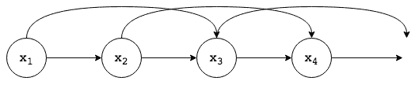

# 第二章：隐马尔可夫模型

在上一章中，我们讨论了马尔可夫链，它对于建模跨时间的观察序列非常有帮助。在本章中，我们将研究**隐马尔可夫模型**（**HMM**），它也用于建模序列数据，但比马尔可夫链更加灵活。

在本章中，我们将涵盖以下主题：

+   马尔可夫模型

+   HMM

+   HMM 的评估

+   HMM 的扩展

# 马尔可夫模型

马尔可夫模型是一种随机模型，其中随机变量在下一个时间点的状态仅依赖于当前时间点的随机变量结果。最简单的马尔可夫模型是马尔可夫链，我们在第一章中讨论过，*马尔可夫过程简介*。

假设我们有一组顺序观察值（*x[1],. . ., x[n])*，遵循马尔可夫性质，那么我们可以表示*N*个观察值的联合概率分布如下：


一阶马尔可夫链的图示表示，其中当前观察值的分布依赖于前一个观察值的值

上述马尔可夫链的表示与我们之前看到的表示不同。在这种表示中，观察值呈现为节点，边表示两个观察值之间的条件概率，即*Pr(x[n]|x[n-1])*。这就是概率图模型的一般表示方式，其中节点表示随机变量，边表示这两个变量之间的条件概率分布。这种图形化表示帮助我们理解随机变量之间的因果关系。

# 状态空间模型

我们可以看到，简单的马尔可夫链是非常有限的，不能很好地处理我们预期多个连续观察值能提供预测下一个观察值所需的重要信息的情况。幸运的是，马尔可夫链可以进行调整，以支持这些情况：



二阶马尔可夫链，其中当前观察值的分布依赖于最后两个观察值的值

让我们考虑一个马尔可夫链，其中下一个状态的概率不仅依赖于当前状态，还依赖于前一个状态。这种类型的马尔可夫链被称为**二阶马尔可夫链**，其联合概率分布可以表示如下：


利用 d-分离性质，我们可以看到，给定*X[n-1]*和*X[n-2]*的条件下，*X[n]*的条件分布与所有观察值*X[1], . . ., X[n-3]*是独立的。

类似地，我们可以将其扩展到一个*M^(th)*阶马尔可夫链，其中特定观察值的条件分布依赖于前*M*个观察值。然而，现在我们需要为增加的灵活性付出代价，即需要更多的参数。

假设观察值是具有*K*状态的离散变量。那么在一阶马尔可夫链中，条件分布*Pr(X[n]|X[n-1])*将由每个*K*状态的*X[n-1]*的*K-1*个参数来指定，给出总共*K(K-1)*个参数。如果我们将其扩展到一个*M^(th)*阶马尔可夫链，其中联合分布由条件分布*Pr(x[n]|x[n-M], . . ., x[n-1])*构建，那么该模型中的参数数量将为*K^(M-1)(K-1)*。由于这个数量随着*M*的增加呈指数增长，它通常会使得对于较大的*M*值，这种方法变得不切实际。但如果我们想构建一个不受马尔可夫假设阶数限制的序列数据模型，并且它可以通过有限数量的参数来表示，该怎么办呢？

这种模型可以通过引入潜在（或隐藏）变量来创建。潜在变量使我们能够构建由简单组件组成的丰富模型类。假设对于每个观察值，*x[n]*，我们有一个潜在变量，*z[n]*（它可能与观察变量的维度相同，也可能不同）。如果这些潜在变量形成一个一阶马尔可夫链，那么这种类型的模型可以称为**状态空间模型**，其表示如下图所示：


表示分布的状态空间模型，其中每个观察值都基于一个潜在变量进行条件化

利用 d-separation 性质，我们可以看到，任何两个观察变量之间始终存在一条路径，*x[n]*和*x[m]*通过潜在变量连接，而且这条路径永远不会被阻塞。因此，给定所有前期观察值的*Pr(x[n+1]|x[1], . . ., x[n])*分布不具有任何条件独立性特性，因此，*x[n+1]*的预测依赖于所有前期观察值。

由于潜在变量形成了一个马尔可夫链，它们满足以下条件分布：


因此，这个模型的联合分布可以表述如下：


# 隐马尔可夫模型（HMM）

隐马尔可夫模型（HMM）是状态空间模型的一个特例，其中潜在变量是离散的多项式变量。从图形表示来看，我们也可以将 HMM 视为一个双重随机过程，包含一个我们无法直接观察的隐藏随机马尔可夫过程（潜在变量），以及另一个生成观察序列的随机过程，这个过程基于第一个过程。

在继续讨论参数化之前，我们先通过一个掷硬币的例子来了解它的工作原理。假设我们有两枚不公平的硬币，*M[1]* 和 *M[2]*，其中 *M[1]* 具有较高的正面概率（70%），而 *M[2]* 具有较高的反面概率（80%）。某人按顺序掷这两枚硬币，但我们并不知道是哪一枚。我们只能观察到结果，它可能是正面（*H*）或反面（*T*）：


我们可以将选中的不公平硬币视为潜在变量，硬币投掷的结果视为观察数据。为了预测下一次观察序列的结果，我们至少需要以下信息：首先选择了哪枚硬币、给定之前选中的硬币下一枚硬币的选择以及根据硬币得到 *H* 或 *T* 的概率。假设两枚硬币在首次选择时的优先级相等，并且每次硬币的选择都是根据之前选择的硬币以同等的概率进行选择，我们可以创建如下的状态图：


掷硬币 HMM 的状态图

在之前的图示中，**z[1]** 和 **z[2]** 代表潜在变量硬币的状态（*其中 **z[1]** 代表硬币 **M[1]** 被选中，**z[2]** 代表硬币 **M[2]** 被选中*）。弧线表示从一个潜在变量状态转移到另一个状态的转移概率，直线则表示给定潜在变量（选中的硬币）时观察到的变量（投掷结果）的概率。

# HMM 的参数化

在上一节中，我们看到了一个 HMM 的例子来了解模型的工作原理。现在我们正式开始对 HMM 进行参数化。

由于 HMM 的潜在变量是离散的多项式变量，我们可以使用 1-of-K 编码方案来表示它，其中 *z[n]* 变量由一个 K 维的二进制变量向量表示，*z[nk] ∈ {0,1}*，当 *z[n]* 变量处于 *k* 状态时，*z[nk] = 1* 且 *z[nj] = 0*（对于 *j ≠ k*）。

考虑到这一点，我们可以创建一个包含转移概率矩阵 *A* 的矩阵，其中 *A[ij]* = *Pr(Z[nj] = 1| z[n-1], i = 1)*。由于 *A[ij]* 代表从状态 *i* 转移到状态 *j* 的概率，它具备  的性质，并且可以通过 *K(K-1)* 参数表示。因此，我们可以如下表示条件概率分布：


转移矩阵通常通过状态转移图来表示，正如我们在[第一章](https://cdp.packtpub.com/hands_on_markov_models_with_python/wp-admin/post.php?post=25&action=edit#post_24)中看到的，*马尔可夫过程简介*。但我们可以将相同的表示方法展开到时间维度，得到一个*网格*或*格子*图，如下图所示。在接下来的章节中，我们将使用这种 HMM 的表示方法来学习参数并从模型中进行推断：


带有三个状态的 HMM 隐变量的格子图

由于初始隐节点*z[1]*没有父节点，它具有边际分布*Pr(z[1])*，可以通过概率向量*π*表示，*π[k] = Pr(z[1k] = 1)*，如图所示。这样，*Pr(z[1]|π*)*的概率可以表示如下：


参数化 HMM 所需的第三个也是最后一个参数是给定隐变量的观测变量的条件概率，即发射概率。它由条件分布*Pr(x[n]| z[n], Φ)*表示，且由一些参数*Φ*控制。如果观测变量*x[n]*是离散的，则发射概率可以采用条件概率表的形式（多项式 HMM）。类似地，如果观测变量*x[n]*是连续的，则该分布可能是高斯分布（高斯 HMM），其中表示控制分布的参数集，即均值和方差。

因此，隐变量和观测变量的联合概率分布可以表示如下：


这里，*X = {x[1], ..., x[N]}*，*Z = {z[1], ..., z[N]}*，以及*θ = {A, π, Φ}*表示控制模型的参数集。

当所有控制隐变量的条件分布共享相同的转移矩阵*A*，且所有发射概率共享相同的参数*Φ*时，HMM 模型被称为**齐次模型**：

现在，让我们尝试编写一个简单的多项式隐马尔可夫模型（HMM）。我们将从定义一个简单的`MultinomialHMM`类开始，并在接下来的过程中不断添加方法：

```py
import numpy as np

class MultinomialHMM:
 def __init__(self, num_states, observation_states, prior_probabilities,
 transition_matrix, emission_probabilities):
 """
 Initialize Hidden Markov Model

 Parameters
 -----------
 num_states: int
 Number of states of latent variable
 observation_states: 1-D array
 An array representing the set of all observations
 prior_probabilities: 1-D array
 An array representing the prior probabilities of all the states
 of latent variable
        transition_matrix: 2-D array
            A matrix representing the transition probabilities of change of
            state of latent variable
        emission_probabilities: 2-D array
            A matrix representing the probability of a given observation
            given the state of the latent variable
        """
        # As latent variables form a Markov chain, we can use
        # use the previous defined MarkovChain class to create it
        self.latent_variable_markov_chain = MarkovChain(
            transition_matrix=transition_matrix,
            states=['z{index}'.format(index=index) for index in range(num_states)],
        )
        self.observation_states = observation_states
        self.prior_probabilities = np.atleast_1d(prior_probabilities)
        self.transition_matrix = np.atleast_2d(transition_matrix)
        self.emission_probabilities = np.atleast_2d(emission_probabilities)
```

使用`MultinomialHMM`类，我们可以像之前讨论的那样定义 HMM 硬币模型，如下所示：

```py
coin_hmm = MultinomialHMM(num_states=2,
                          observation_states=['H', 'T'],
                          prior_probabilities=[0.5, 0.5],
                          transition_matrix=[[0.5, 0.5], [0.5, 0.5]],
                          emission_probabilities=[[0.8, 0.2], [0.3, 0.7]])
```

# 生成观测序列

对于一个由*{A, π, Φ}*参数化的 HMM，我们可以通过以下步骤生成一系列观测值，*{x[1], ..., x[N]}*：

1.  设置*n = 1*

1.  根据先验分布*π*选择初始隐状态*z[1]*：

1.  根据给定的*z[1]*值，通过采样由*Φ*控制的发射概率分布来选择观测值，*x[1]*：

1.  根据状态转移概率矩阵 *A*，转移到潜变量 *z[n+1]* 的下一个状态

1.  设置 *n = n + 1* 并重复第 3 步，如果 *n ≤ N*，否则终止

我们可以向之前定义的 `MultinomialHMM` 类中添加一个生成样本的方法，如下所示：

```py
def observation_from_state(self, state):
    """
    Generate observation for a given state in accordance with
    the emission probabilities

    Parameters
    ----------
    state: int
        Index of the current state
    """
    state_index = self.latent_variable_markov_chain.index_dict[state]
    return np.random.choice(self.observation_states,
                            p=self.emission_probabilities[state_index, :])

def generate_samples(self, no=10):
    """
    Generate samples from the hidden Markov model

    Parameters
    ----------
    no: int
        Number of samples to be drawn

    Returns
    -------
    observations: 1-D array
        An array of sequence of observations

    state_sequence: 1-D array
        An array of sequence of states
    """
    observations = []
    state_sequence = []

    initial_state = np.random.choice(self.latent_variable_markov_chain.states,
                                     p=self.prior_probabilities)

    state_sequence.append(initial_state)
    observations.append(self.observation_from_state(initial_state))

    current_state = initial_state
    for i in range(2, no):
        next_state = self.latent_variable_markov_chain.next_state(current_state)
        state_sequence.append(next_state)
        observations.append(self.observation_from_state(next_state))
        current_state = next_state

    return observations, state_sequence
```

我们可以在 HMM 投币示例上使用 `generate_samples` 方法来生成观测序列：

```py
>>> coin_hmm.generate_samples()
(['T', 'H', 'H', 'T', 'T', 'H', 'H', 'H', 'H'], ['z1', 'z0', 'z0', 'z1', 'z1', 'z0', 'z1', 'z1', 'z1'])
```

# 安装 Python 包

HMM 也可以拥有用于发射概率的高斯分布。就像 `MultinomialHMM` 一样，我们也可以从 `GaussianHMM` 中进行采样。在下一个代码示例中，我们使用 `hmmlearn` 库提供的 `GaussianHMM` 类，看看如何从这种类型的模型中生成样本：

```py
source activate hmm
conda install scikit-learn
pip install hmmlearn
```

一旦安装了 Python 包，我们可以使用以下代码从 `Gaussian HMM` 生成样本：

```py
from hmmlearn.hmm import GaussianHMM
import numpy as np
import matplotlib.pyplot as plt

startprob = np.array([0.6, 0.3, 0.1, 0.0])
# The transition matrix, note that there are no transitions possible
# between component 1 and 3
transmat = np.array([[0.7, 0.2, 0.0, 0.1],
                     [0.3, 0.5, 0.2, 0.0],
                     [0.0, 0.3, 0.5, 0.2],
                     [0.2, 0.0, 0.2, 0.6]])
# The means of each component
means = np.array([[0.0,  0.0],
                  [0.0, 11.0],
                  [9.0, 10.0],
                  [11.0, -1.0]])
# The covariance of each component
covars = .5 * np.tile(np.identity(2), (4, 1, 1))

# Build an HMM instance and set parameters
model = hmm.GaussianHMM(n_components=4, covariance_type="full")

# Instead of fitting it from the data, we directly set the estimated
# parameters, the means and covariance of the components
model.startprob_ = startprob
model.transmat_ = transmat
model.means_ = means
model.covars_ = covars

X, state_sequence = model.sample(n_samples=100)

plt.plot(X[:, 0], X[:, 1], ".-", label="observations", ms=6,
         mfc="orange", alpha=0.7)
for i, m in enumerate(means):
    plt.text(m[0], m[1], 'Component %i' % (i + 1),
             size=12, horizontalalignment='center',
             bbox=dict(alpha=.7, facecolor='w'))
plt.legend(loc='best')
plt.show()
```


从具有四状态潜变量 z 和高斯发射模型 p(x|z) 的 HMM 中进行采样

# HMM 的评估

在前一节中，我们讨论了生成给定 HMM 的观测序列。但是，实际上，大多数时候我们并不关心生成观测序列，主要是因为我们一开始并不知道 HMM 的参数，因此无法生成观测。

对于给定的 HMM 表示，在大多数应用中，我们总是试图解决以下三个问题：

+   **模型评估**：给定模型的参数和观测序列，估计该序列的概率

+   **预测最优序列**：给定模型的参数和观测序列，估计产生这些观测的最可能的状态序列

+   **参数学习**：给定一系列观测，估计生成这些观测的 HMM 模型的参数

在本节中，我们将讨论第一个问题，即模型评估，接下来的章节中，我们将详细讨论其他两个问题。正如我们将在后续章节中看到的，评估模型是解决其他两个问题的基础。因此，高效地解决这个问题是迈向参数学习和推理的第一步。

让我们正式描述模型评估问题。给定一个由 *θ = {A, π, Φ}* 参数化的 HMM 和一个观测序列，*X = {x[1], ..., x[N]}*，我们需要计算 *Pr(X|θ)* 的概率。通过前一节的讨论，我们可以说，我们可以通过边缘化联合概率分布 *Pr(X, Z|θ)* 来计算 *Pr(X|θ)*，其中 *Z = {z[1], ..., z[N]}*，对 *Z* 进行边际化：


在前一节中，我们看到以下结论：


因此，*Pr(X, Z|θ)* 概率可以表示为如下：


对于具有 *K* 状态和观测长度 *N* 的模型，有 *K^T* 种可能的状态序列。求和中的每一项需要 *2N* 次运算。因此，评估的复杂度为 *2N X K^T* 的数量级。例如，如果我们考虑一个具有五个状态的模型，*K = 5*，并且观测序列的长度为 *N = 100*，则所需的运算次数为 10⁷² 级别，这使得即使对于一个非常小的 HMM，评估方法也变得不可处理。

# HMM 的扩展

在前面的章节中，我们讨论了 HMM，从中进行采样并根据其参数评估给定序列的概率。在本节中，我们将讨论它的一些变种。

# 因式分解 HMM

让我们考虑建模一系列图像中多个物体的问题。如果图像中有 *M* 个物体，且每个物体有 *K* 种不同的位置和方向，则该图像背后的系统可能有 *K^M* 种状态。一个 HMM 将需要 *K^M* 个不同的状态来建模该系统。这种表示系统的方式不仅效率低，而且难以解释。我们更希望我们的 HMM 能够通过使用 *M* 个不同的 *K* 维变量来捕捉状态空间。

因式分解 HMM 就是这样的一种表示方法。在这个模型中，存在多个独立的马尔可夫链潜在变量，并且在任何给定时间，观测变量的分布都依赖于该时间点所有对应潜在变量的状态。该系统的图形模型可以表示如下：


包含两个马尔可夫链的因式分解 HMM

考虑因式分解 HMM 的动机可以通过注意到，在某一时间步表示 10 位信息时，标准 HMM 需要 *K = 2¹⁰ = 1024* 个潜在状态，而因式分解 HMM 可以使用 10 个二进制的潜在链。然而，这会带来额外的训练复杂度，正如我们将在后续章节中看到的那样。

# 树形结构 HMM

在前一节中，我们讨论了因式分解 HMM，其中潜在变量形成独立的马尔可夫链。通过引入潜在变量之间的耦合，可以放宽关于潜在变量的独立性假设。一种耦合潜在变量的方法是将它们排序，使得  依赖于  对于所有 *1 ≤ l ≤ m*。此外，如果所有的输出变量和潜在变量都依赖于某个随机输入变量 *x[n]*，则我们得到一个树形结构的 HMM，表示如下：


树形结构 HMM 的图示表示

该模型的架构可以解释为一个概率决策树。我们首先考虑时间切片*n=1*，并尝试理解这个模型是如何生成数据的。根据*x[1]*的值，顶节点，，可以取*K*个值（假设隐藏变量有*K*个状态）。这将*x*空间划分为*K*个决策组。下一个节点，，进一步划分为*K*个子区域，以此类推。输出，*y[1]*，是由输入*x[1]*和每个节点的 K 种决策生成的。在下一个时间切片中，同样的事情会发生，只不过树中的每个决策都依赖于前一个时间切片中该节点所做的决策。因此，该模型可以解释为一个具有马尔可夫动态的概率决策树。

# 总结

本章中，我们详细介绍了马尔可夫模型和 HMM。我们讨论了如何对 HMM 进行参数化，从中生成样本，以及它们的代码。我们讨论了如何估计观测的概率，这将构成推理的基础，下一章我们将讲解这一部分内容。我们还讨论了 HMM 的各种扩展。

在下一章中，我们将深入探讨 HMM 中的推理。
