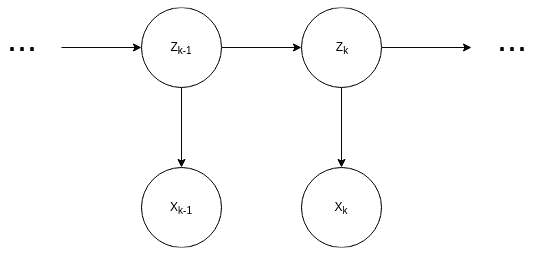
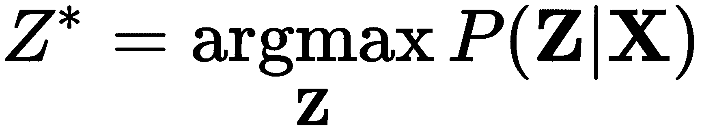
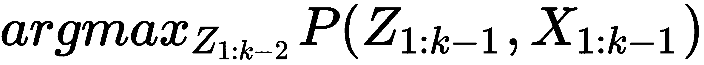

# 第三章：状态推理 - 预测状态

在前几章中，我们介绍了马尔可夫链和**隐马尔可夫模型**（**HMM**），并展示了如何用它们来建模问题。在本章中，我们将看到如何使用这些模型进行预测或向模型提问（称为**推理**）。用于计算这些值的算法称为**推理算法**。在本章中，我们将专门研究如何计算状态变量的概率分布。

本章将涵盖以下主题：

+   隐马尔可夫模型中的状态推理

+   动态规划

+   前向-后向算法

+   维特比算法

# 隐马尔可夫模型中的状态推理

让我们从一个简单的例子开始，展示我们可以对我们的 HMM 模型提出什么有趣的问题。我们以*机器人定位*为例。这个例子有很多变体，但我们假设机器人在一个二维网格中移动，如*图 3.1*所示。机器人上有四个传感器，这些传感器能检测机器人周围是否有墙壁，并且每个传感器都有一个特定的方向。

我们希望在以下网格中建模机器人的运动，并结合传感器的观测结果：


图 3.1：机器人在不同时间点的位置概率分布

在*图 3.1*中，我们可以看到不同时间点的观察如何改变机器人在网格中位置的概率。最初，我们从对网格中所有位置的均匀概率开始。现在，在时间*t=1*时，假设我们机器人的传感器显示出顶部和底部有墙壁。得到这个观察结果后，我们对机器人位置的感知会发生变化。现在，我们会更倾向于认为机器人处于 2、4、10 或 12 块区域，如*图 3.1*中的第二块所示。如果我们在时间实例*t=2*，机器人传感器显示只有顶部有墙壁，那么它最有可能处于 3 块区域，如*图 3.1*中的第三块所示。这是因为我们知道它上次最有可能的位置，并且将这个信息与当前的传感器读数结合起来，3 块区域就是机器人可能的位置。现在，如果我们在时间*t=3*，机器人传感器显示左右两侧都有墙壁，那么它最有可能位于 7 块区域。这一过程使我们能够仅凭传感器读数随着时间推移定位机器人在网格中的位置。

由于我们在模型中考虑了机器人在一段时间内的状态转移（网格中的位置）以及每个时刻的结果（传感器输出），因此 HMM 在这种情况下似乎是完美的模型。在这个示例中，我们假设我们知道机器人的位置转移概率。我们还假设我们知道网格的结构，因此我们也能知道发射概率。我们可以利用发射概率来建模传感器输出的不确定性，因为它们在某些时刻可能会给出噪声结果：


图 3.2：机器人定位的一个 HMM 示例

现在让我们考虑一下我们可能想要向模型提问的问题。我们可能有兴趣了解在某个时刻给定直到该时刻的所有观测值后，机器人的位置。我们可能还想知道在某个时刻，给定直到该时刻的所有位置，传感器输出的概率。我们也可能有兴趣计算我们观察到的变量和机器人位置的联合分布。所有这些值都可以使用 *前向算法、后向算法或前向-后向算法* 轻松计算。

现在，我们不再询问分布，而是可能对机器人走过的最可能路径感兴趣。为了计算最可能的路径，我们需要对机器人每个时刻的状态进行 MAP 推理。使用维特比算法可以高效地完成这项工作。

在接下来的章节中，我们将正式介绍这些算法，并看看如何实现它们。所有这些算法都依赖于一个非常重要的编程范式，称为**动态规划**。*动态规划使我们能够在可处理的时间内运行这些 HMM 推理算法。我们将在下一节详细讨论动态规划。*

# 动态规划

动态规划是一种编程范式，在这种范式中，我们将一个复杂问题划分为更小的子问题。我们解决这些子问题并存储结果。每当我们需要重新计算相同的子问题时，我们只需使用存储的结果，从而节省了计算时间，代价是使用了存储空间。这种缓存子问题结果的技术称为**备忘录法**。*因此，使用动态规划通过备忘录法可以加速我们的计算，并且在某些情况下，它能将计算复杂度从指数级降低到线性级，正如我们将在以下示例中看到的那样。*

使用动态规划优化的最简单示例之一是计算斐波那契数列的 *n^(th)* 项。斐波那契数列中的任何项都是前两项之和，可以正式定义为如下：

*fib(0)=0*

*fib(1)=1*

*fib(n)=fib(n-1)+fib(n-2)*

在这里，*fib(n)*表示斐波那契数列中的*n*^(*th*)项。根据定义，我们可以轻松地计算出斐波那契数列：*0, 1, 1, 2, 3, 5, 8, 13*。

现在，假设我们想写一个函数，它将返回斐波那契数列中的*n*^(*th*)项。写这个函数的一个简单方法是使用递归，如下所示：

```py
def fibonacci(n):
    """
    Returns the n-th number in the Fibonacci sequence.

    Parameters
    ----------
    n: int
       The n-th number in the Fibonacci sequence.
    """
    if n <= 1:
        return n
    else:
        return fibonacci(n-1) + fibonacci(n-2)
```

在上述代码中，我们有一个简单的`if ... else`条件语句，其中如果`n`小于或等于 1，我们返回`n`的值；否则，我们使用递归来计算数列中前两个数字的和。现在让我们尝试确定对于一个小的`n`值，比如 5，`fibonacci`函数的调用次数。我们的函数调用可能类似于以下方式：

```py
fibonacci(5) = fibonacci(4) + fibonacci(3)
fibonacci(5) = (fibonacci(3) + fibonacci(2)) + (fibonacci(2) + fibonacci(1))
fibonacci(5) = ((fibonacci(2) + fibonacci(1)) + (fibonacci(1) + fibonacci(0))) + ((fibonacci(1) + fibonacci(0)) + fibonacci(1))
fibonacci(5) = (((fibonacci(1) + fibonacci(0)) + fibonacci(1)) + (fibonacci(1) + fibonacci(0))) + ((fibonacci(1) + fibonacci(0)) + fibonacci(1))
```

对于如此小的`n`值，我们仍然可以看到在相同参数的函数调用中存在重复。我们可以看到`fibonacci(1)`被调用了五次，而`fibonacci(0)`被调用了三次。如果我们再往上看一层，我们会看到`fibonacci(2)`也被多次调用。在这种情况下，计算仍然是可处理的，但对于较大的`n`值，这个函数的运行时间将呈指数增长；其时间复杂度为*O(2^n)*。为了让大家了解运行时间的增长速度，使用该算法计算斐波那契数列的第 1,000 项，我们所需要的时间将比我们可观察到的宇宙的年龄还要长，前提是计算机上有宇宙中所有的电子。

由于我们已经证明，对于任何适中的`n`值，计算斐波那契数列的*n*^(*th*)项是不可能的，因此我们将研究另一种基于动态规划的算法，代码如下所示：

```py
cache = {0: 0, 1: 1} # Initialize the first two values.
def fibonacci(n):
    """
    Returns the n-th number in the Fibonacci sequence.

    Parameters
    ----------
    n: int
       The n-th number in the Fibonacci sequence.
    """
     try:
         return cache[n]
     except KeyError:
         fib = fibonacci(n-1) + fibonacci(n-2)
         cache[n] = fib 
         return fib
```

在这种情况下，我们将每次调用函数的结果存储在字典中，这样我们就可以在*O(1)*的时间内访问它。由于这个缓存，我们只需要计算斐波那契数列的每一项一次。对于每次调用，我们首先检查是否已经计算过该值。如果已经计算过，我们直接从字典中访问该值，否则我们进行计算。这个算法的运行时复杂度为*O(n)*，因为我们每次只计算一次数列中的每一项。因此，我们可以看到，使用动态规划可以在运行时复杂度和内存复杂度之间进行权衡，从而将运行时复杂度从指数级降低到线性级。

如果我们考虑一下我们编写斐波那契数列的方式，我们首先尝试计算*n*^(*th*)项，然后计算缺失的值。这可以看作是一种自顶向下的方法。另一种方法是自底向上的方法，我们从计算第 0 项开始，然后逐步计算第一项、第二项，依此类推。动态规划的概念在这两种情况下是相同的，但在如何编写代码上有一个小的差异，如下所示：

```py
cache = [0, 1]   # Initialize with the first two terms of Fibonacci series.
def fibonacci(n):
    """
    Returns the n-th number in the Fibonacci sequence.

    Parameters
    ----------
    n: int
       The n-th number in the Fibonacci sequence.
    """
    for i in range(2, n):
        cache.append(cache[i-1] + cache[i-2])
    return cache[-1]
```

如你所见，前面示例中的代码要简洁得多，我们不需要检查是否已经计算过这些值。这对于需要利用所有先前值来计算下一个值的问题非常有效。然而，如果我们不需要所有的先前值，我们最终会在自下而上的方法中计算一些不必要的值。

在接下来的章节中，我们将看到 HMM 中的推理算法使我们能够使用动态规划将问题拆解成子问题，从而使得计算变得可处理。

# 前向算法

现在我们正式定义前向算法中的问题。在前向算法的情况下，我们试图计算机器人在任何时间点的联合分布，利用到那个时间点为止传感器的输出，如下图所示：

*前向算法：P(Z[k], X[1:k])*



图 3.3：HMM 显示两个时间片，*k-1*和**k**

为了计算这个概率分布，我们将尝试将联合分布项拆分成更小的已知项。正如我们将看到的，我们可以为该分布写出一个递归公式。我们首先通过在分布*P(Z[k], X[1:k])*中引入一个新变量*Z[k-1]*，如下所示：


概率的边缘化法则是：


概率的乘法法则是：


在这里，我们基本上是使用概率的*边缘化*法则来引入*Z[k-1]*，然后对其状态进行求和。在这种情况下，我们假设*Z[k-1]*有*m*个状态，因此现在我们可以使用概率的*乘法*法则来将此项拆分如下：


在上一章中，我们看到了 HMM 的 d-分离属性如何使变量彼此独立。在这里，我们将应用其中的一些条件来简化前面方程中的项。正如我们所知道的，给定隐藏状态时，观察值与之前时间实例中的所有项相互独立，我们也知道：。将其应用到我们前面方程的第一项，我们可以将其写为如下：


同样，我们知道当前的隐藏状态依赖于上一个隐藏状态，并且与之前的隐藏状态相互独立。因此，在这种情况下，公式是！[](img/2b04e26f-a094-4bec-8aa0-00e2354cb748.png)。利用这一属性，我们可以将方程中的第二项写为如下：


现在，如果我们将最后一项与我们试图计算的项进行比较，我们应该能够看到它们之间的相似性。我们定义一个新的函数，*α*，如下所示：


现在我们可以将原始方程重写为如下：


所以，我们现在有了一个很好的递归方程，并且我们对方程中的所有项都很熟悉。第一个项，*P(X[k]|Z[k])*，是 HMM 的发射概率。方程的第二个项，*P(Z[k]|Z[k-1])*，是转移概率，也是已知的。现在我们可以集中精力求解这个递归方程。在求解任何递归方程时，我们需要知道至少一个值，以便开始计算连续的项。在这个例子中，我们知道*α(1)*的值，给出如下：


这里，*P(Z[1])*是我们已知的机器人位置的初始概率，而*P(X[1]|Z[1])*是已知的隐马尔可夫模型（HMM）的发射概率。通过这两个值，我们可以计算出*α(1)*的值。一旦得到*α(1)*的值，我们可以利用递归公式计算所有的*α*值。

现在让我们来讨论一下这个算法的计算复杂度，看看推理是否可行。正如我们在计算每个*α*的公式中看到的那样，我们对所有状态*Z[k-1]*进行求和，而我们假设它有*m*个状态；在每一步中，我们进行*m*次乘法操作来计算*P(X[k]|Z[k])P(Z[k]|Z[k-1])α(k-1)*。因此，为了计算下一个*α*，我们需要进行*m²*次计算。如果我们想要计算*α(n)*，我们将需要*nm²*次计算，这样我们就得到了算法的计算复杂度为*O(nm²)*。

现在让我们尝试编写代码来解决我们的机器人定位问题，利用前向算法计算联合分布。为了简化起见，假设我们只有一个传感器，它检查机器人左侧是否有墙壁。为了定义模型，我们主要需要两个量：转移矩阵和发射矩阵。在我们的例子中，我们假设机器人在任意时刻可以保持原位置，或者以相等的概率*0.33*向任意方向移动一个单位。因此，如果机器人在任意时刻处于位置 1，它可以出现在位置 1、2 或 6，且概率相等。

这样，我们可以将从状态 1 的转移概率写成：


以类似的方式，我们可以写出从每个位置的转移概率*P(Z[t+1]|Z[t])*，并得到以下转移矩阵：

```py
import numpy as np

transition_matrix = np.array([[0.33, 0.33,    0,    0,    0, 0.33,    0,    0,    0,    0,    0,    0,    0],
              [0.33, 0.33, 0.33,    0,    0,    0,    0,    0,    0,    0,    0,    0,    0],
              [   0, 0.25, 0.25, 0.25,    0,    0, 0.25,    0,    0,    0,    0,    0,    0],
              [   0,    0, 0.33, 0.33, 0.33,    0,    0,    0,    0,    0,    0,    0,    0],
              [   0,    0,    0, 0.33, 0.33,    0,    0, 0.33,    0,    0,    0,    0,    0],
              [0.33,    0,    0,    0,    0, 0.33,    0,    0, 0.33,    0,    0,    0,    0],
              [   0,    0, 0.33,    0,    0,    0, 0.33,    0,    0,    0, 0.33,    0,    0],
              [   0,    0,    0,    0, 0.33,    0,    0, 0.33,    0,    0,    0,    0, 0.33],
              [   0,    0,    0,    0,    0, 0.33,    0,    0, 0.33, 0.33,    0,    0,    0],
              [   0,    0,    0,    0,    0,    0,    0,    0, 0.33, 0.33, 0.33,    0,    0],
              [   0,    0,    0,    0,    0,    0,    0,    0,    0, 0.33, 0.33, 0.33,    0],
              [   0,    0,    0,    0,    0,    0,    0,    0,    0,    0, 0.33, 0.33, 0.33],
              [   0,    0,    0,    0,    0,    0,    0, 0.33,    0,    0,    0, 0.33, 0.33]])
```

在这个问题中，关于发射概率*P(X[t]|Z[t])*，我们应该为左侧有墙壁的状态分配发射概率 1。因此，发射概率将如下所示：

```py
emission = np.array([1.0, 0.0, 0.0, 0.0, 0.0, 1.0, 1.0, 1.0, 1.0, 0.0, 0.0, 0.0, 0.0])
```

然而，由于我们不知道机器人在*t=0*时的位置，我们假设它在所有可能的状态上均匀分布。因此，初始概率*P(Z[0])*可以写成如下形式：

```py
init_prob = np.array([0.077, 0.077, 0.077, 0.077, 0.077, 0.077, 0.077,
                      0.077, 0.077, 0.077, 0.077, 0.077, 0.077])
```

在掌握了这些值后，我们应该能够运行前向算法，但在此之前，我们需要按如下方式编码算法：

```py
def forward(obs, transition, emission, init):
    """
    Runs forward algorithm on the HMM.

    Parameters
    ----------
    obs:        1D list, array-like
                The list of observed states.

    transition: 2D array-like
                The transition probability of the HMM.
                size = {n_states x n_states}

    emission:   1D array-like
                The emission probability of the HMM.
                size = {n_states}

    init:       1D array-like
                The initial probability of HMM.
                size = {n_states}

    Returns
    -------
    float: Probability value for the obs to occur.
    """
    n_states = transition.shape[0]
    fwd = [{}]

    for i in range(n_states):
        fwd[0][y] = init[i] * emission[obs[0]]
    for t in range(1, len(obs)):
        fwd.append({})
        for i in range(n_states):
            fwd[t][i] = sum((fwd[t-1][y0] * transition[y0][i] * emission[obs[t]]) for y0 in 
                                    range(n_states))
    prob = sum((fwd[len(obs) - 1][s]) for s in range(n_states))
    return prob
```

我们可以通过对一些观察结果进行计算来尝试计算该概率，如下所示：

```py
>>> obs = [0, 0, 0, 0] # Staying in the same location
>>> forward(obs, transition_matrix, emission, init_prob)
0.97381776799999997

>>> obs = [0, 10, 8, 6] # Should be 0 because can't jump from state 0 to 10.
>>> forward(obs, transition_matrix, emission, init_prob)
0.0
```

# 计算给定观察结果的隐藏状态的条件分布

使用前向算法，我们已经能够计算出*P(Z[x], X)*的值，因此我们可能会认为，我们可以轻松地使用以下乘法规则来计算条件分布*P(Z[k], X)*：


然而，计算分布*P(X)*是计算上不可行的，正如我们将看到的那样。我们可以将*P(Z[k], X)*表示为：


因此，我们可以计算*P(X)*如下：


如果我们查看使用上述方程计算*P(X)*的计算复杂度，它是*O(m^n)*，对于任何足够大的*m*和*n*值而言，这都是不可行的。因此，仅使用前向算法计算隐藏状态的条件分布是不可能的。在接下来的章节中，我们将介绍反向算法，并向您展示如何计算这些条件分布。

# 反向算法

让我们正式定义反向算法的问题描述。在这种情况下，我们试图计算给定当前状态下观察变量的概率：

*反向算法：P(X[k+1:n]|Z[k])*


图 3.4：HMM 展示了两个时间片，*k*和*k+1*

类似于我们在前向算法中所做的那样，我们将再次尝试将这个概率项转换为一个递归方程，以已知分布为基础，从而递归地计算不同时间点的概率。首先，我们引入一个新项*Z[k+1]*，在*P(X[k+1:n]|Z[k])*中，使用边际化规则：


在这里，我们通过对所有可能的状态求和来对*Z[k+1]*变量进行边际化，我们假设它的取值为*m*。现在，我们可以使用概率的乘法规则将上述方程分解为：


现在，从我们模型的 d-分离性质中，我们知道！[](img/19fa7ae2-606d-455a-a00b-877849f4f47f.png)。此外，我们从 HMM 的定义中知道！[](img/29e48e7c-7ec1-4193-b98d-fd5c4aadffbb.png)。利用这些独立条件，我们可以将我们的方程写成：


现在，我们方程中的项看起来很熟悉。第二项是发射概率，最后一项是我们 HMM 的转移概率。现在，为了将其表示为递归，让我们定义一个新的函数*β*，如以下所示：


我们可以在前一个方程中使用β来表示它作为递归：


现在，由于我们已经有了递归方程，我们可以开始计算不同的 *β[k]* 值。但在计算这些值时，我们至少需要知道递归中的一个项，所以我们先计算 *β(1)* 的值：


```py
def backward(obs, transition, emission, init):
    """
    Runs backward algorithm on the HMM.

    Parameters
    ----------
    obs:        1D list, array-like
                The list of observed states.

    transition: 2D array-like
                The transition probability of the HMM.
                size = {n_states x n_states}

    emission:   1D array-like
                The emission probabilitiy of the HMM.
                size = {n_states}

    init:       1D array-like
                The initial probability of HMM.
                size = {n_states}

    Returns
    -------
    float: Probability value for the obs to occur.
    """
    n_states = transition.shape[0]
    bkw = [{} for t in range(len(obs))]
    T = len(obs)

    for y in range(n_states):
        bkw[T-1][y] = 1
    for t in reversed(range(T-1)):
        for y in range(n_states):
            bkw[t][y] = sum((bkw[t+1][y1] * transition[y][y1] * emission[obs[t+1]]) for y1 in 
                                    range(n_states))
    prob = sum((init[y] * emission[obs[0]] * bkw[0][y]) for y in range(n_states))
    return prob
```

我们还可以在相同的观察值上运行这个算法，看看结果是否正确：

```py
>>> obs = [0, 0, 0, 0] # Staying in the same location
>>> backward(obs, transition_matrix, emission, init_prob)
0.97381776799999997

>>> obs = [0, 10, 8, 6] # Should be 0 because can't jump from state 0 to 10.
>>> backward(obs, transition_matrix, emission, init_prob)
0.0
```

# 前向-后向算法（平滑）

进入前向-后向算法，我们现在正试图计算给定观察值下隐藏状态的条件分布。

以我们的机器人定位为例，我们现在试图找到给定传感器读数时，机器人在某个时刻位置的概率分布：

*前向-后向算法：P(Z[k]|X)*

图 3.5：HMM 显示三个时间片，*k-1*，*k* 和 *k+1*。

现在，由于模型中所有观察到的变量都已给定，我们可以说 *P(Z[k]|X)* 的值将与 *Z[k]* 和 *X* 的联合分布成正比：


现在，我们知道可以将 *X={X[1:k]， X[k+1:n]}*。将其代入前面的方程中，我们得到：


我们可以应用前面的链式法则将其写为：


从我们的模型结构来看，我们知道 ，并利用这一独立性性质，我们可以将前面的方程写为：


现在，如果我们看一下前面的项，第一项是 *P(X[k+1:n]|Z[k])*，这是我们在后向算法中计算的结果。第二项是 *P(Z[k], X[1:k])*，这是我们在前向算法中计算的结果。因此，在计算 *P(Z[k|]X)* 时，我们可以使用前向和后向算法计算这两个项。但由于 *P(Z[k|]X)* 与这两个项的乘积成正比，我们需要对分布进行归一化。

# 维特比算法

到目前为止，我们一直在尝试计算模型中的不同条件和联合概率。但前向-后向算法无法做的一件事是，给定观察值后，找出模型中隐藏变量的最可能状态。形式上，我们可以将这个问题写为：我们知道观察变量、转移概率和网络的发射概率，并且我们希望计算 *Z^**，其定义为：



其中，

*Z={Z[1]， Z[2]， …， Z[n]}*

另外，

*X={X[1]， X[2]， …， X[n]}*

**概率分布操作的性质**：

当我们对概率分布进行操作（边缘化、最大化等）时，可以通过分布的独立项将操作推进去。我们可以在边缘化和 *argmax* 的例子中看到这些：


图 3.6：显示三个时间切片 *k-2*、*k-1* 和 *k* 的 HMM

由于我们看到 *P(Z|X)∝ P(Z, X)*，并且因为我们正在尝试计算 *argmax*，所以无论我们在哪两个项中计算，结果都不重要。因此我们可以说：


现在，我们将再次尝试将我们的方程形式化为递归，以便更容易进行计算。那么，接下来我们引入一个新的项，*µ(k)*，定义为：


再次，我们将尝试将此项拆分为已知项。使用链式法则，我们可以将其写为：


现在，我们开始使用该性质推入 *argmax* 参数（请参见信息框了解详细信息）。这将给出我们：


这些术语看起来很熟悉，*P(X[k]|Z[k])* 是发射概率，*P(Z[k]|Z[k-1])* 是转移概率，且  是 *µ(k-1)*。现在我们有一个递归方程可以使用：


既然我们有了递归公式，如果我们知道第一个项的值，就可以计算任何 *k* 的值。那么，首先让我们来看一下递归的第一个项，即 *µ(1)*：


这里，第一个项是 *P(Z[1])*，即我们的初始概率，是已知的。第二项是 *P(X[1]|Z[1])*，即我们模型的发射概率：

```py
import numpy as np

def viterbi(obs, transition, emission, init=None):
    """
    Return the MAP estimate of state trajectory of Hidden Markov Model.

    Parameters
    ----------
    y : array (T,)
        Observation state sequence. int dtype.

    transition : array (K, K)
        State transition matrix. See HiddenMarkovModel.state_transition for
        details.

    emission : array (K,)
        Emission matrix. See HiddenMarkovModel.emission for details.

    init: optional, (K,)
        Initial state probabilities: Pi[i] is the probability x[0] == i. If
        None, uniform initial distribution is assumed (Pi[:] == 1/K).

    Returns
    -------
    x : array (T,)
        Maximum a posteriori probability estimate of hidden state trajectory,
        conditioned on observation sequence y under the model parameters.

    T1: array (K, T)
        the probability of the most likely path so far

    T2: array (K, T)
        the x_j-1 of the most likely path so far
    """
    # Cardinality of the state space
    K = transition.shape[0]

    emission = np.repeat(emission[np.newaxis, :], K, axis=0)

    # Initialize the priors with default (uniform dist) if not given by caller
    init = init if init is not None else np.full(K, 1 / K)
    T = len(obs)
    T1 = np.empty((K, T), 'd')
    T2 = np.empty((K, T), 'B')

    # Initilaize the tracking tables from first observation
    T1[:, 0] = init * emission[:, obs[0]]
    T2[:, 0] = 0

    # Iterate throught the observations updating the tracking tables
    for i in range(1, T):
        T1[:, i] = np.max(T1[:, i - 1] * transition.T * emission[np.newaxis, :, obs[i]].T, 1)
        T2[:, i] = np.argmax(T1[:, i - 1] * transition.T, 1)

    # Build the output, optimal model trajectory
    x = np.empty(T, 'B')
    x[-1] = np.argmax(T1[:, T - 1])
    for i in reversed(range(1, T)):
        x[i - 1] = T2[x[i], i]

    return x, T1, T2
```

我们可以用相同的观测值来试试：

```py
>>> x, T1, T2 = viterbi([0, 0, 0, 0], transition_matrix, emission, init_prob)
>>> print(x)
array([0, 0, 0, 0], dtype=uint8)
>>> print(T1)
array([[ 0.077, 0.02541, 0.0083853, 0.00276715],
       [ 0.077, 0.02541, 0.0083853, 0.00276715],
       [ 0.077, 0.02541, 0.0083853, 0.00276715],
       [ 0.077, 0.02541, 0.0083853, 0.00276715],
       [ 0.077, 0.02541, 0.0083853, 0.00276715],
       [ 0.077, 0.02541, 0.0083853, 0.00276715],
       [ 0.077, 0.02541, 0.0083853, 0.00276715],
       [ 0.077, 0.02541, 0.0083853, 0.00276715],
       [ 0.077, 0.02541, 0.0083853, 0.00276715],
       [ 0.077, 0.02541, 0.0083853, 0.00276715],
       [ 0.077, 0.02541, 0.0083853, 0.00276715],
       [ 0.077, 0.02541, 0.0083853, 0.00276715],
       [ 0.077, 0.02541, 0.0083853, 0.00276715]])
>>> print(T2)
array([[ 0, 0, 0, 0],
       [ 0, 0, 0, 0],
       [ 0, 1, 1, 1],
       [ 0, 3, 3, 3],
       [ 0, 3, 3, 3],
       [ 0, 0, 0, 0],
       [ 0, 6, 6, 6],
       [ 0, 4, 4, 4],
       [ 0, 5, 5, 5],
       [ 0, 8, 8, 8],
       [ 0, 6, 6, 6],
       [ 0, 10, 10, 10],
       [ 0, 7, 7, 7]], dtype=uint8)

>>> x, T1, T2 = viterbi([0, 10, 8, 6], transition_matrix, emission, init_prob)
>>> print(x)
array([0, 0, 0, 0], dtype=uint8)
>>> print(T1)
array([[ 0.077, 0., 0., 0\. ],
       [ 0.077, 0., 0., 0\. ],
       [ 0.077, 0., 0., 0\. ],
       [ 0.077, 0., 0., 0\. ],
       [ 0.077, 0., 0., 0\. ],
       [ 0.077, 0., 0., 0\. ],
       [ 0.077, 0., 0., 0\. ],
       [ 0.077, 0., 0., 0\. ],
       [ 0.077, 0., 0., 0\. ],
       [ 0.077, 0., 0., 0\. ],
       [ 0.077, 0., 0., 0\. ],
       [ 0.077, 0., 0., 0\. ],
       [ 0.077, 0., 0., 0\. ]])

>>> print(T2)
array([[ 0, 0, 0, 0],
       [ 0, 0, 0, 0],
       [ 0, 1, 0, 0],
       [ 0, 3, 0, 0],
       [ 0, 3, 0, 0],
       [ 0, 0, 0, 0],
       [ 0, 6, 0, 0],
       [ 0, 4, 0, 0],
       [ 0, 5, 0, 0],
       [ 0, 8, 0, 0],
       [ 0, 6, 0, 0],
       [ 0, 10, 0, 0],
       [ 0, 7, 0, 0]], dtype=uint8)
```

# 总结

在本章中，我们介绍了用于推理我们隐马尔可夫模型（HMM）的算法。我们研究了前向-后向算法，用于根据观测结果预测我们的隐藏状态。我们还讨论了维特比算法，用于计算模型中最可能的状态。

在所有这些算法中，我们假设已经知道模型的转移概率和发射概率。但是在现实世界中的问题中，我们需要从数据中计算这些值。在下一章中，我们将介绍用于计算转移和发射概率的最大似然法算法。
