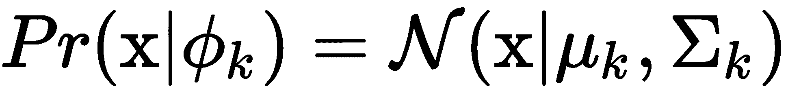

# 第四章：使用最大似然估计进行参数学习

在上一章中，我们讨论了**隐马尔可夫模型**（**HMM**）中的状态推断。我们尝试使用前一个状态转移的信息预测 HMM 的下一个状态。但在每种情况下，我们假设我们已经知道模型的转移和发射概率。然而，在实际问题中，我们通常需要从观察数据中学习这些参数。

在本章中，我们将尝试通过从观察中收集到的数据来估计我们的 HMM 模型的参数。我们将覆盖以下主题：

+   最大似然学习，带有示例

+   HMM 中的最大似然学习

+   期望最大化算法

+   Baum-Welch 算法

# 最大似然学习

在深入了解 HMM 中的**最大似然估计**（**MLE**）之前，我们先来理解一下 MLE 在一般情况下的基本概念。顾名思义，MLE 试图选择最大化观察数据似然性的模型参数。对于给定参数的任何模型，似然性定义为获取观察数据的概率，可以写成如下形式：


这里，*D={D[1], D[2], D[3], …, D[n]}*是观察数据，*θ*是控制我们模型的参数集。在大多数情况下，为了简便起见，我们假设数据点是**独立同分布**（**IID**）的。在这个假设下，我们可以将似然函数的定义简化为如下形式：


在这里，我们使用了独立随机变量的乘法规则，将联合分布分解为单个数据点的乘积。

回到最大似然估计，MLE 试图找到使得*P(D|θ)*值最大化的*θ*值。所以，基本上我们现在面临的是一个优化问题：


在接下来的几个小节中，我们将尝试将最大似然估计（MLE）应用于一些简单的示例，以便更好地理解它。

# 硬币投掷中的 MLE

假设我们想通过投掷硬币获得的观察数据来学习一个硬币模型。由于硬币只有两种结果：正面或反面，因此可以用一个参数来建模。假设我们将该参数定义为*θ*，即投掷硬币时获得正面的概率。获得反面的概率将自动为*1-θ*，因为正面和反面是互斥事件。

我们已经准备好了模型，接下来我们来计算该模型的似然函数。假设我们得到了一些硬币投掷的观察数据，*D={H,H,T,H,T,T}*。对于给定的数据，我们可以将似然函数写成如下形式：


现在，我们希望找到能够最大化*P(D|θ)*的*θ*值。为此，我们需要对我们的似然函数进行求导，将其等于*0*，然后求解*θ*：


因此，我们的 MLE 估计器学到抛硬币得到正面的概率是*0.5*。根据我们的观察，由于正反面出现的次数相等，我们也预期这个概率应该是相同的。

现在让我们尝试编写代码，来学习模型的参数*θ*。但是，如我们所知，在计算机上寻找最优值时可能会遇到数值问题，是否有可能避免这些问题，直接计算*θ[MLE]*呢？如果我们仔细观察我们的似然方程，我们会发现我们可以为这个模型写出一个通用的似然公式。如果我们假设我们的数据中有*n*个正面和*m*个反面，我们可以将似然写成如下形式：


现在，我们实际上可以使用这个似然函数找到*θ[MLE]*的封闭形式解，避免依赖任何数值方法来计算最优值：


我们可以看到，我们已经能够找到一个关于 MLE 解*θ*的封闭形式解。现在，编写代码就是简单地计算前面的公式，如下所示：

```py
import numpy as np

def coin_mle(data):
    """
    Returns the learned probability of getting a heads using MLE.

    Parameters
    ----------
    data: list, array-like
        The list of observations. 1 for heads and 0 for tails.

    Returns
    -------
    theta: The learned probability of getting a heads.
    """
    data = np.array(data)
    n_heads = np.sum(data)

    return n_heads / data.size
```

现在，让我们尝试对不同的数据点应用我们的函数：

```py
>>> coin_mle([1, 1, 1, 0, 0])
0.59999999999999998

>>> coin_mle([1, 1, 1, 0, 0, 0])
0.5

>>> coin_mle([1, 1, 1, 0, 0, 0, 0])
0.42857142857142855
```

输出结果如我们预期，但 MLE 方法的一个缺点是它对数据中的随机性非常敏感，在某些情况下，这可能导致其学习到错误的参数。尤其是在数据集较小时，这种情况尤为明显。例如，假设我们抛一枚公平的硬币三次，每次都得到正面。在这种情况下，MLE 方法会学习到*θ*的值为 1，这显然是不正确的，因为我们抛的是一枚公平的硬币。输出结果如下：

```py
>>> coin_mle([1, 1, 1])
1.0
```

在第五章《使用贝叶斯方法进行参数推断》中，我们将尝试通过从参数的先验分布开始来解决这个 MLE 问题，并且随着数据量的增加，它会调整其先验分布。

# 正态分布的最大似然估计（MLE）

在上一节中，我们讨论了一个包含单个参数的模型。在本节中，我们将把相同的概念应用到一个稍微复杂的模型中。我们将尝试从给定的观测数据中学习正态分布的参数（也称为**高斯分布**）。如我们所知，正态分布由其均值和标准差来参数化，分布的公式如下：


这里，*µ*是正态分布的均值，*σ*是标准差。

正如我们之前讨论的，使用 MLE 来估计参数时，我们需要一些观测数据，在本例中，我们假设这些数据来自正态分布（或者可以使用正态分布来逼近）。假设我们有一些观测数据：*X = {x[1], x[2], ..., x[N]}*。我们想要估计我们的模型的参数*μ*（均值）和*σ²*（方差）。

我们将遵循与上一节相同的步骤。我们将首先定义正态分布的似然函数。似然函数是给定参数的情况下，数据被观测到的概率。所以，给定观测数据，我们可以将似然函数写成如下形式：


在尝试处理小数值的乘积时，我们通常会遇到一个问题，那就是数字可能变得太小，计算机无法处理。为了避免遇到这个问题，我们转而使用对数似然，而不是简单的似然。由于对数是一个递增函数，最大对数似然函数的值与似然函数的最大值对应的参数是一样的。对数似然可以定义如下：


我们可以通过对每个变量分别求偏导数，令其等于*0*，并解方程来找到最大化对数似然函数的*μ[MLE]*和*σ[MLE]*的值。为了得到均值，我们需要对对数似然函数关于*μ*求偏导数，同时保持*σ*为常数，并设其为*0*，得到以下结果：


类似地，标准差*σ²*的 MLE 可以通过对对数似然函数关于*σ²*求偏导数，同时保持*μ*为常数，令其等于*0*，然后解出*σ²*：


正如我们所见，我们再次能够得出一个闭式解，因此在编程时无需依赖数值方法。让我们尝试编写代码，检查我们的 MLE 方法是否学习到了正确的参数：

```py
import numpy as np

def gaussian_mle(data):
 """
 Returns the learned parameters of the Normal Distribution using MLE.

 Parameters
 ----------
 data: list, array-like
 The list of observed variables.

 Returns
 -------
 \mu: The learned mean of the Normal Distribution.
 \sigma: The learned standard deviation of the Normal Distribution.
 """
 data = np.array(data)
 mu = np.mean(data)
 variance = np.sqrt(np.mean((data - mu)**2))

 return mu, variance
```

我们已经准备好学习函数，现在可以从已知分布生成一些数据，并检查我们的函数是否能够从生成的数据中学习到相同的参数：

```py
>>> from numpy.random import normal
>>> data = normal(loc=1, scale=2, size=10)
>>> data
array([ 1.8120102, 2.14363679, 1.49010868, -1.95531206, 1.62449155,
        1.49345327, 1.48957918, -0.67536313, 4.31506202, 4.24883442])

>>> mu, sigma = gaussian_mle(data)
>>> mu
1.5986500906187573
>>> sigma
1.805051208889392
```

在这个例子中，我们可以看到学到的值并不是非常准确。这是因为 MLE 对于观测数据点过于敏感，正如我们在上一节中讨论的那样。让我们尝试使用更多的观测数据运行这个相同的例子：

```py
>>> data = normal(loc=1, scale=2, size=1000)
>>> data[:10]
array([ 4.5855015, 1.55162883, -1.61385859, 0.52543984, 0.90247428,
        3.40717092, 1.4078157, 0.01560836, -1.19409859, -0.01641439])

>>> mu, sigma = gaussian_mle(data)
>>> mu
 1.0437186891666821
>>> sigma
1.967211026428509
```

在这种情况下，使用更多的数据，我们可以看到学到的值与原始值更接近。

# 隐马尔可夫模型的最大似然估计（MLE）

在基本了解 MLE 的基础上，我们现在可以将这些概念应用于 HMM 的情况。在接下来的几个小节中，我们将看到 HMM 学习的两种可能场景，即监督学习和无监督学习。

# 监督学习

在监督学习的情况下，我们使用通过对我们试图建模的过程进行采样生成的数据。如果我们试图使用简单的离散分布来参数化我们的 HMM 模型，我们可以直接应用最大似然估计（MLE）通过统计从任何给定状态到其他状态的转移次数来计算转移和发射分布。类似地，我们可以通过统计不同隐状态下的输出状态来计算发射分布。因此，转移和发射概率可以通过以下方式计算：


在这里，*T(i,j)* 是从状态 *i* 到状态 *j* 的转移概率。而 *E(i,s)* 是从状态 *i* 获取状态 *s* 的发射概率。

让我们举一个非常简单的例子来使这个概念更加清晰。我们希望建模天气以及是否会在一段时间内下雨。同时，我们假设天气可以有三种可能的状态：

+   *晴天 (S)*

+   *多云 (C)*

+   *有风 (W)*

并且 *雨天* 变量有两个可能的状态：*下雨 (R)* 或 *不下雨 (NR)*。一个 HMM 模型大致是这样的：

假设我们有一些观察数据，如 *D={(S,NR), (S,NR), (C,NR), (C,R), (C,R), (W,NR), (S,NR), (W,R), (C,NR)}*。在这里，每个数据点的第一个元素表示当天观察到的天气，而第二个元素表示当天是否下雨。现在，使用我们之前推导出的公式，我们可以轻松地计算转移和发射概率。我们将从计算 *S* 到 *S* 的转移概率开始：


同样，我们可以计算所有其他状态组合的转移概率：


因此，我们就得到了天气的所有可能状态下的完整转移概率。我们可以以表格形式表示它，使其看起来更清晰：

|  | **晴天(S)** | **多云(C)** | **有风(W)** |
| --- | --- | --- | --- |
| **晴天(S)** | 0.33 | 0.33 | 0.33 |
| **多云(C)** | 0 | 0.66 | 0.33 |
| **有风 (W)** | 0.5 | 0.5 | 0 |

表 1：天气模型的转移概率

现在，计算发射概率时，我们可以再次按照之前推导的公式进行：


同样，我们可以计算分布中所有其他值：


因此，我们的发射概率可以写成表格形式如下：

|  | **晴天(S)** | **多云(C)** | **有风(W)** |
| --- | --- | --- | --- |
| **雨天 (R)** | 0 | 0.5 | 0.5 |
| **无雨 (NR)** | 1 | 0.5 | 0.5 |

表 2：天气模型的发射概率

在前面的示例中，我们看到如何使用最大似然估计（MLE）和一些简单计算来计算 HMM 的参数。但由于在此案例中，我们假设了转移和发射概率是简单的离散条件分布，因此计算更为简便。在更复杂的情况下，我们需要估计比在前一节中正态分布情况更多的参数。

# 代码

现在让我们尝试编写前述算法的代码：

```py
def weather_fit(data):
    """
    Learn the transition and emission probabilities from the given data
    for the weather model.

    Parameters
    ----------
    data: 2-D list (array-like)
    Each data point should be a tuple of size 2 with the first element
    representing the state of *Weather* and the second element representing
    whether it rained or not.
    Sunny = 0, Cloudy = 1, Windy = 2
    Rain = 0, No Rain = 1

    Returns
    -------
    transition probability: 2-D array
    The conditional distribution representing the transition probability 
    of the model.
    emission probability: 2-D array
    The conditional distribution representing the emission probability 
    of the model.
    """
    data = np.array(data)

    transition_counts = np.zeros((3, 3))
    emission_counts = np.zeros((3, 2))

    for index, datapoint in enumerate(data):
        if index != len(data)-1:
            transition_counts[data[index][0], data[index+1][0]] += 1
        emission_counts[data[index][0], data[index][1]] += 1

    transition_prob = transition_counts / np.sum(transition_counts, axis=0)
    emission_prob = (emission_counts.T / np.sum(emission_counts.T, axis=0)).T

    return transition_prob, emission_prob
```

让我们生成一些数据，并尝试使用之前的函数学习参数：

```py
>>> import numpy as np
>>> weather_data = np.random.randint(low=0, high=3, size=1000)
>>> rain_data = np.random.randint(low=0, high=2, size=1000)
>>> data = list(zip(weather_data, rain_data))
>>> transition_prob, emission_prob = weather_fit(data)
>>> transition_prob
array([[ 0.3125, 0.38235294, 0.27272727],
       [ 0.28125, 0.38235294, 0.36363636],
       [ 0.40625, 0.23529412, 0.36363636]])

>>> emission_prob
array([[ 0.3125, 0.38235294, 0.27272727],
       [ 0.28125, 0.38235294, 0.36363636],
       [ 0.40625, 0.23529412, 0.36363636]])

```

# 无监督学习

在前一节中，我们看到当所有变量（包括隐藏变量）都被观察到时，如何使用监督学习。但在实际问题中，这种情况通常并不成立。对于这种情况，我们使用无监督学习来估计模型的参数。

用于此目的的两种主要学习算法如下：

+   维特比学习算法

+   Baum-Welch 算法

我们将在接下来的几个子节中讨论这些内容。

# 维特比学习算法

维特比学习算法（与用于状态估计的维特比算法不同）接收一组训练观测值 *O^r*，其中 *1≤r≤R*，并通过迭代计算维特比对齐来估计单个 HMM 的参数。当用于初始化一个新的 HMM 时，维特比分割被均匀分割替代（即，每个训练观测值被划分为 *N* 等分）用于第一次迭代。

除了在新模型的第一次迭代中，每个训练序列 *O* 都使用状态对齐过程进行分割，该过程是通过最大化以下公式得到的：


对于 *1<i<N*，其中：


初始条件由以下给出：


对于 *1<j<N*。在离散情况下，输出概率  定义为：


其中 *S* 是流的总数，*vs* 是给定的输出，输入 *O[st]*，以及 *P[js][v]* 是状态 *j* 给定输出 *v* 的概率。

如果 *A[ij]* 表示在执行上述最大化时，从状态 *i* 到状态 *j* 的总转移次数，则可以从相对频率中估计转移概率：


最大化 *∅N* 的状态序列意味着训练数据观测与状态的对齐。在每个状态内，还会进一步将观测值对齐到混合成分。通常，对于每个状态和每个输出流，可以使用两种机制：

+   使用聚类将每个观测值 *O[st]* 分配给一个 *M[s]* 集群

+   将每个观测值 *O[st]* 与具有最高概率的混合成分关联

在任何情况下，最终结果是每个观察值都与一个唯一的混合成分相关联。这个关联可以通过指示函数 表示，当 与状态为*j*的流*s*的混合成分*m*相关联时，值为*1*，否则为零。

均值和方差随后通过计算简单的均值来估计：


混合权重基于分配给每个成分的观察数量：


# Baum-Welch 算法（期望最大化）

**期望最大化**（**EM**）算法（在应用于 HMM 时称为**Baum-Welch**）是一种迭代方法，用于求解统计模型中依赖于未观察到的潜在变量的参数的最大似然估计或**最大后验估计**（**MAP**）。EM 迭代在执行**期望**（**E**）步骤和**最大化**（**M**）步骤之间交替进行，**E**步骤创建一个期望的对数似然函数，该函数使用当前的参数估计进行评估，**M**步骤则计算最大化**E**步骤找到的期望对数似然的参数。这些参数估计随后用于确定在下一个**E**步骤中潜在变量的分布。

EM 算法从参数的初始值（*θ^(old)*）开始。在**E**步骤中，我们取这些参数并找到潜在变量的后验分布*P(Z|X,θ^(old))*。然后，我们使用这个后验分布来评估完整数据似然函数对数的期望，作为参数*θ*的函数，得到函数*Q(θ,θ^(old))*，其定义如下：


让我们引入一些术语，这些术语可以帮助我们将来使用。*γ(Z[n])*表示潜在变量的边际后验分布：


*ξ(z[n-1], z[n])*表示两个连续潜在变量的边际后验分布：


因此，对于每个*n*值，我们可以将 *γ(Z[n])* 存储为一个*K*维的非负数向量，且这些数的和为*1*，同样我们可以使用一个*K×K*的非负数矩阵来存储*ξ(z[n-1], z[n])*，其和也为*1*。

正如我们在前几章中讨论的，潜在变量*z[n]*可以表示为*K*维的二元变量，当*z[n]*处于状态*k*时，*z[nk] = 1*。我们还可以用它表示*z[nk] = 1*的条件概率，同样，*ξ(z[n-1], j, z[nk])*可以表示*z[n-1]*、*j = 1*和*z[nk] = 1*的条件概率。由于二元随机变量的期望就是其值为*1*的概率，我们可以得出以下结论：


正如我们在上一章讨论的那样，HMM 的联合概率分布可以表示如下：


因此，我们可以将数据似然函数写成如下形式：


在*E*步骤中，我们尝试有效地评估量*γ(z[n])*和*ξ(z[n-1], z[n])*。为了高效地计算这两个项，我们可以使用前向后向算法或维特比算法，正如上一章所讨论的那样。在*M*步骤中，我们尝试对*Q(θ, θ^(old))* 关于参数*θ={A, π, Φ}*进行最大化，其中我们将*γ(z[n])*和*ξ(z[n-1], z[n])*视为常数。

通过这样做，我们得到了参数的 MLE 值，如下所示：


如果我们假设发射分布是正态分布，令 ，那么对*Q(θ, θ^(old))* 关于*Φ[k]*的最大化将得到如下结果：


EM 算法必须通过选择*π*和*A*的初始值来初始化，这些值当然应该是非负的，并且总和为*1*。

# 代码

参数估计的算法看起来相当复杂，但`hmmlearn`，一个用于处理 HMM 的 Python 包，提供了很好的实现。`hmmlearn`也托管在 PyPI 上，因此可以直接通过`pip:pip install hmmlearn`安装。对于代码示例，我们将以通过学习股票价格的高斯 HMM 进行股票价格预测为例。这个示例来自`hmmlearn`的示例页面。

在这个示例中，我们还需要安装`matplotlib`和`datetime`包，这些也可以通过`pip`安装：

```py
pip install matplotlib datetime
```

进入代码部分，我们应从导入所有必要的包开始：

```py
from __future__ import print_function

import datetime

import numpy as np
from matplotlib import cm, pyplot as plt
from matplotlib.dates import YearLocator, MonthLocator

try:
    from matplotlib.finance import quotes_historical_yahoo_ochl
except ImportError:
    # For Matplotlib prior to 1.5.
    from matplotlib.finance import (
        quotes_historical_yahoo as quotes_historical_yahoo_ochl
    )

from hmmlearn.hmm import GaussianHMM

print(__doc__)
```

接下来，我们将从 Yahoo! Finance 获取我们的股票价格数据：

```py
quotes = quotes_historical_yahoo_ochl(
    "INTC", datetime.date(1995, 1, 1), datetime.date(2012, 1, 6))

# Unpack quotes
dates = np.array([q[0] for q in quotes], dtype=int)
close_v = np.array([q[2] for q in quotes])
volume = np.array([q[5] for q in quotes])[1:]

# Take diff of close value. Note that this makes
# ``len(diff) = len(close_t) - 1``, therefore, other quantities also
# need to be shifted by 1.
diff = np.diff(close_v)
dates = dates[1:]
close_v = close_v[1:]

# Pack diff and volume for training.
X = np.column_stack([diff, volume])
```

接下来，我们定义一个高斯 HMM 模型，并为我们的数据学习参数：

```py
# Make an HMM instance and execute fit
model = GaussianHMM(n_components=4, covariance_type="diag", n_iter=1000).fit(X)

# Predict the optimal sequence of internal hidden state
hidden_states = model.predict(X)
```

现在我们可以打印出我们学到的参数：

```py
print("Transition matrix")
print(model.transmat_)
print()

print("Means and vars of each hidden state")
for i in range(model.n_components):
    print("{0}th hidden state".format(i))
    print("mean = ", model.means_[i])
    print("var = ", np.diag(model.covars_[i]))
    print()
```

输出如下：

```py
Transition matrix
[[  9.79220773e-01   2.57382344e-15   2.72061945e-03   1.80586073e-02]
 [  1.12216188e-12   7.73561269e-01   1.85019044e-01   4.14196869e-02]
 [  3.25313504e-03   1.12692615e-01   8.83368021e-01   6.86228435e-04]
 [  1.18741799e-01   4.20310643e-01   1.18670597e-18   4.60947557e-01]]

Means and vars of each hidden state
0th hidden state
mean =  [  2.33331888e-02   4.97389989e+07]
var =  [  6.97748259e-01   2.49466578e+14]

1st hidden state
mean =  [  2.12401671e-02   8.81882861e+07]
var =  [  1.18665023e-01   5.64418451e+14]

2nd hidden state
mean =  [  7.69658065e-03   5.43135922e+07]
var =  [  5.02315562e-02   1.54569357e+14]

3rd hidden state
mean =  [ -3.53210673e-01   1.53080943e+08]
var =  [  2.55544137e+00   5.88210257e+15]
```

我们还可以绘制出隐藏状态随时间变化的图：

```py
fig, axs = plt.subplots(model.n_components, sharex=True, sharey=True)
colours = cm.rainbow(np.linspace(0, 1, model.n_components))
for i, (ax, colour) in enumerate(zip(axs, colours)):
    # Use fancy indexing to plot data in each state.
    mask = hidden_states == i
    ax.plot_date(dates[mask], close_v[mask], ".-", c=colour)
    ax.set_title("{0}th hidden state".format(i))

    # Format the ticks.
    ax.xaxis.set_major_locator(YearLocator())
    ax.xaxis.set_minor_locator(MonthLocator())

    ax.grid(True)

plt.show()

```

前述代码的输出如下：


图 1：隐藏状态随时间变化的图

# 总结

在本章中，我们介绍了用于估计给定 HMM 模型参数的算法。我们从 MLE 的基本概念入手，然后将这些概念应用于 HMM。对于 HMM 的训练，我们讨论了两种不同的场景：有监督训练，当我们有隐藏状态的观测值时；以及无监督训练，当我们只有输出观测值时。

我们还讨论了使用 MLE 进行估计时遇到的问题。在下一章中，我们将介绍使用贝叶斯方法进行参数估计的算法，该方法试图解决这些问题。
