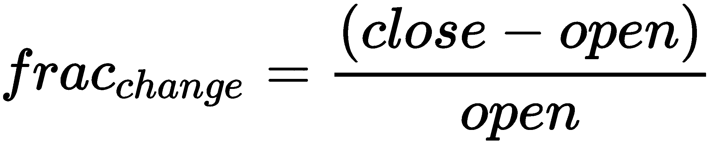
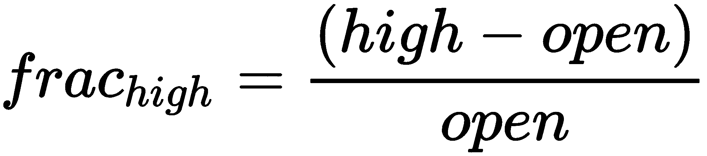
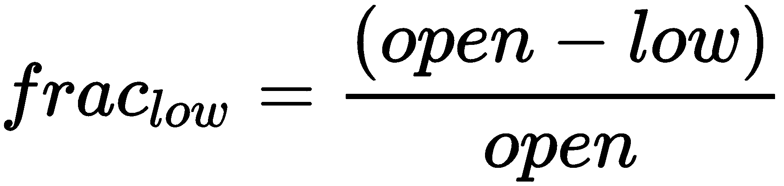
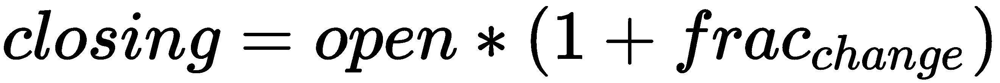
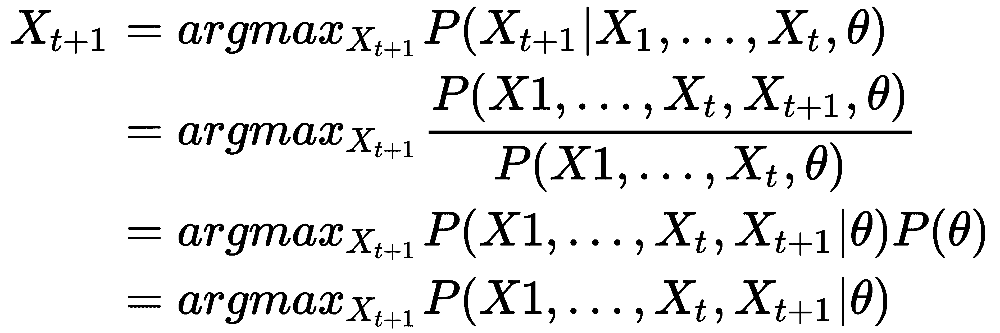
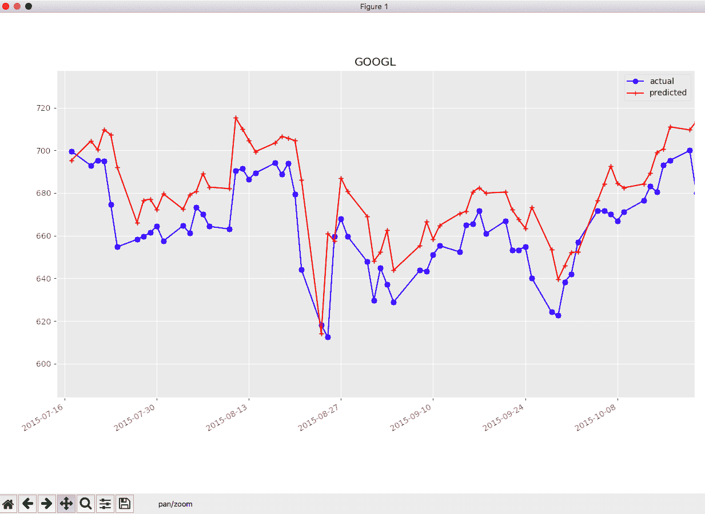

# 第六章：时间序列预测

在前几章中，我们详细讨论了 **隐马尔可夫模型**（**HMMs**）及与推断相关的各种算法。从本章开始，我们将讨论 HMM 的应用。

HMM（隐马尔可夫模型）能够预测和分析基于时间的现象。因此，它们可以用于语音识别、自然语言处理和金融市场预测等领域。在本章中，我们将探讨 HMM 在金融市场分析中的应用，主要是股票价格预测。

# 使用 HMM 进行股票价格预测

由于许多大公司对股票市场的浓厚兴趣，股票市场预测一直是过去活跃的研究领域之一。从历史上看，各种机器学习算法已被应用，且取得了不同程度的成功。然而，由于股票市场的非平稳性、季节性和不可预测性，股票预测仍然受到严重限制。仅凭前期的股票数据预测未来的股票走势更具挑战性，因为它忽略了多个外部因素。

如前所述，HMM 能够基于顺序观察到的数据建模隐藏状态转换。股票预测问题也可以看作是遵循相同的模式。股票价格取决于多种因素，这些因素通常对投资者来说是不可见的（隐藏变量）。这些潜在因素之间的转换会根据公司政策和决策、财务状况及管理决策发生变化，并且这些变化会影响股票价格（观察数据）。因此，HMM 非常适合股票价格预测问题。

在本章中，我们将尝试预测 Alphabet Inc.（GOOGL）、**Facebook**（**FB**）和 **Apple Inc.**（**AAPL**）的股票价格。

# 收集股票价格数据

我们将使用 pystock 数据 ([`data.pystock.com`](http://data.pystock.com)) 来获取历史股票价格数据。每天，在美国股市开盘前的 9:30 EST/EDT，pystock 爬虫会收集股票价格和财务报告，并将数据推送到仓库，包括前一天的开盘价、收盘价、最高价和最低价等信息。这些数据是按天收集的，意味着我们不会有小时或分钟级别的数据。

我们将尝试下载给定年份的 `pystock` 数据。由于数据集较大，我们将创建一个 Python 脚本来下载给定年份的数据，并且可以同时运行该程序来并行下载三个不同年份的所有数据：

```py
"""
Usage: get_data.py --year=<year>
"""
import requests
import os
from docopt import docopt

# docopt helps parsing the command line argument in
# a simple manner (http://docopt.org/)
args = docopt(doc=__doc__, argv=None,
              help=True, version=None,
              options_first=False)

year = args['--year']

# Create directory if not present
year_directory_name = 'data/{year}'.format(year=year)
if not os.path.exists(year_directory_name):
    os.makedirs(year_directory_name)

# Fetching file list for the corresponding year
year_data_files = requests.get(
    'http://data.pystock.com/{year}/index.txt'.format(year=year)
).text.strip().split('\n')

for data_file_name in year_data_files:
    file_location = '{year_directory_name}/{data_file_name}'.format(
        year_directory_name=year_directory_name,
        data_file_name=data_file_name)

    with open(file_location, 'wb+') as data_file:
        print('>>> Downloading \t {file_location}'.format(file_location=file_location))
        data_file_content = requests.get(
            'http://data.pystock.com/{year}/{data_file_name}'.format(year=year, data_file_name=data_file_name)
        ).content
        print('<<< Download Completed \t {file_location}'.format(file_location=file_location))
        data_file.write(data_file_content)
```

同时运行以下脚本来获取三个不同年份的数据：

```py
python get_data.py --year 2015
python get_data.py --year 2016
python get_data.py --year 2017
```

一旦数据下载完成，我们将通过结合所有年份的相关数据来尝试获取每只前述股票的全部数据：

```py
"""
Usage: parse_data.py --company=<company>
"""
import os
import tarfile
import pandas as pd
from pandas import errors as pd_errors
from functools import reduce
from docopt import docopt

args = docopt(doc=__doc__, argv=None,
              help=True, version=None,
              options_first=False)

years = [2015, 2016, 2017]
company = args['--company']

# Getting the data files list
data_files_list = []
for year in years:
    year_directory = 'data/{year}'.format(year=year)
    for file in os.listdir(year_directory):
        data_files_list.append('{year_directory}/{file}'.format(year_directory=year_directory, file=file))

def parse_data(file_name, company_symbol):
    """
    Returns data for the corresponding company

    :param file_name: name of the tar file
    :param company_symbol: company symbol
    :type file_name: str
    :type company_symbol: str
    :return: dataframe for the corresponding company data
    :rtype: pd.DataFrame
    """
    tar = tarfile.open(file_name)
    try:
        price_report = pd.read_csv(tar.extractfile('prices.csv'))
        company_price_data = price_report[price_report['symbol'] == company_symbol]
        return company_price_data
    except (KeyError, pd_errors.EmptyDataError):
        return pd.DataFrame()

# Getting the complete data for a given company
company_data = reduce(lambda df, file_name: df.append(parse_data(file_name, company)),
                      data_files_list,
                      pd.DataFrame())
company_data = company_data.sort_values(by=['date'])

# Create folder for company data if does not exists
if not os.path.exists('data/company_data'):
    os.makedirs('data/company_data')

# Write data to a CSV file
company_data.to_csv('data/company_data/{company}.csv'.format(company=company),
                    columns=['date', 'open', 'high', 'low', 'close', 'volume', 'adj_close'],
                    index=False)
```

运行以下脚本，以创建一个包含 `GOOGL`、`FB` 和 `AAPL` 股票所有历史数据的 `.csv` 文件：

```py
python parse_data.py --company GOOGL
python parse_data.py --company FB
python parse_data.py --company AAPL
```

# 股票价格预测的特征

一旦我们拥有每个股票价格的数据，我们就可以开始预测股票的价格了。如前所述，我们每一天的特征非常有限，具体是该天的开盘价、收盘价、股票最高价和最低价。因此，我们将利用这些数据来计算股票价格。通常，我们希望在给定当天开盘价以及前几天的某些 *d* 天数据的情况下，计算该天的收盘价。我们的预测器会有 *d* 天的延迟。

让我们创建一个名为`StockPredictor`的预测器，它将包含所有预测特定公司在特定日期股票价格的逻辑。

我们不直接使用股票的开盘价、收盘价、最低价和最高价，而是尝试提取它们的分数变化，这些变化将用于训练我们的 HMM。随着我们深入研究，选择这些特征的原因会变得更加清晰。我们可以定义三个参数如下：



因此，对于股票价格预测 HMM，我们可以将单个观测值表示为一个向量，这些参数为 *X[t] = < frac[change], frac[high], frac[low] >*：

```py
import pandas as pd

class StockPredictor(object):
    def __init__(self, company, n_latency_days=10):
        self._init_logger()

        self.company = company
        self.n_latency_days = n_latency_days
        self.data = pd.read_csv(
            'data/company_data/{company}.csv'.format(company=self.company))

    def _init_logger(self):
        self._logger = logging.getLogger(__name__)
        handler = logging.StreamHandler()
        formatter = logging.Formatter(
            '%(asctime)s %(name)-12s %(levelname)-8s %(message)s')
        handler.setFormatter(formatter)
        self._logger.addHandler(handler)
        self._logger.setLevel(logging.DEBUG)

    @staticmethod
    def _extract_features(data):
        open_price = np.array(data['open'])
        close_price = np.array(data['close'])
        high_price = np.array(data['high'])
        low_price = np.array(data['low'])

        # Compute the fraction change in close, high and low prices
        # which would be used a feature
        frac_change = (close_price - open_price) / open_price
        frac_high = (high_price - open_price) / open_price
        frac_low = (open_price - low_price) / open_price

        return np.column_stack((frac_change, frac_high, frac_low))

# Predictor for GOOGL stocks
stock_predictor = StockPredictor(company='GOOGL')
```

# 使用 HMM 预测价格

一旦我们从数据中提取了特征，就可以开始预测股票的价格了。我们希望预测某一天股票的收盘价，已知该天的开盘价和前几天的股票价格。

第一步是训练一个 HMM，从我们之前计算的给定观测序列中计算参数。由于观测值是连续随机变量的向量，我们必须假设发射概率分布是连续的。为了简化，我们假设它是一个多项式高斯分布，具有参数（*μ* 和 *Σ*）。因此，我们需要确定以下参数：过渡矩阵 *A*、先验概率 *π*，以及表示多项式高斯分布的 *μ* 和 *Σ*。

目前，假设我们有四个隐藏状态。在接下来的章节中，我们将探讨如何找到最优的隐藏状态数量。我们将使用`hmmlearn`包提供的`GaussianHMM`类作为我们的 HMM，并尝试使用它提供的`fit()`方法进行参数估计：

```py
from hmmlearn.hmm import GaussianHMM

class StockPredictor(object):
    def __init__(self, company, n_latency_days=10, n_hidden_states=4):
        self._init_logger()

        self.company = company
        self.n_latency_days = n_latency_days

        self.hmm = GaussianHMM(n_components=n_hidden_states)

        self.data = pd.read_csv(
            'data/company_data/{company}.csv'.format(company=self.company))

    def fit(self):
        self._logger.info('>>> Extracting Features')
        feature_vector = StockPredictor._extract_features(self.data)
        self._logger.info('Features extraction Completed <<<')

        self.hmm.fit(feature_vector)
```

在机器学习中，我们将整个数据集划分为两类。第一类是训练数据集，用于训练模型。第二类是测试数据集，用于提供对最终模型在训练数据集上拟合的无偏评估。将训练数据集与测试数据集分开，避免了我们将数据过拟合到模型上。因此，在我们的案例中，我们也会将数据集分为两类，`train_data`用于训练模型，`test_data`用于评估模型。为此，我们将使用`sklearn.model_selection`模块提供的`train_test_split`方法：

`train_test_split`可以将数组或矩阵随机拆分成训练集和测试集。由于我们用的是顺序数据来训练 HMM，因此我们不希望随机拆分数据。为了防止随机拆分测试数据和训练数据，可以将`shuffle=False`作为参数传递。

```py
from sklearn.model_selection import train_test_split

class StockPredictor(object):
    def __init__(self, company, test_size=0.33,
                 n_latency_days=10, n_hidden_states=4):
        self._init_logger()

        self.company = company
        self.n_latency_days = n_latency_days

        self.hmm = GaussianHMM(n_components=n_hidden_states)

        self._split_train_test_data(test_size)

    def _split_train_test_data(self, test_size):
        data = pd.read_csv(
            'data/company_data/{company}.csv'.format(company=self.company))
        _train_data, test_data = train_test_split(
            data, test_size=test_size, shuffle=False)

        self._train_data = _train_data
        self._test_data = test_data

    def fit(self):
        self._logger.info('>>> Extracting Features')
        feature_vector = StockPredictor._extract_features(self._train_data)
        self._logger.info('Features extraction Completed <<<')

        self.hmm.fit(feature_vector)
```

一旦模型训练完成，我们需要预测股票的收盘价。正如我们之前提到的，我们想预测给定开盘价的一天的收盘价。这意味着，如果我们能够预测给定日期的*frac[change]*，就能按如下方式计算收盘价：



因此，我们的问题归结为计算给定*X[1],...,X[t]*和 HMM 参数下的一天的*X[t+1] = < frac[change], frac[high], frac[low] >*观测向量的值！[](img/fb2a521e-09bf-4fc6-985d-87900072e99f.png)，即找到一个*X[t+1]*的值，使得后验概率*P(X[t+1]|X[1],...,X[t],θ)*最大化：



如你所见，一旦我们从最大化方程中去除所有与*X[t+1]*无关的参数，我们就剩下了一个问题：找到*X[t+1]*的值，该值能够优化*P(X[1],...,X[t+1]|θ)*的概率。我们在第四章《最大似然法中的参数学习》中遇到过这个问题，当时我们在评估给定模型参数下的序列概率。这个问题可以通过前向后向算法有效计算。

如果我们假设*frac[change]*是一个连续变量，问题的优化将是计算上非常困难的。因此，我们可以将这些分数变化划分为一些离散值，范围在两个有限变量之间（如下表所示），并尝试找到一组分数变化，*< frac[change], frac[high], frac[low] >*，使得概率*P(X[1],...,X[t+1]|θ)*最大化：

| **观测值** | **最小值** | **最大值** | **点数** |
| --- | --- | --- | --- |
| *frac[change]* | -0.1 | 0.1 | 20 |
| *frac[high]* | 0 | 0.1 | 10 |
| *frac[low]* | 0 | 0.1 | 10 |

因此，使用前面列出的离散值集合，我们需要进行（20 x 10 x 10 =) 2,000 次操作：

```py
def _compute_all_possible_outcomes(self, n_steps_frac_change,
                                       n_steps_frac_high, n_steps_frac_low):
        frac_change_range = np.linspace(-0.1, 0.1, n_steps_frac_change)
        frac_high_range = np.linspace(0, 0.1, n_steps_frac_high)
        frac_low_range = np.linspace(0, 0.1, n_steps_frac_low)

        self._possible_outcomes = np.array(list(itertools.product(
            frac_change_range, frac_high_range, frac_low_range)))
```

现在，我们可以实现该方法来预测收盘价，如下所示：

```py
def _get_most_probable_outcome(self, day_index):
        previous_data_start_index = max(0, day_index - self.n_latency_days)
        previous_data_end_index = max(0, day_index - 1)
        previous_data = self._test_data.iloc[previous_data_end_index: previous_data_start_index]
        previous_data_features = StockPredictor._extract_features(
            previous_data)

        outcome_score = []
        for possible_outcome in self._possible_outcomes:
            total_data = np.row_stack(
                (previous_data_features, possible_outcome))
            outcome_score.append(self.hmm.score(total_data))
        most_probable_outcome = self._possible_outcomes[np.argmax(
            outcome_score)]

        return most_probable_outcome

    def predict_close_price(self, day_index):
        open_price = self._test_data.iloc[day_index]['open']
        predicted_frac_change, _, _ = self._get_most_probable_outcome(
            day_index)
        return open_price * (1 + predicted_frac_change)
```

让我们尝试预测未来几天的收盘价格，并绘制两条曲线：

```py
"""
Usage: analyse_data.py --company=<company>
"""
import warnings
import logging
import itertools
import pandas as pd
import numpy as np
import matplotlib.pyplot as plt
from hmmlearn.hmm import GaussianHMM
from sklearn.model_selection import train_test_split
from tqdm import tqdm
from docopt import docopt

args = docopt(doc=__doc__, argv=None, help=True,
              version=None, options_first=False)

# Supress warning in hmmlearn
warnings.filterwarnings("ignore")
# Change plot style to ggplot (for better and more aesthetic visualisation)
plt.style.use('ggplot')

class StockPredictor(object):
    def __init__(self, company, test_size=0.33,
                 n_hidden_states=4, n_latency_days=10,
                 n_steps_frac_change=50, n_steps_frac_high=10,
                 n_steps_frac_low=10):
        self._init_logger()

        self.company = company
        self.n_latency_days = n_latency_days

        self.hmm = GaussianHMM(n_components=n_hidden_states)

        self._split_train_test_data(test_size)

        self._compute_all_possible_outcomes(
            n_steps_frac_change, n_steps_frac_high, n_steps_frac_low)

    def _init_logger(self):
        self._logger = logging.getLogger(__name__)
        handler = logging.StreamHandler()
        formatter = logging.Formatter(
            '%(asctime)s %(name)-12s %(levelname)-8s %(message)s')
        handler.setFormatter(formatter)
        self._logger.addHandler(handler)
        self._logger.setLevel(logging.DEBUG)

    def _split_train_test_data(self, test_size):
        data = pd.read_csv(
            'data/company_data/{company}.csv'.format(company=self.company))
        _train_data, test_data = train_test_split(
            data, test_size=test_size, shuffle=False)

        self._train_data = _train_data
        self._test_data = test_data

    @staticmethod
    def _extract_features(data):
        open_price = np.array(data['open'])
        close_price = np.array(data['close'])
        high_price = np.array(data['high'])
        low_price = np.array(data['low'])

        # Compute the fraction change in close, high and low prices
        # which would be used a feature
        frac_change = (close_price - open_price) / open_price
        frac_high = (high_price - open_price) / open_price
        frac_low = (open_price - low_price) / open_price

        return np.column_stack((frac_change, frac_high, frac_low))

    def fit(self):
        self._logger.info('>>> Extracting Features')
        feature_vector = StockPredictor._extract_features(self._train_data)
        self._logger.info('Features extraction Completed <<<')

        self.hmm.fit(feature_vector)

    def _compute_all_possible_outcomes(self, n_steps_frac_change,
                                       n_steps_frac_high, n_steps_frac_low):
        frac_change_range = np.linspace(-0.1, 0.1, n_steps_frac_change)
        frac_high_range = np.linspace(0, 0.1, n_steps_frac_high)
        frac_low_range = np.linspace(0, 0.1, n_steps_frac_low)

        self._possible_outcomes = np.array(list(itertools.product(
            frac_change_range, frac_high_range, frac_low_range)))

    def _get_most_probable_outcome(self, day_index):
        previous_data_start_index = max(0, day_index - self.n_latency_days)
        previous_data_end_index = max(0, day_index - 1)
        previous_data = self._test_data.iloc[previous_data_end_index: previous_data_start_index]
        previous_data_features = StockPredictor._extract_features(
            previous_data)

        outcome_score = []
        for possible_outcome in self._possible_outcomes:
            total_data = np.row_stack(
                (previous_data_features, possible_outcome))
            outcome_score.append(self.hmm.score(total_data))
        most_probable_outcome = self._possible_outcomes[np.argmax(
            outcome_score)]

        return most_probable_outcome

    def predict_close_price(self, day_index):
        open_price = self._test_data.iloc[day_index]['open']
        predicted_frac_change, _, _ = self._get_most_probable_outcome(
            day_index)
        return open_price * (1 + predicted_frac_change)

    def predict_close_prices_for_days(self, days, with_plot=False):
        predicted_close_prices = []
        for day_index in tqdm(range(days)):
            predicted_close_prices.append(self.predict_close_price(day_index))

        if with_plot:
            test_data = self._test_data[0: days]
            days = np.array(test_data['date'], dtype="datetime64[ms]")
            actual_close_prices = test_data['close']

            fig = plt.figure()

            axes = fig.add_subplot(111)
            axes.plot(days, actual_close_prices, 'bo-', label="actual")
            axes.plot(days, predicted_close_prices, 'r+-', label="predicted")
            axes.set_title('{company}'.format(company=self.company))

            fig.autofmt_xdate()

            plt.legend()
            plt.show()

        return predicted_close_prices

stock_predictor = StockPredictor(company=args['--company'])
stock_predictor.fit()
stock_predictor.predict_close_prices_for_days(500, with_plot=True)
```

输出结果如下：



# 概要

在本章中，我们使用隐马尔可夫模型（HMM）预测了股票价格。我们应用了参数估计和模型评估方法来确定股票的收盘价格。使用 HMM 进行股市分析只是 HMM 应用于时间序列数据分析的另一个例子。

在下一章中，我们将探讨 HMM 在自然语言处理领域中的一个有趣应用。
