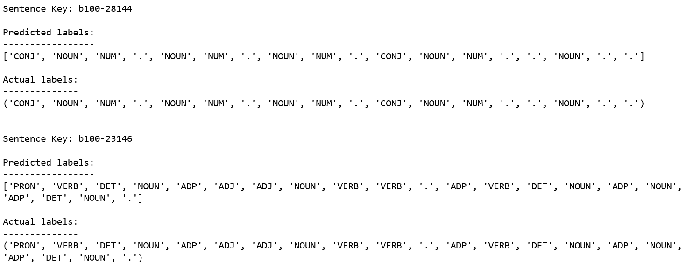
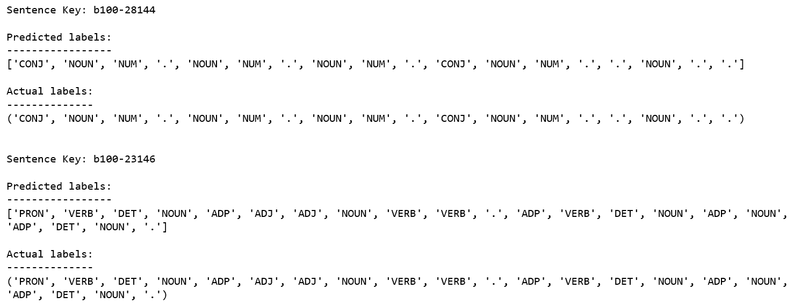

# 第七章：自然语言处理

自动语音识别有许多潜在的应用，例如音频转录、听写、音频搜索和虚拟助手。我相信现在每个人至少与一个虚拟助手互动过，无论是苹果的 Siri、亚马逊的 Alexa，还是谷歌的 Assistant。在所有这些语音识别系统的核心，都是一组基于语言中不同单词或声音的统计模型。由于语音具有时间结构，隐马尔可夫模型（HMMs）是最自然的建模框架。

隐马尔可夫模型（HMMs）几乎是所有语音识别系统的核心，建模中的核心概念长时间没有太大变化。但随着时间的推移，已经开发出许多复杂的技术来构建更好的系统。在接下来的部分，我们将尝试涵盖推动这些系统发展的主要概念。

# 词性标注

我们将要研究的第一个问题被称为**词性标注**（**POS 标注**）。根据维基百科，词性标注，也叫**语法标注**或**词类别消歧义**，是根据一个单词的定义及其上下文（即它与短语、句子或段落中相邻和相关单词的关系）标记该单词为对应某一特定词性的过程。这个过程的一个简化版本，通常在学校里教授，就是将单词分类为名词、动词、形容词等。

词性标注并不像听起来那么简单，因为同一个单词在不同的上下文中可以有不同的词性。一个简单的例子是单词*dogs*。单词*dogs*通常被认为是名词，但在以下句子中，它充当了动词：

*The sailor dogs the hatch*。

正确的语法标注将反映出*dogs*在这里作为动词使用，而不是作为更常见的复数名词。语法上下文是确定这一点的一种方式；语义分析也可以用来推断*sailor*和*hatch*使*dogs*暗示为：

+   在航海术语中

+   作用于物体*hatch*的动作

在英语教学中，通常只教九大词性：名词、动词、冠词、形容词、介词、代词、副词、连词和感叹词。但我们可以将单词划分为更多类别和子类别，以便进行更精细的标注。例如，名词可以细分为复数、所有格和单数。同样，动词可以根据时态、体态等进行子分类。通常，基于计算机的词性标注系统能够区分 50 到 150 个英语词性。对科伊内希腊语的随机方法标注工作已经使用了超过 1,000 个词性，并发现那里有很多单词和英语一样存在歧义。

# 代码

对于代码示例，我们将使用`pomegranate`库来构建一个用于词性标注的 HMM。可以通过在命令行运行以下命令来安装 Pomegranate：

```py
pip install pomegranate
```

在这个例子中，我们不深入讨论统计 POS 标注器。我们使用的数据是 Brown 语料库的副本。Brown 语料库包含 500 个英语文本样本，总计约 100 万个单词，编纂自 1961 年在美国出版的作品。

# 获取数据

我们先通过定义一些函数来读取`corpus`文件中的数据：

```py
# Imports 
import random
from itertools import chain
from collections import Counter, defaultdict

import numpy as np
import matplotlib.pyplot as plt
from pomegranate import State, HiddenMarkovModel, DiscreteDistribution

Sentence = namedtuple("Sentence", "words tags")

def read_data(filename):
    """
    Function to read tagged sentence data.

    Parameters
    ----------
    filename: str
        The path to the file from where to read the data.

    """
    with open(filename, 'r') as f:
        sentence_lines = [l.split("\n") for l in f.read().split("\n\n")]
    return OrderedDict(((s[0], Sentence(*zip(*[l.strip().split("\t") for l in s[1:]]))) 
                               for s in sentence_lines if s[0])

def read_tags(filename):
    """
    Function to read a list of word tag classes.

    Parameters
    ----------
    filename: str
        The path to the file from where to read the tags.
    """
    with open(filename, 'r') as f:
        tags = f.read().split("\n")
    return frozenset(tags)
```

现在让我们定义几个类，`Subset`和`Dataset`，以便更方便地处理数据：

```py
class Subset(namedtuple("BaseSet", "sentences keys vocab X tagset Y N stream")):
    """
    Class to handle a subset of the whole data. This is required when we split the
    data into training and test sets.
    """
    def __new__(cls, sentences, keys):
        word_sequences = tuple([sentences[k].words for k in keys])
        tag_sequences = tuple([sentences[k].tags for k in keys])
        wordset = frozenset(chain(*word_sequences))
        tagset = frozenset(chain(*tag_sequences))
        N = sum(1 for _ in chain(*(sentences[k].words for k in keys)))
        stream = tuple(zip(chain(*word_sequences), chain(*tag_sequences)))
        return super().__new__(cls, {k: sentences[k] for k in keys}, keys, wordset,             
                               word_sequences, tagset, tag_sequences, N, stream.__iter__)

    def __len__(self):
        return len(self.sentences)

    def __iter__(self):
        return iter(self.sentences.items())

class Dataset(namedtuple("_Dataset", "sentences keys vocab X tagset Y" + 
                                     "training_set testing_set N stream")):
    """
    Class to represent the data in structured form for easy processing.
    """
    def __new__(cls, tagfile, datafile, train_test_split=0.8, seed=112890):
        tagset = read_tags(tagfile)
        sentences = read_data(datafile)
        keys = tuple(sentences.keys())
        wordset = frozenset(chain(*[s.words for s in sentences.values()]))
        word_sequences = tuple([sentences[k].words for k in keys])
        tag_sequences = tuple([sentences[k].tags for k in keys])
        N = sum(1 for _ in chain(*(s.words for s in sentences.values())))

        # split data into train/test sets
        _keys = list(keys)

        if seed is not None:
            random.seed(seed)

        random.shuffle(_keys)
        split = int(train_test_split * len(_keys))
        training_data = Subset(sentences, _keys[:split])
        testing_data = Subset(sentences, _keys[split:])
        stream = tuple(zip(chain(*word_sequences), chain(*tag_sequences)))
        return super().__new__(cls, dict(sentences), keys, wordset, word_sequences, tagset,
                               tag_sequences, training_data, testing_data, N, stream.__iter__)

    def __len__(self):
        return len(self.sentences)

    def __iter__(self):
        return iter(self.sentences.items())
```

现在，让我们尝试初始化`Dataset`类并查看它是如何工作的：

```py
>>> data = Dataset("tags-universal.txt", "brown-universal.txt", train_test_split=0.8)

>>> print("There are {} sentences in the corpus.".format(len(data)))
There are 57340 sentences in the corpus.
>>> print("There are {} sentences in the training set.".format(len(data.training_set)))
There are 45872 sentences in the training set.
>>> print("There are {} sentences in the testing set.".format(len(data.testing_set)))
There are 11468 sentences in the testing set.
```

# 探索数据

现在，让我们探索数据，更好地理解我们的类如何存储信息。我们随机选择了`b100-38532`键：

```py
>>> key = 'b100-38532'
>>> print("Sentence: {}".format(key))
Sentence: b100–38532
>>> print("words: {!s}".format(data.sentences[key].words))\
words: ('Perhaps', 'it', 'was', 'right', ';', ';')
>>> print("tags: {!s}".format(data.sentences[key].tags))
tags: ('ADV', 'PRON', 'VERB', 'ADJ', '.', '.')
```

我们还可以检查`corpus`中的唯一元素：

```py
>>> print("There are a total of {} samples of {} unique words in the corpus.".format(
              data.N, len(data.vocab)))
There are a total of 1161192 samples of 56057 unique words in the corpus.

>>> print("There are {} samples of {} unique words in the training set.".format(
              data.training_set.N, len(data.training_set.vocab)))
There are 928458 samples of 50536 unique words in the training set.

>>> print("There are {} samples of {} unique words in the testing set.".format(
              data.testing_set.N, len(data.testing_set.vocab)))
There are 232734 samples of 25112 unique words in the testing set.
>>> print("There are {} words in the test set that are missing in the training set.".format(
              len(data.testing_set.vocab - data.training_set.vocab)))
There are 5521 words in the test set that are missing in the training set.
```

我们还可以使用`Dataset`类的`X`和`Y`属性来访问单词及其对应的标签：

```py
>>> for i in range(2):
...     print("Sentence {}:".format(i + 1), data.X[i])
...     print("Labels {}:".format(i + 1), data.Y[i], "\n")
Sentence 1: ('Mr.', 'Podger', ‘had', 'thanked', 'him', 'gravely', ',', 'and', 'now', 'he', 'made', 'use', 'of', 'the', 'advice', '.')
Labels 1: ('NOUN', 'NOUN', 'VERB', 'VERB', 'PRON', 'ADV', '.', 'CONJ', 'ADV', 'PRON', 'VERB', 'NOUN', 'ADP', 'DET', 'NOUN', '.')

Sentence 2: ('But', 'there', 'seemed', 'to', 'be', 'some', 'difference', 'of', 'opinion', 'as', 'to', 'how', 'far', 'the', 'board', 'should', 'go', ',', 'and', 'whose', 'advice', 'it', 'should', 'follow', '.')
Labels 2: ('CONJ', 'PRT', 'VERB', 'PRT', 'VERB', 'DET', 'NOUN', 'ADP', 'NOUN', 'ADP', 'ADP', 'ADV', 'ADV', 'DET', 'NOUN', 'VERB','VERB', '.', 'CONJ', 'DET', 'NOUN', 'PRON', 'VERB', 'VERB', '.')

```

我们还可以使用`stream`方法来遍历单词和标签的配对：

```py
>>> for i, pair in enumerate(data.stream()):
...     print(pair)
...     if i > 3:
...         break
('Podger', 'NOUN')
('had', 'VERB')
('thanked', 'VERB')
('him', 'PRON')
```

# 查找最频繁的标签

现在，为了比较我们 HMM 模型的性能，让我们构建一个**最频繁类标注器**（**MFC** **Tagger**）。我们从定义一个函数开始，来统计标签和单词的配对：

```py
def pair_counts(tags, words):
    d = defaultdict(lambda: defaultdict(int))
    for tag, word in zip(tags, words):
        d[tag][word] += 1

    return d
tags = [tag for i, (word, tag) in enumerate(data.training_set.stream())]
words = [word for i, (word, tag) in enumerate(data.training_set.stream())]
```

现在，让我们定义`MFCTagger`类：

```py
FakeState = namedtuple('FakeState', 'name')

class MFCTagger:
    missing = FakeState(name = '<MISSING>')

    def __init__(self, table):
        self.table = defaultdict(lambda: MFCTagger.missing)
        self.table.update({word: FakeState(name=tag) for word, tag in table.items()})

    def viterbi(self, seq):
        """This method simplifies predictions by matching the Pomegranate viterbi() interface"""
        return 0., list(enumerate(["<start>"] + [self.table[w] for w in seq] + ["<end>"]))

tags = [tag for i, (word, tag) in enumerate(data.training_set.stream())]
words = [word for i, (word, tag) in enumerate(data.training_set.stream())]

word_counts = pair_counts(words, tags)
mfc_table = dict((word, max(tags.keys(), key=lambda key: tags[key])) for word, tags in word_counts.items())

mfc_model = MFCTagger(mfc_table)
```

这里有一些辅助函数，用于从模型中进行预测：

```py
def replace_unknown(sequence):
    return [w if w in data.training_set.vocab else 'nan' for w in sequence]

def simplify_decoding(X, model):
    _, state_path = model.viterbi(replace_unknown(X))
    return [state[1].name for state in state_path[1:-1]]
```

```py
>>> for key in data.testing_set.keys[:2]:
...     print("Sentence Key: {}\n".format(key))
...     print("Predicted labels:\n-----------------")
...     print(simplify_decoding(data.sentences[key].words, mfc_model))
...     print()
...     print("Actual labels:\n--------------")
...     print(data.sentences[key].tags)
...     print("\n")
```



# 评估模型准确性

为了检查我们模型的表现，让我们评估模型的准确率：

```py
def accuracy(X, Y, model):    
    correct = total_predictions = 0
    for observations, actual_tags in zip(X, Y):

        # The model.viterbi call in simplify_decoding will return None if the HMM
        # raises an error (for example, if a test sentence contains a word that
        # is out of vocabulary for the training set). Any exception counts the
        # full sentence as an error (which makes this a conservative estimate).
        try:
            most_likely_tags = simplify_decoding(observations, model)
            correct += sum(p == t for p, t in zip(most_likely_tags, actual_tags))
        except:
            pass
        total_predictions += len(observations)
    return correct / total_predictions
```

```py
>>> mfc_training_acc = accuracy(data.training_set.X, data.training_set.Y, mfc_model)
>>> print("Training accuracy mfc_model: {:.2f}%".format(100 * mfc_training_acc))
Training accuracy mfc_model: 95.72%
```

```py
>>> mfc_testing_acc = accuracy(data.testing_set.X, data.testing_set.Y, mfc_model)
>>> print("Testing accuracy mfc_model: {:.2f}%".format(100 * mfc_testing_acc))
Testing accuracy mfc_model: 93.01%
```

# 基于 HMM 的标注器

现在，我们将尝试使用 HMM 构建一个 POS 标注器，并希望它能提高我们的预测性能。我们将首先定义一些辅助函数：

```py
def unigram_counts(sequences):
    return Counter(sequences)

tags = [tag for i, (word, tag) in enumerate(data.training_set.stream())]
tag_unigrams = unigram_counts(tags)
```

```py
def bigram_counts(sequences):
    d = Counter(sequences)
    return d

tags = [tag for i, (word, tag) in enumerate(data.stream())]
o = [(tags[i],tags[i+1]) for i in range(0,len(tags)-2,2)]
tag_bigrams = bigram_counts(o)
```

```py
def starting_counts(sequences):
    d = Counter(sequences)
    return d

tags = [tag for i, (word, tag) in enumerate(data.stream())]
starts_tag = [i[0] for i in data.Y]
tag_starts = starting_counts(starts_tag)
```

```py
def ending_counts(sequences):
    d = Counter(sequences)
    return d

end_tag = [i[len(i)-1] for i in data.Y]
tag_ends = ending_counts(end_tag)
```

现在让我们构建模型：

```py
basic_model = HiddenMarkovModel(name="base-hmm-tagger")

tags = [tag for i, (word, tag) in enumerate(data.stream())]
words = [word for i, (word, tag) in enumerate(data.stream())]

tags_count=unigram_counts(tags)
tag_words_count=pair_counts(tags,words)

starting_tag_list=[i[0] for i in data.Y]
ending_tag_list=[i[-1] for i in data.Y]

starting_tag_count=starting_counts(starting_tag_list)#the number of times a tag occurred at the start
ending_tag_count=ending_counts(ending_tag_list)      #the number of times a tag occurred at the end

to_pass_states = []
for tag, words_dict in tag_words_count.items():
    total = float(sum(words_dict.values()))
    distribution = {word: count/total for word, count in words_dict.items()}
    tag_emissions = DiscreteDistribution(distribution)
    tag_state = State(tag_emissions, name=tag)
    to_pass_states.append(tag_state)

basic_model.add_states()

start_prob={} 

for tag in tags:
    start_prob[tag]=starting_tag_count[tag]/tags_count[tag]

for tag_state in to_pass_states :
    basic_model.add_transition(basic_model.start,tag_state,start_prob[tag_state.name])

end_prob={}

for tag in tags:
    end_prob[tag]=ending_tag_count[tag]/tags_count[tag]
for tag_state in to_pass_states :
    basic_model.add_transition(tag_state,basic_model.end,end_prob[tag_state.name])

transition_prob_pair={}

for key in tag_bigrams.keys():
    transition_prob_pair[key]=tag_bigrams.get(key)/tags_count[key[0]]
for tag_state in to_pass_states :
    for next_tag_state in to_pass_states :
        basic_model.add_transition(tag_state,next_tag_state,transition_prob_pair[(tag_state.name,next_tag_state.name)])

basic_model.bake()
```

```py
>>> for key in data.testing_set.keys[:2]:
...     print("Sentence Key: {}\n".format(key))
...     print("Predicted labels:\n-----------------")
...     print(simplify_decoding(data.sentences[key].words, basic_model))
...     print()
...     print("Actual labels:\n--------------")
...     print(data.sentences[key].tags)
...     print("\n")
```



```py
>>> hmm_training_acc = accuracy(data.training_set.X, data.training_set.Y, basic_model)
>>> print("Training accuracy basic hmm model: {:.2f}%".format(100 * hmm_training_acc))
Training accuracy basic hmm model: 97.49%

>>> hmm_testing_acc = accuracy(data.testing_set.X, data.testing_set.Y, basic_model)
>>> print("Testing accuracy basic hmm model: {:.2f}%".format(100 * hmm_testing_acc))
Testing accuracy basic hmm model: 96.09%
```

我们可以看到，基于 HMM 的模型已经能够提高我们模型的准确率。

# 语音识别

在 1950 年代，贝尔实验室是语音识别的先锋。早期设计的系统仅限于单一发言者，并且词汇量非常有限。经过约 70 年的努力，当前的语音识别系统能够处理来自多个发言者的语音，并且能够识别数千个词汇，涵盖多种语言。由于每种技术都有足够的工作，已经足够成书，本书并不深入讨论所有使用的技术。

但是，语音识别系统的通用工作流程是首先通过麦克风将物理声音转换为电信号来捕捉音频。麦克风生成的电信号是模拟的，需要通过模拟-数字转换器将其转换为数字形式，以便存储和处理。一旦我们得到了数字化的语音，就可以应用算法来理解这些语音。

如前所述，大多数先进的语音识别系统仍然使用**隐马尔可夫模型**（**HMM**）作为核心。其基本假设是，语音信号在短时间内（几毫秒）是一个平稳的过程。因此，语音识别系统的第一步是将信号拆分为大约 10 毫秒的小片段。然后，每个片段的功率谱被映射到一个实数向量，这个向量被称为**倒谱系数**。这个向量的维度通常较小，尽管更精确的系统通常会使用超过 32 维的向量。HMM 模型的最终输出是一系列这些向量。一旦我们获得这些向量，这些向量组会与一个或多个音素匹配，音素是语音的基本单位。但为了有效地将这些向量组与音素匹配，我们需要训练系统，因为不同发音者以及同一发音者不同发音之间，音素的发音差异巨大。一旦我们得到音素的序列，系统会尝试猜测最有可能产生该音素序列的词。

如我们所想，这整个检测过程计算开销非常大。为了解决这一复杂性问题，现代语音识别系统使用神经网络进行特征转换和降维，然后再使用 HMM 进行识别。另一个常用的减少计算量的技术是使用语音活动检测器，它可以检测信号中包含语音的区域。利用这些信息，我们可以设计识别器只对包含语音的信号部分进行计算。

幸运的是，Python 拥有一个非常发达的生态系统，可以与语音识别技术进行配合。在下一部分中，我们将探讨用于语音识别的不同 Python 包。

# 语音识别的 Python 包

Python 包托管服务 PyPI 列出了许多语音识别系统。以下是一些最常用的：

+   SpeechRecognition ([`pypi.org/project/SpeechRecognition/`](https://pypi.org/project/SpeechRecognition/))

+   apiai ([`pypi.org/project/apiai/`](https://pypi.org/project/apiai/))

+   assemblyai ([`pypi.org/project/assemblyai/`](https://pypi.org/project/assemblyai/))

+   pocketsphinx ([`pypi.org/project/pocketsphinx/`](https://pypi.org/project/pocketsphinx/))

+   google-cloud-speech ([`pypi.org/project/google-cloud-speech/`](https://pypi.org/project/google-cloud-speech/))

+   watson-developer-cloud ([`pypi.org/project/watson-developer-cloud/`](https://pypi.org/project/watson-developer-cloud/))

一些 Python 包（如 `apiai`）不仅提供语音识别，还实现了自然语言处理算法，用户可以通过这些算法从语音中识别出说话者的意图。其他包则专注于语音识别，能够将音频转换为文本。

在本章中，我们将使用 `SpeechRecognition` 包。我们选择 `SpeechRecognition` 有两个原因：

+   它提供了一个非常简单的 API，可以直接访问和处理音频信号。对于其他包，通常需要编写小脚本才能访问文件。

+   它是多个流行语音 API 的封装，因此非常灵活，且可以在不对代码做太多修改的情况下使用多个服务。

因此，要开始使用 `SpeechRecognition`，我们需要安装该包。由于它托管在 PyPI 上，因此可以通过 `pip` 直接安装：

```py
pip install SpeechRecognition
```

# 语音识别基础

该包中最重要的类是 `Recognizer` 类，因为它处理大多数的识别任务。我们可以在初始化类时指定不同的设置和功能，以便从音频源中识别语音。

`Recognizer` 类可以非常简单地初始化，无需传递任何参数：

```py
>>> import speech_recognition as sr
>>> r = sr.Recognizer()
```

`Recognizer` 类的每个实例有七种不同的方法可以用于将语音转换为文本。这些方法分别使用了特定的语音识别服务。七种方法如下：

+   `recognize_bing`：使用微软的 Bing 语音服务。

+   `recognize_google`：使用 Google 的 Web Speech API。

+   `recognize_google_cloud`：使用 Google 的 Cloud Speech。使用此方法需要安装 `google-cloud-speech`，可以通过运行 `pip install google-cloud-speech` 来轻松安装。

+   `recognize_houndify`：使用 SoundHound 的 Houndify 服务。

+   `recognize_ibm`：使用 IBM 的语音转文本服务。

+   `recognize_sphinx`：使用 CMU 的 Sphinx。此方法依赖于 `PocketSphinx`，可以通过运行 `pip install pocketsphinx` 来安装。

+   `recognize_wit`：使用 Wit.ai 服务。

使用这些方法时要记住的一个重要事项是，由于大多数语音识别服务是通过 Web API 由公司提供的，因此我们需要互联网连接才能访问这些服务。此外，一些服务只有在用户在线注册后才允许使用。在这七种方法中，只有 `recognize_sphinx` 可以离线工作。

在所有这些 Web API 中，只有 Google 的 Web Speech API 在没有注册或 API 密钥的情况下即可使用。因此，为了简化起见，我们将在本章剩余部分使用它。

如果服务器不可用、没有互联网连接或 API 配额限制已达，recognize 方法会抛出 `RequestError`。

接下来我们需要做任何识别的，是一些音频数据。`SpeechRecognition`提供了直接的功能，可以使用音频文件或附加的麦克风音频。在接下来的部分中，我们将探讨这两种方法。

# 从音频文件中进行语音识别

要开始使用音频文件，首先需要下载一个。对于下面的示例，我们将使用`harvard.wav`文件，它可以从[`raw.githubusercontent.com/realpython/python-speech-recognition/master/audio_files/harvard.wav`](https://raw.githubusercontent.com/realpython/python-speech-recognition/master/audio_files/harvard.wav)下载。

确保将音频文件保存在 Python 解释器运行的同一目录中。否则，在接下来的代码中，文件的路径需要进行修改。

对于音频文件的处理，`SpeechRecognition`提供了`AudioFile`类，用于读取和操作音频文件。我们可以使用`AudioFile`的`record`方法来处理音频文件的内容，然后再与`Recognizer`类一起使用：

```py
>>> harvard = sr.AudioFile('harvard.wav')
>>> with harvard as source:
...    audio = r.record(source)
```

上下文管理器打开音频并将其内容记录到`audio`中，`audio`是`AudioFile`的一个实例。我们可以通过调用`type`方法检查它：

```py
>>> type(audio)
<class 'speech_recognition.AudioData'>
```

现在，一旦我们拥有了一个`AudioFile`实例，就可以调用任何识别方法，并将其作为参数传递。识别方法会调用特定的网络 API，将音频文件中的语音转换成文本，并返回如下文本：

```py
>>> r.recognize_google(audio)
    'the stale smell of old beer lingers it takes heat
    to bring out the odor a cold dip restores health and
    zest a salt pickle taste fine with ham tacos al
    Pastore are my favorite a zestful food is the hot
    cross bun'
```

在这个案例中，我们转录了整个音频文件，但如果我们只想翻译音频文件的特定部分，该怎么办？可以通过将额外的参数传递给`record`方法来实现：

```py
>>> with harvard as source:
...     audio_part = r.record(source, duration=4)

>>> r.recognize_google(audio_part)
'the stale smell of old beer lingers'
```

`record`方法会在音频文件中保留一个指针，指向记录已经完成的位置。因此，如果我们在同一个文件上再录制四秒钟，它将从原始音频文件的四秒标记到八秒标记进行录音。

在前面的示例中，我们转录了音频文件的一部分，但起始点是文件的开始。如果我们希望从不同的时间点开始该怎么办？可以通过将另一个参数`offset`传递给`record`方法来实现：

```py
>>> with harvard as source:
...     audio_offset = r.record(source, offset=4, duration=3)

>>> recognizer.recognize_google(audio_offset)
'it takes heat to bring out the odor'
```

如果你听一下`harvard.wav`文件，你会发现录音是在没有外部噪音的完美环境下完成的，但在现实生活中的音频通常不是这样。我们来试着转录另一个音频信号`jackhammer.wav`，它可以从[`raw.githubusercontent.com/realpython/python-speech-recognition/master/audio_files/jackhammer.wav`](https://raw.githubusercontent.com/realpython/python-speech-recognition/master/audio_files/jackhammer.wav)下载。如果你听这个音频文件，你会注意到它有很多背景噪音。让我们试着转录这个文件，看看识别器的表现如何：

```py
>>> jackhammer = sr.AudioFile('jackhammer.wav')
>>> with jackhammer as source:
...     audio_jack = r.record(source)

>>> r.recognize_google(audio_jack)
'the snail smell of old gear vendors'
```

如我们所见，转录结果差得很远。在这种情况下，我们可以使用`Recognizer`类中提供的`adjust_for_ambient_noise`方法来调整我们的音频信号与噪声的匹配。

`adjust_for_ambient_noise`默认使用前一秒的数据进行校准，但我们可以通过传递`duration`参数来改变这一点：

```py
>>> with jackhammer as source:
...     r.adjust_for_ambient_noise(source, duration=1)
...     audio = r.record(source)

>>> r.recognize_google(audio)
'still smell of old beer vendors'
```

如果我们不想失去太多信息，我们可以减小`duration`参数的值，但这可能会导致较差的校准。如我们所见，转录结果仍然不完美，但比我们没有使用`adjust_for_ambient_noise`时要好得多。实际上，我们可以通过使用信号处理技术来清理音频中的噪声，从而获得更好的结果，但这超出了本书的范围。

在这种情况下，我们还可以做的一件事是查看识别器最可能的所有转录。可以通过在调用`recognize`方法时使用`show_all`参数来实现：

```py
>>> r.recognize_google(audio, show_all=True)
{'alternative': [
  {'transcript': 'the snail smell like old Beer Mongers'}, 
  {'transcript': 'the still smell of old beer vendors'}, 
  {'transcript': 'the snail smell like old beer vendors'},
  {'transcript': 'the stale smell of old beer vendors'}, 
  {'transcript': 'the snail smell like old beermongers'}, 
  {'transcript': 'destihl smell of old beer vendors'}, 
  {'transcript': 'the still smell like old beer vendors'}, 
  {'transcript': 'bastille smell of old beer vendors'}, 
  {'transcript': 'the still smell like old beermongers'}, 
  {'transcript': 'the still smell of old beer venders'}, 
  {'transcript': 'the still smelling old beer vendors'}, 
  {'transcript': 'musty smell of old beer vendors'}, 
  {'transcript': 'the still smell of old beer vendor'}
], 'final': True}
```

使用这个方法，我们可以选择最适合我们具体问题的转录结果。

# 使用麦克风进行语音识别

在上一节中，我们使用了识别器方法从音频文件中转录语音。在本节中，我们将使用从麦克风录制的语音进行转录。

但在我们开始之前，我们需要安装一个额外的软件包，叫做`PyAudio`。它也可以在 PyPI 上找到，并且可以直接使用`pip: pip install PyAudio`进行安装。

在上一节中，处理音频文件时我们使用了`AudioFile`类，但在处理麦克风时，我们需要使用`Microphone`类。大部分的识别 API 仍然保持不变。让我们通过一个简单的例子来理解它是如何工作的：

```py
>>> import speech_recognition as sr
>>> r = sr.Recognizer()

>>> mic = sr.Microphone()

>>> with mic as source:
...     r.adjust_for_ambient_noise(source)
...     audio = r.listen(source)
```

与上一节初始化`AudioFile`类类似，这一次我们需要初始化`Microphone`类。此外，我们需要调用`listen`方法来录制音频，而不是`record`。当执行前面的代码块时，Python 解释器会等待一段时间来录制音频。试着对着麦克风说话。一旦解释器提示符返回，我们就可以调用`recognize`方法来转录录制的音频：

```py
>>> r.recognize_google(audio)
'hello world' # This would depend on what you said in the microphone
```

# 总结

在这一章中，我们探讨了 HMM 的两个主要应用：词性标注和语音识别。我们使用最频繁标签算法编写了词性标注器，并使用`pomegranate`包基于 HMM 构建了一个词性标注器。我们比较了这两种方法的性能，发现基于 HMM 的方法优于最频繁标签法。然后，我们使用`SpeechRecognition`包通过 Google 的 Web 语音 API 将音频转录为文本。我们探讨了如何使用该包处理音频文件和来自麦克风的实时音频。

在下一章中，我们将探索 HMM 的更多应用，特别是在图像识别领域。
