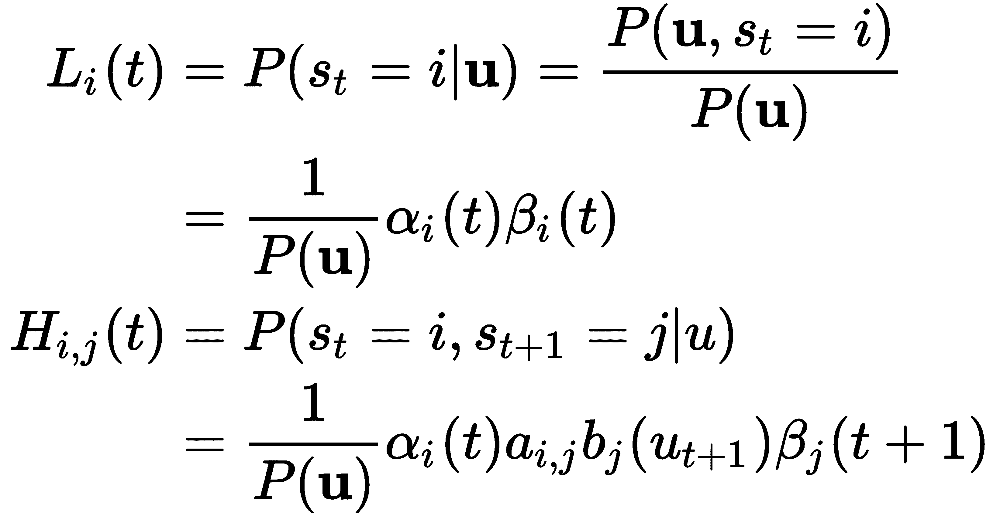
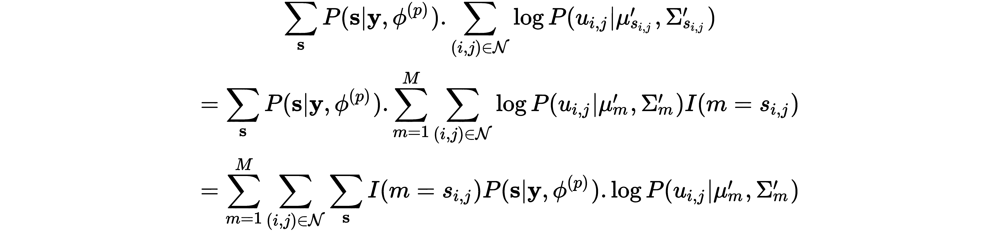

# 第八章：用于图像处理的二维隐马尔可夫模型（2D HMM）

本章我们将介绍隐马尔可夫模型（HMM）在图像分割中的应用。在图像分割中，我们通常将给定的图像拆分成多个相同大小的块，然后对每个块进行估计。然而，这些算法通常忽略了来自邻近块的上下文信息。为了解决这个问题，引入了二维隐马尔可夫模型（2D HMM），它通过一个潜在的二维马尔可夫网格考虑特征向量之间的依赖关系。在本章中，我们将讨论二维隐马尔可夫模型是如何工作的，并推导出相应的参数估计算法。本章将讨论以下主题：

+   假二维隐马尔可夫模型

+   二维隐马尔可夫模型（2D HMM）简介

+   二维隐马尔可夫模型中的参数学习

+   应用

# 一维隐马尔可夫模型回顾

让我们回顾一下前几章中讨论的如何使用一维隐马尔可夫模型（1D HMM）。我们看到，隐马尔可夫模型其实是马尔可夫链上的一个过程。在任何时刻，隐马尔可夫模型处于某个可能的状态，模型将转移到的下一个状态取决于当前状态以及模型的转移概率。

假设对于隐马尔可夫模型（HMM）有 *M = {1, 2, ..., M}* 个可能的状态，且从某个状态 *i* 转移到状态 *j* 的转移概率由 *a[i,j]* 给出。对于这样的模型，如果在时刻 *t-1* 模型处于状态 *i*，那么在时刻 *t* 它将以概率 *a[i,j]* 进入状态 *j*。这个概率被称为**转移概率**。另外，我们已经定义了模型中的观察变量，它仅依赖于隐藏变量的当前状态。我们可以将时刻 *t* 的观察变量定义为 *u[t]*，假设状态 *i* 对变量 *u[t]* 的发射分布为 *bi*。

我们还需要定义初始概率 *π[i]*，即在时刻 *t = 1* 时处于状态 *i* 的概率。通过给定这些值，我们可以确定观察到任何给定序列的似然，，如下所示：

在大多数情况下，我们假设状态为高斯混合模型；在这种情况下，前面的方程可以进一步推广，如下所示：

在这里，*u[i]* 是均值，*∑[i]* 是协方差矩阵，*k* 是观察变量 *u[t]* 的维度。

现在我们已经定义了模型，可以继续进行估计方法。估计通常通过我们在第四章中看到的 Baum-Welch 算法来进行，*最大似然参数推断*，该算法执行最大似然估计。令 *Li* 为在时刻 *t* 处于状态 *i* 的条件分布，给定观察结果，*Hi,j* 为从状态 *i* 在时刻 *t + 1* 转移到状态 *j* 的条件概率，仍然是给定观察结果。然后，我们可以重新估计均值、协方差和转移概率，如下所示：

为了计算 *Li* 和 *Hi,j* 的值，我们使用前向-后向算法。前向算法给出了观察到前 *t* 个结果的概率，*αi*，以及在时刻 *t* 时处于状态 *i* 的概率。

这个概率可以通过以下方程组进行评估：

我们还定义了后向概率，*βi*，作为给定模型在时刻 *t* 处于状态 *i* 时，观察到 *{u[r]}r=t + 1,...,T* 的条件概率。后向概率 *βi* 可以通过以下方式计算：

使用这些值后，我们可以计算出 *Li* 和 *Hi,j* 可以通过以下方式求解：

我们可以通过假设每个观察结果来自最可能的隐藏状态来近似该算法。这使得我们可以简化 Baum-Welch 算法；这种方法通常也被称为 **维特比训练算法**。给定观察到的状态，并假设状态序列为 ，其具有最大条件概率，可以通过以下方式表示：

这里， 可以通过以下方式计算：

使用这些值，我们可以计算模型参数，如下所示：

这里，*I* 是指示函数，当函数的参数为真时返回 1，否则返回 0。

在本节中，我们简要回顾了当状态使用高斯混合模型参数化时的一维 HMM（隐马尔可夫模型）的基本概念，现在我们可以继续讨论二维 HMM。

# 二维 HMM

关于二维 HMM，已经做了很多工作，但最近的、受欢迎的工作是由 Jia Li、Amir Najmi 和 Robert Gray 在他们的论文《*通过二维隐马尔可夫模型进行图像分类*》中完成的。本节内容基于他们的工作编写。我们将从介绍他们提出的通用算法开始，随后在接下来的小节中，我们将看到该算法的具体运作方式。

# 算法

图像分类的算法如下：

+   训练：

    +   将训练图像划分为大小相等且不重叠的块，并为每个块提取特征向量

    +   选择 2D HMM 的状态数

    +   根据特征向量和训练标签估计模型参数

+   测试：

    +   与训练类似，为测试图像生成特征向量

    +   根据训练模型，给定特征向量，搜索具有最大后验概率的类别集合

# 2D HMM 模型的假设

本节我们将快速浏览 2D HMM 模型的假设以及这些假设如何简化我们的方程。更详细的推导请参阅原始论文。

我们从将图像划分为较小的块开始，从中评估特征向量，并使用这些特征向量对图像进行分类。在 2D HMM 的情况下，我们假设特征向量是由一个马尔可夫模型生成的，并且每次块的变化都会发生状态变化。我们还基于块的前后关系定义块之间的关系。若位置为 *(i', j')* 的块出现在位置 *(i, j)* 之前，则满足 *i'* 或 *i' = i* 且 *j' < j*。假设有 *M = {1, 2, ... M}* 个状态，任何给定位置 *(i, j)* 的块的状态用 *S[i,j]* 表示，特征向量用 *u[i,j]* 表示，类别用 *c[i,j]* 表示。另一个需要注意的点是，块的顺序只是为了说明模型的假设，算法在进行分类时并不考虑块的顺序。

模型做出的第一个假设如下：

该假设声明，知道当前状态足以估计转移概率，这意味着 *u* 是条件独立的。同时，根据该假设，状态转移是一个二维的马尔可夫过程，系统进入任何特定状态的概率取决于前一时间和观察实例中模型在水平和垂直方向上的状态。我们还假设状态与类别之间是 1 对 1 的映射，因此一旦知道状态，就可以直接计算类别。

第二个假设是特征向量对于每个状态来说是一个高斯混合分布。我们知道，任何 M 成分的高斯混合可以分解为 M 个单一高斯分布的子状态；因此，对于状态 *s* 和特征向量 *u* 的块，分布的概率由以下公式给出：

这里，*∑[s]* 是协方差矩阵，*μ[s]* 是高斯分布的均值向量。

我们现在可以使用马尔可夫假设来简化状态的概率评估。图像中所有块的状态概率用 *P{s[i,j] : (i,j) ∈ N}* 表示，其中 *N = {(i,j) : 0 ≤ i < w, 0 ≤ j < z}*。但在我们使用马尔可夫假设有效地展开概率之前，我们需要证明，基于前两个假设，图像满足二维马尔可夫属性的旋转形式。

我们定义了  的旋转关系，记为 ，它指定了 ，如果 *j' < j*，或 *j' = j* 且 *i' < i*。我们需要证明以下内容：

因此，我们使用前面定义的  并引入以下新符号：

从前面的方程中，我们还可以看到这一点：

现在，为了简化符号，假设我们引入  和 。从这些符号中，我们可以进行以下推导：

展开条件概率，我们得到如下结果：

使用马尔可夫假设，我们得到如下结果：

最后，使用马尔可夫假设以及假设给定状态下，块的特征向量是条件独立的，我们得到以下结果：

其中 *m = s[i-1,j]*，*n = s[i,j-1]*，和 *l = s[i,j]*。

如果我们将  替换为 ，并将  替换为  在推导过程中，所有的方程仍然成立。这给我们带来了以下结果：

由于前面的方程包含了原始的马尔可夫假设及其旋转版本，我们可以如下展示这两个假设的等价性：

现在我们可以简化 *P{s[i,j] : (i,j) ∈ N}* 的展开式，如下所示：

这里，*w* 和 *z* 分别是图像的行数和列数，*T[i]* 是对角线 *i* 上块的状态序列。接下来，我们需要证明 *P(T[i]|T[i-1],...,T[0]) = P(T[i]|T[i-1])*。假设 *T[i] = {s[i,0], s[i-1,1], ..., s[0,i]}*，这意味着 *T[i-1] = {s[i-1,0], s[i-2,1], ..., s[0,i-1]}*，因此我们得到以下结果：

因此，我们可以得出结论：

使用此方法，我们得到以下简化的方程：

# 使用 EM 进行参数估计

由于我们已经准备好模型，现在需要估计模型的参数。我们需要估计均值向量*μ[m]*；协方差矩阵*∑[m]*；以及转移概率*a[m,n,l]*，其中*m,n,l = 1,..., M*，*M*是状态的总数。我们将使用**期望最大化**（**EM**）算法。

正如我们在前面的章节中看到的，EM 是一个迭代算法，可以在缺失数据的情况下学习最大似然估计；也就是说，当我们的数据中有未观察到的变量时。假设我们的未观察到的变量*x*位于样本空间*x*中，而观察到的变量*y*位于样本空间*y*中。如果我们假设一个分布族*f(x|Φ)*，其参数*Φ ∈ Ω*，那么*y*的分布如下所示：

EM 算法将尝试找到一个值！，该值会最大化给定观察到的*y*时，*g(y|Φ)*的值。EM 迭代*Φ^((p)) → Φ^((p+1))*定义如下：

+   **E 步**：计算*Q*(*Φ|**Φ^((p))*)，其中*Q(Φ'|Φ)*是*log f(x|Φ')*的期望值。

+   **M 步**：选择*Φ^((p+1))*为*Φ ∈ Ω*中的一个值，以最大化*Q*(*Φ|**Φ^((p))*)。

现在让我们定义二维 HMM 所需的术语：

+   整个图像的观察特征向量集是！

+   图像的状态集是！

+   图像的类别集是！

+   从状态*s[i,j]*到其类别的映射为 C(*s[i,j]*)，从状态*s*映射到类别的集合记作*C(s)*。

现在，让我们定义一个二维 HMM 中*x*的分布，如下所示：

从这个，我们可以计算出以下*log f(x|Φ')*：

我们现在知道，给定*y*，*x*只能有有限个与*y*的值一致的状态。因此，*x*的分布如下所示：

这里，*α* 是归一化常数，*I* 是指示函数。现在，对于 M 步，我们需要将*Φ^((p+1))*的值设为*Φ'*，以最大化以下公式：

由于前面的项有两部分相加，我们可以分别处理每一项，因为我们正在尝试最大化总值。考虑第一项：

通过定义！，前面的方程可以简化为：

该项在中是凹函数；因此，使用拉格朗日乘数并对其求导，我们得到以下结果：

回到最大化的第二项：

再次为了简化前面的方程，我们定义，前面的项变成了如下形式：

在这种情况下，我们的高斯分布的最大似然估计（ML 估计）如下所示：

为了总结整个推导过程，我们可以将 EM 算法写成以下两个步骤：

1.  给定模型估计*Φ^((p))*, 参数更新如下所示：

这里，项可以按以下方式计算：

1.  转移概率的更新如下所示：

这里，的计算方法如下：

通过迭代应用前面两个方程，我们的算法将收敛到模型参数的最大似然估计。

# 总结

本章我们首先回顾了上一章介绍的 1D HMMs（隐马尔可夫模型）。随后，我们介绍了 2D HMMs（二维隐马尔可夫模型）的概念，并推导了为了简化计算，我们对 2D HMMs 所做的各种假设，这些假设可以应用于图像处理任务。接着，我们介绍了一种通用的 EM 算法，用于学习 2D-HMMs 中的参数。

在下一章中，我们将探讨 HMMs 在强化学习领域中的另一种应用，并介绍 MDP（马尔可夫决策过程）。
