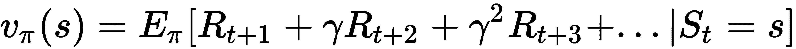
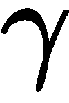
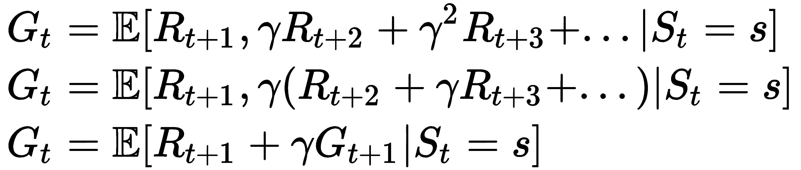
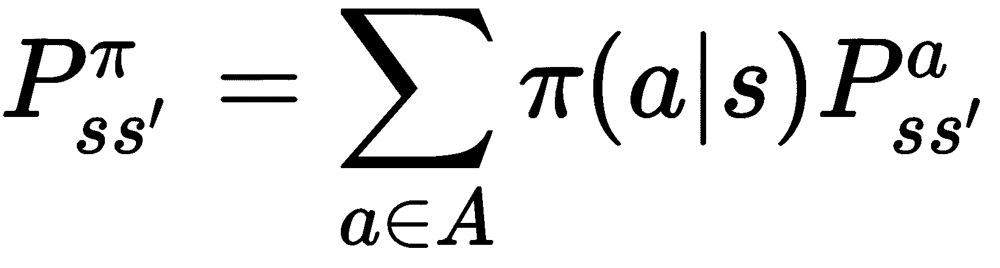

# 第九章：马尔可夫决策过程

在本章中，我们将讨论隐马尔可夫模型（HMMs）的另一种应用，即**马尔可夫决策过程**（**MDP**）。在 MDP 的情况下，我们为模型引入了奖励，任何由过程经历的状态序列都会产生特定的奖励。我们还将引入折扣的概念，这将使我们能够控制代理的短视或远视程度。代理的目标是最大化它能够获得的总奖励。

在本章中，我们将讨论以下主题：

+   强化学习

+   马尔可夫奖励过程

+   马尔可夫决策过程

+   代码示例

# 强化学习

强化学习是机器学习中的一种不同范式，其中代理通过做出决策/行动并观察结果来学习在定义的环境中如何最优地行为。因此，在强化学习中，代理并不是从某个给定的数据集中学习，而是通过与环境互动，代理尝试通过观察其行为的效果来学习。环境的定义方式使得代理在其行动使其接近目标时会获得奖励。

人类就是以这种方式学习的。例如，考虑一个站在壁炉前的孩子，孩子是代理，周围的空间是环境。现在，如果孩子把手靠近火炉，他会感受到温暖，这种感觉是愉快的，某种程度上，孩子（或代理）因将手靠近火炉而获得奖励。但如果孩子将手移得太靠近火炉，手就会被烧伤，因此会收到负奖励。通过这些奖励，孩子能够找出保持手与火炉之间的最优距离。强化学习正是模仿这种系统，训练代理学习如何在给定的环境中优化其目标。

更正式地说，要训练一个代理，我们需要有一个环境，这个环境代表了代理应该能够采取行动的世界。对于这些行动，环境应该返回包含奖励信息的观察结果，告诉代理这次行动的好坏。观察结果还应包含关于代理在环境中下一状态的信息。基于这些观察结果，代理尝试找出到达目标的最优方式。*图 1* 显示了代理与环境之间的互动：


强化学习与其他算法根本不同的地方在于没有监督者。相反，只有一个奖励信号，反馈代理它所采取的行动。这里还需要提到一个重要的事情，那就是环境可以被构建成奖励是延迟的，这可能会导致代理在达到目标之前四处游荡。也有可能代理在达到目标之前要经历大量的负反馈。

在监督学习中，我们给定的数据集基本上会告诉我们的学习算法在不同情况下的正确答案。然后，我们的学习算法会查看所有这些不同的情况以及这些情况下的解决方案，并试图基于这些情况进行归纳。因此，我们也期望给定的数据集是**独立同分布**（**IID**）的。但在强化学习中，数据不是 IID，生成的数据取决于代理所走的路径，因此取决于代理采取的行动。因此，强化学习是一个主动学习过程，代理所采取的行动影响环境，进而影响环境生成的数据。

我们可以通过一个非常简单的例子来更好地理解强化学习代理和环境的行为。考虑一个代理试图学习玩超级马里奥兄弟：

1.  代理将从环境中接收初始状态。以超级马里奥为例，这将是当前的游戏画面。

1.  在接收到状态信息后，代理将尝试采取行动。假设代理采取的行动是向右移动。

1.  当环境接收到这个行动时，它将基于此返回下一个状态。下一个状态也会是一个画面，但如果前一个状态中马里奥旁边有敌人，那么画面可能会显示马里奥死亡。否则，画面只会显示马里奥向右移动了一步。环境还会根据行动返回奖励。如果马里奥右边有敌人，奖励可能是-5（因为该行动导致马里奥死亡），或者如果马里奥朝着完成关卡的方向移动，奖励可能是+1。

# 奖励假设

强化学习的整个概念是基于一种叫做**奖励假设**的东西。根据奖励假设，所有目标都可以通过最大化预期的累积奖励来定义。

在任意给定的时间点 *t*，总的累积奖励可以表示为：


但实际上，离当前状态较近的奖励比远离的奖励更可能发生。为了解决这个问题，我们引入了另一个术语，称为**折扣率**，。折扣率的值始终在 0 和 1 之间。较大的折扣率意味着较小的折扣，这使得智能体更关心长期奖励；而较小的折扣率则使得智能体更关心短期奖励。通过引入折扣率项，我们现在可以定义我们的累积奖励为：


# 环境和智能体的状态

正如我们之前所看到的，智能体与环境在时间间隔*t = 0, 1, 2, 3, ..,* 进行交互，在每个时间点，智能体根据环境的状态*S[t]*采取动作*A[t]*并获得奖励*R[t+1]*。这种随时间变化的状态、动作和奖励的序列被称为**智能体的历史**，表示为：


理想情况下，我们希望智能体所采取的动作能够基于其所有历史，但通常不可行，因为智能体的历史可能非常庞大。因此，我们定义状态的方式是将其作为智能体历史的总结：


基本上，我们将状态定义为智能体历史的一个函数。需要注意的是，环境状态是环境用来根据动作决定其下一个状态的状态，并且给出奖励。此外，环境状态是环境的私有信息。

另一方面，智能体状态是智能体用来决定下一步动作的状态。智能体的状态是其内部表示，可以是前述历史的任何函数。

我们使用马尔可夫状态来表示智能体的状态，这基本上意味着智能体的当前状态能够总结所有历史，智能体的下一步动作只会依赖于当前的状态。因此，


在本章中，我们仅考虑智能体能够直接观察环境状态的情况。这导致环境的观察既是智能体的当前状态，也是环境的状态。这种特殊情况通常被称为**MDP**。

# 智能体的组件

在本节中，我们将正式定义智能体可能具有的不同类型的组件。

+   **策略**：它是给定状态下对动作的条件概率分布。根据这个条件分布，智能体在任何给定状态下选择其动作。策略可以是确定性的：*a = π(s)*，也可以是随机的：。

+   **价值函数**：价值函数试图预测在给定状态下采取某个动作所期望的奖励。它的表达式为：

    。

    其中 *E* 是期望值， 是折扣因子。

+   **模型**：模型是智能体对环境的表征。它使用一个转移函数 *P* 来定义，预测环境的下一个状态：

    。

    以及一个奖励函数，用于预测在给定状态下采取某个动作所关联的奖励： 。

基于这些组件，智能体可以被划分为以下五类：

+   **基于价值的智能体**：拥有隐式的策略，智能体根据价值函数做出决策

+   **基于策略的智能体**：拥有显式的策略，智能体搜索最优的动作-价值函数

+   **演员-评论员智能体**：结合了基于价值和基于策略的智能体

+   **基于模型的智能体**：尝试基于环境构建一个模型

+   **无模型智能体**：不尝试学习环境，而是尝试学习策略和价值函数

# 马尔可夫奖励过程

在上一节中，我们介绍了 MDP。在这一节中，我们将正式定义问题陈述，并看到解决该问题的算法。

MDP（马尔可夫决策过程）用于定义强化学习中的环境，几乎所有的强化学习问题都可以使用 MDP 来定义。

为了理解 MDP，我们需要使用**马尔可夫奖励过程**（**MRP**）的概念。MRP 是一个随机过程，通过给每个状态添加奖励率，扩展了马尔可夫链。我们还可以定义一个附加变量来跟踪随时间积累的奖励。形式上，MRP 定义为 ，其中 *S* 是有限状态空间，*P* 是状态转移概率函数，*R* 是奖励函数，且  是折扣率：


其中  表示期望值。这里的 *R[s]* 表示状态 *s* 的期望奖励。

在 MRP 的情况下，我们可以定义从状态 *s* 开始时的期望回报为：


其中 *G[t]* 是我们在前一节中定义的累计增益：


现在，为了最大化累计奖励，智能体将尽力从它进入的每个状态中获取期望的奖励总和。为了做到这一点，我们需要找到最优的价值函数。我们将在下一节看到解决这个问题的算法。

# 贝尔曼方程

使用贝尔曼方程，我们将值函数分解为两个独立的部分，一个表示即时奖励，另一个表示未来奖励。根据我们之前的定义，即时奖励表示为*R[t+1]*，未来奖励表示为 ，其中：


现在让我们展开*G[t]*并将*G[t+1]*代入其中：



现在，由于我们知道：


使用这个恒等式，我们得到：


这为我们提供了 MRP 的贝尔曼方程：


# MDP

现在我们对 MRP 有了基本的理解，可以继续讨论 MDP。MDP 是包含决策的 MRP。环境中的所有状态也是马尔可夫的，因此下一个状态只依赖于当前状态。形式上，MDP 可以使用  来表示，其中*S*是状态空间，*A*是动作集，*P*是状态转移概率函数，*R*是奖励函数，*γ*是折扣率。状态转移概率函数*P*和奖励函数*R*被正式定义为：


我们也可以正式定义一个策略*π*为：


由于 MDP 中的状态被认为是马尔可夫的，MDP 策略只依赖于当前状态，这意味着策略是静态的，也就是说， 。这意味着每当智能体进入相同的状态时，它将根据之前决定的相同策略做出决策。决策函数可以是随机的，这样智能体就不会一直做出相同的决策，从而能够探索环境。

现在，由于我们希望在 MDP 的情况下使用贝尔曼方程，我们将从 MDP 恢复一个 MRP。给定一个 MDP，和一个策略 ，状态序列*S[1], S[2], ...*是策略*π*上的马尔可夫过程*(S,P)*。状态和奖励序列*S1, R1, S2, R2, ...*也是由  给出的 MRP，其中：



我们也可以类似地将奖励函数表示为：


并且，由于我们知道 MDP 的状态值函数*Vπ(s)*是从状态*S*开始，然后遵循策略*π*的期望回报，值函数表示为：


同样，动作值函数可以表示为：


拥有这些值后，我们可以再次推导出 MDP 情况下的贝尔曼期望方程。我们再次通过将状态值函数分解为即时奖励和未来奖励来开始：


与 MRP 的情况类似，动作值函数也可以分解为：


由于我们从每个状态*S*有多个动作，并且策略定义了动作的概率分布，因此我们需要对其进行平均，以得到贝尔曼期望方程：


我们还可以对所有可能的动作值进行平均，以了解在给定状态*S*下有多好：


# 代码示例

在以下的代码示例中，我们实现了一个简单的 MDP：

```py
import numpy as np
import random

class MDP(object):
  """ 
    Defines a Markov Decision Process containing:

    - States, s 
    - Actions, a
    - Rewards, r(s,a)
    - Transition Matrix, t(s,a,_s)

    Includes a set of abstract methods for extended class will
    need to implement.

  """

  def __init__(self, states=None, actions=None, rewards=None, transitions=None, 
        discount=.99, tau=.01, epsilon=.01):
    """
    Parameters:
    -----------
    states: 1-D array
        The states of the environment

    actions: 1-D array
        The possible actions by the agent.

    rewards: 2-D array
        The rewards corresponding to each action at each state of the environment.

    transitions: 2-D array
        The transition probabilities between the states of the environment.

    discount: float
        The discount rate for the reward.
    """    
    self.s = np.array(states)
    self.a = np.array(actions)
    self.r = np.array(rewards)
    self.t = np.array(transitions)

    self.discount = discount
    self.tau = tau
    self.epsilon = epsilon

    # Value iteration will update this
    self.values = None
    self.policy = None

  def getTransitionStatesAndProbs(self, state, action):
    """
      Returns the list of transition probabilities
    """
    return self.t[state][action][:]

  def getReward(self, state):
    """
      Gets reward for transition from state->action->nextState.
    """
    return self.r[state]

  def takeAction(self, state, action):
    """
      Take an action in an MDP, return the next state

      Chooses according to probability distribution of state transitions,
      contingent on actions.
    """
    return np.random.choice(self.s, p=self.getTransitionStatesAndProbs(state, action)) 

  def valueIteration(self):
    """
      Performs value iteration to populate the values of all states in
      the MDP. 

    """

    # Initialize V_0 to zero
    self.values = np.zeros(len(self.s))
    self.policy = np.zeros([len(self.s), len(self.a)])

    policy_switch = 0

    # Loop until convergence
    while True:

      # To be used for convergence check
      oldValues = np.copy(self.values)

      for i in range(len(self.s)-1):

        self.values[i] = self.r[i] + np.max(self.discount * \
              np.dot(self.t[i][:][:], self.values))

      # Check Convergence
      if np.max(np.abs(self.values - oldValues)) <= self.epsilon:
        break

  def extractPolicy(self):
    """
      Extract policy from values after value iteration runs.
    """

    self.policy = np.zeros([len(self.s),len(self.a)])

    for i in range(len(self.s)-1):

      state_policy = np.zeros(len(self.a))

      state_policy = self.r[i] + self.discount* \
            np.dot(self.t[i][:][:], self.values)

      # Softmax the policy 
      state_policy -= np.max(state_policy)
      state_policy = np.exp(state_policy / float(self.tau))
      state_policy /= state_policy.sum()

      self.policy[i] = state_policy

  def simulate(self, state):

    """ 
      Runs the solver for the MDP, conducts value iteration, extracts policy,
      then runs simulation of problem.

      NOTE: Be sure to run value iteration (solve values for states) and to
       extract some policy (fill in policy vector) before running simulation
    """

    # Run simulation using policy until terminal condition met

    while not self.isTerminal(state):

      # Determine which policy to use (non-deterministic)
      policy = self.policy[np.where(self.s == state)[0][0]]
      p_policy = self.policy[np.where(self.s == state)[0][0]] / \
            self.policy[np.where(self.s == state)[0][0]].sum()

      # Get the parameters to perform one move
      stateIndex = np.where(self.s == state)[0][0]
      policyChoice = np.random.choice(policy, p=p_policy)
      actionIndex = np.random.choice(np.array(np.where(self.policy[state][:] == policyChoice)).ravel())

      # Take an action, move to next state
      nextState = self.takeAction(stateIndex, actionIndex)

      print "In state: {}, taking action: {}, moving to state: {}".format(
        state, self.a[actionIndex], nextState)

      # End game if terminal state reached
      state = int(nextState)
      if self.isTerminal(state):

        # print "Terminal state: {} has been reached. Simulation over.".format(state)
        return state
```

使用这个 MDP，我们现在可以编写一个简单的投注游戏代码：

```py
class BettingGame(MDP):

 """ 
 Defines the Betting Game:

 Problem: A gambler has the chance to make bets on the outcome of 
 a fair coin flip. If the coin is heads, the gambler wins as many
 dollars back as was staked on that particular flip - otherwise
 the money is lost. The game is won if the gambler obtains $100,
 and is lost if the gambler runs out of money (has 0$). This gambler
 did some research on MDPs and has decided to enlist them to assist
 in determination of how much money should be bet on each turn. Your 
 task is to build that MDP!

 Params: 

 pHead: Probability of coin flip landing on heads
 - Use .5 for fair coin, otherwise choose a bias [0,1]

 """

 def __init__(self, pHeads=.5, discount=.99, epsilon=.1, tau=.0001):

 MDP.__init__(self,discount=discount,tau=tau,epsilon=epsilon)
 self.pHeads = pHeads
 self.setBettingGame(pHeads)
 self.valueIteration()
 self.extractPolicy()

 # Edge case fix: Policy for $1
 self.policy[1][:] = 0
 self.policy[1][1] = 1.0

 def isTerminal(self, state):
 """
 Checks if MDP is in terminal state.
 """
 return True if state is 100 or state is 0 else False

 def setBettingGame(self, pHeads=.5):

 """ 
 Initializes the MDP to the starting conditions for 
 the betting game. 

 Params:
 pHeads = Probability that coin lands on head
 - .5 for fair coin, otherwise choose bias

 """

 # This is how much we're starting with
 self.pHeads = pHeads

 # Initialize all possible states
 self.s = np.arange(102)

 # Initialize possible actions
 self.a = np.arange(101)

 # Initialize rewards
 self.r = np.zeros(101)
 self.r[0] = -5
 self.r[100] = 10

 # Initialize transition matrix
 temp = np.zeros([len(self.s),len(self.a),len(self.s)])

 # List comprehension using tHelper to determine probabilities for each index
 self.t = [self.tHelper(i[0], i[1], i[2], self.pHeads) for i,x in np.ndenumerate(temp)]
 self.t = np.reshape(self.t, np.shape(temp))

 for x in range(len(self.a)):

 # Remember to add -1 to value it, and policy extract
 # Send the end game states to the death state!
 self.t[100][x] = np.zeros(len(self.s))
 self.t[100][x][101] = 1.0
 self.t[0][x] = np.zeros(len(self.s))
 self.t[0][x][101] = 1.0

 def tHelper(self, x, y, z, pHeads):

 """ 
 Helper function to be used in a list comprehension to quickly
 generate the transition matrix. Encodes the necessary conditions
 to compute the necessary probabilities.

 Params:
 x,y,z indices
 pHeads = probability coin lands on heads

 """

 # If you bet no money, you will always have original amount
 if x + y is z and y is 0:
 return 1.0

 # If you bet more money than you have, no chance of any outcome
 elif y > x and x is not z:
 return 0

 # If you bet more money than you have, returns same state with 1.0 prob.
 elif y > x and x is z:
 return 1.0

 # Chance you lose
 elif x - y is z:
 return 1.0 - pHeads

 # Chance you win
 elif x + y is z:
 return pHeads

 # Edge Case: Chance you win, and winnings go over 100
 elif x + y > z and z is 100:
 return pHeads

 else:
 return 0 

 return 0

```

# 总结

在本章中，我们首先简要介绍了强化学习。我们讨论了智能体、奖励和强化学习中的学习目标。在下一节中，我们介绍了 MRP，它是 MDP 的一个主要概念。在理解了 MRP 之后，我们接下来介绍了 MDP 的概念，并附上了一个代码示例。
