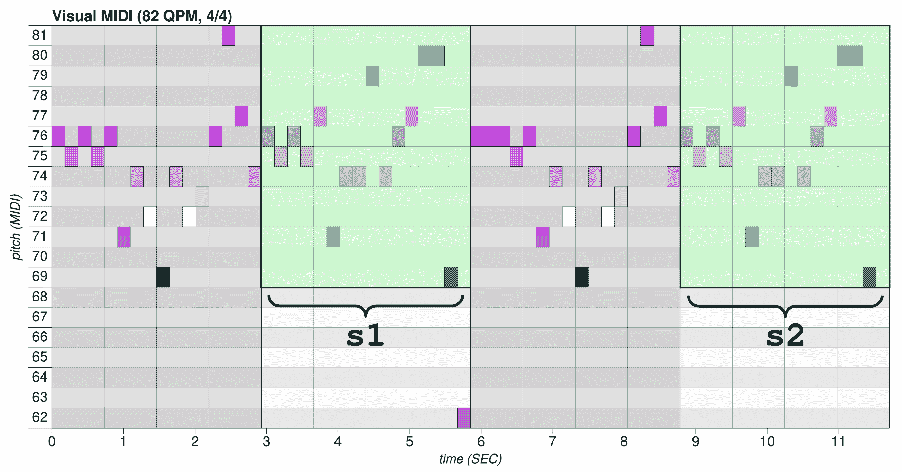

# 第五章：生成和声旋律

在上一章中，我们创建了鼓序列，现在我们可以继续创作音乐的核心——旋律。在本章中，你将学习 **长短期记忆**（**LSTM**）网络在生成较长序列中的重要性。我们将学习如何使用一个单声部的 Magenta 模型——Melody RNN，它是一个带有回环和注意力配置的 LSTM 网络。你还将学习如何使用两个和声模型：Polyphony RNN 和 Performance RNN，它们都是使用特定编码的 LSTM 网络，后者支持音符的力度和表现力的时值。

本章将覆盖以下主题：

+   用于长期依赖的 LSTM

+   使用 Melody RNN 生成旋律

+   使用 Polyphony RNN 和 Performance RNN 生成和声

# 技术要求

在本章中，我们将使用以下工具：

+   启动 Magenta 的 **命令行** 或 **bash** 来自终端

+   使用 **Python** 及其库来编写使用 Magenta 的音乐生成代码

+   **Magenta** 用于生成 MIDI 音乐

+   **MuseScore** 或 **FluidSynth** 用于听生成的 MIDI

在 Magenta 中，我们将使用 **Melody RNN**、**Polyphony RNN** 和 **Performance RNN** 模型。我们将深入解释这些模型，但如果你需要更多信息，可以查看 Magenta 源代码中的模型 README（[github.com/tensorflow/magenta/tree/master/magenta/models](https://github.com/tensorflow/magenta/tree/master/magenta/models)）。你也可以查看 Magenta 的代码，它有很好的文档说明。我们还在最后一节提供了额外的内容，*进一步阅读*。

本章的代码在本书的 GitHub 仓库中的 `Chapter03` 文件夹，位置在 [github.com/PacktPublishing/hands-on-music-generation-with-magenta/tree/master/Chapter03](https://github.com/PacktPublishing/hands-on-music-generation-with-magenta/tree/master/Chapter03)。示例和代码片段假设你位于该章节文件夹。在本章中，你在开始之前应该执行 `cd Chapter03`。

查看以下视频，查看代码实际应用：

[`bit.ly/314KEzq`](http://bit.ly/314KEzq)

# 用于长期依赖的 LSTM

在上一章中，我们学习了 **递归神经网络**（**RNNs**）在音乐生成中的重要性，因为它们使得可以操作一系列向量并记住过去的事件。这个“记住过去事件”的部分在音乐生成中非常重要，因为过去的事件在定义全局音乐结构中起着重要作用。让我们考虑一个破碎的小九和弦例子，包括“A”、“C”、“E”、“G”和“B”五个音符。为了预测最后一个音符“B”，网络必须记住四个音符之前的事件，才能知道这很可能是一个小九和弦。

不幸的是，随着相关信息和需求点之间的间隔增大，RNN 变得无法学习这些依赖关系。理论上，网络应该能够做到这一点，但实际上，确实很困难。传统 RNN 的两个常见问题是梯度消失问题和梯度爆炸问题，我们将在本节中看到这两个问题。

幸运的是，1997 年引入的 LSTM 网络解决了这个问题。它们是一种特殊类型的 RNN，每个神经元都有一个带有特殊门控的记忆单元。正如前一章中介绍的，Drums RNN 模型就是 LSTM 网络，本章中的所有模型也是如此。现在，让我们看看 LSTM 是如何工作的。

# 查看 LSTM 记忆单元

LSTM 网络自从发明以来一直很受欢迎，而且有充分的理由：它们是专门为解决我们一直讨论的长期依赖问题而设计的。在 Magenta 中，RNN 模型就是 LSTM 网络。

让我们回顾一下前一章的 RNN 图示。我们将使用相同的图示，但放大其中一个单元并添加一些细节：


我们可以看到，这里重复的模块非常简单：它从前一层获取输出，将其与当前输入进行连接，并使用激活函数（如 tanh、sigmoid 或 ReLU）层来生成该层的输出和下一层的输入。我们还记得，长期信息必须通过所有单元和层按顺序传递，这意味着信息必须在每一步都进行乘法运算。这就是梯度消失问题出现的地方：被多个小数字乘积的值往往会消失。

现在让我们来看看 LSTM 记忆单元是如何设计的：


这里首先要注意的是添加的水平线，注释为{ ..., *c(t-1)*, *c(t)* , *c(t+1), ...* }，它将单元状态信息传递到前面。单元状态可以通过三个门控来修改——**遗忘**、**输入**和**输出**。我们不会详细讨论这些门控的工作原理，因为它超出了本书的范围，但我们会看一个实例，展示它在我们用例中的工作方式。

查看最后一节，*进一步阅读*，其中包含关于 LSTM 的更多参考资料。

让我们以一个破碎的小九和弦为例，来说明门层是如何工作的。网络正在训练，至今已经接收到 "A"、"C"、"E"、"G"、"B"，这就是它的当前状态。现在 LSTM 看到了一个新的音符 "C"，会发生什么呢？首先，让我们看看 **遗忘门层**。LSTM 将查看 *h(t-1)*，即上一层的输出，以及 *x(t)*，即当前输入 "C"，并为上一层的每个元素 *c(t-1)* 输出一个值。然后，状态会与该输出相乘，输出值范围在 0 到 1 之间，意味着接近 0 的值会导致该状态丢失这个值，而接近 1 的值则会导致该状态保留这个值。由于输入是 "C"，而且在我们的状态中，已经看到了一个完整的和弦，因此网络可能会学习忘记之前的信息，因为我们开始了一个新的和弦。

接下来，**输入门层**将查看 *h(t-1)* 和 *x(t)*，并决定对状态做出哪些添加。利用这些信息，遗忘门的输出被更新，产生 *c(t)*。此时，细胞状态已经有了新的内容，意味着我们的输入 "C" 已经加入到细胞状态中，这对后续层来说是有用的，比如，检测到一个潜在的 C 大调和弦的开始。此时，网络也可能会学习到其他和弦，具体取决于训练数据。经过正确训练的网络将根据其训练学习不同的音乐和弦，并在推理过程中输出相应的预测。

最后，**输出门层**将通过查看新的状态 *c(t)*、*h(t-1)* 和 *x(t)* 来产生输出 *h(t)*。此时，状态已经更新，不需要进一步的更新。由于我们的模型刚看到一个 "C"，它可能会输出一个 "E" 来组成 C 大调和弦。

这是 LSTM 的简化解释，但它有助于理解其在我们使用场景中的工作原理。

查看代码，你可以看到 LSTM 内存单元的使用。在 `events_rnn_graph.py` 模块中，`make_rnn_cell` 函数使用了 `tf.contrib.rnn.BasicLSTMCell`。你可以看到 Magenta 使用了 TensorFlow 作为后台引擎，因为 LSTM 并没有在 Magenta 中定义。

# 探索替代网络

总结上一节内容，我们有 RNN，它能够处理序列并查看过去的事件，而 LSTM 是 RNN 的一种特定内存单元实现。通常，一个网络可能被称为仅仅是 RNN，但实际上使用了 LSTM 内存单元。

虽然 LSTM 在保持长期信息方面迈出了重要一步，但仍然有可能的改进。另一种类似的记忆单元 **门控循环单元**（**GRU**）近年来因其更简洁的设计而获得了广泛关注。由于这一点，GRU 的表达能力较弱，这是一个需要注意的权衡。

LSTM 的一个问题是它们运行时需要更多的资源，因为记忆单元需要更多的内存和计算来操作。一种受欢迎的改进方案是引入 **注意力机制**，使得 RNN 可以关注过去输出的子集，从而在不使用过多记忆单元的情况下查看过去的事件。我们将在 *专注于特定步骤* 一节中讨论注意力机制。

# 使用 Melody RNN 生成旋律

在这一节中，我们将通过使用 Python 代码生成音乐，基于上一章的知识，使用新的模型——Melody RNN。本节将展示如何生成单旋律，下一节将展示如何处理多旋律。

**单旋律** 是最简单的音乐纹理形式，其中音符——**旋律**——由单一乐器逐个演奏。有时候，旋律可以由多个乐器或多个歌手在不同的八度音高上演奏（例如合唱团中），但仍然被视为单旋律，因为伴奏部分是单旋律的。

**多旋律** 则由两个或更多旋律线一起演奏。例如，用两只手演奏的钢琴谱就是多旋律的，因为需要同时演奏两条独立的旋律。

乐器可以是单旋律或多旋律。例如，单旋律的合成器一次只能演奏一个音符（如果你按下两个音符，只会有一个音符发出），而多旋律的合成器或经典钢琴则可以同时演奏多个音符。

这是贝多芬 *Für Elise* 钢琴谱中的一个小单旋律示例，出现在第 37 小节：


你会注意到这里只有一条旋律，音符是逐个演奏的。以下是同一谱子中的一个小多旋律示例，出现在第 25 小节：


在这个示例中，你会看到两条旋律同时演奏，通常是用钢琴的双手演奏。

多旋律听起来是不是有点熟悉？它可能让你联想到打击乐谱，因为打击乐谱本质上是多旋律的，因为多个旋律（如低音鼓、踩镲、军鼓等）一起演奏，形成完整的节奏。然而，接下来我们将在多旋律部分看到的内容有些不同，因为我们需要一种方法来表示跨越多个时值的音符，这与上一章不同。

让我们先写一些代码来生成旋律。

# 为 *Für Elise* 生成一首曲子

在这个示例中，我们将使用 *Für Elise* 钢琴谱中的一个小片段来生成基于该片段的旋律。这个片段如下所示：


请注意时间签名是 3/8。我们将在后面的 *时间的流逝* 部分探讨这个问题。

既然你已经知道如何生成一个序列，我们只会提供与之前代码不同的部分；你可以重用上一章写的代码。我们将代码封装在一个`generate`函数中，便于使用不同的模型和配置调用。

你可以在本章源代码的`chapter_03_example_01.py`文件中跟随这个示例。源代码中有更多的注释和内容，所以你应该去查看一下。

你可以在该文件中找到`generate`函数。随着进展，我们将会做更多版本的方法。本示例的引导文件位于`primers/Fur_Elisa_Beethoveen_Monophonic.mid`。

我们将逐步解释`generate`函数中的重要变化。新的函数签名如下：

```py
from magenta.music import DEFAULT_QUARTERS_PER_MINUTE
from magenta.protobuf.music_pb2 import NoteSequence

def generate(bundle_name: str,
             sequence_generator,
             generator_id: str,
             primer_filename: str = None,
             qpm: float = DEFAULT_QUARTERS_PER_MINUTE,
             total_length_steps: int = 64,
             temperature: float = 1.0,
             beam_size: int = 1,
             branch_factor: int = 1,
             steps_per_iteration: int = 1) -> NoteSequence:
```

在函数的开始部分，我们可以保留之前的代码，只需要将对 Drums RNN 包、生成器和配置的引用修改为相应的参数——`bundle_name`、`sequence_generator`和`generator_id`：

1.  首先，我们将处理`primer_filename`参数，通过之前看到的 MIDI 文件记谱序列函数来处理，如果没有提供引导，则使用空序列：

```py
import magenta.music as mm

if primer_filename:
  primer_sequence = mm.midi_io.midi_file_to_note_sequence(
    os.path.join("primers", primer_filename))
else:
  primer_sequence = NoteSequence()
```

1.  接着，我们将处理`qpm`参数。如果引导序列有节奏，我们将使用它。如果没有，我们将使用提供的`qpm`参数：

```py
if primer_sequence.tempos:
  if len(primer_sequence.tempos) > 1:
    raise Exception("No support for multiple tempos")
  qpm = primer_sequence.tempos[0].qpm
```

这引入了`NoteSequence`消息中的`tempos`属性，该属性包含一个节奏变化列表。与 MIDI 一样，一个乐谱可以有多个节奏，每个节奏都有一个特定的开始和停止时间。为了简化处理，并且因为 Magenta 不处理多个节奏，我们不会处理多个节奏。

1.  然后我们改变了计算引导长度的方法。以前这是一个固定值，但现在我们使用`total_time`（一个序列属性）给出的最后一个音符的结束时间，并将其向上取整到最接近的步长起点。然后，我们从该值开始计算序列长度（以秒为单位）：

```py
primer_sequence_length_steps = math.ceil(primer_sequence.total_time
                                         / seconds_per_step)
primer_sequence_length_time = (primer_sequence_length_steps 
                               * seconds_per_step)
```

结果生成的引导结束时间将是`primer_sequence_length_time`。请记住，Magenta 处理序列时是以秒为单位的，因此我们始终需要按秒计算时间。

1.  我们还通过从提供的`total_length_steps`值中减去引导长度来改变生成长度的计算方法：

```py
generation_length_steps = total_length_steps - primer_sequence_length_steps
generation_length_time = generation_length_steps * seconds_per_step
```

我们在上一章中使用小节来计算引导和生成长度，而现在，我们使用步长来做同样的事情。这两种方法在不同情况下都很有用，我们想展示这两者的不同。

通常情况下，使用步长更容易计算，因为你不需要担心时间签名，这会导致每小节的步长数量发生变化。

另一方面，使用小节使得制作具有正确时序的开始和结束循环变得更加容易，就像我们在上一章的练习中做的那样。

1.  我们还可以将`beam_size`、`branch_factor`和`steps_per_iteration`添加到生成器选项中，如下所示：

```py
generator_options.args['beam_size'].int_value = beam_size
generator_options.args['branch_factor'].int_value = branch_factor
generator_options.args['steps_per_iteration'].int_value = steps_per_iteration
```

1.  最后，我们将保存 MIDI 和绘图到磁盘，以便我们可以听到这个序列并展示它。它是与以 `<generator_name>_<generator_id>_<date_time>.<format>` 模式命名的文件中稍微多一些信息的相同代码，你之前看到的。

```py
# Writes the resulting midi file to the output directory
date_and_time = time.strftime('%Y-%m-%d_%H%M%S')
generator_name = str(generator.__class__).split(".")[2]
midi_filename = "%s_%s_%s.mid" % (generator_name,
                                  generator_id,
                                  date_and_time)
midi_path = os.path.join("output", midi_filename)
mm.midi_io.note_sequence_to_midi_file(sequence, midi_path)
print("Generated midi file: " + str(os.path.abspath(midi_path)))

# Writes the resulting plot file to the output directory
date_and_time = time.strftime('%Y-%m-%d_%H%M%S')
generator_name = str(generator.__class__).split(".")[2]
plot_filename = "%s_%s_%s.html" % (generator_name,
                                   generator_id,
                                   date_and_time)
plot_path = os.path.join("output", plot_filename)
pretty_midi = mm.midi_io.note_sequence_to_pretty_midi(sequence)
plotter = Plotter()
plotter.save(pretty_midi, plot_path)
print("Generated plot file: " + str(os.path.abspath(plot_path)))
```

1.  现在我们可以调用我们全新的 `generate` 方法！让我们用 Melody RNN 模型做一个简单的例子：

```py
from magenta.models.melody_rnn import melody_rnn_sequence_generator

generate(
  "basic_rnn.mag",
  melody_rnn_sequence_generator,
  "basic_rnn",
  primer_filename="Fur_Elisa_Beethoveen_Polyphonic.mid",
  total_length_steps=64)
```

所以，我们使用了 `basic_rnn.mag` 预训练的捆绑包与 `basic_rnn` 配置和 `melody_rnn_sequence_generator`。我们要求 64 个步骤，这是 4/4 拍的 4 小节。但我们不是说 primer 有 3/8 拍的节拍吗？是的，但生成的序列将是 4/4 拍，因此我们必须基于这个来进行计算。我们将在后面的章节中讨论这个问题，*时间的流逝*。

调用该方法将在 `output` 目录中生成两个文件，一个是 MIDI `.mid` 文件，另一个是绘图 `.html` 文件。

1.  要听生成的 MIDI，使用你的软件合成器或 MuseScore。对于软件合成器，请参考以下命令，根据你的平台更改 `PATH_TO_SF2` 和 `PATH_TO_MIDI` 的正确值：

    +   Linux：`fluidsynth -a pulseaudio -g 1 -n -i PATH_TO_SF2 PATH_TO_MIDI`

    +   macOS：`fluidsynth -a coreaudio -g 1 -n -i PATH_TO_SF2 PATH_TO_MIDI`

    +   Windows：`` `fluidsynth -g 1 -n -i PATH_TO_SF2 PATH_TO_MIDI` ``

1.  打开绘图文件，我们会得到类似这样的结果：


如果你听一下，你会发现生成的样本与 primer 中相同调性和类似音符，但 primer 的全局结构丢失了。这是因为 `basic_rnn` 配置不像回顾配置那样能够学习音乐结构，因为编码的向量不包含步骤位置和重复的音乐步骤。

让我们看看如何通过查看 `attention_rnn` 和 `lookback_rnn` 配置来修复它，它们都是带有特定编码的 LSTM。

# 理解回顾配置

要查看回顾配置的效果，我们将首先使用以下参数生成一个新序列：

```py
generator.generate(
  "lookback_rnn.mag",
  melody_rnn_sequence_generator,
  "lookback_rnn",
  primer_filename="Fur_Elisa_Beethoveen_Monophonic.mid",
  total_length_steps=64,
  temperature=1.1)
```

你可以看到我们正在使用相同的 `melody_rnn_sequence_generator` 函数，但是在配置和捆绑文件上有所更改。让我们看一下 **lookback** 配置的生成样本：



你可以看到这里的第 1 小节和第 3 小节在图表中用 **s1** 和 **s2** 注释有一个重复的音乐结构，第 0 小节和第 2 小节也有类似的结构。

如果重复的音乐结构让你感到熟悉，这是因为我们已经见过这个概念——Drums RNN 使用了回顾编码器，即 `LookbackEventSequenceEncoderDecoder`，与我们在这里使用的相同。在上一章节的编码部分中，我们看到鼓音符被编码为用于 RNN 输入的 one-hot 向量。这里也是同样的情况，但不同的是，这里是旋律被编码为一个 one-hot 向量。

让我们以第二章中提到的图示，*使用鼓 RNN 生成鼓序列*，并添加更多细节：


我们提供了一个小的示例向量作为例子。该一热编码的索引范围为 16，这意味着我们只能编码 16 个类别。记住，鼓类的编码长度是 512。Melody RNN 模型的`basic_rnn`配置通过仅映射部分音高将旋律编码为 36 个类别。如果我们想要完整的 127 音高范围，则应使用`mono_rnn`配置。向量的总长度是 55，因为我们有 3 次 16 类的一热编码，加上一个 5 位的二进制计数器，再加上 2 个回溯标志。

让我们将其拆解成五个部分，并解释向量的组成：

1.  首先，我们编码**当前步进的事件**，这是我们在上一章中已经解释过的部分。在示例向量中，编码了事件类别 1，意味着当前步进时播放的是最低音高。

1.  然后，我们编码**下一个步进事件的第一次回溯**。那么，什么是回溯呢？当编码器-解码器初始化时，它默认使用*【默认每小节的步进数，默认每小节的步进数 * 2】*的回溯距离，即[16, 32]，对应于 4/4 节拍中最后两个小节的位置。现在，我们正在查看第一次回溯，它是距离当前步进 16 步，或者说 1 个小节之前的步进。编码的事件是第一次回溯的下一个步进。在示例向量中，编码了事件类别 6，意味着 15 步之前播放了相应的音高。

1.  接下来，我们编码**下一个步进事件的第二次回溯**，这是距离当前步进 31 步，或者说 2 个小节减去 1 步的位置。在示例向量中，编码了事件类别 8，意味着 31 步之前播放了相应的音高。

1.  接下来，我们编码**小节内的步进位置二进制计数器**。这个 5 位向量可以编码从 0 到 15 的值，这就是我们在 4/4 音乐中所拥有的步进范围。这有助于模型通过追踪其在小节中的位置来学习音乐结构。在示例向量中，小节中的位置是第三步。

1.  最后，我们编码**重复回溯标志**，它编码当前步进是否重复了第一次或第二次回溯。这有助于判断事件是新的内容还是先前内容的重复。在示例向量中，没有重复。

Magenta 的源代码有很好的文档记录，您可以在`magenta.music`模块的`encoder_decoder.py`文件中查看此代码。我们正在查看的类是`LookbackEventSequenceEncoderDecoder`，而方法是`events_to_input`。

如果你想知道模型是如何配置的，可以去查找配置模块。对于 Melody RNN，搜索 `melody_rnn_model.py` 文件；你会在这个模块中找到我们在本节中讨论的配置。

这是给模型输入的重要信息，因为它使模型能够保持序列的音乐结构。模型还使用自定义标签来减少模型必须学习表示的信息的复杂性。由于音乐中经常有一小节和两小节的重复结构，模型会根据需要使用自定义标签，例如 `repeat-1-bar-ago` 和 `repeat-2-bar-ago`。这使得模型能够更容易地重复这些短语，而不必将它们存储在其记忆单元中。

# 理解注意力掩码

现在我们了解了回顾配置，让我们来看看注意力配置。我们将从生成一个序列开始，使用以下配置：

```py
generator.generate(
  "attention_rnn.mag",
  melody_rnn_sequence_generator,
  "attention_rnn",
  primer_filename="Fur_Elisa_Beethoveen_Monophonic.mid",
  total_length_steps=128,
  temperature=1.1)
```

我们正在生成一个更长的 128 步的序列，以便尝试查看音乐结构中的长期依赖关系。让我们看看 **注意力** 配置生成的示例：


如你所见，在八小节的生成过程中，模型能够在偏离之前跟踪六小节的音乐结构。正如本章第一节中所述，*查看 LSTM 记忆单元*，注意力模型是相对较新的强大工具，能够记住长期结构。

在 Magenta 中，注意力是通过查看之前的 *n* 步骤来实现的，使用一种注意力机制。注意力机制的具体工作原理超出了本书的范围，但我们会展示一个示例，以便大致了解它是如何工作的。

首先，计算一个 *n* 长度的向量，使用之前的 *n* 步和当前的单元状态。这将告诉我们每一步应该接收多少注意力。通过对其进行归一化处理，我们得到 **注意力掩码**。例如，当 *n* 等于 3 时，它可能是 *[0.2, 0.8, 0.5]*，其中第一个元素（0.2）对应于前一步得到的注意力，第二个元素（0.8）是前一步的注意力，依此类推。

然后，我们将前面三步的输出应用注意力掩码。一步的输出，例如 *[0.0, 1.0, 1.0, 0.0]*，表示对一步的编码。看看这个示例：

+   **步骤 1**：* [0.0, 1.0, 1.0, 0.0] * 通过应用 0.2（注意力掩码的第一个元素）到每个值，变为 *[0.0, 0.2, 0.2, 0.0]*。

+   **步骤 2**：* [0.0, 0.0, 1.0, 0.0] * 通过应用 0.8（注意力掩码的第二个元素）到每个值，变为 *[0.0, 0.0, 0.8, 0.0]*。

+   **步骤 3**：* [0.5, 0.0, 0.0, 0.0] * 通过应用 0.5（注意力掩码的第三个元素）到每个值，变为 *[0.25, 0.0, 0.0, 0.0]*。

最后，我们将结果向量相加，得到 *[0.25, 0.2, 1.0, 0.0]*，它对应的是 *n* 个前期输出，每个输出在不同的比例下作出贡献。然后，将该结果向量与当前步骤的 RNN 输出结合，并应用于下一个步骤的输入。

通过使用注意力机制，我们可以直接将前面输出的信息注入当前步骤的计算中，而不必存储关于单元状态的所有信息。这是一个强大的机制，广泛应用于多种网络类型中。

在 Magenta 中，你可以通过在模型配置中搜索 `attn_length` 参数来看到注意力机制的使用。如果提供了这个参数，当 RNN 单元被实例化时，会使用注意力包装器。你可以在 `events_rnn_graph.py` 中的 `make_rnn_cell` 查看代码：

```py
# Add attention wrapper to first layer.
cell = tf.contrib.rnn.AttentionCellWrapper(cell, attn_length, 
                                           state_is_tuple=True)
```

注意力的长度将定义训练过程中注意力会考虑的前期输出的步数 (*n*)。你可以看到，Drums RNN、Melody RNN 和 Improv RNN 都有注意力配置。

例如，要在训练期间将注意力配置更改为 64 步，可以使用 `attn_length=64` 超参数。

# 忘记时间

到现在为止，你应该注意到我们失去了初始的 3/8 拍拍号。为了理解 3/8 拍的含义，我们可以回顾一下我们学过的内容。首先，记住我们每个四分音符有 4 步，因为这主要是 Magenta 中的采样率。然后，我们得到以下内容：

+   在**4**/**4 拍**中，每小节有 4 步每四分音符，再乘以每小节的 4 四分音符（分子），等于每小节 16 步。

+   在**3**/**4 拍**中，每小节有 4 步每四分音符，再乘以每小节的 3 四分音符（分子），等于每小节 12 步。

+   在**3**/**8 拍**中，每小节有 2 步每八分音符，再乘以每小节的 3 八分音符（分子），等于每小节 6 步。这是因为八分音符是四分音符的一半时间，所以每八分音符有 2 步。

为什么要研究这个？我们这样做是因为拍号不会改变乐谱中的步骤数或音符数，但它确实会改变其结构。由于 Melody RNN 模型假定了一定的结构，它无法适应新的结构。在我们的例子中，模型假定 4/4 拍有两个原因：

+   用于表示小节位置的二进制计数器是为 4/4 拍定义的，因为它计算的是从 0 到 15 的一个小节（而不是在 3/8 拍中从 0 到 5）。

+   模型中的默认回顾长度配置为 [16, 32] 步，这是在 4/4 拍中，1 小节和 2 小节回顾的步数（而不是在 3/8 拍中回顾的 6 步和 12 步）。

这些就是为什么该模型无法理解我们初始音符的拍号，并且会在 4/4 拍中找到结构和重复模式，而不是 3/8 拍的原因。你可能还注意到生成的序列没有拍号，我们默认假设它是 4/4 拍。

节拍对于音乐作品的全球结构和量化非常重要。不同的节拍会改变音符四舍五入到最近音符的方式，因为它会改变步伐的数量。

你可以通过在`NoteSequence`实例上使用`sequence.time_signatures`随时获取节拍信息。它返回一个 Protobuf 列表，你可以在该列表上使用`add`方法，添加并返回一个新的`TimeSignature`元素。

Magenta 支持任何节拍，但 Magenta 中的所有模型都是在 4/4 拍的节拍下训练的。要在其他节拍下生成序列，我们必须构建一个适当的数据集，创建一个新的配置，并训练模型。有关如何执行此操作的更多信息，请参阅第六章，*训练数据准备*，以及第七章，*Magenta 模型训练*。

# 使用 Polyphony RNN 和 Performance RNN 生成和声

现在，我们已经深入讨论了旋律、它们的表示、编码和配置，接下来可以讨论和声。我们将使用两个模型，Polyphony RNN 和 Performance RNN，来生成和声音乐。我们还将研究这种音乐结构的编码，因为它与单声部编码不同。

首先，我们提醒自己，在上一个示例中，我们使用了贝多芬的*《致爱丽丝》*作为引子。现在我们将使用它的和声音版本，内容如下：


你可以看到引子确实是和声的，因为多个音符同时演奏。你应该知道，在单声部模型中使用和声引子会导致错误。你可以通过使用以下参数调用我们上一节中的`generate`方法来验证这一点：

```py
generate(
  "basic_rnn.mag",
  melody_rnn_sequence_generator,
  "basic_rnn",
  primer_filename="Fur_Elisa_Beethoveen_Polyphonic.mid",
  total_length_steps=32,
  temperature=0.9)
```

你会遇到以下错误，因为提取的旋律太多：

```py
Traceback (most recent call last):
 File "/home/Packt/hands-on-music-generation-with-magenta/Chapter03/01.py", line 263, in <module>
 tf.app.run(app)
 ...
 File "/home/Packt/miniconda3/envs/magenta/lib/python3.5/site-packages/magenta/models/melody_rnn/melody_rnn_sequence_generator.py", line 91, in _generate
 assert len(extracted_melodies) <= 1
AssertionError
```

# 区分条件和注入

现在，让我们使用我们已经编写的代码——`generate`函数，并添加一些内容，以便可以使用 Polyphony RNN 模型进行调用：

你可以在本章的源代码中的`chapter_03_example_02.py`文件中查看这个示例。源代码中有更多的注释和内容，所以你应该去查看它。

你可以在那个文件中找到`generate`方法。随着我们的深入，我们将不断创建这个方法的更多版本。这个示例的引子位于`primers/Fur_Elisa_Beethoveen_Polyphonic.mid`。

1.  首先，我们将添加两个特定于此模型的新参数，`condition_on_primer`和`inject_primer_during_generation`。你可以按如下方式修改`generate`方法的签名：

```py
from magenta.music import DEFAULT_QUARTERS_PER_MINUTE
from magenta.protobuf.music_pb2 import NoteSequence

def generate(bundle_name: str,
             sequence_generator,
             generator_id: str,
             qpm: float = DEFAULT_QUARTERS_PER_MINUTE,
             primer_filename: str = None,
             condition_on_primer: bool = False,
             inject_primer_during_generation: bool = False,
             total_length_steps: int = 64,
             temperature: float = 1.0,
             beam_size: int = 1,
             branch_factor: int = 1,
            steps_per_iteration: int = 1) -> NoteSequence:
```

1.  然后，向生成器选项中添加参数：

```py
generator_options.args['condition_on_primer'].bool_value = (
    condition_on_primer)
generator_options.args['no_inject_primer_during_generation'].bool_value = (
    not inject_primer_during_generation)
```

小心使用`inject_primer_during_generation`，它在参数映射中是反向的。

1.  现在我们可以启动一些生成：

```py
generate(
  "polyphony_rnn.mag",
  polyphony_sequence_generator,
  "polyphony",
  condition_on_primer=True,
  inject_primer_during_generation=False,
  temperature=0.9,
  primer_filename="Fur_Elisa_Beethoveen_Polyphonic.mid")

generate(
  "polyphony_rnn.mag",
  polyphony_sequence_generator,
  "polyphony",
  condition_on_primer=False,
  inject_primer_during_generation=True,
  temperature=0.9,
  primer_filename="Fur_Elisa_Beethoveen_Polyphonic.mid")
```

我们在这里所做的是一次只激活一个新参数，以观察它对生成序列的影响。

`condition_on_primer` 参数用于在 RNN 开始生成之前提供引导序列。必须激活该参数才能使引导序列生效。它对于在某个特定的键上开始一个序列很有用。你可以在这个生成过程中看到它的作用：


注意生成的序列是按键生成的。

`inject_primer_during_generation` 参数会将引导序列注入生成器的输出，这意味着我们基本上会在输出中看到完整的引导序列。你可以在这个生成过程中看到它的作用：


注意生成的序列包含完整的引导序列。你应该尝试不同的值，看看它们对生成序列的影响。

# 解释多声部编码

现在我们看到一个生成的多声部序列，接下来让我们看看这种类型的序列是如何生成的。首先，我们看一下模块 `polyphony_model.py` 中的 `PolyphonyRnnModel` 模型。我们首先注意到该模型没有定义任何新的内容，这意味着生成代码与上一章中的代码是一样的，在 *理解生成算法* 部分中定义的。

不同之处在于模型使用 `PolyphonyOneHotEncoding` 对其独热向量的编码方式。现在，多个音符可以同时播放，并且一个音符可以生成多个步骤。

在鼓 RNN 编码中，可以同时敲击多个音符，因为它将多个音符的组合编码为一个特定的事件，但它无法编码生成多个步骤的音符，因为音符没有特定的开始和结束标记。旋律 RNN 编码在这方面也类似。

让我们以之前生成的例子中的前四个步骤来查看这个多声部编码是如何工作的：


在这里，我们看到 5 个音高为 *{69, 45, 52, 57, 60}* 的音符，分布在 4 个步骤中，其中第一个音符 69 跨越了两个步骤。Polyphony RNN 使用五个不同的事件类来编码这个。对于没有音高的类，用于表示序列的结构，你有 `START`、`END` 和 `STEP_END`。对于带有音高的类，用于表示音符，你有 `NEW_NOTE` 和 `CONTINUED_NOTE`。

让我们尝试编码我们的序列：

```py
START
NEW_NOTE 69
NEW_NOTE 45
STEP_END
CONTINUED_NOTE 69
NEW_NOTE 52
STEP_END
NEW_NOTE 57
STEP_END
NEW_NOTE 60
STEP_END
END
```

有趣的是，在第二个步骤中要注意音符的延续。另外，音符的结束并没有明确指定；如果在 `CONTINUED_NOTE` 步骤中，后续步骤中没有出现该事件，音符会结束。这与下一节中介绍的编码方式不同。

这个序列是通过 RNN 生成的多次传递生成的。这与我们之前看到的单声部生成有所不同，因为以前 RNN 生成一个序列步骤只需一步。现在，我们需要大约 5 步 RNN 才能生成一个序列步骤。你可以在控制台输出中看到这一点。对于这个例子，我们有如下内容：

```py
[polyphony_sequence_generator.py:171] Need to generate 40 more steps 
for this sequence, will try asking for 200 RNN steps
```

# 使用 Performance RNN 进行表现音乐生成。

既然我们已经掌握了 Polyphony RNN，接下来我们将探讨 Performance RNN，它是一个比 Polyphony RNN 更强大的模型，提供更多选项和预训练模型。首先，让我们来看看不同的预训练包。请记住，预训练包与特定的配置相关。这次，你可以在 `performance_model.py` 模块中查看不同的配置。

在 Performance RNN 中，使用了一种不同于 Polyphony RNN 的编码方式，新的事件类包括 `NOTE_ON` 和 `NOTE_OFF`。这可能听起来很熟悉，因为 MIDI 也是这样编码信息的。

让我们首先看看几个配置：

+   `performance` 配置支持富有表现力的时序，其中音符不会精确地落在开始和结束的步骤上，从而赋予它更具“人性化”的感觉或“律动感”（我们将在下一章中探讨律动感，*使用音乐 VAE 进行潜空间插值*）。一个事件类，`TIME_SHIFT`，用于表示这一点，它定义了时间上的提前。

+   `performance_with_dynamics` 配置支持音符力度，其中音符不会都以相同的力度演奏。一个事件类，`VELOCITY`，用于表示这一点。

这两个附加项在生成更接近人类演奏的富有表现力的序列时非常重要。

现在，让我们来看两个更多的配置：

+   `density_conditioned_performance_with_dynamics` 配置支持密度调节，其中可以修改生成音符的数量。

+   `pitch_conditioned_performance_with_dynamics` 配置支持音高调节，其中可以控制生成序列的音高分布。

这些配置不会改变编码，但控制生成的执行方式。

对于第一个配置，我们需要记住之前关于 Polyphony RNN 的示例，其中生成一个序列步骤需要多个 RNN 步骤。改变生成选项 `notes_per_second` 将改变每个序列步骤的 RNN 步骤数，从而减少或增加生成的密度。

对于第二个配置，可以通过生成选项 `pitch_class_histogram` 提供一个直方图，显示每个音高在一个八度音程中的相对密度。这个直方图是一个包含 12 个值的列表（每个八度有 12 个音符），每个音符对应一个频率值，分别对应 *[C, C#, D, D#, E, F, F#, G, G#, A, A#, B]*。对于 F 大调音阶，由于 F 出现的频率是其他音符的两倍，直方图将是： *[1, 0, 1, 0, 1, 2, 0, 1, 0, 1, 0, 1]*。

你可以在本章源代码中的 `chapter_03_example_03.py` 文件中看到这个示例的实际应用。我们在这里不讨论代码，因为它与前两个示例类似。

为了学习表现力的时序和动态，这些模型已在雅马哈电子钢琴比赛的真实钢琴表演数据上进行了训练（你可以在[www.piano-e-competition.com/midiinstructions.asp](http://www.piano-e-competition.com/midiinstructions.asp)找到它们）。

# 生成像人类一样的表现力时序

这是使用 Performance RNN 的生成示例，使用了预训练模型`density_conditioned_performance_with_dynamics`，并且参数设置为`notes_per_second=8`。我们仅展示生成的部分，这是引导部分后的四小节：


你会注意到几点：

+   首先，音符的高度并不完全相同。这是因为我们可以让 Visual MIDI 根据音符的力度来缩放音符的高度。音符越大，声音越响。请记住，MIDI 中的力度范围是从 0 到 127。例如，第一个音符的音高为 71，力度为 77。

+   其次，音符并不直接落在小节的划分上——它们开始和结束时略微偏离，稍早或稍晚于步伐的边界。这是因为模型使用了`TIME_SHIFT`事件，并且它在由人类演奏者演奏的数据集上进行了训练，该数据集包含了这种节奏感。这非常有趣，并且与我们之前的工作有所不同：我们不再生成乐谱；我们在生成的是一种演奏。

生成量化的乐谱或生成有节奏感的演奏，各有其特定的用途，因此你需要根据目标来决定哪种方法最适合。由于生成序列的表演性质，将文件打开在音乐符号软件（如 MuseScore）中可能会显得有些杂乱。

# 总结

在这一章中，我们探讨了使用单声部和多声部模型生成旋律。

我们首先从查看 LSTM 单元和它们在 RNN 中的应用开始，LSTM 可以使用遗忘、输入和输出门长时间保持信息。

然后，我们使用 Melody RNN 生成了旋律，使用了多个预训练模型，如基础模型、回溯模型和注意力模型。我们发现基础模型无法学习重复结构，因为它的输入向量编码中不包含此类信息。接着我们查看了回溯编码，其中小节中的步态位置和重复结构被编码进输入向量，从而使模型能够学习这些信息。最后，我们看到了注意力模型，在该模型中，注意力机制使得模型能够查看多个前置步骤，使用注意力掩码为每一步赋予权重。

最后，我们使用 Polyphony RNN 和 Performance RNN 生成了多声部音乐。在前者模型中，我们学习了如何使用开始和持续事件将多声部音乐编码为向量。在后者模型中，我们学习了另一种多声部编码方法，使用音符开启和音符关闭事件，类似于 MIDI 使用的方式。在 Performance RNN 中，我们还学习了表现力的生成，包括时序和力度变化。

正如我们现在所知，表现性的时序感使得音乐具有人的感觉，其中音符不会落在预定的时间点上。这就是我们有时所说的 groove，我们将在下一章《使用音乐 VAE 进行潜在空间插值》中进一步探讨这个主题。我们还将研究乐谱插值，它使得从一个乐谱平滑过渡到另一个乐谱成为可能。

# 问题

1.  RNN 在学习过程中遇到的主要问题是什么？LSTM 提供了哪些解决方案？

1.  LSTM 记忆单元的一个更简单的替代方案是什么？它们的优缺点是什么？

1.  你想配置 Melody RNN 的回溯编码器-解码器，以学习 3/4 拍子的结构。二进制步进计数器的大小是多少？对于 3 个回溯距离，回溯距离是如何配置的？

1.  你得到了以下结果向量，* [0.10, 0.50, 0.00, 0.25]*，这是应用了注意力掩码 *[0.1, 0.5]* 后得到的，且 *n = 2*，之前的第 1 步为 *[1, 0, 0, 0]*，第 2 步为 *[0, 1, 0, x]*。那么 *x* 的值是多少？

1.  你有以下的 Polyphony RNN 编码：*{ (START), (NEW_NOTE, 67), (NEW_NOTE, 64), (NEW_NOTE, 60), (STEP_END), (CONTINUED_NOTE, 67), (CONTINUED_NOTE, 64), (CONTINUED_NOTE, 60), (STEP_END), (CONTINUED_NOTE, 67), (CONTINUED_NOTE, 64), (CONTINUED_NOTE, 60), (STEP_END), (CONTINUED_NOTE, 67), (CONTINUED_NOTE, 64), (CONTINUED_NOTE, 60), (STEP_END), (END) }*。这里播放的是什么？

1.  在 Polyphony RNN 编码中，结束音高为 56 的音符会使用什么事件？在 Performance RNN 中又是怎样的？

1.  生成的音符中，有哪两个组成部分能使其更具人类感觉？你会使用什么模型和参数来实现这一点？

1.  在使用 `notes_per_seconds` 参数时，`density_conditioned_performance_with_dynamics` 模型会对生成算法产生什么影响？

# 深入阅读

+   **使用梯度下降学习长期依赖关系是困难的**：一篇关于 RNN 学习长期依赖关系困难的论文（1994）（[ai.dinfo.unifi.it/paolo//ps/tnn-94-gradient.pdf](http://ai.dinfo.unifi.it/paolo//ps/tnn-94-gradient.pdf))

+   **长短时记忆**：关于 LSTM 的原始论文（1997）（[www.bioinf.jku.at/publications/older/2604.pdf](http://www.bioinf.jku.at/publications/older/2604.pdf))

+   **理解 LSTM 网络**：一篇优秀的文章，详细解释了 LSTM 记忆单元，包含的信息比这一章节更多（[colah.github.io/posts/2015-08-Understanding-LSTMs/](https://colah.github.io/posts/2015-08-Understanding-LSTMs/))

+   **LSTM 和 GRU 的插图指南：逐步解释**：一篇关于 LSTM 和 GRU 的优秀深度文章（[towardsdatascience.com/illustrated-guide-to-lstms-and-gru-s-a-step-by-step-explanation-44e9eb85bf21](https://towardsdatascience.com/illustrated-guide-to-lstms-and-gru-s-a-step-by-step-explanation-44e9eb85bf21))

+   **理解 LSTM 及其图示**：另一篇关于 LSTM 的优秀文章 ([medium.com/mlreview/understanding-lstm-and-its-diagrams-37e2f46f1714#.swstv6z61](https://medium.com/mlreview/understanding-lstm-and-its-diagrams-37e2f46f1714#.swstv6z61))

+   **生成歌曲和故事中的长期结构**：来自 Magenta 开发者的一篇优秀博客文章，探讨了 Melody RNN 的回顾模型和注意力模型 ([magenta.tensorflow.org/2016/07/15/lookback-rnn-attention-rnn/](https://magenta.tensorflow.org/2016/07/15/lookback-rnn-attention-rnn/))

+   **Attention Is All You Need**：一篇关于注意力机制使用和性能的论文（2017 年） ([arxiv.org/abs/1706.03762](https://arxiv.org/abs/1706.03762))
