# 第六章：使用 MusicVAE 进行潜在空间插值

在本章中，我们将了解**变分自编码器**（**VAEs**）的连续潜在空间的重要性，以及它在音乐生成中的重要性，相较于标准的**自编码器**（**AEs**）。我们将使用 Magenta 中的 MusicVAE 模型，这是一个层次递归的 VAE，来生成序列并在它们之间进行插值，从而实现平滑地从一个序列过渡到另一个序列。接着，我们将看到如何使用 GrooVAE 模型为现有序列添加律动或人性化处理。最后，我们将看看用于构建 VAE 模型的 TensorFlow 代码。

本章将涵盖以下主题：

+   VAEs 中的连续潜在空间

+   使用 MusicVAE 和 GrooVAE 进行乐谱转换

+   理解 TensorFlow 代码

# 技术要求

在本章中，我们将使用以下工具：

+   **命令行**或**bash**用来从终端启动 Magenta

+   使用**Python**及其库编写音乐生成代码，配合 Magenta 使用

+   使用**Magenta**生成 MIDI 音乐

+   **MuseScore**或**FluidSynth**用来播放生成的 MIDI

在 Magenta 中，我们将使用**MusicVAE**和**GrooVAE**模型。我们将深入讲解这些模型，但如果你觉得需要更多信息，可以参考 Magenta 源代码中的模型 README([github.com/tensorflow/magenta/tree/master/magenta/models](https://github.com/tensorflow/magenta/tree/master/magenta/models))，这是一个很好的起点。你还可以查看 Magenta 的代码，它有很好的文档记录。我们还在最后一节*进一步阅读*中提供了额外的内容。

本章的代码可以在本书的 GitHub 代码库中的`Chapter04`文件夹里找到，地址是[github.com/PacktPublishing/hands-on-music-generation-with-magenta/tree/master/Chapter04](https://github.com/PacktPublishing/hands-on-music-generation-with-magenta/tree/master/Chapter04)。示例和代码片段假设你已进入本章的文件夹。在开始之前，你应进入`cd Chapter04`。

查看以下视频，观看代码实战：[`bit.ly/3176ylN`](http://bit.ly/3176ylN)

# VAEs 中的连续潜在空间

在第二章，*使用 Drums RNN 生成鼓点序列*中，我们展示了如何使用 RNN（LSTM）和束搜索来迭代地生成序列，通过输入并逐个音符地预测下一个最可能的音符。这使我们能够使用引导音作为生成的基础，设置一个起始旋律或某个特定的调性。

使用这种技术是有益的，但也有其局限性。如果我们希望从一个起点开始，探索围绕它的变化，而不仅仅是随机地变化，而是沿着**特定方向**变化，那该怎么办呢？例如，我们可能有一个用于低音线的两小节旋律，并希望听到它作为琶音演奏时的效果。另一个例子是平滑地在两段旋律之间过渡。这正是我们之前看到的 RNN 模型的不足之处，也是 VAE 的优势所在。

在深入了解 VAE 及其在 MusicVAE 中的实现之前，让我们先介绍一下标准的 AE。

# 标准 AE 中的潜在空间

AE 网络是一对连接的网络，包含一个**编码器**和一个**解码器**，其中编码器从输入中生成一个**嵌入**，而解码器会尝试重现该嵌入。嵌入是输入的密集表示，其中无用的特征已被去除，但仍然足够具有代表性，以便解码器能够尝试重建输入。

如果解码器仅仅尝试重现输入，那么编码器和解码器的组合有什么用呢？它的主要用途是**降维**，在降维的过程中，输入可以以较低的空间分辨率（即更少的维度）表示，同时仍然保持其含义。这迫使网络发现重要的特征并将其编码在隐藏层节点中。

在下图中，我们展示了一个 VAE 网络，它分为三个主要部分——中间的隐藏层节点（潜在空间或潜在变量）、左侧的编码器和右侧的解码器：

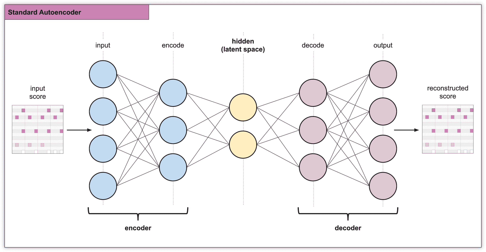

关于网络训练，损失函数被称为**重构损失**，定义为网络在创建与输入不同的输出时受到惩罚。

生成是通过实例化潜在变量来实现的，潜在变量生成嵌入，然后解码该嵌入以产生新的输出。不幸的是，AE 学习到的潜在空间可能不是连续的，这是该架构的一个重大缺点，限制了其在实际应用中的使用。非连续的潜在空间意味着随机采样一个点可能会导致解码器无法理解的向量。这是因为编码器尚未学会如何处理该特定点，无法从其他学习中进行泛化。

在下图中，黑色的点由?标记，位于这样的空间中，意味着编码器无法从中重构输入。这是潜在空间样本（针对三个类别）的可视化示例，轴表示潜在空间的前两个维度，颜色表示三个类别，显示了不同簇的形成：

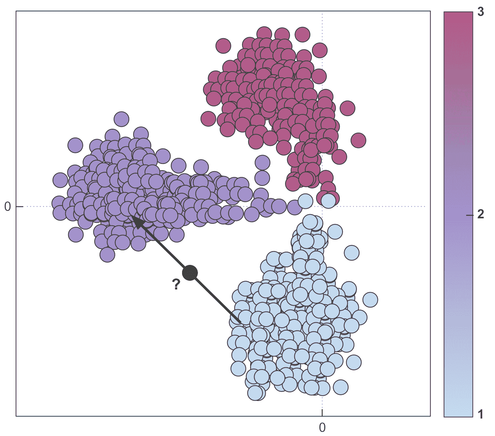

如果你只是复制输入，那这样做没问题，但如果你想从潜在空间中采样或者在两个输入之间进行插值呢？在图示中，你可以看到黑色数据点（用问号表示）落在一个解码器无法理解的区域。这就是自编码器（AEs）中不连续的潜在空间对于我们的应用场景是一个问题的原因。

现在，让我们来看一下变分自编码器（VAE）是如何解决这个问题的。

# 使用 VAE 生成音乐

VAE 有一个特性使其在生成音乐（或任何生成任务）时非常有用，那就是它们的潜在空间是**连续的**。为了实现这一点，编码器并不是输出一个向量，而是输出两个向量：一个表示均值的向量，称为**µ**（mu），以及一个表示标准差的向量，称为**σ**（sigma）。因此，潜在变量，通常按惯例称为**z**，遵循一个概率分布*P(z)*，通常是高斯分布。

换句话说，向量的均值控制输入编码应该位于哪里，标准差控制其周围区域的大小，使得潜在空间变得连续。以之前的例子为例，潜在空间的一个示意图，其中*x*轴和*y*轴表示前两个维度，三个由不同颜色表示的类别，你可以看到这些簇现在覆盖了一个区域，而不是离散的：

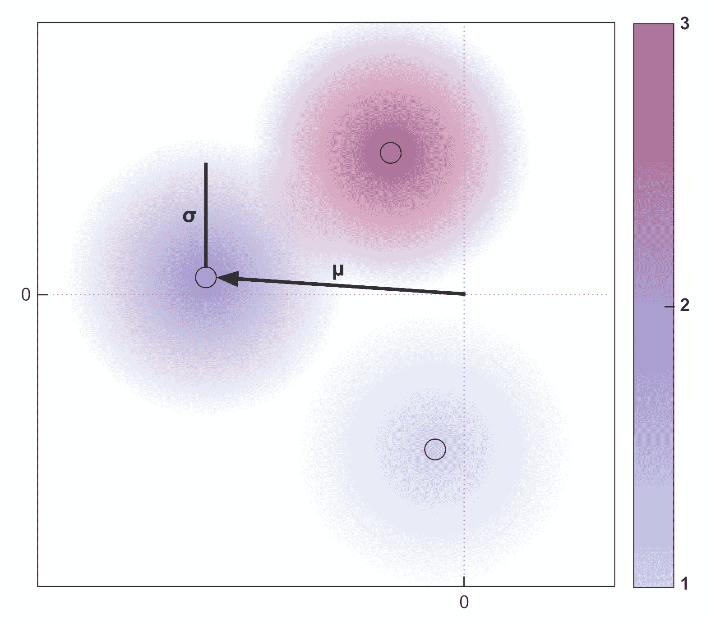

这里是 VAE 网络，你可以看到隐藏层中µ和σ的变化：

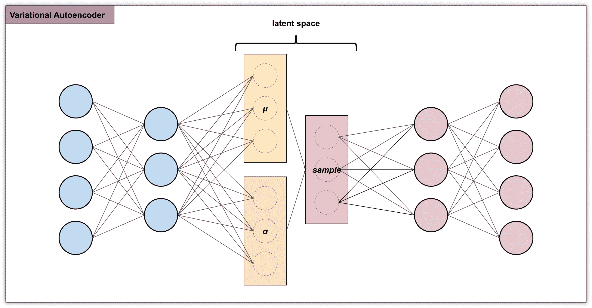

这种网络架构在生成音乐方面非常强大，通常被认为属于一种被称为生成模型的模型类别。此类模型的一个特性是生成过程是随机的，这意味着对于一个给定的输入（以及相同的均值和标准差），每次采样都会使编码略有变化。

这个模型有多个非常适合音乐生成的特性，以下是其中一些：

+   **表达性**：一个音乐序列可以映射到潜在空间，并从中重建。

+   **现实性**：潜在空间中的每一个点都代表一个现实的例子。

+   **平滑性**：来自附近点的样本是相似的。

在本章中，我们将进一步讲解 VAE，但这段简短的介绍对理解我们即将编写的代码非常重要。

# 使用 MusicVAE 和 GrooVAE 的乐谱变换

在前面的章节中，我们学习了如何生成乐谱的各个部分。我们已经生成了打击乐和单声部、复声部旋律，并了解了表现性时值。本节内容在此基础上进行扩展，展示了如何操作和转换生成的乐谱。在我们的示例中，我们将从潜在空间中采样两个小乐谱，接着我们将在这两个样本之间进行插值（逐步从第一个样本过渡到第二个样本），最后我们将为生成的乐谱添加一些律动（或称**人性化**，更多信息请参考下方信息框）。

对于我们的示例，我们将重点研究打击乐，因为在 MusicVAE 中，只有打击乐能添加律动。我们将在 MusicVAE 中使用不同的配置和预训练模型来执行以下步骤。请记住，Magenta 中有比我们在此展示的更多预训练模型（参见第一部分，*技术要求*，了解包含所有模型的 README 链接）：

+   **样本：**通过使用`cat-drums_2bar_small`配置和预训练模型，我们从潜在空间中采样了两个不同的 2 小节乐谱。对于旋律，我们可以通过使用`cat-mel_2bar_big`配置来做同样的操作。

+   **插值：**通过使用相同的配置，我们可以在两个生成的乐谱之间进行插值。插值的意思是它会逐步改变乐谱，从第一个样本过渡到第二个样本。通过请求不同数量的输出，我们可以决定在两个样本之间过渡的渐变程度。

+   **律动：**通过使用`groovae_2bar_humanize`配置，我们可以通过加入律动来使之前的 16 小节序列更具人性化。

下面是一个解释我们示例中不同步骤的图示：

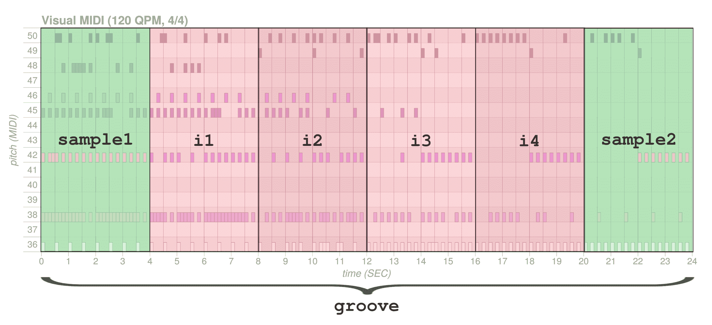

首先，我们将采样`sample1`和`sample2`（每个 2 小节）。然后，我们会请求插值生成 4 个输出序列（“i1”，“i2”，“i3”和“i4”），每个序列为 2 小节。最终生成的 6 个输出序列总共 12 小节，包含了两端的 2 个输入序列，以及中间 6 个序列的乐谱进展。最后，我们将为整个序列添加律动。

如果你记得上一章中的*Performance music with the Performance RNN*部分，我们介绍了什么是**律动**或**人性化**，以及如何生成感觉不那么机械的序列。这归结为两点：表现性时值和动态。前者改变了音符的时值，使其不完全落在节拍边界上，后者则改变了每个音符的力度（即速度），以模拟人类演奏乐器的感觉。

在接下来的内容中，我们将进一步解释这些配置。如果你想尝试旋律的示例而不是打击乐，只需将`cat-drums_2bar_small`替换为`cat-mel_2bar_big`。我们稍后也会在本章中介绍其他模型，包括旋律模型。

# 初始化模型

在进行采样、插值和旋律时，我们需要初始化将要使用的模型。你首先会注意到，MusicVAE 没有像前几章那样的接口；它有自己独特的接口和模型定义。这意味着到目前为止我们写的代码不能复用，除了一些像 MIDI 和图表文件处理的内容。

你可以在本章源代码中的`chapter_04_example_01.py`文件中查看这个示例。源代码中有更多的注释和内容，所以你应该去查看一下。

预训练的 MusicVAE 模型不像前几章那样被打包成捆绑包（`.mag`文件）。现在，模型和配置对应的是一个**检查点**，它的表现形式略逊于捆绑包。我们已经简要地解释了检查点是什么，接下来会在第七章《训练 Magenta 模型》中详细探讨这一点。现在记住，检查点是用于 TensorFlow 中保存训练过程中模型状态的，使得我们能够在之后轻松地重新加载模型的状态：

1.  首先我们来实现一个`download_checkpoint`方法，下载与模型对应的检查点：

```py
import os
import tensorflow as tf
from six.moves import urllib

def download_checkpoint(model_name: str,
                        checkpoint_name: str,
                        target_dir: str):
  tf.gfile.MakeDirs(target_dir)
  checkpoint_target = os.path.join(target_dir, checkpoint_name)
  if not os.path.exists(checkpoint_target):
    response = urllib.request.urlopen(
      f"https://storage.googleapis.com/magentadata/models/"
      f"{model_name}/checkpoints/{checkpoint_name}")
    data = response.read()
    local_file = open(checkpoint_target, 'wb')
    local_file.write(data)
    local_file.close()
```

你不必过于担心这个方法的细节；基本上，它是从在线存储中下载检查点。它类似于我们在前几章中使用的`magenta.music.notebook_utils`中的`download_bundle`方法。

1.  我们现在可以编写一个`get_model`方法，使用检查点实例化 MusicVAE 模型：

```py
from magenta.models.music_vae import TrainedModel, configs

def get_model(name: str):
  checkpoint = name + ".tar"
  download_checkpoint("music_vae", checkpoint, "bundles")
  return TrainedModel(
    # Removes the .lohl in some training checkpoints
    # which shares the same config
    configs.CONFIG_MAP[name.split(".")[0] if "." in name else name]
    # The batch size changes the number of sequences 
    # to be run together
    batch_size=8,
    checkpoint_dir_or_path=os.path.join("bundles", checkpoint))
```

在这个方法中，我们首先使用`download_checkpoint`方法下载给定模型名称的检查点。然后，我们用检查点`batch_size=8`实例化`magenta.models.music_vae`中的`TrainedModel`类。这个值定义了模型同时处理多少个序列。

批处理大小过大会导致浪费开销；批处理大小过小则会导致多次传递，可能会使整个代码运行得更慢。与训练过程中不同，批处理大小不需要太大。在这个示例中，采样使用两个序列，插值使用两个序列，而人性化代码使用六个序列，因此如果我们想挑剔一下，完全可以修改`batch_size`来匹配每个调用。

对于`TrainedModel`的第一个参数，我们传入一个`Config`的实例。每个模型在`models/music_vae/configs.py`文件中都有对应的配置。如果你查看该文件的内容，你可能会认出一些我们已经看到的内容。例如，拿`CONFIG_MAP`中的配置`cat-drums_2bar_small`来举例，这是我们将在采样时使用的配置。

现在，按照 `data_converter` 属性的参考，你将进入一个名为 `DrumsConverter` 的类，位于 `models.music_vae.data` 中。在 `__init__` 方法中，你可以看到我们之前在第二章中讨论过的类和方法，*使用 Drums RNN 生成鼓序列*，这些类和方法也用于 DrumsRNN 模型，例如我们在 *将打击乐事件编码为类* 部分解释的 `MultiDrumOneHotEncoding` 类。

MusicVAE 代码在我们之前看到的内容的基础上构建，添加了一个新的层，使得能够将音符序列转换为 TensorFlow 张量。我们将在*理解 TensorFlow 2.0 代码*部分更详细地探讨 TensorFlow 代码。

# 采样潜空间

现在我们可以下载并初始化我们的 MusicVAE 模型，我们可以进行采样（类似于生成）序列。回想我们在上一节关于 VAE 的内容，我们知道我们可以通过实例化与概率分布相对应的潜变量，并解码嵌入，来采样潜空间中的任何一点。

到目前为止，我们一直在使用**生成**这个术语来表示创建一个新的序列。这个术语指的是我们在第二章中描述的生成算法，*使用 Drums RNN 生成鼓序列*，该算法也在第三章中使用，*生成复音旋律*。

现在我们使用**采样**这个术语来表示创建一个新的序列。这指的是采样的行为（因为我们实际上是在采样一个概率分布）并且与我们之前描述的生成算法不同。

# 编写采样代码

现在，让我们为示例编写第一个方法，`sample` 方法：

1.  首先，让我们定义这个方法，它接受一个模型名称作为输入，并返回一个包含两个生成的 `NoteSequence` 对象的列表：

```py
from typing import List
from magenta.protobuf.music_pb2 import NoteSequence

from utils import save_midi, save_plot

def sample(model_name: str,
           num_steps_per_sample: int) -> List[NoteSequence]:
  model = get_model(model_name)

  # Uses the model to sample 2 sequences
  sample_sequences = model.sample(n=2, length=num_steps_per_sample)

  # Saves the midi and the plot in the sample folder
  save_midi(sample_sequences, "sample", model_name)
  save_plot(sample_sequences, "sample", model_name)

  return sample_sequences
```

在这个方法中，我们首先使用之前的 `get_model` 方法实例化模型。然后我们调用 `sample` 方法，请求返回 `n=2` 个序列。我们保持默认的温度（所有模型的默认值为 1.0），但也可以通过 `temperature` 参数进行更改。最后，我们使用来自前一章的 `save_midi` 和 `save_plot` 方法分别保存 MIDI 文件和绘图文件，这些方法位于 `utils.py` 文件中。

1.  让我们调用我们创建的采样方法：

```py
num_bar_per_sample = 2
num_steps_per_sample = num_bar_per_sample * DEFAULT_STEPS_PER_BAR
generated_sample_sequences = sample("cat-drums_2bar_small.lokl",
                                    num_steps_per_sample)
```

你可能已经注意到，预训练模型 `cat-drums_2bar_small.lokl` 具有 `.lokl` 后缀。还有一个 `.hikl` 模型，表示训练过程中使用的 KL 散度。我们将在下一节*通过 KL 散度细化损失函数*中解释这个内容。

在之前的代码片段中，`num_bar_per_sample`和`num_steps_per_sample`分别定义了每个样本的条数和步骤数。我们使用的配置`cat-drums_2bar_small`是一个小型的 9 类鼓组配置，类似于我们在第二章中看到的配置。对于我们的示例，我们将使用 32 个步骤（2 小节）。

1.  打开`output/sample/music_vae_00_TIMESTAMP.html`文件，将`TIMESTAMP`替换为控制台中打印的值。这里是我们要处理的第一个生成样本：

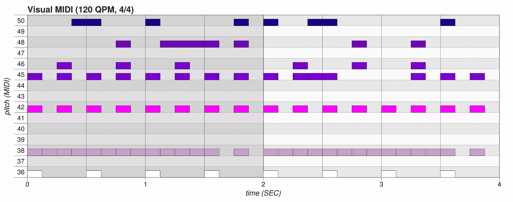

注意，我们在 Visual MIDI 中启用了力度输出，这意味着音符没有填满整个垂直空间，因为 Magenta 中的默认力度是 100（记住 MIDI 值从 0 到 127）。由于我们稍后会添加节奏，因此需要查看音符的力度。

1.  打开`output/sample/music_vae_01_TIMESTAMP.html`文件，将`TIMESTAMP`替换为控制台中打印的值。这里是第二个生成的样本：

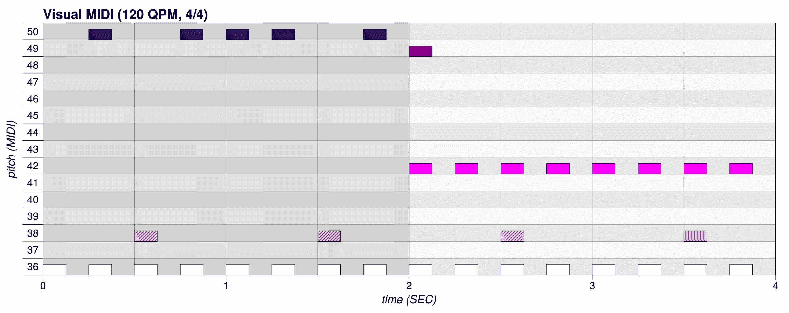

1.  要听生成的 MIDI，请使用您的软件合成器或 MuseScore。对于软件合成器，根据您的平台使用以下命令，并将`PATH_TO_SF2`和`PATH_TO_MIDI`替换为正确的值：

    +   Linux: `fluidsynth -a pulseaudio -g 1 -n -i PATH_TO_SF2 PATH_TO_MIDI`

    +   macOS: `fluidsynth -a coreaudio -g 1 -n -i PATH_TO_SF2 PATH_TO_MIDI`

    +   Windows: `fluidsynth -g 1 -n -i PATH_TO_SF2 PATH_TO_MIDI`

我们现在有两个 2 小节的样本可以使用；接下来我们将在这两个样本之间进行插值。

# 使用 KL 散度优化损失函数

在前面的代码片段中，您可能已经注意到我们使用的`cat-drums_2bar_small.lokl`检查点后缀为`lokl`。这是因为该配置有两个不同的训练检查点：`lokl`和`hikl`。第一个检查点已针对更真实的采样进行了训练，而第二个检查点则是为了更好的重构和插值训练的。我们在之前的代码中使用了第一个检查点进行采样，接下来我们将在下一节使用第二个检查点进行插值。

那么`lokl`和`hikl`到底是什么意思呢？它们分别表示**低**或**高**的**Kulback**-**Leibler**（**KL**）散度。KL 散度用于衡量两个概率分布的差异。通过我们之前的示例，我们可以展示我们希望最小化 KL 散度，以便在插值过程中实现平滑效果：

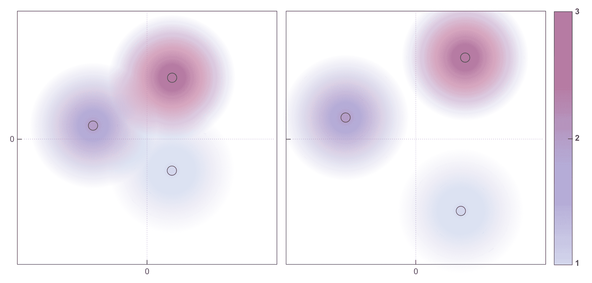

这是一个潜在空间样本的可视化示例（针对 3 个类别），其中轴表示潜在空间的前两个维度，颜色表示 3 个类别。在左侧，我们有相互接近的编码，能够实现平滑的插值。在右侧，我们有更加分散的聚类，这意味着插值会更加困难，但可能会生成更好的样本，因为这些聚类更加明确。

KL 损失函数会将所有 KL 散度与标准正态分布进行求和。单独的 KL 损失会导致围绕先验（接近 0 的圆形斑点）生成一个随机集群，这本身并没有太大用处。通过**结合**重构损失函数和 KL 损失函数，我们能够实现相似编码的聚类，这些聚类密集地围绕潜在空间的原点。

你可以查看 Magenta 代码中`MusicVAE`类的模型损失函数实现，位置在`magenta.models.music_vae`包中的`_compute_model_loss`函数。

在训练过程中，KL 散度会通过超参数`free_bits`和`max_beta`进行调节。通过增加 KL 损失的效果（即减小`free_bits`或增大`max_beta`），你将得到一个能够生成更好随机样本但在重构方面表现较差的模型。

# 从潜在空间的相同区域进行采样

采样的一个有趣之处是，我们可以在同一个批次中重用相同的`z`变量来生成每个序列。这对于从潜在空间的相同区域生成序列非常有用。例如，要使用相同的`z`变量生成 2 个 64 步（4 小节）的序列，我们将使用以下代码：

```py
sample_sequences = model.sample(n=2, length=64, same_z=True)
```

# 从命令行进行采样

你还可以通过命令行调用模型采样。本节中的示例可以通过以下命令行来调用：

```py
> curl --output "checkpoints/cat-drums_2bar_small.lokl.tar" "https://storage.googleapis.com/magentadata/models/music_vae/checkpoints/cat-drums_2bar_small.lokl.tar"
> music_vae_generate --config="cat-drums_2bar_small" --checkpoint_file="checkpoints/cat-drums_2bar_small.lokl.tar" --mode="sample" --num_outputs="2" --output_dir="output/sample"
```

# 在两个样本之间插值

我们现在有了 2 个生成的样本，并且想要在它们之间插值，插入 4 个中间序列，最终生成一个连续的 6 个 2 小节的序列，总共是 12 小节的序列。

# 获取正确的序列长度

在我们的示例中，我们在调用模型的`sample`方法时使用了`length=32`，因此该方法的返回值是每个 2 小节的序列。你应该知道，序列长度在 MusicVAE 中很重要，因为每个模型处理的序列长度不同——`cat-drums_2bar_small`处理的是 2 小节的序列，而`hierdec-mel_16bar`处理的是 16 小节的序列。

在采样时，Magenta 不会报错，因为它可以生成一个更长的序列，然后将其截断。但是在插值过程中，你会遇到像这样的异常，意味着你没有请求正确数量的步数：

```py
Traceback (most recent call last):
...
  File "/home/Packt/miniconda3/envs/magenta/lib/python3.5/site-packages/magenta/models/music_vae/trained_model.py", line 224, in encode
    (len(extracted_tensors.inputs), note_sequence))
magenta.models.music_vae.trained_model.MultipleExtractedExamplesError: Multiple (2) examples extracted from NoteSequence: ticks_per_quarter: 220
```

在 MusicVAE 中，异常信息特别难懂，而且编码器非常挑剔，所以我们会尽量列出常见的错误及其相关的异常。

# 编写插值代码

现在我们来为示例编写第二种方法，即`interpolate`方法：

1.  首先，定义该方法，它接收两个`NoteSequence`对象的列表作为输入，并返回一个 16 小节的插值序列：

```py
import magenta.music as mm

def interpolate(model_name: str,
                sample_sequences: List[NoteSequence],
                num_steps_per_sample: int,
                num_output: int,
                total_bars: int) -> NoteSequence:
  model = get_model(model_name)

  # Use the model to interpolate between the 2 input sequences
  interpolate_sequences = model.interpolate(
      start_sequence=sample_sequences[0],
      end_sequence=sample_sequences[1],
      num_steps=num_output,
      length=num_steps_per_sample)

  save_midi(interpolate_sequences, "interpolate", model_name)
  save_plot(interpolate_sequences, "interpolate", model_name)

  # Concatenates the resulting sequences into one single sequence
  interpolate_sequence = mm.sequences_lib.concatenate_sequences(
      interpolate_sequences, [4] * num_output)

  save_midi(interpolate_sequence, "merge", model_name)
  save_plot(interpolate_sequence, "merge", model_name,               
            plot_max_length_bar=total_bars,
            bar_fill_alphas=[0.50, 0.50, 0.05, 0.05])

  return interpolate_sequence
```

我们首先实例化模型，然后使用`start_sequence`和`end_sequence`参数分别调用`interpolate`方法，第一个和最后一个样本的输出序列数量为 6，使用`num_steps`参数（小心，它与步骤中的序列长度无关），并且`length`参数设置为 2 小节（以步骤为单位）。插值结果是一个包含六个`NoteSequence`对象的列表，每个对象包含 2 小节。

然后，我们使用`magenta.music.sequence_lib`中的`concatenate_sequences`将列表中的元素连接成一个 12 小节的单一`NoteSequence`对象。第二个参数（`[4] * num_output`）是一个包含每个元素时间（以秒为单位）的列表。我们应该记住，这是必要的，因为`NoteSequence`没有定义开始和结束，所以一个以静音结束的 2 小节序列与另一个 2 小节序列连接后，不会得到一个 4 小节的序列。

调用`interpolate`方法时，如果输入序列没有量化，或者输入序列为空，例如，可能会出现`NoExtractedExamplesError`异常。记住，你还必须请求正确的长度，否则会收到`MultipleExtractedExamplesError`。

1.  然后我们可以调用`interpolate`方法：

```py
num_output = 6
total_bars = num_output * num_bar_per_sample
generated_interpolate_sequence = \
interpolate("cat-drums_2bar_small.hikl",
             generated_sample_sequences,
             num_steps_per_sample,
             num_output,
             total_bars)
```

1.  让我们打开`output/merge/music_vae_00_TIMESTAMP.html`文件，将`TIMESTAMP`替换为控制台中打印的值。对应我们的样本，我们得到了这个插值序列：

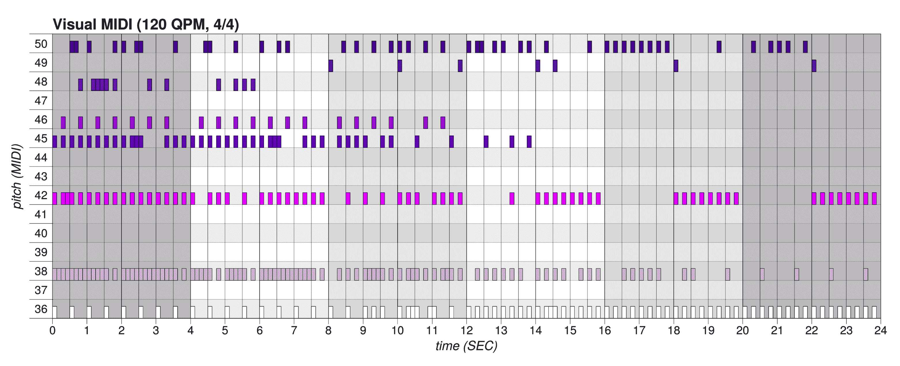

我们为每两个小节标记了不同的背景透明度。你可以在前一节中找到我们生成的第一个样本，它位于 0 到 4 秒之间，背景较暗。然后，4 个新的插值块可以位于 4 到 20 秒之间。最后，你可以看到第二个输入样本，它位于 20 到 24 秒之间。

1.  要听生成的 MIDI，请使用你的软件合成器或 MuseScore。对于软件合成器，根据你的平台，使用以下命令并将`PATH_TO_SF2`和`PATH_TO_MIDI`替换为正确的值：

    +   Linux: `fluidsynth -a pulseaudio -g 1 -n -i PATH_TO_SF2 PATH_TO_MIDI`

    +   macOS: `fluidsynth -a coreaudio -g 1 -n -i PATH_TO_SF2 PATH_TO_MIDI`

    +   Windows: `fluidsynth -g 1 -n -i PATH_TO_SF2 PATH_TO_MIDI`

在两个序列之间进行插值是一个困难的问题，但 MusicVAE 做得很好，我们的示例结果相当令人印象深刻。你应该尝试其他长度的生成，并听一听它们。

# 从命令行进行插值

你也可以从命令行调用插值操作。本节中的示例可以使用以下命令行调用（你需要自己下载检查点）：

```py
> curl --output "checkpoints/cat-drums_2bar_small.hikl.tar" "https://storage.googleapis.com/magentadata/models/music_vae/checkpoints/cat-drums_2bar_small.hikl.tar" > music_vae_generate --config="cat-drums_2bar_small" --checkpoint_file="checkpoints/cat-drums_2bar_small.hikl.tar" --mode="interpolate" --num_outputs="6" --output_dir="output/interpolate" --input_midi_1="output/sample/SAMPLE_1.mid" --input_midi_2="output/sample/SAMPLE_2.mid"
```

通过更改 `SAMPLE_1.mid` 和 `SAMPLE_2.mid` 文件名为之前采样部分中的文件，你将能够在两个序列之间进行插值。

# 人性化序列

最后，我们将为生成的序列添加人性化（或**groove**）。groove 模型是 GrooVAE（发音为 *groovay*）的一部分，并且已经包含在 MusicVAE 的代码中。

# 编写人性化代码

现在让我们编写我们示例中的最后一个方法，`groove` 方法：

1.  首先，让我们定义这个方法，它接受 `NoteSequence` 作为输入并返回一个人性化的序列：

```py
def groove(model_name: str,
           interpolate_sequence: NoteSequence,
           num_steps_per_sample: int,
           num_output: int,
           total_bars: int) -> NoteSequence:
  model = get_model(model_name)

  # Split the sequences in chunks of 4 seconds
  split_interpolate_sequences = mm.sequences_lib.split_note_sequence(
      interpolate_sequence, 4)

  # Uses the model to encode the list of sequences
  encoding, mu, sigma = model.encode(
      note_sequences=split_interpolate_sequences)

  # Uses the model to decode the encoding
  groove_sequences = model.decode(
      z=encoding, length=num_steps_per_sample)

  groove_sequence = mm.sequences_lib.concatenate_sequences(
      groove_sequences, [4] * num_output)

  save_midi(groove_sequence, "groove", model_name)
  save_plot(groove_sequence, "groove", model_name,
            plot_max_length_bar=total_bars, show_velocity=True,
            bar_fill_alphas=[0.50, 0.50, 0.05, 0.05])

  return groove_sequence
```

首先，我们下载模型。然后，我们将序列分割成 4 秒的块，因为模型需要 2 小节的块才能处理。接着，我们调用 `encode` 函数，再调用 `decode` 函数。不幸的是，模型中目前还没有 `groove` 方法。

`encode` 方法接受一个序列列表，它将对这些序列进行编码，返回 `encoding` 向量（也叫做 z 向量或潜在向量）、`mu` 和 `sigma`。我们在这里不会使用 `mu` 和 `sigma`，但为了清晰起见，我们保留了它们。编码数组的最终形状是 *(6, 256)*，其中 6 是分割序列的数量，256 是在模型中定义的编码大小，在稍后的部分“构建隐藏层”中会详细解释。

对于 `interpolate` 方法，如果序列没有正确构建，调用 `encode` 方法可能会抛出异常。

然后，`decode` 方法接受前一个 `encoding` 值和每个样本的步数，并尝试重现输入，结果是一个包含 6 个 2 小节的人性化序列的列表。

最后，我们像插值代码片段一样连接这些序列。

1.  让我们试着调用 `groove` 方法：

```py
generated_groove_sequence = groove("groovae_2bar_humanize",
                                   generated_interpolate_sequence,
                                   num_steps_per_sample,
                                   num_output,
                                   total_bars)
```

返回的序列，`generated_groove_sequence`，是我们这个示例的最终序列。

1.  让我们打开 `output/groove/music_vae_00_TIMESTAMP.html` 文件，将 `TIMESTAMP` 替换为控制台中打印的值。对应我们的插值序列，我们有这个人性化的序列：

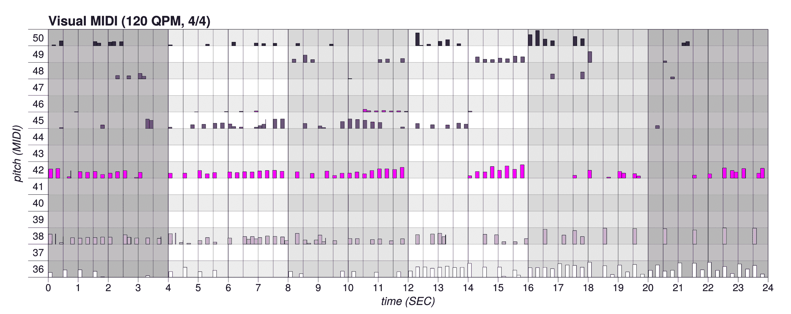

让我们看看生成的图表文件。首先，音符的音量现在是动态的，例如，音符在标记节拍的开始或结束时会更响亮，就像一个真实的鼓手一样。你可以在 20 到 24 秒之间的低音鼓上看到一个例子。然后，注意到音符是以富有表现力的节奏播放的，这意味着音符并不完全落在节奏的开始和结束上。最后，一些音符不再播放，而其他一些音符被添加到生成的乐谱中。

1.  要聆听生成的 MIDI，请使用你的软件合成器，但**不要使用 MuseScore**，因为它在处理富有表现力的节奏时会遇到困难，可能会听到与实际乐谱不同的音符。对于软件合成器，请根据你的平台使用以下命令，并替换 `PATH_TO_SF2` 和 `PATH_TO_MIDI` 为正确的路径：

    +   Linux: `fluidsynth -a pulseaudio -g 1 -n -i PATH_TO_SF2 PATH_TO_MIDI`

    +   macOS: `fluidsynth -a coreaudio -g 1 -n -i PATH_TO_SF2 PATH_TO_MIDI`

    +   Windows: `fluidsynth -g 1 -n -i PATH_TO_SF2 PATH_TO_MIDI`

若要了解更多关于 groove 和人性化的信息，可以参考最后一节，*Further reading*，它在 GrooVAE 博客文章和 GrooVAE 论文中有详细解释。

# 从命令行进行人性化处理

不幸的是，目前无法从命令行调用人性化方法。我们将在第九章《让 Magenta 与音乐应用互动》中看到其他的序列人性化方法，*Making Magenta Interact with Music Applications*。

# 对旋律进行更多插值

在之前的章节中，我们对鼓乐序列进行了采样和插值。通过稍微修改代码，我们也可以对旋律进行同样的操作。不幸的是，由于 GrooVAE 模型是基于打击乐数据训练的，你无法对旋律进行人性化处理：

你可以在本章源代码中的`chapter_04_example_02.py`文件中找到这个例子。源代码中有更多注释和内容，建议你去查看。

1.  为了实现这个，我们修改了调用代码，保持`sample`和`interpolate`方法不变。我们将生成一个稍长的序列，进行 10 次插值，而不是 6 次。以下是代码（警告：检查点的大小为 1.6GB）：

```py
num_output = 10
num_steps_per_sample = num_bar_per_sample * DEFAULT_STEPS_PER_BAR
total_bars = num_output * num_bar_per_sample

generated_sample_sequences = sample("cat-mel_2bar_big",
                                    num_steps_per_sample)
interpolate("cat-mel_2bar_big",
            generated_sample_sequences,
            num_steps_per_sample,
            num_output,
            total_bars)
```

你会注意到，我们在采样和插值时都使用了`cat-mel_2bar_big`配置。

1.  我们通过替换`TIMESTAMP`为适当的值，打开生成的`output/merge/cat-mel_2bar_big_00_TIMESTAMP.html`文件。生成的输出如下所示：

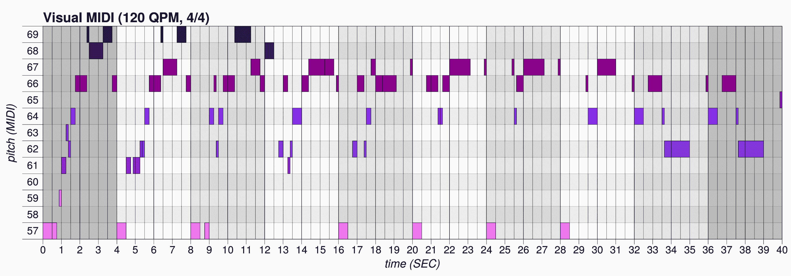

1.  要收听生成的 MIDI，可以使用你的软件合成器或 MuseScore。对于软件合成器，请根据你的平台使用以下命令，并将`PATH_TO_SF2`和`PATH_TO_MIDI`替换为正确的路径：

    +   Linux: `fluidsynth -a pulseaudio -g 1 -n -i PATH_TO_SF2 PATH_TO_MIDI`

    +   macOS: `fluidsynth -a coreaudio -g 1 -n -i PATH_TO_SF2 PATH_TO_MIDI`

    +   Windows: `fluidsynth -g 1 -n -i PATH_TO_SF2 PATH_TO_MIDI`

# 采样整个乐队

在前面的章节中，我们已经对鼓乐和旋律进行过采样和插值。现在，我们将同时采样一组三重奏（打击乐、旋律和低音），并使用一个较大的模型。这也许是最令人印象深刻的模型之一，因为它可以一次生成较长的 16 小节序列，并使用多种互相协调的乐器：

你可以在本章源代码中的`chapter_04_example_03.py`文件中找到这个例子。源代码中有更多注释和内容，建议你去查看。

1.  在这个例子中，我们使用`sample`方法，并将`hierdec-trio_16bar`预训练模型名称作为参数传入（警告：检查点的大小为 2.6GB）：

```py
sample("hierdec-trio_16bar", num_steps_per_sample)
```

1.  打开生成的 `output/sample/hierdec-trio_16bar_00_TIMESTAMP.html` 文件，将 `TIMESTAMP` 替换为正确的值。生成的输出如下所示：

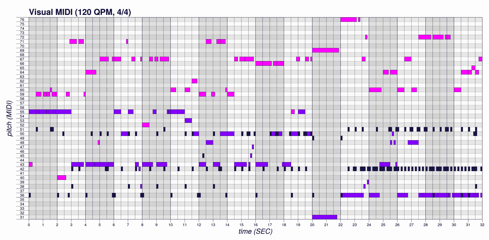

在 Visual MIDI 中使用 `coloring=Coloring.INSTRUMENT` 参数，我们可以为每个乐器设置不同的颜色。由于低音线与鼓线在相同的音高上，因此难以阅读，但你可以在图表中看到这三种乐器。

1.  要收听生成的 MIDI，请使用你的软件合成器或 MuseScore。对于软件合成器，根据你的平台使用以下命令，并将 `PATH_TO_SF2` 和 `PATH_TO_MIDI` 替换为正确的值：

    +   Linux: `fluidsynth -a pulseaudio -g 1 -n -i PATH_TO_SF2 PATH_TO_MIDI`

    +   macOS: `fluidsynth -a coreaudio -g 1 -n -i PATH_TO_SF2 PATH_TO_MIDI`

    +   Windows: `fluidsynth -g 1 -n -i PATH_TO_SF2 PATH_TO_MIDI`

你可以听到生成的 MIDI 包含三种乐器，并且你的合成器应该为每个轨道分配不同的乐器音色（通常是钢琴、低音和鼓）。这是 Magenta 中唯一能够同时生成多个乐器的预训练模型，查看第一部分，*技术要求*，获取 README 的链接，里面列出了所有可用的预训练模型。

该模型的有趣之处在于，16 小节序列的长期结构通过一种特殊类型的解码器 `HierarchicalLstmDecoder` 得以保持。该架构在潜在编码和解码器之间增加了一个额外层，称为 **指挥器**，它是一个 RNN，每个小节的输出会产生一个新的嵌入。解码器层然后继续解码每个小节。

要了解更多关于层次化编码器和解码器架构的信息，可以参考最后一部分，*进一步阅读*，获取关于该主题的更多信息，这在 MusicVAE 博客文章和 MusicVAE 论文中有详细说明。

# 其他预训练模型的概述

我们已经看到许多在 MusicVAE 中预训练的模型，还有一些有趣的模型，但在这里无法深入探讨。请记住，你可以在 README 中找到它们的完整列表，查看第一部分，*技术要求*，获取链接。

这是我们发现一些有趣的模型概述：

+   `nade-drums_2bar_full` 模型是一个类似于我们示例的鼓类预训练模型，但使用了来自 General MIDI 的 61 类，而不是 9 类。不过该模型较大。你可以在 `magenta.models.music_vae` 模块中的 `data.py` 文件中查看编码的类及其对应的内容。

+   `groovae_2bar_tap_fixed_velocity`预训练模型可以将“tap”模式转换为完整的鼓节奏，同时保持相同的 groove。 “tap”序列是从另一个节奏中获取的序列，甚至是通过用手指敲击桌子获取的序列。换句话说，它是一个带有 groove 的单音序列，可以转换为鼓模式。使用它的方法是从真实乐器中录制低音部，然后“tap”节奏（或从音频中转换），然后将其馈送到网络中，以采样与低音部相符的鼓模式。

+   `groovae_2bar_add_closed_hh`预训练模型在现有的 groove 上添加或替换闭合的 hi-hat。

# 理解 TensorFlow 代码。

在本节中，我们将快速查看 TensorFlow 代码，以更深入地了解采样、插值和人性化代码的工作原理。这也将参考本章节的第一部分，“VAE 中的连续潜在空间”，以便我们能够理解理论和我们已经进行的实际操作。

但首先，让我们先看一下模型初始化代码的概述。在本节中，我们将以`cat-drums_2bar_small`配置为例，并使用本章节已经介绍过的相同模型初始化代码，即`batch_size`为 8。

# 构建 VAE 图。

我们将从`models.music_vae.trained_model`模块中的`TrainedModel`构造函数开始。通过从我们已经在前一节“初始化模型”中介绍过的配置映射中获取`z_size`、`enc_rnn_size`和`dec_rnn_size`的配置值，我们可以找到关于编码器的 RNN、隐藏层和解码器的 RNN 的相关信息。

注意编码器是`BidirectionalLstmEncoder`，解码器是`CategoricalLstmDecoder`，都来自`magenta.models.music_vae.lstm_models`模块。

# 使用 BidirectionalLstmEncoder 构建编码器。

让我们首先看看编码器的 RNN，在`magenta.models.music_vae.lstm_models`模块的`BidirectionalLstmEncoder`类中初始化，在`build`方法中，编码层的初始化如下：

```py
lstm_utils.rnn_cell(
    [layer_size],
    hparams.dropout_keep_prob,
    hparams.residual_encoder,
    is_training)
```

在`magenta.models.music_vae.lstm_utils`模块中的`rnn_cell`方法中，可以看到层是`LSTMBlockCell`（来自`tensorflow.contrib.rnn`模块），具有 512 个单元和一个 dropout 包装器：

```py
cell = rnn.LSTMBlockCell(rnn_cell_size[i])
cell = rnn.DropoutWrapper(cell, input_keep_prob=dropout_keep_prob)
```

在`magenta.models.music_vae.data`模块中的`DrumsConverter`类（在`configs.py`文件中实例化）中，可以看到我们使用了相同的`MutltiDrumOneHotEncoding`类，这个类我们在第二章中已经解释过：

```py
self._oh_encoder_decoder = mm.MultiDrumOneHotEncoding(
    drum_type_pitches=[(i,) for i in range(num_classes)])
```

旋律配置将使用`OneHotMelodyConverter`类。

# 构建一个使用 CategoricalLstmDecoder 的解码器。

然后，让我们看看解码器的 RNN 初始化，在`magenta.models.music_vae.lstm_models`模块的`BaseLstmDecoder`类中，在`build`方法中，解码层的初始化如下：

```py
self._output_layer = layers_core.Dense(
    output_depth, name='output_projection')
self._dec_cell = lstm_utils.rnn_cell(
    hparams.dec_rnn_size, hparams.dropout_keep_prob,
    hparams.residual_decoder, is_training)
```

在这里，`output_depth`将是 512。输出层被初始化为一个密集层，后面接着两层 256 单元的`LSTMBlockCell`。

你还可以在执行过程中通过控制台查看当前配置的编码器和解码器信息：

```py
INFO:tensorflow:Building MusicVAE model with BidirectionalLstmEncoder, CategoricalLstmDecoder:
INFO:tensorflow:Encoder Cells (bidirectional): units: [512]
INFO:tensorflow:Decoder Cells: units: [256, 256]
```

# 构建隐藏层

最后，隐藏层的初始化位于`magenta.models.music_vae.base_model`模块中的`MusicVAE`类的`encode`方法中：

```py
mu = tf.layers.dense(
    encoder_output,
    z_size,
    name='encoder/mu',
    kernel_initializer=tf.random_normal_initializer(stddev=0.001))
sigma = tf.layers.dense(
    encoder_output,
    z_size,
    activation=tf.nn.softplus,
    name='encoder/sigma',
    kernel_initializer=tf.random_normal_initializer(stddev=0.001))

return ds.MultivariateNormalDiag(loc=mu, scale_diag=sigma)
```

`mu`和`sigma`层与之前的`encoder_output`值密集连接，形状为*(8, 256)*，其中 8 对应于`batch_size`，256 对应于`z_size`。该方法返回`MultivariateNormalDiag`，这是一个以`mu`和`sigma`为参数的正态分布：

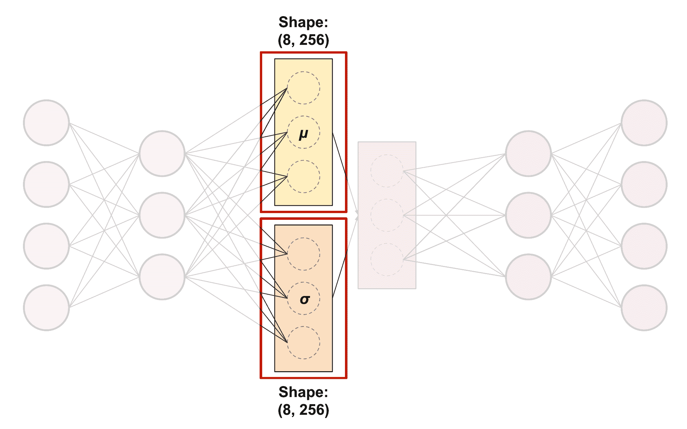

# 查看`sample`方法

现在让我们看一下位于`models.music_vae.trained_model`模块的`TrainedModel`类中的`sample`方法。该方法的核心如下：

```py
for _ in range(int(np.ceil(n / batch_size))):
  if self._z_input is not None and not same_z:
    feed_dict[self._z_input] = (
        np.random.randn(batch_size, z_size).astype(np.float32))
  outputs.append(self._sess.run(self._outputs, feed_dict))
samples = np.vstack(outputs)[:n]
```

该方法会将所需样本的数量`n`拆分为最大`batch_size`的小批量，然后使用`randn`从标准正态分布中采样大小为*(8, 256)*的`z_input`，最后使用这些值运行模型。记住，`z`是嵌入，因此我们在这里做的基本上是实例化潜在变量，然后对其进行解码。

回想我们在上一节看到的内容——*从潜在空间的相同区域进行采样*，我们知道如果我们复用相同的`z`变量，`z`可能只会被采样一次。

然后，通过调用样本的单热解码，将样本转换回序列：

```py
self._config.data_converter.to_items(samples)
```

# 查看`interpolate`方法

`TrainedModel`类中的`interpolate`方法非常简短：

```py
_, mu, _ = self.encode([start_sequence, end_sequence], assert_same_length)
z = np.array([_slerp(mu[0], mu[1], t)
              for t in np.linspace(0, 1, num_steps)])
return self.decode(
    length=length,
    z=z,
    temperature=temperature)
```

我们在这里做的是对开始和结束序列进行编码，并从编码中仅返回`mu`值，利用它实例化`z`，然后对`z`进行解码，得到插值序列的结果列表。

那么，那个实例化`z`的`_slerp`方法是什么呢？“slerp”代表“球形线性插值”，它计算第一个序列和第二个序列之间的方向，从而使插值能够在潜在空间中沿正确的方向移动。

我们不需要过于担心` slerp`方法的实现细节；我们只需记住“标准自编码器中的潜在空间”这一部分的图示，该图示展示了在潜在空间中朝某个特定方向移动将导致从一个序列到另一个序列的过渡。通过沿着该方向定期解码，我们最终得到一个逐步从一个序列过渡到另一个序列的结果。

# 查看`groove`方法

最后，让我们来看看我们的`groove`方法。提醒一下，`groove`方法在 Magenta 中没有，因此我们不得不自己编写它：

```py
encoding, _, _ = model.encode(split_interpolate_sequences)
groove_sequences = model.decode(encoding, num_steps_per_sample)
```

除了变量命名之外，这段代码与`interpolate`方法几乎相同，但它不是使用µ值来实例化潜在变量以朝某个方向移动，而是直接对序列进行编码，然后通过模型进行解码。

# 总结

在这一章中，我们研究了如何使用变分自编码器以及 MusicVAE 和 GrooVAE 模型来采样、插值和人性化音乐乐谱。

我们首先解释了在 AE 中什么是潜在空间，以及如何在编码器和解码器对中使用降维方法来强制网络在训练阶段学习重要特征。我们还了解了 VAE 及其连续的潜在空间，使得我们可以从空间中的任何一点进行采样，并且能够在两个点之间平滑地插值，这两者在音乐生成中都非常有用。

然后，我们编写了代码来采样并转换一个序列。我们学习了如何从一个预训练的检查点初始化模型，采样潜在空间，在两个序列之间进行插值，并且使序列更具人性化。在这个过程中，我们了解了 VAE 的一些重要信息，比如损失函数的定义和 KL 散度。

最后，我们查看了 TensorFlow 代码，以理解 VAE 图的构建过程。我们展示了编码器、解码器和隐藏层的构建代码，并解释了各层的配置和形状。我们还详细讲解了采样、插值和 Groove 方法的实现。

本章标志着关于生成符号数据的模型内容的结束。在前几章中，我们深入探讨了生成和处理 MIDI 的最重要的模型。下一章，*使用 NSynth 和 GANSynth 生成音频*，将讨论生成亚符号内容，如音频。

# 问题

1.  AE 中编码器和解码器对的主要用途是什么？这种设计的主要缺点是什么？

1.  AE 中损失函数是如何定义的？

1.  VAE 相比 AE 的主要改进是什么？这一改进是如何实现的？

1.  KL 散度是什么，它对损失函数有什么影响？

1.  如何使用批量大小为 4 且`z`大小为 512 的代码来采样`z`？

1.  **slerp**方法在插值过程中有什么作用？

# 进一步阅读

+   **MusicVAE: 使用机器学习为音乐乐谱创造调色板**：Magenta 团队博客文章介绍了 MusicVAE，更详细地解释了我们在本章中看到的内容（[magenta.tensorflow.org/music-vae](https://magenta.tensorflow.org/music-vae)）

+   **一种层次化潜在向量模型用于学习音乐中的长期结构**：Magenta 团队关于 MusicVAE 的论文，非常易于理解且有趣的阅读（[arxiv.org/abs/1803.05428](https://arxiv.org/abs/1803.05428)）

+   **GrooVAE: 生成与控制表现力十足的鼓乐演奏**：Magenta 团队博客文章介绍了 GrooveVAE，更详细地解释了我们在本章中看到的内容（[magenta.tensorflow.org/groovae](https://magenta.tensorflow.org/groovae)）

+   **通过逆序列转换学习节奏**：Magenta 团队关于 GrooVAE 的论文，非常易懂且有趣 ([arxiv.org/abs/1905.06118](https://arxiv.org/abs/1905.06118))

+   **Groove MIDI 数据集**：用于 GrooVAE 训练的数据集，包含 13.6 小时的对齐 MIDI 和合成音频 ([magenta.tensorflow.org/datasets/groove](https://magenta.tensorflow.org/datasets/groove))

+   **使用人工智能增强人类智能**：一本关于通过潜在空间类型模型启用的 AI 接口的有趣读物 ([distill.pub/2017/aia/](https://distill.pub/2017/aia/))

+   **直观理解变分自编码器**：对 VAE 的直观介绍，非常清晰 ([www.topbots.com/intuitively-understanding-variational-autoencoders/](https://www.topbots.com/intuitively-understanding-variational-autoencoders/))

+   **教程 - 什么是变分自编码器？**：关于 VAE 的更深入概述 ([jaan.io/what-is-variational-autoencoder-vae-tutorial](https://jaan.io/what-is-variational-autoencoder-vae-tutorial))

+   **自编码器 — TensorFlow 2.0 中的指南和代码**：关于 AE 和 VAE 在 TensorFlow 2.0 中的实战代码 ([medium.com/red-buffer/autoencoders-guide-and-code-in-tensorflow-2-0-a4101571ce56](https://medium.com/red-buffer/autoencoders-guide-and-code-in-tensorflow-2-0-a4101571ce56))

+   **Kullback-Leibler 散度解释**：从统计学角度解释 KL 散度 ([www.countbayesie.com/blog/2017/5/9/kullback-leibler-divergence-explained](https://www.countbayesie.com/blog/2017/5/9/kullback-leibler-divergence-explained))

+   **变分自编码器简介**：关于 VAE 的良好且完整的论文 ([arxiv.org/pdf/1906.02691.pdf](https://arxiv.org/pdf/1906.02691.pdf))
