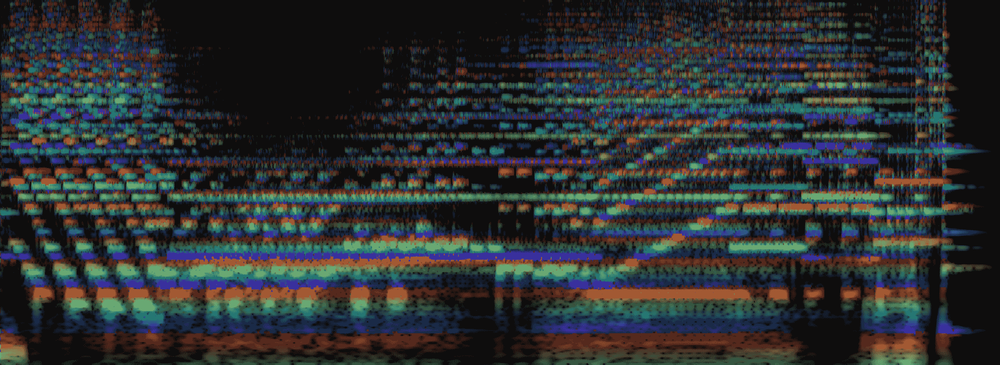

# 第七章：使用 NSynth 和 GANSynth 进行音频生成

在本章中，我们将探讨音频生成。我们将首先概述 WaveNet，这是一种现有的音频生成模型，尤其在语音合成应用中效率较高。在 Magenta 中，我们将使用 NSynth，这是一个 WaveNet 自编码器模型，用于生成可以作为伴奏 MIDI 乐谱的音频片段。NSynth 还支持音频变换，如缩放、时间拉伸和插值。我们还将使用 GANSynth，这是基于**生成对抗网络**（**GAN**）的更快速方法。

本章将涵盖以下主题：

+   了解 WaveNet 和音乐的时间结构

+   使用 NSynth 进行神经音频合成

+   使用 GANSynth 作为生成乐器

# 技术要求

在本章中，我们将使用以下工具：

+   使用**命令行**或**Bash**从终端启动 Magenta

+   使用**Python**及其库编写音乐生成代码，利用 Magenta

+   使用**Magenta**生成音频片段

+   使用**Audacity**编辑音频片段

+   使用任何媒体播放器播放生成的 WAV 文件

在 Magenta 中，我们将使用**NSynth**和**GANSynth**模型。我们会深入解释这些模型，但如果你觉得需要更多信息，可以查看 Magenta 源代码中的模型 README 文件（[github.com/tensorflow/magenta/tree/master/magenta/models](https://github.com/tensorflow/magenta/tree/master/magenta/models)），这是一个很好的起点。你还可以查看 Magenta 的代码，该代码文档完善。此外，我们还在*进一步阅读*部分提供了额外的内容。

本章的代码位于本书的 GitHub 仓库中的`Chapter05`文件夹，地址为[github.com/PacktPublishing/hands-on-music-generation-with-magenta/tree/master/Chapter05](https://github.com/PacktPublishing/hands-on-music-generation-with-magenta/tree/master/Chapter05)。示例和代码片段假设你已经位于本章的文件夹中。为了开始本章的内容，请先执行`cd Chapter05`。

请观看以下视频，查看代码示范：

[`bit.ly/37QgQsI`](http://bit.ly/37QgQsI)

# 了解 WaveNet 和音乐的时间结构

在前几章中，我们一直在生成符号内容，如 MIDI。在本章中，我们将探讨生成非符号内容，如**原始音频**。我们将使用波形音频文件格式（WAVE 或 WAV，存储在`.wav`文件中），这是一种包含未压缩音频内容的格式，可以在几乎所有平台和设备上使用。有关波形的更多信息，请参见第一章，*Magenta 与生成艺术简介*。

使用神经网络生成原始音频是近年来的一个成就，源于 2016 年发布的 WaveNet 论文，*A Generative Model For Raw Audio*。其他网络架构在音频生成中也表现良好，比如 SampleRNN，2016 年同样发布并被用于制作音乐曲目和专辑（见 databots 的示例）。

正如第二章中所述，*使用 DrumsRNN 生成鼓声序列*，卷积架构在音乐生成中相对罕见，因为它们在处理序列数据时存在不足。WaveNet 使用了一堆因果卷积层来解决这些问题，这在某种程度上类似于递归层。

建模原始音频是困难的——你需要处理每秒 16,000 个样本（至少），并在更大的时间尺度上跟踪整体结构。WaveNet 的实现经过优化，能够处理这些数据，通过使用膨胀卷积，卷积滤波器通过跳过输入值一定的步长应用于一个较大的区域，从而使网络能够在整个网络中通过仅使用少数几层来保持输入分辨率。在训练过程中，预测可以并行进行，而在生成过程中，预测必须按顺序进行，或者**逐个样本**地生成。

WaveNet 架构在语音合成应用中表现优异，并且最近在音乐生成中也取得了很好的效果，但其计算开销非常大。Magenta 的 NSynth 模型是一个**WaveNet 自回归模型**，这种方法用于保持一致的长期结构。让我们来看看 NSynth 及其在生成音乐中的重要性。

# 查看 NSynth 和 WaveNet 自编码器

NSynth 模型可以看作是一个神经合成器——与其拥有一个可以定义包络线并指定振荡器波形、音高和力度的合成器，不如拥有一个生成新的、真实的乐器声音的模型。NSynth 是**以乐器为导向**的，或者说是以音符为导向的，这意味着它可以用来生成某个生成乐器的单个音符。

NSynth 是一个 WaveNet 风格的自编码器，它学习输入数据的时间嵌入。要理解 WaveNet 自编码器（AE）网络，可以参考第四章中解释的概念，*使用 MusicVAE 进行潜在空间插值*，因为这两个网络都是自编码器。在这里，你会看到我们之前展示的许多概念，比如编码、潜在空间和插值。

这里是 WaveNet AE 网络的简化视图：


首先，编码器看到整个输入，即整个单声道波形（`.wav`格式），经过 30 层计算后，通过平均池化计算出一个时域嵌入（图中的*`z`*），该嵌入具有 16 个维度，每 512 个样本计算一次，这是 32 倍的维度压缩。例如，一个包含 16,000 个样本（1 秒的音频，采样率为 16,000）的音频输入，经过编码后，其潜在向量的维度为 16，时间维度为 16,000/512（参见下一节*编码 WAV 文件*，其中有示例）。然后，WaveNet 解码器将使用 1x1 卷积将嵌入上采样至其原始时间分辨率，尽可能精确地重现输入的声音。

你可以在`magenta.models.nsynth.wavenet.h512_bo16`模块的`Config`类中看到 WaveNet 的实现。用于`synthesize`方法的 fastgen 实现位于`FastGenerationConfig`类中。

`z`表示，或潜在向量，具有与我们在第四章中看到的类似的特性，*Latent Space Interpolation with MusicVAE—*相似的声音具有相似的`z`表示，且可以在两个潜在向量之间进行混合或插值。这为声音探索创造了无尽的可能性。传统的音频混音围绕着改变两个音频片段的音量，使它们同时播放，而将两个编码混合在一起则是创造一个**由两种原始声音混合而成的声音。**

在本章节中，你将听到很多生成的声音，我们建议你多听这些声音，而不仅仅是查看声谱图。你可能会注意到这些声音有一种颗粒感或低保真的质感。这是因为模型使用的是经过μ-law 编码的 8 位 16 kHz 声音，这些声音的质量低于你通常听到的声音，这是出于计算原因的需要。

由于训练的原因，模型在重建音频时有时可能会出现不足，导致额外的谐波、近似或奇怪的声音。虽然这些结果令人惊讶，但它们为生成的音频增添了一种有趣的转折。

在本章节中，我们将使用 NSynth 生成音频片段，然后可以用之前生成的 MIDI 序列进行排列。例如，我们将听到猫声和低音声之间的插值声音，通过将两段音频的编码相加并合成结果。我们会生成一些音频组合，以便感受音频插值的可能性。

# 使用常数-Q 变换谱图可视化音频

在我们开始之前，我们将介绍一种音频可视化图谱，称为**Constant-Q** **Transform**（**CQT**）频谱图。我们将在最后一节*进一步阅读*中提供更多关于绘制音频信号和 CQT 的资料。在前几章中，我们一直用钢琴卷轴图来表示 MIDI，且这些表示方式简单易懂。另一方面，音频的表示较为复杂：两幅几乎相同的频谱图可能听起来却不同。

在第一章，*Magenta 与生成艺术简介*的*用频谱图表示音乐*部分中，我们展示了频谱图是时间与频率的图示。在本章中，我们将查看 CQT 频谱图，这是一种通过强度表示幅度、通过颜色表示瞬时频率的频谱图。颜色代表嵌入的 16 个不同维度。线条的强度与功率谱的对数幅度成比例，颜色则由相位的导数决定，使相位以彩虹色的形式呈现，因此 Magenta 团队将其称为“彩虹图”。

对于这一部分，我们提供了四个音频样本，用于我们的示例，并以彩虹图形式展示。像往常一样，这些图形无法替代聆听音频内容。这些样本显示在下图中：


在截图中，你可以注意到几点。首先，长笛和低音的频谱图有着相当清晰的谐波系列。其次，金属的频谱图则显得更加混乱，因为它是金属板被敲击的声音。你可以清晰地看到声音的攻击部分，以及随后的噪声覆盖整个频率范围。

在我们的示例中，我们将组合这些声音的每一对，例如金属和猫咪，猫咪和长笛。

# NSynth 数据集

在我们开始之前，我们先简要了解一下用于训练 NSynth 模型的 NSynth 数据集。该数据集可以在[magenta.tensorflow.org/datasets/nsynth](https://magenta.tensorflow.org/datasets/nsynth)找到，是一个高质量且大规模的数据集，比其他类似数据集大一个数量级。即使它在使用 NSynth 进行训练时可能有些困难，但从其内容来看非常有趣：超过 30 万个按来源、家族和质量分类的音符。它也可以作为生成音频片段的内容。

音频片段的长度均为 4 秒（音符持续了 3 秒，释放音符用了 1 秒），并代表了不同乐器的单一音符。每个音符在标准 MIDI 钢琴范围的 21 到 108 之间的每个音高上都已录制，且以五种不同的力度进行了录制。

由于乐器是按声音来源分类的，即声音的产生方式（例如声学、电子或合成），因此可以将数据集拆分，以便针对特定的乐器来源进行训练。例如，我们将要使用的预训练 GANSynth 模型，`acoustic_only`，对于生成更经典类型的声音非常有用，因为训练集中的乐器种类繁多。乐器还按家族分类，如钢琴和低音，以及按音质分类，如明亮、阴暗和打击音。

有趣的是，像 NSynth 数据集这样专注于单个音符的数据集在生成音符的神经音频合成中非常有用，这些音符又可以与 Magenta 中的其他模型一起进行排序。从这个角度看，NSynth 模型非常适合 Magenta 生态系统。

# 使用 NSynth 进行神经音频合成

在这一部分，我们将把不同的音频片段结合在一起。我们将学习如何对音频进行编码，并可选择将结果编码保存到磁盘，再对其进行混合（添加），然后解码添加后的编码以检索音频片段。

我们将只处理 1 秒钟的音频片段。这样做有两个原因：首先，**处理音频的成本很高**，其次，我们想要**生成乐器音符**，以短音频片段的形式呈现。后者对我们很有趣，因为我们可以使用我们在前几章中使用的模型生成的 MIDI 来对音频片段进行排序。从这个角度看，你可以将 NSynth 视为一个生成性乐器，而将之前的模型，如 MusicVAE 或 Melody RNN，视为生成性乐谱（曲谱）作曲器。结合这两个元素，我们可以生成完整的音轨，包含音频和结构。

要生成音频片段，我们将使用`fastgen`模块，这是 Magenta 的一个外部贡献，目前已集成到 NSynth 的代码中，优化了通过易于使用的 API 快速生成音频的功能。

# 选择 WaveNet 模型

Magenta 提供了两个包含权重的预训练 NSynth 模型。我们将使用 WaveNet 预训练模型。这个模型的训练非常昂贵，使用 32 个 K40 GPU 需要大约 10 天时间，因此我们在这里不讨论训练。

你可以在本章源代码中的`chapter_05_example_01.py`文件中参考这个示例。源代码中有更多的注释和内容，所以你应该去查看它。

本章还包含`sounds`文件夹中的音频片段，你可以在这一部分使用它们。

要下载预训练模型，使用以下方法，它会下载并提取模型：

```py
import os
import tarfile
import tensorflow as tf
from six.moves import urllib

def download_checkpoint(checkpoint_name: str,
                        target_dir: str = "checkpoints"):
  tf.gfile.MakeDirs(target_dir)
  checkpoint_target = os.path.join(target_dir, f"{checkpoint_name}.tar")
  if not os.path.exists(checkpoint_target):
    response = urllib.request.urlopen(
      f"http://download.magenta.tensorflow.org/"
      f"models/nsynth/{checkpoint_name}.tar")
    data = response.read()
    local_file = open(checkpoint_target, 'wb')
    local_file.write(data)
    local_file.close()
    tar = tarfile.open(checkpoint_target)
    tar.extractall(target_dir)
    tar.close()
```

这段代码下载合适的检查点并将其提取到目标目录。这类似于我们在上一章中编写的`download_checkpoint`。使用`wavenet-ckpt`检查点名称，得到的检查点可以通过`checkpoints/wavenet-ckpt/model.ckpt-200000`路径使用。

请注意，这种方法可能会下载较大的文件（本章的预训练模型较大），所以程序看起来可能会卡住一段时间。这只是意味着文件正在本地下载（仅下载一次）。

# 编码 WAV 文件

首先，我们将使用 `fastgen` 库来编码 WAV 文件。我们定义 `encode` 方法并加载音频：

```py
from typing import List
import numpy as np
from magenta.models.nsynth import utils
from magenta.models.nsynth.wavenet import fastgen

def encode(wav_filenames: List[str],
           checkpoint: str = "checkpoints/wavenet-ckpt/model.ckpt-200000",
           sample_length: int = 16000,
           sample_rate: int = 16000) -> List[np.ndarray]:
  # Loads the audio for each filenames
  audios = []
  for wav_filename in wav_filenames:
    audio = utils.load_audio(os.path.join("sounds", wav_filename),
                             sample_length=sample_length,
                             sr=sample_rate)
    audios.append(audio)

  # Encodes the audio for each new wav
  audios = np.array(audios)
  encodings = fastgen.encode(audios, checkpoint, sample_length)

  return encodings
```

在前面的代码中，我们首先通过 `magenta.models.nsynth.utils` 模块中的 `load_audio` 方法加载 `wav_filenames` 参数中的每个音频文件。要加载音频，两个参数非常重要，`sample_length` 和 `sample_rate`：

+   采样率设置为 `16000`，这是底层模型使用的采样率。记住，采样率是指每秒钟音频的离散采样数。

+   采样长度可以通过将所需的秒数与采样率相乘来计算。以我们的示例为例，我们将使用 1 秒钟的音频片段，采样长度为 16,000。

我们首先将 `audios` 列表转换为 `ndarray`，然后传递给 `encode` 方法，形状为 (4, 16000)，因为我们有 4 个样本，每个样本 16,000 个采样点。来自 `magenta.models.nsynth.wavenet` 的 `encode` 方法返回提供的音频片段的编码。返回的编码形状为 (4, 31, 16)，其中 4 表示元素数量，31 表示时间，16 表示潜在向量的大小，`z`。

你可能会想知道为什么 `encodings` 中的时间长度为 31。记住，我们的模型将每 512 个采样点减少为 16 个（参见 *Looking at NSynth and WaveNet autoencoders* 部分），但我们的采样数 16,000 并不能被 512 整除，所以最后得到的是 31.25。这也会影响解码，导致生成的 WAV 文件长度为 0.992 秒。

另一个需要注意的重要点是，所有编码都是一次性计算的，采用相同的批量（批量大小通过在 `encode` 方法中取 `audios.shape[0]` 来定义），这比逐个计算要更快。

# 可视化编码

编码可以通过绘制图表进行可视化，横坐标为时间，纵坐标为编码值。图中的每一条曲线代表一个 z 维度，具有 16 种不同的颜色。以下是我们示例中每个编码声音的示意图：


你可以使用本章代码中的 `audio_utils.py` 文件中的 `save_encoding_plot` 绘图方法来生成编码图。

# 保存编码以便后续使用

一旦计算出编码，保存和加载它们是一个好习惯，因为这将加快程序的运行速度，即使程序中较长的部分仍然是合成部分。

你可以在本章的源代码中的 `audio_utils.py` 文件中找到这段代码。源代码中有更多的注释和内容，你可以去查看。

为了保存编码，我们使用 NumPy `.npy` 文件，如下所示：

```py
import os
import numpy as np

def save_encoding(encodings: List[np.ndarray],
                  filenames: List[str],
                  output_dir: str = "encodings") -> None:
  os.makedirs(output_dir, exist_ok=True)
  for encoding, filename in zip(encodings, filenames):
    filename = filename if filename.endswith(".npy") else filename + ".npy"
    np.save(os.path.join(output_dir, filename), encoding)
```

你可以看到，我们在这里使用了`numpy`模块中的`save`方法。我们通过以下方式使用`load`方法从文件中获取编码：

```py
def load_encodings(filenames: List[str],
                   input_dir: str = "encodings") -> List[np.ndarray]:
  encodings = []
  for filename in filenames:
    encoding = np.load(os.path.join(input_dir, filename))
    encodings.append(encoding)
  return encodings
```

然后我们可以使用返回的编码，而不是调用`fastgen.encode(...)`。现在我们已经准备好了编码，接下来我们将看到如何将它们混合在一起。

# 通过在潜在空间中移动混合编码

现在我们已经拥有了音频文件的编码，可以将它们混合在一起。混合这个术语在音频制作中很常见，通常指的是将两种声音叠加并调整音量，使两者都能清晰地听到。但在这里，我们做的不是这种操作；我们实际上是在**相加**这些声音，产生一个新的声音，而不仅仅是它们的简单叠加。

为此，我们定义一个`mix_encoding_pairs`方法：

```py
def mix_encoding_pairs(encodings: List[np.ndarray],
                       encodings_name: List[str]) \
    -> Tuple[np.ndarray, List[str]]:
  encodings_mix = []
  encodings_mix_name = []
  # Takes the pair of encodings two by two
  for encoding1, encoding1_name in zip(encodings, encodings_name):
    for encoding2, encoding2_name in zip(encodings, encodings_name):
      if encoding1_name == encoding2_name:
        continue
      # Adds the encodings together
      encoding_mix = encoding1 + encoding2 / 2.0
      encodings_mix.append(encoding_mix)
      # Merges the beginning of the track names
      if "_" in encoding1_name and "_" in encoding2_name:
        encoding_name = (f"{encoding1_name.split('_', 1)[0]}_"
                         f"{encoding2_name.split('_', 1)[0]}")
      else:
        encoding_name = f"{encoding1_name}_{encoding2_name}"
      encodings_mix_name.append(encoding_name)
  return np.array(encodings_mix), encodings_mix_name
```

关键部分是`encoding1 + encoding2 / 2.0`，在这里我们将两个编码相加，产生一个新的编码，稍后我们会合成这个编码。在方法的其余部分，我们对编码进行两两迭代，为每对编码产生一个新的混合编码，且不计算样本与自身的混合，最终方法返回 12 个元素。

我们还保持名称前缀为`<encoding-prefix-1>_<encoding-prefix-2>`格式，以便在保存 WAV 文件时更好地识别它们（我们使用`_`字符进行分割，因为 Freesound 中的样本有这个唯一 ID 分隔符）。

最后，我们返回包含混合编码的`ndarray`以及与编码对应的名称列表。

# 将混合编码合成 WAV 格式

最后，我们定义`synth`方法，它接收编码并将其转换为声音：

```py
def synthesize(encodings_mix: np.ndarray,
               encodings_mix_name: List[str],
               checkpoint: str = "checkpoints/wavenet-ckpt/model.ckpt-200000") \
    -> None:
  os.makedirs(os.path.join("output", "nsynth"), exist_ok=True)
  encodings_mix_name = [os.path.join("output", "nsynth",
                                     encoding_mix_name + ".wav")
                        for encoding_mix_name in encodings_mix_name]
  fastgen.synthesize(encodings_mix,
                     checkpoint_path=checkpoint,
                     save_paths=encodings_mix_name)
```

基本上，这个方法所做的就是在`magenta.models.nsynth.wavenet.fastgen`模块中调用`synthesize`方法。`encodings_mix`的形状为(12, 31, 16)，其中 12 是我们的`batch_size`（最终输出音频片段的数量），`31`是时间，`16`是潜在空间的维度。

为了理解`synthesize`方法的作用，看看这个摘录：

```py
for sample_i in range(total_length):
  encoding_i = sample_i // hop_length
  audio = generate_audio_sample(sess, net,
                                audio, encodings[:, encoding_i, :])
  audio_batch[:, sample_i] = audio[:, 0]
  if sample_i % 100 == 0:
    tf.logging.info("Sample: %d" % sample_i)
  if sample_i % samples_per_save == 0 and save_paths:
    save_batch(audio_batch, save_paths)
```

这里，`total_length`是 15,872，略低于我们设定的 16,000 样本长度（对应 1 秒的时间），因为长度是通过将时间（31）乘以步幅长度（512）来计算的。有关更多信息，请参见前一部分“*编码 WAV 文件*”的信息框。这将导致音频文件的时长不会完全为 1 秒。

另一个需要注意的地方是这个过程**一次生成一个样本**。这可能看起来效率低下，实际上确实如此：模型在重建音频方面非常出色，但速度却极慢。你可以看到，这个过程的大部分操作是在 Python 中以串行方式执行的，而不是在 GPU 上并行执行的。

在接下来的部分“*将 GANSynth 用作生成乐器*”中，我们将介绍一个类似但速度更快的模型。

# 把所有东西组合起来

现在我们有了三个方法：`encode`、`mix`和`synth`，我们可以调用它们来创造新的声音和质感。

# 准备音频剪辑

对于这个示例，我们在`sounds`文件夹中提供了一些音频剪辑供您使用。虽然我们建议您尝试使用自己的声音，但您可以先用这些进行测试，稍后再尝试您自己的方法。

您可以从许多地方找到音频剪辑：

+   制作您自己的音频！只需打开麦克风，用棍子敲击盘子即可（请参阅以下列表，了解如何使用 Audacity 录制）。

+   Freesound 网站，[freesound.org](https://freesound.org/)，是一个热衷于分享音频剪辑的令人惊叹的社区。Freesound 是一个分享无版权音频剪辑的网站（大多数属于 CC0 1.0 通用（CC0 1.0）公共领域贡献）。

+   还有 NSynth 数据集，[magenta.tensorflow.org/datasets/nsynth](https://magenta.tensorflow.org/datasets/nsynth)。

您可以使用任何您想要的样本，但我们建议保持较短（1 或 2 秒），因为这是一个耗时的过程。

无论您选择哪个来源，拥有简单的数字音频编辑器和录音应用程序软件都将帮助您大大简化切割、归一化和处理声音。正如介绍中所述，Audacity 是一个出色的开源跨平台（Windows、Linux 和 macOS）软件。

例如，如果您从 Freesound 下载了音频剪辑，它们的长度和音量可能不一致，或者它们可能对齐不良。Audacity 非常适合处理这类任务：


在这个截图中，我们看到每一行对应一个音频剪辑。它们都被裁剪为 1 秒钟，准备用于我们的示例。以下是熟练使用 Audacity 的一些提示：

+   要**录制**你自己的声音，请首先点击**点击开始监控**选项。如果你看到红条，就表示一切正常。然后，点击左侧的红色录制按钮。

+   要**剪切**您的录音，请在顶部使用**选择工具**（*F1*），选择一个部分，然后按下*删除*键删除该部分。您可以使用底部的音频位置来精确选择 1 秒钟的部分。

+   要**调整**音频内容（例如将尖锐的噪音移到剪辑的开头），请在顶部使用**时间移动工具**（*F5*），选择一个部分，然后拖放您想要移动的部分。

+   对于本章，您将希望将音轨设置为**单声道**（而不是两个声道）。如果您看到单个文件有两条波形线，则说明您的音频是立体声的。在左侧，单击文件名。在下拉菜单中，使用**分离立体声轨道**，然后删除左侧或右侧轨道。您还需要将轨道声道设置在`L`和`R`之间的中心位置。

+   **归一化**是在不修改音频内容的情况下使音量更大或更小的操作，这在您的样本音量不合适时可能很有用。要执行此操作，请选择整个轨道，然后使用**效果** > **归一化**，然后将最大振幅更改为您想要的值。

+   要以 WAV 格式**导出**，请使用**文件 > 导出 > 导出为 WAV**菜单。如果你有多个轨道，可以使用左侧的**独奏**按钮，因为如果不使用，它们会混合在一起。

现在我们知道如何生成音频片段了，接下来让我们编写代码来使用它们。

# 生成新的乐器

我们现在准备通过混合音频片段的配对来渲染音频片段。这个过程相对耗时，取决于你的电脑速度以及是否有 GPU；这可能差异很大。编写本文时，一台中等性能的 i7 笔记本电脑需要 20 分钟来计算所有 12 个样本，而一台配有入门级 GPU（例如 NVIDIA RTX 2060）的 PC 只需 4 分钟。

如果你发现生成过程太长，可以从`WAV_FILENAMES`中仅选择两个样本开始。稍后我们将在*使用 GANSynth 作为生成乐器*一节中看到有更快的替代方法。

最后，让我们调用我们的`encode`、`mix`和`synth`方法：

```py
WAV_FILENAMES = ["83249__zgump__bass-0205__crop.wav",
                 "160045__jorickhoofd__metal-hit-with-metal-bar-resonance"
                 "__crop.wav",
                 "412017__skymary__cat-meow-short__crop.wav",
                 "427567__maria-mannone__flute__crop.wav"]

# Downloads and extracts the checkpoint to "checkpoints/wavenet-ckpt"
download_checkpoint("wavenet-ckpt")

# Encodes the wav files into 4 encodings (and saves them for later use)
encodings = encode(WAV_FILENAMES)

# Mix the 4 encodings pairs into 12 encodings
encodings_mix, encodings_mix_name = mix_encoding_pairs(encodings,
                                                       WAV_FILENAMES)

# Synthesize the 12 encodings into wavs
synthesize(encodings_mix, encodings_mix_name)
```

如果你决定使用自己的声音，确保它们位于`sounds`文件夹中。此外，你可以在声音文件名和下划线字符之间加上一个标识符；生成的音频片段将保留这些标识符对。

生成的输出将作为 WAV 文件保存在`output/nsynth`文件夹中；每一对唯一的输入对应该有一个文件，如果你使用了 4 个输入片段，应该会有 12 个 WAV 片段。去听一听它们吧。

# 可视化和聆听我们的结果

现在我们已经生成了片段，我们也可以查看彩虹图了。

你可以在本章的源代码中的`audio_utils.py`文件中找到频谱图和彩虹图的代码。源代码中有更多的注释和内容，你应该去查看一下。

要为我们示例中的所有生成音频文件生成彩虹图，让我们调用`save_rainbowgram_plot`方法：

```py
import os
import librosa
import glob
from audio_utils import save_rainbowgram_plot

for path in glob.glob("output/nsynth/*.wav"):
  audio, _ = librosa.load(path, 16000)
  filename = os.path.basename(path)
  output_dir = os.path.join("output", "nsynth", "plots")
  print(f"Writing rainbowgram for {path} in {output_dir}")
  save_rainbowgram_plot(audio,
                        filename=filename.replace(".wav", "_rainbowgram.png"),
                        output_dir=output_dir)
```

上述代码将在`output/nsynth/plots`中输出以下图形：


关于生成的音频文件及其对应的频谱图，有几点需要注意：

+   首先，左边的三种金属生成声音很有趣，因为它们展示了生成的声音保留了音符的包络，因为原始的金属声音有很强的攻击性。生成的音频听起来像是有什么东西被击打了，类似于原始的声音，但现在的谐波更好。

+   然后，三种猫咪生成的声音也很有趣。在这些声音中，萌萌的猫咪叫声变成了外星般的咆哮。由于 NSynth 模型是在乐器音符上训练的，而猫咪的声音差异如此之大，模型不得不进行猜测，这就产生了一个有趣的声音。尝试使用训练数据集外的声音，比如打击乐；看看模型会生成什么很有趣。

+   在一些音频片段中，比如长笛+低音片段，我们可以听到生成的音频中有一些点击声。这是因为模型采样了一个极端值后进行自我修正时发生的。

你应该尝试并实验不同的声音组合和持续时间。我们使用的是较短的样本，以加快处理速度，但你可以使用任意长度的样本。只需要记住，NSynth 数据集中仅包含 4 秒长的单个音符，意味着生成多个连续音符的长样本将导致模型猜测它们之间的过渡。

# 使用 NSynth 生成的样本作为乐器音符

现在我们已经从 NSynth 生成了一些样本，我们可以使用 MIDI 对它们进行排序。最简单的方式是使用**数字音频工作站**（**DAW**）。由于这需要编写特定代码让 Magenta 将 MIDI 发送到 DAW，因此我们将在第九章中专门讨论这个话题，*让 Magenta 与音乐应用互动*。如果你现在想尝试，可以跳到后面，再回来查看这里的内容。

# 使用命令行

命令行对于 NSynth 的使用有一定的限制，但你仍然可以生成音频片段。如果你还没有这么做，你需要下载并解压`checkpoints/wavenet-ckpt`文件夹中的检查点。在本章的代码中，使用以下命令从`sounds`文件夹中的音频片段生成音频（警告：这个过程会耗时较长）：

```py
nsynth_generate --checkpoint_path="checkpoints/wavenet-ckpt/model.ckpt-200000" --source_path="sounds" --save_path="output/nsynth" --batch_size=4 --sample_length=16000
```

通过使用`batch_size=4`和`sample_length=16000`，你确保代码运行尽可能快。生成的文件将保存在`output/nsynth`文件夹中，文件名格式为`gen_FILENAME.wav`，其中`FILENAME`是源文件名。你将看到每个源声音生成一个音频片段，共四个音频片段。

生成的音频片段是通过对音频进行编码后再合成的。将它们与原始音频进行比较：这将帮助你感受 NSynth 的声音特性。

# 更多关于 NSynth 的内容

NSynth 的功能远不止我们展示的这些，还包括更高级的插值和混合使用、时间拉伸等。NSynth 已经产生了一些有趣的项目，比如移动应用（mSynth）和物理硬件（NSynth Super）。更多关于 NSynth 的信息，请参考*进一步阅读*部分。

# 使用 GANSynth 作为生成乐器

在前一节中，我们使用 NSynth 通过组合现有的声音生成了新的声音样本。你可能已经注意到，音频合成过程非常耗时。这是因为自回归模型（如 WaveNet）专注于单个音频样本，这使得波形的重建过程非常缓慢，因为它必须迭代地处理这些样本。

另一方面，GANSynth 使用上采样卷积，使得整个音频样本的训练和生成过程可以并行进行。这是它相对于自回归模型（如 NSynth）的一个重大优势，因为这些算法在 GPU 硬件上往往会受到 I/O 限制。

GANSynth 的结果令人印象深刻：

+   在单个 V100 GPU 上，NSynth 数据集的**训练**需要大约 3-4 天时间才能收敛。相比之下，NSynth WaveNet 模型在 32 个 K40 GPU 上需要 10 天才能收敛。

+   在 TitanX GPU 上，通过 GANSynth 合成 4 秒音频样本只需要 20 毫秒。相比之下，WaveNet 基线需要 1,077 秒，慢了 50,000 倍。

GAN 的另一个重要含义是，该模型具有球形高斯先验，解码后产生整个声音，使得两个样本之间的插值更加平滑，没有额外的工件，不像 WaveNet 插值那样。这是因为像 NSynth 这样的 WaveNet 自编码器在学习控制毫秒级生成的局部潜在编码时，有限的范围。

在本节中，我们将使用 GANSynth 生成一个 30 秒的音频片段，通过从模型的潜在空间中随机选择乐器样本，并在音频轨道中的一段有限时间内播放每个乐器，例如每个乐器播放 5 秒，并在乐器变换时进行混合。

# 选择声学模型

Magenta 提供了两个预训练的 GANSynth 模型：`acoustic_only`，该模型仅在声学乐器上进行训练，以及`all_instruments`，该模型在整个 NSynth 数据集上进行训练（有关数据集的更多信息，请参见上一节，*NSynth 数据集*）。

我们将在示例中使用`acoustic_only`数据集，因为对于巴赫乐谱的生成，生成的音频轨道在乐器选择方面会更自然。如果您想生成更广泛的音频生成，请使用`all_instruments`模型。

您可以在本章的源代码`chapter_05_example_02.py`文件中查看此示例。源代码中有更多的注释和内容，所以您应该去查看一下。

本章还在`midi`文件夹中包含一个 MIDI 片段，我们将在本节中使用它。

要下载模型，请使用以下方法，该方法将下载并提取模型：

```py
def download_checkpoint(checkpoint_name: str,
                        target_dir: str = "checkpoints"):
  tf.gfile.MakeDirs(target_dir)
  checkpoint_target = os.path.join(target_dir, f"{checkpoint_name}.zip")
  if not os.path.exists(checkpoint_target):
    response = urllib.request.urlopen(
      f"https://storage.googleapis.com/magentadata/"
      f"models/gansynth/{checkpoint_name}.zip")
    data = response.read()
    local_file = open(checkpoint_target, 'wb')
    local_file.write(data)
    local_file.close()
    with zipfile.ZipFile(checkpoint_target, 'r') as zip:
      zip.extractall(target_dir)
```

使用`acoustic_only`检查点名称，生成的检查点可通过`checkpoints/acoustic_only`路径使用。

# 获取音符信息

为了开始这个示例，我们将加载一个 MIDI 文件，作为音频生成的背景乐谱。

首先，使用`magenta.models.gansynth.lib.generate_util`模块中的`load_midi`方法加载 MIDI 文件：

```py
import os
from magenta.models.gansynth.lib.generate_util import load_midi
from note_sequence_utils import save_plot

def get_midi(midi_filename: str = "cs1-1pre-short.mid") -> dict:
  midi_path = os.path.join("midi", midi_filename)
  _, notes = load_midi(midi_path)
  return notes
```

我们在`midi`文件夹中提供了一个 MIDI 文件，但您也可以提供自己喜欢的 MIDI 文件，例如从前几章生成的文件。然后，`load_midi`方法返回关于 MIDI 文件中音符的信息字典，例如音调、速度以及开始和结束时间的列表。

提供的`cs1-1pre-short.mid`文件如下所示：


您可以看到 MIDI 文件的长度为 28 秒（每分钟 120 拍，共 14 小节），包含两种乐器。

# 从潜在空间逐步采样

现在我们已经拥有 MIDI 文件的信息（在`notes`变量中），我们可以从中生成音频。

让我们定义`generate_audio`方法：

```py
from magenta.models.gansynth.lib import flags as lib_flags
from magenta.models.gansynth.lib import model as lib_model
from magenta.models.gansynth.lib.generate_util import combine_notes
from magenta.models.gansynth.lib.generate_util import get_random_instruments
from magenta.models.gansynth.lib.generate_util import get_z_notes

def generate_audio(notes: dict,
                   seconds_per_instrument: int = 5,
                   batch_size: int = 16,
                   checkpoint_dir: str = "checkpoints/acoustic_only") \
    -> np.ndarray:
  flags = lib_flags.Flags({"batch_size_schedule": [batch_size]})
  model = lib_model.Model.load_from_path(checkpoint_dir, flags)

  # Distribute latent vectors linearly in time
  z_instruments, t_instruments = get_random_instruments(
    model,
    notes["end_times"][-1],
    secs_per_instrument=seconds_per_instrument)

  # Get latent vectors for each note
  z_notes = get_z_notes(notes["start_times"], z_instruments, t_instruments)

  # Generate audio for each note
  audio_notes = model.generate_samples_from_z(z_notes, notes["pitches"])

  # Make a single audio clip
  audio_clip = combine_notes(audio_notes,
                             notes["start_times"],
                             notes["end_times"],
                             notes["velocities"])

  return audio_clip
```

该方法有四个重要部分，我们将在接下来的三个子节中解释——获取随机乐器、获取潜在向量、从潜在向量生成样本，然后将音符组合成完整的音频片段。

# 生成随机乐器

`magenta.models.gansynth.lib.generate_util`中的`get_random_instruments`方法如下所示：

```py
def get_random_instruments(model, total_time, secs_per_instrument=2.0):
  """Get random latent vectors evenly spaced in time."""
  n_instruments = int(total_time / secs_per_instrument)
  z_instruments = model.generate_z(n_instruments)
  t_instruments = np.linspace(-.0001, total_time, n_instruments)
  return z_instruments, t_instruments
```

使用 28 秒的示例，每个乐器 5 秒钟，得到的`n_instruments`为`5`，然后模型通过`generate_z`方法初始化潜在向量，这是从正态分布中采样的：

```py
np.random.normal(size=[n, self.config['latent_vector_size']])
```

这会得到一个形状为(5, 256)的`z_instruments`，5 表示乐器的数量，256 表示潜在向量的大小。最后，我们在`t_instruments`的开始和结束时间之间采取五个相等的步长。

# 获取潜在向量

`magenta.models.gansynth.lib.generate_util`中的`get_z_notes`方法如下所示：

```py
def get_z_notes(start_times, z_instruments, t_instruments):
  """Get interpolated latent vectors for each note."""
  z_notes = []
  for t in start_times:
    idx = np.searchsorted(t_instruments, t, side='left') - 1
    t_left = t_instruments[idx]
    t_right = t_instruments[idx + 1]
    interp = (t - t_left) / (t_right - t_left)
    z_notes.append(slerp(z_instruments[idx], z_instruments[idx + 1], interp))
  z_notes = np.vstack(z_notes)
  return z_notes
```

该方法获取每个起始音符的时间，并查找应该使用哪个乐器（前一个乐器，`t_left`，以及下一个乐器，`t_right`）。然后，它查找音符在这两个乐器之间的位置，在`interp`中调用`slerp`方法，该方法会找到对应于这两个最接近向量之间的乐器的潜在向量。这使得从一个乐器平滑过渡到另一个乐器成为可能。

# 从编码中生成样本

我们不会深入探讨`magenta.models.gansynth.lib.model`中的`generate_samples_from_z`方法的细节。我们只使用这段代码来说明我们在*使用 GANSynth 作为生成乐器*部分中介绍的内容，即模型整体生成音频片段：

```py
# Generate waves
start_time = time.time()
waves_list = []
for i in range(num_batches):
  start = i * self.batch_size
  end = (i + 1) * self.batch_size

  waves = self.sess.run(self.fake_waves_ph,
                        feed_dict={self.labels_ph: labels[start:end],
                                   self.noises_ph: z[start:end]})
  # Trim waves
 for wave in waves:
    waves_list.append(wave[:max_audio_length, 0])
```

对于我们的示例，该方法将迭代 27 次，以每次处理 8 个`labels`和`z`的块（我们的`batch_size`为 8）。批量大小越大，可以并行生成更多的波形。可以看到，与 NSynth 不同，音频样本并不是逐个生成的。

最后，一旦所有音频片段生成完毕，`magenta.models.gansynth.lib.generate_util`模块中的`combine_notes`将利用音频片段和 MIDI 音符生成音频。基本上，该方法计算每个 MIDI 音符的包络线，当音符触发时，能听到音频片段的正确部分。

# 将所有部分整合起来

现在我们已经定义并解释了代码的不同部分，接下来我们调用相应的方法，从 MIDI 文件生成音频片段，使用逐步插值的乐器：

```py
# Downloads and extracts the checkpoint to "checkpoint/acoustic_only"
download_checkpoint("acoustic_only")

# Loads the midi file and get the notes dictionary
notes = get_midi_notes()

# Generates the audio clip from the notes dictionary
audio_clip = generate_audio(notes)

# Saves the audio plot and the audio file
save_audio(audio_clip)
```

生成的彩虹图如下所示：



该图表没有给我们提供太多关于声音的信息，除了看到整个音频片段中音符的进展。去听一听生成的片段。多次生成将引入不同的乐器；确保多次测试并使用多个 MIDI 文件，以便体验乐器生成的各种可能性。

# 使用命令行

GANSynth 命令行工具使得从 MIDI 文件生成音频片段成为可能，就像我们在 Python 代码中所做的那样。如果你还没有完成此操作，你需要下载并解压检查点到 `checkpoints/wavenet-ckpt` 文件夹中。在本章的代码中，使用以下命令和 `midi` 文件夹中的 MIDI 文件生成音频片段（警告：此过程需要较长时间）：

```py
gansynth_generate --ckpt_dir="checkpoints/acoustic_only" --output_dir="output/gansynth" --midi_file="midi/cs1-1pre-short.mid"
```

生成的文件将位于 `output/gansynth` 文件夹中，并命名为 `generated_clip.wav`。像我们示例中的生成片段一样，生成的片段包含多个乐器，它们逐渐融合在一起。你可以使用 `secs_per_instrument` 参数来调整每个乐器播放的时间。

# 概述

在本章中，我们探讨了使用两个模型（NSynth 和 GANSynth）进行音频生成，并通过插值样本和生成新乐器生成了许多音频片段。我们从解释 WaveNet 模型是什么以及为什么它们在音频生成中（尤其是在语音合成应用中）被使用开始。我们还介绍了 WaveNet 自编码器，它是一种能够学习自身时间嵌入的编码器和解码器网络。我们讨论了如何使用降低维度的潜在空间进行音频可视化，并展示了彩虹图的应用。

然后，我们展示了 NSynth 数据集和 NSynth 神经网络乐器。通过展示组合不同声音的示例，我们学会了如何将两种不同的编码混合在一起，从而合成出新的声音。最后，我们看到了 GANSynth 模型，它是一个性能更强的音频生成模型。我们展示了生成随机乐器并在它们之间平滑插值的示例。

本章标志着本书音乐生成内容的结束——你现在可以使用 MIDI 作为伴奏谱、神经网络乐器作为音频生成完整的歌曲。在前几章中，我们一直在使用预训练模型，展示了 Magenta 中的模型已准备就绪且功能强大。

尽管如此，训练你自己的模型仍有很多理由，正如我们将在接下来的章节中看到的那样。在 第六章，*训练数据准备* 中，我们将探讨如何为特定的音乐类型和乐器准备数据集。在 第七章，*训练 Magenta 模型* 中，我们将使用这些数据集训练我们自己的模型，然后用它们生成新的音乐类型和乐器。

# 问题

1.  为什么生成音频这么难？

1.  是什么让 WaveNet 自编码器变得有趣？

1.  彩虹图中有哪些不同的颜色？一共有多少种？

1.  如何使用 NSynth 将音频片段的播放速度降低 2 秒？

1.  为什么 GANSynth 比 NSynth 更快？

1.  需要什么代码来从 GANSynth 潜在空间中采样 10 种乐器？

# 进一步阅读

+   **Python 中的音频信号**：一篇关于在 Python 中绘制音频信号的文章，解释如何创建 CQT 图（[myinspirationinformation.com/uncategorized/audio-signals-in-python/](http://myinspirationinformation.com/uncategorized/audio-signals-in-python/)）

+   **Constant-Q 变换工具箱用于音乐处理**：一篇关于实现 CQT 用于音乐处理的论文（2010）（[www.researchgate.net/publication/228523955_Constant-Q_transform_toolbox_for_music_processing](https://www.researchgate.net/publication/228523955_Constant-Q_transform_toolbox_for_music_processing)）

+   **WaveNet：一种用于原始音频的生成模型**：DeepMind 关于 WaveNet 模型在原始音频中的应用的文章（[deepmind.com/blog/article/wavenet-generative-model-raw-audio](https://deepmind.com/blog/article/wavenet-generative-model-raw-audio)）

+   **WaveNet：原始音频的生成模型**：一篇关于 WaveNet 的论文（2016）（[arxiv.org/abs/1609.03499](https://arxiv.org/abs/1609.03499)）

+   **SampleRNN**：一篇解释 WaveNet 与 SampleRNN 区别的文章（[deepsound.io/samplernn_first.html](http://deepsound.io/samplernn_first.html)）

+   **NSynth：神经音频合成**：Magenta 关于 NSynth 模型的文章（[magenta.tensorflow.org/nsynth](https://magenta.tensorflow.org/nsynth)）

+   **制作神经合成器乐器**：关于声音组合和修改的更多想法（[magenta.tensorflow.org/nsynth-instrument](https://magenta.tensorflow.org/nsynth-instrument)）

+   **用 NSynth 生成你自己的声音**：一篇关于 fastgen 的文章，并提供了时伸缩和混音的示例（[magenta.tensorflow.org/nsynth-fastgen](https://magenta.tensorflow.org/nsynth-fastgen)）

+   **WaveNet 自动编码器的神经音频合成**：一篇关于 NSynth 的论文（2017）（[arxiv.org/abs/1704.01279](https://arxiv.org/abs/1704.01279)）

+   **GANSynth：用 GANs 制作音乐**：Magenta 关于 GANSynth 的文章（[magenta.tensorflow.org/gansynth](https://magenta.tensorflow.org/gansynth)）

+   **GANSynth：对抗性神经音频合成**：一篇关于 GANSynth 的论文（2019）（[openreview.net/forum?id=H1xQVn09FX](https://openreview.net/forum?id=H1xQVn09FX)）

+   **使用 NSynth 赢得 2017 年 Outside Hacks 音乐黑客马拉松**：Magenta 关于 mSynth 的文章（[magenta.tensorflow.org/blog/2017/09/12/outside-hacks/](https://magenta.tensorflow.org/blog/2017/09/12/outside-hacks/)）

+   **什么是 NSynth Super？**：一篇关于 NSynth Super——NSynth 硬件合成器的文章（[nsynthsuper.withgoogle.com/](https://nsynthsuper.withgoogle.com/)）
