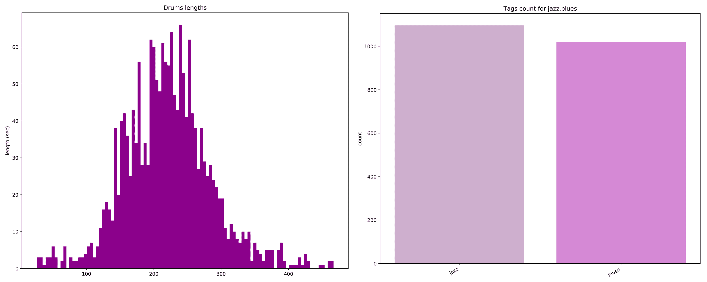

# 第八章：训练数据准备

到目前为止，我们使用的是现有的 Magenta 预训练模型，因为它们非常强大且易于使用。但训练我们自己的模型至关重要，因为这能让我们生成特定风格的音乐或特定的结构或乐器。构建和准备数据集是训练我们自己模型的第一步。为了做到这一点，我们需要查看现有的数据集和 API，这些工具可以帮助我们找到有意义的数据。接着，我们需要为特定风格（舞曲和爵士）构建两个 MIDI 数据集。最后，我们需要通过数据转换和管道准备 MIDI 文件用于训练。

本章将涵盖以下主题：

+   查看现有的数据集

+   构建舞曲音乐数据集

+   构建一个爵士数据集

+   使用管道准备数据

# 技术要求

在本章中，我们将使用以下工具：

+   **命令行**或**Bash**从终端启动 Magenta

+   **Python**及其库

+   Python 的**多进程**模块用于多线程数据准备

+   **Matplotlib**用于绘制数据准备结果

+   **Magenta**启动数据管道转换

+   **MIDI**、**ABCNotation**和**MusicXML**作为数据格式

+   外部 API，如**Last.fm**

在 Magenta 中，我们将使用**数据管道**。我们将在本章后续部分深入讲解这些内容，但如果你觉得需要更多信息，可以参考 Magenta 源代码中的管道 README 文件（[github.com/tensorflow/magenta/tree/master/magenta/pipelines](https://github.com/tensorflow/magenta/tree/master/magenta/pipelines)），这是一个很好的起点。你还可以查看 Magenta 的代码，文档也非常完善。另有更多内容可参考*进一步阅读*部分。

本章的代码可以在本书的 GitHub 仓库中找到，位于`Chapter06`文件夹，链接为[github.com/PacktPublishing/hands-on-music-generation-with-magenta/tree/master/Chapter06](https://github.com/PacktPublishing/hands-on-music-generation-with-magenta/tree/master/Chapter06)。在本章中，你应该在开始之前使用`cd Chapter06`命令。

查看以下视频，看看代码如何运作：[`bit.ly/3aXWLmC`](http://bit.ly/3aXWLmC)

# 查看现有的数据集

在本章中，我们将为训练准备一些数据。请注意，关于这一点将在第七章中详细介绍，*训练 Magenta 模型*。数据准备和模型训练是两个不同的活动，它们是并行进行的——首先，我们准备数据，然后训练模型，最后再回过头来准备数据，以提高模型的性能。

首先，我们将看看除了 MIDI 以外的符号表示法，如 MusicXML 和 ABCNotation，因为 Magenta 也支持它们，即使我们在本章中使用的主要数据集是 MIDI 格式。接着，我们将概述现有的数据集，包括 Magenta 团队用来训练我们已经介绍过的一些模型的数据集。这个概述并不详尽，但可以作为寻找训练数据的起点。

我们将重点关注的主要数据集是 **Lakh MIDI 数据集**（**LMD**），这是一个最新且精心制作的 MIDI 数据集，将作为我们大部分示例的基础。你也可以使用其他数据集；我们提供的代码可以轻松适配其他内容。

# 查看符号表示法

有三种主要的符号表示法：MIDI、MusicXML 和 ABCNotation。我们已经详细讲解了 MIDI，但还没有讨论 MusicXML 和 ABCNotation。虽然我们在本章中不会使用这两种格式，但知道它们的存在以及 Magenta 能够处理它们和 MIDI 文件也是有帮助的。

**MusicXML**，顾名思义，是一种基于 XML 的音乐表示格式。它的优点是基于文本，这意味着它不需要像 PrettyMIDI 这样的外部库来处理，并且在许多乐谱编辑器中都得到了支持，例如 MuseScore。你可以在其官方网站找到 MusicXML 规范：[www.musicxml.com](https://www.musicxml.com/)。

这是一个 MusicXML 文件的示例：

```py
<?xml version="1.0" encoding="UTF-8" standalone="no"?>
<!DOCTYPE score-partwise PUBLIC
    "-//Recordare//DTD MusicXML 3.1 Partwise//EN"
    "http://www.musicxml.org/dtds/partwise.dtd">
<score-partwise version="3.1">
 <part-list>
    <score-part id="P1">
      <part-name>Music</part-name>
    </score-part>
  </part-list>
  <part id="P1">
    <measure number="1">
      <attributes>
...
      </attributes>
      <note>
        <pitch>
          <step>C</step>
          <octave>4</octave>
        </pitch>
        <duration>4</duration>
        <type>whole</type>
      </note>
    </measure>
  </part>
</score-partwise>
```

**ABCNotation**，顾名思义，是一种基于字母记谱（A-G）的文本音乐表示格式。该格式非常紧凑，包含一些关于整个文件的头部信息，后面跟着使用字母记谱法的歌曲内容。该记谱法在乐谱软件中也得到了广泛支持。下面是一个 ABCNotation 文件的示例：

```py
<score lang="ABC">
X:1
T:The Legacy Jig
M:6/8
L:1/8
R:jig
K:G
GFG BAB | gfg gab | GFG BAB | d2A AFD |
GFG BAB | gfg gab | age edB |1 dBA AFD :|2 dBA ABd |:
efe edB | dBA ABd | efe edB | gdB ABd |
efe edB | d2d def | gfe edB |1 dBA ABd :|2 dBA AFD |]
</score>
```

我们将在本章的*查看其他数据集*部分提供一些 ABCNotation 内容。

Magenta 提供的用于准备训练数据集的工具可以通过单个命令处理 MIDI、MusicXML 和 ABCNotation，这非常方便。`convert_dir_to_note_sequences`命令会根据内容类型进行解析，并返回 `NoteSequence`。

我们将在第七章，*训练 Magenta 模型* 中详细介绍这些工具。

# 从零开始构建数据集

使用现有的数据集并对其进行裁剪是构建和准备训练数据集的最简单方法，因为这是一种快速获取足够训练数据的方法。

另一种选择是从头开始构建数据集，要么通过为其创建新数据，要么通过整合来自不同来源的数据。虽然这种方法需要更多的工作，但在训练过程中可能会得到更好的结果，因为最终的数据是经过精心挑选的。如果你是音乐人并且已经有自己的 MIDI 文件，可以遵循这个过程。

# 使用 LMD 进行 MIDI 和音频文件

LMD（[colinraffel.com/projects/lmd](https://colinraffel.com/projects/lmd/)）是其中一个最完整和易于使用的 MIDI 数据集。如果您现在手头没有合适的数据集，我们建议使用它。本章的代码将使用此数据集，但您也可以使用其他数据集来跟随示例，因为即使信息不同，我们这里使用的大部分技术仍然适用。

数据集有各种分布，但我们特别关注以下几个：

+   **LMD-full**：这是完整数据集，包含 176,581 个 MIDI 文件。

+   **LMD-matched**：该数据集部分匹配到另一个数据集，即**million song dataset**（**MSD**），该数据集包含 45,129 个 MIDI 文件。这个子集很有用，因为匹配的文件包含艺术家和标题等元数据。

+   **LMD-aligned**：LMD 匹配的数据集与音频 MP3 预览对齐。

# 使用 MSD 获取元数据信息

MSD（[millionsongdataset.com](http://millionsongdataset.com/)）是一个大规模数据集，包含超过一百万条条目，包括音频特征和元数据信息。我们不会直接使用 MSD 数据集；相反，我们将使用包含在 LMD 匹配数据集中的匹配内容。

# 使用 MAESTRO 数据集进行表演音乐

**MIDI 和音频编辑同步轨道和组织**（**MAESTRO**）数据集（[magenta.tensorflow.org/datasets/maestro](https://magenta.tensorflow.org/datasets/maestro)）由 Magenta 团队策划，基于录制的现场表演，包括音频和 MIDI，超过 200 小时的内容。由于这些录制的演奏是由人类演奏的，音符具有表现力的时序和动态（还包括效果踏板的表示）。

数据集内容来自国际钢琴电竞（[piano-e-competition.com/](http://piano-e-competition.com/)），主要包含古典音乐。该数据集有多种用途，如自动音频转换为符号表示转录，已用于训练 Magenta Onsets 和 Frames 模型。还用于训练我们在 Chapter 3 中介绍的 Performance RNN 模型生成复调旋律。

与 MAESTRO 类似，但内容较少，您还可以使用 MusicNet 和 MAPS 数据集。我们在示例中不会使用 MAESTRO 数据集，但这是一个重要的数据集，您可能需要查看。有关更多信息，请查看本章末尾的*进一步阅读*部分。

# 使用 Groove MIDI 数据集进行动感鼓声

**Groove MIDI 数据集** ([www.tensorflow.org/datasets/catalog/groove](https://www.tensorflow.org/datasets/catalog/groove)) 包含了 13.6 小时的对齐 MIDI 和（合成的）人类演奏的、节奏对齐的富有表现力的电子鼓音频。该数据集还被分割成 2 小节和 4 小节的 MIDI 片段，并已用于训练 GrooVAE 模型，我们在第四章中介绍了该模型，*使用 MusicVAE 进行潜在空间插值*。

GMD 是一个令人印象深刻的数据集，包含了专业鼓手的录音表演，这些鼓手还即兴创作，因而产生了多样化的数据集。这些表演带有一个类型标签，可以用来筛选和提取特定的 MIDI 文件。

虽然未量化，但 GMD 也可以用于训练量化模型，如鼓 RNN。我们将在 *使用管道准备数据* 一节中展示的管道可以将未量化的 MIDI 转换为量化 MIDI。

# 使用 Bach Doodle 数据集

Bach Doodle 是 Google 为庆祝德国作曲家和音乐家约翰·塞巴斯蒂安·巴赫周年纪念日而制作的一个 Web 应用程序。Doodle 允许用户创作 2 小节旋律，并通过浏览器中的 Coconet 和 TensorFlow.js 请求应用程序以巴赫风格和声化输入的旋律。

生成的 Bach Doodle 数据集 ([magenta.tensorflow.org/datasets/bach-doodle](https://magenta.tensorflow.org/datasets/bach-doodle)) 包含和声编曲，令人印象深刻：为大约 6 年用户输入的音乐提供了 2160 万种和声。它包含用户输入的序列和网络输出的音符序列格式的输出序列，以及一些元数据，如用户所在国家和播放次数。

请参见 *进一步阅读* 部分，了解有关数据集的数据可视化的更多信息。

# 使用 NSynth 数据集进行音频内容处理

我们在上一章中介绍了 NSynth 数据集 ([www.tensorflow.org/datasets/catalog/nsynth](https://www.tensorflow.org/datasets/catalog/nsynth))，*使用 NSynth 和 GANSynth 进行音频生成*。本书不会涉及音频训练，但这是一个很好的数据集，可以用于训练 GANSynth 模型。

# 使用 API 来丰富现有数据

使用 API 是查找更多 MIDI 曲目相关信息的好方法。在本章中，我们将展示如何使用歌曲艺术家和标题查询 API，来找到与该歌曲相关的类型和标签。

有多个服务可以用来查找此类信息。我们不会列出所有这些服务，但两个好的起点是 **Last.fm** ([www.last.fm/](https://www.last.fm/)) 和 Spotify 的 **Echo Nest** ([static.echonest.com/enspex/](http://static.echonest.com/enspex/))。**tagtraum** 数据集 ([www.tagtraum.com/msd_genre_datasets.html](http://www.tagtraum.com/msd_genre_datasets.html)) 是另一个基于 MSD 的良好类型数据集。

在本章中，我们将使用**Last.fm** API 来获取歌曲信息，并将在即将到来的部分*构建爵士乐数据集*中学习如何使用其 API。

# 查看其他数据源

除了已整理的数据集，互联网上还有大量其他音乐文件的来源——主要是提供可搜索数据库的网站。使用这些来源的缺点是你必须手动下载和验证每个文件，虽然这可能会很耗时，但如果你想从头开始构建自己的数据集，这是必要的。

如**MidiWorld** ([www.midiworld.com](https://www.midiworld.com/))和**MuseScore** ([musescore.com](https://musescore.com/))等网站包含了大量的 MIDI 文件，通常按风格、作曲家和乐器分类。Reddit 上也有一些帖子列出了各种质量的 MIDI 数据集。

对于 MIDI 以外的格式，你可以访问 ABCNotation 网站([abcnotation.com](http://abcnotation.com))，它收录了超过 60 万个文件，主要是民间和传统音乐，还有指向其他资源的链接。

# 构建舞曲数据集

现在我们有了可用的数据集，可以开始构建自己的数据集了。我们将探讨不同的方法来使用 MIDI 文件中的信息。本节将作为仅使用 MIDI 文件构建数据集的不同工具的介绍。在这一节中，我们将使用**LMD-full**发行版。

在下一节*构建爵士乐数据集*中，我们将更深入地使用外部信息。

# 使用线程加速大数据集的处理

在构建数据集时，我们希望代码能够快速执行，因为我们需要处理大量的数据。在 Python 中，使用线程和多进程是一个有效的选择。Python 中有许多并行执行代码的方式，但我们将使用`multiprocessing`模块，因为它设计简单，而且与其他流行的技术，如使用`joblib`模块，类似。

你可以在本章的源代码中的`multiprocessing_utils.py`文件中找到这段代码。源代码中有更多的注释和内容，记得查看一下。

在我们的示例中，我们将使用以下代码启动四个并行执行的线程：

```py
from itertools import cycle
from multiprocessing import Manager
from multiprocessing.pool import Pool

with Pool(4) as pool:
  # Add elements to process here
  elements = []
  manager = Manager()
  counter = AtomicCounter(manager, len(elements))
  results = pool.starmap(process, zip(elements, cycle([counter])))
  results = [result for result in results if result]
```

让我们更详细地解释这段代码：

+   你可以通过修改`Pool(4)`中的线程数量来适应你的硬件。通常，物理 CPU 对应一个线程是性能较好的选择。

+   我们实例化了`Manager`，它用于在线程之间共享资源，并且实例化了`AtomicCounter`，这是本书源代码中`multiprocessing_utils`模块中的一个组件，用来在线程之间共享一个计数器。

+   最后，我们使用`pool.starmap`方法在`elements`列表上启动`process`方法（我们稍后将定义这个方法）。`starmap`方法会传递两个参数给`process`方法，第一个是**`elements`列表中的一个元素**，第二个是`counter`。

+   `process`方法将一次处理一个元素，并在每次调用时递增计数器。

+   `process`方法应该能够返回`None`，以便过滤掉不需要的元素。

+   线程的生命周期和元素列表的拆分由`multiprocessing`模块处理。

# 从 MIDI 文件中提取鼓乐器

MIDI 文件可以包含多种乐器——多种打击乐器、钢琴、吉他等等。从 MIDI 文件中提取特定乐器并将结果保存到新的 MIDI 文件中，是构建数据集时必不可少的一步。

在这个示例中，我们将使用`PrettyMIDI`来获取 MIDI 文件中的乐器信息，提取鼓乐器，将它们合并成一个单一的鼓乐器，并将结果保存到新的 MIDI 文件中。有些 MIDI 文件有多个鼓乐器，拆分鼓乐器为多个部分，例如低音鼓、军鼓等等。在我们的示例中，我们选择将它们合并，但根据你要做的事情，你可能想要将它们分开或只保留某些部分。

你可以在`chapter_06_example_00.py`文件中找到这段代码，它位于本章的源代码中。源代码中有更多的注释和内容，记得查看一下。

`extract_drums`方法接受`midi_path`并返回一个包含合并后鼓乐器的单一`PrettyMIDI`实例：

```py
import copy
from typing import Optional

from pretty_midi import Instrument
from pretty_midi import PrettyMIDI

def extract_drums(midi_path: str) -> Optional[PrettyMIDI]:
  pm = PrettyMIDI(midi_path)
  pm_drums = copy.deepcopy(pm)
  pm_drums.instruments = [instrument for instrument in pm_drums.instruments
                          if instrument.is_drum]
  if len(pm_drums.instruments) > 1:
    # Some drum tracks are split, we can merge them
    drums = Instrument(program=0, is_drum=True)
    for instrument in pm_drums.instruments:
      for note in instrument.notes:
        drums.notes.append(note)
    pm_drums.instruments = [drums]
  if len(pm_drums.instruments) != 1:
    raise Exception(f"Invalid number of drums {midi_path}: "
                    f"{len(pm_drums.instruments)}")
  return pm_drums
```

首先，我们使用`copy.deepcopy`复制整个 MIDI 文件的内容，因为我们仍然希望保留原始文件中的时间签名和节奏变化。这些信息保存在通过`copy.deepcopy`方法从`pm_drums`变量返回的`PrettyMIDI`实例中。接着，我们使用`is_drum`属性过滤乐器。如果有多个鼓乐器，我们通过复制音符将它们合并成一个新的`Instrument`。

# 检测特定的音乐结构

现在，我们可以从 MIDI 文件中提取特定乐器，还可以在 MIDI 文件中找到特定结构，从而进一步细化我们的数据集。舞曲和电子舞曲大多数情况下每个拍子都有低音鼓，这给人一种无法抗拒的舞动冲动。让我们看看能否在我们的 MIDI 文件中找到这种情况。

`get_bass_drums_on_beat`方法返回直接落在拍子上的低音鼓的比例：

```py
import math
from pretty_midi import PrettyMIDI

def get_bass_drums_on_beat(pm_drums: PrettyMIDI) -> float:
  beats = pm_drums.get_beats()
  bass_drums = [note.start for note in pm_drums.instruments[0].notes
                if note.pitch == 35 or note.pitch == 36]
  bass_drums_on_beat = []
  for beat in beats:
    beat_has_bass_drum = False
    for bass_drum in bass_drums:
      if math.isclose(beat, bass_drum):
        beat_has_bass_drum = True
        break
    bass_drums_on_beat.append(True if beat_has_bass_drum else False)
  num_bass_drums_on_beat = len([bd for bd in bass_drums_on_beat if bd])
  return num_bass_drums_on_beat / len(bass_drums_on_beat)
```

`PrettyMIDI`中的`get_beats`方法返回一个数组，表示每个拍子的开始时间。例如，在一个 150 QPM 的文件中，我们有以下数组：

```py
[  0\.    0.4   0.8   1.2   1.6   2\.    2.4   2.8   3.2   3.6   4\.    4.4
   4.8   5.2   5.6   6\.    6.4   6.8   7.2   7.6   8\.    8.4   8.8   9.2
...
 201.6 202\.  202.4 202.8 203.2 203.6 204\.  204.4 204.8 205.2 205.6 206.
 206.4 206.8 207.2 207.6]
```

然后，我们只取给定 MIDI 中的低音鼓音高（35 或 36），并假设我们有一个乐器，因为我们之前的方法`extract_drums`应该已经被调用过。接着，我们检查每个拍子是否在该时刻播放了低音鼓，并返回一个比例值作为`float`。

# 分析我们的 MIDI 文件中的拍子

现在让我们把所有内容放在一起，检查我们的结果。

首先，我们将使用`argparse`模块为程序添加一些参数：

```py
import argparse

parser = argparse.ArgumentParser()
parser.add_argument("--path_output_dir", type=str, required=True)
parser.add_argument("--bass_drums_on_beat_threshold", 
                    type=float, required=True, default=0)
args = parser.parse_args()
```

在这里，我们使用`argparse`模块声明了两个命令行参数，`--path_output_dir`和`--bass_drums_on_beat_threshold`。输出目录对于将提取的 MIDI 文件保存在单独的文件夹中很有用，而阈值则有助于过滤更多或更少的提取 MIDI 序列。

# 编写处理方法

现在我们已经准备好了参数，可以开始编写处理方法。

这里是`process`方法，将由我们的多线程代码调用：

```py
import os
from typing import Optional
from multiprocessing_utils import AtomicCounter

def process(midi_path: str, counter: AtomicCounter) -> Optional[dict]:
  try:
    os.makedirs(args.path_output_dir, exist_ok=True)
    pm_drums = extract_drums(midi_path)
    bass_drums_on_beat = get_bass_drums_on_beat(pm_drums)
    if bass_drums_on_beat >= args.bass_drums_on_beat_threshold:
      midi_filename = os.path.basename(midi_path)
      pm_drums.write(os.path.join(args.path_output_dir, f"{midi_filename}.mid"))
    else:
      raise Exception(f"Not on beat {midi_path}: {bass_drums_on_beat}")
    return {"midi_path": midi_path,
            "pm_drums": pm_drums,
            "bass_drums_on_beat": bass_drums_on_beat}
  except Exception as e:
    print(f"Exception during processing of {midi_path}: {e}")
  finally:
    counter.increment()
```

`process`方法将在输出目录不存在时创建它。然后，它将使用给定的 MIDI 路径调用`extract_drums`方法，再使用返回的`PrettyMIDI`鼓调用`get_bass_drums_on_beat`方法，该方法返回低音鼓的节奏比例。如果该比例超过阈值，我们将把该 MIDI 文件保存到磁盘；否则，我们将退出该方法。

`process`方法的返回值很重要——通过返回`PrettyMIDI`文件和节奏上的低音鼓比例，我们将能够对数据集进行统计，以便做出关于其大小和内容的明智决策。`process`方法还可以返回空值（`None`）或抛出异常，这将使调用者丢弃该 MIDI 文件。

# 使用线程调用 process 方法

现在我们有了处理方法，可以用它来启动执行。

我们来创建一个`app`方法，通过线程调用`process`方法：

```py
import shutil
from itertools import cycle
from multiprocessing import Manager
from multiprocessing.pool import Pool
from typing import List
from multiprocessing_utils import AtomicCounter

def app(midi_paths: List[str]):
  shutil.rmtree(args.path_output_dir, ignore_errors=True)

  with Pool(4) as pool:
    manager = Manager()
    counter = AtomicCounter(manager, len(midi_paths))
    results = pool.starmap(process, zip(midi_paths, cycle([counter])))
    results = [result for result in results if result]
    results_percentage = len(results) / len(midi_paths) * 100
    print(f"Number of tracks: {len(MIDI_PATHS)}, "
          f"number of tracks in sample: {len(midi_paths)}, "
          f"number of results: {len(results)} "
          f"({results_percentage:.2f}%)")
```

`app`方法将在程序启动时使用 MIDI 路径列表被调用。首先，我们清理输出目录，为处理方法做准备，以便可以在其中写入内容。然后，我们使用`Pool(4)`启动四个线程（更多信息请参见前一节，*使用线程处理大数据集*）。最后，我们计算返回的结果数量以供参考。

# 使用 Matplotlib 绘制结果

使用返回的结果，我们可以找到关于数据集的统计信息。作为示例，绘制鼓的长度：

```py
import matplotlib.pyplot as plt

pm_drums = [result["pm_drums"] for result in results]
pm_drums_lengths = [pm.get_end_time() for pm in pm_drums]
plt.hist(pm_drums_lengths, bins=100)
plt.title('Drums lengths')
plt.ylabel('length (sec)')
plt.show()
```

我们使用 Matplotlib（[matplotlib.org/](https://matplotlib.org/)），这是一个流行且易于使用的 Python 绘图库。最终将得到以下输出：


绘制不同统计数据的图表帮助你可视化数据集的内容和大小。

# 处理数据集的一个样本

现在我们已经准备好了所有内容，可以使用数据集的一个子集来调用`app`方法。

首先，我们将使用较小的样本大小，以确保我们的代码正常工作：

```py
parser.add_argument("--sample_size", type=int, default=1000)
parser.add_argument("--path_dataset_dir", type=str, required=True)

MIDI_PATHS = glob.glob(os.path.join(args.path_dataset_dir, "**", "*.mid"),
                       recursive=True)

if __name__ == "__main__":
  if args.sample_size:
    # Process a sample of it
    MIDI_PATHS_SAMPLE = random.sample(list(MIDI_PATHS), args.sample_size)
  else:
    # Process all the dataset
    MIDI_PATHS_SAMPLE = list(MIDI_PATHS)
  app(MIDI_PATHS_SAMPLE)
```

让我们更详细地解释前面的代码：

+   我们声明了两个新参数，`--sample_size`和`--path_dataset_dir`。第一个参数声明了样本的大小，第二个参数声明了数据集的位置。

+   然后，我们在数据集的根文件夹上使用`glob.glob`，它将返回一个路径列表，每个 MIDI 文件对应一个元素。

+   因为在大型数据集上执行此操作需要一段时间，你也可以将结果缓存到磁盘（例如使用`pickle`模块），如果你频繁执行此操作的话。

+   我们使用`random.sample`从 MIDI 路径中获取一个子集，并使用得到的 MIDI 路径调用`app`方法。

你可以使用 LMD 的一个发行版来启动以下代码。你需要下载它（例如，**LMD-full**发行版）并解压 ZIP 文件。下载链接请参见*使用 Lakh MIDI 数据集*部分。

要使用小样本启动此代码，请在终端中使用以下命令（将`PATH_DATASET`替换为解压数据集的根文件夹，`PATH_OUTPUT`替换为输出路径）：

```py
python chapter_06_example_00.py --sample_size=1000 --path_dataset_dir="PATH_DATASET" --path_output_dir="PATH_OUTPUT"
```

解压后的 MIDI 文件将位于`PATH_OUTPUT`中，生成以下统计数据：

```py
Number of tracks: 116189, number of tracks in sample: 116189, number of results: 12634 (10.87%)
Time:  7197.6346254
```

在这里，我们可以看到大约 10%的 MIDI 文件的`--bass_drums_on_beat_threshold`超过 0.75。整个 LMD 数据集返回了 12,634 个结果，这足以在后续训练中使用。我们将在下一章讨论训练。

# 构建爵士乐数据集

在前一节中，我们介绍了构建基于完整 LMD 数据集中的 MIDI 文件信息的数据集所需的工具。在本节中，我们将深入探讨如何使用外部 API（如 Last.fm API）构建自定义数据集。

在本节中，我们将使用**LMD-matched**发行版，因为它与包含元数据的 MSD 部分匹配，这些元数据对我们很有用，如艺术家和标题。然后可以将这些元数据与 Last.fm 结合使用，获取歌曲的类型。我们还将提取鼓和钢琴乐器，就像在前一节中所做的那样。

# LMD 提取工具

在开始之前，我们先来看一下如何处理 LMD 数据集。首先，我们需要从[colinraffel.com/projects/lmd/](https://colinraffel.com/projects/lmd/)下载以下三个元素：

+   **LMD-matched**：与 MDS 匹配的 LMD 子集

+   **LMD-matched 元数据**：包含元数据的 H5 数据库

+   **匹配分数**：匹配分数字典

解压后，你应该在同一文件夹中找到以下元素：`lmd_matched`目录、`lmd_matched_h5`目录和`match_scores.json`文件。

你可以在`lakh_utils.py`文件中找到这段代码，位于本章的源代码中。源代码中有更多注释和内容，请查阅。

在`lakh_utils.py`文件中，你可以使用实用工具通过唯一标识符`MSD_ID`查找元数据和 MIDI 文件路径。我们的起点将是`match_scores.json`文件，它是一个匹配文件的字典，格式如下：

```py
{
...
  "TRRNARX128F4264AEB": {"cd3b9c8bb118575bcd712cffdba85fce": 0.7040202098544246},
  "TRWMHMP128EF34293F": {
    "c3da6699f64da3db8e523cbbaa80f384": 0.7321245522741104,
    "d8392424ea57a0fe6f65447680924d37": 0.7476196649194942
  },
...
}
```

作为键，我们有`MSD_ID`，作为值，我们有一个匹配字典，每个匹配都有一个分数。从`MSD_ID`中，我们可以使用`get_matched_midi_md5`方法获取最高分匹配。通过该 MD5，我们将能够使用`get_midi_path`方法加载相应的 MIDI 文件。

# 使用 Last.fm API 获取歌曲的类型

我们示例的第一部分使用了 Last.fm API 来获取每首歌的类型。还有其他 API，例如 Spotify 的 Echo Nest，也可以用来获取这些信息。如果你愿意，你可以选择其他服务提供商来完成这一部分。

第一步是在[www.last.fm/api/](https://www.last.fm/api/)上创建一个账户。由于我们不会通过 API 进行更改，创建账户后，你只需要保留**API 密钥**即可。

你可以在本章的源代码中的`chapter_06_example_01.py`文件中找到本节的代码。源代码中有更多注释和内容，快去查看吧。

# 从 MSD 中读取信息

在我们调用 Last.fm 获取歌曲类型之前，我们需要找到每首歌的艺术家和标题。由于 LMD 与 MSD 是匹配的，找到这些信息非常简单。按照以下步骤操作即可：

1.  首先，让我们定义一个`process`方法，就像在前一章中一样，可以通过线程调用，并从 H5 数据库中获取艺术家信息：

```py
import argparse
import tables
from typing import List, Optional
from lakh_utils import msd_id_to_h5
from threading_utils import AtomicCounter

parser = argparse.ArgumentParser()
parser.add_argument("--sample_size", type=int, default=1000)
parser.add_argument("--path_dataset_dir", type=str, required=True)
parser.add_argument("--path_match_scores_file", type=str, required=True)
args = parser.parse_args()

def process(msd_id: str, counter: AtomicCounter) -> Optional[dict]:
  try:
    with tables.open_file(msd_id_to_h5(msd_id, args.path_dataset_dir)) as h5:
      artist = h5.root.metadata.songs.cols.artist_name[0].decode("utf-8")
      title = h5.root.metadata.songs.cols.title[0].decode("utf-8")
      return {"msd_id": msd_id, "artist": artist, "title": title}
  except Exception as e:
    print(f"Exception during processing of {msd_id}: {e}")
  finally:
    counter.increment()
```

这段代码看起来与我们在前一节中写的代码非常相似。在这里，我们使用`tables`模块打开 H5 数据库。然后，我们使用来自`lakh_utils`模块的`msd_id_to_h5`方法来获取 H5 文件的路径。最后，我们从 H5 数据库中提取艺术家和标题，然后以字典的形式返回结果。

1.  现在，我们可以像在前一章中一样调用`process`方法。在此之前，我们需要加载得分匹配字典，其中包含 LMD 和 MSD 之间的所有匹配项：

```py
from lakh_utils import get_msd_score_matches

MSD_SCORE_MATCHES = get_msd_score_matches(args.path_match_scores_file)

if __name__ == "__main__":
  if args.sample_size:
    # Process a sample of it
    MSD_IDS = random.sample(list(MSD_SCORE_MATCHES), args.sample_size)
  else:
    # Process all the dataset
    MSD_IDS = list(MSD_SCORE_MATCHES)
  app(MSD_IDS)
```

为此，我们需要使用`get_msd_score_matches`方法，它会将字典加载到内存中。然后，我们使用`app`方法从完整的数据集中抽取一个样本。

1.  最后，要使用一个小的样本集来运行此代码，在终端中使用以下命令（替换`PATH_DATASET`和`PATH_MATCH_SCORES`）：

```py
python chapter_06_example_01.py --sample_size=1000 --path_dataset_dir="PATH_DATASET" --path_match_score="PATH_MATCH_SCORES"
```

你应该会看到以下输出：

```py
Number of tracks: 31034, number of tracks in sample: 31034, number of results: 31034 (100.00%)
Time:  21.0088559
```

现在，我们可以绘制出 25 个最常见的艺术家，这将生成如下图表：


如果你愿意，你可以基于一个或多个你喜欢的艺术家创建数据集。你可能会发现可用于训练的 MIDI 文件太少，但也许值得尝试。

# 使用顶级标签来查找类型

现在我们知道如何在匹配的 MSD 数据库中获取信息，我们可以调用 Last.fm 来获取一首歌曲的类型信息。

你可以在本章的源代码中的`chapter_06_example_02.py`文件中找到本节的代码。源代码中有更多注释和内容，快去查看吧。

让我们开始吧：

1.  调用 Last.fm API 的最简单方法是执行一个简单的`GET`请求。我们将在一个名为`get_tags`的方法中执行该操作，并将 H5 数据库作为参数传入：

```py
import argparse
from typing import List, Optional
import requests
from threading_utils import AtomicCounter

parser = argparse.ArgumentParser()
parser.add_argument("--sample_size", type=int, default=1000)
parser.add_argument("--path_dataset_dir", type=str, required=True)
parser.add_argument("--path_match_scores_file", type=str, required=True)
parser.add_argument("--last_fm_api_key", type=str, required=True)
args = parser.parse_args()

def get_tags(h5) -> Optional[list]:
  title = h5.root.metadata.songs.cols.title[0].decode("utf-8")
  artist = h5.root.metadata.songs.cols.artist_name[0].decode("utf-8")
  request = (f"https://ws.audioscrobbler.com/2.0/"
             f"?method=track.gettoptags"
             f"&artist={artist}"
             f"&track={title}"
             f"&api_key={args.last_fm_api_key}"
             f"&format=json")
  response = requests.get(request, timeout=10)
  json = response.json()
  if "error" in json:
    raise Exception(f"Error in request for '{artist}' - '{title}': "
                    f"'{json['message']}'")
  if "toptags" not in json:
    raise Exception(f"Error in request for '{artist}' - '{title}': "
                    f"no top tags")
  tags = [tag["name"] for tag in json["toptags"]["tag"]]
  tags = [tag.lower().strip() for tag in tags if tag]
  return tags
```

这段代码向`track.gettoptags` API 端点发起请求，返回一个按标签数量排序的曲目流派列表，从最多标签到最少标签，其中标签数量是通过用户提交计算得出的。不同艺术家的标签分类差异很大。

你可以通过像 Last.fm 或 Echo Nest 这样的 API 获取关于曲目、艺术家或专辑的很多信息。确保在构建自己的数据集时检查它们提供的内容。

尽管有些部分可能比较简单（我们没有清理曲目名称和艺术家名称，也没有尝试使用其他匹配方式），但大多数曲目（超过 80%）都能在 Last.fm 上找到，这对于我们示例的目的来说已经足够好。

1.  这是一个简单的过程方法，我们可以用它来调用我们的`get_tags`方法：

```py
from typing import Optional
import tables
from threading_utils import AtomicCounter
from lakh_utils import msd_id_to_h5

def process(msd_id: str, counter: AtomicCounter) -> Optional[dict]:
  try:
    with tables.open_file(msd_id_to_h5(msd_id, args.path_dataset_dir)) as h5:
      tags = get_tags(h5)
      return {"msd_id": msd_id, "tags": tags}
  except Exception as e:
    print(f"Exception during processing of {msd_id}: {e}")
  finally:
    counter.increment()
```

1.  这个示例基于爵士乐，但如果你愿意，也可以选择其他流派。你可以使用以下代码绘制 LMD 中最受欢迎的共通流派：

```py
from collections import Counter

tags = [result["tags"][0] for result in results if result["tags"]]
most_common_tags_20 = Counter(tags).most_common(20)
plt.bar([tag for tag, _ in most_common_tags_20],
        [count for _, count in most_common_tags_20])
plt.title("Most common tags (20)")
plt.xticks(rotation=30, horizontalalignment="right")
plt.ylabel("count")
plt.show()
```

这应该生成一个与以下图示类似的图表：


我们将使用**爵士乐**流派，但你可能希望将多个流派结合起来，例如**爵士乐**和**蓝调**，以便你有更多的内容可以使用，或创造混合风格。在下一章中，我们将探讨你实际需要多少数据来训练模型，以便能够正确训练。

# 使用 MIDI 查找乐器类别

我们将在示例中使用两种乐器进行训练，但如果你有其他想法，也可以选择其他乐器：

+   **打击乐**：我们将从 MIDI 文件中提取鼓轨道，训练一个鼓 RNN 模型。

+   **钢琴**：我们将提取钢琴轨道来训练一个旋律 RNN 模型。

在这里，第一步是找到我们数据集中包含的乐器。在`PrettyMIDI`模块中，`Instrument`类包含一个`program`属性，可以用来查找这些信息。提醒一下，你可以在《通用 MIDI 1 声音集规范》([www.midi.org/specifications/item/gm-level-1-sound-set](https://www.midi.org/specifications/item/gm-level-1-sound-set))中找到更多关于各类程序的信息。

每个程序对应一个乐器，每个乐器被分类到一个乐器类别中。我们将使用这种分类来查找我们的数据集统计信息。让我们开始吧：

你可以在本章的源代码中找到这一部分的代码，文件名为`chapter_06_example_04.py`。源代码中有更多的注释和内容，别忘了查看。

1.  首先，我们为此目的编写`get_instrument_classes`方法：

```py
from typing import List, Optional
from pretty_midi import PrettyMIDI, program_to_instrument_class
from lakh_utils import get_midi_path
from lakh_utils import get_matched_midi_md5

def get_instrument_classes(msd_id) -> Optional[list]:
  midi_md5 = get_matched_midi_md5(msd_id, MSD_SCORE_MATCHES)
  midi_path = get_midi_path(msd_id, midi_md5, args.path_dataset_dir)
  pm = PrettyMIDI(midi_path)
  classes = [program_to_instrument_class(instrument.program)
             for instrument in pm.instruments
             if not instrument.is_drum]
  drums = ["Drums" for instrument in pm.instruments if instrument.is_drum]
  classes = classes + drums
  if not classes:
    raise Exception(f"No program classes for {msd_id}: "
                    f"{len(classes)}")
  return classes
```

首先，我们加载一个`PrettyMIDI`实例，然后将`program`转换为其乐器类别。在这里，你可以看到我们单独处理了鼓部分，因为鼓没有`program`属性。

1.  现在，我们可以按照如下方式编写我们的`process`方法：

```py
from typing import Optional
import tables
from threading_utils import AtomicCounter
from lakh_utils import msd_id_to_h5

def process(msd_id: str, counter: AtomicCounter) -> Optional[dict]:
  try:
    with tables.open_file(msd_id_to_h5(msd_id, args.path_dataset_dir)) as h5:
      classes = get_instrument_classes(msd_id)
      return {"msd_id": msd_id, "classes": classes}
  except Exception as e:
    print(f"Exception during processing of {msd_id}: {e}")
  finally:
    counter.increment()
```

1.  可以使用以下代码找到最常见的乐器类别：

```py
from collections import Counter

classes_list = [result["classes"] for result in results]
classes = [c for classes in classes_list for c in classes]
most_common_classes = Counter(classes).most_common()
plt.bar([c for c, _ in most_common_classes],
        [count for _, count in most_common_classes])
plt.title('Instrument classes')
plt.xticks(rotation=30, horizontalalignment="right")
plt.ylabel('count')
plt.show()
```

你应该得到类似于 LMD 中以下图表所展示的结果：


在这里，我们可以看到 LMD 中使用最频繁的乐器类别是**吉他**、**鼓**、**合奏**和**钢琴**。我们将在接下来的章节中使用**鼓**和**钢琴**类别，但如果你愿意的话，也可以使用其他类别。

# 提取爵士、鼓和钢琴轨道

现在，我们能够找到我们想要的乐器轨道，按类型筛选歌曲，并导出生成的 MIDI 文件，我们可以将所有内容整合在一起，创建两个爵士数据集，一个包含打击乐，另一个包含钢琴。

# 提取和合并爵士鼓

我们已经实现了大部分用于提取爵士鼓的代码，即`get_tags`方法和`extract_drums`方法。

你可以在本章的源代码文件`chapter_06_example_07.py`中找到这一部分的代码。源代码中有更多的注释和内容，记得查看。

`process`方法应该像这样调用`get_tags`和`extract_drums`方法：

```py
import argparse
import ast
from typing import Optional
import tables
from multiprocessing_utils import AtomicCounter

parser = argparse.ArgumentParser()
parser.add_argument("--tags", type=str, required=True)
args = parser.parse_args()

TAGS = ast.literal_eval(args.tags)

def process(msd_id: str, counter: AtomicCounter) -> Optional[dict]:
  try:
    with tables.open_file(msd_id_to_h5(msd_id, args.path_dataset_dir)) as h5:
      tags = get_tags(h5)
      matching_tags = [tag for tag in tags if tag in TAGS]
      if not matching_tags:
        return
      pm_drums = extract_drums(msd_id)
      pm_drums.write(os.path.join(args.path_output_dir, f"{msd_id}.mid"))
      return {"msd_id": msd_id,
              "pm_drums": pm_drums,
              "tags": matching_tags}
  except Exception as e:
    print(f"Exception during processing of {msd_id}: {e}")
  finally:
    counter.increment()
```

在这里，我们使用`ast`模块来解析`tags`参数。这很有用，因为它允许我们使用 Python 列表语法来表示标志的值，例如`--tags="['jazz', 'blues']"`。然后，我们可以检查来自 Last.fm 的标签是否与所需标签之一匹配，如果匹配，则将生成的 MIDI 鼓文件写入磁盘。

鼓的长度和类型分布可以通过以下图表查看：



在这里，我们可以看到，通过合并“**爵士**”和“**蓝调**”两种类型的轨道，我们大约有 2,000 个 MIDI 文件。

# 提取和拆分爵士钢琴

我们需要编写的最后一个方法是钢琴提取方法。`extract_pianos`方法类似于之前的`extract_drums`方法，但它不是将轨道合并在一起，而是将它们拆分成单独的钢琴轨道，可能会为每首歌曲返回多个轨道。让我们开始吧：

你可以在本章的源代码文件`chapter_06_example_08.py`中找到这一部分的代码。源代码中有更多的注释和内容，记得查看。

1.  首先，我们将编写`extract_pianos`方法，如下所示：

```py
from typing import List
from pretty_midi import Instrument
from pretty_midi import PrettyMIDI
from lakh_utils import get_matched_midi_md5
from lakh_utils import get_midi_path

PIANO_PROGRAMS = list(range(0, 8))

def extract_pianos(msd_id: str) -> List[PrettyMIDI]:
  os.makedirs(args.path_output_dir, exist_ok=True)
  midi_md5 = get_matched_midi_md5(msd_id, MSD_SCORE_MATCHES)
  midi_path = get_midi_path(msd_id, midi_md5, args.path_dataset_dir)
  pm = PrettyMIDI(midi_path)
  pm.instruments = [instrument for instrument in pm.instruments
                    if instrument.program in PIANO_PROGRAMS
 and not instrument.is_drum]
  pm_pianos = []
  if len(pm.instruments) > 1:
    for piano_instrument in pm.instruments:
      pm_piano = copy.deepcopy(pm)
      pm_piano_instrument = Instrument(program=piano_instrument.program)
      pm_piano.instruments = [pm_piano_instrument]
      for note in piano_instrument.notes:
        pm_piano_instrument.notes.append(note)
      pm_pianos.append(pm_piano)
  else:
    pm_pianos.append(pm)
  for index, pm_piano in enumerate(pm_pianos):
    if len(pm_piano.instruments) != 1:
      raise Exception(f"Invalid number of piano {msd_id}: "
                      f"{len(pm_piano.instruments)}")
    if pm_piano.get_end_time() > 1000:
      raise Exception(f"Piano track too long {msd_id}: "
                      f"{pm_piano.get_end_time()}")
  return pm_pianos
```

我们已经涵盖了这段代码的大部分内容。不同之处在于，我们正在筛选任何钢琴程序中的乐器，范围从 0 到 8。我们还将返回多个钢琴 MIDI 文件。

1.  现在，我们可以使用以下`process`方法调用我们的方法：

```py
import argparse
import ast
from typing import Optional
import tables
from lakh_utils import msd_id_to_h5
from multiprocessing_utils import AtomicCounter

parser = argparse.ArgumentParser()
parser.add_argument("--tags", type=str, required=True)
args = parser.parse_args()

TAGS = ast.literal_eval(args.tags)

def process(msd_id: str, counter: AtomicCounter) -> Optional[dict]:
  try:
    with tables.open_file(msd_id_to_h5(msd_id, args.path_dataset_dir)) as h5:
      tags = get_tags(h5)
      matching_tags = [tag for tag in tags if tag in TAGS]
      if not matching_tags:
        return
      pm_pianos = extract_pianos(msd_id)
      for index, pm_piano in enumerate(pm_pianos):
        pm_piano.write(os.path.join(args.path_output_dir,
                                    f"{msd_id}_{index}.mid"))
      return {"msd_id": msd_id,
              "pm_pianos": pm_pianos,
              "tags": matching_tags}
  except Exception as e:
    print(f"Exception during processing of {msd_id}: {e}")
  finally:
    counter.increment()
```

这段代码在上一节关于鼓的部分中已经讲过，只不过在这里，每个钢琴文件是使用索引单独写入的。钢琴的长度和类型可以像这样绘制：


在这里，我们找到了接近 2,000 个**爵士**和**蓝调**钢琴轨道。

# 使用管道准备数据

在前面的部分中，我们查看了现有的数据集，并开发了工具以便能够查找并提取特定内容。通过这些操作，我们有效地构建了一个想要用来训练模型的数据集。但构建数据集并非一切——我们还需要**准备**它。准备的意思是移除那些不适合训练的内容，剪辑和拆分轨道，并且自动添加更多的内容。

在这一部分中，我们将介绍一些内置的工具，它们可以帮助我们将不同的数据格式（MIDI、MusicXML 和 ABCNotation）转换为适合训练的格式。这些工具在 Magenta 中被称为`管道（pipelines）`，它们是一系列在输入数据上执行的操作。

在管道中已经实现的操作之一是丢弃音调过多、过长或过短的旋律。另一个操作是转调旋律，即通过上下移动音符的音高来创造新的旋律。这是一种在机器学习中常见的做法，叫做**数据集增强**，如果我们希望通过提供原始数据的变体来让模型更好地训练，这是很有用的。

让我们来看一下什么是管道（pipelines），以及它们如何被使用。在这一部分中，我们将以 Melody RNN 管道为例，但每个模型都有其独特的管道和特定内容。例如，Drums RNN 管道不会转调鼓的序列，因为这样做没有意义。

在我们开始讨论管道之前，我们将简要地看看如何手动优化我们之前构建的数据集。

# 手动优化数据集

这可能听起来显而易见，但我们还是要强调，因为它真的很重要：验证你提取的 MIDI 文件。数据集的内容应该与音乐方面的目标相符。

验证轨道内容最简单的方法是将其在 MuseScore 中打开并进行试听：


让我们来看看我们可以验证每个文件的哪些内容：

+   首先要验证的是我们提取的**乐器**是否出现在生成的 MIDI 文件中。以我们的爵士钢琴示例为例，我们应该只有一个乐器轨道，并且它应该是八个钢琴程序中的任意一个。

+   另一个需要验证的内容是**音乐风格（genre）**是否符合要求。这些钢琴声音像爵士乐吗？这段音乐听起来对你来说好听吗？

+   其他需要注意的问题包括**不完整**的轨道，过短、过长或充满沉默的轨道。这些轨道中的一些将会通过数据准备管道过滤掉，但对数据进行人工检查也同样重要。

+   如果你喜欢的一些曲目被数据准备管道过滤掉，例如，因为它们太短，你可以手动解决这个问题，方法是复制并粘贴它们的一部分以使其更长。你也可以编写一个管道来自动执行这个操作。

如果一些曲目不符合你的要求，删除它们。

一旦你验证了数据集的内容并移除了所有不需要的曲目，你也可以修剪和清理每个文件的内容。最简单的方法是进入 MuseScore，听一下曲目，移除你不喜欢的部分，然后将文件重新导出为 MIDI。

# 查看 Melody RNN 管道

一旦我们手动完善了数据集，就可以使用管道准备它，从而生成已准备好用于训练的数据。作为示例，我们将查看 Melody RNN 管道。

# 启动数据准备阶段并处理我们的数据集。

准备数据的第一步是调用`convert_dir_to_note_sequences`命令，不论你将使用哪个模型，这个命令都是相同的。该命令将一个包含 MIDI 文件、MusicXML 文件或 ABCNotation 文件的目录作为输入，并将其转换为 TensorFlow 记录格式的`NoteSequence`。

我们建议你为训练数据创建另一个文件夹（与你之前创建的数据集文件夹分开）。现在，让我们开始：

1.  首先，切换到你创建的文件夹，并使用以下命令调用`convert_dir_to_note_sequences`命令（将`PATH_OUTPUT_DIR`替换为你在上一节中使用的目录）：

```py
convert_dir_to_note_sequences --input_dir="PATH_OUTPUT_DIR" --output_file="notesequences.tfrecord"
```

这将输出一堆“转换后的 MIDI”文件，并生成一个`notesequences.tfrecord`。从现在开始，无论我们在构建数据集时使用的是哪种符号表示，数据格式都是相同的。

1.  现在，我们可以使用以下代码在我们的数据上启动管道：

```py
melody_rnn_create_dataset --config="attention_rnn" --input="notesequences.tfrecord" --output_dir="sequence_examples" --eval_ratio=0.10
```

首先，我们需要提供`--config`作为一个参数。这是必要的，因为编码器和解码器在配置中定义（参见第三章，*生成复调旋律*，以回顾编码和解码的工作原理）。

我们还传递了`--eval_ratio`参数，它将给管道提供训练集和评估集中的元素数量。执行时，管道将输出它遇到的文件的统计信息和警告。

统计信息会在每处理 500 个文件时打印到控制台，但只有最后部分（**完成。**输出之后）才是我们关心的。以下是爵士钢琴数据集 500 个样本的输出：

```py
Processed 500 inputs total. Produced 122 outputs.
DAGPipeline_MelodyExtractor_eval_melodies_discarded_too_few_pitches: 7
DAGPipeline_MelodyExtractor_eval_melodies_discarded_too_long: 0
DAGPipeline_MelodyExtractor_eval_melodies_discarded_too_short: 42
DAGPipeline_MelodyExtractor_eval_melodies_truncated: 2
DAGPipeline_MelodyExtractor_eval_melody_lengths_in_bars:
  [7,8): 4
  [8,10): 2
  [10,20): 2
  [30,40): 2
DAGPipeline_MelodyExtractor_eval_polyphonic_tracks_discarded: 113
DAGPipeline_MelodyExtractor_training_melodies_discarded_too_few_pitches: 45
DAGPipeline_MelodyExtractor_training_melodies_discarded_too_long: 0
DAGPipeline_MelodyExtractor_training_melodies_discarded_too_short: 439
DAGPipeline_MelodyExtractor_training_melodies_truncated: 20
DAGPipeline_MelodyExtractor_training_melody_lengths_in_bars:
 [7,8): 22
 [8,10): 21
 [10,20): 42
 [20,30): 11
 [30,40): 16
DAGPipeline_MelodyExtractor_training_polyphonic_tracks_discarded: 982
DAGPipeline_RandomPartition_eval_melodies_count: 49
DAGPipeline_RandomPartition_training_melodies_count: 451
DAGPipeline_TranspositionPipeline_eval_skipped_due_to_range_exceeded: 0
DAGPipeline_TranspositionPipeline_eval_transpositions_generated: 317
DAGPipeline_TranspositionPipeline_training_skipped_due_to_range_exceeded: 0
DAGPipeline_TranspositionPipeline_training_transpositions_generated: 2387
```

这里关注的统计数据如下：

+   `Processed 500 inputs total. **Produced 122 outputs.**`：这告诉我们输入的大小或提供的 MIDI 文件数量，以及生成的`SequenceExample`的数量，这些将用于训练（122，计算包括评估集和训练集）。这是最重要的统计数据。

+   `DAGPipeline_MelodyExtractor_MODE_melody_lengths_in_bars`：这将为每个 "MODE" 提供生成的 `SequenceExample` 元素的长度。

`SequenceExample` 封装了将在训练过程中输入网络的数据。这些统计数据很有用，因为数据的数量（以及质量）对模型训练至关重要。如果一个模型在 122 个输出上没有正确训练，我们需要确保下次训练时有更多的数据。

从这个角度来看，查看生成的输出非常重要，它能告诉我们网络将接收到的数据量。即使我们给数据准备管道输入了 100,000 个 MIDI 文件，如果生成的 `SequenceExample` 很少，也没有关系，因为输入数据不好。如果管道对大量输入生成了少量输出，查看统计数据并找出哪个处理步骤删除了元素。

现在，让我们来看一下管道是如何为我们的示例定义和执行的。

# 理解管道的执行

我们在上一节提供的统计数据有些混乱，因为它们没有按照执行的顺序显示。让我们正视一下这个过程的实际执行方式，以便理解发生了什么：

+   `DagInput` 启动管道的执行，逐个读取 TensorFlow 记录中的每个 `NoteSequence` 作为输入（500 个元素）。

+   `RandomPartition` 根据命令中提供的比例随机将元素划分为训练集和评估集（训练集有 450 个元素，评估集有 50 个元素）。

+   `TimeChangeSplitter` 在每个时间变化点拆分元素（不输出统计数据）。

+   `Quantizer` 根据配置中的 `steps_per_quarter` 属性将音符序列量化到最近的步长，并删除具有多重节奏和时间签名的元素（不输出统计数据）。

+   `TranspositionPipeline` 将音符序列转换为多个音高，并在此过程中添加新的元素（训练集生成了 2,387 个通过转调产生的元素）。

+   `MelodyExtractor` 从 `NoteSequence` 中提取旋律，返回一个 `Melody` 并根据需要删除元素，比如多声部轨道以及那些过短或过长的轨道（训练集中删除了 1,466 个元素）。这一部分还输出旋律的长度（以小节为单位）：

    +   旋律的最小和最大长度分别由 `min_bars` 和 `max_steps` 定义。请参阅下一节，了解如何更改这些值。

    +   `ignore_polyphonic_notes` 被设置为 `True`，会丢弃多声部轨道。

+   `EncoderPipeline` 使用为注意力配置定义的 `KeyMelodyEncoderDecoder` 将 `Melody` 编码为 `SequenceExample`（不输出统计数据）。编码器管道接收作为参数传递的配置；例如，对于 `lookback_rnn` 配置，使用 `LookbackEventSequenceEncoderDecoder`。

+   `DagOutput` 完成执行。

如果你想查看`Pipeline`的实现，查看`melody_rnn_pipeline`模块中的`get_pipeline`方法。

# 编写你自己的管道

正如你从`get_pipeline`方法中的代码中可能注意到的，大部分配置是无法更改的。不过，我们可以编写自己的管道并直接调用它。

你可以在本章的源代码中找到这一节的代码，文件名为`melody_rnn_pipeline_example.py`。源代码中有更多注释和内容，记得查看一下。

在这个例子中，我们将使用现有的 Melody RNN 管道，复制它，并更改移调和序列长度。让我们开始吧：

1.  首先，复制`get_pipeline`方法，并使用以下 Python 代码调用它（将`INPUT_DIR`和`OUTPUT_DIR`替换为适当的值）：

```py
from magenta.pipelines import pipeline

pipeline_instance = get_pipeline("attention_rnn", eval_ratio=0.10)
pipeline.run_pipeline_serial(
    pipeline_instance,
    pipeline.tf_record_iterator(INPUT_DIR, pipeline_instance.input_type),
    OUTPUT_DIR)
```

你应该看到与我们之前使用管道方法时相同的输出。通过对钢琴爵士数据集的一个小样本（500 条数据）进行处理，我们得到了以下输出：

```py
INFO:tensorflow:Processed 500 inputs total. Produced 115 outputs.
...
INFO:tensorflow:DAGPipeline_MelodyExtractor_training_melody_lengths_in_bars:
 [7,8): 31
 [8,10): 9
 [10,20): 34
 [20,30): 11
 [30,40): 17
 [50,100): 2
...
INFO:tensorflow:DAGPipeline_TranspositionPipeline_training_transpositions_generated: 2058
...
```

1.  现在，让我们更改一些参数，看看它是如何工作的。在以下代码中，我们添加了一些移调（默认的移调值是`(0,)`，表示没有移调偏移）：

```py
...
transposition_pipeline = note_sequence_pipelines.TranspositionPipeline(
  (0,12), name='TranspositionPipeline_' + mode)
...
```

通过使用移调值`(0,12)`，我们告诉移调管道为每个现有的序列创建一个比原序列高 12 个音高的序列，相当于一个完整的八度向上偏移。其余的代码保持不变。

移调值应该遵循以半音（MIDI 音高值）表示的音乐间隔。最简单的间隔是我们正在使用的完美间隔，它对应于一个八度，或者 12 个半音，或 MIDI 音高。也可以使用其他间隔，例如大三度，这在 Polyphony RNN 管道中使用，移调范围为`(-4, 5)`。

现在，输出应该如下所示：

```py
...
INFO:tensorflow:Processed 500 inputs total. Produced 230 outputs.
...
INFO:tensorflow:DAGPipeline_MelodyExtractor_training_melody_lengths_in_bars:
 [7,8): 66
 [8,10): 14
 [10,20): 64
 [20,30): 22
 [30,40): 34
 [50,100): 4
...
INFO:tensorflow:DAGPipeline_TranspositionPipeline_training_transpositions_generated: 4297
...
```

请注意，现在我们大约有了两倍的数据可以使用。数据增强对于处理小型数据集非常重要。

1.  我们还可以更改旋律提取器中序列的最小和最大长度，如下所示：

```py
...
melody_extractor = melody_pipelines.MelodyExtractor(
 min_bars=15, max_steps=1024, min_unique_pitches=5,
 gap_bars=1.0, ignore_polyphonic_notes=False,
 name='MelodyExtractor_' + mode)
...
```

上面的代码将输出总共 92 个结果（而不是之前的 230 个）。

我们还可以编写我们自己的管道类。例如，我们可以自动剪切过长的序列，或者复制过短的序列，而不是丢弃它们。对于音符序列管道，我们需要扩展`NoteSequencePipeline`类，并实现`transform`方法，如以下代码所示：

```py
from magenta.pipelines.note_sequence_pipelines import NoteSequencePipeline

class MyTransformationClass(NoteSequencePipeline):
  def transform(self, note_sequence):
    # My transformation code here
    pass
```

查看 Magenta 中的`sequences_lib`模块，该模块包含了许多用于处理音符序列的工具。每个数据集都需要进行准备，准备数据的最简单方法是创建新的管道。

# 查看 MusicVAE 数据转换

MusicVAE 模型不使用流水线——实际上，它甚至没有数据集创建脚本。与我们之前使用 Melody RNN 的例子相比，它仍然使用类似的变换（如数据增强），并且更具可配置性，因为一些变换可以进行配置，而不需要我们编写新的流水线。

让我们来看看`music_vae`模块中`configs`模块中包含的一个简单的 MusicVAE 配置。在这里，你可以找到以下`cat-mel_2bar_small`配置：

```py
# Melody
CONFIG_MAP['cat-mel_2bar_small'] = Config(
    model=MusicVAE(lstm_models.BidirectionalLstmEncoder(),
                   lstm_models.CategoricalLstmDecoder()),
    hparams=merge_hparams(
        lstm_models.get_default_hparams(),
        HParams(
            batch_size=512,
            max_seq_len=32,  # 2 bars w/ 16 steps per bar
            z_size=256,
            enc_rnn_size=[512],
            dec_rnn_size=[256, 256],
            free_bits=0,
            max_beta=0.2,
            beta_rate=0.99999,
            sampling_schedule='inverse_sigmoid',
            sampling_rate=1000,
        )),
    note_sequence_augmenter=data.NoteSequenceAugmenter(transpose_range=(-5, 5)),
    data_converter=data.OneHotMelodyConverter(
        valid_programs=data.MEL_PROGRAMS,
        skip_polyphony=False,
        max_bars=100,  # Truncate long melodies before slicing.
        slice_bars=2,
        steps_per_quarter=4),
    train_examples_path=None,
    eval_examples_path=None,
)
```

以下列表进一步解释了代码：

+   通过查看`NoteSequenceAugmenter`类，你可以看到它通过使用平移（如我们自定义的流水线中所做）和拉伸这一数据增强技术来进行音符序列的增强。

+   它还将旋律的最大长度限制为`max_bars=100`，但请记住，MusicVAE 因其网络类型的原因，只能处理有限大小的样本。在这个例子中，每个样本被切片为`slice_bars=2`的长度。

+   音符序列增强器让你决定一个转调范围，它将在这个范围内随机选择一个值。

+   Melody RNN 不使用拉伸，因为大多数拉伸比例对量化的序列不起作用。比如，Performance RNN 就可以使用拉伸。

我们现在不会讨论如何创建新的配置。有关如何做到这一点的更多信息，请参见第七章，*训练 Magenta 模型*。

# 总结

在本章中，我们研究了如何构建和准备一个用于训练的数据集。首先，我们查看了现有的数据集，并解释了为什么一些数据集比其他数据集更适合特定的使用案例。接着，我们研究了 LMD 和 MSD，它们由于规模和完整性而具有重要价值，还研究了 Magenta 团队的数据集，如 MAESTRO 数据集和 GMD。我们还查看了外部 API，如 Last.fm，它可以用来丰富现有的数据集。

然后，我们构建了一个舞曲数据集，并使用 MIDI 文件中包含的信息来检测特定结构和乐器。我们学习了如何使用多进程计算结果，以及如何绘制关于生成的 MIDI 文件的统计数据。

接着，我们通过从 LMD 中提取信息，并使用 Last.fm API 来查找每首歌曲的流派，构建了一个爵士乐数据集。我们还研究了如何在 MIDI 文件中查找和提取不同的乐器轨道。

最后，我们为训练准备了数据。通过使用流水线，我们能够处理提取的文件，删除不符合适当长度的文件，对其进行量化，并使用数据增强技术创建一个适合训练的正确数据集。通过这样做，我们看到了不同模型根据其网络类型具有不同的流水线。

在下一章，我们将使用本章中产生的内容来训练一些模型，使用我们创建的数据集。你将看到，训练是一个经验过程，涉及数据准备与模型训练之间的大量反复。在这个过程中，你可能会回到这一章寻求更多的信息。

# 问题

1.  不同符号表示法的优缺点是什么？

1.  编写一段代码，从 MIDI 文件中提取大提琴乐器。

1.  LMD 中有多少首摇滚歌曲？有多少符合“爵士”，“蓝调”，“乡村”标签？

1.  编写一段代码，扩展那些对于 Melody RNN 管道来说过短的 MIDI 文件。

1.  从 GMD 中提取爵士鼓。我们能用这个训练量化模型吗？

1.  为什么数据增强如此重要？

# 进一步阅读

+   **MAESTRO 数据集与 Wave2Midi2Wave：** Magenta 团队关于 MAESTRO 数据集及其在 Wave2Midi2Wave 方法中应用的博客文章（[magenta.tensorflow.org/maestro-wave2midi2wave](https://magenta.tensorflow.org/maestro-wave2midi2wave)）

+   **启用基于 MAESTRO 数据集的钢琴音乐建模与生成：** 2019 年关于 MAESTRO 与 Wave2Midi2Wave 的论文（[arxiv.org/abs/1810.12247](https://arxiv.org/abs/1810.12247)）

+   **庆祝约翰·塞巴斯蒂安·巴赫：** 巴赫涂鸦，带给我们巴赫涂鸦数据集（[www.google.com/doodles/celebrating-johann-sebastian-bach](https://www.google.com/doodles/celebrating-johann-sebastian-bach)）

+   **可视化巴赫涂鸦数据集：** 一种令人惊叹的巴赫涂鸦数据集可视化（[magenta.tensorflow.org/bach-doodle-viz](https://magenta.tensorflow.org/bach-doodle-viz)）

+   **巴赫涂鸦：使用机器学习进行可扩展的音乐创作：** 2019 年关于巴赫涂鸦数据集的论文（[arxiv.org/abs/1907.06637](https://arxiv.org/abs/1907.06637)）
