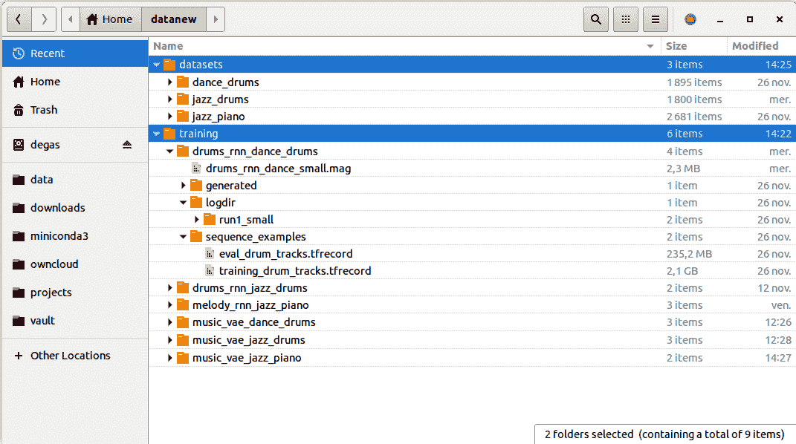
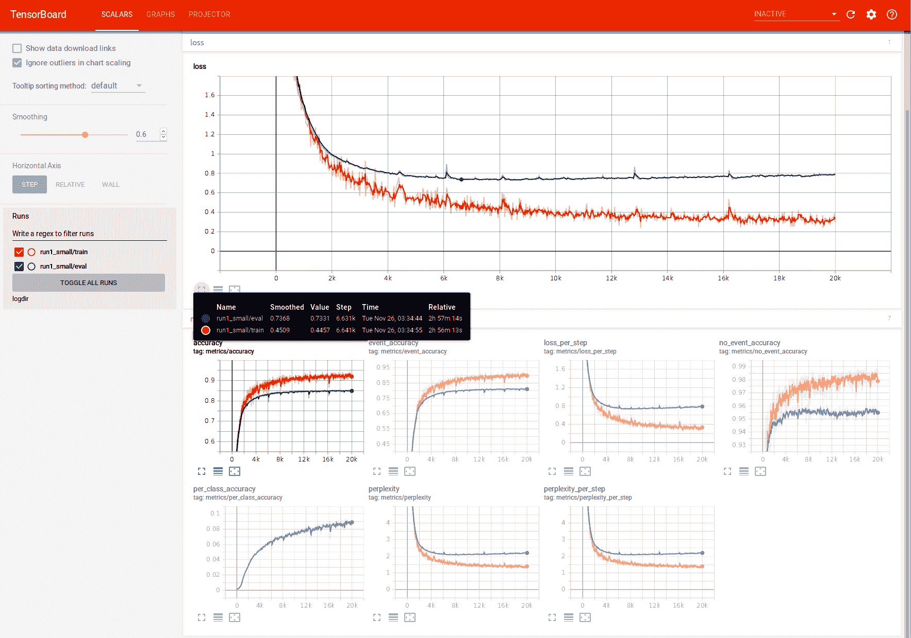
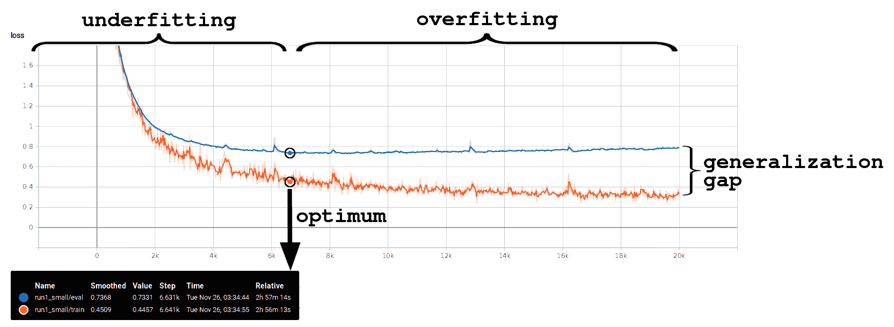
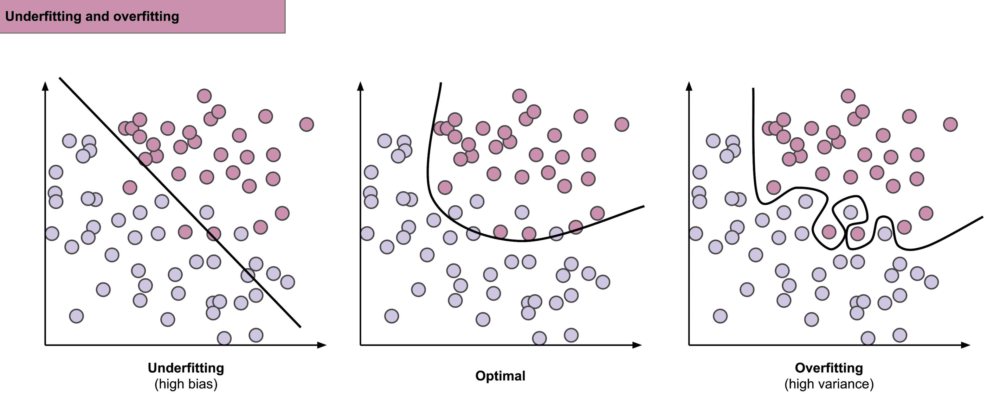
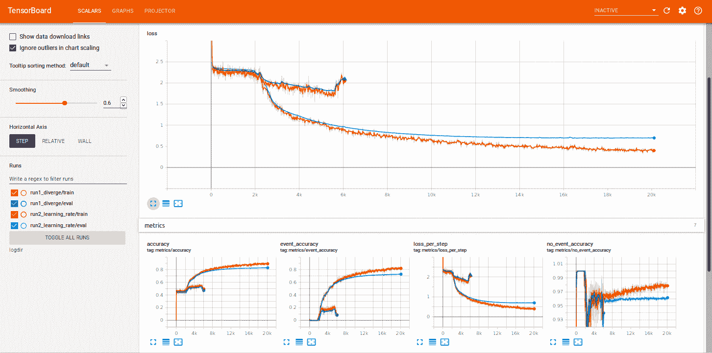
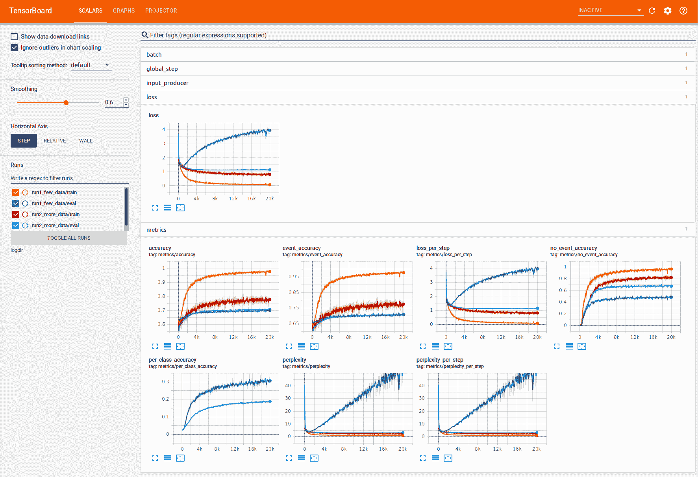
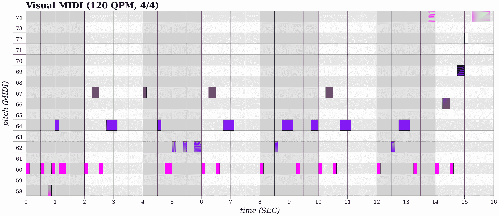
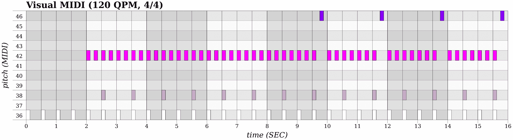
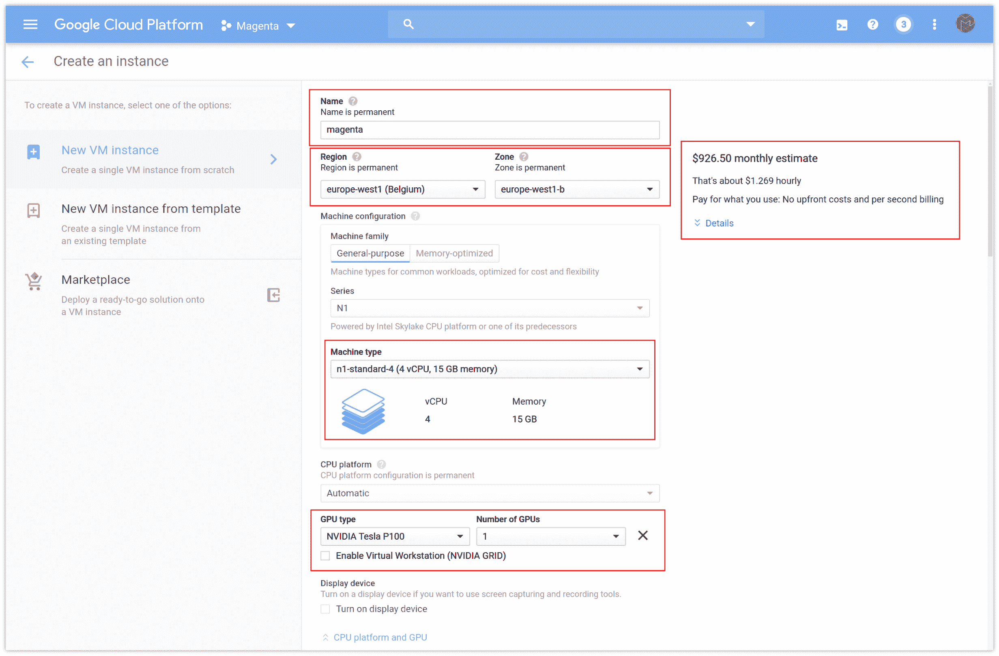
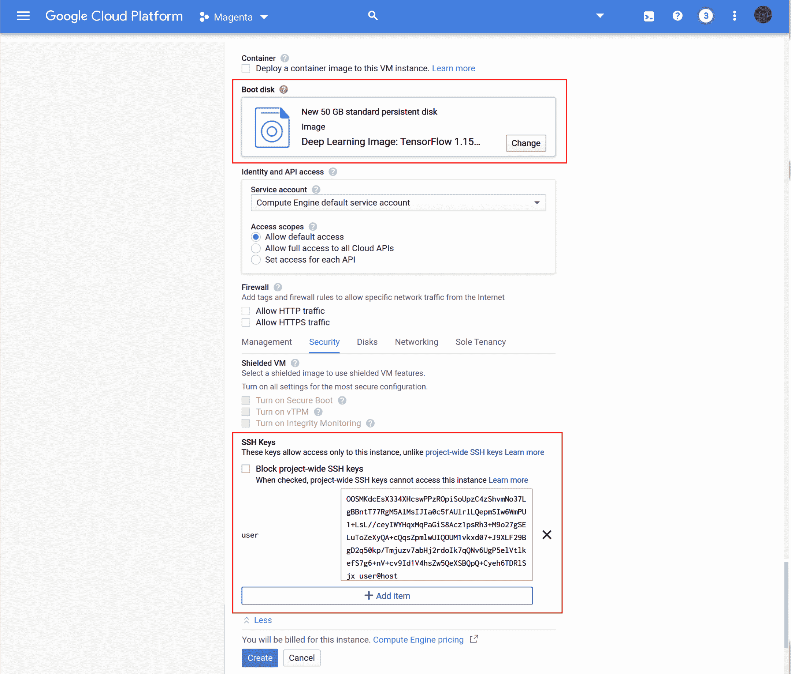

# 第九章：训练 Magenta 模型

在本章中，我们将使用前一章准备的数据来训练一些 RNN 和 VAE 网络。机器学习训练是一个复杂的过程，涉及大量的调优、实验以及数据与模型之间的反复迭代。我们将学习如何调整超参数，如批次大小、学习率和网络大小，以优化网络性能和训练时间。我们还将展示常见的训练问题，如过拟合和模型不收敛。一旦模型训练完成，我们将展示如何使用训练好的模型生成新的序列。最后，我们将展示如何使用 Google Cloud Platform 在云端加速模型训练。

本章将涉及以下主题：

+   选择模型和配置

+   训练和调整模型

+   使用 Google Cloud Platform

# 技术要求

在本章中，我们将使用以下工具：

+   使用**命令行**或**Bash**从终端启动 Magenta

+   使用**Python**及其库编写特定的模型训练配置

+   使用**Magenta**和**Magenta GPU**来训练我们的模型

+   **TensorBoard** 用于验证训练指标

+   使用**Google Cloud Platform**在云端进行训练

在 Magenta 中，我们将使用**Drums RNN**、**Melody RNN**和**MusicVAE**模型进行训练。我们将解释这些模型的训练过程，但如果你觉得需要更多信息，可以查看 Magenta 源代码中的模型 README ([github.com/tensorflow/magenta/tree/master/magenta/models](https://github.com/tensorflow/magenta/tree/master/magenta/models))，它是一个不错的起点。你还可以查看 Magenta 的代码，它有很好的文档支持。我们还在最后一节提供了*进一步阅读*的内容。

本章的代码位于本书的 GitHub 仓库中的`Chapter07`文件夹，地址是[github.com/PacktPublishing/hands-on-music-generation-with-magenta/tree/master/Chapter07](https://github.com/PacktPublishing/hands-on-music-generation-with-magenta/tree/master/Chapter07)。示例和代码片段假定你位于该章节的文件夹中。在本章开始之前，你应该先运行`cd Chapter07`。

查看以下视频，查看代码的实际应用：

[`bit.ly/2OcaY5p`](http://bit.ly/2OcaY5p)

# 选择模型和配置

在第六章中，*训练数据准备*，我们研究了如何构建数据集。我们制作的数据集是符号型数据，由包含特定乐器（如打击乐器或钢琴）和特定音乐风格（如舞曲和爵士乐）的 MIDI 文件组成。

我们还探讨了如何准备数据集，这对应于将输入格式（MIDI、MusicXML 或 ABCNotation）准备为可以输入到网络中的格式。该格式是特定于 Magenta 模型的，这意味着即使两个模型都能在打击乐数据上进行训练，Drums RNN 和 MusicVAE 模型的准备工作也会有所不同。

在开始训练之前的第一步是为我们的使用案例选择合适的模型和配置。记住，Magenta 中的模型定义了一个深度神经网络架构，每种网络类型都有其优缺点。让我们来看看如何选择一个模型，配置它并从头开始训练它。

# 比较音乐生成的使用案例

让我们以训练一个打击乐模型为例。如果我们想要训练一个生成节奏性打击乐的模型，我们可以选择 Drums RNN 模型或 MusicVAE 模型：

+   第一个模型，Drums RNN，将在**生成较长序列**时更有效，因为该模型可以通过注意力机制学习长期依赖关系，从而保持全球音乐结构（有关详细信息，请参见第二章，*使用 Drums RNN 生成鼓序列*）。

+   第二个模型，MusicVAE，无法做到这一点，但能够从潜在空间中进行采样并**在序列之间插值**（有关详细信息，请参见第四章，*使用 MusicVAE 进行潜在空间插值*）。

根据你的使用案例，你可能想训练其中之一或两者，但请记住它们的优缺点。

如果我们以训练一个旋律模型为例，如果我们希望生成的结果是单声部的，我们可以使用单声部模型，如 Melody RNN 或 MusicVAE（具有之前提到的相同限制）。如果我们希望生成的结果是多声部的，我们可以使用多声部模型，如 Polyphony RNN。

有时，我们知道要使用哪个模型，但配置不适合我们的使用案例。让我们来看看如何创建一个新的配置。

# 创建新配置

我们将以我们想要使用 Music VAE 模型训练的贝斯数据集为例。查看`magenta.models.music_vae`模块中的`configs`模块，我们找到了`cat-mel_2bar_small`配置，它接近我们想要实现的目标，但当数据集被转换时，不对应旋律程序的音符（在 Magenta 中定义为 0 到 32）会被丢弃。

你可以在本章的源代码中的`chapter_07_example_01.py`文件中找到此代码。源代码中有更多的注释和内容，所以你应该去查看它。

为了实现这一点，我们将创建一个名为`cat-bass_2bar_small`的新配置，并将有效的程序更改为`bass`程序：

1.  首先，让我们创建一个新的`Config`实例，内容如下：

```py
from magenta.common import merge_hparams
from magenta.models.music_vae import Config
from magenta.models.music_vae import MusicVAE
from magenta.models.music_vae import lstm_models
from magenta.models.music_vae.data import BASS_PROGRAMS
from magenta.models.music_vae.data import NoteSequenceAugmenter
from magenta.models.music_vae.data import OneHotMelodyConverter
from tensorflow.contrib.training import HParams

cat_bass_2bar_small = Config(
  model=MusicVAE(lstm_models.BidirectionalLstmEncoder(),
                 lstm_models.CategoricalLstmDecoder()),
  hparams=merge_hparams(
    lstm_models.get_default_hparams(),
    HParams(
      batch_size=512,
      max_seq_len=32,
      z_size=256,
      enc_rnn_size=[512],
      dec_rnn_size=[256, 256],
      free_bits=0,
      max_beta=0.2,
      beta_rate=0.99999,
      sampling_schedule="inverse_sigmoid",
      sampling_rate=1000,
    )),
  note_sequence_augmenter=NoteSequenceAugmenter(transpose_range=(-5, 5)),
  data_converter=OneHotMelodyConverter(
    valid_programs=BASS_PROGRAMS,
    skip_polyphony=False,
    max_bars=100,
    slice_bars=2,
    steps_per_quarter=4),
  train_examples_path=None,
  eval_examples_path=None,
)
```

我们在这里唯一改变的部分是`OneHotMelodyConverter`中的`valid_programs=BASS_PROGRAMS`参数，但我们本可以更改其他元素，例如上一章提到的`NoteSequenceAugmenter`。超参数可以使用`hparams`标志进行更改，但如果我们希望为模型定义默认值，也可以在配置中定义它们。

1.  要使用新的配置，我们可以调用`music_vae_train`模块的`run`方法：

```py
import tensorflow as tf
from magenta.models.music_vae.configs import CONFIG_MAP
from magenta.models.music_vae.music_vae_train import run

def main(unused_argv):
  CONFIG_MAP["cat-bass_2bar_small"] = cat_bass_2bar_small
  run(CONFIG_MAP)

if __name__ == "__main__":
  tf.app.run(main)
```

在这里，我们导入整个配置映射并在调用`run`方法之前添加新的配置，以便我们仍然可以在`--config`标志中传递其他配置。

1.  然后，我们可以像调用`music_vae_train`命令一样调用此代码：

```py
python chapter_07_example_01.py --config="cat-bass_2bar_small" [FLAGS]
```

在这里，`FLAGS`是我们需要传递的训练标志，例如`--run_dir`和`--sequence_example_file`。

其他模型，如鼓乐 RNN 或旋律 RNN 模型，也将以相同的方式进行配置。有关如何操作的示例，请参考下一节。

现在我们知道如何选择模型和配置（或创建新配置），接下来看看如何开始和配置训练。

# 训练和调整模型

训练机器模型是一种经验性和迭代的方法，我们首先准备数据和配置，然后训练模型，失败后重新开始。在第一次尝试时让模型成功训练是很少见的，但我们会共同克服困难，继续前行。

在启动**训练阶段**时，我们将查看特定的度量指标，以验证我们的模型是否在正确训练并且收敛。我们还将启动**评估阶段**，它将在一个单独的小型数据集上执行，以验证模型是否能够在未见过的数据上正确地泛化。

**评估**数据集通常在机器学习中称为**验证**数据集，但我们将保持“评估”这一术语，因为在 Magenta 中使用的是这个术语。

验证数据集与**测试**数据集不同，测试数据集是外部数据集，通常由人工整理，并包含难度较大的样本，用来对网络性能进行最终测试。测试数据集通常用于比较不同模型的性能。我们这里不会涉及测试数据集。

我们将分解并解释每个步骤的过程。首先，让我们看看本章将使用的一些最佳实践和约定。

# 组织数据集和训练数据

由于训练是一个迭代过程，我们将生成许多数据集和多个**训练运行**。最好的做法是将这两者分开，例如，分别存放在名为`datasets`和`training`的文件夹中。

在`datasets`文件夹中，我们可以将上一章中生成的内容复制到不同的文件夹中，例如`dance_drums`、`jazz_drums`、`piano_drums`等，每个文件夹中包含 MIDI 文件：

+   我们将`notesequences.tfrecords`文件保存在正确的数据集文件夹中，因为它仅在每个数据集上生成一次。

+   我们将`sequence_examples`文件夹放在这个文件夹外面，因为它与模型相关，意味着我们将为每个模型重新生成这个文件夹，例如，Drums RNN 和 MusicVAE 各生成一次（即使我们使用相同的数据）。

在`training`文件夹中，我们将为每个模型和数据集创建一个新文件夹，例如，`drums_rnn_dance_drums`：

+   我们将执行`MODEL_create_dataset`命令（如果可用），并为模型创建`sequence_examples`目录（如果有的话）。

+   然后，我们将启动多个训练运行，并进行适当命名，例如，`run1_with_dropout`，或者其他我们可能想使用的配置：



拥有一个包含多个运行的单一训练文件夹非常有用，因为我们可以在 TensorBoard 中加载多个训练运行，并比较每个模型的表现。

# 在 CPU 或 GPU 上训练

训练是一项计算密集型活动。比如在入门级 GPU（例如 RTX 2060）上训练一个简单的模型，如 Drums RNN 模型，约需要 5 个小时。使用 CPU 训练则需要更多时间，因为网络训练中所需的操作（即向量运算）已被优化以在 GPU 上并行执行。要使用 GPU，我们还需要正确安装`magenta-gpu`包和 CUDA 库（有关更多信息，请参见第一章，*Magenta 与生成艺术简介*）。

如果你没有 GPU，不用担心，你仍然可以继续学习本章。你可以完成数据准备步骤，并在一个小型网络上启动训练（请参见后面第一个训练示例，了解如何进行）。然后，让网络训练一段时间，如果你看到令人鼓舞的结果，可以按照最后一节*使用 Google 云平台*中的步骤，在更快的机器上重新启动训练。这将允许你先在本地测试命令和数据集，然后将大部分工作卸载到 GCP。即使你有 GPU，这也可能是一个不错的选择，尤其是当你希望同时训练多个模型，或同时测试不同超参数时。

以下章节和命令同样适用于 CPU 和 GPU 训练，以及 GCP。

# 训练 RNN 模型

现在我们已经拥有了开始训练模型的所有元素。让我们以一个简单的例子开始，我们将使用上一章的`dance_drums`数据集，并训练 Drums RNN 模型。

你可以在本章源代码的`README.md`文件中找到这段代码。由于本章中的大多数代码片段是命令行格式，我们没有为每个示例提供示例文件。

从上一章开始，我们应该已经准备好了包含 MIDI 文件的`datasets/dance_drums`文件夹。我们已经执行了`convert_dir_to_note_sequences`命令，生成了`notesequences.tfrecord`文件。

# 创建数据集并启动训练

我们现在将创建数据集（这是我们在上一章已经做过的操作，但在这里再次展示以帮助复习），并启动训练。

1.  首先，让我们创建序列示例。在`training`文件夹中创建并切换到名为`drums_rnn_dance_drums`的新文件夹，并执行（将`PATH_TO_NOTE_SEQUENCES`替换为正确的文件）：

```py
drums_rnn_create_dataset --config="drum_kit" --input="PATH_TO_NOTE_SEQUENCES" --output_dir="sequence_examples" --eval_ratio=0.10

```

这应该会创建一个`sequence_examples`文件夹，里面包含两个文件，一个是训练集，另一个是鼓序列的评估集。

理想情况下，`drums_rnn_create_dataset`命令应该只在所有训练运行中调用一次。由于我们将在每次运行之间调整超参数，而超参数对训练数据非常敏感，因此在调优模型时改变训练和评估数据集并不是一个好主意。

1.  我们现在将开始使用一个小型网络进行训练：

```py
drums_rnn_train --config="drum_kit" --run_dir="logdir/run1_small" --sequence_example_file="sequence_examples/training_drum_tracks.tfrecord" --hparams="batch_size=64,rnn_layer_sizes=[64,64]" --num_training_steps=20000

```

在 Windows 上，`--run_dir`标志应该使用反斜杠。对于这个例子以及所有后续的例子，不要写`--run_dir="logdir/run1_small"`，而应使用`--run_dir="logdir\run1_small"`。

我们使用一个名为`run1_small`的输出目录，这样以后可以记住是哪次运行，以及一个名为`training_drum_tracks.tfrecord`的输入文件。超参数是批量大小为 64，每层 64 个单元的两层 RNN 网络，列表中定义了层数。对于一个 3 层 RNN 网络，使用[64, 64, 64]。

你应该在终端看到完整的超参数列表及其值，这些值来自配置文件，除非被标志覆盖。

```py
INFO:tensorflow:hparams = {'batch_size': 64, 'rnn_layer_sizes': [64, 64], 'dropout_keep_prob': 0.5, 'attn_length': 32, 'clip_norm': 3, 'learning_rate': 0.001, 'residual_connections': False, 'use_cudnn': False}
```

我们很快就会看到超参数如何影响训练。在接下来的章节中，如果你使用的是 GPU，请通过检查以下输出确保 TensorFlow 可以使用你的 GPU：

```py
2019-11-20 01:56:12.058398: I tensorflow/core/common_runtime/gpu/gpu_device.cc:1304] Created TensorFlow device (/job:localhost/replica:0/task:0/device:GPU:0 with 5089 MB memory) -> physical GPU (device: 0, name: GeForce GTX 1060 6GB, pci bus id: 0000:01:00.0, compute capability: 6.1)
```

1.  现在，网络将开始训练，你应该看到类似这样的输出：

```py
INFO:tensorflow:Accuracy = 0.27782458, Global Step = 10, Loss = 5.4186254, Perplexity = 225.56882 (16.487 sec)
INFO:tensorflow:global_step/sec: 0.586516
```

我们很快会讨论不同的评估指标。当我们启动训练时，使用了`--num_training_steps=20000`标志，这意味着网络将在达到 20,000 个全局步骤后停止训练。我们在这里不会讨论 epoch，它是指遍历训练数据的完整周期，因为我们在 Magenta 中只处理步骤。模型应该会在此之前收敛，但给出一个上限是有好处的，这样它就不会无故执行太久。

如果你想大致估算训练完成 20,000 步所需的时间，可以使用`global_step`/`sec`输出。对于之前的输出，我们的工作大约需要 9 小时完成，但这是一个上限，因此我们有可能在此之前停止它。

现在训练已启动，我们可以启动评估。

# 启动评估

评估作业在评估数据集上执行，该数据集比训练集小（我们之前使用了`--eval_ratio=0.10`标志，表示 10%），且与训练集分开。评估作业对模型进行评估，并计算损失函数，但不会更新网络中的任何权重。因此，评估过程非常快速，可以与训练作业在 CPU 上同时执行。

要启动评估，我们使用相同的命令，并使用`--eval`标志。如果你正在使用 GPU，你需要通过`CUDA_VISIBLE_DEVICES=""`环境变量禁用 GPU 执行，因为之前的 TensorFlow 进程占用了所有可用内存。

在 Windows 上，不要忘记在`--run_dir`标志中使用反斜杠。此外，在 Windows 上，使用`set`命令为当前命令行会话设置环境变量。在 Linux 和 macOS 上，你可以通过在命令前面加上变量值来为单个命令设置环境变量。

在 Windows 上，使用以下命令：

```py
set CUDA_VISIBLE_DEVICES=""
drums_rnn_train --config="drum_kit" --run_dir="logdir\run1_small" --sequence_example_file="sequence_examples/eval_drum_tracks.tfrecord" --hparams="batch_size=64,rnn_layer_sizes=[64,64]" --num_training_steps=20000 --eval

```

在 Linux 和 macOS 上，使用以下命令：

```py
CUDA_VISIBLE_DEVICES="" drums_rnn_train --config="drum_kit" --run_dir="logdir/run1_small" --sequence_example_file="sequence_examples/eval_drum_tracks.tfrecord" --hparams="batch_size=64,rnn_layer_sizes=[64,64]" --num_training_steps=20000 --eval
```

对于这个命令，提供的网络大小需要与训练时的网络大小一致。如果你在训练命令中使用了`rnn_layer_sizes=[64,64]`，那么这里也需要使用相同的配置。我们从之前的命令中改变了两个标志，分别是`--eval`和`--sequence_example_file`标志。

当运行目录中添加了一个新的检查点（大约每 40 步添加一次）时，评估将开始执行。发生这种情况时，你会看到类似以下的输出：

```py
Starting evaluation at 2019-11-25-23:38:24
INFO:tensorflow:Accuracy = 0.0, Global Step = 35, Loss = 0.0, Perplexity = 1.0
INFO:tensorflow:Evaluation [1/3]
INFO:tensorflow:Evaluation [2/3]
INFO:tensorflow:Evaluation [3/3]
Finished evaluation at 2019-11-25-23:38:30
```

当训练作业一段时间未生成检查点时，评估作业会自动停止。

# 查看 TensorBoard

在训练期间以及训练后，我们可以启动 TensorBoard，帮助可视化网络指标。我们将使用 TensorBoard 来调整超参数并与数据准备阶段进行迭代。

要启动 TensorBoard，请使用以下命令：

```py
tensorboard --logdir=logdir
```

请注意，我们传递了父输出目录，这意味着我们可以访问所有包含的运行（目前只有一个）。我们可以在控制台中找到 TensorBoard 的 URL。打开后，页面将如下所示：



这是我们训练模型经过 20,000 步后的结果。左侧是训练和评估作业，可以切换显示。右侧的截图显示了不同的指标，其中横坐标是全局步数，达到了 20,000 步。对我们来说最重要的两个指标是**损失**和**准确度**。我们希望**损失下降**，无论是训练集还是评估集，同时希望**准确度上升**。

我们注意到该模型已经收敛，这意味着我们成功地完成了训练，但我们需要通过查看损失指标来验证结果模型的好坏。让我们来看看损失函数，比较训练损失和评估损失：



我们可以看到这里模型略微过拟合了训练数据。您可以通过找到**评估损失曲线的最低点**来找到模型的最优点，在该点之前曲线下降，之后曲线开始上升。在该点的左侧，模型在欠拟合训练数据；而在右侧，模型在过拟合数据。两条曲线之间的差异被称为泛化误差。

在继续其他例子之前，我们先来解释一下欠拟合和过拟合。

# 解释欠拟合和过拟合

理解欠拟合和过拟合以及如何防止它们，对于正确的网络训练至关重要。当模型过于简单，无法从训练数据集中学习时，我们称模型为**欠拟合**。另一方面，当模型能够正确地从训练数据集中学习，但无法将其泛化到数据集之外时，我们称模型为**过拟合**。

我们在下图中展示了欠拟合、最优解和过拟合：



在左侧，我们展示了欠拟合，意味着模型没有在数据集上学习。中间展示了一个最优解，而右侧展示了过拟合，其中得到的模型对于给定数据来说过于复杂，这意味着该模型无法泛化到其他数据集。

请记住，神经网络的目标是既能在训练数据集上表现良好，也能在**从未见过的新数据**上表现良好，而这些数据将用于做出预测。要实现这一目标非常困难，因为这需要在数据的质量和数量、网络规模和学习参数之间找到适当的平衡。

让我们看看如何解决这些问题。

# 解决欠拟合问题

欠拟合问题容易解决，可以通过**增加模型的容量**来解决——基本上就是通过增加更多的层和单元。通过增加模型的容量，网络可以学习更多种类的函数，将输入映射到输出。

对于我们之前的例子，我们可以通过在两个层中每层增加更多的单元（神经元）来增加模型的容量：

```py
drums_rnn_train --config="drum_kit" --run_dir="logdir/run1_small" --sequence_example_file="sequence_examples/training_drum_tracks.tfrecord" --hparams="batch_size=64,rnn_layer_sizes=[128,128]" --num_training_steps=20000
```

我们还需要训练足够长的时间，这可能与硬件有关，因为如果我们在性能较慢的硬件上训练，可能需要很长时间才能达到最优点。

有关网络规模的更多信息，请参见*定义适当的网络规模和超参数*一节。

# 解决过拟合问题

另一方面，过拟合问题更难解决，因为它源于多种因素。最常见的两种原因如下：

+   当模型出现过拟合时，是因为它具有过拟合训练数据集的能力。通过保持相同的训练数据集，您可以**减少网络容量**，以便网络没有足够的资源来过拟合训练数据。要减少网络容量，可以像之前的例子那样使用`rnn_layer_sizes`超参数。

+   通过保持相同的网络容量，你可以**增加训练数据集的大小**，这样，随着数据的增加，网络可能就不再有过拟合的能力。添加的数据需要足够多样化，以修复过拟合问题，但并不总是有效。要增加训练数据集的大小，请返回到第六章，*数据准备训练*，并向数据集添加内容。请注意，如果增加的数据不够多样化，将无助于解决过拟合问题。

训练数据集与网络大小之间存在关系：**数据集越大且越多样化，网络就越大**。如果训练数据集不够大或者质量不够好，一个更大的网络不一定会产生更好的结果。

在 Magenta 模型中，有其他修复过拟合的方法可以使用：

+   **提前停止**在最佳点结束训练阶段是一种方法，因为在那一点之后的所有训练都会使结果网络变得更差。要使用提前停止，请参见下一节，*使用特定的检查点实现提前停止*。

+   使用诸如**dropout**这样的正则化技术，它会随机且临时地从网络中丢弃一个单元/神经元。要使用 dropout，请使用`dropout_keep_prob`超参数。

正则化技术是一类方法，旨在约束神经网络中权重的大小，并广泛用作预防过拟合的方法。

正如你现在可能已经注意到的，我们的数据集和模型之间存在关系，在调整训练阶段时需要考虑这一点。让我们更详细地看一下网络大小和超参数。

# 定义网络大小和超参数

定义适当的网络大小是一个反复试验的过程，但是一个很好的起点是，如果你的硬件足够好，那么就使用你想要的模型配置中的数值。

让我们举一个例子，使用 Melody RNN 模型的`attention_rnn`配置，使用`batch_size=128`，`rnn_layer_sizes=[128, 128]`，`dropout_keep_prob=0.5`，`learning_rate=0.001`和`clip_norm=3`：

1.  如果模型出现过拟合，我们可以尝试以下方法：

    1.  例如，使用更多的 dropout，如`dropout_keep_prob=0.4`和较低的值。

    1.  添加更多数据

    1.  使用`rnn_layer_sizes=[64, 64]`来减小网络大小

1.  如果模型正在收敛且没有过拟合，我们可以尝试使用更大的模型，例如`rnn_layer_sizes=[256, 256]`。如果我们有足够好的数据，使用更大的模型将产生更好的结果，因此我们希望优化这一点。

在更改某些内容时，我们需要确保每次只进行单一修改，然后测试结果，而不是同时更改多个参数。同时更改多个参数会阻止我们了解每个参数的直接影响。

有时，当增加网络大小时，我们可能会遇到模型无法收敛的情况，这意味着损失函数开始再次增加，从而导致训练错误。通过更改`learning_rate`或`clip_norm`可以解决这个问题。有关更多信息，请参阅下一节，*修复无法收敛的模型*。

# 确定批量大小

我们还没有讨论过`batch_size`。批量大小是网络一次处理的数据量。较大的批量大小可以通过使模型参数更快地收敛来提高训练时间。它还应该通过一次将更多数据传输到 GPU 内存中来减少一些计算开销。

一个经验法则是，当你增加批量大小时，你也需要**增加学习率**。由于一次处理的数据更多，模型的权重可以使用更大的比例进行更新。

增加批量大小可能会改善训练时间，但也可能**降低模型的性能**，因此使用过大的批量大小可能不是一个好主意。总的来说，批量大小通常是执行时间和模型质量之间的权衡。

我们在最后一节中提供了更多信息，*进一步阅读*。

# 修复内存溢出错误

有时，当使用过大的批量大小或网络大小时，你可能会遇到以下错误：

```py
[tensorflow/stream_executor/cuda/cuda_driver.cc:890] failed to alloc 8589934592 bytes on host: CUDA_ERROR_OUT_OF_MEMORY: out of memory
```

减小批量大小和网络大小，直到内存溢出错误消失。有时，错误并不致命，在这种情况下，它会对训练性能产生负面影响。

# 修复错误的网络大小

当使用现有的运行目录时，无论是继续先前的训练、启动评估作业，还是启动生成作业，我们都需要提供与首次启动时相同的网络大小。

如果训练运行首次使用`rnn_layer_sizes=[256,256,256]`启动，然后使用`rnn_layer_sizes=[128,128,128]`重新启动，我们将遇到以下错误：

```py
Invalid argument: Assign requires shapes of both tensors to match. lhs shape= [128] rhs shape= [256]
```

在这种情况下，我们需要使用我们在开始训练时使用的网络大小。

# 修复无法收敛的模型

收敛的模型由训练集和评估集上的**损失函数下降**定义。如果我们的损失函数在某个时刻上升，模型就不稳定，并且没有正确地收敛。模型无法收敛的原因有很多。

让我们以一个简单的例子为例（这个例子使用了我们在上一章创建的`jazz_drums`数据集）：

```py
drums_rnn_train --config="drum_kit" --run_dir="logdir/run1_diverge" --sequence_example_file="sequence_examples/training_drum_tracks.tfrecord" --hparams="batch_size=128,rnn_layer_sizes=[128,128,128]" --num_training_steps=20000
```

当模型发散时，我们可能会在某个时候遇到错误：

```py
E1112 20:03:08.279203 10460 basic_session_run_hooks.py:760] Model diverged with loss = NaN.
...
  File "c:\users\magenta\appdata\local\programs\python\python35\lib\site-packages\tensorflow\python\training\basic_session_run_hooks.py", line 761, in after_run
    raise NanLossDuringTrainingError
tensorflow.python.training.basic_session_run_hooks.NanLossDuringTrainingError: NaN loss during training.
```

结果的 TensorBoard 图将显示损失函数的上升。让我们通过使用较小的学习率来解决这个问题。前一个命令中使用的默认学习率值是`learning_rate=0.001`，所以我们将其调整为原来值的十分之一：

```py
drums_rnn_train --config="drum_kit" --run_dir="logdir/run2_learning_rate" --sequence_example_file="sequence_examples/training_drum_tracks.tfrecord" --hparams="learning_rate=0.0001,batch_size=128,rnn_layer_sizes=[128,128,128]" --num_training_steps=20000
```

这是包含两次运行结果的 TensorBoard 图：



你可以看到，`run1_diverge`的损失函数在不断增大，而`run2_learning_rate`正在正常训练。

修复发散模型的方法有很多，但由于问题依赖于数据和网络规模，你需要测试各种方法：

+   尝试**降低学习率**，就像在我们之前的示例中一样。学习率衰减（在 Music VAE 模型中可用），即学习率逐渐降低，也能有所帮助。

+   尝试**更改网络规模**。在这个示例中，使用`rnn_layer_sizes=[256,256,256]`的网络规模也可以修复该问题。

+   尝试**减少梯度裁剪**。在我们之前的示例中，梯度裁剪的默认值是`clip_norm=3`，因此你可能需要减少`clip_norm`超参数的值，例如设置为`clip_norm=2`。记住，默认的超参数值会在每个模型的配置文件中（有关更多信息，请参见前一节，*创建新配置*）。

有时候，修复一个发散的模型会引发另一个问题。例如，使用更大的网络规模来修复问题可能会导致网络过拟合。确保你测试多个解决方案，以便选择最合适的一个。

在训练过程中，NaN 损失错误大多是由我们在第四章中提到的梯度爆炸问题引起的，*生成多声部旋律*。这个问题在 RNN 中很常见，即使 LSTM 单元有助于模型的收敛，但由于在数百个输入时间步长上展开的梯度累积，梯度爆炸问题仍然可能发生。

在训练过程中，损失函数会在训练示例上计算，然后其导数会通过网络反向传播，按照传播误差的一个比例更新权重，这个比例就是学习率。当权重被不断更新且更新值过大时，往往会导致爆炸或溢出，这也是为什么使用较小的学习率可能修复该问题。

梯度裁剪有类似的效果，但如果我们不想改变学习率，它仍然是有用的。通过使用梯度裁剪，我们可以重新调整或裁剪梯度向量（即误差导数）的最大值，该梯度会通过网络反向传播。在 Magenta 中，我们提供了`clip_norm`参数，它在 TensorFlow 中被用作`tf.clip_by_norm(t, clip_norm)`。通过减少参数的值，我们有效地对误差梯度进行归一化，使得其范数小于或等于提供的值。

# 修复不足的训练数据

现在我们使用上一章的爵士钢琴数据集来训练 Melody RNN 模型：

1.  我们首先使用`attention_rnn`配置创建数据集。在`training`文件夹中，创建并切换到一个名为`melody_rnn_jazz_piano`的新文件夹，然后执行（将`PATH_TO_NOTE_SEQUENCES`替换为适当的文件路径，文件应该在你的`datasets`文件夹中）：

```py
melody_rnn_create_dataset --config="attention_rnn" --input="PATH_TO_NOTE_SEQUENCES" --output_dir="sequence_examples" --eval_ratio=0.10
```

1.  然后我们使用以下内容训练模型：

```py
melody_rnn_train --config="attention_rnn" --run_dir="logdir/run1_few_data" --sequence_example_file="sequence_examples/training_melodies.tfrecord" --hparams="batch_size=128,rnn_layer_sizes=[128,128]" --num_training_steps=20000
```

在 TensorFlow 中查看时，我们可以查看`run1_few_data`的运行情况：



在**损失**图中，顶部的前两条线是`run1_few_data`运行的训练和评估指标。评估损失值上升，意味着模型在快速过拟合。这是因为我们没有很多数据（确切地说是 659 个输出）。

解决这个问题需要我们回到数据准备步骤。对于`run2_more_data`运行，在损失图中，最底部的两条曲线表明问题已经解决。为了获取更多的数据，我们回到上一章的管道`melody_rnn_pipeline_example.py`，并将`MelodyExtractor`管道中的`ignore_polyphonic_notes=False`更改为`True`。这意味着，管道不再丢弃多声部旋律，而是将其转换为单声部旋律，保留最高的音符。转换方法在`melodies_lib`模块中，如果我们想改变这个行为，就必须编写我们自己的管道。

因为这个变化修改了我们数据集中的音乐内容，我们需要仔细听生成的结果，以验证训练好的模型是否输出有趣的样本。以下是来自`run2_more_data`训练模型的生成样本：



这个例子很好地说明了在数据准备步骤和训练步骤之间反复切换的重要性。请参阅下一节，*从训练好的模型生成序列*，以获取更多关于如何从训练模型生成序列的信息。

# 配置注意力和其他超参数

Melody RNN 模型在训练时使用注意力机制查看前面的步骤（有关此内容的回顾，请参见第三章，*生成多声部旋律*）。你可以使用`attn_length`超参数来配置注意力范围的长度。

每个模型都有自己的配置。确保查看它们各自的配置文件，了解在训练过程中可以调整的参数。

# 从训练好的模型生成序列

现在我们已经有了一个训练好的模型`run1_small`，并且知道它稍微出现了过拟合，接下来我们来尝试从它生成一个序列，看看结果如何。要在网络训练完成后或训练过程中生成序列，我们可以使用模型的`generate`命令。

我们来使用以下参数调用`drums_rnn_generate`方法（如果你在训练过程中启动此命令并且使用 GPU，请记得使用`CUDA_VISIBLE_DEVICES=""`）：

```py
drums_rnn_generate --config="drum_kit" --run_dir="logdir/run1_small" --hparams="rnn_layer_sizes=[64,64]" --output_dir="generated/generated1_small"
```

`generate`命令将会获取运行目录中的最新检查点，并用它生成一个序列。我们需要使用与训练阶段相同的网络大小。

这是我们训练阶段生成的一个序列：



模型应该已经生成了 10 个序列；我们应该听一听它的声音是什么样的。恭喜！你已经听到了自己生成模型的第一音符。

使用`dance`数据集的好处在于，可以轻松验证训练模型是否生成了我们预期的内容：在生成的 10 个序列中，每个序列基本上都有一个低音鼓在节拍上。现在，我们需要问自己，生成的结果是否具有多样性和趣味性。如果没有，我们应该回去准备一个新的数据集并进行迭代。

# 使用特定的检查点实现提前停止

我们之前讨论过提前停止，这是在最优点停止训练的操作，而不是让模型进一步退化，以防止过拟合。有多种方式可以做到这一点，比如编写一个停止条件，检查评估损失函数是否开始上升，但最简单的方法是在训练阶段结束后仅保留距离最优点最近的检查点。

回到之前的例子，我们发现评估损失曲线的最小值大约在 7000 步时。在`logdir/run1_small`目录中，我们发现一个接近最优的检查点可以使用：`model.**ckpt-6745**.data-00000`。

要使用该检查点，我们需要使用`--checkpoint_file`标志，而不是`--run_dir`标志：

```py
drums_rnn_generate --config="drum_kit" --checkpoint_file="logdir/run1_small/train/model.ckpt-6745" --hparams="batch_size=64,rnn_layer_sizes=[64,64]" --output_dir="generated/generated1_small"
```

注意，我们没有传递完整的文件名（只使用`model.ckpt-6745`，而不是`model.ckpt-6745.data-00000-of-00001`），因为 TensorFlow 只需要传递文件名的第一部分。该命令应该使用该检查点生成 10 个新的元素。

# 使用捆绑包打包并分发结果

当我们对训练好的模型感到满意时，可以使用 Magenta 的捆绑包进行打包以供分发。记住，捆绑包仅适用于 RNN 模型，但我们将在后面提供将其他模型（如 Music VAE）打包的方法。按照以下步骤操作：

1.  要打包一个捆绑包，我们使用`--bundle_file`和`--save_generator_bundle`标志调用生成命令：

```py
drums_rnn_generate --config="drum_kit" --run_dir="logdir/run1_small" --hparams="batch_size=64,rnn_layer_sizes=[64,64]" --bundle_file="drums_rnn_dance_small.mag" --save_generator_bundle
```

这将使用最新的检查点将捆绑包保存在`drums_rnn_dance_small.mag`文件中。如果我们需要另一个不是最新的检查点，可以使用之前命令中的`--checkpoint_file`标志。

1.  我们现在可以按如下方式使用捆绑包：

```py
drums_rnn_generate --config="drum_kit" --bundle_file="drums_rnn_dance_small.mag" --output_dir="generated/generated1_small"
```

注意超参数是被省略的——这是因为它们已在捆绑包文件中配置。这也意味着捆绑包中的超参数将覆盖在`drum_kit`配置中的设置。

现在我们已经训练、调优并打包了第一个模型，我们将继续看看如何训练其他模型。

# 训练 MusicVAE

现在让我们训练 MusicVAE 模型，以便可以将采样与 RNN 生成进行比较。MusicVAE 训练的一个不同之处在于，数据准备步骤（`create dataset`命令）不存在，因为数据转换是在模型开始训练之前完成的。我们将手动使用管道创建数据集，然后开始训练。

# 将数据集拆分为评估集和训练集

由于没有创建数据集的命令，但我们仍然需要将数据集拆分为训练数据和评估数据，因此我们将编写一个管道来完成此操作。

你可以在本章的源代码中的`chapter_07_example_02.py`文件中找到这段代码。源代码中有更多的注释和内容，建议你去查看一下。

我们还将把笔记序列转换为张量，这将帮助我们在开始训练之前验证数据：

1.  首先，我们编写`partition`方法，将数据集拆分为训练数据和评估数据：

```py
from magenta.music.protobuf.music_pb2 import NoteSequence
from magenta.pipelines.dag_pipeline import DAGPipeline
from magenta.pipelines.dag_pipeline import DagInput
from magenta.pipelines.dag_pipeline import DagOutput
from magenta.pipelines.pipeline import run_pipeline_serial
from magenta.pipelines.pipeline import tf_record_iterator
from magenta.pipelines.pipelines_common import RandomPartition

def partition(config: str, input: str, output_dir: str, eval_ratio: int):
  modes = ["eval", "train"]
  partitioner = RandomPartition(NoteSequence, modes, [eval_ratio])
  dag = {partitioner: DagInput(NoteSequence)}
  for mode in modes:
    validator = TensorValidator(NoteSequence, f"{mode}_TensorValidator", config)
    dag[validator] = partitioner[f"{mode}"]
    dag[DagOutput(f"{mode}")] = validator

  pipeline = DAGPipeline(dag)
  run_pipeline_serial(
    pipeline, tf_record_iterator(input, pipeline.input_type), output_dir)
```

我们在前一章已经看到过类似的代码；我们实际上是在重复使用我们之前讲解过的`RandomPartition`类，该类将使用给定的比例将输入拆分为两个集合。

1.  然后，让我们编写`TensorValidator`类：

```py
from magenta.models.music_vae.configs import CONFIG_MAP
from magenta.pipelines.pipeline import Pipeline

class TensorValidator(Pipeline):

  def __init__(self, type_, name, config):
    super(TensorValidator, self).__init__(type_, type_, name)
    self._model = CONFIG_MAP[config]
    self._data_converter = self._model.data_converter

  def transform(self, note_sequence):
    tensors = self._data_converter.to_tensors(note_sequence)
    if not tensors.lengths:
      path = str(note_sequence).split('\n')[0:2]
      print(f"Empty tensor for {path}")
      return []
    return [note_sequence]
```

这里有趣的是，我们使用配置来找到数据转换器（鼓转换、旋律转换等），然后将其转换为张量，这个步骤会在模型开始训练之前完成。这个步骤验证了我们的输入数据，并可以帮助我们统计“有效”张量的数量以及我们有多少数据。不幸的是，由于没有“创建数据集”的命令，我们很难准确知道将被馈送到网络的数据类型，这就是这个类有用的原因。

1.  最后，我们将调用`partition`方法并声明一些命令行标志：

```py
import argparse

parser = argparse.ArgumentParser()
parser.add_argument("--config", type=str, required=True)
parser.add_argument("--input", type=str, required=True)
parser.add_argument("--output_dir", type=str, required=True)
parser.add_argument("--eval_ratio", type=float, default=0.1)

def main():
  args = parser.parse_args()
  partition(args.config, args.input, args.output_dir, args.eval_ratio)

if __name__ == "__main__":
  main()
```

1.  现在，让我们创建一个新的训练目录，然后调用我们的 Python 脚本（将`PATH_TO_PYTHON_SCRIPT`和`PATH_TO_DATASET_TFRECORDS`替换为正确的值）：

```py
python PATH_TO_PYTHON_SCRIPT --config="cat-drums_2bar_small" --input="PATH_TO_DATASET_TFRECORDS" --output_dir="sequence_examples"
```

这将创建一个名为`sequence_examples`的目录，其中包含`eval.tfrecords`和`train.tfrecords`数据集。

# 启动训练和评估

现在，我们已经验证了数据并将其拆分为两个数据集，我们可以开始训练了。

启动训练、评估和 TensorBoard 与前面的章节类似：

```py
# Start the training job
music_vae_train --config="cat-drums_2bar_small" --run_dir="logdir/run1" --mode="train" --examples_path="sequence_examples/train.tfrecord"

# Start the evaluation job
music_vae_train --config="cat-drums_2bar_small" --run_dir="logdir/run1" --mode="eval" --examples_path="sequence_examples/eval.tfrecord"

# Start the TensorBoard
tensorboard --logdir=logdir
```

与之前的模型一样，你可以使用`--hparams=FLAGS`标志传递超参数。在这里，我们使用的是“小型”配置，因为 MusicVAE 模型的大小增长得很快。一个小型模型就足够提供良好的性能。例如，Magenta 预训练的鼓模型使用的是`cat-drums_2bar_small`配置。

在训练 Music VAE 时，我们还需要调整以下两个超参数：`free_bits`和`max_beta`。通过增加`free_bits`或减少`max_beta`，我们减少了 KL 损失的影响，从而得到一个在重建上表现更好的模型，但随机样本可能会变差。如果你不记得**Kulback-Leibler**（**KL**）散度如何影响模型性能，可以查看前一章，第四章，*使用 MusicVAE 进行潜在空间插值*。

# 分发训练好的模型

不幸的是，对于 MusicVAE，我们无法创建一个 Magenta 包。分发 TensorFlow 检查点的最简单方法是复制检查点文件并将其压缩以便传输：

1.  首先，让我们复制相应的文件（将 `STEP` 替换为你想保留的检查点步骤）：

```py
mkdir "trained/cat-drums_2bar_small"
cp logdir/run1/train/model.ckpt-STEP* "trained/cat-drums_2bar_small"
```

你现在应该在 `complete/cat-drums_2bar_small` 目录中有三个文件。记住，TensorFlow 检查点应该使用其前缀加载，例如 `model.ckpt-157780`。

1.  输入以下内容以在生成中使用检查点（将 `STEP` 替换为你想要使用的检查点）：

```py
music_vae_generate --config="cat-drums_2bar_small" --checkpoint_file="trained/cat-drums_2bar_small/model.ckpt-STEP"
```

请记住，检查点不包含关于你对超参数所做的更改的信息（与 Magenta 包不同），因此每次使用时，你需要传递训练时使用的相同超参数。

一些超参数是可以更改的。例如，使用 512 的批量大小进行采样是没有意义的（除非你一次采样 512 个序列），但这可能是你在训练时使用的值。

你需要保持与 TensorFlow 图相关的所有内容，包括网络大小以及与编码和解码相关的任何内容。

为这个特定训练创建配置可能是跟踪所使用超参数的最简单方法。

# 训练其他模型

我们不会在这里训练所有模型，但训练其他模型应该与我们展示的相似。针对过拟合的相同模型调优可以应用到其他模型上。请参考你想要训练的模型的 README 文件以获取更多信息。

# 使用 Google Cloud Platform

使用云计算服务提供商可以将计算任务转移到更快的机器上，这非常有用。如果我们希望同时进行多次运行，也可以使用云计算。例如，我们可以通过启动两个运行来尝试修复梯度爆炸：一个使用较低的学习率，另一个使用较低的梯度裁剪。我们可以启动两个不同的虚拟机，每个训练自己的模型，然后比较哪个表现更好。

我们将使用 Google Cloud Platform（GCP），但其他云服务提供商，如 Amazon AWS 或 Microsoft Azure，也可以使用。我们将介绍训练上一章中的钢琴爵士乐数据集的 Melody RNN 模型所需的不同步骤，包括 GCP 账户配置和虚拟机实例创建。

# 创建和配置一个账户

首先，访问 [console.cloud.google.com](https://console.cloud.google.com)，并创建一个新的 Google 账户（或使用现有账户）。进入 GCP 后，按照以下步骤操作：

1.  如果这是你第一次登录，你需要创建一个新的项目，可以命名为 `Magenta`。如果不是，找到屏幕顶部当前的项目，如果需要可以创建一个新的项目。

1.  然后，我们需要设置配额，因为新账户创建时，默认不能创建带 GPU 的虚拟机实例。在左侧，进入**IAM 与管理员** > **配额**，并通过在**指标**字段中搜索`GPU`来找到**GPU（所有区域）**的配额。勾选框后，点击**编辑**，并将配额更改为其他值，如 5。配额修改需要一些时间才能验证通过。

1.  最后，我们需要设置结算。在左侧，进入**结算**，然后按照提示添加**结算账户**。

账户设置完成后，我们可以创建一个新的虚拟机实例。

# 准备 SSH 密钥（可选）

使用 SSH 密钥有助于通过本地终端连接到虚拟机实例。这是一个可选步骤，因为在 GCP 中，你也可以使用浏览器中的终端连接虚拟机实例，虽然这种方式很有效，但上传和下载速度非常慢。

如果你已经有了 SSH 密钥，可以跳过此步骤。如果不确定，请检查`~/.ssh/id_rsa.pub`文件。

在 Linux 和 macOS 上，你可以通过在终端中输入以下命令生成新的 SSH 密钥：

```py
ssh-keygen
```

这将在`~/.ssh/id_rsa.pub`中保存一个密钥。在 Windows 上，最简单的方法是安装 Git Bash（[git-scm.com/download/win](https://git-scm.com/download/win)），它包含我们将使用的两个命令——`ssh-keygen`和`scp`，我们将在接下来的部分中使用这些命令。

生成后，公钥看起来是这样的：

```py
ssh-rsa AAAA... user@host
```

主机前面的`user`部分很重要，因为它将在登录时作为提供给 GCP 的用户。

# 从 TensorFlow 镜像创建虚拟机实例

现在，我们返回到 GCP，在左侧菜单中，进入**计算引擎**：

1.  进入**计算引擎**，从左侧菜单中选择**镜像**。

1.  在**筛选镜像**搜索框中，输入`TensorFlow`并找到最新的镜像。在撰写本文时，该镜像名为**c3-deeplearning-tf-1-15-cu100-20191112**。

1.  选择镜像后，点击**创建实例**；你将看到创建实例的界面：



接下来，我们将根据前面的示意图填写信息：

1.  在**名称**中，使用`Magenta`。

1.  在**区域**和**区域**中，选择一个靠近你的地方。

1.  在**机器类型**中，选择至少**n1-standard-4**，即配备 4 核 CPU 和 15GB 内存的配置。

1.  在**CPU 平台和 GPU**中，点击**添加 GPU**，并选择至少一款**NVIDIA Tesla K80** GPU。

根据选择的区域和当前的可用性，你将看到不同的 GPU 可供选择。NVIDIA Tesla K80 GPU 的计算能力平均为（Melody RNN 上为 0.45 全球步长/秒），而 P100 GPU 的计算能力几乎是其两倍（Melody RNN 上为 0.75 全球步长/秒）。作为比较，入门级游戏 GPU 如 RTX 2060，在 Melody RNN 上每秒可处理 0.6 全球步长。

接下来，我们来处理磁盘内容：



我们将按照以下步骤初始化实例：

1.  启动磁盘应该已经填充了 **深度学习镜像**，大小为 50 GB。

1.  在展开 **管理、安全、磁盘、网络、单独租用** 部分后，在 **安全** 标签中粘贴你的公钥 SSH 密钥（如果有的话）。结果用户（在此例中为 **user**）将显示在左侧。

1.  检查右上角显示的价格，大约是**每小时 1.269 美元**。请注意，我们按机器的运行时间收费。如果不使用该机器，我们将不会被收费，所以完成后我们需要关闭它。

1.  点击 **创建**。

在左侧的 **虚拟机实例** 菜单中，你应该能看到新创建的虚拟机。

# 初始化虚拟机（VM）

现在我们有了一个新的虚拟机来工作，我们需要安装所有必需的软件。我们可以参考 第一章，*Magenta 和生成艺术的介绍*，以获取详细的安装说明，但我们也会在这里提供主要命令。

# 安装 NVIDIA CUDA 驱动程序

幸运的是，我们使用的虚拟机镜像为我们做了很多安装工作。首先，让我们连接并安装所需的驱动程序：

1.  首先，我们需要连接到虚拟机。如果没有 SSH 密钥，我们可以使用虚拟机实例右侧的 **SSH** 按钮，启动新的浏览器终端。如果有 SSH 密钥，我们可以使用以下命令，适用于 Linux、macOS 和 Windows（使用 Git Bash）：

```py
ssh USER@IP
```

在这里，我们需要将 `USER` 替换为我们 SSH 密钥中的用户，并将 `IP` 替换为虚拟机实例页面中显示的外部 IP。

1.  虚拟机会用以下消息问候我们，我们需要回答`y`：

```py
This VM requires Nvidia drivers to function correctly. Installation takes ~1 minute.
Would you like to install the Nvidia driver? [y/n] y
```

NVIDIA 驱动程序（CUDA 驱动程序和 cuDNN），以及适用于 TensorFlow 的正确版本应该已经安装。不幸的是，cuDNN 版本存在问题，我们将需要手动重新安装它。

1.  在 [developer.nvidia.com/rdp/cudnn-download](https://developer.nvidia.com/rdp/cudnn-download) 下载适用于 CUDA 10.0 的最新 cuDNN a.b.c（下载完整的 cuDNN 库）到本地机器。

1.  将 cuDNN 归档文件传输到虚拟机实例。如果没有 SSH 密钥，我们将使用界面来传输文件（在右上角）。如果有 SSH 密钥，我们可以使用终端：

```py
scp PATH_TO_CUDNN_ARCHIVE USER@IP:
```

我们需要将 `PATH_TO_CUDNN_ARCHIVE`、`USER` 和 `IP` 替换为适当的值。归档文件现在应该位于虚拟机实例的主目录中。

1.  现在，使用 SSH 登录到机器（如果使用浏览器终端，我们无需执行此操作）：

```py
ssh USER@IP
```

我们需要将 `USER` 和 `IP` 替换为适当的值。

1.  解压归档文件：

```py
# On the VM instance
tar -xzvf CUDNN_ARCHIVE_NAME
```

我们需要将`CUDNN_ARCHIVE_NAME`替换为归档文件的名称。

1.  现在让我们用新版本覆盖当前的 cuDNN 安装：

```py
# On the VM instance
sudo cp cuda/include/cudnn.h /usr/local/cuda/include
sudo cp cuda/lib64/libcudnn* /usr/local/cuda/lib64
sudo chmod a+r /usr/local/cuda/include/cudnn.h /usr/local/cuda/lib64/libcudnn*
```

现在我们已经成功安装了正确版本的 CUDA 驱动程序，接下来让我们安装所需的软件和 Magenta GPU。

# 安装 Magenta GPU

该镜像默认未安装某些软件包，因此我们需要手动安装它们：

1.  首先，我们将安装一些音频依赖项：

```py
# On the VM instance
sudo apt install libasound2-dev libsndfile-dev
```

1.  然后，我们将安装 Miniconda（[docs.conda.io/en/latest/miniconda.html](https://docs.conda.io/en/latest/miniconda.html)）并创建一个新的环境：

```py
# On the VM instance
conda create -n magenta python=3.6
conda activate magenta
```

1.  最后，让我们安装 Magenta GPU：

```py
# On the VM instance
pip install magenta-gpu
```

我们现在可以开始了，所以让我们在新的虚拟机实例上启动训练作业。

# 启动训练

要开始训练，我们首先需要将数据集传输到虚拟机实例：

1.  要将数据集传输到虚拟机实例，首先压缩它，如果你没有使用 SSH 密钥，则可以通过终端浏览器界面上传它。如果你正在使用 SSH 密钥，则可以使用 `scp` 来完成：

```py
scp PATH_TO_DATASET USER@IP:
```

我们需要将 `PATH_TO_DATASET`、`USER` 和 `IP` 替换为合适的值。现在，压缩包应该已经在我们的虚拟机实例的主目录中了。

1.  上传后，我们解压缩该压缩包，然后像在本地机器上一样开始训练过程，例如，训练 Melody RNN 模型：

```py
# On the VM instance
melody_rnn_create_dataset --config="attention_rnn" --input="PATH_TO_NOTE_SEQUENCE_TFRECORDS" --output_dir="sequence_examples" --eval_ratio=0.10

# On the VM instance
melody_rnn_train --config="attention_rnn" --run_dir="logdir/run1" --sequence_example_file="sequence_examples/training_melodies.tfrecord" --hparams="batch_size=128,rnn_layer_sizes=[128,128]" --num_training_steps=20000

```

我们需要将 `PATH_TO_NOTE_SEQUENCE_TFRECORDS` 替换为合适的值。

1.  要开始评估，我们需要启动一个新的终端；再次通过 SSH 连接到虚拟机实例，然后我们可以启动评估：

```py
# On the VM instance
CUDA_VISIBLE_DEVICES="" melody_rnn_train --config="attention_rnn" --run_dir="logdir/run1" --sequence_example_file="sequence_examples/eval_melodies.tfrecord" --hparams="batch_size=62,rnn_layer_sizes=[128,128]" --num_training_steps=20000 --eval
```

1.  我们还可以通过 SSH 使用连接转发来查看 TensorBoard。在新的终端中，使用以下命令连接到虚拟机实例：

```py
ssh -L 16006:127.0.0.1:6006 USER@IP
```

我们需要将 `USER` 和 `IP` 替换为合适的值。此命令将本地端口 `16006` 转发到虚拟机实例中的 `6006` 端口。

1.  然后，在之前的终端中，我们可以启动 TensorBoard：

```py
# On the VM instance
tensorboard --logdir=logdir
```

TensorBoard 可以通过在浏览器中使用 `127.0.0.1:16006` 地址本地打开。一旦训练完成，我们可以压缩虚拟机实例上的训练文件夹，然后使用 `scp` 或浏览器终端将其获取回来。

1.  完成后，别忘了**停止运行的实例**。记住，我们在 GCP 上是按使用情况收费的，我们不想在没有理由的情况下让虚拟机实例持续运行。

在写本文时，使用 P100 GPU 训练 Melody RNN 模型 20,000 步的费用大约是 $5。

# 总结

在本章中，我们使用了在上一章中准备的数据集，训练了 Magenta 模型，涵盖了不同的乐器和风格。我们首先比较了不同模型和配置的适用性，然后展示了如何在必要时创建一个新的模型。

然后，我们启动了不同的训练任务，并查看了如何调优模型以获得更好的训练效果。我们展示了如何启动训练和评估作业，并在 TensorBoard 上检查结果指标。接着，我们观察到了过拟合的情况，并解释了如何解决过拟合和欠拟合问题。我们还展示了如何定义合适的网络大小和超参数，解决诸如不正确的批处理大小、内存错误、模型未收敛以及训练数据不足等问题。使用我们新训练的模型，我们生成了序列并展示了如何打包和处理检查点。

最后，我们展示了如何使用 GCP 在强大的机器上云端训练我们的模型。我们介绍了如何创建 Magenta VM 实例，以及如何在上面启动训练、评估和 TensorBoard。

本章标志着本书训练内容的结束。在接下来的章节中，我们将探讨一些 Magenta 核心功能以外的部分，比如 Magenta.js，并且让 Magenta 与**数字音频工作站**（**DAW**）进行交互。

# 问题

1.  编写一个新的 Drums RNN 模型配置，使用 64 的注意力长度，并且只对小军鼓和低音鼓进行编码，但进行反向处理。

1.  我们有一个欠拟合的模型：这是什么意思，我们该如何解决这个问题？

1.  我们有一个过拟合的模型：这是什么意思，我们该如何解决这个问题？

1.  有什么技术可以确保我们在给定的训练过程中停止在最佳状态？

1.  为什么增加批量大小会使得模型在性能上变得更差？它是否会在效率或训练时间上造成不良影响？

1.  什么是合适的网络规模？

1.  在反向传播之前，限制误差导数的值是否有助于或加剧梯度爆炸的问题？这个问题还有什么其他的解决方法？

1.  为什么使用云服务商来训练我们的模型很有用？

# 深入阅读

+   **如何选择深度学习神经网络的损失函数**：一篇非常详细的关于如何编写损失函数的文章 ([machinelearningmastery.com/how-to-choose-loss-functions-when-training-deep-learning-neural-networks/](https://machinelearningmastery.com/how-to-choose-loss-functions-when-training-deep-learning-neural-networks/))

+   **如何避免深度学习神经网络中的过拟合**：关于欠拟合和过拟合及其解决方案的文章 ([machinelearningmastery.com/introduction-to-regularization-to-reduce-overfitting-and-improve-generalization-error/](https://machinelearningmastery.com/introduction-to-regularization-to-reduce-overfitting-and-improve-generalization-error/))

+   **如何通过梯度裁剪避免梯度爆炸**：关于梯度爆炸及如何通过梯度裁剪解决它的文章 ([machinelearningmastery.com/how-to-avoid-exploding-gradients-in-neural-networks-with-gradient-clipping/](https://machinelearningmastery.com/how-to-avoid-exploding-gradients-in-neural-networks-with-gradient-clipping/))

+   **使用权重正则化减少深度学习模型的过拟合**：关于权重正则化的文章，它有助于减少过拟合 ([machinelearningmastery.com/weight-regularization-to-reduce-overfitting-of-deep-learning-models/](https://machinelearningmastery.com/weight-regularization-to-reduce-overfitting-of-deep-learning-models/))

+   **深度神经网络正则化的温和介绍——Dropout**：关于 Dropout 的文章，它有助于减少过拟合 ([machinelearningmastery.com/dropout-for-regularizing-deep-neural-networks/](https://machinelearningmastery.com/dropout-for-regularizing-deep-neural-networks/))

+   **避免神经网络过拟合的早停方法简介**：一篇关于早停的文章，有助于减少过拟合 ([machinelearningmastery.com/early-stopping-to-avoid-overtraining-neural-network-models/](https://machinelearningmastery.com/early-stopping-to-avoid-overtraining-neural-network-models/))

+   **深度学习中的大批量训练：泛化误差与陡峭最小值**：一篇论文（2017 年），解释了为什么较大的批量大小可能导致网络效率下降 ([arxiv.org/abs/1609.04836](https://arxiv.org/abs/1609.04836))
